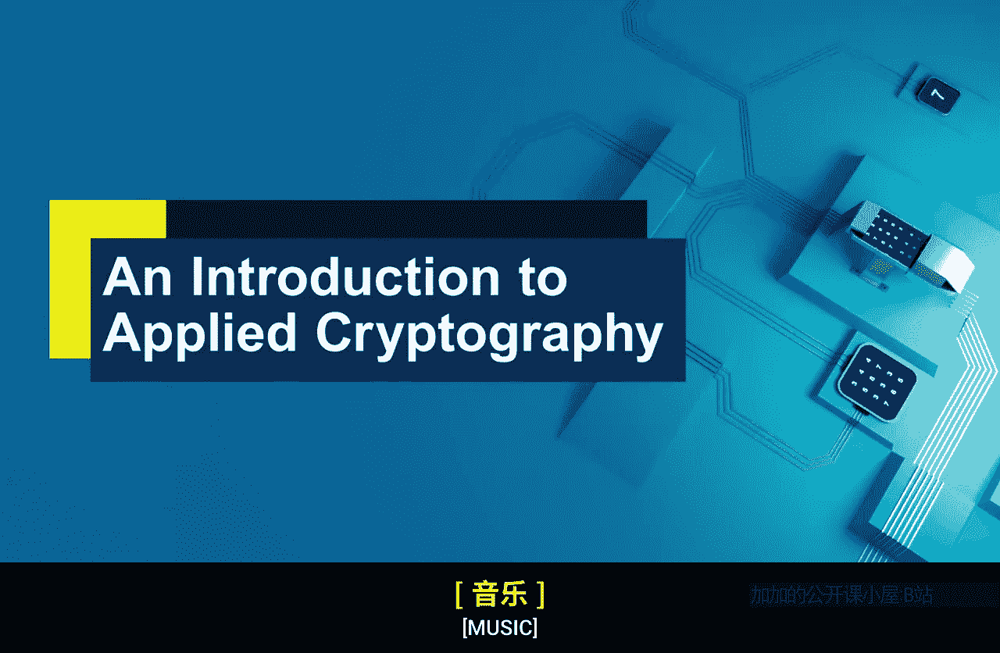

**应用密码学入门：P3：密码学导论**

在本节课中，我们将探讨密码学的本质、其核心目标以及它试图解决的根本问题。我们将密码学视为一个工具箱，并理解其提供的核心安全功能。

---

**密码学是一个工具箱**

我喜欢将密码学视为一个工具箱，因为它本质上就是如此。它是一个基于数学的工具集合，旨在提供特定的功能。

本周我们将探讨这个工具箱。但在讨论工具箱之前，必须首先思考这个工具箱要解决什么问题。我们试图解决的根本问题是什么？

因此，我们将从更宏观的层面开始，思考我们究竟为什么需要密码学。密码学的总体目的是什么？

---

**核心安全服务**

接下来，我们将更精确地审视我称之为“安全服务”的概念。这些是我们希望从密码学中获得的核心安全功能。

我们将解释这些服务是什么，并引入一些术语来描述密码学为实现这些功能所提供的工具。

总而言之，我们的思考路径是：我们试图解决什么问题？能否将这个问题分解为更精确的安全服务？然后，密码学提供了哪些工具来实现这些服务？

这些就是我们在第一周将要探讨的任务。

---

**总结**

本节课中，我们一起学习了密码学的基本定位——一个解决问题的工具箱。我们明确了学习路径：从理解密码学的宏观目的，到分解出具体的核心安全服务，最后认识实现这些服务的密码学工具。这是构建后续知识体系的基础框架。