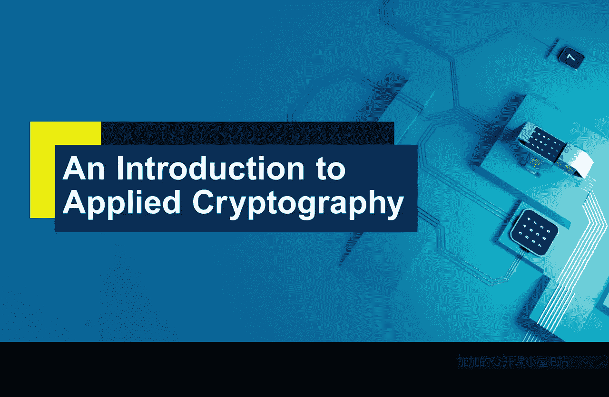
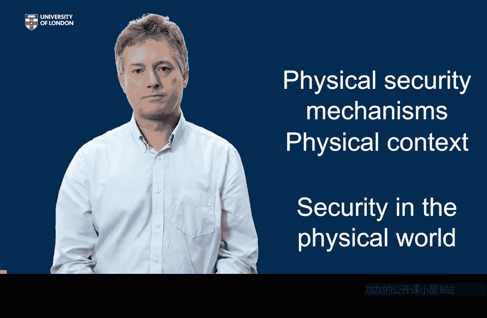

# 004：为什么需要密码学？🔐

在本节课中，我们将探讨为什么在数字世界中首先需要密码学。我们将从物理世界的信息安全机制入手，理解这些机制如何运作，以及为什么它们在数字环境中失效，从而引出对密码学的需求。

## 物理世界中的信息与安全

首先，让我们思考在没有计算机、电子邮件或平板的物理世界中，信息是如何存在的。信息主要呈现为两种形式：**口头语言**和**书面或实物记录**。

对于这些信息，安全意味着什么？首要想到的通常是**保密性**，即限制谁能访问特定信息。

*   **口头信息的保密**：我们可以通过**耳语**来实现，利用两个人的物理接近性来限制对话范围。同样，在实体房间开会时，我们**关上门**，确保只有室内的人能听到谈话。
*   **书面信息的保密**：我们有一系列技术，例如将信件放入**信封**，把文件锁进**文件柜**。这些都是利用物理世界的实体机制来保护书面信息。

## 确保信息的完整性

另一个重要的安全需求是确保信息自创建以来，没有以任何方式（无论是故意还是意外地）被**篡改**。物理世界也有多种技术来实现这一点。

以下是几种常见的物理完整性保护机制：
*   **信封密封**：将信放入信封主要是为了保密，但**信封的封口**本身就是一个属性，允许我们检测是否有人打开并可能更改了内容。古时候使用的**火漆封印**也出于类似原因。
*   **防伪特征**：以一张200欧元纸币为例。这张作为物理对象承载信息的纸币，布满了物理保护机制以防止伪造和篡改。它包含**水印**、**全息图**，中间有一条**深色条纹**（本身也是一种物理安全机制），甚至其**触感**也是为检测更改和伪造而设计的。
*   **手写签名**：我们在各种文件上签署自己的名字。这通常意味着签署者证明文件中的信息是正确且未被更改的。虽然实际情况可能并非总是如此，但我们经常在此背景下使用签名。

## 身份识别与授权

身份识别是另一项关键的安全服务。在物理世界中，我们可以通过**面容**或**声音**来识别熟人。但对于陌生人，我们需要其他代理方式。

例如，在办公室或酒店的前台，当有人出现时，你需要决定是否允许其进入。我们使用各种凭证作为判断依据：
*   要求出示**护照**
*   检查**驾驶执照**
*   甚至查验**欢迎信**

## 对物理情境的依赖

除了上述孤立的安全机制，我们在物理世界中还极大地依赖于**情境**。

设想一个场景：你被邀请去一个房间听一个陌生人的演讲。你在预定时间到达，一个陌生人走上讲台开始讲话。你如何知道这是正确的人？如何知道获得的信息是正确的？

简短的回答是：你并不知道。但我们依赖大量的情境线索：演讲者在正确的时间出现，设法进入了建筑，登上了讲台，听起来言之有理，其他所有人都似乎接受这是正常且有效的。我们可以想象灾难性的场景（比如真正的演讲者在来路上被绑架），但这在物理世界中极不可能发生。我们依赖的是在物理世界里，一个人在正确的时间、正确的地点出现并做正确事情的**实际困难**。我们依赖**物理情境**来做安全决策。

## 数字世界的挑战与密码学的角色

现在，让我们将目光转向数字世界，并反思我们刚刚讨论的所有内容。在数字世界中，上述的**物理情境完全消失了**。

最重要的是：
*   信息在数字世界可以**随时随地**到达任何人。
*   我们无法识别数字化的面容和声音。
*   我们无法物理地锁住信息。
*   **篡改**数字文档非常容易。
*   **复制**数字文档而不被察觉也非常容易。
*   通过互联网与世界各地的人建立联系很容易，但对方往往无法真正知道是谁在尝试联系。

正是数字世界中所有这些物理安全控制的**缺失**，需要被替代。而这正是**密码学**将要承担的任务。

## 总结

本节课我们一起学习了物理世界中保障信息安全的主要机制，包括保密性、完整性保护和身份识别。我们认识到，这些安全很大程度上依赖于**物理安全机制**和**物理情境**。😊 在数字世界中，这些条件不复存在，因此我们需要用**密码学**来替代它们，以构建数字信息的安全防线。