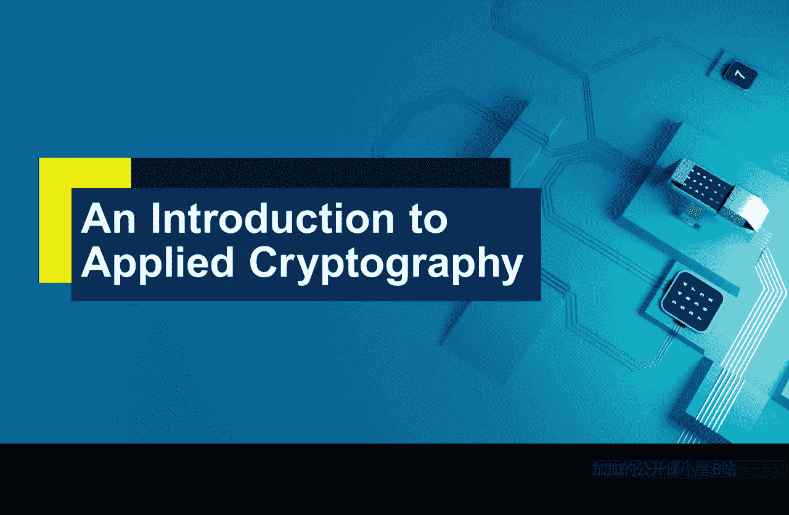

# 005：核心安全服务 🔐

在本节课中，我们将学习密码学如何作为一套工具集，为数字世界提供核心的安全服务。我们将探讨几种关键的安全服务及其对应的密码学机制。

在第一课中，我们了解到物理世界存在一系列物理安全机制，而我们需要在数字世界中找到它们的替代品。因此，在第二课中，我们将密码学视为一个工具包，其中的各种机制可以为数字世界提供不同类型的安全保障。接下来，我们将具体了解其中的一些工具。

在本课结束时，你将能够讨论使用密码学提供的一些核心安全服务，并能说出提供这些服务的几种密码学机制名称。

需要明确的是，密码学并非要一对一地完全取代物理世界中的安全机制，而是试图弥补数字世界中缺失的安全属性。我们首先要考虑的，也是最明显的信息属性，就是**保密性**。

## 保密性 (Confidentiality) 🔒

保密性是指确保只有指定的接收者才能获知信息内容的需求。在物理世界中，这通常通过物理隔离、上锁的箱子等方式实现。在数字世界中，我们称这种安全服务为**保密性**，即确保信息仅限于预期的参与者访问。

我们用于实现保密性的密码学机制是**加密**。提供加密的工具多种多样，包括流密码、分组密码和公钥加密等，它们都统称为加密技术。这是我们的第一个核心工具。

## 数据完整性 (Data Integrity) ✅

上一节我们介绍了保密性，本节中我们来看看一种不同但同样重要的安全服务：**数据完整性**。数据完整性是指确保数据在被人读取或依赖之前，未被意外或故意更改的保证。

以下是用于提供数据完整性的密码学工具，它们提供的完整性强度各不相同：
*   **哈希函数**：例如 `hash(data) = digest`，这类工具主要用于检测数据的**意外**更改。
*   **消息认证码**
*   **数字签名**

后两者可提供更强的数据完整性保障。如果我们想要更强的数据完整性，就需要使用更强的工具。

## 数据源认证与不可否认性 (Data Origin Authentication & Non-repudiation) ✍️

比数据完整性更强的属性是**数据源认证**（有时也称为消息认证）。数据源认证机制不仅能确保数据未被更改，还能提供关于数据发送者身份的某种保证。

比数据源认证更强的安全服务是**不可否认性**。不可否认性不仅保证数据未被更改且我们知道其来源，还能确保数据的发送者事后无法否认其发送行为。从某种意义上说，手写签名是它的一个类比物，我们可以在法庭上出示签有名字的合同来证明某人必须对文件负责。但手写签名存在一个弱点：合同可能在签署后被篡改。

这恰恰说明我们构建的密码学工具可以更强大。用于实现不可否认性的**数字签名**，也能保证数据未被以任何方式篡改，因为签名在不同文件上会完全不同。因此，数据完整性、数据源认证和不可否认性都是帮助我们检测信息是否被篡改的重要工具。

## 实体认证 (Entity Authentication) 👤

数字世界中我们可能经常需要的另一种安全服务，是另一种类型的认证。它认证的不是数据或消息，而是回答一个简单的问题：**“谁在那里？”**

例如，当你登录电脑或平板设备时，设备会立即询问“谁在使用此设备？你是谁？”。我们有一系列安全机制来实现这一点，包括密码、通行码、生物识别（如指纹）等。这些机制本身并非密码学固有的，但密码学可以用来实现它们。同时，密码学也提供了非常强大的身份验证方式。

例如，在在线银行中，人们经常使用**令牌**向银行证明自己的身份并向服务器传递信息，这本质上依赖于一种密码学技术。我们将此服务称为**实体认证**，因为你试图认证的是一个实体（人或物），这与之前讨论的消息认证不同。

## 总结 📚

本节课中我们一起学习了密码学作为一套不同机制的工具包，所提供的主要安全服务。我们探讨了**保密性**、**数据完整性**、**数据源认证**、**不可否认性**和**实体认证**。实际上，密码学提供的服务远不止这些，但这几项是最重要的核心服务。