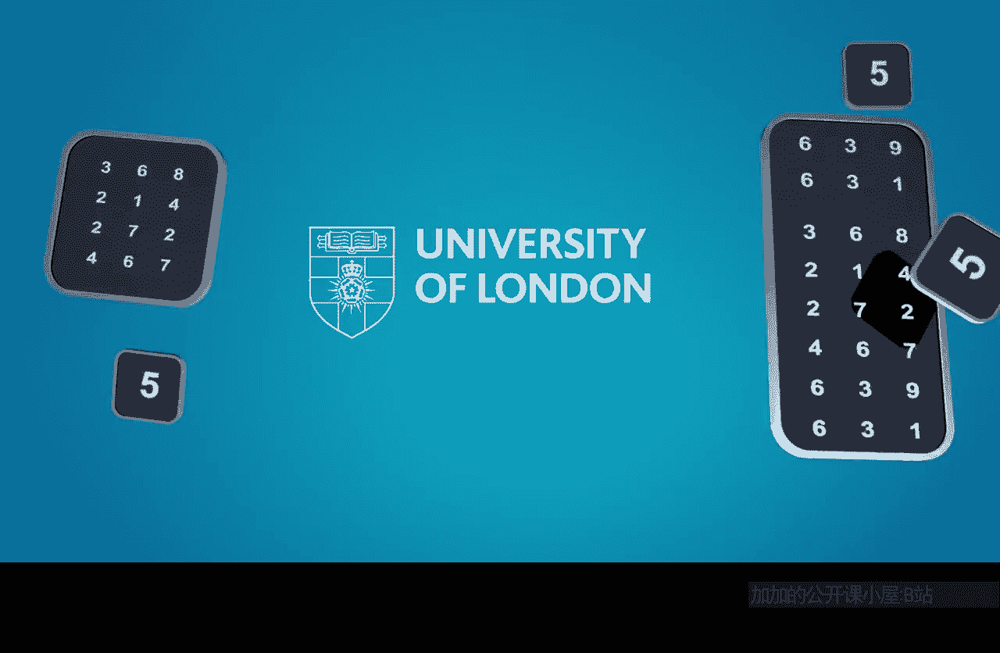

应用密码学入门：P6：第一周总结

在本节课中，我们将对第一周的学习内容进行总结，回顾密码学的基本目标、核心安全服务以及它们之间的关系。

我们已经讨论了为什么首先需要密码学，并且看到密码学实际上是以数字化的方式实现了一些我们可以在物理世界中联想到的安全服务。虽然并非完美对应，但思考物理世界的安全性是有帮助的，因为密码学中存在类比，它为数字安全提供了工具。

重要的是，我们介绍了一系列我们希望用密码学工具来实现的原子级安全服务。以下是这些核心服务：

*   **保密性**：这可能是你在学习本课程之前最了解的一项服务。
*   **数据完整性**
*   **数据源认证**
*   **不可否认性**
*   **实体认证**

这些是我们重点关注的几个主要服务。我们已经提到了可用于提供这些服务的密码学工具，并简要讨论了这些不同服务之间是如何相互关联的。

这里我想强调的最后一点是，密码学远比这些内容强大。密码学工具可以被设计用来完成许多更复杂的任务。但由于我们这是一个为期四周的入门课程，我们将坚持使用已经提到的这些服务，因为它们可能是最重要、最基础的。

在我们继续学习后续几周课程的过程中，这些将是我们会反复提及和思考的内容。

因此，我希望你现在对密码学工具可以用于什么目的有了一个相当清晰的认识。接下来我们要做的是，实际看看它的一些应用。