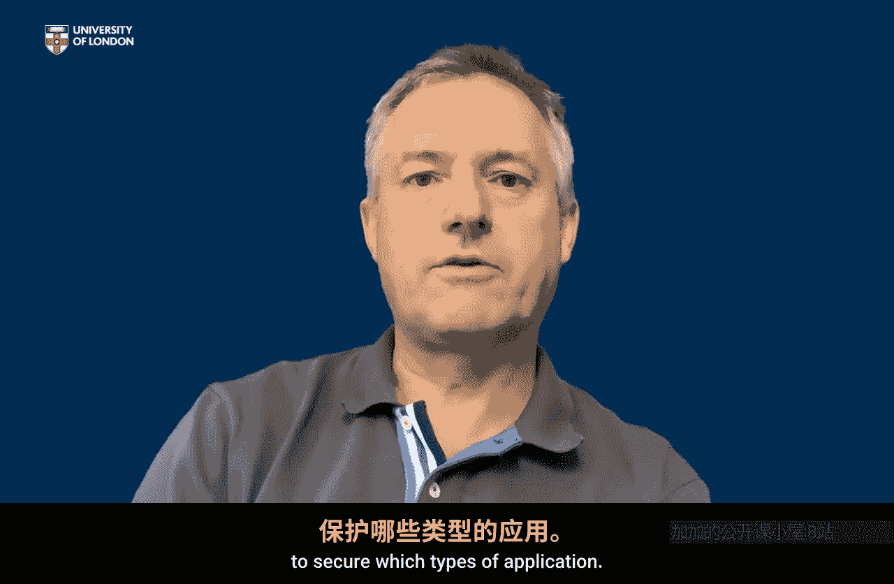

应用密码学入门：P7：密码学应用导论

在本节课中，我们将从理论工具转向实际应用。我们将探讨密码学如何支撑日常数字应用的安全，并学习如何分析一个应用的安全需求，从而确定需要哪些密码学工具。

第一周课程介绍了基础的密码学工具包。现在，我们需要理解这些工具如何应用于现实场景。密码学是保障日常数字应用安全的基础。

本周的主要任务是熟悉一些最常见的数字应用，并开始理解密码学如何支持它们。我们将聚焦于六个主要应用示例。我称它们为“六大应用”，并非因为它们比其他应用更重要，而是因为它们各有特点，能很好地展示需要数字安全的不同场景。

本周最重要的目标是，能够分析特定应用的性质，并决定它需要哪些安全服务才能变得安全。通过这个过程，我们将明确并指出保障其安全所需的密码学工具类型。

本周最后，我们将研究一个案例。这个案例来自我们的“六大应用”之一：移动通话保护。

因此，本周的目标是开始思考一个真实存在的数字应用，并根据那些驱动我们密码学工具包中工具的安全服务，来思考其具体的安全需求。这样，我们就能开始理解哪些类型的应用可能需要哪些密码学工具来保障安全。

本节课中，我们一起学习了从密码学工具到实际应用的过渡。我们明确了本周的目标是分析现实应用的安全需求，并对应到所需的密码学服务与工具，为后续深入具体应用案例打下基础。