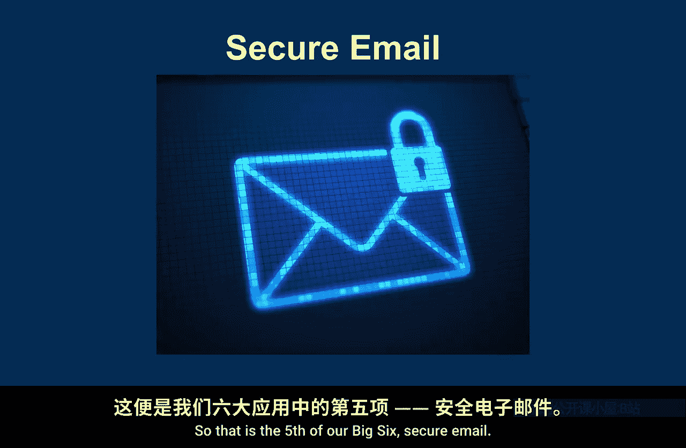

# 008：六大技术导论

在本节课中，我们将要学习密码学的六大核心应用场景。这些应用被选为“六大”，并非因为它们比其他应用更重要或更“大”，而是因为它们各自具有不同的特点和属性，能够从不同角度帮助我们理解密码学在现实世界中的运作方式。在后续的课程中，我们会反复提及这些案例，因此熟悉它们至关重要。

## 🛜 1. 无线网络

首先，我们来看看无线网络。这很可能是你此刻正在使用的密码学应用。无线网络，特别是家庭环境中的Wi-Fi，是我们第一个参考案例。尽管Wi-Fi也广泛应用于企业等环境，但我们将以家庭Wi-Fi作为基本参考。

无线网络中密码学的应用历史颇为曲折。最早的WEP标准在密码学设计上存在诸多问题。随着时间的推移，Wi-Fi的密码学安全性逐步提升，我们见证了WPA、WPA2以及最新的WPA3等标准的演进。因此，家庭Wi-Fi是我们“六大”应用中的第一个。

## 📱 2. 移动通信安全

接下来，我们探讨移动通信安全。这是一个极其重要的安全应用，因为它标志着密码学首次成为面向普通消费者的技术，真正走进了人们的口袋。

早期的手机功能单一，主要就是打电话，这也是我们安全关注的核心。虽然现代智能手机功能繁多，但我们将聚焦于保护移动通话本身所使用的密码学技术。这一领域同样由一系列标准所规范，从最早的GSM，发展到3G、4G LTE，再到如今的5G。尽管技术不断迭代，移动通话的基本安全需求变化不大，这是我们研究移动通信安全（“六大”之二）时需要思考的。

## 🔐 3. 传输层安全

第三大应用是传输层安全，简称TLS。这是我最喜欢的案例，因为它几乎涵盖了本课程想要讨论的所有要点。

TLS是一个互联网标准，你可能在进行安全浏览时最常接触到它。当你通过HTTPS连接将网页浏览器连接到互联网上的某个服务器时，浏览器中出现的“小锁”图标就表示你正在使用受密码学保护的TLS链接。需要明确的是，TLS不仅用于网页浏览，它还可以在各种场景下保护各种设备。但为了便于理解，每当提到TLS时，你可以将其想象成一个安全的网页浏览会话。TLS应用广泛、无处不在，并且能很好地阐释各种概念，这就是我喜爱它的原因。

## 🚗 4. 车辆进入系统

第四大应用，我称之为车辆进入系统。我脑海中浮现的是你按下手中一个小设备上的按钮，然后神奇地打开车门的场景。当然，这不仅仅是关于汽车和车门，这类应用也可以是房屋或其他任何需要简单访问控制的场景。但以车辆进入系统为例，是因为它很好地代表了一类密码学应用，其设计目标相当直接：**授予你对某物的访问权限**。

## 📧 5. 安全电子邮件

第五大应用是安全电子邮件。这里需要稍作说明，因为访问电子邮件的方式有多种，例如通过手机应用或网页邮件。如果你使用网页邮件，那么你实际上在使用我们第三大应用TLS。

当我提到“安全电子邮件”时，我设想的是运行在你电脑上的专用电子邮件客户端，其唯一职责就是处理你的邮件。市场上有各种产品，也存在一些相关标准，例如为电子邮件提供安全标准的S/MIME。值得注意的是，实现安全的方式有多种。有些客户端提供可选的安全功能，而在企业环境中，系统管理者可能会强制要求使用安全功能。因此，“安全电子邮件”指的是在电脑上运行的、提供安全功能的专用邮件处理应用。

## ₿ 6. 比特币

最后，也是最具趣味性的第六大应用：比特币。比特币对我们而言非常棒，因为它完全是一个密码学构造。**没有密码学，就没有比特币**，它完全建立在密码学之上。

比特币是加密货币的一个例子。如今市面上有数百甚至数千种加密货币，但比特币无疑是其中最著名、也是最早的一个。大多数其他加密货币都建立在比特币的基础上，或具有与比特币非常相似的属性。因此，我们以比特币为例。它是一个绝佳的案例，因为它完全由密码学驱动，这也是我们选择它作为“六大”应用之六的原因。

---

本节课中，我们一起学习了密码学的六大核心应用场景：**无线网络**、**移动通信安全**、**传输层安全**、**车辆进入系统**、**安全电子邮件**和**比特币**。这些案例各有特点，将在后续课程中帮助我们更具体地理解密码学的原理与实践。