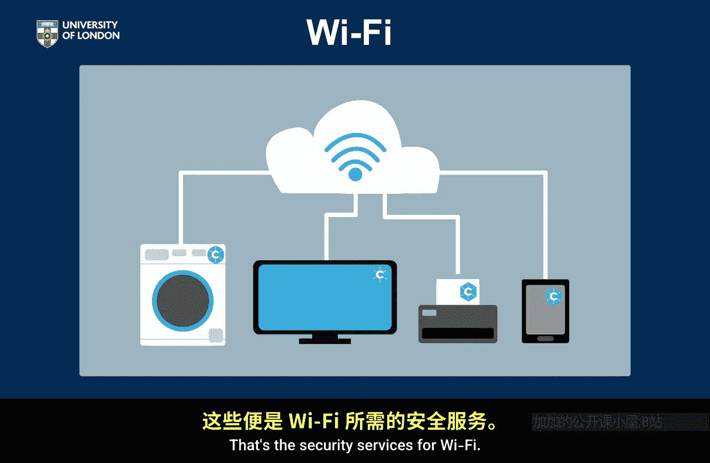

# 009：Wi-Fi安全服务分析

在本节课中，我们将学习如何为不同的应用场景分析其所需的安全服务。我们将以Wi-Fi为例，详细探讨它需要哪些密码学安全服务，并解释其背后的原因。通过这个例子，你将掌握分析其他应用所需安全服务的基本思路。

## 分析框架与背景

上一节我们介绍了主要的密码学安全服务。本节中，我们来看看如何将这些服务应用到具体的场景中。我们将以Wi-Fi作为第一个分析案例。

在深入分析Wi-Fi所需的安全服务之前，我们需要先理解为什么Wi-Fi需要密码学来保护。过去，计算机通过有线方式连接。Wi-Fi的出现使得连接无需物理线路即可进行。当我们思考Wi-Fi需要哪些安全服务时，应始终记住这个背景：**物理线路的安全保障已被移除**。

## Wi-Fi所需安全服务分析

以下是Wi-Fi连接所需安全服务的详细分析。

### 机密性

我们是否需要为通过Wi-Fi连接传输的流量提供机密性？答案是绝对肯定的，这是一项非常重要的安全服务。

*   **有线连接时代**：除非你窃听线路，否则无法访问信息。虽然可能，但操作困难。
*   **无线连接时代**：任何拥有扫描设备的人都可以轻松监听。

因此，**物理线路的安全被“虚无”所取代**，我们需要用密码学构建一条“虚拟线路”来恢复安全性。所以，机密性至关重要。

### 数据完整性与数据源认证

我们是否需要数据完整性？同样，在有线连接中篡改信息是可能的，但需要切入线路并插入流量，操作复杂。尽管如此，线路在很大程度上防止了这种攻击。一旦转为无线，篡改网络中传输的流量将变得非常容易，因此我们**绝对需要数据完整性**。

更进一步，我们是否需要数据源认证？我们是否要确保传输的流量确实来自Wi-Fi网络的另一端？是的，很可能需要。我们在Wi-Fi上交换大量数据。因此，我们不仅需要完整性，很可能还需要其更强版本——**数据源认证**。我们需要确信数据是从连接到网络的设备安全抵达的，并且从路由器发出的数据也未被篡改。

基于与机密性相同的理由：当我们拥有物理线路时，我们具备该属性；当我们移除线路时，我们可能失去该属性。所以，是的，我们确实需要数据源认证。

### 不可否认性

那么更强的不可否认性呢？如何思考这一点？以家庭Wi-Fi为例，你的笔记本电脑或手机与路由器之间，是否可能就谁发送了什么信息发生争议？在这种环境下，我认为这不太可能。似乎不太可能出现关于谁在何时、何地、如何发送了什么的重大争论。因此，**不可否认性似乎有些过度**，我认为期望Wi-Fi提供不可否认性是不合理的。

请注意，这并不是说在通过Wi-Fi网络交换数据时，你永远不需要不可否认性。我们的观点是，如果你需要它，**那应该由应用层中更高层级的某个应用来提供**。例如，如果你通过Wi-Fi交换一份需要签名的合同，那么合同本身应该被数字签名，但这不应由Wi-Fi协议本身来提供。所以，Wi-Fi本身不需要不可否认性，这要求过强。

### 实体认证

现在记住，实体认证是回答“对方是谁”这个问题。那么，控制谁可以访问你的Wi-Fi网络重要吗？绝对重要。我们需要规则来确保你的Wi-Fi只被授权的设备或人员访问。因此，我们**绝对需要对连接到Wi-Fi的设备进行认证**。

我们是否需要确认自己正在与正确的路由器基站通信？是的，绝对需要。这里有趣的是，当Wi-Fi刚出现时，人们并不认为这是必要的，因此最初只提供了对连接设备的认证。但在Wi-Fi发布和使用后，出现了各种攻击，正是因为路由器端没有被认证。因此，涉及实体认证时的一个良好通用实践是：**默认对通信双方进行认证**。在某些特定环境下或许有理由不需要，但Wi-Fi给人们的教训是，这是必要的。所以实际上，我们需要**双向实体认证**：设备应认证它正在连接正确的网络，网络也应认证正在连接它的设备。

## 总结

本节课中，我们一起学习了如何为Wi-Fi应用分析其所需的密码学安全服务。我们得出以下结论：

*   **机密性**：绝对需要。
*   **数据完整性**：需要，且实际上需要更强的**数据源认证**。
*   **不可否认性**：要求过强，并非Wi-Fi协议本身所需。
*   **实体认证**：绝对需要，且应是**双向认证**。

通过这个案例分析，希望你掌握了分析其他应用（如电子邮件、网上银行等）所需安全服务的基本方法。核心在于思考：在该应用场景下，失去了物理世界的哪些安全保障？需要用密码学来弥补哪些风险？