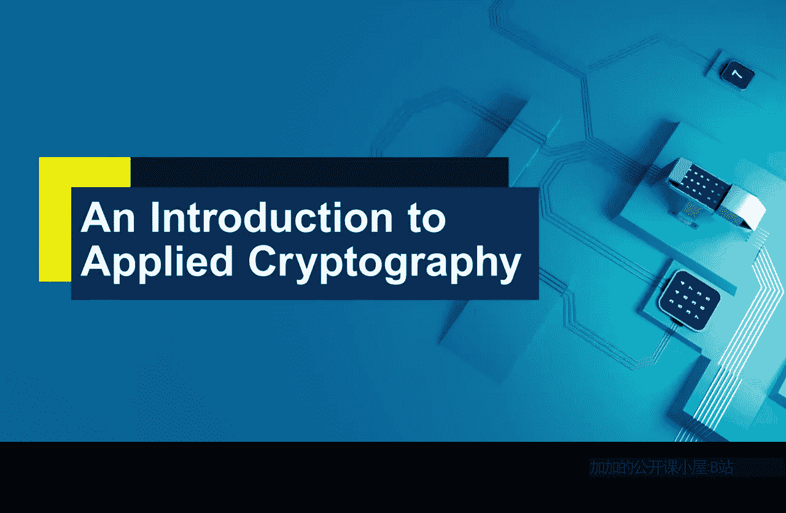
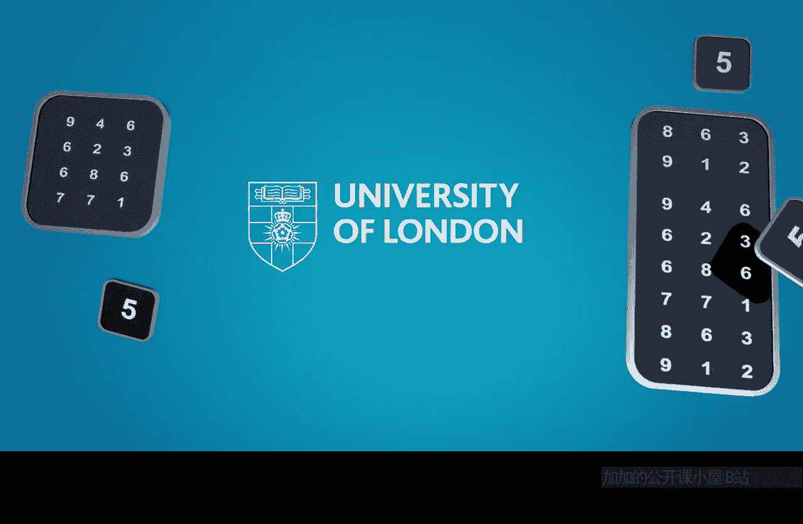

应用密码学入门：P11：密码系统导论

在本节课中，我们将学习密码系统的基本概念。我们将介绍一个密码系统的抽象模型，以阐明算法和密钥在密码学中扮演的根本不同角色，并区分对称密码学与非对称（公钥）密码学这两种基本类型。理解这些核心概念是后续学习如何在实际系统中应用密码学的基础。

---

### 密码系统抽象模型

上一节我们明确了本周的学习目标，本节中我们来看看用于理解密码系统的核心抽象模型。

密码学依赖于算法和密钥。算法，如高级加密标准（AES），是公开的、标准化的计算过程。密钥则是保密的参数，是密码学安全性的最终依赖。通过一个抽象模型，我们可以清晰地分离算法和密钥的不同作用。

一个基本的密码系统模型包含以下核心组件：
*   **加密算法 (E)**：一个公开的、确定性的函数，用于将明文转换为密文。
*   **解密算法 (D)**：一个公开的、确定性的函数，用于将密文恢复为明文。
*   **密钥 (K)**：一个秘密的输入值，决定了加密和解密的具体变换。

其工作流程可以概括为：使用密钥 `K` 和加密算法 `E` 对明文 `M` 进行加密，得到密文 `C = E(K, M)`。接收方使用相同的密钥 `K`（在对称密码中）或对应的密钥和解密算法 `D` 对密文进行解密，恢复明文 `M = D(K, C)`。

这个模型的关键在于：**安全性应完全依赖于密钥的保密性，而不依赖于算法本身的保密**。算法可以且应当公开，并接受广泛审查以验证其强度。

---

### 密码学的两种基本类型

基于上述模型，特别是密钥的使用方式，密码学可以分为两种根本不同的类型。

以下是两种主要密码学类型的对比：

1.  **对称密码学**
    *   **核心特征**：加密和解密使用**同一个密钥**或可简单相互推导的密钥。
    *   **密钥管理**：通信双方必须预先通过安全渠道共享同一秘密密钥。密钥管理（生成、分发、存储、更新、销毁）的复杂度和成本随参与者数量增加而显著上升。
    *   **典型算法**：AES, DES, ChaCha20。

2.  **非对称密码学（公钥密码学）**
    *   **核心特征**：使用一对数学上关联的密钥：**公钥**和**私钥**。公钥可以公开，私钥必须保密。
    *   **密钥管理**：无需预先共享秘密。任何人可用接收方的公钥加密信息，但只有拥有对应私钥的接收方能解密。这简化了密钥分发，但计算通常比对称密码更复杂。
    *   **典型算法**：RSA, ECC (用于加密或数字签名)。

---

### 两种密码学的比较与结合应用

理解了对称与非对称密码学的区别后，我们来看看它们各自的含义以及如何协同工作。

使用对称密码学意味着需要建立一个安全的基础设施来管理大量秘密密钥。而使用非对称密码学，则主要需要管理好自己的私钥，并能够可靠地获取他人的公钥（例如通过证书）。

在实际应用中，这两种密码学通常结合使用，以发挥各自优势。一个常见的模式是：
1.  使用**非对称密码学**（如RSA）安全地协商或传输一个临时的**会话密钥**。
2.  随后，使用这个会话密钥和**对称密码学**（如AES）来加密实际传输的大量数据。

这种混合系统既利用了非对称密码学在密钥分发上的便利性，又获得了对称密码学在高速度、高效率处理数据方面的优势。

---

本节课中，我们一起学习了密码系统的抽象模型，明确了算法公开、密钥保密的核心原则。我们区分了对称密码学与非对称密码学的根本不同，并分析了它们在密钥管理上的不同含义。最后，我们了解到在实际系统中，二者常协同工作，结合彼此长处以构建既安全又高效的密码学解决方案。