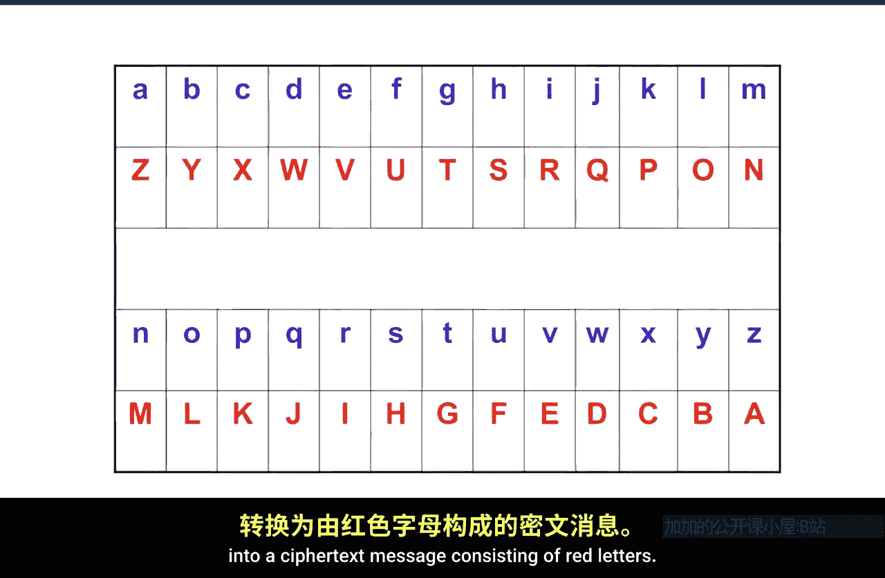
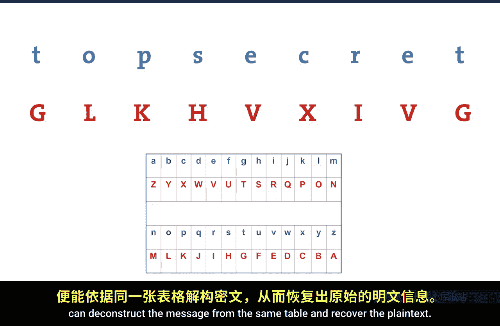
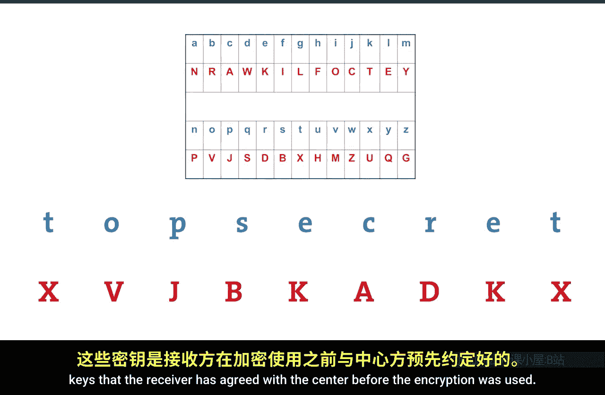

# 012：算法与密钥 🔐

在本节课中，我们将聚焦于密码学提供的核心安全服务之一：**机密性**，并深入探讨实现机密性的关键安全机制——**加密**。我们将重点分析**密码算法**与**密码密钥**之间的根本区别。

在第二课中，我们了解到密码学本质上是一个为数字信息提供各类安全服务的工具箱。本节中，我们将具体探讨加密机制。

---

## 基本术语与模型

为了更好地理解加密，我们可以借助一个物理安全的类比：将写在纸上的信息放入一个盒子，并用钥匙锁上。这个类比有助于我们理解接下来的概念。

现在，让我们定义一些基本术语：
*   **明文**：代表我们试图保护的原始信息。
*   **密文**：明文经过转换后，变得不可读、无意义的形式。
*   **攻击者**：我们允许其观察在通信信道中传输的密文，并希望他们无法从中获知任何关于明文的信息。
*   **接收者**：我们希望其能够从密文中恢复出明文。

将明文转换为密文的过程，依赖于**加密算法**。算法本质上是一个“配方”，即一系列指示如何打乱明文的指令。相应地，**解密算法**则允许接收者解构密文并恢复明文。

---

## 一个简单的例子：Atbash 密码

通过一个非常简单的例子可以最好地理解这个过程，这个例子叫做 **Atbash 密码**。

Atbash 密码由一个查找表表示，表的上方是蓝色字母，下方是红色字母。加密算法非常简单：查找表格，将蓝色字母替换为对应的红色字母。解密算法则是其逆过程。

以下是一个示例：
*   **明文**：`TOP SECRET`
*   **加密过程**：根据 Atbash 表（A↔Z, B↔Y, C↔X...）进行替换。
*   **密文**：`GLK HVX IVG`

接收者知道使用的是 Atbash 密码，就可以通过同一张表解密密文，恢复出明文 `TOP SECRET`。

---

## 算法的局限性：引入密钥

那么，使用 Atbash 密码真的能实现机密性吗？答案是否定的，原因有很多。最根本的一点是：在现代技术中使用密码学，公开安全机制的工作原理至关重要。如果我们告诉别人我们使用的是 Atbash 密码，就等于完全揭示了数据是如何被打乱的（因为 A 总是替换为 Z，B 总是替换为 Y，等等）。任何知道我们使用 Atbash 密码的人都能立即恢复消息。

因此，我们需要更巧妙的方法。回顾加密模型，我们需要引入一个可以随时间变化的元素，这就是**密钥**的作用。

现在，将明文转换为密文时，我们不仅需要将明文输入**加密算法**（配方），还需要输入一个**加密密钥**。产生的密文不仅取决于算法，还取决于所使用的密钥。同样，接收者需要**解密算法**和**解密密钥**来恢复明文。密钥就是那个随时间变化的元素。

---

## 带密钥的加密示例：简单替换密码

再次通过一个例子来理解。我们仍然使用查找表作为加密算法，但这次，下方的字母可以以任意多种不同的方式排列。发送者和接收者必须事先约定好编码方式（即密钥）。算法仍然是“取上方的字母，替换为下方的字母”，但具体替换成哪个字母，则由**密钥**决定，而密钥对观察密文的攻击者是未知的。

以下是两个不同密钥的示例：

**密钥示例 1**：
*   替换规则：A→D, B→I, C→Q, ...
*   明文 `TOP SECRET` 对应的密文为：`PRJ WTQ UTP`

**密钥示例 2**：
*   替换规则：A→N, B→R, C→A, ...
*   明文 `TOP SECRET` 对应的密文为：`XVJ BKA DKX`

可以看到，现在有许多不同的方式将明文替换为密文，这都依赖于不同的密钥。这种加密方式有时被称为**简单替换密码**。对于消息 `TOP SECRET`，可能的加密方式数量极其庞大，远超宇宙中的恒星数量。因此，攻击者几乎不可能通过随机尝试猜中正确的密钥。

（当然，简单替换密码本身存在许多根本性缺陷，我们在此不讨论。重要的是理解，像**高级加密标准**这样的现代加密算法，虽然也是按照特定“配方”打乱数据，但更为复杂，且没有这些缺陷，它同样需要密钥输入。）

---

## 两种主要的密码学类型

加密算法（配方）和密钥是任何加密过程的两个关键特征。由此，衍生出两种截然不同的加密系统类型。

回想一下将信息锁在盒子里的类比，这有助于我们思考日常物理世界中的两种锁具机制：
1.  一种锁需要用同一把钥匙来上锁和开锁。
2.  另一种锁，比如挂锁，任何人都可以合上锁扣将其锁住，但只有持有钥匙的人才能打开它。

如果将“开锁”视为“解密”，这告诉我们：在任何加密机制中，**解密密钥必须是秘密的**，只能由预期的信息接收者持有；但**上锁密钥（加密密钥）不一定必须是秘密的**。

这就定义了两类密码学：

1.  **对称加密** 🔑
    *   加密密钥和解密密钥是**相同的**。
    *   因此，这个密钥必须作为秘密妥善保管。
    *   公式表示：`Decrypt(Encrypt(明文, 密钥), 密钥) = 明文`

2.  **公钥密码学**（非对称加密） 🗝️
    *   加密密钥可以是**公开的信息**，任何人都可以用它来加密。
    *   只有解密密钥需要作为秘密持有。
    *   这类似于挂锁的类比。
    *   我们将在后续课程中探讨其重要性。

---

## 总结

本节课我们一起学习了：
*   **加密算法**是打乱数据的“配方”或方法。
*   **密钥**扮演着关键角色，因为它允许数据以多种不同的方式被打乱（其可能的方式数量远超宇宙中的恒星）。
*   存在**两种主要类型的密码学**：
    *   在**对称密码学**中，加密和解密使用相同的密钥，该密钥必须保密。
    *   在**公钥密码学**中，加密密钥可以公开，只有解密密钥需要保密。

理解算法与密钥之间的区别，是掌握现代加密技术如何工作的基础。