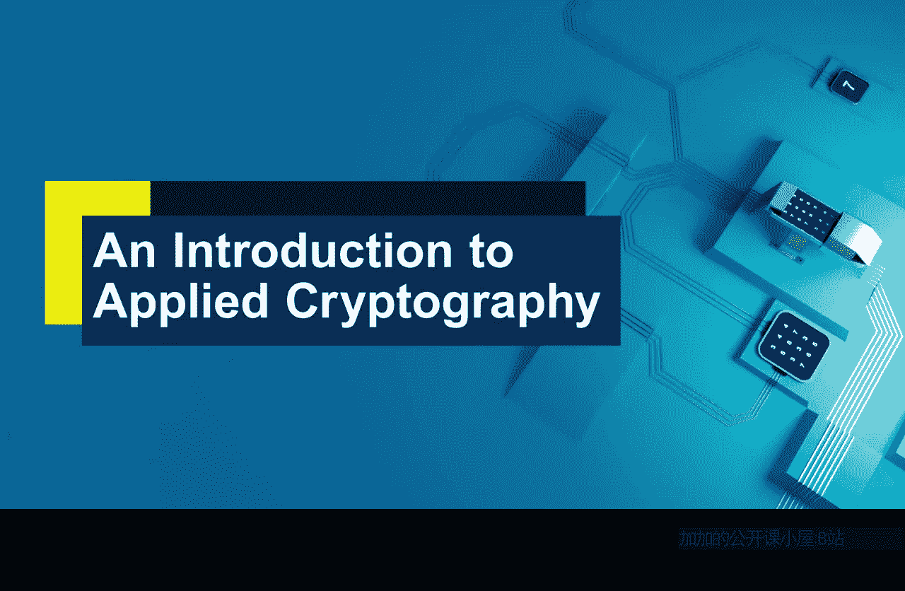

# 014：第三周总结

在本节课中，我们将对第三周关于密码系统的学习内容进行总结。我们将回顾两个核心概念：算法与密钥的区别，以及对称密码学与非对称密码学的差异。

---

上一节我们探讨了密码系统的不同组成部分，本节中我们来看看本周学习的两个核心要点。

第一个要点是理解**算法**与**密钥**在密码系统中扮演的**截然不同**的角色。算法是公开的、标准化的处理过程，而密钥是保密的、用于控制算法输出的参数。它们的关系可以用一个简单的公式表示：

**密文 = 算法(明文， 密钥)**

算法和密钥是密码系统中两个根本不同的部分。认识到它们扮演的不同角色至关重要。下周当我们审视密码系统的弱点时，我们将能更仔细地思考算法安全性与密钥安全性所起的不同作用。就本周而言，请先理解算法和密钥各自角色的差异。

---

理解了算法与密钥的分离后，我们自然过渡到第二个要点：密码学本身的两大基本类型。

第二个要点是认识到密码学存在两种根本不同的类型：**对称密码学**和**非对称密码学**（或称公钥密码学）。理解这两者之间的差异及其影响非常重要，同时也要了解它们在实际系统中经常如何结合使用。

以下是这两种密码学的主要区别：

*   **对称密码学**：加密和解密使用**同一个密钥**。其核心挑战在于如何在通信双方之间安全地共享这个密钥。
*   **非对称密码学**：使用一对密钥：一个**公钥**（公开）和一个**私钥**（保密）。用公钥加密的数据只能用对应的私钥解密，反之亦然。

对称密码学与非对称密码学的划分，是区分大量密码学工具的有效方式。但也有观点认为，在理想情况下，所有加密都应使用对称方式。我们看到对称密码学实际上速度更快。如果不是因为对称密码学在密钥管理方面存在些许不便（即需要安排密钥分发的挑战），可以说这是我们唯一需要的密码学类型。

这正是公钥密码学强大而美妙的特性发挥作用的地方。它允许我们应对对称密码学带来的密钥管理挑战。通过将两者结合使用，我们可以利用公钥密码学来解决在网络不同位置安全协商密钥的问题，然后使用对称密码学进行大量的数据加密。我们已经看到了这样的例子。

因此，重要的是看到对称与非对称密码学的区别，理解在理想世界中我们倾向于全部使用对称加密，但现实世界并非如此。我们可以看到公钥密码学如何帮助对称密码学在原本可能难以实施的环境中发挥作用。

---

本节课中我们一起学习了第三周关于密码系统调查的两个重要收获：
1.  **算法与密钥**在密码系统中扮演着根本不同的角色。
2.  密码学分为**对称密码学**和**公钥密码学**两大基本类型，它们各有优劣，在实践中常协同工作以发挥最大效能。