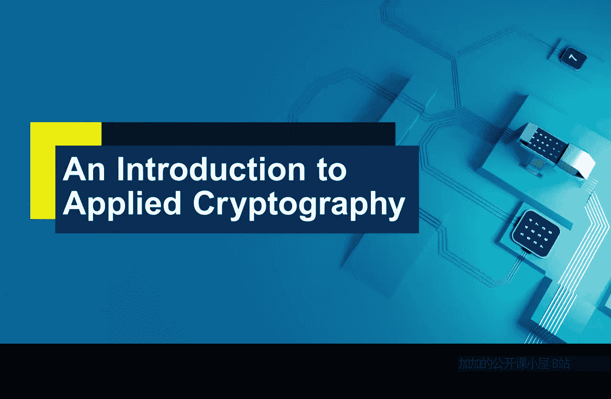

# 016：薄弱环节 🔓

在本节课中，我们将探讨密码系统可能被攻破的方式。这看似是一个奇怪的话题，但有时理解事物如何失效，是理解其如何工作的最佳途径。课程结束时，你将能够认识到密码算法只是整个密码系统的一个组成部分，并能够识别密码系统中潜在的脆弱点。

## 什么是密码系统？🔐

上一节我们介绍了算法和密钥。但在现实世界中，算法不会孤立存在。密码算法只是其被实现的更广泛系统的一部分。

我们可以将密码系统视为由以下部分组成：
*   **算法本身**。
*   **实现方式**：算法被嵌入到我们希望使用该密码系统的技术中的具体方式。
*   **密钥管理**：密钥在密码学中扮演着极其重要的角色，必须妥善保管并集成到系统中。因此，密钥管理是密码系统的关键部分。

## 攻破密码系统的两种途径 🛡️

以下是攻击者可能攻破一个广义上密码系统的两种主要方式：

1.  **获取解密密钥**：如果能做到这一点，所有使用匹配加密密钥产生的密文都将可被恢复。
2.  **无需解密密钥而获取明文**：如果发生以上任何一种情况，我们都认为该密码系统已被攻破。

## 算法本身：穷举密钥搜索 🔑

让我们从密码系统的第一个组成部分——算法本身开始。一个令人惊讶的事实是：**算法总是可以被攻破的**。这是如何做到的呢？

假设攻击者截获了一段经过加密的密文。他们知道用于产生密文的算法（这通常是公开的）。那么，他们总可以选择尝试每一个可能的解密密钥。取第一个密钥尝试解密，看结果是否有意义；再取第二个密钥，如此继续。这个过程被称为**穷举密钥搜索**。

**公式表示**：`尝试所有 k ∈ K（密钥空间），直到找到正确的密钥使得 D(k, C) = P（明文）`。

我们刚刚看到，任何加密算法都可以通过这种穷举密钥搜索来攻破。那么如何阻止这种情况发生呢？答案很简单：**确保存在数量极其庞大的解密密钥，使得这种搜索对任何人来说都是浪费时间**。这正是现代技术中使用的任何加密算法所采取的策略。可能的密钥数量如此之多，以至于在现代计算机上搜索所有密钥并偶然找到正确的一个是完全不现实的。因此，在现代密码学中，我们实际上不必担心穷举密钥搜索，我们会确保它在实践中无法进行。

## 算法强度与实现漏洞 💻

如果我们考虑真实商业产品中使用的加密算法，例如高级加密标准，可以合理地假设算法本身没有弱点。这是因为大多数现代加密算法都经过专家研究、提交给标准化机构审查，许多人分析过它们，并未发现弱点。这并不意味着弱点不存在，但专家普遍相信没有弱点。因此，可以合理地认为，在现代技术中通常使用的是良好的加密算法，并且密钥数量庞大，通过攻击算法本身来攻破密码系统是不现实的。

然而，请记住，我们攻击的是一个**密码系统**，而系统存在其他薄弱点。其中之一就是**实现**。强大的算法必须被部署到真实的技术中。在实现过程中，很多事情可能出错：可能有人未遵循规范，系统可能未按预期工作，或者集成效果不如预期。

此外，还存在一些针对现代加密算法的精妙实现攻击，例如分析设备执行加密时的功耗、分析加密执行的时间，看看这些数据本身是否能让你了解到当时正在操作的明文和密钥信息。这些攻击确实存在，被称为**旁路攻击**。

## 密钥管理：常见的薄弱环节 🗝️

或许密码系统中更直接的分析部分是**密钥管理**。这是任何密码系统中最薄弱的环节之一，因为加密密钥和解密密钥必须在系统内分发，并在系统运行期间得到妥善保管。

以下是密钥管理的关键阶段，每个阶段都可能成为弱点：
*   **生成**：密钥必须被创建。
*   **分发**：密钥必须在网络中需要的地方被安全地建立。
*   **存储**：密钥必须在设备上安全存储。
*   **销毁**：当密钥生命周期结束时，必须被安全销毁。
*   **更新**：有时密钥需要被更换。

理论上，如果以上任何一个阶段被利用，密码系统就可能变得脆弱。

## 端点安全：易被忽视的环节 🖥️

密码系统还有一个非常脆弱的部分，它有些显而易见，但常被许多人忽视，那就是**端点**。

以在线购物为例。你想要保护的明文（通常是银行卡信息）在互联网上传输时通常会被加密，并到达在线商店后被解密。但问题是：银行卡信息在两端发生了什么？你的银行卡信息存放在哪里？你是否将其保存在电脑的文件中？是否可能被旁边的人看到？在线商店解密后如何处理这些信息？有时我们并不知道。

重要的是要认识到，**明文在加密前和解密后存在的这两个端点，是密码系统中我们必须关注的脆弱点**。

## 总结 📝

本节课中，我们一起学习了密码系统的薄弱环节。

是的，加密算法是密码系统至关重要的组成部分，但在许多方面，它们反而是密码系统中最不可能出现脆弱性的部分。我们最可能发现弱点的常见地方在于：
*   **实现过程**。
*   **密钥的管理**。
*   **数据在未加密状态（即明文）于系统端点处的管理**。

理解这些薄弱环节，有助于我们在设计和评估安全系统时，将注意力放在最需要加固的地方。