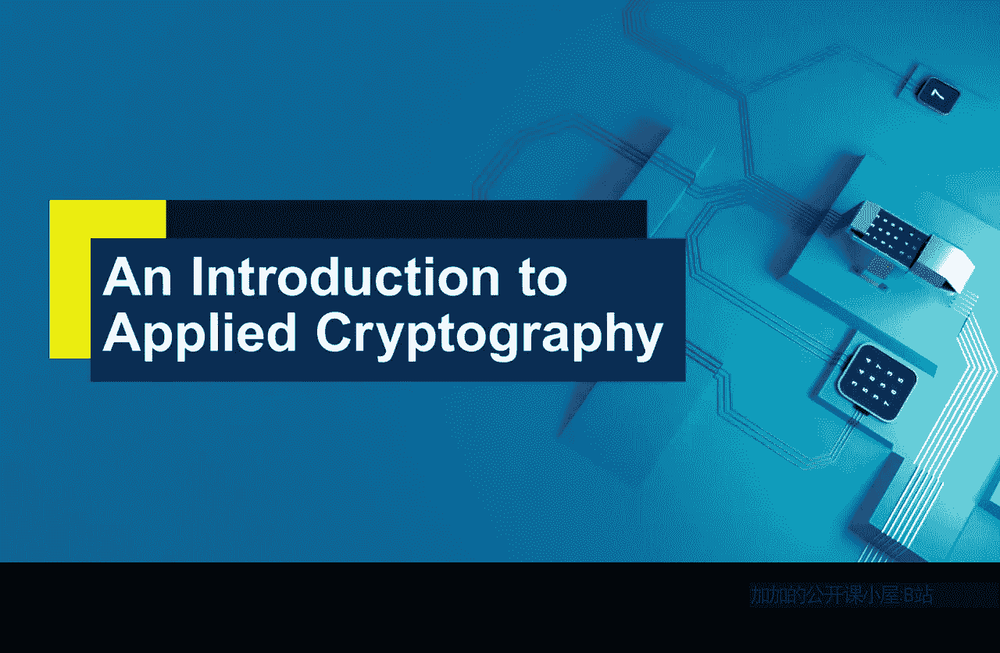
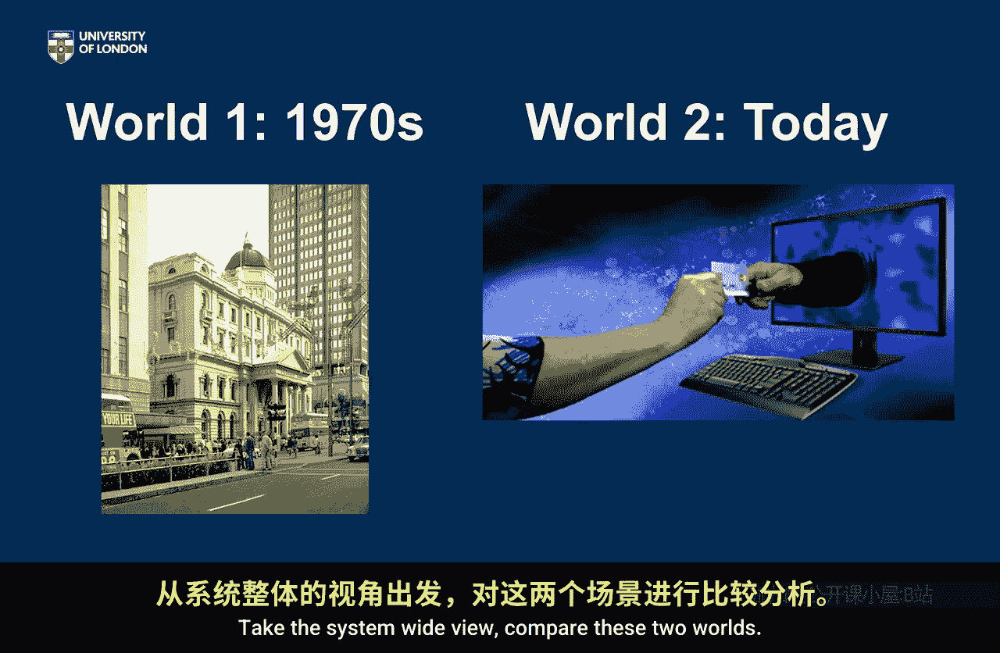

# 017：两个世界 🌍

在本节课中，我们将学习如何从**系统层面**思考密码学的实际安全性。我们将通过比较两个不同时代（1970年代与当今）的金融交易场景，来分析密码系统在整体信息流中的角色、潜在弱点以及安全性差异。

---

我们介绍了**密码系统**这个概念。这是一种思考任何使用密码学事物实际安全性的有效方式。这不仅仅是关于处于核心的密码算法，还包括围绕它的整个系统：其实现方式、密钥管理方式以及与之交互的人员。因此，我们鼓励大家始终通过**系统性**地思考整个系统包，来判断密码学是否发挥了作用。

为了完善我们对密码系统及其弱点的探索，我们想与大家进行一次思维练习。这个练习可能有些人为设计的成分，但它是建设性的。我们将要求大家思考两个截然不同的世界，它们被时间分隔，并思考在这两个世界中运行的密码系统的安全性。

我们将比较它们。这之所以是一个人为的练习，是因为比较的方式有很多，需要考虑的因素也很多。但它仍然有用，因为它能引导你进入**系统性思考**的思维模式。

接下来，我将向大家介绍这两个世界。然后简单地提问：总体而言，你认为这两个世界的安全性如何比较？在哪些方面一个世界更安全？在哪些方面另一个世界更安全？这取决于很多因素。让我们就此展开广泛的讨论。

---

首先，我们需要思考这两个世界。我现在就向大家介绍。

**世界一**设定在1970年代。我不知道你是否在那个年代，很可能没有。我在，尽管我对1970年代记忆不多，而且据我所知，我当时肯定没有使用密码学。事实上，那时使用密码学的人不多。那么，1970年代谁在使用密码学呢？一个群体是银行或类似银行的机构。银行在1970年代确实开始商业性地使用密码学，当然只是选择性地使用。

让我们想象一个场景：一笔高端交易，比如，由纽约的一位银行经理授权，并发送给伦敦的一位银行经理。显然，这很可能是一笔需要密码学参与的高端交易。

我希望你思考整个信息流：从纽约的银行经理构思发送这笔交易开始，到关于这笔交易的信息进入伦敦银行经理的脑海为止。从纽约的银行经理构思发送交易这个想法的**那一刻起**，思考这些信息去了哪里，谁可能知道它。想象一下，在哪个环节**加密**开始发挥作用以保护它，在哪个环节加密停止保护它。思考信息在传递到伦敦银行经理过程中的整个旅程。

思考整个过程中的安全性。你可能需要考虑：在这段旅程的不同部分使用了哪些通信渠道？密码学可能在哪个环节发挥作用？密码学是如何应用的？信息在未加密时位于何处？信息在解密后又位于何处？退一步审视所有这些，然后思考：这个世界有多安全？

我认为我们需要接受一个前提：或许密码学在当时并非被常规使用。所以我选择了一笔高端交易，你可以把它看作一条特殊消息。但总体上思考：在何种情况下，谁可能接触到这些信息？你认为这整个信息流——从纽约银行经理的脑海到伦敦银行经理的脑海——有多安全？这就是你的**世界一**场景。

**世界二**就是今天。让我们选取一个我们熟悉的场景。这是我们TLS的图示，这正是我希望你思考的：一次金融交易。这次可能是你通过TLS或互联网向你的银行发送一笔交易。

进行同样的过程：思考从你决定“我要向我的银行转一些钱”这个想法进入你脑海的那一刻起，这些信息去了哪里？在整个过程中，哪些方可能接触到这些信息？信息通过哪些渠道传输？信息在哪个环节被加密？在哪个环节被解密？解密后信息去了哪里？同样，哪些方参与了整个过程？

再次进行同样的练习，但设定在当今：你与欧洲银行进行一笔在线交易。我试图让你思考信息从进入一个人脑海开始，直到抵达（在这个案例中，可能不是某人的脑海，而更可能是一个后端银行系统）的整个流程。尽管如此，试着想象信息的流向、不安全点可能在哪里，以及密码学在保护信息中扮演了什么角色。

这里有很多需要思考的地方。然后，我希望你在为这两个世界完成思考后，退一步考虑：在哪些方面，一个世界比另一个世界更安全或更不安全？ broadly speaking， 世界一是一个应用密码学更安全、更严密的世界吗？还是世界二是一个应用密码学更安全、更严密的世界？

我认为，让我们把算法因素排除在外。你可以假设在世界一中，他们使用了适合当时时代的加密算法和密钥长度。同样，假设你的TLS设置是适合当今时代的，使用了良好的算法和密钥长度。所以，让我们排除算法和密钥长度因素，更多地从**系统层面**思考：信息在哪里？漏洞在哪里？这两个世界以何种方式进行比较？

我并不一定期望你得出的结论是世界二比世界一更安全，或者世界一比世界二更安全。如果你有支持其中一方的论据，完全可以提出来。但你可能想要一个更细致的论点：在这些方面世界一似乎更安全，但在那些方面世界二似乎更安全。如果你有强烈的倾向性观点，我认为完全没问题，请阐述你的论点。这就是本次练习的内容，希望已经表述清楚。采取**系统全局视角**。

---

比较这两个世界。

---

本节课中，我们一起学习了如何超越密码算法本身，从**系统层面**评估密码学的实际安全性。我们通过对比1970年代与当今两个金融交易场景，分析了信息在整个生命周期中的流向、加密解密的节点、潜在的脆弱点以及参与方的差异。这个练习的核心在于理解，**密码系统的安全性不仅取决于强大的算法，还高度依赖于其实现、部署、密钥管理和使用环境等系统性因素**。通过这种系统性思考，我们能够更全面地评估和构建安全的密码应用。