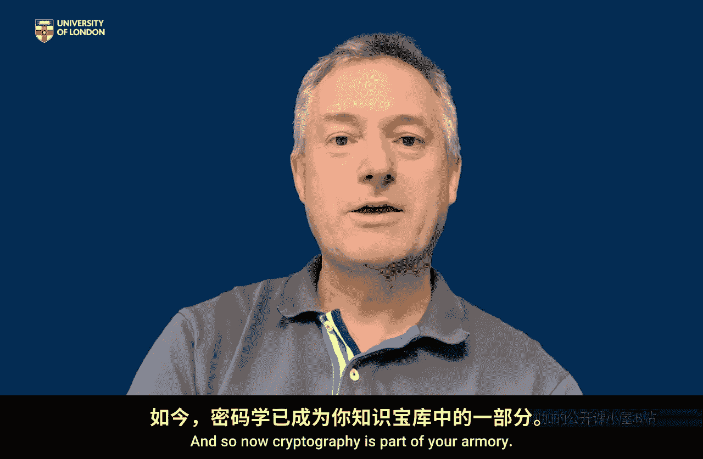

# 019：课程总结

在本节课中，我们将对为期四周的《应用密码学入门》课程进行总结，回顾核心概念，并探讨如何进一步深入学习。

## 课程回顾与收获

恭喜你完成了《应用密码学入门》课程。坚持完成这四周的学习是一项了不起的成就。

假设你全程投入并跟上了课程进度，那么你现在应该对密码学的作用非常熟悉了。你了解了我们如何运用密码学来保障日常使用的许多事物，尤其是数字世界中事物的安全性。

同时，你也应该对基本术语感到得心应手。你可以解释密钥的角色，理解公钥与对称密钥的区别。你已经掌握了一些核心的密码学思想。

更重要的是，我希望你现在不仅能准确理解密码学**能做什么**，也能明白它**不能做什么**。为了让手机、Wi-Fi等事物变得安全，密码学扮演着至关重要的角色，但仅靠它自身是远远不够的。我们还需要考虑更广泛的系统层面因素，以及人类在与这些技术互动时所扮演的角色，有时正是这些因素使得密码学得以有效工作。我希望课程让你认识到了这一点。

因此，你现在应该能从容地理解密码学的作用，以及它如何为我们数字世界中的大量活动提供网络安全的基础保障。我希望你觉得这四周的学习是值得的。

## 如何进一步学习

四周的密码学课程只是冰山一角。好消息是，密码学是一个非常受欢迎且迷人的学科，有大量的资源可供深入学习。

如果你希望了解数学细节，市面上有非常多的书籍和资料，你在网络上搜索时不会遇到任何困难。

在此，我想“毫不掩饰地”推荐三个与我相关的资源。它们不会带你深入复杂的数学路径，但能让你在本课程讨论的基础上更进一步。

以下是三个推荐的学习方向：

1.  **教科书《Everyday Cryptography》**：这本书在课程中有所使用。它是一本支持皇家霍洛威学院密码学教学的核心教材，也是我们许多模块的核心文本。更重要的是，它也是我们在Coursera平台上推出的“网络安全硕士课程”中一个模块的核心教材。如果你希望更深入地理解密码学，这个模块非常适合。你可以将过去四周的学习视为该模块的“试吃体验”。

2.  **科普读物《Cryptography: The Key to Digital Security》**：如果你不打算攻读大学课程，也不想过于深入地研究密码学，但希望更广泛地阅读相关内容，这本书是一个选择。它是一本科普读物，面向所有读者，以更轻松、更具讨论性的方式探讨密码学在网络安全中的角色。

3.  **自主探索**：如果你既不想参加我们的课程，也不想读我的书，只是希望走出去，欣赏密码学为你所做的一切，那么我希望本课程已经激发了你的兴趣。正如之前所说，有大量的资源在等着你。

## 总结与致谢

在过去四周里，向你介绍密码学是一种真正的乐趣。我希望你从中有所收获，并能在个人生活或工作中运用这些知识。

我希望你离开这门课程时，不仅感到获得了知识，也对更广阔的世界多了一分兴奋。知识有助于激发我们对任何事物的兴趣和热情，现在，密码学已成为你知识库中的一部分。

感谢你的参与。