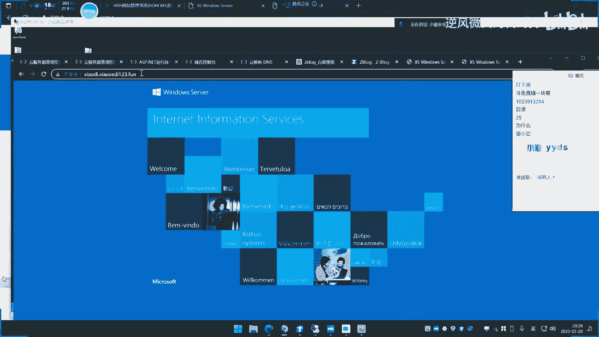
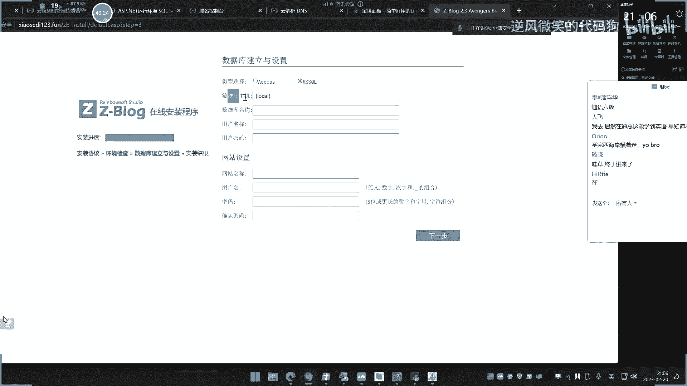

# P1：第1天：【基础入门】-Web应用&架构搭建&站库分离&路由访问&配置受限&DNS解析 - 逆风微笑的代码狗 - BV1Mx4y1q7Ny

好我们来看一下今天的内容啊，今天由于是这个底天内容，所以这个前面几天的内容都很基础，如果你不想听的话，你可以跳过啊，这个虽然说基础啊，它是每每一期我们这个讲课的，这个思路呢是有变动的。

内容上面呢有一些小感悟，就比如说像这一期啊，我们这个讲课的思路呢就和上期不一样，我们讲个思路是讲什么呢，我就是先从这个往啊啊啊这个这个打井上面，就是说我们尝试着去打点像这种网站啊，或者说类似小程序啊。

包括一些人上的应用，就会说的人应用，还有一些app，我们尝试去搭建它，从他的搭建上面，它的组成和他的这个上面的去看待这个问题，然后再去分析一下，我们后面可能会涉及到这里面的哪些安全问题，和它相似对应。

就像我们今天讲的，我们这个章节点呢是基础入门这个章节，但这个章节道大概讲的就是下面这几个东西，就会从这个网站的app啊，这个人应用啊，包括这个安全产品，还有一些这个抓捕技术啊。

一些各种的一些算法啊等等上面的去给他讲啊，这是章节点，那我今天讲的是第一个产品，就是这个网站产品，网站产品呢我也分了三个点，三个点，那就是我们会有三次次过去专门讲，他今天讲的是这个第一点。

加的是最简单的常规类的网站，然后会涉及到几个知识点，就是我们呢从这节课来会学到八个点，就是第一阶段，那你可能学到这个八个点，这个八个点对于你后期学那些安全，漏洞和思路呢都会有影响，就是有很多疑问。

都是从这些知识点里面解析衰的，比如说像我们说的啊，现在呢我们就来讲一下，像这个网站上面这个事情，那么一般网站搭建的话，它是需要说了很多遍的，这个什么四大仙呐，这些东西。

那简单来说就是我们说的这个操作系统呢，然后就是中间间数据库啊，这个程序员吧，这是他必备的一个网站，打安全好，我们现在呢就是按照这个真实环境，我们自己啊在这个服务器上面去购买，购买服务器。

然后再去购买玉米这个域名和服务器的购买呢，我就不给他演示了，就是你租车类似的，阿里云或者腾讯这种厂商呢去充值之前，你们去购买，然后购买人工服务器的话，礼仪了也可以像我一样是吧，购买一个这个按量付费的。

就是说按使用时间付费的，你就没必要再去买这个一个热爱一年的啊，这样子的花销比较大啊，按量付费的话就是几毛钱一个小时啊，你用一天也就几块钱是吧，也没多少钱，好我们再给大家登录一下啊。

这个购买流程呢我就不说了啊，我现在已经购买了两台服务器啊，这里购买两台服务器啊，来给大家看一下啊，其中呢我们先演示第一台服务器啊。

然后我在上面呢已经把这个。

已经把一些这个相应的东西啊，把它传上去了，这是我们购买的服务器啊，然后玉米呢也给他购买了啊，那接下来呢我们就来演示一下啊，这个网站的一个情况，然后呢我把这个前提条件了，给大家简单写一下啊。

呃就是大概网的那个组成啊，就说如果真是网上的一个打井啊啊啊，购买这个云服务器，就说常规的这个挖宝的一个，好购买这个云服务器，还有一个呢就是购买这个居敏啊，好这两个购买好之后下载的第一部。

第二步呢就是我们在上面的取云服务器上面呢，去打点这个中间间，那么站在中间呢大家现在还不知道，有些人知道他有很多类型是吧。

我现在就在上传呢随便打了一个啊，这个搭建呢也是相对简单的。

如果说没有搭建的话，可能有些复杂啊，搭建过的应该都知道啊，都说是我们购买的是个windows，2012的一个服务器，他的打结呢打野中期检呢，就是简单来说就怎么搞呢。

大家可以在网上简单搜一下就完事了啊，那比如说这个windows是吧，它自带的可以打你那个i is，对不对，这东西的话呢如何搭建，下面的都有相应的文档啊，教你怎么操作。

我们这里呢就不给他演示，我先把这个整个过程演示完之后，如果说有时间的话，我就给他演示一下怎么搭建，没有时间的话，那只能你下去慢慢搞了啊，我现在因为这个课程内容呢，我不知道后面还要上多久啊。

我们先把这个东西搞清楚好，这里呢购买好之后，那么下载呢就是下载这个上传下载兵，上传你的这个，好然后呢，接下来就是啊这个添加这个网站绑定居民不好，这步呢我就给大家演示一下。

就我把原版的放上去之后，接下来的话啊我们就来个演示一下如何呢。

启动啊，这个已经搭建好S应用了，诶这个，诶哈这个还不能要这样子窗口化还是开在这里。

这个是IS应用啊，大家看一下啊，我先给大家看演示一下来，我优先这个添加网站名称，在随便取个名字，随便画个圆吧，路径就指向的是什么，这个网站路径啊，指上我的网站目录，这个是我的源码目录。

这个源码从哪里下载。

我随便在网上再下载一个源码，这个源码是一个博客源码。

然后这里呢有两个产品，一个是pp的产品，一个是SP产品，我们下载的是这个ASP产品，源码呢也给他打包了啊，自己下载，下载好了，再把上传上去，把解压下，假设回来是它源码结构，把解压到这个目录。

然后呢这里分配一个地址，就选择我的本地IP主机名，就是我们说的域名，我就把它写一下，写个什么，我就申请一个域名，域名呢这是我们购买的域名，在这里让我们搜索域名，这里找到我们的购买域名，这里啊。

好然后这个时候呢我选择哪个域名，比如说我选这个叫小舍里123点方，在这里我点击一下这个解析，这里配置啊，写一个什么东西呢，大家看一下啊，我添加了你三条，我先把这三条呢全部给删掉线啊。

先保持默认没有的状态，点击添加记录A记录，将域名指向一个IP，非例子选择，然后呢前面写个3W点，意思就是说它的域名是小迪一三连方，3W就代表之前人家是3W这个意思，然后指向IP地址，把指向哪里呢。

就指向这个IPIP是8。21870。35，看到没，把指向这里下载来，然后这里再点击默认添加好，那么如果说我这里呢再添加一条小迪，然后8。35点击确定，那么这两个分别是什么意思呢，就很简单，一个是三打5。

1个，那就是什么小迪点是吧，就这个意思就是说都指向这个百里A，你可以通过这个呢返回到它，也可以通过这个呢返回到它能理解吧，如果这里添加个艾特的话，就是这个直径写at就是说前面随机好，那这个呢写好之后。

接下来我给大家看一下啊，我在你写个什么，就写个3W点，对吧，现在的主机名就叫这个名字，点击确定，已经将这个绑定给另一个网站好，那我现在原来的删掉，这是之前那个啊，三要删掉，重新添加个啊，重新来一下。

指向这个目录啊，这个源码目录，选择你的源码目录上面随便取个名字，然后把刚才那个主机名下载下来，然后这里要写成这个什么IP啊，IP选择默认就可以了，结果好，这里启动成功了，那么现在我们来关注一下。

我们来访问一下这个网站，看是不是能够啊访问，但这里要注意一下啊，不是说立马就行了，因为他有个时间，但现在时间都很快，以前可能需要10分钟，就是我们说的这个TT老师10分钟就10分钟生效。

你看现在我访问是就直接访问到这个网站，你看对，然后呢你再返回这小迪点。

通过这个地址，你看刷新一下啊，可以看一下，那你看现在呢他返回这个地址变成这个页面啊，我返回3W点的时候，这个页面是这个页面，然后返回3W点的时候，是这个面，为什么呀，那为什么返回这个页面是返回这个地方。

是这个页面，返回这个是这个，这个是这个博客的源码显示内容啊。

这个呢是返回这个东西是啥情况，来给大家还原一下啊。

因为很简单的道理，我刚才在这个地方设置的时候啊，他的绑定是绑定的，什么是绑定的，这个看到没，那当兵的是小迪给放啊，并没有帮你小迪呀，小迪你小迪也放啊，对不对，但是你这个前面这个域名。

这里的设置的解析是这个IP地址，也就是说你返回这个小迪，它会返回这个IP，而IP访问就是这个内容IP访问来看到没。

IP访问和这个页面访问。

这个域名访问是一模一样的，因为啊你这里的设置是3W点，它只想这个绑定这个圆满目录，所以它显示的是原版目录的那个页面，然后你真的如果说你要让它小地返回的话，你可以怎么点击添加，添加一个就完了嘛。

添个什么这个小迪点，之前这个玉米嗯确定关闭好，那填写好之后是吧，我们看一下啊，那两个解析都贴上去了，我们再来刷新一下这个页面看一下啊，看到没，是不是就和那个3W点，那个V是不是一模一样的呀，你看。

好那我们做这个实验想告诉大家什么意思呢，这就是我们说的子瑜站点叫止于民三连，我们后面在信息收集的时候都要学这种东西，比如说就像我们说的呢，我们现在在百度一样，我打开这个百度点com，他这个应该是吧。

然后我打开了它的域名，变成了什么铁8。100度点com NO，然后变成这个东西了，就是说它有子瑜，有子域名，这个呢就是它的源于前面，那就是它的子域前面不同，可能页面就不一样，那么很简单的道理。

我们来试想一下，如果说现在，3W点是吧，小礼包点com，我们这里用的是z blog这个程序啊，马搭建是一个z blog sp程序插件，然后这个时候呢，我再创建一个小迪小八点com这种域名。

然后呢再换一个WORDPRESS搭建，那么这两个设置，都是在这个域名解析上面去设置的，但是面对的是两套程序，那么我们都知道像这种网站程序呢，网上经常会爆出一些漏洞，那么试想一下，你在后面信息收集的时候。

收集到这种东西之后，你面对的其实就是两个目标，就说你的目标是小于八点com，但是你收集到它有多个这个域名了，然后呢多个域名上面的程序不一样，那么也就是说，任何这个域名上面的某个程序出现安全漏洞。

那么都和这个网站相关，所以我们介绍这种，就是它的第一种常见搭建模式，就是治愈模式搭建是吧，就是网站的泰格方面的应用，它可能呢再写个什么BBS，点小了，八点com这里那就代表可能就是一个论坛程序。

比如说discuss的程序，DJ的对不对，或者呢你再写个这个其他的，比如罗宾点下班，你看这可能是一个什么OA啊，系统啊，怎么样，前面加个OA是不是，那可能就是OA系统，那OA就有很多系统。

比如说什么通达OA啊是吧，我们常见的一些这种OA系统，怎么是不是，那这个呢就是我们说的止盈模式，子云模式能理解吗，就知渔民搭建出来的网站姓氏，所以我们为什么说先学他的搭建架构。

再去说为什么信息收集要收集这些东西，因为他的东西呢可能有讲究哈。

好这是第一种，还有一种呢就是我们说的，还有一种是什么情况呢，那比如说我们现在呢在这里啊，再把这个地方换一下，这不是一个端口吗，我把这个八零端口，比如说我把它换成什么88号端口，大家确定一下好。

那么现在我们再来访问一下这个网站呐，你看我再访问直接访问八零，就是默认你不加他也可以能理解吗。

八零就是说就很简单了，你说我返回网站。

我后面加上个猫和巴林，代表的就是返回他拔你门口，但是我有时候不加他也能返回成功。

为什么呢，因为你默认不返回它，就默认是把力，就是你加不加他都没有影响，但是如果说我解析设置这里呢，我刚把它设置了这个，88对吧，哎我这里80是88了，那么也就是说在88端口呢有一个网站。

那么这一点就说明一个什么问题呢，就很简单，我们来给他说一下，来到这个他这个程序，我下载档口之前画了个零二的档口，默认它也是八零吧，我再换一个，比如说8080诶，他有编导这样的程序。

那么这也是不是相当于两个目标啊，那么这就能解释一个道理，解释什么道理，我们为什么后面信息收集要学习端口扫描，这就是一个最经典的例子，因为dog扫描你会发现它更多的这个应用，对不对，网站方面的端口的也有。

那不是也是相当有找到另外一个网站吗，何为另外一个网站呢，我们看网站不是看它的域名相同，就很简单，你看这两个网站域名是一模一样的，但是他们上面搭建两套程序，8080是一套程序，把你logo是另外讨论区。

那么针对我们这种搞安全的，它其实就是两个目标，可以理解为两个目标，因为我们去搞安全渗透测试呢，是针对的是程序啊，不针对的就是说啊你前面一样，我就认定是一个不是样的啊，就很简单。

你一台电脑上面一台服务上面是吧，你装的网站网站是一个攻击点，你装的这个其他的应用，那么其他应用优势攻击点，所以我可以把人定位只给了我两次机会，我有两个攻击点，就这个意思能理解吧。

那个端口呢这个也是要这个情况就能理解了，所以这种是端口模式，还有一种模式是什么模式呢，还有一种模式是什么模式呢，还有模式说move模式，摸了摸式什么一打就很简单啊，那我这不打你了一个吗。

好假老师说现在啊，那就是刚才那个源码的地方在这里是吧，我这里呢再加上个blog。

再加上blog再放超标吗，这里如果说我现在返回这个网站。

你看啊我加上目录VLOG诶，是不是又出现一个新的程序啊，比如说我把这个200替换成其他程序，那么这是另外一个新程序。

啊啊啊这个就又好理解了是吧，这是一套程序，然后再补log，下面呢右边成一套程序，你说我换个BDS是吧，更好理解，换个这个轮胎水平，那么这是不是优势，两套程序是，就是他把源码呢放到这个目录。

然后你返回这个源码源码，那是当年的是指向这个源码，然后呢你在blog下面创建一个目录，目录下面有否抄网站源码，那么相当于说这个网站有两套程序，量产程序就是我们两个目标，因为任何一套程序出现了安全漏洞。

都会影响他的安全。

对不对，这种呢就是我们说的目录形式对。

那目录形式除了之外，还有没有其他的呢，没有了还有就没有了啊，一般这是最常规的搭建，这是最常规的搭建，何为最常规的呢，就是我们这种最简单易懂的，那么除此之外还有没有呢，有比如说我给他举个例子。

集成软件搭建的多克的容器，搭建的分配占这啥意思啊，多亏的是我们的容器，我们如果有些人搞过的话，应该都知道可以在多个上面拉一个镜像，就可以拉一个网站出来，就是网站它可能是这个多G的机箱弄出来的。

那么用这东西弄出来的网站，和我们这个网站有什么区别呢，对不对，还分配占用是啥意思啊。

这里我不好找，给他找例子啊，但是我一说大家就能知道。

就像这个呃就c blog一样，就像再往这样，这个网站开发员到达到达肉质上就是官网，然后你注册了账号之后呢，他是给你这个网站，给你这个用户给了一个域名啊，能理解吗，就是网上的有些网站应用。

你可以在上面的去申请升级之后呢，它就会给它自动通过它的域名呢给你个域名，然后你在上面再去搞你的这个应用，你说这不是你的网站帮你填私立的网站呀，你在网上申请别人公雇佣的，那这种呢我们就称之为叫分配战。

就是说这个网站呢是一个大域名，分配给一个用户的一个免费使用的，或者说收费的就很多，有些什么网销系统啊是吧，他集成有就是利用他的域名呢给你部署，然后呢你直接用他给了一个后台账号密码，你去管理，对不对好。

那我们试想一下，那像这种网站，我们为什么要去讲它呢，很简单的道理，假如说这个网站是你的这个测试，安全测试目标的话，你首先能想到是什么问题啊，就这种网站就像我们说的这种，像那个CN不给这种这种cs啊。

还有一些这个一些太平洋网销啊，呃它有很多玉米啊，我这没办法没没找到的安利啊。

大家一说应该都知道啊，他这个是有一些这个域名的啊。

你申请之后呢，他就会给你一个俞，就你是他用过，他给了一个域名给你用，那这种呢如果说是你的测试目标的话，那其实你面对的就不是单个啊，面对的是整个啥意思啊，就是比如说某个网站，它分配这个域名。

那你测试的就不是车测试这个人的网站，而是测试这个域名的网站，就是公司网站，但大家可以可想而知，像这种粘的话，它的安全系数是比我们今天像这种自己购买，与自己搭建的要好还是要差呢，我想这个不用我多说。

大部分的概率是要好，为什么，因为他搞这种集成式的话，你自己搭建的话肯定是没有他专业，没有他去这个专注这种安全系数，对不对，还有像我们说的这个集成软件。

集成软件是啥意思呢，我这里呢是采用自己在服务上面，那一点点去安装，安装中间件，安装数据库，安装服务器，对不对，我一点点的安装，而有些呢大家都知道网上有些什么包，他什么pp study这种类似的软件。

这软件是干嘛的呀，你想保他这个必须study是吧。

这种的，这个宝塔面板是吧，他是干嘛的，他直接下载这个软件，然后软件呢登录进去之后，上面的说有什么中间间的操作系啊，这个这个什么鬼东西都有，就是你可以在上面呢鼠标点几下好，他就帮你把中间剪好了。

鼠标点几下就帮你把数据关好了啊，鼠标再点几下就把这个网站源码给他下载好了，然后呢，你就在上面那配置一下东西就可以上线了，就是环境呢它集成在一个一个软件里面去了，那么像这种。

又和我们这种常规搭建的U有什么不同呢，对不对，所以说你将这个网站那个组成呢搞清楚之后，你就知道诶，你面对的是哪种情况下面搭建出来的网站，而且我们讲的这几种都是比较偏向于，个人和这种单位性质的。

但不代表就是那种企业高达企业那种啊，真要单位的啥意思呢，你像有些这个真要单位，还有一些这种这种这个像一些大公司，就是我们说互联网的一些公司，那么这个腾讯啊，阿里巴巴这种历史啊，他们都不是这种。

他们是自己的地方，是自己的机房，然后呢是自己的专人管理，也就是说它的服务器啊，包括一些各种各样的东西，都是在他们自己的夫妻啊，就是他们自己在管，而不是说我在购买别人的夫妻夫妻了，不在我附近是吧。

我只是通过网上租用。

那么这种优惠有情况对优惠有不同，而且它使用的各种打点的东西呢，它会有很大的区别。

因为网站呢它还有一点，就是我们说的网站那个应用的场景，你这个网站打出来，你是搞个博客，你自己用别人的网站打出来，还是搞个这个门户网站，要成千上万的人天天访问，那么针对他上传的是梦流量啊。

包括他的返回速度啊，和这种功能性的都有很大区域，由于这些差异呢，造成了这个网站的源码有分为网上说的几点，哪种几点开源必然和只写三种模式。

我们来分别解释一下啊，这源码上面的知识点，一般就是开燃低燃，低燃呢我们可以称之为商业财主呢，就知血，无论哪个好不好，开玩笑，就是说这个源码，那你在网上给下载到，这个就是我们说的程序员嘛。

就是网站这个程序员码，商业就是一些类似一些必然的产品，就说这个源码的，你需要花钱买，跟这个美国公司开发出来的，还有不要止血，一般会有哪种情况，使用哪种方面呢，比如说像我们我们呢就搞个博客。

就搞个自己的网站，记录一下自己的生活，我就在网上随便下载一个类似的博客程序啊，搭建一下，那我这种呢不需要花钱在程序上面，不需要花钱下载的，网上开源免费的好，我就用这种，那么还有一种就是。

我现在呢要搞一个网校系统是吧，我要培训，我要搞个网校系统，网页系统呢我在网上看到了很多开源的，但是它的功能不行，因为开源的话就是免费在做这个事情，免费做这个事情的话，谁愿意免费一直更新。

谁愿意免费帮助你去添加你想要的功能，我想这个都不愿意，所以只有商业的，他会做这种事情，商业就是花钱就专门的有人去帮你去开发，一掏钱就完了，这是第二种，还有一种就是说我自己有能力去写好程序，我给大家。

那这是第一个应用点，第二个应用点就是像我们说的，你比如说一些大型的网络安全公司，什么政要单位，大型的网络安全公司腾讯哪里，像这种他们会用开玩的吗，他们会用商业的吗，几率很小。

为什么商业的也是一帮团队在开发，他有他自己团队，他不会自己写吗，他用脑用得着，把太原马拿出去卖吗，对不对，然后呢，网上免费的他会用吗，一般不会吧，因为他用这个免费的话，免费的安全系数是最低的。

因为他人马是大家都可以看到的，所以有很多人都能去挖这种大的，他用的都是自己的程序，所以也就是说我们给你举个其他例子，我们把这个东西讲出来之后，大家想象一下，从我们这种SRC网上。

那种娃娃东的平台上面来讲的话，华东平台上面是有很多目标啊，这个目标你从第一眼你就能感知到他这个源码，你能不能拿到手，你的目标是一个这种某某某某的是吧，你就去想象一下他这种企业。

他这种单位他会用哪种模式的人嘛，你自己呢可以自己思考一下，然后你从这个点上面就能得到，这个难度是大还是小，其实呢就是你看到这个目标的名字和目标，这个大哥星系之后呢，你都会有一个简单的认字。

而且你会在你脑海中呢去形成一套，针对这种情况下面的一个思路，这样我们说的简单的就简单速度进行难速度，我就相当于有很多速度都不可行。

要想其他情况，所以说我们说的源码上面的啊，这源码上面的，那么现在呢我们再给大家看一下啊，这个解析访问，然后解析访问呢又能解答一下，大家以后可能会碰上的问题。

什么叫解析访问啊，大家关注一下哈，这个呢我是拿的是这个IS这个中间阶段，给他演示的，后面的海，其他很多中间包括哪些类型，我们都会讲到是吧，我觉得只是做个演示啊，比如说我们这个IS的啊，大家看一下啊。

我就在他面简单配置一下啊，其他的中间都有这个功能。

那大家看一下啊，有什么叫解析什么东西啊，那我就拿一个很简单的例子，我假设现在我入得到这个网站权限是吧，我得到他的网站权限啊，比如我现在带的这个网址权限，你看啊我做个什么事情啊，我在它上面再留一个后门。

这后面是什么东西呢，这后面是一个大家可以看到啊，这是一个什么啊。

我们这个放在那个后面啊，这个有些人不理解啊，基础差的不理解，基础好的话应该都知道学过了啊。

好我们现在呢来看一下啊，我们用这个工具啊，这个哥斯拉呀去连接一下这个后门，那这是我们那个后面地址啊，post一点SP，post就这个目录啊，目录它指向的网站目录是这个根目录。

然后呢post下面这一点SP，所以这个路径呢就是呢忘在域名加上POS一点，SP好，我们连上去可以看到里面连上去啊，那可以连上去啊，可以连上去，那这个东西是啥呢，就是我们后面经常会用到的这种。

web修的管理工具，就是我们说把后面植入进去之后连上去了是吧，这就是我控制这个网的权限样的一个道理，对不对，他能对这个东西呢进行操作，好这个我们先不管它好，那么先来看一下啊，就在我们这里在模拟了一下。

这个攻击者的一个角度啊，他植入后门，并且连接到这个网站，并且控制这个网站，那么先来看一下啊，如果我这个管理员我在上面做了几件事情之后。

就在中间上面设置什么东西之后啊，可能这个东西就没用了啊，那首先第一点设置什么东西啊，这有个这个pose这个目录是吧，我优先点击一下编辑权限，在这个安全这里啊，我把一个东西呢给它设置一下，来点击拒绝。

把这个点一下啊，好我们再来看一下这个目录，再刷新一下这个这个码看一下啊，再重新来连接，提示带初始化失败，连不上了，然后呢我可以访问一下这个地址给你看一下，这是后面地址吗，我给大家看一下啊。

放这个地址看一下是什么，是什么，啊司令一未收权，由于平均无效访问被拒绝，啥意思啊，没有权限，就说他这个中间上面，那它可以设置一些这些东西，而且包括这里还有个叫什么读取人性执行，这啥意思啊。

读取就是说显示写入，就是往里面写数据执行就是说有没有执行权限，这个脚本呢它也分为有执行权限和没执行权限，一说能理解什么意思，没有啊，就是说他不给你执行权限，那么这个脚本就运行不起来，就和你那个E1样。

我不给你执行，你执行不了，那就没有，所以这个全身呢就和我们说的这种执行一样，你访问不了，触发不了他，那这个后门就相当于没用，因为他要访问执行它才有，所以他这个设置呢就这样好了，大家可能优惠一下。

说那你既然这么一设置，后面就无效了，那都这样设置行不行呢，不行，为什么，很简单的这个目录。

我们把理解为是类似的图片目录，我可以说图片目录，但是我不能说其他目录为什么呀，因为你看啊，比如说这里下面有个其他目录，我如果说这个其他目录这下面的增长文件呢，这个源码的增长脚本文件它是也不能执行的。

不能自己网站都打不开了，对不对，所以一般这种靴子呢，都会和这种文件目录所注意啊，啥意思呢，就是说我说一下这种图片目录，因为图片呢它只用来去认读取就可以了，他不不能自行，必须是这种脚本的才有执行这一说法。

你说这个图片目录的话，因为里面都是图片，你说了之后图片还能正常的读取，但是呢里面一旦有这个后门的话，放进去，你说的执行权限后门放进去，它没有任何用处，这是第一种设置啊。

就是我们说的中间上面那个配置，这也能为大家分析到，后面你可能会碰上的一些问题，都是和这个上面的设置有关，能理解吧，就是中间件上面我们这个打印平台上面，他拍的这些东西。

会影响到你后期你做安全测试碰上的各种问题，比如说现在我们再来举个例子，这种深层验证，那我点击一下这个地方呢，一个叫windows的验证啊，我把这个目录先把它先先把它这个恢复出来啊。

先把那个传奇把它还原出来，我这个我把锁完之后。

这个目录都打不开了啊，你看那看到没，因为我刚才设置那个mv one，所有人都不能对它进行操作，这就打开了啊，那这个该怎么办呢，就是更改一下那个所有值啊，还把在我换个目录吧，换个目录再来试一下啊。

那个post bot目录啊，换这个目录嗯，还是把那个厚本的把它放上去，在不算翻车啊。

就是你自己重新把它转下载，设置一下就可以了啊，好我们再来看这个刚才说的这个电压问题啊，就是这个返回目录，那我们访问一下这个blog啊，这个目录好返回下载呢，啊现在返回是这样子啊，我来看一下。

我返回这个blog目录，它会显示这个页面对吧。

你看啊，我现在又搞这种事情，搞个什么事情呢。

点击这个视频验证，这里公认这里啊啊啊，这个地方呢windows验证给他启动起来，然后把这个地名是把它关掉，启用这个windows生命验证，当我们去刷新的时候，看一下这个页面会变成什么情况。

嗯啥情况没刷新吗，搞错目录吧，等一下啊，好搞了，pose目录我说了，搞这个目录，这个刚才选中，选错目录啊，把这个选中目录啊，好再来刷新，看到没，所以什么情况来需要我登录账号密码才能访问。

这样我相信大家如果有经常放网的话，他就是学生学校里面经常会碰到这种事情，对不对，那这个是什么东西呢，就是要验证身份理财能返回这个战略，那诸如很多此类的一些配置，都会影响到你对他的安全测试。

所以你要明白这种东西是怎么回事，你能不能绕过它，其实非常简单，你看啊，我把这个windows视频验证开了，那这个是啥意思啊，就是说你必须要有这个颠倒这个服务器上面的，机器账号密码，你才能发文。

那转了一次就很简单，你有这个电脑上的账密码，我还搞你这个网站干嘛，我直接登录上去不就行了吗，所以说这就是个很冲突的一个事情，对不对，那你可能说能不能绕过呢，绕过不了，能理解吧。

所以啊这些上面的一些设置给他隐私呢，不是说教大家这样去配置，去防止这种安全问题，是要告诉大家，这种东西出现的是什么原因造成的，这东西对于我们这种搞安全测试的人来讲，作为红队来讲，他有没有一些影响。

那这个想都不用想的，肯定是有影响的，那能不能捞到，不能绕，所以你碰到这种情况怎么办呢，没办法，只能找其他的一些能看到东西，好我们再来说这个第几点啊，就是还有一个就是我们说的数据库的一个角色。

什么叫数据库的角色啊，来给大家看一下啊，下载说前面加了域名上面的一些事情。

然后中间上面的配置视频，然后再来说数据库，大家看一下啊，我不是搭建了一个网站吗，我先把它恢复一下啊。

这个地方。

好。

我们现在呢来给大家登录一下它的后台地址啊，登录好之后，我们打进一下啊。

哎呀刚才搞了个船新配置，把那个船先给他锁到了，锁坏了，哎呀真是麻烦，我先把它恢复一下，这个pose被锁坏了，哎呀重新唱新课吧。

全给他打一个。

改一下机身就可以了啊，那重新再安装搭建一下，把这个指向目录给它修改一下就可以了。

所以重新指向这个目录啊，就把那个目录替换一下，这个绑定这里嗯，基本设置这里，物理路径呢改成这个目录确定好，现在改完了，我们来看一下这里啊，声音返回，好现在就现在就报了个什么仇啊，报了个这个错。

这啥啥错误呢，这里有个这个这个重新把那个圆嘛重新启动啊，报了个什么这个错误啊，哎呀重新把删除一下吧，重新再启用的那个啊，好重新再来加一个啊，重新指向那个目录，这里再提名一个，真的小迪而不是特小迪。

小蛇里一三连方，啊你这个玉米看，帮我练号啊，来刷新一下啊。

小小迪一点当。

我就给你打钱，你们还有人说我翻车，你看我翻不翻好吧，你们都会碰到这种问题，这是i is上面一些常见问题啊，你我如果说我不在这里给你翻译，死不给你翻译一下啊，你都会认为你后面你碰你去自己去打一下手。

那你就不知道怎么解决了，一个要改这个地方还要改这个福禄金，这个地方还有这个请求目录指向，这有些东西我都没有讲，因为你要讲的话太多了，这个是那个更改那个首页指向，就是让它指向这个第一个优先顺序的手游。

为指向，唉这很多东西其实你没有必要学啊，因为你后面你碰到这种S杂技呢也比较少了，但是这个东西的点赞你还是有必要去学的，在这里啊，它有个附近的一个东西的180启用，嗯再来看一下啊感音怎么老师这个。

那500错误有啥原因呢，权限原因，我如果不把这些坑坑你踩好，我不讲，你下去了解各种各样的问题，李老爷翻车，我翻个锤子啊，这翻车嘛哈，好随便取个名字，小迪渗透八那个网络安全程序啊，随便取个名字吧。

啊你当你把设置下啊，就打就好了，好搭建好了啊，完成答题成功了。

好我们来看一下啊，呃大家看一下啊，然后呢这个答案呢是采用的arcs数据库。

然后我们这里呢要着重介绍源码的结构了，这是我们的源码，我们为什么要学习源码结构，就是要搞清楚源码的文件和配置，会有哪些相关的，一般源码里面呢，最简单的就是有数据库配置文件，什么叫数据库配置文件呢。

就会和数据库关联的，那么数据库又出个什么东西，我们常理解为就是存储数据的一个应用，我们来看一下啊，他这里呢采用的是access这种数据库呢，它没有账号密码，我们可以看一下它的配置文件。

这个配置文件呢一般就是命名呢有些讲究，就这种英文类似的一种名字，就比如说像这里有个叫c open。

显示就是选项的一个配置，还有什么data的目录，就是和速度相关的，我打开看一下这个是不是，你看现在那就有一个什么呢，数据库配置的一个地方，所以说有这个文件，就是我们说的要找这个源码里面的输出。

配置文件如何找，就是根据这个名字和目录名字比较，类似于数据库的一些英文单词的解释，含义的名字什么，Data include cn con，黑客这种类似英文单词，所以呢我找到了，你看这里是哪路径。

是这个指向这个数据库路径，然后下面是有个叫呢，前面是哪cs啊啊啊，MSSRCLE就是我们说的SUCCEL数据库，然后下面有个什么database，User name。

password还server是啥意思啊，配置数据库的路径，密码，用户和这个什么database是啥意思啊，数据库名，我们在安装的时候选择的是哪种安全模式啊，这种阿克塞斯的，然后他指向这个路径。

这个数据库我们等下就给他演示，两种也是两种啊，为什么也是两种，大家等一下大家就知道啊，我现在第一组，那他选择的是arc塞斯，就是我选择的是XY，就直接用的是X数据库路径，然后这个数据库路径呢有个特点。

就是就是类似于excel表格，这是小型输出。

这个扫码呢就有点数据量的，我们先把那个呃我已经找到。

那这是他的数据库，在这里呢我们把它输出来，我们来下载关注一下啊，这是我们初次把它拿出来的这个数据库，然后我们可以直接用这个本地安装office之后。

可以直接打开这里一个叫文章，文章里面有一条文章留言板和欢迎使用z blog。

我们打开这个网站，可以看一下这个网站的界面，怎么这么卡呀，那是不是这个叫欢迎使用z blog这个标签好，大家看一下啊，我现在在后台里面啊，不过登录后台，刚才配置好账号密码，登录进去，我添加一个文章。

点击确定好，文章添加了，我们再来回到这个本身的叶子这里，刷新一下，是不是多了一条文章啊，那么这个文章呢我们再一次啊。

你看之前我没有添加手。

这是数据库内容，对吧好，我先把退出来，重新再把这个文件给他输出来。

再把这个数据库文件把它输出来。

好重新再打开。

再找到这个地方打开，是不是多了一条123啥东西，这是啥东西，是我刚才添加的文章啊，那么我问一下大家，这个数据库是干嘛的呀，存储数据的，那么既然是存储数据的口才的管理员的照片吗，在不在这里面的。

是不是也在呀，往下面翻，这不是管理员的账号密码吗，哎ADD me，然后这个密码是加密的，解密之后不就是密码了吗，好那我想问一下大家，这是这种数据库的一个作用，它是存储数据的数据。

包括你网站上面的会员数据，用户数据，文章数据等等一些数据，它都在里面有体现，是不是都在油里面提现，但数据库搭建我们刚才看到了一个问题。

什么问题啊，在他搭建的这个配置文件中啊。

我先找到这里啊，有个什么，你看这里不是还有这种模式配件吗，还有另外一种数据库，就是他支持SA和满A这两种数据库，然后我刚才选择的是斯拉好，大家可能没看到那一个页面啊。

我现在给大家重新把这个源码给它删掉，重新再给它搭建一遍，好重新给他打简便啊，大家注意观察到那个地方的问题了啊，重新大哥大简便啊，重新把这个源码解一下，重新发了这个目录啊。

重新打一遍，重新覆盖原来的好，我们再刷新页面。

它肯定就会又让我重新安装了，好是不是又重新安装，大家看着啊，点下一步好，我们重新安装啊，到这个时候我是选择这个access，就直接把这个东西搞了，如果选择这种模式呢，是需要填写主机名称。

用户密码呀，对不对，然后我可以找到刚才我说的那个输出配置文件。

那里，这里像默认这里面都是空的，当我一旦填写之后，这里就会相应的填写内容，我们来试一下，是不是啊，好然后我就填写着密码，好，在填写的时候，我就给大家讲一下，在我们这个网站安全测试中，有一个名词。

相信大家都听过，叫张口分离，这个意思呢就很清楚，就是说网站和数据库是分离的，这是啥意思呢，如果你搭建个网站，这个数据库是在你本地和网站源码放在一起，那么这种呢就是不分离分离的意思。

就是说网站的源码和数据库呢不在一起，啥意思呢，来下载。

我们来看一下啊，就是说这是一台服务器，在服务器上面放的是网站的源码，是网站这个中间点，对不对，但是他的数据库呢我把它放到另外一个地方，这种呢就是我们说的数据库分离，对不对，好，我现在先用常规的来演示啊。

大家看着啊，我再开台服务器啊，这最长还有一种就是说先搞常规的张口分离，里面的有讲了很多其他的一种意外情况，你看现在有个叫8。2，1872。88的这个夫妻啊。

这是另外一台服务器上面的，装有我们的这个数据库。

SQL server对装有，你看啊，我就把这个配置上去，八点啊，这是两台服务器啊，两台呼吸我都给他看一下，就我在这里呢直接在上面用的镜像装好的，这个镜像，那这是刚才这一台网的服务器，然后这个8。218。

是这个是那个那个渔民的服务器。

然后这个是我们的数据库服务器，两台不一样的啊啊啊。

这个是8。72点多少是吧，那我们来看theta。

妈的搞了这个东西之后，老师这种东西呢，你看两个IP是不一样的呢，这个是麒麟点三五。

这个是72。88，网站呢是在这个70035，舒服呢是在这个72。88，然后我看一下啊，你看我刚才在这里配置的时候，写什么录音地址，写什么72088舒服，名称呢随便取就叫JVLOG。

用户名称呢啊就是账密码写进去，然后这个账密码是多少呢，是我这里配置的啊，嗯这个大招你嘛，然后随便写啊，名字用户名单我就随便写了，好我们来在这里呢，我先来确定一下，我们来打开我们的这个数据库啊。

打开正面的数据库，好我们先看我们这个数据库里面的东西啊，现在有没有一个叫ZBLOG的啊，现在没有jz blog的好，我先让他尝试去连接他，可能连上点执行，他报了个错误，这个什么什么东西错误啊。

那这个东西错误啥啥啥情况造成的呢，可能就是我这个速度没有创建的原因啊，我先给他创建一下，Jj vlog，我先创建个啊，他可能是要先创建数据库，然后呢他自己呢再倒进去写数据，ZBLOG创建了。

好像我先看z blog下面也有表啊，刷新一下是没有的，只有这两个啊，那我们现在再来研究一下，他应该是这个不支持不支持那个呃张骨分离，那我只能换一个两马给他演示了啊，我还好是准备另外一套两把。

那我说美丽外桃源吧啊准备另外桃源吧。

还好是我提前做了预备，啊这里有一套这个网站的，哎呀怎么老师这个说法说不过去啊。

啊这里有另外一套两把，这两把呢还是个点net的两码，在这里有个啊，那我把他绑定给他看一下，绑定是cm小C的啊，然后我这个DNS里面加上一个cm的指甲是吧，只要这个例子，大家不要搞错了啊，指向。

好cs写程序，我们来访问一下cs的这个域名，那这个网站呢就打井打开看一下啊，我们看一下啊，请求这个路径，后门照明网站在这里，然后在答题的时候呢。

我们看一下它的数据库的一个配置啊，你看他的数据都是在这里啊，呃先看一下这个网站数据库配置文件，我们再来给大家关注一下这个数据库情况。

在这里这三个源码，源码里面的输出配置文件呢在哪里呢，在这里呢app点CONFIG，就是类似这种名字的啊，一般输出库配置文件，你看这里有个路径呢，这是他的这个这个速度配置文件，给他往上面翻一下，看一下。

来而且这里有个类型，你看一下啊，这里有个类型的类型，一等于4X2等于XX，它实在是类型为一，就是等于4X2，然后这里呢有个人录屏的SA密码为这个密码，数据库名为这个叫doo hd cm s路径的选择。

8。218。7，2。88，这是数据库的配置，对不对，就是说纸箱的连接了数据库账号和连接的密码，包括数据库的名字和数据库的IP地址，那么他这个IP呢是70。35，数据库的指向的是8。21872。88。

就是说这里就是符合一个叫占股分离，就是网站和詹库呢是不在一起，然后我们会确定是不是的啊，我看这边是不是有个库名，就叫这个了，多么点HM430，然后下面有这种数据库的结构啊，我们可以看一下啊。

我当我把这个数据库给删掉之后，会有个什么现象，那看着啊，我把它删掉，我们看网站，目前网站这边呢访问的是这么一个样子，但是网站返回这边，而且它的后台呢也是能够正常登录和测试的，都没有任何问题啊。

是在网的后台还是商业版的最前端的，没有闲置的，都正常的，现在啊我们做个视频把这个数据给删掉，我们确定一下是不是他的数据把它删掉之后，我们再来刷一下这个页面。

怎么还没删掉啊，有点慢啊，诶删除发生异常，因为当前数据库正在使用哦。

我知道了啊，它在使用的时候不行啊，因为它正在使用，我把他网线暂停一下，再把它删掉，啊其实我没必要做这个演示，我这个演示就是告诉大家它的影响啊，然后从这个影像上面呢，你就能知道这个东西是一个什么情况了。

先把停止就不让他先掉一个速度，我再删就可以了。

那是不是删掉了，删掉之后我再把启动，你看现在启动在是什么情况，老说翻车，这哪是翻车呀，这里面的就是要翻车。

能打开吗啊重启动了啊，这打不开了啊，数据库连接问题了，看到没没有数据了，不又出了问题吗，好那这个就是数据库分离，那除了这个之外，还有没有其他的，还有啊，来像我们的云产品里面，还有什么人输出库的玩法。

啥意思啊，让我们说一下啊，人数据库rd s啥意思啊，就说像这种厂商呢，它还提供人服务器，人数据库什么东西，啥意思啊，就是说你可以单独，那不因为数据库呢他是在操作系统上面运行的，你需要先买操作系统。

买个服务器，在这方面去装数据库，这是我们传统的。

那么现在呢有这个东西的啥意思啊，我可以买个数据库。

我可以买个数据库来，我创建一个数据库，安利付费，然后选择我数据库类型和地区啊，比如说买Sol的，然后这个多少招啊，多熟悉，那就啥意思呢，就是你可以再买一个数据库，这个数据库呢就是放在人上面的。

就是不像我这种，我买一台服务器。

在服务器上面去装这个输出，这是以前的，现在呢出现了这个数据库，放到了这个人上面，意思是说他不需要我们有个操作系统，不需要我登录，他就给你上面的，在哪个地方给你搞了一个应用，然后呢给那个照明马力去连。

就可以用这个数据库能理解吗，那如果是这种，我把数据放在这个人上面，我发布数据放到这个人上面，和我放在这一边，这有什么不同之处吗，大家可以想想想哈，首先我们来思考一个问题，如果我放到本地，我放到本地。

那么也就是说这个数据库，我如果拿到这个权限的话，更低的那基本上都可以拿到好，这是第一种好，还有一种情况就是说如果我现在呢拿到了网站，这个数据库能放到另外一台服务器，对不对，那能不能拿这个数据。

这个还不一定，或者说为什么说不一定呢，因为数据库里面有些特性叫什么，叫Y联特性和绑定特性，还有一些有一些这个各种各样的一些特性，做刀子，你就是你可能拿到了这个账密码，还不一定能够连接上。

然后呢这是第二种情况，这是我们之前的常规的放到另外服务器，现在有有这种人上面的输出了，那人上面那就更不用说了，安全系数更高，它的登录方式都发生更改，就有些人不再是传统的账号密码登录，能理解吗。

他还有一些类似的绑定，因为我人上面的还可设置安全组，来限制某些IP能够连接数据库，某些的不能理解，他就限制它的网站版本，后来连接其他的都允许连接，也就是说你必须要在网站上面去连接它才行。

你即使知道扫码连不上，而且还有现在不再使用账号密码连接，和我们那个说的什么阿里人的K，用哪种东西去连接，还有一些更多的一些玩法，所以我所有知道理呢，大家就应该一世的道，现在的这种安全的这个驱使呢。

和我们之前呢都不一样了，就说以前的按道理传统思路来讲的话啊，有些呢是放在服务上面，有些在网上打印，那就是我刚才说的那隐私，那是最传统的，现在有些呢就是很多智能，还有一些各种各样的一些这种东西的。

他网站运营，那就申请一个，然后呢给我买个人服务人数据库啊，然后再购买一个虚拟空间或怎么样的，就压根就不用到什么服务器啊，或者说用到一些这种传统的一些介词档，包括海总，就我们说的这个上面。

我把我们这里课程课还要讲到的，所以说今天不讲，就像我们说的这个OSS质量也是一样道理，他可能有一些东西呢放到OSS资源上面去了，这又是啥呢，就是专门这个存储数据的存储，存储用户数据的一些存储。

一些这种音频啊，图片的一些东西，那拿东西加入进去之后，就可能就是我们说的啊啊讲个举单例子。

像那个OSS一样的啊，我们给他给大家说一下，就我上传个文件，那之前的都是上传到这个网站目录下面。

那如果他接触这个OSS的话，可能会造成一个什么现象呢，就是你上传文件的上传到了我们这个对象，存储这个应用里面去了，它存储到打赏下载的应用里去了，那会带来什么效果啊，就像我们说的上传LOL对对。

我们上传多种上传网站源码下面，然后让我们去连接这个后门，好上传多通拿下网站，现在呢你上传文件文件呢，把它丢到这个存储OS应用里面去了，那个后面上传上去没有任何卵用，放温要么你就不知道返回地址。

要么就是访问之后啥用都没有，因为这个英雄呢只做存储的，没有任何区能解析你那个后面代码的，是不是就是相当于这个东西没用了，所以这也是我们在三连来搞这安全测试，都会碰到的各种问题和难题，也是很难做。

或者说很难发展技术，越来越卷技术越来越难的一个情况，因为出现了太多的一些这种新的，一些不同的搭建模式是吧，包括网站也好，包括我们的下面说的一些其他应用对象也好，都会有各种搭建情况。

我们大部分讲的一些漏洞呢，都是针对传统搭建模式，如果他换一种搭建模式，就像我刚才说的，把数据库采用人数据库是吧，然后把这个上传的图像呢给它存储到OS里面，解决了上传漏洞是吧，等等一些手法。

这样搞上去之后，很多漏洞你就不用去考虑了，因为它就不会存在，还有很多种类型啊，都是我们后面那会一一给大家去讲的，因为我要把这个东西讲出来之后，把这个打井给他看到效果之后呢，大家才有印象，你再去讲这个呃。

后面的一些这种思路点的时候，你就知道这种东西在这个环境下面能不能使用，对不对，就像我刚才说的这个，呃这个刚才说的啥呀，刚才那个人数据库，对不对，我用那种啊，把这数据放到那个上面去来，那就是我即使加密码。

我泄露了，你知道了，没有任何用处，连不上的啊，因为它默认的设置就是，只允许某些客户端或是某些地址才能连接我，账号密码给你，你都连不上，他就会有这样的影响，所以说有些东西啊。

它就和我们传统的一些手法就不一样了啊，那我后期我们说的那个信息收集，为什么信息收集呢，收集的就是这些情况，就是你要针对这个目标来判断出它是什么类型，时不时符合我们这个漏洞利用的类型。

把这些东西搞清楚之后呢，你再做才有这个效果啊，你不要这个什么清楚都没有搞清楚是吧，你就在上面做做也是浪费时间，做不了好，这是我们说的那个，情况啊好，那么现在呢还有几个东西我再给大家说一下啊，这个。

还有这个相对路径，绝对路径，还有这个网站目录这个传奇的一些事情呃。

相对目录，网站目录呢其实也相对简单来来说一下啊。

这个有些东西呢基础差的人呢，你不讲他也不了解，还有一个就是我们说的路由访问，也是非常重要的一个点，包括源码的一个这个闭源开源，我还没有讲很清楚，你看啊，你看这种呢源码里面又分很多情况来。

我给大家来简单演示一下啊，大家说一下这个点，这不是分的太阳吗，还有一些就是说南马有，但但就是属于什么，这属于这种商业，就是说有些商业产品呢他原本给你，但是呢你缺看不到真实的东西，这啥意思呢，那有两种啊。

这个叫开源的一个情况，开朗的分两种，一种是两码课件，好孩子开眼的不可见不可见呢又分为两种情况，一种情况就是什么呢，家里还有情况，就是这，语言特性决定，好我来举个例子啊。

这个低点还有一个是说如果有返回的知识点，也把它讲一下，好我先说这第一点啊，这个圆嘛不可兼一个加密和原特性，这这是啥意思啊，我举个例子啊，大家可以看一下啊，这个加密的东西，呃我们先打开这个地方。

这个地方呢它有蓝宝，那你可以打开弹一下啊，我们看一下，随便打开一个蓝宝看一下。

啊这在表白吧，随便打开啊，这是正常的语言是吧，都是可以看到的，没有任何问题，对不对，然后呢网上呢就类似保护源码的一个体系。

以针对你的源码语言，可以选择这种类似的工具，或者说一些平台这个游戏，因为这个语言比较老了。

所以现在网络比较少了啊，以前这个比较多，现在都是这个PP和这个java类的较多了，所以呢在网上这种加密的平台的也少了，不过还是有比如像这个pp的是吧，或者java都是有，他可以把这个软码那个加密。

加密佳明呢不会影响本身的功能，它不会影响本身的功能，它不会影响本身的功能，而且蓝马呢就变成了一个乱码形式。

这种形式我们就是加密的，还有叫语言特性，啥意思呢，就拿java的给大家看一下啊，我们看一个java的这个项目。

P这个web项目，这是随便搞了一个java，我们来看一下啊，那这里是个java的网站应用，然后啊你看这里有几个JP，前面前面都是这个ATM的代码，然后呢招这个地方来的呢，这里面有个核心代码。

这个东西呢你在它的本身源码里面，它是一个class文件，看不到的，我来看一下，那他是这个class文件。

你打开呢是这个东西呢，他的真实代码是这样的，那个就叫这个叫DX，那就这个了，当然体，那太原码是这样的。

但是你你拿到这个网站源码，你上去看到这里呢。

他是这个class，你打开是这东西，这是语言特性决定的，因为java呢它这个机制是这样的，就是它运行的时候呢，它就变成这东西了，本身源码的是这个东西，运行受到变成这东西了。

我们先不搞清楚啊，先不用动说为什么是这样子，因为我们后面课程会简单的教大家，用这个PVP或java开发一点这个web的知识点，所以到时候大家就明白了。

为什么是这个情况决定，我就是说源码呢他有这种东西造成。

那么源码一个加密之后呢，就会影响到你的观看体验。

还有一种呢，就是我们说的这种有些脚本写出来的，源码本身就是这样子的。

所以油箱呢就是做源码呢，它是不可见的，所以说你能下载，但是你看不到里面是什么东西，那也没用，因为我们一般为什么要把这个开源和商业，这种东西呢，把它写出来的原因是什么意思呢，就是告诉你。

如果说这个源码你有的话，我们就能进行什么，我们说的白盒测试是吧，就是百合车子，就是我们常说的这个代码，数据这个东西就从代码中去分析这个漏洞，只有这个速度又出现了，有源码就是多了一条找到漏洞的机会。

就这么个意思，但是现在呢你下载源码源码呢，它又加密了，或者说有这个语言特性呢，又决定了你又看不到，对不对。

你看这个这个点net有这种事情，点net的我们所要进行反编译好。

你看我们这个点赞和这个呢。

点赞了这边啊，这是点赞的那个源码，然后本身的这个首页文件，这里你给大家看一下，啥都没有，那就这些东西啥都没有，然后呢它的源码在哪里呢。

它的源码在这个DR文件里面，然后这个第二文件呢我们可以采用这个工具呢，把它进行反编译。

采用工具的可以对他进行反兵，我可以拿拿出来给他看一下啊，再演示一下啊。

这个不需要带灰啊，就是我隐私，那是告诉你有这个事情啊，因为这些事情的水造成了。

我们为什么说要上拉多课程，然后课程为什么要那么设计，包括我课程为什么要去那讲，都是有原因的，那点那什么，这是反编译工具，那你看这里原版就在这里，它原版在这里，它的原版就是这里，然后呢你要一个打开看。

打开看了之后呢，太核心的就在这里，就后来在java游轮类似也要进行一些类似操作。

所以说源码这是它的第一点。

第二点就是我们说的它的结构也要讲清楚，来结果里面有各种各样的名字，我们通过名字就能判断出这个目录或者文件，是干嘛的，你想我们看一下呢，那大家不用看，这可能是一些后台呀管理的一些这个目录。

这个兵可能是一些指引程序，Database，数据库相关的image，图片相关的JS前端的一些什么JS文件，那些member会员这个TMPLATE算模板。

apple files可能是文件上传的一些文件是吧，Web server，网站服务等等，就你从它的字面意思去理解它，这是结构，对不对，这也需要理解啊。

因为这些东西理解之后呢，你拿到权限之后，或者说你分析这个源码，你就知道哪些东西在哪里，哪些东西在哪里，有个有这有这么一个认识啊。

好这是我们说的两码。

还有一个就是路由访问，路由返回，在这里呢优势大家一个比较疑惑的点，那我们看常规的啊。

常规的常规战，你看啊，我们刚才不是打野网站吗。

我看那个网站啊，我刚才不打点网站吗，来这是个网站，对不对，然后呢我去返回它的时候，比如说下面的，下面有这个目录是吧，然后我在目录上面。

那我比如说我创建一个1。7S一一点TP，就写个这个什么123。

比如说我现在要去返回这个文件，我的返回路径是怎么写的，这个网站加上post。

然后加上一点TP啊，对不对，我来返回下载看一下啊。

那post目录那么一点点离，然后你看四就返回到了内容。

就是123，对不对，那很简单，如果把一旦贴地再放到这个在system目录下面呢，那就是返回这个CZZBZB下划线SM，然后一点T1就返回到了是吧，那这个我就不演示了啊，大家都知道的好。

这是一种常规返回模式，就是根据网站目录返回网站域名，解析到这层目录了，然后你再访问他下面目录就向导的目录，然后再下面返回文件就指向这个文件是吧，就这么简单，这个很好理解啊，这个很好理解。

因为他的网站绑定目录呢是绑定的这个目录，这里对不对，你可以看一下那个配置，好我们可以看一下配置啊，刚才的配置，这里，来到这边啊，这些配置啊，那个刚才那个配置大家应该看到了啊，点一下这个关注配置。

那路径是不是要绑定这个根目录在这里呢，对不对，所以呢它就相当于是从这里开始去访问下面的。

这是我们说的常规访问和那个目录对应关系，好孩子呢，就是我们说的还有一种叫什么呀，撸油的一种方位，一般都是说java的呀，或者一些FC的这个源码，还有就是java的一些标准啊。

Python的这种web源码，他会喜欢搞这种事情。

你比如说像我们这个java的啊，刚刚启蒙的java的，你看啊，我返回一个文件，这不是在这个下面有这么一个问题吗，你看我能不能访问到他啊，这个网站存放的目录，这里有个叫，下面不是有几个。

像我78index sp j s p这个file js p sex设计低是吧，我现在去访问他啊，看一下啊。

好我先来访问一下刚才那个路径呢，这里有个file film js1，我们来返回一下什么情况，这是要摸TTSD好，能够返回，对不对，好能够返回，你看下面还有在目录，那我能不能返回答案呢，你干啥呢。

你个这个挖宝MC，然后这里有个WB3000000，我尝试返回，看能不能返回他啊，来返回炸，那我不按照我们刚才那种模式是能返回的啊，我们能返回弹，防不到啥情况，不就是这个目录下的文件吗。

你看我下面的在搞一点TT，写个随便写个内容，对不对啊，正常来讲的话就是下面这个目录的TT，是不是包括他没问题啊，是在这个目录下面下面那也有这个web引飞，这个文件，我咋防不到了呢，转一返回防不到啥情况。

其实这就和我们那个网站的配置，和它的路有关系有关，就是这种有些网站源码呢，它不像是这种常规的，就你可能会碰到以后就说很简单的道理，有些网站源码他和这个网站越L呢，对应不上的问题。

那这种呢就是我们常说的它有些路由配置，就是有些东西即使他在这个目录下面，你也防不到，就今天他刚好有个人问过我这个问题，他问我什么问题呢，就算他上传那个文件上传到网址上面去了，但是他返回那个文件呢。

他上传那个目录，他返回那个目录仿不到，但是那个网站目录有存在，就很简单，假设你把这个网的后门，你放到这个目录，那我告诉你，你死活去请求这个地方，他都请求不上，死活都请求不上，对不对。

你必须要按照他特有的路由规则去访问，才能触发到，他能理解吗，所以这也是给我们告诉一个什么意思呢，有些地址这个月和这个文件目录啊对应不上，这个是对应直接对应商是吧，还有这种呢就是对应不上。

要根据这个什么配置路由决定，那可能会说怎么配置呢是吧，这就是我们后期去写开发的原因，因为我们从这个作为这个开发者来去讲，去写这个路由的一个配置，那么大家就知道了，我把这个写出来了。

那么后期我们看这个人嘛去分析漏洞的时候，就能知道哎这个漏洞在哪个地方去出发，又要地址，又该如何构造，否则的话你挖到漏洞，你都不知道在哪里去触发它，是不是这个意思呢，我们这个第一节课呢。

实在是讲不了太多的东西给到你脑海中啊，实在是太多东西都要讲，我们只能把它分批分批的一点点去，灌输到你那个脑子里面去，而且第11节课我不能去讲，很基础很基础的东西，比如就像我刚才说的啊。

我现在给你演示一个小时，或者说半个小时的环境搭建，我相信啊，我要是这样一搞是吧，直接你妹的下来就要退钱了，所以说我是尽可能的对吧，像这种大家能够听得上去哎呀。

还是学了点东西，然后呢又能是吧，和一些这个死机挂钩的东西啊。

太基础的，像什么鬼，什么购买服务器啊，什么购买玉米啊，这东西那是确实不能讲啊，也不能花时间浪费到他这个上面去。

台北像这种说什么i is怎么怎么把它打进来的，那我真的是哎呀，简单来说就是网上一搜就能搜到的啊。

很简单道理啊。

我这里有时间我给大家简单说一下啊，怕有些人那下去就是不会，你这没办法。

那就点这个了，添加这个角色和功能，下一步下一步下一步，然后这个叫IS呢，把它勾选，下一步下一步，然后再点安装就可以了啊，就这么就这么一个情况啊，没有没有什么太多特殊的，如果有一些不明白的话。

搜一下就可以，这样环境配置的，除非是一些比较难的一些这种环境搭建，我们会给大家讲解配置啊，那种网上都能收到东西呢。

我们一般都没有去刻意的去说，好这就是我们今天大哥的一个知识点啊。

已经基本上讲完了，然后呢这个思维这里有个思维导图。

是个思维导图呢，我们可以花个五到10分钟呢去给大家理一下。

就是今天这个知识点的一个情况的一个介绍哈。

那比如说系统上面，中间上面师傅我们学了哪些东西，数据库上面哪些东西，程序员嘛上面缺了哪些东西是吧，系统上面呢没什么说的，windows啊，LINUX那些东西，然后这里的中间上面呢啥呢。

不需要什么它的配置相关的造成的安全问题啊，对不对，一种呢，就是我们说的这个配置相关的哪种东西呢，身份验证呢就看到验证的第一个，还有什么目录权限，还有我们说那个海螺更新王记讲的话，我给他提一下切细规则。

这个别讲OG了啊，想起来了，那就这里啊。

这个规则呢也是大家比较疑惑的一个点，来看一下是什么东西，那是什么东西呢，就这里呢有个东西，这东西呢在各个中间上面都有，我们说哪个平台，这里有个叫MIMIUATION，啥意思呢，拓展名有人问过一个问题。

说为什么有些网站或访问JSP，或访问什么菲律宾它是下载，有些话就是执行，就是和这个mi mi在处理的一些相关，就很简单，为什么你返回一个图片，它会展示图片，你返回一个文本，它就下载文本，返回RAR文件。

zip文件它就是下载，为什么呢，就是因为这个决定的，你看一下啊，比如说我找的这个什么，那ACI显示是非流量，ACI就是说以视频的格式去解析它，然后呢你如果设置图片，我们可以看一下啊，那些都是视频格式呢。

M3U2的mp4那种格式对吧，对不对，然后呢，如果说你是这个，其他不傻啊，这这个我就不用看了啊，就你像我视频都是这种PPT的那个application来的，map PPT那个格式解析的，分PNG的呢。

Image png，所以就是由这个制定啊，所以为什么说有些网站你发问按正常来讲是吧，你访问这个ZIP它是下载啊，返回ARAR它也是下载，返回JPG呢，它是图片，然后你发问这个什么其他东西呢。

就会怎么样怎么样，正常是吧，但是有些网站就不一样啊，你发问之后呢，整本质来说它要解析的，但是它下载了本该来下载了，它又显示原木什么都不做了，是什么原因决定的，就是空性决定的。

就是我们说的这个中间件上面的配置，这个解析的A型决定的，如果你把这里发生更改，那么就发生更改，那么同样道理，如果我在上面添加一个，比如说这个网站SP的，我添加个SP，把它解释成PNG。

那么SP就变成了图片了，那又出现了混乱，所以说你上传SP的这个后面上去呢，他也当做图片了，那就没作用了。

能理解吧，数据库呢我们说了三种啊，常规的就是我们说的ND养马和库呢，都在本地是吧，本地一致的，还有我们说的，藏骨分离对吧，张骨分离呢有两种模式，第一种模式就是说我们采用这个什么。

另外一台服务器的这个什么数据库，这是一种模式哈，还有一种呢就是我们说的可以，还采用什么情况呢，就是这种人数据库产品可以挖放到尾音输出，这上面，对不对，那程序M呢，程序M里面一个是它的结构组成是吧。

什么目录代表什么意思，还有就是我们说的他这个类型，这个类型的有讲究，太原的还说的这个商业的，还有我们说的这个字用的那么开源，这里的悠悠讲究讲究什么呢，分为B栏，和这个可看的样子。

可看的时源码那是能够都能大把都可看，还有那必然就是我们说的这个加米啊，或者说采用了这个什么语言特性决定啊，对不对，商业的那就不说了啊，商业的我们一般把它称之为这有几种情况，自用呢就也不讲了啊。

这个也讲过，没办法去表述这个东西，像这个结构组成，这个组成呢就是说这个什么各种作用吗，舒服舒服，目录什么后台目录，那文件不如等等等等啊，这是他的一个源码的情况，然后这个网站搭建情况呢，还有一个模式。

我们要把它写进去，把加上去啊，诶。

还有其他的看一下，还有这个权限配置啊。

舒服类型的文章的这个路径访问是吧，就说这个路由返回这种东西，绝对路径和相对路径，他们说的这个都有访问，就是我说的这个一对应啊，常规返回和这个什么类似，中演示的这个路由返回路由决定，啊很多种很多种啊。

这我们之前呢给他伤到的这个支点。

今天讲了这么多支点解决的事情呢，也就差不多是这么多东西啊。

再从网站字面上来去解答的。

把这个鸟毛涂小哥翻下，有点不好看那种东西。

换一个颜色试一下，不对齐。

不搞彩虹分支，嗯就搞这种吧，懒得换了，好这个是我们大哥一个点啊，大哥还有什么其他模式呢。

就我刚刚说的下节课内容呢，就是上这里下面两个，下面两个什么内容呢，就是说集成软件搭建的又有什么不同，波克的容器搭建的房子又有什么不同，这种生居民搭建出来又有什么不同，对不对。

因为我们要把它不同之处的给大家演示出来，那么大家就知道了，哎这种不同之处对于我们后期伤到了一些漏洞，有没有影响，能不能使用它，就这么一个思路到脑海中了，而且其他的我们不说，大家也能理解了哈。

好这就是我们今天这个讲的所有内容啊啊啊。

如果说有问题的话，可现在呢有时间是吧，给大家提出来。

如果你可以问啊，然后下节课就是后天嘛啊。

这个思维导图这个东西我不分享啊，我只是分享图片，因为我分享文件呢。

有些人就用我那个原来的了，就啥都不管了，我希望大家就是说啊下去之后啊，根据你自己学到的东西啊，形成你自己的想法。

让之前的写一个这两年在网上都有下载唱麦的，对不对。

