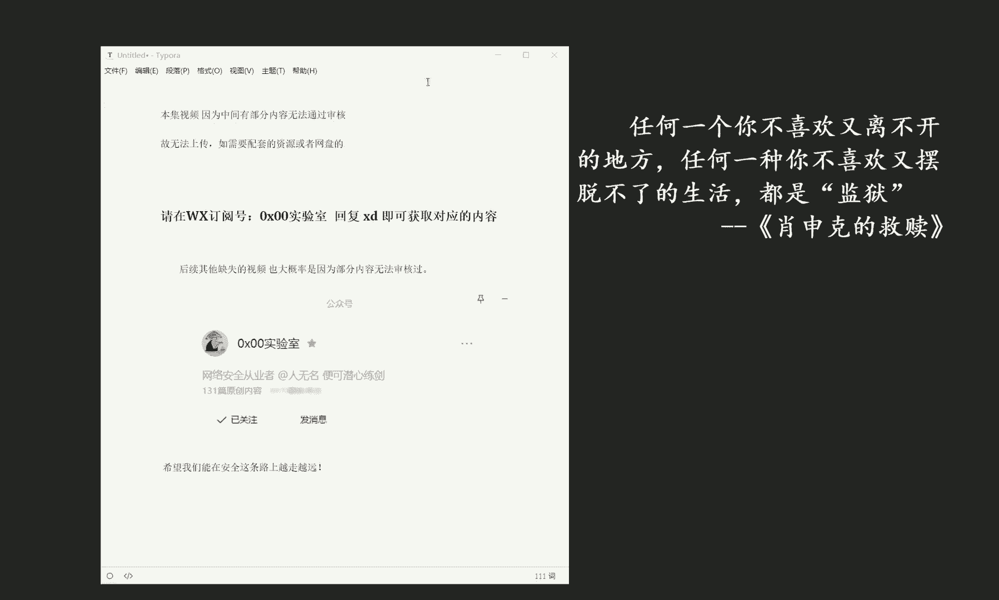
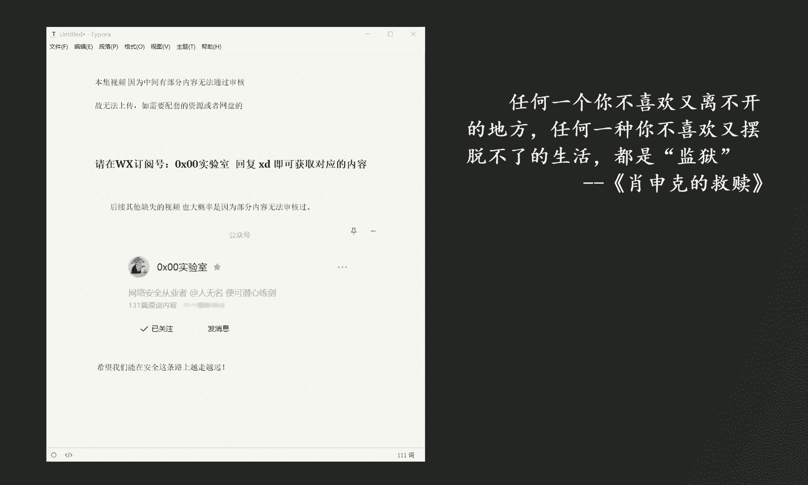

# 课程P11：ChatGPT注册、安全与高效应用指南 🚀

在本节课中，我们将学习如何注册并开始使用ChatGPT，同时探讨如何安全地将其融入技术工作流，以高效赋能我们的日常任务与项目开发。课程将涵盖从基础注册到高级应用的完整路径。



## 概述

ChatGPT是一款强大的人工智能对话模型，能够协助完成代码编写、问题解答、内容创作等多种任务。掌握其安全高效的使用方法，能显著提升个人与团队的生产力。

上一节我们介绍了课程的整体目标，本节中我们来看看具体的注册与初步体验步骤。

## 注册与初步体验

要使用ChatGPT，首先需要完成账户注册。以下是详细的注册流程。

1.  访问OpenAI官方网站或ChatGPT应用页面。
2.  点击“注册”或“Sign Up”按钮。
3.  使用电子邮箱地址创建账户，并设置密码。
4.  查收验证邮件，点击链接完成邮箱验证。
5.  登录账户，即可开始与ChatGPT进行对话。

完成注册后，你可以直接在对话框中输入问题或指令，例如：“请用Python写一个计算斐波那契数列的函数。” ChatGPT会立即生成相应的代码或回答。

## 安全使用准则

将AI工具融入工作流时，安全是首要考虑因素。我们需要建立规范，以保护数据和隐私。

以下是使用ChatGPT时需要遵守的核心安全原则。

*   **不输入敏感信息**：切勿在对话中分享个人身份信息、密码、API密钥或公司内部机密数据。
*   **审查生成内容**：对于ChatGPT生成的代码或建议，必须进行人工审查和测试，不可直接用于生产环境。
*   **了解数据政策**：熟悉OpenAI的数据使用政策，明确你的输入数据可能被如何处置。

遵循这些准则，可以最大限度地降低使用风险。

## 融入技术工作流

ChatGPT不仅能回答问题，更能作为编程助手深度融入开发流程。上一节我们确立了安全边界，本节中我们来看看如何具体地将其用作技术伙伴。

你可以通过以下方式让ChatGPT协助编码任务。

*   **代码生成与解释**：描述你需要的功能，让ChatGPT生成代码片段。例如：“用JavaScript写一个表单验证函数。”
*   **调试助手**：将报错信息粘贴给ChatGPT，请求它分析可能的原因和解决方案。
*   **技术方案咨询**：在项目选型或架构设计初期，向ChatGPT咨询不同技术栈的优缺点。

一个典型的代码生成指令如下：
```python
# 用户指令：“写一个Python函数，用于判断一个数是否为质数。”
def is_prime(n):
    if n <= 1:
        return False
    for i in range(2, int(n**0.5) + 1):
        if n % i == 0:
            return False
    return True
```

## 高效赋能与需求拓展

要充分发挥ChatGPT的潜力，需要学习如何高效地提问，并探索其多样化的应用场景。

高效的提问能获得更精准的回答。以下是优化提问的几种方法。

*   **提供上下文**：在提问时，简要说明背景和目标。
*   **指定格式**：明确要求回答的格式，如“请列出步骤”、“请用表格对比”。
*   **分步进行**：对于复杂任务，将其分解为多个子问题依次提问。

除了编程，ChatGPT还能在以下场景中提供帮助。

*   **内容创作**：协助撰写文章大纲、邮件、报告等。
*   **学习与翻译**：解释复杂概念，或进行不同语言间的翻译。
*   **头脑风暴**：为项目名称、创意想法提供灵感。



## 总结

本节课中我们一起学习了ChatGPT的完整入门路径。我们从注册账号开始，强调了安全使用的核心原则，并深入探讨了如何将其作为编程助手融入技术开发。最后，我们掌握了通过优化提问来高效赋能各种任务的方法，并了解了其广泛的应用场景。正确且安全地使用ChatGPT，能使其成为我们学习和工作中强大的增效工具。