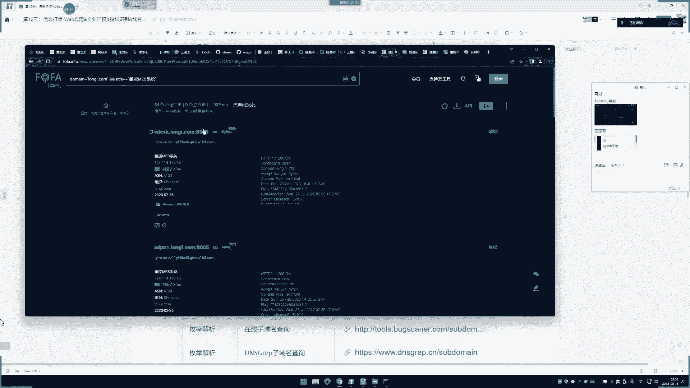
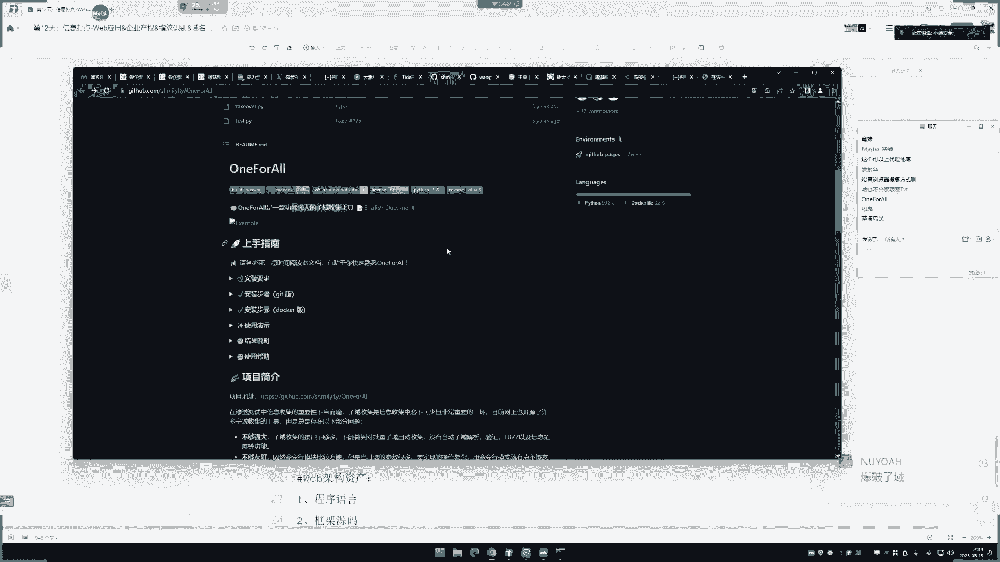

# P12：第12天：【信息打点】- Web应用&企业产权&指纹识别&域名资产&网络空间&威胁情报 🎯


## 概述


在本节课中，我们将学习信息收集的第二个核心章节，重点聚焦于Web应用。我们将从企业资产入手，逐步深入到域名资产、子域名发现、网络空间测绘以及Web应用指纹识别。本课程内容整合了SRC实战中的技巧，旨在提供比基础课程更细致、更全面的信息收集方法，为后续的漏洞挖掘工作打下坚实基础。

---

## 一、 企业资产信息收集 🏢

上一节我们介绍了基础信息收集，本节中我们来看看如何从企业维度入手，拓展攻击面。信息收集的起点往往是一个目标，这个目标可能是一个IP地址、一个网址，或者更常见的是一个公司或单位名称。如果目标是后者，我们需要利用企业查询平台来摸清其业务资产轮廓。

企业查询的主要目的是：
1.  **拓展关联目标**：发现目标公司的分公司、子公司或关联企业，这些都可能纳入测试范围。
2.  **梳理业务资产**：明确目标公司拥有哪些类型的数字资产，例如：官方网站、移动端APP、PC客户端、微信小程序、微信公众号等。不同类型的资产可能承载着不同的业务和接口，是独立的测试入口。

以下是常用的企业信息查询平台：


*   **爱企查/企查查/天眼查**：国内主流平台，信息较全。其中爱企查的“知识产权”栏目尤其有用，可以查到公司备案的网站、注册的APP、微信公众号等。部分高级功能需要会员。
*   **小蓝本**：免费平台，可以作为补充查询，但数据可能不如付费平台全面。
*   **国外平台**：用于查询海外企业。


**核心操作**：在平台中搜索目标公司名称，重点关注“知识产权”、“网站备案”、“软件著作权”等栏目，记录下发现的**网站域名、APP名称、微信公众号**等信息。

---

## 二、 Web应用资产收集：域名发现 🌐

在明确了目标企业的Web应用方向后，我们需要对这些Web应用（主要是网站）进行细化信息收集。第一步就是尽可能多地发现与目标相关的域名。


域名收集主要分为两大类：**主域名（单域名）**和**子域名**。

### 2.1 主域名收集


主域名是指像 `example.com` 这样的核心域名。收集方法如下：


1.  **备案信息查询**：
    *   **原理**：通过国家工信部备案系统，查询目标公司名下备案的所有网站。
    *   **平台**：`[备案信息查询接口]`
    *   **方法**：输入公司名称或已知域名，即可查询到所有关联的备案域名。


2.  **企业产权信息**：
    *   **原理**：利用第一节提到的企业查询平台（如爱企查），在“知识产权”中查找其注册的网站信息。


3.  **域名注册反查（Whois）**：
    *   **原理**：查询目标可能注册但未投入使用或未备案的域名。例如，公司拥有 `example.com`，可能也注册了 `example.net`, `example.cn` 等。
    *   **操作**：在域名注册商网站（如腾讯云、阿里云）的查询框，尝试输入目标名称前缀+不同后缀（.com, .net, .cn等），查看注册状态。已注册的域名可能与目标相关。


4.  **IP反查域名**：
    *   **原理**：如果已知目标的一个IP地址，可以查询有哪些域名解析到了这个IP上，从而发现新的关联域名。
    *   **平台**：`[微步在线]`、`[IP反查接口]`
    *   **公式**：`IP地址 -> 反向DNS查询 -> 域名列表`


### 2.2 子域名收集




子域名（如 `admin.example.com`, `api.example.com`）常常对应着不同的业务系统，是重要的突破口。收集子域名主要有五种原理：


以下是五种子域名发现方法的原理与工具：


*   **DNS历史记录查询**：
    *   **原理**：查询域名历史上的DNS解析记录，即使记录已删除，也可能被存档。
    *   **平台**：`[DNS历史查询平台]`
    *   **输出示例**：可能发现已停用但仍有历史记录的子域名，如 `old-api.example.com`。


*   **证书透明度（CT）日志查询**：
    *   **原理**：HTTPS证书在签发时会被记录到公共日志（CT Log）中。通过查询目标域名的证书，可以找到使用同一张证书的其他域名，其中常包含子域名。
    *   **平台**：`[证书查询平台]`
    *   **前提**：仅对启用HTTPS的网站有效。
    *   **代码逻辑**：`搜索证书颁发者（Issuer）或证书中包含的域名（SAN） -> 获取关联域名列表`


*   **网络空间搜索引擎**：
    *   **原理**：利用搜索引擎主动爬取并索引全网设备信息，通过特定语法搜索关联资产。
    *   **常用平台**：
        *   `fofa.so` (语法：`domain="example.com"`)
        *   `quake.360.cn`
        *   `hunter.qianxin.com`
        *   `zoomeye.org`
    *   **优点**：不仅能找到子域名，还能发现开放端口、服务横幅等信息。




*   **威胁情报平台**：
    *   **原理**：聚合各类安全数据（如恶意软件分析、攻击事件），其中包含大量的域名关联信息。
    *   **常用平台**：
        *   `x.threatbook.cn` (微步在线)
        *   `ti.qianxin.com` (奇安信)
        *   `ti.360.cn` (360)
    *   **输出**：可查询域名的解析记录、关联子域名、历史Whois信息等。


*   **子域名枚举（爆破）**：
    *   **原理**：使用字典，暴力拼接常见子域名前缀（如 `www`, `api`, `admin`, `test`），然后尝试DNS解析，能解析成功的即认为子域名存在。
    *   **工具**：这是最直接、最常用的方法。
        *   **在线工具**：`[子域名枚举在线接口]`
        *   **本地工具**：**OneForAll** (推荐)
            *   **特点**：集成了枚举、证书查询、DNS记录查询等多种数据源。
            *   **安装与使用**：
            ```bash
            # 1. 安装依赖
            pip install -r requirements.txt
            # 2. 运行工具 (Python3.6+)
            python oneforall.py --target example.com run
            ```
            *   **结果**：工具会在 `results` 目录下生成包含子域名、IP、状态等信息的文件。


---


## 三、 Web应用指纹识别 🔍


在获取到目标域名后，下一步是识别其技术架构（指纹）。了解目标使用的技术栈有助于快速定位可能存在的漏洞。


指纹识别主要包括以下信息：
*   **编程语言**：PHP, Java, Python, .NET等。
*   **Web框架/CMS**：ThinkPHP, Spring, WordPress, Drupal等。
*   **中间件**：Nginx, Apache, Tomcat, IIS等。
*   **数据库**：MySQL, PostgreSQL, MongoDB等。
*   **操作系统**：Linux, Windows等。
*   **CDN/WAF**：是否使用了Cloudflare、阿里云CDN、安全狗等。

以下是常用的指纹识别方法：

*   **在线平台**：
    *   **潮汐指纹** (`finger.tidesec.com`)：社区驱动，指纹库较全。
    *   **云悉指纹** (`www.yunsee.cn`)：商业化平台，识别准确度较高。
    *   **WhatWeb** (`whatweb.net`)：国外知名工具在线版。
*   **浏览器插件**：
    *   **Wappalyzer**：安装后，访问网站时自动在浏览器工具栏显示检测到的技术栈。
    *   **安装方法**：在Chrome或Edge的扩展程序商店搜索 “Wappalyzer” 并添加。
*   **本地工具**：
    *   **WhatWeb**：命令行工具，可批量扫描。
    *   **EHole**：专注于识别易受攻击的框架和组件。


**重要提示**：
1.  **识别局限性**：指纹识别并非万能。大型互联网公司或高度定制化的系统可能使用自研框架，无法被公开指纹库识别。
2.  **结果验证**：识别结果（尤其是漏洞关联）可能存在误报，需要手动验证。
3.  **思路结合**：对于识别不出的目标，需要结合其他信息收集手段（如目录扫描、JS文件分析、错误信息等）进行综合判断。


---


## 总结


本节课我们一起学习了Web应用信息收集的核心流程：


1.  **起点定位**：从**企业查询**开始，绘制目标的业务资产地图，明确Web、APP、公众号等不同方向的测试入口。
2.  **域名扩张**：针对Web应用，采用**备案查询、反查、CT日志、空间引擎、威胁情报、枚举爆破**等多种方法，尽可能全面地收集主域名和子域名。
3.  **技术剖析**：对发现的网站进行**指纹识别**，快速掌握其使用的编程语言、框架、中间件、数据库等技术栈，为后续的漏洞利用提供方向。


信息收集是一个“细”和“全”的过程，需要根据目标特点灵活组合不同的工具和方法。下节课我们将继续深入Web应用信息收集，探讨在指纹识别之外，如何通过目录扫描、JS文件分析、参数提取等技术获取更深层次的信息。