# P17：第17天-语言框架&开发组件&FastJson&Shiro&Log4j&SpringBoot等 - 逆风微笑的代码狗 - BV1Mx4y1q7Ny

呃挖宝的最后一讲其实也不算最后讲啊，因为还有很多内容还是相关的，但是呢都是一些工具了，工具单独放在一个篇章去讲啊，工具太多太零散了，我们就单独放个课程，一节课的打水工具都介绍完毕啊，前面没有讲工具的。

就是一些手工方面的，我们看今天的内容啊。

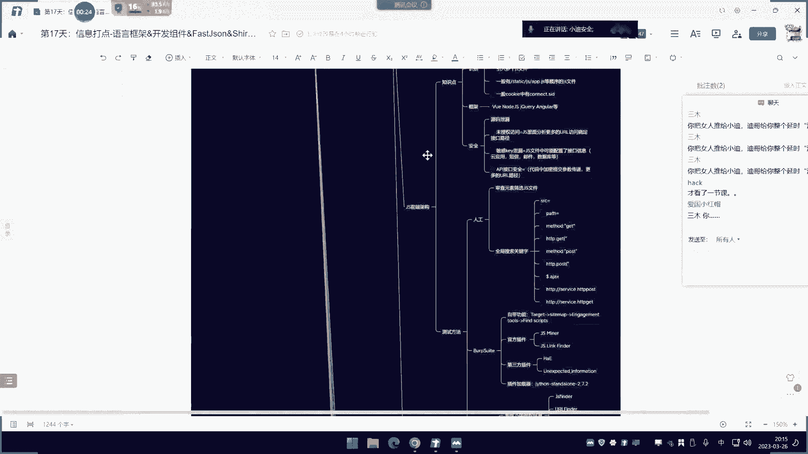

今天呢其实主要讲的就是针对前面的，我不是写的这些web的组成吗，什么CMS啊，前端技术，后端的语言啊，什么中间件啊，应用服务器啊，数据库类型啊，操作系统啊，包括机主机上面的什么这个协议服务。

包括有没有CDN，有没有WAF，是不是蜜罐，这是我们前期呢前面几个星期打点呢，把它删过来了，还有一个就是我们说的其他组件，那为什么要把这个其他组件呢划分内内，其实这个其他组件呢。

我们可以把它归类到cm里面去，但是由于这个其他组件呢它有一些差异之处，所以我们还是把它归类到单独一个篇章，去给他讲，那今天就是围绕这个讲，这节课呢说实话比较偏向于实际情况，但是他的这个内容比较少。

内容比较少，就说原理方面的讲的不是很清楚，但是思路方面是点的很明白的，其实呢就是关于这个cm一个识别，然后呢关于这个开发框架和组件的一个东西，那这就是啥意思呢，其实就是解决三个问题啊。

就是我们前期呢通过这个3MS识别，去识别出这个程序的源码啊，这是识别出程序源码，那么识别输入程序源码之后呢，有一些源码它是识别不到的，呃，因为这个CMS识别呢，大部分的一些cm呢。

识别的这个技术和工具都是识别的，以PHP这个语言开发的一些程序为主，那么如果是像什么Python java开发的应用就比较少，因为这种项目开发出来的第一个是程序比较少，第二个呢它一般都是不公开的。

pp的大部分都是开源的，就是网上能够下载到的，所以说这个CMS技术呢，它的大部分的一个针对性的，都是针对这个PHP开发的这个web应用，那如果说换成什么java的。

或者说这个利用其他语言来开发出来的web环境，就可能呢这个cm这个实力就在这里，能用起来的话就会出现很大问题，所以说这是他的第一个问题，第二个问题就是java里面呢，他和这个pp里面不一样。

它很多东西都会有一个组件，都会有一个组件，什么组件啊，我们给大家详细说一下啊，这个组件那个意思呢，就是我们所有的一个拓展吧，可以理解为一个拓展，除了组件之外呢，还有我们说的一个框架框架。

这个框架又是上限啊，这个框架的一个解释呢，其实就是语言在开发这个程序的时候，选用的一种框架技术，呃，就像我们假如假如说简单一个例子啊，这个框架的其实就是一个模板，就比如说你要开发一个文件上传功能的话。

你呢用蓝时代嘛一点点去写，就是说啊文件先接收文件，再把它怎么处理，再把它上传到哪里，再怎么处理是吧，就要写一大堆这种逻辑出来，第一步，第二步，第三步，第四步，第五步。

那么框架呢就可以把它理解为11算什么，就是我们说的啊简单代码的一个整合，怎么哭，然后呢如果你使用这个框架开发的话，就只需要啊学习使用框架呢调用功能，调用这个调用即可啊，就很简单，他是这个代码一个整合。

它就相当于说例子啊，我就说如果这个一个文件上传是吧，是一个文件上传功能是需要很多代码来实现的，这个框架呢就把这个封装啊，就把这个把这个什么代码呢来进行这个，封装，那么使用它直接调用即可调用使用即可。

就这个意思啊，其实呢它就是一个很多小地方呢，把它封装在一起，别人那就可以利用这个框架的实现一个功能，他其实就是把一些写好的，就比如说你写个文件上传好，那么你写好了，然后呢。

这个时候一串代码中有需要用的功能对吧，你就又写一遍，那么框架呢就不能完美的解决这个事情，用这个框架呢它就封装好了一个函数解决，就比如说他把这个文件上传功能呢，包括文件上传的功能里面有没有过滤。

它都写好了，你只需要调用，按照他使用的逻辑，其实呢就是我们说的代码中的函数，就是这么个意思，就是没有函数的时候，你需要一点点去哪，有函数之后直接调用函数实现什么功能，比如说我进行一个加密。

一个函数一引用啊，就加密了对吧，他就和这种函数一样的，就是别人已经体现好吧，这个东西它封装好了，这种我们叫做框架，那么有很多源码呢，它是使用这个框架开发的，也就是说它的核心逻辑呢。

是在这个框架本身的代码里面，那么另一印象就很清楚啊，如果采用这个框架开发的话，那么这个代码的安全性是取决于的吗，这取决于这个框架的这个过滤机制的，所以说为什么我们要把框架识别出来，就是要看它是什么框架。

这个框架有没有包括安全问题，因为你用框架开发的话，那么就是说很多代码都是用框架，自身的逻辑去写的，它里面有自己的过滤逻辑，对不对，好那么这个是框架，那么还有一种呢就是我们说的这个组件，这是啥东西呢。

组件就是一些额外的是第三方的一些这个功能，组件，功能模块可以这样去理解啊，如果说像很简单的道理啊，你这个网站呢需要什么日志记录啊，或者这个数据监控啊，或者说这个数据转换呢啊等啊，这种操作呢。

它就会调用一个组件来专门来处理它，就是专门去处理某一个事情的啊，某一件事情功能机制的啊，对对就是简单的就是专门搞这个视频的啊，他也不做其他东西啊，就这么一个情况啊。

就是说这个框架和组件的大概情况介绍完毕啊，我怕这样不解释的话，有些人不懂啊，后面说说说说昏了啊，好，那现在呢我们就来看一下这个比较关注的点啊，首先呢我们呢先给大家演示一下这个go to scan。

这个工具的使用啊，像这个什么，还有这个cm这东西前期没有演示过，我们前期用的是那个网上那个什么那个平台的，去解析cm s的啊，后面呢有人提出来说，如果说是内网的话，就用不了这个平台。

就像我们前面的用这个，就把这个这个潮汐平台或者是网上那种平台之。

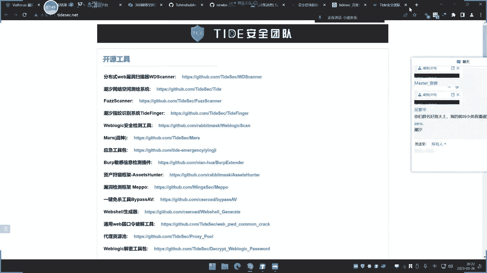

后啊对吧。

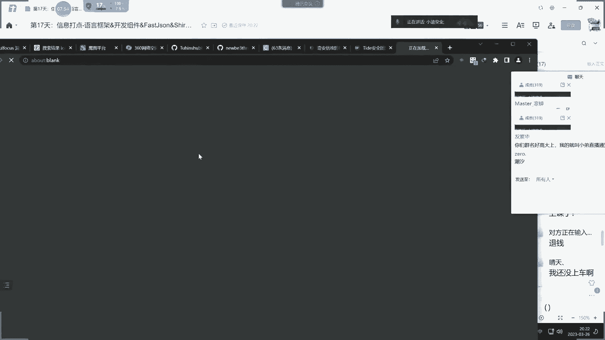

你就用这个平台呢，他就可以自己呢去帮助你的，去，在这里他就帮助你去识别这个程序嘛哈对不对。

这是我们前期自己说过的哈，这个大大大家都知道，但是你想象一下，他这个是一个连网状态，也就是说你需要填写目标之后呢，填写目标之后呢，在这里呢他去去探针是吧。

他去探针，但这个呢如果说你网络不通的话，就对方的目标它是个内网，或者说是个内网环境，你不可能把内网环境现在去识别都不行是吧，随着我们就有一款工具呢。

前面呢大家提到过什么SNK，这里还有一个叫go to go to school，给大家演示一下啊，这个呢就可以直接针对NEO环境啊，就是因为你放在本机，本机和通讯，那就可以直接用，我们可以简单用一下啊。

这也是解决了内网的环境，同时呢也给大家熟悉一下，这个这个这个这个东西的介绍啊，这里呢我们直接运行它，这里有个叫cm s j s n，这是它的识别的知识，所有的cm大家可以看一下来。

它其实就是扫描这个路径存不存在，然后它的路径文件对应的是不是个MD5值，来确定是什么，这里有多少条啊，有8000多个，然后按照四行一个，三行四行一个，那大概就是两三千个，是两三千个cm的一个情况对。

吧对不对。

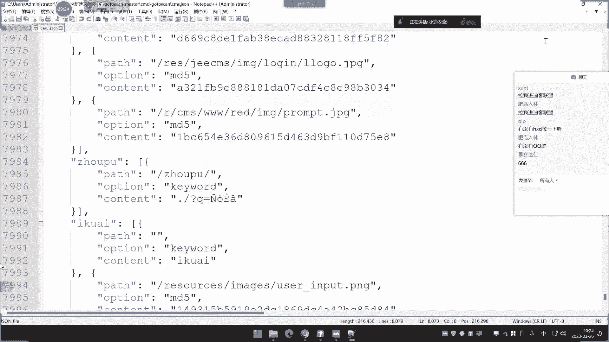

这也是说为什么推荐它的原因啊，我们可以自己简单给大家演示一下啊。

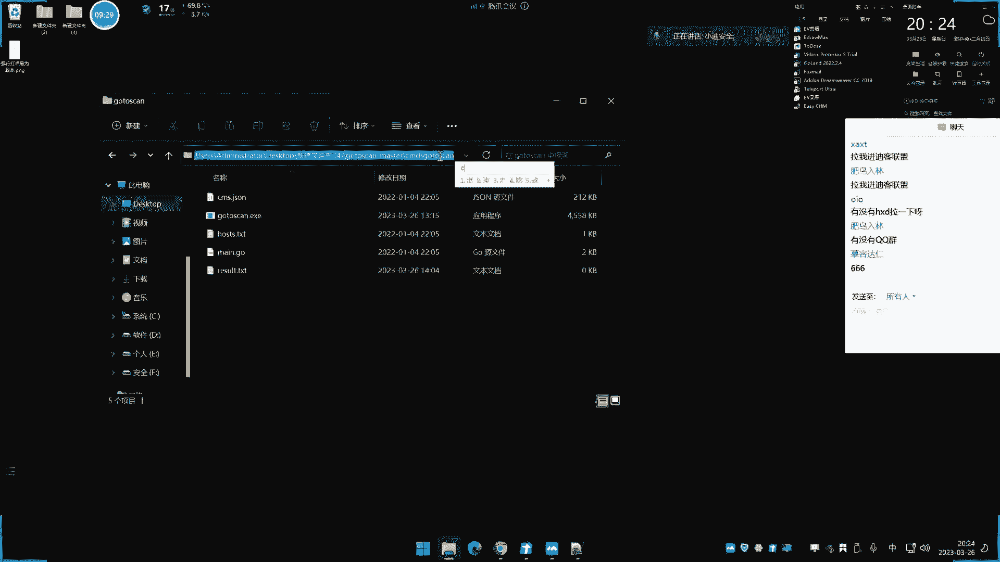

这个GDX直接执行它的执行参数呢非常简单，我们可以看一下这个项目说明。

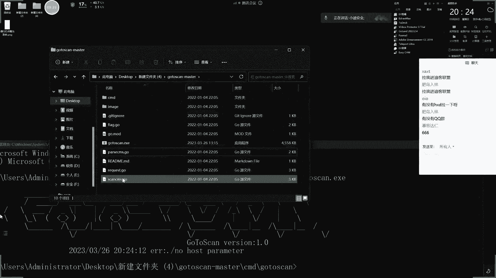

嗯没有说明在这里。

直接加上杠个host，然后呢这个目标地址单一的啊，比如说我们加个目标地址啊，那么他就会用这个里面的这个结果呢，去跑这个目标地址啊，然后这个目标地址可以是外网，也可以是内网，只要说能够和你通讯的都可以。

所以呢他就能解决这个内网的一个问题啊。

否则的话你用那个网络平台的就不能识别，所以这个呢就是说这个没有提前补充。

前面忘记跟他说的啊。

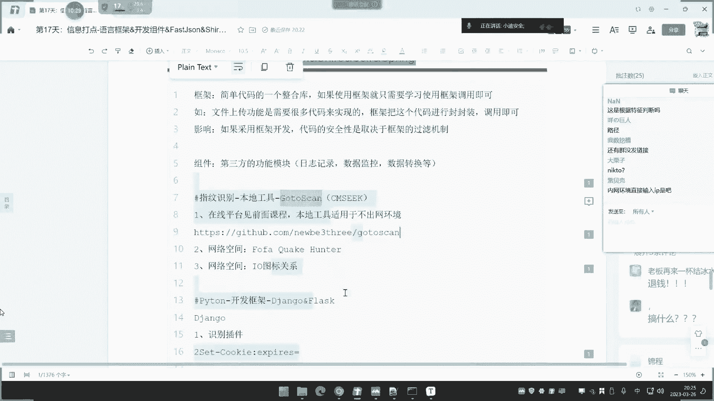

然后这是我们说的第一点啊，然后呢我们再来说这个几个语言的啊，我们今天讲的是基于这个Python和这个pp，还有java的这三个语言开发出来的，web产品的框架和组件的一个试点。

那么由于PP里面的组件相对较少，我们呢可以把它不去讲它的组件，Python呢也是一个道理，所以我们Python和pp这两个语言里面呢，我们是选取它的开发框架，在Python里面少写了个H。

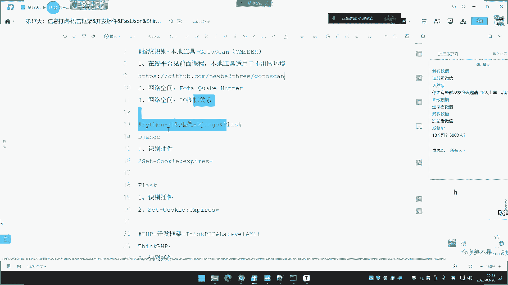

这个还在扫啊，因为他这个解有2000多个cs啊。

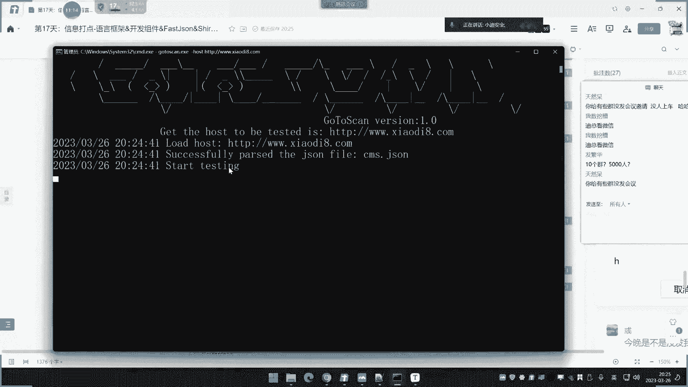

这个也需要点时间，最后一个判断，我等下去看一下这个问题，那么在Python里面呢组比较知名的web开发框架，就说如果用Python语言去写这个网站应用的话，一般如果他用到框架的话。

就会用到JJUNGLE和FAK，这两个都是比较知名的，用的最多的啊，对不对，嗯刚才有人说我没有发群吗，什么情况，哦我忘记发他们这个邀请群少发了个群啊，哎呀我真是服了啊，我少发了个群，这个刚刚看微信消息。

直接里面的100条消息，我这是得罪谁呀，他妈的忘记了，不好意思，把我吓死了，我孙子没什么手机，怎么一直在响呢，这个必须要微信群啊，不是想搞Q群啊，因为这个分享呢只能在微信群里分享，不能分享一个特邀的。

看一下这个框架的一个情况，哎呀别吵了呀，正常上课好吧，也没没说上上这个多长时间，他妈的一下子哎呀，我现在真想吃个瓜，我真想吃个瓜，有个神经病给我发50条消息跟我说退钱，唉算了算了。

我讲课不耽误大家时间啊，我真是他妈服了，这个Python的这个框架啊，JOJO的这个东西啊，然后呢这个是他的这个开荒价，然后你看一下他的一个时点呢，主要针对的是一个插件方面呢。

然后呢这是这个里面的东西啊，还有个FISK好，大家可能会问我，这个识别这个框架有什么作用啊，对不对，是这样的啊，你像这个pp里面的这个开发框架，比较知名的是吧，ser pv lava和YI。

这个是国内用的最多的三个框架，那么这个新CPP呢也是报了很多次漏洞了，大家应该很多人都玩过这种漏洞哈，呃然后这个Python呢，因为他的WB上面呢还不是用的比较多。

所以大家看到Python搭建的web呢也比较少见，不过他用这个jungle和这个FISK呢，在什么CCTF的一些题型里面有碰到过，就有些CCF体系里面web攻防的体型呢。

他有些考菲斯科上面的一些安全漏洞和jungle，如果在实战中呢碰上了，不会和这个pp和java多啊，不过还是有呃，这里呢我们可以看一下啊，像我们这里一个非盟horse呢，这个是那个FOFA。

他们官方的去搞了一个这个漏洞演练靶场，这个呢后期也会用到，然后呢你可以看一下，他这个地方呢就是一个漏洞复现的一个平台，在他这个上面呢，你可以看到它这里呢是有区分很多种东西的。

你看这里有什么level是吧，那SLPP还有jungle，你看有这个东西是吧，然后在上面呢还区分这个语言，Go pp pal javascript，Ruby，No js，Java，C加加LLA。

还有这个post script，还有什么cup Python啊，这是各种，然后呢有些是比较穷内的是吧，有些JS的JS呢其实都是这个JS，只是这个是在框架，然后呢你看下面那还有这个数据库。

其实就是说它会漏洞产生在这些方向是吧，比如说我们今天讲的，比如说是浆果，那我们把它打开诶，他这里呢就能看到这个江狗，在CV12022年啊，这里出了个28346的一个漏洞，那么也就是说。

如果你采用这个JO开发的这个web应用的话，就会有这种安全问题的隐患，所以说这也是为什么我们需要识别它是什么，开发框架的意思，能理解吧，开发框架是这样的啊。

我们这里呢一定要把大家这个思路给他理清楚，这个源码的一个组成呢。

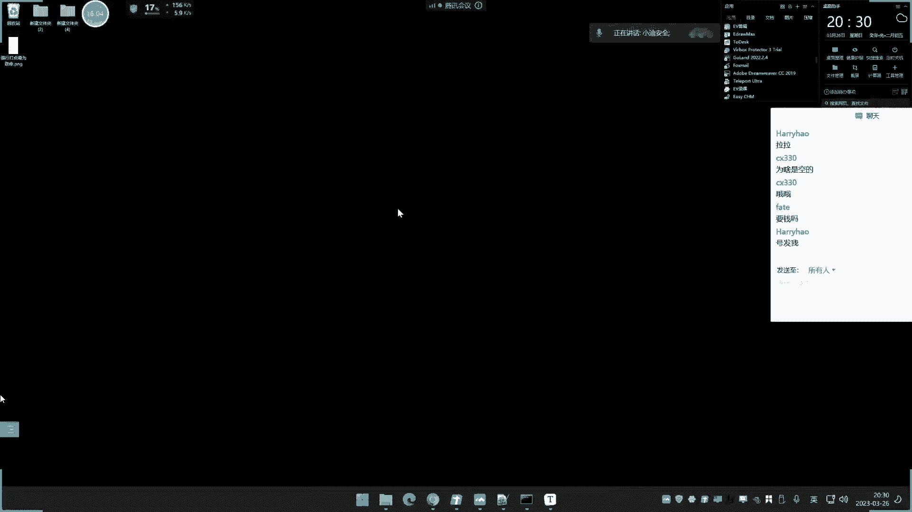

它是分三个方向的，我给大家来简单写一下啊，看这里啊，我把一个这个，加工啊，那底下几个加固，他第一种呢就是我们常规的，第二种呢就是三种呢，就是这样的啊，我们来给他写一下。

第一种就是说最简单最入门的开发模型，简单来说就是什么呢，功能代码全部手写好，这第一种啊，第二种啊，就我说的这种啊，叫什么框架，结合开发框架啊，然后呢在这个开发模型，那这种呢就是我们说的啊。

就是以这个框架呢为核心啊，这个实现这个功能啊，实现这个功能，这是他的第三种，然后呢还有呢就是啊解法框架之后呢，然后呢Y加什么组件，那么就是说以框架为核心实现功能，以逐渐的，啊然后呢主角呢，自行功能。

一般呢就是有这种三种架构的网站啊，那为什么我们要把区分识别出来，首先我们来看第一点啊，最简单最基本的开发模型是啥意思呢，就像我们自己去学一门语言去开发程序，就像大学一样，大学老师让你去实现的功能。

比如说你帮我去写个登录界面，写个登录功能好，你就自己写是吧，一点代码写啊，但这个页面怎么写啊，这个功能怎么写啊，就一定自己用代码去查去写一点点，用代码去写，这是第一种。

那么网站也是这么一个一种方式组成的，那么还有一种情况就是他会用到网上这种框架，这个框架是什么呢，就是别人已经写好封装好的东西，就是里面有很多，比如说这个上传文件的是吧，这个画图的。

或者说数据库操作的这个各种各样的功能，对不对，那么呢他就把这个功能呢全部封装在一起，你就调用这个框架里面自身逻辑呢去实现，也就是说你只只需要懂这个框架的使用，就可以写出很多功能出来，比如说数据库的操作。

那么框架调用什么东西啊，数据库操作就能开始进行啊，如果是以前的话，你就是吧，所以他说第一步该怎么，第二步该怎么，你就一点点去手写代码，那么这是第二种，第三种呢就是在框架基础上面呢又加上组件。

因为这个组件呢它又是专业功能，就是说框架上面可能没有的功能组件它有支持，他又加了个组件，那么就是完整的就是框架和组件的，我们为什么把它区分就很简单，针对我们这个安全体系来讲的话啊，就是完全思路来讲的话。

如果说是第一种的话，这种第一种思路的话，像这种第一种啊，它的安全思路就很简单的问题啊，它是最容易出现漏洞的啊，因为这个程序员的这个什么水平不一，没有这个什么第三方或团队这个检测，对不对。

就是单纯的这个什么自己写，所以他只是漏洞，第二点呢其实就是第三方案呢，团队呢开发的是什么封装代码框架，一般呢都勒直了，那个什么过滤机制，而且很简单，做安全测试者的话啊，我们主要攻击的就是这个框架动力。

它的核心是框架漏洞对吧，然后这个呢也是一样，他也和这个加了个组件，所以他关心的就是，他关心的是什么呢，就是框架和主线漏洞，我不知道大家我这样去解释，大家能不能听懂啊，这个东西是很难得去给他讲明白的。

我只能说用这口述的语言的去给他表示，我怕有些人，就是很多人在学我们的安全体系课程的时候，一直对这三方面非常陌生，不管我怎么讲，他都永远不明白，因为我讲不出来，你不是做开发的，你就不知道这个是什么情况。

你做过一次开发，你就大概知道了啊，就是你做开发的话，这句话是很好理解的，其实我们把它分区分开来，就是给大家把思路理清楚，把思路理清楚，就是你面对的是一个什么样，一个一个网站的一个体系，对不对。

那么很简单，我们识别它的话也非常好理解了，比如说我识别出这个框架，那么就是告诉我什么意思呢，我面对这个框架，我要搞他的话，就是面对这个框架，这个框架有漏洞，就是能搞，没有漏洞，就是不能搞，除了一种意外。

就是什么呢，就是它所引用的框架单词呢，他傻不拉几的框架呢写一半是吧，自己呢有手写板，就是半成品他会有这样的问题，这是啥意思呢，就是呢比如说框架规定的是这样去写这个代码，安全是吧，你呢有偏不用。

你就自己呢，比如说框架啊，我上传个文件，接下来四把文件做什么处理诶，你又不搞了，你就自己用自己，下面自己用自己代码去再把文件怎么处理，按照你自己逻辑就不用框架那个逻辑去搞哎，这个时候就是半成品。

就是上面的同样使用框架的这个逻辑，下面呢用你的逻辑，那这个时候也会出现安全问题，所以说呢识别框架出来没有框架的，没有漏洞，不代表就没有漏洞，还要看这个具体代码怎么写的，这是要有源码的情况下。

没有源码的话，那就只能黑盒测试，所以这是说我们说是有框架的意义啊，这3。1定要搞清楚啊，这是我们为什么伤这个课程的主要原因啊，你把这三点搞清楚之后呢，才知道这个东西识别的意义。

否则的话我们识别就是识别没有什么作用，那么这里的浆果是吧，那FISK你看啊，我们就拿这个来讲呢，你这里不是还有FISK吗，我打开诶，这里面他没有复习环境，但是它有有一些相关安全问题啊。

他这里没有不代表没有啊，还有啊哎，哦没有，然后呢你看这个这是Python的啊，然后呢你看pp的新和pp lava和YY是吧，你看这里他的新的pp打开，然后呢这个level吧SKPP呢他还只点了一个啊。

其实他还是有很多漏洞的，就是环境的问题，还有你网上搜你就可以看到它还是有漏洞嗯，这个上面那是有一些安全漏洞的一个收入啊，他这个平台你搜一个那个地址之前，我们要大家看过啊，这个识别出来之后打开。

这不是可以收漏洞吗，这个地方，但是呢他需要我登录是吧，你看这个，叫什么呀，哎这个没有开通会员啊，就是你在这里搜呢，它其实是很有很多漏洞的啊，这都是包裹的一些呢对吧，大家看到了啊，应该是刚才看到了。

所以说呢你就知道这个意思了啊，never也是一样好，那么现在呢我们就先把这个Python和pp的，这两个识别的一些东西呢给大家说清楚啊，你看如何是判定是Python，然后呢又是JO的一个应用呢。

理清思路啊。

我们先来给他看一下啊，我们用这个呃发货平台来给大家看一下啊。

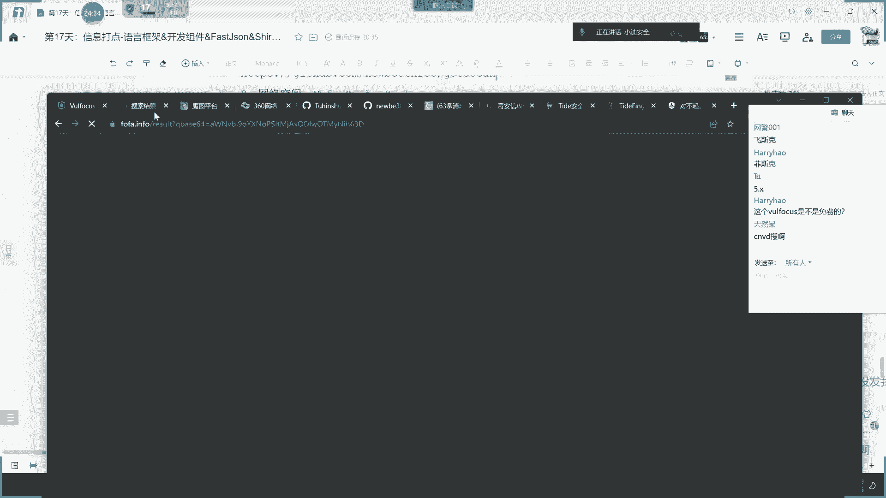

直接在这里我们搜一下这个JO啊，怎么老是让我登录啊，这又是被号被卖了吧，这，诶啥情况，你又被改了，我打了个底，不好意思，我还说这个得好好，密码都给我改了，我看一下我这边一个登录情况。

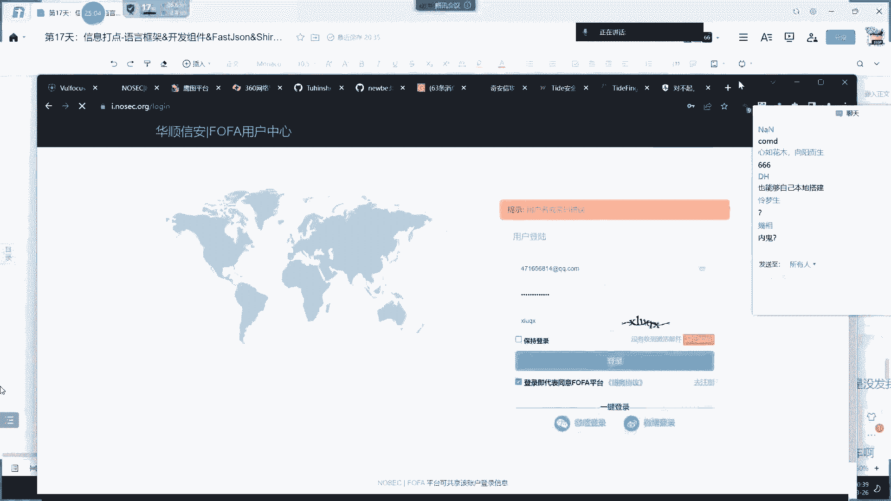

看下看下这个。

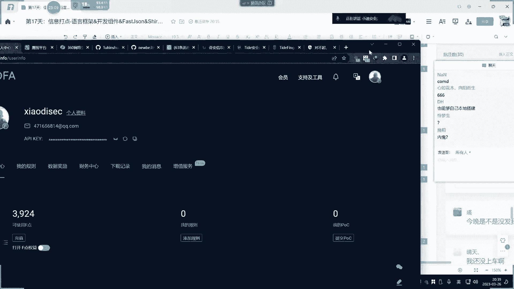

哎算了吧，不看了啊，等下再下去再看，你看啊我搜这个加个狗啊，JO呢它的一个主要的一个判定方式，是怎么个判定方式呢，大家可以看一下，你比如说我拿个类似JO网站来给大家看一下，就是用jungle开发的。

另外的找到国内的国外的方便帮啊，我们看下我们都是直接搜这个名字吧，不收这个东西在他管理啊，直接搜这个PJO，我看他有什么不一样的地方啊，就是说如果说是浆果的一个框架的话，那我们可以打开看一下啊。

所以呢你可以看到啊，这边呢它的一个返回的值里面打开的网站。

打开网站，我这里呢还是换一个地方打吧。

这个页面都太那个了啊，在那边看一下。

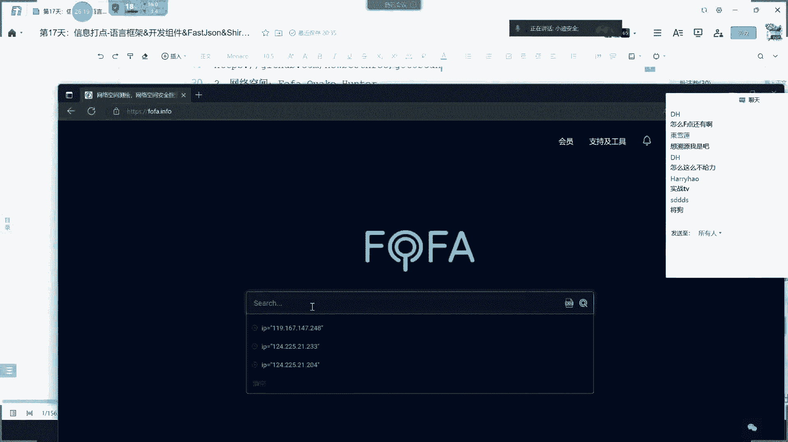

你看啊这里呢就是我们的一个这个东西啊。

你可以看一下这个网站，我打开了，那这个网站是这么个情况，大家大家看到了吧。

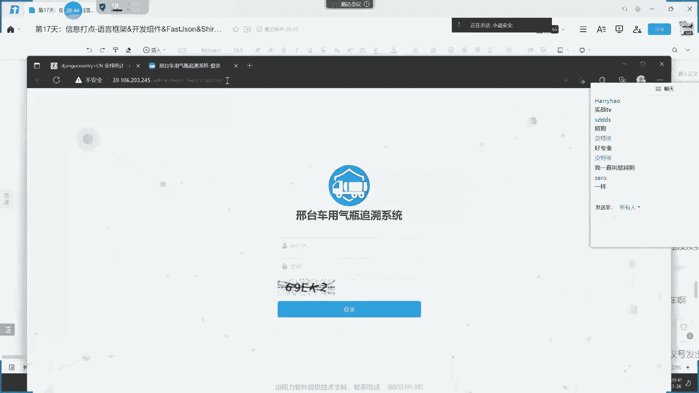

这个来你会不会意识到这个网站是什么语言呢，对不对。

那他怎么判定出来的，我们来帮他看一下，打开看一下啊。

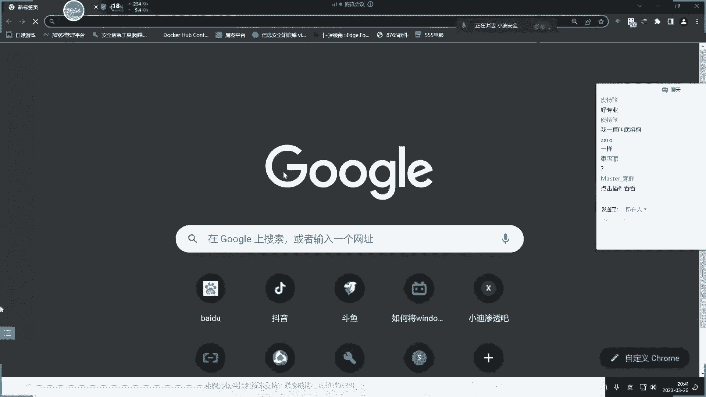

来从这个插件来看，你看是Python将功，他就说第一种方式是，可以通过这些插件和工具的判定出，他是这个的Python开发的web应用，不是PVP，也不是java，Python的web应用，用JO开发的。

就是这套程序是用JO开发的，你现在面对的就是Python的web。

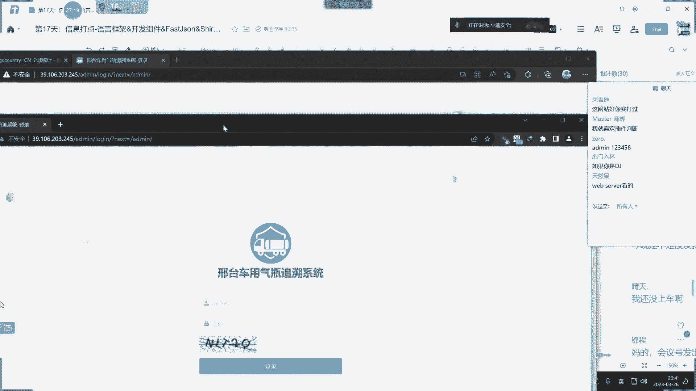

对不对，这个大家看到了啊，识别查就能看到，然后他还有一个显著特点。

就是我们可以看一下这个数据包，就是你访问这个数据包的时候，你可以看到啊，它的数据包浆果一个比较特点的东西，就是前面的一般会有这个东西啊，来叫什么cs就大概就这么个格式，大家可以往下面继续翻看。

很多JUNO的网站都不行，你看它的返回数据包里面都会有这么一个东西，都会有这种西。

这是一种jungle的一个特点，所以我们可以通过这个特点来判定你是不是java。

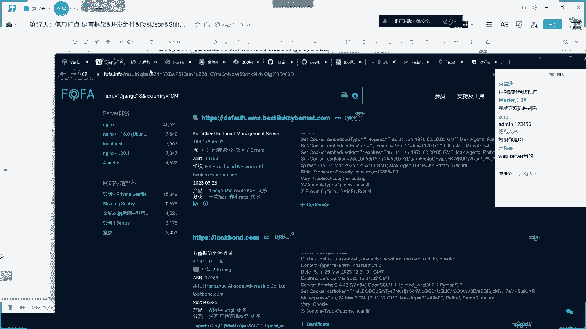

就是除了这个之外对吧，所以说jungle这个判定呢，就可以通过插件和这个数据包里面的，sync的关键东西啊来去判断。

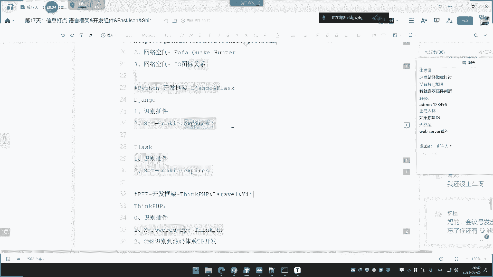

然后呢除了这个之外，它里面呢都TYSON的一个环境里面呢，都会带有一个值啊，然后呢这个是我们说的这个jungle的啊，你看这个FISK的啊，我们来看FISK。

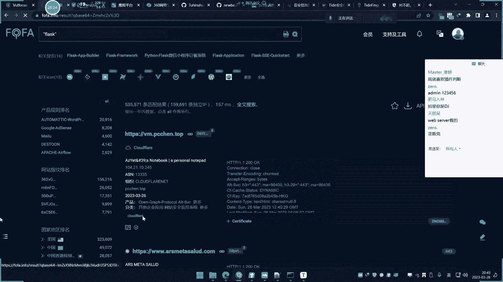

然后我打开这个看一下啊。

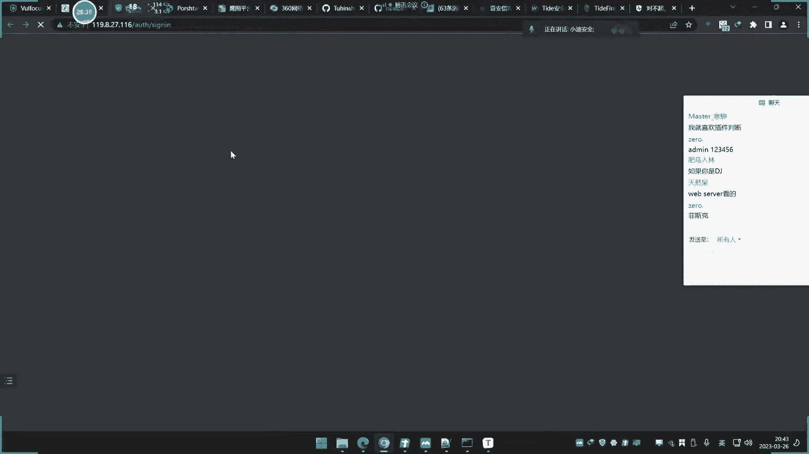

这个FISK我们来看一下这个识别查询这里，那这个应该不是是个错误的。

看一下和压面。

还是要打那个打那个app。

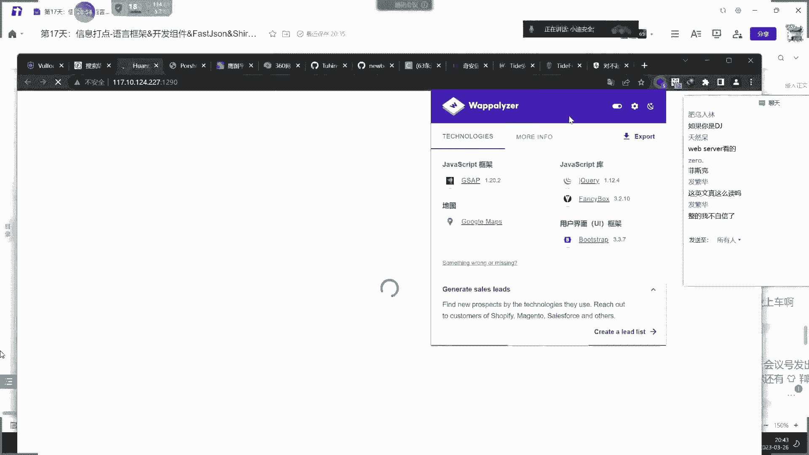

前面等于不应该这样直接打，这个是有些关键字都会带东西，就这样打，这样打会好一点，打开。

Python证明没有识别出来。

看这边的也没识别出来，我们看看他的数据包，你看这是有T几等于FISK，看来，下面这里有个东西吧，呢上面那FISK他有些人就会泄露这个东西呢，Fisk。

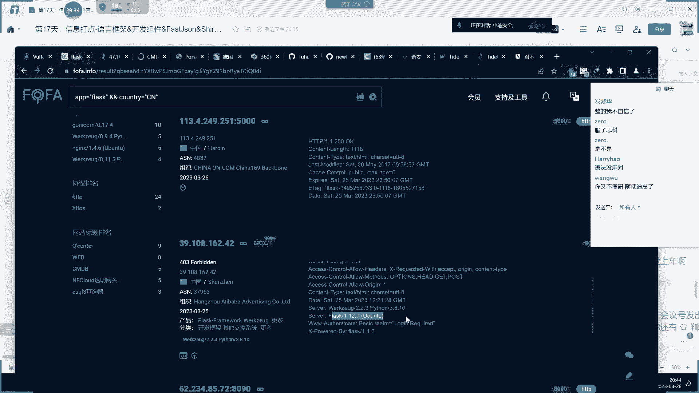

就是说有现在它会泄露啊，并不代表说所有东西都会这样啊，不是说搭建的就一定有，他有些可能会学会隐藏，就是它不显示这个信息，他也有这种情况啊，所以说你这个不能说当做尾盘的，就是有这个东西呢。

没有这东西啊，就一定不是啊，不是这个意思啊，就是说他常规的是有的啊。

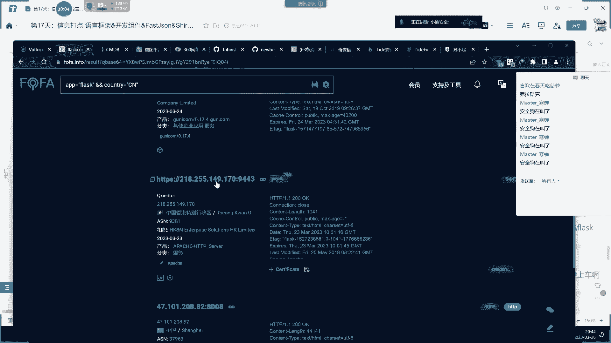

如果他没有的话，可以通过这个隐藏掉，就说对方的回血信息里面不给你显示个信息。

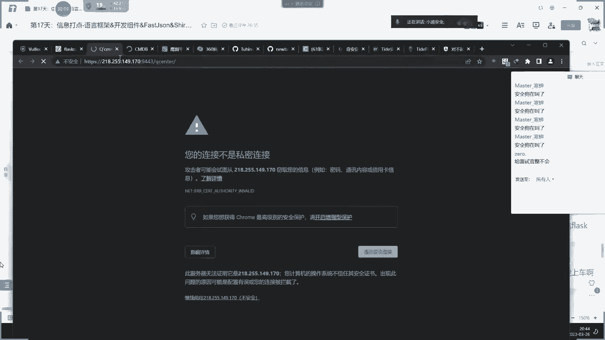

这个也是有情况的啊，那如果碰到那种情况，那就只能通过其他的方式去再做升了。

就比如说啊他是不是Python语言开发的呀。

啊去对应一下呀啊这种意思啊，你看这种呢就是框架是不出来，但是呢他从这个包里面有一些特定的，菲斯克的一些关键东西，你看很多地方都有，简单来说啊，他都是通过web的一返回包，或者框架的一些那个插件识别。

包括他的一些其他东西来佐证，最后能确定他是个什么情况。

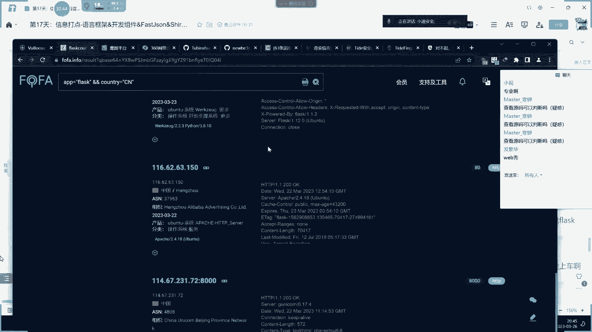

所以这就是我们说的这两个东西的啊，Python里面的两个东西一个点，那么像pp新的PP的开关呢。

也差不多的一个情况啊，我们看一下这个app的，那这个SP呢还有个东西我要给大家说的啊，也是要给大家说的single pp的啊。

他这里呢我们打开给大家看一下，这里已经说的很清楚了，这里也告诉你了。

黄河下QQ，所以说一个是插件能识别，这是最简单的，但是有些呢它可能识别不出来，有些呢它是简单识别不出来，怎么打开这个呢，这个呢框架也识别出来，能识别出来是吧，有些不识别的话。

你就关注一下这边的这个返回包里面啊，你看啊来tf word by呢，这里有个新的pp，对不对啊，你看这个就没有，你看这个就没有，所以说这个东西不好说啊，一定是唯一的这个就有。

但是这几个都是SPP由现在就是图标的信息，你看这个图标呢ICO泄露了，因为single pp的官方他的这个程序源码的一个图标，就是这个东西啊，你比较搞多的话就知道啊，这个这个图标。

所以说有些是可以通过图片判断。

还有现在就是我们说的数据包里面判断，还有就是我们说的这个组件里面去判断是吧。

就各种方式去判断啊，直到收集到是这么个东西啊，如果说都不行的话，那就凭经验判断啊，经验你可能问我什么经验啊，就是你有搞过SKPP的这个站点的话，你可以通过那个URL地址和那个返回情况，能够大概清楚。

是不是能理解吧，然后这个就是我们说的这个新的pp啊，新的pp的一个这个它的一个大概识别方式啊，基本上他们这些几种识别方式呢，都是通过插件返回包，还有一些图标信息泄露等等啊。

来去判断的，那这个是新的pp。

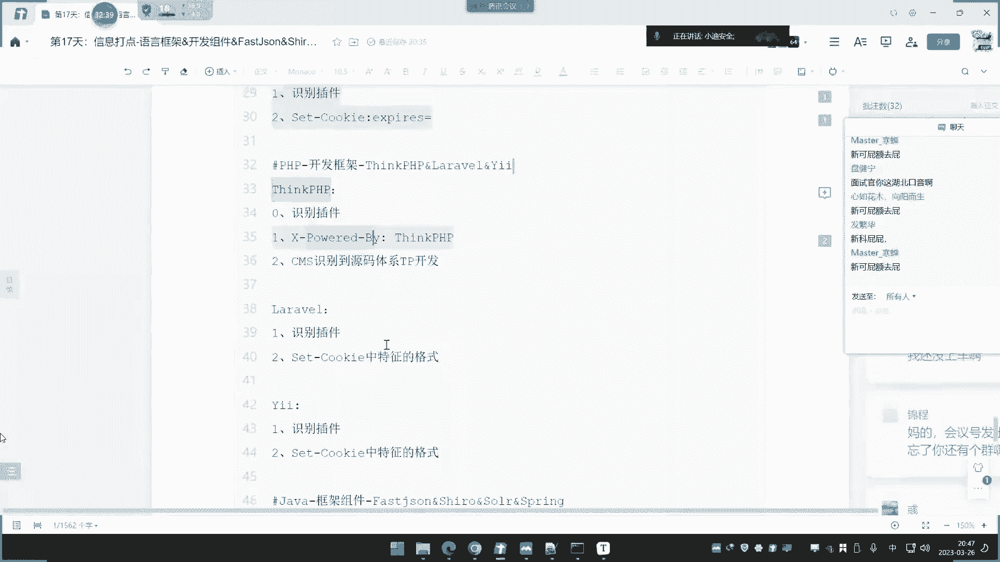

然后呢除了这个之外，还有一些呢，就是说即使识别不到，你也可以通过它的源码体系来识别。

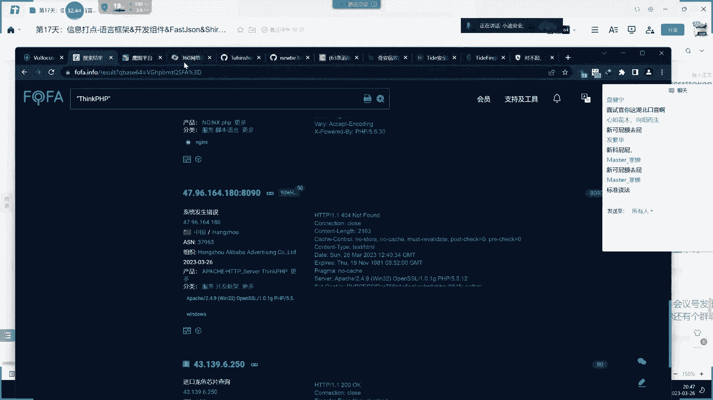

这是啥意思，这个呢我有必要给大家解释一下，我们来给大家看一下啊，我随便在网上找一个源码，比如说pp源码啊，那大家看一下啊，留下来我们找个pp的源码，pp的嗯，我们可以看一下啊。

我这里呢随便打开一个搜索关键字，我搜一下好，我们看一下啦，那这里有几个东西呢，你看这个叫什么TT签的聊天小程序，还有一个叫什么API后台管理系统是吧，这两个名字呢看上去是一种名字。

然后呢你可以看一下他的这个介绍里面啊，介绍里面是怎么写的，web API部分用的是新的pp，看到没，那这个也是了，基于性格，pp非5。1开发的面向API的后台管理系统，啥意思啊。

就是说它的核心还是用新的app开发的，只是他用他的这个框架去开发的源码，换了一个名字叫做API my，它的核心还是新的BP，还有这种情况知道吧，所以说你识别出它是什么cm属于是叫AME是吧。

SPIAME网上都能下到这个源码，但是你面对的还是SKPP，因为他用来开发的，那大家应该理解了吧，那像除了这个之外YY的是吧，也是一样的道理，YY比较少啊，这有了，那这个呢就像这个呢这一套程序。

基于YI开发的框架，简单一张全系统，这还有呢还有人多什么CMS企业建站呢，基于YY的框架来很多了，所以说这个框架呢，其实就是一个开发的一个模板，然后呢很多人呢就是用这个框架去开发成品。

把它功能一组就形成一个源码，其实它的核心呢还是框架，所以与其说我们去找他漏洞，不如说就是找这个框架也没有漏洞，因为这个框架如果包括漏洞的话，那么他用这个框架去开发的就会受到影响。

就是说如果说新pp包括漏洞，那么这些用新pp开发的就都会受到影响，就是这个意思能理解吗，我们收集它的原因，其实也是为我们后面的理清思路，我们后面会有一个案例给大家看一下的啊。

所以这个la呢我们可以看一下level和YY的，这个我相信也不再陌生了啊。

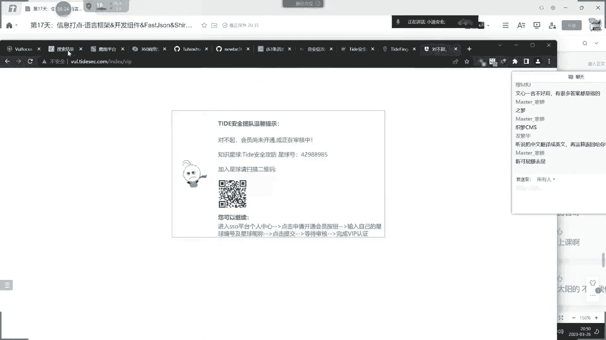

大概结果，嗯他的一个结果呢。

你打开看他这边呢也是看到知道是哪十个插件。

包括这个数据包里面也是一个固定的呢。

这也是很多都是固定的，那这个网站开发开发的网站叫什么石头笔记，这个呢是个什么停车场的一个系统对吧，给大家看一下啊。

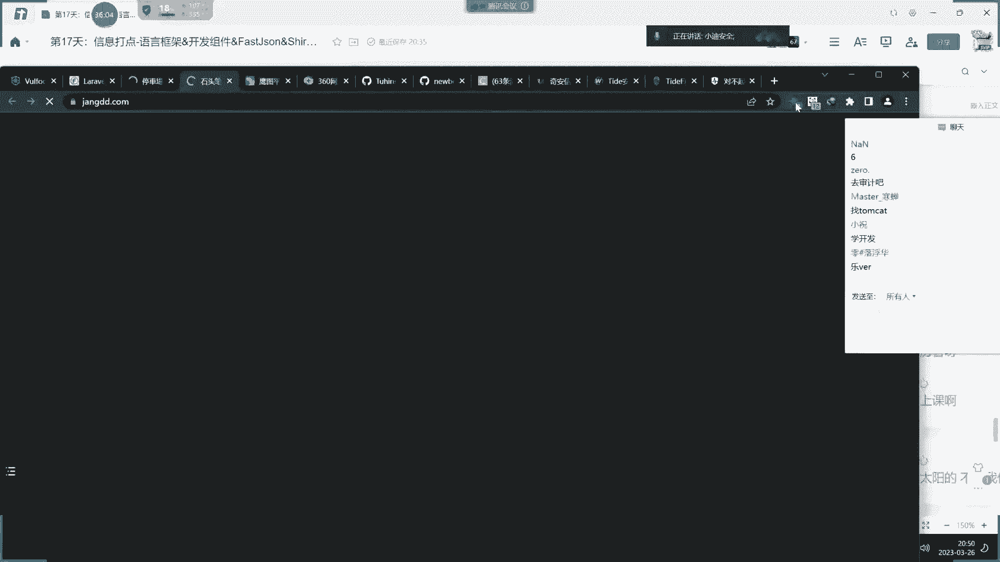

怎么这么卡呀，这两个币，这边这个没识别出来，是这个没识别出，是它识别插件上面没有识别出来，识别出来了不啊。

这个也好几次了，你来晚了，对不对，这个插件是方便，然后呢你可以看一下它，这个里面也会有一些关键字的C型的，还有像这个固定的那个什么xs for table，这其实都是他固定的。

这你可能会问这个东西是干嘛的，为什么这个固定呢，和上面那个什么星和PP那个什么YYY，为什么都有这个这个东西啊，我告诉你这是啥东西啊，你看看他有这个东西啊，这是啥东西啊，这是框架里面那个内置安全模式。

因为我们现在没有学习到那个cooking安全，和那个什么叫talking的一个东西，就是因为这个框架它开发出来是工人用的，用的人多了，他就会注意安全问题，团队呢就会保证这个安全问题呢。

在很多验证逻辑上面都会引入一个token字，脱贫呢就是保证数据包的唯一性，水呢它就会固定这个返回里面的绑定的top，所以导致他这个是固定的，那么也是成为判定他的一个标准，能理解吗，这是它的由来。

就说为什么这里会有一些固定的一些东西存在，就是因为框架里面的安全机制在起作用，他有些为了版权，他可能会前面直接写上他框架的名字，比如像这个LEVECATION是吧，如果说对方不去显示这个信息的话。

他去隐藏，那是另外的大部分不会隐藏，你就可以直接通过这个数据包的返回，和这个框架的一个识别插件里面就可以看到，这是不是一个level的一个网站源码是吧。

那这个网址打开是吧，这里呢只能说吧，然后呢你看我们数据包里面，我们可以抓个包来刷新一下，返回一下。

看一下啊，看到这个返回包里面，那就是回包，这里来发这个返回方法来RP放包里面，你看看是不是有个东西固定的，你看那还看到这个法的事情，你看这是明确告诉你，他是一个他用到lover开发的。

所以他就启用了lover的独特的安全机制，那么安那么的独特安全机制呢，就会在这些地方呢有这种东西，你问我这个东西是干嘛的啊，学到后面你就明白了，这是关于这种cooking和C型的一些。

安全问题的一些设置，如果说他没有这些东西的话，可能就会有这方面的安全问题，所以呢它是固定的，像这个lea yi都是这么个情况，生个BB的。

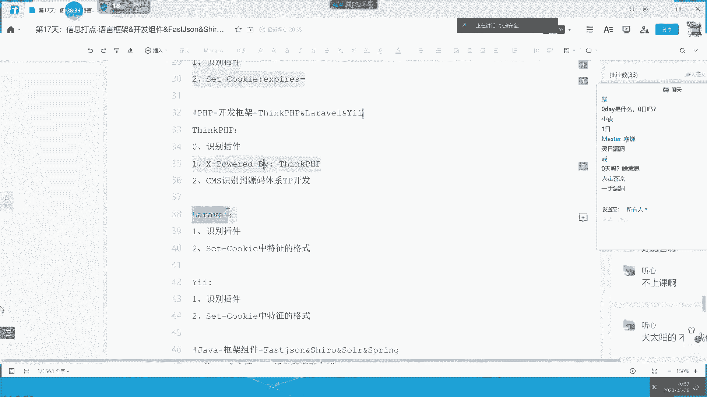

他也有，YI的也是一样。

我们可以看一下我的Y的，你看这个里面的也是一样啊，他这里面有很多东西都是固定的啊，你看这个固定值他这里没有写的，你看都是前面的都是固定的，你看这个网站的都不是一样的，网站呢你不要说这个都是说啊。

来你看还有很多东西，这个还行，YY的cs的yy cs cocos呢，他这个yy c s f token是干嘛的，我告诉大家这个是干嘛的，这是防止CSF漏洞的，防止CSR漏洞的，你可能现在没学过是吧。

很多东西都有更新呢，在固定的，有些有YY的，关键是有些没有，但是前面的东西都是一致的，但是前面都有西对都有道理。

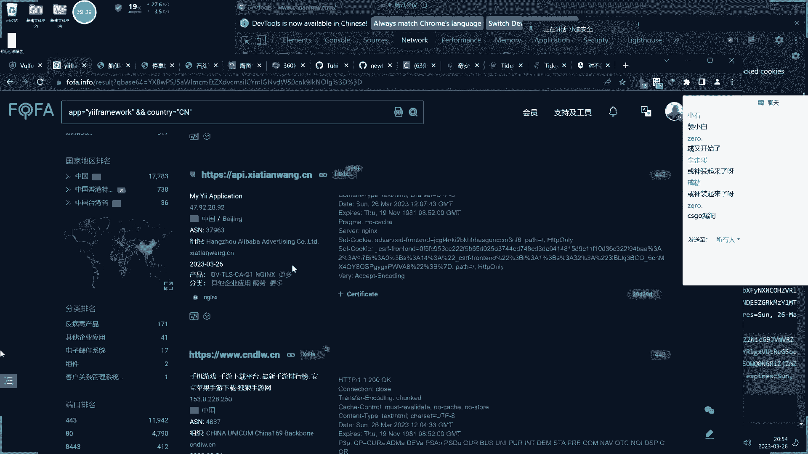

那你打开之后呢啊，能识别插件，能识别出来就就就有YY啊。

识别不出来啊，那就是识别不出来对吧，我们就看这种嗯。

他这种是返回的包啊，返回包里面去判断你把几个特点记住。

就可以把这几个特点记住就可以。

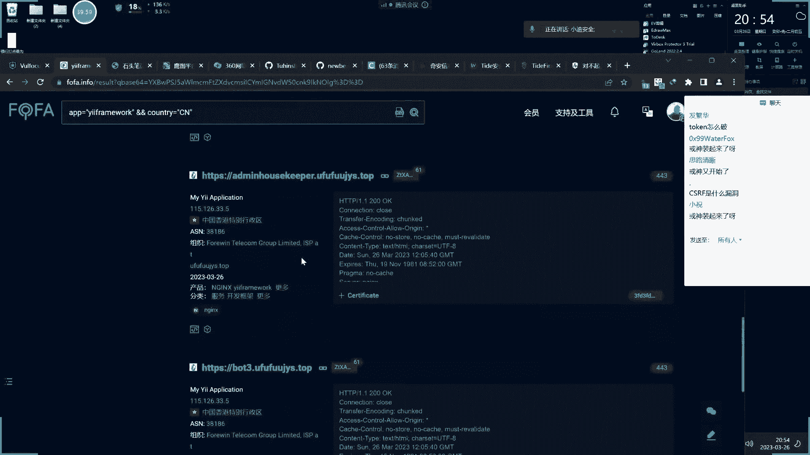

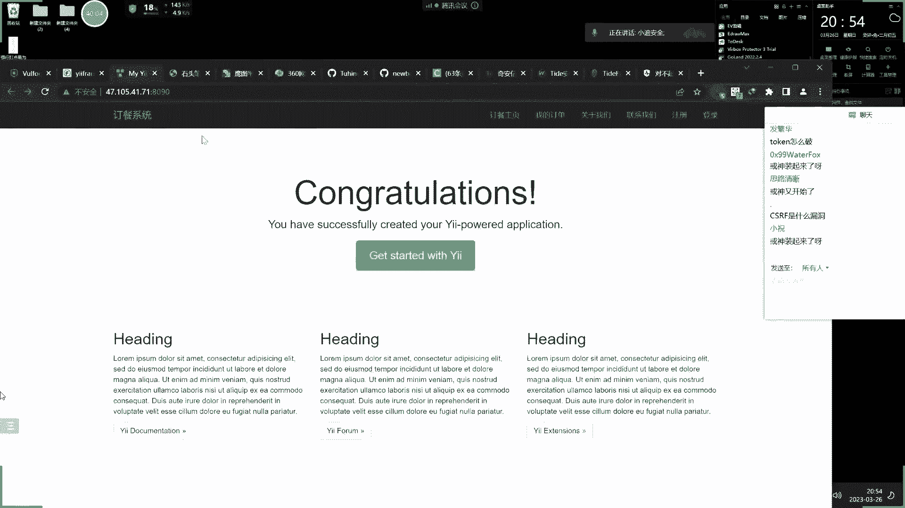

对不对，这是我们说的这个Python和java。

Python和Python和pp的这个框架的一个大概组成，然判断它的原因，我刚才也解释很清楚了啊，如果你不知道它是什么框架的话，那么你在网上去用漏洞扫描的话，其实意义不大。

因为漏洞扫描呢他都是直接的去判断逻辑，但如果说他用这个框架去开发的话，那么框架有漏洞，他有漏洞，如果说框架没漏洞的话，它有漏洞的话，那一般都是它没有正确的使用框架的一个写法，所导致的啊，是这么个情况。

记住我说的刚才两句话啊，他有漏洞，用框架的，他还有漏洞能扫出来的话，大部分都是他没有用正确的写法写导致的漏洞，如果他按照正确的写法写的话，一般这种扫不出来啊，一般这种扫不出来，除非是他真正有这个漏洞啊。

好那这个是Python和pp的，那接下来呢还有这个java的java的就丰富了啊，然后呢在讲笑话之前，我们先看一下50Z，110一个，主流java组件和框架的一个大概介绍，这个呢是有必要的。

给大家来普及一下的，给他简单过一下啊，看一下这个东西，就是我们做java web开发的话，这里会经常碰到这些web容器，Tomcat jdj boss receia，这是java里面常见的web框架。

然后会调用的一些数据库，H r civil mysql，oracle是个server post，Srcle mom db，这都是我们java里面喜欢用到的中介和数据库好，除此之外。

那用来缓存的数据库REDIS和这个办卡，然后呢消息队列呢这几个，那我们就不一个连拿负载均衡啊，FSLINUX分布式数据库，这个集群并不是什么大数据，还有什么日志收集是吧，搜索类的系统，监控类的分库。

分表的微服务，那么网络框架FFC数据库数据连接词哦，说了这么多，这个究竟是干嘛的呢，就是其实下面的都是它的一些特殊功能，我举个很简单的例子啊，比如说像现在啊我要去用java开发一个web应用。

这个web应用呢我要实现什么功能，比如说啊我要实现一个日记录，那我就会选用什么日记录的组件，比如说像这里的local j，local back或者sf4J这四个组件调用起来的话，就可以实现直接记录。

然后呢同样道理，如果我要实现用户的检测和用户的登录，负责的话，就会用到什么JWTHSHL就是安全相关，就是用户登录用户相关的这种组件，同样道理，我这个web要实现什么这个一些文件处理。

像什么office是吧，就用到POI是吧，PDF就用这个东西，还有再像其他的JSON的数据解析，就会用到JACKIE和FISKJACKSON啊，还有这个GSON啊，这种东西同样道理啊，这里有很多很多。

我就不一一写了啊，这只是说列举的部分，其中啊这个部分里面就有一些组件包，出过安全问题，哪些呢，啊，基本上啊，啊110个里面就有1/3爆出安全问题，比较常见的就是刚才举的那几个例子，就选哪几个呢。

local是J这是我们在前年非常火的一个漏洞，当时爆出来的啊，还有像像我们打比赛是吧，兔往里面经常用到的这个阿帕奇的这个笑啊，这也是包裹的，这也打不T的，还有像这个这个前面这几个啊啊。

像这个视频boot的是吧，微收权啊。

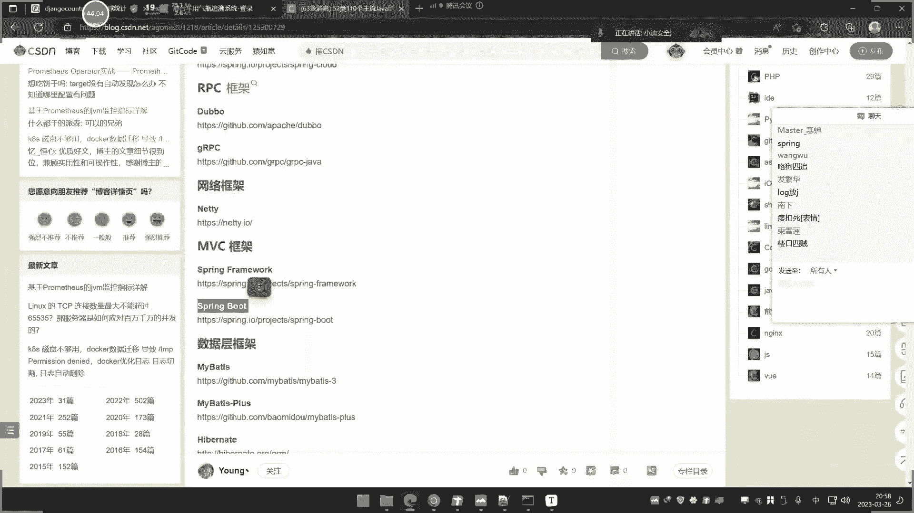

这些东西都包括安全问题，那具体有哪些，你可以看一下这边的一个漏洞。

弧形呢，这里的有些呢你可以看一下SORR刷子，还有这个什么鬼的笑是吧，Spin spring boot，对不对，都包括你可以点一下那个java来点加一块，还有很多的得加我的来。

刚才那个啦spin的这个是spin的，还有什么SOLO的，Face fast，Jackson，JASON抓死的，来在DOS里面看到的一些组件的DRUED。

这啥呀，是不是刚才看到的。

你看收益可以看下吧，DRUID来数据库连接池，就是说java里面如果说用到数据库连接池，用什么东西呢，这不是包括漏洞吗，诶跑哪去了，刚才对，这不有吗好了，中间间的J1TTY的，那这有这么多列表。

我们就不一个看了是吧，所以说这就是他的情况，那么如何达到识别它这个比较关键的啊，如果达到识别它呢，首先是fake jackson和JACKSON啊，这两个是干嘛的呢，就是java里面那个web组件。

他是干嘛的呢，他是干嘛的，那我们可以打开一个这个东西给你看一下啊，他这里有索命，它是一个数据转换作用，它是把对象转换为一个呃FAKK的一个啊啊，用java想转换成JACKSON啊，JSN的格式。

就是说他其实就是一个数据转换的一个组件啊，他就说你用这个组件就是用数据转换的，就是说你在java中你要去转换数据是吧，函数用自己自身的那个函数去写，相当麻烦，这个时候他就会引用这个什么。

大家可以JSON这个组件，用它的就直接可以直接转的，非常简单，那么你用了它之后，如果有些数据都用到他去转换，而这个组件包括漏洞就会受到影响，就这个意思啊，那么其他的我就不说了是吧，然后如何判定是用这个。

是不是用到这个东西技术，然后呢这边有篇文章大家可以看一下啊，我今天没有找到案例给他演示，后面几个都有案例，这个倒没有案例啊，你看看他说的很清楚，如何在黑河下面去识别fake。

JACKSON和杰克逊这两个组件嗯，就是通过抓到这个数据包之后呢，照这个数据这里啊，比如D等于一是吧，然后呢D等于零一，如果说是这个改完之后，它就会有一个特点，这个特点呢他在下面也写了啊。

这个fax js这个组件的话会把零一减成一，而这个杰克逊这个组件就会把零一的抛出异常，所以你观察你抓到的一些网的数据包里面，如果有这东西啊，你去测的时候把这个东西再加个零。

如果看到的是什么JS1这里报错，那就可以对比一下，这是它的一个判定的情况啊，就是抓数据包里面这个杰克传输数据的时候，这个是判断他这个是这个思路，这个组件的一个方式啊，然后呢像下面这个啊。

这个就能够给大家看案例了，就这个呢用网上打印的话，可以看下这个cooking中是否存在remember me点字段，如果有的话，那就是用到用到这个组件来，我给大家演示一下啊。

我们这里呢找一个这个这个东西啊，我随便可以在这里找个网站给你演示一下啊。

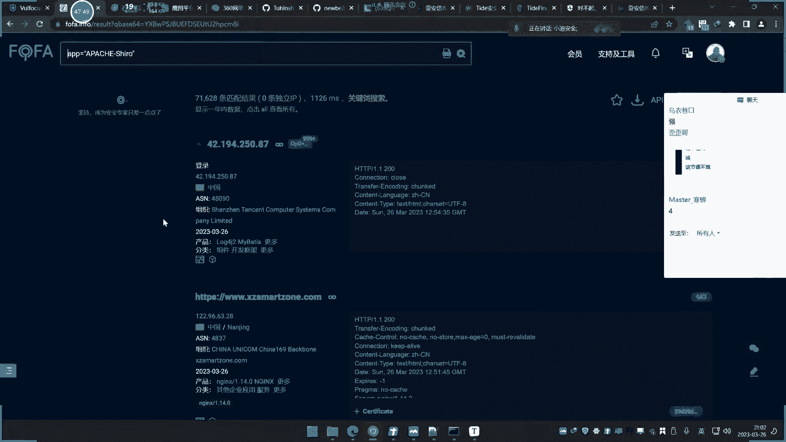

这是一个网站，我们来看一下啊，那你像这个网站啊，我们可以看一下它的数据包，你看这个cookie里面是不是有这个东西的，remember me等于delete me，那这就是这个网站是java的应用来。

他没有写java应用啊，这里没有识别出来，但是呢在数据包里面可以看到呢，remember me等于delete me。

用到了，因为他的判断标准就是看这个东西放我包里面，存在这个东西，你看所以这个东西，那么他就用到这个组件，那这个组件是干嘛的呢，这个组件你可以查一下啊，它是一个用来身份验证的一个组件，就是用来用户登录。

验证这个用户身份的一个组件，就说你如何去验证用户的一个身份，就可以用到这个组件啊，呃你可以在这个地方呢可以看到啊，我再来看一下，那他是一个强大的java安全框架，利于身份验证，授权密码和会话管理。

就是说如果对方你去写java web应用，涉及到用户的这个数据和安全问题，登录的一些操作的话，那么你可以用到这个组件呢来是实现统一管理，就这个意思啊，这是他的一个含义，然后判定方式就是通过数据包里面呢。

判断有没有这个remember me和delete me存在，就是用到这个东西。

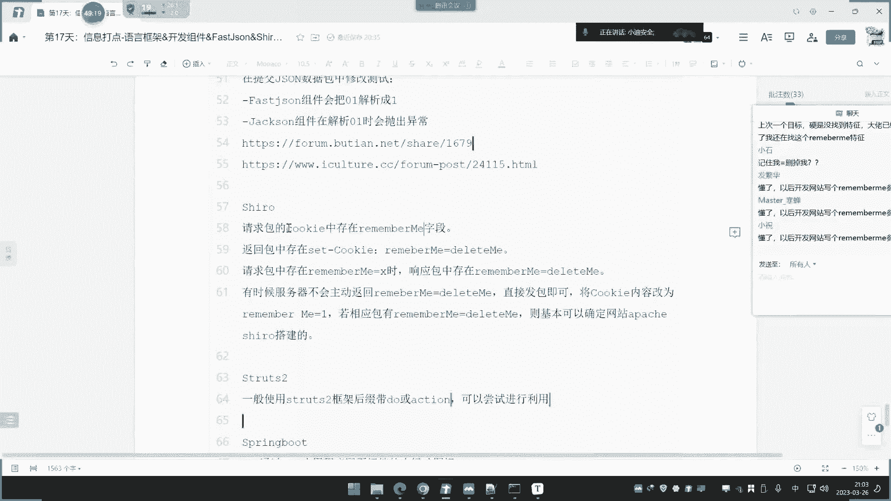

刚才我也给他看到这个案例了啊，对你网站那个是网站对吧，然后同时啊你可以往继续往下翻，那很多网站用到过你，比如说对了，北京大学医学部啊，这是个北京大学医学部，什么鬼系统啊，这里呢他也看不出来。

只看到一个java编程语言，那其他看不了，那我们这里都可以通过这个水包呢来看一下啊，你看这个水包里面，哎这你妈什么鬼啊，这没有啊，没有，他怎么判断出来的，没有啊，这个地方没有，我看一下啊。

看这边有没有是水包含存，啊这个地方一样的往上妈的，我说怎么回事呢，他在里面的，在这里写了一个这个名字，写了个用到这个系统啊，没有把它显示出来，这个夫妇收到的原因是这里有个这个名字，应该这里的。

还是他也是用的这个这么显示，妈的真是奇怪，我们再看一下这个其他的啊，我想翻几页。

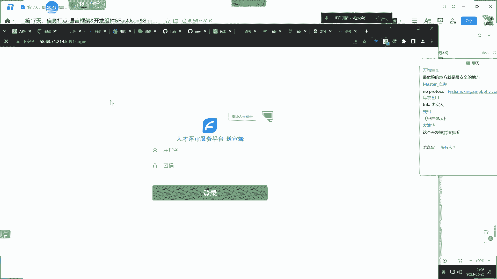

人才评估系统，你看这个这里也识别不出来是吧，不来这里刷包。

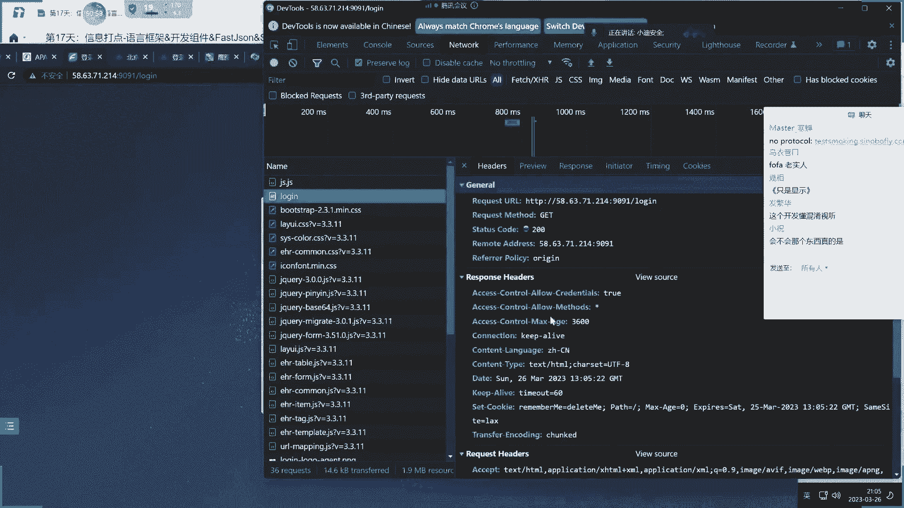

哪都有啊，你刚才，啊有的啊嗯，所以说这就知道他用了这个java，应用到了这个组件，组件，好然后这个STR这也是个老牌的一个开荒价，现在用的比较少了，以前比较多，他的一个判定呢一般就是判定这个后缀。

就是我们的网站请求后缀一般是点丢和点X型，那就一般是这种情况，大家看一下。

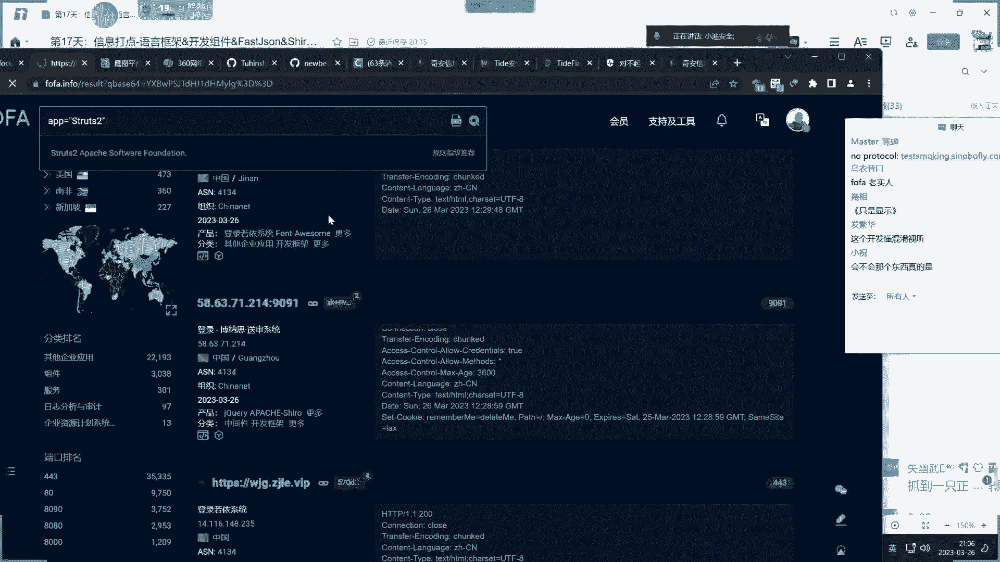

你看这个刷子的，我们可以打开看一下这种应用啊，它有些呢是有这个东西往下翻一下。

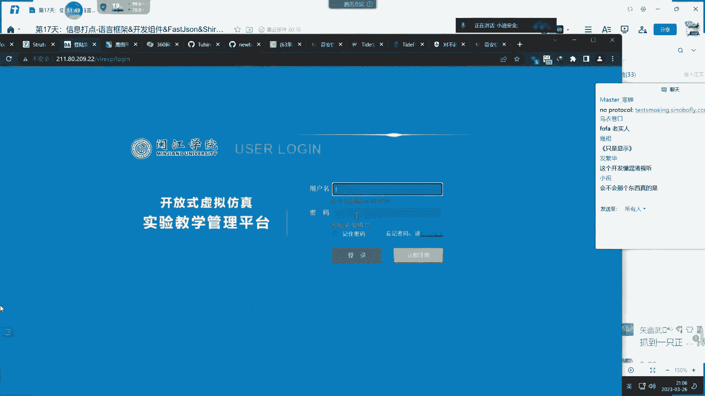

他一般的就可以根据这个点这个国内的吧，根据这个网站后缀的判定啊，他其他的不明显，其他的不好判断，你根据这个网站的后缀啊，就是那个地址啊，怎么点app啊，那个点丢啊，他这里没有没有。

我找一个比较有特点的啊，识别不出来的话。

那就没办法啊，哎这个点。

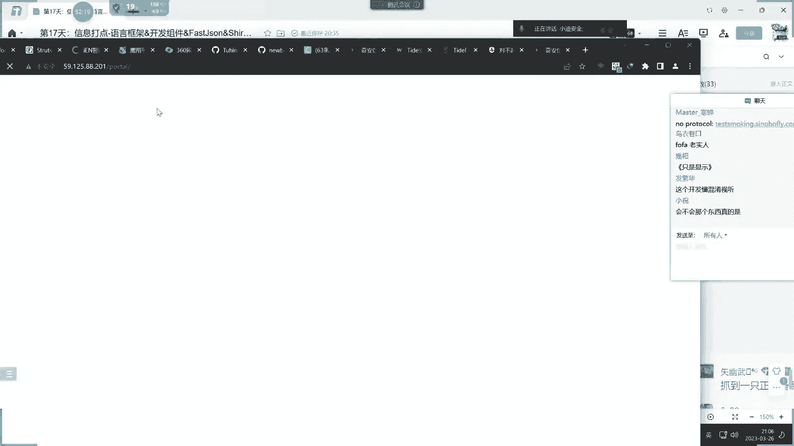

这个强制识别呢这是没办法的，其实你很多东西啊，你都要自己去一点点去摸索啊，在这网上都不会教这东西的啊，这东西网上都不会教的，因为它没有一个完整，就是说直接能判定他就是这个这个框架。

它没有这东西啊，有些就是说有显著那种强特征特点，所以呢你能看到，但有些人就没有，那这个呢这里呢你看后缀呢点X是吧。

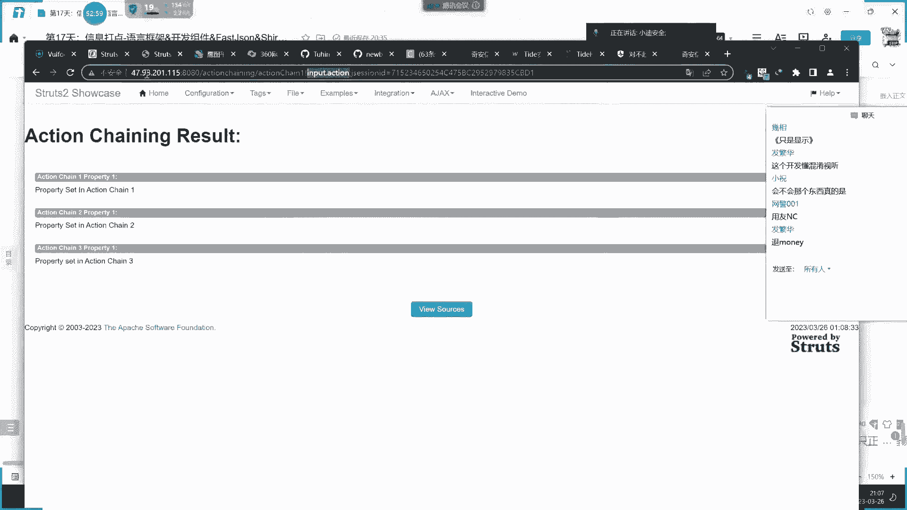

有些有，有些就没有，所以你不能说这个方法呢，很多东西就必须要磨合它才行啊，不是这样的啊。

不是这样的，那你看这个呢就是呢那index action，看到没用到的是这个java的技术，那这个识别它也识别不出来，对不对，但是那就是一个tr的开发框架，对不对，这是一个特点啊，每个特点不一样。

有的是在返回包的cookie里面，有的呢就是什么后缀名呀，它的特点底下spring boot也是一样，spring boot呢可以通过这个图标，还有这个默认的报数页面来去判断啊。

这是啥呢，我来看一下啊。

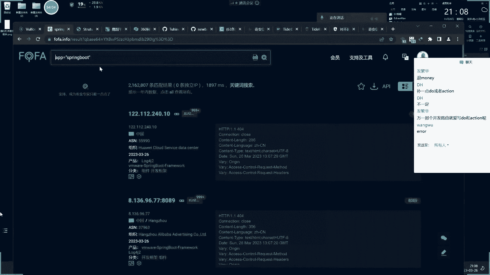

那这个是它默认的包出页面，你看到这个页面就知道这是put。

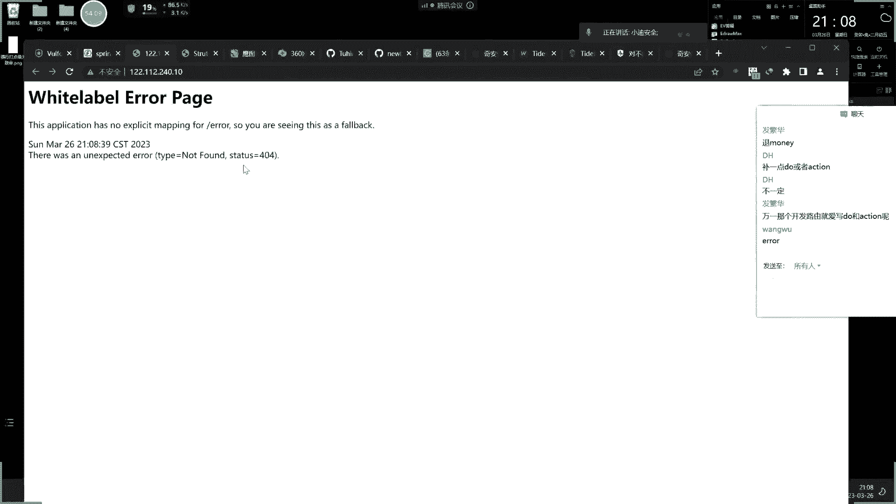

它这个页面就知道是同步的，我告诉你了啊，然后除此之外呢，它也图标，那就这种图标啊，就这种图标，这图标全部是，就是你看到那个网站图标是这样的，就知道是什么的，有些呢是图标图形，有些人是返回包的属性。

有些呢是这个后缀属性，低质属性等等啊，你看这些网站就是用spring boot的网站呢。

是一个什么叫综合什么东西综合成的，但是它图标呢没有改，你看这就是ring boot的一个图标，所以它就是用ring boot的。

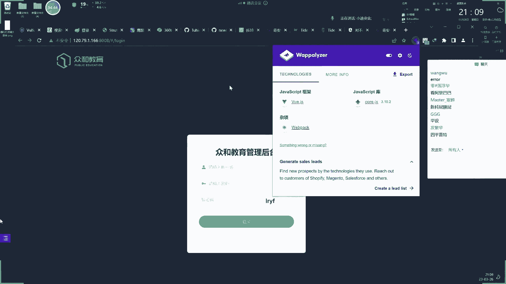

那网站是网的，对不对。

他没有改啊，你给后面再去看一下，其他的。

反正也是个网站，但图标没有改。

这还是用的SPINPUT，图标没有改啊，就是他这个项目还有一个固定图标。

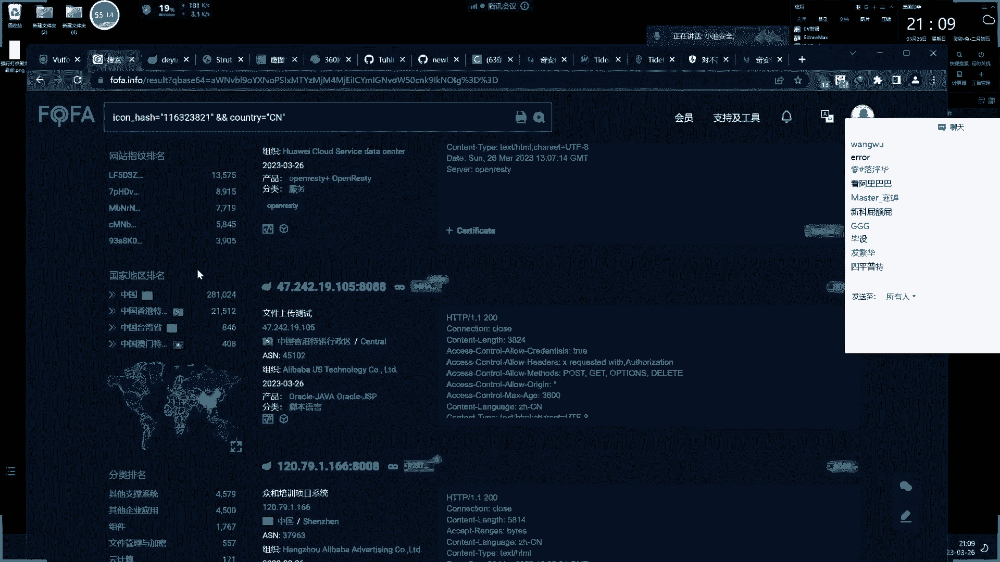

那个图标没有修改，它就是固定的很多东西都可以去发力图标的。

还有这个show呢，它是通过端口，它特点是通过端口。

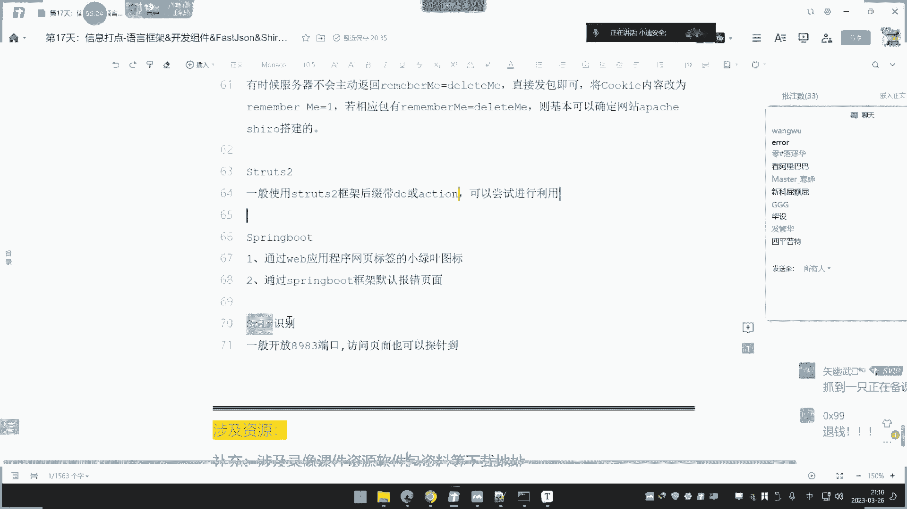

我介绍的几个组件都是有漏洞的啊，没有漏洞就是没有漏洞的，我们没有介绍，没有漏洞，没有介绍啊，夜常规有漏的，我才介绍了啊，有没有漏洞的，我一般都没有介绍，因为你介绍它，你识别它也没有任何意义。

它没有包括漏洞，你这个呢就是开放的，一般会开放这个什么端口，我把app等一下啊，像这种那个他一般会开发这个8983端口，这是默认端口，当然了，他也是可以把它修改的。

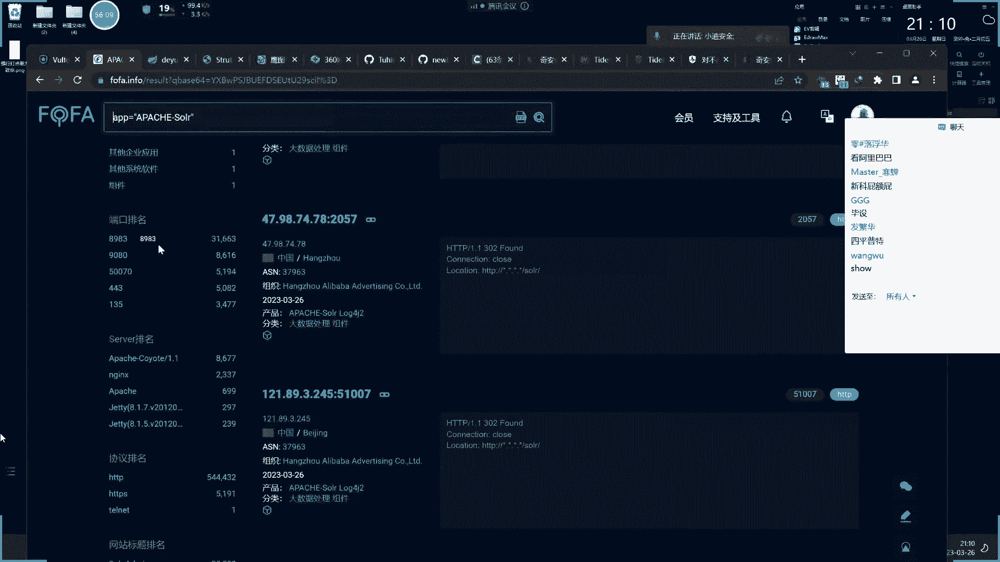

而且一般扫到这个端口就知道的是有这个东西。

也可以通过房屋网站能够看到啊，它的网站界面，那就是它会有一个管理界面，这是它的特性，我们给大家看一下，几个都打不开啊，这什么鬼怎么都打不开，因为跳转啊，这都是跳转，看这个吧。

来看一下28983的访问这个路径，你看就跳到SORO这地方来了，它也是有图标属性的。

这个图标也是代表这个产品这个组件，你看这一组啊，所以这个呢也是A通过图标呢也判断的。

这个东西是干嘛的呢，Slo，SOLI是干嘛的，可以理解一下啊，我们搜一下那个解释，它是一个基于这个全局搜索文件服务器，用来搜索的，就是用来编辑结果的，具体是干嘛的呢，是要你做开发的时候才知道。

那这个呢就是几个啊，那还有像比较知名的local4J呢，我没有介绍他的识别，因为它没有特性啊，不好介绍呃，一般都是用工具去扫啊，有没有这个漏洞就完了，他没有说。

直接从直观上面就能判断出有没有这个logo是G，一般都用工具少判断，直接试点，这个是机，它是记录知识的，就是如果说你用到这个阿帕奇啊，这个java的去开发优化应用，然后呢需要记录知识。

那么就可能会用到这个logo t还包括logo是吧，跟我刚才说的啊，前面那个漏洞相当火，这个漏死机的，这是几个比较常见，java里面的组件和框架上面的安全问题，就一般的这几个漏洞会经常提到。

就是近几年来，不管是这个护网里面，很多人都会用到这个漏洞去打，那么这里的识别意义讲了这么多对吧，10月10月说了这么多，其实无关紧要，就是给他科普一下这个知识点。

用知道大家有这么个东西，那么具体有什么作用呢，来我给大家看一下啊，我们从一个大巴场去浮现一个漏洞的角度，去看待一下这个东西，识别出来，对于我们后面的安全测试是有什么帮助的。

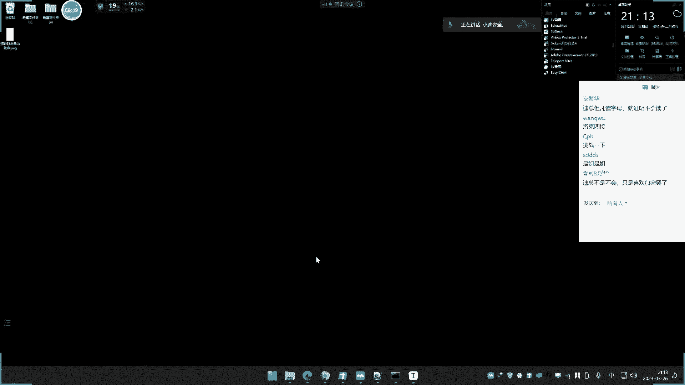

来我们来看一下啊，比如说像现在啊，我在这里呢，我开一个这个刚才的这个这个漏洞是吧，我开一个啊，我随便开个开个这个STIO的一个漏洞。


开了之后呢，我们可以关注一下，你看我们之前不是给了一些工具包吗。


那工具包里面大家可以关注一下，你看什么综合漏洞的工具有什么，你看一下名字啊，什么格挡OA系统，那什么玩通达呀，玩火啊，什么拥有啊，这些这些都是一些OA系统企业的OA系统，然后呢他们呢我为什么要讲呢。

为什么没有讲呢，是因为这样子的啊，这OA系统是可以通过前期我们讲到过。


这个什么SAMS呢，它是能够识别到的。

所以我没有讲，因为SM可以识别到，所以我没有讲，它好像刚才我们说的那些什么组件框架。

那就是SAM是不能识别的，所以呢我就讲你看看这里有些工具呢，你看这里啊，我们随便看几个例子呢，fix jackson专门去搞谁的。


搞刚才我说的那个fax jon，还有你看下面的那spring put sc，专门搞rin put sc的，你看还有这个呃，这里的效仿雪花新口PPSTR，对不对，其实呢他们就是有这种专门去搞这种框架。

或者是组件上面的安全都弄懂这个工具，那么就说你识别出来，你就可以直接上工具搞了，就是这个意思，所以这是他识别的意义，也是给了你清楚的意义，我们这里刚好呢开了个这个靶子，来看一下。

嗯怎么打不开啊，这个靶场有点毛病啊。


他妈的我今天车也是这样，他有时候一时好一时坏，这妈的是八成八个了哦。


等一下我们先等一下他，有时候那就等一下就好了。

开都开了，这里卖的真是。

打不开哎。


我看墨子上面有这把枪没有，那我只能自己自己，那金想自己打了，我就说自己答了，又里面的有些人他不灰不灰。


他又说浮现不了，哎呀我都搞这种简单的是吧。

直接有手就行的，这种东西呢他妈的他也起不来。

这个是用的也多。


但他是自己本地拿的这种东西。


你自己呢也可以在这个官网上面去拉。

我就搞不懂他为什么起不来。

这环境的出发生什么情况，为什么我就不给我打开。


这环境有问题啊。

唉我不想用这个view，我们用那个那个。


官方的吧，搜一下这个小L的，这是拿自己拿金像自己弄啊，你们说的那些什么飞鱼HUB啊，这个东西都是在这里找的啊，都在这里啊，别人打好的，他把直接拿直接用的啊，在这里搜一样的，你还不是可以搜这个名字。

这不是一样的道理，那他还不是在这里有集成，你看这不是他个人的地方吗，对不对，还不在这里能找到，这不是那个SHO的那师兄，那就直接这个一一拉就可以用了，那个也拉的这个东西吧，你拿来多给他一杆就把它启动了。

我说基础科什么，对不对，来哦开了你看他开了啊，你看这里那就是这个这个东西吧。


你可能说哎这不像一个网站的是吧，不像网站无所谓的离开，抓一下包啊，你看他这里没有这个什么。


没有这个这个这个刚才那个符合目标没有，不要紧啊，他一般是它是用来负责登录的，那么一般会在这里啊，怎么又卡了，又打不开了，时好时坏呀，这好等一下啊。

这实在不行，我们再自己拉。

你们老说自己拿那个锤子，那那那我也拿你妹的，我搞不清楚，下去又优惠一大堆问题怎么了呀，姜小果呀，明明这不是现在要讲的内容。


我说这种最简单的鼠标点几下就启动，哪个不好吗。

你偏要你没人拉拉拉拉的，你们有些人他就是不爽，他就下去浮现，浮现不了，他就拿来问，那不是今天要讲的东西，那就是个多口的，那就像个操作，又不是和蒙，又不是一个安全漏洞的，我要拉拉拉拉什么呀。


嗯在这个feel fox，这是咋回事啊，以前从来不这样的，这发那又好了，这他妈的我真是服了，你来试一下啊，来个你看我们登录之后呢，就是用户自己写的，随便写个登录，你看这里我们再看这个数据包啊，你看啊。

我登录用户之后呢，你看他这里就有这东西了，诶怎么还没有啊，不是我搞错了呀，修修修修修，好啊，你再看啊，我们把这个工具啊。


这他妈的我真是服了，这是什么环境啊啊，啊我不会是的，我不会啊，不会拉不会拉，那以后大家遇到拉的问题了，不要问我了啊，我也不会，我不会拉啊，摊牌了，大家不要问我了，以后遇到问以后。

这个自己也不会不要问我了啊。

唉我最后等他这个时间吧，哎呀你这不中庸啊，环境不中庸啊。

妈的。


都值得拿了，这个它上面这种东西呀。


他这个在线的好像不再提供了。


估计是这个公司紧张了，现在没钱了，不给你提供了，这估计都是压力下去，自己自己去垃圾箱用了，他现在都不给你这个搞这种事情了，没钱了啊，应该是提供不提这个服务器那个了。

唉真是没办法，8080端口，二哥应该是没钱的。


哦这谁帮我开了一个好。

那有人开，那就那就行了啊，谁帮我开了个，来看看这个，呃这个包里面呢现在没看到的那个包，来记录下。

点击基础啊，要点这个基础点了之后呢。

看看这个登录包就好看。


就是你要点记住啊，来有这个东西的，是判定出是那个需要框架。

那我们来试验一下，就这个登录这个操作这里啊，那在这里呢这里有框架，我们直接呢就用网上是吧，这是什么反虚化工具啊，随便拿一个出来是吧，来你比如我车这里啊，我把直接写上去是吧，想去那点一下。

然后再点这个识别检测当前密室存在的存在，是因为你的存在包括四好，找到之后呢，点击当前利用链，包括利用链发现构造连，来这里有命令执行执行命令来执行下来了，vs全新就取到了，对不对，那现在是植入内存码呀。

就是连接到上面去，你比如说那个pass1024植入到内存码里面去，那植入一下呀，他说植物的怕是1024，哥斯拉的哥斯拉一年，添加目标java是吧，嗯java的1024对了，那连上去测试链接可点击添加。

双击进去，文件管理服务器权限拿到啊，那个web权限拿到是没来呀，所以说这其实很多东西呢他这个识别到利用呢。


它是其实蛮快捷的啊，就是有漏洞，他是蛮快捷的，他没有漏洞，他检测不出来，就是没有漏洞，那就是另外的话，那如果包括新漏洞，就能这样做是吧，所以说你说十遍他有什么意义呢，他妈的现在他又好了。

我真是你妈服了啊，真是个垃圾。

这个平台一时好一时坏。

好这个就是我说的啊，刚才那个识别也识别出来的，他判断是z blog啊，这是我们前面的第一个要讲的讲了啊，那应该不说了，这个那个那个狗狗的视频出来。

所以说你这里就知道了，他这个一原理呢，我们讲今天这个原理呢，其实呢它是分三点，一种呢是把它理清楚，前期我们讲了cm10点，那这里呢，我就给大家做一个比较整洁的一个东西呢。

SAM识别呢它一般是针对这种是吧，这个pp开发居多的这种亚马程序，那么呢源码程序得到之后呢，一种是利用这个源码程序名呢去搜漏洞，情况在几点，第二个呢就是我们源码程序呢去下载，进行后期的代码审计是吧。

这是我们说分析cm识别的意义是吧，然后CMS识别意义，那是开发程序，还有一点我们这是后端的啊，一般后端的呢就是有这个cm，那么前端的呢，前端就是我们说那个JS的是吧。

JS里面呢就是JS啊和JS的框架是吧，就利用工具去一个呢是就是爬取更多的JS，从里面呢去筛选什么bl或者什么敏感泄漏的，什么K等啊，对不对，同样道理呢也是可以呀，也是可以通过对JS的这个什么代码逻辑。

来进行这个大神机，就是说其中两种啊，那么现在呢又出现两种情况，就是我们说的组件和框架的一个概念，那么主角就是我们说的那个意思，那么其实就是一般在java里面居多对吧，那像我们常见啊，包括漏洞的这个组件。

那就哪些呢是吧，L o r h r i，还有这个什么logo时间呀，Steam put，对不对对不对，这包裹的那么像框架里面这个p p java，Python都有是吧都有，然后呢报个漏洞的是吧。

有个漏洞的哪些新的pp啊，基本都有啊，这个框架基本都包括漏洞，我家的基本都有啊，就不写了，你说这个是识别它的一个意义啊，但这个都是有不一样的功能，它的具体解释我下面都写了，这是为什么要识别它的原因。

这个也写的很清楚了啊，简单来说呢，他们都是，都是干嘛的呢，对不对，都是为什么要这样去把它算出来，都是为你这个思路在理，你这个3MS10列出来之后呢，你去直接搜这个程序名。

我这个平台都有那个接口的P大的指纹，你识别出来他都直接告诉你了是吧，十点之后是个z blog，然后呢，他还有一个平台帮你去搜集曾经包括哪些漏洞。


你不就可以直接用了吗，对不对，那如果说识别不出来，我们后面也前面也教过怎么去寻找它，对源码下载地址是吧，也教过一些方法方法，那么识别出来了，有漏洞就利用漏洞，没有漏洞呢，你就自己再把源码下来。

自己去代码分析，代码分析呢就是说挖一些未知漏洞，或者一些其他的问题，对不对，也是个道理，那么像这个java的也是一样的情况啊，你是不是出来说有这个漏洞，你用工具就直接玩就完事了哈，就不用去想其他的事情。

所以这个信息收集和后面什么漏洞探针，这个是相关关联性非常大的，有些人呢就信息收集都没有做啊，直接把那工具上上去扫，那其实也对，它对应的方法，就是先让信息多种工具帮你去扫信息，然后呢自己在判断。

还有些人就是完全不懂，那估计少少没漏洞，就是没东西，不知道怎么办了，因为他没有这些思路，没有这些概念啊，他不清楚，所以说至于你怎么打点，再去后期的漏洞发现呢，这是你自己的事情，你可以先用漏洞工去扫也行。

因为漏洞工具少了，它其实也会帮你自动去分析这些东西，它也会自动分析，你也可以先先自己分析了，再选择性的用不用工具，这都是你的事情，但是归根到底，你在你这个安全测试过程中。

你的脑海中是要就是要清楚的认识的啊，就知道哪些东西，包括那种这东西该怎么去识别，它有什么特征，看到了就不要忘记了，讲了这么多一个外包的组成体系，我们信息大点讲到这里，你应该在你脑海中就对这个网站的组成。

包括语言特性，包括框架什么组件，CMS这些东西都会有一个已知概念了啊，如果说你有这个概念了，那就说明啊课程吸收了没有已知概念，那不好意思啊，那你就要重新再去看课程了。

好这个就是关于这个web方面的这个这个信息，打碟啊，今天上完了，然后呢，我把前面这几个没总结的思维导图呢。


给大家把它搞上去整一下。


你看啊，你看我们上什么内容，总会有人问到一些问题，这问题，那就说明两点，为什么是学不好的原因，他连我伤什么的，接下来要伤什么，伤没伤完，他都不知道啊，哎呀有时候啊我真是啊。

不知道为什么为什么要学这么多时间。

啥都不会，刚才有人说问那个问题问了什么问题啊，星期大点就到此为止啦，是的，到此为止，不再上了，马上结束这节课，上完我就跑路了，没有后面的课了，满足了吧。


你说操不操心呢，这怎么学得好啊，操点心吧，要授权码呀，什么鬼，要什么几台电脑播放啊，这个什么什么是腾讯文档东西呀，那是一颗豆里面的都不能少的对吧，反正我不学我东西，我必须要不要我就吃亏对吧。


其实我有很多话要说啊，我不好说一说我就怎么说呢。


要批评大家呀，要要说大家啊，我不想这样子搞，我说了很多遍了，但是看上去那我认识你们的童心呀。

我这个课程按我说打没打点，打完了，我这几个思维导图下面的东西，我一张都没有开始做，我这上面也写了这几个东西，你看我有些东西我讲没讲啊，这个章节点他没讲的，就说明没有完呐，啊怎么会问到课程玩不玩呢。

啊操点心啊。


学习，这是第14天的那个内容。


这节课就开始识别是吧，这个是主机的一些东西，讲的是应用差异的。


然后就是讲价钱的，再来我们下节课的内容。


这个是讲的这个米管识别识别技术和主机架构。

我把它加个叫什么动交防护的一些设备啊，等下一，两个一个是这个WAFX。


我们说的那个C6N的东西闭关。

这三个要把它移上去，WAF呢这个10年呢有两种方式啊，支点那种一下啊，我可以把这个导图做完之后，我再跟他聊啊，再跟他聊，看图识别啊，就是看图识别，还是我们的工具项目工项目呢讲两个。

看图识别呢，就是我们看那个拦截的那个界面去识别，讲过了啊，嗯然后再加两个工具，这是前面我没有把它补充到的那个支点啊。

哎这个两个工具啊。

然后看图识别，那是一种啊。


然后就是看拦截页面嘛哈看拦截面，这是他的底点，然后这里是wolf的一个分类啊，那就是直接拖进来吧，分类分了四大类。


这主要支点啊，哎其实也没啥，这个解释一我们就不写上去了，蜜瓜呢也是这个情况啊，蜜瓜呢也是分在这种情况啊，又是他的这个等级区分，分三类是吧，高低弧三类，第三类，提高，然后呢这是东西。

然后还有一个是我们说的功能性，它功能啊，嗯怎么拖到上面去了。


好然后呢就是它的一个蜜罐产品识别呢，我们用到了这个插件。

它的识别问题。


前几个我没有给他总到四导图里面去的啊，一个用到这个夸克呀，还有一个是这个浏览器插件。

项目啊，然后呢人工方面和这个城市的一个识别基础，这个是分级的呀，这个是工具项目，工具项目还是我们荣威的啊。


这个人工分析主要是这两个这个什么。


上面这个大概组成我们就不说了，呃这个网络空间呢它也可以判断，人工分析的主要是看这几点，还有就是我们这个网络空间的分析。


可以利用这个夸克和音图去分析到CDN的。


这个东西呢也是一样道理啊，这是我们东西，然后这个是东西啊，然后这是一个识别技术，在那web应用呢，除了这个之外啊，这里应该还写一个啊，把这个拖上来，是我们说的主机啊，主机应用主应用。

那就是我们讲的这个什么主机架构，用到了这个DOO扫描的技术啊，DOO扫描等会再写啊。


先把C搞，CN是直接贴到CDN呢，因为这都是12倍和平台，有些防护，有些是拦截的CN的一个十连呢是有几种啊，啊这个识别技术呢就是它功能配置，这个我不把它弄上去了啊，因为这个是主要是讲原理用的。

识别就是这个东西啊。

它的识别和情况坚持十点，识别的就一般的就会用到这种什么，多地频判断，还有一个就是N卡，这个没有讲，但是也不重要啊，就是直接可以通俄罗斯拼那个域名，如果有多个IP，就是有没有的话，就没有。


嗯然后呢这是它的识别。


识别之后呢，我们就说他的绕过技术就如何寻找到这个，恭喜啊，logo基础logo基数呢我们举了几个例子吧，随便写几个子域名的呀，国外访问啊，全网扫描啊，这个真想真想搬箱，回联的问题是吧，回联的问题。

那这里举了几个例子，像这个有点系统，还有这种漏洞是吧，漏洞利用他们说的一些这种遗留文件造成的，直接翻一下回音啊，翻箱获取的一种方式下获取吧，对这些这几种啊，然后全部上面官方文字名。

然后呢除此之外还有一些其他的。

我想这2万8全部写上去吧。


都是，网络空间，那这些技术都有讲过，工具我就不写上去了啊，一般这个用到的平台呢，把简单写一下工具平台，一个是我们说的常见的网络空间里面的哈，这个FO里面内置了有这个东西啊，它的增值服务有这个检测是吧。


刚讲过了吗，真的服务，然后呢还有像这个接口查询对吧。

第三方结果产生，这个站点。

对不对，还有一些其他的我们就不写了啊，这些其他的无关紧要的，什么上面的社区啊，这东西不重要了，因为都是自然的一个地，这上节课和这个CDN的一个大概一个支点啊。


然后这个端口扫描这里没有写上去啊，端口扫描的意义呢就是有两点，一个是这个少这个端口的常见绑定服务端口，对应什么这个主机就服务协议和服务，然后呢这是第一点，第二点呢就扫端口开放的话，端口里面是有一个状态。

我当时说过啊，然后用到的工具把它单独写出来，工具我们介绍了几种，一个是N8P，还是这个画的空间的去分析，这是我们说的这个端口扫描的一个技术，用工具实现，然后呢扫描它的原因啊，关注点啊。

一个是端口对应服务的一个体系，还是我们这个状态，当状态我们都说三级的啊，The closed。

file两毛的英文单词有没有写上去啊，这里。


还有就是这个open对吧，主要说的就是这个field，这主要说的意思呢，我那个笔记上面有写啊，还有一些扫描的时候要注意的，一个区域差异性的关键地方。


比较关键的一个地方，什么什么地方就是我们说的这个环境问题啊。


意外情况，意外环境。

就是有两种，一种呢就是我们说的这个有防火墙开放啊。

还有就是我们说的这个主机在联网需要服务器。

这两种会造成这个数据是开放的。


但是呢你扫描的它没有开放的问题，除了这之外，其实还有一点啊，我忘记跟他说了，像这个反向代理就是web服务器的反向代理，如果找这个服务器的话，他也会有这种意外情况，反向代理的其实就是说他真是服务器呢。

是在另外地方，他把这个东西的指向到另外地方，说你少的是个反向代理，这种情况会造成一种问题，就是我们说的，就是实际结果和这个扫描结果不一致，就是因为你扫错了，扫错了这个目标导致因为他们都有一种方式。

一个是防火墙开放之后呢，扫不到，还有呢内网服务器扫到是他的厨王的那个IP，翻墙的也是他的厨房的那个IP，不是他真实的那个，不是他真实的那个网站的一个IP地址，这是我们说的比较关注的一点。

这状态呢还有这个工具使用啊，然后对应的服务就是我们说的啊，这个测试思路，这个dog扫描呢给我们的思路是什么，其实呢就是在这里大家看到了啊，这个开放意味着意味服务开放，那么对应什么。

对应这个思路就是安全思路进行这个测试。

具体图片呢大家可以看一下这个图片的是吧，就是开放的就是这东西啊。


那么它是针对主机服务器的啊，他不是针对单独web的，所以呢主机服务器的一个新收集就是端口扫描，把它写上去了，然后今天知识点呢，就是讲的是这个圆框架类的啊，这个分析，那么其实呢它还是归功到这个这个地方。

所以我把它放到这个地方来，啊这讲的是个什么框架组件，一个呢就是我们说的三点啊，一个是基于这个语言特性的，语言特性里面的三点，Java pyth，然后呢这是我们说的两个分类，一个是框架的一个问题。

还有就是我们说的这个组件。


拉法。


java里面的是吧，这个框架组件就这型集合啊，先来几个啊，几个常见出现漏洞的，要搞死，这个没讲他怎么识别，因为我们没有固定特性啊，像，还有我们这个bein boot啊。


像这几个，然后呢show啊，fake jackson呢对吧，都要把常见的几个，后面那些我们就不显示了啊，这都有它里面就有两个例子，框架方面的，JO和这个FI，FSC啊，我英文不好啊，有的喜欢读SC。

哎呀他妈的读都不读，啊，这个我们今天说的这个，识别这些东西的一个特性啊，然后呢他们都有一个特性啊，基本上它的特性呢我们把它总结一下啊，他这个特性呢都是围绕自己的观察，一般是怎么一个呢。

就是看这个什么response返回包的对吧，这个具体内容还有那些什么端口的特征，是端口的特征，就是端口固定的端口开放，还有呢就是像我说的这个图标，S图标，对不对，哎，还有一些就是我们说的这个除此之外呢。

还有一些就是我们说的什么路径啊，这个K也不行，后缀啊这种东西是吧，还有一些就是我们说的这个东西啊，然后如果它的一个识别方式呢，基本上识别方式是不是这个技术啊，般都会只会用到哪几个技术，端口扫描技术。

网络空间里面去找网络空间里面的，然后呢还有一个就是我们说这个识别插件，其他就没有了，其他就是手工自己分析了。

一般是看这几个东西来决定，有些可能还有点不一样，大部分都是这个情况啊。

好，那这是我们这几个的一个，大概的一个是我打图啊，把它理上去了啊，有些可能我没注意到，没想到我也没想上去啊，你自己下去，你自己再慢慢垒吧。

这个web也就高一段落了啊。

就说今天上完之后，这个web就没有了啊，那商的话就是其他的这个一些其他的啊。


包括我们后面还要上的了，像什么这个还有些什么人员的信息收集啊。

网盘的信息收集啊，网上都有这种支点，我们也不简单介绍一下呃，什么这个网盘的是吧，还有一些什么微信公众号啊，APP的那个VPP那个微信公众号，他没有太多支点啊，基本上我们一节课就能讲完。

它不像这个挖宝挖宝的架构太多了，因为像这个微信公众号也好，或者说是app，它里面的也有可能是web，那说白了啊，你收集他出了web，那还是要转到web上面去收集，我们说的就是说排除web上面的app。

然后呢，我们主要就是说从app里面去找他的，什么开发厂商的信息啊，还有他的版本信息啊，他的资源信息啊，是收集这些东西，然后再就是他这个app里面露出来，看有没有泄露的信息啊等等啊，主要是设计这些信息。

那具体什么些其他很有价值信息，那是专门在讲到那个app这些分析立项的时候啊，我们再去再去讲深入的好，今天的内容讲这么多了啊，从下节课开始的，我们就要换这个应用方向了啊，就不是web了，那就是这个小程序。

微信公众号，app这些东西了啊，那个PC应用我就不写了啊，PC应用那里面说白了就是个抓包，抓包里面的一些信息，有啥东西呢，你要说要分析这个PC里面信息，说白了要分析的准确，就要对它进行破解。

那你们不灰啊，那咋办呢，是不是。


好今天就讲这么多了啊，看大家有没有什么问题啊，有问题就问。


没问题，我们就后天再见了啊，嗯对啊。

