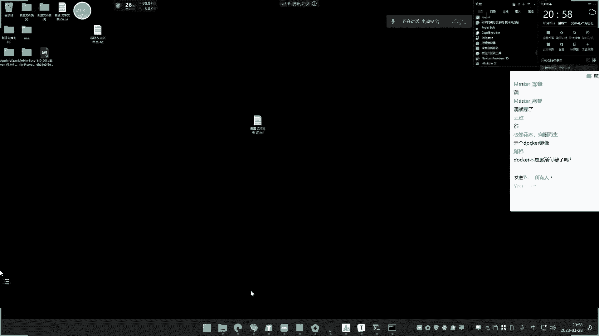
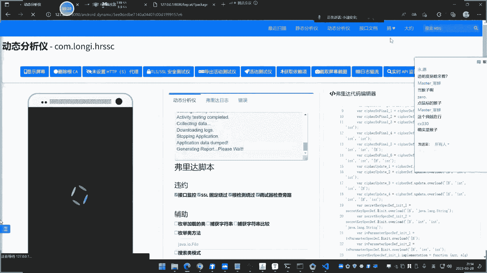
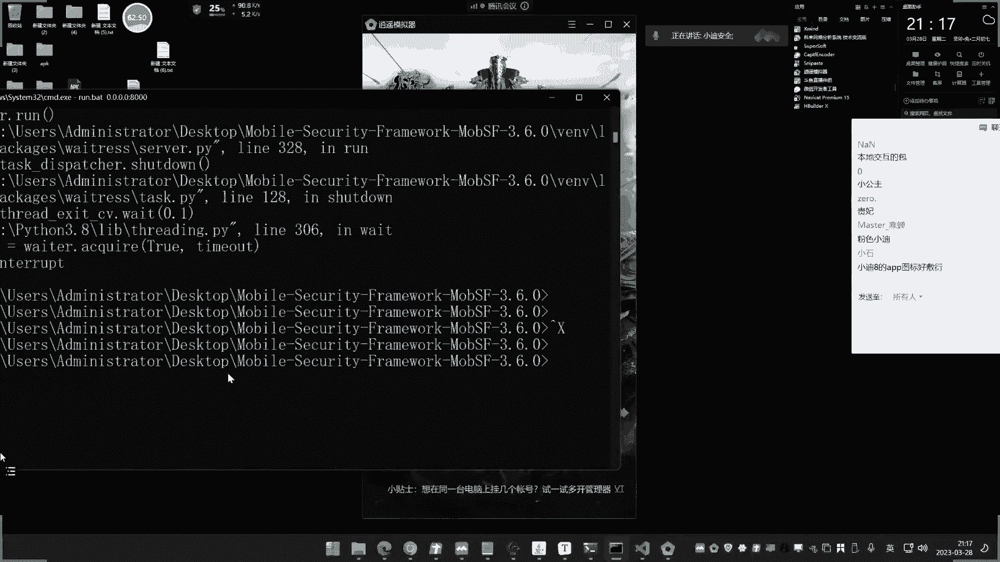
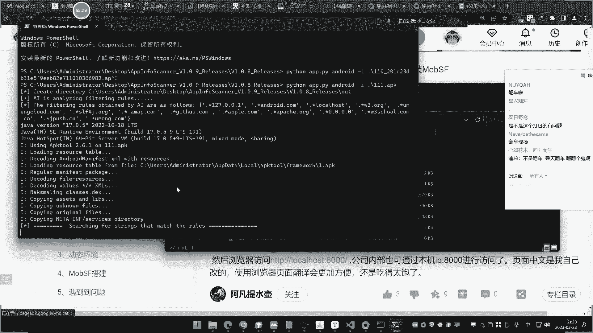
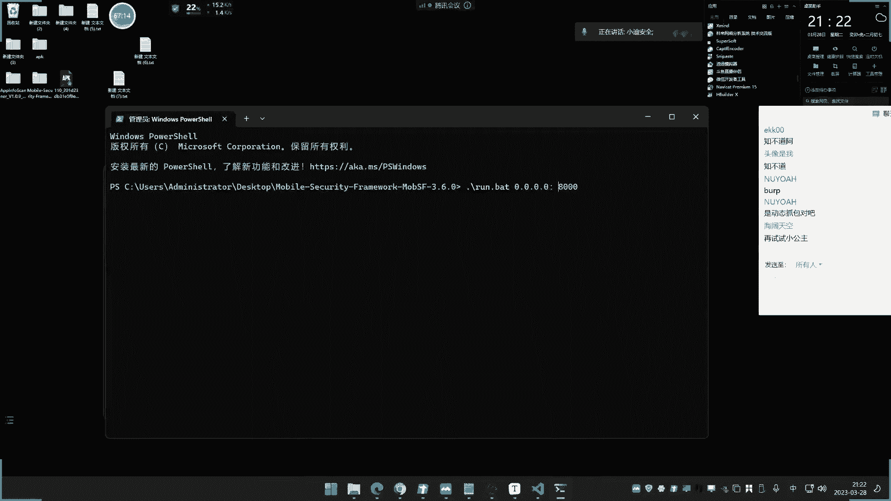
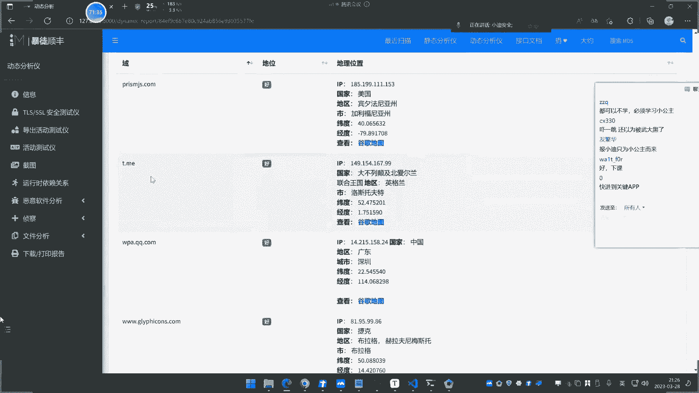
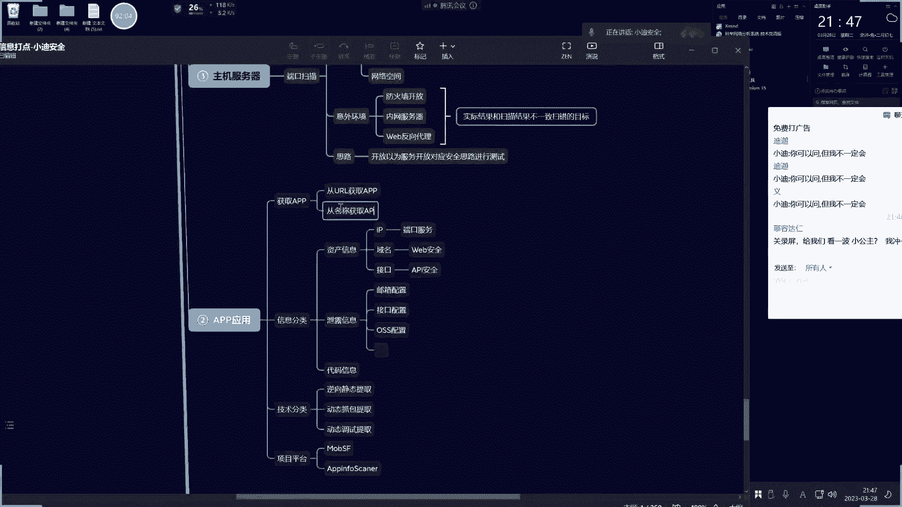
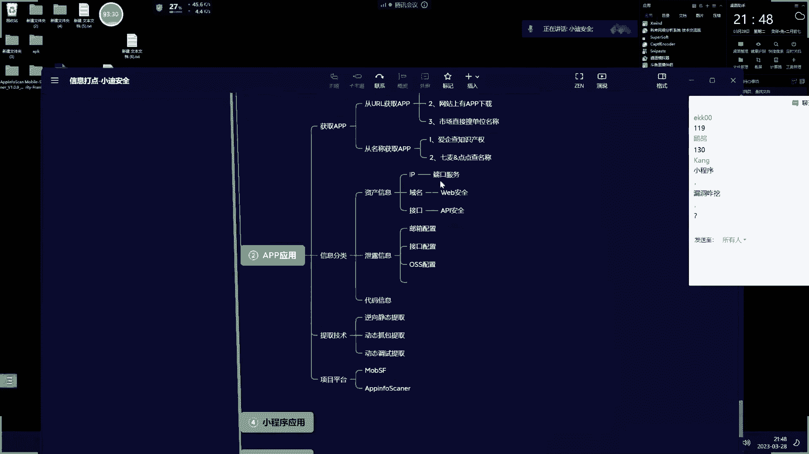

# 🚀 课程P18：APP资产与信息收集技术

在本节课中，我们将学习如何从目标中获取其相关的APP资产，并掌握从APP中提取关键信息的多种技术方法。课程内容涵盖资产发现、静态提取、动态抓包与动态调试，旨在为后续的APP安全测试打下坚实的信息基础。

## 🎯 第一部分：如何获取目标的APP资产

上一节我们介绍了课程的整体目标，本节中我们来看看如何从给定的目标中发现其相关的APP应用。根据目标类型的不同，获取APP资产的方法主要分为两类。

### 1. 通过目标单位名称获取APP信息

当目标是某个单位、学校或公司的名称时，我们可以通过查询该单位开发或拥有的APP来获取资产。以下是四个可以用于查询的平台：

*   **爱企查**：在企业信息页面，通常可以找到其开发的APP资产。
*   **小蓝本**：同样提供企业相关的APP产品信息查询。
*   **点点数据**：专注于移动应用数据，可通过公司名称搜索其开发的APP。
*   **七麦数据**：提供应用市场数据分析，可用于查询特定开发者的应用。

**操作提示**：建议结合多个平台进行查询，因为不同平台的数据覆盖范围可能不同。此外，在手机应用商店中点击某个APP的“开发者”信息，也能查看该开发者发布的其他应用，这也是一种有效的发现途径。

### 2. 通过目标网站（URL）获取APP信息

当目标是某个网站时，我们可以通过以下三种方式来寻找其对应的APP：

1.  **网站自身提供下载**：许多官网会在醒目位置提供其客户端的下载链接。
2.  **查询网站备案信息**：通过网站的备案信息找到其所属公司或单位，再使用上述“通过名称查询”的方法来查找APP。
3.  **在应用市场直接搜索**：在各大应用商店（如应用宝、360手机助手、苹果App Store）中，使用网站名称、品牌名等关键词进行搜索。

**特殊情况处理**：如果目标网站没有备案，通常有两种情况。一是该网站本身可能没有开发APP；二是该网站可能涉及违规内容，其APP可能通过第三方渠道或直接提供安装包进行分发，不会上架官方应用商店。

## 🔍 第二部分：从APP中提取信息的方法论

在获取到目标APP后，下一步就是从APP中提取对我们安全测试有价值的信息，例如IP、域名、API接口、配置密钥等。提取方法主要分为静态提取和动态提取两大类。

### 静态提取 vs. 动态提取

*   **静态提取**：指在不运行APP的情况下，通过反编译技术获取其源代码或资源文件，然后从中搜索和提取信息（如URL、硬编码的密钥）。其优点是能获取到代码中存在的所有信息，但缺点是可能包含大量未在运行时使用的“死代码”，产生无用信息。
*   **动态提取**：指在APP运行过程中，通过抓包或调试来捕获其实际产生的网络请求和数据流。其优点是获取的信息都是APP真实使用的，误报少；缺点是无法获取未触发执行的功能所对应的信息，完整性依赖于测试人员的操作覆盖。

简单来说，**静态提取看的是“有什么”，动态提取看的是“用了什么”**。两者结合使用，才能达到最佳的信息收集效果。

## 🛠️ 第三部分：静态信息提取实践

上一节我们了解了方法论，本节我们来实践静态提取。我们将使用两款工具来对同一个APP进行分析，并对比结果。

### 工具一：在线分析平台 (如MobSF在线版)

这类平台提供上传APK文件进行自动化静态分析的服务。分析报告通常会包含应用权限、证书信息、以及从代码中提取出的域名、IP地址、邮箱等“情报线索”。然而，其提取规则固定，可能无法发现经过编码或加密处理的敏感信息，并且高级功能（如动态分析）可能需要付费。

### 工具二：本地工具 APP-info-scanner

这是一款开源的安卓/iOS静态信息扫描工具。通过命令行运行，它可以对APK文件进行反编译，并按照内置规则扫描提取出其中包含的URL、IP等资产信息。

**对比实验**：使用上述两个工具分析同一个APP，可能会得到不同的结果。例如，工具A可能没有提取出某个关键域名，而工具B却提取出来了。这证明了不同工具的提取规则和深度存在差异，也说明了静态分析可能存在的局限性——如果关键信息在代码中被加密或拆分，简单的正则匹配可能无法发现。

## 📡 第四部分：动态信息提取实践

本节我们重点学习动态提取的两种主要技术：抓包和动态调试。

### 技术一：抓包分析

使用抓包工具（如Burp Suite、Fiddler）设置代理，在手机或模拟器上运行APP并操作。所有产生的HTTP/HTTPS网络请求都会被捕获，从而可以直观地看到APP访问了哪些域名、接口，提交了哪些数据。
**优点**：简单直接，能观察真实流量。
**挑战**：部分APP会进行证书绑定（SSL Pinning）或代理检测，导致在设置代理后无法正常联网或运行，从而无法抓包。

### 技术二：动态调试 (使用MobSF本地版)

MobSF（Mobile Security Framework）是一个强大的移动端安全测试平台。我们重点介绍其**本地安装**后的动态分析功能。

1.  **环境搭建**：在本地Windows电脑上安装MobSF，并同时安装安卓模拟器（如逍遥模拟器）。两者安装在同一台机器上可以避免复杂的网络配置。
2.  **启动分析**：在MobSF网页端上传APK并进行静态分析后，启动模拟器。在MobSF界面点击“动态分析”，它会自动连接到模拟器。
3.  **交互与监控**：MobSF会自动启动APP。测试人员可以在APP界面进行各种操作（点击、登录、浏览）。与此同时，MobSF会实时捕获：
    *   **网络流量**：所有HTTP/HTTPS请求和响应，无需单独设置代理，绕过了部分证书校验问题。
    *   **运行日志**：APP运行的详细日志（Logcat），对逆向分析很有帮助。
    *   **截图、文件访问记录**等。
4.  **生成报告**：操作结束后，可以生成一份详细的动态分析报告，其中包含了所有捕获到的请求、域名、API接口等关键信息。

**动态调试 vs. 抓包**：
*   动态调试集成了抓包功能，但通常能绕过简单的证书校验，适用于一些抓包工具无法处理的APP。
*   动态调试还能提供更丰富的运行时上下文信息（如日志），不仅用于信息收集，也为后续的漏洞挖掘和逆向分析提供了便利。

## 📝 课程总结

本节课我们一起学习了APP资产发现与信息收集的完整流程：

1.  **资产发现**：我们学会了如何从**单位名称**和**网站URL**两个维度，利用爱企查、七麦数据等平台来挖掘目标相关的APP资产。
2.  **信息提取方法论**：理解了**静态提取**（从源码中搜索）和**动态提取**（从运行时捕获）的原理、优缺点及适用场景。
3.  **静态提取实践**：使用了**在线分析平台**和**APP-info-scanner工具**进行静态分析，认识到工具规则差异和静态分析的局限性。
4.  **动态提取实践**：掌握了**抓包分析**和**MobSF动态调试**两种技术。重点演练了MobSF本地环境的搭建和使用，它能够有效捕获APP运行时数据，并部分解决抓包难的问题。

通过本课的学习，我们掌握了从APP中收集IP、域名、API接口、配置信息等关键资产的能力，这些信息将成为后续进行Web安全测试、接口测试、服务渗透测试的重要输入。记住，在实际工作中，需要灵活结合静态与动态方法，才能实现最大化的信息收集。