# P19：第19天-小程序应用&解包反编译&动态调试&抓包&静态分析&源码架构 - 逆风微笑的代码狗 - BV1Mx4y1q7Ny

看一下今天的内容啊，今天呢是讲这个第19天了，讲的什么内容呢，前面讲了web，讲了个app，那今天呢这就是这个小程序，小程序呢主要讲的知识点呢是哪两个呢，今天要讲的将小程序呢。

主要第一点就是说如何找小程序，第二个呢就是小程序里面的去作为这个新收集，也是通过他的一些抓包和这个调试啊，去得到一些信息啊，啊大家就会理解小程序的一些概念，然后除了这个之外呢。

我们简单的先说一下这个小程序的一个情况啊，首先小程序呢，他和app大家应该都知道是哪种东西啊，app呢是我们从这个应用商场的去下载，然后在手机上面那个app小程序呢，一般就会在国内的话。

一般是在这四个应用层面的较多，大家认知的小程序呢，大部分都是在微信里面比较多，微信小程序，然后呢还有一个就是在支付宝，抖音头条，百度里面都有，一般呢主要是在小程序，在这四种平台比较活跃。

最多的就是微信的支付宝这些，对吧，那么也就是说，如果我们自己呢要去寻找目标的一个，小程序的话，该怎么找呢，我这个是非常好找的啊，这个是非常好找的，就是收没有了，就是靠搜索就完了。

就是打开你的微信去搜关键字就完了，质保也是一样，这个抖音上面也是一样，你像我们这里呢就给他举个例子呢，我微信呢我点一下这个小程序是吧，我点这个搜索，那这里就可以搜到小程序，然后呢你随便取个名字吧。

比如我是小迪啊，回车啊，然后他就会将一些常见的小迪的这种关键词的，一些小程序都展出来，对不对，理解吧，这个收应该会的吧，那收什么东西呢，那搜什么东西呢，什么名字啊啊网站的这个什么标题啊啊，备案信息呀。

收，然后像什么支付宝里面也是一样的，都是这样手法，这个没有什么太多的一些技术可讲，所以呢像这个怎么搜啊，应该都会收啊，对不对，主要讲的就是说这个小程序的一个构造啊，然后呢小程序构造是什么情况呢。

给大家简单的看一下啊，这里有它的三个部分，主体结构和它的四个文件组成，和什么整体目录结构，一般小程序呢它都是通过这个飞鱼一，还有那种框架来去开发的，就是JS去开发的，然后这是它的一个特点。

特点二呢就是它有固定的一些东西，我们等下会把那个源码给它提出来之后呢，给大家看一下，对比一下，大家就在对比这个结构呢，对着讲啊，现在先不跟他说一下，先说了，等下后面要讲这个结构的啊。

然后我们说一下这个小程序，我们可以简单的给大家看一下如何去进行测试，比如说我们之前在生成自己一个小程序，都是可以的，但如果说你要把它发布到这个官方的话，就是说你自己呢写出来之后呢，可以自行的去玩。

但是呢他没有发布到这个官方的话，就说没有发布，官方的话，对方搜名字是搜不到你这个小程序的，你发布才行啊，但是发布呢它需要有一些资质，什么资质呢，就是类似的我们这种什么支架开发者企业，这种资质才行啊。

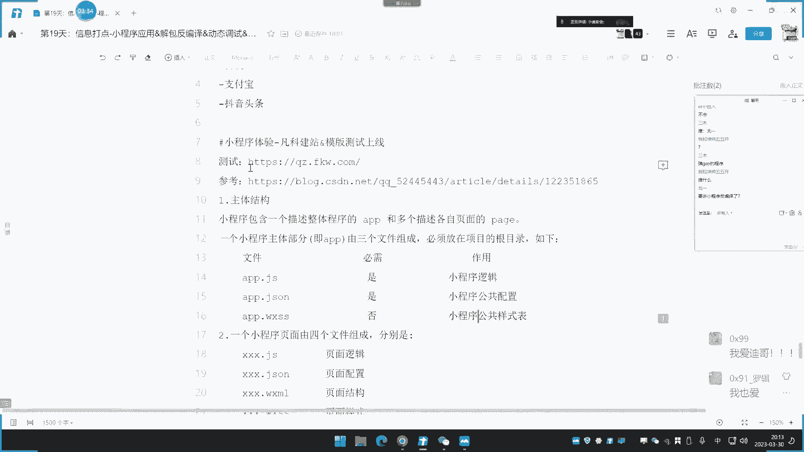

我们可以用这个房客在线上面呢，去生成一个简单的一个这个小程序的一个情况。

好呢，打开这个可以自己呢随便生成一个呢，来演示一下啊，那我这边可以点击一下这个小程序啊，先把小程序删掉，好，我们这里呢可以自己在选这个，这个小程序的模板，这个模板让你给自己根据自己的需要。

我们给自己的选这个哈，呃我这里来就选这个吧，啊这是我们的小程序喇叭选之中，然后呢呃其他的我就不改了啊，这个什么图片这个东西啊，不改了，点击这个这里有个预览，预览就是它大概的一个模样啊。

然后呢我们点击这个还有一个情况授权授权了，你看他有什么微信，百度抖音，支付宝和快手是吧，这是我们刚才说的几个平台，用的小程序比较多吧，然后可以发布到这五个地方，我们这边用的是微信啊。

然后呢点击这个那个啊，然后呢点击这个授权，这个授权呢他要这个有微信公众号啊，这些东西啊，我们再点击注册小张的账号吧，然后这里呢有四个选项呃，这里呢我们用这个试用啊，如果说你要用这个什么公众号资质。

他是需要通过这个认真的啊，包括这里呢有什么法人，这些企业的一些华人才能行的啊，我们就用第二个这个呢就是说可以本地玩一下，但是呢他不能发布到这个官方去，那就是自己的能玩点注册。

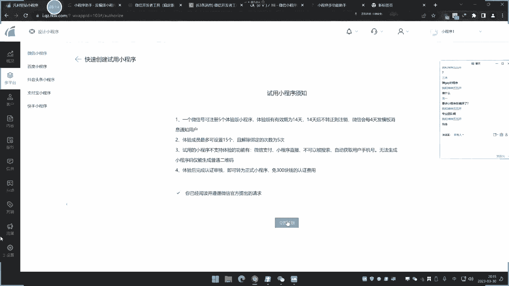

然后呢用你的微信的扫一扫就行了，你扫一下，那我随便取个名字叫小的测试。

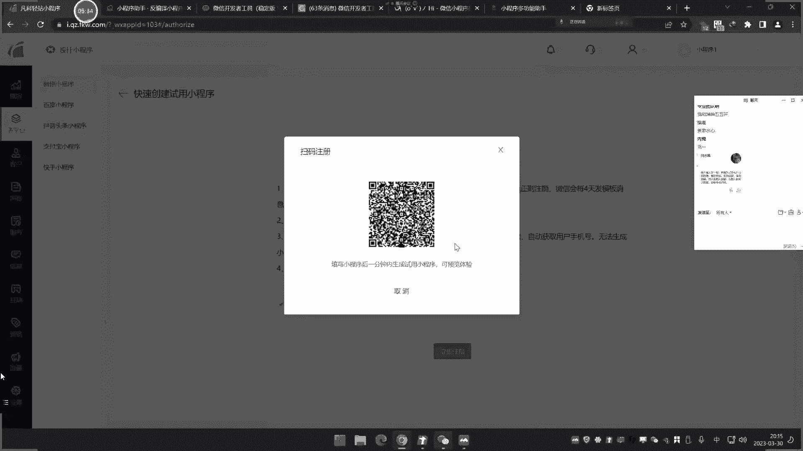

好那现在呢我就已经创建好了啊，处理好之后呢，这里有个角贴绑定体验者，就说他没有发布到官方。

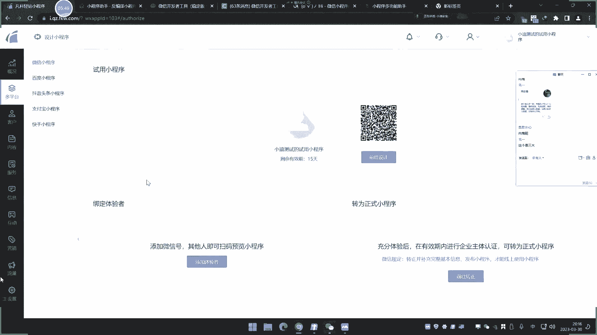

所以你在那可以点击体验者，体验者就是我自己的微信号码是黑人，大家都知道微信号背都背的下来了，534901对吧，嘿嘿电击棒铃好。

这就是这个人呢他就可以这个去试用了啊，你们是使用不了的，然后现在呢我就给他试用一下，然后你看一下你微信这边点一下这个地方，那现在让你点一下这个地方，那现在是没有的是吧，没有呢。

我把它简单的扫个码来进行一个试用，然后同步到这个P3这里了，好我现在在手机上面已经点了啊，然后我们再来看一下啊，点这个地方看到没有这个东西的小测试，打开。

大家也看到啊，这什么情况打开都是，页面有点问题啊，不应该选择这个模板的模板有问题，他妈的，这是官方那个小程序自己的问题啊。

我重新搞搞吧，简单来说这个过程我就大家懂就可以了，因为我们就是说了解这个情况啊，因为它只是个设计，我们等下演示，那都是原石，真实的就是发布的真实版本，不是说像我们这种搞实用的，我就说这种情况啊。

哎就这个意思啊，这个无所谓诶，我真是无语了啊，我以为是我搞错了，大部分自己看一下啊，哎，我以为是我自己把小程序搞错了，名字都把我想成名字改了，这我真是没话说啊，这个翻车这个东西呀，你咋把好说的呢。

对不对，我还有我这个搞错了，哪里选择了模板，模板不行，换个模板搞半天，是有人把这个小程序都弄了，哎算了啊，你说这里面的讲个啥呀，讲这种恶嘛，就不能出现出现就被烧烧了之后就不是我的了，算了算了算了。

我无语了啊，还有人问我怎么改，你说怎么改呢，情况设计啊。

这里不是能改吗，这东西呢你想怎么改就怎么改呢，想加图片加图片。

但这个呢它是免费的，你要收费的话，他有些其他模板他需要收费，这不是我们关心的啊，这只是说他给你一个提供模板啊，如果说你要设计你单独的，那可能就是要找程序员，那自己帮你去写啊，只是有这种模板啊。

啊这个那我们就不说了啊，就这个意思啊，马都被扫了吗，我们还搞毛啊是吧，还好是里面的这种这种适用的啊，所以你们老说这个搞真实的真实的能搞嘛，啊真实一搞，第二天这个真实的目标网站那里蹦，那你没得。

那谁承担起那个责任啊。

好，这个是我们说的这个小程序的一个大概情况哈。

然后呢，现在呢我们就来到这个真实的这个操作啊，真是个操作，这个真实操作呢是有两个部分，第一个呢就是和我们这个前面讲的是一样的，也是利用这个抓包技术呢来对它进行抓包，完了之后呢。

抓包抓到的什么IP域名就可以进行相应的挖，完全测试，接口测试和这个IP上面的端口服务测试，这是说我们为什么要进行新收集的原因，就是为了后续的一些安全测试的思路，那么它是通过抓包。

也就是说可以打开小程序的进行抓包，这个小程序抓包的前期，在课程中我们已经给他讲过，而且演示过了，那今天呢我们就做个简单的一个。

过程的描述就可以了啊，我们用到的是这个pro呢，加上这个加这个bb shot，来进行联动的一个抓包啊。

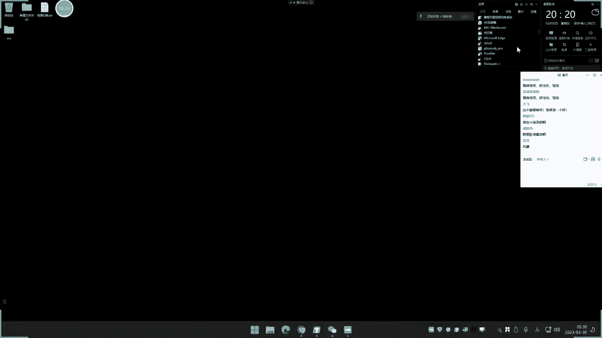

你抓不了的话是什么原因呢，就是你这个Buff数的帧数都没有安装好，大数的帧数呢，你要安装到浏览器的两个地方。

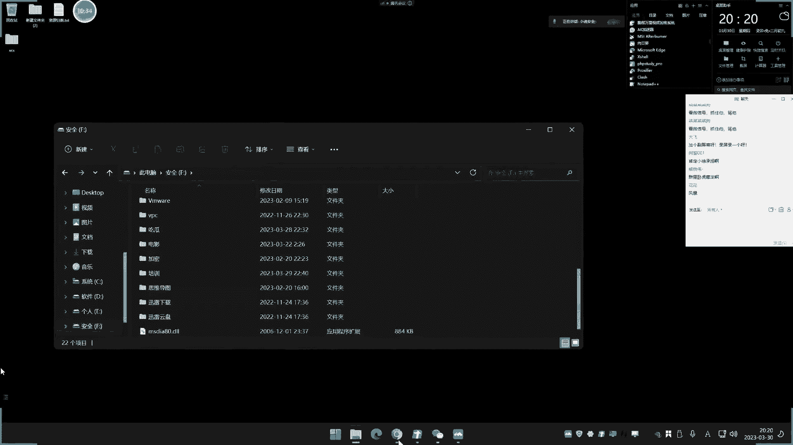

这里呢我们给他提一下啊，就那讲的时候忘记给大家说这个关键点了。

他有些抓不到boss这个情况，就是我们要把这个bot的包呢给他啊，在这个中间证书这里和这个收信任这里啊，两个地方都要安装好那个巴布的包，巴布包的名字是P开头的，就这个的，你看收信人里面安装了中间人。

你这里呢我也安装了两个，都装了这个BB包进行导入好，我们现在就把这个东西介绍完之后呢。

我们来看一下啊，把他抓下来看一下演示在低点啊，先从抓包上面去对他进行这个新收集，就是说他Y在表现上面进行新收集啊。

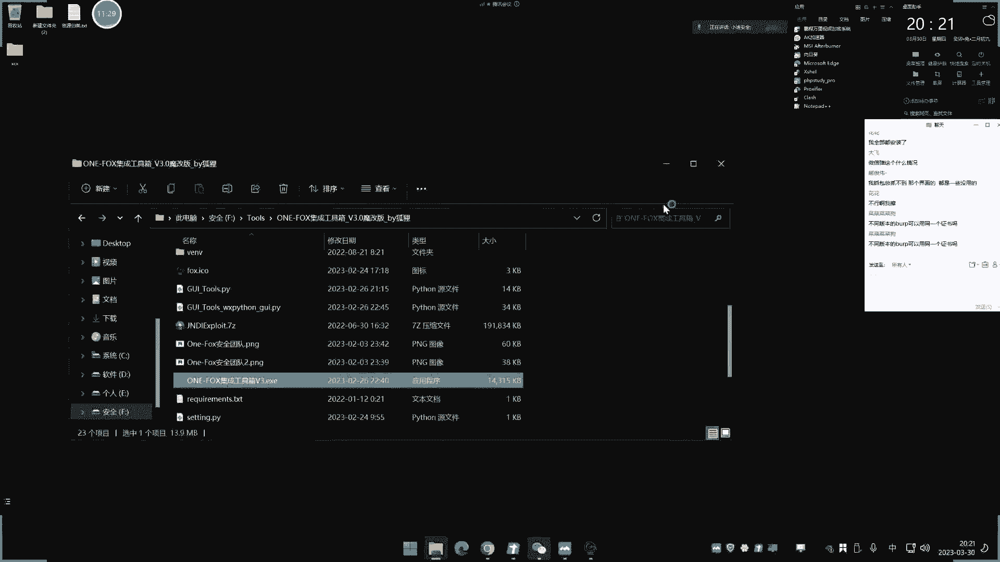

好下一步，不同版本能不能同意帧数，这个不清楚啊，应该感觉不行啊。

应该也可以，主要是看那个版本上面是不是有同一个证书，好，这里呢把这个监听自己的本地的八零马力，然后呢我们打开这个这个代理工具，这个工具在前期已经发过了，发过的呃，这个规则呢大家可以看一下代理服务器。

添加一个蹦迪呢，转向到巴黎马里啊，点击确定检查一下啊，能够进正常通讯没有问题，然后呢再来看设下规则规则，这里呢就是说针对这个workout app e x e x e，对它进行启用代理。

就针对这个进程呢进行启用代理，这个京城是啥进展啊，这个京城就是我们微信的小程序专有进程，就说你启动了小程序的话，就会运行这个进程啊，意思就是说针对小程序进程呢让他走这个代理，然后就走这个代理。

就会走到这个工具这么难嘛是吧，我们其他的包呢我就不改了，就是我只针对这个小程序的包，把它走到这个bb shot这个设置就这么设置啊，大家都应该都知道了啊，点击确定就确定好，这个时候呢我们就来打开微信。

来尝试的去访问这个类似的app啊，这个小程序看你比如说我打开这个可以看到它，这里就会有相关的什么，就有相关数据包吗，你看看这个小程序的啊，点一下呢只是有相关数据包，你看看点一下下面的，那他也是水包。

那这个呢就是从外在表现呢去找到这个什么，这个相关数据包，对不对，点一个那就有相应数据包好，那这个就是说通过抓小程序上面的一些操作呢，把这个包呢给他抓到，然后呢我们再针对相应的域名和这些。

我说有些IP地址啊等等，然后再进行安全测试是吧，后面的东西我们就不介绍了，这是个很简单的同样道理，那你也可以那换一个是吧，比如说到这里了，我们换一个这个K11的勾，他也是数据包里看呢，对不对。

都是一样的道理啊，嗯对对，是吧都能抓到啊，没问题啊，那就是说通过这个抓包呢，嗯得到这个目标的一个什么一些这个自信息啊，IP地址或者域名，然后呢在转到一些挖宝呀，或者IP上面的端口渗透上面去啊，好了。

现在呢我先把这个关一下啊，避免大家有印象。

那这种呢就是我们说的最常见的，因为前期已经演示过这个抓包的这个演示了啊，这个就是从西，从它的APP小程序里面，去抓到一些IP或域名呢，然后呢再针对性的IP和域名呢做一些安全措施，呃。

这是我们说的这个前面已经给他讲过的，抓包的一个讲解啊，就是说今天讲小程序设计呢，还是把它提一下，那么最主要的是我们下面部分内容，这是我们今天一个重点啊，就是关于这个小程序的一个理想，你像APP里面。

我也是APP上节课的内容，让我们上的是什么内容呢，大家应该都知道，你看啊，那呃从这里面呢APP得到这个信息之后呢，从里面提取资产，然后呢再抓包是吧，然后呢还有一个动态调试，那么同理啊。

在这个小程序也有这个东西，就是说立项的技术针对他的这么解包和反编译，动态调试来进行这个操作，然后呢再调出这个代码之后，源代码之后呢，我们来对比一下源代码的结构，和它的一些结构的解释啊。

啊并且呢我们看一下这种东西会出现哪些东西，一般我们把这个解剖和反面做了之后呢，就会得到源码，源码呢主要就会测四个方面，第一个方面呢就是它更多的资产信息，就说抓包抓不出来的网站或者IP。

第二个呢就是看一下里面有没有配置信息，就像一些什么K信息啊等等，还有一种呢就是测一下未授权访问，还有就是测一下这个源码中的安全问题，就是说代码分析主要是现在四方面，来针对这个小程序后期的一个测试啊。

就是我收集的信息是为了干嘛，主要是针对四方面，那么现在呢我们就来演示一下，这个小程序的这个解包和反编译，那么简报很坏，免疫呢，如果我不上这个课的话，你在网上搜搜到大部分就是这东西。

那网上有这种类似文章是吧啊，去年发布的呢一台root什么安卓手机，一个解密工具，还是什么反编译工具，还安装一个什么low的环境，这个low的环境是必须要安装的啊。

因为这个low的环境是小程序的开发语言啊，这里呢我在安装包里面给他打包了啊，你安装一下load js默认安装就行，然后在这里呢还有什么解密工具，还有一个反变工具，还准备什么，安卓手机是网上一个方案。

而这个方案用到这两款工具，一个解密工具和一个反面工具呢，我给大家说一下啊，这个解密工具和反面工具呢，其中这个反面工具呢已经开始收费了啊，已经开始收费了，就是没有免费的了，他以前老版本的。

现在也做不了新小程序的这个反面，所以说这篇文章呢用起来的话，只适用于一部分的小程序，就是以前老小程序升级了可能就不行，然后呢还有一点比较麻烦，就是说这里呢需要一台安卓手机啊。

这里呢大家肯定是有些人用苹果，没有安卓手机啊，呃我这里呢也没有给他准备啊，如果说我搞安卓手机的话，我还把投屏投到这个投到这个电脑上面，你才能看到我这个操作，所以说没办法啊，我就不用他这个方案了啊。

这个方案呢用他老版本还是免费的，但是老板免费的操作也非常繁琐，所以我就在网上找了一个这个收费的，然后呢，我也花了15块钱，给他充了一个这个一个人的一个会员啊，他这个操作相对简单。

这个方面的新收费版呢一天60块钱，真是他妈的贵啊，这个新版的这个东西一天60块钱，谁都顶不住。

我还之前准备说讲一下这个这个免费版的，后面我发现他收费了啊。

那个地址我找不到了，然后呢我找了这个小程序多功能助手，这个呢是要比那个两个我觉得都好用，它是集成在一起。

然后呢这样下载啊，自己去下，那我们就不说了，这下好了，充了一个月费，月费15块，计费30块。

我充了一个月费一下。

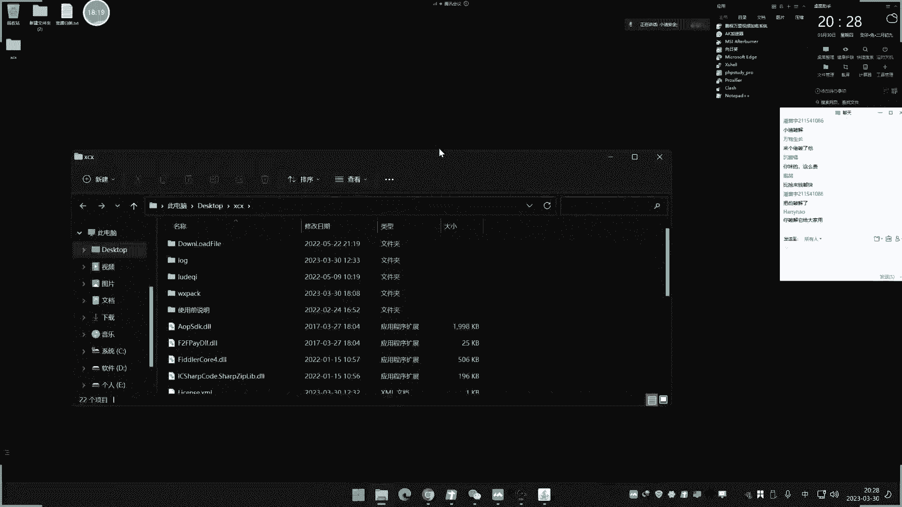

如果说你要用免费版的啊，这网上免费版的也可以，但是操作非常麻烦啊。

我觉得你没有必要呢，为了省钱，那十几块钱啊，自己搞，有些人本来基础差。

你要搞这种环境，你刚才像是个文章，搞都搞不了，只要安装环境呀，有什么手机呀，还有这没有手机，还要在模拟器里面拖这个东西，拖出来再再进行怎么搞这个操作呢是吧，实在是不适合这种新手啊。

所以我就说搞了这个版本。

这个版本呢再来演示一下啊，非常好用啊。

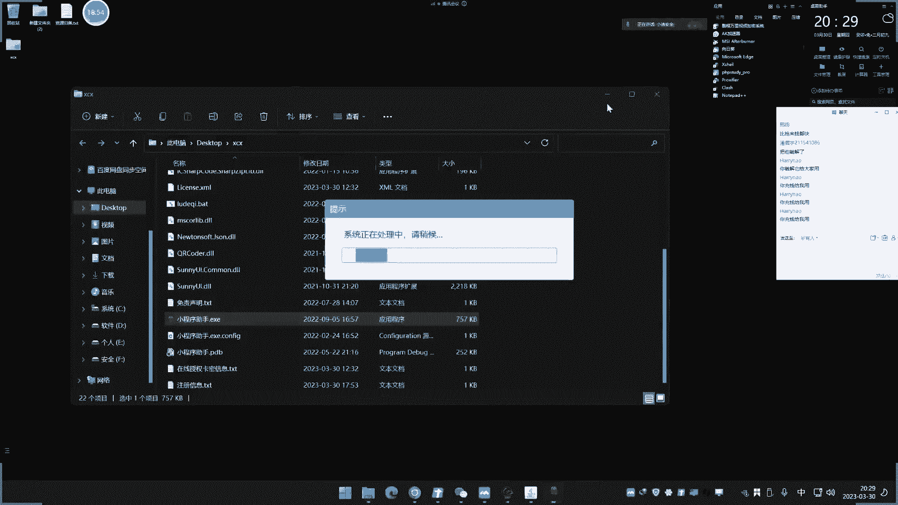

图形化的，然后呢具体操作呢大家可以自己看看文章，我这里就直接给他演示怎么操作了啊，第一步是选择这个选解包文件，第二步呢是要刷新反编译包，它是分两个部分，第一步是先解包，就是把小程序的包给他解出来。

然后再对着这个包进行反编译，最终得到源码，而且它里面还有一些其他功能，我们等下会说，那么具体操作是怎么操作的，给大家看一下啊，首先呢选择捷豹文件，存在捷豹文件是要选择对应目录，这个目录怎么找。

怎么制造小程序的运行目录，给大家说一下，你打开你的电脑版的微信，在这里呢有个设置。

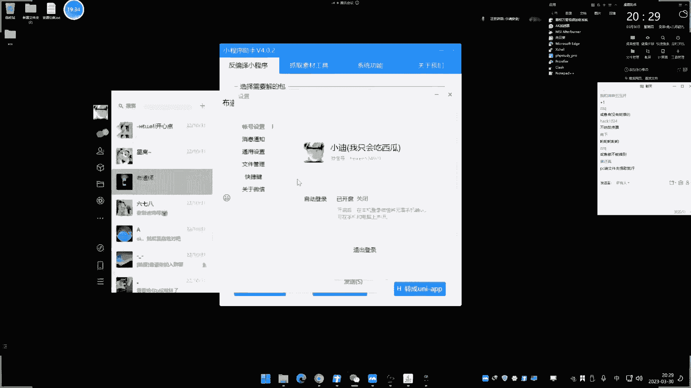

设置里面有个叫文件管理，打开这个来打开这个地方，打开这个地方啊，然后这个地方有个叫app light这个目录打开，这就是你所有任性小程序的集合，我们先把这个WX开始的这个东西呢给它删掉。

这就是说先把你之前扔行的小程序的，这个东西删掉啊，你不删也可以啊，我说删了更好判断，把这个删掉完了之后，我们试着去尝试认识一下一个小程序，比如说我认识一下，运行完之后它就会产生一个目录。

你看就是刚才时间呢WX9454，这个就是它的这个小程序的一个编号，固有的编号啊，就是你无论怎么后面再打开它都是他啊，都是他，你看我们打开它都是它嗯，都是它，它不会新增啊，就说他不是这个人形式。

就是一个目录啊，不是样的，就是固定死它了，然后你打开一看，这里面就会这些东西，但这个呢不是源码啊，这个不是源码，我们就需要用到解包选它，然后选择这个目录啊，怎么还有这么多没刷新呢，你看这个目录选择之后。

点击打开，啊这里的诶，稍等一下，什么情况哎，这个结果怎么不一样了呀，哦哦哦我知道了，刚才这个没有，这个叫黑人的，这个是我这个微信号，哦是在这里啊，在这里在这里在这里面，我先把这里都删掉啊。

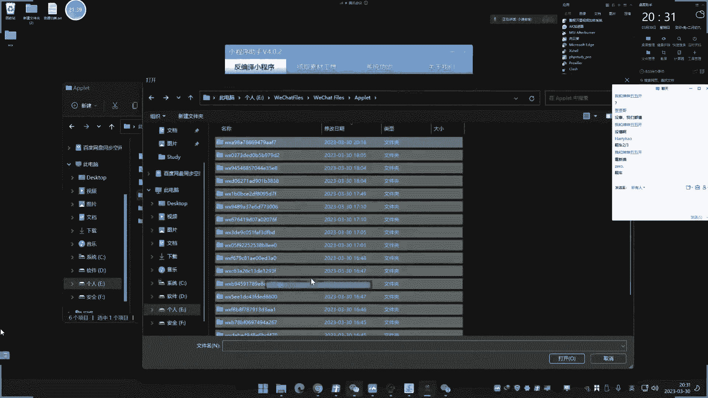

我以为这个目录还有点问题了，我说。

回来一下啊，从右边进下。

运行完之后呢，选这里找到那个目录。

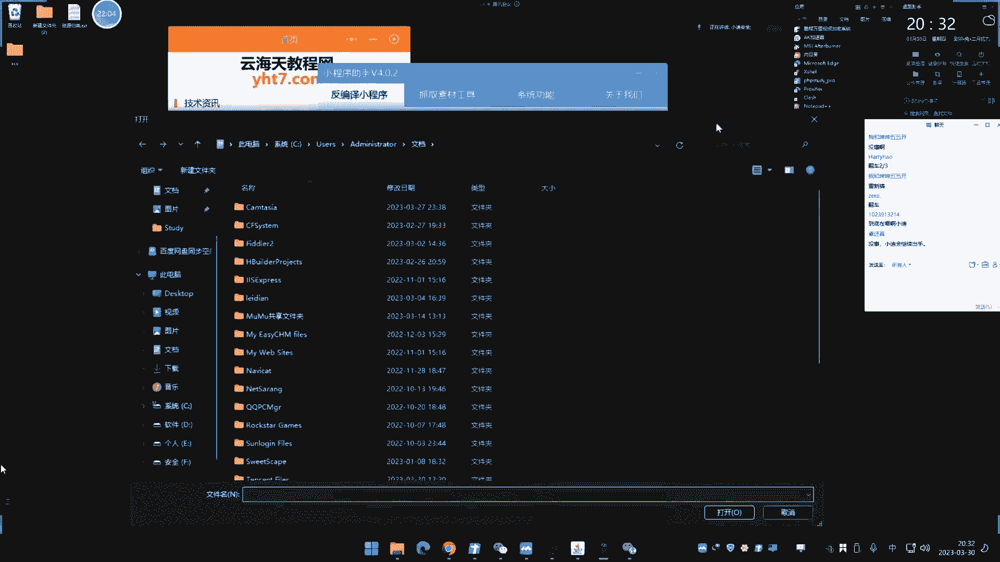

哎你自己如果说我这个操作你看不懂的话，他这边呢也是有这个文章介绍的，他会教你怎么去操作呢，还有文字教程啊，就你运行之后呢，嗯这里有一些的选择这个结构，然后呢会找到这个目录，找到这个目录在这里选择。

然后选择对应的地方。

选这种啊，我们打开，完了完了，这个好像是哪里搞的，有点小问题啊，是我把东西删删多了呀，好在这里好，搞错了啊，找错目录是在这个目录啊，大家注意一下，不是在这里啊，在这个地方。

在这个黑人商机来这里找到这个文件，就是WXAPKG这个文件，找这目录啊，啊把它选中啊，这里要注意啊，有些地方的小程序呢它是有多个的，它是有多个的，就说有些是一个，因为是多个多个就是有分包。

我们等下会说多个的情况啊，你看啊，我现在给大家运行一个小程序啊，我再给大家更新一个小程序。

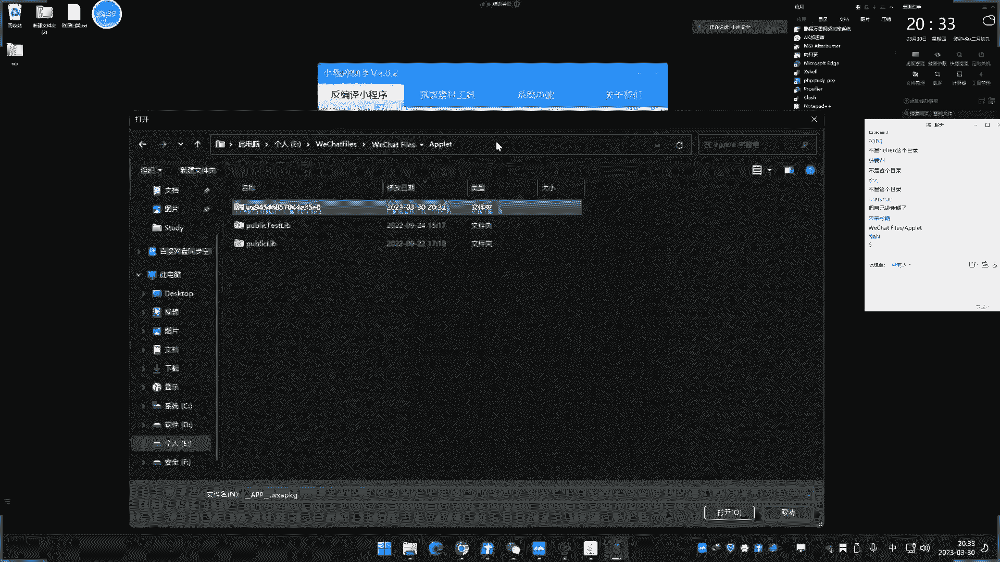

大家看一下啊，再运行一个就运行这种小程序，写的比较复杂的，功能比较多的，他可能就会多个对吧，你看我点一下啦，比如说我这都点一下，你看看这地方啊，我把它选择中好点多个啊。

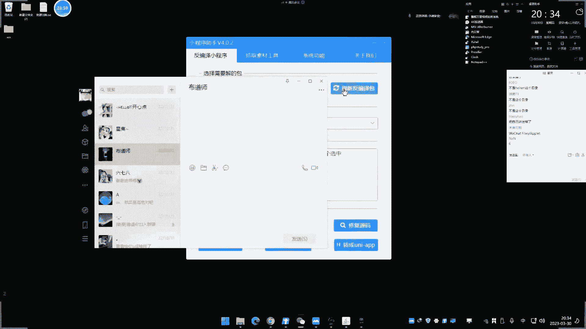

我看一下啊，他这里呢我们去选包文件的时候，那他这个刚才那个嘛是吧，打开你看是不是有多个，你看它有两个，如果说有一个和两个都不要紧，你把全选就完了，知道吧，把全选就完了啊，所以说呢自己记住就可以啊。

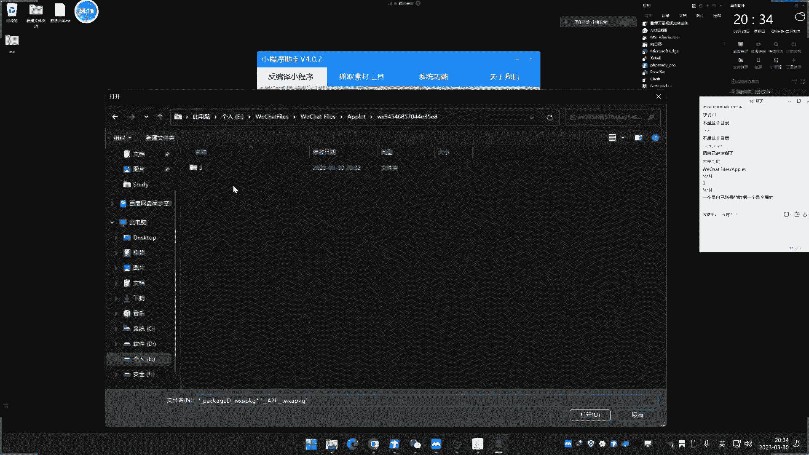

全选那他说解包成功，解绑成功之后呢，然后再点刷新，因为这里面没有刷新，这点不下去了，勾不全下去，他解包成功之后点刷新，刷新之后，这边呢就会有你刚才你那个解包的这个文件，然后再把它选中。

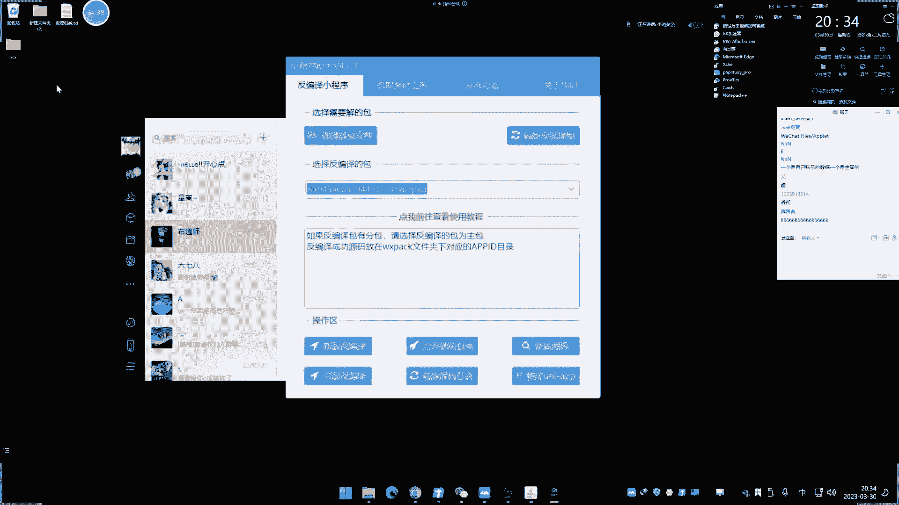

它会自动在你这个目录，就是你这个程序目录下面，那有这么个东西，你看就是刚才解的呢，它也会自动生成这个灯，就在你的运行这个工具目录上就会有这个东西，就刚才解的，你刷新之后呢，它会自动识别到。

然后再点什么新版和反编译和旧版反编译，这两个有什么概念呢，我给大家说一下啊，如果你觉得这个小程序写的界面比较丑的话，你可以选择旧版写的比较新，那就选择新版啊，一般都会用新版啊，就是有时候会有一些意外。

就有些小程序比较老了，没有更新，那就用旧版，那我再点这个新版反编译，打开一下好，他就提示你反编译成功，我们就可以看到这个目录就存在这个文件夹了，这不就是把它的源码呢给它反编出来了。

这个就是把源码反编出来，你可能会问这个东西反面之后有什么用呢，对不对，然后呢这里面还有个叫修复源码。

我们可以点击一下修复源码，找到反编译那个目录，就刚才那是反编译目录嘛，把勾选对了，进行一个修复好，他说无需修复，无需修复就完了呗，点确定好，那么现在可以来到这个开发工具这里啊，点击微信开发者，这个呢。

就是你自己电脑上安装过这个微信开发工具。

就是哪里呢，就这里啊，就是微信官方提供的这个微信开发者工具，就是专门开发小程序的工具啊，自己再下载一个安装啊。

安装好之后，它就会自动帮你识别到这个地方来啊，当然了，你也可以直接用我们这个是吧，用我们这个自己电脑上面的微信开发工具。

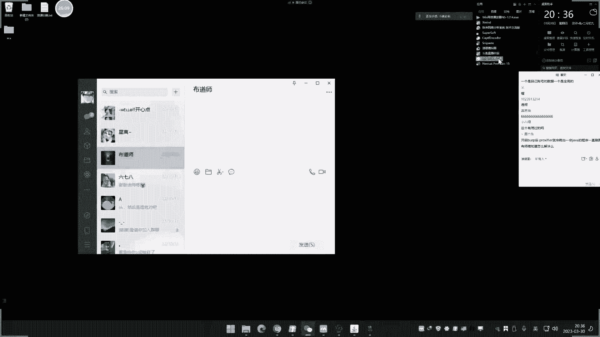

打开也行，把这个打开之后怎么办啊，点击这个地方呢，导入小程序，我源码刚才把它拖下来了啊，我现在把源码给它载入进去看一下啊。

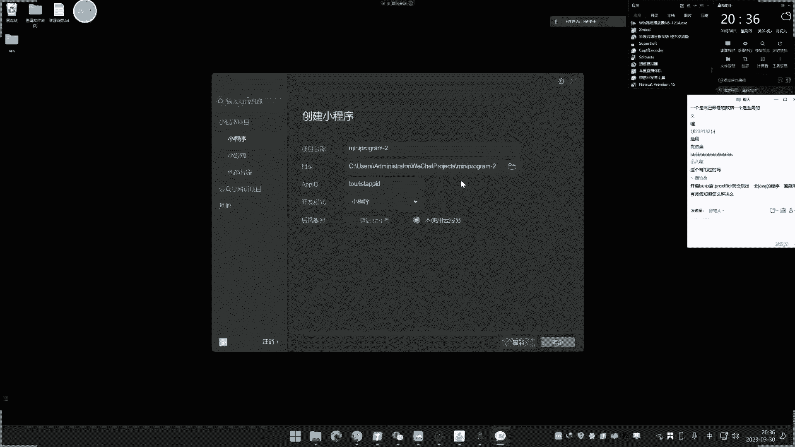

选择目录载入刚才那这个这个源码目录嘛。

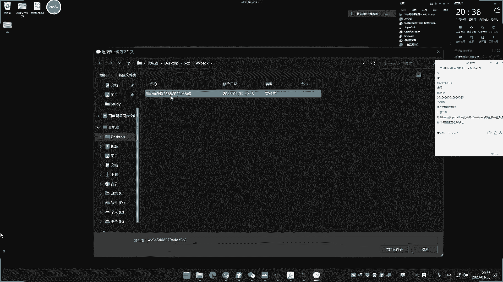

然后呢点击打开，然后这里有勾选是吧，我们一般都默认就可以啊。

点击确定，那么它就载过去吧，大家可以看一下新任病人行，新任病人行，大家看起来，就把他的小程序呢给它载入进去，但这里是不是有错误啊，还有一些报错是吧，页面好像写出来，但是有些报错怎么解决呢，看下啊。

这个地方呢把它勾选一下，要将JS编译成ECECE5E五，把它去掉下呐，看到没，现在正常了啊，如果说有这种错误的话，你这样搞一下，你看正常了啊，页面显示正常了好，你问一下这东西就是类似。

就是把它源码拿出来之后，再把它源码呢啊，用这个微信开发者工具，因为我们这里讲的是微信小程序啊，讲的是微信小程序，因为主要就是微信小程序嘛，对不对，然后呢你把这个搞出来之后。

那接下来你就说这个东西有什么作用啊，我们搞这个东西是干嘛，这是调试，这是调试啊，你看我能，有什么作用呢，这边有个叫可视化，还有什么操作啊，大家可以看一下，你看有什么作用啊，我去触发它，扔你东西的时候。

这边呢这个调试器就会编啊，比如我点一下啊，电脑没反应，这啥情况啊，这个叫可视化。

把勾选下来，看着可视化勾选一下，他重新载入啊，大家看着啊，看这边我点一下一个东西，点了没反应是吧，下面也不能点上面点一下呢，这边有没有反应，没反应不要紧，后面总是有反应的，你看我点上面的。

我点上面的东西，然后这里呢有几个结构，我们要把它简单讲一下啊，那这里有什么JSJSOWSMWXS，来看一下页面逻辑，页面配置，页面结构，页面样式啥意思，就说关键性的代码是在JS里面。

结构就是它的一个大概的一个圆啊，就是大概的一个那个显示架构，央视呢就是我们说的一些美观的一些处理配置，就是一些里面可能涉及到有一些这种信息。

那么你可以看一下啊，index打开这个地方，我们把这个调大一点啊，把这面缩小一点，可以看一下正面的一个情况，我们把这里的往下拉一点啊，这个是源代码啊，这个是源代码呢，这就是它里面的这个index源码。

这个源码那就类似于是那个TM代码，然后里面有些调用的地方，然后这个呢你这是干嘛的，一些配置，就是一些接口地址，接口地址，然后呢，这个WS呢，央视文件就是我们说的什么cs那种东西，就是什么在哪里显示啊。

是什么颜色显示啊，是吧，这种央视这个东西它不重要。

一般着重看的就是看这个这前面三个，而JS呢就是负责处理的，负责处理的好，我们来仔细对比一下，看是不是这个流程啊，然后你如何知道你当你去操作的时候，是哪个文件对应哪个东西呢，也好也可以把它整出来。

大家看一下啊，我把格式化选中之后啊，当我去勾选这个路径的时候，你看啊这上面喷剂目录是干嘛的，我们再来解释一下呢，页面文件夹，首页日志工具箱入口，JS全局配置文件，全局样式文件。

还有一些其他的主要就是这个叫page页面文件夹。

啥情况啊，我们群中它地方打开，这里有index about什么，这里什么list对应意思就是什么首页啊，列表啊，关于这种信息好，我们现在来想想列表，这里有个叫南部这个按钮，在这里又叫栏目按钮呢。

这下面有个栏目按钮啊，你看啊，我选这个列表的时候，我们来选中这个了，把它一勾选，你看啊会有什么响应啊，注意把这个可视化勾选上啊，点这个地方呢来页面动了，看到没，页面动了，就说这个页面就是某一个操作。

那这个操作是哪一个操作呢，技术新闻这里好，我再来勾选这个地方呢，再点这个啊，页面它又动了，下面又调了，来到刚才那首页，那就说这个首页的代码，那刚才那个呢就是启动列表的一个代码，点一下这边就会动呢。

然后呢像上面这个about就是我们的什么关羽的，点一下，他是来到关羽的地方，就是关于那个地方啊，还有这个地方再点这个地方四个页面，那就来到这个地方对吧，我们可以对比这个小程序看一下吧。

这是我们运行的小程序，我们看下这个嘛，刚才搞了这个来点这个地方哎，点这个栏目的时候触发是哪里呀，是不是这个呢，这个是栏目嘛，这个代码，然后呢还有什么就首页就这地方啊。

还有什么这个更多咨询跟着自选技术新闻。

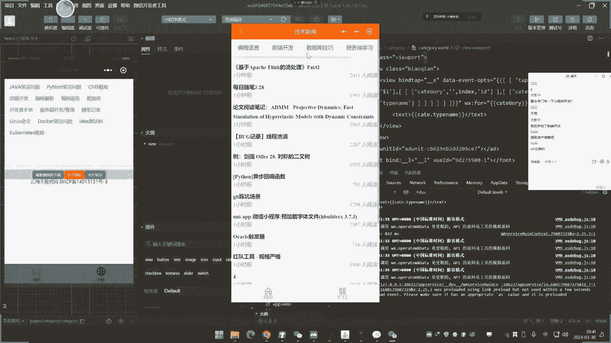

那其实应该就是刚才这个list这里，或者是这个包这里对吧，好我们来看一下啊，那有这个东西，就是说我们能够调整跟踪这个小程序的运行，然后这边可以选择你的机型啊，就说你这个用IPHONE啊。

还是用这个安卓的机型啊，我在选择随便选择一个，一般选的话就选择第一版本的啊，因为有些小程序可能高版本有些不适应啊，注意一下这个地方啊，那这里呢就把它搞出来了啊，你现在看啊，我们来看一下。

我们抓包看一下啊，你看有什么不一样的啊，观察啊，我抓包的技术，抓包的东西逻辑我全部可以在代码中给你找到，所以说代码呢你搞清楚之后，这个抓包它里面的东西都在里面，抓包的只是抓它表现出来的代码里面。

还有他不表现出来的也能抓到，你看着我操作一下，我先把这个抓包的堆堆堆堆起来，看这个代码啊，这样子会更好的理解，好一开闸线是空的好，我们来抓个包来看一下啊，打开这个地方好，两个包来ICAPIICR地址。

IW9杠八好，我们来看一下啊，点这个栏目是IKACT好，我们对着看啊。

那现在我们来关注一下这段代码啊，我们还要关注一下刚才那个代码呢。

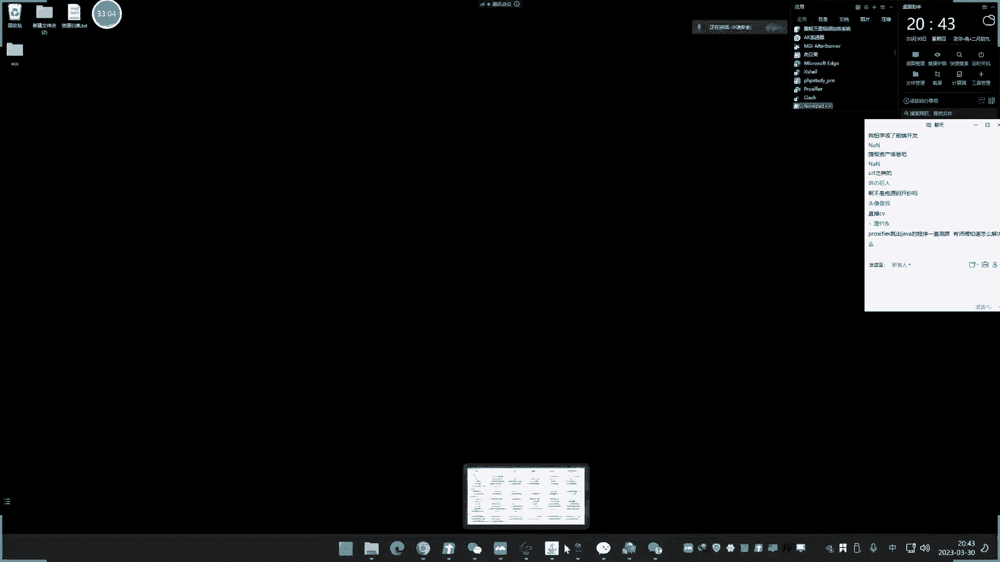

带满了，你看着啊，我先把这个可视图给它去掉，好，我们来观察一下啊，刚才我们确定了这个index是首页是吧，我点击首页的时候是触发了什么数据包啊。

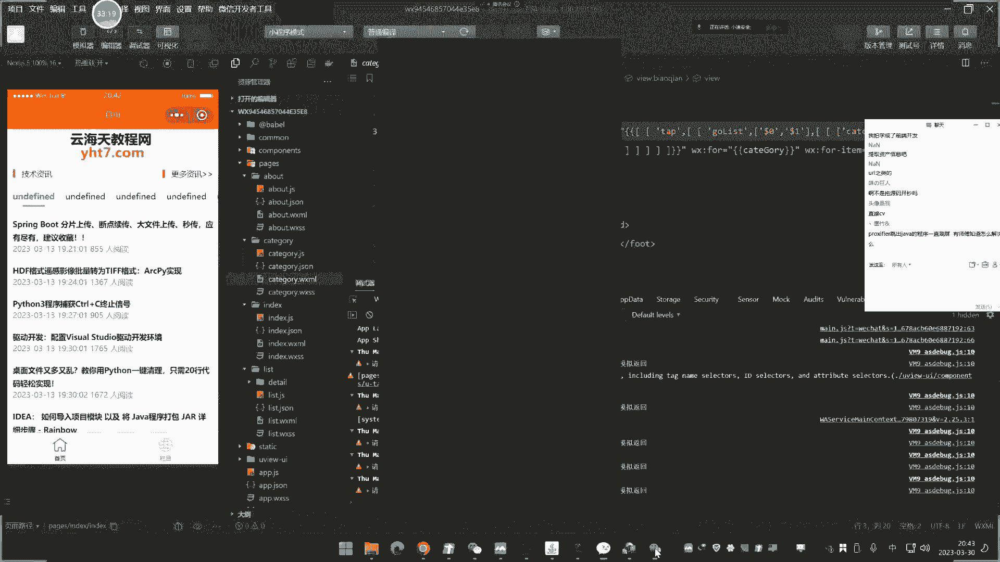

那我们先把它揉一下，那我点击首页的首啊，来点这个首页出发的时候，重新把它打开一下，就是默认进首页的数据包，好一个二一个九八好，点一下这个前端开发七八数据库技巧18好，注意了啊，这是刚才上的操作。

来首页的地方，刚才说首页是这里调出来的，是这个路径，来我们看下面的地址啊，我们来看这个是他样式文件是吧，是央视文件，JS是他的处理逻辑，我们在处理逻辑里面去，可以随便搜索一下一个数据包的一个地方。

APIICL来搜一下ICI来看，没约等于SL加一就是二的意思，R那还有60等于九八，搜一下6S看下能不能找到，在这里看到U2等于601加八对应上了吧，所以它的源码和你那个网站抓包的那个逻辑呢。

他是写到了这个对应的这个文件夹在里面，然后呢对应的这个JS来处理，就你说那你那操作就那么操作是吧，同样道理啊，你继续你看啊，比如说我现在对这个小程序这个栏目，这里做操作，那栏目这里是API钢CATE。

对不对，那么那么刚才确定的是在哪里啊。

是这个地方吧，打了JS我在这个文件里面去搜是i cut，I cut in cut，那看到没有这个路径，你看清楚这个路径，那是源码用JS操作的，其实就是说他那个源码呢，就是用JS帮你写出来的。

然后你在这个页面做操作，就会用这个JS来进行处理，所以你在上面就能看到，然后你还看到像这里呢，那请求的路径的结果呢是pg加index加index，那pg加list list啊，人海天加什么自杀说明信息。

然后呢还有一些图片的路径，第一次包括这里呢，有些地方会泄露他这个什么网站地址，但是路径你在这里呢。

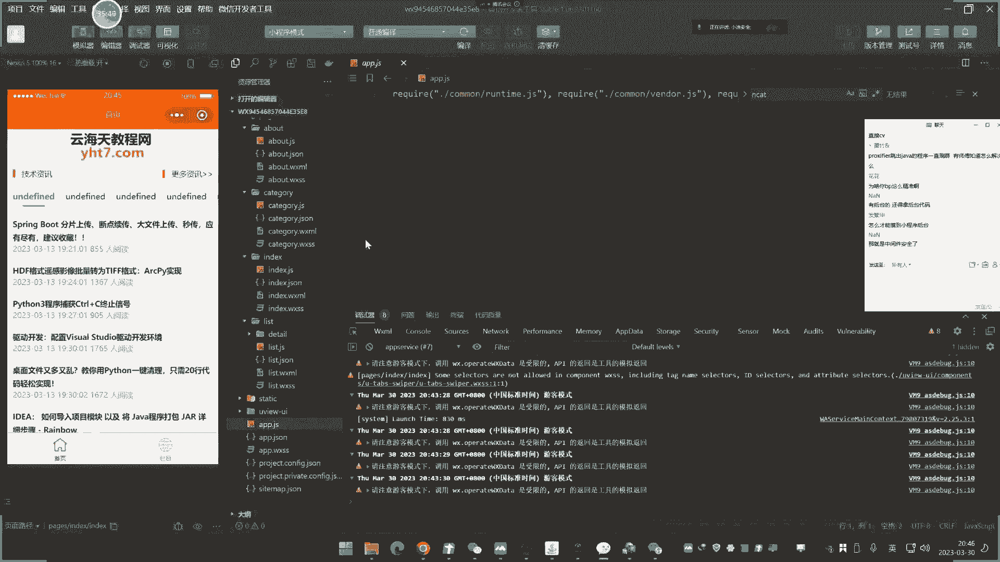

你看JSN的这个源码里面，前面的已经泄露的这个图片是来源于这个网站，然后你可以把这个网站打开，看一下是不是就是小程序的那个图标页面来。

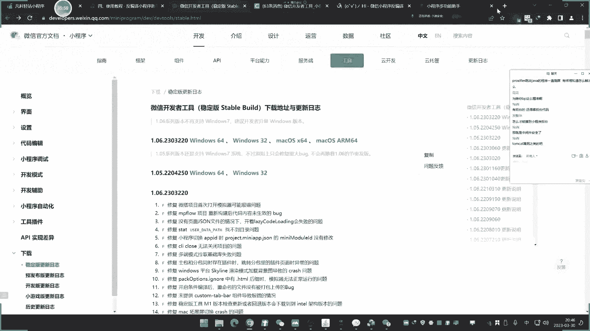

我们还交流完，而是在这个图片把网站打开看一下是不是哎。

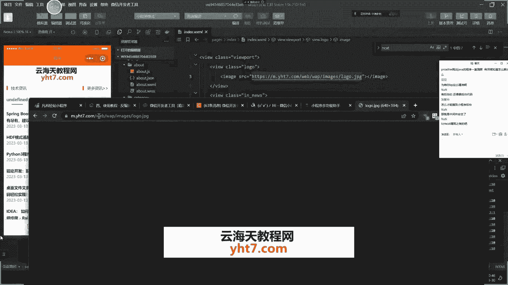

对不对，抓包的也能看到源码里面也能找到这个地方，你看。

对不对，只是说这个小程序呢，他就是用这种JS框架开发出来的应用，它是用JS框架的开发出来的应用，然后用JS语言呢去实现的，这个数据的传输和传递，你能搞清楚这个地方，那么像他一些配置信息两码拿到的话。

如果里面有一些数据配置和一些配置信息，我们就能得到能理解吧，包括这里呢他JS里面涉及到的阿里，像这个里面呢请求的路径页面，Index index，那对应的就是喷子下面的请求，在这个路径请求这个路径。

请这个路径，那就是对应那几个地方嘛，对对对，那几个地方去请求得到那个，这个是首页的那个列表的，还有什么这个什么标签啊，不管你就这可能你说这个小程序太垃圾了，能不能换个小程序啊，可以啊，对不对。

这个小程序太垃圾了，一看就是我个人的哎，垃圾小程序那行，我现在给你看下个补贴的对吧。

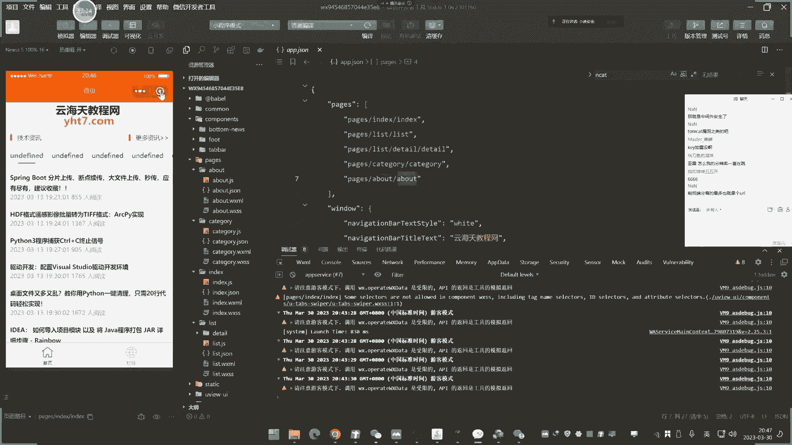

前天我们都来演示的，也不是说我提前准备好的啊，你看下。

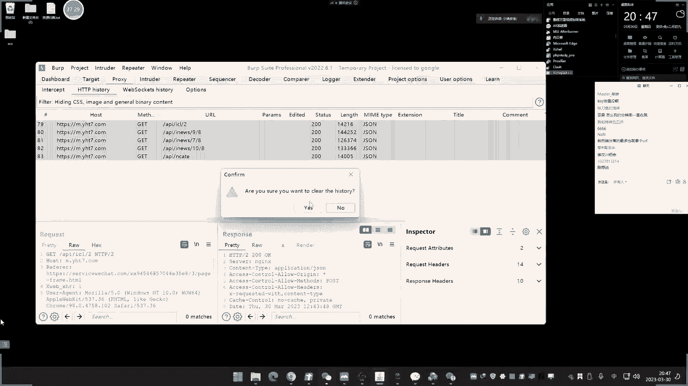

你看这个。

那个补贴的这个，那在这里呢，前几天我们导演是那几个公司呢，这是我们的。

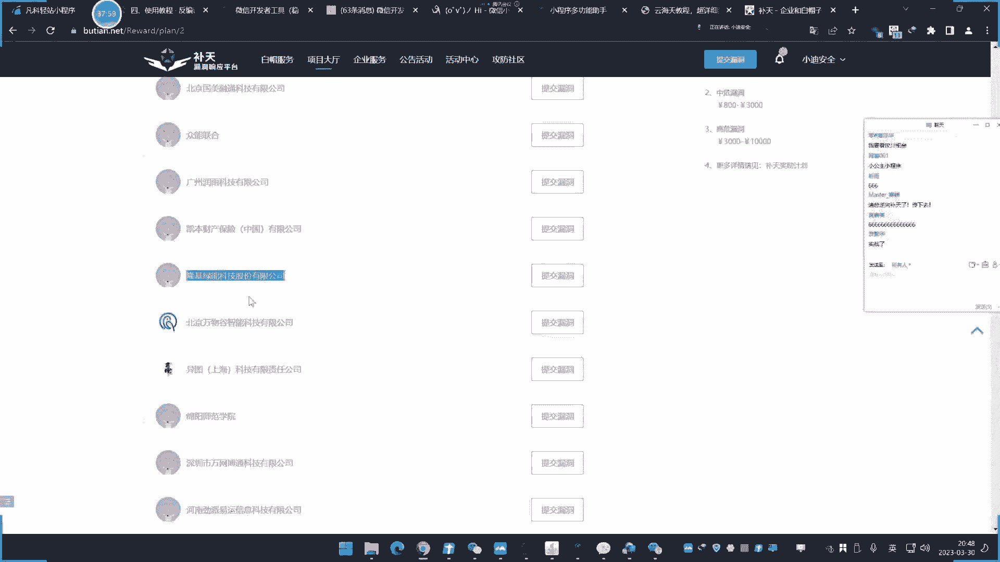

我用它的，我在这里搜，我也给你找一下这个名字，点搜吧，来搜一下，我搜是收到这个相关公司的小程序啊，大家不要说关键字啊，说到这个相关的小程序了哈，对不对，一个这都是这个公司的嘛。

所以说你刚才说怎么找这个小程序，你是怎么找，搜就完了，这里面的还怎么找啊，这对吧，你不是说你目标是小程序，不知道你熟啊，百科微信里面搜啊，百度里面搜啊，京东啊，支付宝上面搜啊，抖音头条什么搜啊。

来搜到了，我比如说我拿这个来去看一下，来我们打开，那大概需要我登录，我不登录哪行呢，是不是还要我帮你，我哪知道我账号啊，我我我都没有这个用户的逻辑，我哪知道这个什么信息都不知道啊，对不对，好，我打开了。

我没有这个账号的这个账号密码我都不知道的，对不对，他需要我登录才能进去看其他页面看啊。

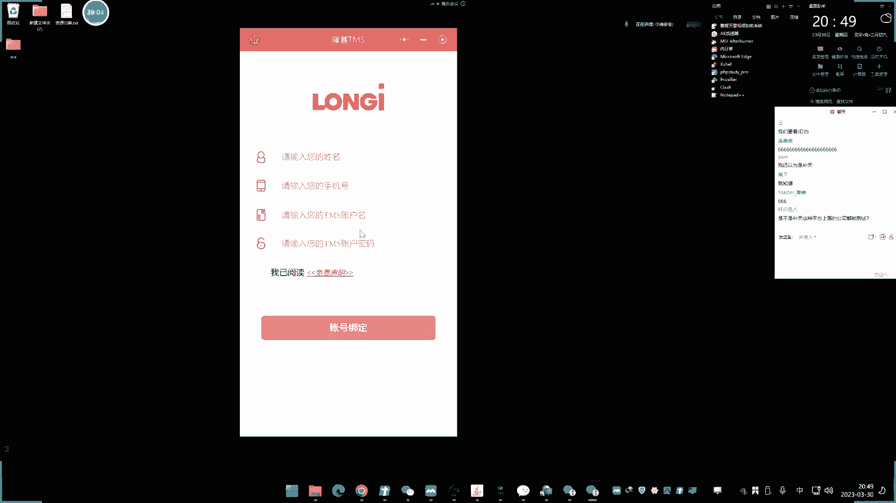

我打开了，然后包了也抓到了。

你看抓了包是这几个包，这几个包子全部是那个登录的那个操作包。

对不对，也没有其他东西登录的那个包啥都没有，完了你不登录就不能进去用，就说他需要登录登录了，你不知道账号密码，你又不是在里面啥好，你看啊，现在呢我们把这个发现一个反兵选择打包了。

刚才那个操作是20。18分，就刚才那个小程序的报呢选中了。

他选中了，就刚才那个时间呢解包，解包之后呢，刷新。

好到转换成功，然后这里有两个两个是什么原因啊，是刚才我这个路径下面，是不是之前这个是刚才那个我先删掉，重新刷新一下啊，这个还在里面，我先把它关掉，对吧，然后刷新啊，然后那个目录只有一个。

就是你刚才那个边边那里搞，搞错了啊，选择新版反编译好。

反面出来之后啊，那源码来了吧，好源码有了之后再打发，打开我们开发者工具啊。

导入文件夹启动器。

信任，看着这界面，然后这里是不是又包出包出，把这个东西给它去掉，好还是报错还是报错了，不管他啊，他还报错，不管他，然后你看啊，这是它的一个运行的，这个什么页面的路径地址啊，来登录啊，什么东西啊。

有这些路径地址，那就是都在这喷子里面啊，你看啊，我要看一下，蛮多意想不到的结果出去了，他不是要我登录吗，我看他有没有微收权，你看下面的都很简单，他有这种检测了，他是游客模式下调用这个微信数据。

那是受限的，其实就是说他这个小程序呢，它其实还是有验验证，你是不是这个用户登录进去了，有这种验证，然后呢去展示页面，他现在是空白的，他说有事先这个下面调试信息，这个信息啊，对吧好，你看啊。

这不是有些页面吗，你看啊，我打开一些关键字呢，这个是首页的。

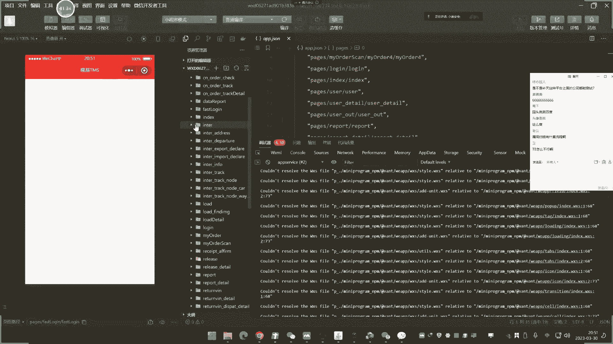

这个是首页的，我打开一下呢去运行它，它没有反应，把这个可视化点开，把克斯二点开，那我点进这个地方啊，他也空白是吧，点击这个首页这里好，那它展示出一个首页了，展示所有个叫我的，也就是说。

现在我看到的应该就是他这个登录之后，一些界面，因为我刚才那个小程序打开之后，你可以看一下嘛，我刚才那个小程序我打开是什么情况呢，打开，但是这种东西嘛我不登录，没有其他按钮给我点了，我哪知道后面还有啥呢。

对不对，我这个登录这这也不是注册能注册进去了，啥都没有，这个张宏民在哪里都不知道是吧，他这里也没有注册的地方，好，你看着啊，那么既然这里能登录，我们看一下啊，有些关键字的。

你看什么这个CNO的这啥东西啊，订单来看一下吧，点开它的页面显示，直接威慑权，拿到你们的灵感信息，这不就是一个威慑全漏洞就出来了吗，不填可提了呀，是不是，所以说啊这些东西啊。

你自己呢要自己学会这个尝试它啊，这个东西我们就不过了啊，后面呢我还要八进打码，这个东西呢，因为倒真是没授权的啊。

所以说这是一种啊，我们再来看啊，还有小程序都可以进行操作啊，未授权的一些测试啊，还有一些这个更多资产信息啊是吧，得到里面的域名IP地址，还有源码的，这个暂时我们还没有学到。

这要学到开发之后再分析这个JS源码，也没安全问题，还有敏感信息敏感性。

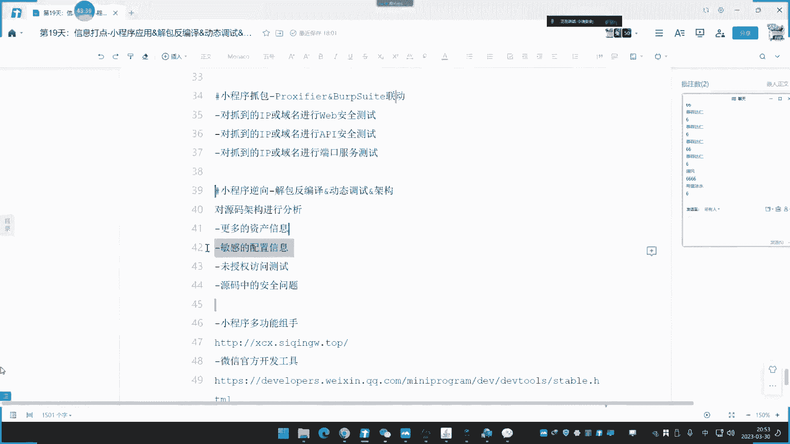

现在我也找到了一个真实目标，直接可以登录他那个什么鬼，boss直在云服务上面，但后面的我不敢讲，太敏感了哈，所以我就说把那个，把那个什么把那个一些其他的拿一下讲一下啊，你看啊。

我们现在来看一下这个另外一个目标，你看这个梁老师的啊，一个我们本地的一个什么鬼，就我在在在修改那个地方吃的那个火锅店，连锁加盟的啊，就是他们点餐的那个地方，我们晕下，这是他的小程序啊，我可以随便点一下。

然后再去订单，那这个东西啊，我还在这个2月10号，我还晚上跑去，他迟了一下，对不对，用过啊，然后呢这是他的一些东西嘛，我还在那吃火锅啊，10号的时候晚上，然后呢我们这里那就去演示一下他这个操作啊。

先把这两个先删掉，刚才那个，然后选择这个解包文件哈，然后这里呢有个这个这个地方吧，就刚才这个时间点20：54分的啊，就刚才我操作那个软老师的那个东西，你看不是有三个啊，你看对不对，三个那就全选啊，全选。

然后注意一下啊，一定要保证这个app这个为第一个，再选第二个，第三个，所以我们在那就把它进行一个，删掉这个先让他走向第一个，后面再加上这个打开解包成功，三个出来了，然后现在呢再来进行反编一刷新一下。

好再选择啊，一般会只有一个，那进行反编译得到源码，那么得到之后呢，依旧是用开发工具把载入进去，看一下它的模型调试，好选中调。

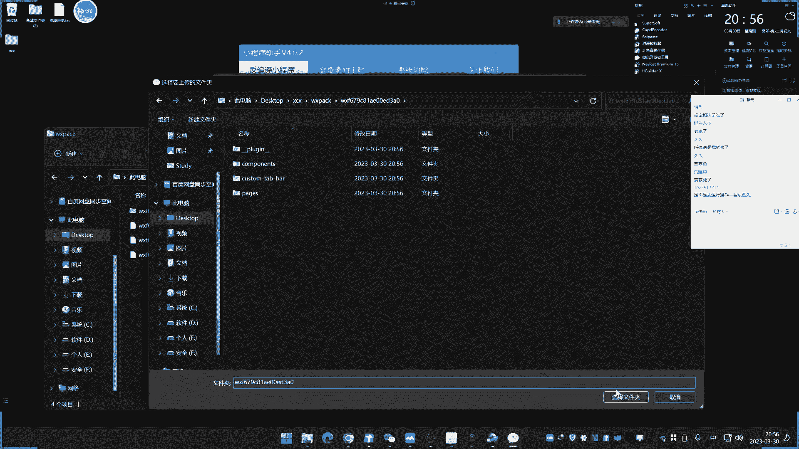

他这里报了个错误啊，这个错误是反编译工具造成的，没办法啊，这个地方是没办法解决的，我测了很多和原码的一些问题，他这个页面显示不出来，但是源码还是能看，就是这个调试和页面那个程序有不一样。

但是这里呢源码这里还有一些问题啊，你看一下啊，这是他一些配置文件，马上呢你看啊，刚才测的是一些微授权的一些东西操作页面，然后呢这里呢还有一些什么敏感信息，敏感信息就是一些配置的K啊，我们可以看一下。

在这里呢我们可以搜一下了，在他们中去搜一些关键字，比如说access k大家也看到啊，这里的配置了一个的access kid和SEKIT是啥东西啊。

是不是就是配置型文件里面的这个配置信息啊，但是这里呢他没有写，因为他没有写，我才敢给你讲，他如果写了，我是不敢给你看到的，就是我们说的一些常见OSS版的，这种里面一些配置，那如果说这里写了。

你通过这个方式不就得到敏感信息了吗，就从小程序里面得到的，小程序里面可能涉及到和一些人服务的通讯，那么得到这个K和这个账号，是不是就可以接管了呀，为什么这样说啊，是因为一些小程序它不是有这个什么。

不是上面可能会有一些什么图片呀，视频呀，对不对，你像一些这种的，像这种电影是吧，那他有很多这种电影在线播放，就在小程序里面可以播放导弹，你看我看的这个东西是吧，都是抖音上面是吧，我是教师。

我爱看反转剧情，对不对，他天天给房子东西啊，放这东西点开一看是吧，就第一集后面就要收费，而这个放很多视频，小时视频呀，这个图片。

那像这种东西，它就会放在我们这个什么O就是SOS自带的。

就是专门来存储的这个地方，前期我们讲过这个概念吧，大家应该有印象好，就放在这里，那放到这里。

放这种腾讯或者阿里云上面那个对象存储在哪，放在这里，如果说他要调用这个存储的话，他该怎么调用，他是要配置一些这种OS的这种K或者D啊，如果配置到这里，你把源码得到，不就得到了个造密码吗。

那像这种他提前已经写了，只是说这个小程序呢他没有用到你们的服务，但是在小程序模板里面写这个东西，那么如果像这种资源比较多的这种影视小程序，就极有可能就会配置这个信息，那么如果配置信息把原本带到里面。

搜到这个配置信息的账号密码，不就把他的一些所谓只要给他搂到手了吗，是不是，所以他我讲他就是给他提个醒啊，虽然说这里他没有啊，但是有我是不敢跟你讲的啊，我在我下去测试的这个小程序里面，我测到一个油。

但是不敢不敢给他讲，因为那是一个敏感单位，我是准备来到这个小城区，那个后面的那个安全测试，那个课程里面去的时候啊，讲了个漏洞方面的时候呢，再给他讲，今天不能想，很多啊，你不行，你下去测。

我反正测了十来个，就发现了一个，这概率还有点高，特别像这种隐私的词特别多，英式的啊，像那种上面有些这种文件资源的啊，它就会有一些配置在里面，对不对，然后呢大家可以随便这里找地方吃啊。

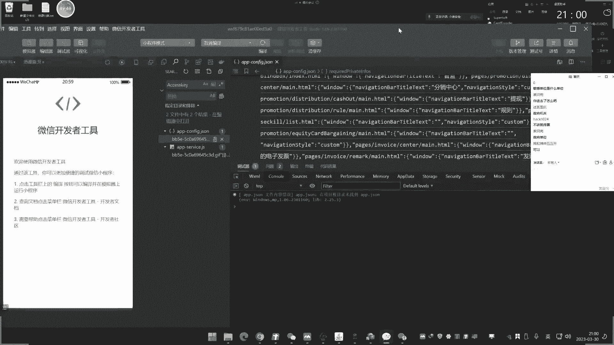

很多我都可以给他看一下啊，你比如说我再找一个这个嗯地方的哈，大的你就不要测了这种大小程序，那就不会撤，那就不会有安全问题啊，一般是那种小公司啊，或者说刚上线的呀，不是什么互联网公司啊。

他这方面不是很注重，如果说互联网高薪公司呢，那里面测的话，一般吃不了啥东西，一般都吃不了啥东西，我不敢吃啊，我怕车车车车车里面的车出出问题了啊，你刚刚才我演示那个目标是吧，我等下还要打码。

那个那个都不好不好说什么的东西，谁叫敏感信息啊，你打架下去之后呢，有人的话，如果说搞的话，还可以提交一下啊。

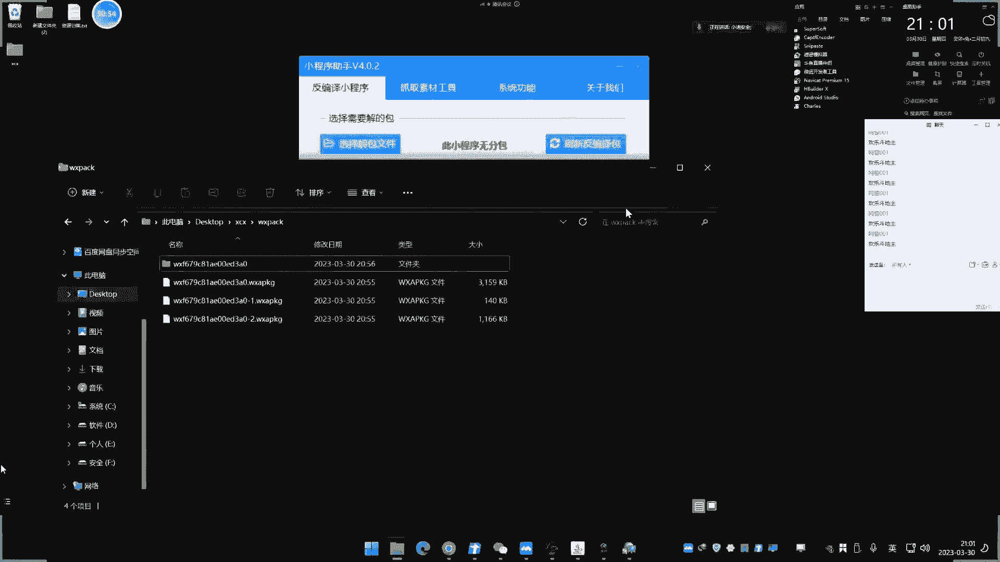

怕的是这个有影响啊，小程序那就这么多字典啊，没有什么字典了，基本上内容讲完了啊，今天内容就这么多。

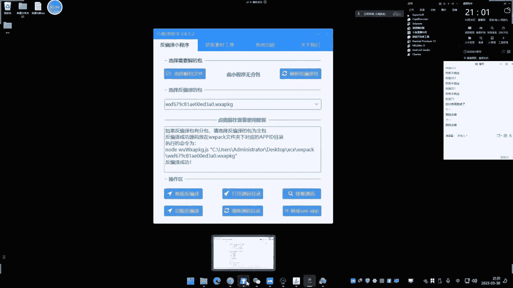

没有什么太多东西呃，一些这个麻烦的步骤我都给他整出了啊，像这个什么网上这种这种东西啊。

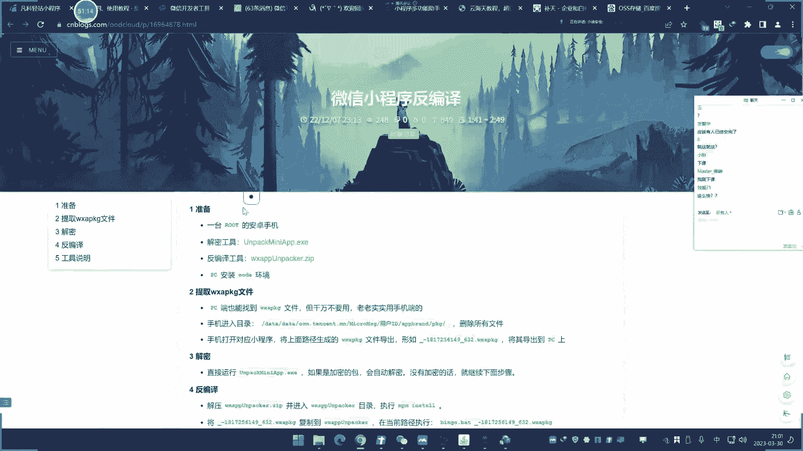

我都没有延迟，因为我觉得没有必要演示演示它，那就是浪费你时间，他这个都老了，版本老了，新版本的一天60块钱，你出不出嘛，我给他找的这个呢稍微便宜一点啊，15块钱一个月也不贵，大家用一下的时候。

那花点钱是吧，呃比较方便，不过说实话他这个也不是百分百。

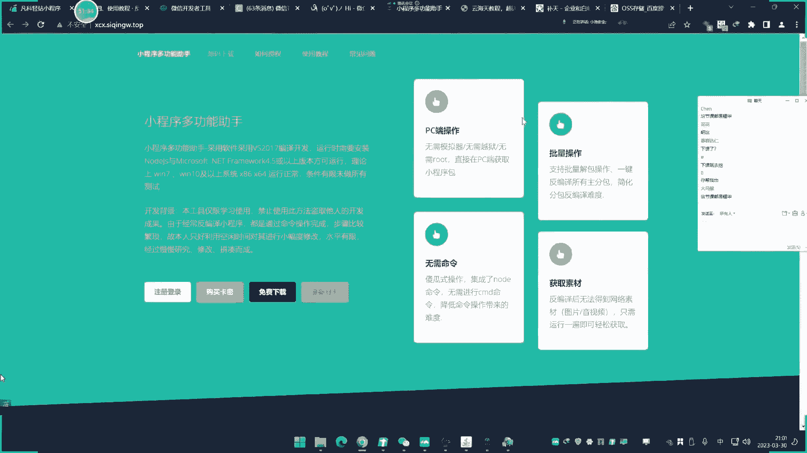

他提他提出来的这个源码呢也是一样，他也会有一些安全问题，也会有一些安全问题，什么安全问题呢，就是我刚才说的啊，有些源码呢他不能这个正常的调试，就是源码调的时候，源码反面之后呢，有一些源码没有得到。

所以有时候会用到这个修复源码，那除此之外，这个上面还可以进行抓包，那你看这里有个抓取数据好，我先把这个代理给吹出来啊，这个呢也是一个它的一个功能，但是功能呢说实话啊，只是做开发用的。

对我完全测试呢也是有一点小用吧，你看我打开一个程序的时候呢，点击这个呢抓取图片抓取，点了这个按钮之后呢，然后你去这个诶怎么卡了呀，好了，他就开始抓了，然后你看运行小程序的时候呢，他也会抓一些来路径。

对吧，润小子抓一下路径啊，换一个地方看下嗯，那他要抓一些路径，这应该是开了个代理的问题吧，我把代理关一下，抓到的都是两个一样的东西，换一个app，这个车架写字家看一下。

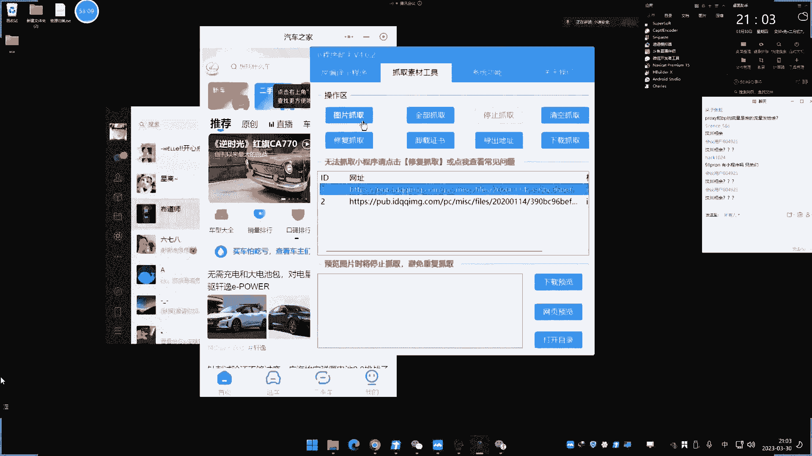

怎么抓不到啊，稍等一下啊，重新开一下。

哎呀寒川相亲是我自己之前用的，我今天坐车时，我爸庸庸了一下，我怎么说也是那个安利的。

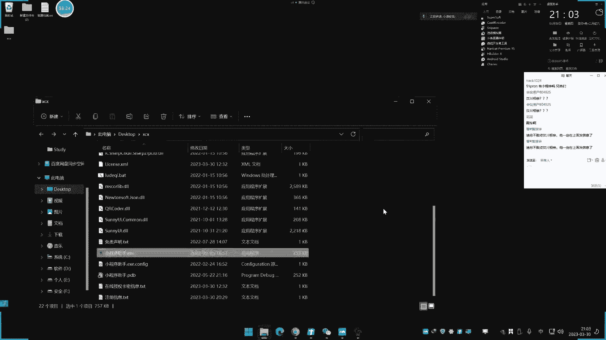

没有去延迟，老是找一些莫名其妙的东西，我到处找app，找小程序给他演示，你不知道老师的良苦用心，你还偏要说我搞这种事情是吧，我真是无语了，来点一下这个七字架怎么抓啊，抓到你看来一些常见的七色的是吧。

对不对，这个说实话没什么卵用啊，他主要就是说和那个抓包一样，就是编剧里有些这就像说app里面会有一些图片，那个图片就会涉及到一些网址，或者一些这种地址信息，它其实就是把这些东西呢我们用它这个功能呢。

对我们安全测试而言的话，主要就是说得到一些域名啊，这种资产信息除此之外也没啥了啊，还有其他东西呢我们就不讲了，因为上面也没有太多东西了，主要是这两个。

好大概就是这么多支点啊。

没有什么其他的，我们把这个思维导图给人一种，出了之后呢，我们就问下大家有什么问题啊。

今天的内容比较少啊，下节课就讲其他的了，要加微信公众号了。

这个是小程序啊。

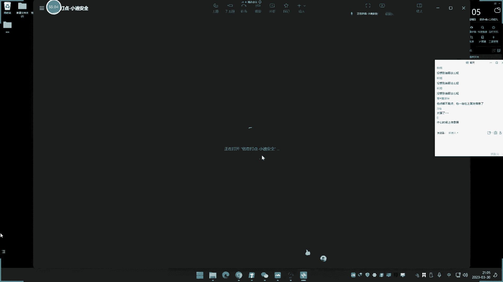

这个讲的是信息方面的，就说没有针对他的一些测试测试，让我们后续的单独篇章讲，不是说就完了，你看这个APP和小程序都还没有讲完，我们只讲了一次直播，都是关于他的亲戚上面抽筋，他什么安全措施，我没有讲。

君子之，讲一讲他这个概念啊，它上面还要针对这个源码来进行代码分析啊，源码接口进行访问来进行测试的，那就是深度测试啊，也是一样的道理啊，他先是要获取这个获取方式呢，也就是我们说的其他平台直接搜啊。

直接搜关键字啊。

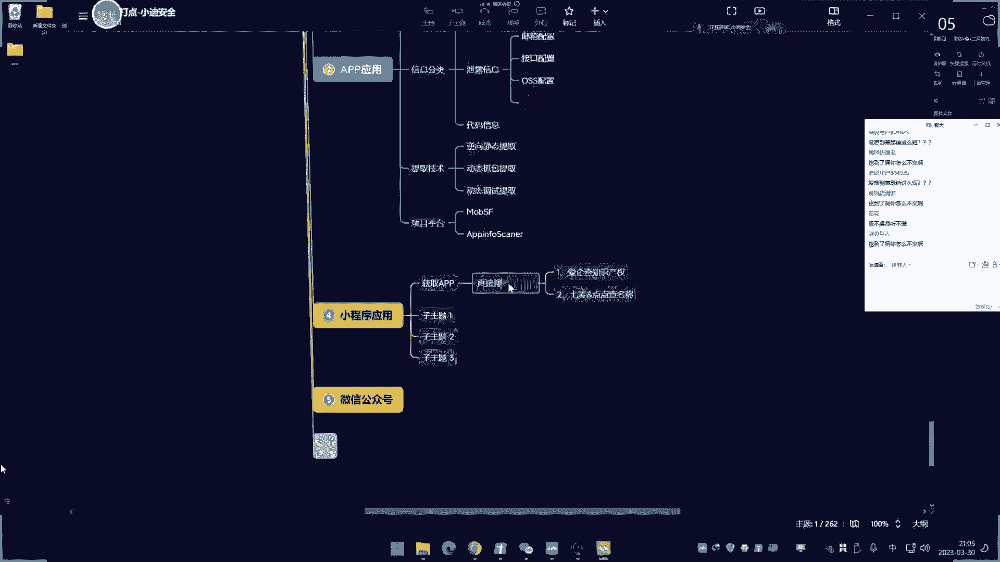

嗯这里面提到的四个平台嘛是吧，一般就是主要才四个啊，啊这个什么抖音啊。

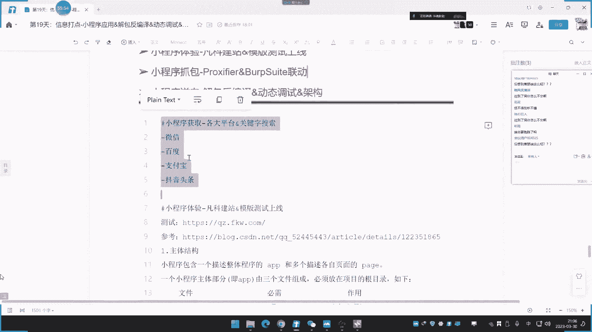

百度啊，这些支付都是一样的啊，都是一样的，只是说他们原理不一样，但是一般我们车的话主要是说微信多一点啊。

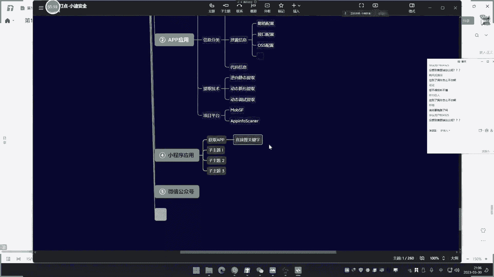

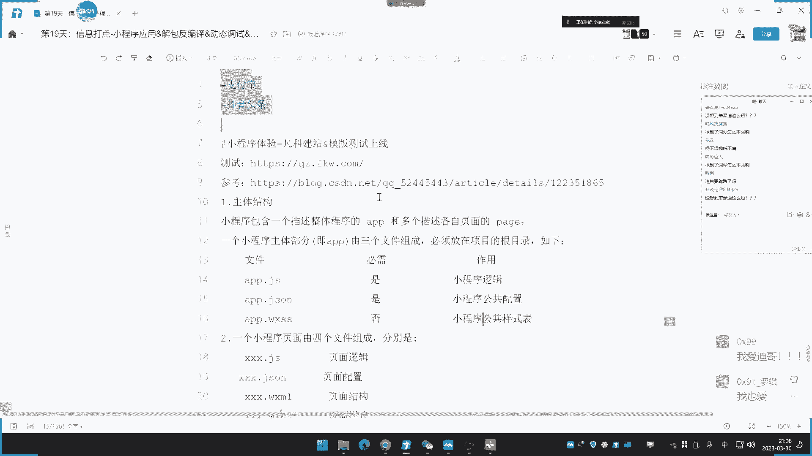

然后这里呢是获取获取之后呢，就是关于他的这个手机啊，怎么做提取技术，提取技术呢它也是分成四部，也是分成四步啊，静态提取源码中直接提取啊，立项之后的啊，还有这里呢就是我们抓包提取。

还有动态这个调试提取对吧，然后这个java提取这里呢有一两个步骤，就是先要这个解包，反编译，然后这里有个这个东西操作，就是说这里有个概念，就是说它的路径路径是在哪个路径，路径是我们说的这个微信的设置。

设置的文件管理，微信，设置文件管理啊，然后下面的这个什么A路径下的这个什么a pp，net这个路径下面，还有个小程序是在这个下面啊，net下面，然后呢以这个时间自己去筛选，对吧，其他的都没有了啊。

基本上就没啥东西了，然后主要是利用这个抓取之后呢，抓到就是配合的两个工具，java就是开一个是这个小程序助手，还有一个是这个我们说这个微信官方的叫什么，官方的开发工具。

这里还有一些前提就没有交代啊，就是在这个使用的时候呢，他需要安装环境的，要按照这个环境的啊，你看自己看一下这个小程序的啊，我这里都装好了。

你不要说这两个都搞不定啊，按就可以了啊，安就可以了。

直接下载安装就可以了，只要安装不报错就没问题就可以用了。

好这个就是我们说的这个今天这个资历啊，小程序的一个情况，那么下节课呢就是往下面推啊，还有点其他的一些平台的那个PC应用，我们就没有讲，因为PC应用呢PC你想讲不好啊，没那个能力，PC你想。

PC抓包还简单。

你想讲不了，PC应用的话啊。

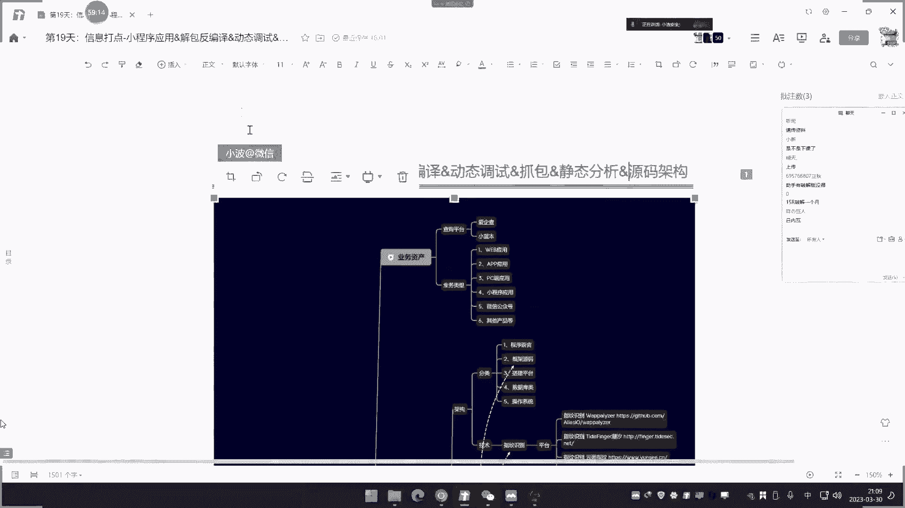

好思维导图给他种了啊，看打野没问题，有问题就问没问题。

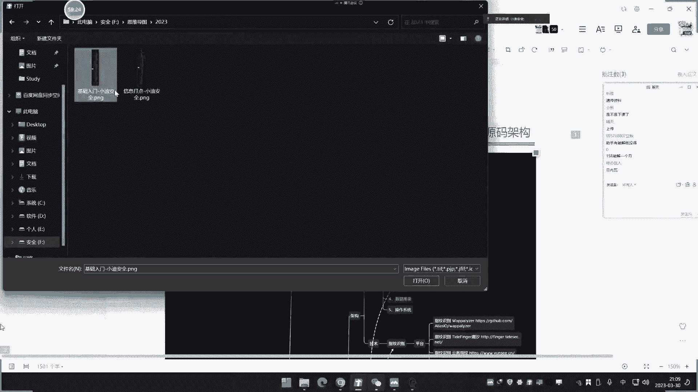

我们就下班，今天下个早班啊，账号你用不了，他不是账号，他是激活码，激活码是绑定电脑的，你用不了。

这哪能用你买的，我买一个大家都用，那别人不做生意了，让马自己修复一下啊，它里面有修复功能，我就说其实很简单。

这里呢还有一个补充的，就这个地方呢如果说那源码调试不了，你用这个解这个，虽然说麻烦他解出来源码还是比较完整的，那我把它放进来啊，就是这种呢是我们说的这种自动化工具，就是简单工具。

还有就是这个复杂操作的这个流程，这个操作流程啊，就这个这个呢就是免费的，但是呢比较复杂，需要这些条件，那条件不满足不好做的啊，你没有安卓手机，要准备模拟器，模拟器里面登录微信再出去搞，这里面烦得很啊。

然后呢你还要安装环境呢，这不是一下子的事情，这个按照操作来呀，这是免费版本的啊，但这个免费版本呢可能会有一些小bug，然后呢，但是他比较好的地方，就是说一般如果说能把这个源码解出来，源码那就不会有问题。

你像刚才我用的工具，那刚才解那个袁老师那个东西解出来了。

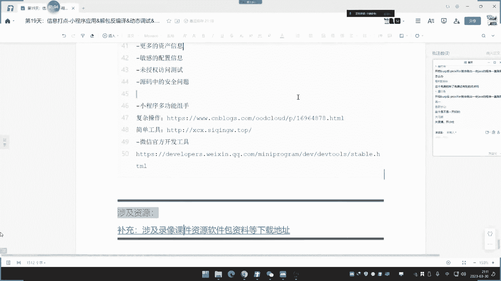

但是他确认什么东西，他这个开发者工具运行不起来，其实还是说不懂这个开发啊，不懂这个JS的开发，如果说懂得比较深入的话。

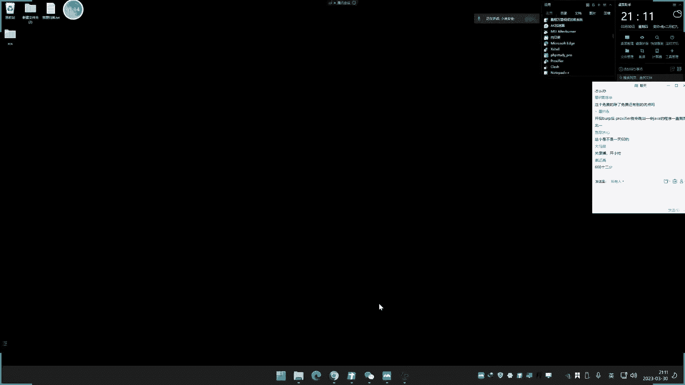

写过小程序的话，那都能解决，主要是他妈的我没有写过小程序。

懂是懂一点JS，但是改不了啊，他那个小程序价格不一样啊。

在小程序上面架构呢也非常重要的，这是我们说的，自己呢可以看一下它的一些大概的解释，那这这些架构呢就是让你去了解，看哪些重要文件分析，就是它源码里面重要的是什么，JSONJS这几个地方。

这几个是重要文件啊，然后这个目录结构，证明呢我也给他看了一篇文章。

这个文章呢，就这里是不是开发小程序的一个大概文章，它的原生架构都是从这里抄的，那他和常规的这个web网站，结果他TM它是这个w t m cs，它是WXS，它是JS，它是好吧，还有一些不一样的地方。

就是它的这个设计架构架构呢，对不对。

它上面有解释啊，这个文章给大家参考一下，我也写到这个路径上面去了，你看可以参考一下啊，就说你不懂它的结构的话，可以看一下这个文章，说白了啊，如果说你懂开发的话，很多东西都好解决，不懂开发的话。

你就只能一个个看那个分析，一个查了，所以说为什么说我们要把这个信息收集，讲完之后，要讲点开发，因为不懂不行啊，不懂的话就玩不了高端的，就只能搞一些简单的好，那今天就说这么多了。

录像先关了啊，大家看有没有问题啊，有问题就没问题就掰，什么开启BP shot，他就会一直跳java程序，你不细心吗，当然挑java程序，我咋不挑呢，难道是工具有问题吗，跳java程序是这样的情况。

给他说一下，在这个代理规则这里，你把这个默认的这里也搞了，知道吧，就是所有东西都挑，所以你java也有了，你就确定这个规则的更改，这个改了，不用看，你自己翻。

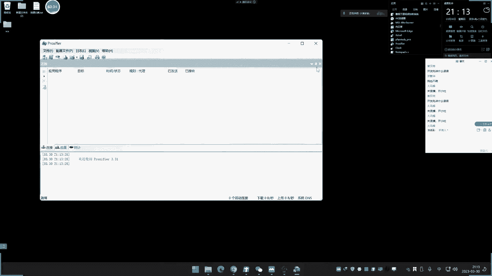

开发先讲批一批，再讲JS再讲java，先简后难啊，不讲沟孩子把，拍摄Python是讲安全开发，就讲一讲安全工具的一些脚本，简单开发，勾了讲不来，我我都不会玩go怎么讲啊。

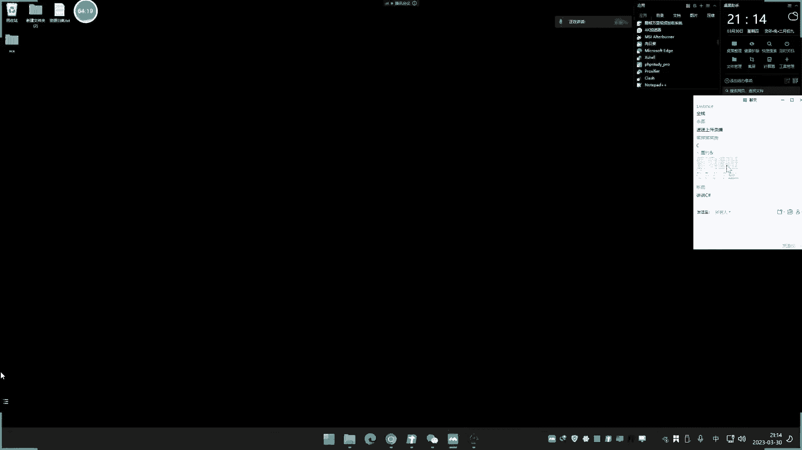

你看到没呢，自己都把图片发出来了，我说的怎么样，是不是我说的一样啊。

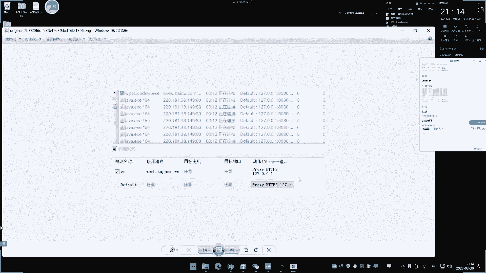

自己不细心的问题。

