# P2：第2天-Web架构&前后端分离站&Docker容器站&集成软件站&建站分配 - 逆风微笑的代码狗 - BV1Mx4y1q7Ny

今天呢是讲这个，诶跑哪去了，先讲这个第二天啊，讲这个web这一块。

那么知识点有哪些呢，我们来看一下啊，今天讲的是第二款啊，这个网站的一个架构又分为前后端的，还有这个软件搭建的和doc的搭建的，还有这种分配站，那我会具体讲一下，为什么要去学习这些知识点啊。

为什么要去学习这个知识点，那么我们看一下啊，上节课呢我们讲到了这个常规化的搭建，就是直接源码数据都在服务器上面，然后呢他这种常规化的话搭建的话，我们在做这个安全测试的时候呢，思路呢也基本上都差不多。

没什么太大区别，所以他的影响都没有，还有呢我们在上节课讲过的一个东西，叫粘合分离，它的原理，那就是这个源码和这个数据库呢，是不在同服务器，导，致这个数据库呢可能存储到另外的服务器上面。

也可能存储到我们一些人数据库产品，就说这两个呢有一些区别，一个是在服务器上面去安装数据库来存储，还有一个呢是直接使用，我们这个网上能够单独购买的产品，那这里呢就不需要你购买服务器了。

就你只需要购买这个产品，就可以用这个数据库，这是我们说的人数据库的产品，然后它的一个影响，那就是我们说的，由于这个数据库和源码呢它不在一起，所以数据是被单独存放的，那么我们需要连接之后呢。

才能连到数据库上面去，也就是说你可能获得了一定的权限，但是这个权限呢没有能够连接这个数据库的，一个操作的话，那么也就是说你获取这个权限呢，是不会影响到数据本身的，所以它就会有这些影响，能理解吧。

所以我们为什么要把它单独列出来，但你像前面这个就不一样了，这个数据库呢本身呢是在同服务器，那么一般这个在本地的话，你得到这个源码权限，那个后门呢，它是传到了这个源码的这个目录下面。

所以它连上去呢就是连到这个服务器，而服务器本身里面也有数据库，对吧啊，这个不一样，你后面的传到源码上面，但是源码那是一台服务器，数据库呢又在另外一台服务器，所以呢它是有少许的差异的。

这是我们说的这个常规和账户分离导致的区别，这是上节课的内容啊，然后这节课我们就讲以下四个方面，就是前后端的分离，什么叫前后端的分离呢，首先我们给他说一下啊，网站呢除了之前的就像这种常规化的查的话呢。

我们前期打点过，就像我们这种自己博客一样啊，我这里也是输出和这个这个网站都是一起的，看我自己这个博客一样的啊。

那我这是我的这个网站打开呢，博哥是这样子对吧，然后我的这个后台呢也是在这个夏天，对不对，好这个呢哎打错了，我的后台呢也是在这个地方，你看这是我的后台，对不对，这是常规的搭建。

由现在这个前后端分离是什么意思呢，我就给大家讲一下啊，这个分离和占股分离呢有区别，账户分离是源码和数据库不在一起，而这个前后端分离是什么呢，就是说其实就是很简单的道理，前端我们称之为是网站的前界面。

就是我们说我们看到的界面一般称之为前端，后端我们指的就是向后台管理这个地方，称之为后端，这是我们理解的这个前后端的意思，然后它的原理是什么呢，就是前面的这个网站的这个页面呢。

它使用的是一些JS框架开发的，什么意思，就是说它前面内容的页面啊，我们给大家看一下这种类似网站啊，你像这个就是典型的前端的一个页面，它的页面呢就像这种没有什么特殊照，看上去很美观。

这全部是用一些JS把它写出来，这是一种这种界面，然后它上面没有一些杂乱的东西，你看我自己的网站的话，我这里有很多芬兰。

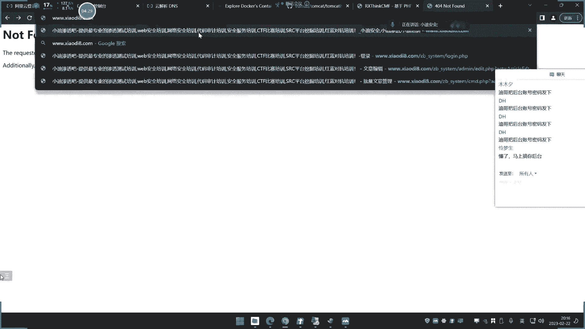

然后每个分栏上面呢都会有这样，我点进去看是吧，都会有这种地址链接。

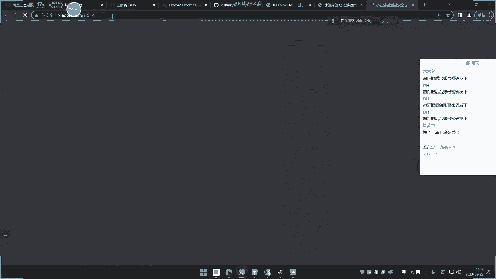

然后有这个箱东西啊，这个下面有很多分类是吧，我这里呢前面前端页面呢，是采用这个pp源开发的，而他这里呢就是采用JS这种框架开发的，那么这种开发会和我们常规的这种不是分离的。

项目源码搭建的网站有什么差异呢，它的原理呢就是前端的这个信息呢，通过接口传输数据，然后后台的是单独管理，你可以把它理解为前面的页面是一个网站，后台的页面呢又是一个网站。

然后它中间的是利用这个API来进行数据传输，就是说从后台里面呢去写数据，然后再传到前台，前台呢在选后面，对不对，他的这个设计理念就是前前面的页面，那是前面页面，后面的页面，那是后面的页面。

所以它的后台有可能就是我们说的不会在一起，那就像我们这种啊，我们看一下啊，他的后台在哪里呢，嗯那这个就是后台，他在你后，我怎么登录进去了啊，这是个演示站点，是个演示站点，我没有给他搭建。

我用的是这个他的演示站点，这个是他前台，就是它网站本身本身看的是这个东西，他的后台按照我们正常的思路来讲，我们是不是应该在这个后面去敲一下这种目录，来去访问它的后台，但是它的设计导致了它的后台呢。

在另外一个单独域名域名里面，你可以看到他有个站点管理指向这个网站，有时候通过后台上面的操作的影响到这个首页，就是说其实就是前台的只负责显示内容，没有半点东西，而且显示内容全部是用JS写的。

但是他数据传输的时候，在利用这个P结果的提交的给这个后台，也说通过后台呢设计才会影响前面的页面，虽然说我们常规网站也是这么设计的，但是他们两个都是在一个地方，这个就不一样，前后台互不影响啊。

都是独资格子，这个处理自己的事情，只是说你要有数据通讯的时候，从后台上去更新数据，然后来影响前台，那么这样做的话，我们为什么要去学习，了解这个前后端的一个分离的网站架构呢，很清楚，我们通过它的技术原理。

我们来分析一下，针对这种类型的架构的网站的话，如果作为我们这个安全测试者，他会和常规类的这个测试思路会有哪些区别，我们写了三点，大家可以看一下啊，第一点，由于这个前端页面是采用JS写的。

所以他大部分不会存在一些漏洞，为什么呢，JSHTM我们称之为叫前端语言，p h p java怎么delete这些我们称之为后端语言，为什么这样子去区别它，原因就是因为它的代码呢，简单来说。

就是说一个是变异性和可用性的问题啊，这个我不好怎么讲，但是我实在告诉你，利用这个JS写出来的框架，比较知名的框架有哪一些，我们可以举个例子能理解理解是吧，什么费油费U1啊是吧，这些都是比较致命的。

那像这种框架，它是很少有漏洞的，而且他就是纯纯的用那种蓝色的HTML，加上JS去开发的页面里面呢，一般传输数据全部采用API传输数据，不会有一些这种类似代码里面的有一些逻辑性。

所以它页面的一般大部分都是我们说的，比较光秃秃的页面，就是JS的网站，就像他这种，你看它下面呢没有一些其他分类的店收权，就是这个页面点指南呢就跳到下面，点产品呢就跳到这里点开发文档，那就是这里对吧。

然后一个赞也是它网上就是这种光秃秃的，很美观，很简洁，然后要数据传输时要从后台的去影响，所以它上面没有其他的，但是你看我们这种常规网站，它就会很多分类，分类里面的有区分很多东西是吧，然后呢一个页面。

一个页面他也和这个有截然大区别，所以这种呢它采用的语言，导致他这个安全问题呢就很少，这是语言特性决定的，这是第一点，那么第二点后台的页面呢又不在同域名，是啊，就像我刚才说的，他后台在这里。

那域名都不同呢，这是他的网站域名都变成这样子了，那么也就是说后台是在另外一个地方，这个另外一个地方，你可能会不知道你心情收集的刀就收拾到，收集不到就没有了，所以你在如果说找这个网站后台的时候。

按照常规思路，你就在后面像这样去扫描这种目录，肯定是扫不到的，因为他后台就不在这里，你扫这个东西没有任何用处，它上面啥都没有，所以说这就是一个区别域名不同，那么大家可能会问，那像这种东西。

我们怎么测试呢，既然前面都没有页面，我后台也找不到怎么办了，他一般能出漏洞的地方就是在这个它的后端，就是我们说的这个后台这个界面，这里才会在这里面可能会有一些安全问题，但是如果说你找不到他的话。

那就基本上很难去做，但是能换其他思路，所以说这种前后端的这个框架的这个网站呢，它的安全系数要比我们常规搭建的不一样，我们可以看一下它这个产品介绍，你就能知道啊，你我们用的是这个颜色产品，他说了。

他是基于VUEE这个什么技术研发，后端的，基于这个框架技术实现，那么它的这个实现方式呢，就是通过API接口来实现这个数据互联，就是互不影响，如果你要做任何事情的话，全部都是从这个VUI里面去做。

大大提高了开发效率，也同时提高了安全性，这也是可以说是我们常规的一个升级版，很多很多网站都会用到，你只要是发现这个网站页面打开之后，像我们这种类似的，像这种的页面，就几个页面，没有其他多余的。

那就是前后端分离，然后还有可能就是获取权限的这个情况，有可能不会影响后端，啥意思呢，就很简单啊，你比如说像这个网站，你即使上面那里上传了一个后门，但是不会影响后台，我不是影响这个后端的一个东西，为什么。

因为这个网站是他自己的，而这个是另外一个你活在他的权限，这个域名和他不相干的呀，对不对，所以他有可能啊，为什么都是有可能的，因为它有可能呢这个域名和他保持一致，是他一个子域。

比如说他的这个主域名是这个是吧，那么后台域名可能是艾米点，加上他指点CN情况也可能对不对，再看他自己怎么在打井的时候怎么去加购的啊，如果说是艾米那个子域名的话，那可能会影响对不对，因为是同一个域。

但是如果说不是一个域名的话，那可能就是说一个在东，一个在北，一个在北方服务器，一个在南方服务器，这都是有可能的，是要看它怎么设计的啊，所以那像这种前后端分离的这种架构网站呢。

是比我们常规的这个网站加工呢，是要安全很多的，因为从它的设计理念上面看，就已经提高了安全性，并且它设计上面呢就给我们做这个安全措施呢，提高了难度，因为我们不仅要知道它的前后端的地址。

而且还要针对他这个写出来的页面呢，还要进行安全测试，而且页面语言呢可能就是我们说的JS框架，所以一般针对这种前后端的一个渗透测试，安全测试，他的思路究竟是怎么样的，那就给大家说一下。

就是你能找到它的后端的例子，就去测后端，因为后端地址一般就是后端语言开发的，这是第一点，如果找不到的话，你可以尝试尝试性的对它这个框架，看有没有一些历史漏洞，如果说也没有的话。

那大部分的思路就只能从一些施工，或者说从其他的一些应用点上面去入手了，所以他呢就和我们这个常规类的网站，一些常规漏洞呢基本上就不存在了啊，好这个是我们说的这个前后端的一个概念啊，就给他介绍一下。

那么这里呢也给大家说一下，可能已婚了，我怎么知道是不是前后端的这个架构，我刚才说了一句话啊，你可以观察它的页面，那个简洁程度就能分析出来，而且呢我们后期在信息收集的时候呢，也会给大家讲到如何判定。

所以这个是属于信息收集的啊，前期我们技术部门是要搞清楚有这么个东西，后面再从这个东西上面去入手，好我们再来看一下啊，用软件是搭建的网站，什么叫软件是搭建的网站呢，我们称之为叫集成化环境，比较多的。

使用面比较广的就是保他，这个是很难很清晰能够看到的啊，像以前的p p study也是属于一种，我们可以对比一下，这种软件搭建的网站会有哪些区别，它的原理就是打包好的集成环境，它是为什么而生的呢，很简单。

我们昨天演示的时候，是不是在这个服务上面去安装IS，然后呢去搭建IS，然后搭建什么数据库，或者说要搞什么事情，都需要自己一个一个搭建，所以说这个工作呢是复杂而且重复的，就有人呢去设计出了软件。

早些年呢就是什么pp study这种，后面就变成了宝塔这种东西，那么它是干嘛的呢，就是你下这个软件，这个软件的运行安装好之后呢，在它的软件本身呢，自己可以用鼠标当个会点鼠标的猴子是吧。

点击下软件安装包环境就给你自动搭建好，就不需要你自己下什么软件安装包，一个一个配置，他全部帮你搞好，然后呢你就可以在上面搭建网站了，就这么简单，但是这种呢虽然边界的方便，我们这个这个搭建网站的成本。

或者搭建网的实践，但是呢由于它的这个方便性，给予我们做这个安全测试呢，也会带来一些不一样的东西，我们现在就来演示一下，如果采用这种包裹，它或者说p p study。

这种搭建会和我们昨天讲到的自己去安装环境，一点点的去安装。

搭建起来有什么不一样的区别，我们来看一下啊，这里呢我已经把这个宝塔安装好了啊，从购买服务器安装宝塔。

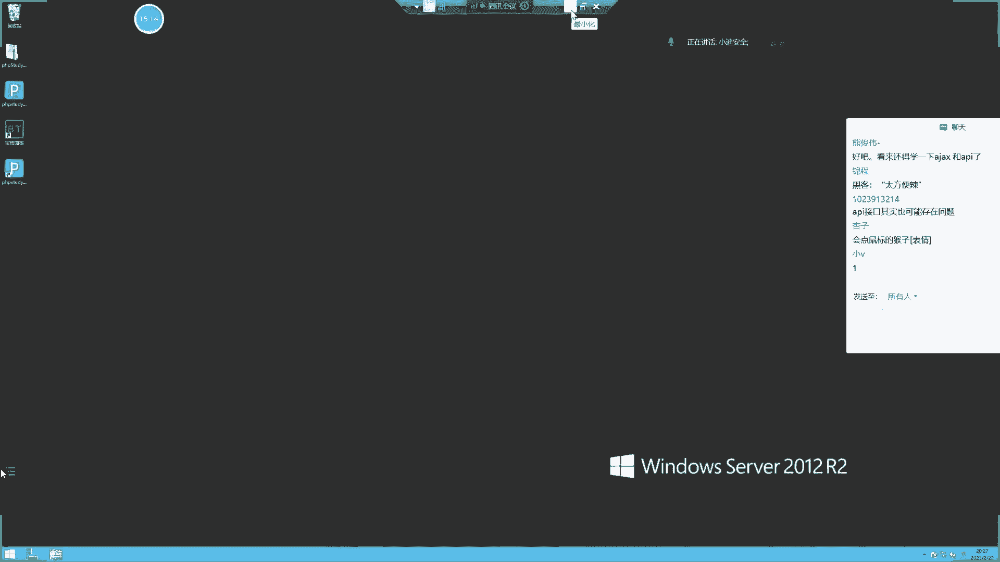

我看时间啊，我就给大家演示一下，从购买服务器和安装宝塔，到这个把网的配置上去，我把它给它做出来啊。

昨天我没有讲到XS安装，下面有人就不会了，那我只能尽量搞详细点。

我重新购买一台服务器，即时服务器，然后呢给大家去，购买购买好之后，那在上面去充领导有啊，我扫描一下啊，我登录一下，我哪里，好我给大家购买一台服务器啊，这里呢我先声明一下啊，由于我的域名没有备案。

所以我购买的服务器是这个非大陆地区，就像香港或者说其他国家的啊，我觉得选择安利付费计时的，不要买包里包月啊，然后随便选这个配置，为了这个关系，我选这个两核4G的，然后选取这个价格最低的啊。

这个然后呢选择地区香港好，然后这里呢我们选择系统版本，选择windows，然后呢选择一个2012或者2016都行，20124十G够了啊，那么是0。373毛钱一个小时好，下一步把简单的网络配置一下。

然后这里呢按使用流量收费，一毛一块钱1G够了，然后呢，我们再点下一步设置一下这个计算机密码，给我们服务器密码设置好之后，下一步好确定确定单购买啊，好那么现在呢已经购买完毕，我们稍等一下。

等他这边的一个运行起来，然后我们用远程连接这台服务器，我就把它关了啊，因为这台服务器是我这个备课的时候要准备的，我现在就给大家从购买服务器这里呢到那个啊，然后大家注意一下啊，这个像阿里云啊这种服务器呢。

你需要把这个安全组开一下的，就是他这个服务器上面上面有个安全组啊，有些人第一次用呢，要知道这个东西啊，安全只是尽量把它全部开掉，因为它这里有一些那个防火墙的一些配置，那安全我这里是开着呢。

把全部端口都放心，免得你一些端口呢他访问防不到，可能是这个原因啊，这里安全组注意把它开一下啊，这个给他锁一下就可以了，好现在让我们连接这台服务器，现在已经启动成功了，等他连一下，它启动呢需要一到3分钟。

所以他即使这里表示运行中，也有可能连不上，因为他还在装系统，可能稍等一下，我们，然后大家刚才有人说是不强制不开的，强制不开的，一般是那种邮件服务，就是我们上期讲过那个钓鱼邮件那个端口，二五端口。

它是默认是把它关掉的，你需要在工单中，就是在这个客服里面去联系他，或者说你自己申请证明，他才给你开，他就是为了防止那个攻击去搞恶意，那些钓鱼批量哎，怎么还不能连上啊。

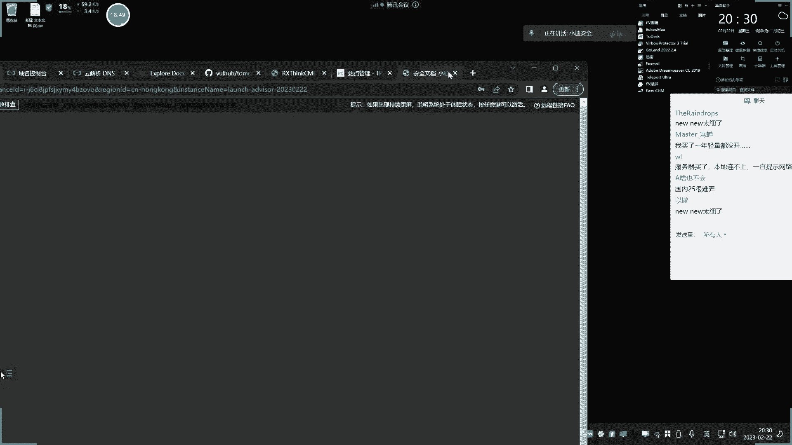

好可以连上了，好连上之后呢就上传自己的这个软件，我们现在用宝塔给大家看一下啊。

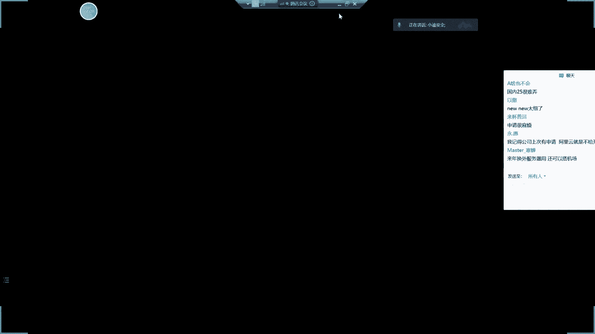

先打个宝箱，然后呢再用那个pp3D，两个都给晕下。

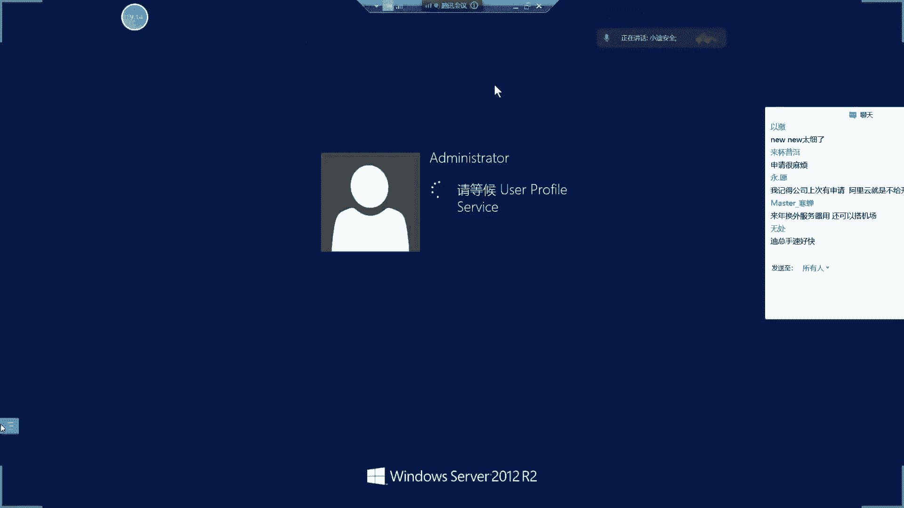

好，我这里呢提前把这个宝塔，这个东西的存放下载一份。

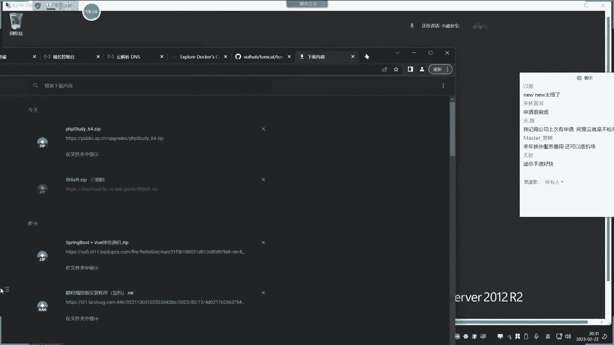

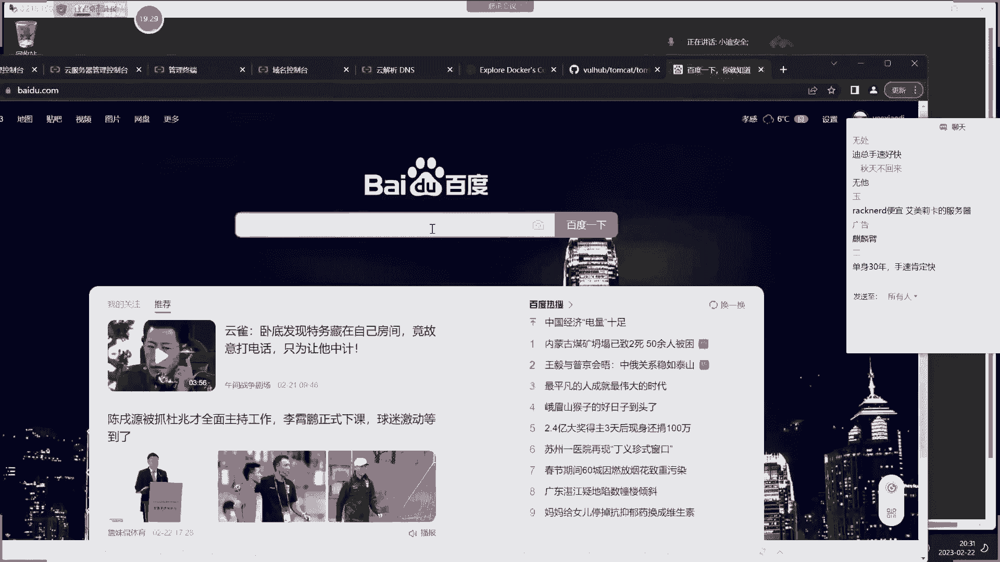

然后下载个windows版本的就可以啊，windows面板下载。

嗯好把这个宝塔面板的复制到这个位上面去。

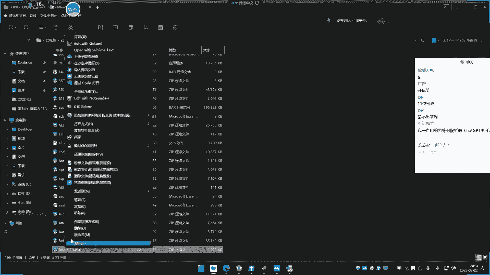

他这个LINUX平板一般用宝塔搭建的，最多的就是这个pp的网站啊，他有些java Python网站也能拿进，不过用的比较少，好吧，解压一下，全部提取出来，然后呢把这个环境给它安装下来，直接运行。

直接点安装，一键安装，等着就可以了，这边有个什么提示C盘啊，不管他就让他C盘不影响，因为我只搞了一个排，把这个拓展名牌开一下好，我们就等一下它安装一下，安装好之后呢。

我们就在它上面的把环境一装装好之后呢，把域名一配置给他一解析，就能直接直接用了啊，直接打开网站，然后呢我们把搭建好之后呢，我们主要关注的就是说他这种打井呢，虽然说省时省力，对不对。

它和我们和我们的常规搭建，会有什么样的不一样的区别呢，我们等一下再做实验的时候来给大家讲解哈，它的最大的区别就是有什么区别呢，其实就是网站权限的区别。

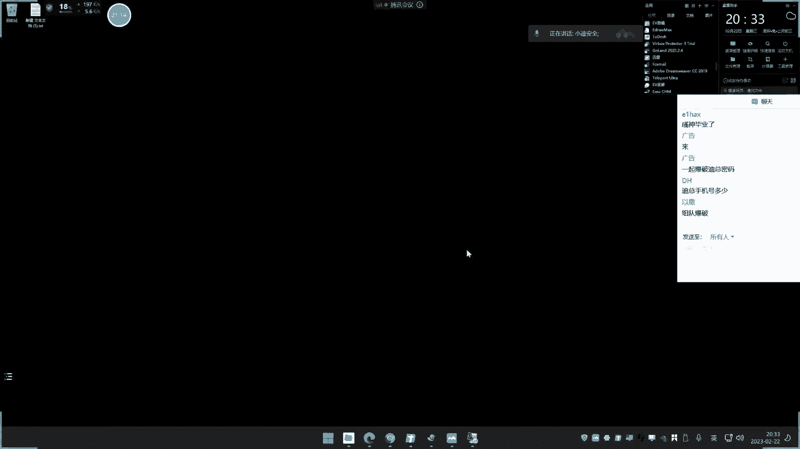

好我们等待下啊，然后呢我在我域名这边先把域名呢给他。

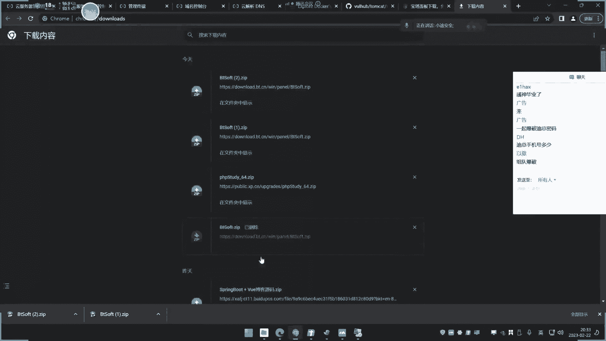

准备好，把它解析配置一下啊，来等下再配置，现在呢我先让它默认。

好已经安装好之后，他这边呢就会有一个地址给你。

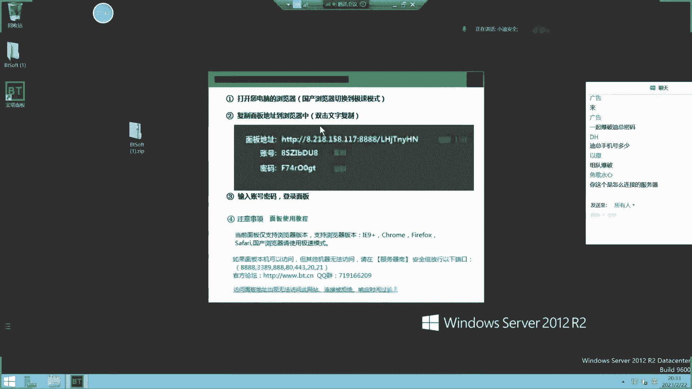

这个地址就是你的访问地址和他的控制端地址，我这边呢给大家打开，给大家看一下诶什么情况。

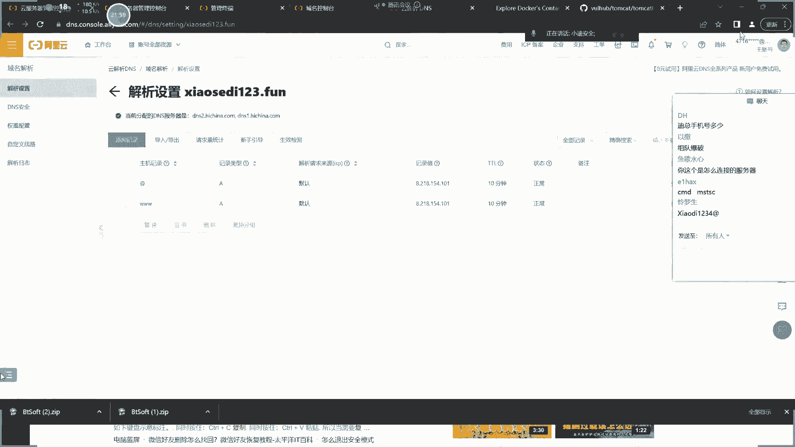

胡子怎么胡子这个东西了不出来。

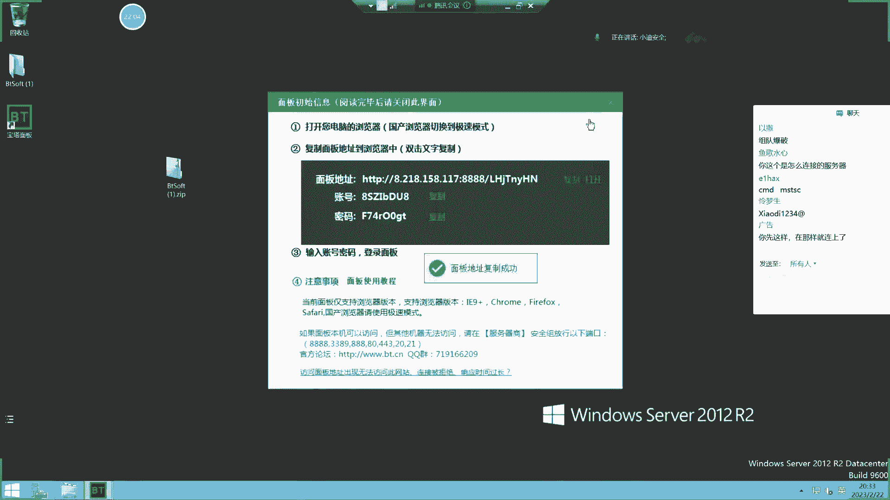

好这就是在控制面板的地址。

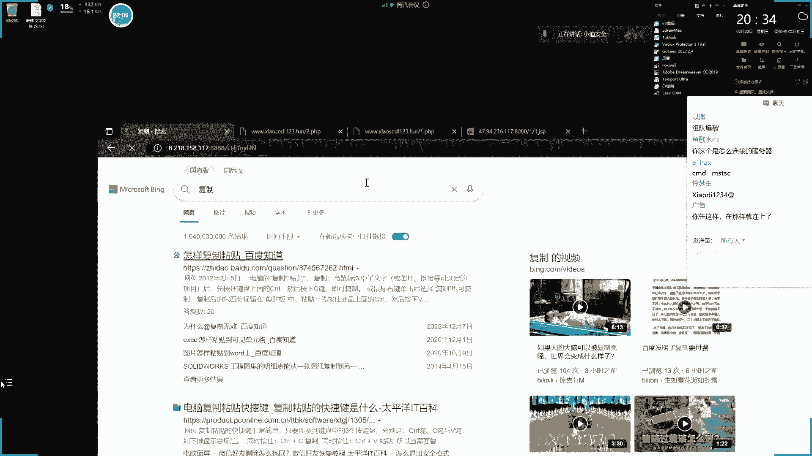

然后呢输入它这个默认招密码。

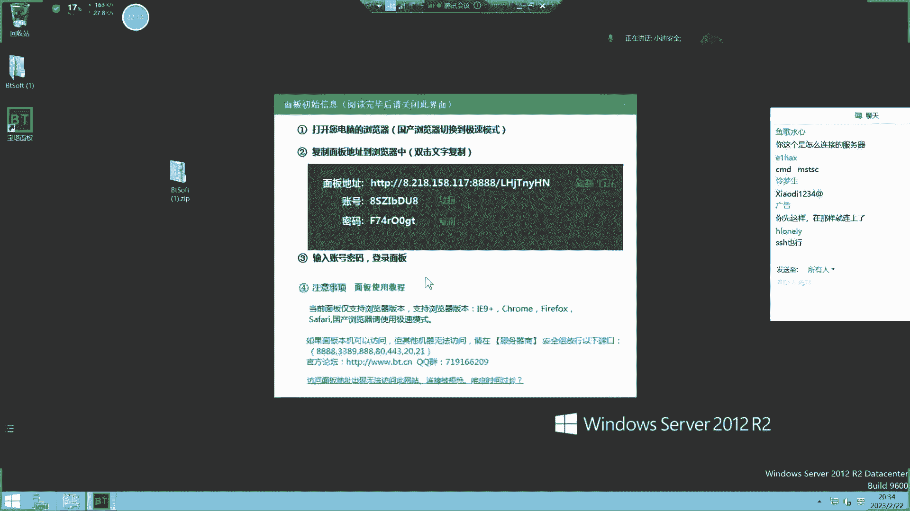

好登录进去之后呢，点击这个统一下，他这里呢需要注册一个账号密码啊，这个你自己去保他上官网去注册，我就不说了，就是其实就是你使用者的身份啊，说白了就是这个东西，因为我那个博客也是爆炸搭建的答案之后呢。

再来个这个软件商店啊，这里的把几个黄金装就可以了，那这里有个叫一键部署，验部署呢，就是他在里面准备好了很多的一些源码，你自己那你按一下啊，做个会剪鼠标的猴子啊，就可以把这网站给它弄起来。

然后呢在弄起来之前呢，你需要把这个他这个环境装一下，就是它上面我说的你是用这个什么pp啊，什么哪个中间件啊，自己呢就在上面的勾选一下，安装一下来，我们自己呢把运行环境装一下啊，那我装个阿帕奇。

装个MYSQL，装个PPT在上面可以勾选了，我就把它这个勾选一下啊。

好给大家演示一下，那大部分阿帕奇点击安装确定安装好，他就开始安了，然后呢我们再把这个MYSQL选中安装，安装好他也开始安，那我们再把这个后面的pp的安装个P的是吧，安装一个，好那么就呢他就开始安装了哈。

三个就开始同时进行，就我们不需要自己再去做什么事情，这三个是必备的啊，一个中间件，一个数据库，还有就是我们那个语言的知识，其他的操作系统呢是我本身的，还有其他的你可以自行的去选择，这是它的安装环境很多。

你根据自己需要选择性的安装，安装好之后呢。

这边有个叫这个一键部署，然后这里是不是有很多源码，你看来你想用哪个源码，这个源码就是我们说的开源程序，你想用哪个呢，你就点哪个，比如说我们这里的z blog啊，连颜色也是z blog，那个是SP程序。

这个pp的博客程序，论坛博客程序都有是吧，很多啊，我们现在可以随便点一个验部署，他说缺少版本哦，可能刚才那个安装的还没安装完成了，三个还没安装完成。

因为那个环境还没安装好，三个啊，在这里稍等一下啊，我看下三个环节诶，怎么点都点不出来了，刷新一下，这里好安装一个了啊，这里还有两个浏览器，点不出来，有点尴尬，还在装MYSQL和pp。

这因为这两个打印完之后才开始，好掉最后一个了pp了，好安娜小木杆了，然后一键部署，我们部署一个了，点击这个部署了，点部署是不可以啦，你看然后呢域名是吧，我绑定域名到底什么玉米啊。

就是这个3W小折叠123点方，对不对，再加个这个不带不带这个不带这个东西的是吧，不带三多点的，然后这里是默认就可以啊，一般默认的版本你自己安装的版本把它勾选，然后点这个提交。

然后这里的绑定域名是指向的IP地址是吧。

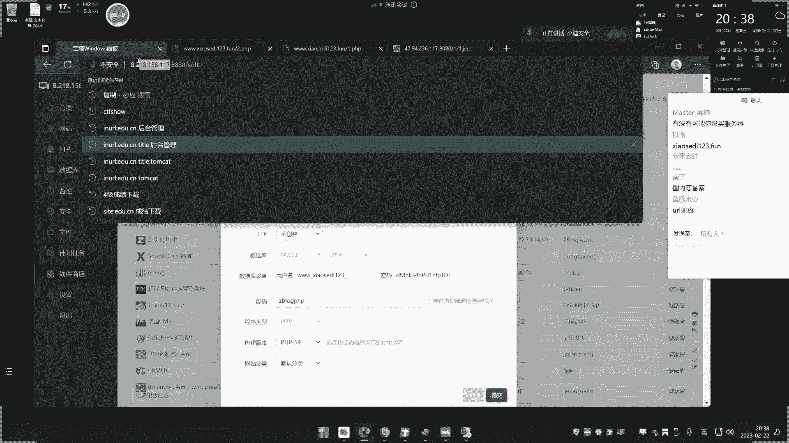

IP地1G跑到这边来，把这个解析记录把它一改是吧，先把原来的删掉还删掉，然后再添加记录域名，三岛链指向哪个地下是指向这个IP地址，是不是确定，OK那么域名解析的也配置好了，这边那就点确定你这个域名吧。

确定放在那就绑定这个域名。

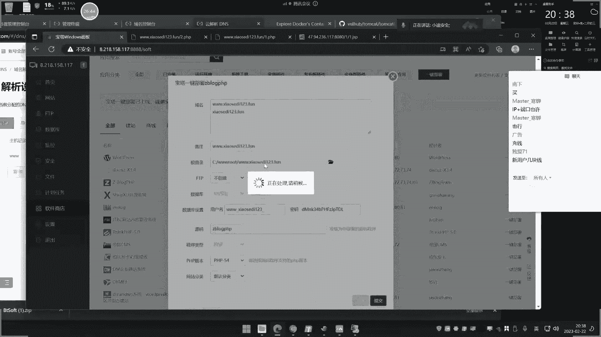

那么现在呢就可以尝试去访问一下这个域名，好现在呢还是站点创建成功，还没有指向啊，我们稍等一下，等它一旦这个指向对了就对了，好这里呢我们看一下这边的一个，诶孔装这里还在下载文件啊，还在配置这个源码。

它这里有点慢，好，正在下载一个源码啊，因为源码一旦植入进去之后，这个页面就会发生更改，正在安装，好已经成功，你看我们可以直接打开看一下了，这他给我自动还设计了账号密码，打开打开是不是就打印成功了呀。

后台密码都帮你设置好了以，后面再去更改，那么搭建好之后呢，我们就来说它的具体区别啊，这是搭建的这个这个什么啊，那个然后呢他的网站源码呢，你看网站就是这里他帮你标记好了啊，这是一个网站。

然后这是你网站的目录是吧，都帮你写好了，然后你可以点击开启和关闭，我们点击网站目录，这个网站目录下面，就是刚才它自动帮我下载好的源码来，对不对，比如说我们现在呢模拟一个攻击者，攻击者拿到权限上传了后门。

然后让我们看一下啊，后门拿到这个宝塔型的网站。

看有什么区别没有好，现在呢就来演示，这个其实来到就是说我已经打印好了，我就来看一下这种网站用宝塔来写的。

和我们说的那个常规搭建的东西，会有什么样的这个差异啊，好我们这里叫模拟啊。

这个上传后面，然后用后面去通过web sh具去连接它。

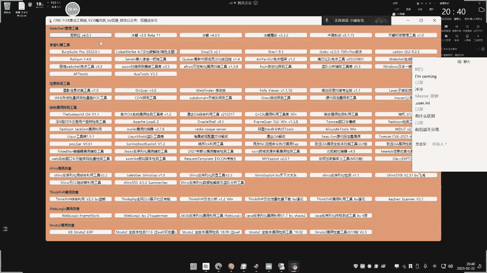

并且大家来关注一下，看它有什么样的这个不一样的地方哈。

好我现在来生成一个后门出来，先生成个pp的啊，以为他是pp网站生成pp生成。

一点DT选择好，那么生成出来之后呢，我们就模拟啊。

把这个后面的上传上去。

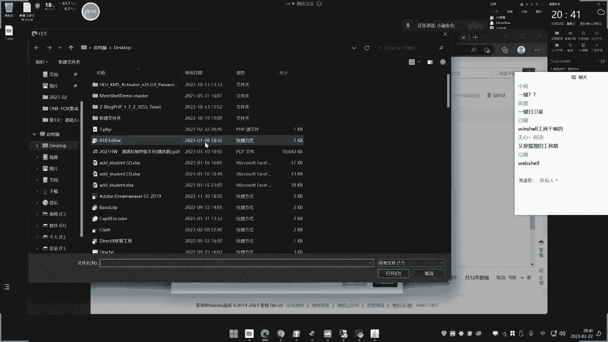

好这里呢我们就可以访问一下这个疑点。

pp就是我们的后面离子，然后呢我们模拟一下，作为攻击者去控制这个网站的时候。

看一下它有什么样的差异，选择PPP模式参数连接好，OK点击添加好，来连接一下，好连接成功之后呢。

我们这里有个命令执行命令执行，那就是利用这个后面去执行当前计算机命令，我们执行一个或命令进行之后呢，大家也看到这个画屏啊，这是我java的这个花屏问题，显卡这个框卡，不好意思啊。

啊他提示一个这个不能执行执行命令的，报了个错误，他就在已知av什么ab，大概意思就是说这些东西被禁用了，啥意思啊，如果说是常规的搭建的网站的话，你连上去之后呢，它是可以执行命令的。

但是为什么这个宝塔搭建呢，执行上去他连执行不了命令的。

而且你会发现还有一个原理，我们看目录的时候，你看啊，我点开这个目录，他能看到，我点击商机目录的时候，提示路基没有发现或low Mission，就是没有权限的意思，路基没有发现或没有权限，我读不出来。

但是我能看得懂哎看不到C盘呢根看不到了啊，是吧，你看它是自动的帮你去做了一些全新的设置啊，而且自动帮你去做了这个，什么这个命令的限制啊，所以说虽然说我们昨天那个常规类的。

没有给他去演示这个命令执行和文件管理，这个页面啊，但是我可以直接告诉你，结果如果是常规类的话，如果他没有哦，就是他自己搭建出来，他没有在做设置的话，一般是可以进行命令执行和进行文件管，你能够看到的。

这是常规打印的啊，我的意思就是说没有额外的去做设置的话，默认的话一般是可以进行这个命令，执行和文件的一些其他目录的读取的，这是常规搭建的模式，常规搭建模式就是我说的，我们昨天演示的自己安装软件。

一个个去安装，就这种叫常规。

而如果说你用宝塔搭建出来的，大家看到这个结果了。

命令不能执行文件管理，那也只能看到当前网站的目录，其他目录他看不到，所以他其实就是做了限制，这个限制就是这个保胎软件发展，资金慢慢强化的，就是其实宝塔在开始设计出来这个软件的时候，他是没有这些东西的。

它既可以执行命令，而且命令执行之后呢还有很大的不一样。

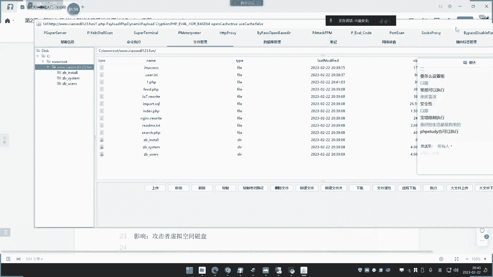

那么它的前代产品就类似于p p study，我们看一下p h p study的这个这个产品。

李逵你可以看到啊。

用pp打，你去打井出来的正常网站，那我们下一个。

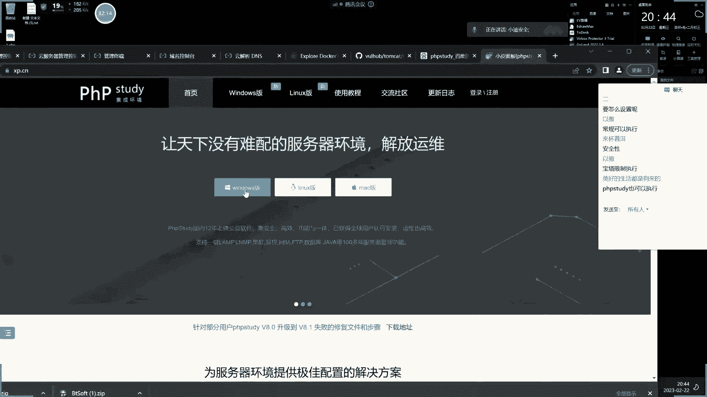

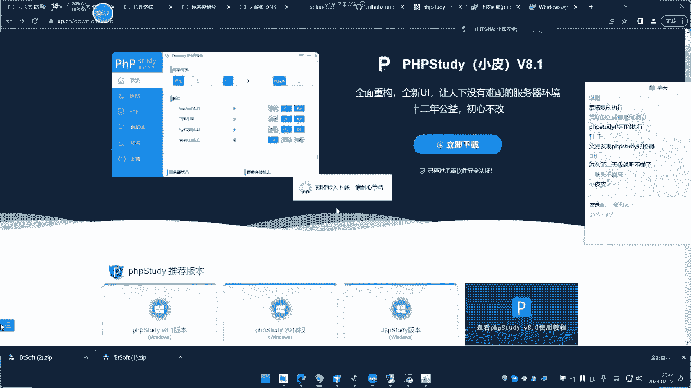

好我们用pp打底打井出来的网站啊。

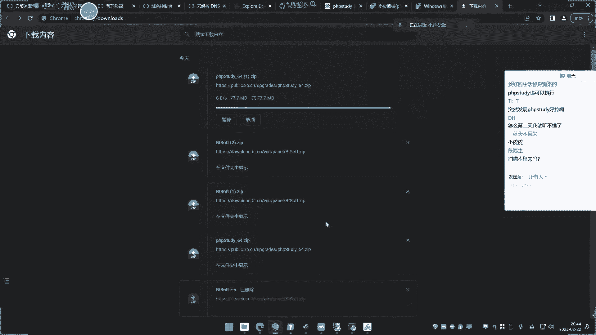

在他这边下吧。

我那个下太慢了，扶着过去，把它下载到左边，这是用新版的PP3D啊，老版的更不用说了，其实我应该是要把昨天那种i is打减的啊，我等一下，那就给大家演示一下，用i is打剪的三者啊。

就说一个是我用自己安装的这个软件，一点点自己安装中间件去搭建的，用这种软件集成的搭建的会有什么区别，软件基层里面的优惠有区别。

就是不同软件也会有不一样的效果，我这里也把i is装下。

昨天刚好说没有给他演示装S，这里呢我就给他装一下，添加角色功能，选中这个来这里有个叫web服务嘛对吧，选中它，点击下一步，勾选一个点net，避免有些其他的东西没有勾选下一步下一步。

然后这里呢有一些这个知识面应用程序开发，这里呢我们可以把支持SBSB点net把它勾选，避免用到其他网站的时候，他不支持好，下一步安装我都试一下啊，因为昨天没有演示，这个，大家无法看出。

他和这个自己安装的这种中间件呢。

会有什么差异，好这个呢我们把PPT study呢也给大家启动起来，叫一个测试啊。

我们记住了每一个测试，然后让我们做一个记录。

宝塔搭建的一个问题啊，首先从文件管理锁定了目录对吧，然后呢从这个命令执行这里啊，就是我们说的这个命令执行的结果啊，无法执行，这是宝塔搭建后的这个权限，就是我们做的这个拿到这个权限后的一个差异。

在宝塔的一个情况啊，做一个这个记录爆他的，然后呢我们现在再来看一下p p study，好看p p study，好，把网站那给他录下来。

好在pp study运营之前呢，我先把它安装好。

安装好的同时呢，我先把我的宝塔这边呢给它暂停掉，为什么要暂停呢，因为它这里呢有冲突，什么冲突啊，就是端口冲突是吧，能理解吧，端口这些东西呢还会冲突，因为两个东西都会用到同样的端口，所以我先把它暂停掉。

避免他两个的同时就是都有占用八零端口，或者说都在用这个阿帕奇或砸地啊，它会有这些问题，那我先把它暂停暂停了，然后呢包括他这里还有一些服务，像什么，刚才启动这个呢，这里可以看到啊，这里有几个服务的啊。

这个服务在西湖这边应该有，那这里呢看着呢买车还是开启状态。

但是我这里可以用他这个MYSQL就无所谓的啊，只要是个网站中间件，阿帕奇是这个PPP3地址就可以好。

我们看一下啊，我把这个，刮一下好。

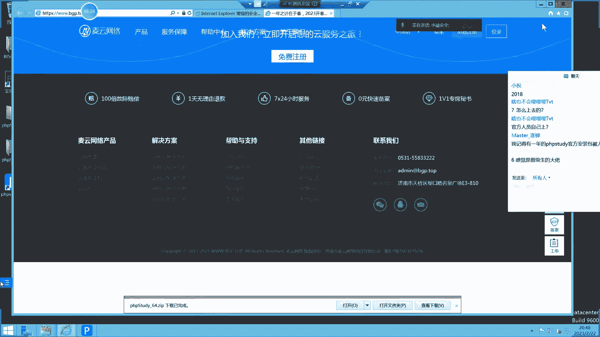

打开这个阿帕奇，你看它的端口被占用是吧，我把强制关闭，把那个强制关闭它这个阿帕奇系统下，那个是宝塔的阿帕奇啊，占用了他服务没暂停，再把那个强制关闭，关闭之后呢，用这个阿帕奇，那就是它的开了。

那MYSQL我就不关了，还是用它宝塔的数据库，因为这个数据库不影响啊，主要是这个中间影响好，我这里创建一个网站看的网站，那就是我刚才域名嘛，3W点小小几点要三点好是吧，DR域名的随便写啊，这个无所谓。

然后呢这里呢选择这个版本，然后是这个有啊网站目录目录，那我就直接用我那个保他的目录吧，把他那个网站目录放在这里，好选择之后点击确定好，已经成功创建。

那么这个时候呢我们来关注一下这边的情况。

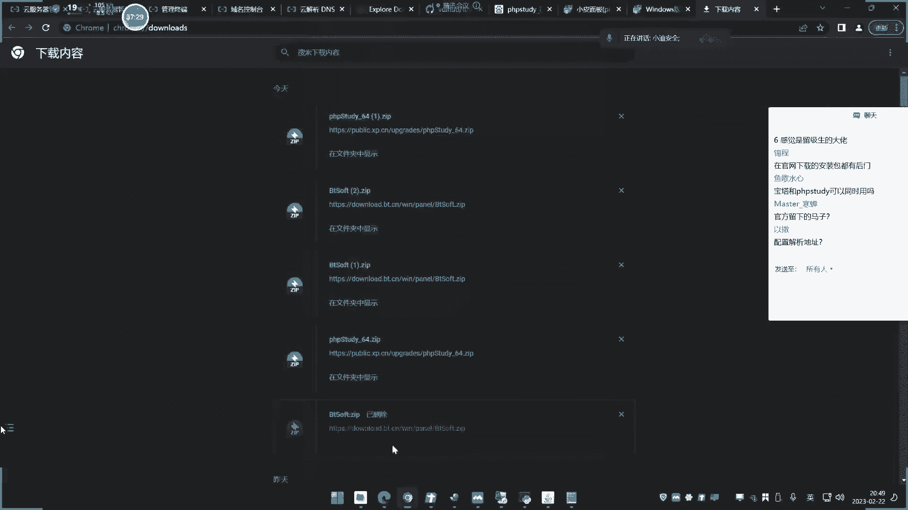

来访问一下，看能不能正常访问了，啊他还是光的是吧，还能解析，我这边已经关了，大家可以看到保持这边关了，说明现在这个网站的启动状态呢，就是p p study支撑的。

然后刚好呢我在pp study下面呢放了一个后门，现在呢我去用这个后面重新连接，再看一下它的一个结果，好我们看一下观察一下啊，现在他的网站目录情况诶。

这是不是缓存问题啊，大家看到没，现在执行结果，大家有没有关注到我呢，结果出来了，看到没，我能执行命令了。

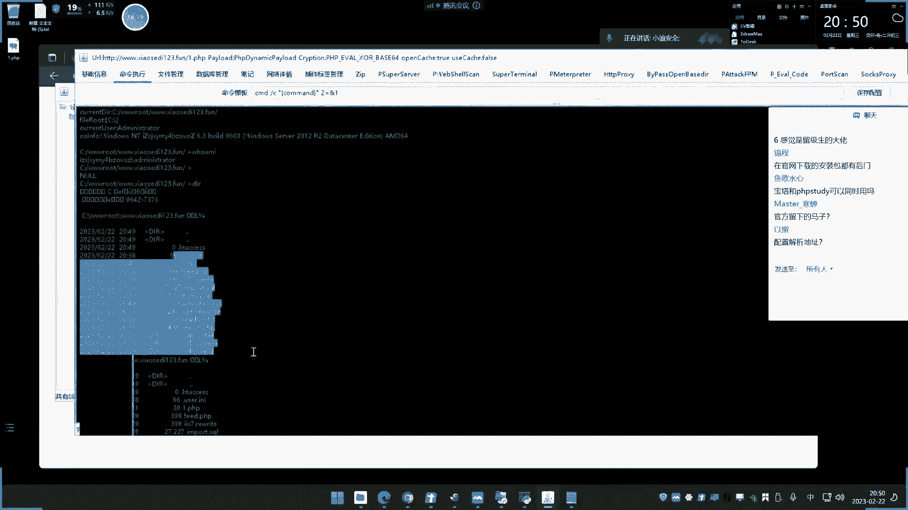

什么情况，这我不用看文件目录了。

你民警都能执行文件目录一般就可以了，所以pp是打井，打井的命令能够执行，而且它的命令执行返回的who who i是什么东西呢，是我们获取当前权限的命令，就获取当前用户权限指向的是什么。

Admistreat，为什么呀。

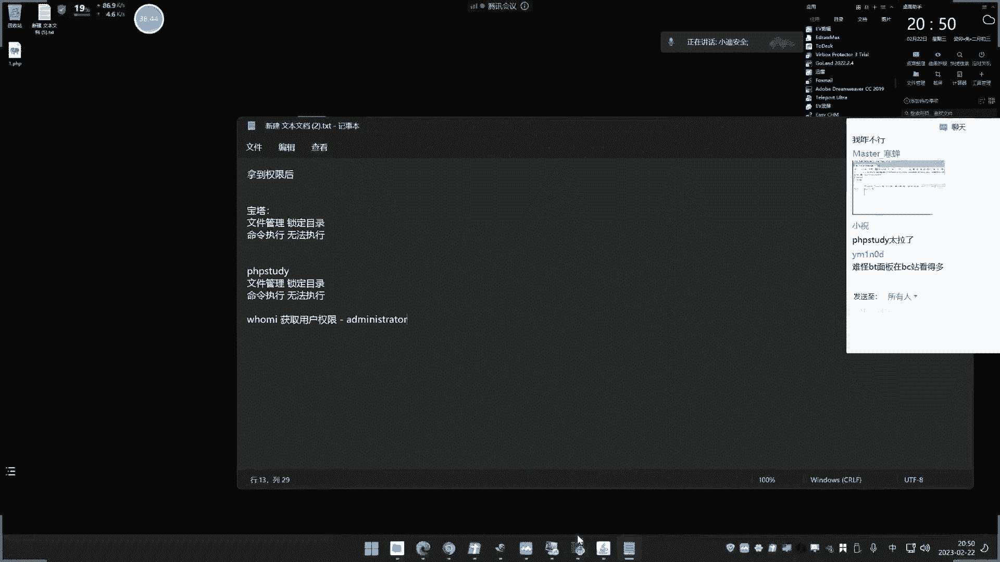

那刚才看到up重新再进入给大家看一下，Do i mean，结果返回的是什么主机名，加上ADMITCH。

看你们吹它好，这个是p p study，然后我们用知己啊，知己打进这个IS来构建网站的话。

是一个什么情况呢，现在呢我们看一下i is的啊。

IS应该安装好了，安装好了，已经我们直接打开S这里来管理诶，打错了，是2S的，哎哎妈的，这个是怎么调不出来呀，那出来了啊，我看这个控制端这里啊，我们这边啊，这是他的默认网站。

我们可以直接看一下他现在网站啊，它默认这应该是关闭状态，因为那个端口被占用了，你看八零端口，我把端口改一下啊，可以改一下，也可以把它那个RPAP暂停，也可以把它改一下吧，因为你启动不起来呢。

其中就提示占用这个端口号，改一下，8080再启动，你看现在有什么问下你的8080访问呃，在这里呢我们就生成一个这个后门上去。

因为他是SP的，所以我就生成一个SP的啊，他不是P默认没有设那个东西，但这个和脚本没关系啊，你不要说是一个pp啊，一个SP是不是这两个原因造成的差异啊。

这个不是的，正好把这个EEDSB的后面给他。

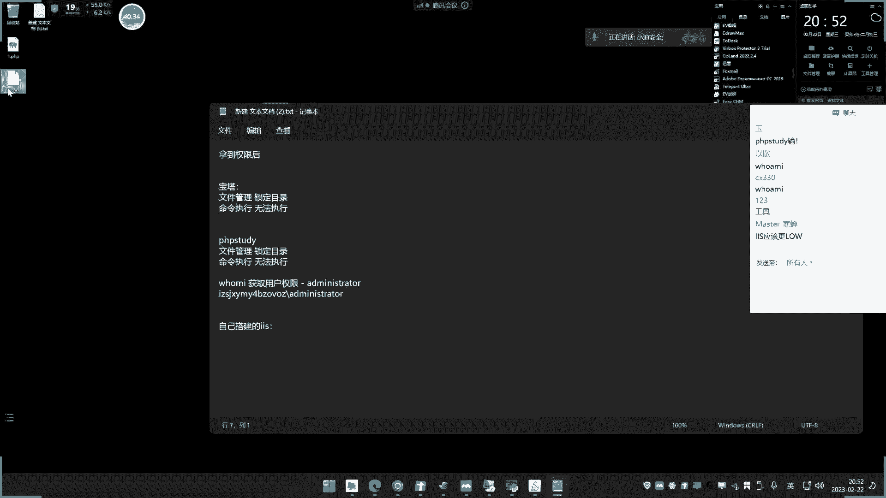

传到这个他的网站目录下面去，浏览一下插进来啊，然后呢这里呢由于他没有绑定域名啊，所以他就是用IP地址访问的，但这个应该是不重要的，这个是不重要的，好，我来去尝试着去用这个IP地址去访问这个网站。

他没有绑定域名啊，所以我不能用域名访问，我只能用IP访问这个S呢我没有做域名解析。

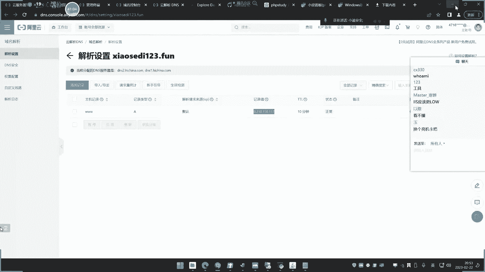

直接用预访问啊，这个不重要，因为这个不是影响关键。

8080把能够访问，然后呢刚才上传了一点SP是我们的后门好。

现在呢我们就用这个后面工具呢。

去连接这个后面啊，然后这里是画屏，我就把它重新启动一下吧，我那个显卡也有问题啊，老是搞这个JVA程序就花屏哎，框卡就是这样子，大家不能买矿卡的，好连上了，我们点起来，我看一下啊，他这边的一个权限。

你看啊，我看文件管理能看到商机，能看到C盘看不到了，但是他能看到商机啊，刚才保他是看不到的。

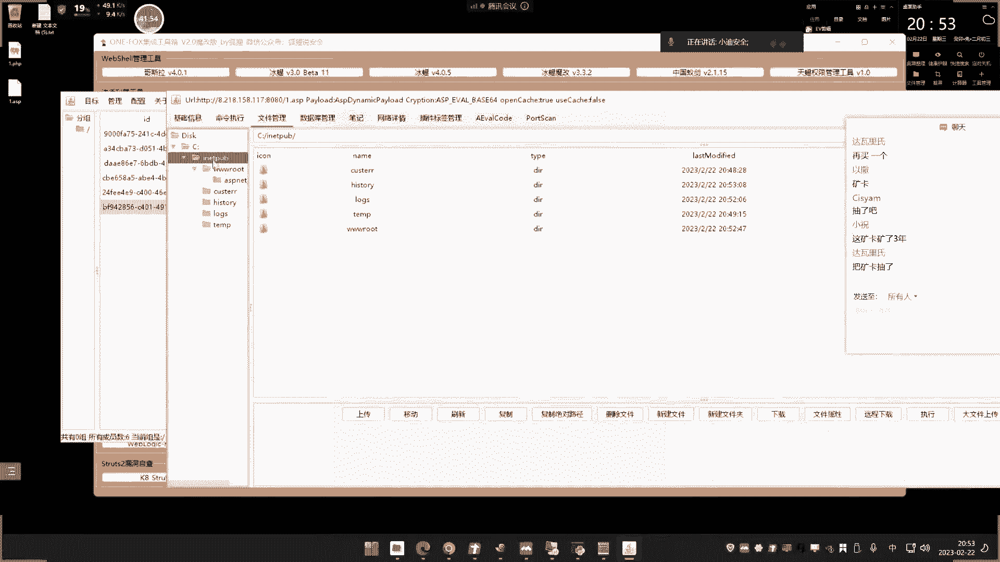

对不对，包还是看不到的好，我看下能不能命令执行，后面看一下啊，可不可以，是不是可以试下，他拒绝房，拒绝房不要紧的，有结果了，发货的权限是这个，我看第二加了不能访问这个VR，你也能自信，有些命令能自信。

有些不自信，你看这个能自信的，所以它命名呢有一些人自信的不自信。

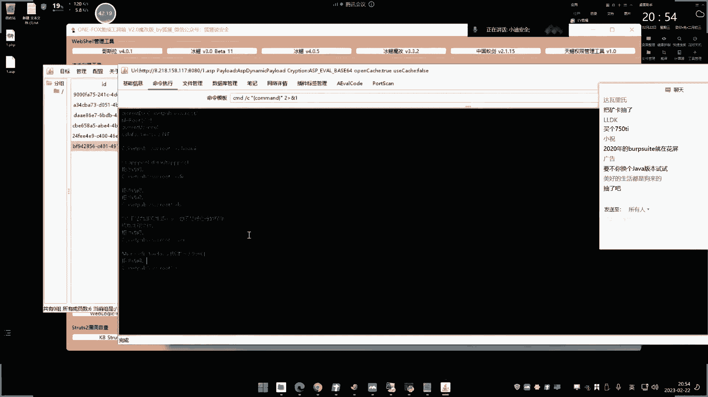

这个原因我们不追究，至少他能自信的那么三格的一个对比，大家发现没有，是不是都有区别，有的能执行，有的不能执行，这个能执行，他这边是安全的。

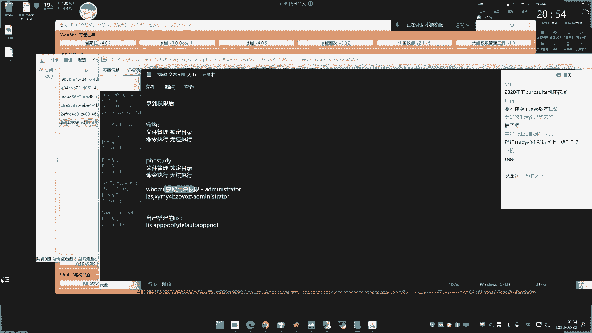

这边是这个东西发挥的命令，用户不一样。

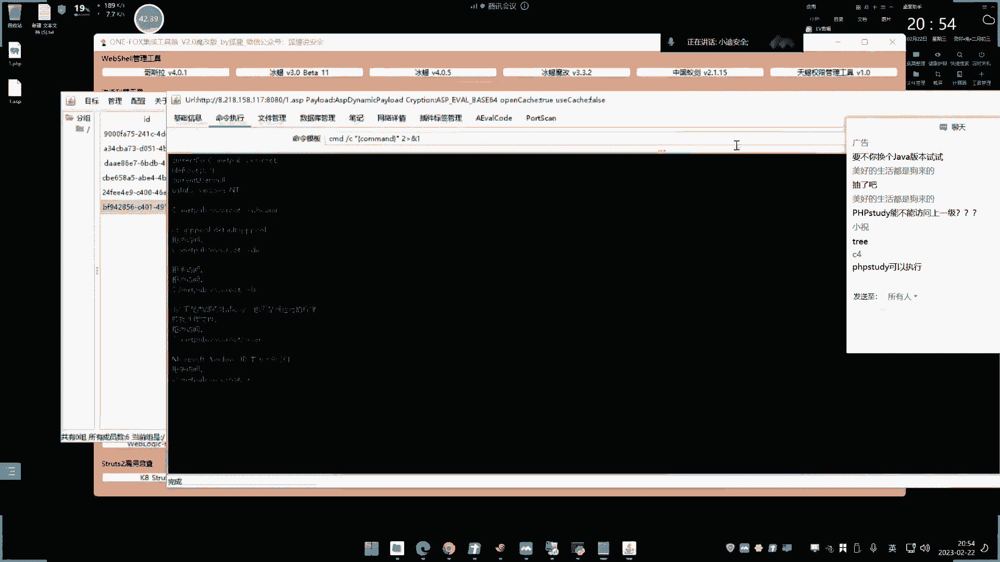

所以这就是我们为什么要把它的架构给它，打印出来。

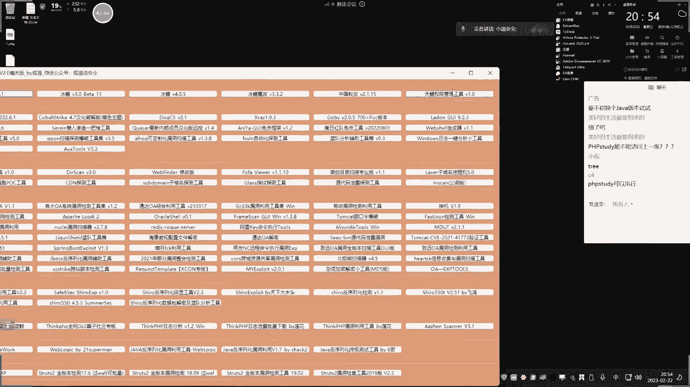

并给大家展示它的区别，其实就是告诉你，不同的东西打印出来的东西就不一样，我们先不说原因，它的差异就是这里就是你用宝塔搭建的，安全起来了，用PPS搭建搭建起来的不安全，你用原本自己去安装的程序。

就自己去下程序去安装，去搭建友谊班，死安全等，他是什么情况造成的呢，其实非常好理解，软件的为什么会受到这个东西控制呢，其实很好理解啊，这个宝塔呢在他初期他和这个pp study的是一样的。

但是随着用的人多了，所以安全人呢就注重这方面的安全了，开始在保他的核心内核里面去更改是吧，防止了他网站被侵入之后，这种权限直接丢失，和文件的直接被删除等等一些风险，所以他在他这个产品里面。

加入了安全的一些防护，但是pvp study呢，从他原本自身使用起来，被宝塔基掉一定的市场份额之后，他不开始注重，他，也没有去做这些东西，所以导致了他这个安全的没有太注意。

能理解吧，你从这方面去理解就好理解，这是一方面，其实pp3点也可以防护，它在哪里防护呢，大家可以看一下啊，他这里也有啊，他在创建网站的时候，这边有个叫安全设置呢，它可以配置这个东西，也可以进行这个防护。

它也可以的啊，但是一般默认是全部关的，所以呢这个东西要开始说了，他也有，并不是说他啥都没有啊。

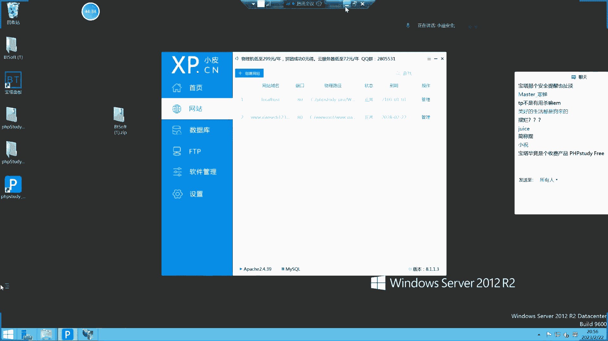

但是我们从这个上面可以了解啊，然后那个权限为什么不一样。

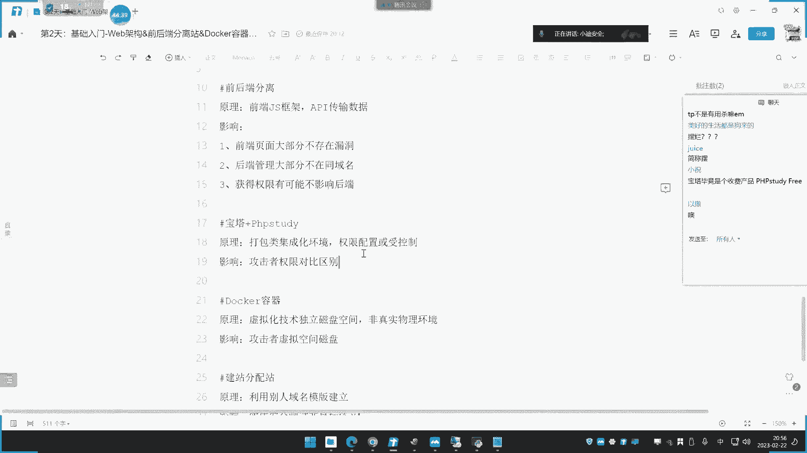

为什么这个等你打印的是这个，然后你用原力打印是TATE的，其实很简单，这个IS呢是他计算机自带的服务功能，就说你电脑系统呢就可以安装这个S。

但是这个P打底呢是属于第三方的产品，问系统是不自带这个产品的，这个是个软件，是另外的非系统之外的软件，但是这个软件你在安装的时候呢，你是用的啊，这是MTOR软件的权限呢，它是一个叫基层关系的。

就会继承这个安装者的权限，所以呢造成这个PP大家享受的就是安全的，而它这个产品呢又没有去做这个全新的这个，二次设置，导致你那个网站的也是这个权限，所以它权限为什么是这个就是这个原因啊。

但是还会有很多很多意外的情况，这个呢需要你分不同情况的去看待这个问题，我们呢只是要搞懂为什么用这个宝塔PP3D，或者用其他东西搭建出来的权限不一样，所以大家要了解了啊，利用不同的东西打印出来的东西。

就会影响到这个安全测试者的，他的一个后面的路，简单来说就是大家以后呢，如果说能够做这种时机实战，哪搞这种测试的时候有很多疑问啊，你就能理解了，就是由不同的环境造成的好，然后呢我这里呢就不说哪个更安全了。

大家显而易见保他在这里是最安全的，因为他投入的安全成本也更高是吧，我们再来说多文七啊，什么叫多容器呢，其实他是在前面两三年，在18年一九年的时候呢，比较火的，就刚提出来的，然后最近几年用的特别多。

它其实就是一种虚拟化技术啊，就类似于我们说的常见的一种虚拟机一样，只是他这个虚拟机和我们常说的虚拟机，一代不一样，他这个呢是一种虚拟化技术，然后他这个虚拟化技术呢，能够让我快速的去拉取镜像。

就说可以怎么样呢，其实就是很简单呃，就是别人把一些网站和搭建环境都封装好了，成为一个镜像，然后呢你用这个多口的基数，那就把这个镜像的给他拉取出来，把它还原出来，然后呢你就不需要再做了，其实就很简单。

别人把你已经搭建好的环境给它封装成镜像，然后你用这个机箱把它还原出来，你就不用搭建了，然后这个dr。的网站呢就是这个网站，h u b dot点com，在它的上面你可以搜索到其他人商船的镜像。

你比如说我想搭建一个word price，我就搜WORDPRESS，然后这里呢就有别人提交好的，这个word price的这种网站镜像，你就可以直接在上面的去拉取这个镜像，到你的服务器上面去。

然后把它启动起来，那么你就可以在上面的去构建一个word wordpress的网站，就这么简单，其实就是说别人把一些好的这种环境搭建好的，全部都封装成这种东西了，然后呢你再利用这个技术呢给它启动起来。

你不需要做任何事情，他摸了摸的帮你全部搞起来，所以他这个基数呢，就可以成为搭建网站的一种基础，对不对，那么现在呢我们就用它啊，如果说我在上面上去搭建了一个应用，用doc的技术搭建的。

你会发现这种打井的技术，对于我们安全措施又会有哪些影响，其实我们讲这么多东西，都是说的是对我们这个安全测试有什么影响，我们并不是说要去学习这个技术，大家一定要搞清楚了啊，有些人就上节课上完之后。

有人问我说他听不懂，或者说这个要不要狐仙啊，狐仙不服，先看你自己啊，我们主要就是说让你认识到这个产品以后，你碰到的就知道是什么情况啊，好现在我们就比如说我们复现一下啊。

我搭建一个这个tomcat的这个利用，对不对好，然后呢我给大家说一下该如何去那个啊，你看这里怎么操作啊，给大家演示一下，这里面有一个我们经常用的这个，VHUB的那个那个网站，然后他下面有很多这个环境。

它上面的是全部是大众logo环境的啊，这个是一个这个东西啊，后面我们经常会有时候会用到的。

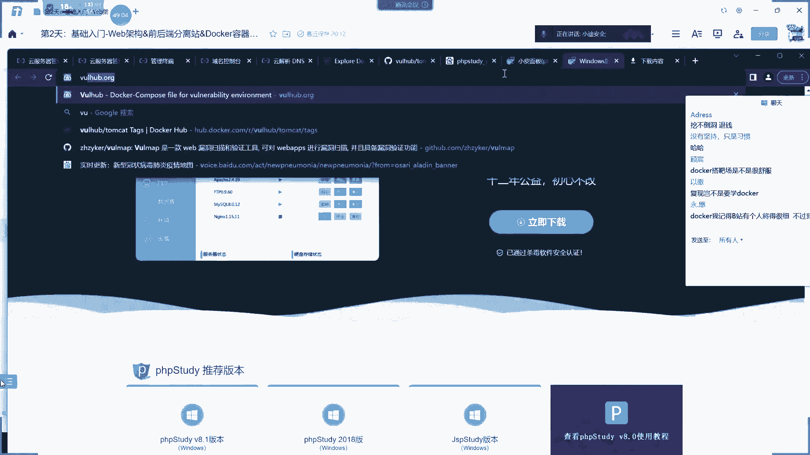

还有像国内这些漏洞测试平台呢，这个上面有很多，我看在这里也能搜到，在官网上也能搜到啊，你看到这里有TM卡托卡，然后再来点一下TX，这里有很多的版本可以拉着各种版本，比如说我们可以拉个8。0的。

这里有一条命令的把你复制复制之后呢。

我们就可以直接在我的服务上面去拉，然后多的呢我是提前已经安装好了啊，我已经提前给它安装好了，是个什么意思呢，DOTA需要先安装的就是安装这个应用怎么安装呢。

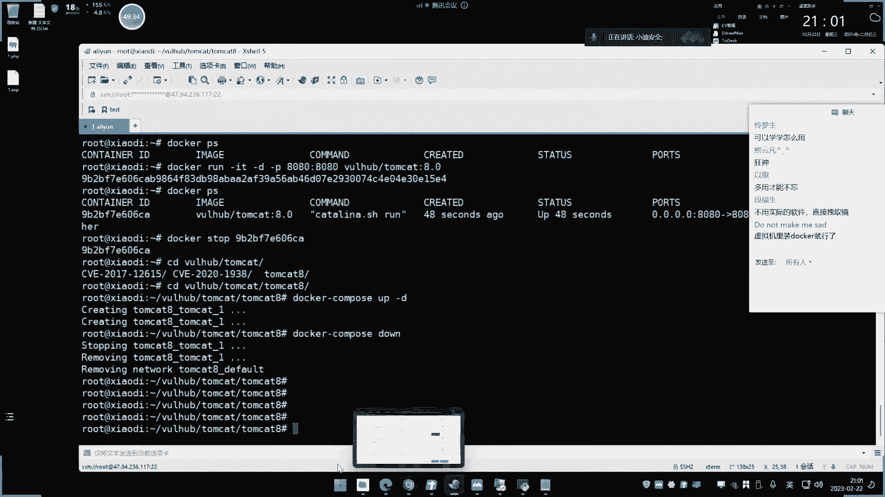

这个也比较简单，大家可以看一下这个W3上面，这个dot的一个安装，这个网上有了怎么安装，就是用这个渗透S乌班图windows怎么安装，把它安装好之后呢，就是可以执行这个命令。

就直接按这个文档自己安装bot。

我已经安装好了，安装好之后呢，首先它的底点呢就是我们的match镜像，什么叫拉起形象呢，多的咪咪，这个是宽，这个现在已经有了啊，我可以直接给他拉一下了，就用刚才复制命令的，都在铺拉取这个地方的镜像。

它就会从那官网去拉这个镜像，拉好之后呢，就在本地，然后呢我们再可以利用一条命令的启动，什么命令呢，就是装刚直接加上这个东西id啊，这个东西就可以了啊，或者加上这个名字也行，加上这个名字也可以啊。

加这个名字也可以，然后呢杠P指向端口8080端口，然后呢8080，你你用你自己的8080，映射出对Y的8080启动，嗯提示五个什么东西啊，哦我知道了，他这个要写到前面去，这都有含义的啊。

这些DOTA的命令呢我们现在不讲了，现在不讲讲人安全的时候，我们会详细讲的嗯，我们讲能安全的时候会详细讲的啊。

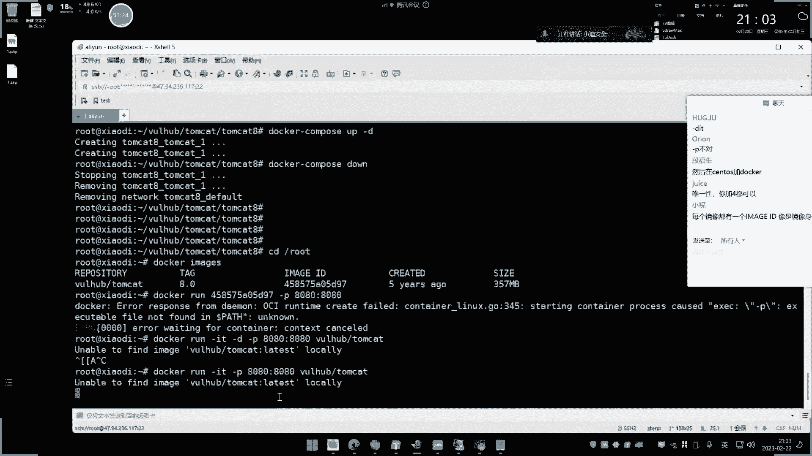

这个命令他妈的。

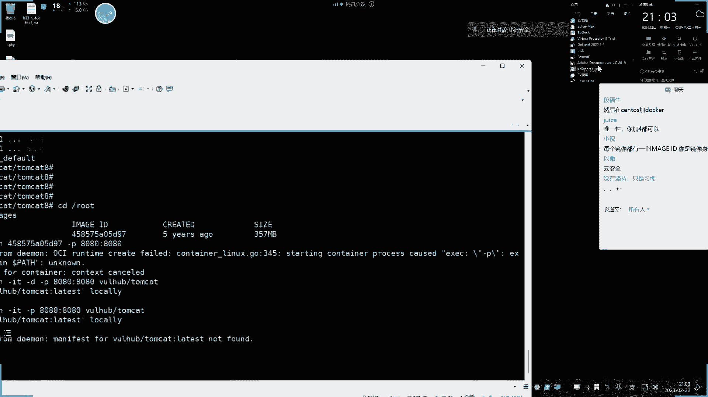

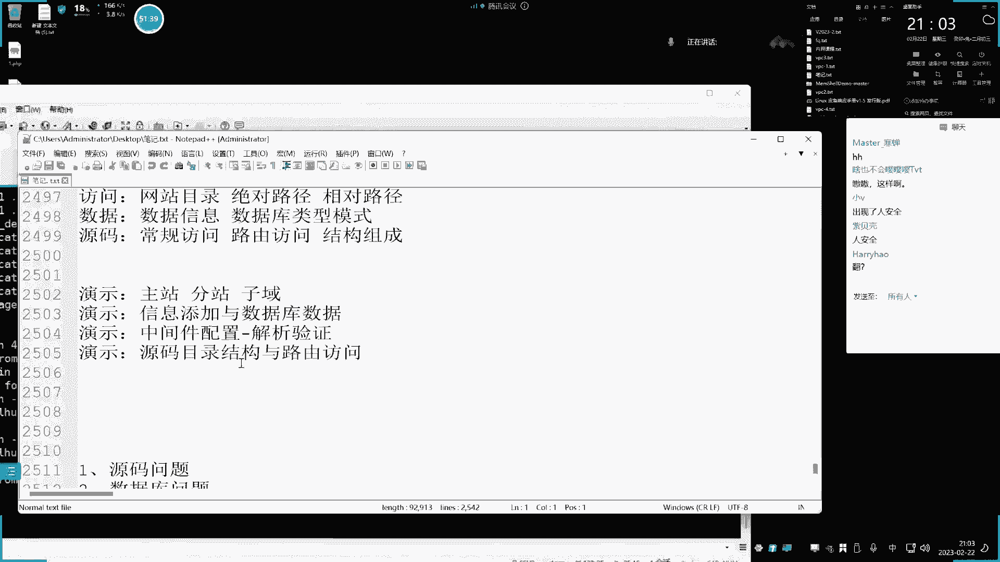

完了我把民警搞忘记了，好来看一下就启动了。

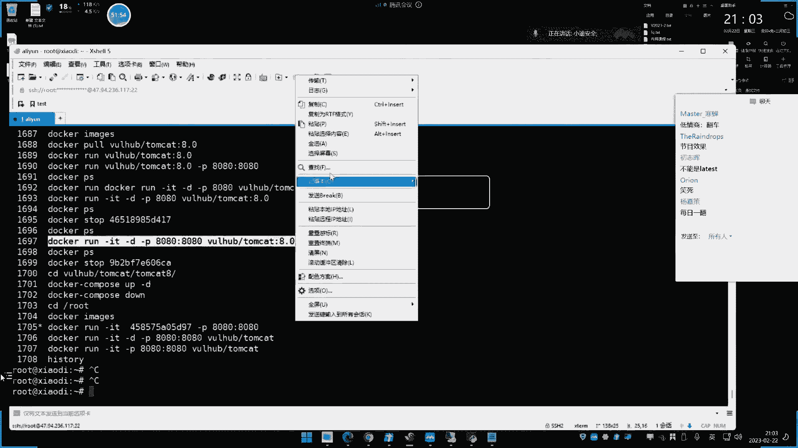

启动之后呢，你看我们这里本地就8080端口，启动那个tomcat访问，那看到没tomcat就启动了，就这么简单的，就这么简单，他就启动启动起来了哈。

就它自动就给你搞了一个多核的出来了啊，我现在就不管它了，我先把它给它删掉，我先不管它啊。

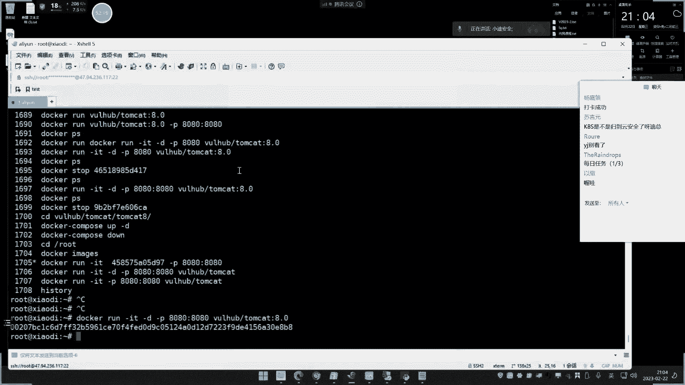

好现在呢就是说我这里呢就给他解释了，这个这个这个这个这个dr。这个东西嘛是吧，我就给他解释了这个东西，然后呢大家现在呢就是说要了解的是，这种东西会和我们这个呃，这个是什么东西不一样对吧。

就和我们说的常规的这个东西呢，有什么样的差异啊，我看一下啊，它会有什么样的差异，那就是刚才那个东西从本地的8080的音色，到外面的8080，好把它暂停掉，暂停掉之后呢。

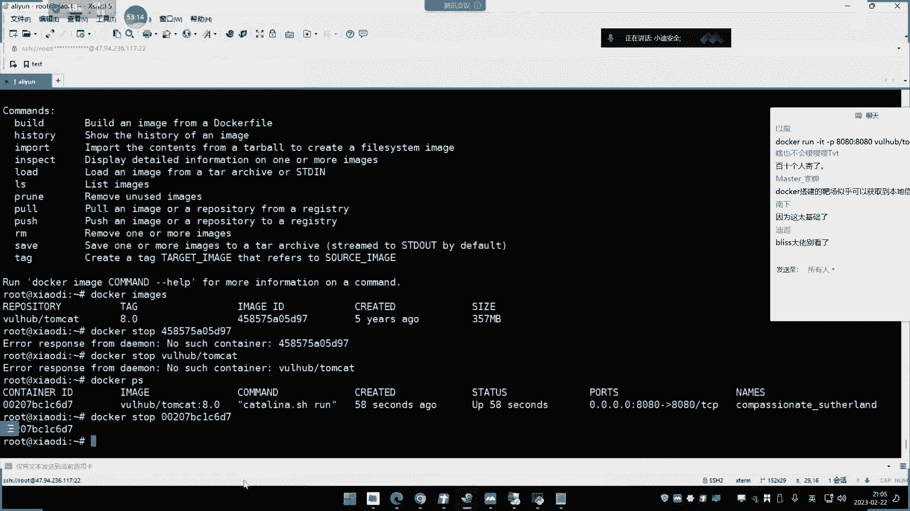

这边就访问不了了。

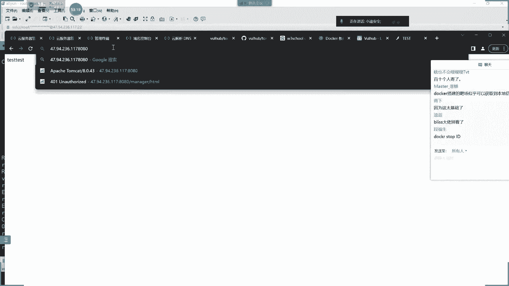

现在也没有了啊，然后呢我就给大家重新启动一下啊，我来了个logo环境那里启动，这里可以直接在网上去拉，拉了之后呢，呃这个就直接启动就可以完成了啊，我们现在来模拟一下啊。

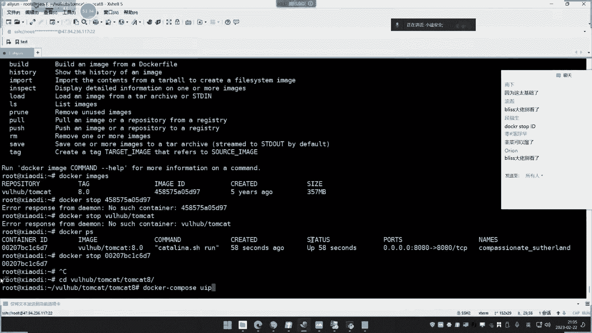

模拟一下，我通过这个打印的网站那去去来演示一下。

它的一个渗透测试的一个功能，好，大家看一下啊，我来演示一下，好这个是一个利用docker来取拿到全新的一个过程，这个不需要大家理解啊，这个不需要大家理解，我们主要理解的就是说多的打出来的。

这个网站拿到权限之后，会和我们常规打印出来，网站拿到权限之后的一个差异，好我先生成，后面由于这个是java应用，所以我觉得java应用，好我现在就模拟一下tomcat拿下来的一个过程啊。

这个不需要大家理解啊，这个不需要大家理解的，不要自己的强求啊，这个后面会说这是漏洞利用一些东西啊。

不管他们只要搞清楚它的原理，搞清楚它的影响就可以了啊。

其他的不需要我们懂好，这里呢就够字节的加了一个这个后门上去了，好我们现在呢来连接一下这个后门就可以了啊，其他不用管，好我看连上去之后呢有什么差异啊，大家看一下文件管理啊，大家看一下文件管理。

首先呢它进入文件来了个这个目录，我刷新一下。

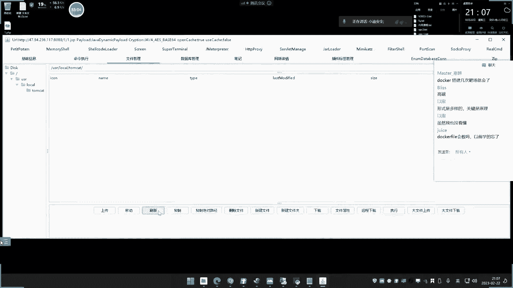

这是他的目录是吧，大家可以关注一下啊，会有什么差异，我执行命令下户外范围是root命令啊。

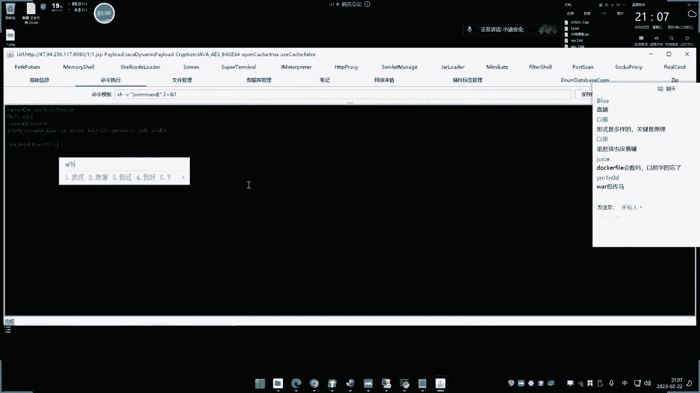

root命令啊，好大的呀，这是我们这是LINUX服务器啊，他的这个最最高权限，那是这个就是这个什么root。

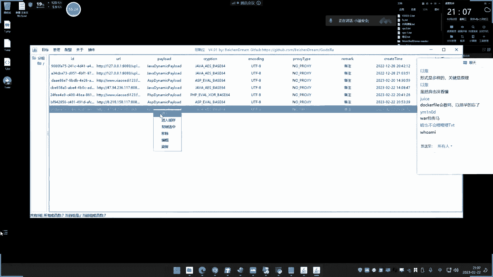

重新连一下啊，刚才有花屏的，关闭IOS可以看一下目录。

什么都能看，什么都能搞，没有什么问题吧，你看23目录结构的是不是都能看到啊，对不对，都能看到。

但是啊你错了，为什么说错了呢，来我们看一下我们真实这个服务的目录结构，看一下啊，我CD来到这根目录，我在根目录上面我创建一个文件是吧，我先给他看一下吧，我根目录下面是这个样子的。

我根目录比如说我现在在哪个目录，我在这个根目录根目录下面是这样子，然后呢我可以在我根目录下面做个什么事情呢。

这是我根目录是吧，你看啊，我在我根目录下面创建一个文件叫一点TT，大家看到有个1。01是吧，然后呢我现在呢从这个获得权限，或者这个刚才那个权限吧，我来根目录，我刷新一下他这里有没有一点TT啊。

大家也关注一下，光从这个页面的目录都不对，我下面这么多文件下面呢没有啥都没有，我或者说我随便进入一个目录，看一下是不是对应上的啊，那我进入home目录，进入我的这个霍姆伊拉斯霍姆是这个样子。

看他的home目录里面进去看一下是什么，进去刷新空的刷金光，怎么和我服务上面不一样啊，我的确是17。97236114啊，你看上面显示着我的服务器，连接的也是17。94226024。

我自己拿下的权限连上去，目录结构不一样，什么情况，情况就在于它是多克的搭建的。

多搭建会造成什么现象呢，假想就是你在虚拟空间里面在玩。

能理解吗，就是说这是一个虚拟化技术，你攻击者拿下了这个多可搭建的应用，但是呢你是在虚拟空间里面在玩，其实就是说在你真实的服务器上面，利用dog的虚构了一个虚拟空间，给到了这个副应用。

所以它其实是在这个虚拟空间里面在玩耍，那么其实就是很简单，我们这个攻击者，安全测试者在拿到这个权限之后，但是这个权限它不是真正的权限，而是他给你虚构的一个空间权限，其实就是说很简单，一块东西。

你拿的就是一个小边边角角，一个虚拟空间，不是我们真正的东西，网上呢就会有类似的技术出现，哪些类似技术呢，就是我们说的dr。什么陶艺，为什么称之为叫dog的逃逸呢，逃逸是逃逸什么东西啊，逃逸到外面去。

从虚拟空间里面逃出去，所以说它叫逃逸，能理解了吧，那么这样的东西不是我们现在要讲的啊，现在不是我们现在要讲的，这是我们以后会说的啊，所以大家了解刀就可以了，所以大家就知道了啊，这个网站打印出来。

你拿到权限都会有这么多讲究，你就可想而知这个知识点是多么多了啊，好这个呢是我们说的多可得的一个问题，dr。的一个差异，就是其实就是说虚拟空间里面在玩，你又逃不出来，那么就是永远在那个虚拟空间里面。

好再来说这个我们说的这个监斩分分斩，监斩分配斩呢，我们再给大家演示一下啊，舰长的分配，我们之前呢搭建网站，是不是用我自己申请的域名，然后呢自己域名呢去进行这个解析和配置，如果说你不用域名。

也可以用你自己的IP地址，服务器IP地址去访问，对不对，这都可以是吧，都没问题，但至少这个东西是你自己的是吧，服务器也是你自己的网站源码，那也是你自己选择的，域名呢也是你自己的，你想怎么搞就怎么搞。

反正就是你自己的东西，对不对，那么还有一种呢就会有这种意外情况。

就是有些人呢，他的这个网站呢是别人帮他搭建的，就是有两种情况啊，我这里要把它写一下，写的是哪一种。

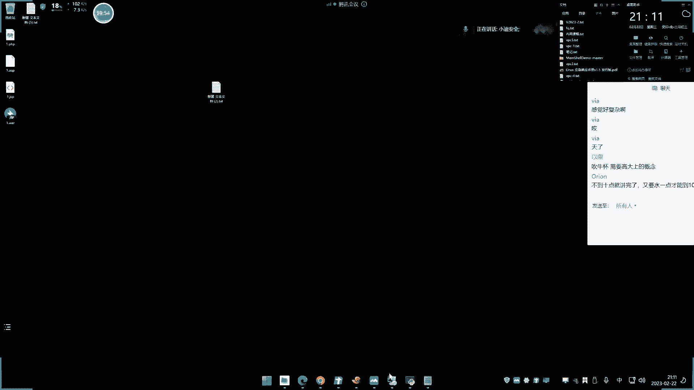

就是我们说的那种全权负责的，还有就是做这个啊，不是全权负责啊，就是我们说的这个这个东西写了一样，只是一个送免费的，一个送那个吧，一个是我们说的托管托管模式吧，还有呢就是我们说的这个叫申请的吧，这两个了。

现在说这个申请的申请的这啥意思呢，来我给大家看一下啊，网上有很多这种类似间站平台，或者说有一些这种像什么招商的呀。

这种都会有一种心思，你看这个房客的建设平台，我们看下啊。

他会什么差异啊，我们给给，来点击注册或者说怎么地啊，我给大家看一下，点击好之后，你看啊，之所以自动给我分配一个域名，看到没，然后呢你看他这里可以点击什么网站的设计，那你自己可以设计你的网站呢。

这里央视啊什么东西来着，对不对，模板的也可以自己选，就是你想学的手机网站里也可以设计，还有这个网站的广告呢，你给他使用哪个呢，比如说我选这个选这个模式的诶。

要网站，那就变成这样子，然后手机网络就这样子，那这个根据自己需要，简单来说，就是说你可以自己在上面去设计好了之后呢，这个网站里面这样子的，然后呢你看我打开看。

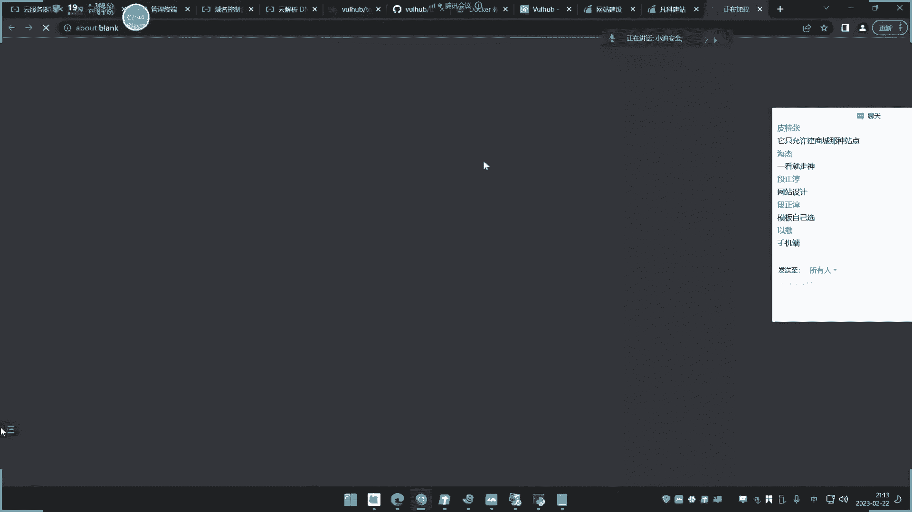

这是我网的啊，你把这个信息改是吧，来把信息改，那我的网站显示什么，效率安全，你说不是我的，他也是我的，那怎么不是我的呢，你打开了，刷新一下，小于安全变了，编了是吧，全部都编了，你这里可以自行更改。

上面的东西都可以自行更改，这里也有王者管理的装饰管理是吧，像后台零件自己要添加产品呢，给自己添加，它像是个后台端，这种我们称之为叫申请类的网站，很简单，是啥意思呢，我们来关注一下这个域名。

这个域名是谁的域名，这是你自己申请的吗，不是的，他自己给你分配的，如果说你想要自己申请域名是吧，前面把把把这个什么PHR把这个改一下，改成小D，那更加真实，但这可能就需要什么花点小钱了，对不对。

自定义域名，但后面都不会改，后面就是什么它本身这个网站应用的域名，那你告诉我，你对这种网站你做安全测试，你不知道的，还以为是这个网站，是你是这个人的，其实呢他就是在这个平台上面怎么申请的，对不对。

那也其实也其实就是说呀，这个奸诈人家啥都没干，就在上面呢，用别人的这种自然的去搭建一个网站，然后把信息改改成成为自己，对不对，连域名都是别人的啊，可能花点钱把玉米改一下，但这个重要吗，不重要，为什么。

因为呢它其实就是利用别人已经体现好吧，这东西它建立好的模板，你在上面去套用就可以了，那么作为这种网站的话，你不明所以的，你对它进行安全测试，测试的是这个网站本身的目标是什么，不是的。

压根就是说测试的就是建站平台的，能理解吗，你车子这玩意，你说你你搞小犬，我就很简单，我明天把我的博客改成这里来吧，小两犬博客培训站啊，我高对外生，这是我的网站，你给我供你给我打，打到最后打的是谁啊。

打的是平台，和我有什么关系，我就是个用户，对不对，别人会找你麻烦我是吧，我明天我搞烦了，我就把我的博客搬到上面去，对不对，你给我工，给我打打呀，就和我们刚才有人说类似QQ一样的东西，就和这个差不多。

就是给你分配一个这个使用权吧，对不对，但是这不是你全权贵有，因为对方可以随时随地把你这个东西收回，是不是，我们先不管这个使用方片的一些什么异常，这啊就这和我们常规管理有什么区别。

我们主要就是搞清楚那这种情况，你做安全测试就不是测试你真实的目标了，因为它其实就是说这个东西就是变了一个战士，他压根就没有把重心放在上面，这个网址随便搞几个免免费的东西，一检测平台搞出来的东西。

你认为这个上面会有他的很多东西吗，或者说你搞这个东西会和我公司有，会有什么影响吗，没有，因为他压根这个东西就别帮他在托管，所以说你在做安全测试的时候是吧，首先要搞清楚，这时不时一个这个这个舰载平台。

可能大家也会问他，但我怎么知道他是不是舰载平台，这种东西搞出来的呢，很简单，看这个域名的，你把这个域名一搜，后面我们做信息收集的时候，不是要收集域名的信息吗，域名信息可以进行什么备案查询啊。

什么户籍制信息啊，这新区可以查呀，你查我的公司叫小安全，这个一查接房客建站什么鬼呀，不对呀，那就有问题呀，查出来的质量不一样，那就说明有两个方向，一个就是是吧别人帮他搞的，而且版权都没给他是吧。

还有一个就是托管的托管的，他会给版权就很简单，就像我们说的一些增加单位的网站，就像我们说的，我们某某是某某市的某某门户网站，我就不说具体这个名字了啊，你比较敏感，对不对，你觉得它里面是他们自己做的吗。

他一般就是托管托管给一些外包的公司帮他做，但是呢他的那个注册信息网站上面东西呢，也全部都是他真实的东西啊，这种优势另外一种分类对不对，就像我们说的某某这个这个什么真武门户啊，或者说征服网站啊。

怎么怎么对不对，虽然他不是里面的人在做，他是托管给其他人在搞，但是他的信息是真实的，全部都是认真的，对不对，但你这种不同，我在上面搞个小两犬，一查域名的啊，查的是你们的房客对吧。

但是他那种一查还是湿确实实的样子，只是说他是给别人托管的，那么我说这两个意思就是说这两个都有差异，你针对这两个目标做安全测试的时候呢，像我们说的这种这种情况，就像我们曾经搞个免费一样的。

你测的就不是他自身的，你测的是别人这个平台的问题了啊，那么如果说是那种这个政府啊，或者说哎不是我不好举例啊，就是相当于其他的那种情况的话，托管的那种全权托管的也是一样的道理，那你就是面对的是什么。

面对的是那个托管的那个安全公司了，他的实力强，他花的时间多，维护的人好，就安全，维护人差就差，不但是这个也是一样道理，但这个呢我说啊如果是像这种站的话，就没有必要测试了啊，因为你测的东西呢和网站压根就。

因为网站呢他既然搞这种事情，他他就没有那个啊，他也没有什么东西在它上面，你想象一下吧，网站域名也不是你的服务器，也不是你的源码，也不是你的，你认为你会把东西放上面去吗，把重要的什么数据啊。

或者什么核心东西放上去吗，不会你指挥就相当于我搞个这个，搞一个什么展示就可以了，我让别人知道我一个网站完了，具体我不干啥了，对不对，所以真的这样的东西呢，你就知道你车的，一般就不是他的这个目标资产了。

你只能找到他真实的目标。

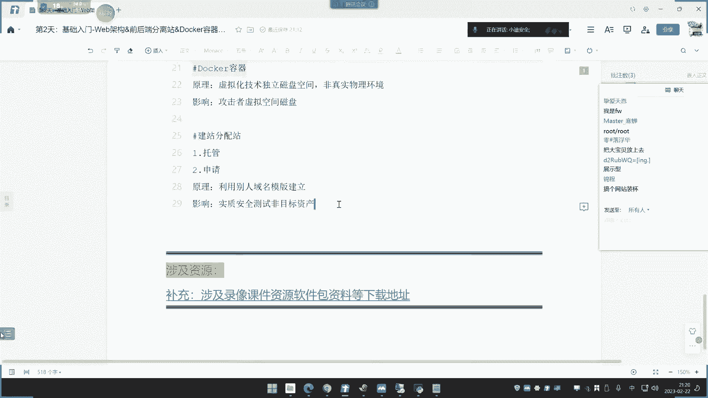

像这种网上很多，你经常会搜一些公司的时候，有些公司都会有那种分散啊。

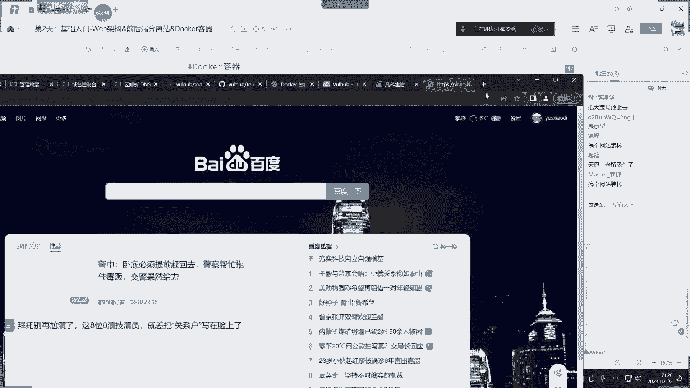

所以大家要了解啊，所以呢你在做安全测试的时候，你要搞清楚有些啥呢，你要注意识别一下他是不是见长啊，如何识别，我刚才也说了啊，查一下域名就能查出来的问题啊，看玉米那个纸箱的之前的信息。

和你这个网站自身的表述出来的信息，是不是一样的，那压根就不是一样，那就有问题了，但是可能是别人的是吧，用它的上面的一些分散的给达的，好这个就是我们说的这个几类的，这个什么普通搭建出来的一个结果的情况啊。

结果的情况，那么今天大概内容呢我们就讲完了啊，内容是讲完了，如果大家大家看有没有什么问题啊，可以问一下，然后还有一点就是我们说的这个前后端分离，我给大家再来说一下啊，这个前后分离很多的啊。

我给大家看一下，我这个倒是要重新讲的，因为它是个难点，我再花点时间给他说一下，这个时间还有前后端分离的这个你看一下啊，我们随便来给看一下一些文章，在这里有个叫spring boot。

就java的一个框架加V的前后分离教程，裂开一下啊，看这里有没有一些资料，这里也有诶，这也没写，没有界面，基于前后端分离架构的工艺流程管理系统，其实他这里边也不用去恶意去写。

我们大概知道他的一些差异在哪里，可以原则来说就是很简单，你看这个前端呢就是一个博客，后台呢就是单独的，对不对，这个也是前后端分离，它主要点了，大家主要看一下他技术的成因就可以了，也就是说很简单啊。

就是前台的显示东西啊，就是显示源码的，就是搞那个的，然后后台的那个源码，那就是另外一套，其实就是说一个负责显示，一个呢负责处理就完了，它不像我们常规的一些源码啊，显示和处理都在一起，能理解吗。

它最主要的技术成就在这里，但是由于这种成因呢，造成了我们这个安全测试者的一些手法，会有很大的差异，因为它的架构不一样之后，它出现漏洞的地方就会有发生很大的改变，就可能之前常规的漏洞会在这里出现。

但是在这前后端里面，要么就是不出现或者说换的地方，这就是大差异，现在都是前后端分离吗，不是的，不是的，不是的，不是这样的啊，还是有很多这种常规的啊。

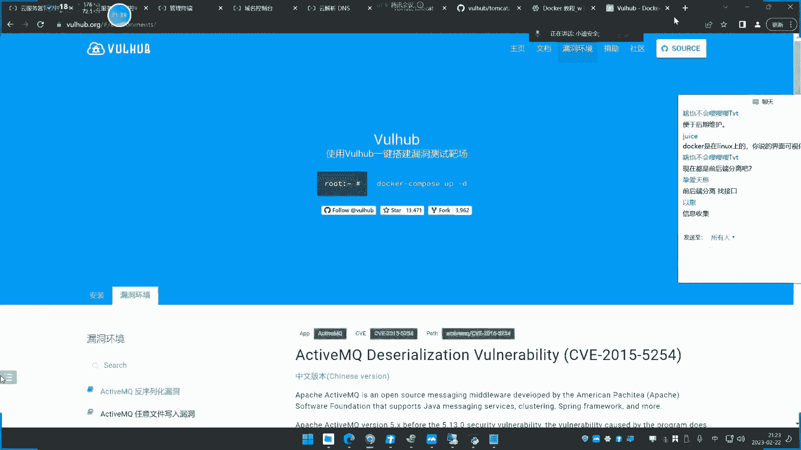

前后端分离是一些这个比较追逐技术潮流，或者说一些这种喜欢搞这种研究的，一些人喜欢搞这种事情，像一些老牌网站，他还是用的常规的一些东西啊，前后端分离虽然说有很大的优势，优势就是说访问速度快呀，安全呀。

对不对，但是它也有缺点，缺点就是他那个数据是通过API传输的，这个API传输数据呢，和我们传统那个传输数据是有效率的差异的，一些大量的数据传输的话，就会跟不上这种传统手段。

所以你要看这种它的应用的场景啊，其实就是说其实很多网站那个选择呢，它这个安全和效率会有一些，这个不能兼容的问题，就是看你自己呢要选择兼容哪一块，你要兼容安全就会选择哪一种，你要兼容效率。

那么就会选择哪一种，要根据这个网站的自身的应用的，这个场景和功能决定的啊，所以说老牌的也有老牌的好吧，常规有常规的好。

所以其实这句话也说清楚了一点啊，每个这个网站应用，都是根据这个用户的需求和它的功能要求，来决定的，由于这些功能和需求呢不一样，导致我们面临着更多更多的不一样的结果。

所以这个安全的这个方便呢也是千奇百怪的，是有些可能就是说不是专业的人，他打进了网站反而安全，这就是因为他产品选择与安全，而有些人是搞安全的，但是他打印出来的他不安全，就是因为是吧。

这个他自己选择了不安全的产品，像我们说的，以前这个SP的网站打印出来不安全，对不对，现在P1P呢稍微安全一点，而java的又变得更安全了，你在选择上面就已经注定了，这个应用它安不安全了啊。

为什么老哪些应用经常报漏洞，而有些人他不怎么报漏洞，这都是这个他自身的这个实现的核心，那就已经决定的啊，就和我们说的一样，这人呢一生下来是吧，就已经决定了很多事情，前回来的和静态网站没啥关系。

静态网站是另外一个网站，对你除了网站了啊，我这里还忘记写了，加一个讲起来我说了啊，他刚起来精彩了，我这个还没忘记，前静态抱抱金泰花宝又是个什么鬼呢，举个例子，一个例子就能把它说清楚。

就像你大学学的是什么a ho4计，啥意思呢，那我给大家说一下啊，静态网站它其实就是单个页面，或者说成对的页面，你大学里面学的这种HM设计的网站，就是一般都是静态网站，它有什么差异呢，大家想象一下啊。

很简单的道理啊，我就举个例子，大家就能明白了啊。

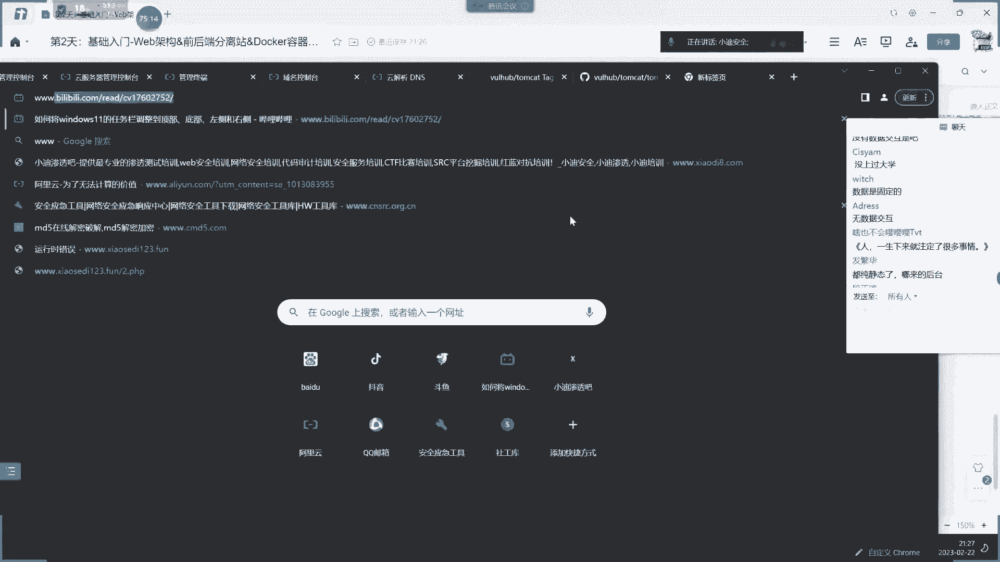

你看我这个网站呢是吧，我如果说我要对这个数据进行添加的，比如说这个页面的，我要修改某个地方，就是我自己的博客，我要把这个博客的名字，小李圣透八这个图片换掉，或者说我修改这个文章的某个名字，我怎么实现的。

我是不是在我后台里面去修改，这个这个这个文章啊，是不是这样操作啊，但是如果说你用这个静态HM页面设计出来的，这个页面是你设计出来的，你要怎么修改，是不是要在这个源码里面修改一下，对不对，是这个意思吧。

现在代码中去修改呀，那这个就是他自己写的，你看这是他自己用经常网上写出来的，你比如说你要修改什么东西，你没有这个后台，没有这个后端的话，这个数据呢它不能传输，能怎么办呢。

只能把这个什么代码把它copy下来，把它改掉，然后再把它覆盖掉，那你说该有多麻烦呢，是不是你不可能每个页面每个面找啊，这代码看着也烦的，所以那个就称之为金，就说这个页面单一。

那这个静态网站又该怎么区分呢，非常简单，就看这个网站那个界面的美工复杂程度来决定，就是你看那个美工很差，然后呢这个界面显示的也很撩乱，有页面有几个光秃秃的页面，就说单页面啥都没有，连个导航啊。

连个什么芬兰那都没有，那一般就是静态，你看他这种是不是静态啊，大家觉得他这种是不是静态，我们刚才有人发的，他这个是不是静态，大家觉得，像他这种是不是静态的，大家看一下这个网站域名都很有意思啊。

买QQ点com，前面什么一大堆，你都没发现这是个什么问题吗，再说有兄弟有这个吗，H5还有这个地址。

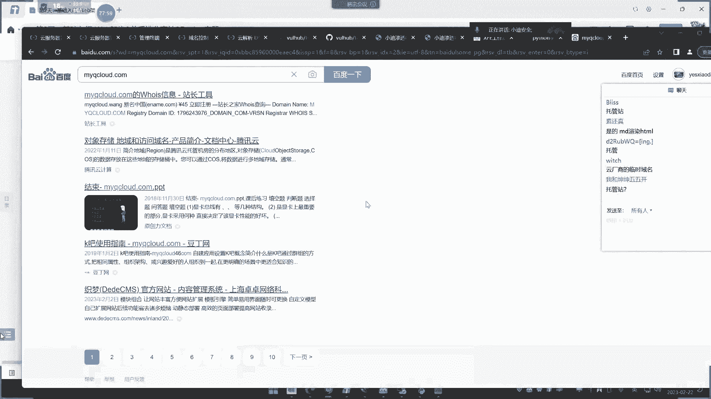

他就和我们刚才说的这种域名呢，应该就是啊这个自己申请的其实也能升到，但是我估计的话应该是拿个人空间里面的东西，或者免费玉米，然后他这个网站是不是静态网站呢，它不是纯净网站，它就是我们说的动态网站。

只是说看上去有点像金泰而已哈，他这个是动态网站，不可能是静态网站啊，他这里有这么多文章，你静态网站一个改不现实，只是说他是一个伪装形态啊，看上去像静态的，就我们说的伪静态。

而且他这个有点像我们说的那个前后端分离，那种情况，如果说其实静态和这个前后端，那个东西都不是绝对的啊，你也可以写的这么美好，就是今天的，你也可以用那个JS那去进行数据传输，也可以，这个要看情况的啊。

尤其像一些游戏网站，就是纯静态的。

我们可以自己随便找一些这种全像这种啊，我给大家演示一下以前那种单页面的那种传奇，尤其那些私服那些鬼东西，它就是典型的纯净态，你看现在这种就是纯净态，那你打下来啥都没有，就一个里面的下载游戏啊。

这是什么鬼东西，就这个东西，这是纯静态啊，啊这种就不是了，像这种单页面的啥都没有点击，就就一个下游戏，什么鬼东西，几张图片，像这种就是那么纯净，它有什么区别呢，我们给他说一下它的影响就是什么原理啊。

就是数据没有传输性啊，这里边如果说有JS这个传输的话，那这个是另算啊，不算它没有传输性，所以导致它的影响怎么办，无漏洞，为什么呢，因为他没有数据传输，所以他无漏洞，就是光秃秃的，是那样就是那样。

你要改只能在服务器上面改，当然如果说他这里面有JS的代码在里面，JS里面有传输数据化，那个是磷酸的，那个是有安全问题可能会产生的，因为这个ATM呢它不能传数据，但是JS呢它可以传数据。

它可以在ATM里面去插入JS代码，那进行传输数据，可能大家我现在说什么JS啊，TM什么动态啊，PHP啊，什么鬼东西我不懂，所以在这些课程里面，我们又加了一个知识点，就是讲P1P和java开发。

其中呢在这两个开发里面，就会牵扯到我们说的JS，就是AJAJAX这种一步这种东西在里面，其实呢就是从那个开发的角度教你开发，走一遍简单的基础，你就能理解他这个是怎么做的数据传输。

那么你学到那个开发之后呢，你再去看这个东西，你就都理解了，是吧，所以我们开始那个开发，那是有必要的，但是呢实话实说啊，我们那个开发呢也都是讲的一些浅显，入门的一些开发类知识点啊，毕竟我们是搞安全的。

讲不了很专业的开发技能，所以我教的那些东西呢，只是为了让你明白这个前期讲的一些知识点的，它的原因，并且通过那个学习之后，能对后面的一些漏洞的产生，原理呢会有更清晰的认识，好今天的内容呢我就说这么多了啊。

又给他扯了一个精彩的这个东西出来啊，还有一个啊我也给他扯一下，就是我们说的伪静态，微静态也是一个东西，微静态呢其实就是东台转为金牌的基础，这个是什么东西呢，就是伪装的啊。

其实我们那个z blog就有这个效果，我给大家看一下啊，z blog就有一个效果，刚才打了z blog，大家可以关注一下啊。

这是它的源码，我们可以关注一下，在它的源码这里，他这个就有违心态在里面。

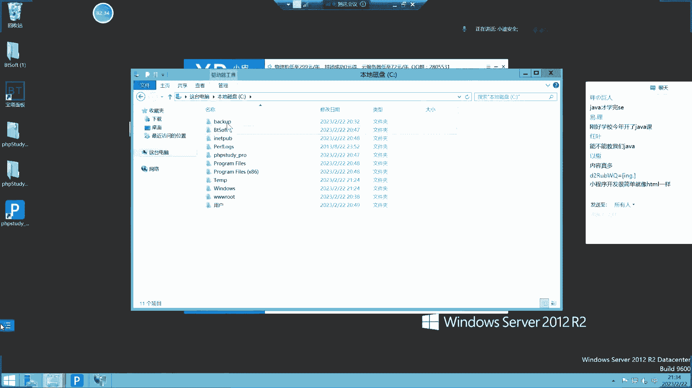

大家可以关注一下啊，你看我在这里让我进入他的后台，大家看一下啊，大家看一下，哎呀当时这个密码是多少来着，盖了个宝塔搭建的那个密码是多少了呀，c block1号阿坝子叫，还好有人帮我记住了哈，感谢感谢。

不然我这里没了，还在那找，哎这不对呀，这又是谁呀，把我这个密码改了，能不能做点好事情，我真是他妈的服了，做个人呐，这他妈的真是无语了，有时候啦唉真是我看是不是改了啊，我先看一下，哎呀，我想。

哎呀我真是服了呀，这呀这真是人才呀，我说你妹的，我怎么登半天登不上啊，我要改回一下啊，哎呀我这真是没办法把密码发一下，兄弟们那个改的，把密码发一下，做点好事不。

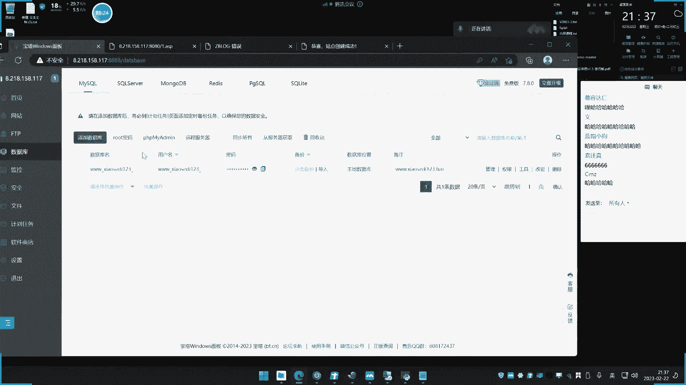

我这个字要改，我还把数据库重新又把他拉起来改，麻烦死，我要把那个密码给替换一下，我也不知道那个原石那个密码是多少。

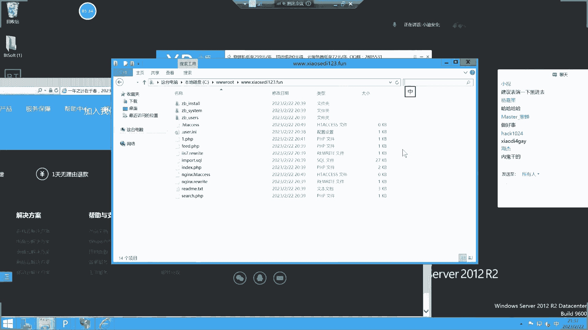

小弟是谁呀，好试一下啊。

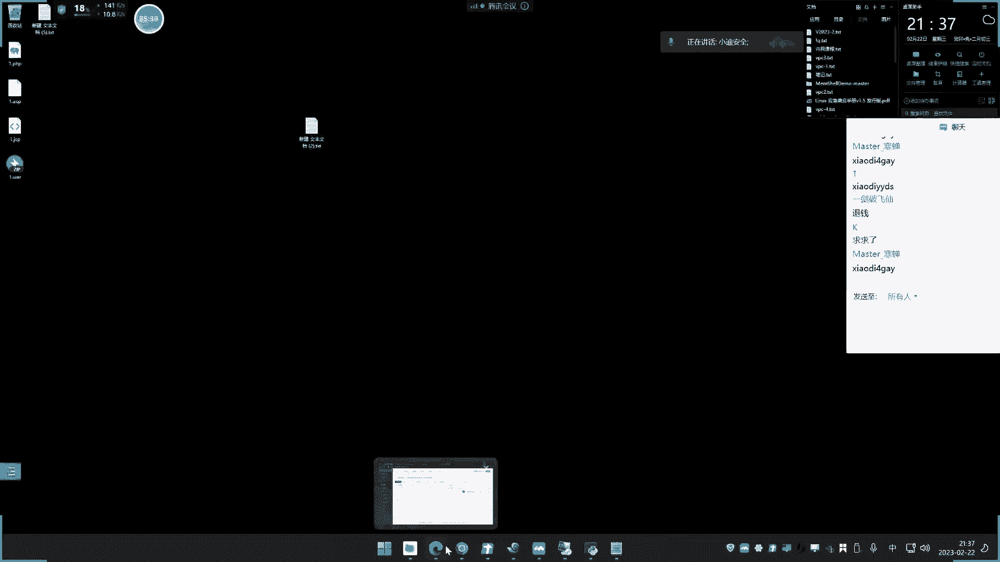

你这什么鬼东西啊。

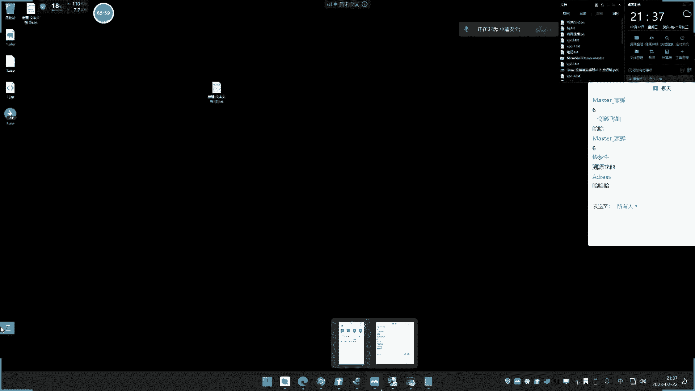

嗯不要这样子搞啊，你这真是啊，我都无语了，这也要进来改一下，拦都拦不住啊，这简直是，服了，我看修改时间是什么时候啊，唉懒得搞了懒得搞了，这个要自己进数据库，自己重新搞，哎呀我那个铭文我还在网上配置一下。

停止吧，停止吧，停止吧，那啥说完呢，我看一下你们说，说完我要把这个东西讲完之后。

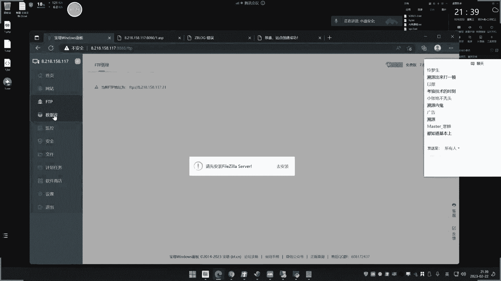

我再说好吧，我先把这个东西把它搞清楚的。

这是密码啊，密码他的密码不是MD5加密，他好像是那个什么东西加密的，那看到没，站点被改成了小迪拉夫，哎呀真是么么哒呀，我真是拿他妈的，真是拿你没办法呀，他这个铭文是那种加密室铭文，我不能直接改。

要改成那个原来的，我要在网上查一下那个，这blog的那个加密软密文，初始密码恢复那个加密值，大家有没有知道的呀，这个加密恢复密码，把那个密码修改一下，我看下那个加密密文是多少来着。

不是他那个一个密文不一样啊。

我搞搞一下那个密文，英文是把修改成这个，那就是123456789，Ok。

他就把密文的格式搞清楚就可以了啊。

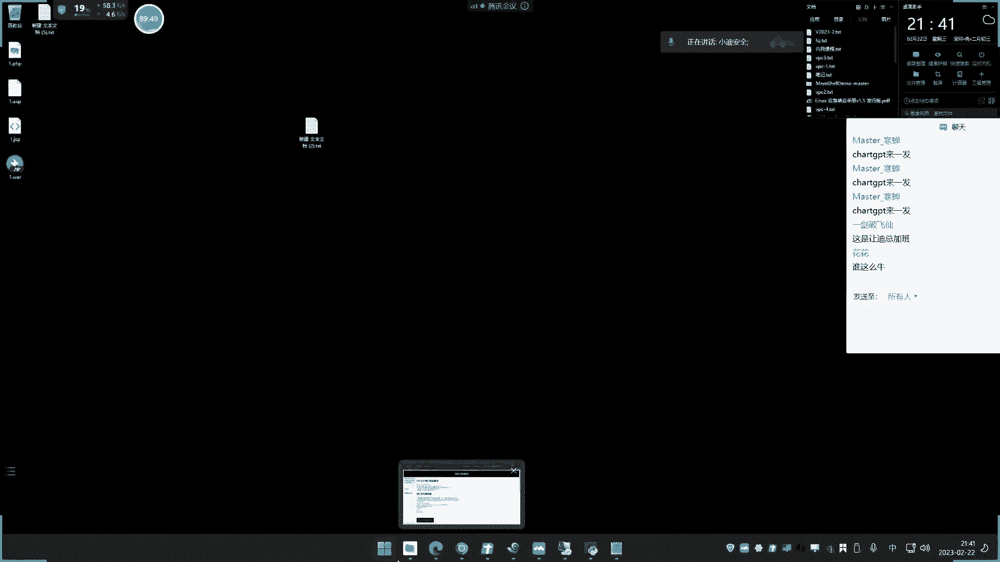

这里改一下，好看一下啊，还是不对啊，这密码对不上啊，他那个逼文要堆上啊，妈的，我不知道那个逼问男的密文是多少来着，是这个是吧，好看一下啊，还是登陆不进去，不是他应该是有那个复杂程度那些东西唉，服了呀。

说实话用这个找工具吧。

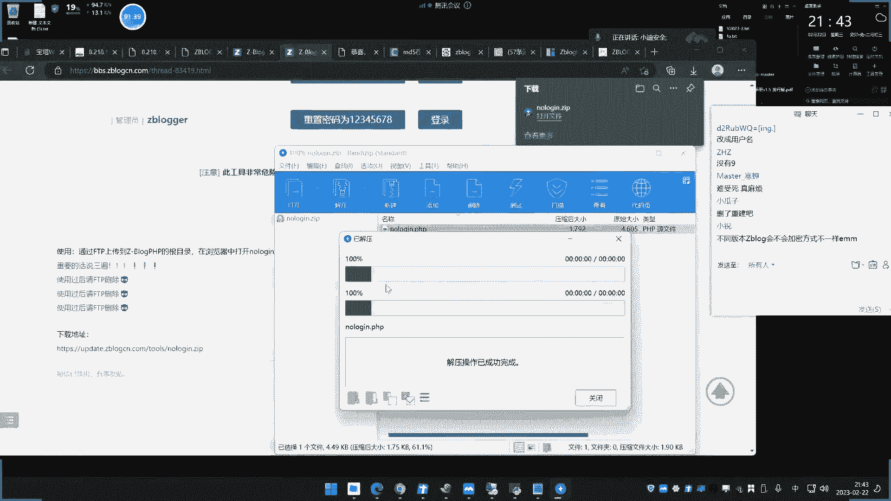

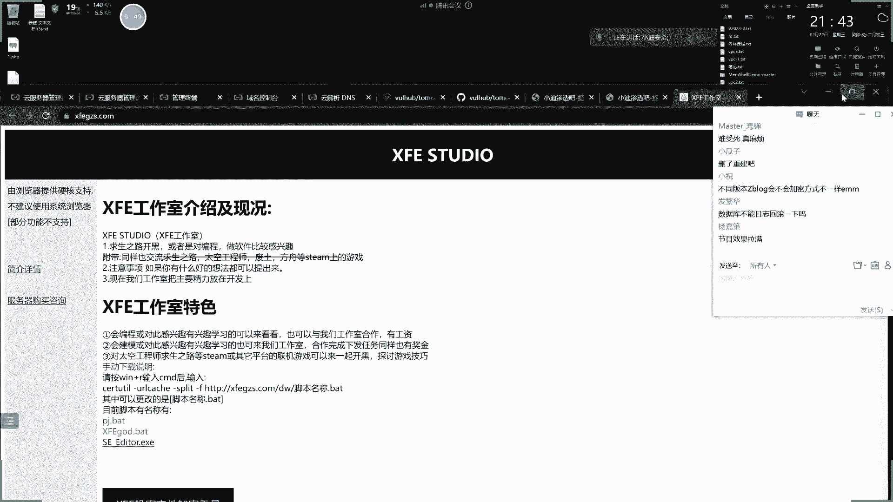

什么节目效果拉满了，这里面的我都想不想搞这个搞这个两毛事情，我都想早点把这个东西演示完，下课去的，哪知道丢人跑上来把密码修改了。

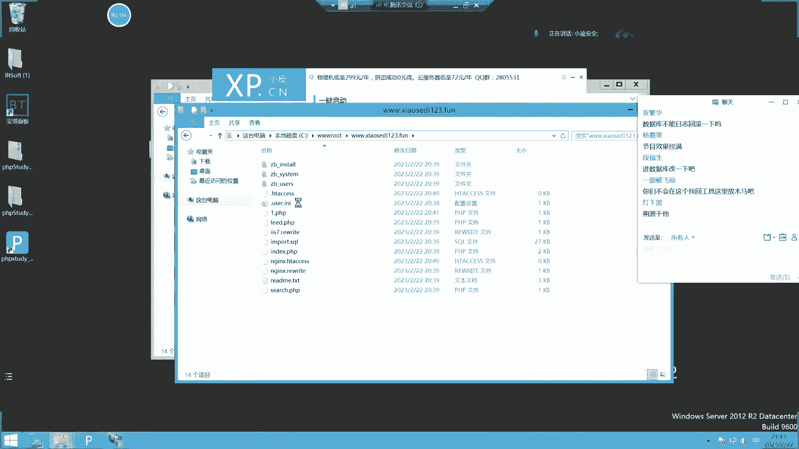

我不讲这个课还不会背课。

没想到啊，进来了大家看一下啊，那管理员变成了小李拉夫，妈的真是，大家看一下我创建一个文章的时候，大家注意观察一下啊，待会看一下我创建文章的时候，大家可以关注一下，来点提交，我们看看这里。

我们来关注一下我首页这边，啊是不是有这个，诶他这个地方怎么没有那个生成那个金台页面，这个东西学名我看是。

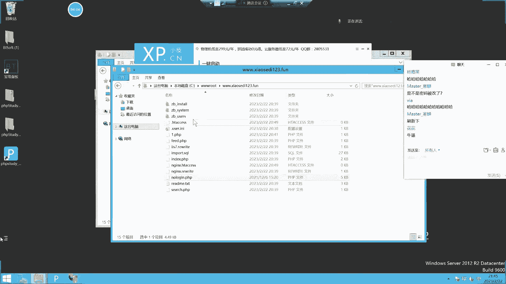

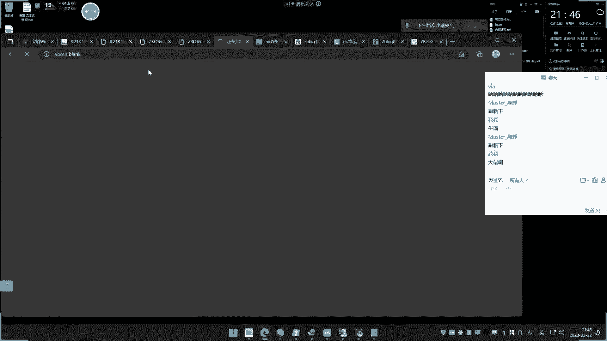

他那个静态页面是在哪个地方把它生成出来的，其实就是说它添加文章的时候，它它是有个功能啊，可以把这个页面在页面是id等于三，它可以把它设置为一个静态页面，我不知道静态页面是在哪个地方设置。

这后面是个功能啊，我就说他这个其实是个动态网站，它可以把那个设置为静态的啊，他那个静态是在哪里，是不是在插件里面有啊，分类页面管理是不是页面管理，看一下，唉昨天那个博客都可以，他可以自己设置。

它可以设置的啊，应该是他有个插件可以支持，我就是说这个意思啊，说这个医师大家知道就可以，就是说他其实就是把那个页面，转换成一个静态了，就是你在网上浏览的时候，它就变成一个访问HTML页面。

所以有时候呢他就是这种叫伪静态，就是看上去是个静态，其实它是个动态，只是利用了这个基础呢，把它生成那个静态出来了啊，这里有了强制围巾的跳转，生成ATM缓存插件，微静态兼容啊，会静态这个文件生成。

这不都要收费啊，大哥我这没钱的，不好意思了哈，大家理解就可以了啊，其实就是说他把那个页面生成了一个那个东西，出来了啊。

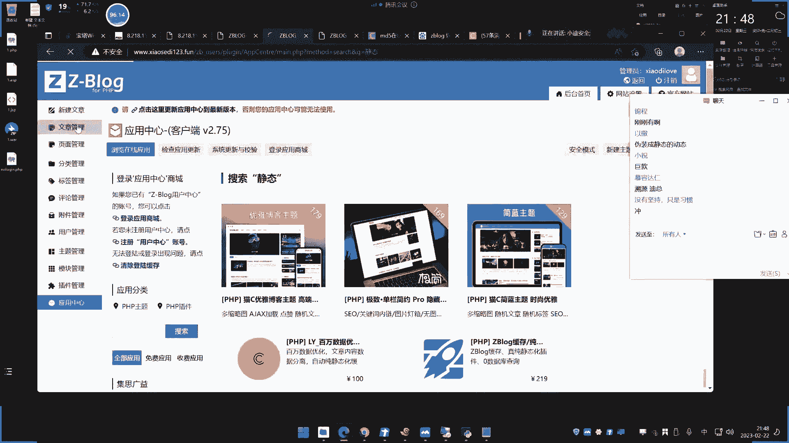

对不对，搭理就可以啊，刚才有人说这个什么说圆呢，这都不用说圆的，看下啊，这有个什么，我看我有没有日志，有日志就能说没有日志，就不能说来找一下这个罗格斯，这是我的网站，这个是我的网站，就是这里啊。

我这也没有多大嘛，嗯下载了，你这妹的虾都不能乱下，虾仔跑哪去了，胡子啊胡子哪是下载没看到哦，这里这里这里他说了，直接在这里看吧，这样的，哎这用说说谁的感动，那很简单的道理，他肯定登录后台，登录后台。

后期是真的system，对不对，访问过这个地址，我就直接搜谁访问过，我把它标，把我IP1提200，200多行对吧，来看一下IP，我的IP是多少，VIIP是171的，对不对，我IP是171的。

他这里是什么，这里有访问过，但这是反过来，这是法国，那这里就可以呀，有几有多少条啊，你看一下，这个R18左右坐的都是28172，是我自己这个R8呢他比我的体现访问，这不用看了吧。

后面我都懒得排除了艾克多，你自己排就可以了，谁呀，河南新乡，那你可以看一下1171是我自己的，1114的还访问过，就这几个人呢，对不对，你再结合一下他访问过哪些事情，比如说这里呢我们后台地址有个页面。

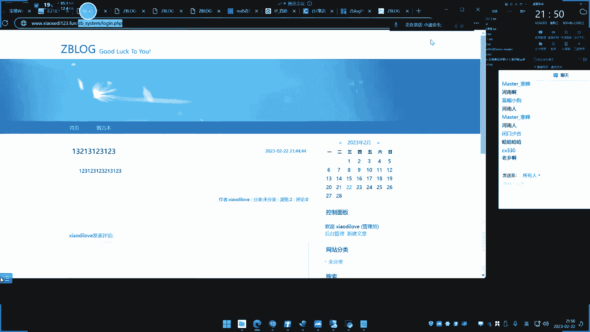

他绝对是要改那个页面才能触发修改密码的，就很简单，我给大家演示一下，你要根据这个思路来呀，他改了密码，你想象一下改密码要怎么操作啊，改密码肯定是点这个用户管理啊对吧，用户管理用户管理页面是多少地址啊。

是不是这个这个地址呢，这里修改地址呢，就这个index地址嘛，我就看谁访问过这个地址，对不对。

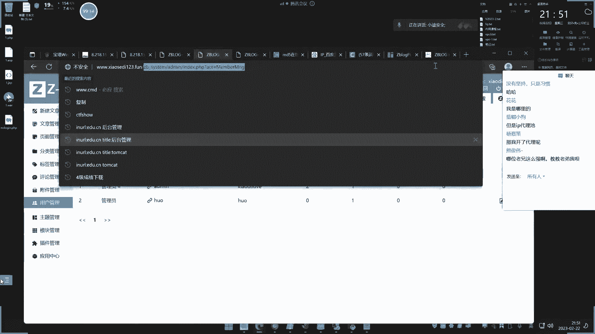

在里面搜一下，那基本就能确定了哈，看一下日志，那这个反应过来看到没，这个反应过来，五八点多少，你看过那个就是内鬼，这个五八的，妹。

上海的，算了啊，直播就讲到这里了，我懒得看了，唉算了算了，今天就说这么多了啊，喝酒讲更多了。

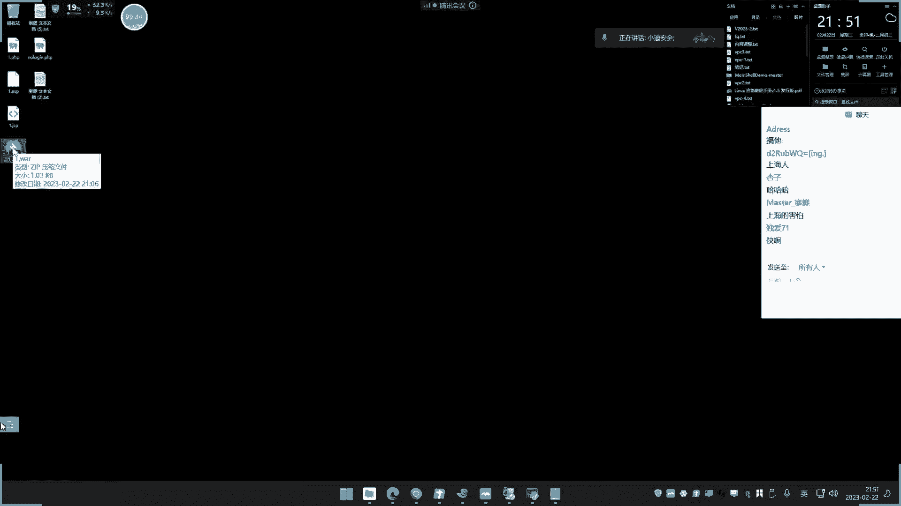

时间关系就不跟他啰嗦了啊，大家有问题赶紧问，没问题。