# P20：第20天-红蓝队自动化项目&资产侦察&企查产权&武器库部署&网络空间_ev - 逆风微笑的代码狗 - BV1Mx4y1q7Ny

第20天了啊，原本计划是把那个微信公众号的一些东西，来讲一下的，然后呢那个内容呢勾不到一节课的课时，所以我们就留给下一节课呢啊，把一些这个脐带要补充的，加上那个呢再单独放接口啊。

这节课呢就是主要讲的是工具项目啊，这个工具项目呢每一期都要讲，因为每一期的这个项目呢，都会有一些小微的差距，因为有一些项目呢随着时间的推移，有些项目它不更新了，你看上上期课我们讲的什么那个什么坤宇啊。

什么水泽呀是吧，随着这一年的这个时间发展呢，现在这两个项目呢已经算不上优秀了，我们今天就又是又有新的这个优秀项目呢，给他推荐又多了两三个。

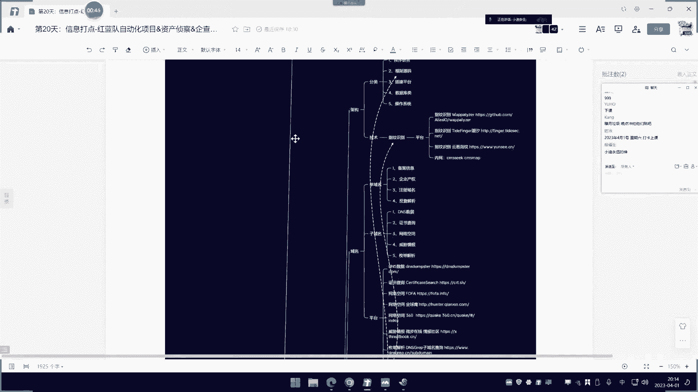

这个项目呢就是大家直接用工具来完成，自动化的信息收集，也是方便大家，如果对于大批量的信息收集的话，可以采用这种方式啊，比较重要的一些单点的系统呢，大家可以手工啊，对不对，这点呢给他说一下啊。

嗯就像今天还有人问我说，上期的那个什么水泽呢，用不了啊，这个无所谓的啊，这个无所谓的，就是你这个后面再用也是一样的啊，那么主要呢会从三个方面四个方面去讲，这个是几个项目。

就是全部介绍的是工具的使用和搭建，然后呢这是他这个情况，然后呢我们给他演示啊，所以呢我们这里先介绍一个这个项目，这个项目呢以后大家都用得着，可以监督。

简单的看一下啊，就这个叫all the case，这个呢是一个收集的，你可以看到下面所有的一些相关工具项目都有，直接写到，那我就在下面看一下啊，以后可以在上面再找一些这种项目啊去用，就这一点啊。

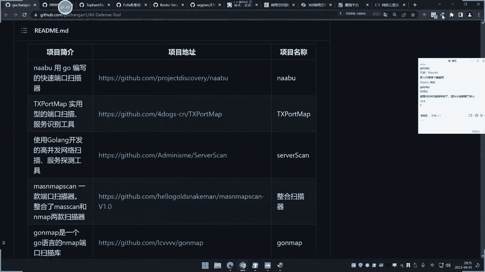

这个是题外话啊，然后呢我们再来说一下这个武器库的一个部署，这个F8X这个呢也是比较用的比较多的。

他是干嘛的呢，就说大家不是经常要在这个环境上面，去安装环境吗，那么你下这个呢，他帮你全自动安装，啥意思啊，啥意思呢，你看一下啊，他支持哪些的一个安装，你用上这个项目之后呢，你刚一个B那么他就安装这些。

干个P就安装这些，干了个D啊，就安装这些，那么再杠个dr。Doctor gmm，就是这个你就想干什么就干个参数，它就帮你自动安装，什么都不用管，然后这个前面是环境，后面还有一个蓝堆工具是吧。

还有红队工具呢，狗比就把它按照狗比WP4杆就WP4杆，AWFS就AWS cs就安装cs就这么简单啊，我们大家都会演示一下的啊，就说这里是提前给大家说的啊，就是为后期的一些环境呢。

大家如果观众可以使用这个项目，我们待会演示好在这一点啊。

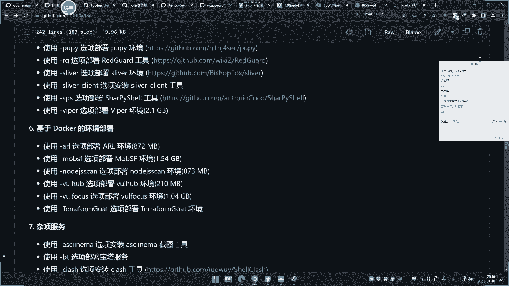

然后主要就是介绍下面的了啊，就是关于这个几点，然后逐一讲什么知识点呢，从三个方面讲啊，第一个方面就是首先是两个单方面的，一个是这个网络空间的一个干这个项目，他是干嘛的呢，它集成有foo印度夸克。

钟馗之眼，撒旦爱奇茶，CHINEZ0ZON网络空间的常见的产品，国内的都有呃，它有什么作用呢，就是你注册一个账号提供一个K，那么它就可以通过这个K呢在上面形成搜索。

比如说像花口和银图，它这两个呢是不提供下载的。

就是你如果搜索这个相关信息的话，就比如我随便搜一个东西，那么它是有很多这个资产信息，包括这个音图也是一样啊，你要搜的话就会很资产，然后呢你要下载的话啊，比如我要进行下载导出的话，那么呢它有多少条是吧。

你自己呢就选择中，然后下一步是吧，倒然后呢他这个是消耗积分的，积分呢要花钱，你如果再要导出的话，就要充值几分是吧，就要在这里充钱一样的啊，这里呢就冲这个积分是多少钱，多少钱就得倒多少条。

就是一条就是一级分，那么有这个平台之后呢，就能解决这个问题啊，就不用花钱了，直接搜索得到的信息呢就把他导出来，这个还有一个这个是夸克，这个音图也是一样的啊，音图也是一样，音图呢也是要花钱的。

它没有会员制啊，你这个要导出数据化也是要充几分，对不对，比如说十块钱3000积分，那就说导3000条完了啊，这个东西呢就不需要了啊，我们就给他演示一下这个e n can go啊，不过呢他有个缺陷，缺陷。

就是说，如果说你这个用户本身就收不到信息的话，那就不行了，你像现在这个用户啊，我去搜信息是吧，如果我要点下一页是吧，如果说你的级别不够，他下也看不到效果的话，那也没用啊。

所以还是要看你这个用户呢能看多少数据，他就能倒多少数据，倒了是不要钱的，主要是看你的用户能看多少数据啊，你看FOFO，那不是会员的话，那是看不了数据的，而一些数据收到第二页就要提示你这个登录了。

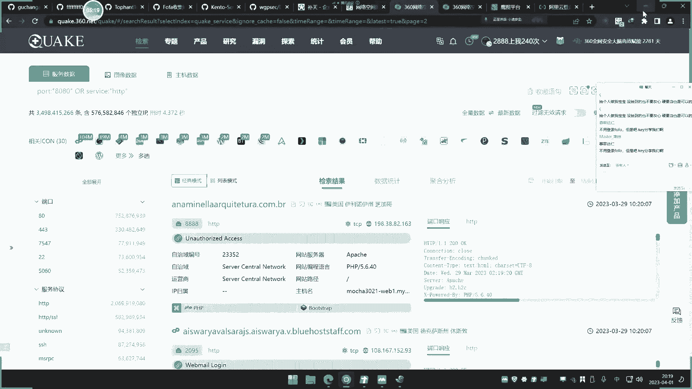

那么在工具的简单演示一下啊，就是利用这个项目进行，网络空间的一个单独搜索，就是e n code的使用，给大家用一下。

它的一个使用方法呢给大家看一下啊，在这里呢就需要先来加上一个杠非参数，第一次使用药加上氮肥。

它就会生成一个文件啊，这个这个cl的一个文件，我先把它删掉，我给他打包的是单独21先生成杠V。

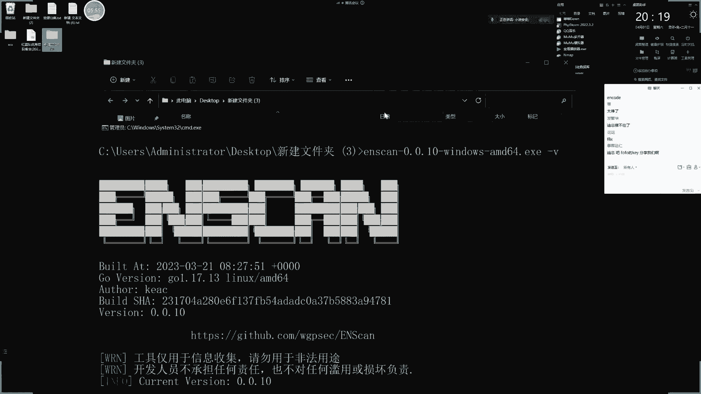

它就会缩成生成一个配置文件，那么这个配置文件呢，就是我们想要的这个什么配置信息呢，比如说啦这个是爱奇茶的cooking，这个是天眼查的QCC的这个蓝本哦，这个项目是我讲错了啊。

不是鹰开头的，是另外一个啊，这个这个是抽取企业信息的。

AS了啊。

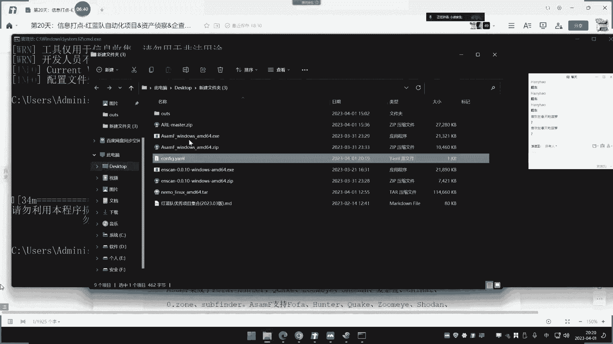

嗯这个妈的搞混搞，把自己搞混淆了。

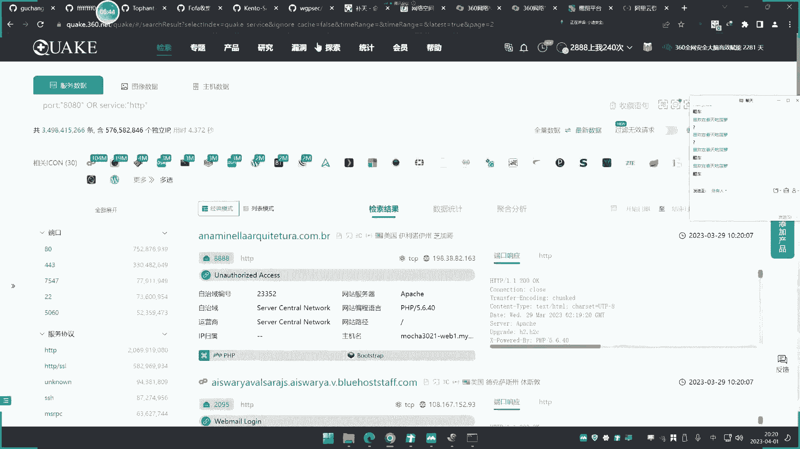

我看一下是哪个，这个是企业信息，应该都是企业信息，然后这个是那个这个这个信息啊，它的具体使用方式呢可以点击这里啊，使用方式呢集成这些东西，然后配置文件会在这个目录下面。

我这个写反了哈，这个是搜这个人的，把名字改一下吧，这个是网络空间的，然后这个呢是这个企业信息的，真是尴尬啊，写反了，啊这个是as的，它怎么用呢。

你看下它会在这个目录下面有这么一个目录，要个CONFIGJSN文件，然后呢你把这个K的配置进去就可以用了啊。

来来云一下嗯。

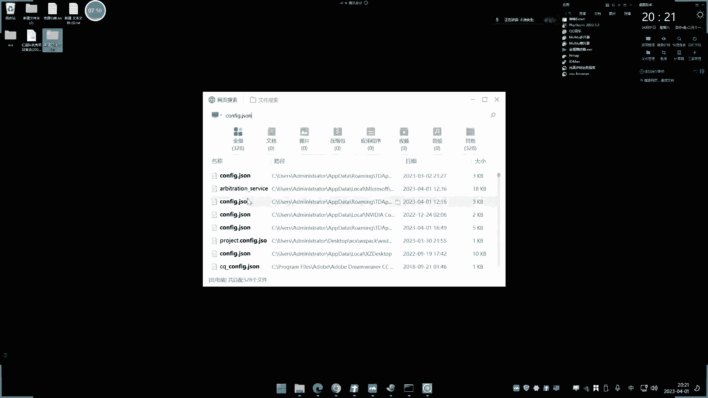

找到那个文件目录啊，他的文件目录是在这个下面，我们找一下这个目录有CONFIG啊，那个是pk的，现在配置啊，打开之后呢，他就会在这里生成一个这个目录，在你这个当前下面好在这里啊。

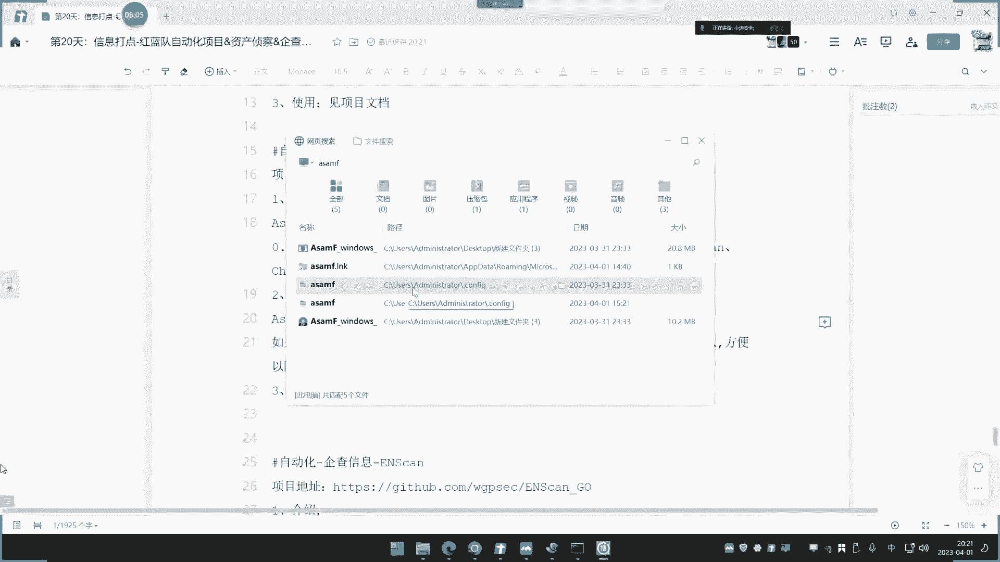

然后呢在这里呢配置一下，然后把你这个foo和这个相关的东西的话，配置进去呢，比如说cooking，这是爱奇茶的爱其他平台的cooking写进去，然后呢full的这个email写进去。

full的K写进去对吧。

这个K和email呢从哪来呢是吧，这个大家都应该都知道的啊。

点击个人中心，一个是登录用户名，再就是K是吧，一复制粘贴来再来啊，这个是K然后呢这是夸克的KKKK在哪里呢。

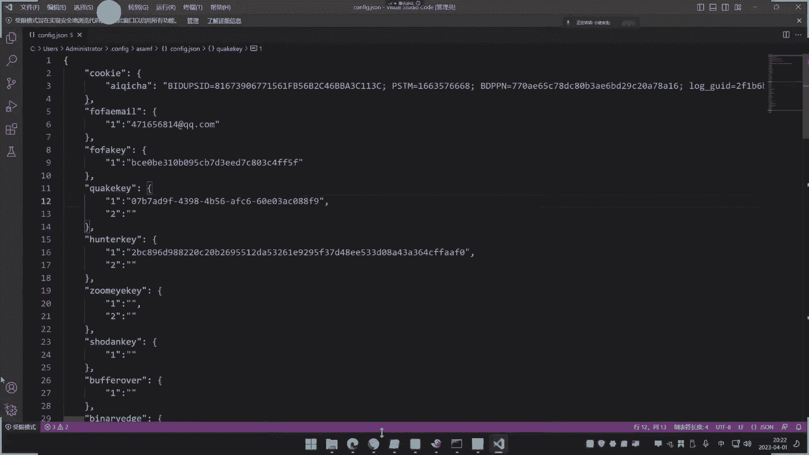

它还支持多条啊，你可以说用几条夸克的K呢。

在这里呢ADK是吧，写着来夸克的对quark。

然后呢还有这个hunter灰，这是我们的图的是吧，点进去。

对就这个嘛，那么还有其他的像什么音图的，撒旦的呀，这些东西啊，你就自己添加啊，这个下面我用不用不着啊，所以我就不添加，你看还有这么多呢，还微不在线的这个这个一大堆啊，我们就就配置这几个吧就够了啊。

那么现在呢我们就可以使用它了啊，啊配置好，那我们来启用啊，它的使用方式呢，比如说我们给大家看一下啊，配置文件什么情况，那你看啊，那么这里呢F就是full的。

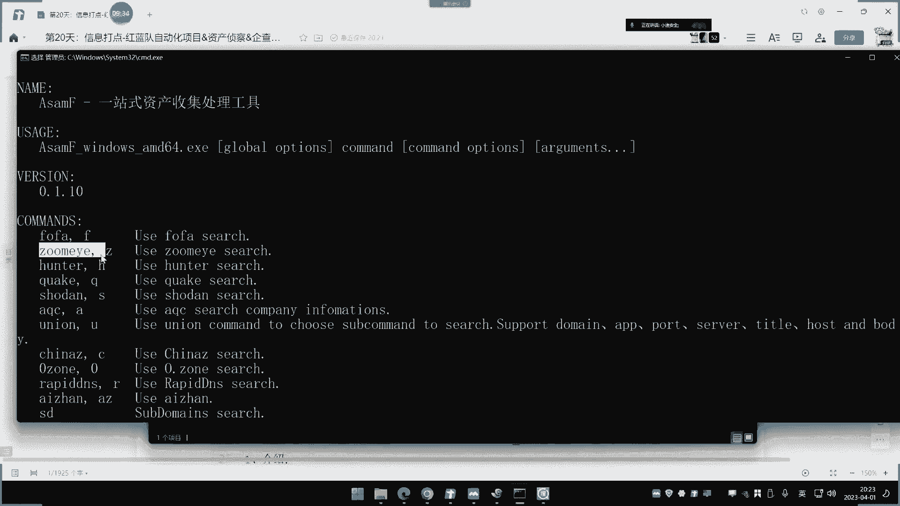

它的使用方式呢，在他的项目这里也可以介绍到啊，看一下。

比如说我们用这个PO去查，怎么查呢，大家看一下啊，来，F然后呢杠H就是用foo的查，杠Q就是查询语句，我看下啊，后面加上杠Q查询什么，比如说我查询个常用的这个web洛卡C回车，账号不消啊。

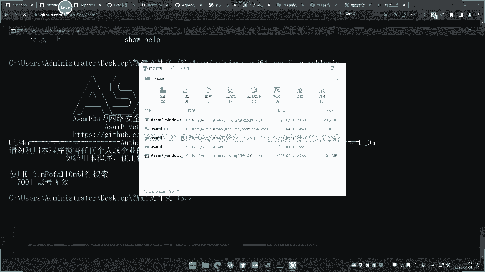

号被封啊，哦这里还没配置好，我刚不配置了吗，啥情况刷新了，应该是刚才刷新了啊，我说怎么回事呢。

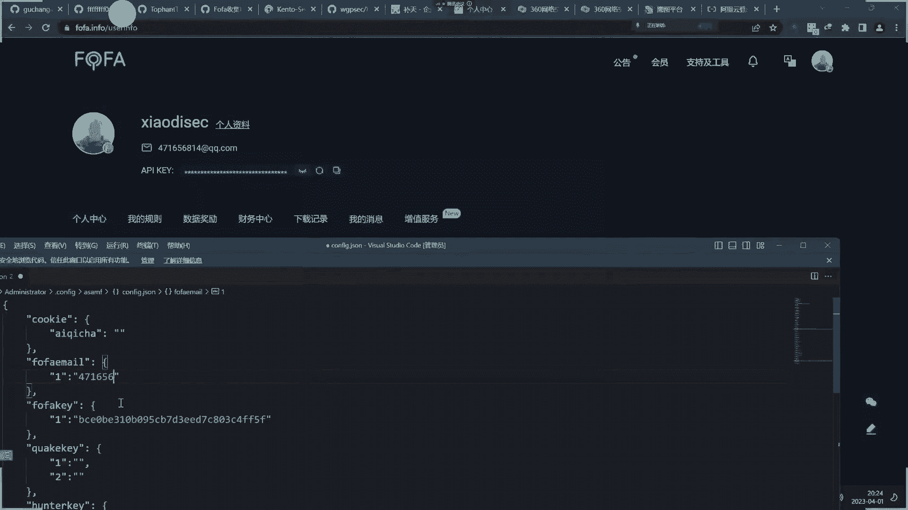

好再来，你看他就用FOFO帮你去搜这个了，你看大家看一下，来自动帮我设计出来的，然后保存到这个结果里面去了，就是在根目录啊，在这里，路径呢他这里写了路径是在这里呢，测试结果。

然后他就把信息全部收下来了，太开心了，舒服法则应该很快吧，比你那个倒的都都还要快是吧，比倒的还舒服。

哪个乱码呀，没有乱码，这个是他结果有多少条，结果里面有没有乱码了，这里倒的舒服，要拉马是吧，这个这个乱码的是国家那个名字，你把它改一下编码就可以了，这里改个编码那个数据的一个编码。

GBK的或UTF就够了啊，这个无所谓，你注意啊，就是IP和端口啊这些信息啊，其他的都都还好是吧，然后呢这个是FOFO是吧，然后呢你如果用夸克，那就是杠Q加杠九杠H啊，这个是使用夸克。

然后夸克也是刚需搜索关键字，比如搜索C也是一样的啊，他现在就用花可去搜，不过你搜的话那个语法要对啊，你不要这个语法都搞错了，你在上面搜搜搜。

啊我们可以自己搜一个IP地址吧，妈的搜这个东西也不知道行不行，搜个IP地址看一下，我搜一下，他就等这个了。

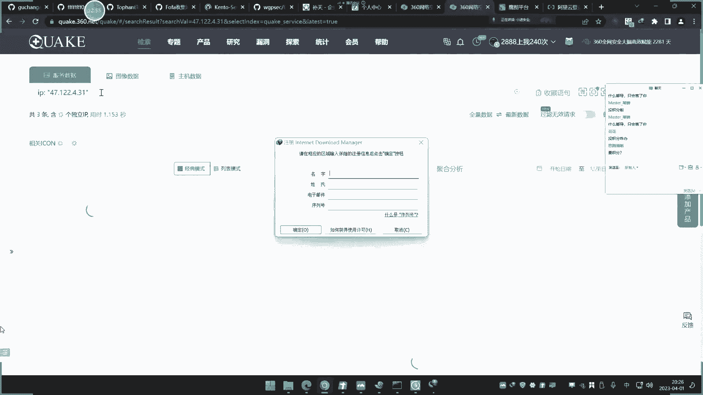

那这收到了呢。

又把你夸克也导出来了，在夸克的看没，但是夸克的数据，对吧，然后这个乱码呢大家不用管它，这个编码一下啊，这个数据有个那个编码是在哪里啊，这个excel表格里面有个编码的，我不知道在哪里啊。

你查一下这个可以把它转变一下啊，你看，对不对，他能直接搜到。

好再来看一下印度的啊，into的是在这个杠h into是杠七，那就是H，然后杠H就是它的使用语法，先加H也是杠Q嗯，这是你的这个搜索语法。

我们在这边随便举个例子，我们搜一下，比如说这个这个IP地址是吧，我们先保存这个IP地址是对的，就是这个语法应该能收吧，大琉璃的积分用完了，明天再试试，啥情况啊，什么鬼，可以说是没问题啊，妈的什么情况。

这真是。

啧哎哎呀，没有残疾的。

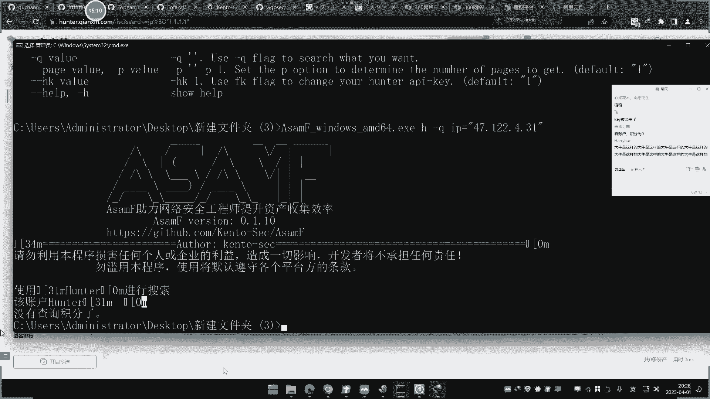

咱也没办法，你这个本身这个用户的这个身份就不让说了。

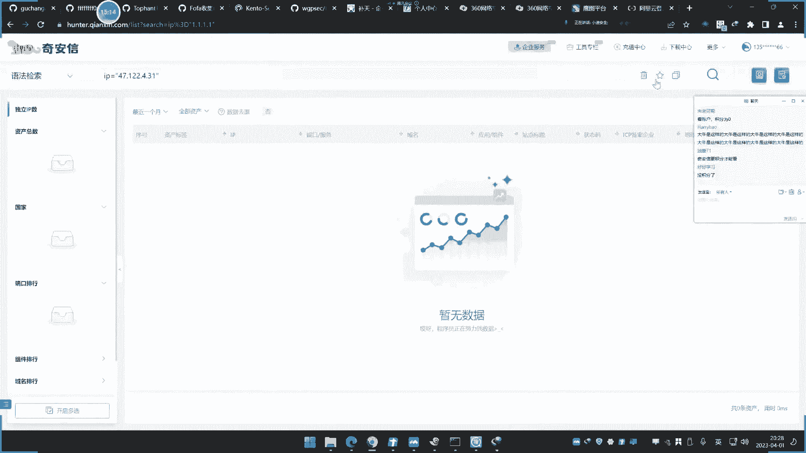

这个平台没办法，这工具呢主要就是说解决大家去导出的问题。

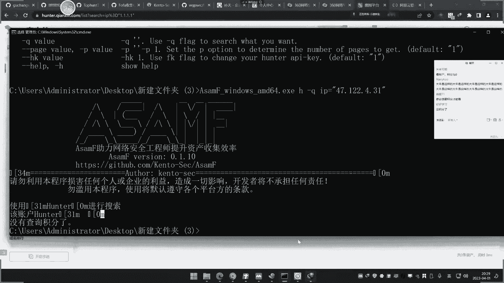

因为手大家都会收，只是说有些平台的导出它需要钱，需要几分，他就是有这个用处。

然后呢他也支持各种平台，所以以后大家呢也不用说这个啊。

所以像这种项目的用一个就少一个，因为你用的话搞不好哪天他就不能用了，不能用的原因就是官方的打击，因为你这样子就是相当于他写了个爬虫脚本，就把数据那个爬下来，就不用花钱去倒了。

所以呢这个工具呢是很多工具都有，但是有时候用着用着就突然就没了，就是因为官方的这个侵权了啊。

所以大家能用就用啊，赶紧倒以后就不用花那个几分了啊。

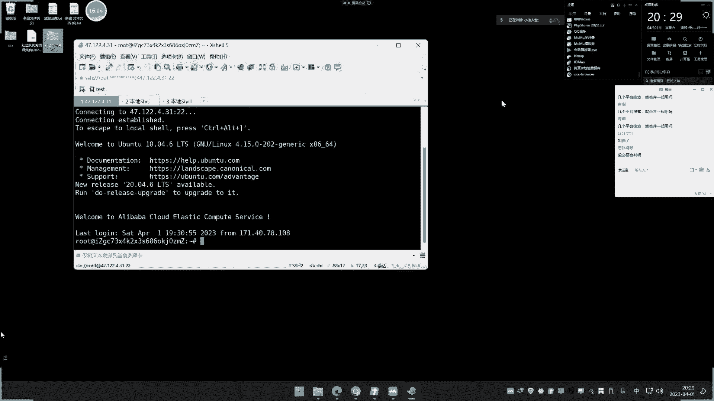

你像那个网上，他经常用我这个夸可能消费我这个积分的啊，他要是知道有这个东西就不用消费我积分的嘛，自己上去就能倒的呀，是不是，嗯什么情况，怎么又少了1000去了，谁就瘦的，啊刚开的2700，我没收啊。

我收的那几，那不止那些条啊，不是我收的，来你看嘛呢，八点呢正在运行中，看到没来，每日导出2万7000条，哎呀你是要意识的把我干完呀，谢谢兄弟啊，我终于存活了一天啊，谢谢兄弟，谢谢兄弟啊。

你还说我倒我倒个毛啊呢，还在运行中呢，他是谁呀，我的设备开始湖南的啊，谢谢湖南的兄弟啊，唉这号不能再共享了，这谁顶得住啊，这然后呢，这个是我们这个集成的网络空间，的一个搜索引擎啊，对不对。

简单来说呢就是能够帮助大家免积分去导，就这么简单，没什么其他功能是吧，就是免积分倒啊，它的作用呢就是免积分倒，然后呢我们再来说这个企查信息，那这个呢稍微有点作用啊，它的一个介绍的就是啊。

尖子互网SRC就是在护航中，在SRC中这个项目是能够用的，遇到各种针对国内企业信息的收集难题，我们前期呢给大家搜这个企业信息的时候，都是在各个平台区里面去搜去查，对不对。

那么有没有一种工具呢能够做到一步到位呢，那这工具它来了啊。

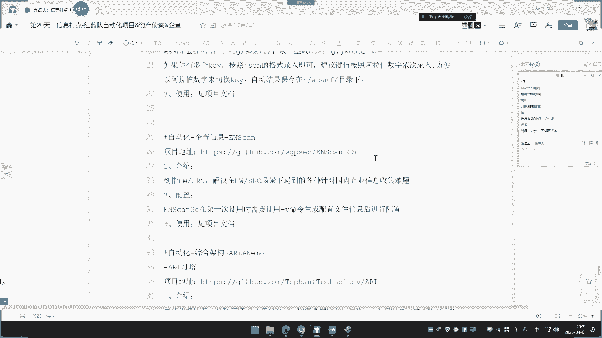

这个工具它来了啊，就是说他支持了哪些平台呢。

这里呢有他官方的一个这个截图，这是他支持的这个平台是爱奇茶企查查天眼，查阿拉丁，酷安市场奇卖数据，站长之家，ICBAPP数据，微博数据，微信公众号，控股公司供应商什么小程序。

那么意思就是说可以用这个项目呢去查一些，针对企业上面的一些信息。

我们来给大家来演示演示一下啊，这个呢就是针对这个企业的一体化的一个，信息收集啊，自动化发的，不过说实话啊，他也会有一些难免上面的，有一些难免的一些错误，或者说有一些蓝面包没有收集到的。

因为你在配置的时候呢非常重要，我们运行一下啊，这个阴沟啊，首先呢它运行之前要杠V生成一个配置文件。

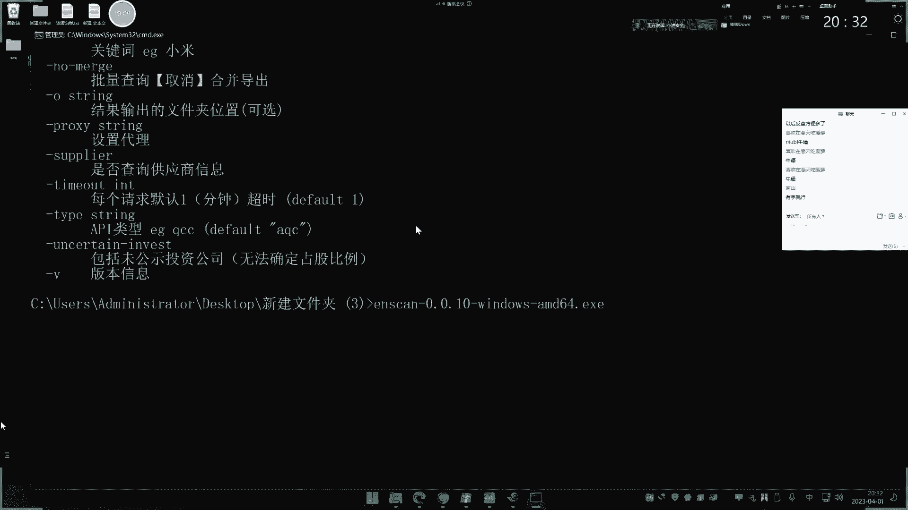

生成一个配置文件啊，就这里包括这个刚才这个AS的，这个对于C运行起来之后呢，它会自动创建一个对子文件。

是在固定目录，然后这个是自己生成，先加上杠V，它会生成一个配置文件。

那配置文件是这个啊，然后呢你要在这个配置这几个接口的信息呢，这是爱奇茶，这是天眼查，这是奇茶茶阿拉丁小蓝本，奇卖数据站长之家，那这几个配置是cooking啥意思呢，来给大家演示一下啊。

也就是说其实呢他查的还是需要，你有这些平台的一些会员。

或者说一些权限不一样的账号，否则的话他查的话也会受限，因为这些平台的有些信息呢需要会员才能查。

但有些都是可以用拼多多的拼一下的啊。

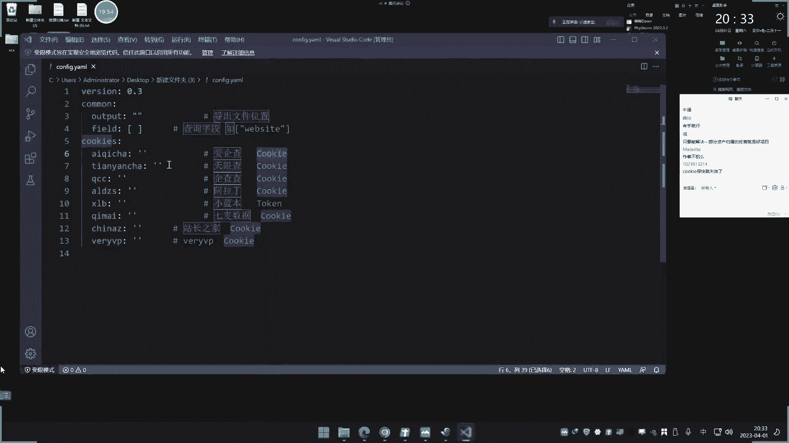

所以也不要大家也不用花特别多钱啊，拼多多咸鱼一下是吧。

也就几块钱，几十块钱的样子就能得到这些账号，把临时用一下是完全OK的，然后先看爱奇啥啊。

该怎么配置啊，其实也非常简单，给他配置一下，那这里的登录了之后，先登录你的用户，刷新一下这个页面，把你的用户cooking取出来，用户cooking是我们说的这个用户的身份啊。

这个就是我们说的这个地址嘛呢，这是cooking是吧，把cookie把它复制，复制好之后呢。

配置到这来接着来好，然后呢写好之后，然后再来下面下面这个是天眼查，天眼查我没有用户，其他啥也不用了，因为这三个都差不多都是查信息的阿拉丁。

阿拉丁呢我没有给他介绍过啊。

不过也基本上都差不多的一些品牌，啊这个不是阿里。

不是这个网站吗。

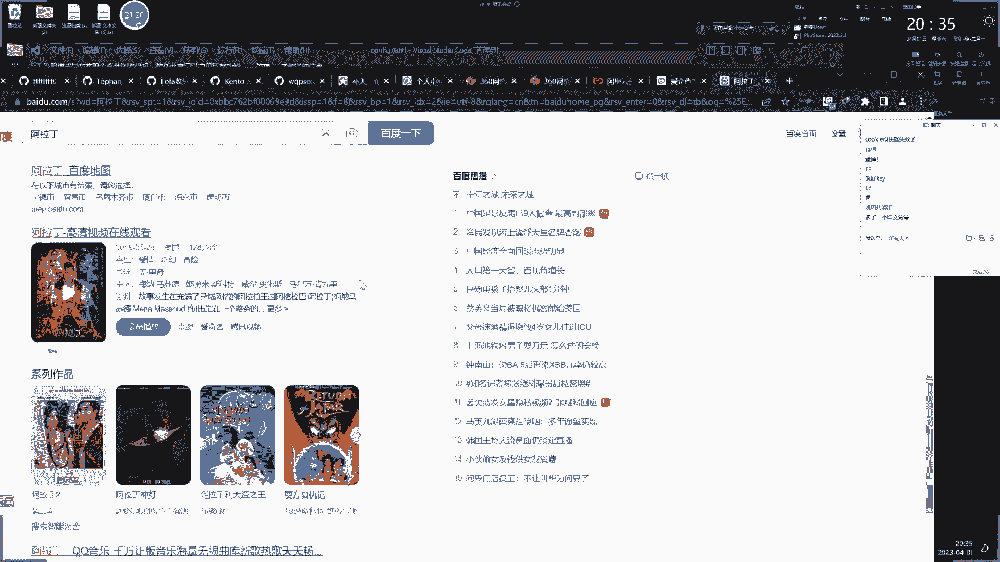

这里的这里的这个阿拉丁先登录用户，然后呢也是一样，刷新一下这个网站，把它cos取出来，先登录用户啊，你不要用户不登录cos的，取出来，放着来。

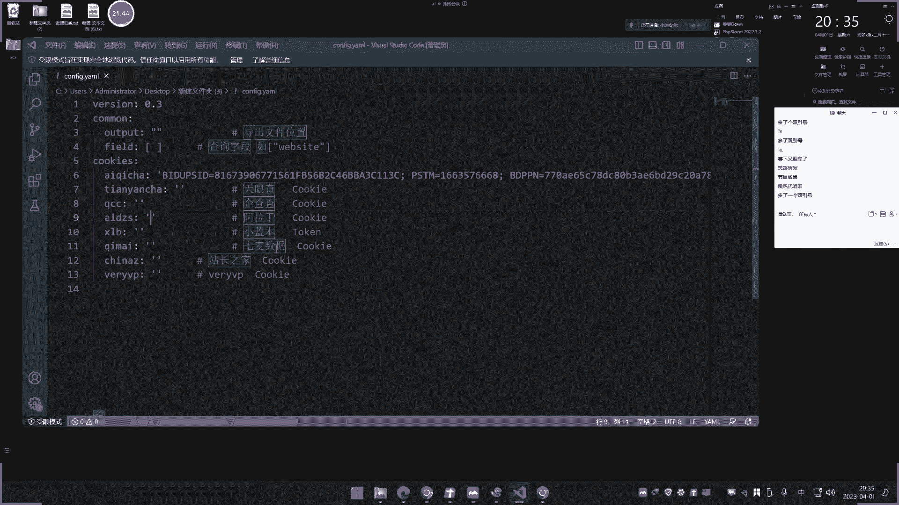

小老板小老板，那是获取TOK啊，这个不一样。

多了一个引号吧，哎翻啥车呀，我们我们这个配置呢，大家自己下去，他登录的账号，我不是说翻不翻车无所谓，你自己能看到查哪些星系就可以了，你何必要计较那个星星的那个那个全面性的，全面性。

就是你自己配接口的一些事情嘛，那脱口就这个字嘛，来来那就这个值，就把这个拖影复制就可以了，不用复制整个cookie，然后在后面背住了啊。

那写进去不写，还有这个什么奇怪数据是吧，也要配置一下，因为他每个都查的数据不一样啊，他没有点点啊。

其实点点比这个起码要好一些，登录账号也是一样。

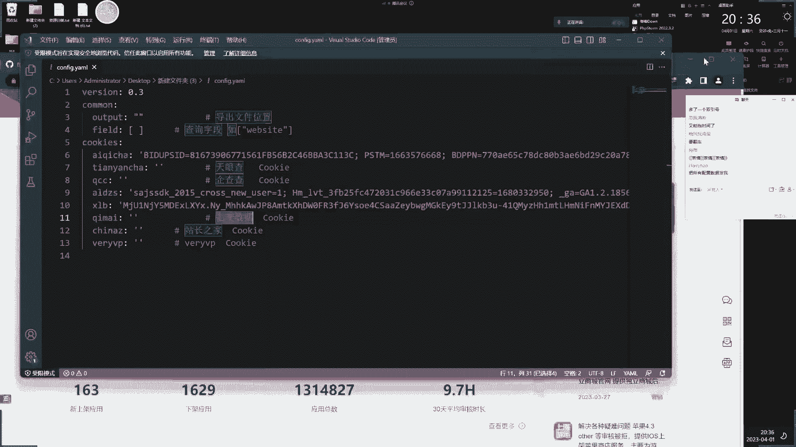

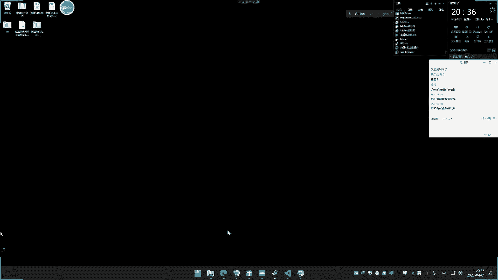

然后找一下这个哎。

然后找一下这个这个奇怪的这个cookie，这个无所谓的啊，你这个配置一个错也没关系，就是你如果要追求准确性的话，你自己配置啊，其他我就不配置了，你这个站长之家呢也可以配置一下站之家。

就是查那个什么备案信息啊，那些东西的。

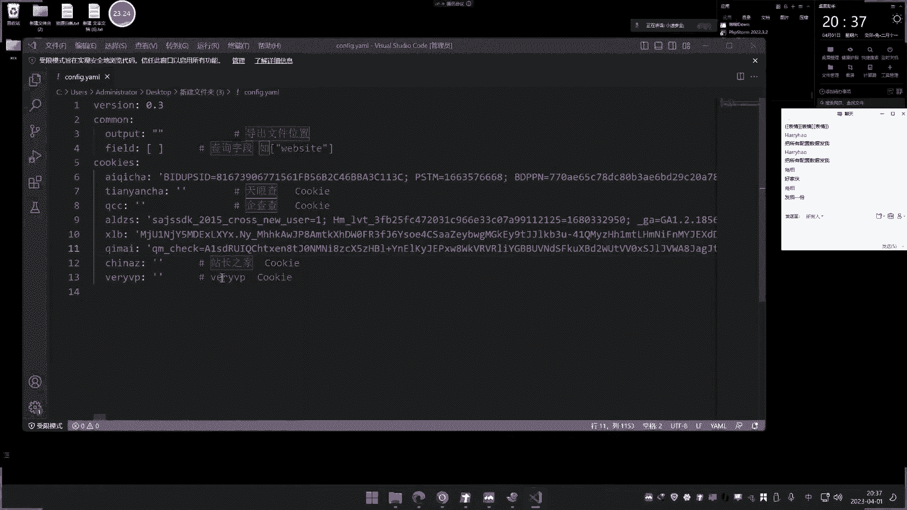

查域名的一些东西暂时压的，你可以看一下。

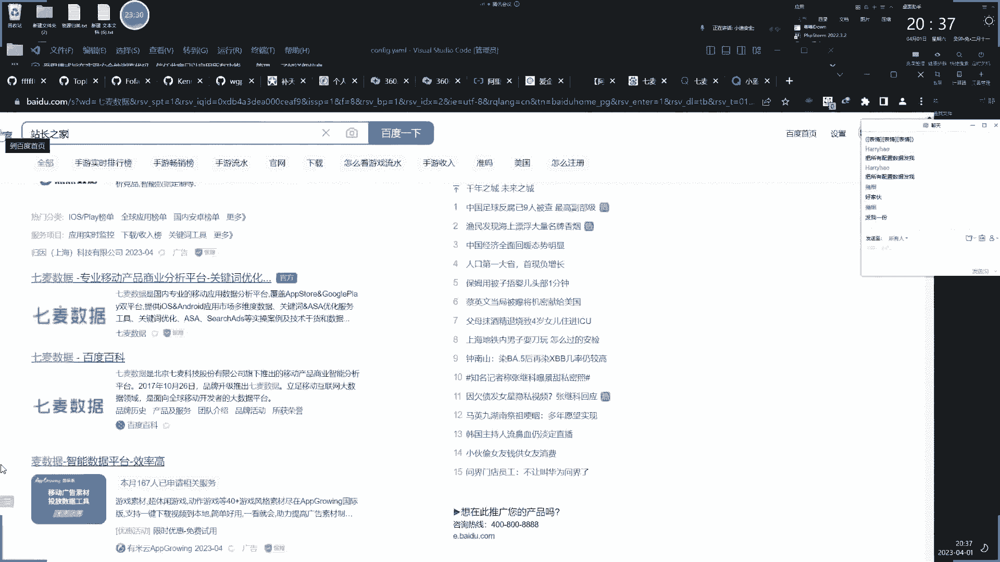

就这个啊也是登录用户，登录完之后再刷新一下。

这个无所谓啊，我怕有些人我这样不配置呢，他自己还不知道什么配置啊，看把它录下来，放好其他的我就不配置了啊。

就配这几个好，那现在呢我们就给它运行一下啦。

看一下有什么效果啊，它的使用方式呢怎么使用呢，你可以看一下官方的这个项目介绍，索命啊，来看看他的一个解压使用哈，呃什么感恩是吧，查询的信息，那我们查询一下，比如说我针对这个补贴上面那些公司啊。

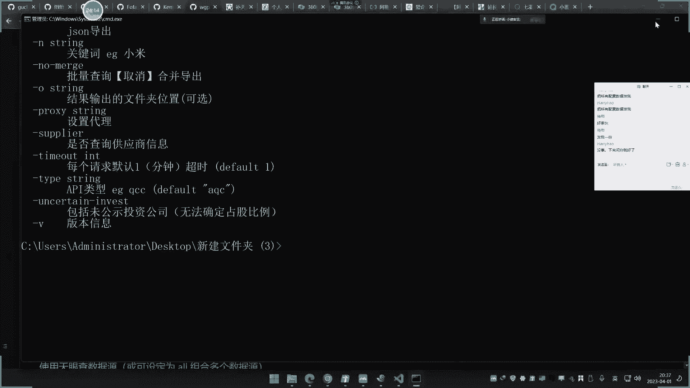

或者是这个企业啊对吧，做一个这个分析啊，比如说这个随便找个公司名吧，嗯T字，北京汽车信息有限公司是吧。

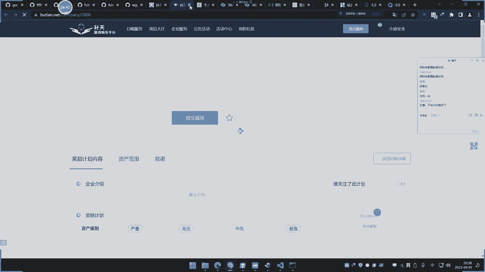

随便搜什么名字，搜公式，整个名字也行，搜个单个名字也可以，他这也能找到啊。

港人加上公司名回车好，他开始查了，好在查到的企业信息好好，他说导出来了，我们看一下啊，导出结果在这里打开。

看什么东西啊，哎打开只有一个什么东西啊，呃一个法人的电话联系方式和这个什么邮箱，然后注册资本啊，没啦，再看下面嘛，那bi信息app信息没有了，他还有没有其他信息呢。

啥情况只有一个吗。

我看的话不是啊，来再看一下其他的啊。

比如说华族基材，好开一下。

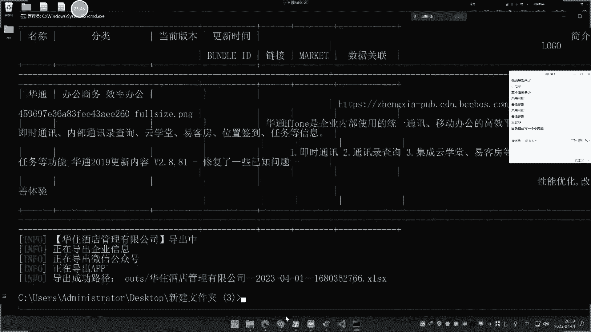

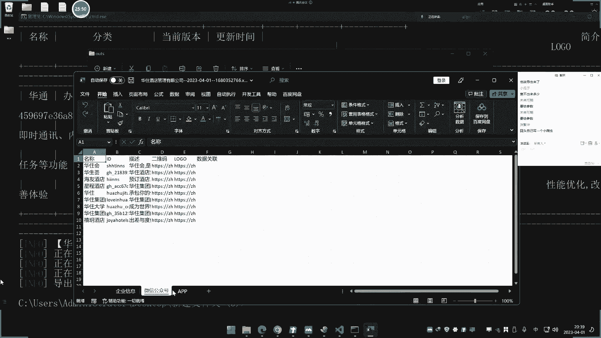

来这是域名信息app信息格式信息啊，然后这是我之前查的呢也是一样的。

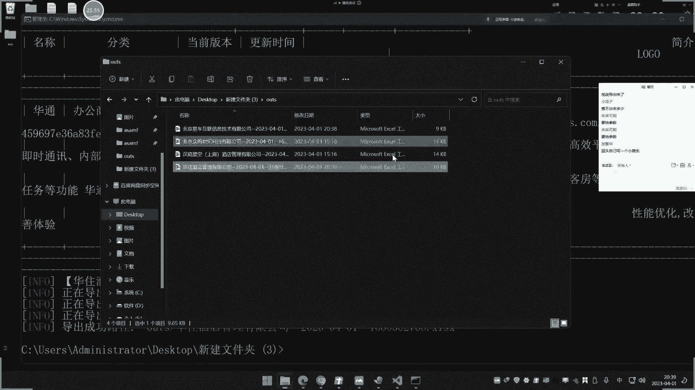

汉庭的。

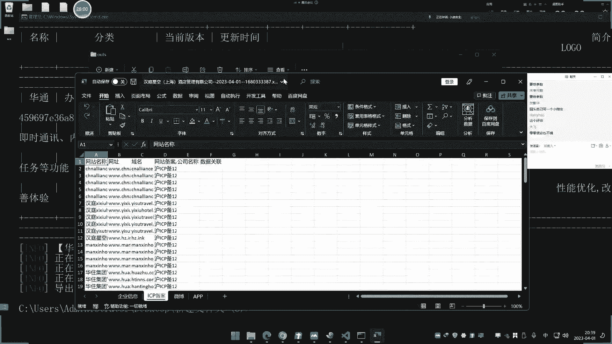

这是网站备案信息和域名信息，企业信息，微博信息，app信息没了呃。

其实它上面呢有一些这个信息呢，他没有导出来啊，你看上面有些人，尤其它没有导出来，其实说白了啊，这个是和你那个接口的用户的一个信息，相关的啊，这个是和你这个接口的一些用户信息相关的。

我那个接口呢都不是会员，所以查的信息是有限的，你要是说你是会员的话，查的是要更多的啊，我上面都不是会员，都不是会员，都是普通用户。

所以说他这个信息查的少了是正常的啊，你这里面可以再试着去查另外一个啊，比如说这个子弹满。

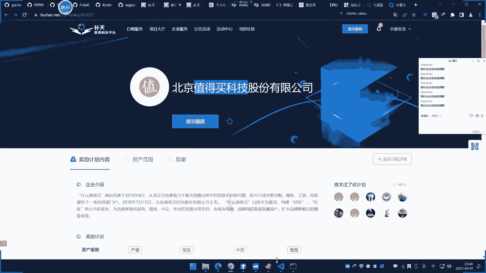

太贵了啊，他这个星系都要花钱的，你知道吧，他不是说那个你看这个呢倒数的值得买。

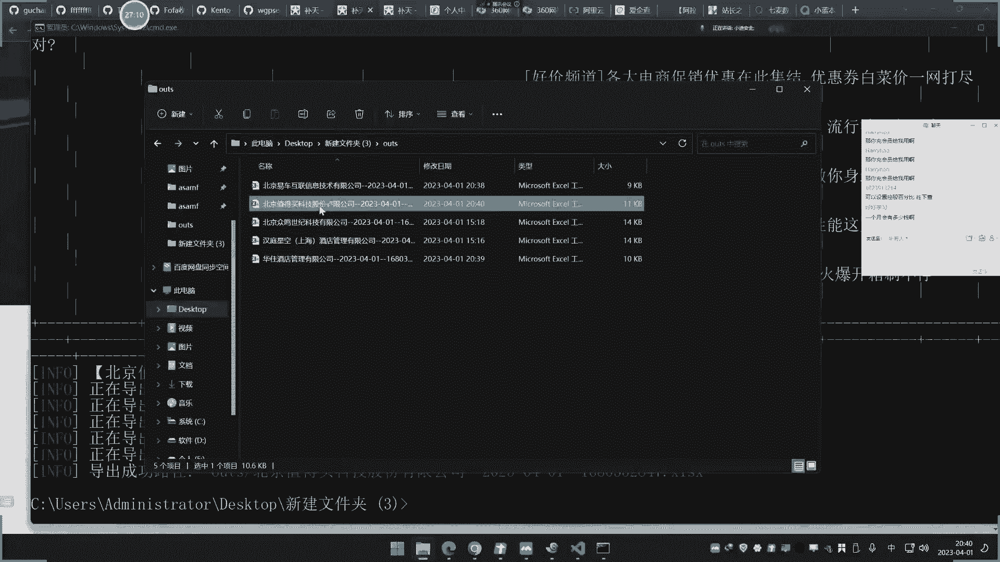

企业信息CBBR信息，微信公众号信息，那这四个微信公众号，app信息，微博信息一个。

然后像我们前面这个其他茶的也是一样。

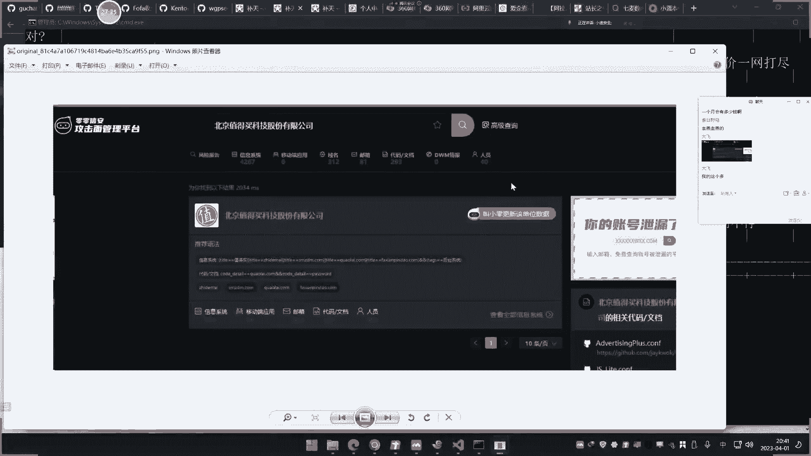

一样一样的啊，这个呢就是用工具呢自动去提取的。

一些企业信息，因为这个企业信息也没多少啊，我们主要就是把他的一些什么其他东西，再提出来就可以了啊，好那是这两个项目啊，一个呢就针对这个细查信息的查询，还有一个呢是针对这个网络空间的数据的导出。

还有呢就是我们说的综合类了，那就是关键的两个项目来了，一个呢就是我们说的这个AAR灯塔和格莱姆，上期呢我们讲的是水泽呀和那个什么啊，坤舆，但那两个项目呢说实话没有更新啊，也用起来很多bug也不行。

所以我们强烈介绍用这两个项目，这个项目有什么作用啊，看一下项目的答题呢，我们等一下呢上完课之后有时间了就给他讲，没时间我们就只能打下去，再给大家录个视频打了，我们先看这个灯塔的啊，搭建已经给他搭建好了。

我们先用用完之后再说这个搭建问题，这个是拉姆，然后这个灯塔这个灯塔已经讲了一期了，然后他具体这两个系统有什么作用啊，给大家来看灯塔的呃，我这里呢给大家看一下。

我随便在这里找个补贴的这个测试目标。

是吧，我在这里随便找个这个收集的一个信息啊，比如说我们在家随便搜一个这个。

找一个网站啊，先找个网站，这个是他的网站对吧，来我们可以收集一下啊，来点击添加任务，任务列表写进去，最好不要加3W啊，再加三份，然后随便取个名字，就叫这个补贴的一个这个测试的SC字典呢。

包括那个域名的是吧，然后呢扫描类型的可以选择传档口或者top签，没设置啊，然后在服务区别对吧，勾选一下，这都勾选它的功能呢，就是集成这些功能都给我选择，点击确定好。

现在呢他就开始这个进行这个相关的操作了，就帮你进行这个收集了，然后呢，这是我们提前给大家收集好的，一个SDCMS的一个CN，这个是也是补贴上面的一个项目，就这个嘛成都的一家公司。

就这个深度网络科技的公司，既然收了，大家看一下他最终的结果，再看那个目标，就那个刚才已收集的啊，已收好的，我看一下那个收集好的一个结果会有哪些东西，这样收集之后的一个结果，大家看一下啊。

首先它会从里面去police沾点，并且把截图截下来打开看一下啊，那这是截图发文的这个域名，还有一些这个地址是吧，信息呢，这是域名信息截图了，十几个相关的子域名访问的一个截图界面，在这边子域名。

这是他收集好的子域名，收集好的子域名和对应的IP地址，对吧，然后呢还IP地址涉及到的IP地址及开放的端口，对应的玉米，然后呢判定是不是CDN后面有CDN，CDN没有，CDN就不是CDN，对S2。

增速就是它增速的一个地址和增速的信息，开个服务开放的一些常规的一些服务，IP地址服务对应的是哪些，可以看一下，那有些是什么这个不同的服务是吧，啊自己看一下好了，SH服务的app服务的是吧。

常规的一些第三方服务PS的文件泄露，它会自动帮你去扫这个上面子域名，泄露一些地址啊，比如说这个地址呢有个403啊，这个地址是一个会员登录，这里呢还有一些其他的呢对吧，你可以自己去翻译一下呗。

然后再是幼儿信息，就是这里少了一些特殊的地址，用常规来爬虫爬出来的一些育儿地址，还有一些风险信息，风险信息的，就是他自己呢没有勾选那个漏洞扫描，就说它是一个打点的极简单的一个漏洞扫描。

但这个呢说实话这个一般都是少的话，这个勾选一下，那扫这个风险，那就是碰运气了，因为这个不可能说你用这个东西扫I漏出来了，不先死的啊，C端的IP地址上面那个C端信息，然后呢这个是LOQUY。

就用这个NC n u c layer，这个是一个漏洞扫描工具，他去帮你判定可能存在的安全问题呢，Cv1201，但这些只能说作为一个参考，究竟有没有呢，这个不是确定的啊，他只是说少了这里的可能存在。

包括一些这个点，用这个level，然后指纹是吧，那P1P的java的接口，中间的有哪些啊，这个呢以前他这个老版本的功能相对较多，后面呢他把这个功能还降低了，你像这个什么少风险的和这个扫指纹都降低了。

你看指纹管理他这里没有，就是说你可以自己添加指纹，就是把那个指纹呢添加上去，比如说识别CFS指纹添加上去。

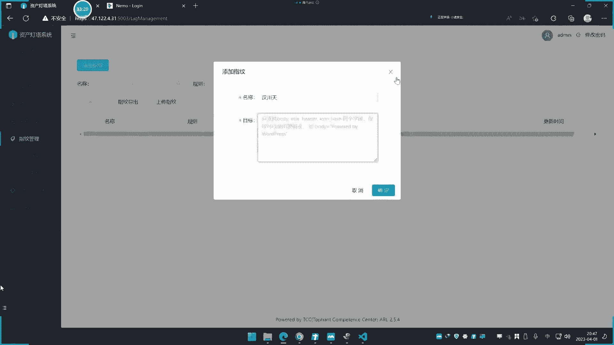

他以前都有自带的，后面他把他换了。

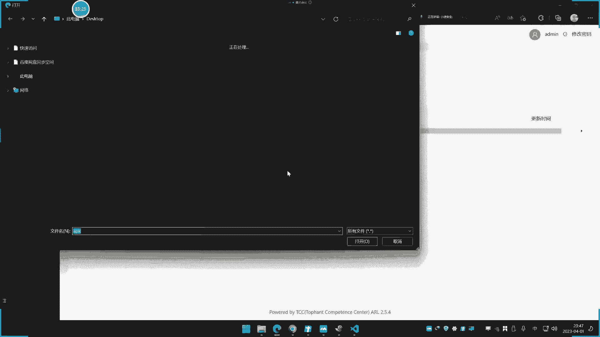

为什么呢，因为公主呢考虑到这个危害性，后面的这些东西都是需要的，比如说POC的是吧，你可以把这个POC的呢一更新是吧，根上去了，那就是检测一些常见漏洞的是吧，那么你更新之后呢。

你再去对它进行这个任务添加的时候啊，那个POC那个把它勾选之后呢，他就会对它进行一个PC的一些测试啊，这是一些常见少一些弱口令啊，和一些这种未授权访问啊是吧，还有这些常见的东西啊。

嗯还有一些这个像指纹这边也是一样啊，你要添加指纹，这个呢他把他删了哈，所以你要在网上找这种指纹呢，把它填上去，那么就可以自动去判定是什么cs啊，是什么程序了，包括这个策略也是一样的。

你可以新建几个策略是吧，比如说POC的把这全部勾选在路口里的，包括尾巴全部勾选资产组的，不用管它，那这两个一勾选全选，全选的意思就是说我直接全选了，反正意思呢就是按照这个策略来进行查找对吧。

然后你扫的时候呢就可以按照那个策略了啊，呃这边呢我们看啊，他现在还进行到这个POS杆装弹呢，还在扫端口，就我们刚才那个目标，他还在扫端口，至于名单已经跑出来一些了。

这个自动收集的项目IP地址还没有跑出来，还在跑啊，这些其他信息还在跑，U2信息跑了一些，他还在跑啊，现在还在跑，啊风险任务下发，就是我刚才说的那个测试PC的，点进去点风险任务下发。

然后把那个策略写到那个模板里面去，然后他就开始测那些PC，但这个呢就是我们说的啊，这是属于不是属于信息收集了，就是说通过信息收集了再去打点的一个操作了，但这个那就不是我们现在课程所讲的啊。

这不是我们关心的，我们就说先收到信息之后呢，后面事情了再说吧是吧，所以这个供这个平台呢它不仅是一个新收集啊，它还有一些批量的漏洞检测，但是说实话这个漏洞检测呢，只能说作为一个参考吧，真正用起来的话。

说实话效果不怎么好啊，因为它这个漏洞有些比较老，再就是有一些漏洞的判断逻辑，有些问题可能会存在一些误波，他不是一个专业的这个漏洞测试工具啊，它只是一个星期大的工具，其他功能做的不是很好啊。

然后这个是这个灯塔啊，这个灯塔呢它的功能呢，大家可以看到这个效果啊，而且他有个操作，就是你自己要去下单，下这个任务的时候呢，他不能写这个一点点CN的啊，而且不能写GV的，它屏蔽了他以前都可以的。

后面拉到屏蔽了哈，就是那你点确定的不能包含一点点CN，就是个学校的，然后再说非得C他也是考虑法律风险，然后它的使用也是用docker搭建的，我们给他用一下这个lemon，总结来说。

NEO呢要比它的功能要更加强大，我们来个看一下NEO的这个使用，那么就这界面啊，那是刚出来的产品，然后我给他用一下啊，他该如何用，所以用的时候呢，我先把它重置一下，先重置一下啊。

重置之后呢才能更好的从零开始啊，先把它当掉，先把挡掉啊，先把它当掉啊，先把关闭一下，再重新开一下，因为它里面有些配置呢，我要给他重新配置信息，它里面有些小bug的产品都会有小bug，你稍微不注意。

你就不会用，然后它的默认装密码呢。

默认装密码是多少呢，嗯什么情况。

然后默认加密码就是lemon，密码也是NEMO，密码也是lemon啊，这个烟怎么怎么看都看不懂了，烟怎么写的，也是搞这么复杂，好进去了嗯，然后给他用一下啊，那些都是零的啊，首先呢这里点配置配置。

这里呢有什么fu hunter roy和challenge，啥意思啊，这不就是我们那几个接口啊，它的功能是什么功能呢。

我们可以看一下官方的一个介绍啊。

是一个自动化收集平台啊，你可以用它来实现IP资产定位，域名资产定位，指纹信息定位，API接口定位，POC验证，也说他还有带漏洞验证，用的是这三个平台，XAY就是一些漏洞扫描工具，分布式任务。

团队协助等其他呃，那么这里呢提供这个foo park和图，也是我们常见的使用了三个网络空间，也就是说用它也能帮助收信息。

但是你要提供相应的K把提供一下K加进去，然后配置的时候呢，配置完之后还要进行这个验证，否则的话可能会失效。

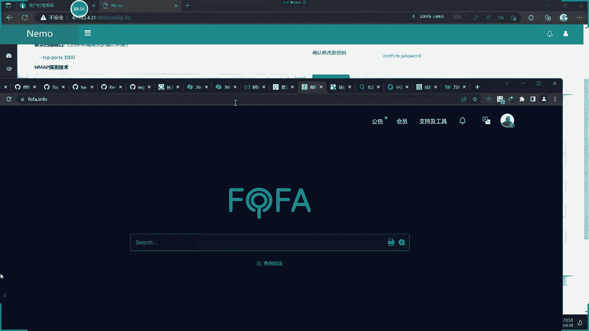

妈的这个图好像没几分了，用不用，估计都难了啊，没几分了，这个音图的，qua qua还有积分，还有没有几万刷新一下诶，小伙子还没有用啊，还没开始倒，他倒了之后，我这个疾风就没了，小伙子还没倒啊。

小伙子还没到，好点击保存好，保存成功，然后点一下测试API，点了之后需要等待一下啊，他会测试一下这几个配置的东西，对不对啊，没有配置，这个配置好了，提示成功了之后还会有一个问题，如果你不这样去搞的话。

你使用起来就会很麻烦，这都是我前期帮你踩过的坑，这才八个bug呢，在他的官方那个项目里面也有提及到啊，我们先等待测试环的返回信息，这车要等一下啊。

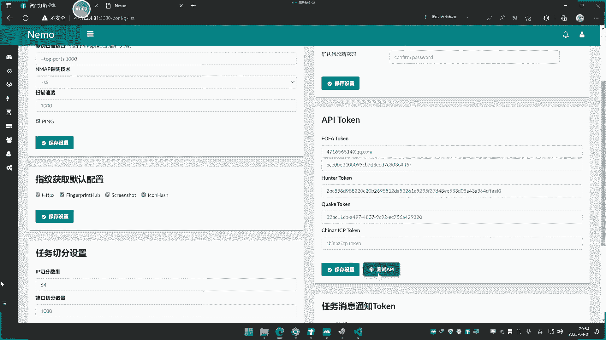

然后你看这里有个提示，别人提过一个问题，这个平台的一个东西啊。

就说你要用到这个这个东西的话，用这个AI接口去查信息的话，那么你就必须要注释他啊。

他说了，ok ok hunter呢，fire为什么hunter fire，因为我没有几分呢，所以我现在只能用fl和夸克好，你这样子搞了之后呢，你去搜信息，比如说搜IP地址信息啊，我点了一个天天任务。

我针对我的IP地址呢做一个信息收集是吧，比如说针对某个IP地址的重新收集啊，来把它写进去，那在那集成FO和夸克，hunter呢，由于没有用了，我勾不勾无所谓了是吧，来把它勾上去把盐。

然后这边可以使用的调用map帮你自动扫描，我们就可以加一下Buff呢，你不够他也行，漏洞验证这里自己根据需要啊，就说你如果说你要进行漏洞验证，可以勾选这个差别以外和这个，那它会自动扫漏洞。

还有这个d i r scar，就是我们说的那个扫目录的，还扫描加这个探针，这个这个我们不管它啊，我们现在用这个信息探针啊，这个漏洞这方面那不是我们现在关心的事情，那把这里的勾引上之后呢。

我们点击开始任务，管好它，新建任务完成，那么这里呢我们就来看一下啊，这就是它的一个运行的列表了，现在正在扫描，我们可以点进去给他实时关注到这边的进程啊，那他利用POSTA，利用foo去搜。

利用这个夸克去搜，用hand去搜，我看一下啊，好这边呢，用这个post can自带的扫描出一个IP和端口，三格信息已经返回了，好看啊，FOFO已经成功信息，没有夸克已经成功信息，没有啥情况。

boss配置吗，为什么没信息，然后呢，你在这个IP信息这里可以看到它已经完成了，然后你打开看一下来自张IP信息啊，收收集到端口和他的一些这个他各种的东西呢，503开回了灯塔系统。

帮你逃出来的一些资产体系，你在这里已经帮你写出来了，然后这个界面都帮你写出来了对吧，因为我上面也打点灯塔了，还收集到五三端口开放了灯塔是吧，就是我们那个刚才那个演示的嘛，但这信息呢还不全，为什么不传呢。

因为他没有调用这个FO去搜搜集IP的啊，因为我可以看到这边呢这个运行这边呢，他已经状态in section就是完成了，否否这星星呢他只用这两个呢去召回了信息，就刚才两个星星呢，刚才那个信息。

就是这两个用户去把它设计过来的，foo和夸克没有起到任何作用。

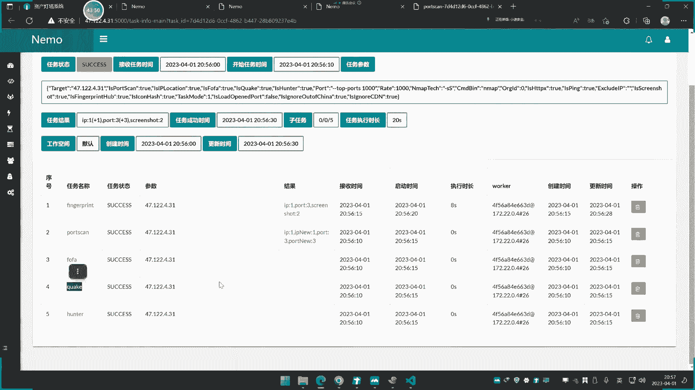

为什么是因为它有bug啊，这个项目有个bug，有个什么bug呢，我不讲，你是不知道的啊，我看一下这个有人提出过这个问题啊，他说了否否收集域名的bug，就是别人已经配置好了。

就是别人用这个项目已经配置好了，测试了这个功能呢都正常，然后呢，但是这个数据呢没有任何显示，他说要在这个什么VR里面重新配置。

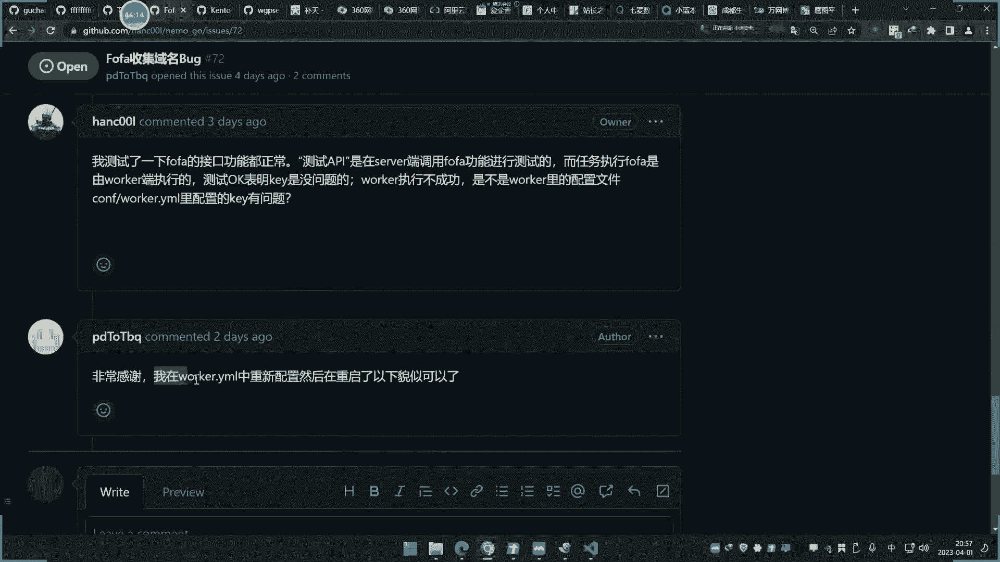

啥意思啊，给大家说一下哈，就是你这里呢要在你这个项目这个目录下面啊，重新配置一下，然后再把重启就在这里啊，在这个目录咖啡目录有个叫沃克在这里。

然后在这里写上你的这个什么full cooking foo，的那个配置信息，写到这来。

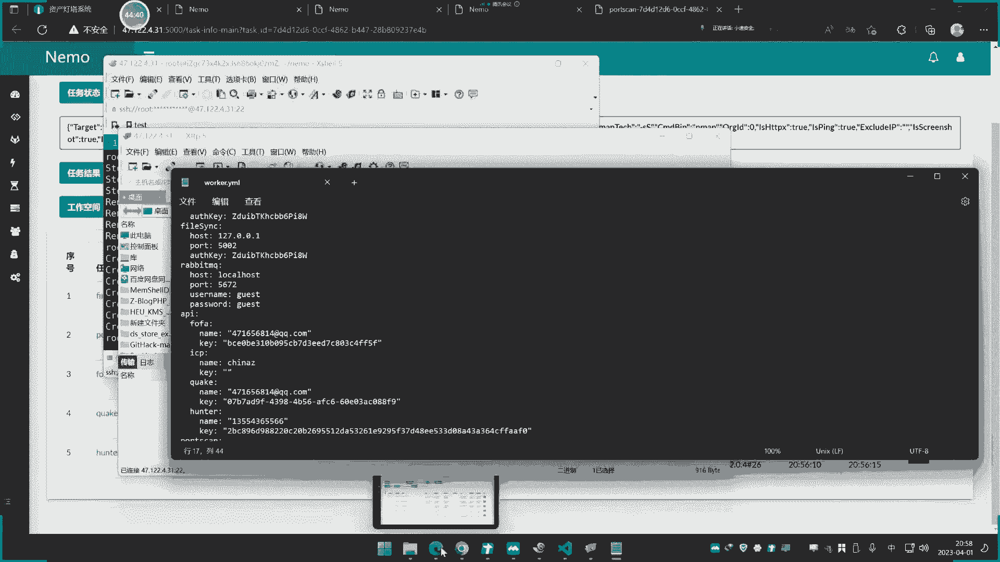

然后重新再启动那个东西啊。

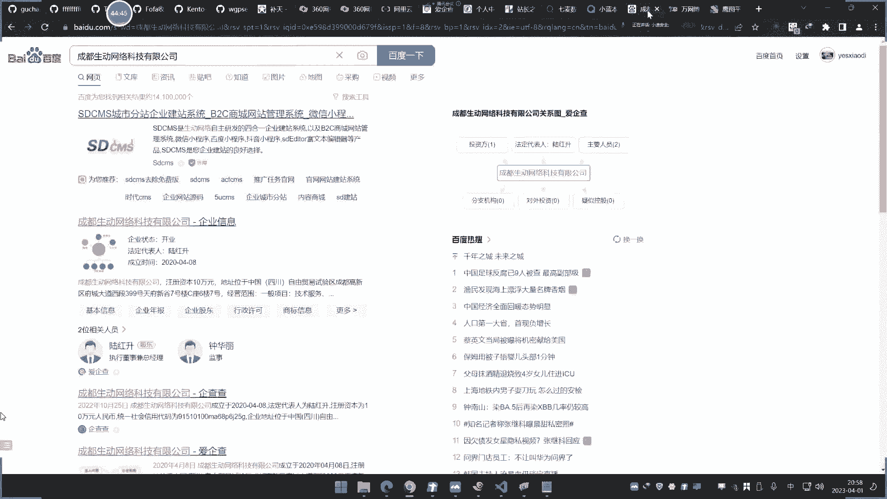

复制一下，放下来好，在是这个夸克的。

刷新一下，还是夸克的啊，对吧相许啊，好再写上去，那么它保存好，重新呢把它关闭再启动，就是你配置好了一次呢，还要配置一下，在上面配置它不起作用，我后面测了一下啊，否则的话你就只能用官方的东西。

它就不集成这个网络空间的自带搜索，就是他的比灯塔的更智能，他加上了网络空间的这个信息，就是信息的来的是跟职业的啊，好重新启动一下好。

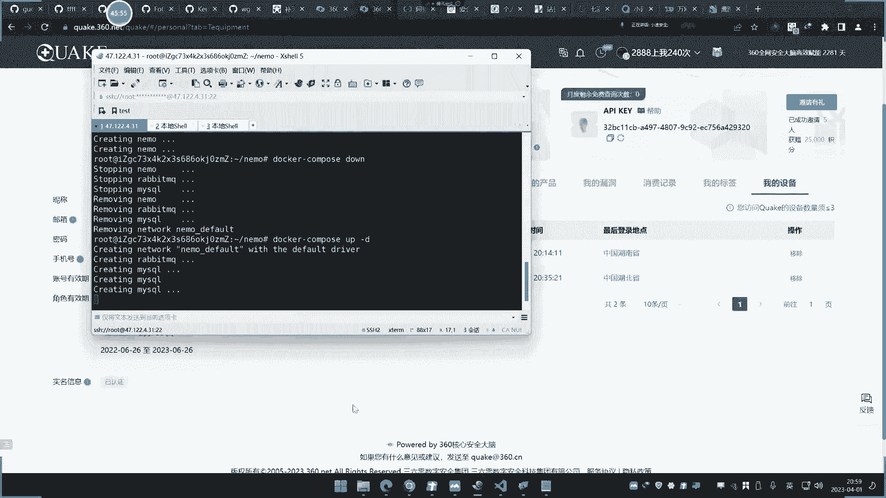

我们再来刷新啊。

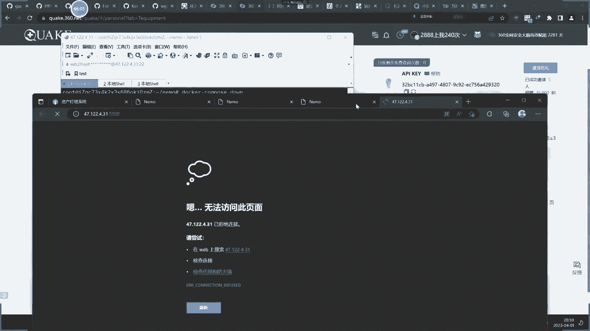

好重新登录，现在为空了是吧。

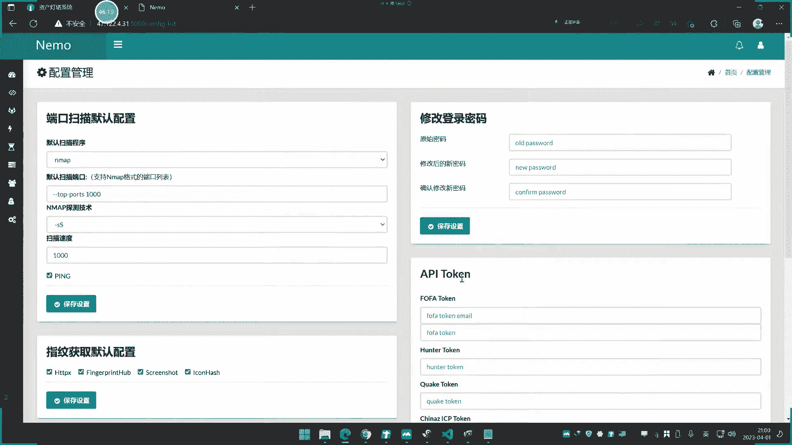

好看啊，我现在就先只测试一个foo啊，只是个foo的信息。

好我们来现在来来再来测啊，再来设置一个IP，比如说我们测试，我们之前那个阿里云那个IP地址，对它进行收集，这个是针对IP的，然后再把否否勾选到啊，夸克了，勾不勾都无所谓了啊，勾都勾吧，点击开始任务。

好我们看一下它的运行动态啊，看着这边的一个结果啊，好现在正在运行，用它自带的这个port skt和FO和quark和hunter，好，现在呢你看这个FO呢又没有信息，看到没，FOFO又没有信息。

我不陪着吗，他妈的bug真是多啊，你看有没有信心呢，发挥在这信息没有啥情况啊，再给大家启动一下，重启一下，他这个bug呢我后面车车它的时候呢。

呃因为他没有这个网络空间信息，这个信息是比不上这个其他的啊。

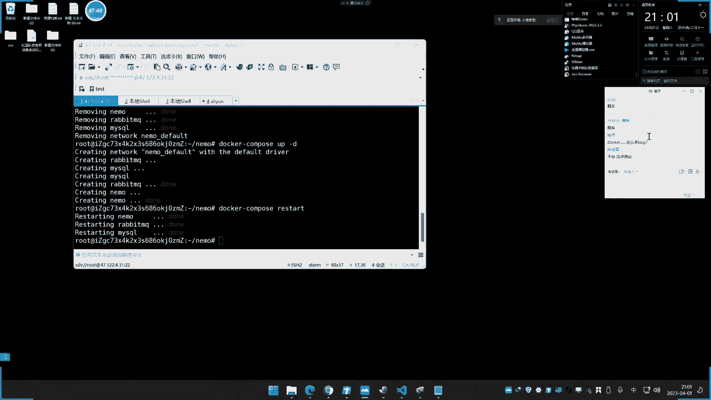

所以我们必须要把这个解决，494735，好好升五吧，好那我们再来试一下啊，因为他这个信息呢全部都是这个来源的，全部是用的是这个在哪里啊，全部都是这个官方的，然后我们在这里呢重新来看一下啊，重启一下之后。

重启一下之后啊，看一下这边的占用丰富，来帮我再扫一下，看一下现在的情况，看有没有丰富了，这刚才下的病毒好看，这边啊，好看没，FOFO有数据了啊，那foo有数据了，看到没，foo平台已经讲什么。

你看FO有数据了啊，你看现在的信息它就不一样了啊，他就明显要多了，那你看这否否少数信息，他用他官方的这个扫扫了两个端口IP。

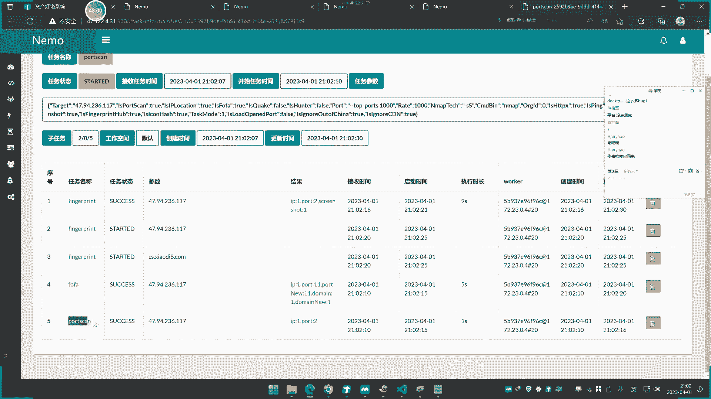

一个你看这少11个端口，一个要点进去看一下了。

这是他信息，然后呢，你可以点击点击这个IP，是在这里可以点进去看呢，是不是比刚才多了了，用否否搜出来的信息也集中到里面去了，点开然后包括这个呢是在foo来源呢，它的这个内容标签嗯，FOFO的奶奶信息。

这里开个尼拉斯来FOFO来源信息，这里拼拼搏嗯，这上面还有个8081端口，是一个JSP的，8080端口是一个net是吧，他信息就是更全的呀，对不对，然后里面还涉及到个什么cs，小080com的一个情况。

对占领标题和一些信息。

那真的域名呢也是完全OK的，一个真的域名进行扫描啊。

我们也可以把夸克信息呢把它弥补上去，把夸克信息的也给他写上去。

夸克十个。

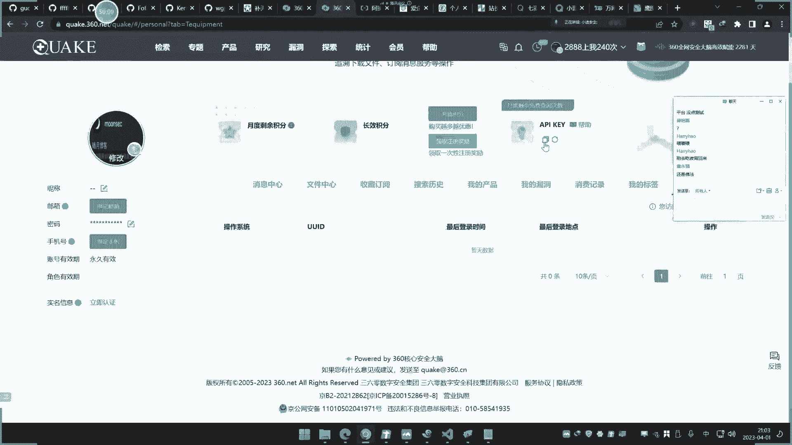

夸克的啊，他想去。

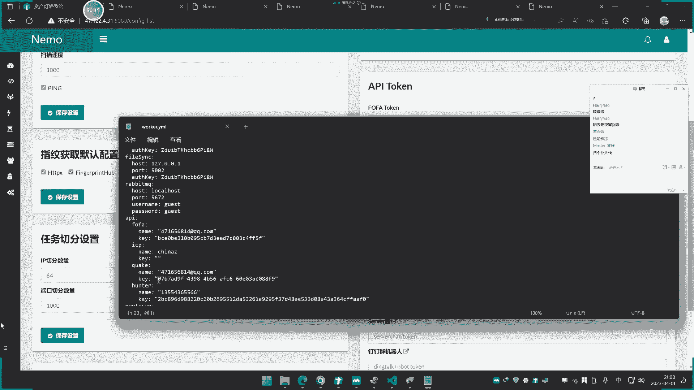

换个鞋子来啊，点击保存，然后再来重启一下啊，修改时就要重启一下，不然它不能生效啊，就是那个环境容器下，因为你有这个网络空间了之后呢，你搜的信息就会跟传啊，你搜的信息就会跟全知道吧。

否则的话你的信息那就只坚持，只接收到那个工具一些判断出来的东西，它就不会有了网络空间的数据在里面，比如说我收玉米啊，大家看一下啊，我收玉米，我就拿我刚才那个学校来讲去搜一下啊，在这个补贴上面呢。

这边找个学校，来我们找一个，找个域名啊，这是这个域名是吧，我对象，一个是IP地址的一个资产，然后呢还是运营资产，两边都可以同时进行，它会自动到那里去，点击一下天天任务，把玉米写进去。

勾选full park hunter了，勾勾选都无所谓，这勾选IP进不进行扫描，把勾选一到C端，少不少无所谓，漏洞我们就不验证了，点一下这个开始，那它致死一流的好，他就开始了，我们要关注这一面呢。

这个它的一个进程点击一下进去刷新一下，看一下他的任务开始，利用多么干域名扫扫描状态，然后呢否否去扫夸克去扫好，他现在正在运行中啊，我们就等待他的信息，然后呢有信息的话就会在这边显示IP地址的，正面显示。

现在都还没有啊，我们可以稍事等待啊，这里就是只等待即可啊，等一下再来看，我们来看一下刚才的灯塔，应该数据应该差不多了，TG的那个东西到现在还在搞这个还在搞啊，还在跑，我们看一下啊。

他收集的信息呢自动化一些信息，收集到这个域名的一些界面，然后呢子域名在里面，好的子域名分别对应的协议A协议，IP地址涉及到IP地址和端口情况，刚才的这个灯塔的跑了个目标的啊，跑了个补天的。

然后这个啊然后在这个服务的信息啊，这里涉及到的呢某些端口呢有这个服务是吧，这个是MYSQL的，这个是S7的，太拉踩的，文件泄露，那访问一下这里，这个地址上面存在一个PPP开，看一下。

的确是p p info泄露了这个目标的一个，然后呢，这里还有一个come on jackson。

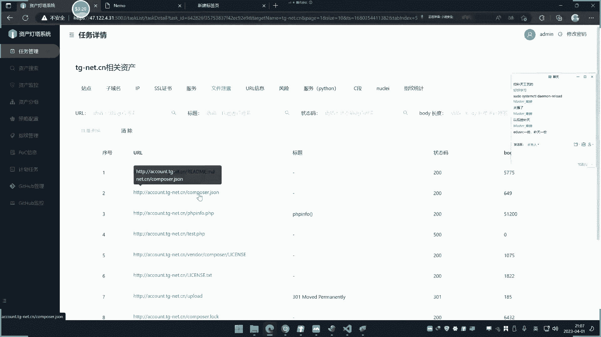

这不是我上期讲过源码泄露那个东西嘛是吧，那泄露他是新的PP的，这还有这个作者的信息，包括使用的是新的app的源码不对，那我们前面讲那个信息楼那个敏感文件吧。

这个是泄露源码，然后还有一些文件也不知道是啥，对不对。

That is ame。

后台还有这里有个编辑器啊，这个各种各样的VAPI接口data的数据对吧，这里有个疑点，JSB啊，这个就是一些常规的一些这种，敏感文件的一些地址啊，找到的育儿信息少了一些常见的育儿，这个不用管它。

风险不用看服务呢，这还没少，这几个都还没开始搞啊，他还在进行过程中呢，还在搞这个这个好，这边呢我们看丰富，这边应该数据应该有些返回了吧，看这面好，现在还在运行状态中，你看看收到信息呢。

要比这个东西更多的会议制信息，Fighter print，至于名夸克搜到的这quack，收到信息有IP5个端口，是一个来这里有信息返回域名呢有42个，然后在这个否否否否，现在还没动啊，还在扫。

然后呢你看一下啊，IP信息已经出现了，在刚才那个学校的，你看到了没看到是吧，现在已经少一些了，然后再看玉米，这里谁知道谁叫玉米子域名，对不对，那是那个荷兰的啊，然后这里呢你这里还有个漏洞啊。

这个还有很多我都没有去讲这个很多功能呢，你想刚才我添加任务的时候呢，有很多没勾选，你看这里啊，它还有什么这个，跑哪去了，来这个叫DIS干，就扫这个字典的呢，比如说扫pp字典。

扫他的后面那个就和这个差不多嘛，测试这个就和这个呢这个文件，这个东西和他差不多，就如果说把这个勾选了，它也会少，然后呢他就是默认这里加载一些PC去扫对吧，都没我没有勾选啊，我就是只勾选了一些常见的啊。

你可以看一下这个动态啊，这是真的，还有运行动态还在扫呢啊，这个夸克信息呢就是这几个，你可以点开一下呢，这是夸克的一些信息，夸克的一些信息，然后这边还在搞这个其他的那foo还没有出来，否否还在搞。

所以都需要等待就可以啊，等就完事了，就等完成之后呢，你看结果就完了，就是说这两个都是一个自动化的收集平台，都是一个自动化的一个收集平台啊，它能够帮你快速的去了解，这个目标的一些常见信息。

但是花束回来了啊，他这种收集呢其实怎么说呢，只是适合我们这种批量的啊，能够做到目标较多的时候呢，快速打点的一个方式，实际上呢他这里收集的话肯定是没有，我们说单个单个收集呢要准确，获税，要全面，啥意思呢。

就比如说拿这个子域名，这个这个收集来讲的话啊，呃可能商可能是他调用的这个平台和工具，去对殖民去挖掘，和你自己手工去操作的话，它会有不一样的结果，造成这个结果呢有几种原因，第一种原因。

那就可能是他用的一些工具都没有你用的好，这是一种，还有种情况就是说有一些功能的话，它是要取决于我们说不是配置那个什么接口啊，那些东西吗，对不对，所以说你用这种快速打点，这种自动化的这种平台和系统的话。

它要比你手工呢可能信息要相对较少一些，因为你手工的话，你都是用的最优秀的工具，而且是只做那个事情，就不容易去遗漏啊，尽可能是收集证券，所以他这个呢只适合于快速，从大批量的目标中呢是吧。

筛选有用的一些信息，能够帮我们快速的去找到一些脆弱性，你可能会问什么叫驱逐信仰，就是我们说的啊，在这个互网和SRC这个挖掘过程中啊，你要快速找一些容易出漏洞的一些地方，那什么叫容易出漏洞的地方呢。

对不对，其实就是和这个服务，和这个网站的一些这种东西呢有关啊，你就经常浮现某个漏洞化，比如说像什么常见的一些安全漏洞是吧，那你就知道哪些地方容易出现，对吧就是一些常见端口啊，是哪些服务啊。

这些都可以自己去熟的啊，每个都不一样，关联玉米呢，这星星呢是吧，在各种各样的页面的返回标题是哪个地方，哪个地方的啊，对应的什么服务，太多了，他说还没收完，收完的更多，然后呢他也会帮你判断是不是CDN啊。

对不对，所以说你给自己呢去这个，用这个东西进行快速的打理啊，当然大家也不能说拿这个东西的乱搞啊，你看这个平台的系统呢，都已经屏蔽了一流和官方的，所以说这个还是有风险的啊，你不要乱搞。

这还在扫楼洞的这边呢，我看结果这边应该是有差不多的信息出来了吧，还在搞啊，那还在还在弄，哎他妈的这弄到什么时候还在搞啊，他有个底袋，哎呀这牛逼啊，还在搞，还在对这个域名进搞，那FOFO的数据也出来了。

你看这是foo数据，搜索数据已经出现了26个IP是吧，一千五一千五百零八个居民再收集下数据，所以说必须要把网络空间加上去啊，网络空间加上去这个域名的，你看看这里面的就多了呀。

你不然的话你用它的单一的功能，哪哪那么多域名呢，你看看这域名就多了呀，这么多。

好这个就先把它放着吧，然后呢我们这里呢有时间啊，有些人就疑惑怎么搭建是吧，然后这里呢我就给他搭建一下啊，如果说我不把不不把这个答卷交一下的话，那你妹的那简直下去是吧。

像上节课那个某某sf，反正最起码有十个人问过搭建不了，不会搭建，那是真没办法，我把那个视频录出来之后，搭建录像录出来之后呢，还是有人有各种各样的一些杂七杂八的问题，我都没碰到的，他也碰到了。

我也不知道啥情况，反正就是各种千奇百怪的问题啊，你真没办法，所以说我只能说这里要把这两个系统的打进来。

给大家说一下啊，我也不卖关子来我这里，那就直接给他重新买一个阿里云服务器打，就从最基本的开始，再打再打结不了，那我就是真没办法啊，其实非常简单啊，就是自己在使用的时候注意一下诶。

以前的课程我是从来不教搭建的，没办法，因为我觉得答题是最浪费时间的啊，讲着讲知识点，这个答题的你下去就能答，后面发现是我错了，好我先创建一个实例啊，然后阿亮付费使用多长时间，输多少钱。

然后呢搞一个这个两盒死机就够了，然后搞一个这个价格最低的突发性这个东西，然后呢选择这个系统呢，选择哪个系统好一点呢，渗透S或者乌班图，我这里要选择乌班图18。04版本，下一步。

然后上面他自己选择自己的这个嗯，这边还没有主机啊，那换个地区吧，上一部换个这个南京地区的按量付费，选择这个最性能的啊，就是这个最便宜的，下一步，那我这里选择了按流量付费安全组呢，这里注意一下啊。

这个有些人不懂的啊，我的启动起来好，设置一下这个密码自定密码啊，就是你那个系统的密码，把它进行一个配置啊，好购买起来，好那这里呢有些人第一次购买的话，要注意一下有个安全组的问题，就是这里有个安全组了。

这个一定要注意啊，这个安全组，那这里呢有个规则，要把它那个小配置一下管理规则，这里第一次用的话，你没有改的话，他有些问题的啊，啊这个规则里面呢，这里有个啥，我是开着的，点击添加，允许全部这里再写0。0。

就是允许所有端口的方形，如果你不添加的话啊，你这个有些不是有些5000端口啊，有些什么八零端口是吧，它就不能通讯啊，所以说呢我已经添加了啊，来允许全部协议机组是全部协议，全部来源和全部IP地址。

有些人呢就勾选了个TCP啊，有些人勾选了个SMP，然后呢他一直通讯不了，他问我啥情况，这里都配错了，有些人很不细心，一说起来，我就真的是讲了无数百遍的一些事情感，记住这个地方把它配置好以后。

就别再说，到时候你问有什么空白啊，什么访问不了乱七八糟的一些事情。

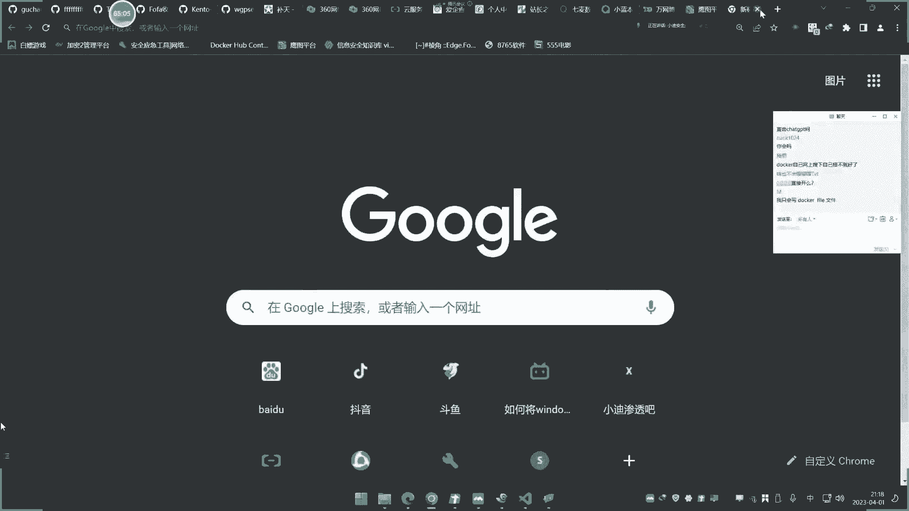

然后呢找到这个刚才买的呢这个IP地址，刚才买的IP地址复制在网上下一个这个插旗啊，这个工具或者说找一个能够连接LINUX的终端工具，这个插线往回收就有了啊，啊连上去，连上去写IP地址，上去进行确定。

名字随便写一下。

嗯怎么连不上啊，写反了呀，哎呀你别说我们，你不是说你，我这有时候有时候都不细心呀，不好意思啊，输入你配置好的账号密码，不好意思啊，刚才是我说多了啊，原来大家都有不细心的时候呀，怎么办呢。

首先先把这个apt杠get update更新下载，这个一定要做的啊，更新一下软，然后呢再来app杠get install安装dr。知道吧，安装dr。好，再来安装dr。gp w cos，把这两个装好了。

然后再输入Y确定安装好，那我等下还会演示那个F8X那个安装啊，等会说我先把那两个环境装好，再来装那个F8X，好这装好之后呢。

我们先来到AR2灯塔的安装。

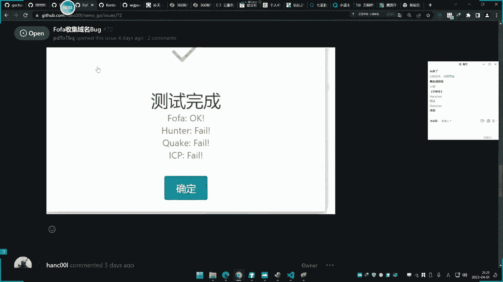

哎呀灯塔的那个啊塔塔在这里，它的安装非常简单。

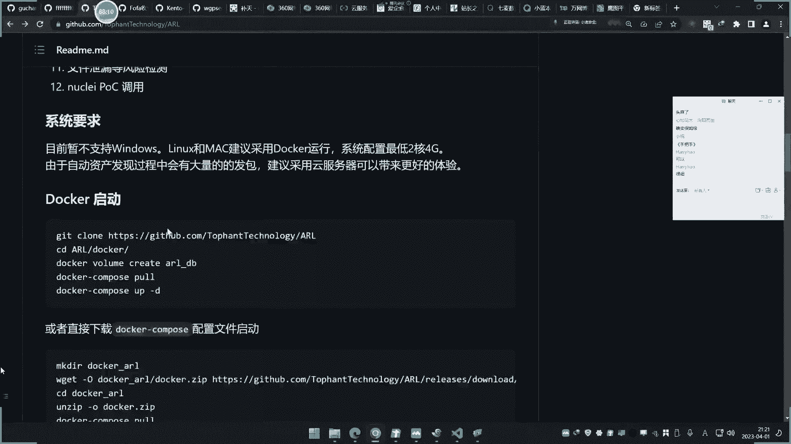

首先去拖这个项目，就按照上面来就完了，做这个项目，那他下载下摸，然后再进入那个目录。

再拉他的机箱，这个多核的就是刚才安装的环境啊，你不按的话，这个多核的运行不了，好拉机音箱好，再来把他机箱拉下来。

好开始拉镜像了，接下来就等了啊，然后呢在其中是吧。

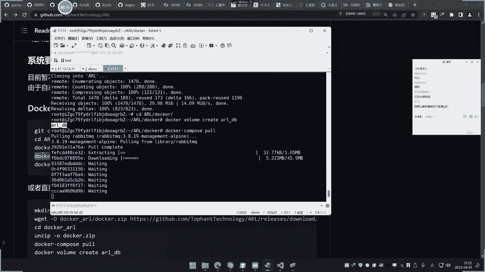

等下就输这个命令，它的使用呢就是访问他的5003端口，默认密码是艾米和a r r pass，然后那个平台的默认密码就是NEMO。

好在等待啊，等他拉，在我没有做任何提前环境准备，自我重新购买的服务器啊，你不要说是吧，你又装不了，那我真是没办法了啊，这是我重新购买了，我在上面没有做任何提前准备，呃你如果说你在你自己的虚拟机搭建的话。

自己的什么LINUX主机搭建的话。

那也操作差不多啊，也操作是差不多的，然后如果说有些问题的话，那一般是哪些问题呢。

什么端口占用问题啊，或者是你有些依赖没有装，最好还是搞个干干净净的阿里云服务器的去装，你自己要折腾其他的，那没办法，那那你自己安装不了，那我那真的是太麻烦了啊，这个已经完成了啊。

好看这边刚才这个任务也没完成，可以刷新一下啊，这个还没完成，那这个任务完成了，你看他的任务呢是一名23个IP，16个证书服务文件泄露VR信息，C端信息，NEVA的一些常见的存在的安全。

可能CV1的东西是吧，指纹的信息，low js有CDN的几个产品，JSP的有几个，java的有三个，有九个，点开看一下，对就是那个灯塔的啊，这两个系统说实话肯定是这个LEO要强大一些啊。

这个LEO要强大一些，因为它还支持网络空间，而且他的项目也是实时的，你看他还在搞，不知道搞多少了啊，这IP都搞了29个IP了，域名都搞多少个了，看下域名都搞了1000多个域名了，这谁顶得住啊。

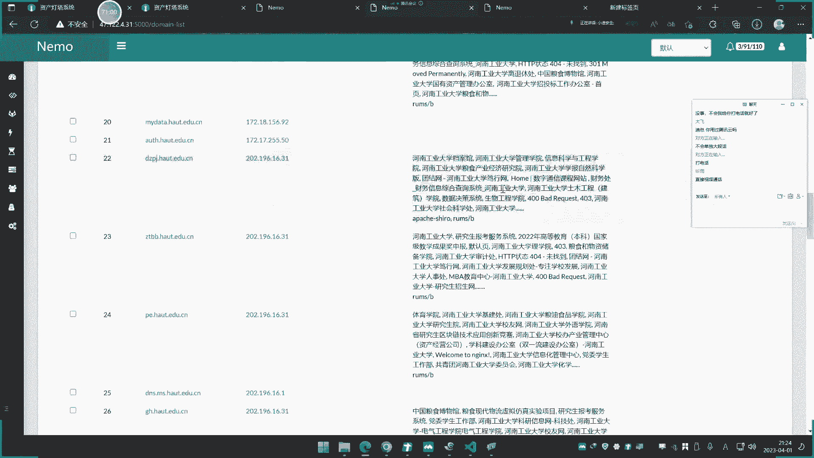

好这个已经把它落下来了，落下来之后直接输了最后一条命令，启动好，等他这个全部解锁成功，然后呢加上IP地址呢，等它完成全部当好，当好了之后来看一下是不是就可以访问呢。

5003多个，注意是HD啊，直接访问，那abs点击高级。

点击继续访问啊，出来了，然后输入word密码，l dma RL pass登录诶。

进去了，这是我们刚装好的灯塔系统已经部署完成是吧。

好再来说另外NEO，那么呢就更简单了。

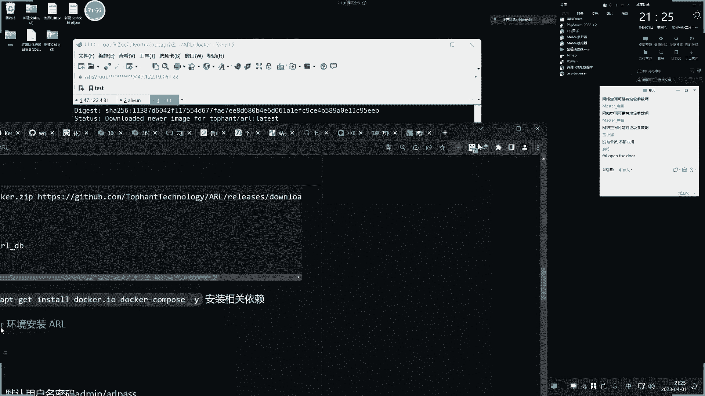

那么是怎么安装呢，更简单了啊，那么的安装呢在这里你能不能，它上面也写了啊，它有两种部署方式，一般就是用临时用一下，就用这个单独用这个用这条命令，再加上证明完了两条命令，然后提前呢。

要把这个tr文件呢给它上传上去啊，这个T2文件在哪里呢，加到release版本里面，在这里要提前可以下一个啊，就在这里啊，他release里，啊就这个这个文件了，就这个了。

那么LINUXAMD把它复制好。

让他去下载，那么先来切换到根目录，嗯先把它root目录root目录，这是刚才AR，然后呢，我为get啊去下载，然后去下载这个路径，这个TL文件嗯，他下的好，他下上去，这个就等了啊，这个由于下载太慢了。

我就直接上传吧。

本地上传啊，用这个上面的这个插件插FTV把它直接拖上去，嗯就是我给他打包好了，这个了，套上去下的太慢了啊，直接自己自己下好，自己这个扶墙把下好了之后再装上去，不用换元啊，因为这个dot，但是用阿里云的。

阿里云有官方的阿里云的那个圆，你用自己的服务器的话，就需要换那个dot自己的这个什么虚拟机啊。

好看现在就有这个文件了啊。

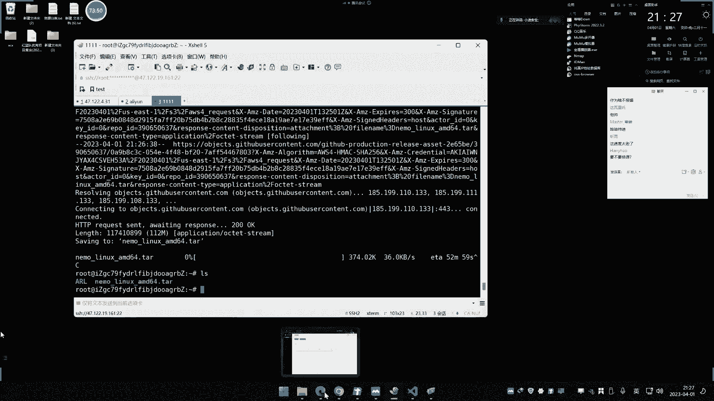

有这个之后怎么办呢，就这两条命令结束，他这个命令就是先创建一个目录，然后再把你这个TL的解压出来，然后再来个这个目录，就这么简单，他先解压你刚才那个上传的文件好，解压完成之后来到这个目录。

然后这个目录直接用docker启动就可以了，就这么简单，启动的时候会遇到变异，然后这里有个提示，你看我不讲，就有些人不知道了啊，提示说这个什么什么东西不支持什么版本，2。23。3啥情况给他说一下啊。

直接counter，他说这个路径嘛，dr。tt或者v i c e c m dr。点com点YM进去，然后这个3。7是吧，把它改成什么输入I切换插入模式，把改成33，然后再EXC是吧。

编辑这个INDUX的编辑用法，大家可以查一下啊，就输入ELLA是先编辑，然后呢输入完之后呢，EXE跳出WX，就是right和cute的一个英文单词是什么，保存和退出好。

修改完之后再重新启动它就不会提示了，把它改一下，改成3。3或者2。2好，接下来呢就启动这个dot的环境了啊，还有垃圾音箱，垃圾箱把它启动起来，那有可能还会说这个多核是什么东西呢，多的是一种金相技术。

就其实就说别人把那个东西呢全部安装好了，打包成一个镜像，然后呢上传到多克的官方，你再用这个多少的呢去从网上去瞎编，您打就好的，把它拖到你本地人行，就和你那个虚拟机镜像是一样的。

就和你的系统镜像也是一个意思，就别人已经做好了，你就直接拿来用，就这个意思啊，他是个容器啊，一个镜像容器，它属于我们人安全的一个支点，我们后期呢在讲人安全的时候，也会给大家讲到，讲一下这个这个这个什么。

这个dr。的一些技术啊，然后这里面可能也会哎呀，这爆红了怎么回事，爆红了，不管他，他只要不包出，你就不管他，他只要不暂停，你就不管他，你先让他锅，对不对，还有一些红色的是一个警告，并不代表就是错误。

所以不要大惊小怪啊，好我们基本上等到等到结束，然后呢，我们还要演示一下那个F8X，那个部署化的自动平台，大家把把那个演示一下，因为那个也用的比较多。

好现在是八步的第七步了，那还有最后一步了就完成了。

然后可以自己去尝试访问一下啦，刚才那IP地址嘛，他的端口是5000吧，好像是5000啊，我们先访问，现在是访问不了了，5000个LEO的端口，这样他访问不了。

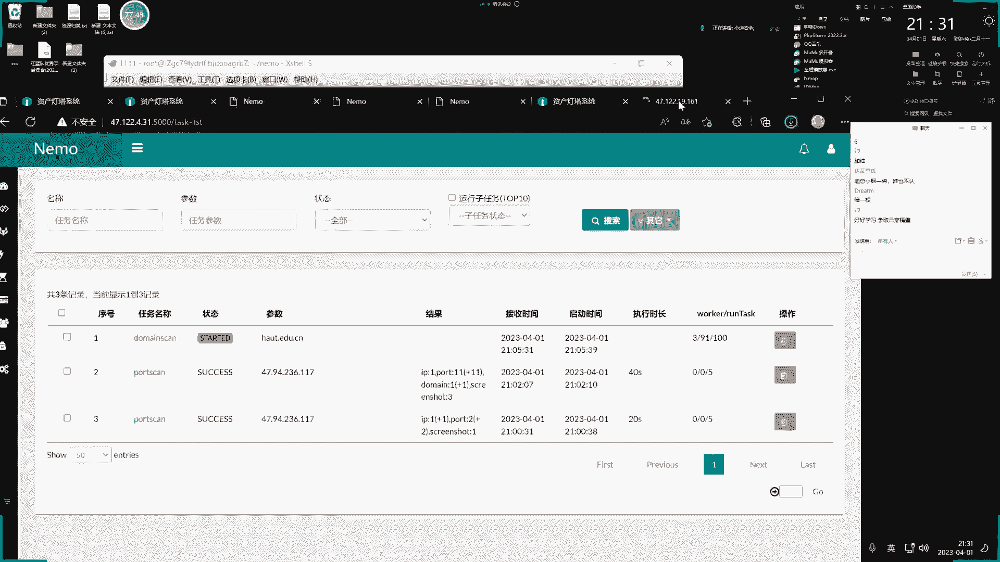

还没启动成功，启动成功了，然后这边刷新诶，不是ATPS吗，hp好看呢。

成功进去输入默认密码，LEOLEO验证码，来打印成功。

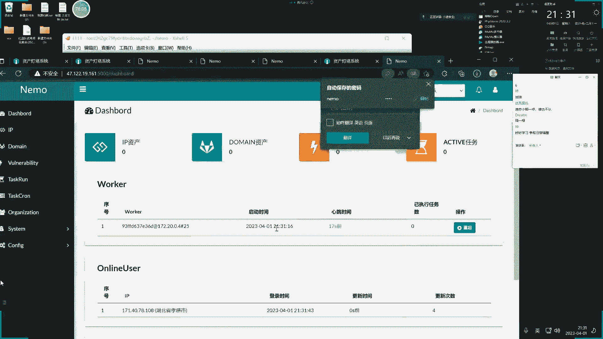

对不对，然后接下来就是我们说的配置这个什么接口啊，这些东西了啊，这就是我们课程演示那些前面的事情了啊，这不是我们环境已经给打好了啊，这些东西都是你自己配了，这两个平台就给大家安装，就是介绍到这里啊。

好我们再来说那个F8X那个部署的东西啊。

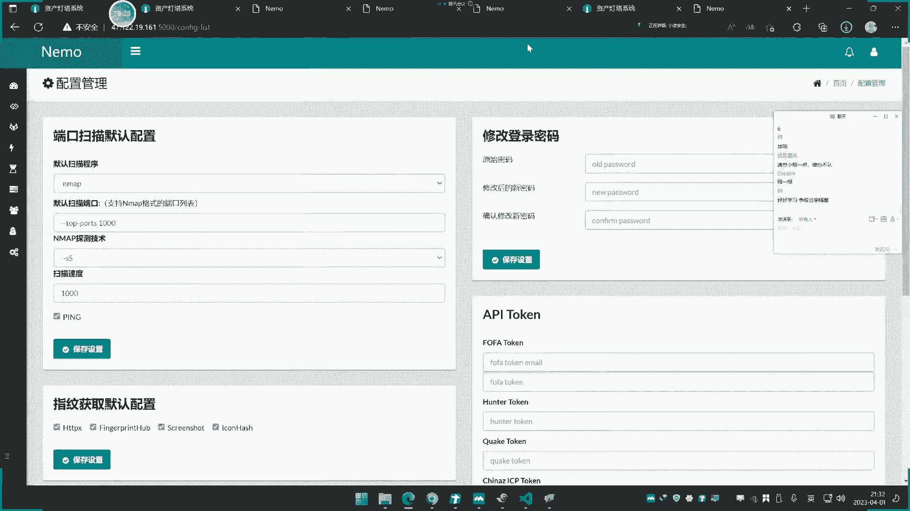

前期刚刚提过的，就这个啊，这个怎么用呢，大家看一下啊，它能帮助我们做哪些事情啊，比如说我们这边现在去下载它。

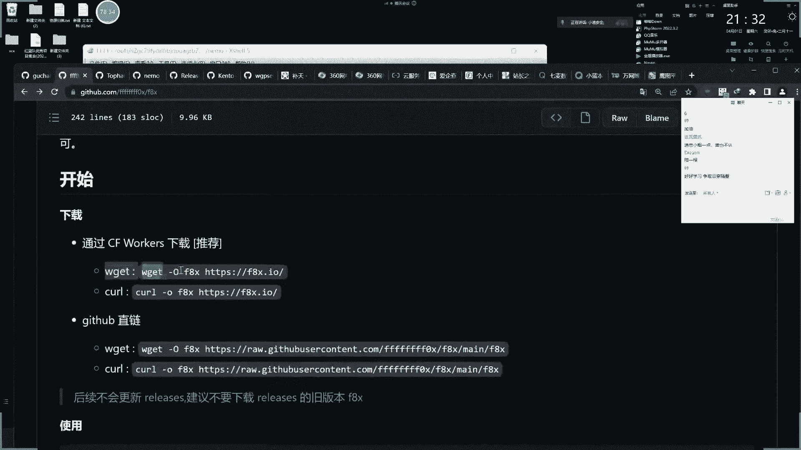

先切换到这个目录，切换到根子下面，然后呢去先下载，先把这个box的下载下来。

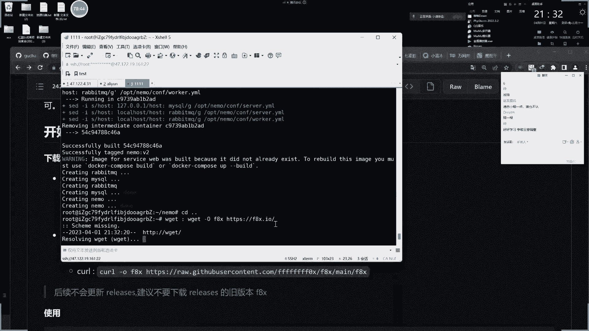

好他已经下载好了，然后呢直接用它呢。

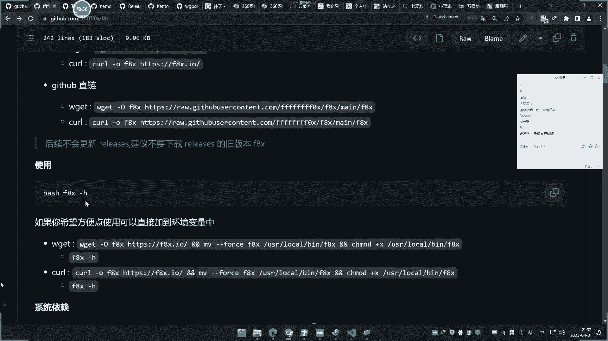

只要他使用方式，我们可以看一下，这里有一些这个场景信息啊，你看啊，我们要装个什么东西，就可以直接拿它上面也集成。

你可以直接用个什么东西，它就可以运行它的，比如说的我直接刚这个，是吧，1。54G来干mobile。

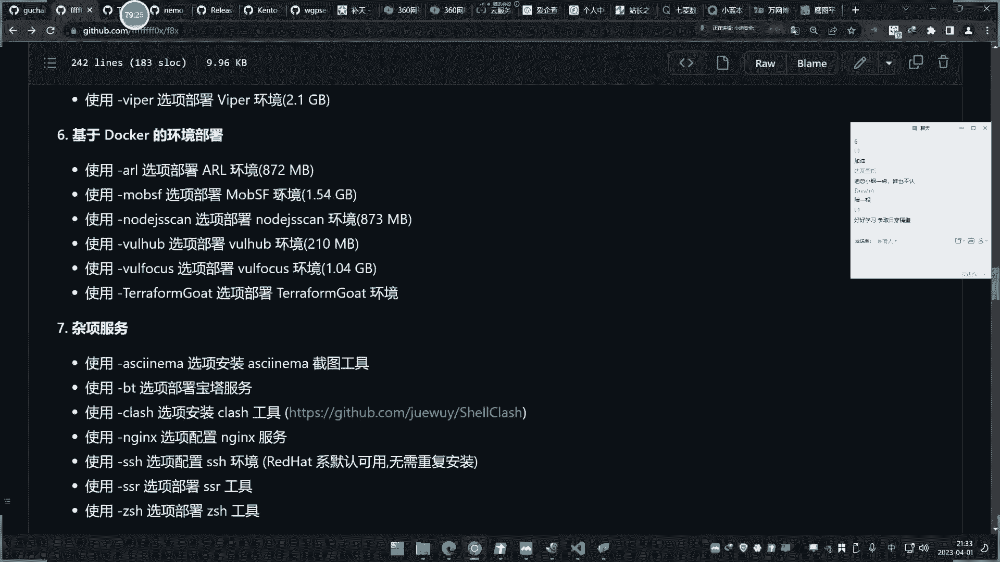

Do you run，他用到代理吗，默认不用，代理的意思是说可能你的网络的一些不通畅性，它就自动帮我去打个mob。

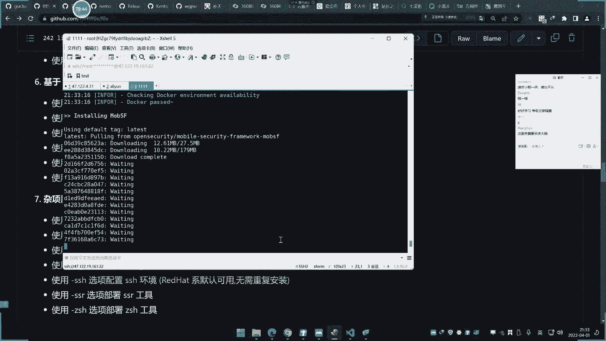

然后以此啊你想打点什么就打点什么对吧，这是一个漏洞平台，就是工具平台，还有上面的各种各样的是吧，这些还有拔插的那些东西呢，还有我的葵色工具是吧，代理工具MSF代理转发工具，内网的一些工具。

cs上面工具AWCS红队的是吧，然后蓝队的一些这种日志分析工具，这个鬼子在触发工具查杀工具，把这个取证工具一大堆，还有些环境是吧，安装go语言环境，安装level环境。

安装DOS环境都可以用这个参数进行好。

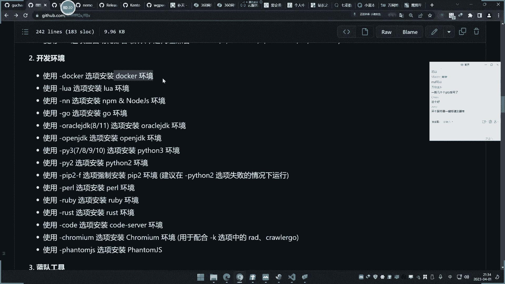

现在呢他就是帮我们去构造那个芒宝。

嗯其实今天呢就是全部是讲的这些工具项目啊，是能够快速的帮助你啊，用工具来做一个脚本小子，是不是，然后还有一些优秀项目，就是我刚才说的呢，这优项目大家可以关注一下啦，他这里的推荐给大家看到了半自动领红军。

那水泽上线了，是不是上期讲的水泽啊，但是我今天没有讲，因为我觉得他没有灯塔和那个lever好，所以没有讲好了，LEGO今天讲的那么go讲了是吧，还有这个AWFS好，你看下面的信息收集工具灯塔是吧。

有JU，还有这个什么鬼几个，今天讲的这个网络空间也集成了foo video，专门的查询客户端，0zo，You can，我们讲的企业查询的AR的plus版本是吧，灯塔的plus版本还有指纹呢。

刚才那那指纹没有吗是吧，你可以把指纹呢用这个插件把它添加上去，有灯塔就指纹识别了，子域名扫描工具，那我们讲的all for one是吧，也在里面，其他的一些就没有讲了啊。

因为有一款用的比较好就完全OK了，还有目录了，在找JS的，You are fighter，这我们也讲过指纹识别在哪，这个插件讲过吗，还有这个呢，这个ta fire的那个东西。

也是那个官方产品端口扫描工具，这个没有讲啊，当个扫描工具人马啊，马斯卡这些，其他的都差不多，八部插件，现在还没有，暂时到巴黎，是常见的八部使用插件，浏览器插件一大堆哈。

邮箱钓鱼的施工信息的APP查询工具，那将过来的小程序反编工具是提到过，但是他们这两个呢我说过啊，有些人反编不出来了，所以我还是给他找了最新的，他虽然说这里有反编译的。

还有我们讲的a p p a p p force g，对不对，漏洞利用工具，这里一大堆而来，中间建立用工具，这太多了啊，哎是吧，然后还有一些呢新系列工具，还有一些什么人人利用工具。

啊我们前期讲的来源代码泄露工具加黑客，DS多EXPSYUE都讲过了哈，数据库理工具，这是啥都没讲啊，因为这个知识点没讲到支支点，支点我说我磕什么东西都给到了，有些人就不相信。

我有时候没给你把它整理到地面去，不代表我没有讲，很多人经常问我给你发个支点，给我有没有支点啊，妈的这些东西我提了百来次了，经常给一些网站上面有些什么支点，前一阵子讲F讲那个JS实战的时候。

也给过一个在线字典的一些什么平台，甚至今天优势在这项目里面都是一些字典，老问这东西在哪里找，你平常听课注意自己整理和收集啊，那别的什么东西来的呢，这给你介绍这些优秀东西的时候，你就把它整理起来，对不对。

做个心中有书，不要说我没有把它写到笔记里去啊，你就不知道你课都不学，课也不听诶，大马升级的内网的齐全的，手机的横向的密码提取的隧道，代理点杀的，其实还有权限维持的甲方防守方，南方工具应急响应的。

LISA莎莎的素养繁殖的安全资料，相关的学习资料仍安全资料八成清单，唉算了我就不看了。

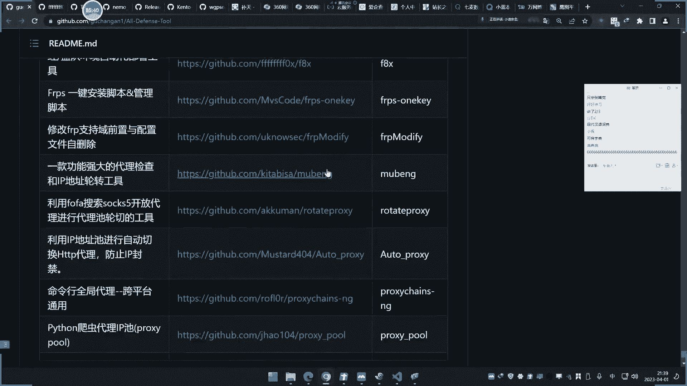

你自己下去整吧，好你看他这个说把我那个f o marble1打就好了，我们来尝试访问一下，看是不答就好了啊。

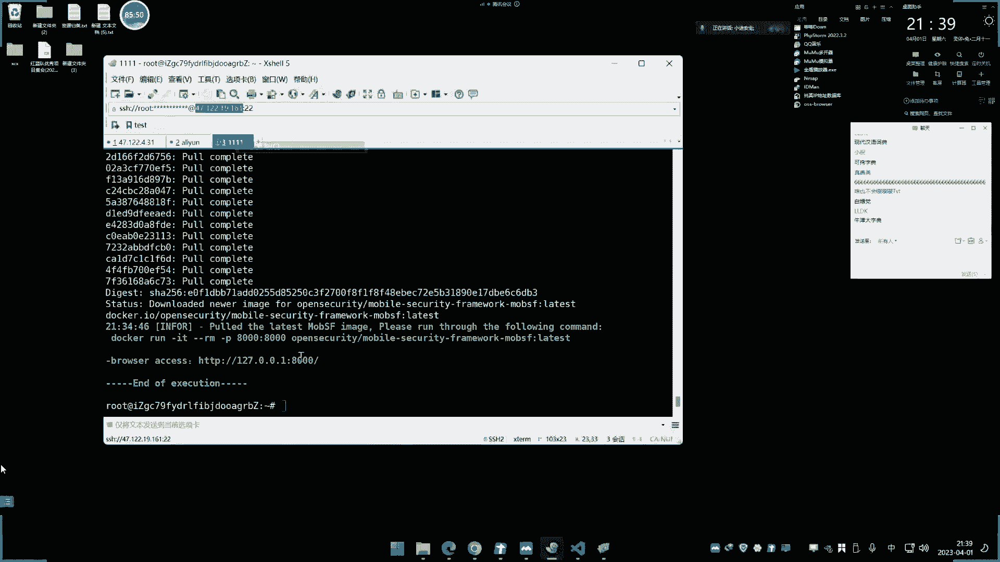

他说是拔线端口来访问，还是摸不就好了，8000多个，没打就好了，这什么鬼东西啊，看一下8000档口开没开没开8000档口，你说搭建好了浏览器，访问本地的执法行动口端口都没开，打几个锤子啊，看一下啊。

我看镜像这个他这个东西在你要用的话。

它还有些东西还需要多科，LMARR的open的这个有这个有在这里啊，他这个已经启动了，我看端口啊，这个是mobile，是这个地方是哪里，Mobi，这个是模板诶，5000没看到啊，这个地方启动了啊。

在这个id里面，进入到他这个dog的里面去了。

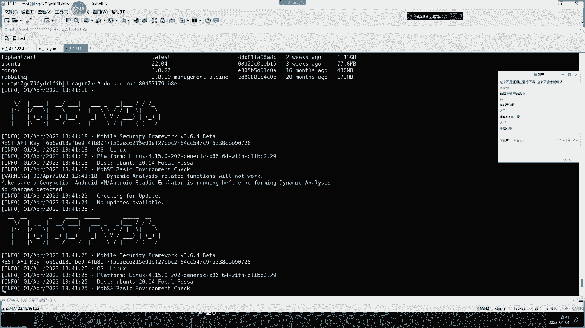

应该可以了诶。

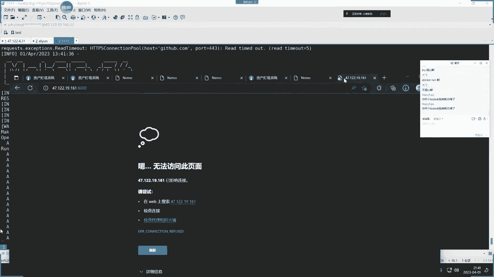

怎么一闪而过啊，这还在准备。

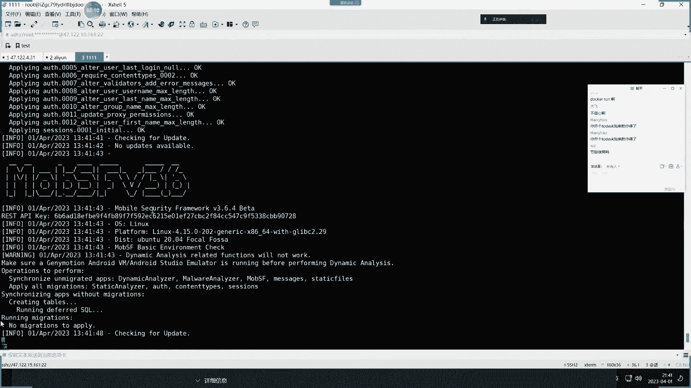

看是哪个端口，这个听到这个洞里面一直在这个8000端口，这是8000多口里程，可以再来看一下。

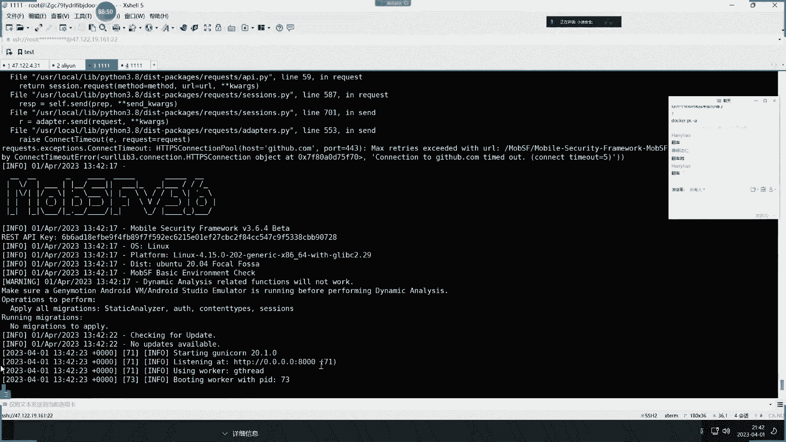

访问一下，他有几种情况是可能是有些，一种是那个网卡的问题。

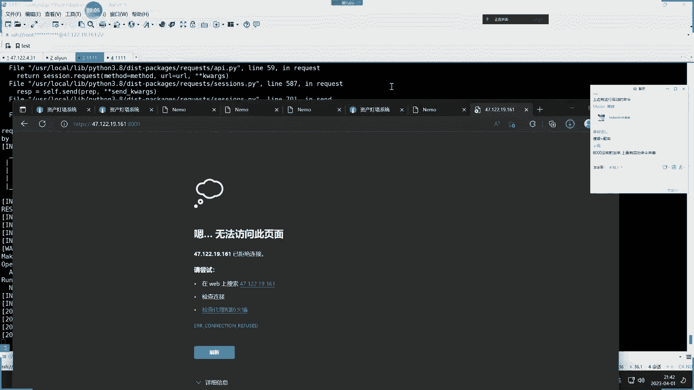

又是网卡问题啊，可能是有些他绑定是本地地址，我看一下啊，我这边来一下127的0。00。

好像没有开，这个自己下去搞吧，我们这里也不搞这个了啊，那环境怎么把这个模板启动起来，就像拉了拉了，哦这里有个命令啊，刚才提前忘记了啊，这个命令不好意思，我还没启动，搞错了啊，没看到，退出一下啊。

好在还是需要等一下啊。

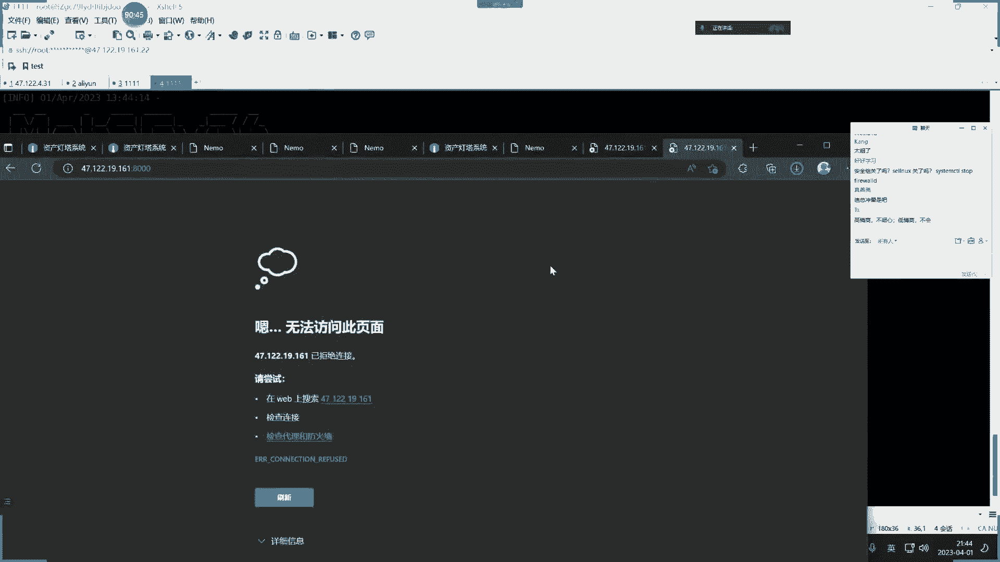

这还包搓成。

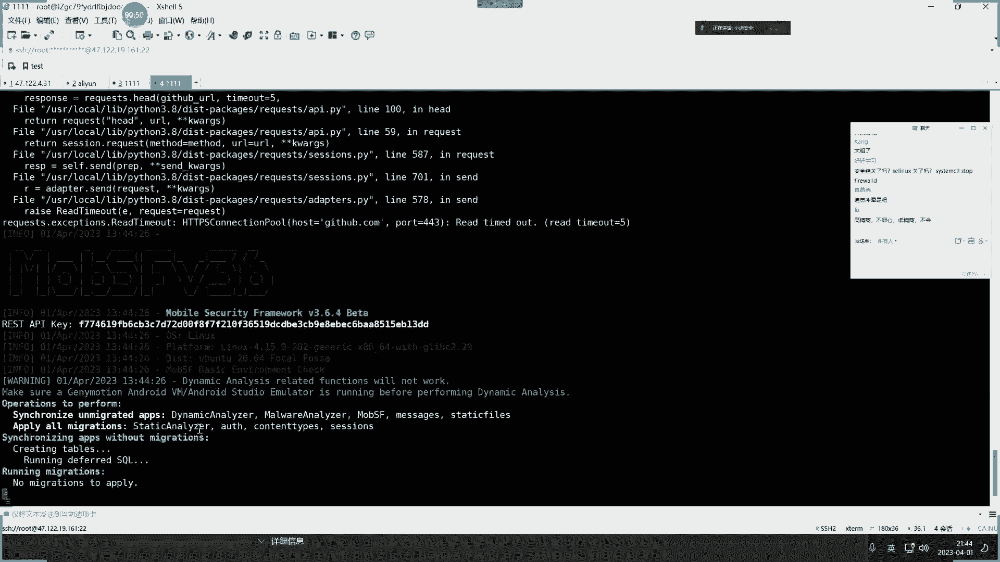

这回该死了吧。

是不是把线弄个我刚才执行的命令。

啊是不是把新端口刚执行的。

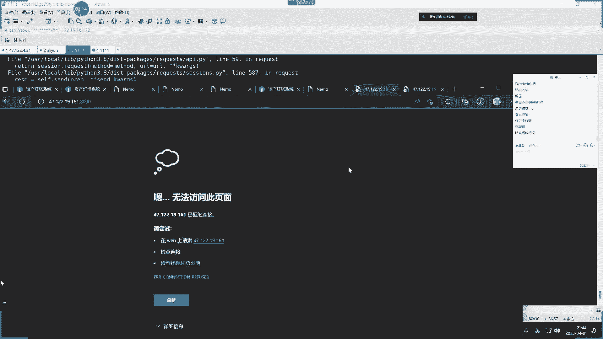

哎这个不纠结了啊，这个纠结什么呢，不应该不是防火墙问题啊，我怀疑是在那个8000大哥都跟我说了，来八仙洞口开了开了开了8000多狗，开了看一下啊。

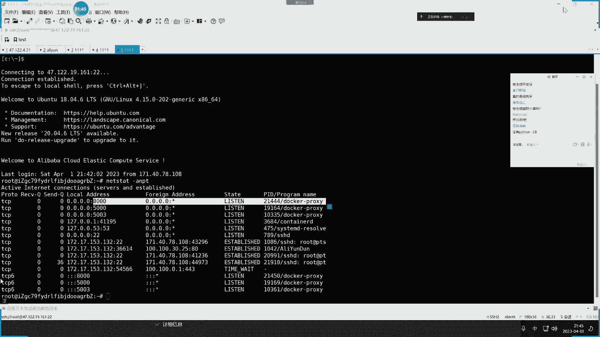

再不能访问，那就是系统的一些开了开了开了开了哎呀，不要吹你妹的，所有的妈的妈的人都被挤死了。

啧好内容就讲这么多吧，那个项目我们也难得看了啊，你这就说这几个东西的使用啊，自己平常注意点就可以了。

这个这个那呢结果应该也差不多出来了吧，妈的怎么还在搞啊，哎什么情况，我真是他妈的无语了啊，我我马上就把这几两个哎两个服务器把它关了，哎呀真是无语啊，算了算了，灯塔这边呢，这关了关了关了关了关了。

不搞了不搞了啊。

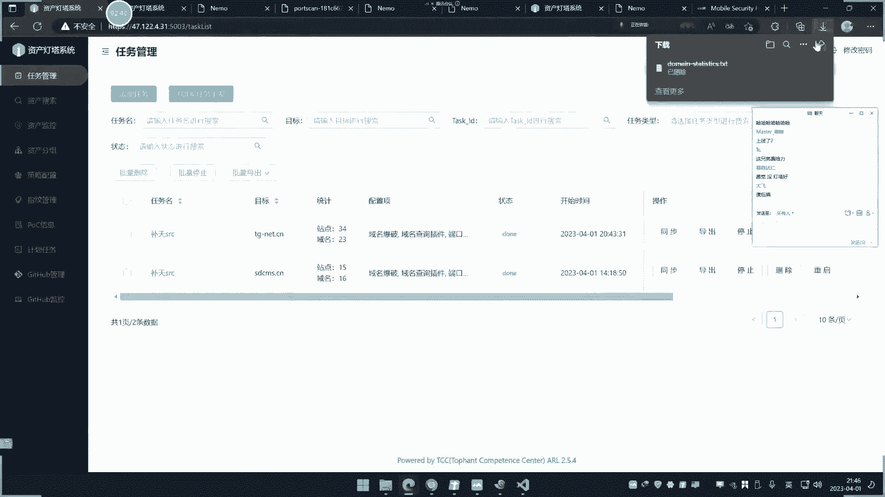

就就就就讲这么多啊，今天的内容就讲这么多啊，简单来说就是一些工具的介绍啊，没有什么其他的，你自己呢就下去，想用就用啊，不用也无所谓，你也可以自己手工，下节课呢我们再讲一些，其实信息设计的一些补助的。

像什么网盘信息啊，微信公众号信息啊，还有一些敏感目录信息啊，来指点啊，讲完了信息手机就不讲了，就要讲讲开发了，这就讲这么多啊，大家看有没有问题啊，有问题就问这个思维导图呢，简单给大家做一下吧。

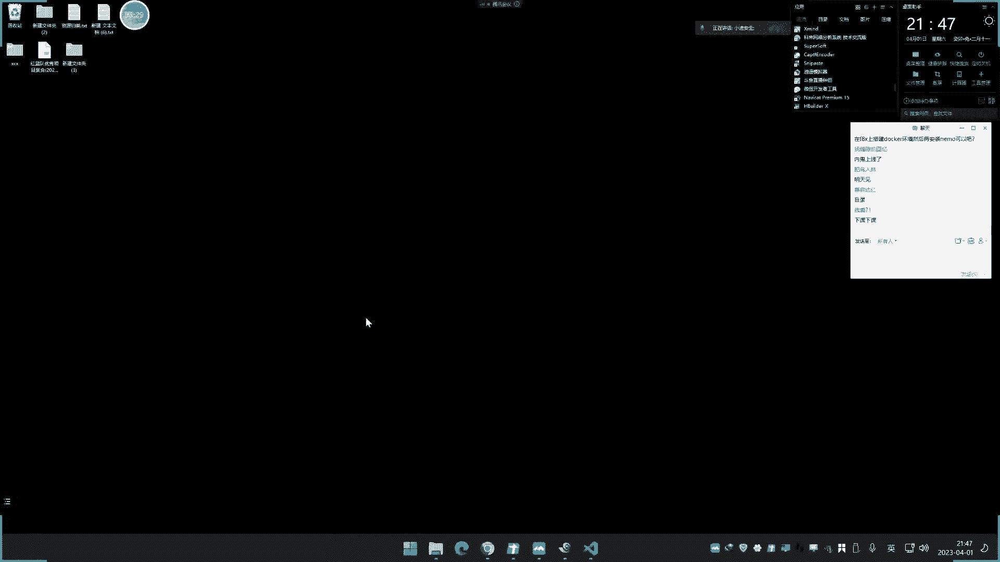

微信号，微信公众号的信息是知道有哪些微信公众号，然后是提取的是微信公众号，里面涉及到第三方应用，你说什么微信号公众号抓包抓毛包啊，他用官方的服务，你抓腾讯包吗啊，微信公众号是将它上面怎么去找目标的。

微信公众号，这是第一点，第二点，找到之后看到微信公众号有没有第三方服务，第三步就是有没有接入第三方的网站，是车车的，不要搞错了啊，他要是说全部用的官方的那种接口的话，那就是微信官方的，那怎么吃啊。

吃个毛啊，吃不了，工地项目，这个讲的是一个是网络空间的一个项目，是我们说的这个其他信息项目，还有一个是我们说的这个自动化的，是综合的自动化，降两个啊，这个是讲的是A2灯塔啊。

然后这个是说的是这个LEOLEGO，其他信息和这两个。

你没有讲什么东西啊。

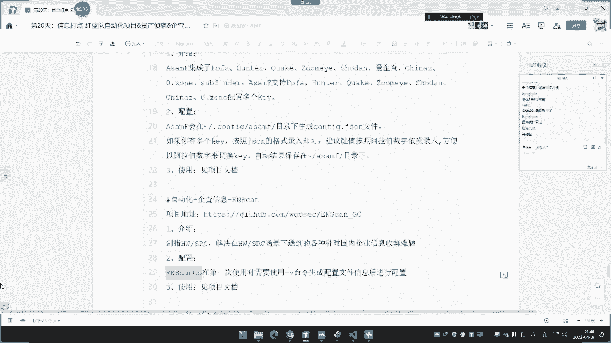

还可以是我们说的这个自动化的部署工具，武器库不属，F8叉，对就讲这几个啊，那没讲啥东西啊。

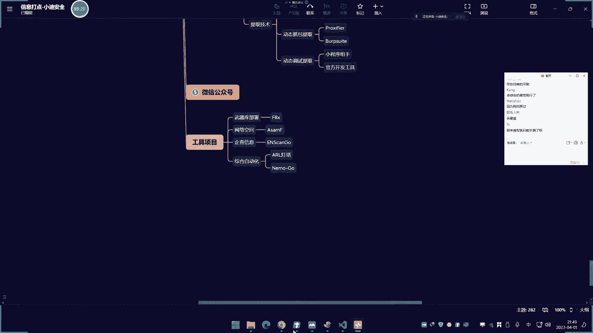

它里面那些介绍呢我们就不写上去了啊，我们说的那个U项目总结类。

也常见的啊，打小就可以再加上这几个，这个呢对我们这个新收集工具呢，还是有点影响的啊，还有其他一些上面一些工具的，这些都没有玩弄上去。

好今天锁怎么做啊，大有问题问了没问题，我们就关播了。

工具别人都注意规避法律风险，你还在那里呢，拼命的少，哎也是无语了啊，目录扫描用什么工具，这个按他推荐的那些工具都可以撕呀。

没有说哪个好哪个坏，你自己用的哪个，你觉得好就用哪个，你们下面呢也不用和我要什么什么FOFO，夸克账号啊，夸克还能给FOFO给不了了，现在马上就要被封了，我已经收到官方的提示了。

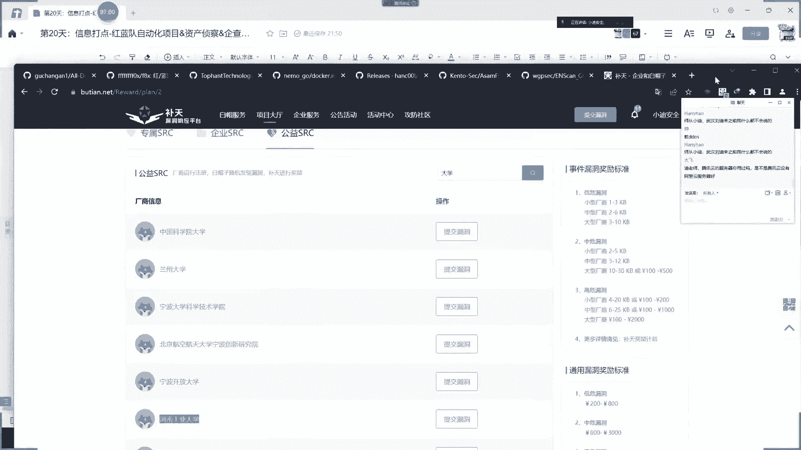

我还这两天还要用一下巴克，背完就被封了，如果以后风声过去之后还没被封的话。

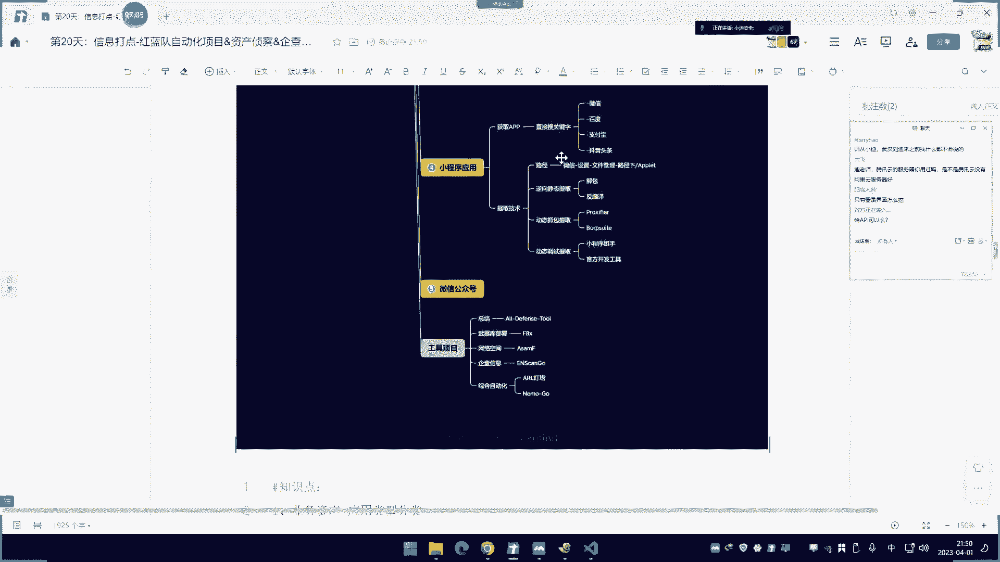

再给大家用吧。

这两天不能用啊，这两天官方我已经上了黑名单了，随时可能用不了。

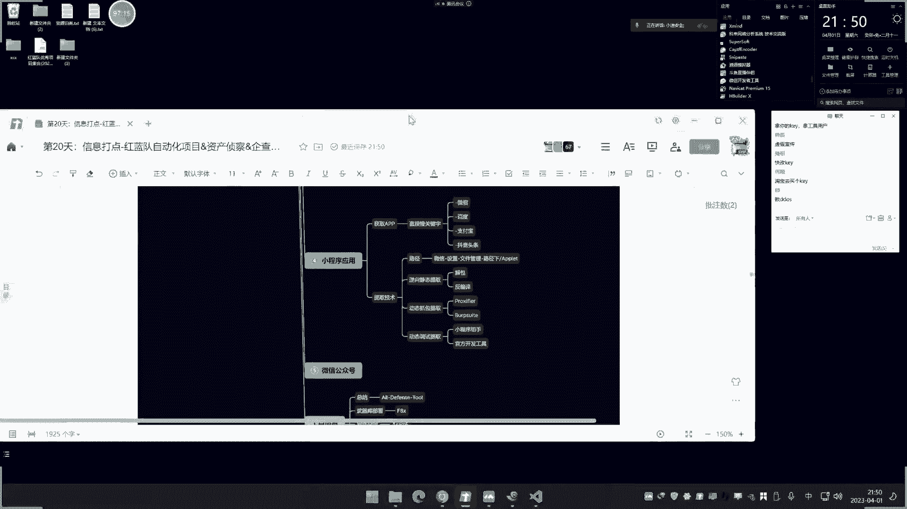

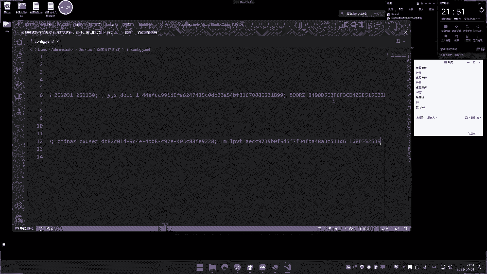

K给K可以给你用，但是那个密码不能给你用了。

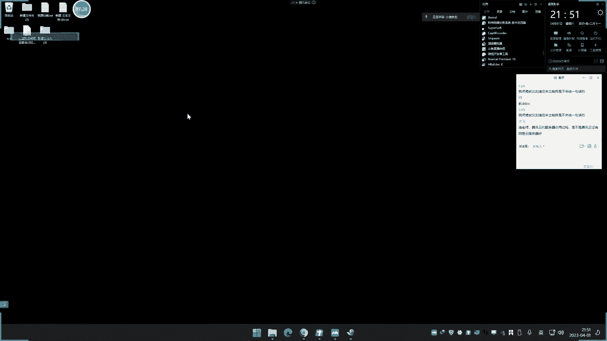