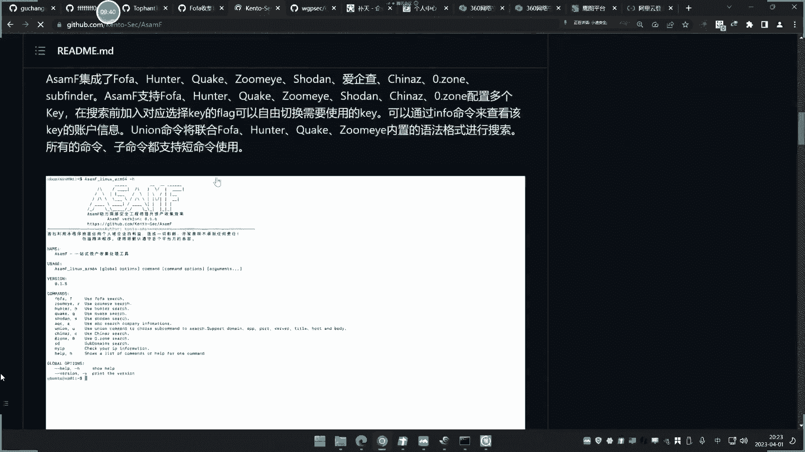
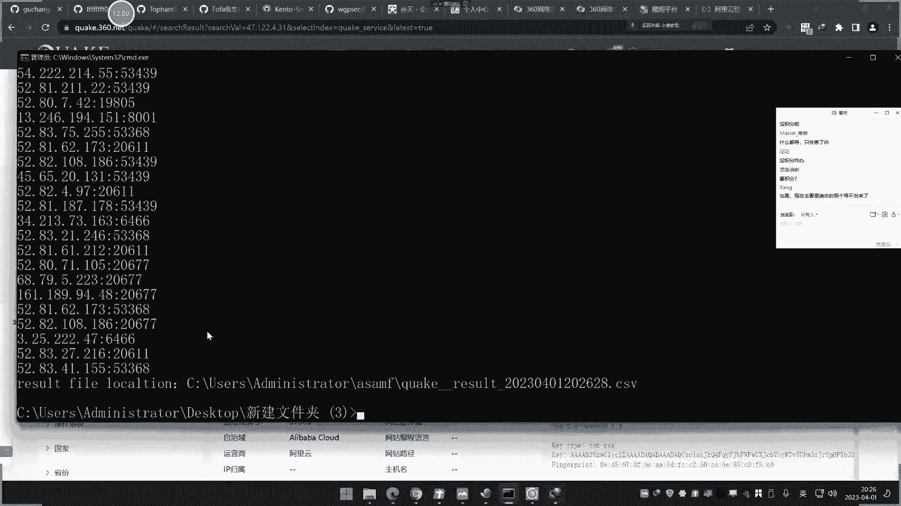
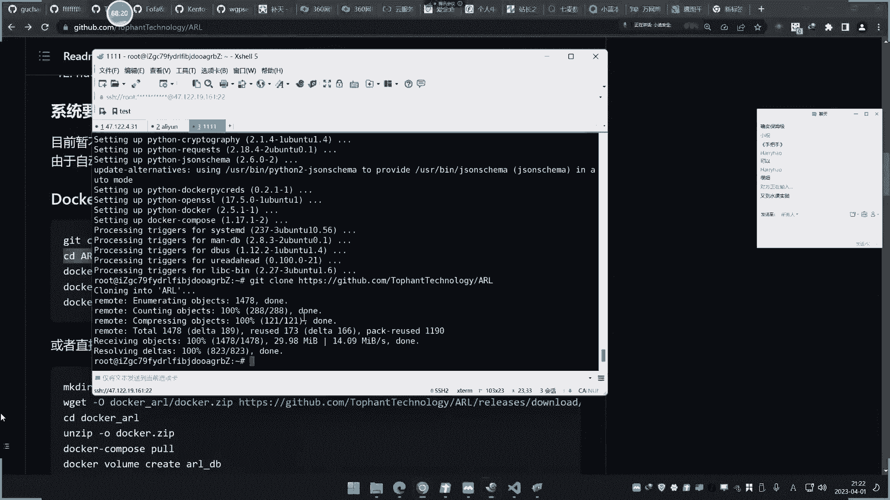

# 🛠️ 课程20：红蓝队自动化项目与资产侦察工具实战


在本节课中，我们将学习一系列用于自动化信息收集和资产侦察的工具项目。这些工具能够帮助安全人员高效地进行批量资产发现、企业信息查询、网络空间测绘以及自动化武器库部署。课程内容将涵盖工具的使用方法、搭建过程以及核心功能演示。


---


## 📦 项目概览与工具集介绍


上一节我们概述了本节课的目标。本节中，我们来看看几个核心的自动化工具项目。随着时间推移，一些旧项目可能不再更新，因此我们会介绍当前更优秀、更有效的新工具。





以下是本节课将要介绍的几个主要项目类别：





1.  **网络空间搜索引擎集成工具**：用于免积分导出Fofa、Hunter、Quake等平台的数据。
2.  **企业信息一体化查询工具**：整合天眼查、企查查等多个平台，自动化收集企业相关信息。
3.  **综合自动化资产侦察平台**：如ARL灯塔和Nemo系统，用于自动化子域名发现、端口扫描、指纹识别等。
4.  **自动化环境部署工具**：如F8X项目，一键安装各种红队、蓝队及渗透测试环境。


---


## 🔍 网络空间搜索引擎集成工具


上一节我们介绍了工具集的整体情况。本节中，我们来看看第一个具体工具：网络空间搜索引擎集成工具。这类工具的核心作用是，通过配置API Key或Cookie，绕过平台积分限制，直接爬取并导出Fofa、Hunter、Quake等网络空间测绘引擎的搜索结果。


其核心原理是利用脚本模拟用户查询，并将结果保存到本地。**公式**可以简单表示为：
`工具 + 有效凭证(API Key/Cookie) + 搜索语法 => 本地结果文件`


以下是使用此类工具的基本步骤：


1.  **获取凭证**：登录目标平台（如Fofa），从个人中心获取API Key或从浏览器开发者工具复制Cookie。
2.  **配置工具**：运行工具生成配置文件，并将获取的凭证填入对应位置。
3.  **执行搜索**：使用命令行指定搜索语法和来源引擎，开始收集数据。
4.  **查看结果**：工具会将收集到的资产信息（如IP、端口、协议等）导出到本地文件（如CSV或TXT）。


**注意**：此类工具的使用可能因平台反爬策略变化而失效，且需注意法律风险，仅用于授权测试。


---


## 🏢 企业信息一体化查询工具


上一节我们学习了如何自动化收集网络空间资产。本节中，我们来看看如何自动化收集企业相关信息。在企业安全测试或SRC漏洞挖掘中，经常需要收集目标公司的子公司、关联域名、APP、微信公众号等资产。手动在多个平台查询效率低下，而一体化查询工具可以解决这个问题。


这类工具集成了爱企查、天眼查、企查查、小蓝本、奇安信威胁情报等多个数据源。其工作流程是：输入一个公司名称或关键词，工具自动调用各平台接口，聚合返回工商信息、域名备案、APP、微信公众号、微博等多维度数据。


以下是配置和使用此类工具的关键点：


*   **核心依赖**：工具的效果高度依赖于所配置账号在各平台的权限。普通账号查询到的信息有限，会员账号能获得更全面的数据。
*   **配置凭证**：需要在工具的配置文件中，填入各平台账号登录后的Cookie或Token。
*   **执行查询**：通过命令行输入公司名称，工具自动运行并生成包含各类信息的汇总报告。


**代码**示例（假设工具名为`ENScan`）：
```bash
# 生成配置文件
./ENScan -v
# 编辑生成的config.json，填入各平台Cookie
# 执行查询
./ENScan -n "北京某某科技有限公司"
```


---


## 🚀 综合自动化资产侦察平台（ARL灯塔 & Nemo）


前面介绍的工具侧重于特定信息的收集。本节中，我们来看看功能更强大的综合自动化资产侦察平台，它们可以实现从目标输入到资产发现的完整流水线作业。我们将重点介绍两个项目：ARL（灯塔）和Nemo。


**ARL（灯塔）** 是一个开源的资产侦察与信息收集平台。它的主要功能包括：
*   子域名枚举（利用多种字典和接口）
*   端口扫描与服务识别
*   Web站点截图与标题获取
*   基础指纹识别（如CMS、中间件）
*   简单的漏洞POC验证（需自行维护POC库）
*   结果可视化展示


**Nemo** 是另一个功能类似的自动化平台，但它在设计上更强调与网络空间搜索引擎（如Fofa、Quake）的联动。这意味着Nemo不仅能通过常规工具发现资产，还能直接利用这些搜索引擎的庞大数据库来补充和验证资产，理论上收集范围更广。

以下是使用此类平台的一般流程：

1.  **添加任务**：在Web界面输入目标域名或IP段。
2.  **配置扫描选项**：选择是否进行端口扫描、子域名爆破、指纹识别、漏洞检测等。
3.  **启动任务**：平台后台自动调度各种工具（如masscan、nmap、subfinder等）和API进行扫描。
4.  **查看报告**：在仪表盘查看发现的资产列表、关联关系、开放服务、潜在风险点等。


**注意**：这些平台适合在授权范围内对大量资产进行快速初步侦察和脆弱性筛选，但深度测试仍需结合手工分析。


---





## ⚙️ 自动化武器库部署工具（F8X）


在安全研究和渗透测试中，搭建各种工具环境是一项繁琐的工作。本节中，我们来看看如何利用自动化部署工具来解放双手。F8X项目就是一个优秀的“一键部署”脚本集合，它可以帮助我们快速在Linux系统上安装各种安全工具和环境。


F8X项目将常用的红队工具、蓝队工具、开发环境、漏洞环境等封装成简单的命令。你只需要执行一个命令加上对应的参数，它就会自动完成从下载、编译到配置的全过程。


以下是F8X支持的部分功能示例：


*   `./f8x -mob`：安装MobSF移动安全测试框架。
*   `./f8x -cs`：安装Cobalt Strike团队服务器（需自有许可证）。
*   `./f8x -go`：安装Go语言环境。
*   `./f8x -awvs`：安装Acunetix漏洞扫描器（需自有许可证）。
*   `./f8x -blue`：安装一系列蓝队分析工具。


**代码**示例：
```bash
# 下载F8X脚本
wget -O f8x https://github.com/.../f8x
chmod +x f8x
# 使用F8X安装MobSF
./f8x -mob
```
安装完成后，通常可以通过访问服务器特定端口（如MobSF的8000端口）来使用部署好的工具。


---


## 📝 课程总结与优秀项目资源


本节课我们一起学习了四类用于提升红蓝队工作效率的自动化工具：


1.  **网络空间数据导出工具**：解决了手动导出需要积分的问题，实现批量资产抓取。
2.  **企业信息聚合工具**：打通多个商业查询平台，快速绘制企业资产图谱。
3.  **综合资产侦察平台（ARL/Nemo）**：实现了从信息收集到初步风险识别的自动化流水线，是批量资产梳理的利器。
4.  **自动化部署工具（F8X）**：极大简化了复杂安全工具环境的搭建过程。


此外，网络上存在一个名为“All The Things”的优秀安全工具列表项目，它持续收集和更新各类安全工具，是拓展工具库的宝贵资源。学习者应养成定期关注此类优质开源项目的习惯，并**根据自身测试场景和法律法规，审慎选择和使用工具**。


**记住**：工具的本质是提升效率，但深入的安全分析、漏洞挖掘和合规意识永远无法被自动化完全替代。