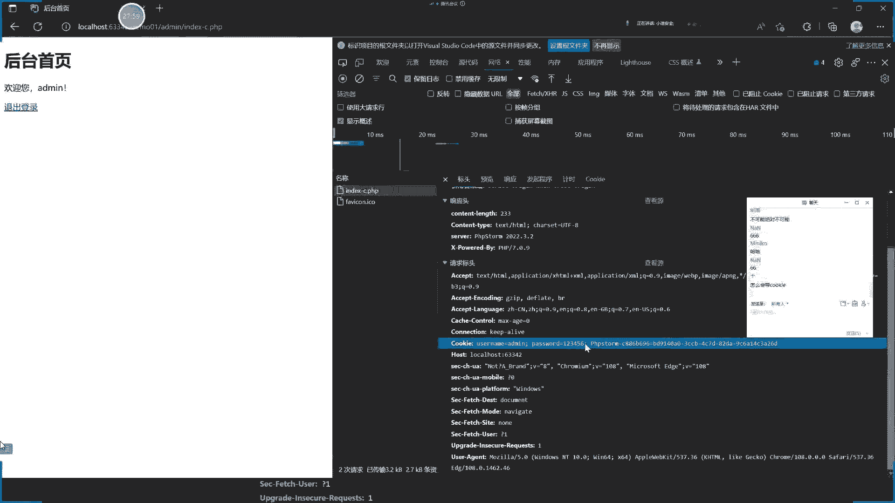
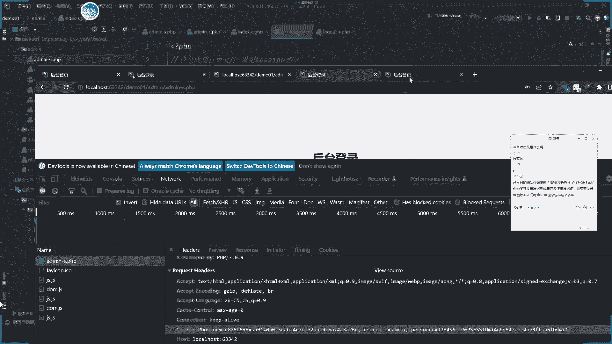
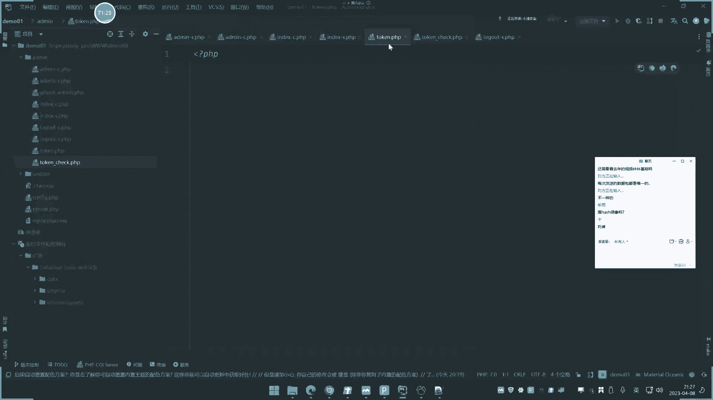
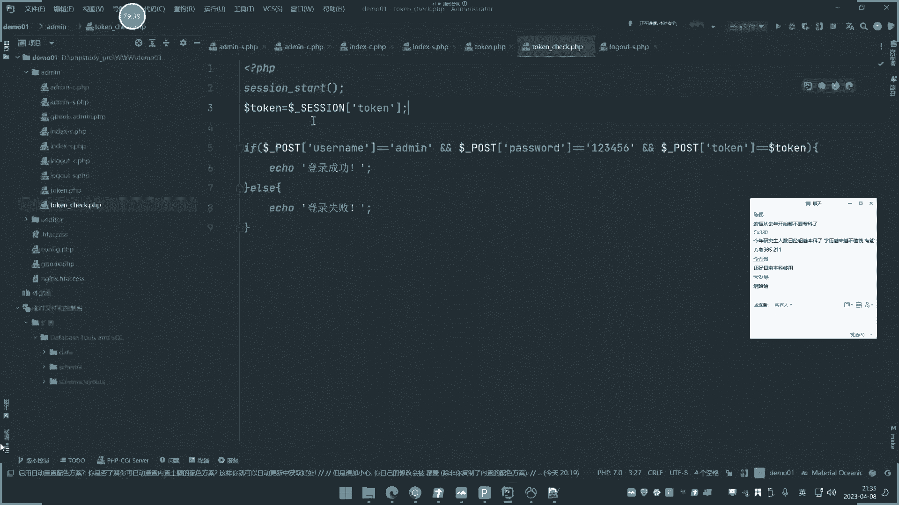

# P23：第23天-PHP应用&后台模块&Session&Cookie&Token&身份验证&唯一性 - 逆风微笑的代码狗 - BV1Mx4y1q7Ny

啊今天呢讲第23天啊，讲这个继续开发啊，pp的这个开发，然后讲的是他的后台模块的几个技术，包括这个C型技术，cooking技术和token技术，这三个技术呢是非常有必要学一下的啊。

他是和我们一些安全漏洞的息息相关的，我们也会有着重要的一个演示啊，简单来说呢，这里是他的一个模型啊，我们呢就是做这三个基数的一个编写啊，首先呢我们来说第一个cooking基数。

这个coin技术呢前面是它的一个流程啊，是他们一个个自营流程呢，先第一步呢请求啊，然后设置cookie保存，cookie发送cookie，读取cookie返回值，然后返回内容是这个十步呃。

这是cookie的一个流程啊，简单来说就分到这一步啊，八部大家可以仔细的看一下啊，如果说不熟悉原理的话，可以看一下，那么cookie是一个什么东西呢，简单来说啊，这里呢cookie是一个什么东西啊。

呃你可以网上查一下，我们简单来说它是一个用户的身份的一个平均，我们可以称之为cooking，然后用户的这个绘画平局呢称之为叫C型，它的具体作用是干嘛的呢，cooking的一个作用呢。

主要就是用来判定用户身份的，我们举个很简单的例子，比如说你在后台里面去登录了一个用户之后，然后呢用户在登录的时候，不是经常会有个选项叫做记住密码，或者说记住我记住多长时间，这么一个设置按钮勾选之后呢。

你可以选择下次打开浏览器的时候，在访问同样的地址的时候，就不再需要登录啊，那个选项呢，其实就是类似于勾选了cooking的保存技术，将你的用户平均呢保存到你的浏览器本地。

从而呢当你浏览器再去访问那个网站的时候呢，他就知道是你这个人，然后那就不需要再登录了，那么这个呢就是个最典型的一个cooking的一个，技术实现，用来把用户的平均呢保存cookie，就是那个用户平均。

然后这个用户平均呢就是你的身份信息，不需要再次登录来验证了，这个就是cookie，那么C型呢就有点不太一样啊，我们等一下讲到的时候再给他说好，那这个cooking的前因后果讲清楚之后呢。

也就是说他就是在用，用来判断用户身份的一项技术，那么那就是一串平均，那么现在呢我们就来用PP的来书写一下，这个建议的流程。

首先啊我们这里也是一样的道理，把我们这个环境呢先启动起来，启动了数据库和环境都启动起来，然后呢在这里呢用这个开发期啊启动起来。

然后呢，这里呢我们重新打开上节课的那个源码体系，三这个是那个叫DOO的大。

好，然后呢，在这里呢我们在ADY下面呢创建几个文件哈，首先第一个要创建的。

就是我们的这个什么文件啊，比如说叫ADD me gc。

点PPGC的意思是gun cooking好了，再创建个index gc点PPT，再创建个。

GOUT点到C点PP，那么分别这三个文件对应什么意思呢，这个是登录文件，可以简单注释一下好，那这个呢是登录成功的首页文件，好那这个呢就是蹲除文件，就是说这里的负责登录，当然登录之后成功之后呢。

就来到这个所有文件，然后呢如果电脑推出，就会跳转到这个灯处文件上来，首先呢我们首先啊，这里呢可以采用一个TML，去写一个后台的登录框，那么这里呢，我为了这个让大家看到更美观的效果呢。

我用恰个恰个JBT啊，让他帮我去生成一个漂亮的啊，这个HTM的一个后台登录的样式啊，避免了我们这个页面太粗糙是吧，还是要搞美观点啊，也是给大家说一下啊，这个签个GPT呢也是完全OK的。

适用于在这个开发里面的，但是我们不能说完全指望他去写这样子呢，你就学不到里面的精髓了啊，所以呢我们就说像这种央视啊，界面美观呢，就让他来做核心的地方呢，我们就还是自己是吧，操作一下啊。

然后帮我生成一个这个后台的这么一个漂亮，文件，漂亮建立出来啊，漂亮界面，他就会帮你去写一些样式，这个样式的就是什么颜色呀，背景呀啊那个长度啊，大小啊是吧，但是呢核心东西是不会变的啊。

都是去传递这个登录的啊，就TM来输在那个页面的编写，然后核心功能就用pp来接收是吧，好那这里写完了，写完之后呢，我们把它复制到这里来运行一下。

看一下效果呀，来我们看一下这面，那你看这个界面就帮我写出来了，你是不是就比我写的好多了呀，对不对好，那这个写出来之后呢，我们现在呢就来做这个上面的做的事情啊。

首先呢我们看一下他提交的这个表单值，他虽然所有功能都能写出来啊，但是我们还是要学的啊，因为你不写的话，你这个完全靠他也不行啊，这里的表单值呢用户呢是用username传递啊。

password是这个password密码是吧啊，点登录，然后呢提交请求的是一个井号，就是当前啊，你有空的话也是当前脚本，然后这边去接收它，那么这个cookie判断流程是一个什么流程呢。

首先我们是先要接收到这个账号密码，解释到账号密码之后呢，判定一下，这大概是分为这几步啊，我们给他写一下哈，注释一下啊，那首先呢第一步是不是我们要这个接收，输入的这个账号密码是吧。

好那么第二步呢就是判定这个账号密码呢，堆不堆是吧，正确性，那么正确执行之后呢，啊正确后就什么生成这个cookie进行这个保存，第四步呢就跳转至这个成功登录的这个页面，就说这是一个正常的啊。

就是成功的就这么一个流程哈，如果说失败的话，那么就是按另外一套思路啊，首先要接受这个账密码，然后判断这个账密码正确性，然后呢再去判断成功之后就正确的，就这个啊，如果是错误的话，我们也把它写下3。1啊。

如果错误的账号密码内，就进行这个什么提示是吧，就大概是这么一个过程哈，成功了就生成，不成功就不生成好了，这个流程写清楚啊，首先呢输入接收接收怎么说呢，第一部的代码代码第一步在注释语句啊。

然后呢呃接收的话是不是就是post的节奏啊，这里面我们可以看一下他的请求方式，That's postor，那么就是刀乐福下划线post，接收这个UC类目子就在里面表单名字吗，USC这UI就是这里的哈。

就是用户名，然后呢我们取取一个变量来接收，user等于就是UZI名，然后呢继续df pass呢，就等于什么等于这个解释过来的password值对吧，解释两个值之后好，先解说，解说完之后。

是不是要进行这个用户的账号密码判断了，那用户账号密码判断呢是不是要在数据库里面。

所以我们这里呢要创建一个数据库了啊是吧，这个上节课已经讲过了啊。

嗯连接一下啊。

一九呢选这个DOM，零一在这里创建一个表表呢，就叫ADD me表，然后呢前面的一个us。

下面一个，他是word就搞这两个就可以了啊，其他的我们说点击保存，取名叫艾米，那么艾德米表里面就有一个password，然后呢我们写一个值进去，然后是艾德里，密码是123456好，我这就不搞加密值了啊。

如果真是13的小伙伴，可能这里有个加密值，但在五左右了啊，如果是加密值的话，是什么加密，就用什么函数加密就可以了，我现在搞明文AB，然后表示多么离你，那么现在呢就是按照一样的道理。

前期我们在这里已经不是生成好配置文件了吗，连接这个配置文件是吧，用它去连接它，是不是，然后这里是不是就是怎么样一个操作，判断它的一个操作就是什么，第二把怎么点不了他的这个东西是吧，那他的东西到底张鑫。

那么他的这个步骤呢就是首先呢是吧，连接数据库进行数据库查询，将这个数据等将这个数据啊进行这个对比是吧，那么这里呢就是连续库怎么连呢，是首先到这里呢一个包含文件，那CLUDE包含那个配置文件。

就是商机目录的卡贝卡啊，包含这个商店文件，那么把这个配置文件包含进去之后，接下来呢就是MYSQL就这里要定一个什么function，定义一个函数function function。

定一个login叫loin ch，是吧，LNCHK定义的这个函数好，不定义吧，先不定义啊，直接开始啊，照这个密码啊，我们来定义SQL语句吧。

这SQL语句SQL语句就等于snack simple enemy，然后下面的while条件是什么，条件是这个USLAM等于变量，双引号不要搞混淆了啊，前面的双引号后面多了双引号去掉。

那么就等于什么变量user是吧，判断一下安的条件，password等于什么单独pass，然后呢后面语句结束，后面加一个语句结束，这个是circle语句的结束，整个后面呢就是这个语句帧数。

那就是将这个结束的账号，密码的拼接到这个语句里面去判断，那么很简单的道理，这个语句在这里执行的话，我们可以在这里点一个查询，如果我在这里呢给他传递的知识，传递的密码是123456，建立执行。

那么它就会返回，返回怎么返回一个空啊，不会吧，有TWWD，查询艾德米发挥，哦这里没保存啊，查询一下，没保存呢，是不是有结果啊，如果说这是错的啊，我们就写个错误结果来运行，它就为空是吧。

有时候有返回结果就是查询正确，就是这密码对着。

所以我们这边可以进行一个判定，MYSQL呢先去执行它，执行这个语句，然后CON的下面这个链接的，然后执行这个circle，好判断一下，这里面加上一个叫REDATE数据，判断一下啊。

my soul下换成这个long labels，是判断它的一个调速，我们来进行这个调速的一个判断，就是返回函数啊，echo一下，输出一下这个结果就是这里呢执行这个SQL语句。

将这个结果的一个条数给它显示出来，把它输出好，我们试着去运行一下，看一下啊。

打开这个页面好，我们随便输一下啊，比如说输入这个enemy123456。

看他输出是什么值，诶，没有输出，没有输出是什么情况，我把这个echo打一下，打一下这个语句啊，看这里对不对。

你看目前这两个结束到是空的啊，在SQL语句我们把它输出一下啊，随便写一下好，他能正确接收，能直接接收，没问题啊，那么接下来ADD me，123456，好这里呢它也能正常执行。

执行之后呢，这个结果这样判断，它的取函数应该是不能这样判断啊，不能这样判断，怀疑应该是个粗条件，这些判断的一个结果，我在这看一下。

这是哪里有问题啊。

不用这个判断啊，我换一个判断方式，不用这个判断。

这个函数画个panda盒子啊，我搜一下，看一下那个，判断数据，获取执行结果行书，对的啊，我看一下，是这样判断mysql a numbers大结果大于零。

看看是不是为空，来看一下这个执行结果。

我一下啊，不如果。

看一下。

OK对了啊对对了啊，刚才你们什么CON和那个没关系，引都引用了，你说你们自己都搞不清楚，还一直在那里说说说，可以了啊，刚才判断应该是他这个判断的，就是把它装个条件，判断是不是大于零，他如果有条件的话。

就是非零的话，就是成功之影，这个就能判断它登录成功了，所以我们就可以给他一个echo提示弹出一下是吧，这个ARTIC，然后呢其实这个登录成功，然后登录成功之后要做的什么事情呢。

继续要做这个在做什么事情呢，登录成功之后，要做的就是把它进行一个页面的跳转是吧，就进行一个HLEJD，进行一个LOC，重定向啊，这个是怎么写的，Los，哎呀英文单词怎么写的，搞不清楚了啊，是这样写的吧。

是不是这样写的，对的呀，那行啊，哎呀我不知道那个怎么写的啊，不好意思啊，我看一下那个英文单词，嗯就这样啊，还是大写的大写的跳转到这个index gc，就是跳转到登录首页再来哈。

好那么也就是说调整这个登录首页，并且登录成功是吧，如果呢还有结果不一样的话啊，也就是说结果错误的话，我们就给他提示登录失败对吧，然后就跳转到这个这个这个这个这个index coc。

就是页面的重定向到这里啊，让定向引导这里来啊。

我们可以试一下啊，来看一下啊，来现在目前是登录，你看一下登录啊，先登录400，提示登录400，如果数堆的话，速堆的哈，123456对的，那它就跳到这里来了，看到没，他跳着来了。

R index，由于他跳出了，所以这里就没弹窗了，所以这里写不写都无所谓，直接跳就完了啊，这个注释掉登录失败呢，就这里呢嗯登录失败的话，就直接提示登录失败，然后这个登录成功后再来啊，这个逻辑是正确的。

那么现在呢就是说我们很简单，但是这个页面能直接访问，就是index c呢，它能直接访问。

对不对，他能直接访问呢，它是能直接访问的，所以啊我们这里呢这个直接访问就不行啊，直接访问的话，我肯定是要写个这个后台首页啊是吧。

这里是我们的后台首页地址啊，比如说欢迎随时随地的一个登录是吧，直接访问肯定不行，所以在index c这个首页文件呢需要加入这个验证，就是防止对方直接访问就能访问到，所以呢还要加验证，那验证该怎么加呃。

就是说你登录成功之后呢，我们这里呢就是要把它生成cookie，把它进行保存，那么保存之后再调整到这个页面的时候，就不会被拒绝是吧，所以这里呢就来先添加这个session，设置session。

然后怎么设置呢，这里呢有几个讲究啊，首先第一步那就是设置use name，就是随便设置的，这个cooking是随便设置的都行啊，你怎么设置都行，只要你后面的再认定这个cookie。

设置流程和那个身份的平均都是相关的，就可以，那么设置呢我就直接这里copy一下，给大家看一下啊，来这是它的一个设置情况啊，那我给大家看一下这个设置的一个大概情况呢，这个呢是设置一个月过期。

就设置cooking的存活时间，这个是什么，TAO就取当前时间加60，加60×10乘十二十乘三零，啥意思啊，秒分小时，24，小时乘30就是一个热，所以呢这个就是大概意思是什么呢。

就设置username等于这个user值就是设置密码，然后在设置cookie里面password等于这个password，然后它的存活时间是一个热，然后这边呢是这个存活的这个域名。

就是当前目录设置好之后呢，调整好之后先把它推出来，就是跳什么推出来啊，我们来看一下它是不会有打开这个页面好，这里一直提示登录失败，这里呢可以把它进行一个检测啊，就是检测什么呢。

检测这个进行一个衣服判断啊，衣服这个DOLFSA，因为他一直打开就会提示这个，因为他一直没有检测到你这个有成功，所以他会跳起来，我们再来进行一个判断，进行一个什么判断呢，就进行说我没有登录的时候啊。

我就不会提示这个灯饰版，所以我就进行一个检测，到时候server什么。

这个可以问一下这个check bot啊，那告诉你一下啊。

它的一个判断流程啊，当时你也可以判断他有没有输数据都可以啊，我们判断，比如说这个P1P内置的这个什么dolf server，判断，表单提交，嗯那可以用这个来result moot来判断。

就如果这里有pol post请求的话，那么我们就怎么操作呢，就说的如果这里有post请求的话，就if判断他是说如果有post请求的话，怎么办呢，19进行这个循环呢，把写进去啊，对不对。

那就不会进入这个else，就说先要有pose的请求，你才能进入这栏。

所以这个20就不会出发，我们打开的时候，它就不会提示了，你看他就不会提示登录失败了。

因为登录失败是因为呢他检测到你这个账号，密码和上面不对，进到我在那是先判断里面登录，你都没有登录，就不会进入20。

所以我这里再判断，你看他这逻辑又增长啊，他就调整这个是不是。

然后我们再看现在cooking是不是就设置了啊，我看下浏览器的信息。

是的吧，好我们可以再试一下啊，我们现在呢可以去访问一下这个地址啊，来我输入这个密码，我输入错误密码，我看一下啊，我输错密码，他就不会以这个就不会记录cookie，为什么我登录他的cooking是什么。

UZI的密码是123456，是刚才的，是刚才嘛，但这是真的失败，因为为什么呢，因为这个是要确定执行成功之后，他才设置cookie，如果说不执行成功，就在你那返回结果。

这个返回结果就是我们说的判定他这个什么，把简单的再注释一下，就是判断用户登录成功是吧，这个是他的用户真实啊，这个呢就是我们说的他的用户登录400，就提示，这个是这个是判断用户登录成功的一个情况。

登录成功之后呢，他就会设空里，所以它设置cooking的一个前提条件是，你前期登录成功过，所以他cookie就在里面，对不对好，那我这样子写之后是为了干嘛，就是让他调整到手这个地址。

那个地址是用来判定的，我们可以在这边呢写上这么一个代码啊，我们给大家看一下啊，讲这个代码啊，好这个代码呢我先删除一部分，删除一部分，好这个是干嘛的呢，这是个ATM代码，那就是首页地址。

欢迎欢迎您用户来访问一下这个地址，访问下这个例子，这个index这个路径，那我先访问一下艾德米德米，为什么他的路径就是PP里面，从cookie里面去接受这个UI。

我们这里访问它的这个cookie是等于什么呀，看下我们的访问cookie呢，它是等于这个那UAI，所以他就是欢迎AMY，所以也就是说你有这个cooking之后呢，再访问这个页面，它就是默认你是这个用户。

但如果说没有的话，那么就没有这个退出登录，就会执行这个login，点PP是吧，我把点C，那么这个有什么意义呢，我们先把它做出来，我们再给它来说它的意义啊，好那这里呢直接发文，他就有是吧。

就是你这里待了cookie。

你就有好，我们现在试一下啊，当我去换个浏览器打开的时候，大家看一下啊，换个浏览器打开的时候，大家觉得我现在换这个浏览器，打开这个地址，它会显示什么，它会显示什么，先欢迎你艾米还是什么来访问一下。

他怎么也是欢迎艾米亚来看一下这里嗯。

这个网络这里看他的信息。

那他这里有USM1356。

这啥情况啊，来我们这里呢，点一下这个地方历史记录不是历史记录，删除cookie，清除数据是吧，点击清除过去小时的好，再来刷新一下访问好，还是他，那就说一锅一个小时已经不行了，我还清楚来。

过去24小时的清楚好重新打开，访问一下这个地址啊。

看下什么效果，发文404，什么情况直接访问192。168，1。72米点index gc点pp，那，这是我另外写了个登录啊。

这个不是和他相关的，还是因为他有两个项目啊，他运行直接发红包来在这里啊。

他访问404啊。

这什么情况啊。

其实就是说呀他这里啊为什么防我四密四，我把这个验证码改一下啊，因为这个网站绑定的有点问题啊，我绑定一下，我是为主，我是前期搞了个另外一个项目，指向PP是多，我换到这来就正常了，画再来重新把它启动一下。

好像用这个1+7000访问啊，不要用这个调试器的，调试器会自动构造个页面，这有点不太一样，index港C点TP，你看是吧，欢迎你，你看啥都没有，为什么啥都没有啊，来刷新一下网络，开了cookie。

因为你可以看到啊，在cooking这里一栏呢，他的cooking这里都没有，cookie都没有，cookie都没有啊，为什么，因为你没有登录，他没有写cookie，没有设置cookie。

登录cooking都没有嗯，你可以尝试一下呢，QUE没有是吧好，但是呢你可以看一下啊。

我现在来做个事情，我来登录一下，然后米杠11点PP我登录一下啊，大家看看啊，我登录2米123456登录啊。

是不是进去了，然后你再刷新这个页面，那你是有cookie，因为你登录页面就有了，就是你没有登录的话，是不是就是这个用户没有啊，所以我就可以在前面这个login index，这里写上一个什么东西呢。

是我在写个写个什么东西呢，我会在这里写个判断，写个什么判断呢，就是判断你的用户cooking是不是对的，不是对的，我就把你挑出去是吧，就判断这个用户是不对的，所以我就来接收啊，进行一个判断接收。

当时user等于谁的，cooking里面的这个，接收你这个cookie的值解锁什么呢，就是password是吧，等于等于等于等于好，按照正常逻辑来讲的话，这个节奏值就是判定cookie的时效性。

我就判断它是不是等于艾德米和1356，如果正常来讲，这个阿德米和1356是从数据库里面存储的，所以我要判断它，因为它设置的cookie就是登录成功之后，会设置两个字嘛。

就UZM会设置成登录账号密码就设置密码，所以他的cookie就是以这个为准，那我判断的也是以他为准，但这里呢就是这两个值是从数据库取出来的，呃我尽量的就把它从数据库里面去取出来，那取出来。

那就是要把那个这个语句呢，再给他复制过来一次是吧，把它复制过来一次，同样的也是在这里一执行，把它取出来，然后呢也是把这个文件给它包含一下，就从这里取两个数据啊，就以这两个值为准啊。

取出这个我这里不取出来，我直接把写死了算了吧，节约一下大家时间啊，就说这两个数据是从数据库里取出来的，判断的啊，然后呢就判断这两个东西堆不堆是吧，就是这个cookie呢如果是对的。

我们就把它怎么样进行一个跳转，就给它进行一个什么它的是对的，我们就啊不去管它是吧，如果说不是对的，就else，就这两个得到值呢，cookie里面没有这两个东西，就是说非法用户你没有登录过，没有登录过。

那我们就把它跳转到这个页面，就是AMY杠C就让他重新登录，然后再退出啊，这个推出写不写都无所谓啊，就是你登录成功之后呢，我们就提示一下是吧，或者说是什么事情都不干也行，就登录成功之后呢，就这样。

或者那你给写一个这个飞是吧，如果这里的它不等于它也不等于，并且它也不等于13456，就进行一个跳转，这样也行，这样写就简单一些对吧，就说这里呢判断你的cookie里面没有带。

艾德米和1350，值，不对不对，就跳转，然后我们可以访问一下，那直接访问它是访问正常的呢，对不对，是正确的。

因为我现在的cookie里面是die了，那我们访问一下coin da user456是吧。

就说现在我的浏览器都呆了，它是吧。

然后呢我可以点击一下，把这个cookie删掉，啊我直接用这个浏览器删吧，用这个了解三，因为他刚才就没有用这个流程上，我现在在保护下，他现在还在啊，你看他现在还是带的带有带这个字。

我先把它删掉啊。

删掉呢其实还有函数上啊，现在我就把那个写个数等数写在上。

等出怎么写呢。

函数里面有个叫UIT，删除指定cookie，也可以让自己重新再设置它，就是如果你触发这个按钮呢，index里面如果点登出推出这个登录，就自动删除那个cookie，删除cookie呢可以直接删除。

也可以直接再重新复制一个直进去都行，两种方案呢你都可以选择这个无所谓的啊，你比如说我们人呢就把那个代码直接copy一下啊，那这个东西呢就这么简单，那这样一写就完了，那重新设置coin。

把这个USM设置为空，它就没有字了吗，对不对，然后呢再把它调整到这个登录地址，对不对，是的吧，嗯减除之后就自动重新设置设置为空，除了他就没有了，能理解吧，这个代码比较简单，我就直接上去了，就不用写了。

然后呢我给大家看一下啊，它的结果大家看一下啊，现在来访问他是不是还是我的正常的，因为我的cookie里面有他，它是会自动跳转首页地址来，是上首页，我们再看当前页面的控评。

你看现在呢cookie里面就没有合格这个字了是吧，同样道理，你现在没有这个值之后，你再去访问这个首页文件，这就自动自动让你重新登录啊，这不就实现了一个用户的登录的一个判断。

那就相当于说这个文件呢扮演角色的登录文件。

index c呢，扮演的就是我们的首页的一个进入页面文件，然后这个登除文件就不说了，就是魈就是说你自己推出的情况是吧，然后这边呢就是bin的那个首页文件，就是你的核心是要进入到这里。

但这里呢你直接访问它，它需要登录，因为你的cookie里面不合法，你没有登录状态，所以他直接让你重新登录，是直接调整到登录页面，所以你还需要登录，那么一旦登录的话就会产生货币。

比如说我先登录个错的行不行呢，我登录个错的，登录的没有用，登录失败，然后呢你再可以看一下你的这个cookie，cookie依旧没有任何改变，为什么，因为我们这个逻辑是在这里登录的时候。

登录成功之后才会设置cookie是吧，所以呢当你登录正常的时候啊，来123456登录了，然后你看这不就进去了呀。

所以我再重新打开这个浏览器，那他还是有，包括我现在把这个理由器关闭再打开，他是不是还是有啊。

为什么保存时间是一个人呀，我刚才在声明这个地方的时候，一个月过期，也就是说这个cookie呢在里面去重回歌呀。

一个月之后呢，他就会失效，那么也就是说如果这串东西被人知道的话，这个空瓶的一个东西被人知道，别人是可以用这个空瓶的登录进去的，啥意思呢，大家看着啊，我做个实验，让我访问一下index杠C。

我先把它推出来啊，index杠C点PP，那我访问他是要我登录啊，那我即时访问不进去，他需要我登录。

大家看到了啊，然后现在看一下啊，我重新刷一下浏览器，现在cookie里面他是啥都没有的，我可以点击这个什么浏览器，这里有个叫应用的地方，就这里了应用，然后这里有个叫cookie的一个管理栏。

我们点击这里呢，我可以在这里写上什么，添加一下叫use name，等于，再写一下password，等于123456保存好，这个时候我们再来访问一下你的S杠C，来看你的B，是不是。

那这个cooking的一个验证了，他的代码逻辑大概是这样子的，就是它是用来在后台里面，或者说会员里面，不管是后台还是，只要是涉及到用户的这个判定的时候啊，就是说这种用户判定手它的一个基数。

那我刚才演示这个是什么意思呢，其实就是说呀这个cookie呢它是一个固定的，只要你拿到这串cookie的话，你就可以模拟这个用户登录，就在它有效期间拿下了啊，然后呢。

你就可以这个用在库存的登录到它里面去，他的固定模式就是说什么固定模式呢，就他怎么设置的，你只要搞清楚他怎么设置的，那么你就可以按照他这个设置流程去模拟一个，来进行判断，进行这个伪造来实现。

而且这个cookie是固定的格式，那它固定格式，它也可以把这个密文这里呢不搞成12356，搞成一个密文也行，其实原理很简单，就是说这个cookie它的一个特点是什么呢。

你只要知道这个cookie的东西了，那你就可以直接登录在它有效期限，就只要登录就可以了，他不会做任何的一些操作，就可以进入到他这个后台，而且cookie呢它是存储到我们浏览器的，存储到浏览器看到没。

是存储到我自己的浏览器，并不是在服务器那边，也就是说你这台电脑的浏览器，如果有人能动手脚的话，那么他就可以把你这个浏览器可以把它取出来，就很简单，我举个例子。

我如果说我能得到你浏览器里面的cooking的话，那我就能知道你浏览器的一些登录的网站，你包括你保存的cooking，我就可以用那个coin来登录你浏览器，登录的网站，能理解意思没有。

就是我如果能操作你的浏览器，就可以把你浏览器访问过一些网站的信息，给他拿出来，然后把那些你保存的那些网址可以直接进去了，就这个意思，所以啊cookie呢，它是一个非常不安全的一个判断方案。

这个判断方案呢给来了，这个攻击者有很多工艺思路。

比如说像我们说的，像那种后期要讲的什么XSS漏洞，拿到这个cooking值之后呢。

就可以用这个cos呢，进入相关的这个权限信息进去，原因就是因为浏览器保存了，所以他攻击的目标不是夫妻本身，而是用户本身能理解吧，就是因为这个cookie保存的是用户的浏览器，而不是说和服务器有关。

服务器呢就是判断这个屏cookie正不正确而已，正确他就让你信不正确就不让你进，而这个cooking值呢是存储到用户的浏览器里面。

那么接下来呢就来说这个C型，那么C型就刚好是相反的一个技术，它是要比cookie的安全，一个安全的一个技术，但是也不是绝对安全，那么这个C型又是什么东西呢，就是C型的意思就是灰花。

它的这个单词解释就是灰花，就和我们打电话一样，啥意思啊，流程呢我们就不给他说了，C型的就是一个灰，这个灰画有什么不同呢，它和cookie有什么不同，我们先把这穿区别给大家看一下啊，首先存储位置不同。

cookie是存储到用户的浏览器上面的，而C型是存储到服务端的，那么这个不同就给这个安全测试带来了不同的，测试流程，很简单，就很说啊，我现在得到了这个用户的cookie好，那么你的攻击目标是用户。

而现在呢你如果说你想搞C型，你的攻击目标是服务器，但是换换句话来说，如果你能拿到服务器的C型，那就说你有很多权限了，你又何必要纠结一个用户的登录的权限呢，是不是你基本都能拿到服务器的某个文件了。

这不就是达到一些权限了吗，你还纠结这个C型干嘛呢，它是相互矛盾的，对不对，所以说基本上你要攻击对方服务器，拿C型这句话本身就有问题，你都能对对方服务器上面的东西进行操作了，不就已经拿下权限了吗。

你还纠结这个用户申请干嘛呢，是不是，所以说这个C型呢它存储到服务器的话，你的目标就是服务器，但是你能攻击服务器的话，你就你肯定就不需要这个C型了，好安全性啊，由于这个coin存储到客户端。

所以呢它容易被黑客窃取，因为黑客的目标就不再是服务器了，就是用户本身了，而session是服务器，所以呢他会更加安全，就是我刚才说的那个意思对吧，你说你攻击服务器，那不就和工具网站一样的吗，对不对。

那你用这个摄影干嘛呢，这个事情无非就是一个用户的身份的，服务器都拿到手了，你还在乎这个用户身份吗，在上面直接看不就得了，然后这个生命周期也就是说cookie呢它的时间很长。

而C型呢一般关闭浏览器就自动会失效，简单来说我给大家举个很简单的例子啊，这个C型的就和打电话一样，cookie那就和刚好就不和打电话一样，C型的就是打电话，我给你打电话，我现在和你都没有挂断电话。

那么C型就是正常流程，如果说我一旦挂了电话，某一方挂了电话，这个事情就失效了，举个很简单的例子，大家在经常操作一些app或者登录一些银行，像这种大型网站的时候，都会碰到一种现象，比如说一个APP。

你在登录这个网上银行app的时候，你现在正在上面操作操作好，然后你切换界面打游戏去了，过了10分钟你再切换app，是不是要你重新登录啊，就是因为你那个10分钟他就给你挂断电话，那么这个绘画就失效了。

就是你之前的是登录进去了，然后呢你过了10分钟，你一直没有操作它，它就会认为你这边呢主动挂机了，就和你终止，那么这个电话就挂了，这就是一个会话中断，那么它的安全性就可想而知了，很简单。

就是说你必须按照这个攻击思路来讲的话，你必须要站在这，就是说对方这个辉煌还在成功的时候，就说这个辉煌还没有结束的时候，你拿到这个C型的一个id，以这个id再取通讯，那么你才会成功。

一旦对方挂了这个东西就立马失效，我们现在给大家演示一下这个东西啊，这个具体的C型和cookie的安全问题呢，我们是要在利用，包括他的发现，我们是要讲后面web漏洞的，再给他讲。

现在呢就是从开发的角度来看一下它的区别，我们等下也会大有个实验的去给他做啊，它的使用场景呢你可以看一下，简单的注意cookie的小型网站啊，C型的就是大中型，强调安全，就是C型。

你可能说为什么都不会选择更安全的方案呢，因为你选择更安全的方案带来的成本就会大，因为C型产生的服务器，那就会生成一个文件，那么这个文件的话，一个用户还好查，他登录一次就生成一个，登录一次就生成一个。

可想而知啊，成千上万个用户一天要登录多少次，要产生多少个文件，这对服务器本身就是一种成本，你要安全就要付出成本。

好我们先来看一下C型的啊，我们在这里创建一个这个文件，名字叫做，INDUST杠S点TP就是负责这个C型的，然后再创建一个enemy杠S点TT，再创建一个logout点S杠TP。

那么同样道理啊，把这个，这里呢就是我们说的根除，啊这个呢就是，登录，文件采用这个C选颜色，那么这个呢就是我们说的这个登录成功，所有文件，就高中他是一个手机文件啊，这个灯除C文件好，我们来先写这个啊。

那同样道理呢还是和刚才一样，保证那个页面啊，有1000M代码是不会改的，我就把这个页面的给它拿出来，就这个美好的这个页面嘛，这个是不用改的啊，其他的都都可以，其他要改，把这个ATM代码都可以不用改了。

就是我那个页面那个没关系嘛哈，可以看下来还是那个页面。

那么接下来就写这个C型验证了啊，那么C型验证呢它的函数呢有这几个啊，给大家看一下，这动画用来存储这几个地方啊。

等会一一给大家解释呃，那么既然也和刚才流程呢，这个coin登录呢基本上是差不多，流程只是函数使用的不一样，也是呢通过这个检索数据是吧，也是先来解说这个数据对不对，那么同样的道理也是要进入数据库的查询。

来判定这个数据，所以我要引入这个数据库配置文件，来进行数据库查询，那么同样道理呢基本上和前面一样，我们就把它放出来，那先去查询是吧，先去查询，先去查询一下正面的一个情况是不是提交了。

然后呢也和这里一样进行一个判断，他判断登录成功之后，接下来就是要进入C型的一个操作了，那首先session is start开启，然后呢怎么设置C型呢，怎么设置C型呢，SC型就是dollar fc型。

刚才那个是dollar of cooking，这个是dollar f c型都是全局变量设置什么，这是USM等于变量，有者设置一下，然后再来设置C型的值，设置password等于dt pass好。

就这样一设置啊，设置完了这个文件在哪里呢。

我们看一下我服务器啊，然后这个C型文件会保存哪里呢，这里有个题外话给讲一下啊，C型的存储路径，如果是在PPP的开发中，它是在PPPII这里设置的，他在这里设置的啊，你们有些人听不懂，我是真的。

我是没办法的啊，因为如果说我要讲很基础，很基础的这个开发的话，这个课时量是不够的，所以我只能说有些基础，但是你下去自己补的啊，而且我说实话这个课程的，我这个编程技能呢已经不已经算基础了。

但开但高端的那我也不会讲，你想学我都不会讲。

我也讲不了啊，这已经算基础了啊，你如果说你听不懂，那是你完全都没有搞过开发，你只要稍微搞点，开发这些东西还是不是很难的啊，来我们看一下啊，他是在这个pp的安装目录，就就就就在你这个pp的这个文件。

我是PP7。0的嘛，在pp这个安装目录下面。

有个PPII这个配置文件，然后在这里呢去搜索一下，一个叫来session点si pi，就这个值，你看它保存路径是在哪里。

D盘那TMPTMP下面，在这里还在这个路径下面，这个是C型的保存地方。

现在是空的，你看现在是空的啊，你看一下啊，因为我搭建的就是在本地，所以呢这个本地也是我的服务器，我的本地的也是我客户端啊，你不要说哎呀，你不是说存储到服务器吗，服务器就是我这个这个这个这个地方。

就扮演服务器啊，好我们看一下啊，我当我去帮他登录成功之后。

啊他登录成功之后呢，等到什么时候就启动车型，然后设置UU，这是我开车，我们来试一下，看是不是我们先登录一下啊，不管372 11先登录嘛。

它启动起来好看啊，我随便登录一下啊，登录成功，134567加好点中，登录成功了，没有任何反应，我们来看一下正面的路径。

大家看看是不是产生一个文件，你看这个文件打开看一下，那是不是等于他是我的人，三十五六，时间是产生在哪了，然后这里有个编号一四，这是一个随机的id编号，那有这个编号产生了哈，好我可以把它删掉，删掉之后呢。

删掉之后删掉之后呢，如果说你登录失败会产生登录失败，没有什么。

因为我这个逻辑是什么逻辑啊，登录成功之后才会进入到那个，才会进入到那个什么才会进入到这个地方来，对不对，才会进到这来啊是吧，登录成功之后才会进行实时性好，那这里呢我把它搞清楚之后。

登录成功之后就设C型好就可以了吧，好那我们呢下面呢就是做个什么事情呢，就是把这个进行一个跳转嘛啊，调整页面呢我就一样的道理是吧，把调整到这个页面，调整index s s下面再这个退出。

在这里退不退出也无所谓啊，那么这里呢如果说失败的话，那就给他个提示啊，什么你真的失败的话，有个提示提示呢和这个是一样，用户你输失败了吗。

好来看一下，对不对是吧，如果成功就跳转这个页面好，我们来试一下啊，先是一个错误的提400，那么如果成功的话，是不是就会调整那个页面呢，123456，你看是不是跳转index s r。

然后接下来我们就是在index s这里进行判断的，在这里进行判断吧，那么他的判断又是怎么判断方式呢，是不是就是C型的验证呢，那就是读读这个代码，那和这个index c呢差不多。

把这个代码呢也是按照这个cam页面来写一个，然后再到这边是吧，在这边写了个什么东西啊，结束这个地方改改一下嘛，啊写什么呢，这个地方就是用来判断的，用来判断的，判断你这个C型是不是存货的，那怎么判断呢。

很简单道理啊，来用个变量，比如user等于大陆服务，或者说dollar session，你这里呢就是来判断这个用户身份的，用户身份的，这里我把代码写好了，这个判断呢其实也非常简单。

就是你自己的判断这个C型里面对不对就完了，他如果是对的，那就行了，你就直接从这里来读取它两个字，就一个判断就行了呗，那判断一下到了C型这里面的uuser lemon，是不是等于你刚才说的两个值。

同样道理，这两个值呢也是我们那个数据库取出来的，或者省去了数据库，我给他写一下啊，省去了这个数据库的查询获取，然后密码的一个操作啊，直接赋值的，直接复制的啊，免得大家说不知道这个为什么这样写啊。

是我省去了啊，再来个session，判断一下，这个是并并且并且这里面的password的对吧，是等于这个123456的两个等于啊啊，判断一下，如果说这里那两个等于的话是吧，就和这个思路一样。

就是直接让他这个，不等于啊，两个不等于的话，就直接让它跳转到这个登录选项，如果等于的话。

就让它成功，所以我现在呢可以访问一下index s，你看现在他是一个什么情况，我访问这个地址的时候啊，他是个什么情况，是不是让我直接登录啊，好我一旦登录成功之后呢，看一下123456诶。

啥情况。

Session，这里有个文件，你看一下啊，这个BS这里，这里写错了呀。

刷新一下啊，它的一个C型呢是在这里呢，C型是一四的一个C型啊，这个PPC型D14的，然后这里呢我们也产生一个要死的，和它对应上了，我看你这里面的3号信息，这里是等于123456对的啊。

USM和password是对的，他这里哦，我知道了，这里少写了个东西，少写个东西啊，少写了个这东西，少写个什么东西啊，session start必须要用这个东西啊，就你这个东西要启用它才能获取这个值。

少点东西，再看看，现在应该就是我的这个访问这个地址的时候呢。

再访问这个地址。

然后他就探出来了，因为是很简单的道理啊，我看了现在这个C型这里就有钥匙了对吧，然后你这个钥匙对应的就是这个文件的路径。

把它关了，路径啊，在这个地方我打开就能随时保存路径。

在这里面啊，打开看一下啊，这是它子嘛，对不对，好就是这里让你看要死的，和这个访问的用户的数据呢一样，所以他就获取这个C型的值里面，那就是刚好这个值好。

大家看一下啊，那么就说这个事情堆了好，我们先来看一下啊，我把这个数据呢打开这个浏览器好，我问一下大家，我现在用这个浏览器访问这个地址，打开是这个页面还是另外页面，先打开给他看一下吧，那是要我登录啊。

为什么，因为你现在这个浏览器打开的话，你看一下他的C型变不变，看看他的C型，C是一个接一的，然后你再看看这个文件里面J1生了是吧，一个C型文件就是你重新返回，又产生一个新的C型文件，你再把它打开。

看一下这个里面的字，空的为什么，因为你没有登空的，登录了才会有数据。

所以呢他只在你那去访问这个什么index c index，index s点PP他也防不了，因为你C型不对好。

那么你现在问我啊，如果说我现在要去攻击他的话。

我该怎么攻击他呀。

首先第一点，由于这个东西存储到服务器端，那么你攻击他就是拿到这个C型值，拿这个C型值这个钥匙，这个东西拿这个暴力破解显然不太合适，在多少位呢我不清楚，但是很复杂，也就是说其实很简单啊。

这个词呢现在还有数据。

它还在重复动态，我把我的浏览器打开，你看啊，我在尝试着你的应用程序这里啊，你看他的C型的目前是这个值，对不对，你看着啊，我把它改一下，改成这个了，还存活的C型这个值，然后这个时候我再去杠XP。

你看是不是成功了，它就能返回进去，但是为什么提示这个欢迎您是一个感冒呢。

是因为这个代码我写的没写好，因为这里写的是js cookie的，把它改成C型就可以了，你写这个呢在你再刷新一下，它就是那个还原的密码，刚才没改那个地方啊。

嗯看起来是吧，就出来了，就是相当于这个C型呢它的存活状态，你现在呢改了它就有用，你不改它就没有用，你不改它就没有用好，那么很简单。

一旦把浏览器关，把浏览器关C型四消，就说我把这两个文件呢把它撕消。

把它删掉是吧，他会给他删掉，删掉之后呢，你现在得到这个东西。

我们再刷新，没有用了呀，没有用了呀，因为这里面已经清空了呀，没有用了呀，你看你在登不进去了，服务器把他一清空，第三也没用了，其实就很简单，之前是因为别人还在和他同学那个事情是存货，他一把浏览器关诶。

你得到也没用了，你得到的东西值也没用了，你再用他的值没用了，他已经挂了，C已经失效了，C型的话，你关浏览器就会自动失效，但这个需要代码来实现，就是有检测那个用户关联浏览器就自动失效。

我们可以演示一下那个灯除的登，除的也很好写啊，这个可以给大家看一下。

这个灯除就清楚这个登除了上面这个代码呢。

我也给他写过，登除了写出来。

来清除cookie，就是用这两个函数来给大家看一下啊。

这个就销毁当前绘画所有数据，然后释放绘画里面所有变量，就这样写就可以了，那么那你可以试验一下，这里呢就把它调整到这个杠S在哪来。

我们访问一下，先登录成功，确保下来登录成功，我们来看一下整个流程啊，先登录成功，我们先看一下这里的C型文件啊，看看C型文件它产生的服务端，我们把整个流程走一遍，这个大概的一些什么事。

安全思路暂时大家不用刻意去理解，我只是给他打个样啊，后面会详细再讲的，这个现在以开发为主啊，把流程搞清楚就可以了，来我们看看这里啊，要下来有没有C型好，我先把这个全部删掉，看一下啊，我先访问它没有C型。

因为我登录之后才会产生C型好，我产生一个C型，看到啊，我先产生一个C型好，这里有C型，有了，对不对，你看现在是1KB是KB文件啊，是KB文件，这里面有值对吧，那还有值，那是KB文件，因为你登录了。

我一旦点灯除看啊。

没有了，你看文件也没了，自动删，就是说如果对方点了推出，对方关闭了浏览器，对方长时间没有操作这个页面，C型就自动删除，或者说自动销毁，因为他这个机制就是为了，确保。

有足够多的这个新人来处理其他用户的需求，所以它会自动删除自动销毁的一个过程，那么即使这个时候你拿到了这个东西，也没有用了，就说你拿到别人的那个C型值了，你就像我刚才一样，我在这里把它改成这个值，二是吧。

当时这个东西有用的时候，你就有用，他没有用了，你怎么改都没有用了，因为他已经销毁了，而且这个输入文件呢它是在服务器的，所以说很简单，你登录成功之后，它不是会产生在这个文件吗，我们登录一下。

它不会产生在这里嘛，对不对，你有种思路，就说我拿到这个文件就知道怎么用它了是吧，就可以利用它了，但是你有没有想过这个文件在哪里，在服务器，你有服务器能拿这个文件，你不能拿其他文件吗。

拿拿其他文件不更香吗是吧，对于你这个安全测试更有好处啊，所以说从服务上面拿这个文件，这显然不是我们搞的，但是它也不在浏览器里面存储，谁说你拿的话，拿用户的这个身份，拿这个字，就是说你即使拿到这个字。

但是你在那个短时间之内没有把他拥上去，或者说没有拿刀，那么就没用了啊，就没用了，也是等同于没有任何用处的。

这个就是C型，那么现在呢我们再来说一下，这个session和cookie的最大的区别，它的主要区别，其实第一个就是由于这两个特性呢，全部都是用来后台的一个身份验证的。

那么我们怎么知道对方是哪种cooking验证，还是C型验证呢，猪腰从几个方面可以判断几个方面，目标的体积大小，就是说目标的这个规模，而且规模大，那想都不用想，肯定不用cookie，这是第一点。

第二点是可以自己测试的一个网站，你打开之后，你可以等个10分钟或者半个小时，你不动它，就你登录状态，你就保持不动，它就登录好了，你就不动了，等半个小时，你10分钟不行，就等半个小时。

半个小时后你再来看那个页面，如果你再刷新，他要你登录，那就不用说了啊，C型验证，如果你再过半个小时打开，它还能登录，那基本上是空瓶子，还有一种方式就是把浏览器关再打开，如果你还能登录。

那就是cookie不能登录，那也是C型，但是浏览器关那个东西，它不是一个判断标准，有些C型它可能浏览器关掉它还行啊，就是看他这个机制，但是那个时间那是很准确的，就是你只要半个小时不动它啊。

你再看看是个什么情况，就什么情况，还有一种情况就是说直接看这个里面东西啊。

看这个这个数据包里面，有没有这种C型这种标识呢，但这个也不是唯一判断标准，有些cookie里面有东西啊，看这东西主要还是看那个时间的一个场景啊。

那么后面呢我们会讲啊，这个不是我们现在说的，我只是说从开发角度给大家理了一下，那这两个就是cooking和C型，这两个呢我不知道大家听得明不明白啊，说实话啊，如果技术比较差的话，听的人力物力呢也很正常。

不过你把这个代码的流程搞清楚，就知道这个cooking c型呢，它是用来做身份验证的啊，然后呢这个代码的一个大概情况能写，能看懂就可以了啊，至于他怎么做安全测试，安全测试里面有哪些思路。

这个是我们在讲到关于这个身份验证，安全问题的时候，才会给他讲，就是关于什么cookie安全，C型安全，还有什么JWT安全，后面还JWT，我还没有讲，那个是在java中用的PP里面用JW比较少啊。

那么还有一个东西就是这个token呢，那就不管是PVP还是java里面都是用的非常多了，而且这个东西非常重要，今天讲的什么coconversation toy，这都是取决于身份验证，就是大家华为授权。

还有一些什么各种什么CSF漏洞，还有包括这个什么这个叫什么叫什么，叫包括各种一些东西都会有影响，这些影响全部是这个toy的一些效果，我们看一下TOKTOK它的一个说明，那就是干嘛呢，这是他的一个说法。

它可以影响到身份验证，影响到安全性，影响到跨域访问，其实呢我们不用去看这些大字的问题，我就给他说一句话，脱贫的就是一个唯一星，你只要记住他那个特性叫五菱一星，啥叫唯一星呢，我举个例子啊。

比如说像现在我登录这个后台，我登录这个后台啊，我就直接在你输一直输一直输好，我在我页面上面输可以，但是如果说我现在我把这个包拿下来，我去向一个指定页面去提交数据的话，他要确保这个数据包是唯一性。

就是说你每一次登录它就生成一个编号，每一次登录它就生成一个编号，这个编号要全部对应上这个数据包才能正常，就其实就是说你在每发一个数据包的时候，它会带一个托词，那个TOK字，如果不对，他就不予理会。

就把你这个数据包当为垃圾，这就是token的用处，那么这个机制就导致了很多漏洞都会受到影响，其中最显然最明确的漏洞就是这种暴力破解，漏洞，就是我们说的暴力登陆安全事件，因为你一直要登录的话。

那么数据包就只会改变账号密码，而改变不了TOK，因为那个toy你是无法预知他下一次是什么值，我们现在说到这里，我给大家做个实验，大家就知道这个token有什么效果，我们用到TOK该如何识别它。

包括碰到TOK我们怎么办的问题了，先把从开发角度把它写出来。

写出来之后呢，我们来看啊，好我们这里写一个简单的一个什么情况呢。

就是写一个用户登录，在用户登录这里引入top。

引入TOK，然后看一下它会对我们安全有哪些影响。

好我们来创建两个文件。

一个叫toy点pp，还有个叫toy签，可。

点PP就说一个呢是用来这个登录的生成的。

还有一个呢是用来验证的，那么这里呢就是很简单啊。

我先来生成token，这个生成top怎么生成呢，这个生成token，这个有就用这种，你可以直接用check part啊，用win他也可以，这里呢我也给大家不说了，就用什么加密函数啊，都可以。

就是随机字符串哪生成token，就是说那个生成TOK那个值叫TOK值，你可以用那种随机事件的加密算法，或者自己写个算法，这都行，或者用自带的也可以，你要觉得这么复杂，你就用什么思路，我给大家看一下啊。

来这个是生成token的那个这个代码，好我们来看一下这个代码是C型的，那用这个b i n h x r d o m built，就是这里是用随机的生成一个TP值，从这里去申请个托比，托比值是随机的。

我给大家打一下，给他看一下啊。

运行一下，给他打一下，弹一下这个东西，那你看它是随机的，我每次刷新页面，它就会改变的，就是随机生成的呢。

他每一次都会改随机的啊，就剩这个值，然后我怎么办呢，再从之前的这个页面中呢，把它表单呢就是登录的那个页面呢，我还是用到前面那个登录的HM页面下载，是吧，现在来，都写着来啊嗯，好现在再来，现在来了。

就是随机生成的，然后我怎么办呢，就是在这里加一个表单，加一个表单，我加个什么表单呢，就是你在登录的时候把我的token也发到过去，把我的TOK也发过去，就他不止发账号密码，还要发个token。

那么法国区呢我就不在这个页面中显示，我就搞一个这个什么搞个隐藏的，搞个隐藏的啊，搞什么隐藏的呢，Input input，类型是这个handle吧，那隐藏事件，然后它的内蒙值就是我们说的这个。

然后呢他的value值就等于一个pp代码，点进去，pp代码就是这个echo输出token，就是把刚才这个值呢写到上面去了就OK了，看到没，就是我搞个隐藏的那类型不显示，然后呢不显示的。

然后你看这个页面它是不显示的啊，不显示这个token值的，只要隐藏了隐藏的，他的这个传参的名字叫TOK值呢，就是从上面呢pp里面获取这个变量，就是我这里呢在上面写着呢，这个字对不对。

然后呢我再去这个发送的时候，他就会把这个token呢也给他发过去，就会有这个人吗，然后呢我把token呢把它放到这个cookie里面去，算了不跟你去啊，嗯就是这个cs double cooking。

然后，toy是吧，放到这里等于这个to，就是复制这个cookie里面的设置东西，然后设置一下，设置一下4a cookie，你设置一下这个top，嗯等于OK哦，这里呢。

我就直接把那个之前的代码被引用下去了啊，嗯就这个来看一下，就把它设置到C型里面，C型里面呢这里用C型，C型，用到C型呢就是生成C型文件，C型文件存储这个token值，然后呢再把cookie里面写上一个。

cookie里面写成这个东西，具体代码我在这里写好了，有的看注释的比较好一点，生成token，然后这里呢就是把token写到cookie，然后将绑定到cooking中，然后再去请求这个文件。

这不是action吗，action那就请求给谁啊，请求给TOK点CHA，就是说发送到这边呢，是不是这个值啊，他是来负责这个值啊，然后呢他是怎么判断逻辑呢，呃他发送的这边呢是发送的这个两个账密码。

我先写这个账，判断账号密码，判断一下到乐福下划线，等于等于AME，再判断一下你提交的账号密码，是不是等于这个东西，密码是不是等于123456，判断它等不等于是吧，在判断之前呢。

我们还要判断一下这个C型等不同意，所以我现在来启动C型，从C型里面呢获取token值等于C型的这个token，因为这边呢在生成token的时候，他把toy生成之后，他把这个token呢复制给了这个C型。

所以呢这边呢就是从C型里去提取这个token，是吧，提取token对不，同时呢我们这里还要接受，再来判断，继续联动判断，Dolf toy，是不是等于就是这个dollar下方post提交过来的。

就是这个表单不是也提交吗，就这里嘛是吧，他也会提交这个TK值啊，我就判断这个TK值是不是等于我获取过来的，T，对八弦去就判断这三个条件呢都正确是吧，我就输出啊，你是管理员对不对，或者说你这个登录成功啊。

登录成功对不对，如果说不是的话，就提示一下，提示一下啊，对就写这个东西的好，我们来试验一下啊，看下这个效果啊，那现在是登录四代，因为你没有登录，这两个字都不对，好我们来尝试登录一下啊。

在这边的token去访问好，你看啊，他尝试去访问，输入正确的上面123456啊，点登录，怎么哪里没写对啊，嗯toy check start。

两个字不对吗，我看一下正面的表单词啊，大家可以看一下啊。

那你可以再刷到这个浏览器这里来，看一下有没有拖影，是三期山崎的这个东西了呀。

哦我知道了，知道这里不应该这个它，因为它是这个设置C型里去了，所以我这里要从C型里面获取吧，从C型里获取啊，直接看那个C型值就可以了，把这个抽空里面获取，对这点应该对了，来试一下啊。

再来你看我在刷新这个页面的时候呢，大家可以看一下这个浏览器里拖延，我刷新时就编一次，看刷新时它就变式，刷新一次它就变成了没来，这个值一直在改变，他会把这个值的发送并且传递到cos里面去。

然后那边解释coin这个值对不对，好我们看一下啊，那我说正确找密码，点击登录，啊这啥鬼啊，看他的这个toy是等于几期几期的发送的是，应该这里有个判断啊，如果它为空的话，这样子操作一下判断流程，没问题。

就这里加了这些东西啊，如果他这个这里呢问号问号为空就啥意思呢，就是说如果没有设置就为空啊，如果没有设置为空，判断这个登录的token值等于等于它，我这里呢为了确保其间呢我调试一下啊。

我看一下它结束它的值是什么，解释这个值是什么啊，重新刷新，好看没登录失败结束了，是DEF这个离谱，那和这个字面应该是生成的不太一样，是哪里出了问题，还是要从C型里面获取吗，C型里面获取，先进行判断。

我之前写好这个逻辑啊，就是这个逻辑写的，从c cookie上面获取，然后判断这个token是否匹配，匹配好了，就进入下面二次循环境登录判断，如果匹配不成功，就提示这个匹配不上，禁止访问。

他这个token是从C型哦，他是从cookie判断这个C型的，因为那个特写到那个文件里面去了，我错了，我是从那个表单里面判断的，他这个是从C型判断，改一下，这里应该可以了，这里是从C型判断。

从C型判断判断能不能cookie，再看一下，好来试一下，刷新登录一下，登录成功，看到没就判断成功了啊，来看先登录成功了，然后你输出密码，然后他就登录400，然后我把这个echo那把条提示戳一下啊。

登录400好，大家看着啊，这个安妮呢就是说加入了TOK的一个登录操作，就是这里呢就是相当于说我们做这个实验的，就是一个登录里面加入top啊。

我把它写一下啊，三个项目啊，我把它写到这里来，今天实现了三个目的，把它写清楚，免得有些人搞清楚不清楚的，第一个，用cooking做这个后台生命验证，第一个，第二个呢就是用这个C型呢做这个生命验证。

还有一个呢就是我们说的这个，第三个就是用这个，这个技术做这个什么，这个用户的登录判断好。

你看他们有什么影响啊，我们先看第三个了，前面两个已经做实验了啊。

大家看着呃，你先来看一下，我把这个浏览器打开，我现在给你尝试一下啊。

我们按照我们包括逻辑来，我们用过包括逻辑来啊。

你看啊，就说我现在要进行一个爆破，你看我有什么不一样的情况啊，我用八倍速度来进行爆破啊。

讲难一点的，你们说听不懂，讲简单的说基础，那真是没办法，这还不算难啊，这只算中等的一个程度。

你说java的该怎么办呢。

来我抓个包啊。

嗯你看一下啊，我去访问一下这个网站。

1920128演习，阿德米下划线的POKEPP登录的情况。

大家看着水包，我们把它抓一下啊，看着了，阿德里输入一个123456好，直接登录好，我们先来看一下啊，我把它勾一下，它提示是什么，登录成功是吧，好，我再发送一次，登录成功，已经登录成功，对不对。

那你登录成功，那么现在在登录成功的啊，你看现在我如果我把这个地方把它改，这里改这个东西，他可能都失败，因为你密码就不对了，对不对，妈的还是有问题，稍等一下，花屏了。

我直接把那个代码拿出来吧，妈的这个代码有问题啊，写的他没有确定唯一性，因为这个判断没有，他是先要判断这个C型之后，才能进入这个登录判断，我这个搞错了啊，我是直接三个一起判断，要用这个判断啊。

就先进入toy的C型判断，放出来就是先进入这个C型的判断，判断之后呢，C型不匹配就直接让他进行访问了，就是C型匹配呢，我们再进行登录判断好。

我再来试一下，这里。

登录一下。

找个包，好登录，我们来看一下啊，登录成功，历史管理员好，再发送一次嗯，还好吧，放一下啊，那么现在呢我们就把那个包那边拿到，你如果说现在我们要做实验的话啊，我们要做个什么实验呢，我要对这个进行爆破啊。

我对这个进行爆破啊，我把它在发送这里来提交一下，这他妈的还是有问题啊，咋回事。

是不是这里少写了一点东西啊，这，嗯我把这个代码全部把它粘贴复制一下吧，他也懒得去找，什么原因呢哈。

真是麻烦，之前做实验都是好好的，登录成功好，退回去登录400好，当我进行爆破的时候，我看一下啊，大家看着啊，我进爆破的时候，这个呢直接访问提示的是什么，登录400好，我爸进行爆破啊，大家看着，爆破模块。

但是把这里的这个密码呢作为一个支点是吧，然后呢随便写一些这种爆破的东西在里面，我让他去跑一下，看一下他的一个返回，返回结果，全部是登录失败，123456，在哪里搞错了，我。

嗯嗯看一下啊，他我这个就是说那个数据包要违心，就说你那个那你不改的话，你第二次提交那个数据包，它就会失效，哪个地方写错了，我看一下啊，我现在看到C删下，看是不是这两个问题造成CSF里面接受city。

这个是接受cookie，Csf，这个里面是写上，都给吃看人命啊，这是我之前写好的啊，这个写好的代码，写代码，这是name等于cs，这里是发送的，是，也是等于top这边没有结束，没有结束那个字。

直接判断这个这个值得一个判断，我把这个win7用这个思想，换这个这个我之前写好这个源码，妈的那个源码不知道啥情况来试一下啊。

来我们来试一下这里啊登录，下次登录四百三十五六，来把那个抓个包，这是他登录的一个情况，发一下提示登录成功，登陆400，什么情况啊，这这他妈的，我刚提交这个字，不是13456，他直接上去，是不是哦。

我怀疑是不是cookie的问题。

我把全部删掉，把服务器重启一下啊，所以什么删掉。

等一下啊，我开这个刷新这个值的一个情况，登录400没有那个加密码，我这里抓个包看一下，我抓个包看看，找到是对的呀，哦应该是这里搞错了啊。

哪个地方写错了。

这个地方接收cooking的，直接说的是这个token，那么这个规划呢是这个K71的，我们看K71，这里他的这个值是不是还对应上了，他的这是个FA和对应上了啊，这两个对应上了。

然后呢我们这里发送数据包的时候呢，是检测这两个字对应，所以它就这两个字呢不相等就会进入，但是两个相等也是直接来到这里进入这个流程，但是这个流程里面呢，这很明显啊，这个CSRF的这个值那就不对了。

我当时我认为我没有判断这个CSF的这个值，没有判断这个字，所以还是要判断这个提交的这个值啊，还要看到这个字啊，这个字是在表单中提交的。

这里呢我们加上一个东西，就在你判断的时候呢，我写一下DOLF相关post，提交的这个，Csgo top，这个值呢，但这里判断就有麻烦了啊，哎先写一下吧，这边写一下啊，哎呀真的是麻烦到。

我学一下，学一下之后我们再判断。

哎呀这真是搞搞人都搞晕了啊，这个搞这个token。

莫名其妙啊，这哪里有问题啊，这。

toy不等于session toy两个是相等的，所以就直接进去了，不相等就不能进去，你们别在这里玩游戏睡了，我不解决怎么办呢，啊我不该上这个内容，说实话自己捞自己，不是啊。

这个这个是我自己之前把这个代码一写好的啊，这个是已写好的，他妈的，我早中午下午测试的时候都好好的，这一下子是怎么出问题啊，我问一下check bot，看一下。

问一下他，看一下，你这他妈的，我就问一下他。

问一下这个CHECKBOOT。

加个GPT啊，问一下7PTPP中的top，表单验证，看看他怎么写啊，你这样写能判断，但是那个逻辑有问题了，他这个还是用这个post提交过来进行判断，所以说我刚才那个判断逻辑有问题。

我那个是用什么c cooking中判断。

我试一下啊，他这个是用的是那个post表单判断，就这里啊，他这里是用的是这个，我这里使用cookie里面接受判断啊，他这里呢是用post提交过来的数据进行判断，和C型，我把它判断一下。

那这里就等于这个dot post post提交过来的判断，这里面C型post提交这个CSF，那个pp就是我们这边生成表单字吗，好不等于它，那它就进入这个循环，把这个呢给注释一下，因为这个不重要。

就不需要这个空隙里面判断，我看一下啊。

这个肯定是有可能是对的，但是可能逻辑上面登录就会有影响了。

我不知道正不正确啊，我们先试一下，这个感觉是真的，真的之后呢，感觉他这个逻辑就不对了啊，你看一下，我登录一下，那他一直提示这个灯失败，你一直都是这个错误，你看就你无论怎么去破解它。

就是个错误答案就是在写，是没毛病，它能防止这个包破解，你看这俩把打电头开起来，但是先关闭，你看啊，你这样写是能把这个流程实现清楚了，你看我登录啊，你看啊，我怎么去改这个密码，我把它改对的，他也不行。

你看我改的对的，那直接跳转拒绝访问。

因为你的这个提交cs toy和他的C型toy不对，你要是RA对不对。

然后呢，他这里写的是什么。

他这里提交是什么，你看下它这里面的托尼是一三。

也就是说你必须要确保这两个字对应才行。

因为这个C型的是在服务器的，你肯定不知道这里是什么东西是吧，你必须在上面有写啊，如果上面不写了，你不知道，那我要写上去呢，我这样写它就对了，你看它就密码了，登录成功对不对，只要说你这个不对的话啊。

你不对，那我写个错的，你这里密码即使正确有啥用呢，也登不进去，因为你的数据包唯一性没有通过，所以说你无论怎么暴力破解都不行，为什么，因为你包的破解这两个变量是这个密码和账号，这个token。

你哪知道他是谁呢，如果说这个你不给予这个提示。

这个提示是我给的啊，这个提示，但是我在这里呢啊，把他这个成功之后呢，设置这个cos写了上去，我如果说把这里不写呢。

但我把一去掉一去掉之后呢，你再抓包，他就没有这个东西了，那你再装包给你看一下，再找个包刷新一下，那我们抓个包给他下，来登录一下，那不写toy这个东西，它还是有啊，还有啊把曲子去掉了。

不管他应该是没有刷新吧，那也就是说如果我不给这个token这里写的话，你这里呢无论你怎么舒张，密码正确与否，他都不会登录成功，因为这个token呢他要保证维修，所以这个toy的一个作用呢。

就是保证数据包的微信，就说很简单的道理啊，你可以在这里这里这样去登录，你可以这样去登录它，他没问题，这样登录他没问题是吧，一直点登录，因为你每登录一次，你的cooking在变动和服务器在同步。

但是如果说你放到脚本中去运行，脚本中就是死的toy一直发包，但是你想想你每一次登录他就会换一个TK，每一次登录就换个TP，你怎么提前知道那个TK值呢，你不知道啊，所以这个发包事件就会失效。

那我就无法暴力破解，我这样说大家能不能理解，但是我这个脚本还是有问题啊，他没有实现这个正确登录，但是这个功能呢大家可以看到是这个效果了，就是这个原因造成的，所以说大家在看到一些数据包里面有这种类似。

TOK值的话，其实就是保证这个数据包的通，这个这个什么唯一性，就是你现在发这个鼠标可以，你下一次发的话，那个top只当改变的话，他要验证每次数据包的那个TOK值，就是每次他都要验证这个数据包toy值。

对不对，那么你如果说不无法预知，下一次的托尼斯是什么，你就做不了任何事情，就像我们的暴力破解，包括这个我们说的一些防御，他说防御什么CSF也是个意思，就是就是说你要触发某个页面，要访问这个页面就很简单。

我这里即使我登录成功了，我访问这个页面来，我访问这个页面，我登录成功了，我照密码全部写进去了，访问它它也会失败，因为你直接访问他，你的token和这个数据包对应不上，就是说效果大家看到了啊。

但这个脚本还是有问题啊，因为它无法正常登录了，你我要正常多了，所以这里还是有些问题，我不知道哪里出了问题，妈的真是太奇怪了啊，这样判断的就进入这个循环，但是脚本的逻辑出了问题，不是。

CSF看这个文件来源是对的，但是他也要如果有TOK，他也要判断的，这个TOK简单来说就是判断数据包的唯一性能，不能理解，就是你启用了TOK之后呢，这个数据包每发一次都会有一个编号，那个编号堆才有消。

编号不对，就没有消，但是它又是随机产生的，你无法预知下一次数据包的toy是多少，因为它是由脚本自动产生的，你必须要在他的网站上面去触发，就和我刚才说的一样道理，你在这里去登录是吧。

他是没问题，就是你一次登录，这样是没问题，因为他每一次都在这里产生，所以它每一次在你登录一次，它就产生一次它自带的帮你把它发送了，但是呢你一旦用脚本发送就不行了，因为脚本呢你在发送时候。

你哪知道这个下意识它是什么，你只能设置这两个呀，你只能设置一个这两个，你这个怎么设置，你怎么知道下一次会是做什么东西啊，那你放网站不一样了，放网站是因为它自带了，所以你发送它就给它拼接上了，能理解吧。

所以他就组织这种啊批量的访问，那么也是就组成了这个暴力破解，包括我们说的什么cs啊，RF漏洞也是一样，实际上漏洞就是让对方去访问一个网址，但那个网址你提前不知道你访问他的时候，托给值是多少。

所以你访问它就会失效。

网站的是怎么自带的，这不是自带的吗，他在我刚才在请求的时候，不是自动这里呢把它赋值了吗，他发送过去就自动复制了，这是我前面生成的呀，就是他网站，那他如我，我现在做的事情，就是说我现在是个什么情况呢。

就是我把这个原理啊，把这个知识点给他讲了，但是我的脚本还有问题，我的脚本还有问题，什么问题呢，就是无法做到正常的这个登录正确和震动，失败的一个判断，只是给大家看到这个TOK的作用。

我脚本现在还有这个问题，我不知道哪里出了问题啊，妈的三无的脸是好好的，不知道啥情况，代码一模一样都不行，哎呀，真是太奇怪了啊，我怀疑是不是那个怀疑是不是那个，我现在怀疑是不是。

还问是不是那个数据包里面的cooking的一些。

没有删除导致的，唉也不知道啥情况了哦，我不后面在后面下面再把它弄一下吧，这个因为这个脚本的实现功能呢，不是我们太想要的啊，主要把字典的一个讲解清楚，今天说实话，现在我还是有点不爽的啊，准备的好好的。

这搞得跟MD这个后面最后一步出了问题，真的顶不住，那他的压根没判断这个值，这个值判断正确的是这个。

那我就还是要判断这个C型的一个判断，那还是要判断这个CSF的，还是要判断这个cs2和判断还不行。

那谁行，判断的不准确。

但是我C型判断这个解说的是C型的脱轨字。

这有值的token也是对的呀，他就和这个字不一样不一样，不就进入这个匹配了吗，但是为什么。

这不行啊，唉我这样子这样去判断吧，我把写个dolf post和表单的提交字，唉算了算了，懒得改了啊，懒得搞了啊，原理是把这个token的知识点是讲清楚了啊，主要是想把这个东西。

这个例子无非就是代码怎么写的原因，代码不会怎么写的原因啊，大家也不是做开发的啊，以后碰到了从代码中也可以看到有没有top，从数据包里面有没有看托。

主要是假如大家安全的渗透中，碰到TOK的一个疑问。

这节课录像就不发了啊，我们下节课重上啊。

两马也不发了啊，白上了。

直接摆烂。