# P24：第24天-PHP应用&文件管理模块&显示上传&黑白名单类型过滤&访问控制 - 逆风微笑的代码狗 - BV1Mx4y1q7Ny

好这个继续讲啊，这个安全开发啊，现在呢还是在这个pp的这个章节模块，但这个pp章节模块呢，预计还有三次3~4次直播吧，就讲完了哈，嗯加完了之后呢，我们再说这个JS和java的，现在看这个pp模块。

现在的今天是第三次课了吧，第三次讲pp了哈，今天讲的是文件模块的这个文件模块，那一课还讲不完啊，因为文件模块里面呢有这个文件的显示，文件的上传，文件的删除，文件的下载，文件的编辑和文件包含。

那今天呢讲两个，讲文件的显示和文件的上传这两个，然后呢像什么下载删除啊，包含呀编辑啊这些的，我们就留给下节课再讲啊，就是关于这个自然下载这个模块的啊，就是文件的一些东西，你要把后台的大部分上节课讲了啊。

就还有两三个这个模块呢，我们就还有三四个模块，那我们就试试直播吧，讲完了，然后呢这是我们这个文件这一块的啊，然后差点忘记了啊，有人刚提了这个TOK的啊，哎我真是不想说啊。

还有三节课TOK那个没有成功是吧，后面呢我们把它搞了一下，成功了啊，这个原因是什么原因呢，为什么翻车呢，有两种情况啊，翻车呢是由两个原因决定的，我拉一天的话，说实话啊，我即使把代码来改正确了，也会翻车。

那个改应该是想都没想到，所以说这个翻车那是有原因的啊。

不是说是我自己呢光拆的原因啊。

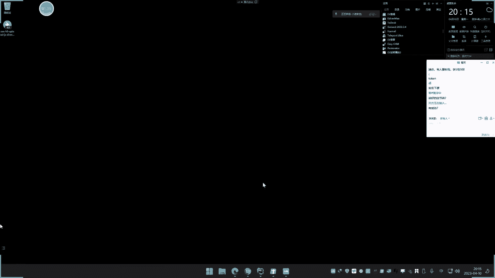

来我们看一下那个上节课那个翻车的原因，那就是他的源码，我们来看一下啊，这个是什么情况呢，就是说呀一个原因是什么原因啊，我先给大家说一个原因，就是这里少了这串代码，就是说这个在进入这个登录验证的时候。

我们要把这个toy重新在CC里面更新一下，就说这个C型的token呢，会在登录验证的时候重新刷新一下啊，然后呢这防止这个toy和之前的对应上的话，就可以一直爆破，就可以一直登录。

就说我说的防止爆破事件嘛，通过这个token呢防止这个事情就少这串代码啊，其他的基本上就没有了，就少了，这份代码就是在进入这个地方少了任何东西，其他的基本没有改，然后呢还有一个原因是什么原因呢。

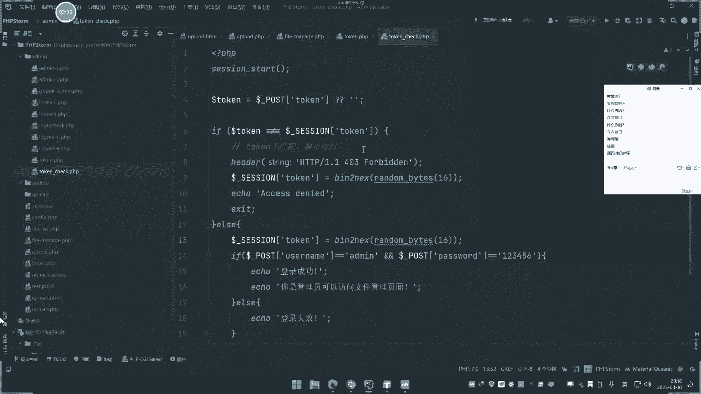

我就给大家演示一下啊，来我们先来看一下啊，这个演示我先把这个BUBU打开。

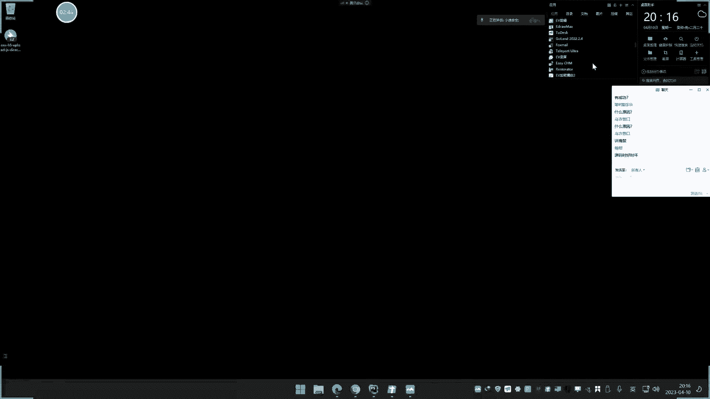

我们能用这个token技术来实现，这个数据包的卫星，来防止一个爆破，这是我们昨天上节课演示那个案例，对吧啊，除了这个房子爆破呢，也能防止很多其他一些漏洞的。

一些安全问题是吧，我们只是拿这个爆破呢来做的这个演示哈。

然后呢我们这里来做个演示啊。

然后是什么原因呢，我来看一下啊，我先运行起来啊，来。

在我们上节课写了个那个用pp开发的，一个后台登录，然后呢，加入这个token，来防止后台的爆破技术的应用是吧，他的账号正确，账号密码是艾米和123456，点击登录之后，它会提示这个。

然后呢即使你输入账号密码，它也会提示这个。

那这是什么原因呢，你看啊，然后你看一下啊，我把这个网址地址呢我放到这个浏览器上面去。

我发这个浏览器上面去啊，你看啊我这里输入一个错误密码，输入错误密码提示登录失败，然后输入正确密码，123456好，他就说登录成功就进入了这个东西是吧，就是一个正确的一个登录账号，但是这里这个浏览器呢。

你看我不管怎么说，他就提示这个什么原因造成的，你说对了，输错了都这样，所以啊我昨天上次课浮现失败的原因，就是浏览器插件导入的，就这几个插件，这个插件会自动帮我重新访问死亡的，所以导致那个C型被刷新了。

你说这种原因我怎么一时半会能够想得到翻车，不是我想要的，有些是技术差，但是有些事你没办法避免的，你没有考虑过这个问题，插件导致的啊，他妈的真是想都不知道是什么情况。

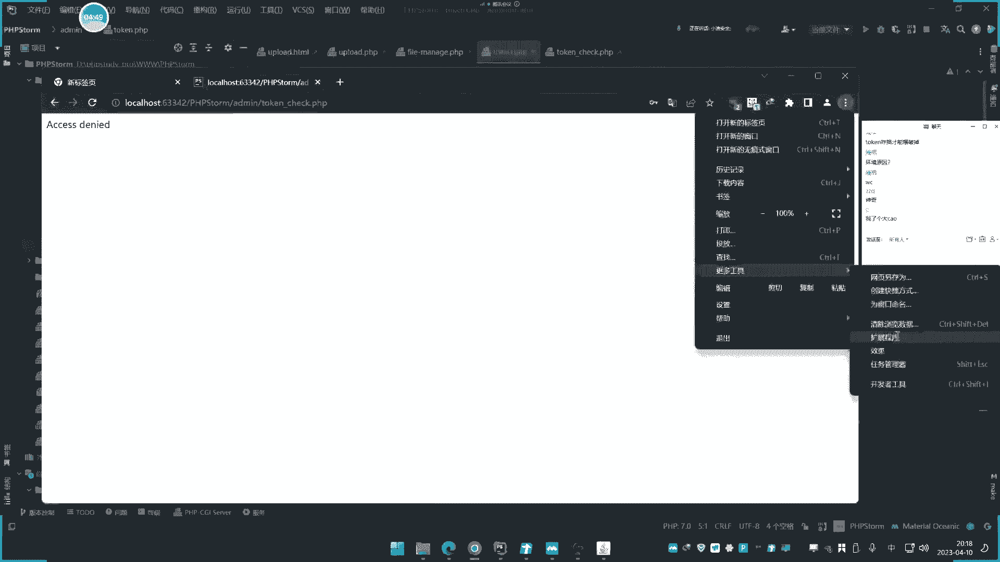

你看我把这几个插件一关关了之后啊。

你看现在他就能正确的判断了，他就能正确判断，你输入错误密码和输入正确密码，登录400，看到没，然后你输入正确密码呢，他就正常了是吧，你说这里面的谁知道是什么情况造成的呢，这出这机关想都没想到啊。

后面我是你妹的，测了半天，我终于找到原因，顶不住啊，实在是顶不住啊，插件是什么原因呢。

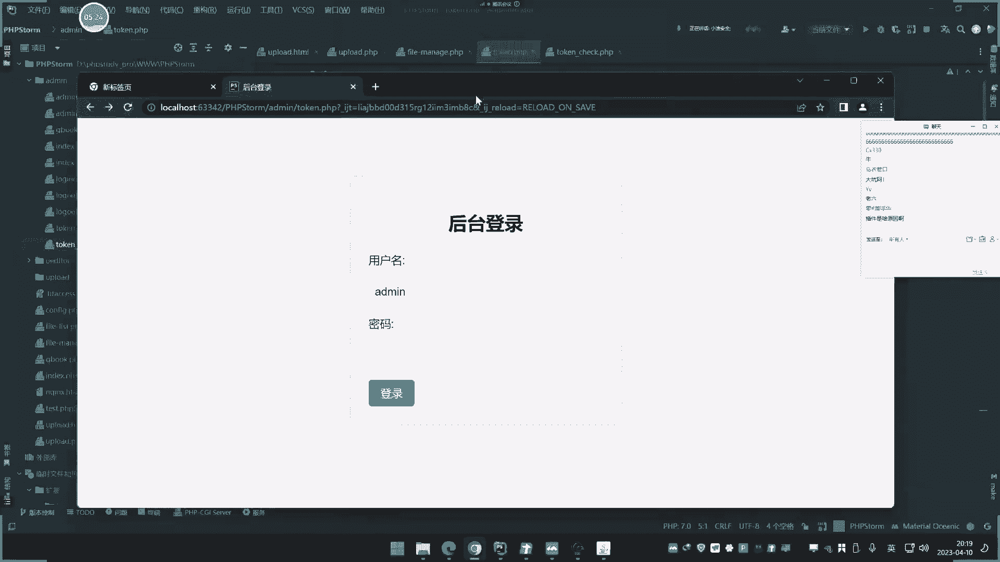

插件是因为这几个插件呀，你把它开了之后呢，这几个插件会调用你访问网站的资源。

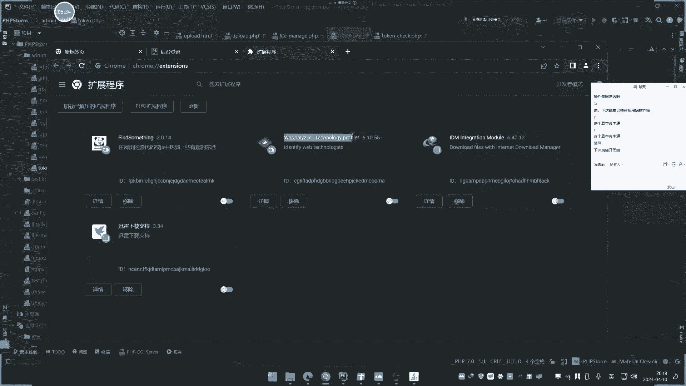

它会检测，所以它相当于重新访问一下网站，导致这个车型被刷新的，是这个原因造成的，知道吧，就像是他罚我两次。

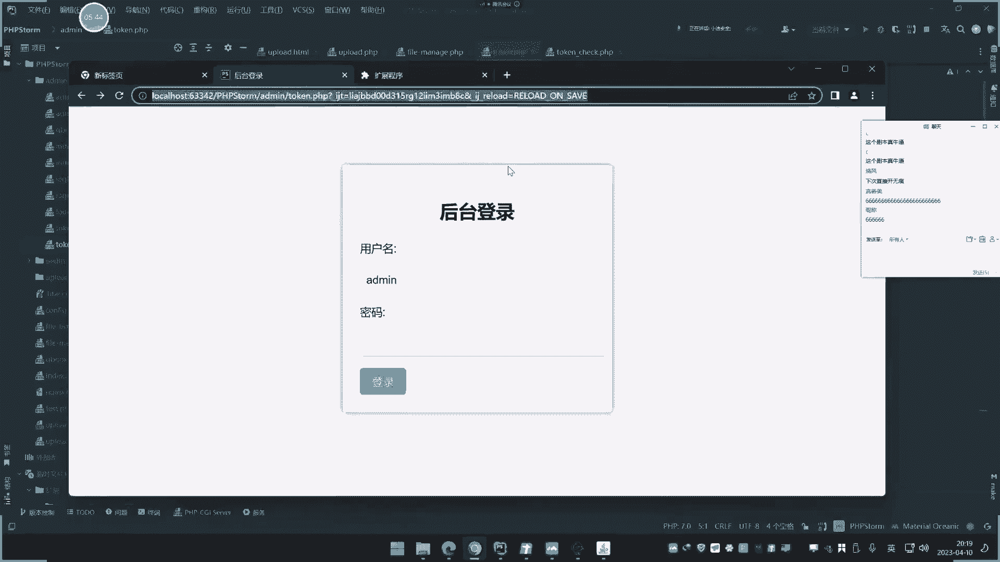

然后以第二次为准，好然后呢我们看一下啊。

就这个token呢有什么用处是吧，这是我们上节课把这个过程搞了，大家看一下用处啊。

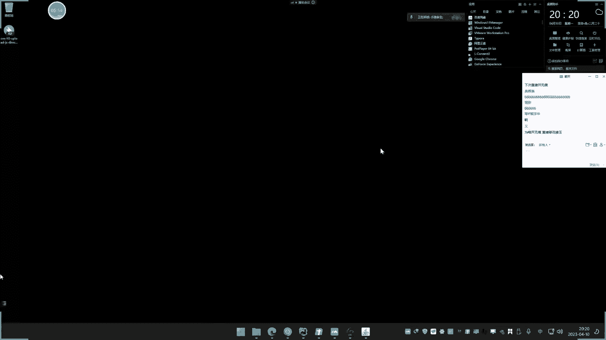

比如说我现在就要对它进行爆破，就这个toy的一个应用案例，我也要对它进行包裹啊，大家看一下啊，我现在要对它进行包裹，我们来关注一下这边的一个爆破的情况啊。

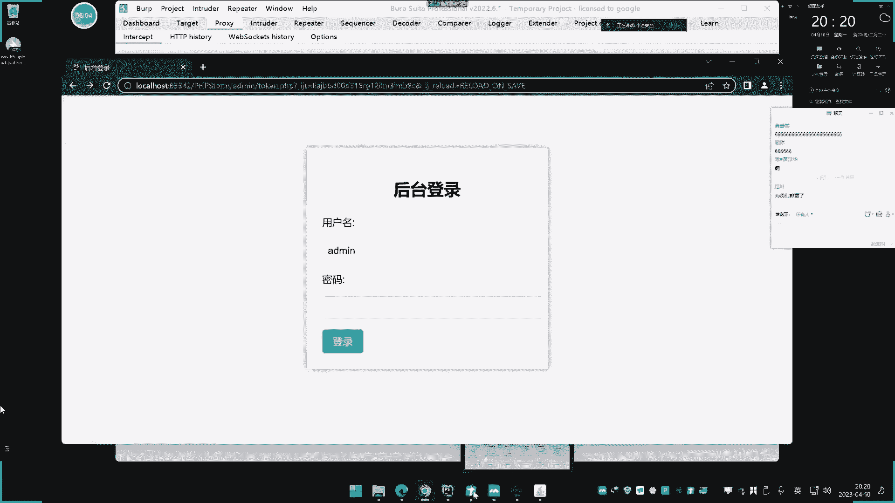

首先呢我们把代理开一下，把up主的包抓到啊。

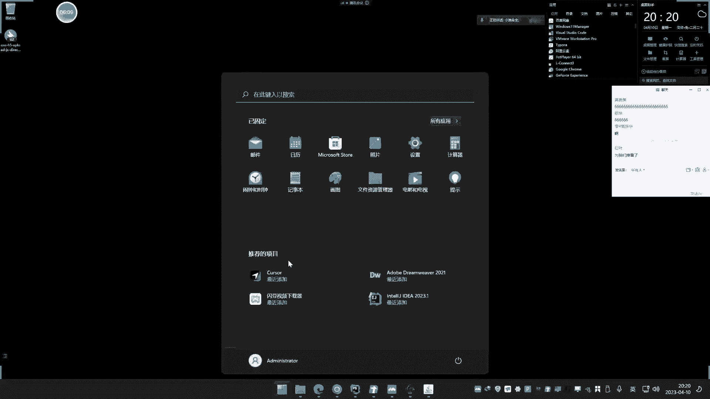

点击保存，然后呢在这边呢你看啊我输入正确账密码啊，数123123，这个是不对的啊，大家看一下啊，现在呢我进行一个包袱，把这个数据包抓到嗯，A是什么情况，怎么找不到晚。

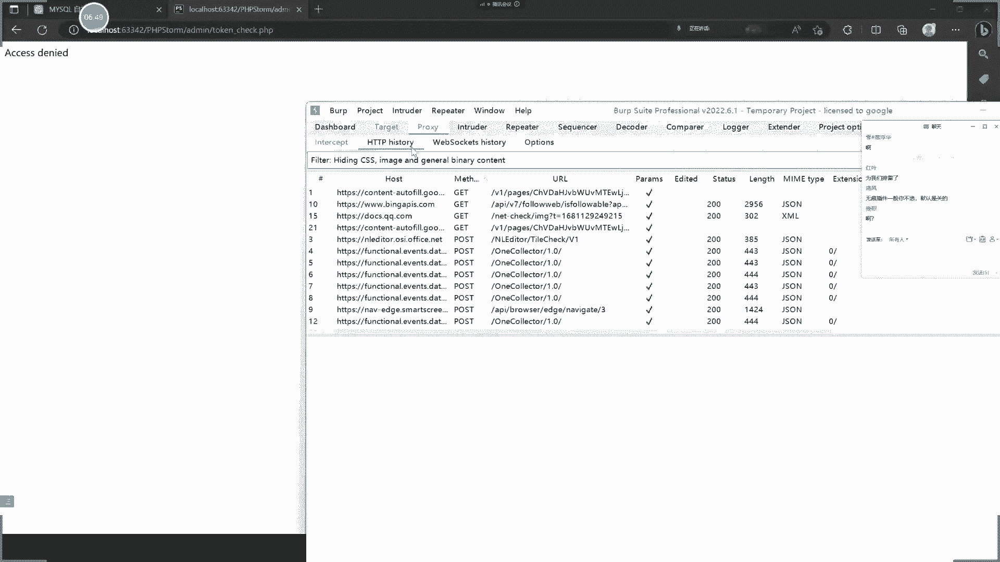

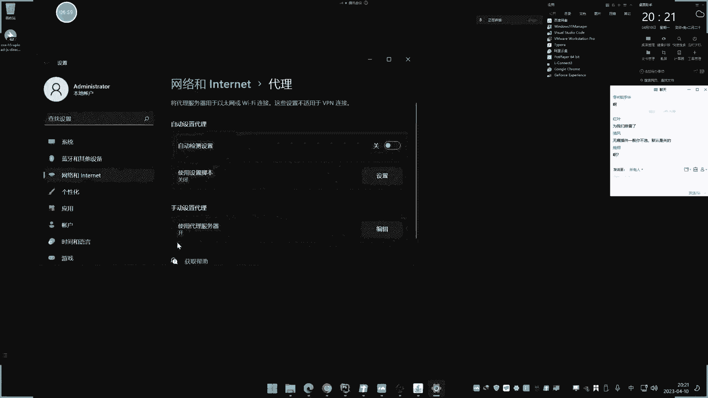

换个浏览器吧，在这边弄，好得到成功啊，大家看一下啊，我在这里抓个包，嗯这怎么抓不到啊，这什么情况。

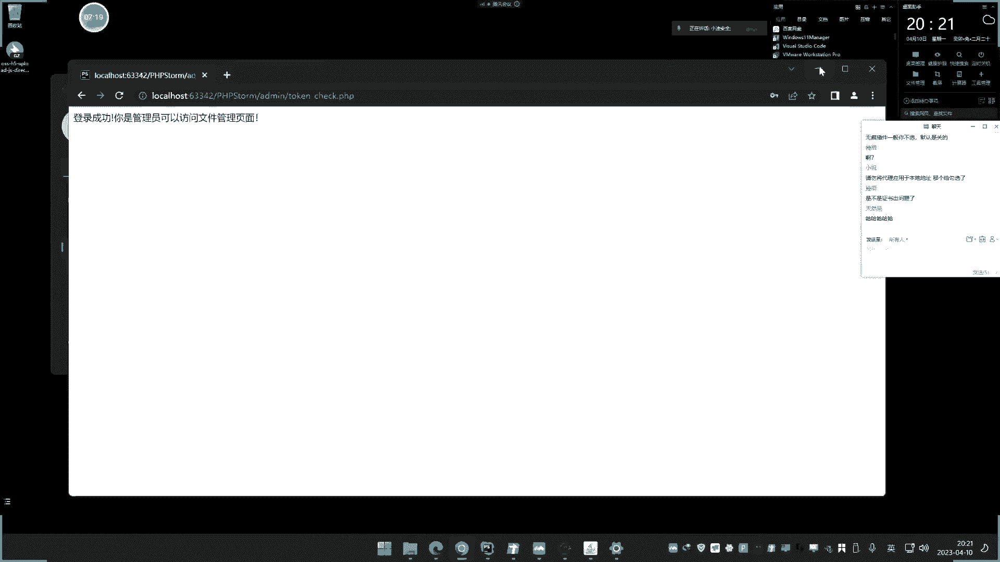

我把这个代理工具把它去掉一下，看是不是这个原因造成的啊，开一下。

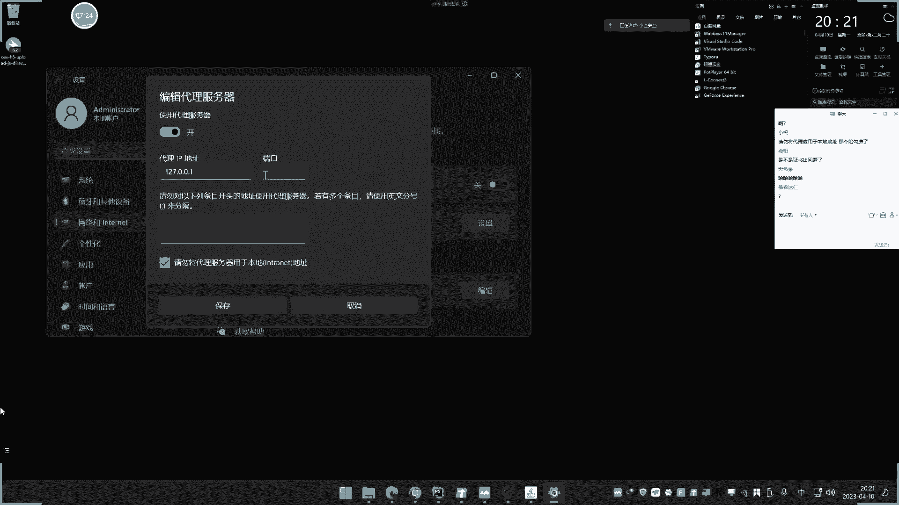

好抓到了，应该是，也不用抓包了啊，我也不用抓包了，我就给你看一下这个这个浏览器。

这边重新发一下包就完事了。

大家看一下啊，重新发一下包就完了，不用抓包。

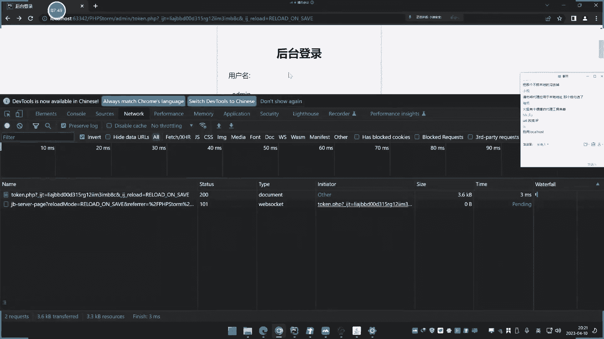

把这个地址也给改一下啊，因为他应该是那个调试器导致的啊，应该是那个调试器导致的。

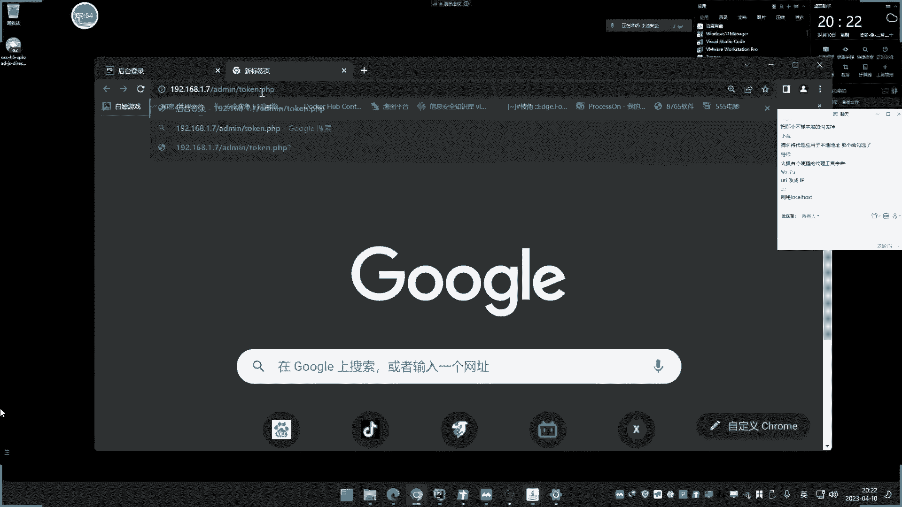

他在调试器应该不是个网站，他直接在调试，我用这个打开就应该可以抓到了。

那现在就应该能抓到了，好大家看一下啊，哪登录下来，比如说我现在登录看着啊，123456输入进去的好，把包抓到，那就是那个包好，大家看一下啊，我现在把它发送一次，它提示的是什么，登录成功，对不对。

好大家看着啊，这是一个很正常的登录，对不对，和我们逻辑一样，那么现在啊我重新再来试一下，我是个什么东西呢，我重新再来登录，假设我现在不知道他的密码，我不知道密码对不对，我用这个错误密码登录，点击登录好。

这是他的登录数据包，我们这里来测试啊，首先第一步测试的时候，它提示什么登录失败，当我们再次呢去对这个数据报密码进行更改，添加为支点的时候啊，我们可以呢按照这个正常的这个爆破的手段。

把这个地方呢把怎么样把它选中，然后呢进行这个爆破是吧，这里替换它的支点，这是我们做的一些常见的哈，写写专业字典，那即使我把这个正确密码写进去，123456把它写进去是吧，看一下啊，他能不能成功。

我们来进行这个访问，这个时候呢，我们看一下它的访问结果变成什么啊，看它的返回值点，Upset default，那123456，这里也是这个结果，为什么这是房子的爆破案，因为很简单的道理。

什么原因造成的呀，来包括这里呢密码我再发一次，变成这个了，后面我就无论怎么改，我把它改成正确密码也不行，解释这个错误，为什么呢。

就是那个toy的作用，因为就像我们上节课把这个拖级数讲之后，就在这个代码验证中呢，你要进入这个登录逻辑的时候，他就把C型重新刷新了，刀子啊。

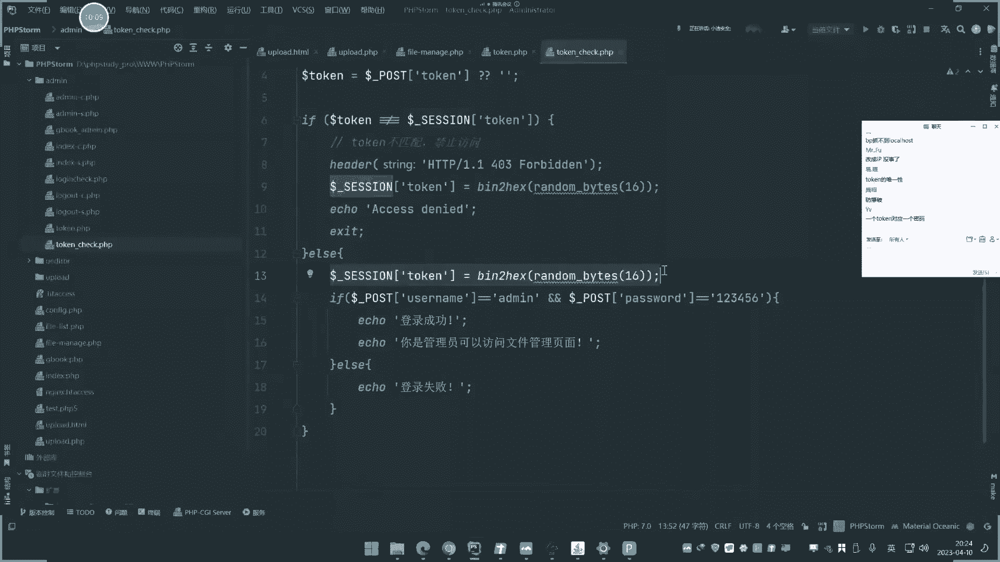

你再去登录就不行了，但是你可能会问，那我如果说我这里，假设我真正的自己输错了密码，那这里不也一样吗，查询关键就是这里呢我先输入错误密码，我登录好，它提示我登录400好，我再输入这个正确密码是吧。

你不是说这里改了之后不行吗，你登诶他能成功哦，输错密码我一直输也是登录示范，我再输错密码，他也是登录示范对吧，他也为什么在这边他是正常逻辑呢，到浏览器这边就不一样呢。

为什么呀，因为你在每次登录的时候。

上面就自动刷新了这个值，而你在这个工具这一边的时候，这个地方的这个token没有更改，就这个值是固定的，你第一次的数据包，你在发第一次的数据包一直在向前，你说你要让他这个进入正确的逻辑的话。

就必须要更改这个toy，但是你相对工具来讲，工具怎么知道下一次的token是什么，而浏览器是因为它刷新页面，重新提交的数据包，所以它自动更新了，他知道，但是你这里数据包工具这里。

他不知道下一次出现什么样，所以也就是说，这个技术就直接防止了这个暴力破解事件，因为你不知道下次这个TOK要是什么东西，你就无法保证这个数据包的唯一性。

对方就不予接受，直接给你在这个衣服这里，这个直接进入这个呢，你不等于就直接提示这个，你就没有进入正常的账号，密码的判定逻辑里面去，而你在浏览器那边，是因为浏览器呢你在重新发包的时候，它是会自动生成的。

to保证和那个C型的是toy到接收到的一样，就会进入这个逻辑，所以你只能在浏览器那边一个个尝试，那么你想你不可能爆破以前那样常识啊，对不对，还是要用工具，但是工具不行啊，工具不知道下意识的TOK值呀。

是不是就和我们说TOK的应用价值就知道了呀，所以这个token呢就是我们说的数据包的唯一性，这就是它的功能，他的房子类似于爆破事件，包括一些其他漏洞都能够放置到，因为它只是检测这个数据包的卫星。

你只要是从莫名其妙发到的一些数据包，他都不接受，除非是真正的归啊，这个正确的数据包他才会接受，好这就是我们上节课遗留的那个问题啊，已经给他解答了，包括刚才演示也没演示啊，所以大家就知道了啊。

那个toy是一个什么东西了啊。

以后也要通过这个案例呢，大家应该也知道了，你当你去看数据包的时候，它这里面有这种东西的话，那你就应该意识到这个东西是吧，是是什么情况啊，你能不能做哪些安全措施了，就心中要输了啊。

好我们现在再来看今天要讲的内容，好哎呀。

一讲这个我就想起来你们有些人呐真是真实啊，不讲他一直在那里。

在那聊天框里说讲啊，讲脱口就上去给他，我也没见过你以前这么好学呀，你咋现在这么好学了呀，我真是难为你了呀，对不对，刚才他还在说讲，我就想起你以前你还不是要买我的号给别人学，你咋现在这么爱学习的呀。

你变了呀，你是不是真把号卖给别人了呀，不像你以前那编了。

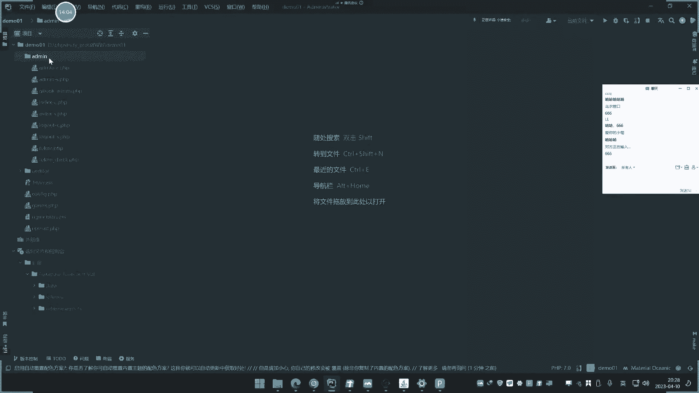

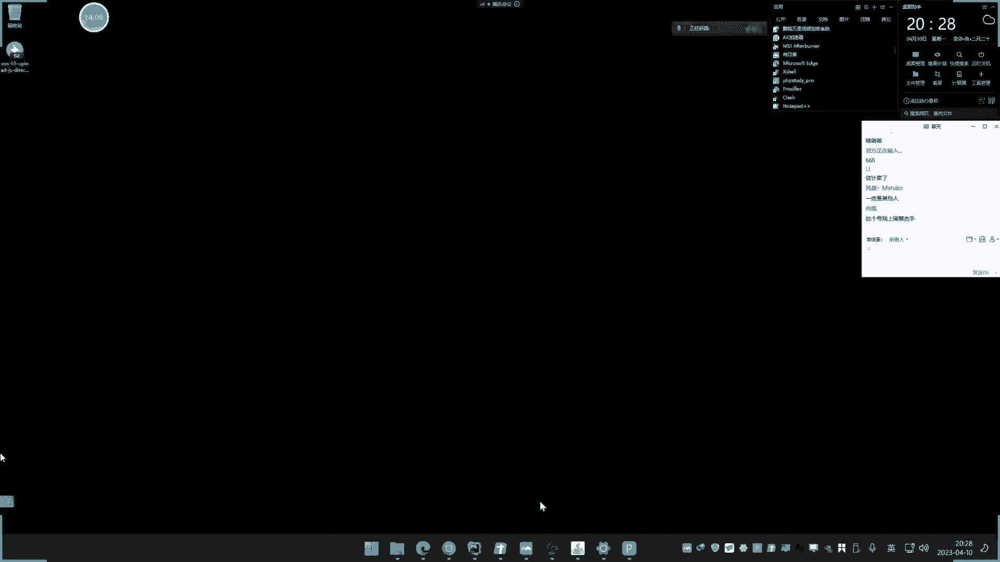

我等下下去我就要查一下，看是不是卖了啊，好我们看一下这个经典内容啊，今天讲这个文件管理，这个文件管理的就是我们说的这个什么文件，上传文件，下载文件，删除文件，编辑文件的包含等等，就是有五六个那个功能啊。

我们今天讲两个功能，就讲这个文件的这个这个获取它的一个目录，包括这个文件上传，包括主要是文件上传啊，因为文件上传的和我们后面要讲的，这个文件上传都用的，它是息息相关的，那么文件上传。

那我们现在先讲它的功能实现，我们再从这个功能实现上面，那再给大家去分析这个相关的这个过滤机制，和这个绕过是针对哪一个类型的，从代码角度去给他分析啊，就是从我们开发的角度呢。

先把功能实现再来思考它的安全点，这就是我们为什么要讲这个系列课程的原因啊，就是从一个呢是大家会开发能读懂代码，那么后期呢在看代码分析漏洞的时候，那就更容易啊，在做代码审计这方面是有优势的。

那么现在让我们看一下，这个文件上传的一个功能。

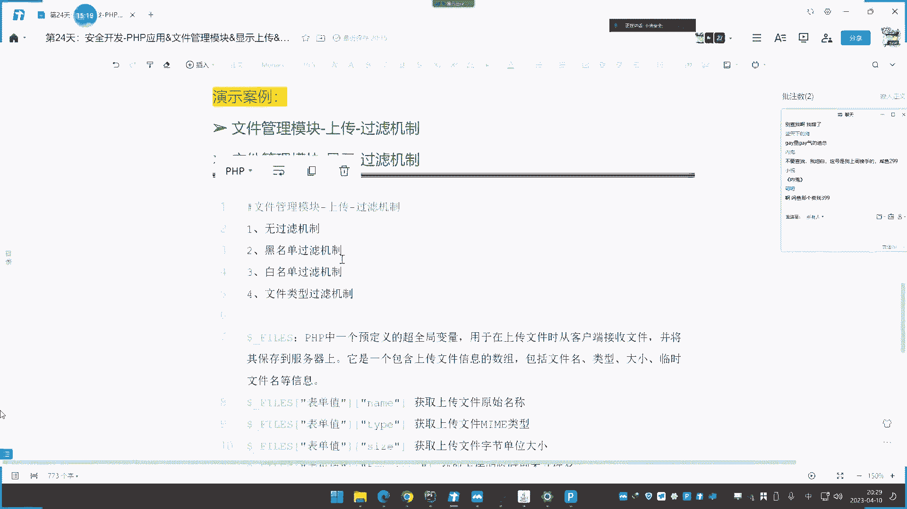

实现这个功能实现是非常简单的哈，首先呢我们要这个准备一个这个页面啊。

就新建一个页面，新建一个叫upload点TM文件。

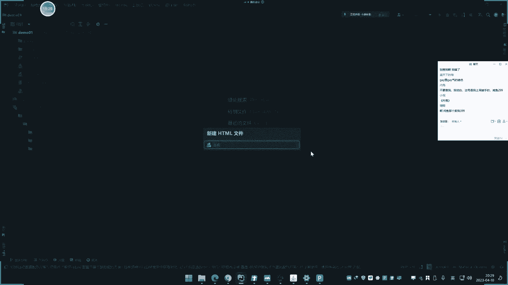

这个TML文件呢就是用来做文件上传的。

这个表单啊，为了这个写的漂亮界面呢。

我就用这个，因为这个tab呢不是我们学习的终点啊，我们学习的后端啊，这个页面的设计，那是不是我们想讲的，所以我这里就问一下这个切个GP啊。

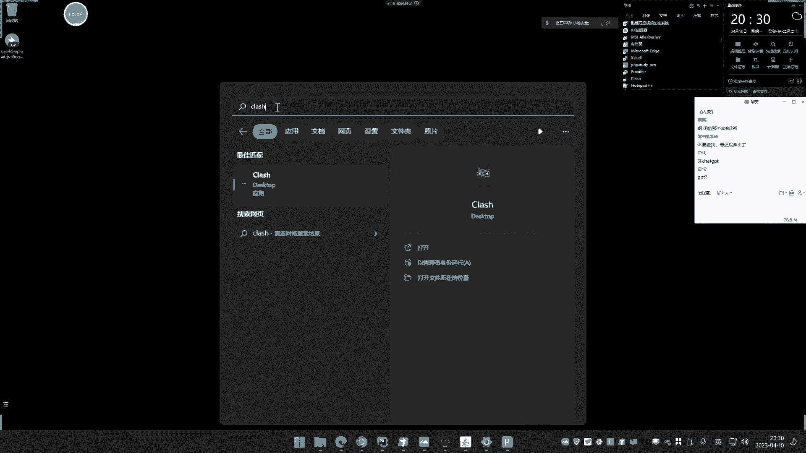

让他帮我去搞一个漂亮的文件，上传的这个这个这个操作好了。

我再来问一下，切个PPT，把它生成一个这个东西出来啊。

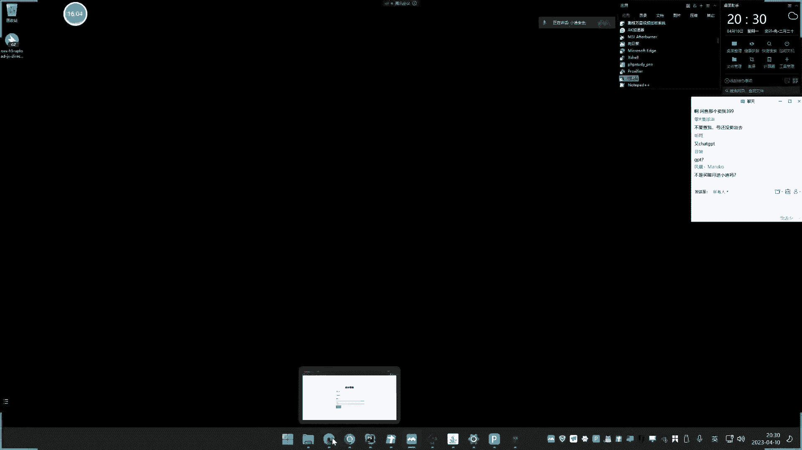

问一下他啊，问一下我们的切BB，JM呢哎写错了，帮我HTML写一个这个界面美观的这个商城页面，文件上传页面，我们只需要他这个界面就可以了啊，后面这个文件上传怎么处理呢，就我们在用PP实现。

我们就先把这个页面写出来，让他搞一个漂亮一点的啊，我们自己如果说自己写的话，就是这个cs的一些东西啊，这这不是我们学的啊，我们也不用学这个东西，因为这个东西呢就是搞没关系的，没不没有什么安全意义啊。

不是说不教大家啊，有些人呢你不给他讲清楚，他觉得是吧，这里不灰啊，怎么滴啊，全是我不会这个cs啊，因为它也不重要啊，不是完全需要学的，哎他这个是用JS写的吗，这里面的哎呀，不要用JS写JS写的。

这还不行，哎呀我直接用我之前的那个吧。

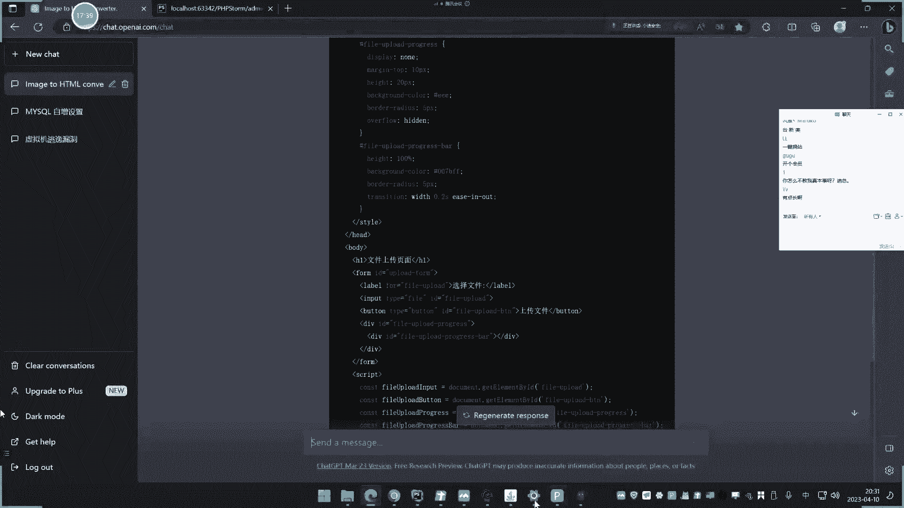

这JS也不行，用JS写的啊，换一下这个JS我们现在没讲到啊，无论是纯ATM写的，那就这个吧，这个我前面生成的啊，把它放在它替换下，大家看一下这个页面啊，大家看下这个页面，我们可以打开。

给他看一下这个文件上传的一个界面，然后这里选择文件是吧，这个上传呢主要是这里一个表单，前面都是这个央视啊，这没什么重要的啊，这是个表单，表针呢就提交给upload pp，还用post提交。

然后这里呢有个这个文件，这个这个列表name file，我们在这里选中一个upload pp啊。

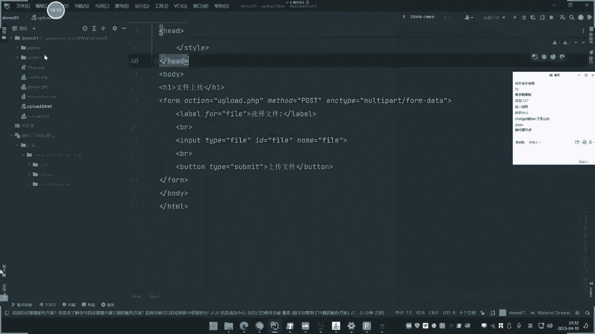

已存在在这里，然后在这里呢我们就写核心代码，写核心代码，啊用pp开发的，那这里呢就是接受这两个值，然后如何接收文件上传过来的信息呢。

这里要解一个全局变量，dollar f p p里面dolf files，它是PP一个预制的全局变量，包括权力量，我们上期的也上上上节课讲过啊，有大概九个是吧，我们都已经讲了三四个了。

这个DFS今天又讲他是专门来处理文件上传的，包括会获取到上传的文件名。

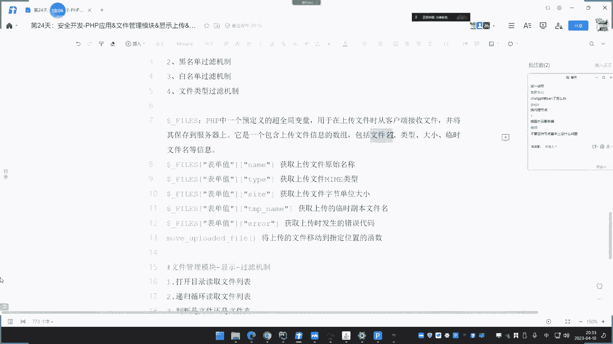

类型大小和临时文件名等信息，那这个东西是怎么获取的呢，来看一下啊，比如说他这里呢传递过来，我们怎么获取呢，看一下啊，我首先声明一个变量叫name等于DOTFILES，然后什么东西呢，这里写什么东西。

后面再写什么东西呢，大家看一下啊，这个第一个就是我们说表单的参数值就这点啊，name等于file，就把这个file写进去，假如这里改成X，那么这里就是X好，我先把它改成这样，改file之后呢。

这里就结束file，这里属于那个更改了，然后这里就结束name，这个是固定的，这个意思就是接收文件的名字，dota files soliguys啊。

这个就是接收文件的名字，就是它的原始文件名，获取文件的原始名称，就是他上传的是什么名字，就什么名字，然后这个呢就是我们说的这个top类型。

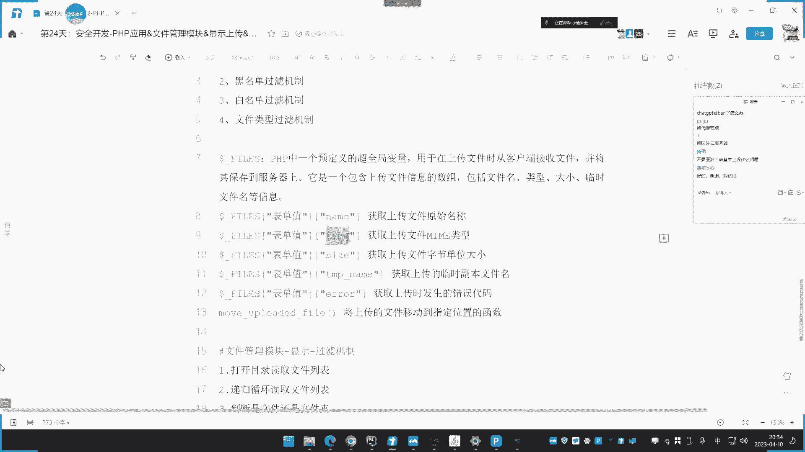

那我们就依次写这个地方，这个就截取类型，类型top top，然后呢这个再解释他的这个大小C字，同样道理sex，然后呢结束他的TPLTP，这是临时文件名啊，这个临时文件和这个文件名有什么意义啊。

等下大家看一下输出结果，然后呢再来解释一个错误代码hero，就如果说你上传错误的话，这里会有一个错误信息，那么这里就是error，就后面这个东西是不用改的，是固定的啊。

后面这个name on top c值是固定的，然后这个里面的值是随着个表单的更改好，我们先把它进行一个打印看一下啊，给大家看一下效果，一直打印文件的内蒙子，文件呢这个这个值，然后呢文件的大小。

然后文件的这个临时文件名，然后文件思维错误，把一式打印一下啊，加上这个换行，加上换行啊。

好看一下，我们输出一下来打开页面，现在是为空的啊，现在是为空的。

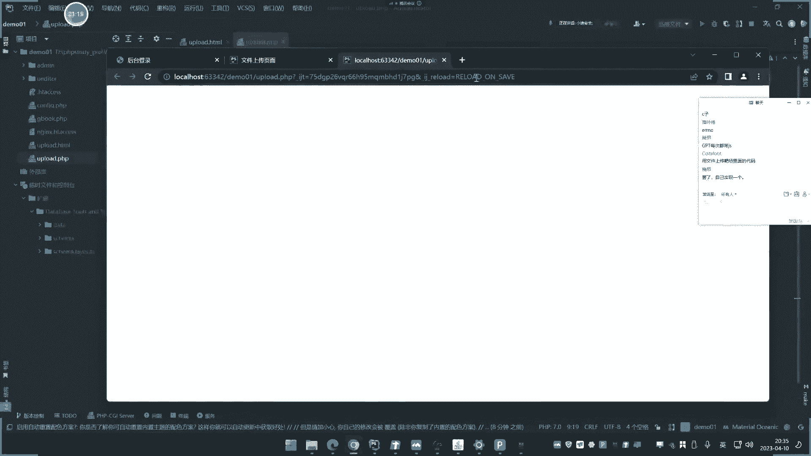

好，我们先来商量一下啊，看一下啊，选这个文件啊，随便选这个文件啊，选这个文件，来我们学这个文件啊，就这个上传，你获取到了upload文件名JPG，诶，怎么其他信息没有获取的，这里是这个fire。

其他信息，这里那里获取什么new啊，写错了，Dollar files，好我先一个获取一个获取好吧，一个获取一个获取，先上下文件名，这里是提交upload点pp。

upload点pp，对的来，我们一个获取啊，刷新一下。

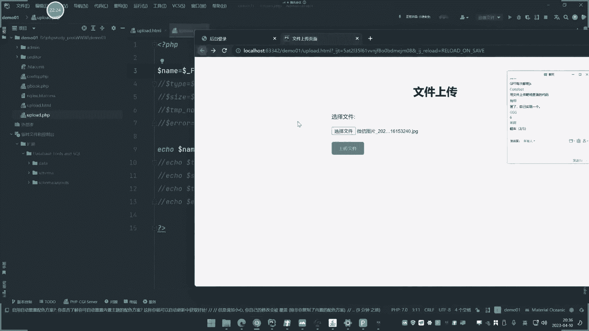

那文件名啊，文件名对了好，再看第二个获取类型。

刷新一下。

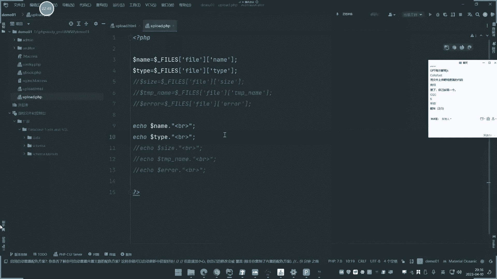

哎这哪写错了呀，这要是出现什么情况，这还真是意外了，来来这边试一下。

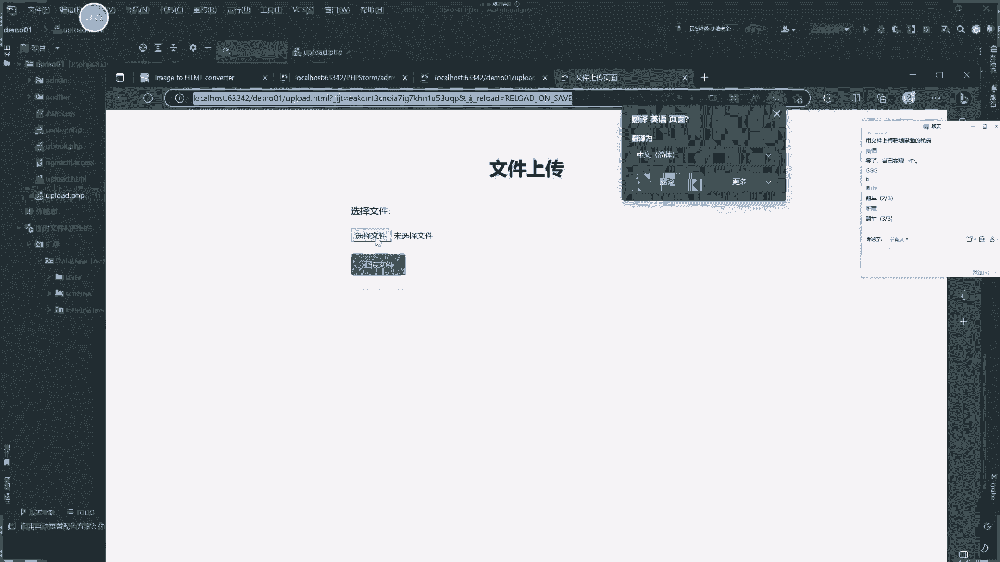

这还真是意外了。

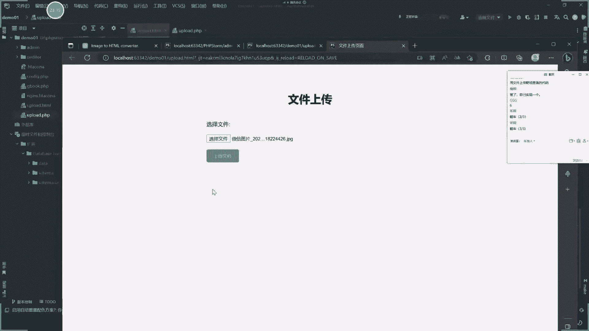

好文件名是获取成功的，然后这个类型这里歌曲不成功，这是啥情况啊，这，然后这个大小看一下啊。

看大小，大小为零。

大小这里为临时文件名，看一下，我看是哪里问题啊，我怀疑是不是上传文件的问题，我换一个文件应该就好了。

换个文件把这个又是零大小了。

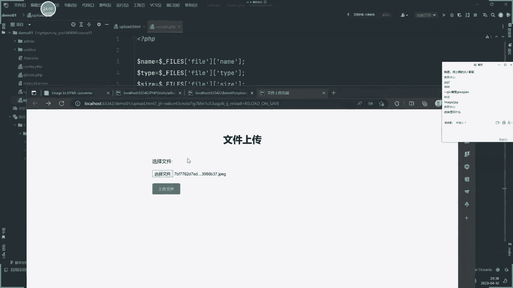

这个错误代码呢，随便上传个啊，就上传这个pp info里面的。

随便找个文件二点TP也对了。

这个是获取大小为零，大小为零，错误代码，零四文件名都没有显示，包括这个错误代码，这里。

好也不对，来再来试一下，来大小错误。

代码的尾流，那说明错误了啊，上传的时候发生错误，这个是哪里出错，这真是莫名其妙，我这。

来来这里有人去访问一下啊，我直接在这里发问吧，192。168。1。7，不low的，要不楼的点天麻。

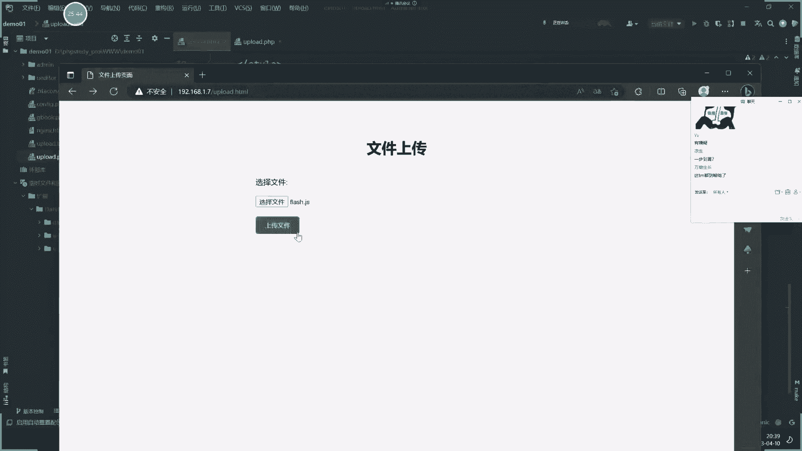

这是什么情况，这是真是，怎么上传不了了，变成了，我把这个值改一下看，改成TX，改成这个，cf吧改成F，等下查下多了吧。

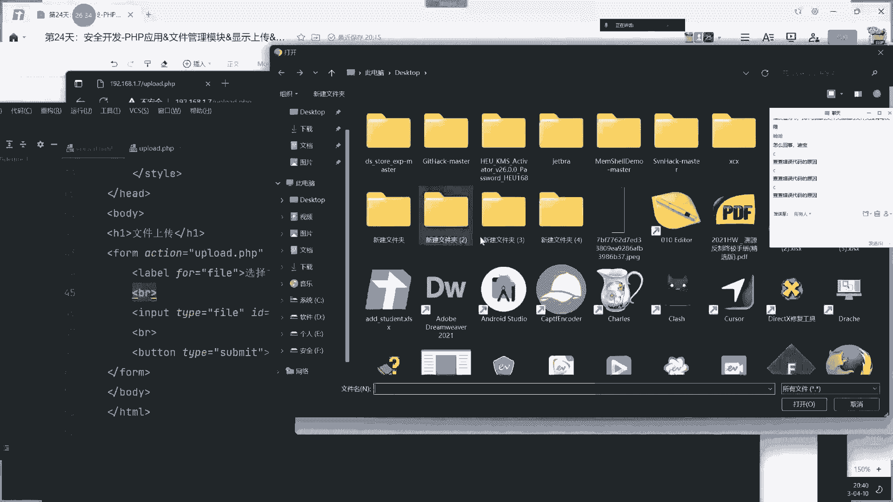

这正常的写就这么一个情况，说到我六看一下那个files这个错误代码的，下午都好好的啊，六是找不到临时文件夹，找不到临时文件夹，全线被删了，清空的临时文件夹。

稍等一下啊，我开这个项目的啊，那天写好的嗯，不应该做一些事情，在一些莫名其妙的一些原因。

把这个人都要搞死的，来看正面啊，重新上传一下。

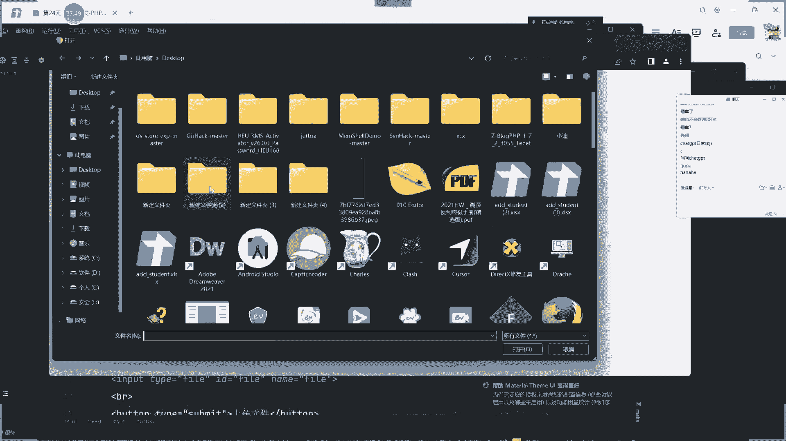

试一下啊，看正面的一个代码。

完了完了啊，看来这个要麻烦了啊。

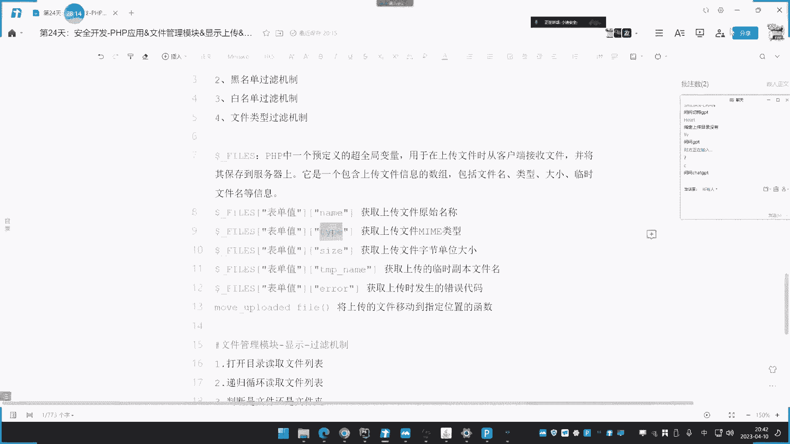

我用虚拟机测试吧。

环境原因啊，不是这个代码原因，我下午上课之前，我清理了一下电脑，可能是把一些临时文件给他删掉了，应该是那个原因造成的。

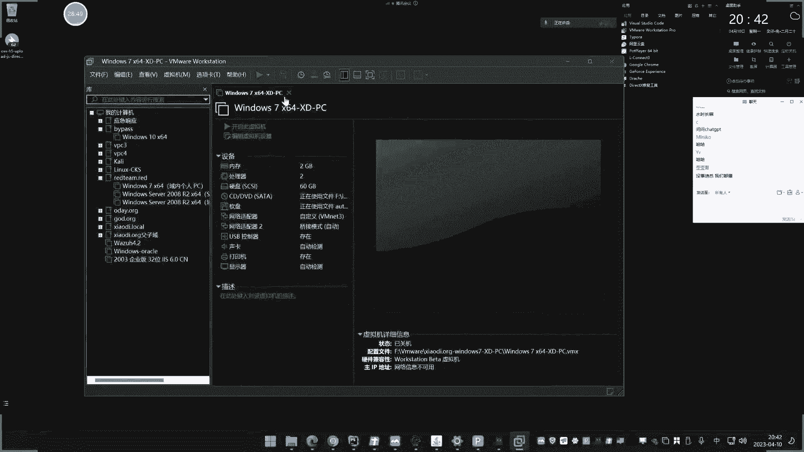

好我让我服务器这边来测试。

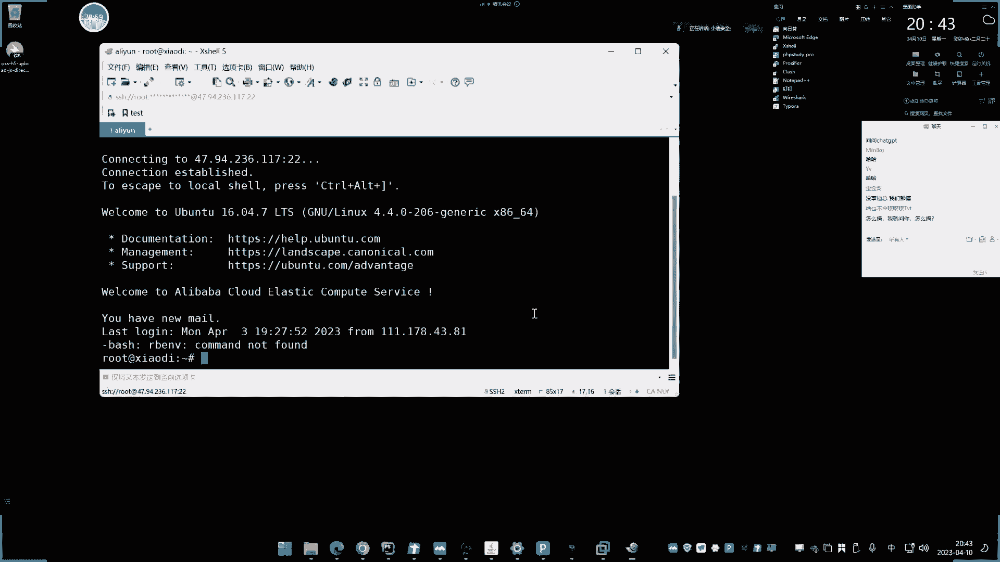

把源代码写到这上面来测试啊，本地环境是有问题，好我们把代码放上去啊。

这也太麻烦了，没办法啊，只能这样搞了，这个环境一时半会搞不了，不知道是哪里解决不了，我先把这个东西放到那里去，两个文件啊，把它复制一下。

把PPP3D重新启动一下，看下，好发到上面去啊。

好我们来访问一下这个服务器这边的啊。

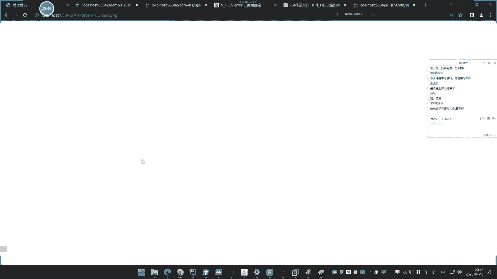

好看这边啊，我们在这里上传个文件啊。

大家看一下的，看到没，他正常了，看到没，所以说讲的没问题啊，在临时文件夹刚才报了个错误，是临时文件夹的问题，就是我电脑上面可能是我清空那个东西导致的，所以说不是说代码有问题啊。

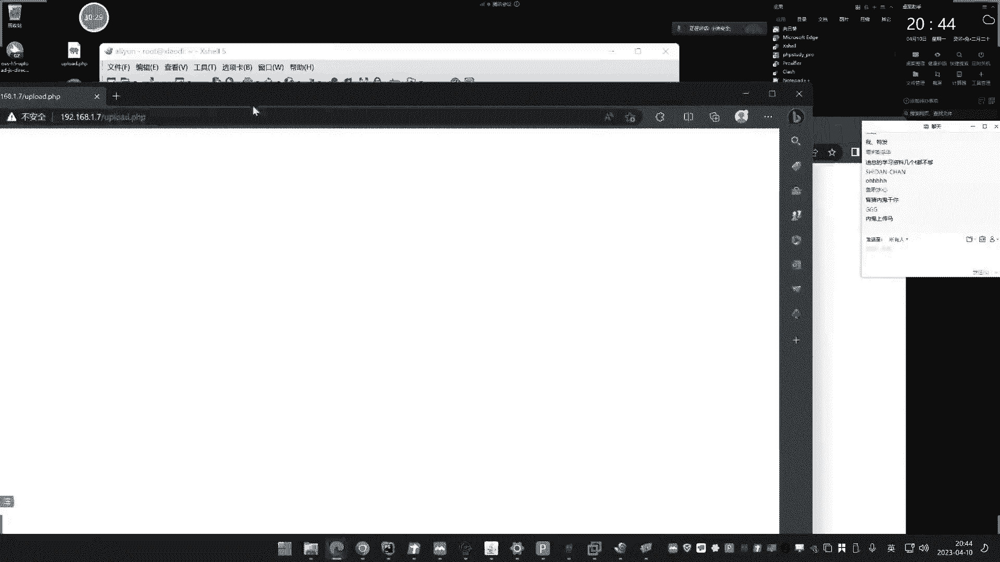

这种问题你说出现了。

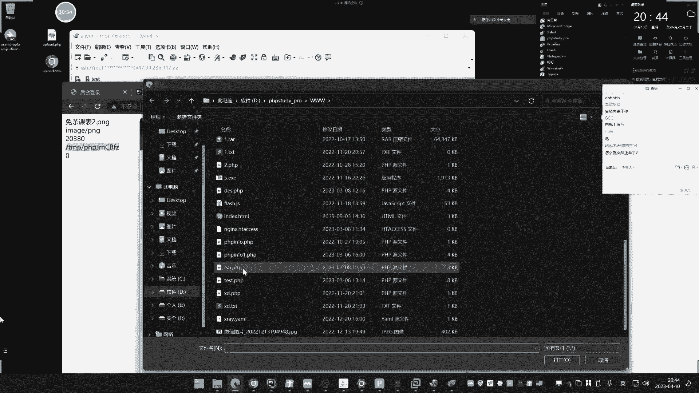

妈的这真是不知道什么情况，有时候啊现在正常了呢，代码一模一样，换了个环境啊，电脑环境过去重启一下就好了，就是我把那些零食东西给他删掉了，导致那个临时文件夹没有了，然后呢这个搞完之后。

你看他是获取这个类型和文件的名字，包括它的大小，这是以字节为流的，是2KB吧啊这个零是他的目录存在的，然后您就是那个没有错误好，那这里呢就是这几个一个获取方式，那接下来的话我们如何把文件给他上传了。

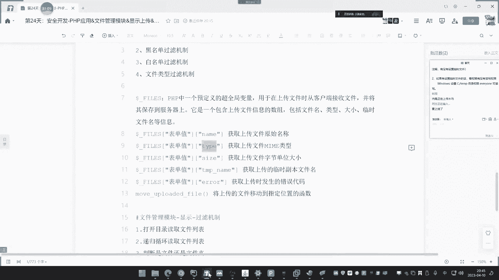

可以利用这个movie参数来进行上传，那怎么操作呢，在这里呢我们先把这个注释一下，进行了这个移动，移动的第一个参数值和第二个参数值改一下，一个参数呢就是我们说的这个移动的文件，移动谁呢。

这TMP橡皮live把它移动到哪里呢，移动路径啊，就是写到哪里，比如说我们就把它放到这个UPLOADERSUPLOADER下面，然后呢加上什么点上传的文件里，把引到这下面来啊，可以进行一个判断是吧。

如果，他这个移动成功，我们就输出一下吧，这个连接到什么，那如果说失败的话，那就是这个是吧，我们就不提示了，就搞这个了，然后呢我们可以自己试一下啊，移动到这个地方来，对不对。

然后在这里创建一个什么upload目录，也不知道怎么弄对吧，我们可以试着去访问一下呢，上传啊，重新上传个文件，随便上传个上传啊，包没有包任何问题，因为我这个本身环境有问题，所以他这里他也不提示是吧。

所以我只能在这里呢把那个圆的给他们改一下，只能在服务上面测试了哈。

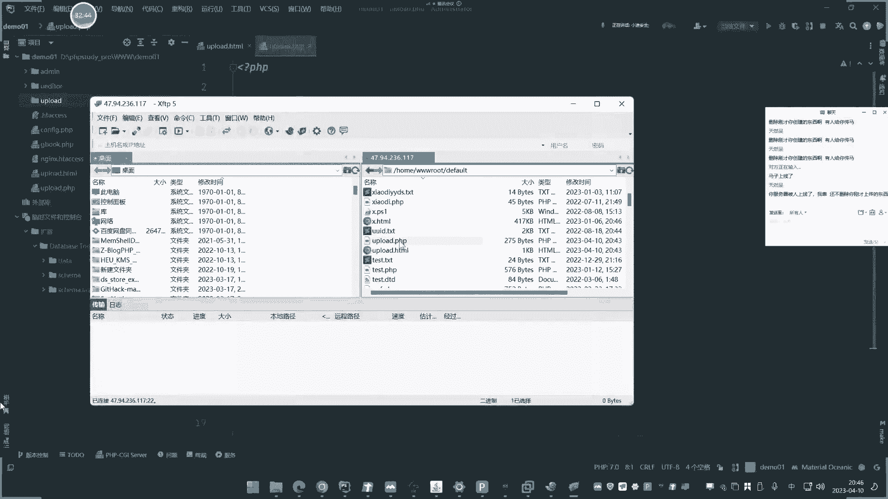

这环境有问题，你说咋办呢，是不是覆盖一下。

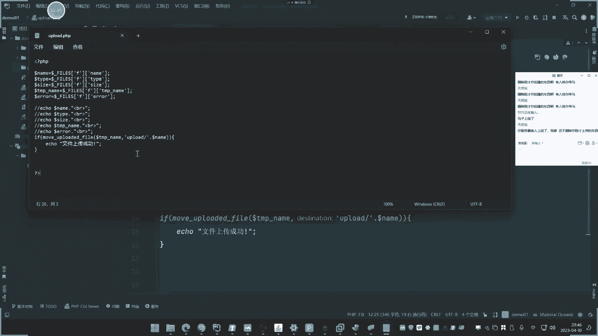

然后这里呢上传到upload目录，我们在这里呢找一下upload目录，有没有啊没有，我们创建个，创建一个目录blog好，我们来看一下现在upload，但是为空的。

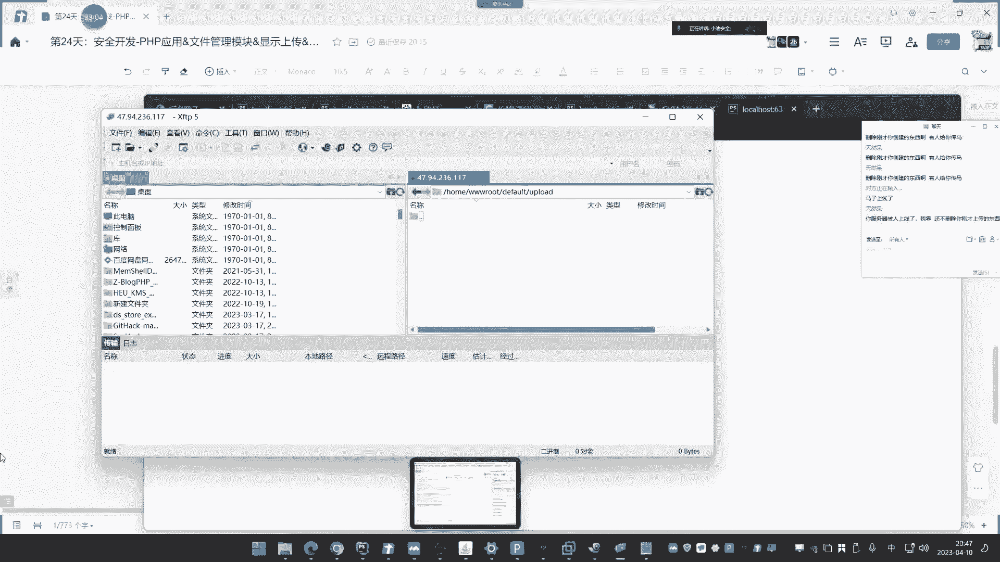

这个时候呢我们去访问一下这个网站，这里啊，来我们开始刷新一下啊，上传和文件来看一下能不能上成功呢。

上传好看，这里哎这啥情况啊。

怎么又错了呀。

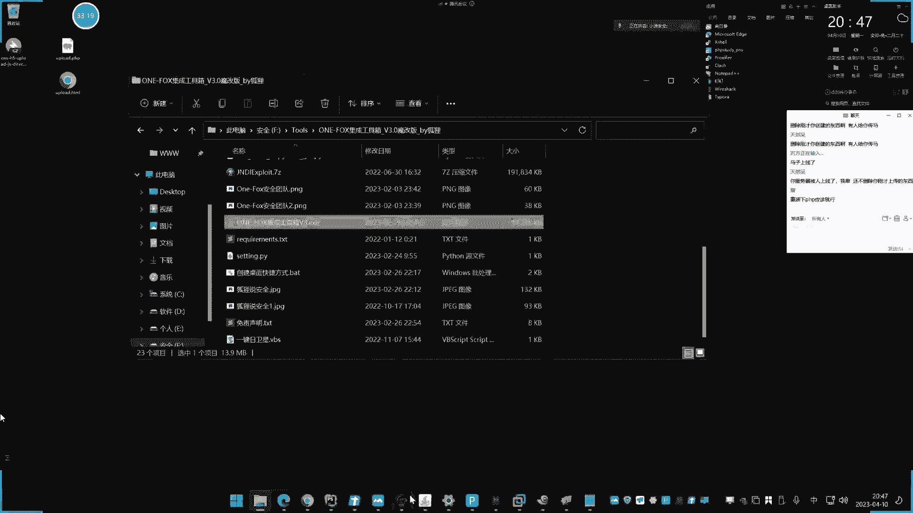

好，low啊。

嗯这里呢就上传这个临时文件名，把它上传到这里，那我这里呢应该是怀疑是目录的问题啊，再来我就把直接上传到根目录，或者是这个路径结构，这里呢就看需要了啊，我怀疑是路径问题，现在我们这边的一个代码之前写好了。

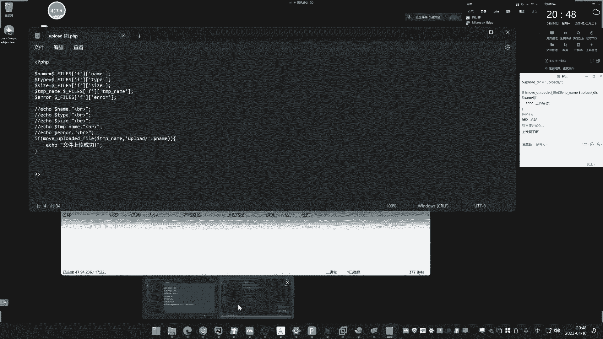

上传到这个upload fish。

应该是对的啊，临时文件名加上去，直接用这个命令呢给他看一下啊。

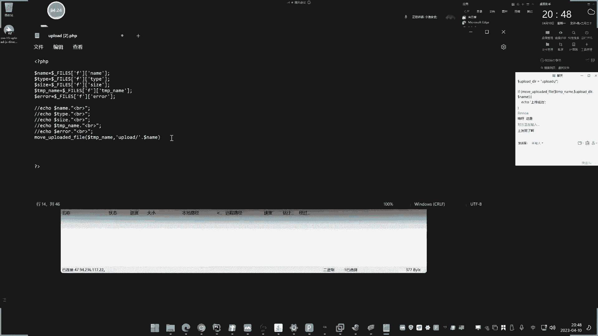

刷新一下这里啊，看这里的upload目录，哦这里没给写入权限啊，不好意思，这个原因造成的，好干脆写进去了，刚才没有给这个目录权限来进去了是吧，能上墙啊，上去可以再试一下了。

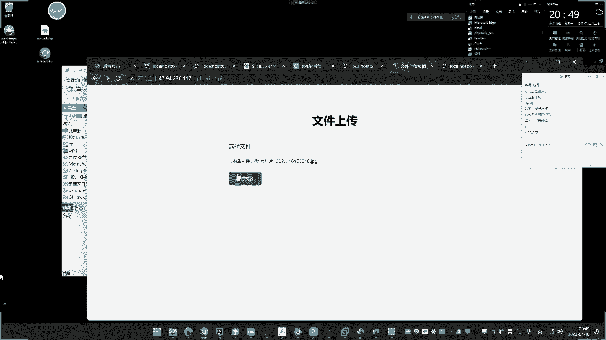

那个提示我就不写了啊，这是带个文件，那随便上传个文件，再来看下来。

再来看看这里哪个先进啊，你看这谁都上下个pp引发了是吧，不要搞不要搞事啊，什么鬼，怎么都在上传来，我都上传上去了，好那这个人上船了哈。

那接下来的话我们就把这个代码给删掉了，能不能上船，第一步呢，我们现在要做什么事情呢，现在呢就是说哎只要做过滤了。

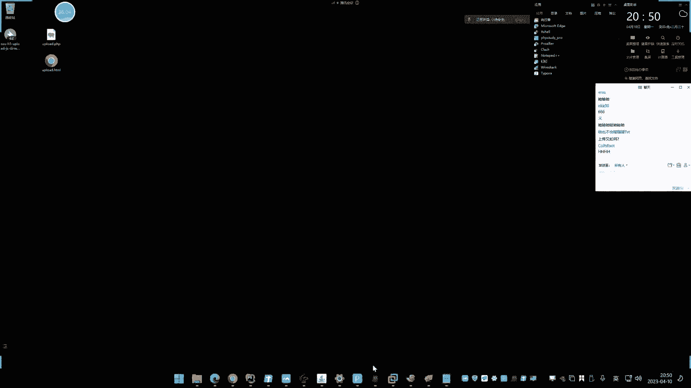

那过滤的话，一般文件上传的有三种过滤方式，一种黑名单，白名单，还有一种叫类型过滤，我们现在黑名单黑名单是啥意思呢，黑名单的一个过滤呢，简单来说，就是我们固定好一个不能上传的类型是吧。

那固定好一个不能上传的类型，一个不能上传好类型啊，什么叫不能上传类型的，不能上传类型，就比如说我们现在呢有的是TST是吧，有的是TST，那有的呢用的是什么呢，有的是其他的这个格式啊。

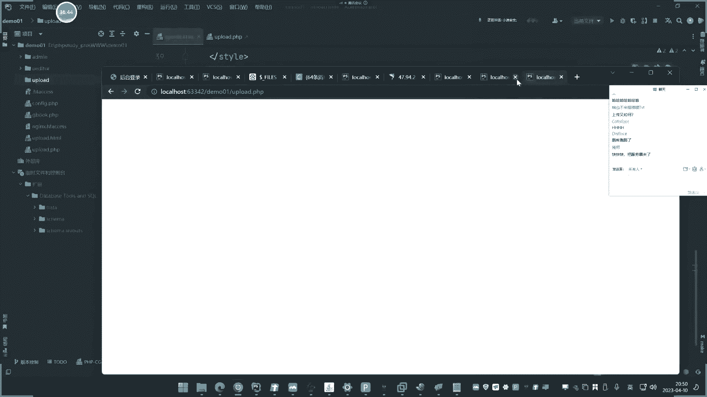

对不对，又是其他格式啊，好我们先来看一下黑名单的一个概念啊，那现在刷底黑名单的，先把这个删掉，这是正常的啊，这是正常的逻辑，那么现在看合订单的，有基于这个文件后缀呢进行验证的。

那首先我们定义的变量叫black qu，然后EST就代表后缀等于什么呢，一个数组里面写上一些黑名单，比如说p h p asp jsp asp x，对我上去这东西上去上去啊是吧，这里呢就是黑名单。

然后我怎么做呢，我只是要得到文件的这个后缀名啊，是要得到这个文件名字啊，名字里面进行拆分了，我这里可以用到这个expo p1，这个是干嘛的，拆分的，他怎么拆分呢，就是把这个接收到的文件里面把它拆分。

就是格雷姆嘛，把结束到把内蒙的进行拆分一点来拆分，就拆分到它的文件名是怎么个文件名，就上传获取的文件名，是不是就是叉叉点JPG或者叉叉点PNG，这种文件，是要把这个点后面这个PNG给它获取到。

然后呢进行对比，这个后面的文件后缀，来进行这个文件上传的判断了是吧，就是我们说的上传文件后缀的这个过滤是吧，然后采用黑名单机制来进行过滤，就是我定义好这些东西是不能上传的，因为这就是我们常见的一些脚本。

后面的文件格式对吧，我这个定义好，那这里呢就是拆分这个接收到的文件名啊，一点的来拆分，那这个东西又该怎么写呢，其实也非常简单啊，我们直接复制过来啊，那就这样写，那以这个点来拆分这个结束的文件名。

文件名变量赋值了，就是等等，是以点拆分啊，名字叫风格，我们可以输出一下这个风格。

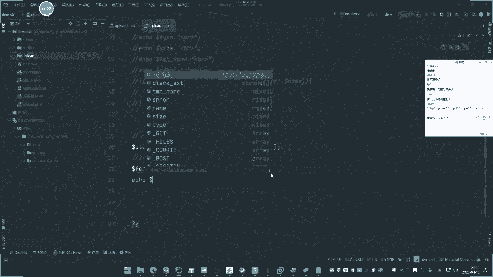

这样我们可以运行一下啊，这个是可以上传接收到文件名的，好我们试一下啊，来访问一下这个阿波罗的，比如说上千个文件名啊，你看我上传上去这个点JPG的。

好他其实是个error，因为他是个数组啊，这个把它拆分拆分之后呢，他有个这个拆分的一个过程，我们用的再把它表示出来，嗯这里呢把它截取了，那这里呢这个把它操作一下，来看一下啊，来把这个运行起来看一下。

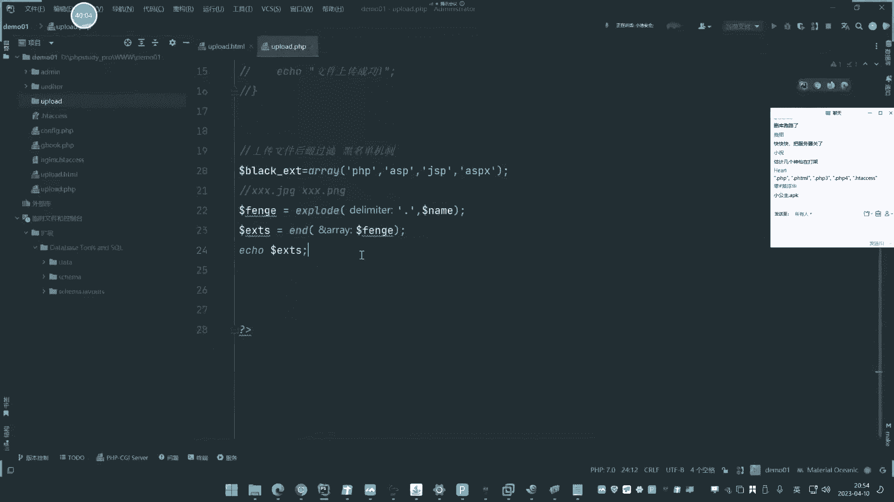

重新上传个人东西，JPG是不是测不出来JPGJPG啊。

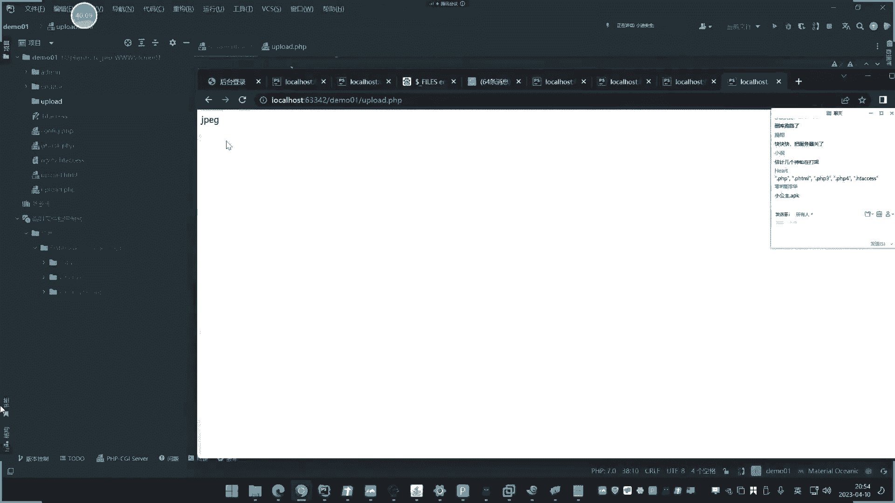

大哥就你上传什么格式类型啊。

他就获取什么格式类型，比如TT的看到没，就是T2T对吧，那么你上传P1P，那就是P1P嘛，那1S1的那就是1S1。

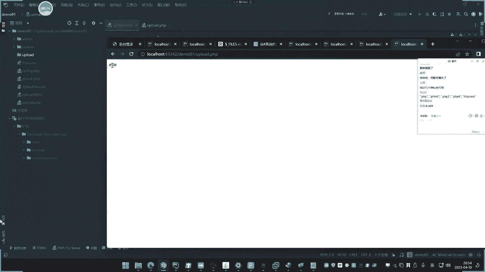

他是把它拆分到了，来把数组里面的最后加上这个东西获取出来，然后等于这个变量，这就是获取的东西，然后呢，我们接下来就是不是判断一下，这个类型是不是在这里面，如果说灾，那就是黑名单嘛，那就不让上传是吧。

就衣服判断一下是吧，in a r a y判断，那就是判断这个两个参数leader和这个什么，第二个就是我们说的就是两个指向，一个是这个还是这个，就是判断这个格式在不在这个数组里面，对不对，如果他在。

那就提示，这个非法后缀文件，然后加上这个后缀名EXT，get到是不是，然后呢如果这个能够金就说不在这个file文件，那么接下来就是不是这个直接上传就完了呀，是吧，else进入这个什么正常的上传逻辑。

就把它进行上传就可以了，对不对，然后呢上下没有问题的话，就提示一个上下成功是吧，就这个情况是不是一下，提出一个这个CRIPT标签的这个弹窗，对就是他那个提示满画在这里呢。

如果说他在这里面就提示这个非法文件，再说不能上传嘛，对吧，我们可以来试一下吧，哈来我们来运行一下啊，我这个环境不能上传啊，所以只能看那个非法的文件。

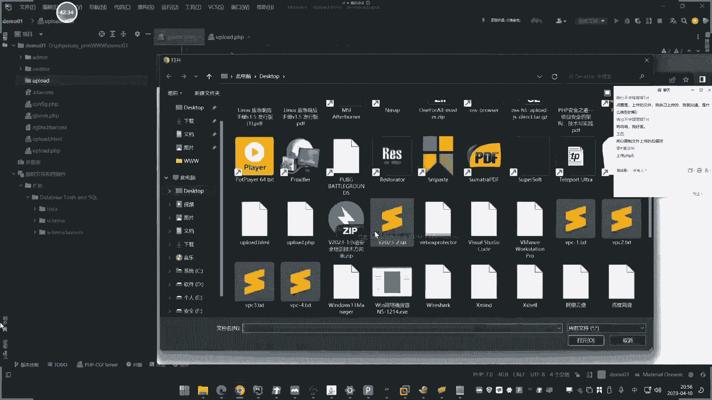

就说我是搞个那个PNG的点卡的上成功。

他就进入这个正确的逻辑是吧，他就提示这里提示这里算什么了。

但是如果说你是pp文件的话，你看啊我们搞个黑名单文件给他试一下。

随便搞个这个pp文件啊，在这里随便创建个，那一点PD，这里要记得把这个文件的后缀名开上啊，不然的话你写错了一点。

上传加了一点pp的那非法后缀PP是不让上传，就是你内心的指甲是符合这上面的就不让上传，来说只能上传一些常规文件，这加个文件就不能上去了，所以这只是过滤机制的黑名单机制，这好理解啊，然后呢我给他看一下啊。

那演示到这个环境上面来看一下，不过这个环境本体有问题啊，所以无法看到这个文件上传的过程，那只能在这个上面来做做演示了，当然了，你如果这样操作呢，它也会带来一些安全隐患，还是有些过滤的啊。

就是我们后面说的什么商船绕锅呀，包括这种东西呢，它也是来源于这个上面的东西，那我们在这里做一下实验啊，把这个代码复制粘贴，粘贴修改一下，修改代码，这是他本来可以观察一下这个目录，默认是空的是吧。

我们先来访问一下这个路径，打开这个网站的，上传页面这个地方好，你看一下啊，我首先在上传一个增删文件啊，这上传一个非这个pp的文件，上传好，提示上传成功，然后让我们看一下这个路径，正面看不是不能上传啊。

这又是谁呀，那是不是又能上去啊，对吧好，当我们去上传这个脚本文件，提示非法后缀，这里有没有呢，没有了，对不对，你可能说那这样有什么意义呢，黑名单过滤有logo的问题，什么问题啊。

比如说我现在要搞个什么重新塞上选课，这样讲的话就和那个文件工坊有关的。

我搞个什么PP5。

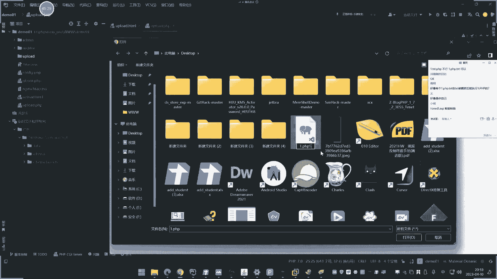

上去是能上的上官，因为PP5不在黑名单里面的C5上官上上去，PP5能够访问到的，那他是能防刀的对吧，但是这里被当做什么了，被当做下载了，这个被当下载的是和环境有关的。

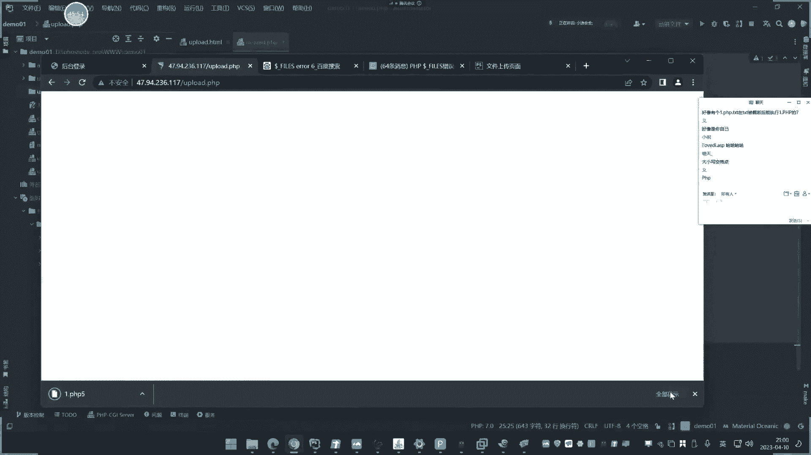

是和环境有关的，就比如像现在啊我自己的环境里面啊，我搞个这个搞个这个PP5，那取名叫特斯点PP里面写上pp代码。

你看我现在访问我这个PP5，那它能正常运行，我这个环境不能正常运行，这是环境决定的啊，不是说不是说这个其他的原因造成的啊，有些环境他就支持PP5，那如果支持PP5，那恭喜你就能绕过，能理解吧。

所以说这个黑名单机制呢，它是有不安全的隐患的，就是说如果说你没有考虑到任何变形的，这个后缀名的后门的话，也是能够上传后门的取得权限的是吧，所以这个黑名单机制呢它有缺陷，缺陷就是说你不上传的黑名单就完了。

只要这个格式呢，有其他格式呢能够上传脚本文件，也能执行脚本代码，那也是上传漏洞，所以这是第一种方式啊，我们说的黑名单机制，那么接下来呢我们再看白名单机制，这是过滤上面的啊，这个文件上传的白名单机制。

改编的戒指呢其实非常好理解，我们先把这个打码给他拉出来，然后简单改一下就可以了，改哪个东西呢，白名单机制这里有布莱克，就换成LLLL就是允许的EXP允许什么呢，比如说PNGJPGGIF。

或者这个JPEG，就是我们这种图像的一些格式对吧，然后呢这就刚好选个相反就完了，就是如果在这个数组里面啊，不在这个数组里面前面加个感叹号，不在这个数组里面是吧，不在这个允许的这个什么变量里面的类型。

我们就提示非法后缀，在的话就进入else，因为这写了个飞马是吧，就不在里面，就不是这几个后缀，那么就提这个，那么否则的话就是正常移动是吧，改一下就可以了，就是移动那是以标注黑名单来禁止。

还有一种呢就是要符合这个白名单，好理解吧，这有什么难的呢，对不对，那这种呢我们就把这个代码修改一下，开始测试一下，好保存一下，然后呢把那upload权限把它放开，我刚才把不放开。

就是怕有些人在上面乱搞啊，好那现在试一下，这边是齐的这个文件，好看啊。

现在呢我们来试一下啊，那我不搞一个这个白名单的，搞T2T非法后缀T2T不让上，就是你怎么删，你必须要符合一个图片，比如说图片的JPG的，他说上成功，这里就有了，是不是哎你们这个爱意是有多深啊。

啊我上船一次，你就搞个小李拉夫，这谁顶得住啊，这是吧，你看这种呢就就不能白名单，就是不是就只能上传JPGPNG这种东西啊，你看其他的文件就是你怎么删都不行，为什么呢，因为啊它只允许上传这几个后缀。

那我问你啊，你觉得白名单好还是黑名单好吧，你们觉得哪个好啊，这两种过滤机制哪个好啊，都说摆明了那就行了呗，那有人会说白名单有没有绕过的可能性有，但是现在不是我们要讲的，现在不是我们要讲的好。

这个反面单验证就到这里啊，再来看第三种类型，就是MIME类型的一个东西啊，除了我们今天讲的三种，还有很多，但是我们不可能都讲完，都讲完一节课就只能讲这个了啊，我们在到时候加上传漏洞的时候呢，会讲清楚的。

就是你搞东西方便了，后面的东西都好理解了，那这个是什么东西呢，就是文件类型，文件类型是啥东西啊，我给大家说一下啊，就是你在上传的时候呢，它会有一个数据包啊，我给看一下啊，我随便上传个文件给大家看一下。

那我随便上传个文件，他这里会有一个这个东西，就是我们说的这个提交值，这里，先上传个正常文件啊，啊大家看一下啊，这里啊，妈的这个不显示那个哎妈呀，这个上传这个表单，它不显示这啥情况，这真是莫名其妙。

这个表单代码都不给我显示，哎呀算了算了算了，我还是用那个抓包的吧。

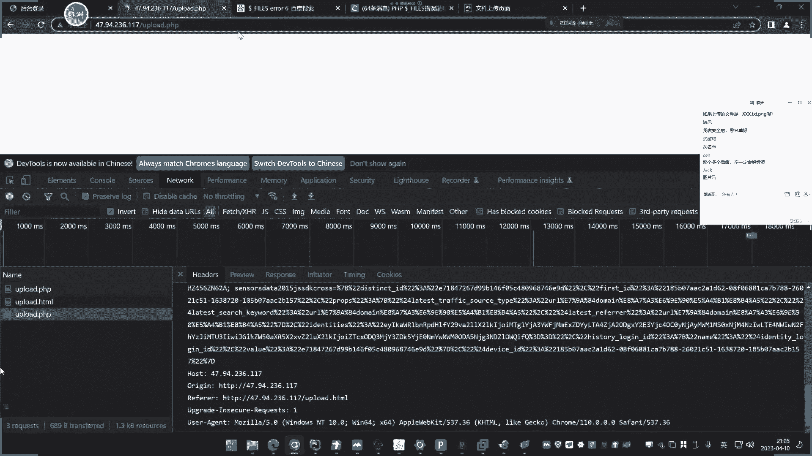

怀疑这个音是出了win7的电脑来输都输不，输不了了不行，真是奇怪啊，每次讲课这环境随便有时候删一下，不小心把东西删了，那网站上本地环境就出问题了，妈的出问题就被骂，说什么翻车。

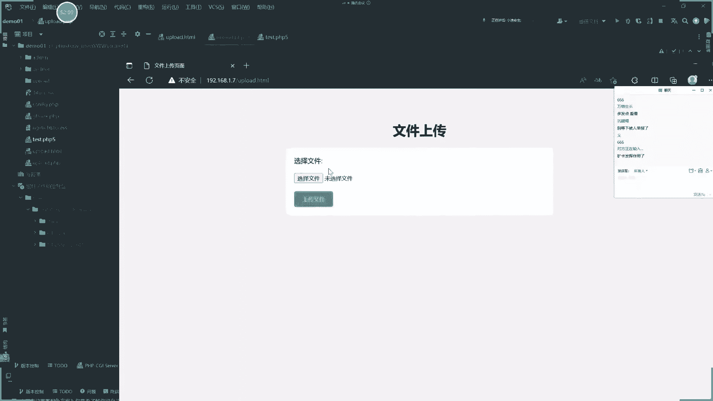

有些翻车里面真是神不知鬼，不觉不知道出啥问题，莫名其妙一些东西。

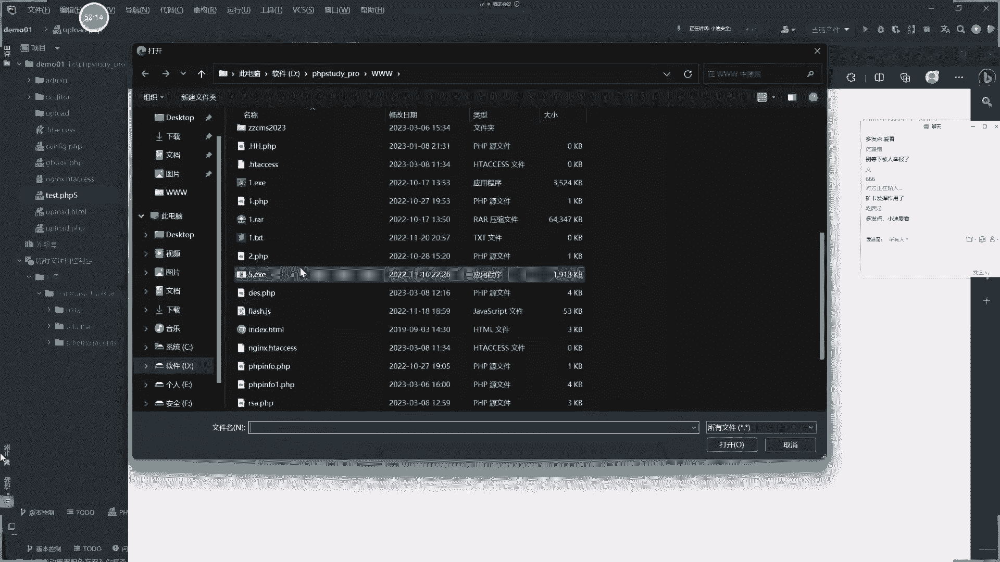

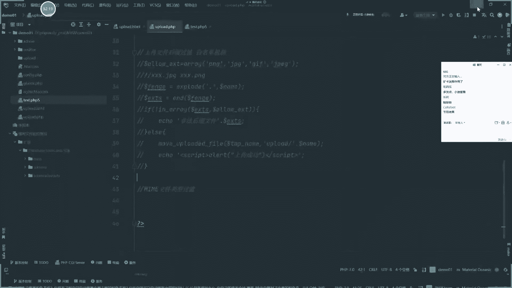

不是节目效果，我不想整这个节目效果。

这不是多此一举吗，要整这个节目效果干嘛呀。

我无聊啊，我真是，那你看啊我们现在上传个文件。

你说的我上传个这个图片的，我上这个图片的呢，我也上传啊，我们抓个包来看一下这个结果啊，来点看图片类型，它这里有个叫什么image j p g，那你是JPG，它变成JPG是吧，看到了啊。

好然后你看我现在再换个文件，比如说我现在上传个1S1看下他这里啊，就变成了什么文件，就变成了application，差什么ms dl，对不对啊，同样道理啊，我们再来加个包。

我再换一个什么这个这个这个一点PVP让他上传，商场那看一点pp的，那就变成了application ot t stream，啥情况，其实就是说你在上传不同类型的时候。

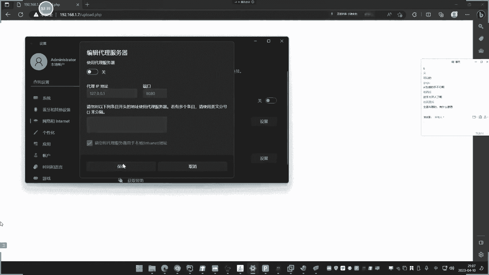

那个top类型呢它是不一样的，你就很简单啊。

我们这里就可以用这个来判定什么判定呢，就是文件类型的判定就怎么判定呢，就首先一样的道理，声明的变量变量叫m i m e alone，t arm等于什么呢，数组里面的比如说image g png。

然后依次写几个，就比如说图片的一些常见类型，就写几个啊，PNGPNG后缀的，JPGJPG后缀的，然后呢JPGJPG的是吧，还JPG的等等啊，这意思就是说那个类型等于这四个东西，就是图片的啊。

就是图片的如果等于其他的，就是其他的对吧，允许类型呢，然后呢这个时候就直接判断嘛是吧，就直接判断把这个代码复制一下，把注释修改去掉，来判断一下这个人群类型是不是在这里面对吧，在这里面的话对。

如果说这个类型的这个类型，这个是top，就是从前面获取的top，就这里获取的呢，获取top嘛，获取下类型等于这个类型，在这个里面的话就是吃这里面的类型的话是吧，就这个进入else就是这里是补码，对不对。

不，在这里面的话就进入OS就上传，如果是这里面的类型的话，那就不是这个类型的话，就提示非法，是这个类型就基本20前面是个非，对不对，那这里就是我们常见的图片类型，就是只允许上传图片，好对的吧，好。

那么现在呢我们就把它带回来复制，诶这里怎么有个错误啊，哪里有问题啊，说有个错误是什么错误啊，52行，因为这里少了个监控，用这个20在下面没写啊，好正常了啊，然后我把这个代码呢重新放到这个服务器这边。

来测试啊，看一下啊，就他呢就是通过这个文件自带的类型，就是不通过后缀了，刚才是用后缀来判断，现在呢就是说你上传文件的时候，会自带一个类型，通过这个类型的判定你是什么后缀。

其实就是这个换那个东西呢来检测啊，其实归根到底还是在检测文件，是什么文件而已啊，只是换了个思路去检测，就是检测这个互追打好，我们现在呢去访问一下，一样道理，来我们上传啊，就正常来讲。

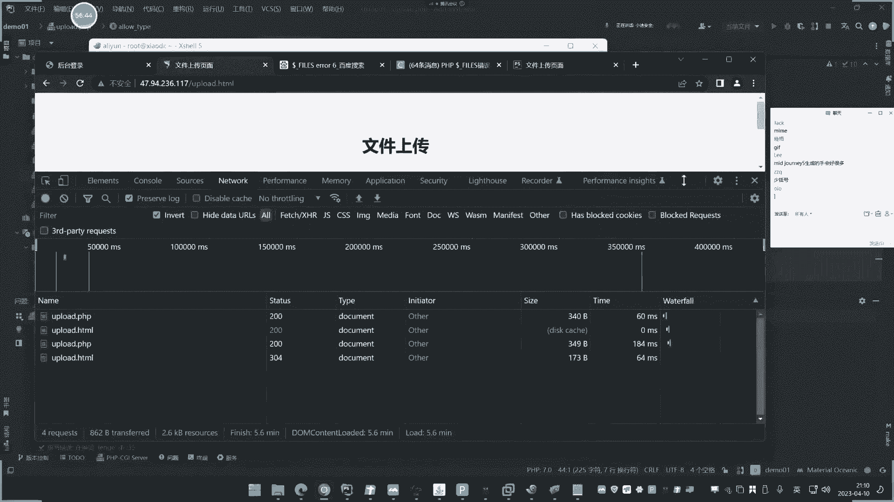

这里呢我上传一个PP5非法后退，这就不是提法。

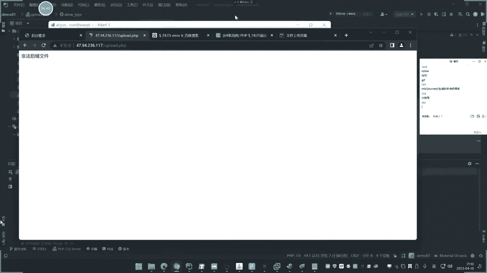

后后者就非法类型，我这里呢为了确保起见，我把代码也修改一下，就直接提示这个什么非法文件，然后呢拼接一下，把那个类型呢把它打印出来，就是什么类型。

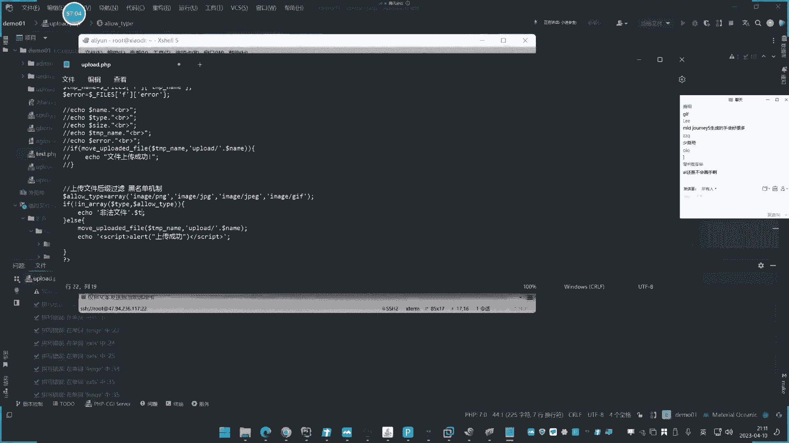

来看一下，重新来访问相关网站，提示你看非常的是这个类型。

对不对，当你去换一张图片之后。

诶是不是能上成功了，他也不会进入那个逻辑了呀，因为呢就这几个，那可能大家会说那这个东西有没有安全隐患的。

有啊，改个包就完了呀，对不对，改个包就完了呀，很简单呀，来开一下带你如果是肉腌制的话啊。

我们来猜一下，那我在上传的时候呢，我先选择中一个疑点PP5。

他选择中对吧，然后这个时候呢抓个包点上全包抓到了，你不是检测这个东西吗，我改成和你复合就完了呀，你们几P啊，来把它放出去，不上的功能吗。

对不对，所以说这个验证呢你要安全的话就必须要做啊，必须要进行这个几步的操作，就说不是说哎搞一个搞两个是吧，就说你既要判断一部分，还要判断另外一部分，就是使这个验证逻辑啊，根啊燕子逻辑的更严谨。

就是没有这个空子可钻，那么这个上传的就是正常的啊，对不对，唉不这和前端没有任何意义，因为这个top呢是那个商船自带的，你把它改了之后，对方服务器就结束，是你那改的东西。

这不是说前端不前端的问题，和前端没有任何意义，他也不是说前端验证了你想哪里去了，所以说为什么上这个课啊，你们有些东西呢思维都混乱了啊。

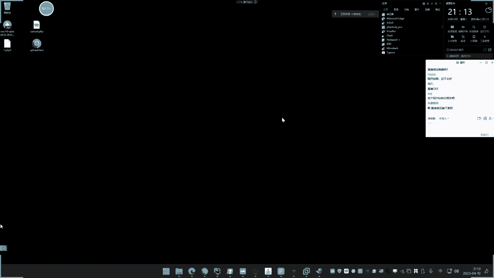

因为它结束的值呢就是你那个数据包那里的值，你把它改成一个东西就完了呀，因为这个类型是可以改的啊，他只是说自带的从哪获取了，然后你把它改成一个东西。

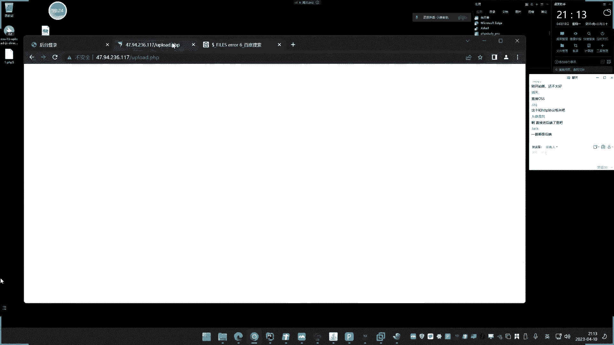

它也会结束啊，他不是说什么前端不前端，前端是另外一种东西啊，不是这个东西好。

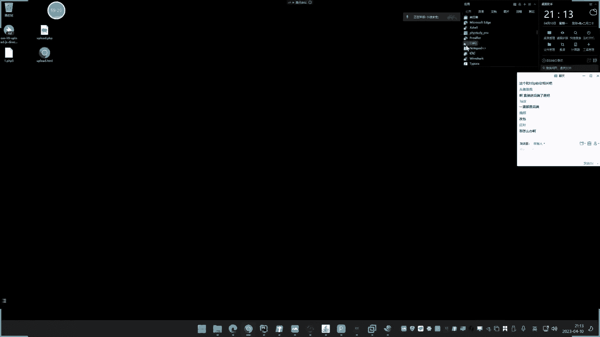

你说什么他刚才说的什么前端呢，还有一些各种各样的一些商圈的技巧，这个呢是在后面讲到文件上传漏洞的时候呢，我们再细细的讲来啊，今天呢就是说演示一下这个文件上传功能啊。

它的一些常见的代码和这个过滤代码的一些简，单编写，让大家知道这个过滤代码是什么一个模型，对不对，我们就举了这个常见的三种啊，包括还有其他的这个，我们就到时候呢再讲到这个上传漏洞的时候呢，再给大家一看啊。

看这个里面有很多过滤的啊，好这个呢就是文件上传这个模块的一个使用啊，啊这个东西呢就三个三个验证机制，包括这个功能的实现，那就讲到这里，那么接下来呢我们再来看这个文件管理快啊。

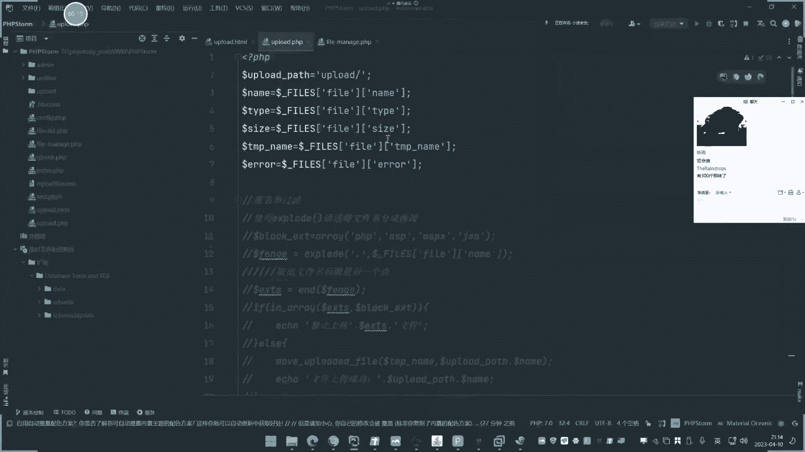

文件管理，那就是我们说的它的文件管理呢有四个地方，然后我们写一下啊，这个文件管理器啊，它的这个功能呢有这几个地方，就是上传，就刚才说的上传，然后呢这个下载35编辑，还有这个什么包含等啊，我们上传了。

就刚才文件上传下载都没有讲删除，没有讲编辑，没有讲列表还是怎么显示啊，显示就是显示这个整个架构啊，其实呀大家有没有发现一个道理啊，你像我们写的这些常见的这些代码呢。

它是和我们这个pp的一些好的功能极为相似，也就是说你把这个科学了之后，那你是可以完全的花点时间，去写一个这种屁屁的后门的这种脚本，后面就我们说什么屁屁打码这种东西啊是吧，如果你说你有编程开发经验。

那是可以尝试去写一些类似菜刀一样的工具，因为它都是这些零零散散的一些部分功能，你想大码里面或者说这种后门里面，他们都会有这个功能，就是文件管理功能，就可以通过这个后门单来实现。

对网站的目录结构的一些操作，当然我们讲是讲这个东西，并不是说为了设计这个功能啊，因为我们讲这个功能呢，其实更多的是偏向于这种真实网站应用，里面有这些功能，然后呢他是怎么写的。

方便我们后期通过代码分析漏洞，同时呢也是让我们了解一下，这个代码的作用是吧。

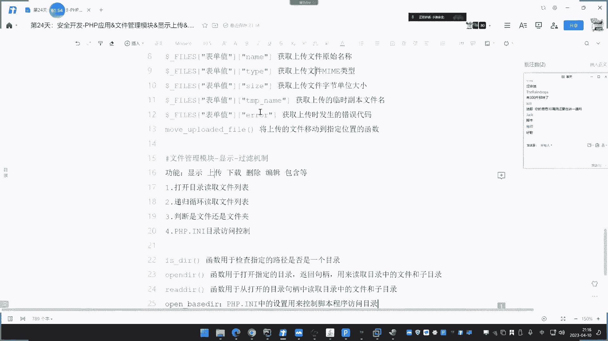

剖析一些漏洞呢都是展现在这些方面。

好这里呢我们再来说一下这个文件管理啊，这个文件管理呢它的编写的话分为四步，首先呢是读取目录，看一下目录里面有哪些文件，然后呢在递归循环去读，这个递归循环是啥意思呢，就是说一个文件夹下面有文件夹。

又有文件夹，又有什么文件，那么下面的文件夹我们要继续往下面翻看一下，他下面继续有哪些东西是吧，就递归循环，然后呢可以判断一下这个是文件，我们就显示文件的操作流程是文件夹呢，就选择文件夹的操作流程。

啥意思呢，那很简单，我们这里有个功能，比如说我们后面要写到这个删除功能，或者说这个编辑功能，就拿这个编辑功能来说吧，好这里还有个下功能，你下载的是文件和编辑的是文件，还是下载的是文件夹还是编辑的文件夹。

你下载文件夹好，这我们先不说编辑吧，编辑文件夹是改名字吧，文件夹里面有内容吗，没有内容啊，文件夹里面就是下面就是文件呀，所以他编辑文件，这个是针对于文件的编辑，而不是文件夹的编辑，文件夹只有改名字。

这重命名没有什么对它里面内容感好理解吧，所以说我为什么要进行一个判断，是文件夹还是文件的一个操作，就说你要写编辑功能的话，你肯定是要搞清楚这个文件是文件还是文件夹，是文件夹，你还需不需要编辑。

那只能改名字，那就不叫编辑，我们说的编辑是改里面的内容，所以针对的是文件，那么今天呢我们就写一部分功能，那么下节课呢我们把这个东西就完善，就像是用PP呢写一个文件管理器，在上面呢。

可以实现文件的商船和这个文件的列表读取，包括文件的删除，包括文件的编辑这些功能，那么现在呢我们就只搞这个文件的这个显示啊，包括他的一个循环，因为这个功能呢不是说一下子能解决的啊。

我们来看一下这个文件的操作，然后呢通过这个案例里面的话，我们就能看到它会带来哪些安全问题，它会带来哪些安全问题，同样呢也会给大家讲一下简单的防御，但是我讲的呢不是说唯一性，有很多方法防御和很多方法测试。

只是说给大家开个眼啊，后面呢大家学到相关漏洞的时候就能明了，那么现在呢我们来看一下这个文件的显示操作。

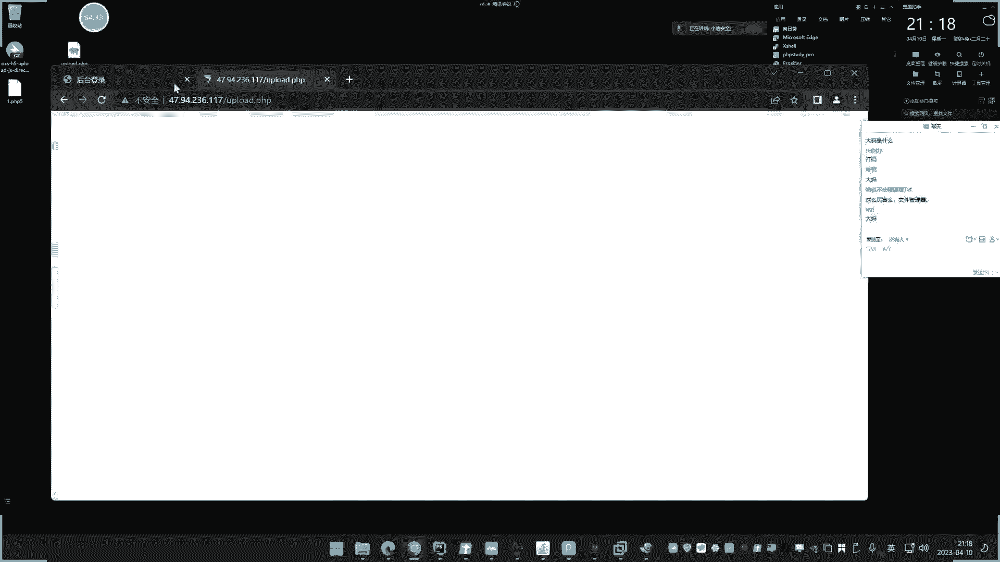

好来创建个这个。

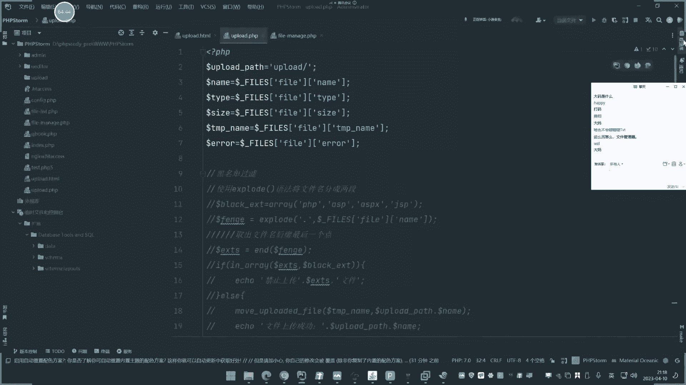

文件夹叫做file manager，这个文件管理点pp嗯。

那哎这怎么是PP5啊，把去掉下。

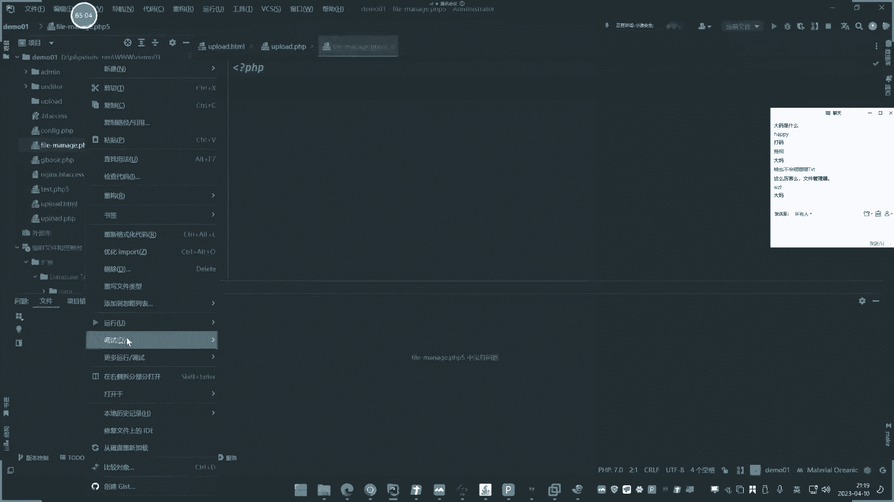

删掉删掉pp5也能行啊，只是我还搞个PP的吧。

好那首先呢这里呢我们要使用功能，那先要打开文件目录，这里有几个函数啊，给大家看一下，这个函数叫一直掉啊，就是判断这个文件路径是否是一个目录，open dr呢是打开指定目录，并且返回句柄。

返回句柄呢用来读取目录的文件和子目录，通过V的DR来实现，从这个打开的句柄里面，再去读取里面的文件和子目录，所以它大概是先进行打开目录，在进行这个读取和显示。

所以啊他的第一步是先打开目录，首先呢我们可以声明一个目录结构，先看一下啊，DR等于什么，等于这个就拿这个当前目录来测试啊，先等他，然后呢我们进行open dr来进行打开这个DR。

打开之后再复制一个变量来解锁它的句柄，比如我们就叫这个D吧是吧，然后呢再用这个什么V的DR来打开这个D，打开这个D这个打开这个D之后，接下来的话啊，就是说打开这个目录，然后呢去读取这个东西。

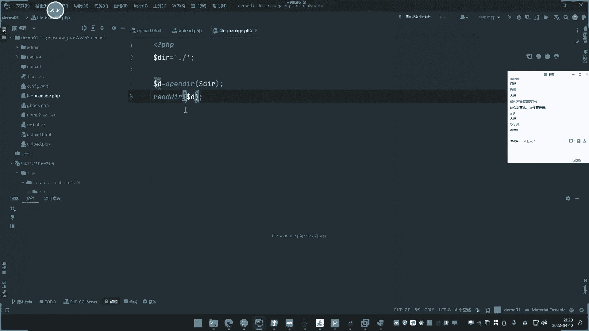

然后你是不是还要进行显示的呀，要进行显示啊，这个相关的一个使用呢，你可以查一下这个函数的一个，大概的一个情况啊，pp里面那个目录操作的一个情况，它里面是有这个相关的，这个参数值和这些东西的啊。

来打开这个目录呢，他说打开一个文件夹，并且读下内容，这是读取的内容，我们来试一下，打开它之后呢，复制它，如果这里呢等于这个REDR啊，它等于它的话嗯，就循环，我们可以输出一下，看下啊，先运行一下。

看一下，简单的好，这里的为空，你看一个点啥情况，就因为呢他这个读取呢会读取一行里面有很多。

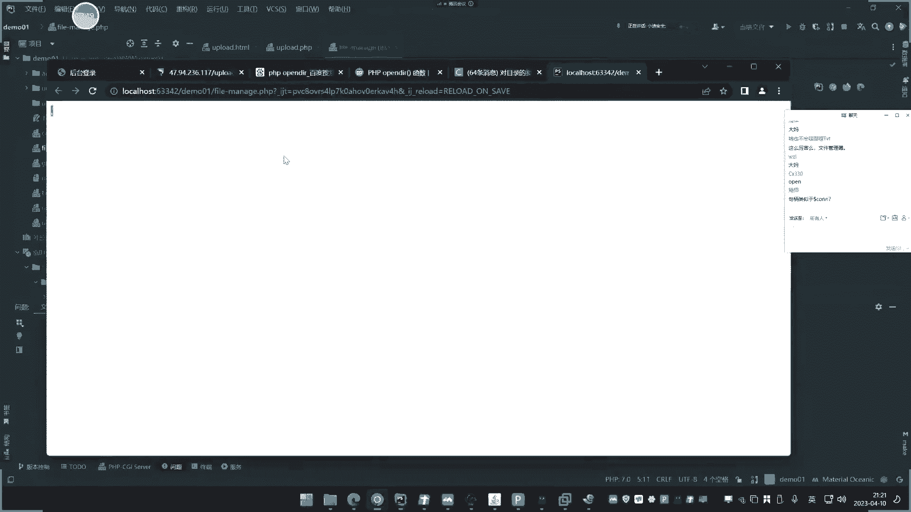

所以我这里要进行个什么判断，叫well调节判断，就是当他去打开这个东西的时候，它只要不等于false，就是说不为错误的话。

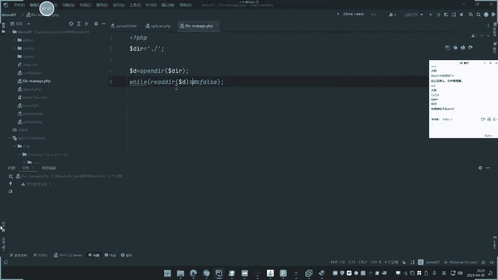

那我们就一直循环，然后呢读取这里面的什么东西啊。

你就等于这个值就读取它里面的这个值，那就是让fail了去结束这个打开过来的结果，结果判断是不是等于false，如果不等于的话，就说明还有文件和文件夹，我就打印，这样来看一下结果，运行一下。

你是不是结果出来了，然后呢以此让结果显示的增长一些。

DR换行，你看是不是出来呢，这就是当前这个什么，当前这个目录下面的文件是文件夹，这两个文件夹是吧，这是什么文件对吧，这下面的文件和文件夹的一个结构，但是呢这里显示的不太好，怎么不行不好呢。

哎就是这个文件夹呢没有文件夹的样子。

也不知道是文件夹，也不知道是文件对吧，所以这里呢可以再进行一个什么判断，是不是文件和文件夹的一个操作，对不对，现在怎么进行判断，如果一直DR判断一下这个fell是吧，如果他是这个文件夹。

我们就输出往前夹加上这个什么C对不对，else呢，如果是文件就输出这是文件。

那这样子呢就会有一个显示呢，这是文件，这是文件夹，对不对啊，同样道理，如果是文件夹的话，我们就可以怎么样呢，把它一点开，把它点开之后呢，他就像是在看这个文件夹里面的内容是吧，就很简单。

这个文件夹里下面还有东西啊，我们可以点进去看一看，这文件就没有了呀，所以我们还要实现功能，要对这个下面的文件夹呢，要进行操作是不是。

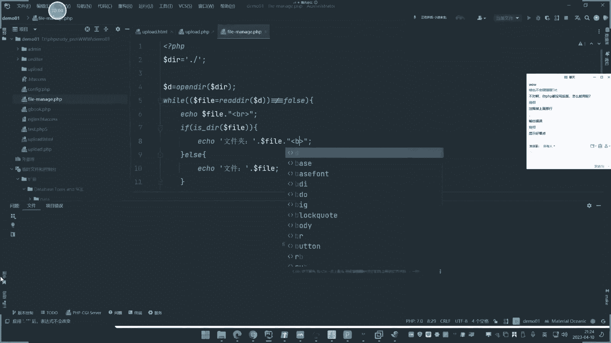

不加BRY。

把那个我这里他只是写了一个大概功能，包括这个页面的一个设计，我已经给他写好了啊，我等下给他看一下那个成品啊，那我先把功能实现啊，那功能呢后面改动都好改，是不是哎呀，这个东西怎么弄死，里面的搞不掉。

自动保护器，麻烦死。

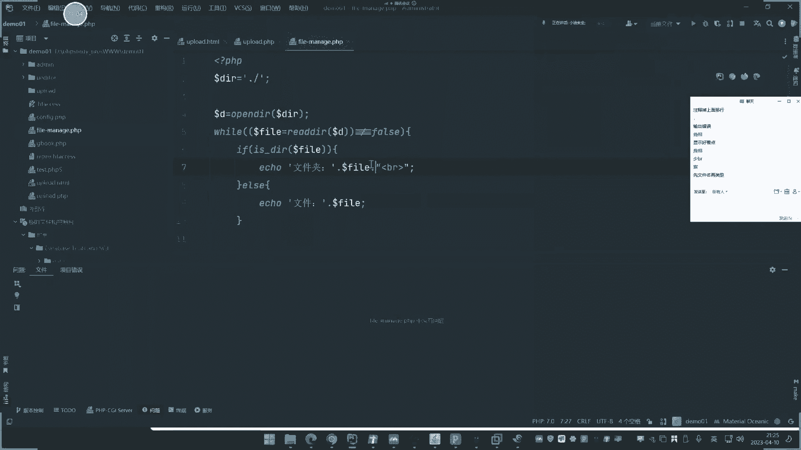

所以说呀你还是正常打，你就说这个文件夹我们就可以怎么样呢。

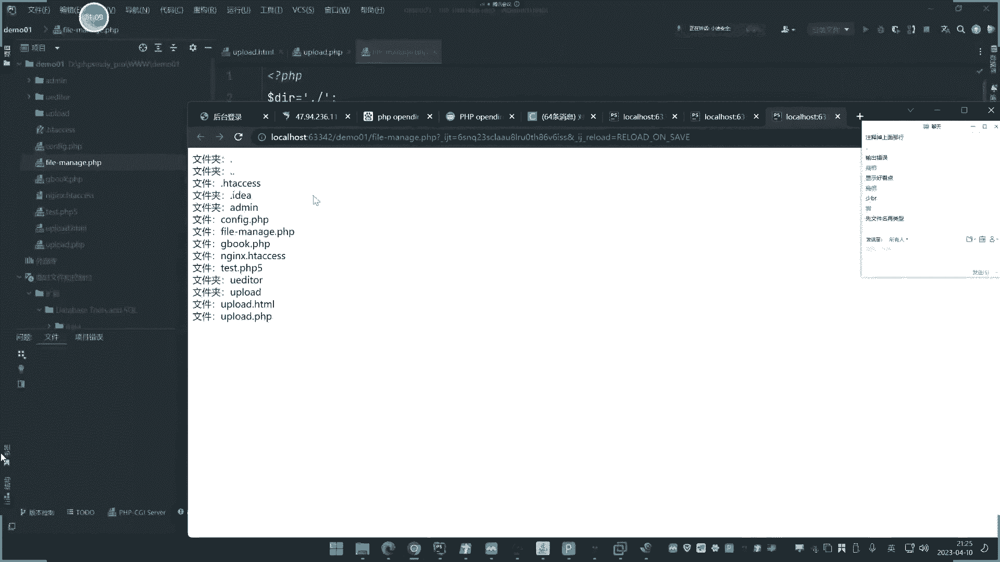

点进去看，那如果说是文件夹的话，我们就可以怎么样呢，继续向下面进行啊，是不是继续向下面进行，那该怎么进行呢，对不对，其实就是说文件加，我们就继续把这个东西执行一遍不就完了嘛，对不对，就是如果是文件夹。

我继续执行一遍这个代码就完了呀，就像我点这个东西，那怎么搞呢，我可以怎么样把它定义成一个什么函数FUNACY，然后调用一下不就完了吗，调用一下呢，交出这个修file是吧，先是文件夹传这个电量。

电R看这个电量过去对不对，然后把这个把这个东西给他弄上去，楼景区，对吧，把它弄进去，那这个电压呢就是我们全参的值，function修改file对吧，传承值进去呢操作，如果这里呢他还有这个这个什么。

这个这个参数值的话，我又怎么办呢，对不对，我先把它进行一个显示，如果说这里面还是文件夹，我该怎么办呢，就是我给他一个点击的一个操作，让它进入这个文件夹，再去显示下面的这个内容，对不对，再显示内容。

而且我这里能给他截出个值，比如说叫dollar符，下回get，然后呢加上这个叫pinch路径，如果说它没有设置，我就为空，就把它表示为空，这个意思就是说12字，这里如果有截止到喷几次，就等于这个电压。

如果没有接收，就等于为空对吧对空，那么这里呢我们就赋值赋值，这里呢如果他是文件夹，就等于这个斜杠点，就等于这个啊，就像现在呢啊我就把它操作一遍，少了一个这个符号，现在正常了，这个符号是对应少了一个括号。

我们可以看一下，那我先给大家写个字修啊，我传递一个参数，比如说我传这个直角型调用函数。

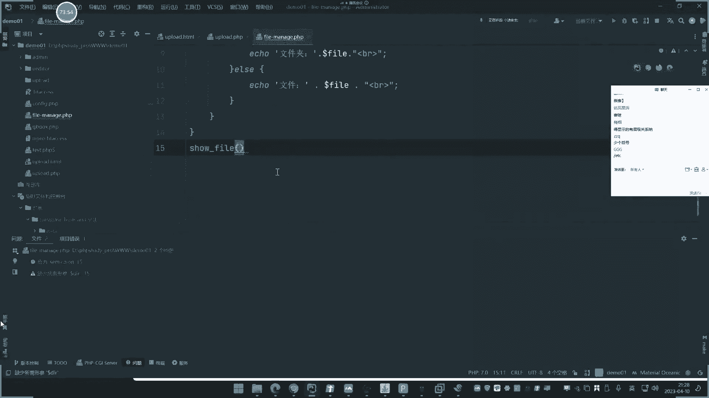

就没有赋值的话，我们来看一下这里。

这怎么还死了呀，哦这里啊哎，啥情况，这我给他传一个，搞得有点昏嗯，先把这个，给这个传递一个值吧。

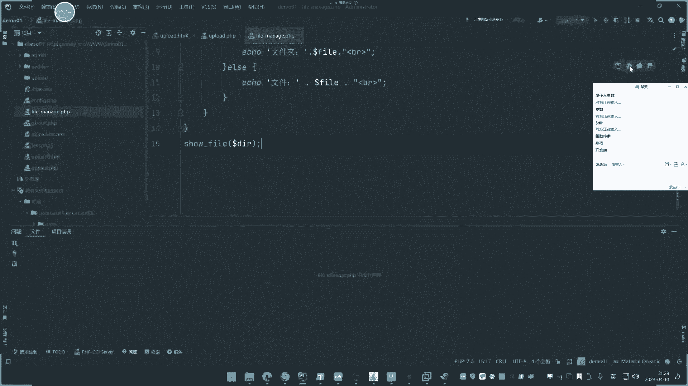

这个DR呢我给他服务这个参数试一下啊，喷漆等于一点点斜杠。

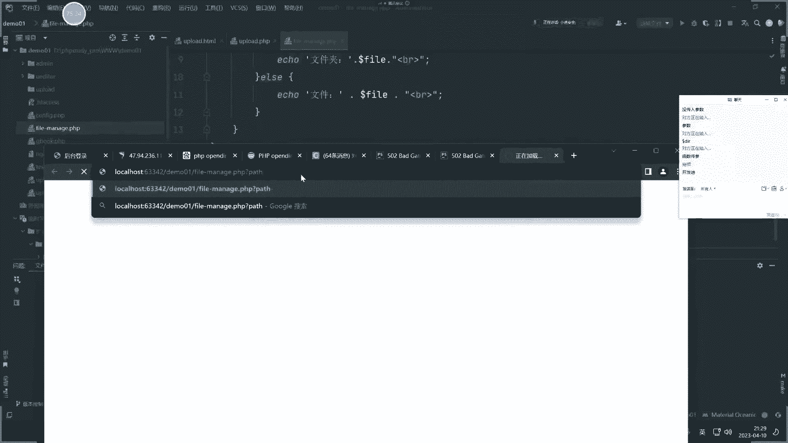

不对呀，这。

在哪里有问题啊，这刚才那正常的，唉这有些东西啊，混搞混了，等一下啊，我看看哪里有问题，我先把它搞成这个就搞一个东西吧，先先不不不就是变量啊，好这个呢呃我先不把这个东西去掉啊，先把这个索引类推下。

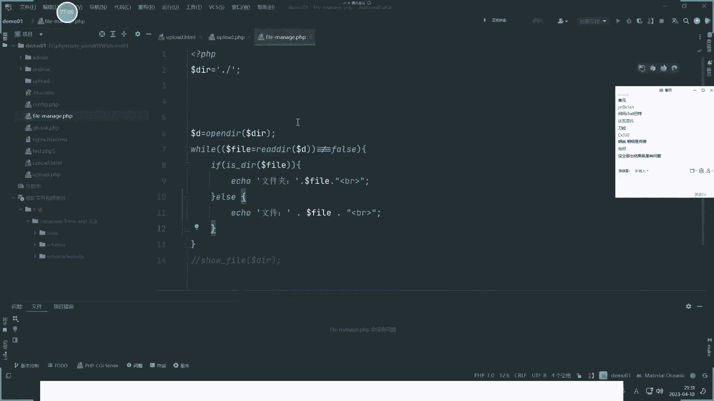

怎么现在不正常了，我这这发生了啥情况啊。

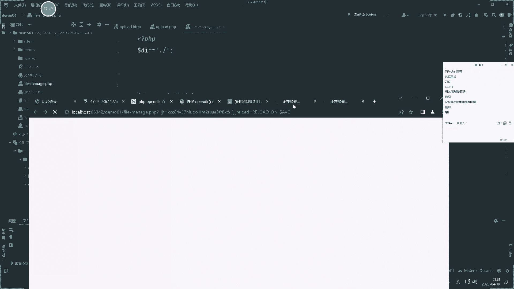

我当时是这样写的，他正常，怎么现在服务器打不开了，啊这真是你妈的莫名其妙，这个东西我刚吃的没改动啊，我看一下啊，这他妈的这是发生啥情况，怎么正面，我太爱呀。

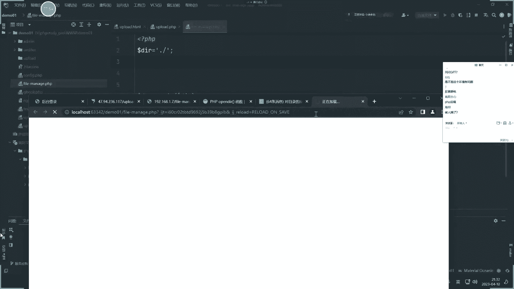

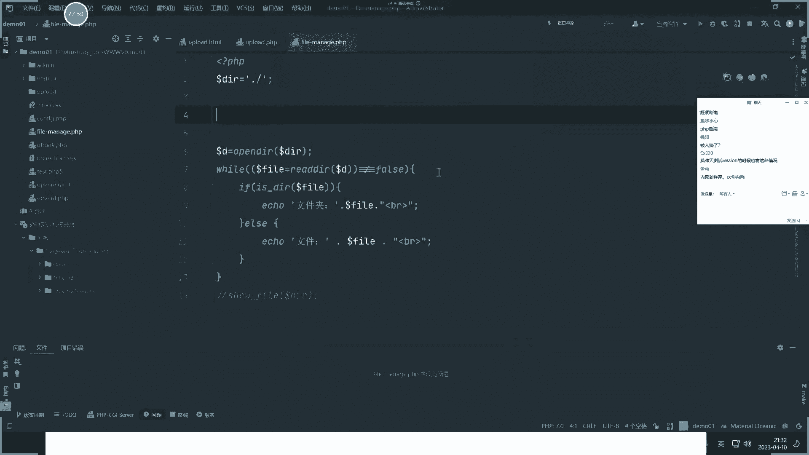

你看啊这个调试的这边出了问题，调试都打不开了，那直接用这个环境打开了又正常，这他妈的我真是啊。

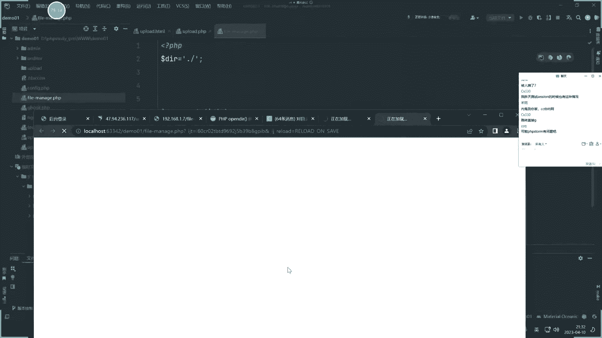

我一直以为我代码写错了，你们说这有时候这些事情这样发生了，你有什么办法啊，你说你有什么办法。

那现在正常的，妈的真是无语啊。

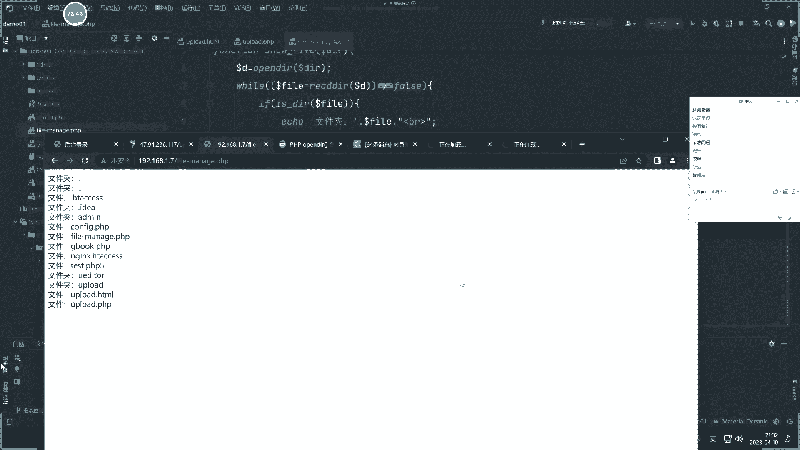

环境这个PP是多环境有问题了，他不能显示了，不知道啥情况，调试出了问题。

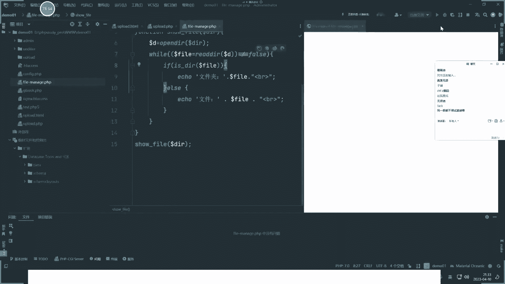

莫名其妙，好那直接这里看这个结构吧，只能看这个结果了，就是文件啊，不用这个调试调试他妈的出了问题，哎呀那这里那就还是把刚才那个弹幕剪辑，你们还一直在那个聊天框里面说我哪里写错了，哪里写错了。

来看看这里啊，那我不赋值的时候啊，他这边呢就是等于这个斜杠一，就当前目录，我如果给它赋值的话，我给赋值的起切个三，你看他是来到商机了，你看来到商机了吗，啊，继续呢，你比如说呢横向道理，他这里有个my。

我等于来喷几轮，全都计划等于艾德米，它有个进入艾米目录，这样的显示是不是出来了，那如何让它这里形成一个可以点击的，就是我现在手枪是没问题。

手敲是没问题，给他这个路径，他就读取这个下面路径的内容了，但如何说在这里的显示呢，样刀零啊，就给他一个这个操作，给他这个文件夹，这个操作操作之后呢，它会触发一个路径就完了呗，就这个路径这里写个什么。

给个给个什么东西啊，给个这个东西就完了呀，给个A标签啊，EF等于什么，等于一个弄好弄好什么pg等于dog file，是不是，然后这里谢哥诶，单引号啊，因为前面是双引号。

双引号呢是让这个变量执行的来写，这里我们看下，还用它，用它的描。

然后再给个这个嗯，不是不是写错了。

这个就是说这里呢你看啊，我点进去它就自动跳转的是米的，我点这个呢还是调整你的。

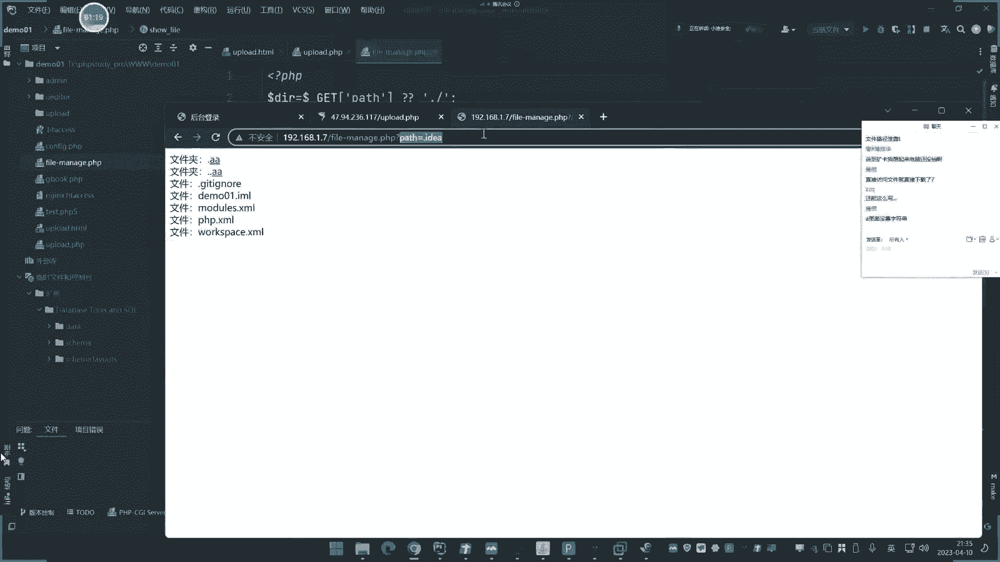

你看这不是给了，那这个AA他妈去了一下，就以这个文件名吧，把文件名字写在这来呀，这个文件名来来把它作为一个标签，哎呀这搞得他妈的拼接起来好麻烦的，这个文件名跳到这里啊，把它加到这里来，FS加进来。

连接下不连接也行。

来看一下这里啊，那是吧，他有一个录进来，你看我点击了是不显示啊，你看来在你这就是目录目录下面，有文件有文件有文件有文件是吧。

嗯就说这个那简单的功能，那我们就实现了啊。

简单功能就实现了，叫他访问他是吧，反正只有目录就进去看呀，没目录就就就这么搞好。

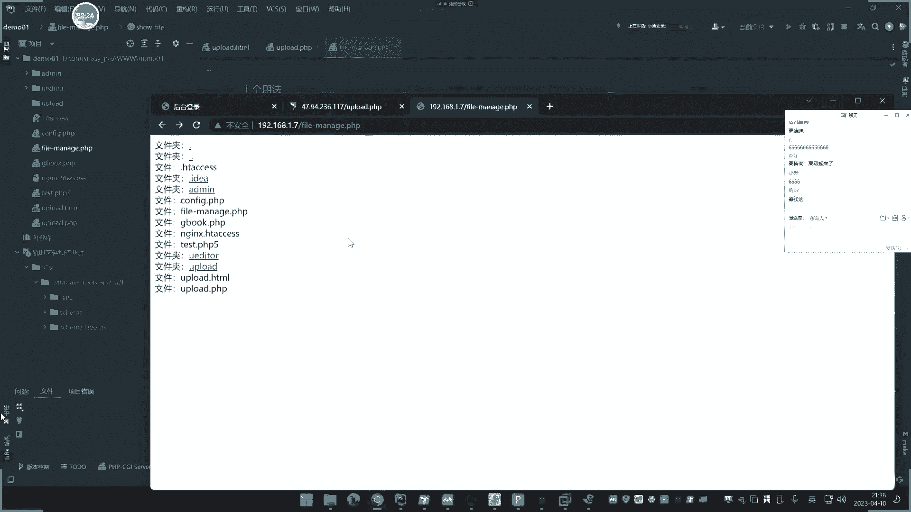

那这个呢是一个简单的一个功能实现，那这里呢我可以给大家看一下成品的啊，就是有这个界面美观的，给他搞个成品来看一下啊，这个成品呢我还加了一些上传下载的，但是这里那些没，这是我马上要讲的上下的。

今天不讲了，你看这个成品的啊，该看成品的，看成品的话，那这是我们写的成品，那前面多了这个目录，然后呢后面的是什么文件，就这种呢界面做了一些改观是吧。

然后呢就是引用了这个cs显示的功能都差不多，那就是那这里面加入在输出这个内容的时候呢，文件的时候，那就怎么样知识点是一样的啊，无非就是说改了一下这个界面的美观程度。

哎你看这有啊，比如点的显示出来是吧，来点这个index显出来。

那这个怎么设计的呢，其实就是在这里呢改一个这个标签，就是在前面加上，不是说我们写文件夹就直接搞个图标，这个图标用cs生成的，嗯啊这是源码啊。

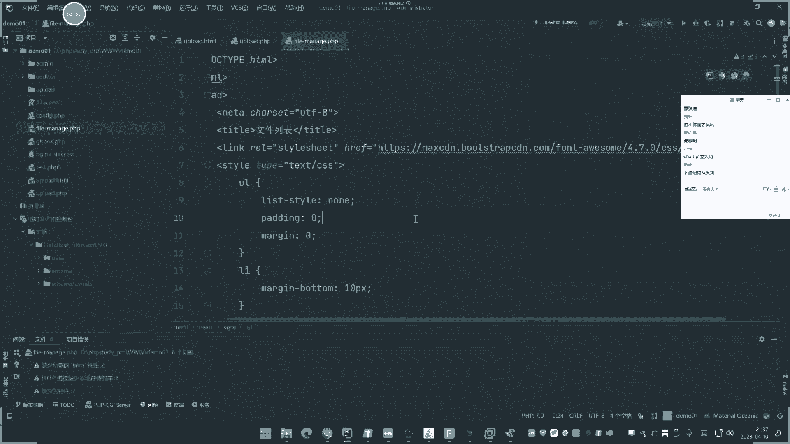

那就这个结果是吧，那么这个会带来什么效果呢，就比如说你这些网站web应用中，经常会在一些后台，或者在一些这种资源下载的时候，会有这种文件的一个列表，就像我们说的，有些网站后台不是有这种功能吗。

那么你可以观察一下它的一些功能的实现，比如说这里有参数，完了你点他就发一个什么艾米啊，你点这个引IDA，他就发个IDA，对不对，那么如果你改这个东西呢，改点斜杠，当前目录两点斜杠。

商机目录栽两年斜杠是吧。

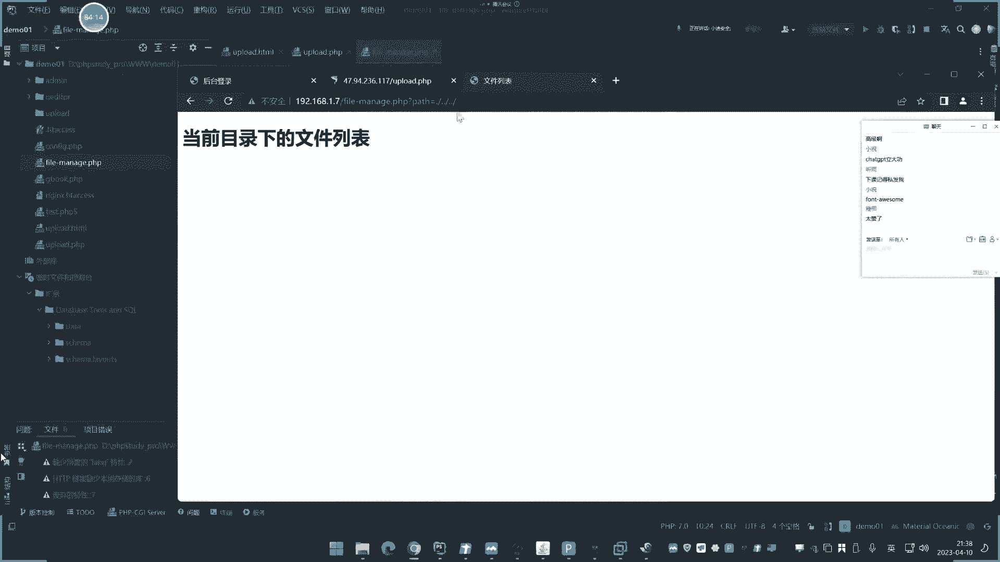

会怎么样呢，对不对，我现在呢给大家看一下啊。

我们在这个app里面有个安全机制。

里面是有一个东西的，PPI里面是有个设置的，这是我提前把四个了啊，如果没有设的话，会有什么效果啊，看一下啊。

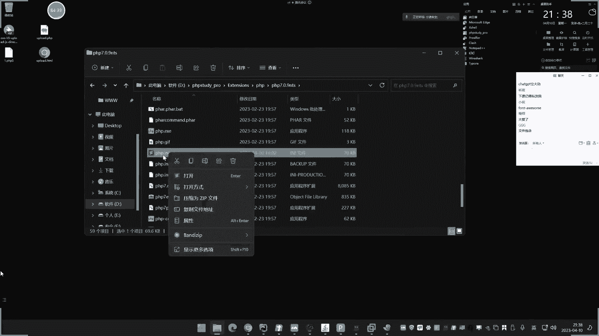

有个叫open base dr的一个参数，就PPINI的啊，如果是其他的这个语言的话，他们同样都有这种类似功能，open base dr啊，这那有个这东西呢叫路径是吧，如果我把这里的封号加上去。

就让它不生效，不生效之后呢，我重新把这个东西启动一下，重启动一下之后啊。

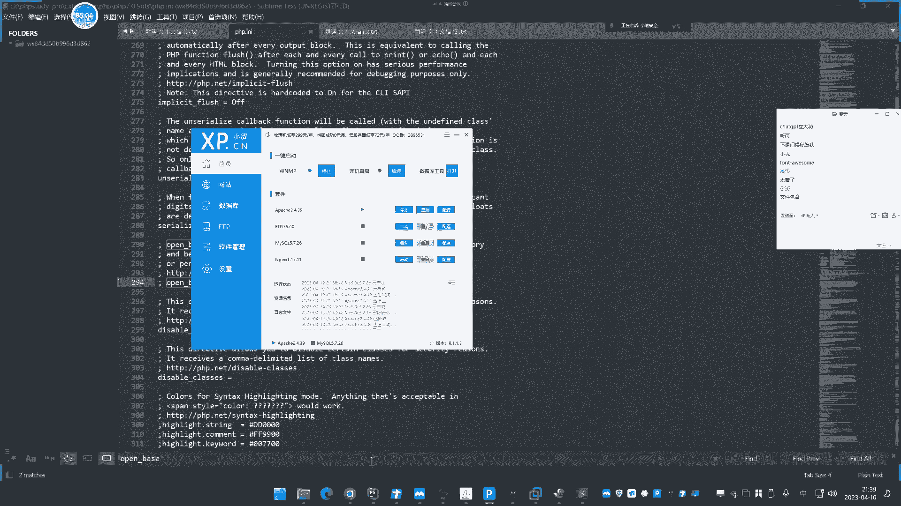

我们看一下这边的一个情况，刚才那个路径的就是默认的是吧，那你看啊艾德米目录，进入艾德米目录，我挑上一级点斜杠啊，商业机加点斜杠没有了，然后就什么点点斜杠，上一级点斜杠是当前目录，是不是跳到上级目录了。

这是我们的上级目录，就像说呢现在呢我的文件目录呢是放在了这个，这个里面是吧，那我直接访问他是看的是这个目录，直接访问P他是看这个目录是吧，这是我当前目录的结构啊，他这里有，就加上一个什么。

就观察着点点斜杠，点斜杠就是商机目录，这就是商机目录，我继续点点斜杠，电子斜杠，你就是来到这级目录，来到这里，我再来电力斜杠，他是来D盘的，对不对，如果你想C盘，那就写个C盘，那跑到C盘去了。

那我就可以编辑C盘的这个数据是吧，那C盘windows，那么大家试想一下，这个其实就和我们一些这种web应用中，一些文件管理器的一些功能，这里就给测试有没有这种文件编辑漏洞。

它就是由于在编辑这个文件夹的时候呢，没有控制你输的参数，导致了，你可以通过这个点点斜杠，这种商机和下一季这种差异呢，对于这个就是他的这个网站本身的设，计和文件管理实装。

你那通过后台或者通过一些东西呢去来更新，修改你的一些文件，但是呢在显示这个文件结构的时候啊，它没有设置固定的权限和，没有设置这个过滤的参数，导入你的通过这个点斜杠和点点斜杠呢，来跨级目录。

来获取整个服务器的盘符造成的文件编辑内容，所以通过这个案例，那就和我们那个文件编辑的相关，通过我们刚才讲的商船呢，就是和文件商权相关，那同样道理，下载就是下载，删除就是删除，就是我们说的什么任意文件。

下载任意文件，删除，任意文件的读取就是和这个什么编辑呀，下载删除相关的，包括包含就是任意文件包含，所以说我们每讲一个这个案例呢，其实它都是有一些相应的安全问题的，就是在你开发的时候没有做好这样的措施。

就会导致这样的安全问题，那么如何堵上它呢，你想PP应用里面，它可以在代码中的来来实现这个安全修复。

就很简单啊，他可以在这个代码中呢是吧，在这里进行过滤啊，这这不是读取这个列表吧，它可以过滤检测到你书的参数是点斜杠的话，那么他就给你咔嚓掉，就不让你这种帆布就只能是一个文件夹，对不对啊。

这种是一种过滤机制，还有一种过滤机制，最好的过滤机制就是我说的第二种，就是在一些这种中间间和脚本语言里面，能够支持的配置，这个具体要看啊，你当前环境支不支持，你像PP里面。

PPI里面是有个叫open bgr的一个东西，我可以把这样写，这样写就是什么作用呢，就是打开文件是D盘pv study3W点，就是说我把它固定在这个目录，他就走不了了。

就是我们说的设置这个环境的访问控制目录，这个呢是这个pp支持的，如果说是java或者说是其他这个语言的，这个开发的话，那么有些是有些没有是吧，那个你要根据具体的情况对的啊，这个pp是有的。

java里面的也有是吧，同样的你也可以根据这个目录的权限进行设置，就是可以在电脑上面的，通过设置权限的一个是吧，对于用户的一个刻度条件来设置，也能阻止这类的这种安全问题。

当然你可以通过这个自带的这个功能，或者说通过代码中的来过滤啊，各种各样的方式呢去修复这样的安全问题，我们这里就只说这种，你看我这样子一写之后呢，啊，我把它限制到3W目录，那么我们把这个环境的重启一下。

再看一下啊，好我把环境重启一下之后呢。

我们再来这里啊，再来这个地方来，刚才是能跨到C盘是吧，你看现在我们先点斜杠，你看啊，那这是他的目录，现在目录呢是来到了这个目录下面，电竞显卡方信息啊，他是来到这个目录下面是吧，你看对不对，来到了啊。

你看来了之后呢，我刚才限制的就是这个目录嘛，对不对，就先指的是这个目录一个，我再往上面翻行不行啊，没有了空了，为什么限制访问了呀，是不是限制范围了，看不了了，那你看其他不能不能看到C盘也不能看了呀。

把你固定死了，在配置文件的修改的访问控制权限，那么这个这个设置，也极大地给我们解释了一个问题，这是什么问题啊，我给大家说一下啊，你们有时候在拿到一些这种网站的时候。

为什么有些网站可以看到什么C盘或者D盘，或者E盘，或者说LINUX的一些其他版本，为什么有些网站就固定死了，在某些目录就和这个相关的差不多的意思，是不是有这样的案例吧。

为什么有些网站连上去整个服务器都能看，而有些人就不能看，那就和这种类似的相关的设置导致的。

是吧，这个东西就说到这里吧，那么如果说你要过滤的话，就像这个啊，我可以打进过滤，就是我检测这个倒数DR是吧，我可以打进检测，怎么怎么检测呢，怎么检测呢，就是呢判断。

如果这个什么DODR里面这个就写个什么也是，比如说我也是一样道理，我也写个什么这个黑名单过滤是吧，黑名单过滤，前面的过滤是吧，我这里也写黑名单过滤，我把这个电脑进行判断，如果一直。

在数组里面就是这个生命两个，电量有后面的过滤啊，这个jr就是这里带这个路径的ACPI，等于什么ARAY然后呢我写几个呢，比如呢点写点点刚是吧，这种东西呢如果说你有这个东西是吧，好就直接写歌吧。

这数组就一个嘛，那就写歌吧，难搞了是吧，就判断一下呢，如果你接触到的电压等于等于，嗯还是把写进去吧，这样判断好一点啊，你可以用那个能判断，那如果他在这里面，就是你输入的这个路径里面有这个东西是吧。

有这个东西，那说明你在跨目录在搞事情是吧，我就直接怎么样呢，echo是吧，金子跨目录好啊，给个提示，对吧，这个提示啊，否则的话就else，就正常的这个通讯嘛是吧，就调用这个函数都可以这样写啊。

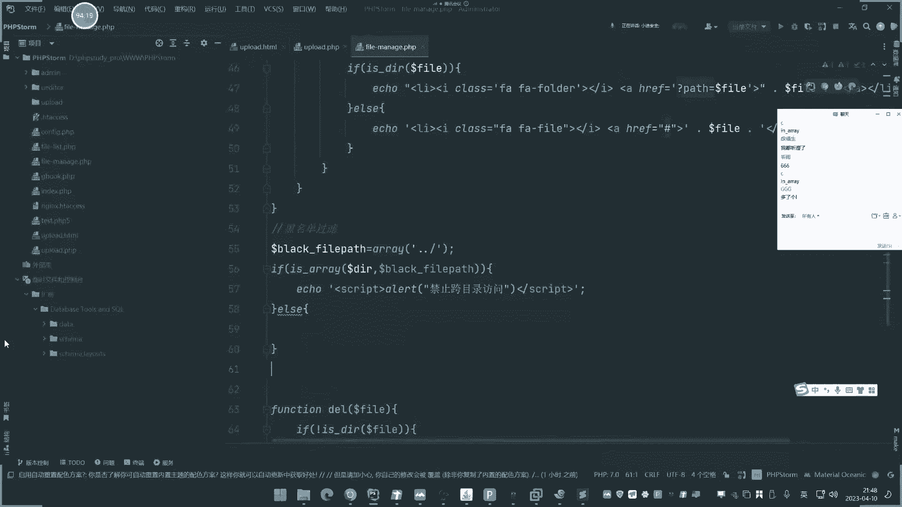

对不对，那这个时候你再看一下，我现在回来，现在正常了是吧，当你呢在这里那里看一下目录，等于它是正常的，一旦让你想夸的点点斜杠一加上去。

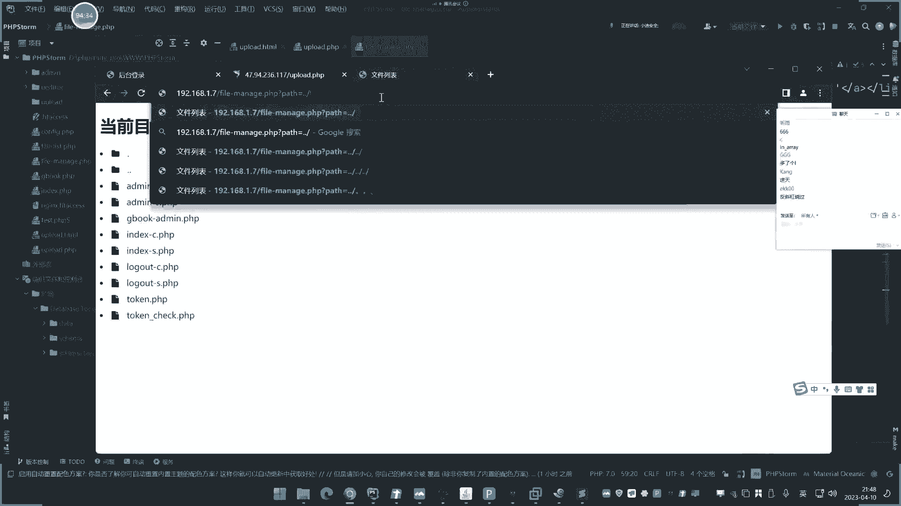

诶，什么鬼，怎么起反应啊，哦我知道知道这个是改错了文件啊，这个是pp是多吗，这个是改词pp。

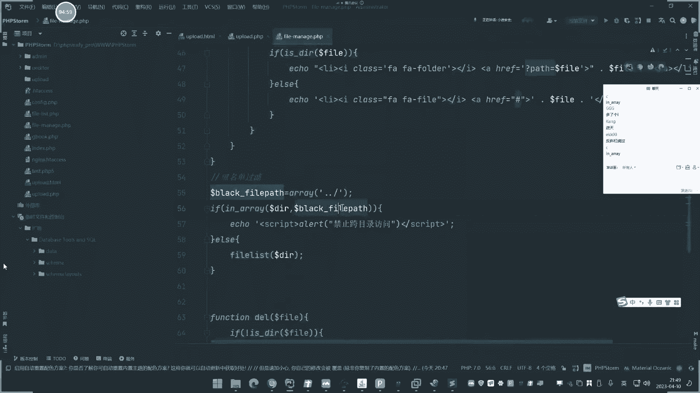

来点这些吗，那你看禁止跨目录是吧，就能阻止你，对不对，就是说我们说的这种情况啊，他不让你再搞了，你可能说这怎么绕过呢，也好过呀，怎么着啊，写个东西，写个这反应不是又可以。

所以说呀这些东西呢我不能说怎么讲讲，讲个毛啊，很多这个CTF的一些这种技巧，也是这种各种各样的绕。

就你想得到的没想到的都给你，像这样搞哎，有些人就说我A啊，我我再把这个加上去行来，那有些人这样搞是吧，他说我搞这个那还行不行呢，对不对，这我把这个也加上去。

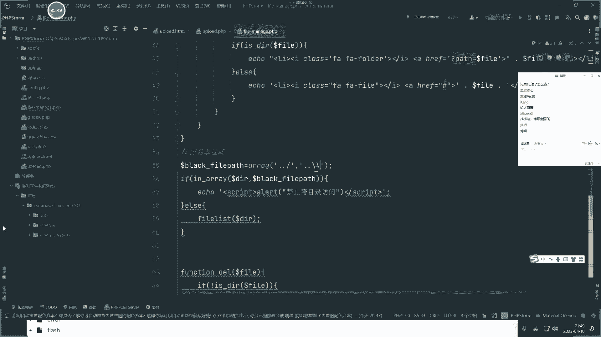

叫我把这个加上去行不行啊，他还有捞的呀，他有些还有LOD啊，他有些呢就搞两个写法，就搞四个点，加上这东西，搞四个点啊，什么三个点呢，如果说你这有加删除的，把它删掉啊，搞四个点呢，搞三个点呢还是重复的。

就这样很多种啊，就不是说只有肿啊。

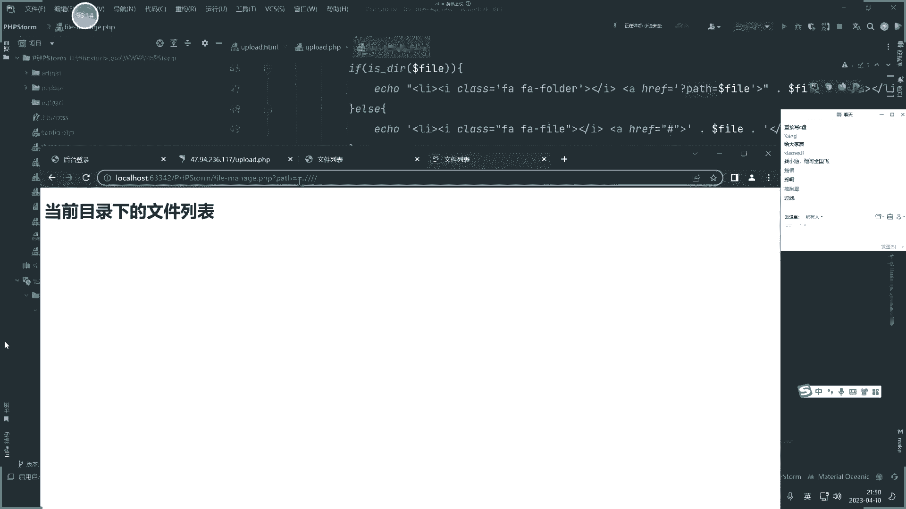

不怎么地啊这种情况啊，就是简单来说呀，你把这些代码的一些东西，比如说那个过滤啊，这种开发呀过去了，搞清楚之后呢，对于打CCTF搞代码审计呢，包括你后期对这个漏洞的理解，漏洞的这个黑盒测试。

白盒测试都是大大的帮助，这也是我们为什么要花这个气力去讲的，我当然不是叫你去开发，我这开发的本身也是个拆啊，这个假如开发的这么简单的代码是吧，都容易翻车，所以啊我也是没办法。

这只能说为了让你呢对后面的漏洞啊，包括后面的课程呢有更深的认识啊，所以才会讲这个开发的啊，不是我想讲，我真不想讲啊，我自己开发的都很菜啊。

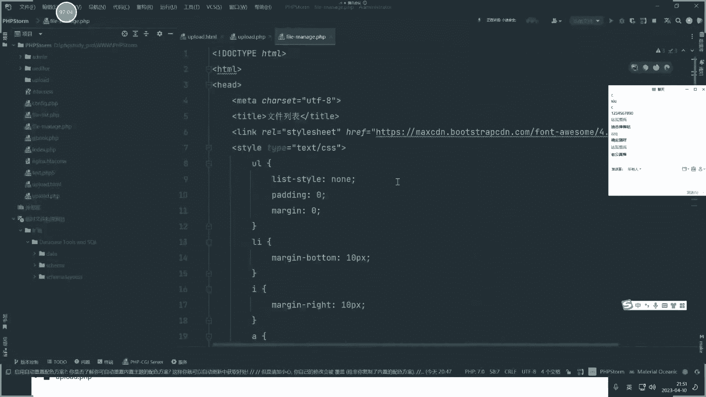

然后呢大家如果想学的话啊。

我们这里也给他找了个，前两天有个人呢啊，学生呢给我发了这两个文档，关于这个pp的开发文档，这个西数P和pp安全之道。

哎大家可以下去看一下，那么这里写了一些关于这个pp的一些开发中的。

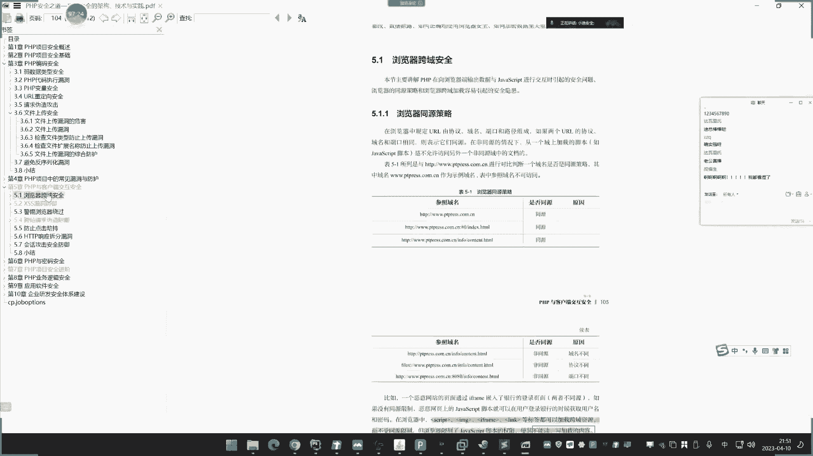

一些安全问题啊，PDF给大家去打包到那个里面去啊。

针对pp项目的安全性呢还是有点参考价值的，java就没用了啊，那java的时候我们在到时候讲java的时候。

