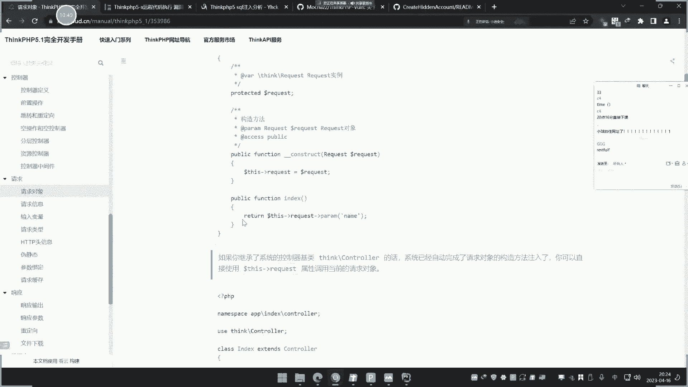
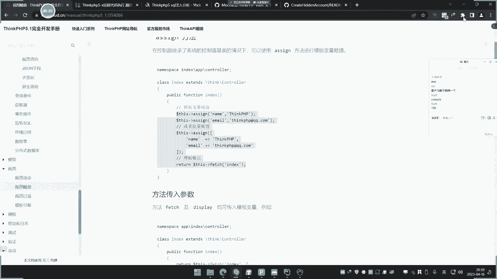
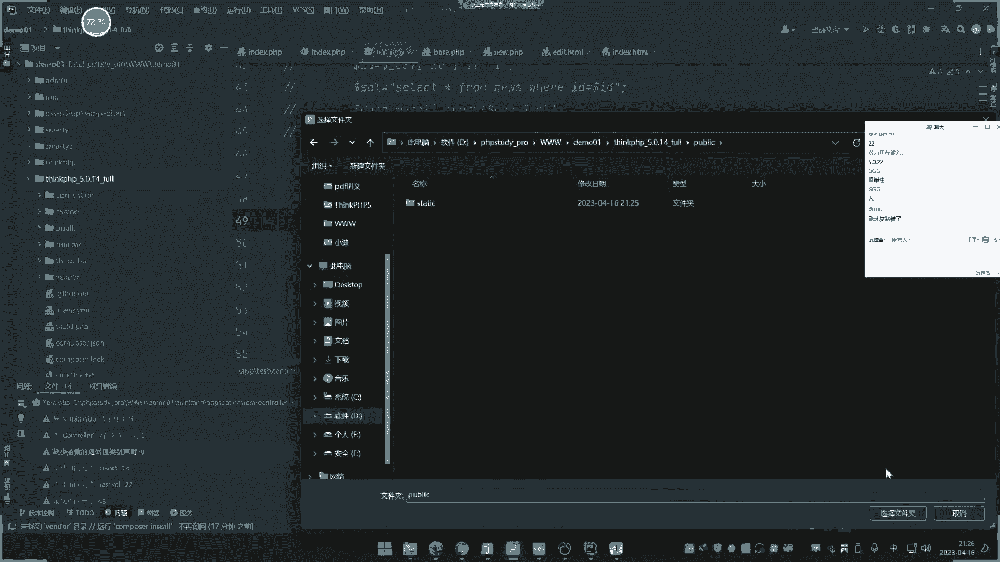
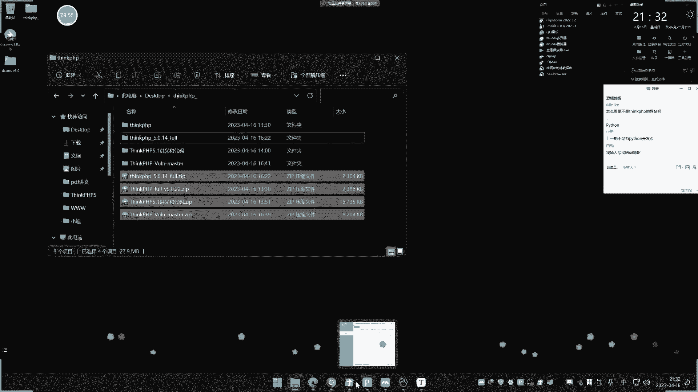
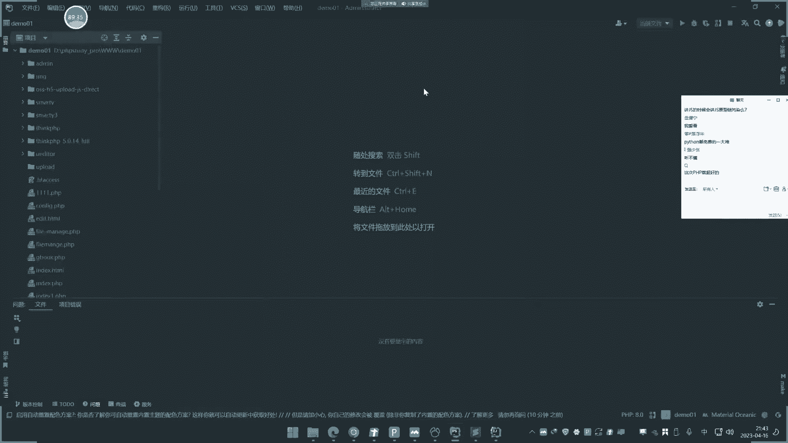

# P27：第27天-PHP应用&TP框架&路由访问&对象操作&内置过滤绕过&核心漏洞 - 逆风微笑的代码狗 - BV1Mx4y1q7Ny

讲这个P1P开发的最后一讲了啊，讲了之后呢就要来到JS的开发了，PVP的最后一讲了，讲的是这个框架类的，对讲的框架呢是这个SLEPB，虽然呢他有其他的框架，但是我们呢这个BB呢用的还是比较多的，分量。

在pp里面最大这个single pp呢讲了两点啊，就是说从他的这个开发使用上面讲一部分，然后呢再来说他的这个开发，使用编队的安全问题再讲一部分啊，知识点呢核心点就是说使用和安全的一些分析。

这样子呢是能够对于我们对这个框架开发的，web应用呢有更多的这个安全方面的知识点，这是我们今天这个主点，那首先呢我们说一下这个框架啊，这个TP框架是一个什么东西，他干嘛的啊，呃其实很简单。

一句话就很能理解啊，这个框架呢就是一个封装好的一个东西，比如说你可以用他的这个框架呢，来实现一个功能的话，比如说数据库操作，那么就只需要把框架下载好，调用里面的一些写法，就可以实现一个数据库操作。

而不需要像我们前期的原生态的开发一样啊，要配置这个各种各样的一些东西之后呢，啊。

并且把代码呢从开始到有写完，才能实现一个水果操作，我们这里呢可以给大家看一下啊，来首先呢这里呢我们先把之前的项目打开啧，就像我们之前呢去写一个这个，比如说写个数据库的这个操作啊，我们是先怎么操作的。

先这里呢去配置了一个这个数据库的，这个定义文件，然后呢再用这个相关的这个代码呀，来实现这个连接，连接完之后呢，再执行SQL语句，是这么一个过程对吧，所以他的步骤呢还是从无到有的啊。

就从零到到一的一个过程，就一步步的开始，那么如果说你用到框架之后呢，就可能简简单单一句代码，就能解决一个数据库的连接，它非常方便，所以框架的一个大概概念呢，就是其实就是封装好的东西。

好封装好的东西可以这样去理解它，就是我们封装好的一些东西，就其实就是说把那些复杂的东西呢封装在一起，然后呢你再要用的时候呢，就把用啊就是个封装的一个模块吧，可以这样去理解它。

那我们这里封装的搞清楚之后呢。

那么现在我们来说一下这个TV框架，为什么要去学习它啊，他的学习原因呢，就是说，如果你采用了这个框架去开发web应用的话，那么就必须按照它特定的这个过程来去开发，而且开发之后。

那你会发现和我们之前的很多东西呢会有差异，比如说路由上面的一些大差异。

那么现在呢我们就来给大家看一下TP框架，那么这个TP框架呢目前它的一个最新版本呢。

大家可以看一下啊，啊不是说哪个版本新就用哪一个啊，看你自己呢用哪个版本啊，现在用的最多的是sink pp的这个五版本，它的官网地址呢，可以看到这个pp的一个专门开发框架嗯，目前最新版本是6。1点啊。

啊然后呢还有五版本也比较多，用的这个面呢大家可以自己网上去看，我们用的颜色呢是无版本的啊，嗯老早期的一些康佳呢是三版本用了，后面呢用多了五版本，现在呢又出现六版本，其实关系也不大啊，主要说你怎么用它。

然后这边呢是他的一个这个开发手册，可以看一下他这个开发手册就怎么用啊，呃这里呢我们就先给大家去用一下。

一个这个TP框架啊，首先在用的时候呢，先要导入一个框架，再往上去下载一套框架的源码，这套我们用到的是这个这个版本啊，然后这个版本呢这是它的源码，我们把这个目录呢直接复制啊，复制到这里来。

复制到这个项目里面来来放这来啊。

好在他复制到之后呢，这里是他的一个目录，然后这里呢可以看一下他的版本啊，看下这个T版本的一个版本，他的版本呢可以在这个文件里面看到呢，这是5。0。22的一个版本好，那这里呢把门看到之后。

我们接下来了如何开发它啊，如何用这个TP框架来实现开发，首先呢我们要开发之前呢，先要把这个网站呢给大家理清楚，我们来解析这个目录啊，它不能直接再访问了，需要这里的配置了，给大家看一下。

我们再来把指向一下啊，指向这个demo，这里颜色是这个单端这里，然后这个singer bb指向这个public，指向这个目录啊，public目录点击确定确定啊，这样之后啊。

这里呢启动之后我们来访问一下啊，访问一下这个路径。

192。168。1。9啊。

直接访问好，这里呢显示一个叫single pp5V五，一个什么鬼东西啊，那么这个页面是从哪里来的呢。

给大家说一下啊，他这里呢是有入口文件，什么叫入口文件呢，我刚才指向的是这个public是吧，讲讲这个目录，然后这里有index，index里面有个什么叫做定义应用程序。

目录为当前目录上面目录的application这个地方，那么application就是这个目录嘛，那这个目录里面呢下面呢又没有index，那没有index，因为index默认为当做首页的一个指向文件。

就像我刚才指向的呢，网站这里指向的是谁啊，你看啊指向的是这个single pp的这个public，那么public下面的首页文件是刚才直接访问，就说这里访问的话就是访问那个首页文件。

就访问这个文件嘛对吧，index the public下面的index，但这里呢定义一个目录叫什么application，那这里呢定义这里来了，这里呢也没有所有文件。

那这个index访问这个路径是在哪里呢，大家看一下啊，它路径是在这个下面呢，这个要index，然后呢下面有个console，然后又一个index，然后你看这里有个叫index，然后在下面返回这个值。

你把这个值呢给他改一下，大家可以看一下啊，我把这个注释掉，然后从上面再去写一个代码，看着啊，我去返回，比如说写个123保存，然后刷新一下页面，看到没变成123，也其实就是说你刚才访问这个页面。

它指向的是这个目录下面的，那这个目录是怎么来的呢，是从你指向的目录index，它定义的程序目录application，然后呢来到这里，这里再找到index目录，在下面找index TP啊。

这里找到这里地方好，那么现在如果说我在下面呢继续要操作它，访问它的话，它的完整路径是什么样的。

我们来到这里呢，可以看一下它的官方的一个手册，就是关于这个路由访问的关系。

这一点呢是大家先要搞清楚的，就这里叫路由来这里一个叫路口文件定义，包括这个啦，有个路由这些东西啊，又要访问访问是一个什么模式访问呢，是这样一个访问啊，呃路径地址是模块加上控制器加操作加参数名。

什么叫模块呢，模块就是热力值，这个index目录叫做模块。

然后这里有个叫控制器，就是这个index pp控制器里面的操作。

就是这个方法名叫操作，后面如果说有参数，由于这里没有写参数。

所以这后面的不用管，所以也就是说我要触发这个index pp这个文件的话。

我该怎么去访问它呢，就是对应这个关系怎么访问啊，INDUST点pp后面加上什么INDUST，再加index，灰色访问，你看现在就访问到123，比如说像现在我重新再创建一个这个方法，大家看一下啊。

这里叫小迪拿到他这里来输出小B，把这个地方呢先把它注释关掉，那我现在访问index的时候，它是显示这个东西，这个东西就是这个代码嘛，就是这个代码写出来的呢，这个代码写出来的，然后呢我现在要触发这个了。

想这个该怎么触发呢，大家看一下啊，index模块是吧，这个index要对应这个目录，然后这个index下面那个以小D后面就加上什么，继续加小D，看到没，是不是就小D呀，对不对，同理啊。

如果下面写参数的话，比如说我先写写个参数啊，比如说来我写个参数啊，request啊。

他的接收呢和我们常见的语法也不一样，你看他这里啊请求接收他是这样取，它，就不是像我们前面，我们前面去请求结束是怎么写啊，是不是比如说啊我结束的话啊，这样写啊，比如说X等于下横get啊。

我假如这样去写的话是吧，就以前呢是这样的写法，对不对，那X是吧，然后呢这里那就return这个变量是吧，我们之前的是这样写，这样写呢它也可以访问到，但是呢他也这样写，问号X等于一，你看他就输于一是吧。

那触发这个X啊，然后输出一，你看对不对，他这样写，然后呢你这样写就不行了，你看比如X1，那他就不认识了，也没错误，然后如果说你要这样去复制这个值的话，你看这个就是没有后缀是吧，没有后缀呢。

不像我们这后面写个PPT啊，文豪这样写对不对，他就这样写法，那这样写的话呢，你要需要怎么做呢啊，你就按照他自己的一个自己的一个文档格式，这里有个叫响应和请求，你看请求对象怎么写的，你看他怎么写的啊。

看一下啊，来请求信息，输入变量请求类型啊，他是怎么写的呢，给大家看一下了，就这样写，看到没，那就这样写的，就是用request request里面的定义了。

然后呢这个是参数为la再复制给变量，那我们再给大家看一下好了，比如这里的变量X等于它啊，它就等于request，然后这个然后这个呢没有定义，没定义的话，需要在这里用到。

进入这个think pp的下面的这个request模块，嗯用了这个模块。

呃你这里呢。

就是你就是说你这里呢要用到这个方式呢。

去请求啊，他就会它就会怎么样呢。

就会这样操作啊，直接把它写成一条语句吧，写成一体句，那后面就是name值为参数名，那信息请求1list，然后返回，然后这个时候啊，你这样子回车移来这里值就改成name了哈，不是它了，哎这哪不对呀。

看下啊。

小弟内蒙尼，用他这个原封不动的写吧，曹左的。

继承一下啊，把这个代码呢给他继承一下。

它用到这两个东西。

然后这里有个基层写上来，刚才是没有写这个地方的问题，应该现在就可以了啊，这里有个这个东西啊，这个东西呢你不写的话，你就用这样的写法也行啊。

嗯写上去这样写吧，刚才应该也可以，他是把是复制成变量了啊。

来看到没输出移了吗，你看输出移了的，那他你这样去写的话，你看啊这里加上问号name等于一，那它也可以，然后呢这种写法也可以。

但是刚才我们那种原封不动的，就不能那样写是吧，原封不动的，原分不动的，刚才的写法就这种啊，你看啊就是我们刚说的呢，比如说变量X等于DOLF下回get，然后接收这个X的值是吧，然后呢。

这个return输出这个变量X就刚才这样写的话啊，这样写的时候呢就有出现什么情况。

这样起来的时候，那你这样呢就不行，你看这样这样就不行，X等于X等于一，那它就不行，他必须要怎么样在后面加上S呢，它才可以，对不对。

所以说你按照官方的写法，他如果有了就支持你按照这种不是官方写法，就是我们原生态的那种写法，那这种写法它就不支持它也不支持它。

就必须按照我们原生态那种，那这种写法它就支持这种写法呢，它也可以是吧，name嗯，然后，LIM等于一是吧，它也支持也可以这样子去写小迪杠name m等于二，它也可以。

是不是，所以你看啊，也就是说这里面有个控制器是吧，有个控制器控制器之后呢，这样访问路由关系，就这样子的啊，index是pp是默认的。

这个index就是代表这里的一级application的index目录，然后再INDEST就是它的文件名，控制器里面的文件名，Dest，后面这个小迪就是这个文件里面的这个方法名，调用它后面这个参数。

就是你里面涉及到的参数name，然后只是为R它接收这用request去接收这个伪name，然后这里如果说你改X，那么这里呢就会失败，这就要改成什么X之后呢，他就正常，对不对，所以说大家就明白了啊。

他就其实就是说他不用去把你这什么get类型啊。

post呢全部封装成request，如果你要使用get或post的话，可以在这里筛选，你看啊，你在使用的时候呢，就可以在这里筛选，就可以在这里筛选，你看就可以在这里，那你看啊他的一个写法来。

它也可以在这里来绑定那个参数，那request get后面写个get，接受id值就写get，它就只接受get，如果你不写，他就全部接收，就写post，那就接受post，所以说啊。

他就是相当于内把这个常规的原生态的。

这种这种功能的函数呢，全部要封装这个request，这里的你直接用这个request呢啊，然后呢自自定义的去写，大家可能会问他为什么要这样做呢是吧，那么等一下我就给大家演示一下啊，那么这是他的第一种啊。

就是我们大概知道它的一个路由关系，和访问的关系了，那么现在啊，如果说我在下面我再部署一个文件啊，我再部署个文件。

我怎么部署呢，我就再创建一个目录啊，大家看着啊，我创建个目录叫test目录。

然后呢test下面呢我再创建一个目录叫console。

CONTRO就固定的啊。

就到控制器，然后目录下面呢再创建一个文件啊。

文件前面要大写啊，叫test点pp好。

你看啊，我现在创建一个特色文件，你看啊，我在这里呢去写代码，我把上面代码呢给他粘贴复制一下，然后这里要再来复制一下，之后呢，再把这个代码呢给他复制过来，好看下啊，我用原封不动的代码。

现在我要去访问这个test文件的话，该怎么办，首先要访问之前，你需要改几个地方，首先这里啊它的命名空间，这里呢就是app dota是index，这里要改成什么test，明白吗。

然后这里呢这里也要改成test好，这样就可以了啊，你看现在我要访问这个特斯里面的文件，比如说我要访问这个让他访问显示123，该怎么访问它呢，就是说我要触发这个特色文件，我该怎么访问它呢。

按照我们之前的逻辑，我们侦查的是URL访问地址是怎么访问它，是路径，比如说这个application，我们这里就叫什么application，然后呢一级级的去写这个路径。

但是这里的显然他是不是这样的访问的啊，就像我们刚才一样，如果我真正访问的话，肯定就是啊访问这个目录，然后再下一级目录，下一集，下一集下集，但这里让你访问他认可不行啊，不行的啊，你这样访问是不行的。

所以加怎么访问的呢，是按照他的路有关系啊，Index pp，然后呢这里是不是要改变了呢，刚才是访问的index这个目录现在是改成test对应上，然后呢他文件也叫test，所以我继续，所以也是test好。

然后它下面的方法名为index，我是不是要改成INDESTOR呀，你看是不是输出123呐，那么同样道理，我如果要访问小迪，那这个index就改成什么小迪方法是吧，然后呢这里它的全称值是X。

是不是我就是X再加上一个值，所以就真正确出发了呀，咳，所以他的核一般这个single pb的核心开发文件呢，就是在这个应用程序目录，然后呢找这个CONSOL文件，这是他们的叫什么控制器文件。

FFC的模型有三个啊，就是一个叫FIC，对应的就是model和这个video，还有就是console，这这这这这这这这这个名字啊，啊就对应的就是这几个东西，就是一个叫模板。

一个视图，一个是控制器，那么核心文件就是在控制器里面，就是一些核心的代码逻辑就写到这里面，你要把这个物业关系搞清楚之后，你才能去很简单的道理，他如果用这个新app框架去开发的话。

你连怎么去访问这个文件都不知道，你怎么取车呢，对不对，就很简单，这个文件里面假设有漏洞，那怎么去访问这个文件呢，你都不知道是吧，他的访问逻辑呢就是他的这个路由逻辑是吧，就是的找到一个对应的目录。

文件名和对应的方法名，然后呢进去访问，他就把全部封装好了，那么现在呢我们就用到这个，用到这个什么，现在我们用的是控制器是吧，那么这个model和value是什么鬼呢，现在还先不删。

我们先把这个控制器里面来实现一下，文件是这个SQL注入啊，circle这个连接操作，大家可以看一下啊，用这个SPP去操作数据库是什么样的代码，我们现在呢就给他写一下啊，然后让我重新再创建一个方法。

名字就叫test circle是吧，测试circle操作，然后呢把这个代码呢先删掉，然后你看啊他去操作这个控制器，它是操作这个数据库啊，就是使用什么，使用这个MYSQL哎呀。

使用这个TP框架操作MYSQL数据库，然后你看他是怎么操作的啊，我们正常以前的操作就原生态的那个操作，是不是就是像这个写这个留言板一样啊，啊连接数据库，然后呢插入数据库这个定义SQL语句。

然后用这个MYSQL去执行它，对不对。

但是这个新的PV就不一样了啊，他去操作数据库，他怎么操作啊，那它的连接数据库是先配置文件，配置数据库的这个文件。

然后如何配置呢，就找到这个应用程序目录，下面有个角database这个地方在这里呢就是要配信息，你看MYSQL类型数据库名呢，我们就写demo01数据库，然后root密码写进去，然后端口3306。

其他的就根据自己需要改了啊，一般就这几个点啊是吧，账号密码配置好，配置好之后呢，我们检查一下这个数据库的一个情况，看一下啊，是不是当前数据库连上去，Demo01，这是我们要操作的是吧。

操作数据库呢DOM01，然后呢DOM01账号IP地址root是吧。

都对的好，那这里呢把这个东西呢配置好之后，第二步啊，这是配置它的一个情况，然后呢如何连接它呢，你比如说他查询数据，他就这样写来这样写，这样写是个什么意思啊，它的追踪生成语句是这样的。

就说我们以前呢原生态的语句是这样写的，就很简单啊，我们原生态的这个SQL语句是这么一个模型，在SYNPP里面它是怎么写呢，就用这条语句对应上，那么我们可以对应一下这什么意思啊，你看啊。

think user是表明那这里到我家作为查询表，我查这个叫NESE，这个表我这里就改成什么new是吧，改成news，然后条件是id等于一的啊，用finder呐，这是他执行语句。

就这样就说你这条语句就对应这条语句，然后呢，然后怎么办呢，这个dB呢要用的时候呢，就在这里呢要声明一个拥土的地方，就这里换成dB也用它就声明这个东西用到它好，这个dB就亮了是吧，然后呢你看啊。

这样子呢就是他执行这个语句的一个情况，好执行这个语句情况，然后你可以看一下，我用一个变量来接收，比如说data变量来接收这个结果，然后呢我再return一下这个变量，结果。

好我们现在娜娜去请求这个test的SQL方法。

来去触发这个SQL语句，我们现在来看一下啊，去访问这个地方，这是他用SYNPP去执行SQL语句的一个流程，使用这种啊，这是查询，那么同样道理啊，你如果是像什么删除啊，这个地方呢它有呢添加数据啊。

更新数据，那不同的呢写法就不一样了，删除数据是这样写来就这样写呢，对应的表啊列，然后呢这是update，用update方法，那删除数据就是呢delete啊，它就不一样。

知道吧，他就不一样，然后这里呢我们就把它数据给他返回，然后去网访问这个地址，那返回地址呢就是特色的文件，然后这个方法名改了嘛，是特色circle是吧，特色circle啊，好两发出页面错误呃，这啥情况呢。

呃如果说你不知道页面具体什么错误的话，你可以把调试开关它开起来，就这个叫config pp，可以把这个呢调试模式开起来，调试模式开起来之后呢，就能看到一些错误的一个具体报告啊。

我们把这两个都开一下，再来刷新，看看什么错误错误。

他说类型是数组哦，那是数组的话，我打印的时候呢就不能再打印了，我就用个这个JSN呢格式呢去打印这个data，数据好。

再来看一下刷新，你看他是不是就把这个数据给取出来了，你看这个数据就是我数据库的这个内60，等于一的这个这个数据啊，你看那对应的id等于一的啊，喷起TLE的小牛安全博格handle。

就是效率培训开课了是吧，然后苏比特就是下面的后面值image就这个值是吧，取出来了，你看对不对。

所以说有新的PPPI的话呢，就配置好账号文件之后呢，直接用这个语句，一条语句呢就不用我们用那种原生态什么MYSQL，像之前写写写写写那种文件一样是吧，你看之前写SQL语句是怎么写，是不是这样写呢。

先定义啊，定义四个语句啊，然后用函数执行呀，他前期呢是有这个数据库的配置是吧，还要去连接啊等等一些操作啊，这里呢他就直接用这个语句来啊，把数据配好之后，再直接用这个东西呢，他就帮你实现了好。

你觉得诶那这个实现有什么意义呢，好像都是实现功能。

那我只也可以用这个原生态的呀，对不对，但是这是框架，就是它其实就是说把这个功能帮你封装好了。

在封装的同时它也会加速加上它的安全过滤，加上他的安全过滤啥意思呢。

你看啊，现在啊我们来给大家做个演示，你看啊，正常来讲的话。

我们用这个g blog，我们去执行这个语句的时候，我们先访问一下他好，这是当时呢我们用这个这个。

我我我拿了个布拉基拉伯格来测试啊，拿我们之前上节课讲的这个新闻啊，用这个新闻呢去给他演示啊，你看啊，这是之前的新闻是吧，然后呢这里是执行的SQL语句，我把这个局来进行一个打印，大家看一下啊。

就是我每次执行的时候。

他那个SQL语句这个打印情况，你看啊，打印出来了，那这是之前那个这个语句打印出来，是执行这个语句，对不对，然后呢如果我要敲的话，id等于R啊，它就等于二，对不对，它就会改变那比一。

然后呢我假如后面恰这东西他也会接受，看到没是能接受啊，能接受就是会执行这后面东西是吧，这是我们自后面要讲的SQL语句，的一个产生的原理，它就会结束这个值对吧，这原生态这样写的话啊，原生态这样写的啊。

就不会做任何过滤啊，你这里id等于多少，他不解释i id值吗，解说id的拼装，这个设与局啊啊你这里能等于一，那么这执行的语句是id等于一啊，你加上I等于一，它也会加上IM1是吧，输出是Q语句。

这是我们原生态的啊，大家看到了啊，原生态的，那么现在你看啊，我用SYNAPP开发的话啊，他不是也要结束变量吗，我可以怎么样用到之前的这个变量接收模式，对不对，要用到这个变量检测模式，就这样去写啊。

然后呢等于一个变量叫id好结束这个变量是吧，结果变量为X的，然后这里写成什么变量为id，对不对，就是呢我用这里的，用SKPB的去结束这个变量X的值，然后呢再用这个while i d等于一。

按照正常来讲啊，你这里二位的一，这是之前这个原生态的写法，那么现在啊我们来看一下这种原生态的写法，执行的语句好，那么现在我们来关注一下。

好你看啊，他等于这个移的时候，然后我输按着移动二，它也会报错嘛，因为这里201201 12，那就就有问题嘛，这个语句就错了，所以页面不能正常显示啊，就说结束之后，你看2011。

它正常的201~22代就不正常了。

页面就错误了，这是原生态的啊，那么现在我们来关注一下这边特色零一是吧，那他默认是为空的，因为没有发数据，这个id呢现在为空，所以我在呢给他发数据X乘1S1发过去啊，数据能够正常回血是吧。

那么现在呢我就给他传参传什么暗的，一等一安等一等二，你看安的一等一正常好正常，一旦等12诶，输什么东西呀，我输入任何东西都没有任何反应，看没了，输什么东西，他都没有任何反应，啥情况。

而刚才呃这一边的原生态这个语法。

你输入任何东西在这里呢给它传参，它就报错了啊，输入任何东西它就报错了，你只有数一的时候，他正常，你只要输后面一东西呢。

SQL语句查询这个语句有问题，没有数据返回，所以验证报错，但这里为什么他也接受这个移植，我在输入中东西呢还没有反应呢，因为sink pp有内置过滤，在过滤可能是SQL语句中，也可能是这个，就说你看到啊。

现在呢你说这是用它内置的解锁方法，好行，我换成我们的原生态的接收方式，去接收这个数据，让我看一下这个数据库语句，会不会也有这个东西呢，你看啊，我现在呢换成这个啊，你看啊。

这个接收方式就是按照原生态的接收是吧，接收这个S，并且我还可以给你输出看一下这个值。

注意你看啊，我的输出，你看啊。

我们看这边，我们这里呢写上这个X等一哈。

然后你看啊，先让他执行。

好他这个结束好，这里它是一个数组啊，这个X要解释一个等于数组。

它添加进去啊，这里要等于数组呃，那我还只能用这种情况把它包含成数组，看行不行还是不行，嗯这样子看一下，对不对，好我他这里要输主啊，啧哎呀，这还不好搞啊，这样变变化速度，那我不管它了吧。

呃我这个实验呢做到这里呢，大家也明白了啊，呃其实就是说你即使把这个id呢把它传进去了，他也会不会受到任何影响，其实就是说你只要用他这个官方的一个写法啊，只要用它官方的一个写法，只要用它官方写法啊，哎。

因为他这里结束的是那个结束的是一个，这里变量要为数组，要为数组啊，官方写法呢他是把它变成数组加到这里去了，呃你即使用到刚才那个dollar get呢，它数据也不会发生这种改变，它也不会发生任何改变。

这其实就是说两个意思啊，这个sink pp这里的实验做完之后呢，就告诉我们一个道理，什么道理呢，就是啊使用这个，TP框架啊，去这个操作数据库，默认呢是收到了这个什么框架，内置过滤的一个保护。

所以它是能够防止一些SQL注入攻击的。

SQL注入工具呢，其实就是说这个参数呢你在后面写主语句的话，它会随着这个注入语句呢拼接的来产生注点，但是你可以看到我写任何东西，他不会理会我，我写任何东西在后面加什么情况。

他都是原来那个样子，语句呢他压根就没有去执行这后面的东西，他全部把它当做了一个过滤掉了。

所以这也是我们为什么学习他这个，最核心的原因，就是因为呢这个TP框架它既然是为了开发，那么如果说你用这个开发不安全的话，那也没人用，所以他勒字呢有它的安全模式，你用它这个写法会受到他内置的保护。

导致有些安全漏洞在这里呢就自动会修复上，所以这也是为什么说，要了解新的pk开发的一个原因，就是说即使你在这里没有看到任何过滤，对你这个结束的值呢进行任何过滤，但是它依旧里面是有内置过滤的，对不对好。

那么这个是实现他的一个circle注入的一个测试，对不对，那么其实这里呢就是一句话啊，第一点就是我们说使用这个得到道理，就是使用它的，第二点呢就是啊如果是吧，好原生态的刚才也对比了哈。

原生态的这个数据库的一个操作啊，如果没有过滤，就会受到什么，受到这种circle，速度攻击对不对，就说原生态的话啊，你不过滤就是没有过滤，有你必须有过滤才行，但是tb不一样。

你这里看不到任何有我写任何过滤是吧，没有针对这个id过滤什么东西，我就用它去接收，然后呢直插到数据库里面去使用，哎但是呢是吧，我注入不了。

我输这个东西呢，它没有影响，而我们原生态的是吧，我一输上去呢，页面就报错，因为他接受了这个值有问题，那是个鱼，就这样拼接上去了。

对不对，所以这个结果呢就给大家带来这个结果啊，这是我们的结论，好这个呢是操作这个SQL注入啊，操作数据库的。

那么他操作文件上传的，它也可以是吧，你看啊他还操作文件上传的，我们看看一下他这个操作文件上传的，你看有杂项啊，操作cookie的操作C型的，也就是说你如果用CAPPT开发针对cookie验证。

针对C型验证用户的验证，你按照他的语法，它也有内置保护，也有内置保护，所以说你用TP框架第一个是开方便你的开发，第二个他有内置的保护，然后你看我用文件上传啊，先呢去创建个这个上传页面是吧。

搞个上传页面好，我这里呢就随便写个页面啊，随便写个页面啊，我就写了这个写到它指向目录是public吧，我就写在public里面，写public里面。

public里面是吧，然后在人家创建一个这个ATM页面，名字就叫差点啊，就叫upload点ATM。

这就是upload，然后呢把这个代码呢上传，代码呢就给他放上去啊。

然后上传这个这边呢我们就创建一个特色方法，然后呢就把这个代码那个想去了。

这是他检测的一个机制啊，是吧，帮我写到这来啊，那这是检测上传的是upload，然后接受这个name image值的好，这是他输出的这个结果，再来一个例子啊，我们就用这个例子呢来测试，然后这里要改一下啊。

这AXY那就指向这个哪个是test嘛，那就指向什么，是不就是路径就是这么写的，我要触发这个upload方法要怎么写啊，是这里就是index pp加上它的文件名是模块是test，然后呢它的这个方法啊。

控制器名字也叫test，方法名是upload呀，指向这个地方啊，你看路径这样小啊，就这里呢upload方法嘛，它是存储到test里面嘛，然后test里面是来源于路径，是在这里嘛啊test test。

然后下面的这个upload，所以这就是test test upload请求他，然后呢请求的那个表单值，那就是以类image全输，所以这里呢也是image对应商啊，保存到当前目录的UPLOADERS。

所以我在这个当前目录呢去创建一个UPLOADERS，对不对，他创建的是哪里的一个当前目录，他作应用程序目录，应用程序拉BLOSE。

那就是application里面创建一个什么UPLOADERS，来结束这个存储的文件名。

创建一下，那么现在呢我们去访问一下这个upload点，Atm upload，ATM呢是放在p public里面，我刚才这个网站解析呢是放在这个下面嘛，对对对，放在plate，所以我就直接可以访问地址。

加上upload，点ATM就触发那个TM文件了。

好来然后点击上传了，试一下，来看一下啊，上全面3000个文件啊。

商家你看他打印的信息不打印出来吗，JPG格式，然后呢东西这信息呢就是这里定义的嘛。

呢他输出的这个地方来输出这个格式是吧啊，输出JPG，然后输出这个get safety name，还get file name，就一个获取的是保存文件名，一个获取的是当前文件名，你看JPG是获取的格式。

就这个嘛获取格式啊，你这里呢可以试着去换个行，换个行试一下是吧，换行试一下，把它搞的这个看上去没关系啊。

换个行一下打一下就换个行，再看一下刷新。

你看是吧，那这个呢就是获取他的扣缀为JP1是吧，然后呢这个呢就是获取它的这个保存文件名，他这个呢就获取到文件名啊，这是他一个文件上的操作，对不对。

那么如果说你要加验证的话，文件上全加验证，那上传验证它就可以这样写的。

你看就在前面加上一个东西，我们再把这个行代码呢给它拿出来替换一下，这是有验证的，文件上传用这种写法，你看一下啊，写好了来接受PHILLIEMAGE，然后呢判断一下呢，用这个来检测大小和后缀。

那ESC等于j pg png pf是吧，去判断是不是这几个后缀，如果是的话，好他就打印信息。

就让你上传，我可以试一下哦，来重新访问一下，重新创建一下啊，这里是有验证的，刚才没有验证的时候，我们先来看一下啊，没有验证啊，之前呢我就上传一个TXT文件好吧，随便上传一个文件啊，比如上传个pp文件啊。

上传后缀不允许看到没提示了，然后当你上传这个图片文件的时候呢。

它就可以了，上个图片文件打开文件大小不符合啊，把大小改一下吧，大小太小了，啊100，这是字节的啊。

嗯这个大小是怎么换算的。

妈的这个大小怎么通，不管了。

把它去掉，不不限制大小了，你妹的把它去掉，不限制大小了，好吧好，你看一下啊。

我们现在呢就是用它实现这个文件上传功能嘛，哈那是不是就成功的上传了呀。

成功的能够上传操作呀，然后你看啊BLOAD里面就会自动的，你看啊诶这个阿布鲁克斯的，哎怎么没有文件啊，哎是路径搞错了吗，我看一下啊，好在这里啊，在这里啊，刚才创建错误的目录是在这新的pp下面。

来看这刚才上传的几个文件呢，它自动帮你呢自动的，你在这里有没有有没有捉这个什么鬼，保存到这个什么当前时间还这种命名啊，你都没有去选择他自己帮你的呢，搞的自动帮你搞的呢上有三个文件。

它自动帮你重新以这个时间命名上传这里，保存到这里来了啊，你不信的话。

我们可以重新来上传一个，试一下，来重新再上传一次。

那你还是多了个文件，对不对，它会自动帮你去那个啊。

然后呢你如果说要换其他格式文件的话，你可以看一下，我换个这个TIT。

那文件后缀不执行，它就有它内置的，你就直接用这个语法写好就可以了，你过了后缀就糊了，后缀那能不能突破呢，突破不了啊，拖不了他再一写过的后缀，那就是黑白名单全部加上去了，就我们之前呢就原生态的。

我们是还要写什么黑白名单呢，你怎么过滤，怎么过滤，他把所有东西都帮你写好了，你就只需要按照个使用语法这样去写，过滤就完了，其他就不用担心了，因为他作为一个专门搞开发的话，安全的话他肯定是写的比较好的。

很难突破，突破不了，他这样写的话啊，就就封堵了是吧，那那你自己呢想上传什么就不行了啊，他就去加验证，因为它有它内置的过滤机制啊，内置过滤机制，那就远比你自己想的要更好，因为他是经过多个人的测试。

而不是你网上随便查点资料，写个过滤的情况，他更严谨，所以其实就是说，它丰富了我们这个开发的这个效率，把我们的想要的功能呢都封装在这个框架里面，我们只要按照他是他自己的这个写法去完成啊。

然后呢他有他勒字的保护，而且这个勒字保护呢是可行的，就是要经过大量的实验，然后呢保证这个过滤的是完整严谨的，所以它比原生态开发呢要更加的智能，更加的效率，同样的也更加的安全，当然了，我说的更加安全呢。

只是说相对的啊，并不是说绝对的好，那这个搞清之后呢，还有一个就是我们刚才不是说了，这个F2C模型吗，那基于这个前端的这个渲染技术，它又怎么实现的呢，好给大家看一下啊，它还会有一个技术。

就是我们说的非流技术，就是识图技术，就说我们前端的页面的渲染，就和我们上节课讲过的那种框架，模板应用一样的，就是模板应用就是我的前端啊，你看啊现有个index的嘛。

public在application下面不是有个这个index吗，然后呢他刚才我们去访问的时候，是访问这个里面的方法，然后形成的页面，对不对，如果说我要有个ATM代码呢，比如说我写个ATM。

我这里输出什么鬼，ATM代码，我这样写吗，显然这样写是不好的啊，比如我这样写，是我写个这个这个ATM代码是吧，显示个BR啊，让他换行啊，我这样写吗，肯定不这样，他有有个专门的视图技术。

就是我们说的渲染技术怎么实现呢。

看着啊，在当前目录下面创建目录叫value。

那这里呢可以看一下他的文手册啊。

就他有这种集成，它就是分类的某这个console里面的控制器。

然后分流里面呢就是它的这个什么视图，就是我们说的ATM的一些代码啊，我们可以看一下这里它应该有的啊，呃这个V6的视图，这里你看他怎么渲染的，他告诉你它的渲染方式呢非常简单呐。

嗯就是那目录就是当前模块下面非牛，当前控制器小写当前操作小写ATM文件好。

那我就知道了，那比如说index里面我们就创建一个什么目录，名字叫VIDE固定的文件名啊。

然后VUE里面再创建什么。

你看啊，他说了，下面就是控制器好，我就创建一个控制器。

也叫index小写，然后在下面再创建一个什么文件。

就ATM文件也叫这个当前操作的文件名也叫index吧。

好那这里创建这个index文件之后呢，你看这个标题我们就随便写啊，小迪，然后这里写上这个小DC是吧，就写这个页面啊，写好之后如何去访问这个index文件呢是吧，这是一个什么概念呢。

为什么这个这个文件之前是访问这个地方嘛。

我现在给他访问一下啊，返那个地方。

那index pp index的模块，index的这个地方，然后方法是invest，这是它原本的这个显示页面，就这里嘛，是不是就显示这里啊，然后呢我让它显示123，把这个先注释掉，现在让大家看一下效果。

那123显示触发这个地方，对不对，然后现在呢我让它用这个页面，因为这个页面就是纯TMMM啊，页面它更加的美观，知道吧，因为你如果说要写美观的话，这是pp代码，你还要怎么办呢。

你是要这样去写这个TEMPA，去输出这个ATTEMPA1行输出，那这里显然是很麻烦的，所以我要装这个ATM代码呢，用来实现。

那么如何触发这个index ATM代码呢，就可以在这里面写上一个什么渲染它就可以了，看下文档这里来加上这个代码就可以了，来加这个了，渲染这个默认路径。

它也会自动找这个默认路径来，就这样渲染嗯。

在渲染之前呢，啊这里呢就要用到这个空七把写上去，这里已经写到了啊，那就不需要再写了，然后继承这个方法也写了好。

那就可以了，你看啊，我现在你看啊，我就要渲染这个页面。

然后你再刷新一下，你看他是就会触发那个index htm，你看是输入小D还是以标题为小迪呀，那是个ATM代码。

那个效果啊，那你看ATM代码那里标题为小D，内容为小DISC，同样道理，如果这里有变量，它也可以，你看啊，标题这里我把它改成这种写法，就我们之前的了，比如说这里写上变量title，像变量title。

你看啊。

那么在这个index这空气里面就怎么办呢，它可以渲染页面，还可以进行添加，你看它可以在这里呢瞬间indein edit，那就说明这里的触发INDETATL啊，这是控制页面，我不写的话，就默认index。

如果你要换里面变量的话，该怎么操作呢，你看啊，就这样操作呢，把这个里面东西呢把它一改改成什么啊，你看啊，赋值，那需要赋值来把它复制一下，看一下啊。

效果，下载直接刷源码哈，来这里默认再写上index和不写都一样啊，写index就是告诉大家我渲染这个index页面啥意思呢。

比如说我现在再创建一个页面叫做INDE啊。

叫做edit点ATM是吧，这edit页面，edit页面呢我们就随便搞个这个页面是吧，找之前那个页面要把E取来，把这一点在页面，对不对，如果说我要渲染一点的页面的话，那么这里那就改成这个edit。

如果你留空则是index，写index也是index，那他有这个写法来告诉你来是吧，虽然这个index下面的edit也可以直接补写，不写的话，它就按照它默认的index去渲染。

然后你看啊你看他渲染什么啊，这里呢把雷姆字改成sink pp，email改成这个这个什么这个SNKSINGPP，Adadquitcom，然后你再找到这个index页面，因为它渲染的是index。

我们呢就找这个index页面，就这里啊对吧，把这地方变成什么，这个是name标题也得改成name，然后这个地方呢就写什么邮箱变量，邮箱email按照正常来讲的话，你看这里就会显示name和email。

这里呢去把它赋值，你看我们再刷新这个页面看一下，你看标题变成sink，pp内容变成sink，是不是自动取代这里面的值啊，你看这就是我们说的庸这个pp文件呢，去渲染这个ATM页面，然后呢。

从而让这个ATM带页面里面的东西呢发生改变，在这里呢就直接实现渲染它，然后呢如果说INDESTOR的话，就比如说这里index i i it，那就是这个index it这个页面，对不对，那就是这个页面。

你看啊渲染这个页面，然后这个页面里面比如说我要更改的，比如说内容类型，我们先不更改它，我先直接让它渲染好吧，我先把这个先注释掉，先不更改这里面值，那直接让它旋转这个index index页面。

我们来刷新一下，直接让校园啊，直接让校园，嗯在哪哪报错了哦，这里因为有这个这个页面里面有灾码啊，嗯我还先把这个页面代码或者粘贴粘贴在嘛，这是把改下吧，先好这里呢有这个类目，我先把它去掉，先把去掉。

先缓存这个正常值啊，正常正常值你看哪是啊，他就说这个地方呢是更改你要渲染的页面，那它渲染的页面就是index indein，这个in indeed的那个页面，对不对，来标题和内容对吧，能理解吧。

所以这个地方呢是更改你渲染的目标，然后这上面的就是渲染的结果是吧，渲染的结果嗯，比如说你要把里面的name值改成这个，改成这个什么single TP email呢，改成这个对不对。

那么在这里呢就依次取代它，比如说我就要取代是吧，传这个indeed里面页面，比如说get a name啊，这个呢就显示，呃一秒，对不对，这样一改，那刷新，那是不是发生更改了。

所以其实就是说它就是一个什么逻辑呢，就是你看页面的话，一个是负责页面的美观，在VUE里面逻辑就负责这个叫console，里面还有个model是什么鬼呢，model就是说我们的空叫什么，网上查一下啊。

现在我还没有上传的深入，那是在代码审计面会看的，现在都还看不到那里，对不对，这就是一个经典的MFC的一个模型。

有很多源码都是这个模型，我们呢可以随便在网上下载一套源码。

给大家看一下，基于这个模板开发的源码。

我们可以看一下啊，看一下一个这个网上随便下载源码啊。

我随便下载源码，只要是这个新的pp开发的，你打开，如果说你不懂这个singer bb，你是完全不知道他是怎么一个情况。

你只有学过，你才能看懂这个源码那个大概的架构，否则的话你连看的这个基础都没有，那有那就谈不上这个，去分析它有没有安全问题了是吧，你看我们这随便找个源码的啊，找个这个pp的开发的。

然后在这里头我们可以随便搜一个名字，就搜sk pp很多源码如果说采用它的话，那这里有个这个single bb开发的一些源码呢，比如说这个名字就是呢single pp i的一个开发，源码呢。

基于SINGKB5。0开发的对吧，你可以把这源码下载下来啊，你看看这是一个新的PB5。0开发的，你看这个200就是，所以你可以下下来，下之后你看一下它的源码的一个结构，是不是和我们今天讲的是类似的。

这样子呢才能更好的帮助你去分析啊，否则的话你分析都不会分析，看架构都不知道。

文件都不知道访问这些关系，怎么能做到这个操作呢是吧。

好大家看一下啊，你看他逻辑呢，我们来先把它用这个文件打开，我这那就换个工具打开吧，哎嗯换个spua mart，好我把这个唉算了吧，还是用这个id打开吧，用id打开打开。

新窗口，你看啊，这是它的目录结构啊，怎么卡了呀，什么情况哎啥情况这哎啥情况。

怎么卡了呀。

boss打开项目打，卡死了。

我你妹的真是服了，结束掉结束掉，哎无语了啊。

打开项目打开死卡死掉了。

那我就直接给他看。

直接人工看了吧，让大家看一下来，你看这是他的源码，对不对，你看那这里呢你是不是有个帕布里克啊，你打开PUBLI布里克看一下，来看一下它的指向目录，他的这个应用程序目录指向哪里啊，看一下啊，你看这里啊。

他有写的啊，那应用入口文件为因为为什么没写是吧，看一下上面，那其实也不用看，基本是app里面打开一看，你看enemy后台的文件相关的东西，home mobi对应的应该是主题什么地方呢。

按你打开是不是里面有个呢，是不是有value啊。

看到没value就是一前端页面呐，前端页面，那这就是他后台的一些页面，然后这里是很多渲染的这种的，看到没关键字，然后呢。

你看他逻辑逻辑就在这个什么console里面看，ADD me呢，你看有很多文件，那这个呢就是它的这个处理逻辑，你看打开啊，这里面写的什么默认方法来管理列表，在这里查，你看他写的这value里面视图。

就是这写法来给添加管理员，下面那写呢写SQL语句是怎么写的，你看对不对，你是全部这种写法，你看edit接收，那in request的方法呢，判断是post提交好，然后呢对不对，视图里面怎么显示，对不对。

这就可以看到嘛，你看那它每SL语句呢是用delete的，这个这个新的皮肤开发的语法呀，你看呢dB name呢表delete删除这个id id怎么来的，是不是，那从这里得到的。

他用这个input接收我们之前是用request很很多啊，你看这是写法，这你才能看得懂啊，对不对，你你否则的话你哪知道这上来看什么文件呢，你看他的文件都不知道从哪里看。

这这这这个就是新科批开发的一个源码是吧，你把我今天可以学这个前端，就是大概就知道了，这个这种源码的话，你如果说要分析的话是吧，你就知道怎么看的，就有个开始了吧。

是不是，至于说后面这个漏洞能不能找到，这不是我们啊，这这不是我们这个能决定的事情，因为他写的安全就安全，写的完全就不安全，对不对。

但至少呢你有开始下手的地方了是吧，看入口文件啦，然后知道这个目录对应什么意思啊，那这个enemy就是应该可能是后台相关的嘛，然后这个是它的页面的，显示是在这个VUE里面是吧。

核心逻辑是在console里面，然后一个文件呢对应可能就是一个功能是吧，这个是配置的这个数据库的是吧，这个是他的后台首页，这个是enemy是文件管理，比如说这个是会员管理，对不对，那你就知道看哪里了。

并且访问的话你应该也知道了吧，访问的话就肯定就是这个加上这个ADD me。

然后加上这个文件名，然后再出复盘里面的方法名是吧，那就知道访问和文件的对应关系就好测了呗，好那这个我把这个前期的这个第一点讲完了啊。

就是他的经典的MC模型对吧，试图带印它前端的页面的样式和显示模型，C呢就是它核心控制代码M呢，我们现在没有讲啊，然后呢这是他的开火性，那么现在呢我们就要分析一下他的安全问题，因为我刚才说了。

他不是在讲的时候呢。

我们刚才看到了这个操作呀，刚才这个还给了大家注释嘛是吧，然后这里还写了两个注释的嘛，在这里在这个特色点方法里，那这我刚才写的两个注释呢是吧，使用这个TP框架默认受到保护，对不对。

但如果说你不按照规矩的写法去写。

会不会受到保护呢，很简单啊，你看啊它还有些其他写法，或者说我直接按照我原生态的写法，但但是那个呢显然不现实，既然用到框架开发的多，多少还是用啊，你看啊，我们这里呢可以看一下啊，如果说你用这种写法的话。

那么就不能保证你的安全了啊，比如说这里让我们看一下啊，那原生写法，你看那还有一个叫原生查询，就说用到原生查询，用到他这里呢，只是用他的这个dB的这个索引。

去执行这个SL语句，假如他用这种语句去写这个SQL语句的话啊，这是我们之前的啊，我再来把注释一下，这个是我们说的啊，他的规矩写法就是它规定的写法啊对吧，然后呢再用到它里面的原生写法看一下啊。

下面这个是原式一些吧，好你看啊，我现在用原生写法的话，会出现个什么问题，把这些介绍变量id等代码一改是吧，变成id写上去，然后这个use4好，你看啊，我这样去写的话是吧，用这里的原生写法。

就等同于我们自己呢去写这个语句，一样的语句是我们固定好的，我这样去写啊，大家看一下效果，去请求一下这个路径，Test test，然后是这个是方法名，是他是SQL，然后是这个X等于一执行。

然后他执行出来是吧，然后你看啊，之前我用这个写法是，我无论后面怎么加它都没反应，现在我看一下啊，我加一下安德一等一，它也没反应，R1到R呢，哎反应了数据为空了，为什么数据为空啊，因为他接收到数据嘛。

那么你写这个东西它就有反应了。

说明语句有问题了是吧，他报错，你让他报错，为什么报错啊。

因为他接收到的呢只报错，说明你这里数据发送过了就快结束了，男生写吧，是不是有安全隐患呢，对不对，而你用这种规矩写法呢，我们再把规矩语法把它露出来看一下，来把这个注释去掉。

你看有现在用规矩约法，你看啊，我再刷新呐，不动了，怎么输，他都还是这个数据是什么数据，数据输什么东西，他不管你。

所以又得到个结论了，就是我刚才说的原生态的写法里面，用TP框架里面有分两种，一种叫什么安全写法，和这个不安全写法，是啊安全写法就是等同于他推荐的写法，不安全写法，就是说就是我们说的这个表达式写法。

就是他这个文档里面就这种写法呢是吧，两个例子对不对，规矩写法来不按写法就是远程写法嘛，规矩写法就这样写了，哎他受到保护，不完全写完呢，就等于什么不会受到保护，为什么不受保护呢，其实很简单。

因为呢他只是调用了这个什么，你看只是调用这个dB的去执行这个语句，但是后面这个语句呢他没有任何控制，就是一个异常值，而上面这个呢就是呢控制了这个表，控制这个while条件控制，这个查询方法都控制了。

所以用到这个对应的这个函数的时候，这个是它封装好的，就是singer bb面封装好的while和file，你可以点进去呢，把按住shift键点击这个well，你看这是他自己。

你看他自己新的app文件里面，那个愉快的一个文件，你看他自己定义的方法，他自己定义的方法，你看你看这里是不是有些呢一些历史page，will1叉P，这应该是过滤的，来过滤掉一些这个函数。

它这里面有内置优先，你看有些这个过滤呢有一些过滤的写法在里面，就是说你用这种well这个filter这些东西，它是内置针对这个while条件去触发，这个SQL语的时候呢，是有内置过滤的。

而你这里那就刚好不用这后面了，就只用这个执行语句执行执行这个函数，那就不行了，表，所以说啊，我们现在呢就说如果你用SINGAPP开发的话。

需要看几个地方，看哪几个地方呢，写清楚了啊，内置的代码写法啥意思呢，就说你用到它不合规的代码写法，会造成安全问题。

会造成安全问题，这个例子就是这个意思，就是说你虽然用到了这个，他这个SKPP的这种写法，但是呢你用到这种这种情况的话，它也不安全是吧，有安全隐患，你必须要按照这种规矩写法，你写法上面这样写，或者很简单。

我直接里面的和这个60写法一样，怎么写啊，就是我原封不动的，我把我学到这些东西呢，我这样去写来，假如我这样去写是吧，这样去写呢，用我原声啊，原封不动的原生写法，那你说有没有漏洞呢，那想都不循环。

那就有漏洞啊，因为你就压根就没有用到，SKPP推荐的这个数据库操作的这种东西，那肯定还有漏洞啊，那种我就不说了，就说你可能用到它推荐的东西，但是呢你用到又只用了一半没有用，全部就像上面这个呢。

这个是用全部啊，你这个呢就用它执行后面东西呢，还是你自己固定的，没有用到这么well fed也会受到影响，说到这里大家能不能明白，也就是说这个新app里面是两方面的事情，一个就是安全写法用了。

但是呢你没有写全，还有一种呢就是完全的这个三种情况写清楚，怕有些人傻不拉几，不知道看清楚啊，第一个是，一种啊就是完全安全写法，第二种就是我们说的这个用一般的这个什么，安全写法还有一种呢就是里面的纯原声。

纯原声就是说完全没有使用啊，完全没有使用这个TP的这个语法，这是纯原声，就和我们之前讲的一样，就是纯原声啊，就啥都没干，就只是说这里四个四个BB，但是你啥都不用，你就是你妹的是吧，这个手啊手贱对不对。

就是要按照这个原生的写法，你就不用，那也没关，那也没办，那没办法，对不对，就说我里面的就是好看的，把新闻币就搞阴进去，我就啥不干，我还是用原声写，对不对，还有呢就是这种是吧，用一般的。

啊就这里就是用一般的，对不对，还用纯原声的，纯原声的啊，我把也是搭上去，纯原声的写法，那就是这个什么，像这种NETVP里面就是这种写法没，对不对，那就这种写法嘛，那有个啥啥啥熟人呢，对不对。

那就有这种写法嘛，对那我就复制一半吧，来啊，那就这种嘛纯原声带来执行这个数据库的操作，那下面两种都是有安全问题的，那上面这种呢没有安全问题，就是规矩结构好，那么现在呢就来打破你的认知。

再到安全规矩写法上面来做文章，打破你的认知啊，什么叫认知呢，我刚才说了，他安全对吧，但是它不是绝对安全，不是绝对安全，看安不安全要看两点，要看哪两点呢，看哪两点啊，它不是绝对安全，就是它虽然有内置保护。

但不是绝对安全，它要看两点，第一点看版本的漏洞，就我这说的啊，版本漏洞，你看啊，我先来给大家看一下啊，这个版本刚才看的啊，这个代码中有个这个文件。

那是可以看到版本的啊，在这个地方。

在这里啊。

这里有个这个贝斯，它的版本呢是一个5。0。2，来网上看一下啊。

我这里呢给他打包了一个这个single pp的，一个一个这个历史的漏洞分析文档，网上下的，这是个专门分析SKPP的，一个五版本和六版本的这个历史漏洞呃，具体哪些呢，大家可以看到呢，这五版本出现过漏洞呢。

设个注入什么反序列化呀，代码执行，其中呢这个五版本呢有代码执行啊，你看这里的我们可以打开它的这个地方，这是五的，这个是六的啊，哎然后呢你看下五版本，这里啊，它包括漏洞其中的一个代码执行啊。

第一个看一下啊，这个是5。0到5。10的一个受版本的一个，漏洞分析，然后你看下面这个，下面这个是5。10到5。1。30的啊，一个漏洞情况，然后这里呢我们可以试一下啊，比如说这里呢有个这个执行命令呢。

加上这个路径呢，它可以干嘛呢，你看我要复制一下这个路径呢，其实就和我们那个访问路由差不多啊，来我们看一下啊，把那个路径打开，这是新的BB打印网站吧，好我们看下了，加这个地方来看下，Who are i。

看到没执行命令，看到没啥情况呐，这后面是命令啊，DR加上去，那显示我的当前目录，后面那就更改这个命令就可以了，这啥情况，也就是说你用到了这个我的版本，那是符合他的版本吗，5。0。2RX嘛X嘛。

这个我我是谁啊，我这个版本是谁啊，5。0022嘛，是符合这个版本，符合这版的里面有这个东西，版本漏洞，版本漏洞啥意思啊，就是说你用到这个版本开发的话。

那么有包裹漏洞的话就会受到影响，就会受到影响，能理解吗，就算你用到这个版本漏洞的话，你也会受影响，这是版本上面的漏洞，半分能做多少。

但是我刚才说的那个SQL注入呢，好我们再看一下啊，再来看一下来。

这是版本多种对吧，应用到这个版本呢，符合这个漏洞，网上有这个测试的啊，具体漏洞原因呢我们不管它先是吧，这是代码分析别人挖的。

我们只要说怎么去利用它自己呢，知道有这么个情况，分析流程。

你看这里还设L注入，你看我这里有SL主设个注入，我们再看一下啊，那这个是5。0。13和5。10。15，大于这个打印版本，然后是5。10到这个5。15，我这个版本是多少啊，我是5。0点多少来着看一下啊。

我的版本是5。0。22，那是不是这个版本区间呢，不是的吧，不是的啦，这是13~15，然后这个是5。1啦，我这个是5。0。22，它是13~15，我这里是5。22，不和他一样，但比较高。

所以没有受到影响是吧，然后你看啊他是怎么去演示呢，好他这里呢有个这个语句，你看啊，就是那如果你用SQL语句，你看这是规矩写法嘛，呢啊规矩的写法就是把安全写法，你看啊，我先把它放到这来。

我直接把它改一下啊，那直接把他这个地方改。

好大家看一下啊。

大家看着啊，我来做一个测试，什么测试呢，刚才是在这里进行数据库操作是吧，好，那么现在呢我们再来把这个注释掉，好看一下啊，我用这个语法去写，用这个语法去写啊，用这个语法去写，写个什么呢。

request接收username，然后呢嗯六四查询username大于这个值去查入数据，好，我这里呢就给大家看一下啊，我这里呢就用这个enemy表来做测试，所以我这里呢把表名改成阿米。

那username这里对应上了啊，UNAME好，我们呢来去请求这个地方啊，他下面呢给了个测试流程吗，就是这是它的源代码，然后呢，我们就直接可以在这里呢去访问这个第一次，来形成SQL注入。

我们看一下是不是这个道理啊，来把这个复制下来，好我们来访问这个路径啊，访问这个路径，那么它的触发方法是test circle，就是刚才那个地方test SQL。

这个路径就是这里indust test test，然后test circle，然后加上这个组织参数啊，这是它的一个主参数，我看一下啊，执行他说一个包错的，有一个包戳，有个包错，大家看着啊，有个包错。

对不对，有个报错啊，这里说的有个这个报错的一个操作。

嗯然后呢这边呢也有一篇文章是这样写的。

那这里有这个语句，我用这个语句测一下吧，避免说有些人那这个搞不明白啊，这个语句也是一样的道理。

用这个语句测吧，这是这个情况啊。

你看用这个预测一下，好用这个语塞，我重新来再复制一下这个语句粘贴打开啊，他这里呢留空留空啊，这是这个代码，然后呢他给了个E叉P地址呢，这是E叉P地址，我们直接用这个E叉P地址呢给大家用一下，那为空啊。

这里看到是为空，这个漏洞和刚才那个洞是一模一样的啊，也是这个版本，大家可以看一下呢，5。13到5。0。15，我那个版本就说我现在演示的版本，是不是不是用的是这个版本，而这个版本有这个SQL漏洞。

也这个意思，就是说现在就说我这个版本呢没有这个漏洞，我用到这个写法了，用到这个写法了，但是依旧我注入不了。

大家看那个效果呢，这我换的鱼啊，它注入不了，对不对啊，它注入不了。

是不是用这个东西呢也租不了，好现在呢我就做个实验啊，做个实验呢。

我换到符合这个漏洞的版本，然后再用这个语句去查询数据库语句看一下啊，我现在换个版本呐，5。0。14。

这是5。0。14啊，我们确定一下他的版本，看下它的base文件啊，那5。0。14这个版本呢。

就符合于这个漏洞的影响版本。

它是5。13到5。15嘛，5。14在区间，那么先来看一下啊。

我把这个5。14这个目录复制，导入到我们项目中来。

看着啊，导入项目来，好导入之后呢啊导之后现在看一下啊，我再把这个网站路径把它改一下，81号端口，81号端口呢就导入到这个五四这里，把导入这个public里面好。

确定好80下端口好，那么现在呢我们尝试访问这个1。2。16，8。81号端口的这个对应目录，就是把我那个5014那个版本新的PV啊，这个50114的好，我为了确定这个有效啊。

我可以修改一下这个index啊，这刚才的啊，我确定是这个地方啊，我可以FF一下一的123，看一下这里的刷新，你看是不是显示，那说明是对的啊，指向对了，指向对之后啊，我现在来尝试数据库操作，输入操作呢。

之前呢是先把这个数据配置一下是吧，先配置啊，也是一样啊，配置个零一看数据库名字，密码写上去配置好些啊，三三你牛好，配置好之后，我们再到index里面，把刚才这边的SQL语句呢把它复制过来。

放到这个index里面来执行，看着号把下面这个代码把它去掉，那么现在就说访问的index方法就会触发这个语句，好，接下来看着啊，访问好，他为空白，因为要传参值嘛，来我把这个值呢。

按照刚才用那个这个是这个1。9啊，现在这个这个1。9没没加端口的，是那个五，是之前那个老那个那个那个，5。00022版本，然后这个呢5。881端口的，是我们现在重新搞的啊，你看啊，现在用这个语法执行诶。

他报错了报错把开工开一下啊，T r u1，好那那这里那就不堆了，为什么不堆啊，你看啊这里呢有这个方法的路径错了，路径是什么，应该是什么，是不是index下面的index点index那个路径的地方啊。

是这样的吧，执行大家看一下。

报出了root localhost，包出了这个数据库的，表明你把这里改数据库注入呢，database改成是就数据库名都没赢呢，是不是就SQL组里面的显示呢。

包出来了，这个例子告诉你一个什么事情呀。

这个例子告诉你一个什么事情呀，你的版本有漏洞，你即使用到了安全写法，也会受到影响，知道了吧，所以我们就推翻了刚才的结论。

那么思想应该是怎么个思想呢，呃就是在这里啊啊看版本漏洞是吧，就说你规矩写法虽然安全的，但是版本呢有这个类似绕过漏洞，同样啊也有漏洞，知道吧，所以说啊看think pp它的大概流程是怎么样的呢，看写法。

写法上面分三种，这两种没有问题的话，他用到规矩写法，你就再看版本，这个版本有这种漏洞的话，他也会遭殃，如果说没有漏洞，那就GG，那就一一，除非你自己挖漏洞，但这个能力呢我们大家达不到。

所以呢只能看这个网上爆出漏洞，来去寻找这个版本有没有漏洞，知道吧，简单来说规矩写法就看版本的漏洞，然后呢不规矩修法，那就是直接有安全隐患，这就是我们今天讲的告诉你的两个点。

都用这个实验给大家做出来了是吧。

一个用到了这个，一个拥到了这个不受漏洞影响的版本进行注入，它没反应，一个人用到这个受漏洞的影响版本进行注入，可以，而且租入的全部是他的他的这个安全写法。

对不对，安全写法啊，这两个例子呢这个是用安全写法是吧，这个无漏洞的这个安全写法注入不小，而且呢这里呢就花了一个版本是吧，花了个这个5。0。14的这个地方，去用这个SQL注入哎，他能注入。

说明是版本自身的高过它的过滤机制导致的。

然后具体的情况你可以呢参考这里的文章，你看啊这个文章也是一样的呢，这下面是漏洞分析是吧，来是怎么个情况啊，这个这个过程为什么绕过的，就是他后面的一个跟踪的一个发现，就是跟踪他的内置内置的那个过滤逻辑。

绕过的，所以啊今天讲完之后呢，大家是针对这个single pp这个框架，如果说要做这个白盒分析的话，就知道这个逻辑啊，同样道理啊，如果是黑盒这个方便的话，也有他的一个大概方向了。

黑盒呢其实就更多的就是直接用在网上，某种去利用了，他也没有其他的好讲的了啊，啊这里可能大家又会问，那我怎么知道是不是新KPP的这个网站呀，如果你还在问这样的问题啊，我建议把前期的新设计重新看一下啊。

好今天的这个内容呢我们就讲完了啊，这个整个pp的章节开发也到此结束了，就是从原生态的安全问题，包括这个框架的这个使用框架里面，安全的这个问题的这个思路点，也应该用例子呢都给他演了啊，就没了啊。

PPP的这个东西那就到此结束，那么从下节课开始呢，我们就要讲JS方向的了啊。

在这些东西呢，全部是为后期的一些课程做做铺垫啊，好看大家有没有问题啊。

这个文件这东西我会给他发的，因为这个我要把代码写好之后呢，再给人家打包发啊，等下上完课之后呢，发到网盘，他和前面课程不一样，前面课程已经固定好了，这个开发的因为是要在上面去写代码，去不断更改。

所以这个代码不是固定的。

所以我讲完之后呢，才给他去打包。

怎么看是不是新的pp网站是吧，我就说嘛，对不对，总有人会问到这样的问题。

哦逻辑标签，哎呀真不好意思，这他妈的忘记了啊。

逻辑越强，我给大家先来说一下啊，逻辑越墙是个什么情况啊。

行行行行行，我给大家说一下啊，逻辑越强是一个什么情况呢，我给大家这样这样子写个代码。

说一下就可以了啊，逻辑强啊，还忘记了。

嗯逻辑标全是一个什么情况呢，给大家说一下啊，我们就给大家简单例子，嗯这里呢我们直接看个表啊，他的一个表呢是非常好理解的啊，你直接看那个表就可以了。

啥意思呢，额我这里呢就给大家这样说啊，他其实和这个数据库的设计有关系。

来我们举个例子啊，这比如说这个埃德米啊，这个表里面呢它有这几个东西。

我就拿这里去这个表的对应给你讲讲啊，你看啊这里叫UID等于一是吧，这里是UID等于乙，对不对，那他是这个mono mono表会员表，会员里面呢是有也有ADD any啊，那么也说你注册用户呢。

也会在这个enemy里面好。

我现在呢可以尝试着去呃，去用这个东西来注册一个东西给看一下啊。

啊我这里先先给他锁，锁完我们再注册。

那这里是UI地的仪啊，我们把它记住一下，UID等于一是吧，然后这个呢是管理员的这个东西好，那么如果说是普通会员，那么有可能就是什么呢，有可能就是这个UID等于100类似的。

那其实就和我们LINUX这种用户等级，那是差不多的，YAS里面不是有这个什么UID，1~1刀1000是吧，然后这算是1001刀之Y的是吧，这种级别的一个区分，但这个是什么意思呢，那么你想象一下。

如果他去查询这个数据库的时候，查询的查询是不是管理员的时候，他可以什么查，查询这个什么这个对应的这个表明是吧，查看个表明时，我们比如说叫user查看这个表明啊，然后i id这个ui id等于多少是吧。

节省个值呃，介绍这个ui is uname，UNAME是吧，查询，比如说你叫enemy，那么查询它的结果里面它的UID等于一，他取出结果里面就2。1啊，取出这个UIDE的结果，而如果是这个什么等一的话。

那么这里呢就是管理员的一个情况，就展示这个管理员的界面，对不对，那么我们在逻辑越传的时候，是不是经常要这个，修改一下这种用户的什么id这种编号啊，其实就是类似就是修改这个值，如果他以这个职能来结束。

判定你是不是管理员的话，你给他id编号，一旦给到了管理员的id编号，那么就会造成全新的跨越，能理解吗，他其实就是这个原理，只是说我没有用代码呢去给你划分，其实有一些数据库设计的时候呢。

它通过一些UID或者是什么never等级来去区分，这个管理员都对应的是一串数字，比如说一式会员，二式管理员三是什么什么，然后呢你通过一些这种逻辑源传，不是抓包，经常有抓包，抓包之后修改一个参数值来实行。

现在这种越权呐操作其实就是等同于这个道理。

它就是由于这个里面的值不一样啊，我这里呢可以给大家看一下，这个把它注册个会员给大家演示一下。

用这个这个这个网站的会员啊，给注册演示一下DC的啊。

哼，绑定一下这个dz的这个地址，IP地址，我当前IP地址，然后呢啊拔二端口。

9800。

什么鬼啊，这怎么有个一。

删掉DJ365。

啊你看这个网站啊，嗯你去注册，我们试一下啊，来，小迪小迪小小迪，这，C7K打飞好。

他要感谢你注册好。

我们看一下这里的一个表，你看啊，刷新下这里哎，不在member里吗，在哪个哪个表里面，嗯在等一下，我看是不是在这个表里面啊，还有两个的，我记得哦，这个应该在这里，在这个表里面搞错了，这个是D365的。

就是在这里吧，好过亚开，你看这里的有个这个，那这个时候越来越移移啊，那不是讲错了吗，这里面的一积分啊，你看后面有没有啊，后面看到没，那有个叫ADMID等于移gram id等于移，啥意思啊。

item i b为移的就是管理员，那grab id组这个等于一图形用户为十，对不对，所以他就以这个东西来区分，而你这个逻辑越传的时候，修改一些参数来让对方接受到这个值呢。

一旦为这种管理员的组织后呢来形成的约传，就是这个原因，知道吧，就是你通过发现一些参数修改参数呢，run这个数据在查询的时候，这个值的一个值呢发生了更改，导致了它的等级发生的话就很简单。

你比如说我这里呢把它改成一，然后这里呢再改成一是吧，保一保存，然后呢我们刚才是这个用户组是什么鬼啊，提醒我是新手用户是吧，我在刷新，哎我们再看一下，你看我现在形成了什么，看到没为管理员了，什么情况。

看到没管理员了，我把它一改了，刚才这个是等于零，这个等于十是吧，你看我把这里改重新再还原，来改再刷新，哎我又是新手上路了，你们叫我实操下，这实操个毛啊，这个网站有没有已经没有语言，全都懂过，怎么实操啊。

我现在不是教你去讲这个源泉漏洞，源泉漏洞是后面要讲的，我们是从开发的角度还原它的原理，我们是讲开发剖析原理，不是讲怎么利用这个漏洞，不是实操，意思就是这个明显就是由他来决定的。

你修改参数就是让他在查询的时候返回，结果呢不一样导致的啊。

好今天呢就内容就这么多了啊，看大家有什么问题啊，呃刚才有人说什么开发讲不讲Python开发的，你们没有搞错啊，没有这个搞清楚我的课程安排啊。

我们这个前面讲的这个什么JS和这个P，P和java呢是讲的是web类的开发，这个为什么没有Python呢，因为Python的web开发呢比较少，大部分都是pp和java和JS居多。

Python呢我们是讲他的这东西呢，是用它来去写这种安全脚本和养成项目，不是用它来做web开发，所以这个这个安全开发这个课程呢是没有Python的，Python那个开发的是讲到后面的时候才会讲，知道吧。

不要搞错了啊，我们这里讲的是用pp和java和JS来做web开发，是针对这种我们常见的网站的一个模型呢，给它还原Python呢web开发比较少见，我们是用Python去讲，针对这种安全脚本的开发。

就是自己写这种常见的一些这种利用脚本啊，这种东西不要搞错了啊，Python有这个web开发的这个情况，就是我们说的你自己说什么jungle啊，什么菲斯克那些是吧，也有，但是比较少啊，网上虽然很很多。

但是现在主流的还是java js p1P的，占了大部分，Python的很少，他这个web技术，网上也有些网站是这样使用Python web搭建的，但是分量不多啊，所以没有我把他带入进来。

其实你要说讲的话，我完全可以找点资料给你简单讲个一两次直播，但是没有太大必要，因为你讲的浅显的，也学不到啥，讲的深入呢，大家有时候这种课程太多了，我们现在讲开发的人数都在下降，都是有原因的啊。

很多人不愿意听，听不懂，很难的捉啊，很难捉啊，真的是这个科不好捉，你自己讲多了也不行，讲少了那也不行，哎呀蛮麻烦，我的课程啊真的是用心的去给他做。

到头来还是基础，Number one，还是被喷的要死，网上些人呢，看那些B站的一些20年的公开课呀，就在喷啊，我先不说那个壳好不好，都过去3年了，而且也给他放出来了，你也没看这个最新的课。

就凭网上一堂课，还他妈的是免费，都还要被喷，这个社会啊太浮躁了啊，好今天就说这么多啊，录像我就关了呃，大家看也还没问题啊，有问题我们就问，没问题，燃性点污染，什么都可以讲，我只要跟你查资料。

只说讲的深入和浅显的问题了，JS这个是很重要的啊，华东里面台很多JS，你搞阿东的JS很多啊，再搞一些分析，前端分析的也是很多，主打的就是了解JS的一个情况，并且呢能够看懂常规的代码。

这是我们学习JS开发的一个主要情况，学会怎么调试cs啊，调试JS，学会常规的JS的一些框架的认知，包括JS的一些简单代码的查看和读懂，这也是我们学习JS的主要原因，在开发学了之后呢。

对于安全是有很大帮助的，只只在不管是分析漏洞还是做代码分析，帮助特别大，这也是我们花这么大气呢给他上了原因啊，前期在上期和上上期的课里面呢，上期课讲PPP开发。

没有讲其他的这节课呢加入了JS和java是吧，包括3337呢没有讲，这都是煤气科总结之后的一些情况啊。

保证这个知识点越来越稀啊。

