# P29：第29天：JS应用&DOM树&加密编码库&断点调试&逆向分析&元素属性操作 - 逆风微笑的代码狗 - BV1Mx4y1q7Ny

呃今天呢是讲这个JS的第二次直播了，关于他上面的一些安全开发，上一次呢讲了这个JS的AJX的一个，基数的一个法数，然后呢做了一下JS的一些简单的，一些文件上传呀，包括后台的一些登录的验证啊。

啊这节课呢讲两个支点，这两个支点呢是不相干的，他的支点呢比较零散，这就讲完了，就下节课就要开始上这个框架的相关东西了。

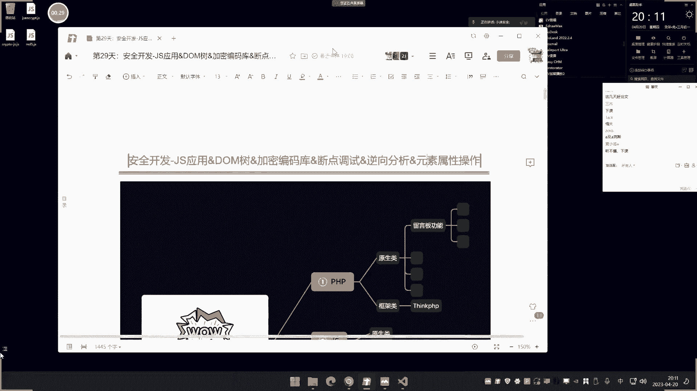

啊啊我们先来看这个今天这个东西啊，今天主要讲两个啊，第一个呢是简单的这个JS的一些，编码和加密的技术，然后呢再来说一下关于这个JS里面的一个demo，输的一个东西。

这两个东西呢是全部和我们这个实战相关的，我们并不是讲这个开发从0~10啊，从0~1去讲，就是那涉及到安全方面的一些东西，那就是重点讲，就像今天的这个德某书里面的，涉及到的安全漏洞呢，然后像这个加密编码。

也是会涉及到后期关于漏洞，测试中的一些这种调试，而且我们经常会演示简单的这个JS的，理想的一些小知识，只是简单的讲一下，当我们去讲到这个JS的读web漏洞的，JS安全的问题的时候呢，我们会是吧。

给大家演示一整次，两次直播的一个JS的调试的一些技术，那个就是重点，那今天呢就是开个威，能够让大家能了解到啊，那么主要呢就是集中在两个方面啊，第一个呢是先讲多么书，然后呢一个案例。

一个真实的案例给大家演示，然后呢再来说一下JS的这个编码，加密的这些使用，先来说一下多某书啊，这个多某书是一个什么东西啊，多某呢在JS中呢啊不叫叫DOM啊，这个网上那是叫做什么文档操作对象，简单来说呢。

它就是浏览器呀提供的一套专门用来操作网页，代码内容的功能，实现了自主和用户交互的动作反馈，这是他的一个简单的介绍，那究竟他是个啥东西呢，如果我要讲的话，那可以讲个10分钟是吧，就是光看这个解释。

但是我没有必要啊，简单来说呢他理智要理解了啊，他就是个基数的教法，他的名字呢叫文章操作对象，他是干嘛的呢，我们用这三个案例呀，三个小例子呢去给大家看一下啊，它其实呢就是操作代码中的东西。

就说在你比如说像这里啊，这里有段这个代码代码，这样写的哈，那么这是一串HTM代码，他呢就利用这个demo技术呢，来获取这个ATM代码的内容，获取哪些内容呢，比如说获取这个id等于这个值的，获取这个东西。

或者说获取这个win check这个东西的，或者获取这里面的后面的这个数据的都可以，它其实呢就是获取这个代码中的这种东西，从里面去获取这个值，你可能说他获取这个值有什么用啊，对不对，好。

我们现在呢就给大家做一个简单的一个例子的。

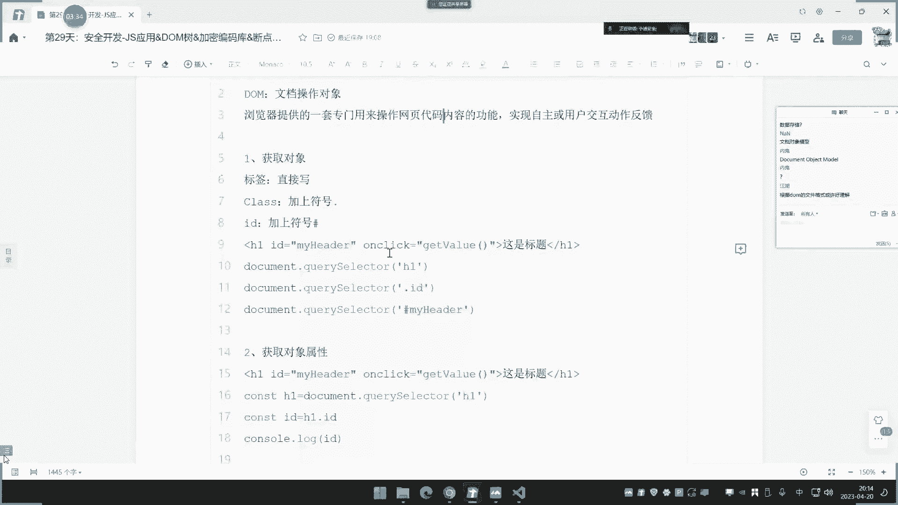

一个操作，大家就知道了啊，好，我们这里呢用这个vs code来去开发这个JS应用啊，就不用p p s store了，ppp store是开发pp的，那这个vs code呢开发起来会方便一些。

FACECODE啊，网上直接下这个比pp store也是个免费版的啊，还不用破解，方便的很，好这里呢就，把这个fs code呢给他搞出来啊，然后打开这个文件夹，在这里呢我们就创建第一个啦。

今天这个第一个案例啊，叫DOM点ATM2好，大家看一下啊，比如说像现在啊，我们在这里呢先准备两个图片啊。

我们先来看一下它的一个应用价值啊，应用夹子啊，先把它应用价值的搞清楚之后啊，我们再来讲它里面的一些知识点，然后呢，再用这个实例的去给大家看一下它的安全问题，好我们准备两个这个图片啊，发放到这里面来嗯。

好这里呢有一个IPHONE的图片和一个华为的图片，对吧，好，我们做个什么事情呢，就来设计一个图片的，图片的定时，或说图片的这个，后面的更新啊，啥意思啊，那我这里呢写个最简单的。

我们就不用搞那个前面什么标题来用了，你看啊，我先呢放这个IPHONE连接笔记上面去，给他的这个长度和宽度的都给300对吧，我这样一写啊，我把它运行起来，运行这个本地的这个谷歌或者千几，我们来用这个吧。

打开来看啊，这个是访问的一个情况是吧，你看这是它的页面啊，这里呢就是图片的一个更新啊，对不对，图片的更新啊啊这张图片啊是吧，那这是图片，对不对，你看啊，我们现在呢假如说现在呢有一个这个按钮。

给个按钮啊，给个按钮，然后呢，这里有个叫刷新，呐这里有个按钮啊，那这里有个叫刷新的一个这个操作是吧，那这个是干嘛的呢，这里现在大家都知道这个先画好，那点刷新之后呢，哎这里呢就会刷新图片，那如何实现它呢。

如果正常来讲的话，我们实现呢就是要替换这张图片，就要替换这个IPHONE点JPG，对不对，那你如果说你用P1P去实现的话，PP实现应该大概是一个什么流程，大家可以想象下，如果用PP去实现的话。

应该说你点击这个刷新之后呢，就要把这个地方的东西给它换掉，就是这个音IPHONEJPG把他换掉，对不对，是这么个情况吧，你想象下用这个操作会不会很麻烦，就是像你pp代码呢要去，首先要找到这个地方。

然后呢把这个地方呢给它替换，或者是怎么操作，对不对，他有这么个情况，那么在JS中就可以用这个DMO，输入这个基数来实现，如何实现呢，再来看一下啊，首先呢打开我们这个script的啊。

打死script的之后嗯，然后怎么办啊，这里呢他的第一种方式啊，就是用这个docker呃，用来给SM个变量啊，就用这个cost siming，或者用那个VAVRSM都可以cos。

声明一个变量名字就叫这个SRC，名字就叫SRC等于多k mt，然后点点什么，这里呢就是用那个以前的网上很多文章的，都是用这些什么叫get这种啊这种东西来去取值，我们现在呢就不用它了。

那现在用什么呢，就可以直接用这个函数QRSTOR。

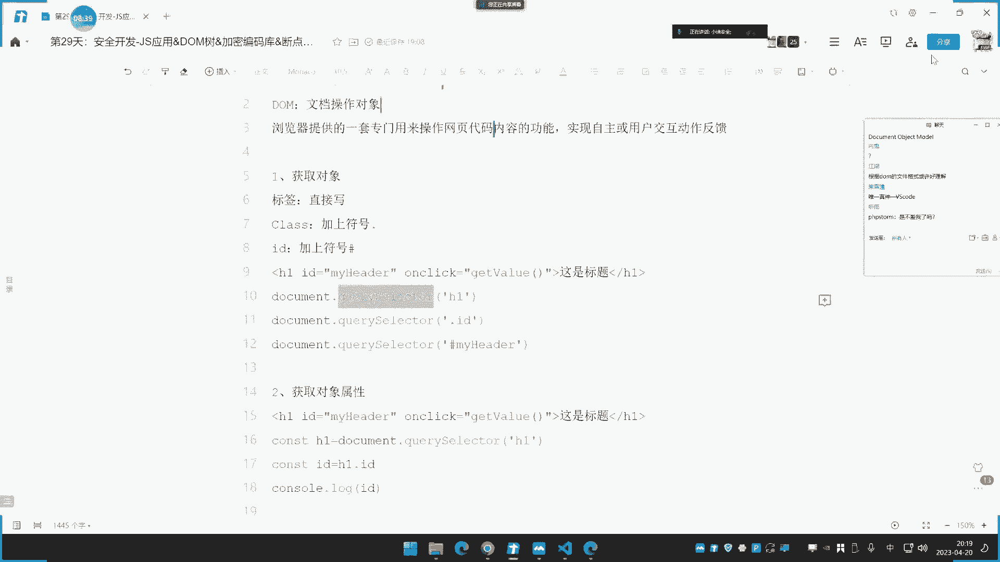

就选取这个标签，然后给大家演示一下啊，啊然后怎么操作啊，呃这里有三种判模式。

这一种呢就是获取的是标签，那这里是获取的标签，如果是获取id值的话，就要前面加上个点id，啊啊获取这个这里写错了啊，就获取这个class里面的值的话，就下点，那就是点这个，好点点就获取这个id。

获取这个class的这个情况的话啊，这里是class。

好，我们现在呢来获取一下啊，看一下啊，这里呢就来获取这个SRC怎么获取呢，Dk s r c，然后啊我们可以把它调试输出一下，CONSOL点logo调试输出这个变量啊，sac看着啊，我们来运行一下来。

还是流器啊，这个CONSOL点log呢是在浏览器调试看到的，我们要打开这个检查，这里打开检查这里。

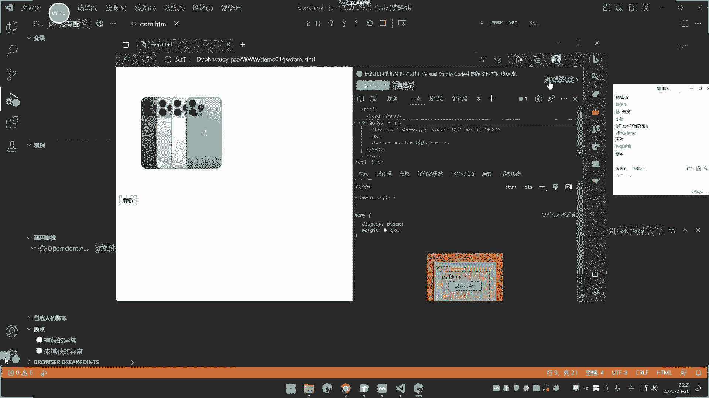

然后呢来到这个地方啊，加下面来这里有个叫控制台的这个地方啊，看一下啊，我们这里呢要触发这个时间的话。

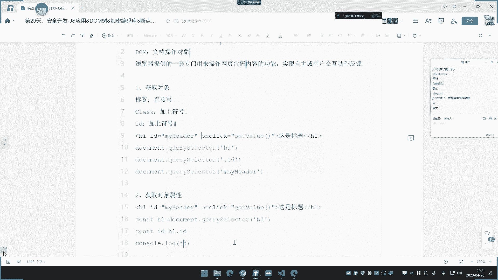

需要针对这个代码，这个地方呢创建一个函数，用个函数把包括括起来，FXY叫更新的哈，update是吧，就叫update，然后呢把它拖到里面去，创建个函数来调用它，然后呢这个地方呢如果刷新按钮被单击的话。

就会触发这个update这个函数是吧，这个写的大家明白了哈是吧，刷新被触发事件，就这个被单击事件就会触发这个函数。

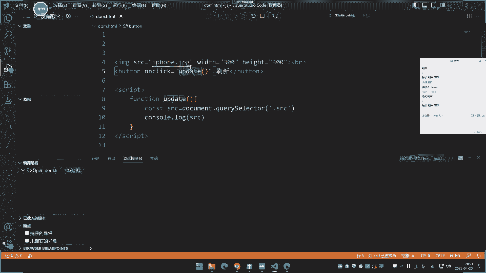

函数呢就去这个操作啊，那么现在呢我们来看一下这个地方啊。

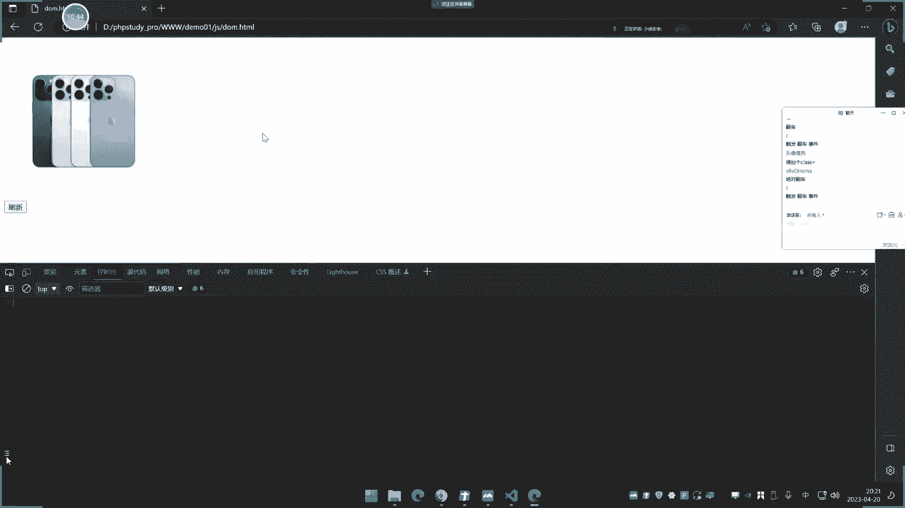

刷新一下，现在的都没有是吧，那点击刷新，你看获取个空。

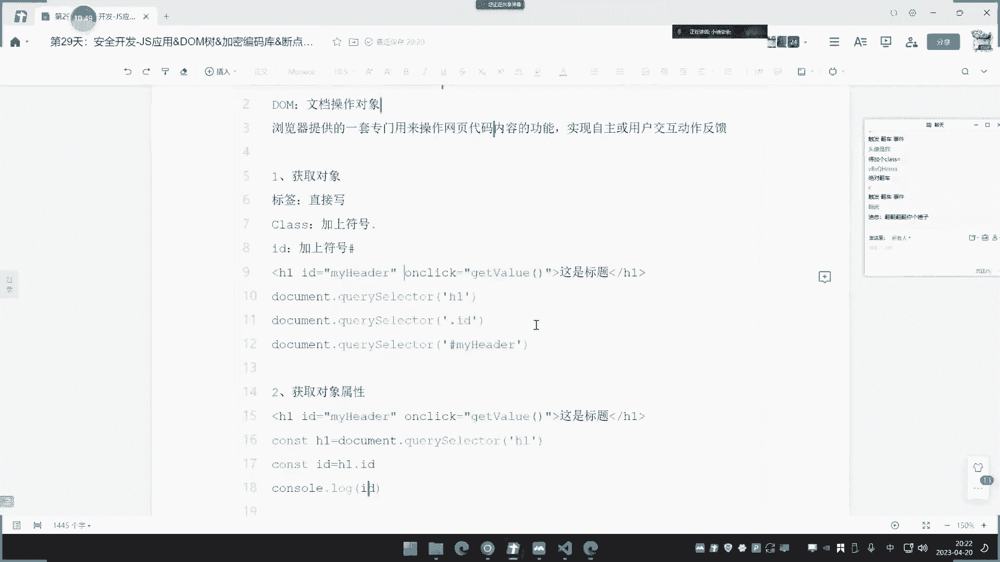

那就说这里写错了啊，我看一下是哪写错了，写这个字。

看下来再来刷新，点击刷新嗯。

还是错的，干啥设置image，直接获取image嘛，获取image啊，好获取EMAGE啊。

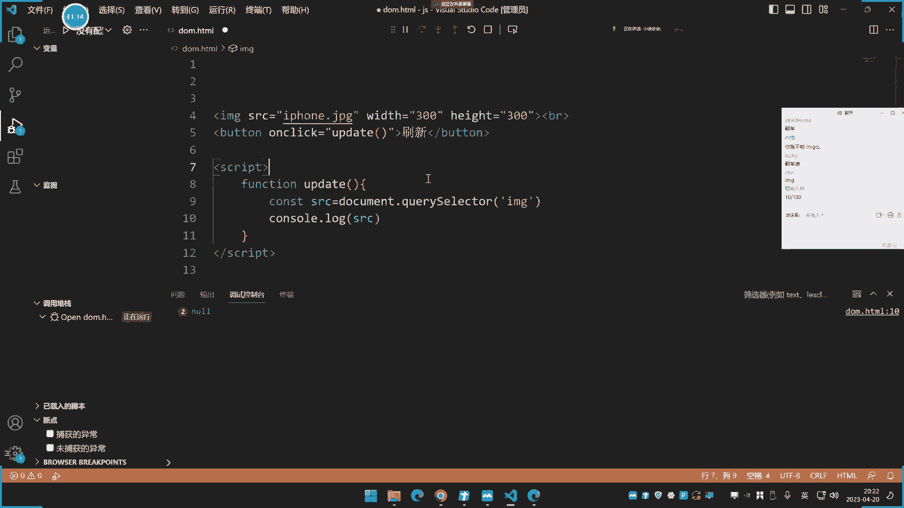

大家看一下，呐看到没，这里呢这个控制端这里呢就获取这个值，看到没了，Image src，IPHONE点JPG，那获取这个值，然后呢，你要取里面的这个SRC值该怎么取出来呢。

就可以用这个呢点SRC啥意思啊，这个SRC代表的是这个这个变量，我们把名字改一下。

改成S，那么这就是S，刚才的S呢是等于Z1长串就把它取到了，取到之后呢，我要取你们的SRC的值值是IPHONE点JPG是吧，那么呢我现在打印这个SRC8，进你这个显示这里啊，重新刷页面好。

重新刷一页面啊，看着啊，重新检查控制端这里空来点击刷新，你看他就获取一个值呢。

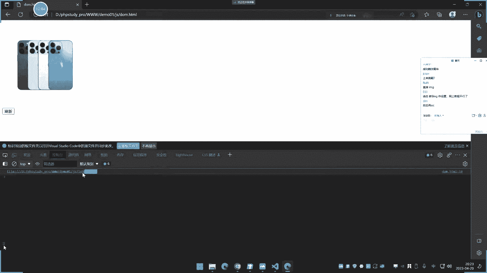

是不是这个值就是这个路径的一个值啊，你看，对不对，获取个值呢，你看然后呢如果说你要获取这个刷新按钮的话，这个操作值，你比如说像下面呢我可以写上一些字符啊，我还可以写上字符。

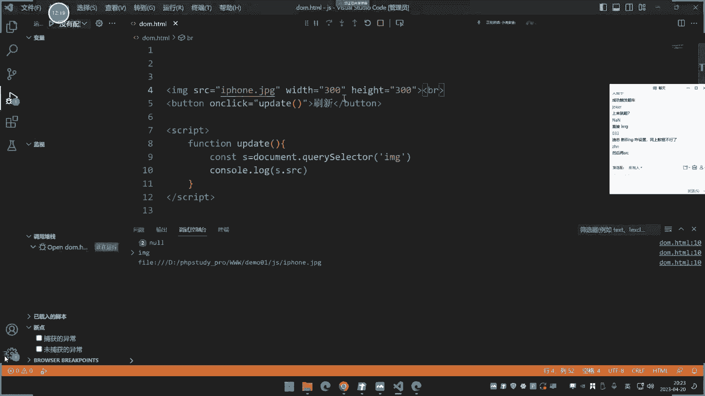

我还有一些这个东西，我把这个东西拿出来，那你说现在呢。

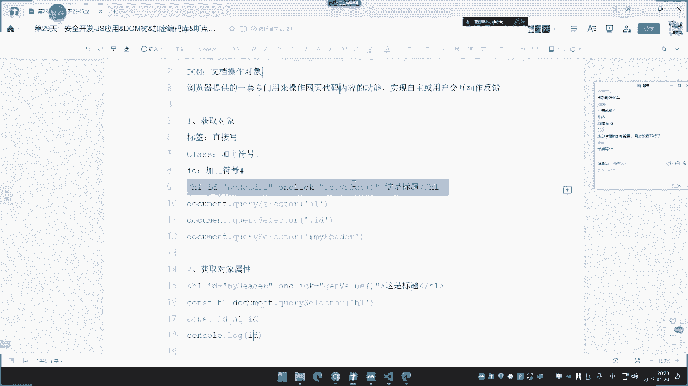

这里又是一个这个另外一个东西呐，这里有个标题，标题里面触发啊。

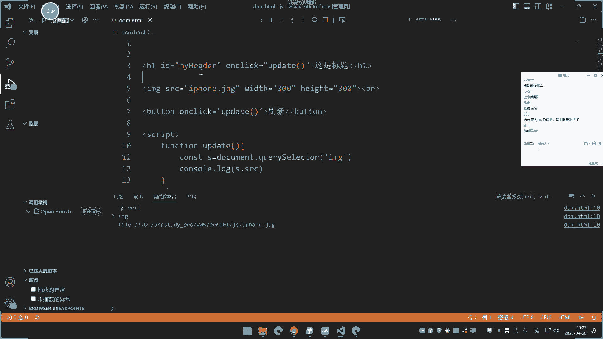

你看啊，这里又有个这个新的ATTEL代码，是上面这个叫叫是标题。

如果我要获取这个这是标题该怎么获取呢，再给大家看一下，再声明一个函数叫update1，然后在里面选取标签，就是这个什么H1的存着AH1的标签，然后这里呢是这个标题改它怎么它怎么获取呢，就是S点什么呢。

INTM这个呢就是获取它的这个值啊，然后呢你只获取标题的话，就获取这个东西的话，就可以选这个some test来我们来看一下啊。

那点一下刷新。

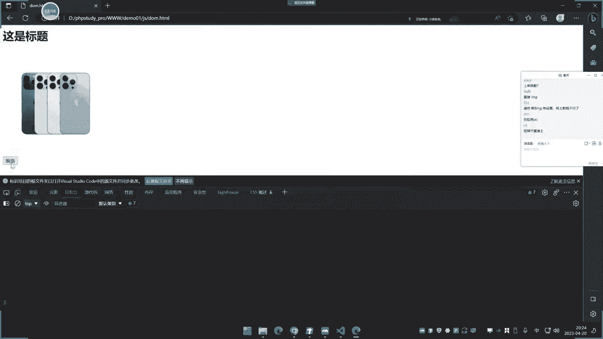

嗯哪里有写错了呀。

哎呀AH1哦，这里没有把它值给他拿出来，没有把值付出来啊，这个节代码这里都没有把他复出来。

那这个也是可以把获取到的啊，啊给八试一下再放上来。

好看一下啊。

点一下。

这是没有刷新吗，这这是获取这个。

方可形，哦我知道了啊，这个没有给他按钮，这个是没有给他按钮啊，这个是没给他按钮，我把那个代码把它拿出来吧，之前写的那个按钮啊，嗯只用这个吧。

用这个来演示一下。

好看着啊，这个，来看一下啊，嗯先打开这个页面啊。

一个一个来，这是他的一个标题是吧。

应该是刚才是点这个标题来触发啊，应该是点这个标题出发，我刚才呢没有写啊，你看啊刷新一下。

在页面呢点击这个按钮是触发这个事件，我点击这个标题，把鼠标放在上面点一下，你看这是标题。

是获取到了，这是标题嗯，获取到这个内容了，就获取这个值，然后呢你看一下啊，这是获取这个值，我可以把生成为一个变量，我声明一个变量啊，看着啊，声明一个变量，变量就叫，STR等于这个值，等于这个值之后。

我们把它进行这个调试输出的时候，大家关注一下啊，看一下有什么不一样的地方，STR对吧。

那刷新那点这个地方获取的。

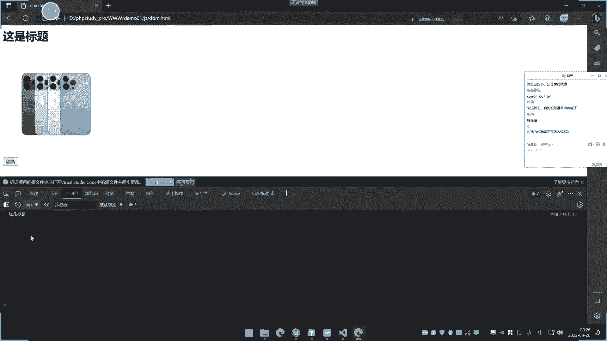

这是标题，然后你看啊，我在这里呢给他重新复制一个东西啊，它不是等于这个值吗，我在这里呢给它加上一个东西，就如果说这里啊，我给它这个值呢写成一个什么呢，看着啊，把它值赋值这个吧，我改变一下这个地方的值啊。

那么这个值呢在刚才这里测试的时候呢，他是等于这是标题对吧，这是它值，然后我这里呢可以把强制性的让他，这是获取他的那个内容是吧，强制性状它等于一个新的值，比如说换成这是小迪对吧，这样写。

然后把调试，你看啊，这个地方是不会变动啊，大家看一下啊，现在是这是标题，对不对，第二了，我点了一下，变成这是小迪了，看到没，那重新再来看一下。

那我点一下这个地方呢自动变成了这是小迪了，为什么这里呢获取到这个S1对象之后呢，用这个东西呢把它设置为这小迪，他以前呢是获取到是这次标题，然后强制性装等于这是小题，再把它输出出来，对不对。

如果这个小题呢你用这个函数的话啊。

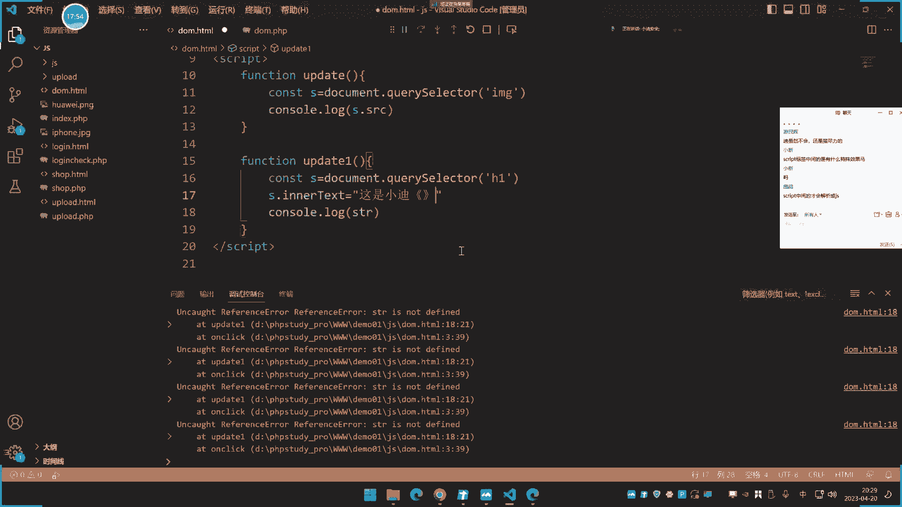

你这样放这个BR的话，那你看下它刷新的一个情况，那就把BR显示出来。

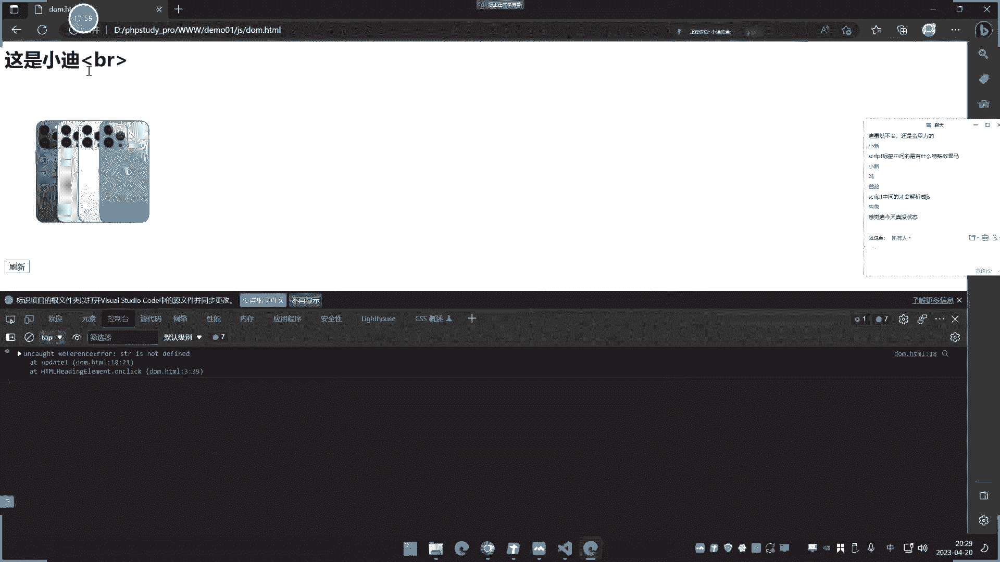

这是这个test，然后我们现在来看一下这个ATML啊，再看ATMLL换成ATML了，换成ATM的，你看一下啊，换成ATM的，我们再把这个灯方注释一下。

看这个地方的差异呐，这个地方就变成了BR了，那我给他明显一点，我换成HRHR就是那个斜杠，没看到没，是出现AHR啥意思啊。

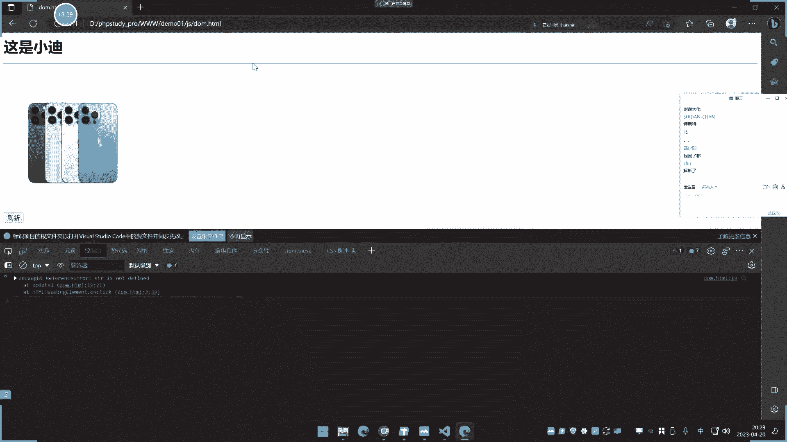

其实就是说这两个函数的意思，就是操作元素的数据，上面这个呢是能够解去后续代码，而这个特斯呢是不减去后续代码能理解吧，这个呢就是一个能解一个不能解的问原因啊。

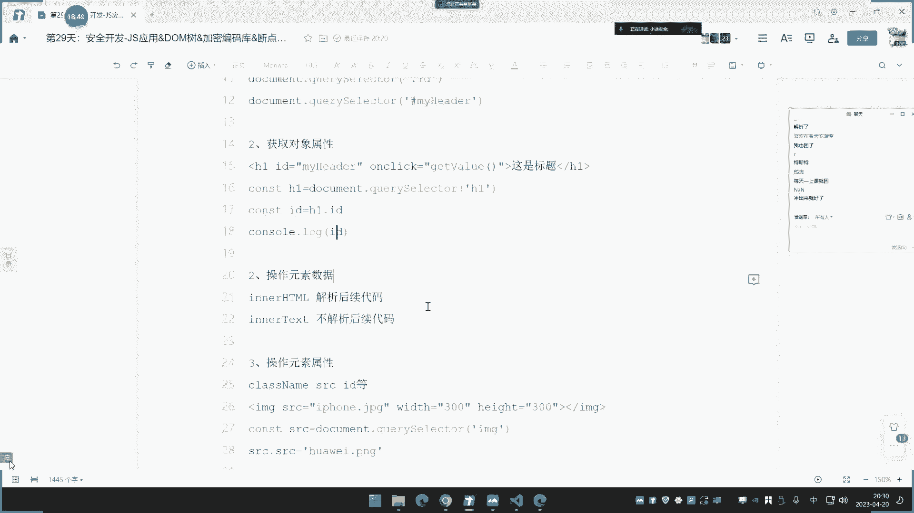

非常简单，那么刚才这个换图像的话该怎么换它呢，也是一样的道理，那么这个就好写了啊，你换图像就很简单了，比如说我要点击一下，换一下这个图像，点击这个刷新之后呢，换图像怎么写呢，他以前等于JPG。

我就怎么写啊，我就先把这个代码给它注释掉啊，不注释掉了，他启用的是update这个数据，我怎么操作哈，你看啊，我先取这个image呃，获取这个SRC对SRC呢就等于什么呢，是等于华为点PNG啊。

我先取到这个image的这个地方，然后呢在取到值了之后呢，是换回这个值吗，SDSRC就取这个值，然后它的值呢他以前是等于IPHONE，我让他强制复制为华为。

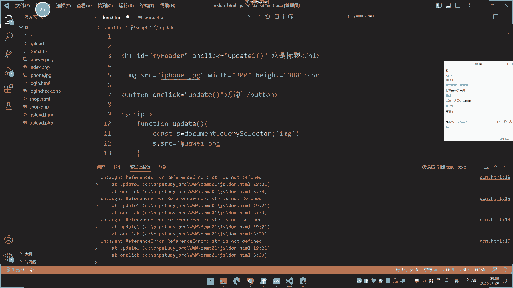

点击B对不对好，我们来试一下看一下啊。

看是不是能够换图片了啊，来先刷新，点一下刷新呐，看到没图片就自动变了，所以说你用这个JS呢这个DOO型的操作呀，他就能很快捷的去做这种。

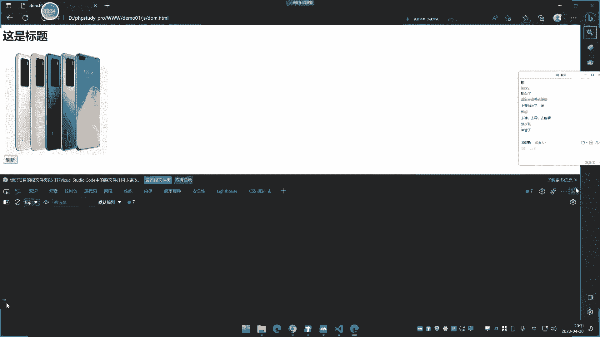

和这个代码呢和他直接挂钩上，他就和他直接可以挂钩上，对不对，包括你取里面的值，修改里面的值都可以是吧，取里面的值，修改里面的值都可以，你取它的值也是一样的道理，那我们可以刚才也取过他值了哈，Conso。

然后呢你可以用这个DR来获取这个S点2RC，那我先把这个注释掉，先不修改，那我来获取这个DR，把它获取出来。

我们看下这里啊，点击刷新好，我们看一下这个控制端，这里点击刷新。

是吧，他就能取这个值吗，那这个呢就是我们说的这个东西啊。

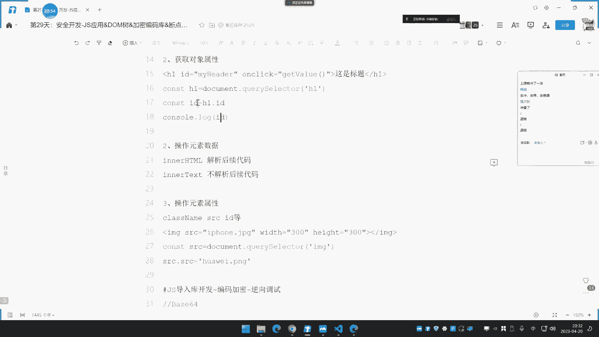

然后呢你可以把它复制成这个变量呢，再获取一次，你看啊获取变量之后呢，他这个值那就更不一样了，我们可以看一下啊，获取SRC啊，SS等于S减SRC就重新复制一个变量，然后呢去打印这个东西也行。

好这个操作呢我们就不再继续了啊，就不再继续了，这个是换那个图片的操作，然后下面那个呢是也是换成图片，并且在这个调试端上去显示的一个操作，那么这个demo输呢其实就非常简单啊。

我们这个例子呢就是给大家演示是什么意思呢。

清除到了这个demo数的一个大概的情况啊，他的情况呢，就是用来操作这个网页代码里面的内容，然后呢事先呢这个自主和用户交互的操作，就比如说你在网页上面再去刷新网页，刷新页面，按的话，那个图片呢它是轮播的。

去这个去操作，就不需要你用一些后端代码来实现，那么它会造成哪些安全问题。

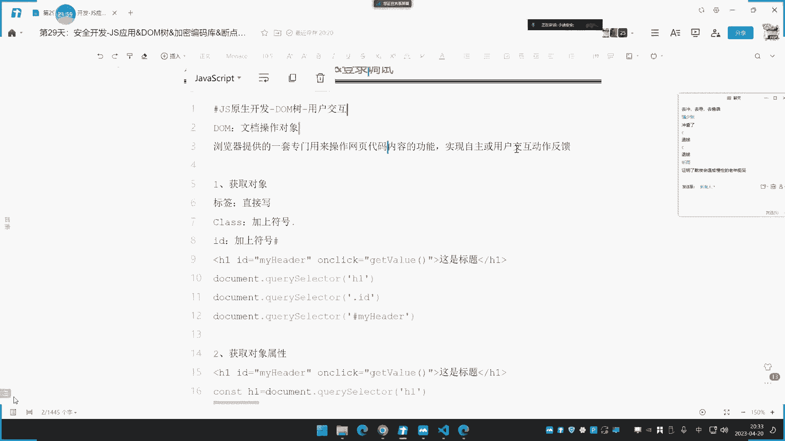

现在那就是核心点来了啊，刚才是搞清楚了，你想象一下啊，它既然是能够对这个代码这里进行操作，我们思想一下，你比如说像这个地方呢，他把这个SRC等于华为点PNG，那么我们现在是试问一句啊，如果这里啊。

如果这里哈这个华为点PNG唯一个什么，变量由什么，由用户权的决定，那么，就会造成什么呢，XSS就是我们俗称的DMOXSS工具，你看啊，因为这里呢如果这个华为点PNG作为一个变量，有用户传递的话。

那么这里呢就会造成多么差失，为什么呀。

因为代码中就被改了，你来我们来先来看一下刚才的代码啊，我点刷新之后，它变成了华为对吧，好我们可以看一下啊，原始的我们看下代码，这里我们点击这个代码，这里点击检查看看代码啊。

你看他现在是image src等于IPHONE点JPG是吧，现在是这个东西好，当我们去刷新之后，我们看一下这里啊，是变成了华为点评机了呀，它自动把这个代码这个值给它改变了。

那么如果说这个地方是由我们用户来决定的话。

就说这里三只是我代码写实了，如果说这里呢它编成一个接收数据，这个数据发送的是什么，那么它这里就编什么，那你想象一下。

我是不是就相当于去操作了这个image这个语句了，那我是不是可以在这里去写一些代码，能够实现这个夸张呀，那比如说我可以实现什么呢。

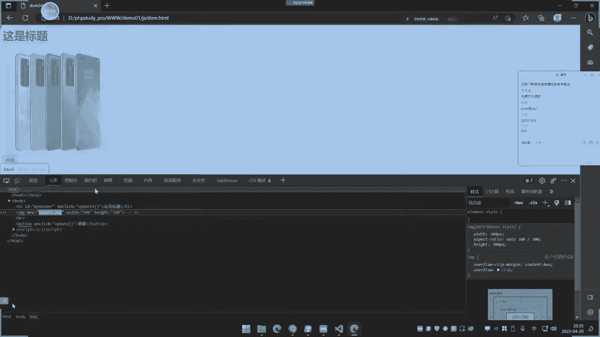

对不对，假如说我这里呢我给他传递这个东西，我给他传递什么，传递这个东西是不是呢，传递这个，看你像这种东西是吧，给他一个错误的，然后呢一个错误的一个启发语句，然后来执行这个什么JAVASCRIPT啊。

这个东西呢你可以网上查一下啊，就这个意思啊，我就说大家要明白就可以了。

对不对，那么这个由于我没有讲XSSR。

所以大家就知道这个情况，其实呢就是相当于呢这个语句呢，这个这个这个这个ATM代码，那就由我们来去操作了，我们就可以在这里呢写入一些这种。

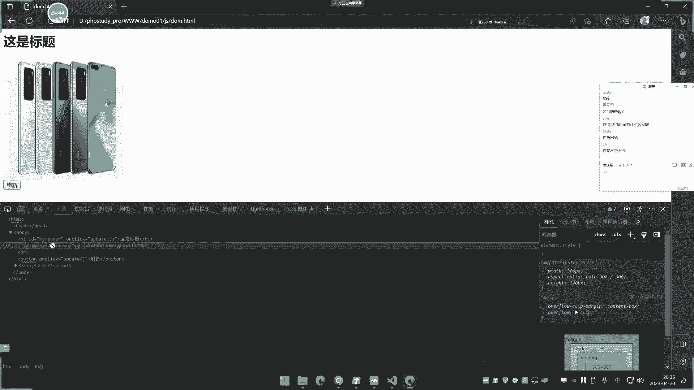

JS的执行语句，我们就可以查一下呢，比如说我们像那个夸张一样的啊，XSS的这个payload啊，网上呢有些种类，你看到有这个image标签的一些这种啊，我们现在没有讲到啊，这个XSS只是说在JS里面呢。

它的安全问题呢无非就是那几个，它不像这个其他后端语言，他的安全问题呢比较少，就像什么夸张呀，未授权啊，这些东西有点多，其他的就不会很多，因为别人都用这个JS呢，不会做一些这种其他操作啊，你看着来。

嗯这里呢有了这个呢SRC，那可以用这东西来执行XS语句，对不对，你看他可以用这个东西来执行啊，嗯直接写成这个东西呢，然后调用执行弹窗。

那我们可以试一下啊，这是一个JAVASCRIPT的一个代码，然后弹出一个XSS，里面有双引号，外面有双引号，看起是吧，你看我把它复制了，这就换成这个东西啊，我们来看一下啊，打开。

点一下，那这个雨是不是插进去了，你可能说哎咋回事，咋咋咋没弹窗啊，啊咋没弹窗啊，啊咋回事，咋没弹窗啊，啊有没有知道的。

大家应该看到了啊，呃这个地方呢你看啊，我写了这个和这个，那他这两个有不同的支出来有什么不同啊，然后不能弹窗的原因呢，它是有多种多样的，有些呢是浏览器的策略导致的，就是你会发现你如果说你欢岛火狐它可以。

但是你换到谷歌或者什么IE它不弹窗，就是有些他的这个浏览器安全策略，他是有些是组织了一些这种JS的人形，这是第一种啊，还有原因就是你看啊这个呢它是没有冒号的，那这个是有冒号的，而且冒号呢他有个差异。

后面写了个分号。

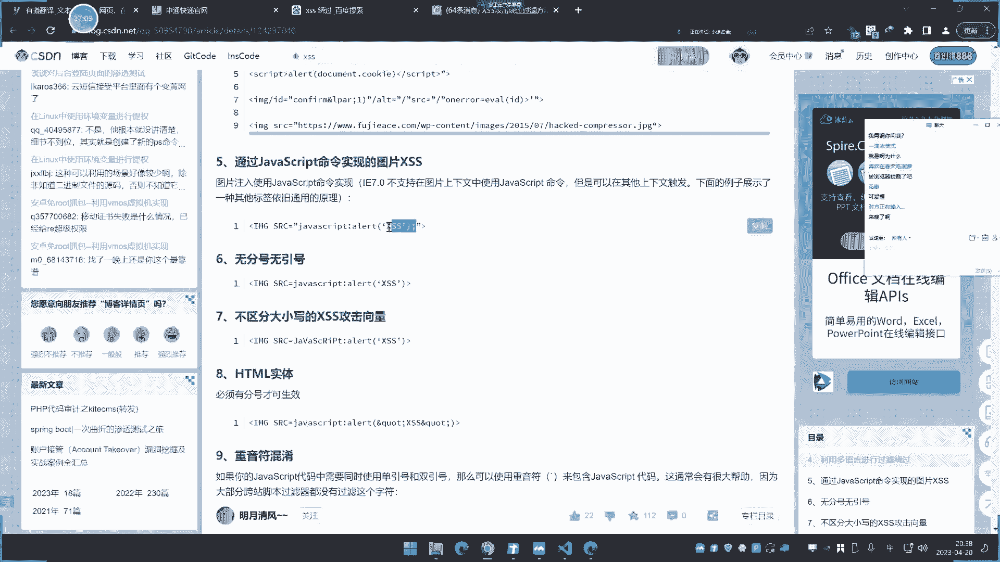

代表他是个语句，包括这个下面的这个地方啊，你不信的话，我可以把这个地方呢改成这个东西啊，我直接把这个地方改成这个东西。

先把删掉。

啊他还是不弹窗，哎这个语句是我想多了啊。

我还是这样去写一写啊，你看啊，我把这个地方呢写成一个错误的，用这个错误事件来弹窗它。

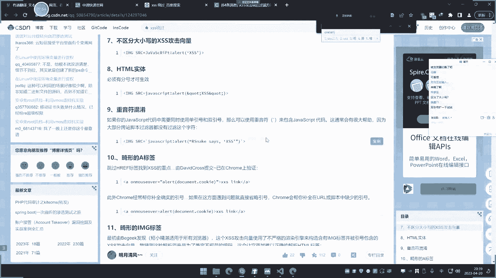

他这个是绕过语法，绕过语法呢它不太一样。

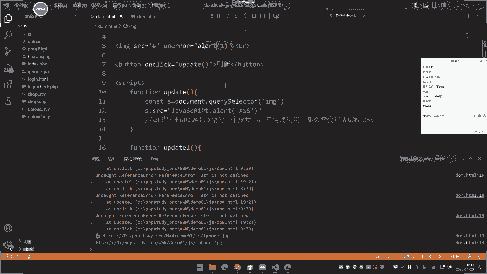

让弹到吧啊。

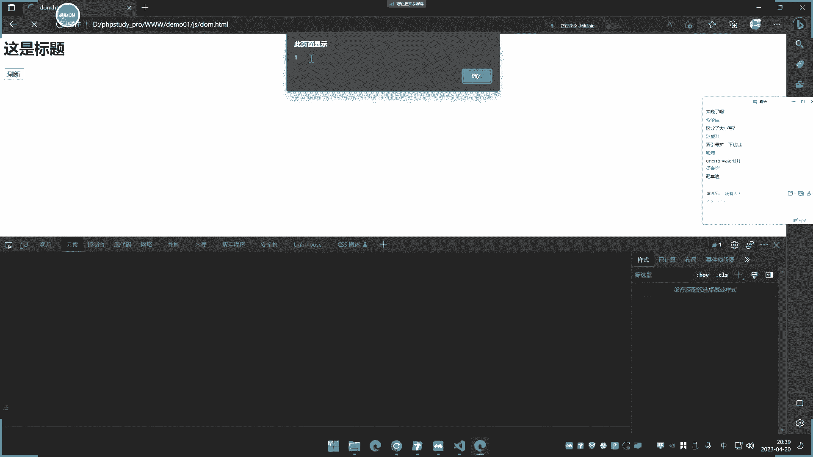

这是一种简单的一个操作，这原始是源于你把改成这样子写呢也可以啊，然后如果说你只能孤立那个值的话，就是不能去操作上面这个值的话。

那你就只能用这里提到过的这几个语句，就刚才那个image下面触发弹窗的那几个语句，Image，就是阿SRC后面那个弹窗语啊，这里这里呢写了一部分，这个呢就是要看这个浏览器支不支持了啊。

你看比如说像这个啊这个啊这个啊，而且这里面呢很多符号呢你都要注意，这个符号都写错了。

我给撕一下，比如说我把这里的强制改成这个字，看这个行不行，嗯搞个一吧看一下啊。

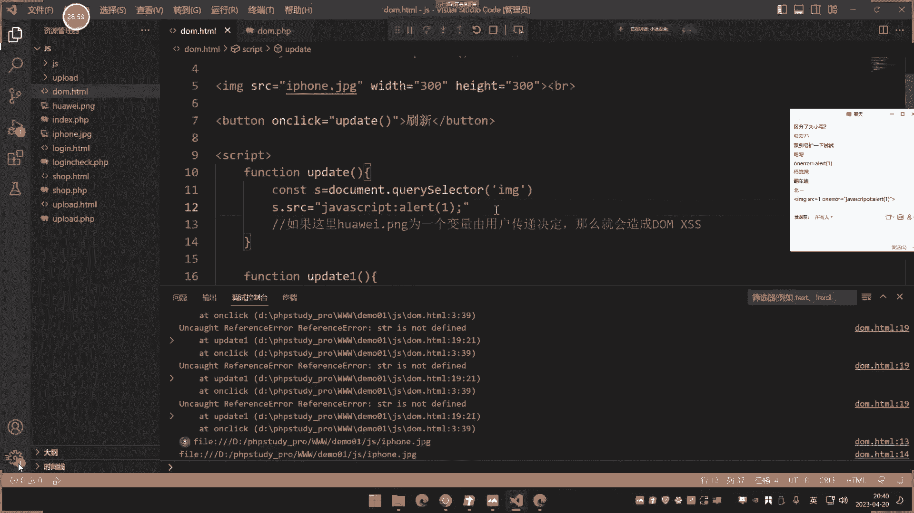

啊他还是没有成功，虽然这里已经改了啊，但是他没有执行出JAVASCRIPT的这个原因呢，具体的话一种是不支持的，还有一种呢就是浏览器自身的问题导致的，这是我刚才撕的这个，这我刚才撕的这个。

我刚才不撕了这个吗，发还发啥呀，刚才撕都撕了，这个不行。

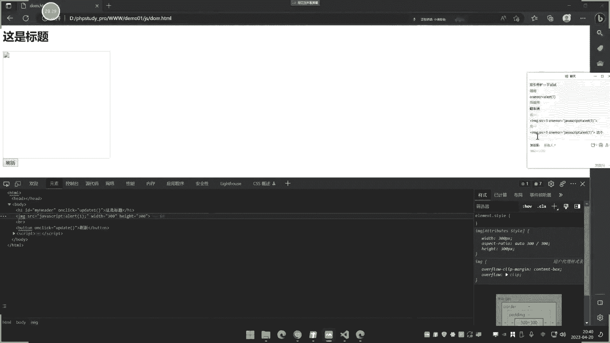

这个不行啊，因为他这个改的是SRC的，这个值它是改的这个里面的，你这个后面加这个东西，乱七八糟的啥东西，你你你这样想你，你说你啊，我搞这东西行不行啊，就你刚说的啊，前面写个一啊。

哎然后后面写写写写这个什么鬼东西是吧，你试一下嘛，你改你改了之后，他他写到标签里面去了。

唉说这里呢讲了吗，讲半天了，这讲了讲的是啥玩意，你看他写在冒号里面去了。

所以没用啊没用，他要操作SRC的值，不是你想的那个情况啊，它是操作SRC的值，你这里写上去，你会run为，认为这个o small呢是当做下面一个值是吧，就像我们在这里写一样。

但是它不是它全部写到冒号里去了，因为他操作是SRC的值，你看S点SRC嘛。

所以你只能装这个RC里面，那就是刚才这几个嘛，那在这里触发的，但这几个呢不行啊不行，那就没辙了呗，对不对，他有些是浏览器的安全策略，还有现在是这个高版本的不支持。

好那么其他的一些测试至于能不能把他绕过呢，这不是我们现在担心的问题，我们后面再讲到XSS钻研的时候呢，再举个给大家讲啊，那这个小案例本地案例呢就讲到这里，大家要明白他的一个道理。

那么现在大家思考一个问题啊，这个安全问题我已经给他抛出来了，其实那就是在这种网站页面中，它有些功能要用这个demo去操作的时候，就是相当于说本身这个ATM代码啊，一句话非常好理解啊。

就是这个安全问题把它写上去，就是这个本身的网页代码呢，网页的这个前端代码呀，通过这个demo技术，实现这个代码的这个更新和修改是吧，是这么一个基数，然后呢当然是这个更新修改。

如果修这个修改的这个数据可以由这个什么，用户来指定的话，就会造成什么，DOMO型XSS攻击，这是刚才我们讲的那个原理啊，就是呢你的本意呢是让他修改来达到一些功能，但这个呢如果你在修改这个值的时候啊。

这个值呢没有显示，是由用户的一些传递数据来指定的话，我们就可以run它那里面去传递一些类似的这种，XSI语句来执行，从而呢执行了这个JAVASCRIPT的语句来实现一些JS攻击。

那么大家知道这个安全问题之后啊，大家现在呢可以思考一个问题，如果在真实情况下面的话，这种漏洞会在哪些地方产生，那我给大家看一个案例啊，我们先分析这个案例会不会产生，大家看着啊，有道翻译来有道翻译。

这该不是这个假的吧对吧，有的翻译，这什么老演员了，这不是演员啊，你看一下啊，我们来对比想一想啊，他这个地方是一个和我们这个DOM有什么操作呢，大家可以先想想呢，比如说我这写个英文单词是吧。

这个GUI me，哎对不对，他帮我翻译中文呢，显示出显示本用户信息好，大家可以想象一下啊，他这个地方有没有用到多么奇数啊，大家可以思考一下，多么级数是点了之后呢，他就会更改这个值，很简单，这绝壁用到了。

为什么说绝壁用到呢，你想象下啊，我这个地方我修改它，你说的my name，一只小D，对不对，想去哈，我写上去了，他这个名字再改，我把这里一中哎，诶我滴妈真是肖老师呀，肖老师永远滴神呐。

上面都给我翻译成肖了呀，对不对，你看我改了这边呢就会改，或者反过来也是一样道理，你把正面改了之后呢，他也要改，对不对，所以说呀它就是一个相互的一个过程，即使我在这里，我发现我没有去点那个翻译。

我就在这里输是吧，这个什么computer呀是吧，这种英文单词电脑的单词对不对，他自动翻译的，我点都没有点，他自动翻译的原因是什么，因为你可以看一下啊，我先给大家看一下啊，你看啊，我先这里不输入时候。

我点击审查元素。

这里我生产元素，这里啊，你看孔子还自动有个什么叫解密结构数据，这是官方自带的啊，然后你看一下这个地方，你看这里啊，啧这个下面这里呢就是哎呀，这个浏览器太小了，他这是放这来呀，把这个先关掉。

你看就这个地方的值呢，看啊，我这里是空白的，就啥都没有数据，看这里面的是啥都没有，你啥都没有，直都没有，包括这里呢你的生态元素呢，他这个地方也是呢没有后面也没有字，后面没有写任何数据，全部是为空的嘞。

因为你没有输任何东西，只要你一输诶出来了，你看这个地方呢就自动出现个关闭了，这不就是的吗，就是检测到你有这个输入时间了之后呢，就让这里显示这个忽米对吧，然后呢这个地方呢就翻译就这个过程呢。

这是符合一个do某操作呀，我do某操作的那个原因，其实就是像刚才一样，就是有些事件触发之后呢，这个页面会随之更改或变动，就像我刚才演示的什么更换图片呐，更换那个里面的值是吧，什么刚才那个操作的时候是吧。

那这标题点一下就变成这是小D对不对，就你有这个时间之后，他就会更改这个值，然后更改值呢就以用户输入为准，那这个是我用户输入的嘛，我输入的或密码，对不对好，那你说有什么安全问题呢，大家试想想啊。

翻译归翻译，既然你接收我输的数据，那也就是说它会显示到这个页面中嘛，我让他在换名字显示是吧，看着啊。

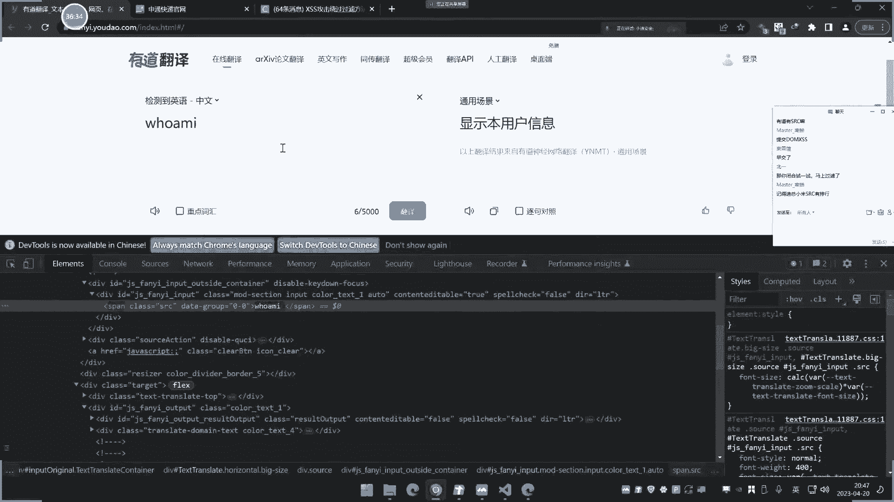

我搞一个那个DNS logo来配合一下，看看能不能带Y出来啊，得到一个域名，大家不要访问啊，免得说我作假，那现在没有值啊。

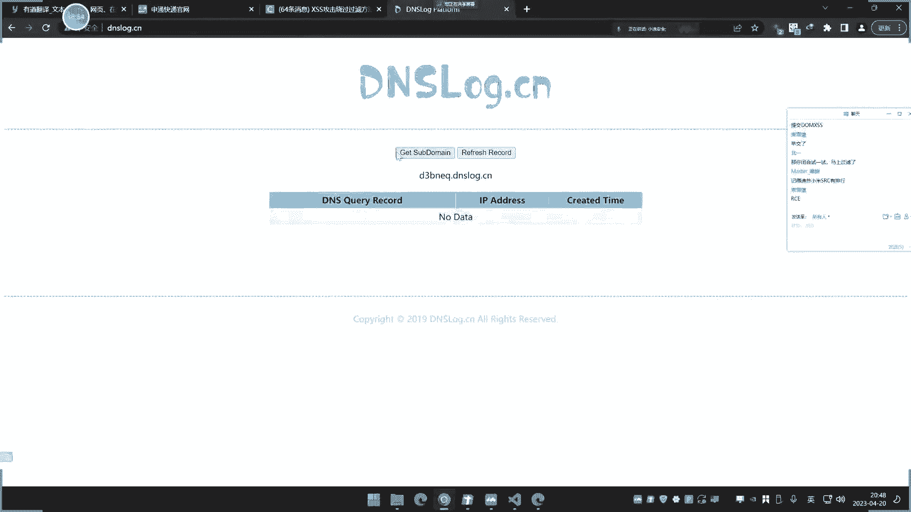

来看着啊，搞个来，image src等于一个路径，HTTP是吧，然后呢，随便后面写个什么鬼东西啊，写不写都无所谓，无所谓的啊，写不写这个图片地址都行啊对吧，就写这个东西啊。

你看他翻译的结果变成什么点这个东西了，诶有图案诶，诶图片呢啥情况，这只能是一个抽个图呀。

再看这边哎哎呀我滴妈不好意思啊，点刷新去了，应该点这个了。

充多了充多了啊，充多了呀，好来看啊，它翻译成这个了，你看我把它按了一下，我把它按了一下了，这个图片变成这样子，因为他有加互的嘛，我把它干了一下。

现在是这个东西嘛，看这里啊，还没呢，这肯定是谁访问了，你妹的咋整的多呀，真是谁也没事做，要访问的啊，拦都拦不住，别搞啊，重新搞搞，重新搞搞。

啧唉这又让我重写。

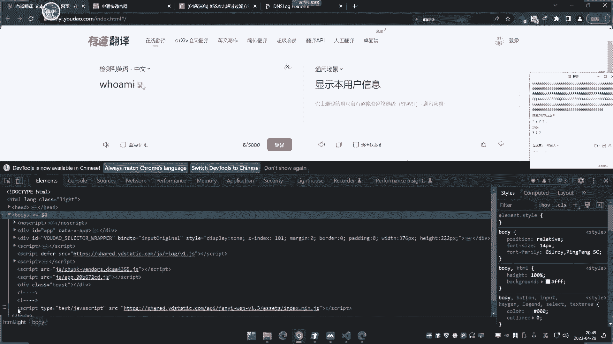

怀疑现在又被访问了，没访问。

大家看了这个结果就应该知道了啊，然后如何分析它呢，来我给大家看一下，分析一下，这个我就不测了啊。

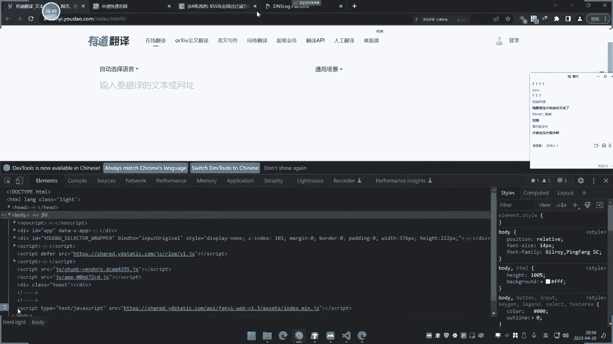

肯定是有人脑访问，那你又访问，你看哎呀，你这这不这不访问我都不好说的啊。

你看下我给大家分析一下，看是不是这个逗模型操作啊，就说如果检测的话，我不从这个功能上面去分析，你看啊，我修改这个网络之后呢，你看他尝试过访问，你看那他还有访问过，看到没，点了之后呢。

他这个数据包有没有触发，看到没是吧，然后呢你看啊我们在这里呢资源这里啊，你可以呢用这个浏览器中文的好看一些，我们用这个中文的给他看。

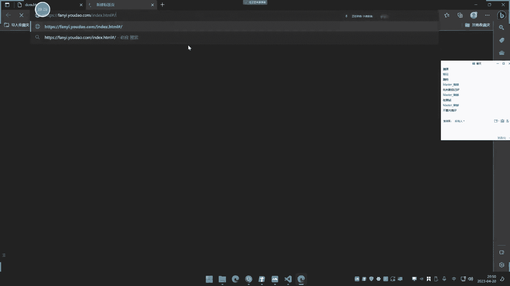

好我们用中文给他看啊，我们随便输个什么东西啊，然后呢我给他看一下啊，这个这个网络和源代码是吧，然后点击这个翻译，随便选择一下是吧，好那现在呢你看啊，它加载一些文件和这个网络信息啊。

呃这个时候呢你再看这个地方啊，我们搜索一下关键字。

那这是做这个，做这个刚才这个操作的这种什么额。

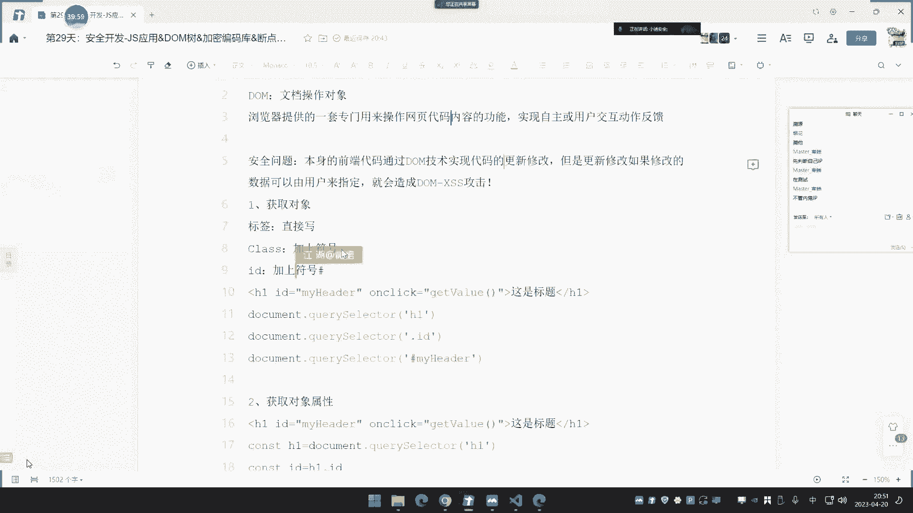

多么的一个操作的一个关键词是吧，搜来看啊，那这是他收到的值，我们可以看一下啊，关注一下呢，这个是一个JS文件，这个呢有一个JS文件，还有个这个JS文件，从字面上看的话，应该会选择最后一个JS文件。

为什么最后一个JS的文件名呢，它叫做放大一点啊，给大家看的更清楚一点呐，他的名字呢叫做test，还放大一点吗，那，它的名字叫做test trade tic，就是文本翻译JS上面这个是什么chain啊。

Vidir，然后这个呢是一个叫document upload文件上传啊，类似文件上传，因为它这个本身的功能里面是一个，文件上传功能的啊，那他有个文档上传功能，所以呢他应该是那个，所以这个呢就选择中。

我们来看一下这里面的代码啊，来代码里面看啊，顺序那一个这个值，你看就是我们刚才那个写的一样的道理嘛，来类似那个纸一样的吧，我可以看一下啊，然后你看一下在这个地方的时候，你看一下啊。

这个地方他的一个表单字可以看一下，就我们刚才数这里嘛，他的表单字是什么呀，表单是这个呢叫JS翻译，input d i非标签的，我们可以搜一下在这里能不能搜到这个东西来。

Ctrl shift加F搜索回车好，再来找一下下面的依旧只找这个，因为这个各位关键其他两个名字都不太相似，找这个好，点击上面看一下代码好，这是它出现的地方，我在文本中去找有19个。

那你看这里呢i id等于它，那reef等于它，然后这个什么class opening什么东西，其实呢这个代码你都不用去看，大概情况就是个什么东西呢，就是在改他的数据。

就要尝试才改他数据其实就是我们刚才说的，当你有用户输入事件之后呢，他就尝试性对这地方呢进行改值，那这个IIF你看刚才那个源代码这里啊是吧，来这是他的上一个标签的值。

upload的下一个呢是这个的js input，还class等于这个值，还有后面的这个其他东西，对不对，就是霍尔米的这个存放的标签这里嘛，对不对，它其实那个JS里面的作用呢啊。

就是检测到你有这些操作事件之后呢，就把里面值改了，所以我为什么输入忽完密之后呢，对吧，这个地方就显示换me，然后你在数字后的翻译，翻译那些功能呢我们就不介绍了啊，那是他自己实现的功能。

但是这个为什么会造成刚才那种问题呢，其实就很简单，他把这个数据呢写到了这个什么呐，这是我输出这些数据，他写到这个地方，所以这个时候呢你就可以让它执行JS语句。

你可以把那个刚才写什么image标签呢给他写上去，对不对，然后你直接写还不行，你直接写它不会过滤，你不信你来看一下啊，我看看啊，imagine src等于这个讲他有提示啊，你D随便输入一个地址，1+7。

01好吧，然后呢你看啊写这个地址，然后你大概关注一下啊，我写这个地址之后，那我点击翻译，他说我追不起，我在学习的过程中什么情况，那他翻译了，Image src，举一个例子，好大看着啊，写上去了。

然后你看这个地方啊，检查元素，这里他写在哪里啊，你看，找这个地方呐，这是它的值啊，你看写到这来了，但是这个值你可以看一下啊，它被自动过滤了呐，看到没，前面的尖括号不变成这个东西，这叫实体化的一个技术。

就是将尖括号过成实体化，这是造成不了这个攻击的，就相当于这个呢被实体化了，这个尖括号就编了，对不对，所以这里呢你放上去之后，它不能实现这个操作，但是呀当你把这个鼠标移动到这边的时候，大家看着啊。

我移动到这边的时候，来把这个选中之后，你看这边就立马变成了一个图标，就说明他执行了，为什么呀，为什么我把鼠标放上去之后，哎，一放上去就变了呀，为什么放上去它就变了呀，你看放上去它就变了。

那那这里就写成了image执行了，为什么就是时间呀。

就是我们类似于我们刚才写这种东西的，这种时间关系呀是吧，我这个是单机事件，他那个就是检测鼠标焦点时间。

那么他就把那个东西呢给它翻译，因为它的原本设计是怎么设计的呢，原本设计是这么设计的，就像你户外me啊，你翻译了显示本用户数据是吧，你把鼠标显示到这里来的时候，它也会对应这个值就相当很简单。

假如我有多个英文单词是吧，我英文单词很多，哎它就变成了这个是英语的，我学英语它就对应这边英语，对不对，然后显示这个它对应这个户外米，是这么一个情况，对不对，所以他是为了你的方便。

但是事实上我刚才把这个地方写到这来之后呢，这边来讲，按照正来讲，他以为是要翻译这个东西是吧，他以为是要翻译这个东西，诶，他一翻译呢就变成后面这串串，对不对，我不我不能把鼠标再放上去了。

放上去了就就就有里面的又变了，你看它翻译就是翻译成这个东西，因为他不知道后面这个是啥，这也不是英文单词，但是呀你这个它的功能实现，这里呢他有个相反的作用，当你把这个东西一放上去的时候，他就尝试翻译它。

然后结果他就把执行了，对不对，是这个意思吧，其实说他考虑到了一个真相的翻译，真相翻译翻译这个词的时候呢，他没有翻译成功，但是反向的时候他会尝试翻译它，所以这个反向这个过程中就这边到这边，一个是左到右。

左到右呢它有个过滤，但右到左呢它没有过滤，所以这个里面东西呢就被执行了，所以里面的图片被调用了，刚才我画了个dj s log地址，那其实就是他尝试过访问那个地址，所以呢就获取到IP地址，是这个意思啊。

对不对，这就是个典型的差SSS与XSS攻击也可以，也可以把它归类到类似的SSR浮动机上面，两个都可以啊啊，但是跟规矩的讲的话，他是一个XSS，因为他是在操作这个网页的代码。

这就是一个典型的多模型的XSS，就是通过修改用户的啊，通过这个用户的输入之后呢，去改变这个本身网页的值，然后呢通过一些事件，比如说单击按钮，鼠标移动过鼠标获取焦点等等等等。

然后呢去改变这个数据来实现这个翻译功能，当你把鼠标放上去，他就把这个语句的给他执行了，这不就是用到了刚才我们讲过的这种东西吗。

来对不对，就像是我鼠标一放上去，就和我这样呢，我这里呢是点击确定的时候，他就把这个值呢改成这个东西，对不对，只是说我这里写死了，而他这里呢是以你输的用户为准。

他以你输的用户为准，所以呢当你是输输入这个值的时候，那么他就会尝试把这个数据呢是吧，写到这来不就形成了一个操作吗。

就好比呢刚才我那个操作代码中就这样子的嘛，那我就把常识改成这样子，单引号啊，避免这个双引号的一个影响，你看就和这个意思一样的，我们来可以访问一下刚才这个页面，那他以前呢是获取这个知识标题嘛。

哈然后呢他获取之后呢。

就会把这个只能改成这个东西，那你看着啊。

那这会是访问这个除法是和这一样啊，无非就是说我这里呢是我写死了，他那里呢是写了一个接收你那个参数的字，没有什么不太一样的东西，所以他就相似执行这个语句，你看我这里也相当执行了，我的代码中呢。

是不是呢尝试过放我127001啊，对不对，那么你想一下，如果这个语句是一个JS的语句呢，我换成一个什么这种夸张语句，就用JS呢来获取一下浏览器的信息，比如说document是吧，点cookie是吧。

先取这种啊，获取这个，浏览器信息是吧，document点cookie获取一下这个信息或者弹窗等等啊，对不对，他不能这样写这个语句啊，不能这样写啊，不能这样写啊，那写那个其他的一些东西。

就写那个QUON语句一样，写到跨语句，就类似于我们这种意思了嘛，对不对，那个东西呢我们就不多说了嘛，好当你这个刷新的时候点确定，那就弹窗了嘛，对不对，他强行修改这个东西去执行了嘛。

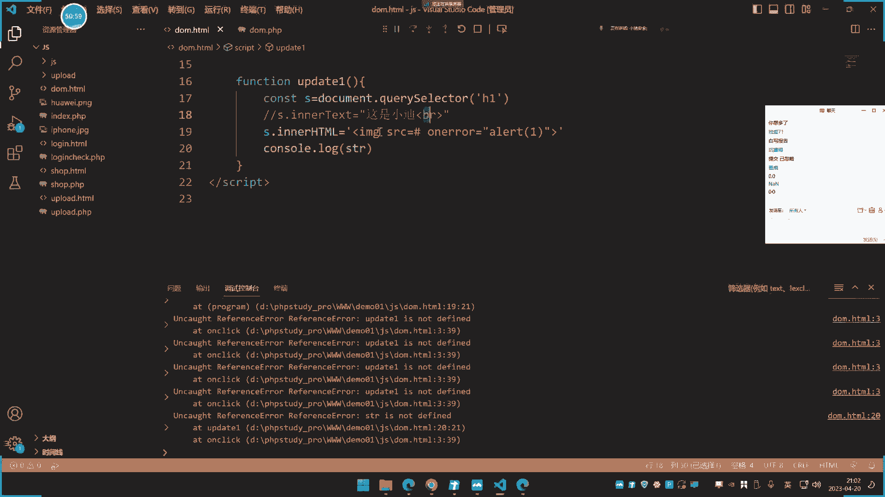

嗯不就是这个意思吗，我们这个案例不就也和他差不多的吗，无非就是说它的设计呢更复杂一些，我们看起来简单一些，对不对，当你的鼠标的滑动到这里，获取它焦点事件的时候呢，他尝试把它翻译。

因为它本身的功能就是两边都能进行，把你选择它呢就翻译成它，你选它呢就把它返回来，同样道理啊，当这里呢有个image src的时候，在这边呢它不能执行，但是呢它翻译成这边之后呢，你再把这边的换上去。

他就会把这个尝试解析，这个一解析就类似于这种功能嘛对吧，把它当做这个代码去执行，那么后面的JS代码呢就会被执行。

就这么简单，能不能理解呀，啊能不能理解啊。

好这个案例呢是我们今天讲的第一个案例。

那么接下来呢我们再给大家看另外一个案例，就是涉及到JS的简单的调试，理想的知识点，这也是大家非常感兴趣的，它有没有作用，我们一讲大家就知道有没有作用，首先在讲之前，我们给大家看一下一串代码段。

这串代码单呢我们不教大家怎么写，因为他写的非常简单，我们没必要来一个个讲，我就给他准备好一个代码段。

这个代码端啊就给大家演示一下。

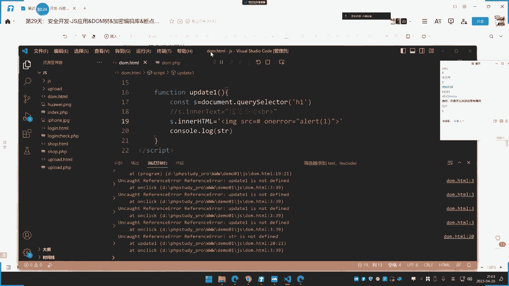

首先呢把三个文件准备好。

这三个文件是网上瞎的啊，这三个JS文件是干嘛的呢，其实就是JS库把它放进去干嘛的，全部是用来加密的，那MD5用来MD5加V1的js in qu，用来JS1些场景加密，什么ax啊，DNS as啊那些东西。

然后呢这里有这么多三个文件啊，分别负责各种类型加密。

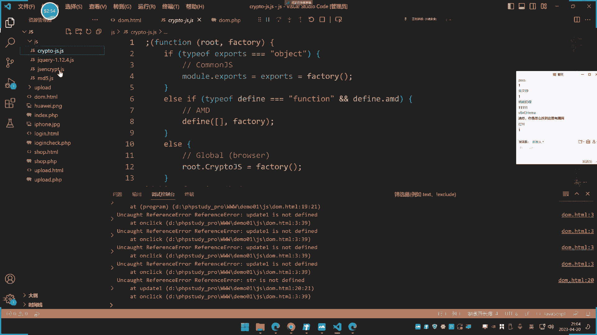

有哪些类型呢，贝斯六四MD五SHE1MMC是吧，AXDEX还有这个RC这些加密呢，为什么要学它，我们等下会讲啊，其实在这里讲的就是说，利用JS呢来实现数据的加密，那么如何实现呢。

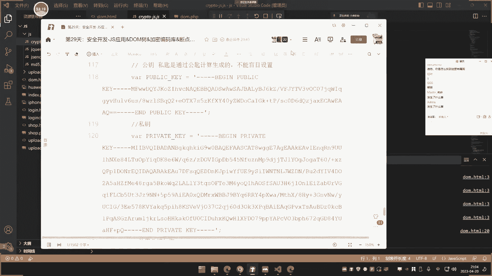

可以应用到网上的第三方库，然后呢用这个库呢来去实现啊，用这个库来去实现，然后如何实现啊，来给大家先创建一个文件名字就叫一个CY吧，这个点ATM号，然后如何实现呢，首先啊。

他这里呢就可以直接引用这几个文件了啊，直接引用引用它之后呢，就非常简单了，SRC引用这个JS目录下面的，然后呢这里有三个是吧，比如说MD5的，就把MD5取出来，对不对，引用它啊，就引用这个JS文件。

那么就会响应这个JS里面的代码啊，这全部是用JS写好的，一些这种封装好的函数和一些东西，你就直接调用就可以实现MD5的这个加密了，对不对，然后如何操作呢。

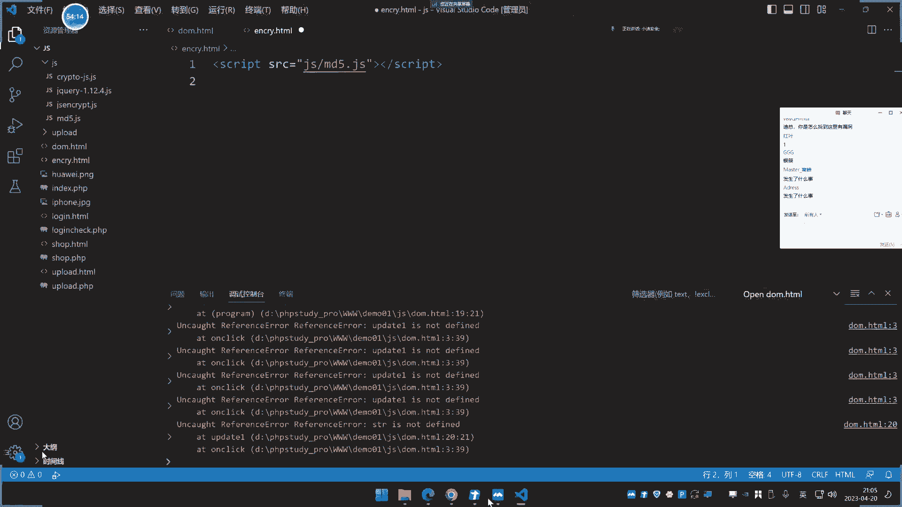

非常简单啊，什么base64我就不测了啊，都一样的道理。

那我们看这个什么这个MD5的呢，直接粘贴上去了，我的加密的值呢是小于SEC，然后呢把它用M05来去加密这个SR1，把它复制为这个s t r e code，用VA啊或者用cost都可以啊。

这两个变量生命都可以，一般会用VA啊啊你也可以用cos都行啊，这个怕有些人不知道啊，还有个叫nee t l e t呢也可以啊，三个复制变量l e t d a r cost，这都是复制变量的三种方式。

一般在高端开发里面用这个多些啊，低端开发用VA2好，你看啊，这是小DIC把它进行这个MD5的一个加密，然后呢打印出来，那我们来观察一下这里啊。

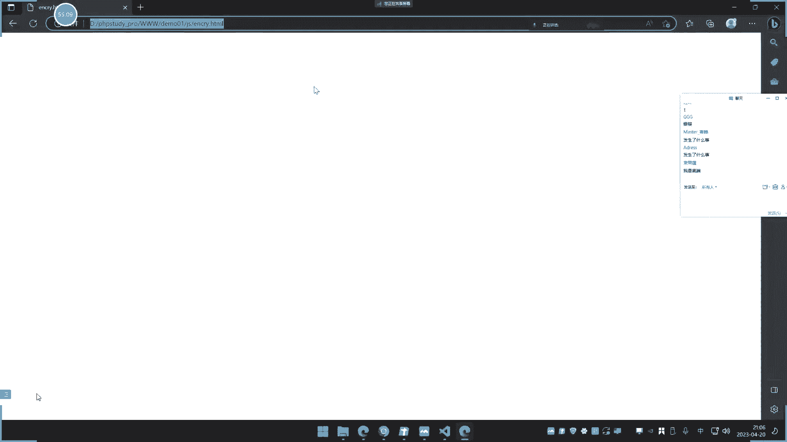

你看是不是打印出来了啦，那当你去改变这个值的时候是吧，小D基础，就是英英文吧，Number one，对不对，永远的基础永远滴神，那刷新一下，那看到没值就改了是吧。

这就是相对这个值呢进行MD5加密能理解了吧。

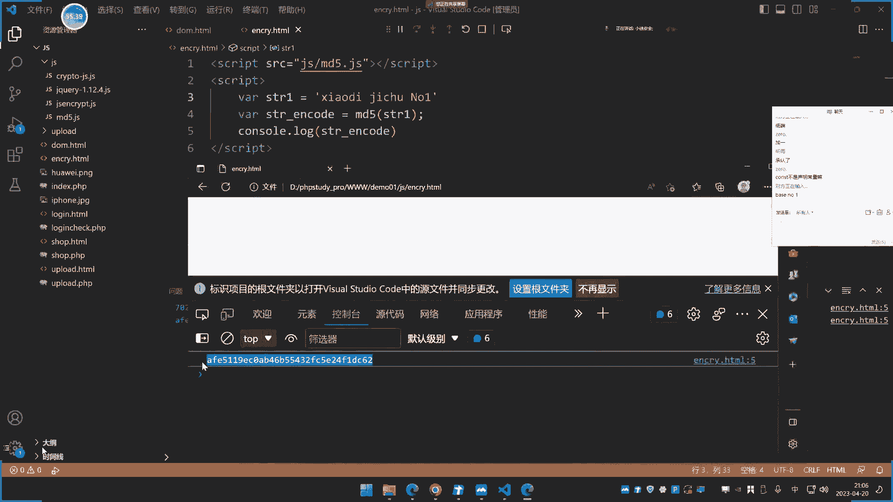

那么依次向下，那这个阿SC的呢也是一样道理的。

这个呢就是，利用这个另外一种加密方式，就这个杀的这个是MD5，对不对，第二单用这个东西呢来实现这个SD啊，那小DSEC那调用这个COMMERJS文件，然后呢这样去操作来刷新一下，那就变成这二个了啊。

当你去改变这个值就会改变了，这是那个S沙加密的一个格式。

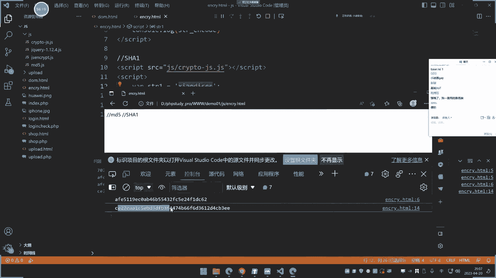

同样绕令啊。

这个HMC的MAC的也是用到这个JS文件嗯。

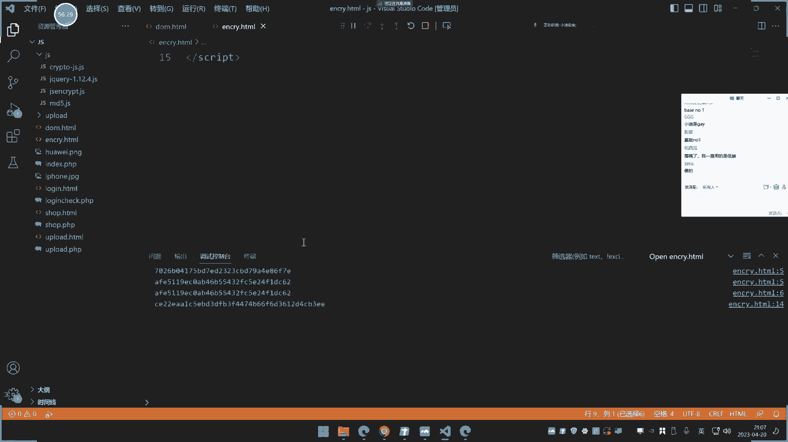

调用这个JS文件，然后呢，去这里的生命加密的K和加密的字符串，然后呢你用这个这个调用啊，用这个函数呢去调用这个东西，加密K和SRC，并把这个结果来进行展示，嗯来刷新一下，你看这就是另外一种加密方式。

同样道理啊，这个ax的就是零，基本上差不多了啊，看看as的这个是a as。

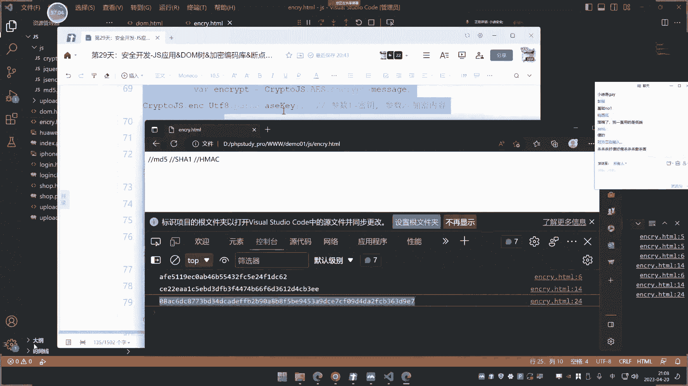

我们看as这面啊也是用到这个加密文件，然后呢这里是as前期加密的时候，我们说过加密算法的时候，说过他有什么偏移量和这种叫啥呀，偏移量啊，还有那个加密密室啊，那东西是吧，就把它写好。

小时候呢把它进行一个输出，可以观察一下这面情况刷新诶，这个怎么又显出了，哪里写错了呀，哦这里没有写SQUE的结尾，好刷新一下，你看就出来了吗，这个就是a ax加密。

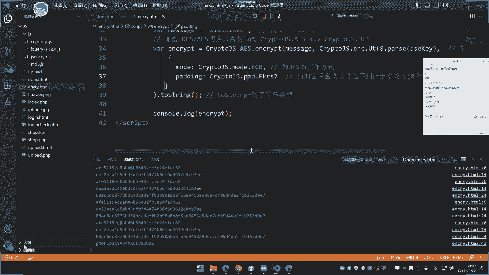

那么像下面这个。

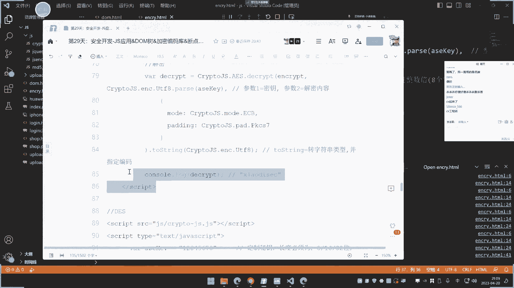

额这个这是解密的，我没有写上去，还有解密的啊，这是解密的，他把两个都输出了，看这个是加密的。

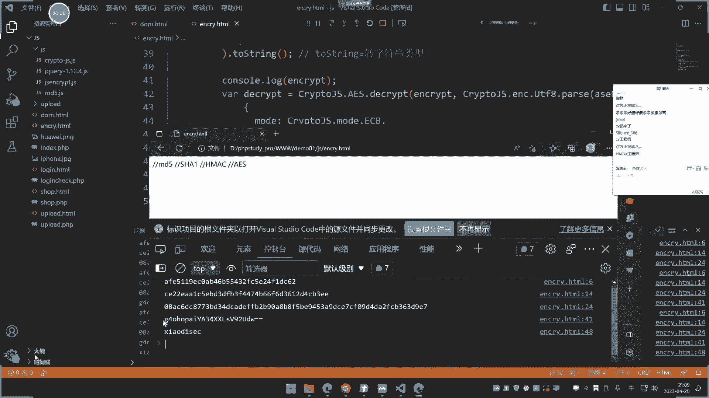

这个解密的，他后面还写了个解密函数。

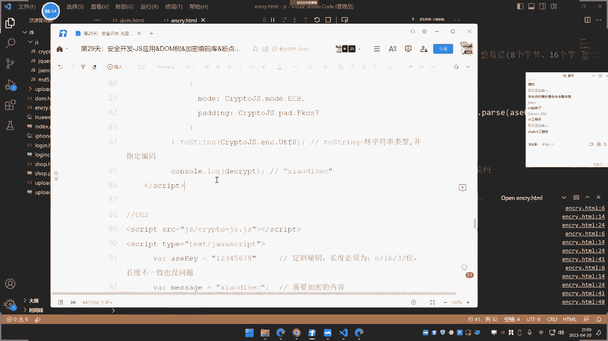

啊其实就非常简单啊，这个东西呢就无非就是利用网上这种哭啊，然后呢你用库里面的使用规则，这个库怎么看使用规则呢，你可以直接打开啊，这CIA挖的啊，打开这里面的去翻啊。

也可以网上那查阅下这个JS的一个使用资料，用它呢来实现加减零啊。

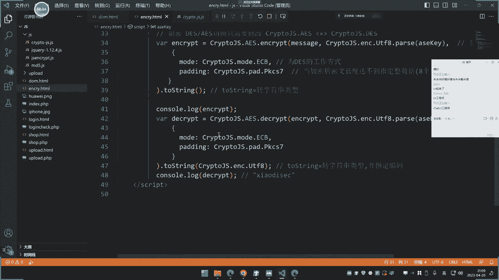

后面还有个这个DS啊，包括这个RSA呢我们就不测试了啊，你就给自己呢把它复制上去演示看了啊。

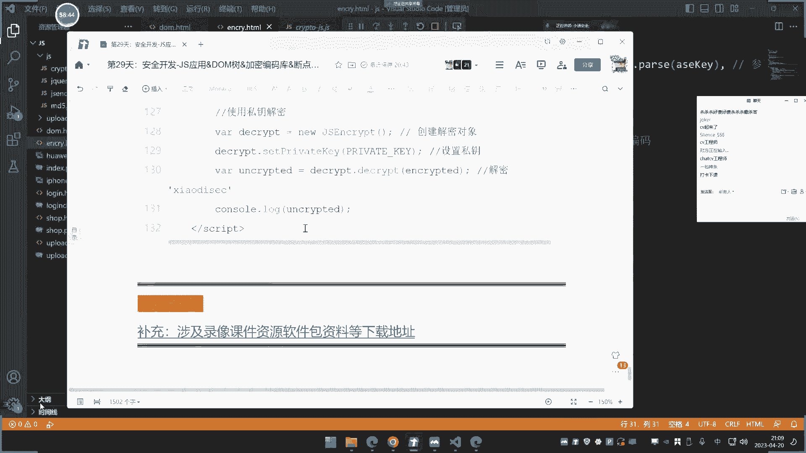

这比较简单了，其实就是说我们网上呢碰到的一些常见加密呢，都是用的是这个也封装好的，他不会自己去写，你就像我现在给大家看一下，一个案例看着啊。

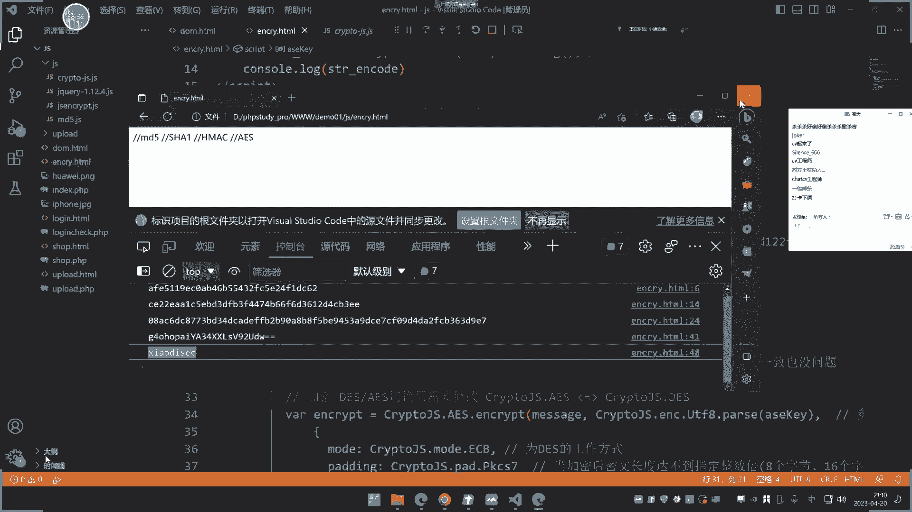

两个案例啊，一个是有博客为案例，先讲原理再来直接给他调试，申通快递。

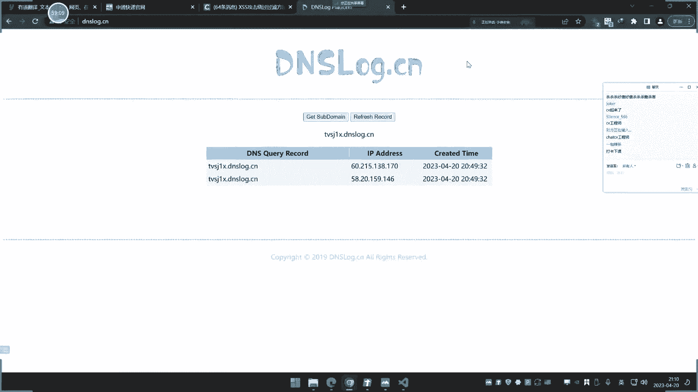

大家看一下这个调试有没有有没有讲究是吧。

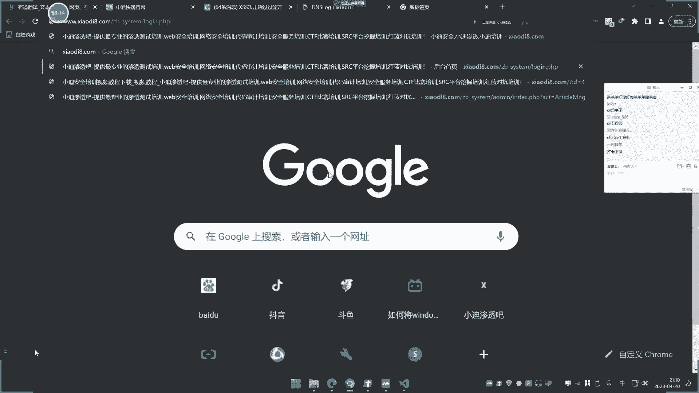

先看一下我们的博客的啊，你看是不是这个意思啊，哎这个宝贝怎么是登录状态啊，你妹的换浏览器登录。

大家看一下R来，我们这里呢可以关注一下这边他的一个东西，你看啊，我在访问的时候呢，它就自动帮我加载了一些文件，并且这里看MD5都有了啊，你看啊，现在呢我们来看一下啊，那我来分析一下啊。

为什么要去学这个东西加减，明知道他是个什么流程了，那么你看到这里有个MGES，你说他是干嘛的呢，加M65干嘛的，那肯定加密MD5的，你不信的话，搞不好和我这个M65JS一样的，看下是不是一样的啊。

不是一样啊，他不知道从哪下的，他是这个里面的嗯，然后你看啊，我输入一个账号密码，我可以点击这个密码这里啊，这是他的一个传参值，叫bd password，看大家怎么分析它啊，全局搜索搜索这个值回车。

大家看一下，在logo p p里面搜到了，看下这个地方来看这个代码啊，设到这个关键地方了，因为他全参的是这个值嘛，设到这个代码了，那就这里码啊，他等于什么呀，等于这个变量，他说了。

btn post点click，这是我们前期讲过的AJX的奇数啊，有没有印象啊，啊来翻过来翻到那个AGX那个级数，那当时我们怎么写的，看一下这里来，这不就是一个东西吗，无非他这里我写了个AJXX。

他没写呀，那button你看他这里是怎么写的，B a b t n post，Jin ha，就取class的字，来我们看一下这个表单，这里来点击登录，这里我们看一下源代码来看没，是不是btn post呀。

取这个id值，我们看笔记嗯，上面的id值后面就是加井号，class后面就是加点号，就说你呢你的class里面就是加减号来去筛选。

然后呢id后面的就是加井号，你看他这个是等id跟b t n post嘛，所以呢你看井号嘛，就取这个id值等于p d n post，是不是就等于这个登录时间了，被单击后，然后怎么办呢。

取这个e n d password，那e n d password是哪里啊，是不是就是密码这里啊，那密码的这个id值e n t password，取这个值码点FUL，这没教过吗，ATX就讲过这代码。

这不看难看难看不懂，你说讲开发有没有用呢，到这里就有用了呀，所讲过的就知道是在干嘛呀，对不对，取它值赋值给这个变量复制个变量之后，你看按下面再做了个什么事情，你跟踪一下来看到没。

那VARMD5s str password，就这个变量得到之后，下面有个什么，你看再声明一个来password等点VR呢，MD5这个东西，然后呢action第一次提交给谁啊，CMDACTVR是吧。

完了对不对，他这个写的有没有毛病，那没有毛病，为什么我们当时说过，如果说他有这个回旋的处理的话，就可能有安全问题，是不是我当时讲过AGX大家还有没有上节课，印象就是如果登录成功之后呢。

他以这个JS这里呢判断成功之后呢，还有后面的处理的话，那可能就有安全问题，因为这个JS呢我们能够修改它，但是它的处理过程呢，在这个代码中有没有看到啊，没有看到他这个东西就干了个什么事情啊，就发了个数据。

啥都没干了，他并没有接受这个结果，这里没有看到呢，是没有接受任何结果，他就发了个数据，啥都没干，所以他的逻辑呢还是应该是在这里没有看到，应该是还是在后端在处理，所以说他就没有像我们刚才说的哎。

我把一登录啊，把状态码修改成一或者零哎登录进去了，不是那样的啊，因为他这个逻辑没有这样写，是这个意思吧，是不是就能和我们上节课挂钩了，知识点，那么再看这个MD5，对不对，还分之五，然后他传递的数据。

看下它传递数据啊，哎这个数据那写一个来传递一下，点击提交，看他全体数据啊，来你看它传递数据呢，Username alme，那password自动加密了，那这是个MD5加密嘛，对吧，你可能说就像很简单。

我不知道他是怎么加密的话，你看这个值看到之后，你再分析源码，在源码中呢追踪到刚才我说的那个地方，M65跑了跑不见，那你这他妈的真是A级就出来了，那就刚才呢追踪到那里呢，他提交的数据刚才大家也看到了啊。

你看这个就检测到了吗，刚才追踪到那个地方，是不是追踪到看到这里就有MD5了，你可能会问这个M65又从哪里来的呀，对不对，我告诉你现在就开始调试了啊，如果这里他不告诉你是MD5。

你又该如何知道他是什么加密方式呢，调试开始，大家看着啊，控制端这里你如果输了，我给你输一下，那你可以直接输，他不是你知道这个逻辑吗，那我给他写一下啦，他的逻辑思，我先把这个代码逻辑写清楚，我们再讲。

这个JS里面代码的逻辑，我们先把它理清楚啊，这里是，简单的说写三步嘛，那单击登录事件，是吧，然后这第一步啊，登录事件之后啊，这里呢是接受这两个表单值啊，啊声明变量啊，变量，接收这什么。

接收这几个表单词啊，检测数据，然后呢下面这个呢是要把它进行判断，判断完之后呢，那他就发送这个action是吧，就是啊发送数据，然后在发送数据时时候，这里呢这个密码呢使用到了一个什么，使用到这个地方的。

使用那个加密呐是吧，这是他的一个大概流程，这里呢是我把它画个图看一下啊，大家看着啊，来这个地方对应什么这个地方哈，然后这个声明变量呢啊，第二步就对应这个地方啊，好第三步发送数据就是这里的判断成功之后呢。

就进入到这个发送数据在哪了，然后这里不是有个这个加密吗，啊所以说多了一步啊，密码呢采用这个加密是这个流程吧，对不对，好，那么现在啊假设说他这个MD5，你不知道他先告诉你，哎我是MD5那里面的，你知道了。

那不知道你咋办呢，你可能说我知道这个东西有什么作用呢，对不对，还会有这样的问题，我知道它和它不知道它有什么作用呢，我们先不说有没有作用，我等下呢反过来再给大家说一下啊，为什么要把他知道。

为什么要知道这个加密方法为什么要知道啊，我们待会会说啊，好我们先解释把它还原出来啊，假使说现在你不知道该怎么办啊，有种方式最简单的，但这种方式的成功率不高，就要直接呢MD5，它不是复制这个值吗。

我直接给他传了，看着啊，我传递一个小迪，看着啊，回车呐，他是B比，要比，那打印出来我直接在你的调试呢控制站这里啊，M95好，然后你输入这里啊，输艾这里，然后呢密码呢我就输，小迪看着啊，看他发送的数据。

看这里看到没，四和这里一模一样，你看就说明我这个调试成功的嘛，那我其实就说我知道我输的什么密码。

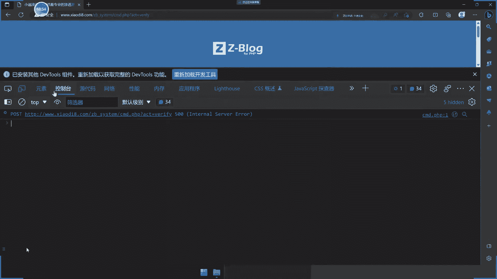

和它对应上了，对不对，这还没用调试啊，那接下来我博客太垃圾了，我换一个给你看一下，一个高端的，这个就值得学了啊，这个就非常重点了啊，学到就是赚到，这是最简单的JS的立项，申通的这个登录的一个地方。

大家理解一下啊，大家看着啊，怎么去搞，首先这里R1按道理把我换个浏览器吧，这个浏览器英文的不友好，我们换个中文的，用EEEGJ1啊。

把它移动到这边吧，妈的这个下面的屏幕那个了，哎移动一下呀，这里面的布局啊。

换这边来啊，大家看着啊，我们在这里呢给大家看一下啊，这个代码的一个情况啊，首先呢我们要做个事情啊，登录一下，随便写个账号密码啊，来点击登录，大家关注一下这边的网络情况啊，点击登录好。

这里呢除入一个logo，request的一个请求，大家可以看一下数据数据是一个什么格式啊，你看来给大家复制过来看一下来，这是username，这是password，这是mono，三个值。

你可能说我输两个，怎么有三个啊，我先不管这些东西，我输了个电话号码，我输了个密码，这个UZM应该是它跟你自动绑定的一个东西，我不管它。

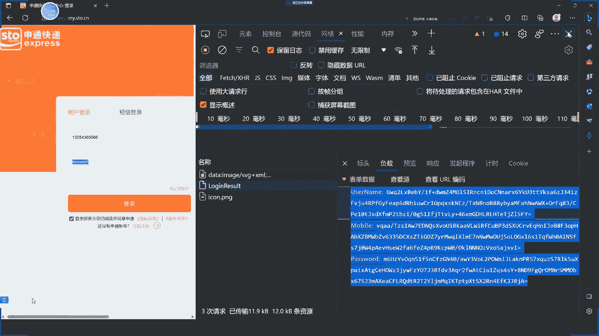

先不管它啊，来三个值，你看这个数据，我输的全部铭文，他咋给我搞成这东西来。

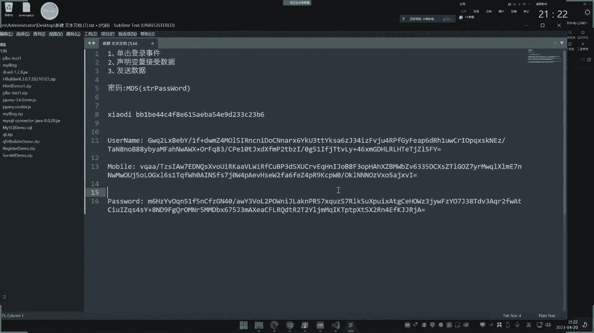

然后在这里呢我们看一下啊，有没有加密文件呢，你看他加载的JS文件。

那加载JS文件有没有啊，看下源代码中这一大堆啊，这该怎么分析呢，不好分析啊，好办啊，首先第一步看这个表单啊，看这个表单这里啊，点击一下这个用户名，这里啊，看他是以什么值发送的，内蒙等于朗博报。

那么就选择这个啊，为什么要以这个为准啊，最好是以这个为准，因为这是从开始他结束的参数名，所以这个name啊在这里全局搜索这个词，好在一个文件里面找到了，有几个文件，在这里有个叫LOGANJS文件。

找到了名字也刚好对应上，我们来观察一下啊，第一个是生命变量，来看下这里啊，但是这里注释了注释就不看了啊，看下面这个啊，它也注释了啊，这个也注释好，这里没有注释，看下啊，那是和那个AGXU一样啊。

你看取这个值，然后这个叫什么k down，k down是干嘛，英文解释下来干嘛，按下键盘按下的操作，然后你看啊这里有个判断好判断判断判断好，啥都没有看到，就是一个这个，这个还是把他这看上去。

我把它单独放一列吧，哎算了算了，就这样看吧，那那这个按下去之后呢，没有了，下面代码没有了，继续往下面看一下啊，大家看一下这里啊有非常关键的东西出来了，大家看到没了，我找这个地方呢。

login date uslemon等于login data mono等于等于什么呀，等于在这是我刚才收到值吗，E n k qu，然后这个东西，然后这里有个叫东西，然后你给他一下啊，打开B。

这应该就是它加密中心嘛，从这个字面上面可以看到呢，ENCLYPT看到没，那这个东西是什么情况呢，我能不能做操作呢，我要以一个什么操作来做它呢。

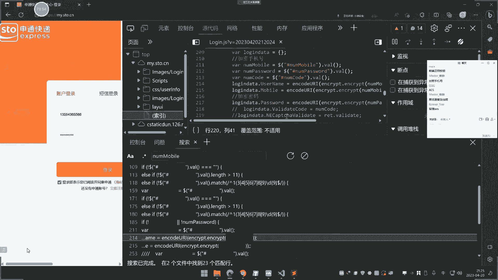

好大家先想一下下一个问题啊，如果现在啊，我们要测试像这种说测试这个猪猪一样哈，好注入的payload是怎么写的啊，现在想想啊，注入的payload，比如说注入PO是这样写的，安的一啊，等于一呀是吧。

测试下看有没有这种问题啊，像我这样写好，我这样写之后呢，比如说我在这里输密码，这里输这个东西，对方接收过去是一个什么东西啊，是一个谜密文呢，是不是一个这个mu的密文呐，这是铭文，一问就不知道了是吧。

就是叉叉一大堆了，如果你不知道加密算法，你发送铭文吗，发送铭文有魈吗，没有消，为什么没有消，大家先想一下，为什么没有消啊，因为对方可能会，解谜，但是你罚的是铭文，对方解密是啥东西啊，啥都不是了。

你发过去的东西，那个佩洛德就已经丧失了，他的这个作用就很简单，对密要就像就像我们说的一样，你和别人去沟通，你在说中文，别人要用翻译翻译软件把它翻译成英文，别人才听得懂，它是以英文来传输。

你就需要把你的中文先变成英文，再告诉他和这个道理不是一样的道理吗，他的数据接收的是明文数据，你给他发个啊发啊，密文数据，你给他发个明文，他知道这是啥东西吗，他不知道啊，不知道你这个payload。

这种测试语句放进去有没有用，那没有用，所以你就必须要按照他的加密算法去发送，否则的话发给发过去，他人都不认识，还怎么去测试有没有安全问题呢，所以说这就是我们为什么要搞清楚，它的加密算法的原因。

就是首先你连测试的资格你先要拿到才能测试，不然的话你连测试的资格都没有，你测试个毛啊，为什么说这类网站它为什么安全，它为什么大型他为什么要加密，就是因为，这东西技术啊不一样啊。

你像常见的就明文明文传输了嘛，他就迷问，这就是他不一样的地方，它为什么它安全呢，他为什么又是大人呢，对不对，所以啊这个解释大家能不能明白，明白之后，我们现在呢就开始教大家怎么把理想出来啊。

先问一下大家能不明白啊，因为你如果说不明白这一点的话，我们讲的是没有意义的，你不知道我在搞搞什么飞机啊，好大家明白之后，那搞它就有意义了，就知道我为什么要做这个事情了啊。

看着啊刚才找到这里了啊，然后你看啊调试我可以怎么样，我我就按照刚才我那个想法一样呢，呃你不是等于这个我不还还有个密码吗，你等下啊，我把密码找到呃，这里打密码，这里密文啊，找密文。

这里密码是这个n password，我搜一下n password搜啊，这里有个加密密文档是吧，就是用这个值嘛，他用这个东西来接收，对不对，你看着啊，这里有这个这个值啊，加密密码对不对。

login data来，我试着尝试一下，我控制台里面去，他不是接受这个值吗，就是number，那他取这个值吗，那是不是个变量等于这个值嘛，所以这个变量呢就是等于这个值，我试着去尝试这样子啊，你看看啊。

我控制台这里呢去输这个值，我复制个变量看一下啊，复制个变量名字好，我先这样直接敲看看能不能行，直接报错，为什么它提示e NC l y p t is low defined，啥情况没有定义。

为什么没有定义呢，它这个调试呢是建立在你当前的环境，可能他这里面有引用过一些其他的JS，但是他没有架出来，就是说你在你浏览器，但不像他这个本啊，他那个服务器上面能够运行这个函数。

他可能隐藏到任何一个地方，你必须要把那个文件找到才行，那这个时候该怎么办，就直接端点调试才可以调用它，否则的话你这里必须要找这个函数的除处，它才能调用它，因为这是自定义的函数，我要找到它的出处，看着啊。

该如何找，把这个地方端掉，来点击这个红点点啊，红点点浏览器不同，有的不是红点点，有的是其他的啊，点的红点点点上来到这边啊，看着啊，火输123456，随便输啊，随便输，呃刚才输的是什么东西啊。

刚才忘记输什么东西了吧。

我等下记录下，我先记录一下啊，我先输个，这个这个密码是小黎的啊。

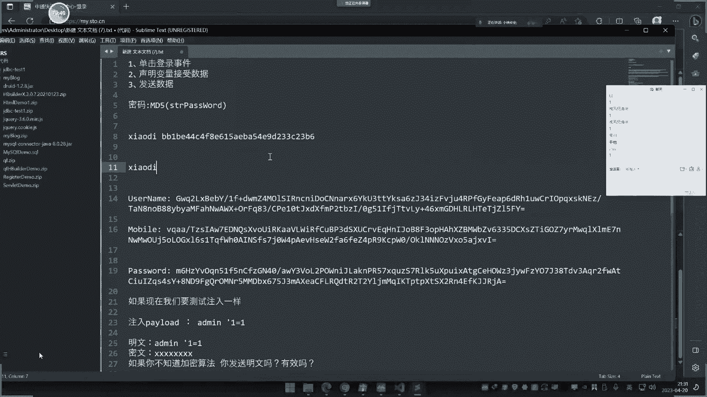

先输个密码，小迪的，我看一下啊，密码输小迪的，看他这个结果登录啧，先把断掉啊，先把它关掉，这里上面有个按钮，你看这里有个F8和这个跳转F8，就是把放出去好，然后呢，我抓一下刚才的网络包。

哎呀算了算了算了，我懒得去看那个东西，我说想给大家对比一下啊，我直接端吧，端端端啊，断了之后我再再再再给再给他讲那个吧，来点下端的啊，先端点上端了啊，好重新来啊，看一下啊，苏小迪点击提交好，端下来了啊。

你看这里的页面就停了，页面停了啊，然后这边是调试，就是跟踪这个代码的执行流程，这里我们不用管它啊，现在还没有学到这个高级的知识，这高级知识后面再讲，我们先看这里啊，你看呢这是我输的，他接收到的值啊。

你看现在等于小迪看到没，他已经写进去了，但是当他一发送出去啊，那这个值就变了啊，一直这一放进去，你看啊运行好，这里没有了啊，因为刚才断了，你除非刚才在端的时候呢，就把它显示出来，好重新再断一下。

点起去啊，好像是等这个啊，点这个呢就是往下调，这个就是巴放出去了，往下调，那这个东西呢就一直在改变，这个地方呢一直会改变啊，你看一下的，啊他一直在改变啊，来你看上面数据呢就已发生改变了。

这个地方都已经改了，改了一些东西了，有些东西就出现了，但是不要紧啊，现在只要这个操作来了，我就可以调用它了啊，现在你再看啊，呐看到没取出我的值了，等于M开头的，然后我再把这个值变成我要攻击的语句。

不就行了吗，这就是我攻击语句，我输入按的一人一，这是我加密算法，对不对，这就是我加密算法，所以我如果要让他攻击，挨到一人移的话，我怎么样就传递这个值给他，对不对，同样道理，这是调这个值的。

你还可以调其他字的，你看这刚才跑哪去了，那个地方，那这个值呢调这个值也可以啦，不过他加密都是用一个算法的，你可以看到啊，你画上去之后呢，还有这个还有这个值的结果啊，端下来之后呢，还是结果，是吧。

你可以下去多试一下啊，很多这个东西呢都可以去尝试它啊，你不端下来这里就不行了啊，因为他端了之后，那就是相当于说你整个过程里面有调用，这个地方的话，他才能调用，否则的话你这样写他不知道的呢，你必须要端啊。

找到个地方端好，然后呢就可以直接利用他这个东西呢来输出了，对不对，这样子那就对了嘛哈，这个是密文的一个情况是吧，如果他由于他这里的，是由于他这里都是用一种加密方式，这个密码呢也是这个东西。

username呢也是这个加密，所以说没什么不一样啊，是吧，你看现在执行的时候呢，UC已经出来了，UC等于这个字，然后你意思这里呢有调试啊，这个大量的调试呢你也关注一下。

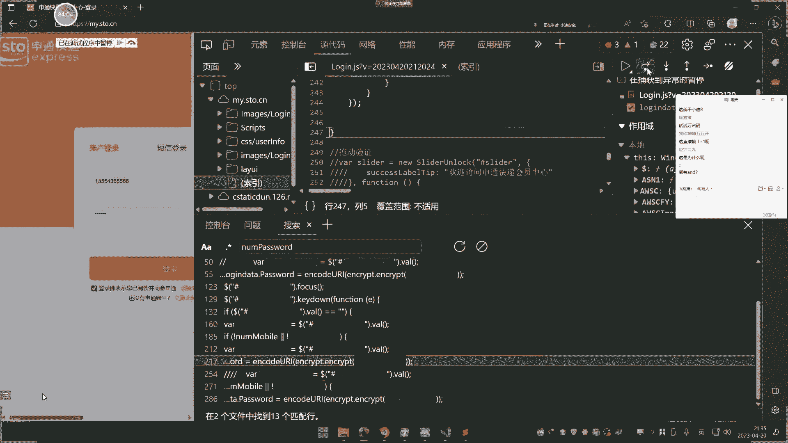

我们这里，那就不多说了哈，这个这是一个最简单的调试啊，那像后面有更复杂的，就是他的这个就像我们现在这个比较简单，就是一个JS文件直接找到，那在一段就能把它挑出来，就能用他那个享有它那个加密算法。

那个函数来去加密我们想要的东西，来形成那个数据。

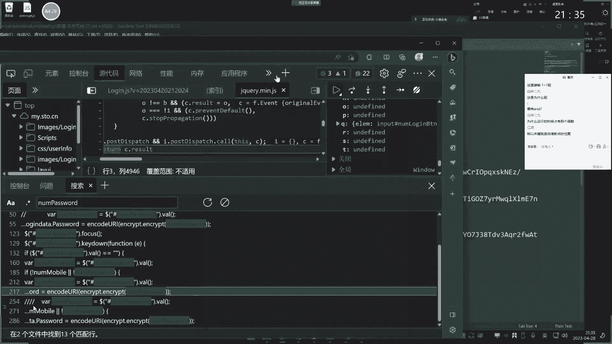

对不对，同样道理啊，他既然有这个加密的话，可能还会有解密，如果说你能够找到解密的话，还可以解密数据，你想一想啊，他是这样写的，那你可以猜测一下，如果说有解密的话，那这里是不是D1呢，对不对。

可以搜索一下啊，看这里有没有泄露解密的算法，在JS中，那他是这个加密是加密，是这个嘛，那么解密的话应该是第一开头的这种名字是吧，那果然这有没有呢，感觉应该是没有的啊，啊那这里有个解密JSN的。

这不是的了啊，那这里还是没有啊，如果有解密函数的话，你可以实时的对这个数据进行解密。

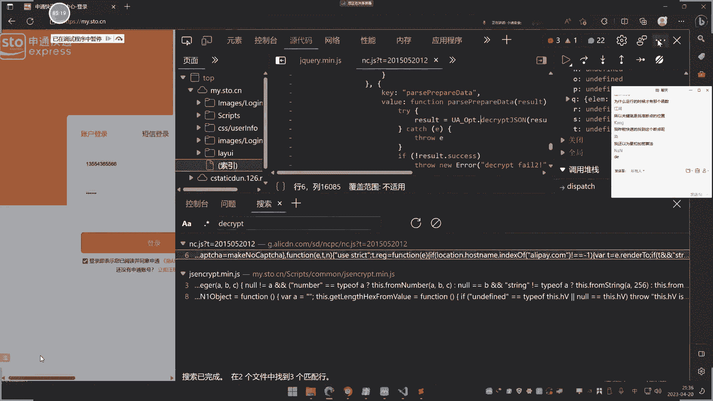

但是这个要看他自己有没有写入了JS，那个加密呢，我们找到了之后呢，就可以实时的对这个数据是吧，已经加密了，否则的话你该怎么测他猪点呢，测个毛啊，你难道把这个按的一等一像这样写吗是吧，斜S在这里点一次。

对不对，比如说这里有个爆破也一样道理啊。

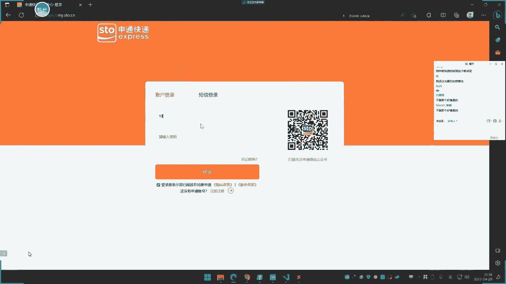

很多应用加字啊，我刚才只是说随便举了一个意思啊，因为呢你要把它进行加密之后呢，以这个密文去发送这个注入配load，它才有效有效的这个结果就是什么，以同样的这个加密呢去发送这个halo的，对不对。

他才有效，那没有消的话，因为对方呢啊要解密这个数据，然后有效呢，就必须按照这个模式来进行发送配漏的，所以呢你要知道那个PO的调用，如果你不知道的话。

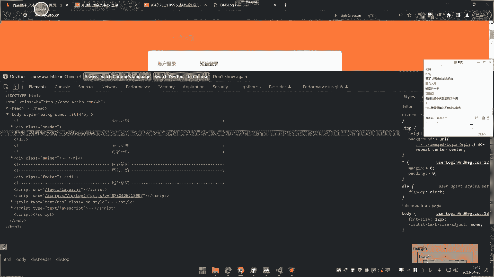

你怎么加密你的数据去测试有没有安全问题呢。

加密不了啊，是不是，所以说啊这东西呢就这么个意思啊，这是我们初期讲的一个最基本的，JS的逆向技术啊，我们在JS安全课程里面，在web的那个章节，就在下一个章节讲的web安全，PP安全，JS安全。

java安全和这个点net安全，还有一些冷门语言的安全是吧，各种语言常出现的安全问题，其中在JS的安全中啊，这个JS的逆向和反调啊，调试技术呢就是我们的终点，因为他的代码呢都比较简单易懂。

主要是怎么去调。

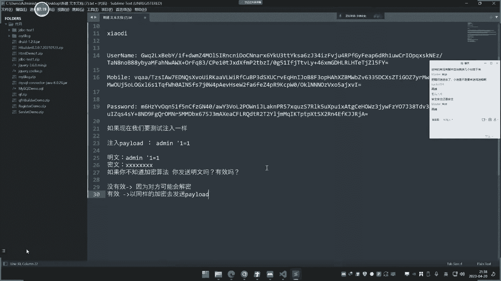

好今天就上这么多了啊，知识点已经讲完了啊。

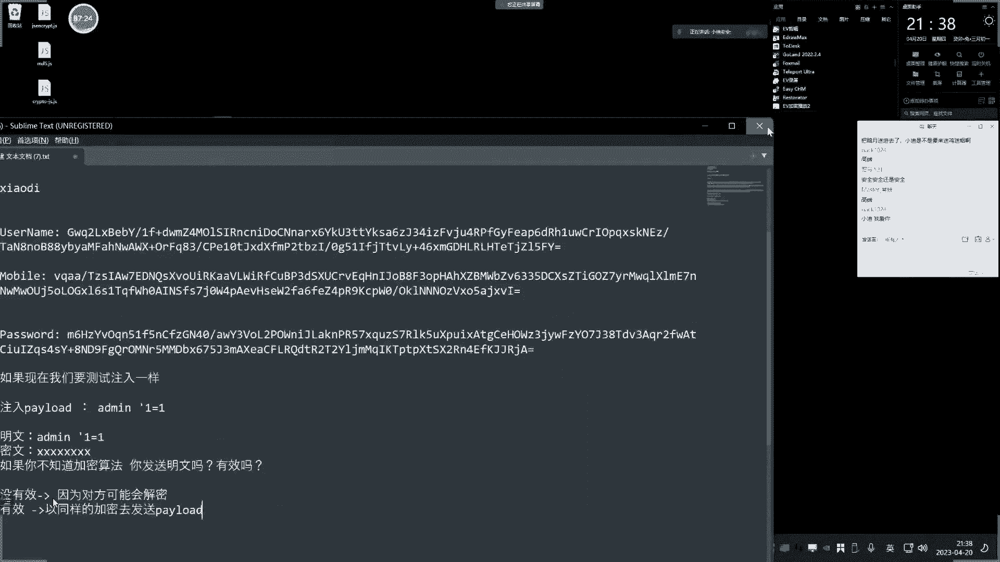

说实话啊，我讲的人有点有人这个没休息好。

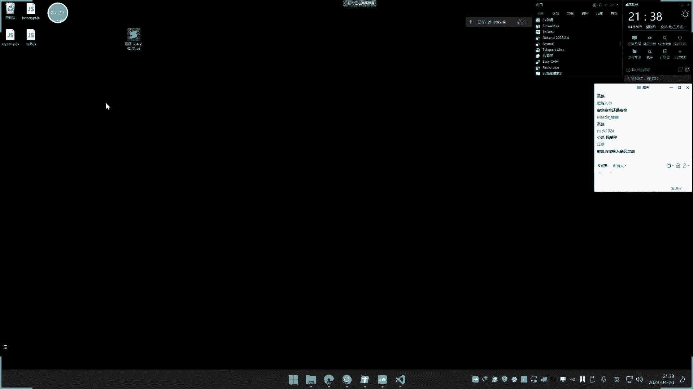

这个人有有点晕啊，有点晕啊，就有时候思路呢有点跟不上啊，就我都不知道我在讲什么东西，有时候所以说听的不是很清楚的啊。

这个尽量啊多看一下录像，有问题的话。

现在问一下啊。

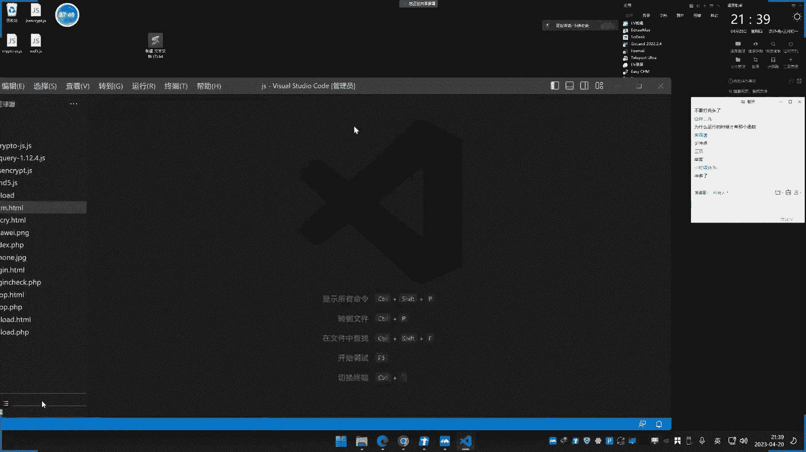

你可以下去之后呢。

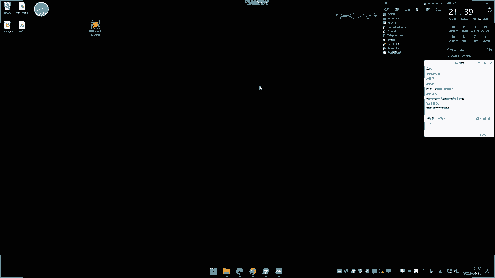

可以去尝试一下，对不对，很多种这种呃一些网站登录是吧。

找到他那个加密，很多大网都有这种情况，对不对，为什么学开发，你把开发学了那个代码才看得明白，才知道个一哦，你开发不学你那个调试条目，你代码都看不懂，你哪知道他是什么逻辑呢，为什么任性的时候才有那个函数。

你说为什么呢，因为那个浏览器那个调试的那个品控制端，那你如果不把它进行端点的话，没有把它执行的话，你直接在里面写，他是不知道从哪里找的，太难道把所有东西都给你找一遍，在上面写吗，不是的啊。

因为你断电之后呢，就相当于那个过程来了一遍，他本来那个加密的那个操作呢，就是在走那个过程，所以在走那个过程中，那个函数就被调用过了，调用过之后你再用它浏览器就知道了，就相当于说你断点之后呢。

你就用了一遍，你可能说之前我也用了一遍啦，但你用完了之后呢，他就没有了啊，你再在上面写他就不一样，断点之后呢，就像这个过程才封装在那个浏览器，那个内存里面一个意思，加密是不是只能手动一个搞出来。

然后加密密文，不是的啊，可以批量的，但是批量的前提是，你把它整个代码都给录下来了，就说你追踪到那个他那个函数应用到哪里去了，然后把那个函数的定义全部把它拉下来，放到本地就可以用了。

因为他也是用JS封装的那个函数，你只要找到个原始除除了，那你就可以同样道理，那你也可以在我刚才这个控制端这里是吧，可以写个批量的，就说你用JS语句这里，因为这里就相当于是个JS的。

这个这个这个这个编译环境，就JS语呢就在这里给敲的门啊，对不对，这就是个JS的一个环境，你用JS写个批量量也行啊，在这里对不对，都可以啊，所以说只能啊不是只能啊可以批量的，怎么结合工具。

结合工具就难结合呀，你按照我们这手工用工具操作啊，你可说工具怎么断点呢，对不对，工具端不了点，你找到那个函数的处处那里啊，我那个调试没有一步步的进行，一步步进行的话，就能找到那个函数的出处。

就是说从零到有那个端点，就是说我只是端的，然后它封装那一层中，然后我调试它完了，我没有说把那个断点之后啊，下一步下一步啊，它就实际上一个执行流程嘛，就那函数的调用流程，整个链出来了。

你把那个调试完了之后呢，整个链里面你就能知道那个函数，它在哪个里面去了，他在哪里了，所以你就可以把那个代码呢，直接原封不动的本地复现出来，你是怎么找到诱导人有漏洞，哪个有导人呢，你说那个翻译啊。

那不是靠拿个东西，哎呀你自己我要讲这个demo的操作嘛，那只有那些东西能符合呀，对不对，其他的网站它没有啊是吧，小点的呢又没什么意义是吧，那也不算很大漏洞，只是说是一个简单的漏洞。

因为那个漏洞的危害不大，包括现在我们讲的这都是不大的，这只是一种是吧，这种安全里面必须的，必需要的一些这种基本的东西，什么东西调用不了啊，调用的了啊，刚才调用了呀，啊这也是一样的道理嘛。

这是就找到了这个加密的整个逻辑，你看这个就找到了，你看包括这个加密的K啊，对不对啊，这个呢整个逻辑都在在这里找到了吗，怎么断点呢，这个断点不会断的，你就找到这个地方，搜到个代码那里断点。

你找这个代码再来选中，那就可以了，这行断点就断点了呢，这不是的嘛呢，就点这个前面就可以了呀，不是的，找到个你要断点的代码段，你自己点就可以了，断了呀，好今天就说这么多啊，你们问的问题越来越离谱了。

还能不能用一人一机偷，你觉得呢啊。

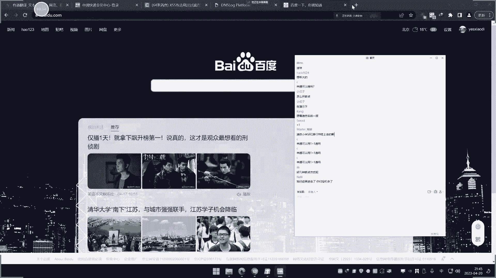

好今天就说这么多了啊，大家看一下，还没问题，有问题问没问题就下啦。

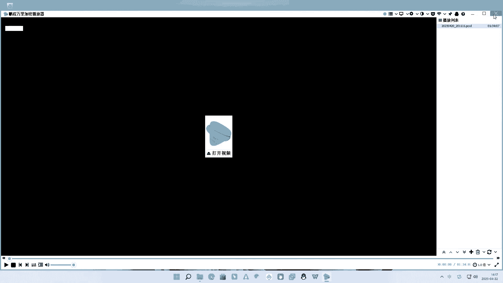

