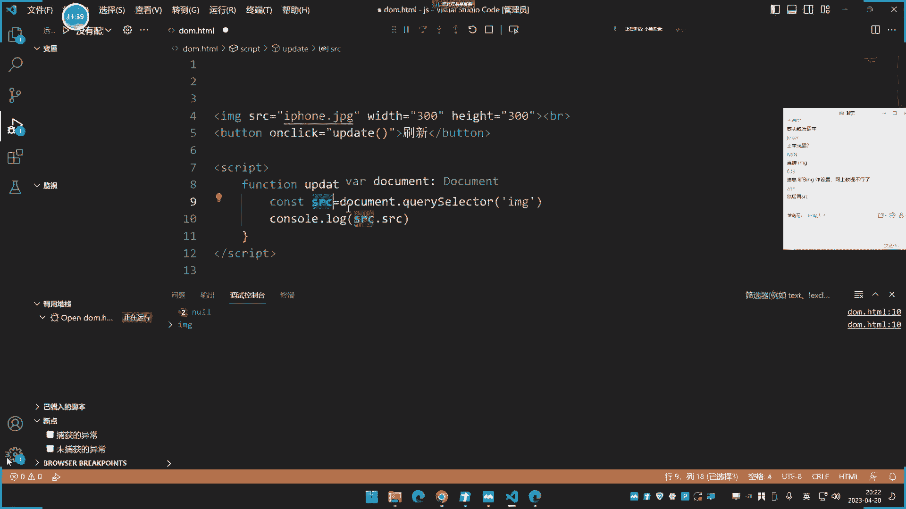
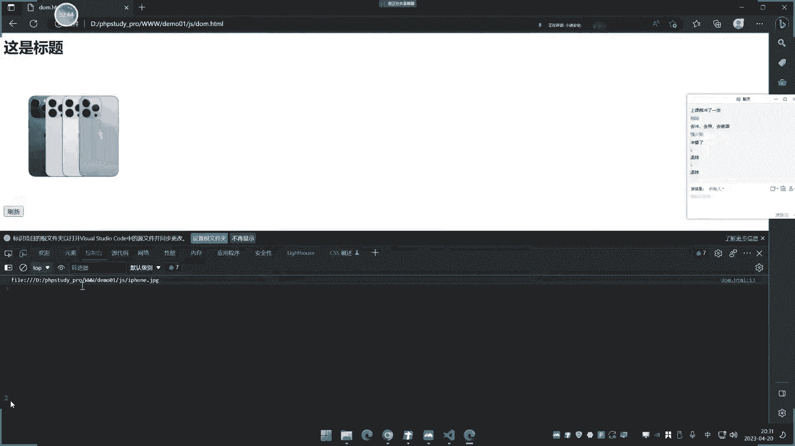
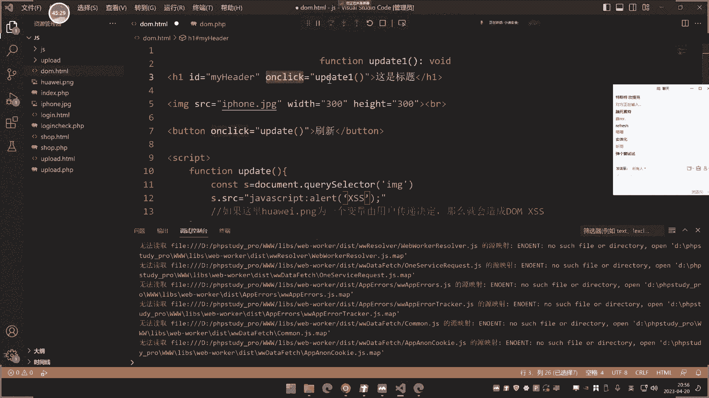
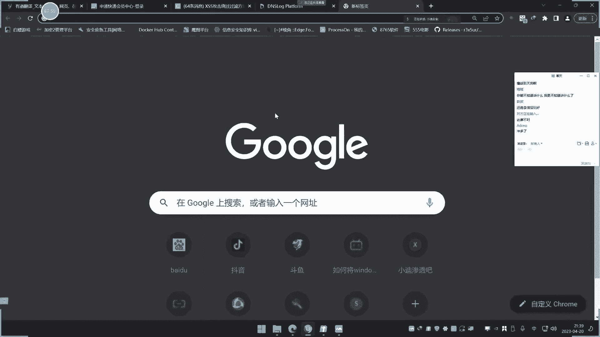
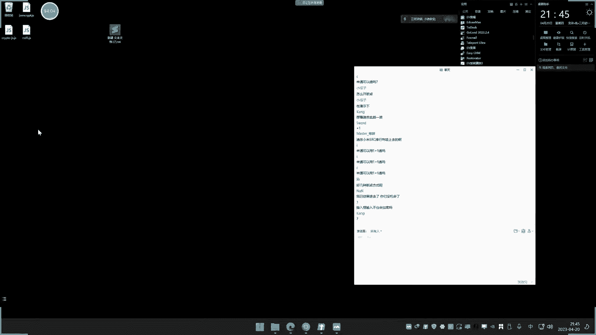

# 🛠️ JS安全开发实战：DOM操作与加密逆向分析（第29天）


在本节课中，我们将学习JavaScript安全开发中的两个核心知识点：DOM树操作的安全隐患（DOM型XSS）以及前端加密编码库的识别与逆向分析。这些知识是进行Web安全测试，特别是前端漏洞挖掘与调试的基础。


---


## 🌳 第一部分：DOM树操作与安全风险




上一节我们介绍了JS的AJAX基础。本节中我们来看看DOM（文档对象模型）操作及其相关的安全问题。


DOM是浏览器提供的一套用于操作网页内容、结构和样式的编程接口。它允许JavaScript动态地访问和更新页面内容，实现与用户的交互。


### DOM操作基础示例


以下是一个简单的DOM操作示例，演示如何获取和修改页面元素。


```html
<!DOCTYPE html>
<html>
<head>
    <title>DOM操作示例</title>
</head>
<body>
    <h1 id="title">这是标题</h1>
    
    <button onclick="updateImage()">刷新图片</button>
    <button onclick="updateTitle()">修改标题</button>

    <script>
        // 获取图片元素并修改其src属性
        function updateImage() {
            let imgElement = document.querySelector('#myImage');
            console.log('原始SRC:', imgElement.src);
            imgElement.src = 'huawei.png'; // 修改图片源
            console.log('修改后SRC:', imgElement.src);
        }

        // 获取标题元素并修改其内容
        function updateTitle() {
            let titleElement = document.querySelector('#title');
            // innerText 获取纯文本，不解析HTML
            console.log('innerText获取:', titleElement.innerText);
            // innerHTML 获取包含HTML标签的内容
            console.log('innerHTML获取:', titleElement.innerHTML);

            // 修改内容
            titleElement.innerText = '这是小迪 (innerText)';
            // 如果使用innerHTML，可以插入HTML标签
            // titleElement.innerHTML = '这是小迪 <br> (innerHTML)';
        }
    </script>
</body>
</html>
```





**代码解析：**
*   `document.querySelector(‘#myImage’)`：通过CSS选择器获取ID为`myImage`的元素。
*   `element.src`：获取或设置元素的`src`属性。
*   `element.innerText`：获取或设置元素的纯文本内容，不解析HTML。
*   `element.innerHTML`：获取或设置元素的HTML内容，会解析其中的标签。


### DOM型XSS漏洞原理


DOM操作本身是安全的，但当操作的数据源（如URL参数、用户输入）不可信且未经严格过滤时，就会产生**DOM型XSS**漏洞。


**漏洞模型：**
```javascript
// 假设以下代码从URL的hash中获取数据并写入页面
let userInput = window.location.hash.substring(1); // 获取 # 后的内容
document.getElementById('output').innerHTML = userInput; // 危险操作！
```
如果用户访问的URL是：`http://example.com/page.html#<script>alert(‘xss’)</script>`，那么恶意脚本就会被执行。


**与反射/存储型XSS的区别：**
DOM型XSS的恶意代码**不经过服务器**，由前端JS直接在受害者浏览器中构造并执行。这使其更难被传统的WAF（Web应用防火墙）或服务端日志检测到。


### 实战案例：有道翻译DOM型XSS分析

在真实场景中，DOM型XSS可能出现在复杂的交互逻辑里。例如，某些翻译网站的双向翻译功能：
1.  **功能逻辑**：用户在A框输入，结果实时显示在B框；反之亦然。这通常通过DOM操作实现。
2.  **漏洞点**：假设从A框到B框的数据经过了安全过滤（如转义尖括号`<>`），但从B框反向翻译到A框时，过滤逻辑可能缺失或不同。
3.  **攻击链**：
    *   攻击者在A框输入一个包含恶意IMG标签的“单词”：``。
    *   网站将其安全地显示在B框（标签被转义，不执行）。
    *   但当用户**将鼠标悬停在B框的此内容上**（触发反向翻译事件）时，网站可能将B框内容**未经过滤**地写回A框的某个属性中，从而触发`onerror`事件，执行JS代码。


**核心要点：** 在测试时，需要关注数据的**双向流动**和**不同事件处理器**（如`onclick`、`onmouseover`）中的数据处理差异。


---


## 🔐 第二部分：前端加密与逆向调试

上一节我们了解了DOM操作的风险。本节中我们来看看前端加密的常见场景以及如何通过逆向调试来分析加密逻辑。




### 为什么需要分析前端加密？

在现代Web应用中，登录、提交等敏感操作的数据常常在前端（JavaScript）进行加密后再发送给服务器。例如：
*   密码使用MD5、SHA1、AES、RSA等算法加密。
*   整个请求参数可能被编码（如Base64）或使用自定义算法混淆。


作为安全测试人员，如果不知道加密算法和密钥：
1.  你无法构造有效的测试Payload（如SQL注入语句）。
2.  你发送的明文Payload被前端加密后，会变成一堆乱码，服务器无法正确解析，从而导致漏洞检测失败。


因此，**逆向分析前端加密逻辑是测试这类应用的先决条件**。


### 常用加密库示例


前端通常会引入成熟的加密库。以下是使用`crypto-js`库进行多种加密的示例：


```html
<!DOCTYPE html>
<html>
<head>
    <title>加密示例</title>
    <!-- 引入 crypto-js 库 -->
    <script src="https://cdnjs.cloudflare.com/ajax/libs/crypto-js/4.1.1/crypto-js.min.js"></script>
</head>
<body>
    <script>
        let plainText = "xiaodi";

        // 1. MD5 加密
        let md5Hash = CryptoJS.MD5(plainText).toString();
        console.log("MD5:", md5Hash); // 输出： 哈希值

        // 2. Base64 编码
        let base64Encoded = CryptoJS.enc.Base64.stringify(CryptoJS.enc.Utf8.parse(plainText));
        console.log("Base64:", base64Encoded); // 输出： eGlhb2Rp

        // 3. AES 加密 (需要密钥)
        let key = CryptoJS.enc.Utf8.parse("1234567890123456"); // 16位密钥
        let aesEncrypted = CryptoJS.AES.encrypt(plainText, key, {
            mode: CryptoJS.mode.ECB,
            padding: CryptoJS.pad.Pkcs7
        }).toString();
        console.log("AES加密:", aesEncrypted);

        // 4. SHA256 加密
        let sha256Hash = CryptoJS.SHA256(plainText).toString();
        console.log("SHA256:", sha256Hash);
    </script>
</body>
</html>
```


### 逆向调试实战：定位加密函数


我们的目标是：在目标网站的登录页面，找到对密码进行加密的JavaScript代码。

**步骤演示（以某快递网站为例）：**

1.  **抓包观察**：打开浏览器开发者工具（F12），进入登录页，输入账号密码提交。在`Network`（网络）标签中，找到登录请求（如`login.do`），查看`Form Data`（表单数据）。发现`password`字段是一长串密文，而非明文。


2.  **搜索关键参数**：在`Sources`（源代码）或`Elements`（元素）标签中，使用全局搜索（Ctrl+Shift+F），搜索这个加密密码的参数名，如`encryptedPassword`。


3.  **定位加密代码**：在搜索结果中，找到处理登录提交的JavaScript文件（如`login.js`）。在其中找到类似下面的代码：
    ```javascript
    $('#loginBtn').click(function() {
        var username = $('#username').val();
        var plainPwd = $('#password').val();

        // 关键行：对密码进行加密
        var encryptedPwd = encryptFunction(plainPwd); // 或 window.encrypt(plainPwd)

        $.post('/login.do', {
            username: username,
            password: encryptedPwd // 发送加密后的密码
        }, function(data) {
            // 回调处理
        });
    });
    ```


4.  **设置断点调试**：
    *   在`encryptFunction`那一行左侧的行号上点击，设置一个**断点**。
    *   回到页面，再次输入密码点击登录。浏览器执行到断点处会**暂停**。
    *   在右侧的`Debugger`（调试器）面板，你可以查看此时所有变量的值。
    *   将鼠标悬停在`encryptFunction`上，或查看`Scope`（作用域）面板，找到该函数的定义。它可能是一个自定义函数，也可能是引用了像`CryptoJS`这样的库。


5.  **在控制台模拟加密**：
    *   当代码在断点处暂停时，加密函数已经被加载到当前执行环境中。
    *   切换到`Console`（控制台）标签。
    *   你可以直接调用这个加密函数，测试你自己的Payload：
        ```javascript
        // 测试加密函数
        encryptFunction("xiaodi"); // 返回密文
        encryptFunction("admin' OR '1'='1"); // 返回注入Payload的密文
        ```
    *   获得密文后，你就可以使用Burp Suite等工具，用这个密文替换原始请求中的`password`字段，进行真正的漏洞测试了。


**高级情况**：如果加密算法非常复杂或经过混淆，可能需要更深入的静态分析和动态跟踪，但基本思路（**定位 -> 断点 -> 调试 -> 模拟**）是一致的。


---


## 📝 课程总结




本节课中我们一起学习了两个关键的JS安全实战知识点：

1.  **DOM操作与安全**：理解了DOM是浏览器操作页面的接口。**DOM型XSS**发生在客户端JS使用不可信数据动态更新DOM时。测试时需要关注数据的来源和用户交互事件触发的完整链条。
2.  **前端加密与逆向分析**：认识到前端加密是测试中常见的“障碍”。掌握了通过**浏览器开发者工具**进行逆向调试的基本流程：**网络抓包 -> 搜索定位 -> 断点调试 -> 控制台验证**，从而能够分析出加密逻辑，为后续的漏洞测试铺平道路。





这些技能是进行现代Web应用安全测试，尤其是黑盒与灰盒测试中不可或缺的部分。请务必在实验环境中多加练习，熟悉开发者工具的各项功能。