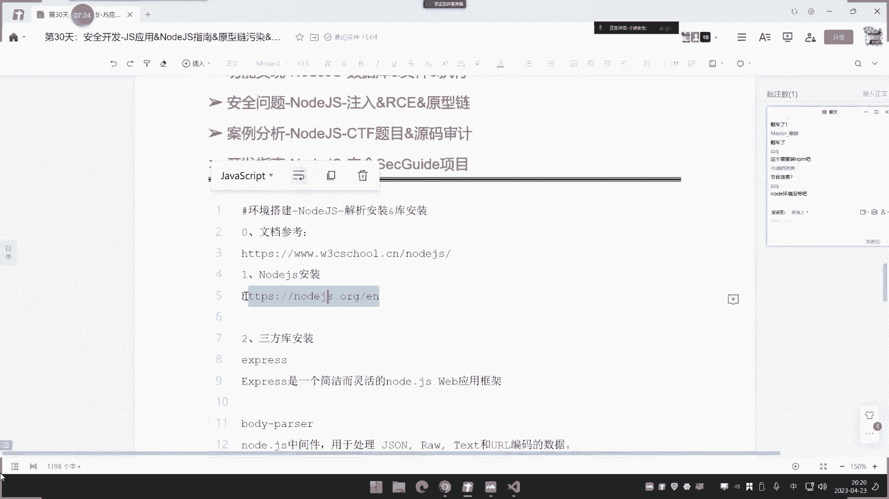
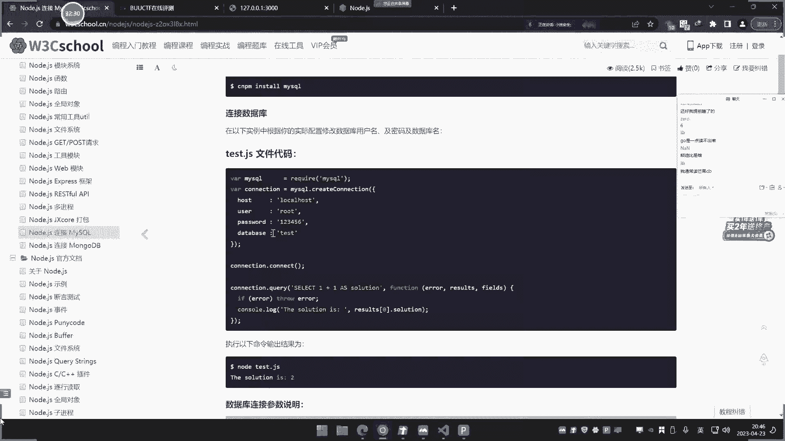
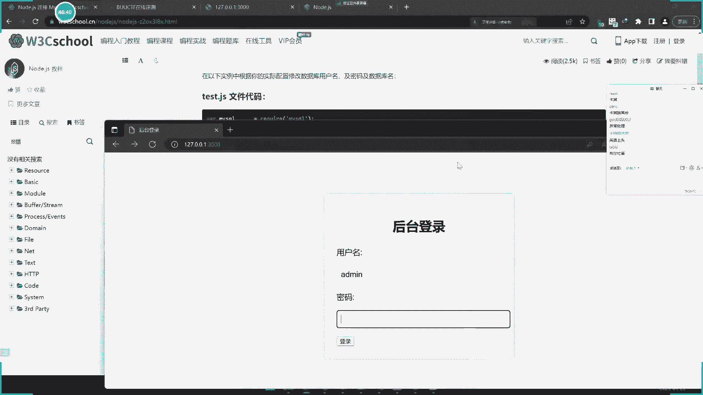
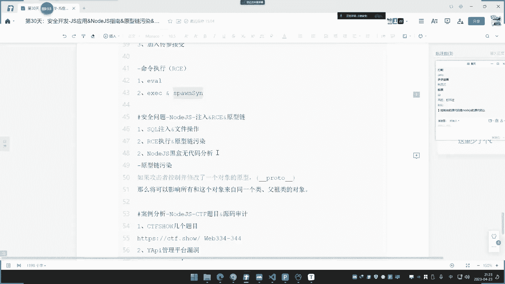
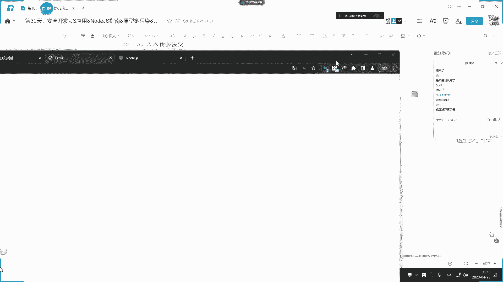

# P30：第30天：JS应用&NodeJS指南&原型链污染&Express框架&功能实现&审计 - 逆风微笑的代码狗 - BV1Mx4y1q7Ny

30天的这个JS的第三次直播了，今天呢我们介绍一下这个low的JS，其实这个JS课程呢，我们呢还会讲一下这个关于什么打包器，Wp pk，还有这个第三方库的一些安全，也就是说还有两次直播吧对吧。

还会讲一下VUE1的一些东西，其实VUE这些东西呢说实话我不想讲，是有人呢提出来要让我讲，但是说实话讲的没什么作用，为什么说没什么作用呢，因为这个VUE1的这个东西呀，他没什么安全问题。

你说我讲他干嘛了，我叫你开发吗，他网上安全漏洞这几年就报了一两个，而且很鸡肋，没啥用，是不是，像这个wave paper呢是刚好这个打包器，这个呢会有一些这个渗透的手段。

包括这个第三方库的上面些安全作用呢，也会有一些帮助，大家能够对我们说，对这个整个这种前端语言的一些这种概念呢，有些补充，唉，这个JS的，所以说讲的呢都是会有一些安全问题的，才会讲上去。

没有什么安全问题的，讲的就是纯讲开发，而开发的也不是我们擅长的，所以我就说讲不讲，他啧没查到错意思啊，因为我把那东西把它脚本，那些简单的一个demo代码端呢，我把它实现了，但是没漏洞啊，你说这咋办呢。

这对不对，你不可能是搞开发的呀，所以说啊这个东西呀没办法啊，好我们今天讲这个node js啊，上节课呢我们讲了原生开发，原生开发里面呢，包括这个demo呢会产生XSS，原生开发里面呢我们上次也说了。

这验证不好的会展有一些这种是吧，逻辑上面的安全问题，这是我们说的安全，包括今天要讲的这个low js呢，也会有一些安全问题啊，我们呢给大家讲一下啊，所以这个node js呢我们先介绍一下啊。

这个low js是什么东西啊，这是网上的一个找到的一个low js的一个，大概的一个教程啊，他说漏JS呢是运行在服务端那个JAVASCRIPT啥意思呢，它和我们原生的JS呢有点不太一样，啥啥不一样呢。

我给他锁一下啊，他说是运行在服务端的，我们原生态的这个JS呢是运行在前端的，就是用在客户端的，这有什么区别吗，哎这个问的就非常好了啊。

啥区别呢，我们先给大家看一下，不看代码，我们先给他演示一下啊，现在搞清楚它和我们传统这种原生的那种JAVASCRIPT的，是什么东西啊，这个low js呢它也属于它的其中一组。

只是它是一种服务端的这个加速构造好。

我们现在呢给他看一下啊，这个差异啊，你比如说像现在啊，我们这个之前不是写了一些这个呃代码吗是吧，你像这种啊，我们对它进行访问的时候呢，可以看一下啊，访问的时候，那这里可以看一下它的优先源代码。

这里呢是能够看到它整个这个核心代码的。

因为就是说这个代码里面所写的，所有的都能看到，这是我们说的原生态的一种情况是吧，好这个是我们之前给他说的啊，那么现在呢我们再给大家看一下啊，我们在这个下面呢再创建一个这个JS文件啊，直接创建JS文件。

名字那就叫做这个嘶嗯，确一个SQL0JS，那这里创建一个SQLJS啊。

然后呢，我们在这里呢，随便找一个这个load js的一个代码端啊，我们随便找个，随便找一个都行啊，这个无关紧要的啊，随便找个，比如说找这个SSPR框架啊，他是个专门用来web开发的一个框架啊。

是这个楼JS里面的，我们随便找一下啊，就像这代码。

我们把下把直接复制一下啊，看一下啊。

我们把直接复制下来，复制下来放到这里啊，好那这里怎么运行这个JS文件呢，啊这里是这样运行的啊，在终端这里呢我们打开，然后呢用load，然后加上这个名字，Circle js，这个是干嘛的呢。

它会启动一个8080换端口管，是个3000端口，然后直接运行，哎他报了个错误啊，报的是什么错误，哪里有个错误，第，他妈的，我在网上呢copy了本原本的代码，这咋个还报错了呢，你们说这这个啥方法，真是啊。

找不到JS这什么原因呢，这要安装一下这个库啊，这个库呢需要安装，那我给大家演示一下啊，NPM杠哎，XPRERESS安装一下啊，好安装好了之后呢，这里呢就会创建一个来这个logo好，我们再来运行好。

现在呢就启动了，我们再来访问3000端口啊，大家看一下啊，就在这个上面呢去用这个low js呢。

自己创建一个服务器，然后去访问。

你看啊，输出hello world啊，输入hello world的好，我们来看一下源代码，大家看一下啊，来它的源代码中就只有个hello world，有没有这串代码的。

这段代码又是属于JAVASCRIPT的，按照我们前期讲的，我们这种呢它也是用JAVASCRIPT写的，但是他访问那是能够看到他原本代码，就浏览器呢能够看到这个本身代码就是前后端。

就是服务器那一边和我们的客户端这边的，看到代码是一致的是吧，就是我们说的前端的JS原生态的一个情况，那么现在这种呢用node js的这个代码呢，去开发的网站应用呢，打开之后呢，它就是一个代码的执行结果。

java类相关的，就是属于后端一种了，所以说它的最大差异。

这句话就和我们刚才说的教程一样。

它是属于服务端JAVASCRIPT的，也就是说它和我们传统那种原生态的开发。

它不一样了，就是你看到的结果呢，就是它代码执行结果。

而不是它本身的源代码，所以这就是它和传统的前端，JAVASCRIPT的原生开发的一个最大差异，明白了没有，三点明白之后呢，我们就开始要进进入这个load，JS的一些简要的开发了，好。

那么现在呢我们就来给大家来去演示一下，JSS的一些简单开发。

首先呢在做这个开发之前呢，是先要准备好环境，就是要安装这个node js，这个呢是可以从它的官网呢去选择。

你合适的操作系统的一个版本去安装，那么这里呢我选择的是这个16。18。16，的一个最新版的windows64位的啊。

它上面呢有其他版本的啊，像MARO的那些东西啊。

你就根据自己的需要啊，选择那这个那大家去安装一下，那就这个啊直接一直一直向下安装。

就几个即可，安装好之后呢，重启一下电脑。

为什么要重启呢，因为它在安装之后呢，会有一个环境变量的一个设置，就像我们现在啊它默认呢会勾选那个环境变量，就是个什么NPM和load，这个环境变量在重启电脑之后才会生效啊。

不然的话你那个当当时呢升不了肖，重新下电脑，那个load和NPM的这种自带的环境变量呢，它里面自带的命令呢就会生效啊，然后如何去运行呢，就是LOL的加上这个东西。

安装库呢就是这样去安装，那么首先呢这是它的一个安装介绍啊，然后呢这里有一些第三方库，这是我们常见web开发的第三方库，有这几个，你可以自行的去这样安装的，那么每一个库对应的意思呢，大家写清楚了啊。

这个库呢是一个简介的web应用框架，然后这个呢是用来处理一些数据的，还有这个呢是解析cooking的，这个呢是用来处理这个文件上传的啊，这个还有这个呢是用来连接MYSQL的一个co。

就是你有这操作之后呢，你可以把这个库呢安装上去才能使用，然后呢给大家演示一下，如何利用这个东西呢，来实现一个登录的一个操作页面。

大家来仔细观察啊，首先呢这里我们用JS呢来实现登录操作，首先我们搞一个前端页面，就像我们前面写的那像这个ATM对吧，这是个登录的一个这个界面，我们可以把代码呢给他复制一下，代码呢给他复制一下。

然后在这个里面呢创建一个这个叫文件名啊，就叫circle点HTML，这是一个前端的一个什么这个登录的一个文件，把它放上去，然后呢我们尝试性的去对它进行一个访问好，这是我们的登录界面。

那么如何实现登录之后，用JS呢来处理这个登录的用户数据呢，呃这里呢我们就来开始做准备了啊，首先在这个JS文件里面去创建一个东西啊，创建什么。

这里呢我们引用到的学习到的是这个esp，这个框架，它有两种实现，一种是app的，这种呢是它老的啊，这种是老的，就是如何的去实现，这个我不讲，为什么不讲呢，我们学就学这种新一点的。

因为大部分人都会用到这个，来这个这个是我们说的SPIPS，他怎么使用啊，我们把它演示完之后，大家也知道了啊，首先呢第一步是要包含一个文件。

如何包含呢，就是REQYIRE包含库，包含我们刚才安装的库，E s p r e p e s s，就包含这个呢包这个库包完之后呢，可以声明一个变量，这个变量呢可以用concert，或者用那个VAR去声明。

这个倒无所谓啊，好生命好之后呢，在这个cost创建一个app来，等于这个XPRESS的一个函数，好再用app点get，那这个是啥意思，这个意思就是路由请求一个路径，比如说请求login啊，请求罗宾。

然后呢啊窗如果请求完之后呢，去调用这个函数，函数里面有REQ和RES两个东西，好这个东西又是啥啊，给大家说一下，然后这里呢就这样写，请求这个路由，这个是路由啊，就是get路由请求完之后呢。

去得到里面的REQ和RES，REQ就是请求RES，那就是结果我们可以呢在请求完之后呢，去给他提示一下啊，console里面去打印一下啊，打印下什么东西呢，打印一下这个，啊打这是打印。

然后呢你可以让页面进行显示，比如说我要让页面显示一个RES点C，就是让页面显示显示什么呢，就是啊真都里子啊，就是这个登录啊，就是登录页面，这个是啥意思啊，我们把它运行起来之后，那大家就知道了啊。

来就是那去接收，如果你是get请求的，并且呢请求的是这个login地址，那么他就会执行这里面，然后呢结果呢就是页面按页面回旋的时候，就显示一个登录页面，这里都可以显示ATM代码啊。

这里可以显示ATM代码啊，这里可以显示ATTEM库，可以把它给他看一下啊，显示一个ATM代码，来看一下，好然后这个是显示，然后如何启动服务器啊，他不需要用这个什么阿帕奇呀，i is啊。

这种中间的去把它启动，它直接在这里启动，他自己构建一个web服务器，该如何构建，就是app点什么server啊，啊不是啊，就是你直接呢在这里，这是接收路由，然后下面那是启动服务器，服务器呢就是这里了。

app listen监听啊，监听，然后一样啊，显示写端口号数字3000端口，这里端口呢是选择一个不占用端口就可以了，好用一个VR还const server取这个变量的去接收它，好。

这里呢启动个3000端口，后面呢再是一个函数，这个函数都可以写东西了啊，这个无所谓的，写不写都无所谓啊，好然后呢来提示一下啊，在这个调的窗口里面提示一下，在这个调通过里面去提示一下啊。

提示一下这个服务器系统啊，就是web的这个3000端口，啊已经启动好，现在呢我们来看一下啊，把它直接运行起来，大家看一下有什么东西啊，先运行起来好，他其实呢web的3000端口已经启动。

现在我们来访问一下17。0131000，当然还提示这个了，command get什么东西好，这个是什么情况呢，为什么没有内容啊，因为它是接收login的这个值，当我们去访问login的时候。

就触发它看一下，来看到没登录页面，那显示的hr就是上面这个什么一条钢的，一个意思，登录页面这种回形页面呢，从这个就是接收这个是回血，让它回血里面呢去显示这个页面来，这是它结果好，那么既然如此。

如果说我显示首页内容，我可以怎么写，是加上一个请求当前路径，然后呢，再让这个页面呢形成一个什么，显示这个什么首页笔错误的是吧，好现在呢我这样去写，写好之后呢，我重新再系统。

现在再重新访问这个默认路径的时候看一下啊，那你看它就显示首页页面就显示这个吧，对不对，如果我要调用其他页面呢，这里显示该怎么办呢，可以这样写，RES点C的，就是来渲染页面，怎么写呢，渲染哪个页面呢。

就渲染这个当前目录的这个什么circle点HTML，让他去渲染这个页面是吧，刚才那是run这个里面输出这个值，然后这个呢是渲染这个页面，渲染这个set it file，就打开这个SQL点ATM文件好。

我们现在呢再来重新启动服务，看一下刷新，好他说这个这个什么路径不正确，那就是应该这个路径获取的不正确啊，我这里把它先关一下咳，那这个路径该怎么获取呢，啊这个就简单了啊，就用这个叫d l name加上。

这个东西加上这个路径，这个第二类能获取当前这个执行环境的路径，看这样对不对啊，再来看一下，好我们来打开刚才这个页面的地方，它其实和那个Python的东西那是差不多的，你看是不是就渲染。

你看那当我们去呢去请求这个当前路径，这个斜杠的时候，就会触发了，去获取当前目录下面这个SQL连TM就这个页面嘛，这个页面打开就是这个东西嘛，是不是，对不对，你们不要问说为什么上次开发。

我们等下看一下一些真实的案例，你就知道它的应用价值了，啊啊这不是这个页面不渲染出来吗。

是不是他又把这个页面，它把它调用进进去了，你看就这样写，这个是用node js呢去开发这个web应用是吧，写好了，那么这里是写好了页面，但是我要接收数据啊，比如说我这个要登录用户和密码点登录之后。

如何把这两个数据来进行这个结收过来了，好那现在呢我们就来讲它的结束啊，先把这个给他暂停掉嘶好，那么现在呢我们就来接收，接收之后呢，就显示这里嘛是吧，我就把这个SQL点TM呢啊把它改一下，把它改一下。

什么东西呢，就是把它改成这个登录之后呢，去提交嘛是吧，然后呢在这里写一下代码啊，METO7哎，就把它写到这个表单里面，写个表单，啊for，然后action，提交地址就是其他地址就是什么。

是不是就是这个杠login呀，对不对，杠login这个地址，然后呢哎提交方法呢就让他改成post提交对吧，写到这里啊，写了这个登录这里好，然后呢再用这个for结束好，这个呢就写好了，写好之后呢。

我们可以先看一下他有没有问题啊。

先看有没有问题好，我们来测试一下啊，安慰id conomy，输入一下来监听一个包。

看一下它是不是会发送数据到那个点NECTION提交，调完之后呢，你看他的确是发送了这个点action，然后发送数据呢我们也看一下，发的数据呢也是这个username和password，那就OK啊。

好那这里写清楚了，然后这里呢可以把路径全部补齐，也是OK的，要进入你的这个3000端口的这个login路径，好，写好之后呢，那么现在啊，我们家就说这边表单提交已经写好了。

就是等下再来解释这个用户名和密码，那如何解释这个用户名和密码呢，刚才我说了啊，它里面有这个REQ是接收，RES是回血，就是这个呢是负责你接收到这个，就说对方请求这个login之后呢。

啊这个是用来接收对方的法属数据，而RES呢就是你页面的回显数据，就说你给对方回血什么是吧，这个呢就是说回旋这个登录页面啊，这个呢就是说回旋这个渲染的这个，SQL文件的代码，对不对，两种啊都可以。

那么现在呢这个是首页文件，让它渲染这个登录页面，然后这个呢就是说用来接收数据的，所以我这里那就不再渲染这个回写页面了，我就直接怎么样呢，写一个什么接收数据的，如何数据如何接收呢。

就是自己呢先创建一个变量来接收，比如说U等于什么REQ点，什么QERY点它的参数名的值就是username，就这面的username没name值好，就接受这个值好，然后呢再来接收什么cost，是吧。

等于REQ点QY它提交过来的password值，就那个参数的东西嘛对吧，就这个呢这参数名节定好，接收完之后啊，进行一个简单的判断是吧，如果这个U呢它等于等于A米是吧，并且P等于等于，123456对吧。

然后呢就进行一个提示输出login啊，先呢提示U接收到了U，在调试框里面去把调试一下，并且呢RES给一个回血，给个什么回形呢，就是如果等于等于的话，就是什么好滑影，进入后台管理页面，对不对。

就是给他提示这个东西，欢迎进入后台管理页面好，然后else就是说不相等的话，就直接提示什么呢，登录密码，用户或密码错误对吧，是这这样就可以啦，来接收这个结提交过来的UZO，然后呢这个是接受他输入的密码。

进行一个账号密码的一个判断啊，然后呢并且在这里调试一下好，我们来运行起来，已启动好，我们打开一下，刷新好页面啊，大家看一下啊，我们输入admin，然后再输入错误密码，点击提交好哦。

这里呢他说是post请求不对，为什么，因为我这改成的get吧，是不是要再改一下，改成什么post rule，所以这里就把get改成什么post就完了呗是吧，i b cos哎消息啊，host对不对，好。

来重新再清一下啊，加入刷新，在页面好，那看下提交，两个都输AD的密提交，你看用户密码错误，那用户密码错误，看到没，在这里，用户密码错误啊，你看因为我都输错了嘛，我要艾德米和123456来输入正确。

123456点提交，哎，这啥情况啊，这个怎么回事，你看这个怎么又是这个错误密码呢，我们来先确定一下，把这两个呢在他解释完之后呢，就在这里调试一下啊，在这里调试一下，看一下这里接收到的是不是对的啊。

先确定一下啊，看是哪里有问题来刷新下载了启动嗯，那里哎，哎这怎么报错了呀，代码哪里写的有问题啊，哦这里少了一个括号，妈的什么鬼东西啊，老是这样搞好嘞，看一下啊，我们现在发送一下啊，来看一下。

确定他能不能接收到提示，那你看啊，这里出现什么呢，n default啥意思啊，是他接收到的这两个U和P不对呀，来啥情况，这是required use name这个password，这咋不对呢。

其实呢是这样的啊。

我们可以看一下他的一个官方文档啊，呃这是他RES呢，呃IQ的那个对象呢，IQ里面不是有这个叫Q2，为了获取余额的查询主串是吧，就是呢IQL然后加上的参数名，对不对，但是我刚才是获取余额的。

我刚才是以post发送的，那就不是这个QRY了，能不能理解啊，get参数呢，get提交就是获取啊哈我刚才是post提交。

所以说你如果说把这个ATM这里呢，提交方式改成get的话，好get了，get之后我们再来试一下，看一下这样子对不对呢，啊改成东西啊，我们再提交，好这里就要换成那个这个地方有没有改，改成get好。

重新来启动一下，好提交，那你看他是接收到了艾特米和特米啊，你看这样子它就对了是吧，然后呢你再去判断你在复制去哪，那是不是接到这个盾了呀，对不对，然后我再输入正确账密码，123456提交。

那是不是就欢迎进入后台页面，你看连价格也接收到了，这里就判断逻辑是正确了是吧好，那如果是post提交，那这个东西该怎么解除它值呢。

对不对，刚才我写的get啊，原因就是说出错和出在哪里，那么如果是post提交该怎么办呢，好可以看一下下面的这个情况呢，这是get方法，然后post方法呢就需要用到一个库，用到什么库呢。

用这个东西呢创建它的值啊，这个就是要用用用到这个东西了啊，就用这个东西了，该怎么操作啊，给大家看一下，首先呢去调用一下这个哭啊。

先这个调用这个库好，这个是以get去接收好，我们把代码呢再给大家多写一个好，再用app点post的来去写这个post请求方法的，好那这里呢加上这个库名呢，把这个呢也改成cost，按上去高端一点是吧。

那加这个库，然后呢在加热库之前呢，呃你如果不去安装的话，它会有win7运行起来它会有问题啊，所以我们需要安装一下这个库，这个库怎么安装啊，其实也非常简单，就是NPMI加上这个库名诶，打错了，安装一下好。

现在正常安装好，安装好了，就这个提示了，添加两个应用，就像刚才一样，安装这个东西也是一样啊，和那个p Python几乎是差不多的。

把它安装好，安装好之后呢，再利用这台代码呢，思密个变量创建来解锁这个类型的这啥类型呢。

后面uni code为什么是UNICODE呢。

我们的提交数据类型呢，是看你这个本身代码的一个提交类型。

我们可以看一下刚才那个提交类型啊，他提交数据时候。

我们把它改成post，它其实就是一个规矩的一个字符串类型。

把它改成post啊，那get类型的就和那个post是一模一样的啊。

没什么太大区别，我们可以自己呢给大家看一下。

那把这个录文件打开开，先看一下啊，哎你看这个页面啊，他的提交数据类型大家可以看一下，随便先写点到密码，他就是个UNICODE，那提交的类型呢，还有这个东西呢，它不是JSN，也不是那些格式类型的一些数据。

就是数据呢不会以就是个纯USMM加一，然后连上这个字符，很好理解啊，JSON就是我们说的兼名和兼职，就有那种东西，对不对啊，这个呢他也不是啊，不是我们就就怎么办呢。

就在这里，那就按照他规矩嘛一样的道理啊，在这里呢就是那去请求获取这个值，就用这个东西就完了哈。

然后再把UNICODE呢写到这个post路由里面去，就把这个东西复制，复制完之后呢，再改成js post post，然后呢再再加上这个参数，加上这个变量，写这个地方，后面呢再写这个后面的东西。

好那这个该怎么写呢，就结束这个值啊，他的截图值呢就变了啊，有同样道理，我们来也是把这两个呢要放过来，但是这里变了啊，就变成什么接收body，点username和password，啊接收B码打印好。

那么这里呢，我们先来确定一下能不能正常运行啊，先来看他能不能正常运行，运行好之后呢，我们再来说这个事情啊，对不对，先看能不能上运行啊，这是接受post，我这里也改了啊。

这个server文件呢也改成post，现在这里那就以它来为准，我们看他们能不能正确接收，能均接收，那么后面基本一样的哈。

好启动起来之后刷新页面来看一下啊。

能不能正常接收提交，下面能正常结束了，来能这样结束了，现在是以post提交数据嘛，对不对，所以呢那这里就简单了吧，就直接把这个东西呢就让你复制到这来，不就给判决了吗，是不是这个就是以post去接收。

就说如果你是post提交，我就用这个呢来去请求接到路径，如果这改成get，那就是删除这个代码来接收，无非就是说post里面的多了一个，对数据进行一个转换，就因为他提交的数据呢是那个格式。

所以你就必须要用这个边栏呢来接收它，来去把解疑他啊，因为这个REQERY，那是接收那个URL上面的数据，而如果post提交，就需要用到这个啊，专门来body post。

就是来专门来处理这个提交数据的，这里呢我们库里面呢，也给大家做了一个简单的讲解，你看用来处理这个什么JSONRWTST，这些数据就是用来post提交的一些数据，就是这种类似其他的格式数据。

因为get数据呢一般就是我们在浏览器这里是吧，这样去写，对不对，那这个呢就完整的，就用那个REQQRY来接收，而post呢它的格式数据有很多。

就像什么JSON数据，rw test数据等等一些数据。

那么他就需要用到这个库呢，来对这个数据呢进行处理，先把它编码编码之后呢，再用这个IQ点body，这个函数呢来接收参数名的值是这个情况啊。

啧所以这个就是post提交的这么一个情况。

那么第二个讲完了，那么现在呢我们就用这个load js的联动，这个数据库来进行查询，因为正常来讲，别人的这个正确账号密码，不可能是在这里去让你写好，知道吧，判断肯定这个账号密码呢是放在数据库里面的。

所以现在呢我们就利用node js呢来联动数据库，联通数据库，它最常联通的就是两种类型数据库，就是哪两种呢，一个是MYSQL，还有个呢就是MONDB，那MONDB用的最多啊，来我给他一下啊。

那node js联动MYSQL联动MONDB两个数据库，我们这里呢演示是用MYSQL，因为我们本地的有MYSQL环境，MONTB呢没有装啊啊如何联动呢，首先呢自己安装一个MYSQL库，安装好之后呢。

就按照这个使用方式去联动，那么现在呢我们就在它的原有基础上面呢。

去写这个联动的操作啊，我们先把这个讲完。

讲完之后呢，就马上进入到下一个了啊，先把辅助图开起来，两排之后开起来好。

开起来之后啊，接下来了就来做这个事情啊。

我们就搞快一点啊，好这里呢首先在这里，那就也是一样的道理啊，cost mysql等于包含这个库名字是，对吧，然后呢在这里下面呢安装一下MYSQL这个库，专门来用来node js来连接数据库。

连接MYSQL这个库好安装好，安装好之后啊。

这个呢也引用上去了，接下来的话就创建一个连接，那么直接用这个代码来给它粘贴复制。

那么这里呢就是它的连接操作啊，这里写上目标地址和账密码，好连接了数据库明demo01。

下去啊，连上好之后呢，它有个创建连接，我们先把它分割啊，先把这个东西呢把它分割下来，连上数据库，再用这个东西呢去创建SQL语句对吧。

然后呢我可以定义一下SQL语句，host circle等于snack查询for艾德米，对不对，我查询这个库，然后呢再利用这个东西呢来执行，就是我们说的这个console。

yes t点QRY执行这个SQL语句，In circle，然后呢出现的错误啊，进行一个显示。

那这里呢就按照这个逻辑来啊，然后这个是取它的错误，这个是取它结果。

这个取它的这个调出，我们在那就直接把它那个一下啊，比如说error，然后呢再就是这个结果，给个data，来执行这个SQL语句之后呢，如果它报错，我们就提示是吧，就说如果这个error出现错误是吧。

我就给他提示提示什么呢，CTRL点logo。

那就像这里啊，他判断这个里面有错误的话，就提示啊，但这里呢我判断的不是这个语法，这个语法就是有有这个错误产生。

就提示我这里呢是直接判断这个是不是错误，所以我认为就是说数据库什么呢，连接成功的意思啊，如果加上后面这个东西，那就是判断他有没有错误，这个呢是没有错的情况下，就是如果这个SS从那里面没有问题。

就提示数据库连接成功，好，我们来实验一下啊，先来确定一下它能够连接成功，我们再来试试其他的在做这个实验时候呢，我们先把这个上面东西呢先给它注释掉，防止它有一些影响是吧，现在创建下。

用这个NO js呢去连接数据库来操作是吧，连接当地的路程，路程到node0在里面去执行一个SQL语句，先来看一下连接操作，再来看执行的结果，取出结果，这个操作运行起来，是吧。

你看现在呢它没有任何的一个显示对吧，没有任何显示啊，好那么现在让我尝试去，他为什么没有提示这个啊，加个C看下是我这个判断有问题好了，连接成功没有错误好，那现在呢就取这个data数据。

这个data数据呢我们可以把它进行一个打印先啊，进行打印，CONSO点logo打印一下这个data，这个data呢就是执行这个SQL语句之后的结果，把回忆出来好看一下。

那打印出来你看是有USM等于ADD me pass，五等于1356，id为一啊对吧，这个数据库呢给大家看一下啊，他执行的是normal01的执行这个select for admin，我们看一下呢。

当地的DMO01的admin，那里面就是ADD in123456和一嘛是吧，能取出来的，对不对，能够执行结果吗，没有问题啊，如果这里有错误，我就提示数据库连接失败啊，刚才这个判断逻辑还有问题是吧。

然后现在再去这个数据的也取到了，然后如何取出里面的username和password这两个值呢，来大家看一下啊，它因为这里呢是一个对象，它是一个对象的东西，我们这里那里要怎么取呢，这是在一个列表里面。

所以我们先取零再来取它的编号，兼职username就是取这个ADM的值，这个是取ADM的值，然后呢我分别打印，这个是去password值，这是第零个列表，就是里面的只有一行数据，所以它是把它归行的。

知道吧，就是如果说你这有多行数据话，那么零代表第一行数据，一代表第二行数据，你比如说像现在啊我可以来加一个数据里面去，名字叫小迪，密码呢叫小BSCID为R，你看现在啊现在之后呢，我们就把这个东西去掉啊。

那个注释一下，好运行一下，看一下现在的一个结果，那你看是不是有两行数据啊，那第一行数据小于离的第二第一行数据，阿德米的第二行呢小迪，所以你要取它的这个值的话，他的第一个就是它的零代表这个第一行。

第二个这个password就代表第一行的这个兼职为间，名为password，然后取它的U123456，所以我现在呢就这样写啊，去第零行第一行的password和取第一行的这个username。

把进行这个调试，看一下，看一下是不是会打印ADD in和123456，那么现在再来运行一下，你看是不是取出了艾德米和1350啊，这里我们再进行这个逻辑，怎么个逻辑呢，把这个地方衣服这里把它加上那个判断。

把这个U艾米替换成这个，不就可以进行判断了吗，对不对，是个意思吧，大家能不能理解啊，这个操作我就不做了啊，因为没必要呢再把它扣上去了，这个理解就可以了啊，就是无非就是说把这个结果呢把它写上去。

那么同样道理啊，它这个地方呢也会有SQL注入的产生，也会有SQL注入产生，啥意思啊，呃就是说我们接收完之后呢，会把这个SQL语句呢进行重定义，对不对，然后呢他也会有SQL语句产生啊。

就是也会有SQL注入，这里如果用到JS，那你写的话也会有四个出入，它的安全写法是怎么样的呢。

我这里给大家看一个项目啊，这个项目呢是腾讯的一个人写的一个安全开发。

里面有C加加go JavaScript，java Python来这里有个JASCODE安全啊。

我也给看一下啊，在那用node js呢去开发这个源码，你看啊他如果哪样写就有四个注入。

哪样写就没有，我们可以看一下，你可以把它组建一下啊。

我告诉大家是个什么情况啊，就是你这样写的话才有四个字母来看一下啊，就是这里呢进行一个while，条件是username等于一个值是吧，等于一个变量，比如说我们加上那个变量叫U。

然后再加上这个这种拼接的写法，拼接的写法就会有啊，我给大家演示一下吧，还是啊还是演示一下啊，来这是第一种啊，U加上这个这是那个接上U的值，然后呢后面呢再加上这个pass5and的password。

就判断正确账密码，就是这个字嘛，等于后面呢再加上这个P好，就是呢USM等于你接收过来的U，就是你发送的这个U可怕是过来去查询这个值，对不对，然后再加上这个东西，然后再执行是吧。

我们这边可以再定义好这个语句之后呢，把这个SQL语句呢进行一个打印显示啊，就是进行一个窗口的一个判断啊，解释这个U，然后后面呢在N的password再加上这个P，然后这个U和P从哪里来呢。

就是从这个地方来的嘛，从这个地方来的，所以我可以把这个写好的代码呢，给他copy到那个地方取这个post路由这里去是吧，那我写哪里呢，他不是要这里判断吗，他不接受这两个值吗，接受值之前啊。

我把这个判断呢就写到这来，或者先写个函数也是OK的啊，这你怎么写就怎么那个啊，这个呢就把注释掉，那么你看啊，现在呢就是接受这个U和P，然后呢定义SQL语句，再执行这个SQL语句是吧，然后取出这个值，好。

我们呢可以运行一下，看一下啊，把这两个人要起动起来，好来看一下啊，其中先来看一下。

好来看一下啊，我输入admin，然后输入123456。

提交好，他报错了，报错原因是什么，数据库连接成功，这里呢也哎等一下啊，接收到啦，你看这个语句里面是呢也接收到了，那为什么报错，那他数据库连接失败是什么原因呢，因为这个语句呢有字符串。

这个语句这样写有问题，他需要加上个单引号，加个双引号，加双引号，加个双引号啊，就是这个值呢，因为它是字符串，你不能说直接拼接上去，所以在这个地方呢都要注意。

好这样子写，我们再来看一下。

你看现在就正常了，你看是不是接收到了，你看那艾德米啊，password等于颜色物流，那判断呢接收到的是艾德米和颜色物流打赢了，那这里呢执行我们就进行判断嘛，进行判断，这里那就进行一个if判断嘛是吧。

就判断什么呢，低辅前面的U等于等于这里面的值对吧，并且，并且P等于等于这里面的值就怎么样呢，好就按照这个逻辑来嘛是吧，就这样一个操作，是不是，好同样道理啊，Else，把这个注释去掉不对。

这样就应该就可以了啊，来试一下。

看着啊，这面刷新一下，输入123456提交，欢迎进入界面，然后呢这是他执行的四个语句，好输入个错的提交。

哎报错了报错了，这个页面直接崩了，那说明逻辑哪里有问题哪里有问题啊，呃为什么刚才这个东西一旦报错之后呢，你不行呢，这个要做容错处理，就是因为你发送的这个账号密码呢，在他执行SQL语句的时候。

没有正确的进入这个逻辑，啥意思啊，就说你执行那个语句没有任何返回，结果你在这里呢还在判断，所以他有个错误，所以我就需要用那个try尝试，然后呢，这里有关于他的try的一个使用。

就是说就和那个Python语言呢啊几乎是一致的啊，来try，然后呢如果报错，嗯这个try可以查一下他那个使用的东西啊。

看一下啊，容错，报错妈的那直接看上节课我写好代码。

我都搞忘记了，这是try和什么呀，卡齐啊，哈齐吧，嗯来这里，那就，直接提这个错误吧，就是说如果正确逻辑，然后再试一下看，对不对啊，我也不知道对不对，那错误提交了，看到没好，我们再看正确的哎。

什么情况正确的哦，正确密码输错过了123456。

那看到没，这就正确了好吧，哎你让他解锁这个语句是吧，就全部丢了对吧，而如果说你要注入，那也是OK的呀。

那你要注入也是OK的，你看啊，我在这里如果写个写个什么，and under一个永真语句，是要写个永真语，怎么写呢，呐这个SQL这是讲着讲SQL注入原理了对吧，你这讲那里面的也讲到安全上面去了。

哎写个永真语句，那就是说你拼接这个语句吗。

就怎么写的呀，就在这个后面这样写啊。

怎么写呢。

看一下啊，来呃这是原有语句是吧，你在说的米我怎么写啊，我这样写啊，看着啊，这啥情况，那我唉这个要讲就是和那蛇口猪一样了。

哎我给给他执行一下，看见没，这是原有的那个语句，你看我在那写个这个东西，井号就把后面屏蔽掉，就让后面的不不再判断了，所以他就只判断USERUM是不是等于2米，然后一等于一是吧，这里还可以写个and的。

或写个OR更标标准OR就是或语句前面，那你不管enemy有没有乙等于乙是真的，真和一个假就是一个真条件，所以说这个前面的无论你是啥，执行之后呢，哎啥情况。

你的ADD米，好出来了啊，不知道啥情况，刚才不知道是什么鬼，你看是吧，这样写上去，你看下对了呀，是不是，那这样写，那就有返回条件，有两个值了嘛对吧，所以我就可以直接怎么样呢，写这个东西就完了。

前面你对不对，都无所谓，那就随便怎么写，他还是有值，为什么，因为前面这个条件不为它，不为真和假都无所谓，因为这个O或于一是真，前面是假真，它都返回真，真的就有结果，所以这写不写的B都无所谓。

我拉我主语句就这样写了嘛，我的用户名我就在这里写这个东西嘛是吧，看着啊，我用户名就写这个东西。

那随便写，那写这个东西哎，等一下没法启动。

那我这用户名我就写这个东西，密码我随便写，对不对，你看啊，它会提示什么呢，点击登录，那他就是接收到这个数据了，你看但这里没有提示。

那题是因为他在这里判断你接受的值，它是这个逻辑，因为他判断的是结束的值，和这个数据库里面值对比，但是这里已经产生了这个数组，正常来讲的话，他判断就是判断这个有没有返回的这个行数，能理解吧。

是我这个判断自己写的有问题啊，知道吧，所以呢他没有进入这个欢迎登录后台，因为我判断的是值，所以他接受的值是这个和这个U对应不上，如果这样写的话，就是无法进入正常逻辑。

正常来讲它是判断这个指引结果里面有行数。

因为如果说你这里密码不对的话啊，你就像我们这样啊，我搞个密码不对的，这密码错误的这种东西，那么它就没有行数，安德了，password等于随便写个东西，这个不对嘛，然后他就空行。

你写对了之后呢，他就行数，所以说如果他判断函数，那这里就有问题啊，就可以进入到这个逻辑，如果说他判断的是这个值的一个判断，那这里我这个注入呢只是执行这个SQL语句，但没有进入这个逻辑。

但这里SQL注入还是有还是有产生的。

那么安全的写法呢，大家可以看一下这个这个地方的啊，他和那个java的有点类似，来应该采用预编译，这里面又说到预编译的写法，预编译写法是怎么写的，你看一下啊呢这是不安全的写法，就是这种拼接写法啊。

然后呢预编一些吧，你看啊加个什么问号，看到没，预编译是什么鬼呢，还有这种呢利用这个白名单去擦拭来，就放四个组的啊，原意啊，这个呢在我们后面要讲这个猪漏洞的时候，会给他说啊，这是属于代码升级的一个操作。

像java里面的通常都是像这种搞法来，就这个语编译的这个SQL语句的写法啊，node js呢也支持，pp呢也支持，但是pp呢很少人用啊，这个楼JS也支持，你看vb写法，如果用这样写法的话，就是安全的。

啊如果像我们这种写法就是不安全的啊。

这种写法直接拼接来就不安全哎，啊这个怎么是预编译呢，我们现在呢还不不不讲到啊，你们不要操一些侠心啊，这个是我们现在还是说开发里面，一些判断有没有安全问题的逻辑啊，这个鱼BA应该在讲设个租屋的时候呢。

我们会说啊，它是一种代码中防护设个植物的一个手段，在java node js pp里面都有。

但是pp很少见，java里面居多，好这个是SQL组文件功能的啊，那么现在呢我们再来说他的文件管理功能的。

一些操作也是不是会造成一些问题呢，啊一样的道理啊，我们就创建一个这个文件名字叫file，点JS来做文件操作类的操作啊，那么现在让我们再来写文件操作类的这个操作，circle这个呢我们就把它关了啊。

来做文件这边的开发。

那么这个file呢我们就来做文件管理的，他的漏JS作为文件管理的该怎么操作它呢，我们可以搜一下它的一个大概，文件操作类的函数，那文件系统里面呢有类似的文件的写入，和文件的读取，那这里有很多这个东西呢。

这文件读取的还有文件夹的读取，那里很多啊，你可以往下面翻读取文件，那读取文件它用到的是什么函数啊，啊读取文件函数呢这里有很多啊，那可以看一下，下面呢直接放到下面啊，有个文件啊。

这是创建目录的这个MKDR的一些函数，包括下面删除目录啊是吧，还有文件模块了，你看这里呢就应该有那个文件读取目录的，但这是所有的函数，是吧，那我们来看一下啊，在哪个是文件读取目录呢。

你可以从这个字面上理解，这个应该是写入文件啊，读取目录的，读取目录下面的列表的，那么就是控制东西的啊，嗯这里没看到啊，应该就是V的DR那种类似的一些名字了，没写cos d r make dr删除。

哎呀还找不到啊，哎，找不到啊，找不到，昨天我都看到了，想翻啊，我要找的啊，不要让大家这个找不到由来，找不到由来就尴尬了，昨天我都翻到了在哪里呀，是在这个是web模块，那个应该是做文件上传那里。

我看到的文件系统是不是在这里面，应该是在这里面啊，这里应该有了啊啊这里有，嗯这个是做他的一些操作的，然后下面有这些东西啊。

我给大家直接看一下啊，呐这个代码呢就这样的嗯，怎么写呢，你看啊就是呢，文件那个便利呀，那read dr fs fs上模块啊，就是专门来源文件操作的，为DR读取这个DR路径啊，然后呢获取这个files。

这个files呢声明一个变量啊，在这里，然后读取它好给大家演示一下啊，如果写了，首先呢REQRYAR1导入这个FS模块，FSS呢是专门专门做的啊，然后声明一个变量CONST就叫FS等于这个值好。

我这里呢准备好安装一下FSNPMIFS，安装下这个文件模块，好安装好，然后呢呃这里怎么操作呢呢，啊我们这里让你看一下啊，这个用vs dr来读取，那我给看下啊，FS点V的DR。

呃这里还有个SYC来我看一下啊，我读取这个点当前目录是吧，读取完之后，后面呢写成一个方形啊，有个错误，接受错误和接收文件内容的就叫files，好就接收这两个东西嘛哈，对吧。

然后这里呢进行一个简单的一个判断呢，哎妈的斜的有毛病啊，这里还，哎这咋多了个括号，这搞得真是方格形里面这个是括号，这个号，好可以了呃，你这里呢就结束了，判断这个错误没有的话，就进行files。

我可以把它进行一个FS的输出给他看一下啊，console点这个情况，那直接获取当前目录的一个结果，就这样简单啊，来看一下啊，来运行一下，看一下，常识node js这样你看他就是获取出来了嘛。

你看这是我当前这个路径下面的文件嘛，对吧，那所有东西了，然后这下有目录的就显示目录嘛，这是目录的，然后这个有文件的是文件后缀啊，第二个判断再判断目录啊，再把它锁编辑出来，这都行的，那这就这么简单。

对不对，然后呢如果说介绍web应用的话啊，也很简单了，介绍web应用的话，那就无非把这个web应用的给他拿出来，那怎么写呢，我直接粘贴复制吗，来看这web应用的是吧啊，搞个web应用的呢，搞过来看一下。

玩一下的，web应用刚才已经讲完了，创建web应用，当你去请求这个files的时候啊，然后呢你看这web应用的啊，启动web应用，点logo提示这个web应用，三前端口已启动。

那那里这里那就是请求路由地址，get为failed，然后接受值呢I块如果接受DRDR了之后，那就调试一下电压的值，然后用这个file manager去执行这个电压值。

所以我这边就创建函数function，点R好名字，创建这个叫function，然后fast match这个函数，然后参数给它传DR，对不对，好把括起来，对不对，就这样写的，玩的没对吧，就调用这个函数。

函数呢传DR2DR呢，就这里呢变量替换到这来，那获取个第二值，然后呢这里把它进行显示来我们看一下，就是用web应用呢去哪里访问来，我们要运行起来node js访问1270001，默认是为空。

因为他要请求这个file路径，请求files这个路由file，然后后面加上参数DL，他接受第二了一个值嘛，第二了给他一个点点斜杠获取，你看他就获取这个值，然后呢如果是两点斜杠，就商移加了上一级的路径。

那么如果是C盘或者C盘，那这是C盘路径，看是吧，获取C版呢，这里输出这个DR的路径，那这个呢是显示这个csol files路径嗯，同样道理啊，这是一个简单的一个文件管理操作啊。

就说这里呢就用node js呢，来实现一个文件的编辑操作啊，同样道理啊，再便利不好的话，权限控制不当也会造成这种目录编辑漏洞，这个是最简单的实现啊，这个是用node js来实现这个文件类似操作啊。

就是我们常说的文件编译啊，那些东西啊，同样道理啊，如果说是文读文件读取，那也是一样道理啊，就是通过全参呢来改变读取的文件，和读取的目录，导致的一些泄漏和读取漏洞等等啊，这个很简单啊，没什么说的。

就是大家呢熟练一下这个node js的一些常见的函，数和代码就可以了啊，因为我们主要是呢要说他的安全问题，这其他的就不说了，这个是他的文件操作的一些操作啊，然后呢还有一种就是我们说的命令执行。

命令执行呢分两种，一种是代码执行和命令执行，我们来分别解释，首先它创建一个文件名字叫RC一点JS。

如何进行命令执行呢，在他的这个里面也有啊，就属于叫操作，这个叫京城的啊，紫金城，那这个呢就是执行命令的两个，一个是库，就叫check pose，然后呢如何包含它来大家演示一下啊。

G命令的函数给大家简单介绍一下。

REQUYICER1包含这个库名啊，发这个户名啊，同样道理呢也声明一个变量呢接收cost，声明一个叫RC1等于插件，然后呢看RC1啊，RC一点，一个是EXEC，这个是干嘛的呢，给大家说一下啊。

LADC就是执行命令的，执行一个什么CRACCLAC是干嘛的，来我先给大家演示一下，我们在电脑上面执行CLAC就是计算器，啊这是计算器嘛，命令命令执行cl AC。

你现在呢用node js js文件拿去调用这个库，然后呢去执行一个CLAC，看他是不是能把计算器给它弹出来，好，我先在这里呢先把这个啊库安装好，NPM哎，我怕库没安装好导致失败啊，先把库安装好。

都要安装库的啊，提前都要把库安装好之后呢，我们再来执行RC一点JS执行，你看计算器弹出来了，看到没来执行呐，调用这样系，那比如说我执行note pad node part。

就是我们说的什么记事本来执行呐，看到没自动打开即时的，看到没，所以这个呢就是利用node js呢，来调用系统命令执行，这个呢是我们说的啊，嗯这个loader js啊，调用系统命令执行的一个操作。

那么这种呢是我们说的系统命令执行，还有一种呢就是代码命令执行，就是称之为代码执行，一个是命令执行，一个是代码执行，还有一种呢就是我们说的这种代码命令执行，那就是用到这个什么EXC函数执行什么呢。

大家看着啊，我执行一个什么东西啊，比如说我执行一个console，点logo，咦这是个啥东西啊，大家看一下啊，这个是写到了这个什么，这个是写到了这个什么字符串里面，而字符串里面呢是这个什么一个值。

这个值呢是一个JAVASCRIPT代码，这个就是说把字符串，当做这个什么代码解析是这么个意思，这是代码执行命令，执行的是调用系统命令执行，用到的是EXC这个函数，它也可以用到这个函数啊。

这个函数我也忘记给他讲了。

就是里面还有一个函数，就是这个啊笔记的写的啊。

那对两个EIC和这个spin s y c，也是可以调用这个值的，先把这个注释一下，先把这个注释一下，先给他运行一下哦，刚才忘记把这个函数就说他有多个函数哎，这个咋不行啊，这个人看上这个代码啊。

应该是哪里少了一个参数，他这个参数有点不是不一样好吃，打开文件，参数有的不一样啊，那就这个CLAC可以，那奇怪了啊，这个load帕加加怎么不行啊，这这莫名其妙怎么不可以啊，它提示一个没有定义这个函数。

装哭的时候没装好吗，难道是SP，这有个啥东西啊，什么情况哎，可以了，这不知道啥情况啊，刚才这就可以了啊，说这也是一种函数啊，那么接下来呢我们再说这种呐，调用命令执行的，你看这是个命令嘛，对不对。

这个JAVASCRIPT的这个JAVASCRIPT命令啊，JAVASCRIPT代码这是写到字符串里面去了，用excel呢把它包含，然后你看是个什么效果啊，把执行你看调试框里面输出一啥情况。

就是把这个字符串的当做代码解析了，对不对，那么同样的道理，我是不是可以这样去写呢，写个什么，你看啊，那我可以这样写的，我包含一个东西，然后再执行这个SLAC，这是一个字符串。

但是呢他为调用下来是这个操作呢，就是就利用这个字符串呢解析成代码，代码呢由于执行呢又调就命令，执行呢调到了命令啊，密代码执行呢调到命令执行，看一下啊，来看计算机闪出来是不是。

你看这个就是关于他的一些RC1。

那RCE上面呢也是有相关的过滤的。

这个操作的啊，就是它上面呢如果用到这些函数和代码呢，也会造成一些RCE漏洞，RCE呢分为两种，一种呢是命令执行，还有一种呢是代码执行，简单来说，命令执行呢就是利用脚本呢去调用系统，命令执行。

而代码执行呢啊它的函数呢就1fl，然后呢这里呢有两个这个命令执行函数呃，这个node js里面呢，代码执行呢就是把后续的字符串呢，当做node js代码去执行，这个就是我们说的啊，后期呢再讲了。

这个漏洞石呢我们会再详细讲啊。

现在呢不需要刻多了解，那么这两个之后呢，我们就要讲啊，常见node js里面的安全问题有哪些，我们刚才看到了有SQL注入文件操作的人，目录编辑的一些演示，包括刚才的RCA执行。

还有个它比较有特点的那种叫原系列污染，这也是前面几节课大家有人提到过的，但是说实话啊，讲不讲都没什么关系，因为你碰不到，只有在CTF的提醒里面才会才可以碰到，在常规的一些这种实战中很难碰到CCTF。

他喜欢考这东西，所以说你不关注这个CCTF，你不吸，你也不打这个比赛的，你仔细想强调实战技能，那这个圆形的污染你懂不懂都没什么关系，因为你碰不到圆形的污染呢，它一般在CTF题型里面需要考。

那么这个圆形的污染是个什么鬼东西呢，我给大家说一下啊，然后刚才我刚才也说了啊，这个node js呢它是黑盒无代码分析的，啥意思呢，就说呀我们打开这个网站之后呢，看到代码呢。

就我刚才说的那个和那个原生态不一样是吧，这个代码呢是在服务端的，node js呢是个服务端的一个程序是吧，在客户端是看不到代码的，所以如果说你在实战中呢，去打这种node js的网站的话。

一般都是两种情况啊，就是常规的那种测试，再就是我们说的代码的分析，就是百合啊，黑盒里面可能操作。

包括我们类似的识别插件啊，我给大家看一下啊。

像刚才我们创建下来，它不创建网站吗，我们在这里识别的时候，它也能识别出来的啦，你看这里的框架里面呢是吧。

编程语言node js呢框架呢是不能识别出来，没问题啊。

刚才我已经说了啊，好这个来现在来到这个东西啊，这里是思路啊，就说关于这个load js它的安全问题，一般是怎么分析到的呢，在黑盒中的话，那没什么好说的啊，就是看它的参数，通过参数呢修改来测试有没有漏洞。

白盒中就是看代码，就是我们像现在我们写代码一样，就是看他代码中的写法有没有问题，有没有过滤啊，有没有按按照按照一些安全条件去写，就这个意思啊。

所以它的实战意义呢，我给大家简单写一下啊，这白盒，这是他的思路啊，然后包括怎么去判断是不是logs s呢，我刚才也说了啊，判断呢就是参考我们说的前期的这个行程，日集呀，对不对。

那个茶几呢刚才也判断出来了啊。

除了这个插件，如果判断不出来，你还可以看其他的，看什么，其他的呢，因为这个诺JS呢它有个特点啊。

他有个什么特点呢，这个数据包里面也能判断出来给大家看一下啊，其实前期都讲过了，我是不想讲，有些人老要讲讲讲，你看这里呢这个数据包里面都有，你看来我粘贴一下，你看数据包里面哈，不讲呢就会有人问，哎。

烦得很啊，前期课算是白上了，哎这网络跑哪去了，网络东西呢，你妹的网络咋没有了，他带一个那个数据包啊。

哎呀，哎本地调试好像看不到网络的东西。

来看下来，你看到返回包里面啊，你看这个仿包里面都有特点的，你看这插播版了，是不是看到没了，这就是low js的框架，他很多这个特点啊，就这些特点。

那你都是可以判定标准的啊，只是我们说的实战意义，就讲它的实战意义啊，好那么现在呢我们就来说这个圆形的污染，原形污染是个什么情况呢，就如果攻击人的控制并修改了个对象的圆形，什么叫圆形粘啊，就是在代码中。

程序开发中呢会有一个东西叫做继承的关系，就是什么父类啊，子类这种东西，就我们要面向对象的一些开发人，都会有这种继承的这种说法是吧，那么在node js里面呢，有个类似的东西叫PROTO。

那这里呢我给大家看一下一个例子。

这个例子呢就能很好解释，这个燃性硫污染是什么东西了啊，它其实就是开发中的一种啊，这个基层的概念所造成的一种东西，然后呢刚好这个语言呢有这个问题，就叫Y杠啊，C1吧，他因为一般呢也会用到它啊。

我们给大家看一下啊，啦比如说现在呢我创建一个这个变量A呢，就等于这个ABC是吧，然后呢我在这里呢把它进行一个打印，打印这个logo a，嗯然后你看一下啊，我在A这里呢，我点点P。

我直接看那个把那个例子拿出来吧，我懒得一个个写了啊，这个代码也非常好懂，也不复杂，哎我说我商开发呀，我不想扯到安全的问题上面去，不扯不行，不扯呢，有人就说这上了有什么用，你扯了。

那就和这个开发的有没关系啦，哎呀尴尬的事情来看一下，来看下上面这个东西啊，那这个就是来形成污染啊，大家看一下啊，来这里声明一个，这个logo呢它是个JASCRI的，然后里面的值呢为一，我们打印它好。

先把这两个注释掉，大家看一下啊，我先把打印，哦这里没注释掉，我说怎么回事呢，这样他就大于一，那这个点个打法呢，你看啊，那创建一个变量ert constant VR都是一样的啊。

来创建一个它BAR的值位移，那么它就打印这个，这里调试FO呢位移，那这里就位移了，是不是好，那接下来看着啊，我再把这个东西把启用起来，修改它的类型，看用它内置的一个东西，叫这类类似我们说的继承的东西。

把这个DR呢改成R，然后呢我们再打印它，你看着啊还S1啥情况呢，因为这个呢是说顺序原因呢，它还有一，然后呢按照正常为二了，但是你看啊，现在当我们在获取一个新的东西，他以前的未知他已经复制为一了。

所以你再写上去呢，写二他打印的时候还是为一，他已经位置被占了，但是现在啊如果我声明一个ZO变量，当我去打zoo里面，ZO里面的BAR，你可以看到zoo的BR是没有四，之前是没有设置值的。

但现在你看它的值变成什么，变成了好，为什么，因为他有个基层，比如说我这里呢为小为叉因数，那它的电子差，我明明设置的是FO，怎么影响到ZOO呢，只有我这里压根就没有设置啊。

就比如说我把之前这个代码注释掉之后，你看这里打印它就会有问题，没有定义，因为你这里没有定义BOR值啊，所以也就是说这个东西是从哪里来的，是由于你修改了FO这个变量，这里面的这个PRO继承关系。

导致上面的ZOO呢受到影响，他的BR呢就复制成了X，你可能说我为什么不等于移呢，因为你这里呢是十只搞了一个，所以说它的顺序就是相当于顺序一就等于一好，然后呢你设置这个东西。

那么这个东西呢就相当是二或说零啊，它是等于这个一的对吧，等于NNX的，等于X的，然后呢你答应他的时候呢，他顺序还是一，就等于一，他这里就没有改变，但是是个新的东西，这个里面它是为空的时候。

所以它的零呢就相当于他的这个什么这个地方，你可以说我12S的明明是FO变量啊，这个是个语言特性啊，他的一个继承关系就是一些这种对象的时候啊，利用这个生命对象的时候呢，他有个继承关系。

这个是内置的魔术方法，就和我们说的那个pp的一些东西一样，就是脚本呢他有些内置的东西啊，通过这个内置东西呢可以进行进行操作好，那么现在啊我们就看这个例子，这里呢就会利用这个圆形的污染呢。

把原有的变量值呢给它污染，那么大家可以看一下，现在这个例子就非常好理解了，来看着啊，这个例子呢先把上面注释掉，是个什么例子，大家看了啊，FO等于一打印它等于一，现在我把FO这个值呢线上给命令执行。

执行个C2AC对吧，然后呢我用这个执行这个BARBR，明明这里是为空的，但是由于这里的设置这个值，所以导致呢，他执行出命令，这个圆形的污染呢，说实话讲不讲啊，无关紧要，有些人他就喜欢听，你也没办法的呀。

CTF里面才会考，实战中哪有这些乱七八糟的东西呀，哪有那么多条件满足你呀，你代码都没有，你你搞个啥子呀，你搞其实这个有代码和没代码是蛮逗，蛮重要的，有代码蛮好分析漏洞，没代码自己压根就是乱扯一通。

你哪知道是个什么逻辑，那车都很很难测的，这个有代码才好分析啊，实战中你有没有代码都不知道是吧，那CCTF里面是给那些代码给你参考，让你去考这个知识点，所以说这个东西只有打CCTF有用。

不打CCTF的没用，这个原型的未来就这么回事，你说有啥难度，那讲讲讲，讲个毛啊，不想讲啊，讲的也没什么卵用，但是不讲呢，就说低端那个没办法的事情，你讲了之后，你看这东西就是个啥东西，就是个概念。

这个圆形的污染说得神乎其微，条件特别多，条件是什么呢，条件是别人首先要用到这个东西好，用到了之后呢，还要有新的变量呢，是这么一个生命方式，这是第二个条件，第三个条件。

那就是我们说的用到一些这种类似的一些函数，那所造成的漏洞，假如他不用这个函数，1fl你也没什么用，没什么用，你就无非改变一下另外一个变量值有啥用呢，啊他除非又用那个微型函数，刚好呢又调用这个变量。

三个条件，你觉得在实战中出现的可能性大吗，不大呀，嗯只有CCTF，他搞这种设计，就是让你知道这个语言漏洞啊，考一下你知识点，实战中你碰都碰不到，本来这个都JS网站就少，这个就是圆形的无氧啊。

打CCTF有用，实战中没有半点用处，学也不用学，所以你听到了就当没看到一样。

他就这么个东西啊，你说这哪是开发的事情。

那是哦，那那那我们哪是讲开发的，讲漏洞去了，要停吗，只能给你安排上了，哎还是我挨呀，对不对，我压根就可以不用讲，我是真是把这个开发也讲完是吧，就完了，我后面我再讲的漏JS安全时候。

那我再给你讲这个软性结构，那没办法啊，这个现在逼成这样子了，你有些东西呢你不讲一下安全带没问题呀，好我们再来看一下啊。

把这个漏JS讲完之后呢，我们就思考几个问题啊，那我们来看一下这个顺序，刚才说到环境搭建，包括安装它的这个解析环境，然后包括它上面的这个代码的库环境安装啊，这个也该写了啊，直接安装解析环境。

就下载这个ESE直接一步执行，然后重启电脑好就可以了，然后安装库呢，就是在这个命令行里面去输入这个东西是吧，在你当前这个项目里面呢去输这个东西，安装库再来看一下，这个在里面呢去实现了这个数据库的操作。

文件的操作，包括命令执行代码执行的操作，然后呢这几个对应到他几个漏洞，对不对，那么一般node js有哪些常见漏洞呢，那它有哪些常见漏洞呢，对不对，就是其实就是我刚才说的那几个啊，然后那个特有漏洞。

就是圆形的污染派的一个特异漏洞，这个圆形的污染呢在其他语言里面的没有，像PPT里面就没有这个东西啊，虽然有，但是很少，然后呢再看一下它的应用加字，一般学这个load js呢有两个应用加字。

CTF里面有这个题型，再就是有些源码里面有这个题型，那么现在我们就来看一下这两个项目啊，首先CTF的题型。

就说我们学这个东西有什么作用是吧，要给他解释清楚，免得有些人学完之后呢。

都不知道这个学了有什么作用，你比如说像这个CDF的啊。

我给他看一下。

还有这个题型啊，我们会给他说的啊，你看这个CDF修里面啊，这个入门知识，这里呢有专门一个打CDF的一个题型，我们看一下啊，这里有个load js，有个专栏，我们看了之后再加个今天的开发学。

看打它就有没有效果了，你看了第一步了，这个34334关的来，这里有个文件是吧，压缩包好，这是提示文件，然后这里有个这个flag好。

先把压缩包下下来啊，看这个什么东西，哎这怎么没后缀啊，没后缀，我打开看一下是什么鬼啊，妈的要注册了。

还要没破，破解这个1。101啊，pk的文件头。

那就是这个zip格式嘛，那直接用这个party打开，哎，果然那里面有两个JS文件。

那打开看一下吧，是什么东西。

啊这里面有个JS文件啊，把打开看一下，看看是什么鬼。

来一个load js，一个这个user js这个文件啊，我们先按load js来这load js的一个代码，我们今天教你大家了，你看这个罗杰斯能不能明白了，这个C点F放在你面前你就能搭了呀。

你代码看得明白了呀，你没学过，你咋看得明白呢，把这个题型放到你面前，你咋答呀，这都不知道是啥玩意呀，那今天刚好学到的呐，XP呐这路径一看就知道了嘛，post all请求这个路径哦，是这个情况。

那flag他说flag在这里好，我们看一下它只是一个怎么个判断呢，这个登录啊，这里提示什么这个登录成功的失败，然后还有一个user js new js，他说的是啥呀。

哦username等于c t f show，password等于123456，然后这里有个提示啊，但他说是这个啊，这是路由关系吗，路由呢post请求当前路径r e q r e s nest好。

你看那接收变量FAUSER呢是当r u q body呀，是我刚好讲过的呀，post提交body，username和password，提交就这两个值判断啊判断，然后他说这个flag flag在这。

我看下flag在在在哪里出现，那说UZUZ等于之后呢，嗯啊这里也是GOOB的值都写清楚了，CCTF修和password，我试登录试一下就完了嘛，flag呢在这里啊，我看一下页面渲染哈，登录400好。

登录成功，那你看登录成功之后呢，就看什么呢，RT的就等于flag，他就把那个flag输出来嘛，来flag输出来，那就是登录成功，如果登录成功呢，他是给固定好的CCTF修个密码呀。

那就打开那个页面啦，直接登录啊，看明白了吧，哎怎么还没打开啊，我知道什么情况了啊，呃有人在用这个CCTF秀啊，他在打卡带，打卡了，在通关了啊，唉这呀这我就真尴尬了啊，他这通关我这用不了啊。

你们说这尴不尴尬，还把我提出来了，谢谢你啊，我的号我都不能用了啊，现在，我教你们不要用这个C点F写，用了也没用啊，你用了之后，你妹的天天和你抢灯，你刚开个环境，他把你关掉，刚开个环境把你关掉，你咋办呢。

刚刚打到一半哎，他把提出去哎。

那184关正在做啊，小伙子还在努力学习，没有听课，还在做实验呢，真是爱学习的好孩子呀。

搞不好还是内鬼是吧。

什么情况，刚买的号，怎么一直有人跟我抢灯呀，来输入一下呗，啊CTF修，密码123456哎，提示密码错误诶，什么情况，打错了吗，我。

这个怎不对啊，哦应该是还是还是有个验证的啊。

好密码错误，你看一下啊。

他这里应该还有个验证，我刚才忘说了，那，呃登录成功嗯，判断user uuser有值，User，是这里呢有个这个这个这个这个东西叫find the user，User，这个东西呢你看啊有个因子呢。

如果不等于CCTV修，然后密码呢有个什么这个鬼东西，to up公西。

那这个东西是啥呢，我也来看一下啊，这个东西可以参考下，这个其实不是我现在要讲的啊，真的是有时候没办法哎。

这是后面要讲的啊，我只是现在给你提一下。

关于这个CDF学的一些语言特性都通啊，有个文章啊，文章呢给大家放到这来，什么文章呢。

看一下啊。

关于CDF修的logo js的小知识，就是关于上面那些绕过，你看大小写，绕过呢，是不是刚好用到这个函数啊，嗯怎么绕过呢，直接可以用过这东西呢，一一处理就完事了，比如说这个资产这个东西就用这个东西是吧。

I东西一处理就可以了。

呃你可试一下，然给试一下。

这都是我们讲的，这全部是关于CDF的一些技巧，关于load js的啊。

嗯还不对。

呃字符串A经过特殊的为I，这个为SCTF修CT，麻fish，那他就是这个脑瓜啊，这个是哪里是怎么捞的哦，我倒还搞忘记了，求SS换小写。

换小写就可以是吧，哎这个不是说打不打他都行啊。

直接看个答案吧，fob334的，你看这个啊，那他这个提交结果呢，换小写就可以了啊。

他妈的真是搞得莫名其妙，换个小写就可以了啊，嗯这我还真的是那出来了呢，结果来这个叫flag额。

其实那就是说你通过这个案例呢，你就可以明白呀。

这个东西就这么简单，有啥难度呢，CDF就你看清楚这个代码。

你就好分析了呀，你包括他的下一关的这个代码都写这么清楚，逻辑，那就搞明白了呀，是不是你没有学过low js，你哪知道这是啥意思，都看都看不懂，学过就好，明白了呀。

这是学它意义啊，打CCTF有用啊，对不对，好这CCTF的。

那么他的第二关我们就不演示了啊，因为这几个关卡呢说实话啊，我们后面讲的这个js NO总是全部会打的，就包括这个窝web这个入门这里啊，这里面些场景漏洞啊，我们讲的漏洞都会把它打一遍。

就是这里面的都会打啊，大部分都会打啊，七八十%都会把打一遍，打完之后，基本上你在打CDF的这个外部体形，就没什么问题。

包括打的时候呢，我们也学到了一些各种漏洞利用啊，这是我们的说的这个情况，就是web漏洞呢，我们以这个实战的cm s的漏洞呢。

和这个CCTF的题型呢为准，去讲这个漏洞原理和理解嘶啊。

增加大家对打CCTF的这个技能，也同时呢增加对漏洞理解啊。

这是我们的这个web课程的一些设计啊，然后呢这是CDF提醒，那在实战中有没有用呢，你比如说啊这里就有这个平台，叫y a pi这个平台啊，y a pa平台我们可看下文章啊。

给他讲一下使用价值i yi pi的个token注漏洞，它是一个什么呢，这是在网站的这个地方啊，在网站一个地方我们来看一下这个地方，就是他那是一个可视化的一个接口平台，源码就是web源码。

然后呢他的这个设计呢就用node js的好，然后呢node js里面有个猪漏洞啊，这是他一个分析啊，就是在这里呢，他没有打过那个对函数呢进行便利，导致的一个注漏洞，在后面一个测试。

也就是说网上的有些这种源码呢，也是用node js写的，它也是用node js写的。

所以你要针对这个漏JS呢也可以分析到啊，这个什么YAPA这个源码。

这有点卡啊，妈的太卡了，打都打不开，直接看那个介绍就可以了吧，这个是那个一个本地部署的一个，web可视化的接口管理平台啊，是一个low js开发的一套程序，那么它在它里面呢出现过代码。

执行漏洞和注入漏洞，然后呢如果说你不懂node js的开发的话，简单的不能看的话，那么这套程序你就无法发现漏洞，假如说这个程序呢在你互网中呢是一个目标，而这个程序呢网上没有公开漏洞啊。

你刚好有懂lots，你刚好省了这个漏洞，拿到手上，碰到这个目标就直接打下了，你不就是护网中最靓的仔了吗，与此类推，就这个意思，那也说一些源码呢用各种语言来去实现，你学各种语言的。

去开发什么PPP的录入JS的呀是吧，包括java的哪种语言，你最擅长搞哪种语言的一些分析，能挖到一些漏洞之后呢，手握在里面是吧，打的时候呢有这种未公开漏洞。

那么就一打一个准嘛，所以这也是我们学它的意义啊。

学到了两个意义的那个load js p p我就不说了，因为P1P呢，不管是CTF还是网站实战中的源码中都有，java也是一样，这个low js呢比较冷门一些，但是呢同样道理。

在CCTF的题型和这个实战中，也同样也有漏JS开发的程序源码，所以他和pp java是等同，加之它也属于JS中的一种开发的框架吧是吧，那么还有几种像什么VUE1啊，那些我们说真的是有点不想讲。

因为没有什么安全漏洞，你即使知道他是VV的，你也审不出来，漏洞很难像这个logo js呢，还有一些其他东西还可以省一下，啧在前段漏洞比较少啊，一般主要就是通过源码分析。

再次在里面去找一些这种泄露的什么K呀，再是一些JS里面的一些这种逻辑上面的问题，一般逻辑漏洞比较多一点，像那个什么出现什么猪肉啊，那些男说实话还是比较少的，好这个就是我们说的意义啊。

我们可以看一下这个章节点啊，让大家明白，我们在讲pp开发的时候，从开发里面体现出来了，原生开发里面的安全问题，造成了什么，SQL注入文件，上传文件下载文件读取，然后利用模板呢造成了这个模板注入是吧。

然后呢用到了这种U1edit编辑器，编程呢有安全问题，也同样会影响这个源码安全问题，模板的引用也是一样的道理，当时呢最后一次课讲了这个sync pp开发，对不对，然后呢在pp的版本上面啊出现安全问题。

所以造成这个程序呢也有安全问题，这是在讲pp的时候，那么再来看JSJS呢讲过原生开发，用JAVASCRIPT呢原生开发了个AJX一个请求，然后里面些逻辑安全问题是吧。

然后呢今天又讲了这个load js啊，涉及到什么数据库查询啊，文件操作也会造成这样的安全问题，包括漏JS的特有安全问题，原型链污染，那么同样道理，像后面我说的什么非U1，还有这个JS的这个打包器。

就是让打包这个JS项目的web pick，还有第三方库，就是引用一些第三方库，从各个方向给大家展示出来的，这个开发中面临的安全问题，pp的JS的最后面就是java的。

这就是我们整个开发课程给大家提到的知识点，一定要关注到啊，我们讲课是为了告诉你哪些面临安全问题，有什么特点，把这个搞清楚，后面呢在学到完完全漏洞的时候呢，我们再一一对应上。

那么这个web课程呢就完美了啊，包括后面的代码升级也是这个意思，他对于后面的这个web漏洞的理解，包括代码审计是有非常大的帮助的，因为你就知道这个漏洞产生在哪个层面啊，他是是源码的问题，还是插件的问题。

还是模板的问题，还是框架的问题，还是注解的问题等等一系列把它归类好，那么我们在做代码分析的时候，那就不仅仅是看代码的，还要看很多东西的，因为有这个思路在你的脑海中，那么你才能是吧挖到漏洞。

或者说比别人挖到漏洞的机会就会更大，而不是说就指挥是吧，看懂不会想咳好，今天的课就说这么多了啊，内容就讲这么多了，我们下节课呢就来讲关于这个打包器，web pick和第三方库的安全问题。

就是呢在JS中呢引用了打包器这种拓展，打包器是干嘛的呢，就是更方便于程序员来对这个项目打包，他是一个辅助类，但是你用到它呢就会面临他的安全问题，包括你用的些第三方库，就像我们说的什么JQUY。

他也会有安全问题，下节课就是讲这个知识点嗯，好那么现在呢我们就说了这么多了啊，今天就讲这么多了，大家有问题就问。

没问题，我们就抛了啊。

哦这个还有个东西是吧，这个项目我也给他提过来，这个项目就是我刚才给他演示讲过的这个项目。

就有这个东西呀，就给你打包的嘛。

你就看一下这个索密码对不对，直接一个啥搜呢，再就是个安全开发，就是说常见的一些安全，那我们讲了JAVASCRIPT的，他就提到了啊，JAVASCRIPT可能会面临这些安全问题呢。

然后呢他也告诉你如何修复了，他是给这个程序员看的，也是给我们做代码分析人员看的。

啊这里有JAVASCRIPT和java，还有Python啊，pp没有，还有这种其他的是吧。

就是这种安全开发指南，等下我给打包的啊，这没什么说的啊，自己看这个资料，主要是看一下别人的安全代码怎么写的，然后呢你自己在分析的时候呢，就看一下这个安全，这个代码写的安不安全，就这个意思。

你们说的这些东西没有什么安全问题，我讲他干嘛，你像这个你说的这个V1还是个什么东西，走你我给你看一下那个飞一的啊。

你给我搜一下来，来安全漏洞，这里面的安全漏洞都看不到，连个漏洞都看不到。

这什么漏洞呢。

什么什么什么东西，啊啊这哪是什么威慑权，这压根就不是飞鱼造成的，就是他自己写代码的问题，还有包括在这个E的一些什么安全动作，这网上看不到啊，安全漏洞太少了，你讲太没有意义，知道吧。

还有你刚才你说的这几个，啊他说什么常见漏洞啊，什么控制不当啊，模板租了什么，这个还有点漏洞，这个可以讲一下啊，这个VU的实实在是没有什么漏洞，这其实这个和那个low js差不多。

也是那么几个几个常见漏洞，自己写写的不好，但非一直是牙根漏洞，没有这里讲的话，你讲这种东西呢，你是要有它有漏洞，你才讲，那漏洞都没有，你讲它干嘛，我难道是真的教你开发吗，啊你学开发。

你看别人的课程比我讲的更好更全更美，那你要看我的课程干嘛呢，我们是结合安全在在讲课，就他有安全问题，那我们把它拿出来讲一讲，这个安全问题都没有，妈的碰到了就只能放弃的，你咋办呢，他有安全问题。

你可以看一下，就是他写这个代码，但写的不好哎，造成安全问题哎，可以看一下，但在VUE里面它有自带检测，你修改一下，很难出安全漏洞，你在网上看一下那个VU的那个漏洞，在怎么去搜收的，都是些乱七八糟的。

压根就不是那个漏洞。

要明白啊，NO js如果叉S这个注入会导致RC1吗，肯定不会导致啊，这怎么会导致RCE呢，是什么漏洞，就什么漏洞，啧VVVU里面现在出现最高的一种漏洞，就是那个模板的一些引用的问题，但是那个很鸡肋。

你网上查一下资料很鸡肋，讲个不讲，你都碰不到啊，说实话，就那个有点那个其他的基本没有，不会导致RC1，怎么会导致RC1呢，RCE是由那几个函数导致的，那几个函数在什么SQL注入XSS里面实现。

这个功能压根就用不到，怎么会导致RC呢，除非是他一些起一些其他漏洞联动在一起，导致的，直接的导致不可能，唉说实话我这课程难怪说讲的广的啊，你们提这要求，我讲的就是讲的广的，网上都没有人这样讲。

哪他妈都是讲什么开发的，讲这你刚说的这几个都是开发里面讲，你看哪个讲安全的，讲这个东西要打，他不讲是有原因的，就是因为这个东西本来就不是很常见，他出安全的问题几率也低啊，即使你碰到了，你也不会。

就算有漏洞，你也找不到，因为你没有源码，很多条件决定的啊，你们说退钱包，安约你去包啊，你看安岳他讲不讲啊，这个LOLJS开发都都没有讲的，你不是说什么非抑郁那些东西的，我就没看到网上那个讲过。

你找一个给我看一下。

不知足啊。