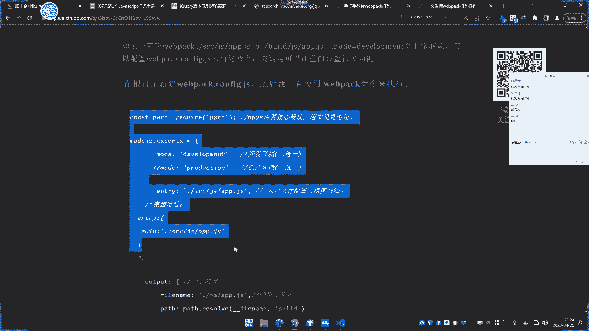
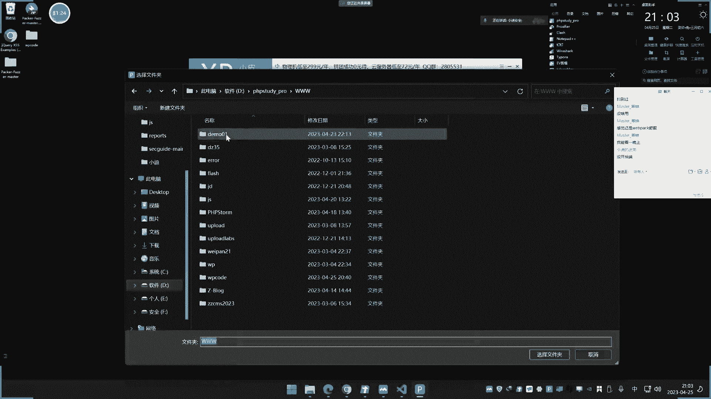
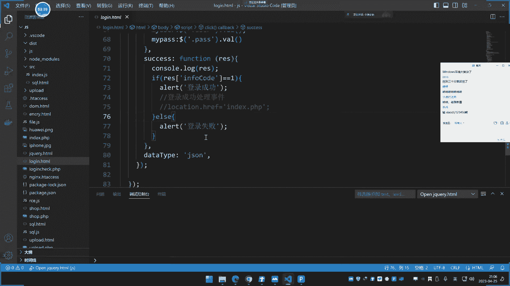

# P31：第31天：JS应用&WebPack打包器&第三方库JQuery&安装使用&安全检测 - 逆风微笑的代码狗 - BV1Mx4y1q7Ny

看今天内容啊，今天呢已经31天了，这个JS呢讲一下这个打包器和第三方库的安全，这两个呢其实属于属于这个JS开发中的一，个拓展部分，他这两个呢主要是会涉及到一，些安全的方面的问题。

所以我们把它单独拿出来讲一下，其他的呢，我们前面讲的都是关于这个JS的开发啊，这两个呢就是在JS开发里面会用到，经常会用到两个东西，一个是这个打包器web pick，还有个是这个第三方库。

我们举例的是这个接口，而这个接口呢是使用面，目前市面上份额较大的一个库啊，这两个呢是有一些安全问题的，就是你在使用不恰当和使用不当的时候，使用版本过低呢会有一些安全问题，那首先呢我们先来说第一个。

就是关于这个打包器的东西啊，先先先先先说这个第一个啊，打波奇的东西，这个one pick他是一个什么东西，什么叫打包器啊。

我们呢先来解释一下这个打包器啊，这个网上有篇文章，是关于这个打包器的一个介绍，他说是干什么的呢，那有个微信号公众文章啊，什么是web pick，他说我pk呢，它是一个模块打包器。

在web课中呢会将前端的所有资源文件呢，都当做模块处理，然后呢是生成对应资源哦，这个究竟有什么作用啊，我给大家这样去理解一下啊。

我们先要搞清楚它的应用啊，就是为什么有这个东西，它有什么作用。

然后呢我们再来说这个其他的事情啊，好我们在这里呢新建一个文件，好新建个文件夹吧，在这个文件夹在桌面新建的吧，啊就叫做这个w p code啊，然后呢我们在这里打开这个文件夹，打p code，好啊。

给大家看一下啊，那么现在呢我们来理解一下，为什么也会用到WWPICK这个东西啊，呃很讲道理啊，你看我们在这里呢可以创建这个，先创建一个目录，名字就叫SRC，好在SRC里面呢，哎这里是文件夹啊。

SRC里面呢我们创建两个文件啊，名字呢一个叫做这个，啊一点JS，然后呢再搞一个这个文件叫R点JS，那一点JS里面呢我们写上这个东西，下一个就叫这个test啊，就写这个简单代码啊，看这个logo搜了嗯。

去打赢一下这个test好，就写个东西，二点JS里面呢我们就直接写上这个test函数，那就这样写好，那么现在呢我们来给大家看一下啊，再在这里呢创建一个这个index ATM号。

在index tattem上，这里让我们来做个实验啊，好，好这里呢我们来看一下啊，我如果直接引用R点JS，我来这里呢直接引用这个二点JS，就是SRC下面的这个二点JS，用这个R点JS这个文件对吧。

那么这里呢20JS呢是调用这个test好，它能不能输入成功呢，我们来看一下啊，运行，然后我们看一下正面的一个控制台这里，那你看到他说了，Test is low defined，就是test。

那这个没有定义，所以说调用不了对吧，那需要怎么办呢，是我们这里呢就需要这么办啊，是不是还要引用这个疑点JS啊，好我想问一下大家，我把这个疑点JS呢引用了，再引用这呃，再引用这个这个这个地方。

那么大家问一下大家，这里能不能成功输入，我先问一下大家啊，能不能输入啊，这里这个地方能不会这个数，能不能执行这个这个test，这里调试这个终端，这里显示这个test可以是吧，好有人说不能。

那不论是什么原因啊，但不论是什么原因啊，你觉得我这样问就会不冷是吧对啊，有人说对了啊，那你看一下刷新，有人说冷，有时候不冷，我们刷新一下看一下啊，那还是不能，为什么允许问题，你把它写到前面才行。

因为他是先声明后调用，你要先引用这个E再了，有这个函数被声明了，or呢再调用，那这里呢它就对了是吧，你看这里就有了是吧，是这么个情况啊，好那么这是我们说的这种常规类的这种开发，对不对，那大家试想一下。

如果说有大量的这种JS文件的话，你要一个个引用，一个个引用，它是非常复杂和麻烦的，那么这个web pick呢就能解决这个事情，就是说它可以让这两个文件的代码呢，写到一个里面去。

就是把多个这种类似的JS文件的调用关系呢，把它放到一个JS，就说如果这里有多个三个四个甚至十个，我们可以把这十个呢打包成一个，那么这样子呢就更加的简洁了，所以web黑客呢他就是做这种类似事情的啊。

他就是做这种类似事情的，就说你在不需要的去引用这状态下，这是它的一个功效，第二个功效呢就是它实现了模块化，就是它的代码呢看上去那更加的规准啊，更加的规矩，便于后期的维护和开发。

这是他的一个欧佩克的一个实现，那么接下来呢我们就来演示一下，这个web pick的一个简单使用，在使用的时候某些配置会导致一些安全问题，那么我们呢就通过这个使用过程中呢，去给大家做演示啊，首先呢赛的。

那我们先给大家去演示一下，这个WEBKK的一个使用啊，那么它是分为有几步。

第一步呢是创建需要打包的文件，第二个呢是安装这个WP库，第三步呢就是这个创建这个配置文件。

最后呢运行这个打包命令嗯，在我们给到的这个文章里面呢，它是有这个大概过程的啊，这是我们要做的事情，我们在那可以写这个两个东西啊，来一点PS里面呢我们去这样写一下，好我们这里呢可以定义一个这个叫sum。

然后呢传递两个参数X和Y，然后呢在这里那就不显示了，就直接return呢返回这个X加Y，那这里呢就是说啊这个funky呢，额sum呢就是类似加法嘛，就是两个参数进行相加，好在二点P里面呢。

好我们也写上这么一个东西嗯，写上一个叫costs，然后也是SY，这里呢我们就换成个，减法，好那这里呢就是这个嗯一个二点JS呢，就这么些好，再来在这里呢去写一个这个量主函数，写个主函数啊。

主函数这里那就怎么样呢，就input来导入这个sum for来源于一点，这个是COUT来源UR，这个意思呢就是从这里呢去导入它，这个呢是不是这个这个语法呢，是这个WEBPACK识别的语法。

并不是这个node js和JS语法啊，你用node js去运行这种语法，它是没有的啊，呃road node js里面的是这个require啊，你要用打包器的话，就必须要用到这种语法。

然后呢我们现在呢对它进行一个调用啊，那我们可以进行一个这个叫console logo啊，调用这个sum，然后呢里面全参这个是相加，我就是1+2把打印，再来一个这个，哎再来个这个CONET。

哈哈这个是相减，我就2-1嘛，二杠一就传递这两个参数值嘛，他这两个就是XY嘛对吧好写这东西之后呢，你看一下啊，这是ml js，然后我在这边的去引用这个MAJS，看一下他能不能用啊，先给他看一下。

我们来运行一下这个地方啊，我看这里有没有这个信息，看一下这里控制端，然他可以看到啊，他说不能用到这个input，因为他不支持浏览器，它不识别，所以他把它进行打包之后呢，他就能识别了，那如何进行打包啊。

符号写错了呀，BGFALL写错来，哦这是2。1是吧，那这个无所谓的啦，这个也不影也不影响这个地方的一个情况啊，差点等下死的时候呢，又里面的尴尬了，哎呀是吧，还好发现的早，不然等下又翻车了，又要被骂一顿。

那那那那把进来这里呢不识别啊，这就是就是这个语法呢，不是这个男生态和log s语法，这个是web配合给web配合看的，就是说高速web配合，那他要引用这这两个东西好，那么现在我们看下如何进行打包啊。

打包的这个过程呢就是这个要创建好了，然后呢安装库这个库呢给他安装一下啊，就是NPM，N b m，啊杠I，然后呢web pick，然后web pick c r i，一般安装这两个杠D或杠机。

就是说全局安装的意思啊，把安装一下，哦这不不不杠A啊，直接开，不要杠A，打错了，小写I，安装一下啊，杠机啊，杠机都可以啊，一个是全局安装，一个是本地安装，好把它安装一下，把两个库安装一下。

好安装好了之后呢，那接下来呢我们来给大家演示一下啊。

他如何打包，打包了。

可以用命令打包，最好呢就是用这种网上教的方式，就是在这里呢创建一个这个打包的一个，配置文件，就叫web config js文件，在这里呢来配置你要打包的项目和。

打包的模式和用到的插件，它这里呢有五个点，第一点就是设置入口文件，就是你要打包哪个地方，第二个呢就是把它输出到哪个地方，第三个呢就是你用不用一些这种他说的加载器，这个加载器是什么呢。

就是说web k可能它默认只支持打包JS，如果说你要打包什么这个ATM文件呢，或者是什么CSS字源呐，就要用到一些这个加载器，这个加载器呢要自己下载，我们现在只演示打包JS啊。

这些其他东西都不是我们需要考虑的呃，插件就是这个意思啊，插件就是说一些诱惑，插件模式呢有两种模式，一个叫生产模式，一个叫开发模式，等下我们会说啊，这个模式非常重要啊。

生产模式呢和开发模式不一样的开发模式，那是给程序员自己看的，用来调试一些错误和bug的，而生产模式呢就是我们常说的就是线上模式，就是这个已经放到这个产品中，上线了，就会用到线上模式。

就是我们说的这种类似生产模式啊，就这五模式，然后呢你可以用一下它的配置文件。

那就这样的一个情况啊，就直接在人家创建一个这个文件，这个文件呢名字不能改的啊。

其他名字可以改，但这个名字不要改，这个名字不要改啊，好在这里呢我们创建嗯。

这里呢就用它一个模板啊，这模板呢是根据自己需要添加啊。

我们来给大家看一下，模板里面呢这里有个喷漆，然后这里有个路径地址啊，这个是入口，然后在模式呢你看路径那就是要打包哪里，我们就打包这个SRC下面的这个mail点JS，就是我们说的那个入口文件。

就enjoy入口嘛，好吧好，打包入口文件下面呢额下面呢就是这个输出的，那输出到哪里，我们把它输出到哪里呢，输出的名字呢我们就把它叫做APP点JS，然后路径呢就是在当前目录呢取个名字，就叫built啊。

这是路径是吧，好这里写好，然后模式这里呢我们写的是这个诶，这里怎么报错了呀，还我这里少写了一个分号啊，我把这个写到下面来吧，选下面的，少写个分号啊，他这里是一个逗号的一个意思。

好那这里呢就是这个打包这个配置呢，我们就配了好啊，这是我们要打包的文件，然后呢这是他的一个打包输出的一个文件名啊，然后输出到这个文件夹，然后以这个开发模式呢去打包好，这里配置好之后呢。

就直接可以运行一个叫NPXWEBPACK，n p x will pick啊，刚NPM那是这个安装库，NPS呢运行这个work pick直接回车，它会自动识别这个文件，以这个文件的配置呢为打包回车。

哎报了个什么错误啊，啊文件出来了，但是这里呢报了一点错误啊，我看一下啊，那这个是他打包好的一个app文件啊，那这里有了已经我看一下啊，他这里报了个什么鬼东西啊，哦我大概知道了啊。

这应该就是那个哭的一个路径安装的，问题，我们先运行一下这个app s，看他能不能加载运行啊，看看有没有问题哎，重新在这里呢，调用一下这个built下面的app js这个文件，来运行一下这个文件试一下啊。

看看结果好，这里呢不能发现模块一样哦，那就是还是打包错误了啊，唉那应该是刚才这个地方安装库的时候，那个路径不对，先把它暂停掉，3c，重新来看一下啊，这边是一个什么错误，唉这个打包，说实话。

这他妈的真是麻烦的事，打开这个项目看一下，在哪里，大家以后安装的时候，这库那个参数，全局安装那个，点点斜杠是这里问题吗，快下啊，应该不是这个问题啊，我看一下啊，11我已经感觉是库的安装的问题。

那他果然是铺的那个安装问题啊。

不是这个问题，库的安装路径的问题啊。

他这里报的是那个路径的一些错误库，安装的时候应该不要加那个，刚刚刚刚什么鬼积的好，我们用这个P1，这边的这个叫跑哪去了，对打开这个看这个啊，这个是一样的道理啊，嗯这个是那一样。

道理呢一样的那个写法没什么不一样的啊，那这个是一样的写法，然后这里呢也是那个一样的那个写法，就是路径上面有些小差异啊，这边是一样的啊，哎看这个吧，就说我换了一下名字啊，这个mail呢也是这个情况嘞。

和他刚才一样，就用两个文件名改了一下，路径呢有一些小微差异，就这个放到JS目录下面，选其他的都一样啊，没没什么太大区别，然后呢这里呢我们看一下，这里呢把它打包成这个叫build js啊。

生成的这个DST目录，这个目录都给自己取名模式呢搞成一个这个，我们先来测试一下这个开发模式，好打包一下啊，来运行一下啊，哎嗯，好这里已经打包了啊，这个就打包完成了，大家看一下啊，啊打包成功。

这里就出现DST，然后这里又出现这个了，绑定到这个点T目录，然后这里有个JS文件，对不对啊，你看这是他打包的一个JS文件代码，那么这个代码中呢，是我们采用的是这个什么JS的一个打啊。

web page打包用的是这个开发者模式，这个是开发者模式啊，这个是生产模式，开发模式打包出来的就是JS文件，大家可以看到这是开发者模式打开的，然后现在呢我们再用这个ATM文件呢去引用它呢。

去引用这个DAST下面的这个built gs，我们现在来打开一下这个ATM文件啊。

看一下啊，在这里让我们运行一下这个来看一下，你看一下现在结果啊。

空出来这里那是输出一和三呢，这个E3怎么来的呀，因为他打包的是这个main函数，这个main函数呢，是不是这里的main函数啊，然后这里co的权利二和1code，但是难于这个JS的这个文件。

那就这个文件，然后是怎么减去它的意思，所以呢就是R减一是吧，就是R减一传递的是R2121嘛，上面的就相加2+1。

所以真的就是一个等于一，一个等于三，那么输出结果就是刚才给大家看到的啊，那个结果。

对不对，那其实就是说将这三个文件呢，封装到了一个里面，就是这个built js，就其实说你原本的是这三个文件的去引用对吧，就是mail文件呢去引用这两个的，然后这两个呢一个是做相减，一个呢是做相加。

然后这个mail那就是两个的调用，所以呢他引用两个，然后呢一个做相减，一个呢做相加，上面结果呢就是一下面结果是三，那么我们如果说之前要用的话，是不是之前就是怎么个操作啊，是我们之前那种没有打包之前。

可能就是这样子的呀，没有打包之前，就肯定是这个SRC下面的这个什么，一个是萨姆，阿SAM下面的这个sum，JS下面的这个sum js好，然后呢，下面这个就是那个JS下面的这个什么court cs。

对不对，还有一个呢就是我们这个SRC下面的，JS下面的秒啊，不不他不建设，就是这个当前目录来，就说以前的话啊，这是没有打包前，就说你这样去用，对不对，就这样去写，就是这么个写法，对不对。

因为你三个都要调用，你才能把这个结果取出来，对不对，因为他呢就是说定义这个函数呢返回，但是它不显示显示，那是在mail函数显示啊，mail函数要使用这两个的话，就必须要怎么样的呢，操作两个。

所以之前是这样写的，你打包之后，那就是把这三个文件，那个功能呢给他释放到一个里面去了，然后呢就写到这个里面去了，我们就引用这个呢就能实现这个结果，所以这是打包器的，它的一个原因存在的一个可能性。

而且打包后的代码呢，大家可以看到是这么个形式，然后这个模式呢我们不管它，就是我们先了解达帕奇的作用好，我们现在呢主要来分析这个打包器和有安全的，一些影响，是哪些方面的影响啊，我们先来关注一下啊。

这个呢是采用的是叫开发者模式，我们来观察一下，这里呢我们把调试这个ATM文件的时候，去引用这个JS的时候，我们看下这里啊，看下它开发者模式，结果呢是能够输出第一个运行结果为一，就是R减一。

第二个结果是R加一，好输出了，然后我看一下资源文件里面，资源文件里面看一下啊，开发者模式我们打开看一下，那他是有这个DT这里引用这个文件，打开看一下，这里的这个代码，和我们这个代码是不是一致的呀。

那是一致的啊，我就不对比了，它是一致的是吧，一致的，然后这里呢还有下面你看在引用的路径内，三个文件也有，你看是不是就是我刚才的打包的，就这个的文件由这三个文件打包的来的嘛，就是打包的VR文件。

WEM文件引用这两个，所以就是三个文件构成的，就这个文件呢由这三个文件构成，然后你看三个文件构成里面代码呢，这个是那个里面代码，这个呢是里面代码mail里面的，这个是不是差不多的代码呀。

嗯所以说在开发者模式下面的话，他是信息是很全的，能从这个前端这边呢，能看到关于这个整个的一个逻辑关系，并且源代码那他都是能够看到的好，那么现在我们来关注一下啊，我把这个打包后的文件把它删掉。

重新再来看一下这个WEBKK，把它修改成生产者模式之后看一下啊，现在我们来对比一下，这个生产者模式之后的一个情况，重新打包，换到这个生产模式，打包好，打包成功了，我们先来关注下这个文件，看到没。

这个文件和刚才文件出现了不一样的地方，这个文件就是什么代码很短好，当我们去再去访问那个页面的时候，刷新先看这个控制端，这边还是能正常显示一和三，看正面变成了一个什么，那就只有这个东西了，这个东西是什么。

结果为一，结果为三，啥情况，就是他的这个代码，那就这个JS文件呢，就这个东西了啊，他就有这个东西了，所以说呢其实呢就是说这两个一对比，大家就能知道了啊，而且大家有没有关注到。

你看这个下面这边呢刚才这个开发者呃，开发者模式下面还有个那个啧圆的那个信息，但这里呢用这个生产者模式之后呢，只能看到这个包含这个JS了，像刚才我们还是能看到这几个的浏览器里面。

是能看到这几个的一些相关代码呀，但是这个生产模式就没有了，而且大家可以看到它的一个显示的，这个JS的代码呢，就是吧大家可以看一下啊，放大一点就已经和我们那个东西不一，太不是一个逻辑了啊。

正常来讲的话，我们正常说应该就是显示这种情况是吧，这是对的呀，就说我至少能看到这两个东西呀。

但是它直接就是什么个情况呢，就直接把结果给你写出来，其实就是说他已经把它运算的结果显示出来了，这是它的结果，并不是它的过程，所以说啊这是他的底点，那么大家这一点呢其实就是说在打包的时候。

如果呢你在配置不当，把这个结果在打包的时候呢，选择的是这种开发者模式的话，那就会造成一些源码泄漏，为什么这样说呢，因为我再给他试一下，我回过来再看这个开发者模式，我再重新打包，大家看一下啊。

我们再重新打包，重新打包之后，我们再来关注一下，刷新一下刚才那个页面。

结果你看这是开发者模式，你看他是有这个整个逻辑啊，这是不是就是我打包的三个文件的一个关系啊，打包VR my mail里面叫这两个嘛，这不就是三个文件逻辑啊，而且三个文件里面的那个代码。

是和我们的代码一致的嘛，你看你是吧，代码已知的都是用到了console，然后呢后面是这个RERE，然后这个default来源于什么，上面写的嘛，那调用的是这个SC，这个这个这个地方和这个地方。

所以代码呢基本上是唯一的，就是相相当于就是和之前那个代码的一致，就和我们打包之前，这里这三个文件代码的一致内，对不对，而且是能看到没有问题啊，包括这里呢也是一样的，这是他打包代码也非常多嘶。

其实呢它下面呢就是对这个JS文件进行的，这个work pk呢，下面有这个东西，这是两个模式所造成的。

那大家会问啊，他第一个安全问题就是说的源码的泄漏问题。

源码的泄漏问题，那么现在问题呢，一种就是由模式选择上面的一个，打包的一个错误导致的，就是有些人呢啊明明应该是正常来讲的话，就是说放到线上去用的时候啊，我们用这个生产模式的话。

哎他就能把这个源码呢封装好一些，就不能看到一些真实的这个解释是啊，解释性代码就看到是这个解释后的结果对吧，但如果说你把开发模式去打包的话，那么就能看到整个逻辑这个生产模式呢。

那有没有这个网站有这种东西呢，我如果说搞个小网站还没有什么说服力。

大家看一下啊，一个VUE1开发的这个网站，它在WEBPACK打包的时候就不小心呢，用到这种我们说的这种开发者模式上线，导致了他整个VU1的这些源码的泄漏，我们前期在上节课讲的时候。

大家不知道还有没有影响，上节课我们在讲node js呢提过一句话啊，包括这个log s非于yes，这个意思啊，就是他们和那个传统的这种原生态的JS呢，有点不太一样，不一样，就是什么呢，就low js呢。

它是服务端语言，我们当时还说过一个对比，就是说这种语言呢，他是没有在黑盒中是没有代码的，这是我们上节课商过给他提到一句话。

就说你用JS开发出来的网站应用呢，在网站那一边呢是看不到这个源代码的，这是我们当时说过的啊，因为他是一个服务端的一个JS。

我们原生态呢是可以看到的，所以这个V1呢也是这个意思啊，V1也是这个情况，他也看不到，但是如果说你用到这个WEBPER去打包的时候，这个模式上面选择错误呢。

就会造成源码泄露，能不能理解，就像我刚才说的这个这个情况一样的，我在打包的时候呢，把这个东西打包了，结果你看选择错了模式，对啊，三个文件的代码都出来了，这不就是源码泄露了吗，这是它整个的逻辑啊。

能理解吧，如果他选择这个模式，你能看到这个这个什么。

能看到这个东西吗，这是我们写的函数啊，这里面的核心代码呀，能不能理解这个理解之后呢，我们就看实例啊，不能理解我就给他再说一下啊，能理解是吧，湖南话，大家回想一下啊。

上节课我们讲到这个load js的时候啊，是不是就是这个low呃。

呃我可以再给他看一下，我怕有些人忘记了哎。

呃NO js我们说过他和他原生态的不一样。

嗯大家看一下啊，这是之前这个load js的一些东西啊，我看下这个low js之前写的吧，这个是用那个，之前用这个low low js写的这个circle，猪的一个测试页面码是吧。

这是当时写的这个这个这个这个文件，然后呢我们当时也跟他说过，这是他源代码，我们把它运行起来是吧，用LOL去运行这个SQL点JS，用完之后呢，这里呢就是他的网站源码，网站的一个端口也要起1。0。01。

3000端口，好的吧，这是我们那样写的啊。

然后呢，我们之前呢原生态开发是能够看到整个逻辑的，这是在原生代码是吧。

那包括你像现在我们这个源代码能看到吗，那你包括这里我们加了JS文件，看一下呢索引，那就是这个地址，他也是用的原名写的，这里面的代码他能看到吗，看不到，他只看到了这里加载了一个一个ATM文件。

他没有看到其他文件，就我运行的是这个文件，它只加载这个SQL点ATM看到了这里面的核心代码，他是看不到的，服务端的一个情况啊，在里面源代码。

那你看一下这看不到的啊，那只看到这个ATM的一个文件代码什么。

其他都看不到了，就这个路JS代码他是看不到的，主要是三节课锁骨的啊，但是前期我们在讲这个非这种路JS开发的，就像我们前面写的这种AJX的那个请求，AGX请求是在这个地方是吧，就像这个这个ATM文件。

那这也是JS代码嘛，但这种呢是原生态的，不是用node js的语法。

你看这个呢他就能看到整个逻辑啊，这J3码呢它是怎么样就怎么样的是吧。

这是上节课我们说的一个特例，那么今天这个WPICK呢，也是会有这个源码泄不泄露。

能不能看到的情况的意思。

那么他的这个决定因素呢，就是我说的在用这个WEI来打包的时候呢，他的模式上面的一个错误选择，导致可能会把它本身不显示的源码显示了，嘶能理解了吧，嗯原生态的默认就显示弄node node js呢不显示。

但是呢你如果是用WIFI，可能打包node js或打包飞EV的项目，在配置不好模式之后呢，会把它的源码造成泄漏，那么简单一句话呢，我们可以把它归类到这里来写一下啊，首先燃生态的这种原生态。

就是说不使用任何框架，也不使用任何技术开发的这个JS啊，应用他是会直接这个显示它，因为是前端语言啊，他直接呢显示这个这个源代码的是吧，然后呢这个low的JS呢上节课讲的啊。

那么它呢由于是这个服务端的一个语言，它默认呢就是不显示这个，对吧嗯，我们现在呢说了这个web pick这个打包器啊，他这里呢就是很简单啊，这个打包模式，选择这个开发者模式，哦啊会这个招成呀。

这个源码泄露嗯，是这个意思啊，就主要是三点啊，这是我们三节课上了三点，包括导入模式的针对目标呢这个node js开发的呀，VUE1的都会啊，这只要你是用它打包的，不管你是什么东西，他都会泄露。

那么为什么打包我刚才也说了啊，他打包是便于后期的开发和维护，所以他会用到它，如果说他不用到WEBPICK，那是另俗啊，好那么现在我们看一下实例，有没有这种实例呢，有这种情况发生呢，大家看一下啊。

来我们举例子啊，顺丰的一个熟人的一个登陆的，好春风的这个熟人的这个登录地址。

那这是顺丰的这个官方平台，他这里有个登录是吧，你看啊这个顺丰的。

另外他这里呢我们看一下，检查一下，来看一下这个源代码。

这里啊，呃我们可以先用这个谷歌查简单来识别一下，看是不是这个情况呢，它的识别基数里面看到啊，用到是非U1的开发杂项里面有用到WEBPICK，非鱼的我没有讲，但是呢它和load js呢是差不多的一个东西。

你看他这里用到V1的，这里要用到WPICK，我们今天刚讲work pick这个WEPER既然用到了，说明他用过打包。

那么大家看一下啊，我们刚才做实验了啊，我们去刷新这个网站的时候，大家可以看一下啊，在这个地方我们看到啊，在这里呢可以看到呢，这里是一个WPICK，那咱引用了JS文件这些路径，那这引用JS文件。

这是他打包好的JS文件，这是他打包的JS文件啊，这是打包的JS文件的这个路径地址，然后在web page里面他把解析出来了，我们再看web page里面啊是什么东西，大家看着啊，来VUE1的代码。

那login负责登录的，还有这个什么API的一些接口，包括这里的一些CONFIG配置的一些信息，再看这里啊，还有没有些其他的啊，这个是cooking处理的，应该是看这个里面的哦，这里面多啊。

来component里面，那这里有什么一些其他的啊，我看一下能不能你看一下，翻这个下面呢，还有一些这个你比如说负责登录的是吧，找一下这里面有的登录的model，那这登录的那登录成功的一个情况。

和这个登录的情况，打开看，那这个就应该是呢触发的地址呢，导入模块嘶支付是圆通登录，包括这里的这个，但NO成功的这个地方，啊登录成功的一个地址，这个是登录的，这是登录的视图，这边应该是登录的那个界面。

登录成功的，这个是登录的，嗯这个路径啊，这是住在这里，应该是忘记密码啊，登录两个登录，请输入这个手机号啊，你可以看一下啦，那密码登录和验证码登录，这不就是这里的意思嘛，呢验证码登录和密码登录。

那其实这个呢这个叫阿attack login，就是用户登录的一个VUE1，这个呢是采用VUEE开发的一个JS项目，就是他这个登录这里呢是采用VUE1开发的，然后这个是A1的语法。

然后这里的密码登录和这个验证码登录，就这个界面，也就是说这个界面，这个功能呢就是用这个VU来负责，我们就看到他整个逻辑是吧，这是代码是吧，提交之后呢，请输入什么邮箱，是否支持人获取验证码呀等等额是吧。

这里还有个password login登录，就是密码登录的的一些情况，那包括这里呢点击密码登录按钮的触发事件，还有像像上面呢还有一些各种各样的，那其实就说你做到这里呢。

就说他这个等个登录的一个JS的逻辑呢，你都都能看到了，你就知道他是怎么在登录中经过哪些地方对吧，都能看到，你看这里呢还找到了一些这种设备的，一些旧账号和什么旧密码，这些东西你看看。

啊这应该是一个设备的获取，你这个东西是什么鬼，啊密码输入按回车时出发，看什么鬼啊，一大堆啊，其实就是说啊这个网站呢就是用到了WEBPICK，在打包的时候用到了一个开发者模式。

导致这个VUE1的整个代码逻辑，和代码文件泄露，就说原本的话它是用非语E开发的话，你用的这个WEBPAGE的打包，用生产者啊，用这个生产模式去打包的话，他是不会有这些东西出来的。

就是他不会有这些东西出来的，他就不会有这个东西呢，就不会有这个东西，它有的只是啥呢，有的就是这个网站上面加载JS文件，就像这里泄露出来的，就像这种啊，他只会有这种东西出来。

就是他用WEBPAGE打包好的这种代码，这个代码就是完全我们都看不到是啥，就是他全部写好了，就是它的结果，就像我刚才测试我那个一样，就直接把这个结果显示上面去了，这里呢就看到是这个东西就把它封装好了。

意思就是把它封装好了，而你呢这里源码泄露之后呢，你就看它本身的代码逻辑了，它本身代码逻辑是这个情况，那如果你想象一下，在这里如果说有些那种配置性文件，他如果在这里配置的不就泄露一些吗，就很简单的道理。

就像我们之前在做这个这种SQL文件一样啊，就像这种代码啊，这里额写的这个诶文件跑哪去了，那这就是这种啊，这是我用这个呃，LOLJS呢写了一个数据库的连接操作，就像这种本身代码。

这里是不是还有这种账号密码在里面啊，那如果说我把这个项目呢，用这个我配格来把打包，原本呢这个代码呢是不会被知道的，哎结果呢我换成了一个开发者模式，哎他把这个代码呢给泄露了。

那这里呢不就泄露一些这种信息出来了吗，所以说呢他就会造成这个源码泄露，这个源码泄露造成的问题，就是一些敏感的信息泄露，包括整个代码逻辑，就更能方便于我们对这个网站的了解，和它的架构了解。

方便于在里面去翻敏感信息，翻接口去测试一些什么未授权啊，或者说它上面有些功能的一些这种代码性，那至于怎么测，这是我们后面在讲到单独的JS的，这个安全课程的时候呢，我们教大家的一些测法啊。

就是关于JS的常见漏洞测法。

而且呢这里呢我们前期在信息收集的时候呢，给大家讲过一个项目，就是这个叫wo pick，这个一个测试项目是哪个项目呢，叫做，park f u z z这个项目呢。

我们可以看一下他的大概介绍，你看他的介绍是不是就和我们描述的是一致的。

他说的很清楚，这是一款针对WPICK等前端打包工具所构造的，网速快速和高效漏洞检测工具原理是什么呢，他说的原理是这样的啊，你在日常测试中呢会发现，以web配合的打包器为代表的网站。

这类网站呢会整将整个API的和API的一些，结果呢啊，然后呢一起打包，然后呢供这个调用，但是我们往往手工测试呢会极大的不变，代码量呢特别大，这个时候呢他就通过这个WPER呢。

从这个项目呢来从里面去提取一些啊，这个网站地址啊，API接口啊，然后呢去测试一些这种未授权的SQL注入啊，等等等等一些这个信息录对吧，这是他工具的一个介绍，所以说呢这只是说测试的一种工具啊。

更多的话我们还需要用手工的来进行验证。

那么如何验证呢，啊现在呢我们不是讲这些啊，我们只是从这个开发角度呢给大家演示一下，这个pk，让大家熟悉一下，这是个什么东西啊，以后碰到了是吧，他有哪些安全的一些隐患，就包括我们今天介绍的模式的选择。

部队造成了源码泄露，如果没有造成源码泄露。

也可以用一些相关工具呢去调试它，这个JS就是说如果没有下面这个代码的话，你也可以上面这种代码，这种代码呢也能看到一些信息，只是说这种分析下来就更加复杂一些了，能理解吧，这样分析就更加复杂一些了啊。

好这个就是WEBPER的一个课程啊，啊那么现在上到这里之后呢。

大家可以反过来想一想啊，我们介绍到了这个原生开发，介绍loader js开发，然后介绍这个OPEC，大家想象一下，这三个呢都有不同之处，虽然说他们都属于JAVASCRIPT的语言的一个分支。

原生开发呢就是不借助任何东西，自己呢纯用JS代码的去写，low js呢啊就是一个新的东西啊，在他们去开发代码呢更加的快捷安全，然后呢是吧，它也会有一些自己写法上面的安全隐患啊，包括这里也是一样。

那么这个打包器呢它是属于什么，属于这个语言的一个类似的一种辅助类的工具，可以这样去理解它，就好像我们电脑上面呢去用来，去编辑文件的时候啊，编辑记事本本身，电脑上面有这个记事本呢能够去写一些文字。

但是我们呢啊就不一样，我们要喜欢用一下什么notepad加加呀，或者这种SUB呀这种编辑器啊，然后呢打开用tan之后呢，那就会享受它的边界，也会享受它所带来的安全问题嘛，那个打包器呢就这个意思嘛。

啊你在有使用这个打包器呢，享受它的边界的时候呢，那么如果你稍有不深的话是吧，这个打包器上面的配置不当，或等等一些操作原因呢，这可能会把那些本不该处有的安全问题呢出现，那这是他第一安全问题。

还有个安全问题，就是说在第三方库，我们PPT里面呢也有第三方插件，就像什么pp里面用到的编辑器啊，编辑呢是别人提供的，用别人的提供的编辑呢，来实现这个编辑的功能操作，那么在JS里面呢也是有第三方库。

我们前面呢在原生开发的时候呢。

用到过JK，大家还有没有印象啊。

那么现在呢我们来看一下JQUERY的一个操作啊。

那这里呢首先给看一下文章啊，我们先来了解一下，为什么讲它这是后面，那马上在web漏洞中，要给它体现的ZS的这一块的一些安全问题，那JSKY的一个框架库，这里说的框架库呢有些十元素框架，你不说框架也行。

他就是一个库，经常我们用一些扫描工具扫了一些漏洞之后呢，它会包出一个漏洞，他说下一个script代码漏洞，这啥意思呢，然后呢其实呢就是你在这个JAVASCRIPT的啊。

这个JAVASCRIPT的这个是干嘛的啊，我们先解释一下啊，这个库是干嘛的，就这库里有各种各样的类型啊，包括打包器也不只说只有WPICK，只说web pick呢用的比较多，我们拿来讲。

包括这个接口也是一样，网上还有其他库，他是干嘛的呢，前期我们演示过，它主要就是封装好了很多常见的JAVASCRIPT代码，然后呢，你用这些代码呢能够去优化你的这个显示。

包括我们可以用它来去处理这些文本啊，进行这个AGX的一些操作，这都是它的特点，所以呢我们当时在去写这个代码的时候。

大家应该还有印象啊，那像这个。

那这是我们原生态那个logo js嘛，我们把它运行起来。

对吧这种原生态JS，然后呢代码呢也能看到这里引用了一个J块，1。1。24点JS文件，是不是引用这个文件，引用这个文件之后呢，你才能用到这个语法AGX，因为这个语法呢就是来源这个文件是吧。

我们这边可以设置一下了。

艾德米123456，这我们前期上过了啊，点登录嗯，这没反应啊，哦我这里有个login，你pp呃。

哦我那个网站没有把它启动起来啊，要把那个pp study给启动起来才能用啊。

这个不管他了啊，因为这个这个pp他也是用这个pp验证的啊。

不管他呃，我们现在呢就说这里的用到这个操作的时候呢。

是要用到这个地方的啊，用到这个地方的用这个东西之后呢，他才能正常请求啊，啊这个我没有开啊，所以他请求这里呢就没有成功啊，没有那个登录成功那个跳转啊，我们还是启动一下吧。

把这个流程给他走一遍啊，怕有些人呢这个听不懂，把这个启动一下吧。

嗯是这个项目是哪个目录，下面的是这个。

demo吧。

demo下面的，然后是这个J下面的。

好我们来访问一下啊，好我们看一下啊。

这个是之前我们写的那个操作是吧，那他登录失败，因为这个密码错了吧，对密码错了。

他就登录失败，他有个提示，他的正确密码呢是这个小零和1356，我们输的不是这个小迪吗，我输精确的是吧，点登录，嗯这又哪里不对啊，妈的，前面写的项目怎么还给我搞出这些问题来了呀，哦我把这个哎呀。

这个不是我们操心，重要啊，这种前期饮血好带吧，这哪里有小问题，懒得检查了啊，这不重要。

不要老说翻车，翻个毛啊，翻屁啊，这里面前期的讲过东西，翻什么车呀，我真是你妹的无语了，那也是翻车，这也是翻车。

我都懒得修改，这不是我们现在讲的这个支点啊，我是说拿说把这个解释下。

登录失败有提示啊，登录成功还没有提示，这还真是巧事了，应该是我那个这个逻辑上面没有把它返回gold，gold等于。

好不管他了啊，我们来看这里啊，这个是我们前期做的那个实验啊，那刚才呢我们说到了一点啊，他能去请求的时候。

那就这个代码呢他应引用了这个什么JS文件，才引用这个后面这个代码，就说如果我把这行把它去掉啊，你看啊，我把这行去掉，我刚才还有这个验证四掰这个操作。

现在我去掉之后啊，我们看下这里啊，来他直接报错了。

他说呢这个什么is low default，啥情况，就这个东西现在他是不是报错了呢，在62行，第三个，这是62行嘛。

第三个就这个嘛，是不是这个代码报错了，然后你再怎么输它都不会什么提示错误了。

点都点不上去了，什么原因，因为其实就是说这个下面这个代码呢，是由这个JS里面内置的，所以这是我们引用它的原因，这是我们说这个J块的作用，就是他帮我封装了这种啊功能型代码写进去。

我就按照这个相当说封装了一些函数里面去，我们用这些东西呢去实现这个登录请求，然后判断这个账密码是这个情况吗，对不对好，但是这个应用这个JS文件呢，它本身是存在安全问题的，就算你引用了外部的这种JS文件。

它是存在安全问题的。

那么有哪些安全问题呢，我们来看一下啊，那当我们去在做分析的时候，如果你有发现对方已有这种类似的，第三方那种JS文件的话，那么有些扫描其实是能扫到，扫到之后再去验证。

那么我们可以看一下啊，我们可以随便呢拿一下这种类似的这种结块的，这种东西拿出来试一下啊，你比如说像这个1。62的的说这个语法了，哪个呢，引用过1JK1。62点JS文件啊，国家国国内的。

那这里呢我们可以打开这个地址。

我给你看一下啊，他这个网站里面呢，可以根据他的这个浏览器信息，刷新它的加载介绍里面，你看它不是加载了呀，JQU1。62点JS文件，然后你看下信息是吧，这是那个接口来的信息，那就和我们用的差不多嘛。

对不对啊，这里呢很多啊很多啊。

那个很多这种地方都引过，就说这里呢他引用过这个接口，那么如果说这个接口1。62呢，有安全问题的话，那么他引用这个JS的话。

稍有些字不当的话，就会有这个安全问题，那么现在呢我们来做个实验。

首先在这里让我们看一下啊，在JK2020年包裹漏洞就可以，版本引擎漏洞，这个漏洞呢不是像我们后端语言，什么pp那些语言的什么造成什么命令啊，代码执行啊，它不会像那种啊，他一般引用的都都是一些差SS居多。

那引起的呢印象版本是JK大于等于1。0，三小于3。50，那么这个JQU的目前的这个版本有哪一些呢。

版本呢你可以去他的官网地址看啊，OK搜一下啊。

哎错了，那这是他的目前的最新版本是3。6。4，那然后呢这是他的历史版本啊，这在历史版本对吧好，这是他的一个大概介绍啊，那这个漏洞呢是2。0，你记得是3。5到1。03这个版本区间。

那其实影响版本还比较多的啊，但是说从这里的到最下面基本都有影响，这是一个2020年包的一个XSS漏洞，好了，下面呢他有个演示，有个这个演示啊，那这个演示是什么情况啊，我先给大家看一下这个演示代码。

啊这个是他代码，我们来打开看一下。

嗯这是代码啊，啊这是他的一个代码，我们看一下啊，这个代码中呢那应用过一个JS文件，这个介入时间是3。4。1的JS文件。

然后这里呢我放到是用的是网上的公共资源，就是这里我们看到啊，不是说引用本地的啊，这个引用本地应用网址都可以，本地就你自己下载到你的服务器上面，而不远程的就是对方提供的，你看这个3。

41的还是有这个提供的啊，那两个地址都有啊，这个在官网地址我们就用这个嘛，那就可以下载下来。

然后呢放在本地的路径里面去引用也行啊，都可以啊，他引用这个远程那个3。41了，然后呢下面呢是它的一个写法，然后这个是触发一个XSS好。

我们先给大家看一下啊，是一个什么情况，我们先打开给他看一下，那点击这个来触发XSS弹出一出发了出发了，他怎你可能说这是一个什么情况呢，这是个什么情况呢，是这样的啊，呼，是这样的啊，我们来看一下这个文章。

这个有点难理解，很多人没有讲过这个支点，因为第一个是他不是很重要，因为它漏洞不是很高危，但是作为一个研究漏洞的人讲的话。

这个东西呢你需要了解它，需要了解这个整个逻辑他是一个什么情况啊。

来我们来现在看一下啊。

我们来看一下他引用的这个包，就这个页面是引用的是3。41这个包对吧。

然后他的这个情况是什么情况造成的啊。

我们看下代码逻辑啊，好这是它的触发函数，那这是刚才写的POC，我们触发的是哪个按钮啊，触发的是这个叫这个按钮，按钮触发之后呢会触发一个特斯函数事件，test1和初test1呢就上面定义的函数特色一。

就算这个为一，这个为一出，如果这里设置了JW是吧，就是这里为出，它就会触发一个寻找这里面的div，并把它进行一个打印，这个大家还熟不熟悉，就是那个DOM操作嘛，在DOM去取里面的值来操作的。

DMM那个我们原生态JS开发第20课时候是吧，把这里面的进行渲染，渲染渲染这个这个这个变量值，这个变量呢是从这里取POC的，那么你看POCE取PU是一呢，它点的话这全称是一，那就是PP是一取。

这里把这里面的值，就是把这里面的数据替换这个div，这里替换这个DF。

这里意思就是很清楚啊，就是说你点击这个按钮之后呢，它就会触发特斯移和初，他就会触发这个特色移和出，特色移和出呢就这里啊，那么它就会替换这个div里面的值，div呢是在下面，那默认这里为空。

当我们点击这个时候呢，你看这里就变了，这里就变了啊，嗯那边的成一了，那这个代码就出来了，那代码是从哪来的呢，就是从这个地方呢，style style imagine yy这个地方来的。

那你可能会说这不是一个QUON代码吗，那我点这个和触发这个框代码，有什么不同之处呢，有什么不同之处呢，大家可以看一下啊，这个代码我写上去的时候，我刷新这个页面的时候，他有没有弹窗啊。

代码呢这个弹窗代码image src yy on new的，这是JS的一个弹窗代码，为什么我在这里显示它不弹窗，因为很简单，你写到的是这个XMP这里录进去了，这个代码写到这里他是不执行的。

但是我点了这个之后呢，把它放到这个DF这里，那他执行了，但是你又会问了，那这和这个JK这个版本有什么关系呢，好像没关系啊，那无非就是说把这个代码放到这里就能执行呀。

好那么大家既然是这个问题，我们现在换一个JS文件引用，看着啊，我把上面这个JS删完了，给他拿出来，这个是引用3。51的一个JS文件，也是实现同样的功能。

我们看一下它啊，看它呐。

现在我们重新换了一下这个文件。

变成了3。51了，那么依次再去触发，这里点了之后有没有反应呢，没有反应不会弹窗，那点了之后没有不会弹窗，而且我再观察一下，点了这个之后，那个DFA有没有被替换，确保一下代码是功能是完整的，你看DF这里。

那他写进去了，但这里为什么没有弹窗啊。

大家可以关注一下这个下面代码啊，来我把它写出来，他点哪里。

那就会触发这个地方嘛，把它拿出来啊，那这个是3。5。1的一个代码，点了那个之后，下面代码变成这样子了啊，好我们再来看三点司仪的这个版本代码。

好再把这个恢复出来，再不应用这个。

3。4移的啊，按sin s1的重新刷新，你看sin s1的点这里弹窗了，好我们观察一下这个代码，把它复制出来。

这个上面不要大家看一下有什么不同啊，来是不是在自动帮你把它，自动多了一个这个东西啊，并且这里还出现一些呢，后后面冒号都帮你加上去了，啥情况，我本身的这是我本身的，他会把这个下面只把它写到DF。

这是本身的值啊，这是原本的值啊，就是本身我们要这个仅DI的操作啊，嗯就是本身本身第二步的一个操作，就是这个值啊，而这个3。51他是正确的做了这个事情，但3。41怎么变变的东西呢，怎么就结果就不一样了。

你看结果就不一样了呢，这个呢你要可以看一下类似文章，其实就是说呀你在进行多么操作时候，多么操作呢。

在引用的时候，我们前期做多么操作的时候，那个代码大家还有没有印象啊，那做DOM操作的时候，这是我们进行DOM操作的时候啊。

啊这里能用到这种东西呢，去操作多么操作嘛是吧，那么如果说这个值能够可空的话，就会造成XSS，而且这个版本呢符合，就可以造成XS这个条件有点苛刻啊，就是版本符合，并且这个地方的值能够可控。

那如果说我们利用漏洞的话呢，啊利用漏洞的话，原因就是说版本复刻，并且这个这个下面这个值呢，这个地方的值啊可控，就可以造成这个XSS，那大家又会问到一个问题了，那你这个地方可空了之后。

我就不直接版版本符合，我直接让他执行JS语句不是一样的吗，是又有个关系了啊，这里有点绕很绕，我很难的去说讲清楚呃，我们有一个参考文章啊，我们要基于它的逻辑，就是说这个JQU呢。

它里面那它有内置的这个过滤的啊，他是有内置的过滤的，就是不是说你写上去就能执行执行执行的啊，它有类似的过滤的。

我们给看一下文章啊。

那我直接给他看一下，搜一下，给他删去，安排一下文章。

那你看一下这文章啊，来DMMXS的CV1的一些编号小于一叉版本，小于1。2的接口漏洞复现啊，他浮现出来了，好我看一下啊，他说了都用原理，1。61版本的接口代码真则为什么，这个是什么东西啊。

这个是它的内置过滤，就是你如果用到这个接口这个库的时候，你在传参值的时候，它会有一些内置的过滤，就导致一些XS实在无法产生，知道吧，他会有些内置过滤，就每个版本都有些内置过滤。

只是说每个版本在更新这个过滤规则。

所以说不是说你这里这个职能传进去，就能一定能造成XSS的。

因为他自己这个用到这个库里面，他有他自己哭的一个内置过滤，就说如果你用到这个库，并且用到库里面呢，这种接收值之后呢，你传递一些值呢，它会有一些过滤的，除了他本身过滤，我们还要自己写过滤。

这样子呢他才能安全啊，包括这里呢你可以看到下面还有一些其他漏洞，来JK的这个东西的漏洞，CV20181些文件上传，那他这个呢是另外画的啊，这是他另外写的一些功能，这个很少见啊。

主要就是我们一般用这个接口呢，就是用这个引用库之后呢，他的一些情况呃，大家可以看一下这个文章的一个情况啊。

就是说就是因为他用到了这一个。

用到这个3。41这个版本漏洞版本，这个漏洞版本呢包出过CV1的这个漏洞。

然后呢他在做这个增长，页面的一个替换的时候，就是一个DOM的一个替换，就是要改变这个DF的值的时候，然后呢改变的值这里啊是写了一个夸张代码，在这里写了扩展代码，在这里如果使用正确的版本，就不会造成扩展。

使用了这个漏洞版本就会造成夸赞。

这是刚才演示那个情况来再来给大家看一下，现在呢引用的是哪个版本呀，现在我们引用的是，3。41版本，然后呢将这个我们要替换的值，替换到这个下面div这里，点击替换的时候触发替换div。

这里呢就成功的把这个值写到这个div，这个标签里面去了，做DIO就说业务功能的时候触发这个第二幕，触发这来了，然后呢这里触发夸赞，对不对，那是这个版本，那三个都能触发，三个都能触发，没有问题。

那一个个去替换替换这里面的值，这个是替换这个值，这个是替换这个值，这个替换这个值，把这个值呢写到这个div标签里面去。

然后呢触发扩展，对不对，好，这是这个版本，那么一旦呢我们把这里呢换一个应用版本，来实现这个功能，把这个替换掉保存一下。

然后重新再来确定，现在我们检查一下刷新页面。

它的一个版本为3。51了，代码不编，只是换了一下替换文件，我们重新对他进行替换，点了一下，点了一下没反应，点了一下没反应，点了一下没反应，啥反应都没有，并不是说功能没有实现。

因为DFA这里大家可以看到他一直在改变，一直在改变，一直在改变，替换这个了，第三个了，都替换了，都不弹窗，因为他引用到了更安全的这个代码逻辑，所以这里没有出现XSS漏洞，这个比较鸡肋。

这种漏洞呢不是很常见，但是有时候呢是没办法的时候呢。

可以使用一下的，呃，包括这里呢有篇文章大家可以看一下啊。

这文章呢就是说用到扫描工具呢，扫到一些网站应用的JS框架里面有这个漏洞，有了之后呢，啊他就随便在哪个网站上面找了一下，有个网站引用那个1。22的一个版本，然后呢大家看一下啊，在1。

2版本的这个引用这个网站上面，调试框里面输入了一个这个payload，直接这里呢就弹窗了，就说明这里呢他的JS呢没有过滤这种语法，所以你直接用这个JAVASCRIPT语句就能触发这个弹窗，这这篇文章啊。

那同样道理啊，你也是一样的道理，他这个呢是1。2的一个版本，包括上面呢他还教了一些这个，如何确定这个版本是否有漏洞，但这个呢不是我们现在要知道的，这后面我们会讲会详细讲这个漏洞利用啊，就讲这个漏洞利用。

我们现在只要知道的，就是说在开发中。

你应用的这种类似JJK库的时候，这个版本呢如果说不是最新版，用那些老版本就会有一些安全问题，但这安全问题呢说实话啊，利用起来是比较困难的，但是呢他会有这种隐患啊，他会有这种隐患，这只是给大家说一下。

这个代码分析方面的一些知识点啊，他大部分漏洞都是XSS，这个XS漏洞也不是很重要的一些漏洞啊，没办法的时候，那一些报告你们需要这样写，了解一下就可以，这个呢不是很重要的点啊，他不会和一些高危漏洞相关。

好这个就是我们说的这个哭方面的安全问题啊，也就是说在JS中呢除了用到的打包器，有做文章的地方之外，这个库上面的也有用做文章的是吧，然后呢，再就是你本身的一些框架和来生态的一些，开发代码上面的事情了。

好这个就是我们说的这个今天的支点啊，这个打包器和第三方库的一些情况，你像我们上过的这个pp也好，还有这个JS也好，或者说java也好啊，这个在后面web漏洞呢我们会它和它一一对应。

就是我们讲过这些开发呢，就会说这个语言上面的常见漏洞对吧，那么有了我们这个开发上面的基础之外呢，我们就知道了啊，这个漏洞产生的地方，它有哪些厂家安全问题，那商科那就会好伤很多，不然的话你到时候商科的话。

你像这种借款的库的安全问题是吧，是什么情况造成的，是属于哪个东西啊，很多网站都用到这种库啊，只要是涉涉及到这种前端上面的一些样式设计，就会用到这个库，那用了这个库呢就会有这安全问题。

但这个安全问题有很多，但是利用起来非常麻烦啊。

他需要满足一些特定条件，所以也不是说很有用啊。

很鸡肋的一个东西啊，伤他呢就是给他提个醒啊，你懂不懂，其实关系也不大，好今天支点呢就这么多啊，然后下节课呢我们下节课的话可能还有讲啊，嗯可能是上这个JS的这个V1啊，或者是其他的啊。

就最后一讲JS的一些情况，讲完之后呢，JS就没了啊，我们就要讲java了，哎看看有没有课啊，我看一下这个框架上面什么VV啊，那些东西有没有些东西要讲啊，如果说有讲的讲一下，不过要讲的话。

安全问题可可能就讲不了很多了，大部分都是只是讲他的一些，使用啊就是大家熟悉一下这个框架的一个架构，和它一些模型，方便大家以后在做代码分析的时候呢，分析一下，主要有这个作用，那至于说是找不找到漏洞呢。

那就听天由命了啊，他因为他这个本身语言也没什么安全问题，都是些写法，上面还在等什么一些逻辑上面的问题，就是不像上面那有一些这种是吧，写这种UR呀，啊UR的一些逻辑上面判断有问题呢，所造成的安全问题。

写法上面呢怎么写，都没有什么太大安全问题，听天书就对了，不要这个觉得那个啊咳好，我们今天就说这么多了啊，其实我们更多的教的是大家的一个思想和架构，就是把大家那个知识点的思想架构呢，把它讲清楚。

说了这么多，我们为什么把它都归类好是吧，什么什么原生态呀，有什么鬼框架呀，有什么打包器呀，什么插件啊，这个什么模板呐，都是一个分类，因为这个开发技术里面有太多的东西了是吧，有的是什么模板。

有的是有什么框架，有的是什么插件，又有什么这个什么鬼，其他的什么三方库啊，什么鬼东西，对不对，其实就是说每个语言在开发应用的时候，都有各种各样的东西是吧，越高级的语言东西越多，所以他唯一为什么越难。

就像java里面是吧，有框架，有组件，有茶碱妈的一大堆，还有什么哭一大堆，那么每个地方用到的一些东西，如果那个地方有安全漏洞，就是安全问题，所以我们讲的就是这个点，就像pp里面有插件，有框架。

有模板是吧，安全问题，JS里面也有框架是吧，也有这个又有一个什么打包期，嘿嘿嘿，我还有个打包期，还有这个第三方的一些库，对不对，那像java里面也是一样的道理，java更多啊，java里面更多。

其实就是告诉大家这些地方容易出现安全问题，而且这些安全问题呢我们还分类啊，他是属于哪方面的，是本身代码写法的问题，还是说他代码里面的，引用的这种第三方的东西呢出现问题，还是说这个啊。

他引用的一些这种外部的一些辅助类的工具啊，像这种打包器就属于辅助类的是吧，引用这个东西呢，出现安全问题造成的一些事情啊，你要把它搞清楚啊，你只要学到你年老了之后呢，很多安全问题呢都能知道的啊，都好理解。

知道怎么学了，太多了啊，一下子我实在是无法做到，这个把每个点都给讲清楚，我们只能说把那个大概讲完之后呢，从后面的这个在讲漏洞的时候啊，我们再把它归类上去是吧，再把它理一下好。

那个时候呢或许就比较清晰了啊，我这个讲课的内容呢是和网上，你看到的这个一些课程呢是有差距的啊，我每一年我都在改变一些内容的那个讲课，这个顺序和体系，因为我发现有些东西要这么讲，可能会更好理解一些。

能学到更多东西，所以每年都在变动啊，虽然说有些内容没有变，但是讲课的顺序和架构的发生改变，网上有些东西呢，你比如说像这个上这个web上web漏洞的话是吧，他就伤啊，比如说想要我就打个很简单的例子。

你像我说我伤这个SQL注入漏洞的话，我假如我上个SQL注入漏洞，我上完了之后，你会发现这个蛇口注漏洞呢，它有很多问题，就像我伤的好像和你碰到的不一样，什么不一样呢，就是我伤的。

我可能是在pp和MYSQL的环境下面去，再给你去做这个课程演示，诶，你碰到那你不是SQL加MYSQL，不是pp加MYSQL，你可能是这个什么这个点，net加sex server或者其他数据库。

这个事后我假如说我没有讲过对吧，是什么情况，所以我们现在讲web漏洞呢是从语言特性上面讲，就是把它归类好啊，就是说用这种程序开发的，它容易出现哪些漏洞，那么那也是给大家一个提示。

你在前期做好信息收集之后，比如说他是个pp的，它是个java的，那么你的首要目标应该是考虑哪些安全问题，是从哪些地方去找这个漏洞对吧，你把java特性上完之后呢，你就知道诶。

java方面呢容易出现的安全问题是在哪一些方面，你就会有个心中有个底，你就知道怎么找，而不是傻乎乎的是吧，哎他是不是要出现四个组啦，他是不会出现什么问题啊，压根就不会出现，你要考虑在上面不是浪费时间吗。

对不对，讲他的特性，知道吧，这就是我们为什么要上这课的原因啊，我都今天有时间的都给他说了啊，就是通过语言特性的漏洞啊，并且每个漏洞哪些容易产生和，哪些不容易产生的，在这个安全开发的有一些体现在后面上。

到时候呢我们才体现出来，那么你在面对不同这个目标的时候呢，你就知道这个目标呢容易出现哪些安全问题，应该在哪里测，而不是是吧，就会就是扫描工具扫。

你像刚才我们说的这个这个顺丰的这个。

这个这个这个点一样的对吧，如果说我没有讲这个JS，那么你即使这里呢看源代码了，看到这些东西了，你也不知道这是啥，对不对，或者你还一直会认为他这个登录呢，可能是一个这个java或者pp写的这种类似的。

这种登录的地方是吧，你可能还会增，其实呢你殊不知他这个登录的这个逻辑啊，它登录逻辑在哪里啊，他这个登录哪进在哪里呀，登录进来是写到这个VUE里面去了，哎你学过你就知道诶，这是非U1R哦，非一非一。

而且用到这个WPICK，这不就是一嘛，对不对，不然的话你还会一直认为在那里啊。

虽然说我们讲过了之后，那你学完之后你会发现你再下去弄的时候，那还是一无所知，还是一窍不通，但是我实话告诉你啊，你在这种不断的学习过程中，不断的积累过程中，后面只要你一一这个开窍。

或者说你哪一点呢搞得比较深入，一开窍那就完全不一样了啊。

你要相信好，今天就说这么多了啊，看大家有没有问题啊。

有问题就问没有问题，我们就。

跑路了呀。

现在还没有到五一，知道吧，还没有到五一，我们要放这个休息，一夜，要到29号，30号啊，这里面的现在还是25号，这两天还是正常上课的呀，我你妹的30号放假，或说这个休息两天，刚才都有人在妈退钱传票。

你还是说现在呃，现在里面的要是这个休息啦，那天天都要被传。

真是顶不住啊，抽显卡什么鬼。

唉天天就想那些事情，我也是真服了。

天天就想白嫖我妈的，我也成了你们的韭菜。

