# P33：第33天：JavaEE应用&SQL预编译&Filter过滤器&Listener监听器&访问控制 - 逆风微笑的代码狗 - BV1Mx4y1q7Ny

好我们看下今天的内容啊。

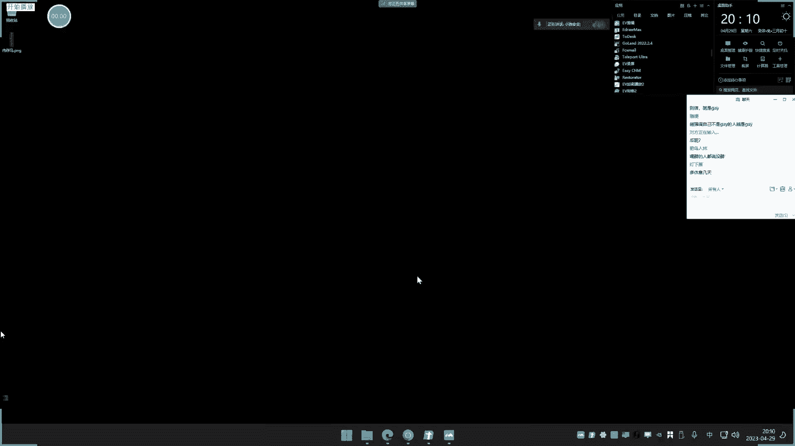

今天呢这个讲这个33天了啊，呃这今天这个内容呢是java的第二次直播呃，主要讲什么呢，其实呢就是上节课遗漏的这个预编译的东西，然后呢再讲两个东西啊，就是这个过滤器和监听器这两个的一个应用。

这两个呢在这个开发中呢还是比较常见的，就是这个java的原生态的三大类啊，一个是那个CIVILIATE，然后呢再是这个过滤器和这个listen啊，监听器这三三个核心啊，啊今天呢就讲这两个核心啊。

这个监听器和过滤器啊，然后呢我们主要了解一下啊，它的一个使用，包括它对我们安全这方面的一些影响啊，主要影响的还是这个过滤器多一点，而这个监听器呢，只是在分析这个代码逻辑的时候呢，有点用，不。

过这两个呢都会涉及到一个在我们安全里面的，一个很重要的一个支点，也是最近几年呢比较突出的一个支点，大家都知道啊，这个内存码的一个技术，就说你把这两个东西学好之后呢，你再去分析这个内测码的原理的时候。

他是有帮助的，因为在内存码这个知识点里面的话，就有这个关于finder和listen这两个的内存码。

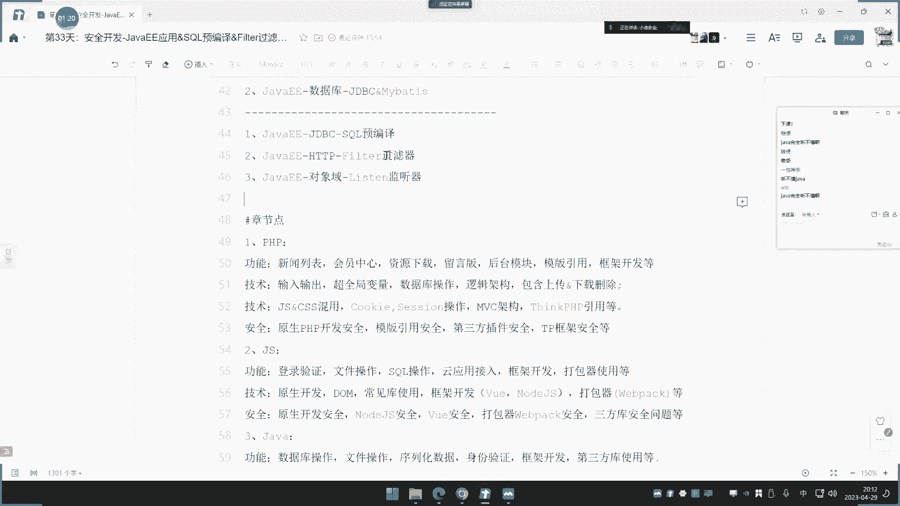

我们可以看一下啊，这个内存码呢有些人不知道啊。

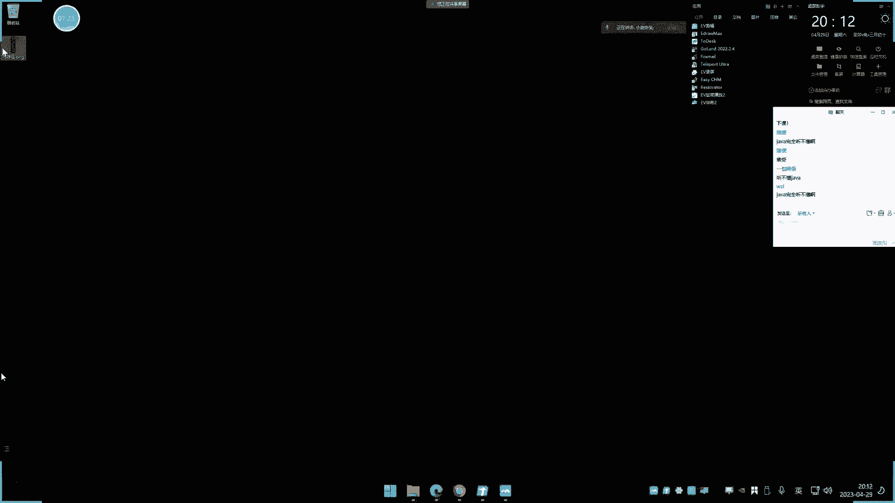

来这是一个我上网找这个图片啊，来啊web应用内存码，这个内存码呢是我们全新维持的一种基数，也是在最近几年比较火的，包括它上面的应用和检测呢，也是在这个蓝队，红队呢一个比较核心的点啊对吧。

然后你可以看到啊，他有这个SOLIOR呀，fighter和这个listen这几个类型的内存嘛对吧，如果说你有学过这几个东西的话，就像我们上节课讲的这个是吧，split和这个今天要讲的这个。

fighter和这个listen，这这两个呢主要是三个啊，那么讲了之后呢，你再去了解它的原理，和他为什么这个能够成功啊，这样子呢，去后期我们去分析和检测这种类似码的东西，的时候呢，他是有很大的帮助的啊。

所以今天这个知识点呢，和这个内存码呢是很有关系的，另外呢在这个代码分析和代码分析漏洞的时候。

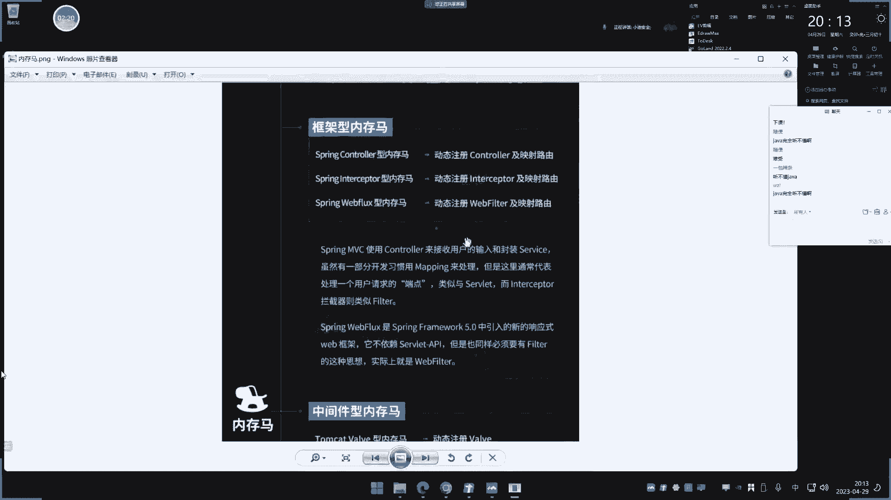

那去看这个java代码的时候呢，这两个东西呢也非常重要，经常呢也要看啊，所以说呢这是我们今天讲的这个点啊，那么首先我们先来看一下商界合呢，没有讲完的这个预编译啊，如何解决，我们来呢看一下啊。

这个预编译呢是java里面一个类似的东西啊，其实在啊pp里面，或者说在其他的这个什么Python里面，都有这个预编译的一个概念，只是说在pp里面呢很少用庸，因为它用起来呢会有些麻烦，或者说它这个预边。

应该是在后面这个pp的版本之后呢才支持的，就是以前那些版本它不支持，他们以前没有这个概念，所以导致啊很多这个PB程序员呢，在写这个web应用程序的时候呢，没有去采用编译，从而导致这个SQL注入这个漏洞。

而java在它本身出来的时候啊，刚开始出来的时候，那就考虑到了，所以啊在java程序中，这个预编译呢是经常在使用，从而导致杜绝了这个SQL组的一些安全性，那么它是怎么实现的啊，我们给他看一下。

而且从这个上节课讲过预编译，它是一个概念啊，它的预编译呢其实就是他的这个字面意思，就是提前变异，然后呢解决了这四个猪猪问题啊，网上呢虽然说有说什么鬼啊，鱼鞭也绕过啊，就说你采鱼鞭呢我能绕过。

但是那个绕过那是基于一定的条件，不是说你写了预编译就一定绕过，不是S啊，如果说一定闹过，那这个东西呢就解决不了四个出入，那也不可能成为一个是吧。

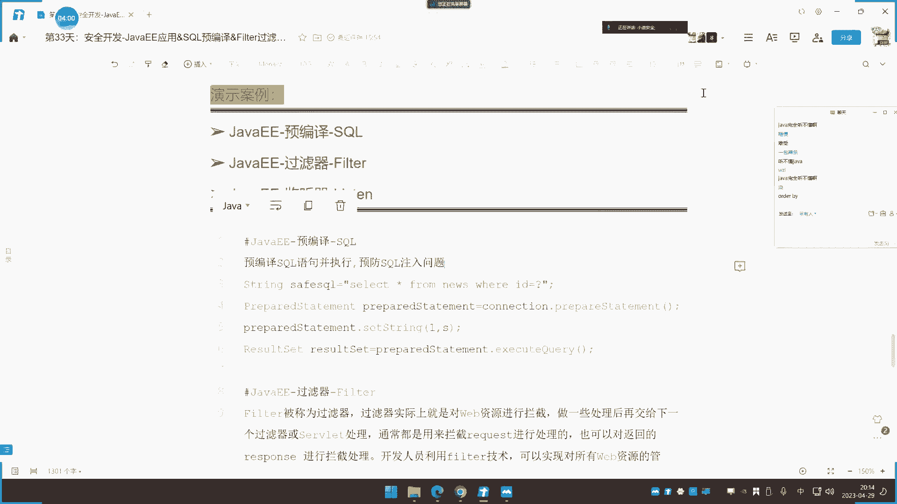

我们要给他商量个支点，是不是还是能够注入，那有什么意义呢。

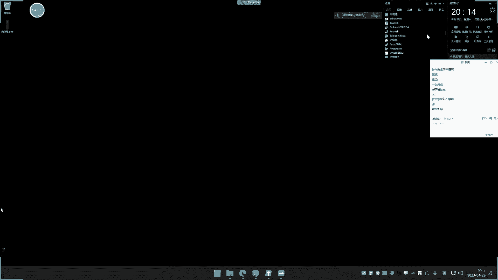

主要大部分是不能绕过的，基本上就可以等同于不能绕过的一个概念，好我们打开上节课的这个笔记啊，来这上节课的源码，我们来看一下这个预编译呢，它是一个什么概念呢，啊啊这是我们给大家看一下啊。

首先呢我这里呢先把这个VBA这个代码呢，给他删掉啊，然后呢我给大家看一下，这个没有编译的时候的一个情况啊，这里呢写了几个代码，这个代码是什么呢，啊这个can啊，就是提示这个输出输入的啊。

就是说我们在这个调试窗口上去输入一个值，给这个i id啊对吧，S字符串呢等于这个can list就是结束它的值啊，并把值写出来，最后呢再用这个SQL语句呢去拼接这个S对吧，这个呢是我们说的不安全的写法。

啊上节课呢还有人说让我多注释一些代码，避免的看不懂啊，我就给大家注释一下啊，这个呢就是我们说接受这个用户输入的啊，啊B这个变量足传的S结束，这是个代码的一个概念啊，然后呢我们看一下啊，用GPT注释。

哎呀GPT现在上不了啊，没办法，如果能上的话，我早就把它联通在上不去了，很多东西上不了节点老坏，我们看一下来这个呢我们刚运行一下，大家看一下啊，先看这个不安全的写法的时候呢，他的一个执行结果啊。

我再看一下啊，然后呢对应着我们把这个数据库打开啊，这个代码呢由于没有几行啊，就这么几个东西，我也没必要说哎呀，教大家怎么写啊，这大家看一下就知道怎么写了啊，就是这里呢接受用户的输入啊，创建一个对象啊。

接受用户输入，然后提示这个请输入id啊，你输入之后呢。

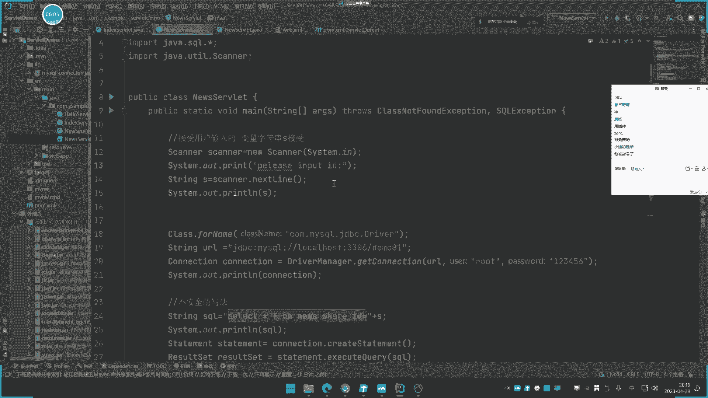

它也会拼接到这个SQL语句中，然后执行，那我们先在这里呢连一下的啊，他操作是这个这个查询的是60嘛，我看一下60里面的两个表啊，这那我就新建了一个啊萧瑟里安全博客是吧。

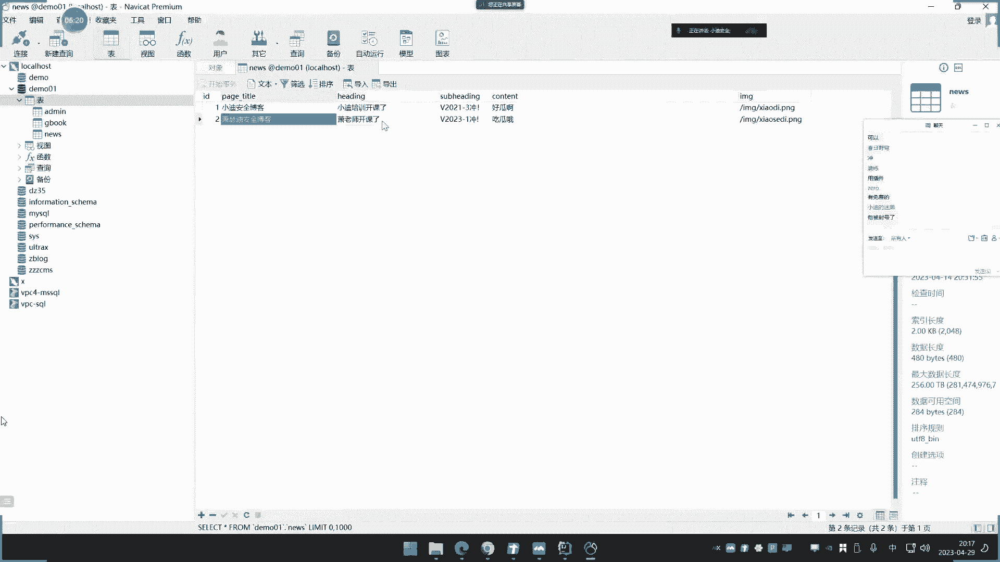

肖肖老师开课了啊，有这个内容好，我们先来看一下啊，来运行起来看一下，好他说这个请输入id，我们输入个疑呀，好他就截到一啊，这里呢执行语句是select sympfor news well，id容易对吧。

然后查询的结果呢是呢以小两犬。

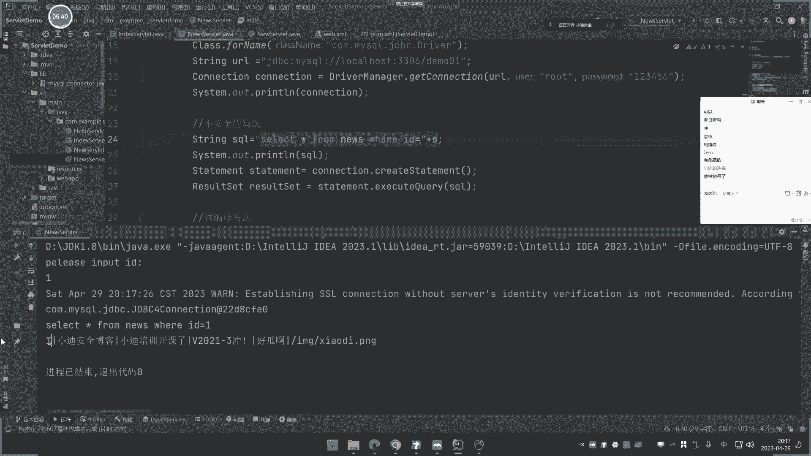

博哥小的平分科了啊，虫好乖呀，那就是这第一套数据。

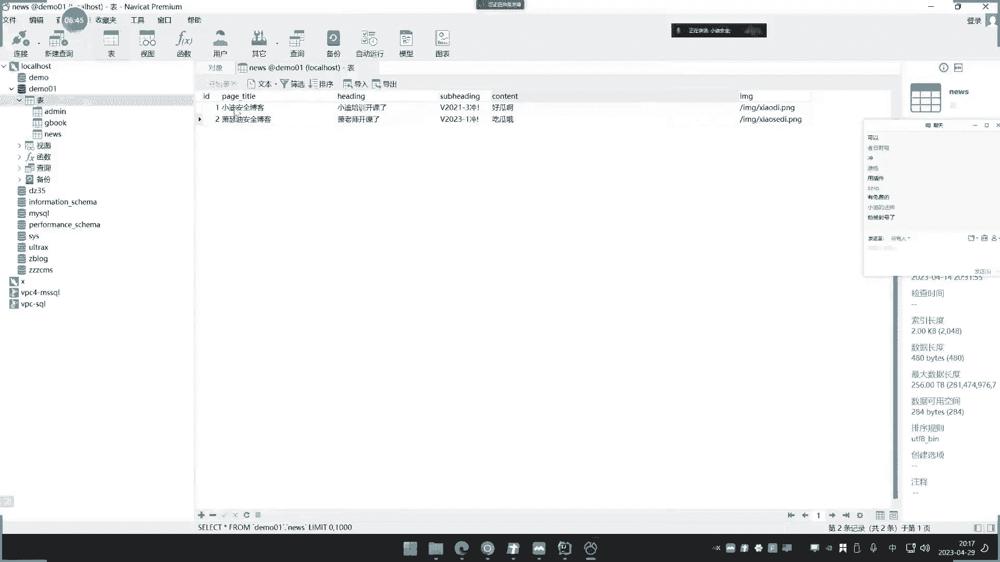

然后呢我们可以再运行一下，输入R，那是不是就会输入第二条呢，那输入R，然后这里呢就接受到这个监听R了，然后呢就是R的这个数据好，那么这里呢我们再来看一下，之前呢我们输入一之后呢。

就可以写个什么OR1等一，OR呢就是我们说的这个什么或条件，然后我们再执行一下，看一下现在哎，你看他现在呢，就是把第二条数据呢也给它除来了对吧，但与此同时也是一样道理啊，如果我这样输的话啊。

就是一个SQL注入，比如说我们这里输select123456，然后呢，我们显示一下这种数据库的一些注入语句吧，写上去，比如说这个user里面查询这个什么，这个相关的东西哈对吧，采用版本呐。

咱这个用户啊产生这个数据库名呀是吧，哎这些东西呢都可以查一下啊，看一下啊，我输上去诶，你看5。7。26版本用户root home host，用户数据库啊，demo01是不是就注入了呀。

这是我们后面要上的啊，这个猪肉的那些注入语法哎，这个呢不需要大家了解，这看到个效果了，就知道这猪了，你看到他SQL语句执行呢就在这里，那就执行这个什么语句就说结束了，一并且呢把后面的语句呢也结束了。

那后面语句拼接到这四个语句之中呢，就形成了一个执行前半部分和我们的再执行，后半部分，后面的就是我们通过这个SQL语句呢，来获取当前数据库的一些其他信息，比如说数据库版本，数据库。

用户数据库的数据库名等等，那么依次向下就是我们后面要说的四个输入啊，你看这个就导致这个注入就这里呢没有过滤啊，直接结束这个值之后呢，就给到了这个什么id这里啊，然后拼接这个S啊。

这个呢是我们说的不安全的写法，导致的社会注入，对不对，这调试呢能够看到个效果啊，嘶呃并且这里呢就注入的是一些结果，那么这是不安全写法，我们先把安全写法呢给它注释掉，然后呢我们看一下安全的写法。

采用预编译的写法，它和上面呢有什么不一样的地方，首先在定义SQL语句的时候呢，我取了个SQL名字呢叫S设备，Circle，就是安全的circle，然后后面是id，等于问号，写上个问号。

然后呢你看啊上面那就直接执行了，后面就执行起来，你看现在多了一个什么P21P话，对调用的对象连接的时候呢，去执行这个server ser，然后呢在这里的设置值一个参数。

就这个问号呢取代V把S呢把它替换进去，然后呢再去执行，就说我多了一个东西，就是多了这个东西，把它采用于编译，刚才那就是直接呢啊他拼接好之后呢，直接这里呢就怎么样执行这个SQL语句。

这里呢我们就是先进行预编译，后面呢再把它执行啊，后面再把执行好多了，这个东西那么多了，这个东西之后，我们现在再来观察一下，他现在注入大家可以看一下啊，会是个什么效果好，我同样也输入一好，我输一之后呢。

也得到了这个结果，对吧好，我再去注入给大家看一下啊，比如说我按照刚才那个思路来，对不对，这里写上相关的主语句，好我就查一个这个数据库名吧，执行他接收到的数据也是这个，那我这调试输出嘛，调试这个S的数据。

他这里呢也是能够接收到数据，但是你看那个SQL语句变成什么，Select sing for new swell id，问号，他并没有把这个数据接收进去，但是呢他为什么疏解输出出来了呢，哎再来看一下。

比如说输R它也能结束呢，凹对吧，但是你就是输其他东西的时候呢，他就不行啊，他就不行，0~56它就不行，对他就是这个啦，一直是问号，啥情况，就像我们说的遇变也就是什么呢，他不会改变他的逻辑。

就是他是固定死了，前面就是这个东西，那你不说，那我既然发这个东西，你不也是要把这个东西写上去，这样搞吗，是这样的啊，就像我们说的这个预编译呢，就是提前把这个语音固定死的，它不会改变改变它的逻辑。

如果你输入R再输入其他值，它可能会改变，来我们做个实验啊，来现在呢做个这个对应的关系看一下啊。

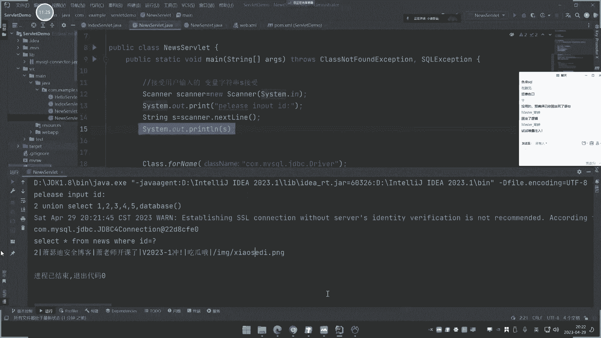

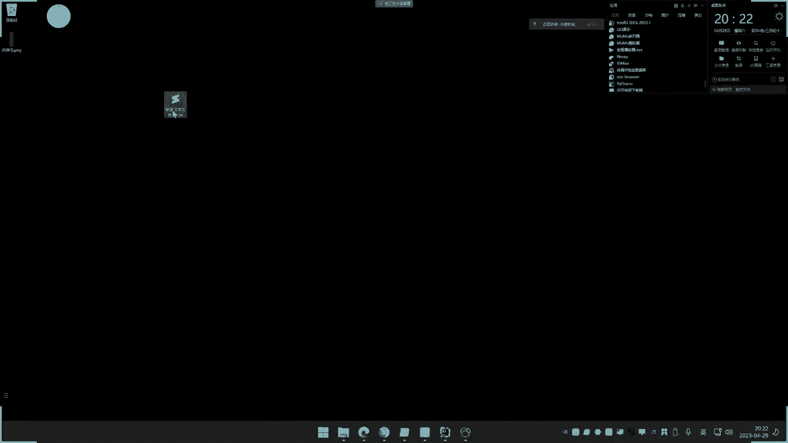

那这里呢我输了是这个这个值啊。

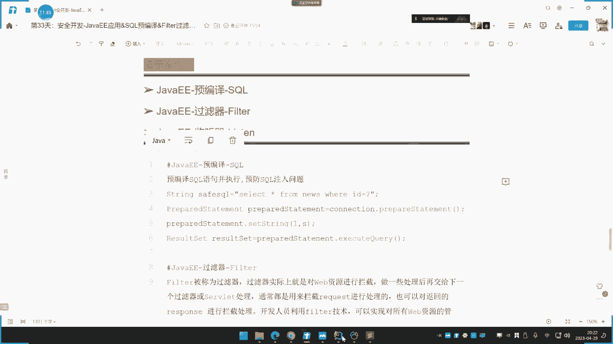

哎那么正常来讲的话，他是这么一个情况嘛，哈那解释这个东西，这这是要执行SL语句，但是预编之后呢，好看一下啊，好我们现在呢再来做一个另外一个结果，大家看一下啊，做个什么22回车，哎这里没有结果了。

来这里没有结果了，我输个22之后呢，它没有结果了，但是我们这样子再输入个这个东西，大家看一下啊，那1A执行哎，这里一的A呢又出现了结果啥情况，你看啊，1A出现结果好，再来看一安的哎，他也出现结果。

好再来看啊，一安的移等于一，嗯也出现结果，大警官其实啊就是说你在执行这个语句的时候，这个结果他是也是做了这个数据库的查询，结果呢也是正确的显示，只是说呀他已经把它固定的逻辑搞清楚了。

你只要是后面呢去有尝试查询其他的东西的话，那么就不行，他是这么一个东西啊，就说你这个语句呢你就只能获取这个数据。

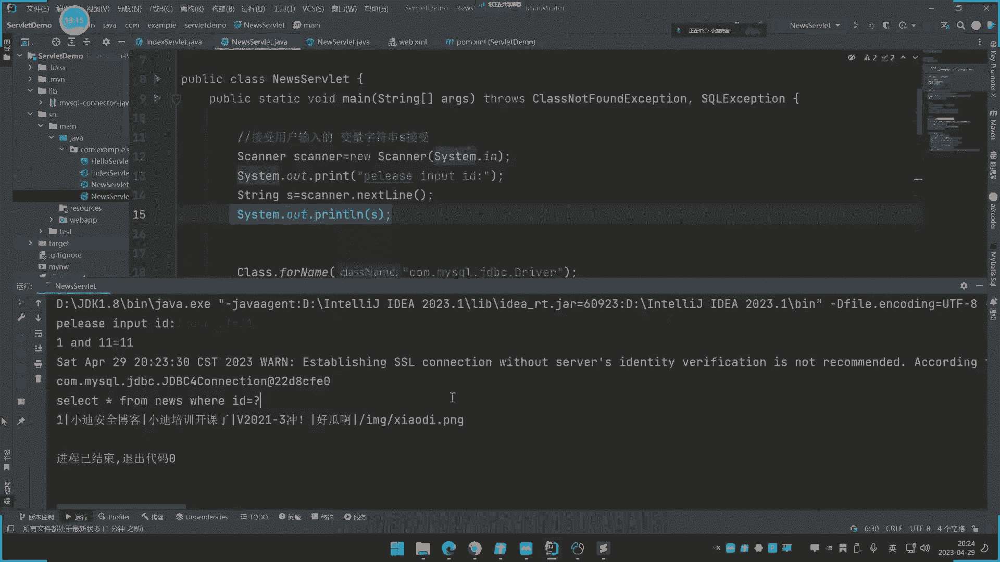

这个预编译设置之后呢，你就只能获取这个数据，你想通过这个四个注入获得其他的信息，那不好意思，搞不了，就像我们上节课说的啊，他已经固定死那个SL语句的逻辑了。

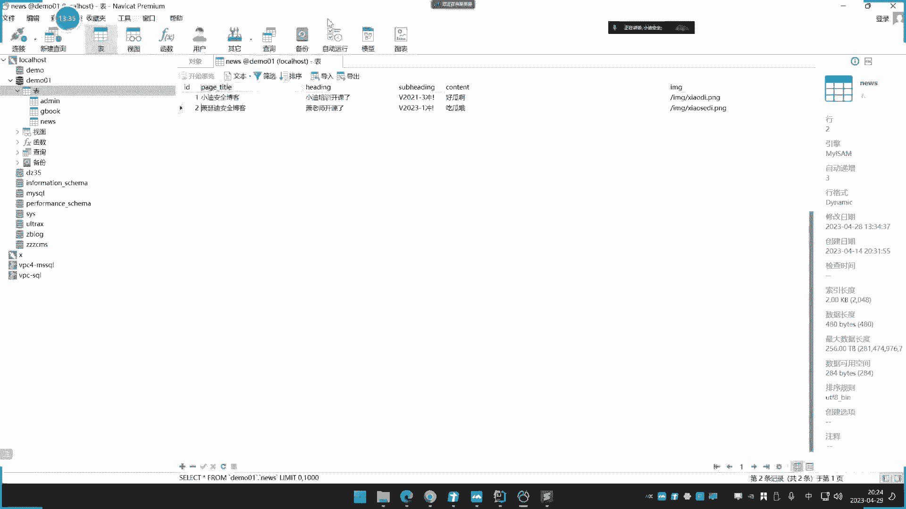

那个里面的这个结果呢也是死的，你改你稍微再动一点。

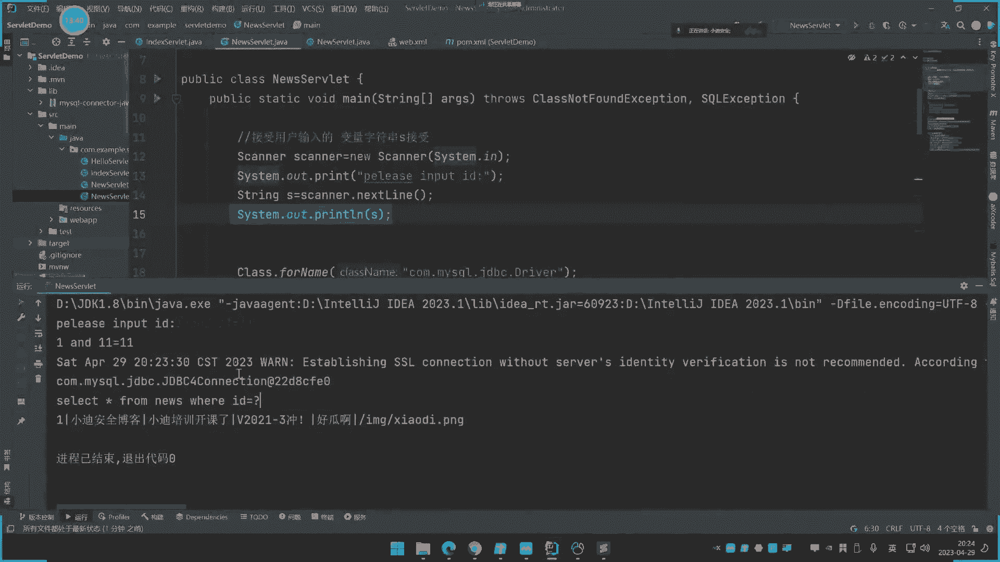

他就不行了，所以说他也不是说不接收。

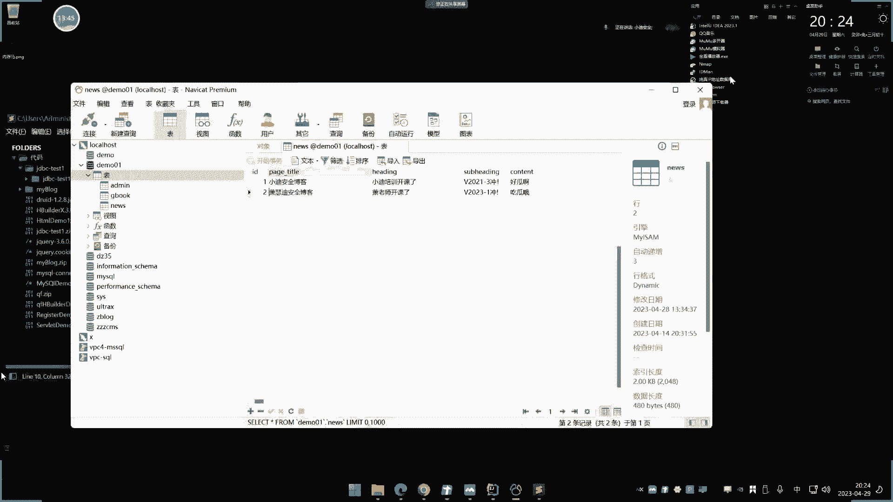

他也接收了，只是说固定死了啊，这个就是我们说的这个预编译，所以呢你用SQL语句去租他就不行，但是呢你正常查询呢，它又可以。

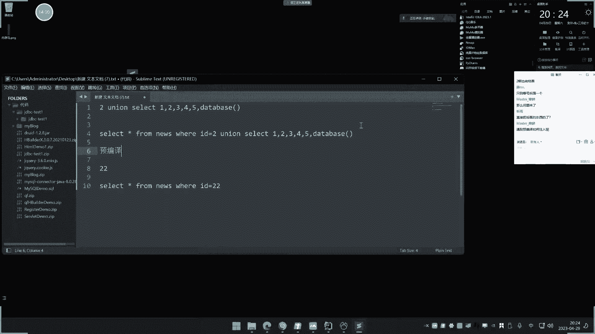

好然后呢这个预编译呢就这个情况啊，啊刚才有人又问说预编译怎么去注入啊，snap sleep是吧。

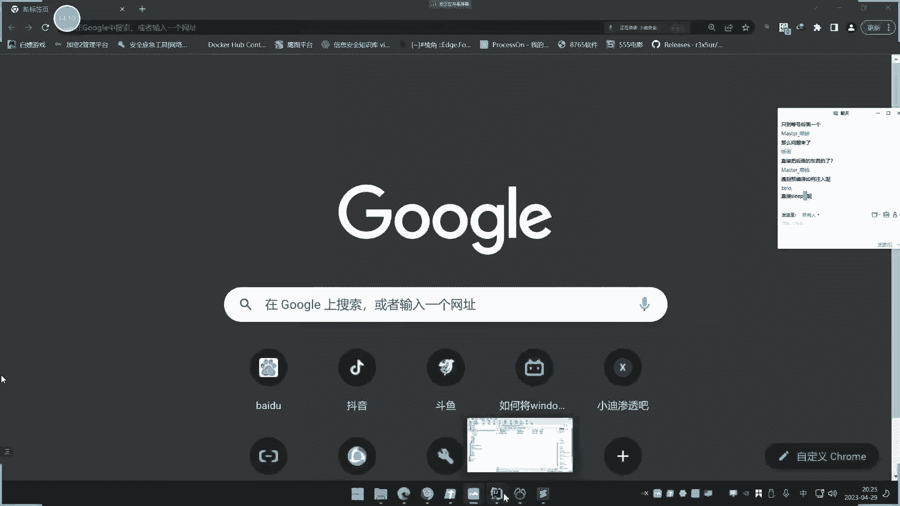

好那我给你试一下吧，你们有些人就是喜欢文吗，我可以去试一下啊，我们先看一下这个sleep的真正的用法啊，别人避免说这个是我写错了是吧，你看啊正常的和用法啊，id等移是吧，执行好。

你比如说我加这个安under sleep啊，延迟一下是吧，一秒钟啊，去看一下结果执行，你看延迟了是吧，大家看到啊，它延迟了对不对，在这是呢执行之后有延迟，结果呢只有慢慢显示，是不是啊，没问题啊。

来看一下来啊，延迟了，那延迟一秒钟，结果显示，那我延迟五秒钟，and sip来延迟五秒钟，一等等，123 15，好出来了，结果出来了是吧，好你看啊。

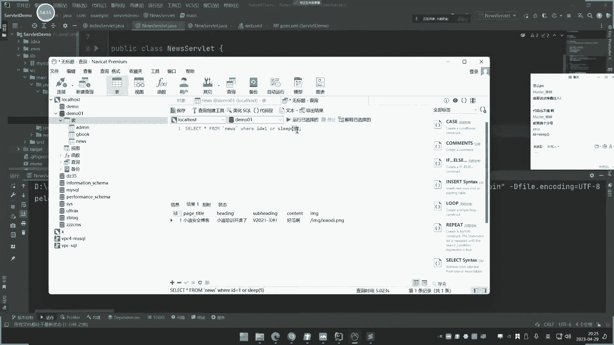

那正常来讲呢，我输这个它是不是也会延迟呢，来看一下呢，写到这里来呀，多会颜色啊，看一下啊，看他有没有这个东西啊，哎妈的书也不能还往前面插入的，执行有没有延迟啊，大家觉得有没有延迟啊，你不信我搞大一点吗。

这个延迟三秒啊，好像还看不到明堂，我延迟个十秒，延迟个五秒，试一下，来，延迟个十秒，这延迟了吗，没有延迟啊，没有效果呀。

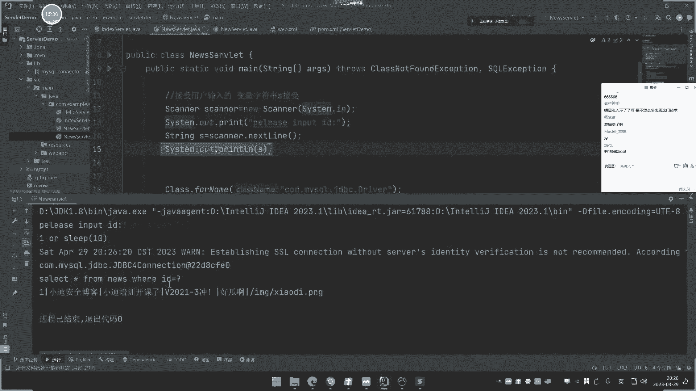

嗯刚才有老公说这个BBA能不能绕过啊。

能不能注入，很简单道理，你想问这种问题的话，其实就是和我们说的那个什么挖虎老虎一样的，这个绕过呢都是要讲条件的，但是大部分的都不满足，除非是这个产品本身设计有问题，所以说他本身就是房租的，你还要绕过它。

那它存在的意义在哪里，就像瓦夫一样，你必须要绕过他，那是某些东西它能绕过。

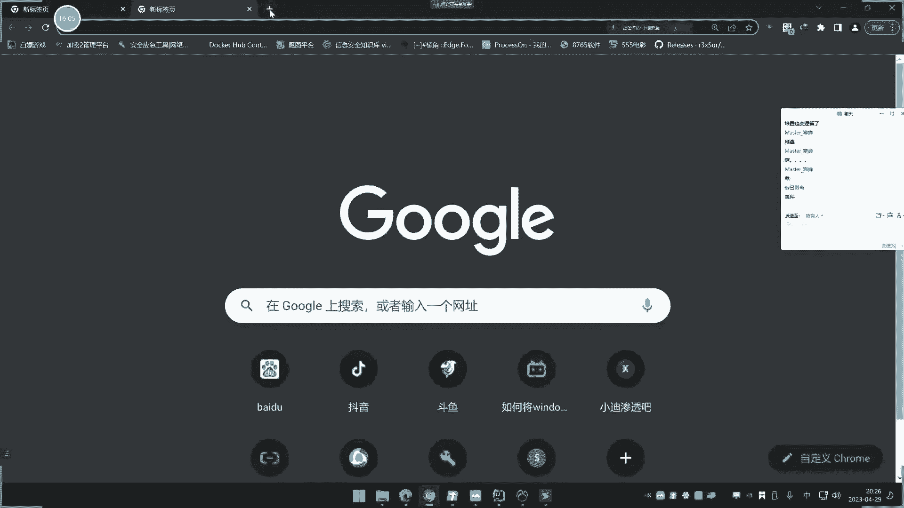

但是一核心业务他绕过不了。

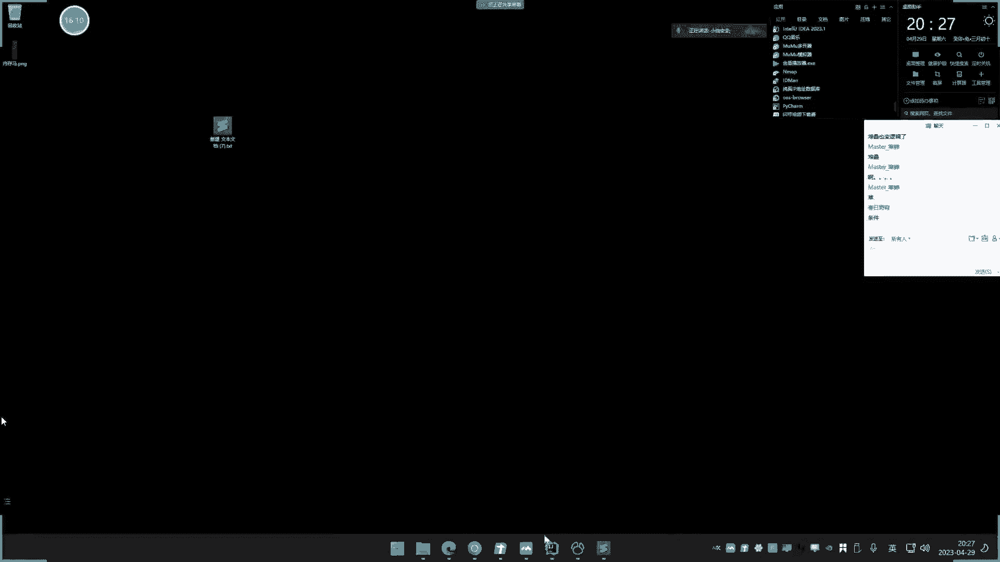

网上呢又讲这个，以便于这个什么猪绕过是吧，你那网上邮了呢，有种字典鱼边绕过啊，什么circle组这些绕过，对不对，但都是有条件的啊。

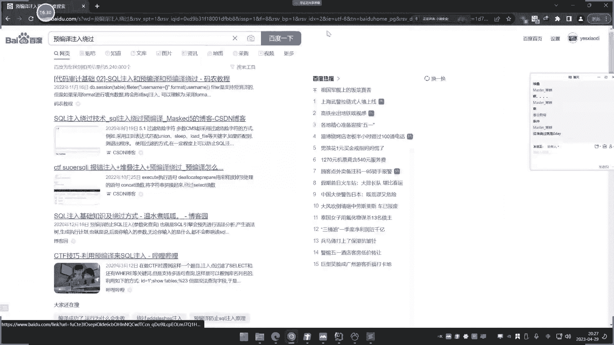

不是说你这日照日照，但基本上大部分都绕不了，鱼饼也绕不了啊，不要去想捞过讲的那种怎么绕过，那都是没什么用的，你实际中碰不到那种情况。

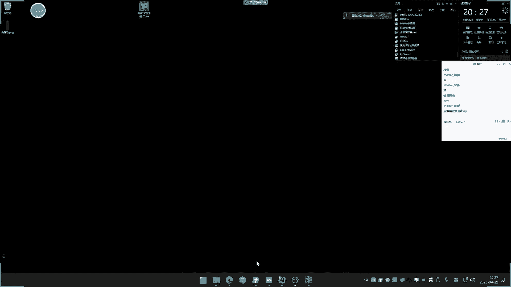

好这个就是我们说的预编译，再来看一下这个这个java的这个过滤器啊，首先呢我们先说一下这个过滤器是什么东西啊，过期呢它其实上那就是对web资源的进行拦截啊，啊通常呢我们用它是干嘛的呢。

啊就是说我们可以呢在访问的时候呢，对这个访问呢一般呢就是主要是拦截这个request，就是请求的，当然呢也可以对这个返回的response呢，进行拦截，它一般是开发女人呢用这个拦截器呢。

啊这个过滤器呀这个东西呢来实现什么，实现全新的访问控制，或者啊类似的什么压缩响应信息或者编码，或者说过滤一些敏感词汇等等，那什么过滤敏感词汇啊，什么编码压缩响应的，这个不是我们考虑的，这是性能是吧。

就是说访问的这个这个功能性是吧，比如说自动编码呀，或者说这个把信息压缩小点啊，访问更快呀，但这个不是我们关注的，我们关注的呢主要是和安全相关的，那么这个过滤器里面的和安全相关的，就是这个内存码的基数。

同样的，还有一个就是我们说的这个权限访问控制，它一般在这里呢和安全的会有相关系啊，所以呢我们先来了解一下，这个过滤器是一个什么概念啊，在讲概念之前呢，我们先看一幅图啊，这个图呢就是一个请求的一个逻辑。

就是java里面这个最常见的两幅图，都是讲的一个东西呃，客户端呢request的去请求会经过监听器，再经过过滤器，然后呢到达我们这个编写代码这里，然后呢再从这里呢去选择性的达不到数据库啊。

如果有数据库再返回来，同样道理，再慢慢的往回返，所以也就是说它和我们传统的一些那种开发呢，不一样啊，他是直接呢先经过了一次的监听器和过滤器，这两个啊这两个地方，然后呢才会到这个代码层。

这里是这么一个关系，所以这张图呢，也恰好说明了这个内存码的一个原理，内存码原理是什么呀。

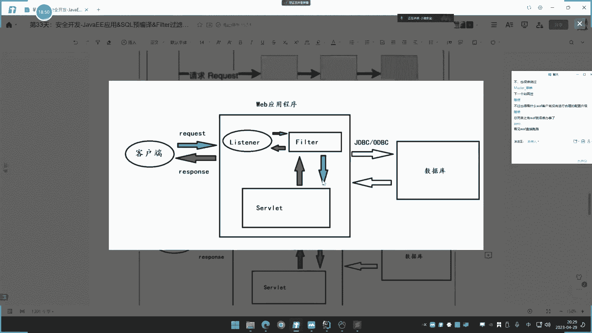

来我们可以简单的看一张图片，看这张图片好了，这是我们一个java web的一个web的一个资源，访问是吧，首先呢它是从这个这里呢去访问它是吧，这第一步，第二步，这第二步，然后呢再到这一步。

最后呢通过它是吧，如果有数据库都连载到这里啊，返回呢也是一样，在依次往回推，那么大家看一下啊，他是说在访问这个代码的时候呢，访问这个应用的时候，先经过监听器和过滤器，你可能会问没有这两个东西怎么办。

没有这两个东西，那就直接到这里，是这个意思啊，好那么内存码为什么形成叫内存码的，意思很清楚，内存码呢就是说这个码呢写到内存中了，就不再代码中有提示，或者说没有文件，就叫无文件的一个类什么技术。

这是我们呢讲过的是吧，上期讲过的啊，这些呢会详讲啊，讲的更多也会更细啊，所谓仪器游戏的变动嘛，啊就是因为你有这个基础之后呢，我们才好讲啊，你没有这个基础没学过，都不知道这个什么监听器作用器是啥。

那怎么讲呢，啊，内什码里面呢，有这个监听器和过滤器两个两个类型嘛是吧，那这两个类型为什么会称之为内存嘛，其实你可以看一下它的流程，就已经代表了他是内存码的精细，就说其实啊我们一般的常规这个web后门呢。

是在这一层，是在我们这个什么代码这里层是吧，在代码这个实现日程，就说我的码是写到这一层，写到这个上面啊，有个文件，而雷斯马那是来到商医生和商一层这里，所以他在清理的时候，单纯从源码中去发现不了任何异常。

因为你的层面和别人相差了就很简单的道理，这个意思就很明显是吧，你的层次不够，我在说什么，你听不懂，因为你要慢慢的提高，那么知识点呢你才能跟上，就和这个道理一样的，我不讲，他也听不懂，那么很有道理。

这个内存嘛，就这个东西你和他玩的不在一个层面，那怎么去找他，怎么去知道这个原理呢，是不是那这个东西图片就说明这个道理啊。

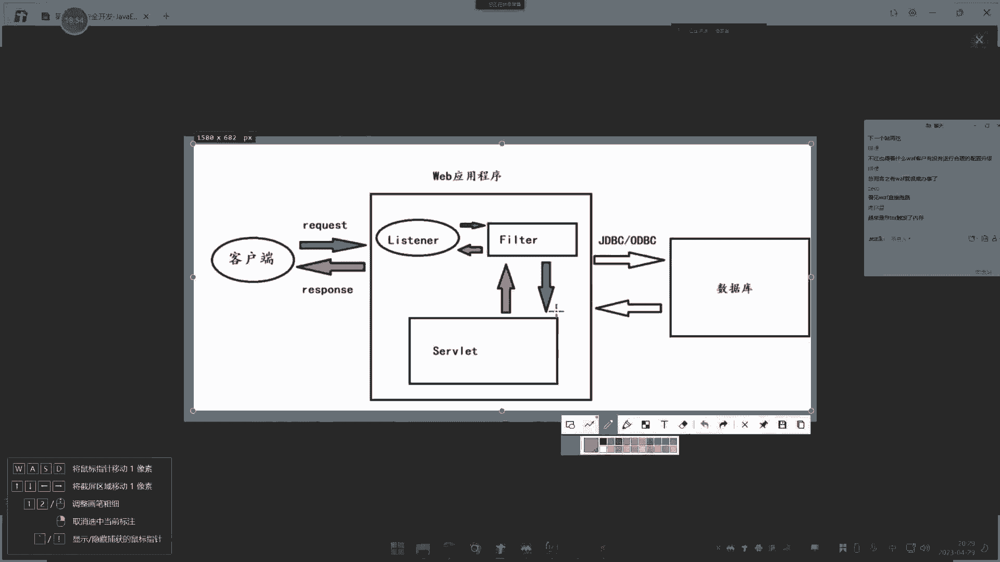

为什么他能做其他事情，那么接下来呢我们就理解一下啊，这个现在呢我们就来看一下这个嗯，第一个啊过滤器，先讲这个第二个层面，过滤器啊，第一个层面是监听器，过滤器呢比较重要，大家着重听过滤器啊，好过滤器啊。

我们来给大家看一下啊，它的应用呢就是说啊和安全相关的就是内存码，包括这个权限控制，那如果说是从开发相关的话，就是能优化访问的速度，优化访问的效率，优化访问的体验啊。

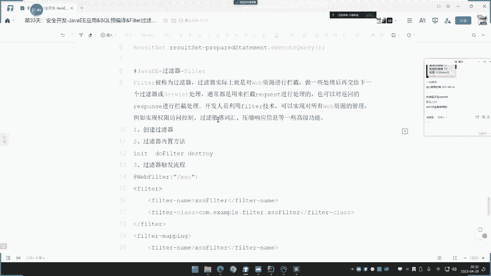

这没什么说的，首先呢我们第一步啊创建过滤器如何操作啊，首先呢我们呢再给他新建一个项目啊，从新建项目开始给大家去讲啊，这里呢写个man for，然后我取名呢就叫这个by t e r，然后DOM是吧。

然后呢乙啊写这个名字啊，by dom1啊，这里呢选择web服务啊，dom cut嗯，1。8啊，都选好，下一步选择这个八版本的，下一步创建，好这里创建好了啊，然后把这个他由于他自带的这个MOVE。

这个仓库，我们可以把这三个文件给删掉，这个这四个文件把它删掉啊，这个无影响，让代码更简洁，删不删也无所谓啊，我这选择删掉它不影响啊，他主要是那个一个叫MOVEN的一个仓库，那个仓库呢我们后面会说。

但是那个主要是开发里面了解比较多啊，在安全里面没什么太大影响嗯，来这个代码这里呢我们来看一下啊，在这里我们就写一下代码了，所以呢我们看一下啊，我们这里呢就创建一个文件了，创一个文件啊。

就按照上节课讲的啊，上节课叫，就叫一个什么名字呢，就叫一个显示操作的吧，就叫一个，test啊，Soliet，创一个啊，然后这个呢就按照我们上节课的一个写法，去写啊，继承一下这个app的那个地方。

然后呢我们这里大角啊，比如说我检测一下啊，嗯检测一下，那这个快捷键呢就是alt加insight，然可以在这里呢找到一些方法呢，可那选中你要测试哪些方法，就相当于直的啊，就是alt加insight。

当然了，你可以直接在代码中写中提示也可以啊，这是快捷方法啊，alter就是a u a alt加上insight，就是我们那个剪啊，然后呢看一下它里面内置方法，我们就选取一个啊，把它直接写上去。

比如说这个内置的这个，啊就搞个do get吧，写上去就是说尝试呢有人访问这个do get呢，我们就简单的是吧去进行一个这个显示吧，比如说我们进行一个RUQ点get啊，结束这个值。

就说我们人家先提交检测一个值嘛，哈解释一个什么值呢，比如说发送回来的这个code code一个变量，然后呢复制给这个变量string类型啊，新类型呢写了一个叫也叫code吧，也就叫个变量啊。

他解释过来之后呢，再用这个，额结果啊，结果那声明一个这个OUT的结果，等于RESP点great，然后呢把这个结果呢给它进行一个打印是吧，打印出来，比如说打印这个code就结果了，结束之后呢。

平板在页面中显示，然后呢在刷新一下，最后呢再把这个进行一个关闭啊，这是个大概一个结果啊，就是有人呢尝试丢get啊，触发这个方法就是get访问，然后呢就接受这个参数值，code里面的值值呢。

再把它进行接收处理之后呢，打印在当前页面中，就这么一个情况啊，然后呢嗯按照上节课说的那个路由关系，可以在这里呢写上这个叫web site啊，也可以呢在这个它的配置文件这里呀，啊这里一个配置文件是吧。

也可以在这个地方呢声声明这个什么service是吧，也可以在这里呢去写都可以啊，那么都还是把它写一下吧，啊内蒙那就叫test split，对吧，然后呢再指向一个这个class。

然后呢class对象就是在那个路径啊，把它写上去，是不是就然后呢，后面再再写他的路由关系啊，诶那么然后呢对应的名字就是这个嘛，然后呢触发地址我们就写个叫gun test吧，对不对，这样就可以了啊。

当然了你再写之后呢，也可以在这里写了，这里也有了，这里有啊，那这里也可以这样写是吧，也可以这样写呢，然后呢这个写的就是直接写进去，刚test这样子呢就直接一不写就取好了啊，就算你用哪种方式都可以啊。

我们就刚才那个写法吧，好那现在呢我就把这个环境呢给他启动起来啊，给他启动一下，哎开启用一下啊，看一下这里啊，把这个删掉吧，用这个吧啊啊触发地址呢就是这个还有多mm杠，就写这个地址吧，应用啊，确定启动。

好我们这是上节课的一个支点啊，现在还没有加这个过滤器，我们先看一下大概情况啊，那么现在看一下啊，我访问这个test是吧，On test，然后回车啊，它是为空，但是呢我们一旦加上code等于123哎。

他就输出123了，对不对，它就输出一三了，就是接着扣了值呢，并码在页面中写显示嘛啊，好能够看到能够的结果，对不对啊，你就加什么东西，那就写什么东西，比如说我在那写个script啊。

如果说写script呢，它也会显示这个script，对不对，然后呢就像我们说的，它会显示到页面中，哎这里有弹窗，是不是就是一个典型的夸张嘛。

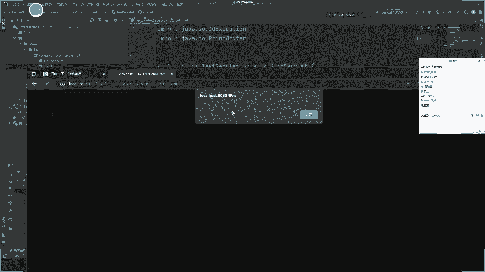

大家能理解吧，就因为这个这个代码呢啊会显示到页面中，诶这个代码一旦显示页面中呢，这个代码呢就被执行，因为这是个JAVASCRIPT代码，在页面中去显示的时候就会被调用执行，所以它形成的夸张。

这也是夸张的原理，虽然说我们现在没有讲夸赞，但这个一言诗大家也知道差不多原理了啊，诶这就一个夸张了啊，就执行一个JS语句，然后这个话语句一旦改变，就能形成不同效果是吧。

比如说现在呢我获取你的cookie，获取什么东西，对不对，这个地址呢就是一个触发夸张个地址发给别人，别人就中招，就会执行你的JS代码就是加叉SS的啊，现在呢我没有讲我们这个过一下啊，好那么现在呢你看啊。

如果要过滤，按照我们传统的写法是怎么写的呀，按传统写法，是应该在这个地方对这个code进行一个过滤呀，就比如说我现在呢传统写法，我就在这里写上写这个code是吧，然后呢用一些什么这种替换的呀。

或者说检测里面有没有关键字啊，对不对，这样去替换它，然后呢进行过滤这种传统写法，那么在java中呢，你可能在这个上面没有看到任何的过滤，但是实际上它又有过滤啊，有种情况就是我们说的过滤器。

那过滤器该如何操作啊，现在呢我们就来演示一下过滤器啊，然后呢你就先传了个软件包，软件包呢也叫这个名字，然后呢最好是把它放在这个啊，放在一个这个另外一个目录，这样子呢显示的会更加的这个。

增加了一个啊就叫fight啊，创建一个这个目录啊，创建一个目录呃，就是说你可以怎么办呢，啊我们可以自己呢再创建一个这个目录啊，再创建一个目录，就是把script放到单独一个目录，把这个。

额就是我们那个过滤的也放了个目录，这是一个开发里面经常做的，就是我们这里呢是讲的话还是规矩点再加script啊，就说我把这两个文件放到及格目录是吧，把它放在这个目录，那这两两个放这里。

然后过滤器的写这个目录都可以啊，当然你可以把都放在同一个目录，也是同一个这个下面也可以，只是说正常来讲的话，你一般碰上一些成品源码，它都是这么一个放这个目录，它会有个名字的，后来有个区分区分的啊。

好我放了这个目录之后呢，也基本上也不会受到影响，因为它很多东西呢也呢对应修改了重构，所以它自动帮你修复了，也不会导致项目会失败，好我们在这里呢就创建一个什么过滤器了啊，名字呢我们就叫叉SS是吧。

简单就把这名字就换成我们直接能够听懂的，XSS点final穿这个滤器，然后他是怎么过滤的啊，给大家看一下，那么这里有个叫IM，这个IM和那个ex这里有什么关系呢，给大家说一下啊，这关系就是上下级的关系。

这个是基层这个类啊，这个呢是相用这里面的接口，其实呢就是说你可以这样去写啊，Ex t h o d，然后呢指向这个什么HTTPSQUASS，然后呢想这个之后，后面呢再继承它里面的方法。

比如说我们给写个来split来，他有这个东西，再其次呢就是这个意思啊，他就是利用这个接口的意思，他和那个有一个等级区分，这里呢你需要自己下去简单学一下啊，这个是那个JVS1的一些东西啊。

好我们写好之后呢，在这里哎这怎么报错了呀，查找的必须声明为抽象或者实现方法类型，妈的搞得搞得把我自己都搞蒙了，刚才的对的啊，好我们在这里再选择一个实现方法啊，在这里呢呃实现方法有这么多。

我们选择来歌了是吧，兄弟来歌了，对不对，那他也这么多啊，你看看有有一大堆啊，啊这个有很多啊，然后这个是刚才引用的那个东西的，这几个参数值的啊，还有很多这个其他相关的啊，我们就换这个啊，换这个嗯。

H g d p server li，写这个好，这样就正常了啊，然后呢这里呢就写这个过滤器了，do呃，我们来把它进行一个outset excite啊，看一下，这个是那个app的过滤器写法。

哎这什么有点不同啊，等一下啊，我把它重新删除一下，还是要继承吧，嗯名字叫xss fight，那我还是继承一下看一下啊，好时间正常了啊，然后呢我们看一下它的类似的这个方法，Do you get。

然后我们这里那写什么呢，ini it的，这是m m it的啊，还有了一个i i it，还有个duce log哎，i it的啊，还有一个是这个过滤器的丢，哎不对呀，Find the gry，哦对对对。

是的啊，是继承这个过滤器，这个继承错了还继承这个嘶，然后看一下里面的这个，那这三个有三个嘛把都写上去啊，这三个那一个就是初始化的，还有一个呢就是销毁的，还有个呢就是我们说这个执行之后。

触发的这个地方三个地方，然后呢我们这里呢就简单的把输出一下哈，调试一下来输出一下噻，这个呢就是说这个XSS呢开启过滤啊，就提示这个信息好，然后呢这个就是说销毁之后。

那就是提示这个XS这过滤销毁销毁过滤是吧，然后这个是干嘛的呢，这个就是说过滤之后的一个结果，那么我们可以看一下啊，我如何过滤呢，首先啊这里呢我们就写个对应的这个东西来，去接受对方输入的值之后呢。

白进行过滤，如何进行操作啊，如何进行操作，我们是要把那个东西呢，就像说在检测之前把它过滤，我们先可以把跑一下啊，看一下这个效果啊，那如何进行过滤啊，大家可以看一下啊，我可以先输出一下，大家看一下流程。

只要执行流程就是按逻辑啊，好开始过滤，这里显示开始过滤，就是这个是开启过滤，这个是效果过滤，然后这个就是正在过滤，写个这个东西啊，看一下它的执行流程啊，好然后呢这个呢如何引用它呢，也是一样道理啊。

可以在web这里呢去生命，也可以在这写了，也是F来，那么它的过程基本上是一致的啊，名字我们就叫XSSFTR啊，你可以这样去写它，对不对，然后呢再就是他的class指向文件啊，啊这样文件的就这个地方嘛。

复制一下路径啊，接着来，然后呢下面就是他路由嘛，这路由关系F的这个map对不对啊，一是一样啊，然后下面呢就和这个上面一样啊，一个是flame啊，对不对，然后名字呢就和他对应上呃。

下面这个呢就是我们说的那个药要路径呀，对不对啊，就是斜杠什么菜啊，test就请求test时呢请求这个特色路径的时候呢，就会触发这个过滤器的名字叫这个，然后呢调用的是这个地方啊，就像是这个地方代码。

还有这个地方代码，对不对，然后就会执行这里面东西好，我们先看一下他执行逻辑啊，会不会那个啊，因为这个test呢就会请求这个什么哎，你访问test呢就会请求这个路径啊，你在这里呢写的啊。

我们都是在这个web xm里写的啊，都可以写的啊，你也可以写那个也可以写这个都行呃，我这里呢就还是用简单的吧，我怕有些人搞这个搞不明白啊，我还用简单的啊，我这里就直接写这个这个地方打啊。

出发路径把它写上去，它触发的路径呢就是杠test对，然后再X2test呢也是一样，也是有这个东西，艾特，然后叫刚才那个叫web civilit，然后这个叫WEBB这个啊对。

然后呢触发这个test就等同于就是说你这样写，就你两种写法都行啊，对两个小号都行，那就请求这个地方啊，我们来看一下它的执行逻辑啊，我们先来看一下啊，把它关闭，重启一下，我看一下啊，他先看一下他自己逻辑。

看下这个过滤系统啊，好我们先看一下啊，打开了打开之后呢，我们看下啊。

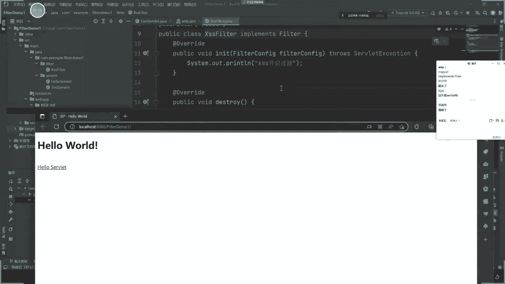

我现在刚打开，我还没有去访问这个test，大家可以看到下面已经调试了XSS开过滤，说明什么情况，我有没有访问test目录，因为访问test目录的话啊，访问这个test路径的话。

就会访问这个test civili，就会执行这个东西嘛，对不对，就会执行这个代码，但是我没有访问他呀，你看这个监听器这个地方就已经开启了，就说明什么在程序初始化的时候。

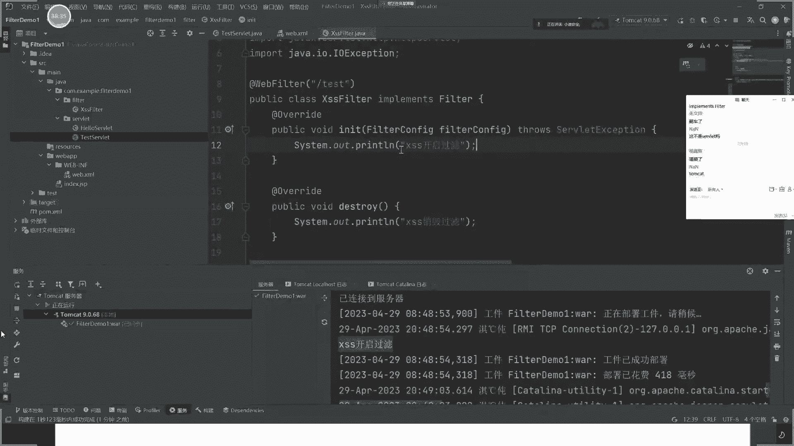

就和我们那个图片流程一样的吗，对不对。

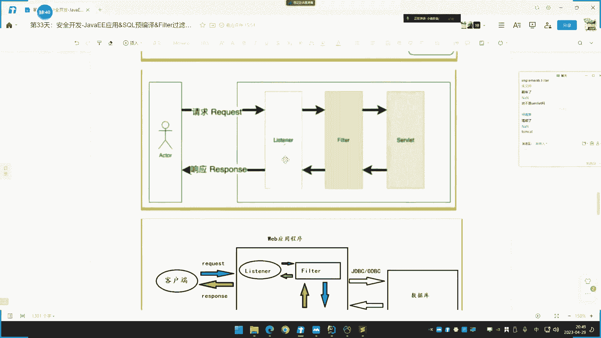

我还没有访问的这个四维LT，他已经呢就已经访问这个F了，就是我们这个过滤器，其实呢他已经还访问了这个监听器，只是说监听器我没有用，它就没有，所以他就来到这个什么剪啊，过滤器则来了，这个是下面要讲的。

那他已经来到这里，就说我还没有访问你。

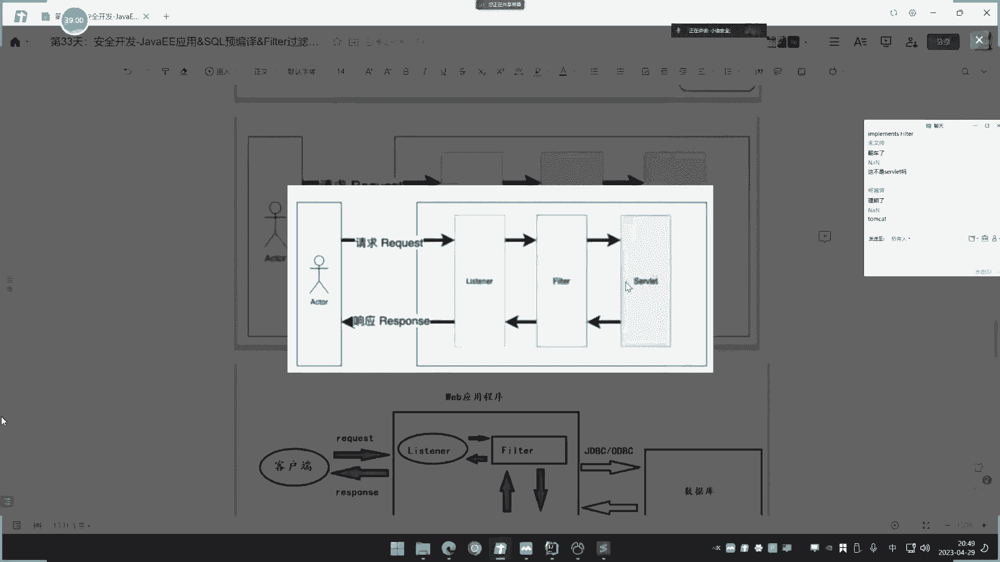

他已经触发这里，但是他触发的不是触发全部，他触发这个INIT的内置方法，就是我们的初始化，然后呢当我们现在我把它关闭之后，大家看一下，我关闭之后关闭之后哎他说菜是销毁过滤诶，我不是写了三个吗。

这个真在过滤，怎么没有啊，为什么正在过滤，是你触发了特斯之后才会运行的，所以这里呢啊可把简单的注释一下哈，这个地方呢就是这个du get的方法呢，它是啊触发了这个访问路由啊，触发的方法。

就是说啊这个访问了路由才会触发方法，而这个呢就是我们说的啊，就是在启动啊，服务启动后就是我们说的中间啊，启动后就自动运行的啊，就是初始化运行的，你启动后你不管，只要你光着打开了，它就这个东西就运行了啊。

这个呢大家就应该知道了，这是中间呢是吧，关闭后好，这是他的一个这个情况啊，那么现在呢这个地方的就就那个了啊，然后如何让它运行起来，我们再来运行啊，你看这个地方啊，我们把它打开之后是不是就会运行。

我们看一下，好你看他现在呢开启过滤之前呢，有人问为什么会执行两次，有些地方会执行两次，执行两次是什么原因造成的啊，是我这他妈的谷歌浏览器的插件，这个鸟毛插件做在做信息收集的时候，会把这个房屋两次。

就是浏览器房一室插件再调一次，所以导致两次大家一定要注意啊，如果你出现两次，就是这个插件导致的，妈的真的是坑死人啊，所以我现在都换那个裁剪，换那个浏览器打开，你是吧，好再看一下啊，然后现在出发这个地方。

然后呢我们看一下这个FTEST，大家看一下啊，放test之后回车，哎你看叉SSS正在过滤是不是出来了呀，是不是就像调用这个这个地方，Do fighter，然后你可能会问，那正面呢不写内容吗。

正面访问test他还要接受co的值才才输出啊，所以我在后面再写上干嘛，co的等于13哎他就输出了是吧啊，正在过滤，然后呢，你看结果也不显示，你看为什么不显示结果，我输六扣了一三次，应该会显示结果。

那为什么这里它还是提示正在过滤啊，因为这个地方要把它放行，要写个方形啊，如何方形呢，来给大家看一下，调用这个里面这个东西要不要方形方形啊，function这个请求和回复，这个你不要问为什么这样写啊。

就这样写啊，方形之后呢，就是有这个方形，这个是方形啊，就是之前呢你只是调试了，并没有把它放进去好，我们再看一下，你看现在啊他就是个完整的了，就是说提示正在过滤，然后呢再把它放行，我们看下结果啊。

打开之后提示开启过滤好，输入test触发过滤啊，触发过滤正在过滤，对不对，然后呢我再输入code，等123再把它放行，这个值是吧，那输出一个三。

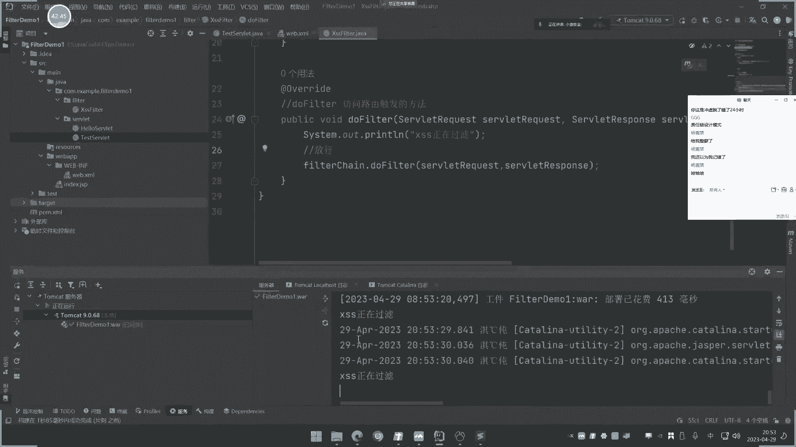

你看它就不会，它也提示正在过滤，但是它它放行了，所以我就需要怎么办呢。

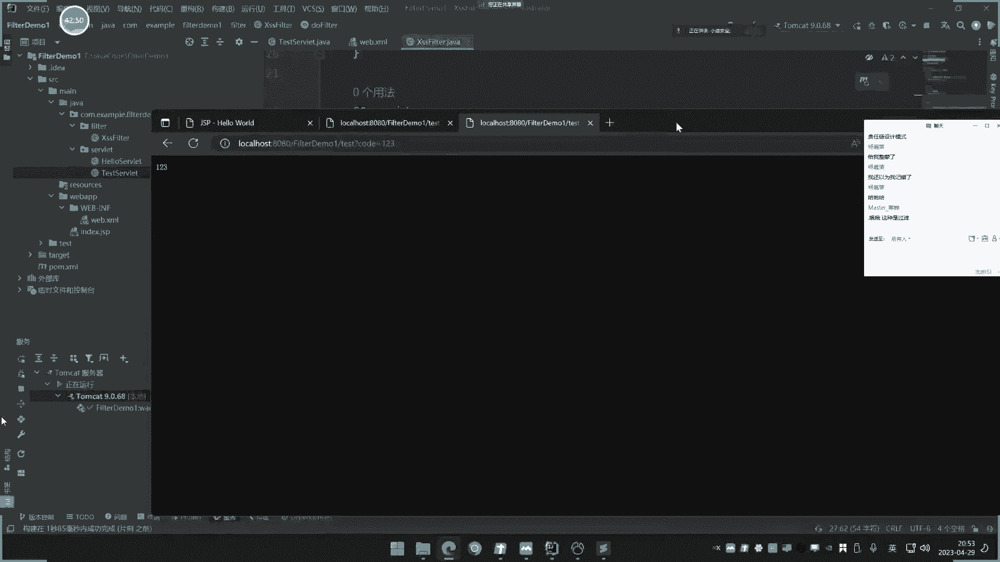

我的过滤代码来这个过滤代码就应该在方形前，对不对，过滤代码就应该在方形前把它放行出去，当某逻辑就是啊这个过滤代码啊，如果符合就放行，不符合就直接拦截，就是我们说的过滤，直接过滤就等同于我们拦截的意思。

能理解吧，就说我方形我就添加个规则，符合条件我就放行，不符合条件我就不放行，好那么简单的写一次代码就可以了，写个什么代码呢，就是接收这个参数值嘛是吧，就那写什么接收，就说这个是个XSS的过滤吗，啊过滤。

那么就是接收这个参数值啊，如果有这个什么攻击的这个payload的话，就进行什么拦截，对不对，最近拦截啊，那么呢同样道理啊，如果没有，对不对，就进行什么放行，这个意思是不是，那么如何接受这个参数值呢。

这个也好好理解啊，这里呢有这个对象吗，这个script是吧，刚好呢有这个东西，那么那就直接这里呢去写就可以了啊，然后教大家写一下，这个是写个request request等于，好这样应该可以了。

那这个request呢我们来接收一下啊，这个不要问怎么写啊，这其实就是调用上面列的那些东西啊，嗯request request哎，这个只有一个又写错了吗，妈的是不是这个问题啊，把这个去掉，看下，好有了。

get p哎，又写哪里写错了，他妈的，Solia h b soli，这个吧应该是应该是这个，看这个对不对，好有了，那么现在呢结束这个参数值啊，这个值呢就结束它那个code嘛，不是我也接受code吗。

我结束coder后面的值吗，然后呢给他复制一个变量，string等于这个也叫coder吧是吧，也等于它，然后呢我们这里进行一个判断，如果是吧，如果这个什么code里面点判断里面有没有值，有什么值啊。

比如说有这个什么script的这种语句，这怎么办呢是吧，有这个score语句好，我们就给提示一下是吧，这个存在XSS过滤，它存在它的攻击，那有这个代码在里面，那么同样道理啊，如果他有对不对。

就存在这个提示这个啊啊这个呢也无所谓，但那写个20里面写到里面去啊，这样子能写好一点啊，就有这个过滤就提这个啊，那非啊就是没有啊，这些个没有就让它放行是吧，就让它放行，那么有呢有的话是吧。

这就是提示什么啊，没有这个什么攻击配load，没有的话就放行啊，有的话就直接提示这个东西，那么就相当是不会放行，不会执行这里啊，就后面那就是相当是继续拦截，对不对，写好了，写好之后呢。

我们把代码呢运行起来，看一下是不是这个道理啊，大家看着啊，是不是就形成了一个过滤，吓我大跳，我还以为这个哎什么情况，半天不启动起来呀，哎哪里报错了，还，这报的什么错误啊，第一子错误啊，等一下啊。

哦可以了啊。

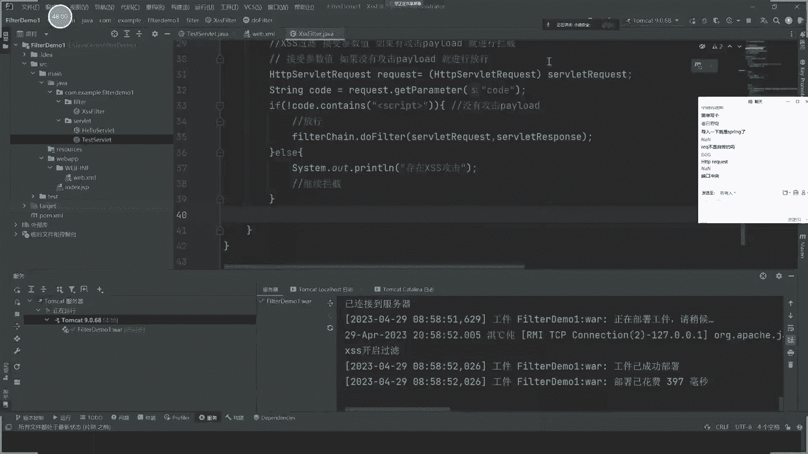

估计是刚才没有把他关关闭啊。

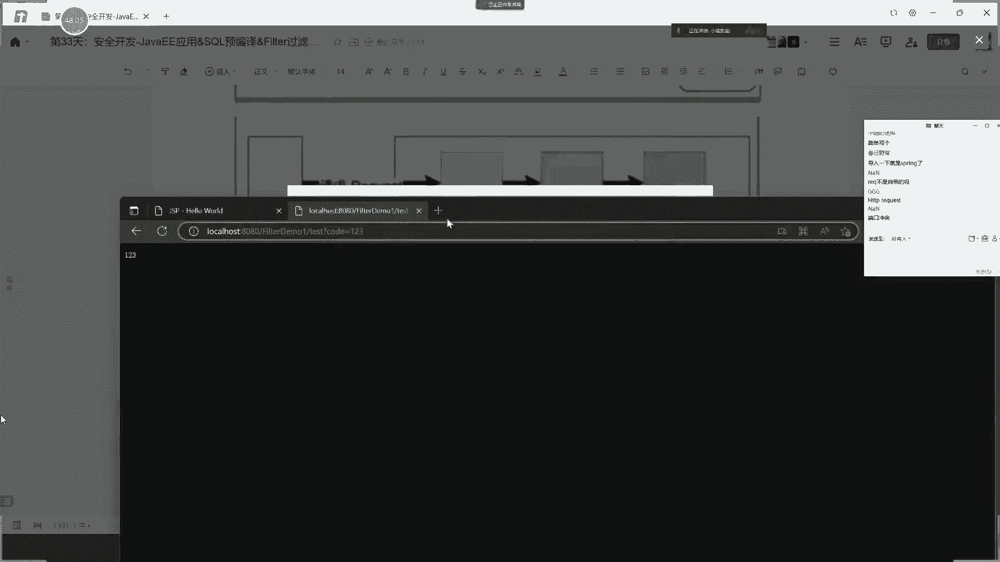

大家看一下啊，我我现在去访问啊，对这这浏览器和完了他开启过滤对吧，我访问这个test，这什么情况，哎呀这呀真是啊，你妹的一波接一波啊，有时候那是服务器问题，有时候是这个问题，搞都搞不明白，这东西。

他有可能就刚才说的窗窗户冲突那些情况，这里是个什么错误啊，啧哎呀，换个端口吧，好可以了啊，不知道啥情况，这个端口突然被占用了，莫名其妙啊，访问test嗯，他包了个来开，正在过滤好，我们先看一下啊。

我在这里呢我输cod正常的时候123哎，他输出123，你看正常啊，但是当我这里呢按照刚才那个需求的时候，我这个形成夸赞语句的时候，你看一下啊，我夸你就行，你虚的时候，那你再看一下，这是code吧。

执行哎空白提示什么存在XSS攻击，不显示了，对不对，它不显示了啊，这过滤就完成了呀，就现在他没有执行这个方形拦截到这里来了，程序就不再运行，所以他就没有压根就没有到这里来了，没有到这个特斯来。

他把拦截了，能不能理解啊，他要这样ZI，那才会把数据放出去，它才能正常显示数据，对不对，所以它显示的也是没有问题的，就是说你这里呢是这个语句的时候。

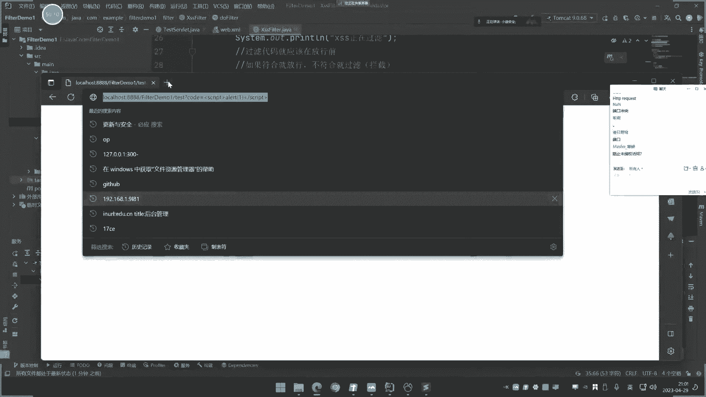

哎，它不显示哎，但是你要换成这种正常的哎，它就显示是吧。

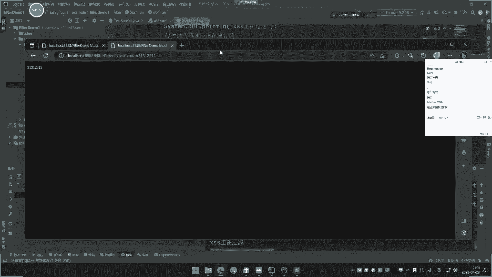

因为它呢正在过滤，然后过滤了发现呢你是能够攻击啊，就是好的，正常数据好把它放行出去，然后再传到了这个什么这个test civiliz来，然后呢执行后面的这个代码啊。

刚才那就是攻击语句里面有这个攻击plow的，那导致呢他就直接呢来到这个else里面，因为这是个非嘛，就是说检测到有这个script，然后呢直接只提示差在攻击，然后呢不再放行，就是一直拦截到这里来了。

嗯好这个呢是我们这个XSS，那么像未授权那些东西呢也是一样的道理，那么也是一个大概逻辑，我可以把它简单写一下，就比如说这里呢我们再创建一个这个，ADD me点select就是模拟一个这个模拟一个是什么。

模拟一个这个后台的，一个这个这个这个这个这个后台的页面，对不对，我这个后台页面啊，然后呢也是一样，这个do get呢把它写上去，比如说我们就简单代码来copy一下啊，叫他来啊是吧。

就简单打印一下就可以了啊，那就直接打印吧，直接打印下，好就直接直接用那个ISP呃，把它打印下，嗯就直接用这个打印吧是吧，这个编码和什么头部这些东西呢，我们就不把它输了啊，就直接打一个，三还是十节编码。

好我就模拟一下啊，这个呢就是说进入这个地方的一个情况，那么再来做一个简单的一个判断啊，这里那就直接进入我们直接访问这个地址呢，再把它写成个路由，C好路由地址，那就是访问ADD me页面是吧。

那有大小有过滤啊，有大小区分的，所以这个大小写大家注意一下啊，去请求这个地址之后呢，就会触发这个欢迎这个页面好吧，我们先把它运行起来，只要请求阿德米，然后他就会提示这个东西。

然后呢我在判断时候判断他是不是阿米啊，我们看下啊啊阿米啊，提示欢迎登录ADD云界面是吧，能够有个提示啊，好那么现在呢我写个过滤器，那么呢再加上一个过滤器叫ADAM米，fight12过滤器。

名字也是按照刚才那个逻辑来，也是按照刚才那个逻辑来啊，也是刚刚那个逻辑来啊，额怎么写呢，嗯也是那几个方法嘛是吧，也是那几个方法，一小区啊，ES的，嗯这里呢就是那个过滤的啊，然后呢我们用个什么过滤呢。

就实现原理，那就是这个检测用cookie吧，cookie最简单嘛，cookie的一个过滤啊，选择cookie的过滤啊，同样道理呢，也是这个和刚才这个XSS呢是差不多的。

就检测到里面那个cookie呢是否有有cookie，里面的带什么值呢，就让它放行，那么也是和刚才代码一样，把这两个先拿过来，在这里写一下啊，啊这个呢就不再解释这个了啊。

这个就是直接REQ点reget cookies，然后呢再声明一个这个cookies，然后cookie等于这个值，然后for循环呢把这个值取出来，这个就是cookie那个机器啊，如果说你不懂的话。

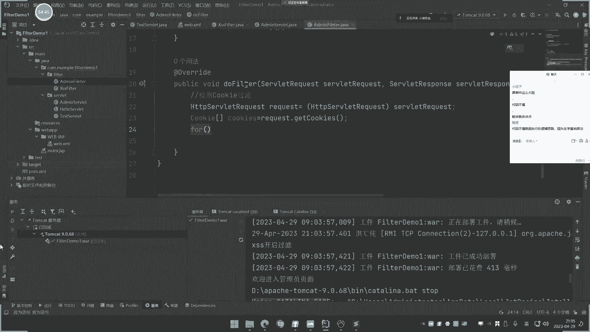

可以查一下啊，比如说这个java web的一个cookie的一个获取，这网上都有啊，cookie呀，C型呀，或者说那个JWT的啊都可以啊，这个是无所谓的，你也看下啊。

他的一个简单获取cookie那个代码啊，来这里有，完了这个for循环啊，还有网上很多的这种，cf嗯都有啊。

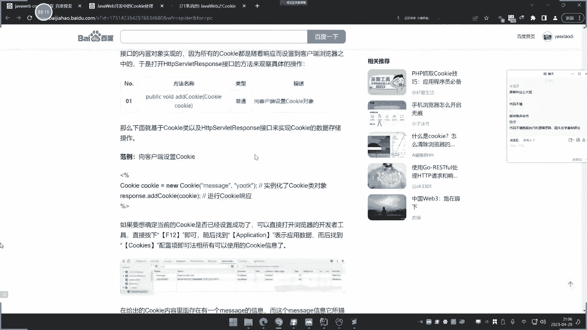

来进行for循环，然后我给大家简单说一下，简单写的话就可以这样去写，三分之1I等于零呀，然后呢这个I小于等于这个cookies点呢起路径，然后呢再喂在家加，那这个呢把它声明一下。

哎这个是cook没有生命啊，好啊，声明一下，来加个这个东西啊，啊有这个东西之后，然后呢在他去取他这个值啊。

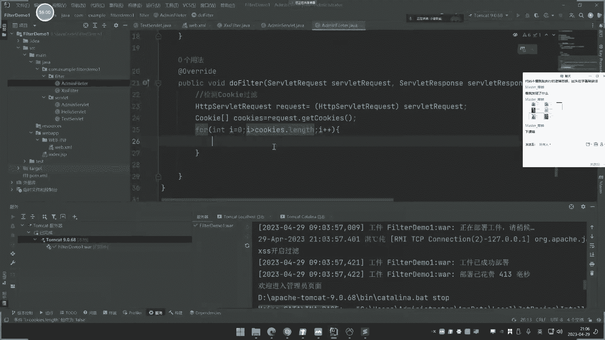

取它值，这个呢你可以在网上，那就是这个为什么这样写啊。

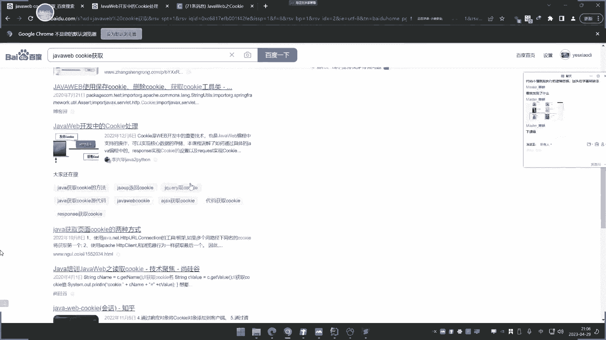

这个网上是有这种代码的啊，我虽然没有商啊。

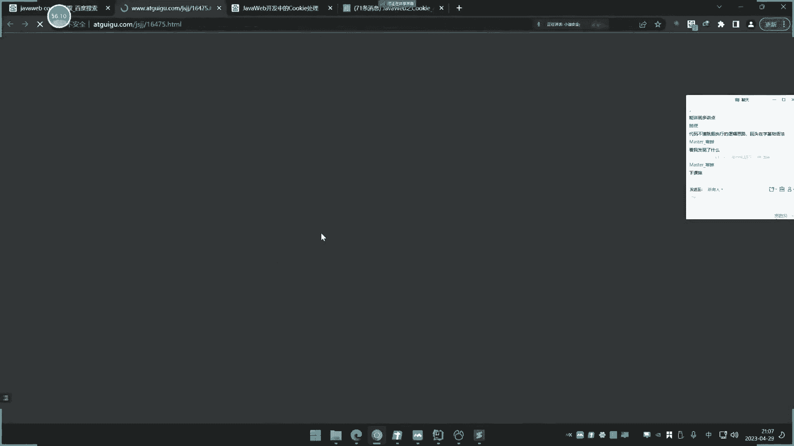

没有伤，但是这个东西呢是一样道理，你看他这个也是一样的道理的，你可以看一下呢，他也可以这样写来获取它的一个值，我们可以把它通一下。

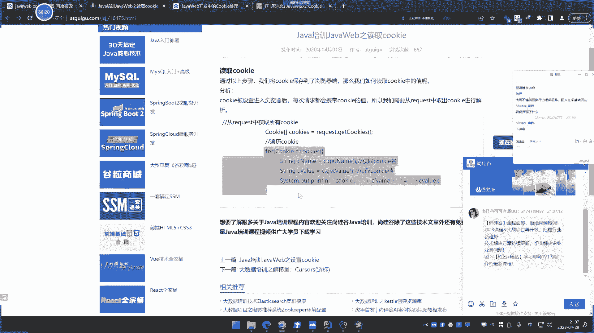

也可以这样写，这是获取cooking的类名和这个打印这个地方，然后这个是cookies，好我们给大家看一下啊，给它打印下，打印一下这个lemon，然后呢再打印一下这个C维度，那获取一下，看一下啊。

啊这里呢后面呢先把它放形象，这个方形是先要做的啊，等下让我们再判断，就说先判断这里的行不行啊，那先方形一下，就说先判断判断之后呢取cookie，然后呢我们等下再判断这个这个方形啊，不先不管他来。

然后再给他去调用它的路径嘛，路径就是这个alt web fight，然后呢是请求这个ADD me是吧，就出发来运行起来，先看一下啊，我们访问里面的cookie。

是不是能获取到一些这个访问的cookie信息，好我们看一下啊，呃现在呢你看xx过滤开启，然后这边呢我没有写啊，这个没有写这个enemy的过滤开启，我就先看这里啊。

看一下我们这个访问ADD me目录的时候，会不会打印一些信息，访问艾米之后呢，你看是不是有cookie信息，你看好安德米呢，你看一下这个关系在里面哎，来网络地址这里啊，刷新一下，你看看阿米的这个响应包。

可以看一下，在这里请求包这里呢是有cookie信啊，你看是不是就获取到来了，一个是pp store，还有一个是这个j s session id，这也是获取到两个，你看对不对，然后再发行。

所以我现在呢就基于一个很简单的判断，就写个什么呢啊简单过滤，这个呢是取出过滤它写下啊，这个是对这个cooking值呢进行这个编译啊，显示，对，那现在呢我们这里呢也是把它写好点对吧。

写完完整一点split了，打印是吧，这个是ALEMY简称，身份检测开启对吧，然后呢这个是，这个结束之后呢，就是检测关闭一，销毁，好这边呢就是在检测之前呢也给大家提示一下，提示一下这个检测进行，对不对。

这个是开了开启好这个进行好，这个呢就是判断一下，我们这就纯洁的判断一下嘛，就判断下什么呢，if这个C雷姆就是我们说的获取它的名字，C类目里面点里面有没有什么啊，CNM就是获取它的名字叫user。

并且并且这个值等于什么什么，就是他他的那个好不点，你们单位的这个值带什么ADM，是吧，然后呢，如果他等于就让它保行else，就怎么样输出一下，调试一下是吧，非法访问不是管理员用户访问，plasma关于。

好来跑一下，就检测一下这里面的这个CNM啊，里面是不是user啊，值呢是不是等于2米，那么等于方形不等于非管理访问，来看一下。

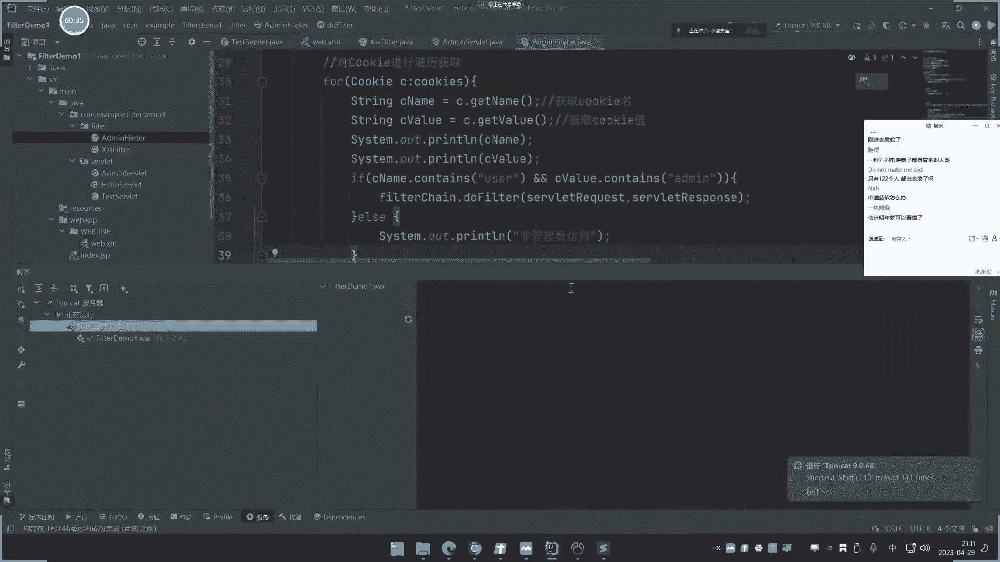

好我们看一下啊。

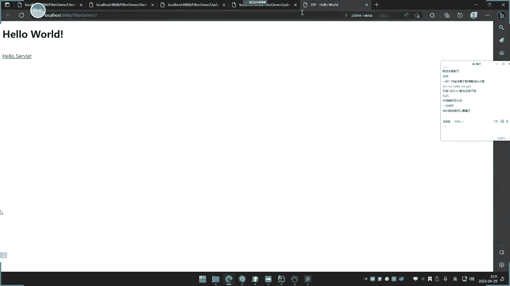

现在呢我没有加任何cookie，我去访问enemy其实是什么非管理访问，看到没检测到啊，非管理访问，对不对好，那么现在我们来尝试修改一下cookie。

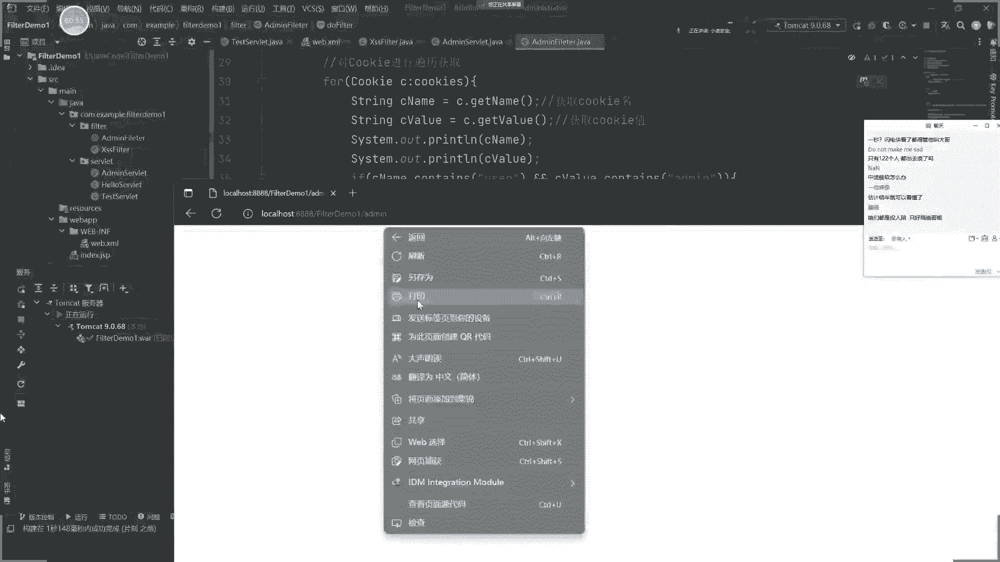

看一下啊，在这个应用程序这里，那找到这个地方来访问，这个地方加上一条user值呢，为AD米写上去，再来刷新一下，看现在啊，先把它清空，那获取到user admin，欢迎进入管理员界面。

这是一个简单的用cookie呢去验证的一个情况，就说我们在这个页面中呢并没有写任何代码，但是呢在过滤器里面实现了这个cookie的一个检测，那么同理啊，在C型里面也是一样道理，对不在C型里面也是有道理。

那么你可以说我没有讲C型呀，那马上监听器我们也会讲到C型，在这个java里面除了cookie session，还有高端的技术用到JWT，就是这种全新的也会在后面讲。

但是我们单独在讲身份验证的时候会讲JWT，就说生的颜值呢可以采用cooking，也可以它C型好，那么呢也可以采用JWP，还可以采用其他的JWP那个技术呢，我们后面再讲这个身份验证。

这个功能实现的时候再讲好了，这个C型呢这个库啊，这个过滤器这个支点呢我们就讲到这里。

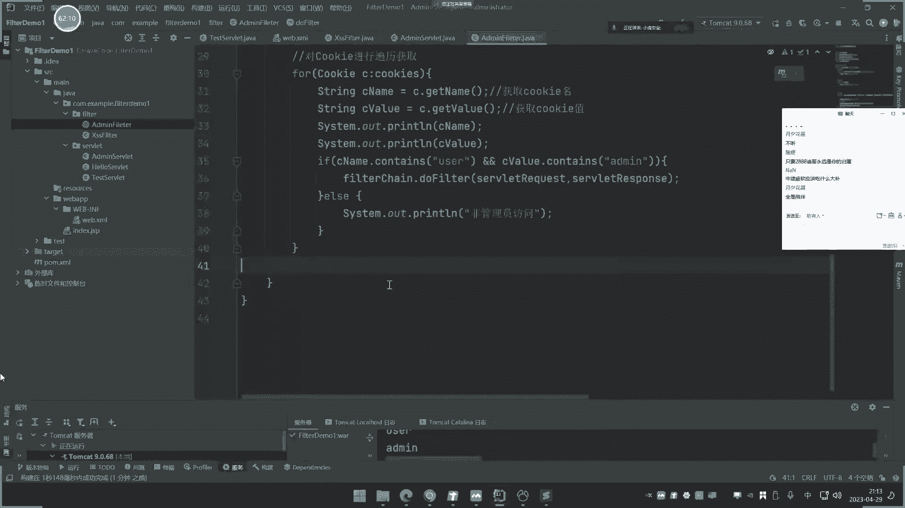

从这个字典这里呢大家就能看到了啊，我已经用了这个两个案例，就是这个，这个payload检测啊，PYO检测权限访问控制，包括后存内存码，我给大家演示一下啊。

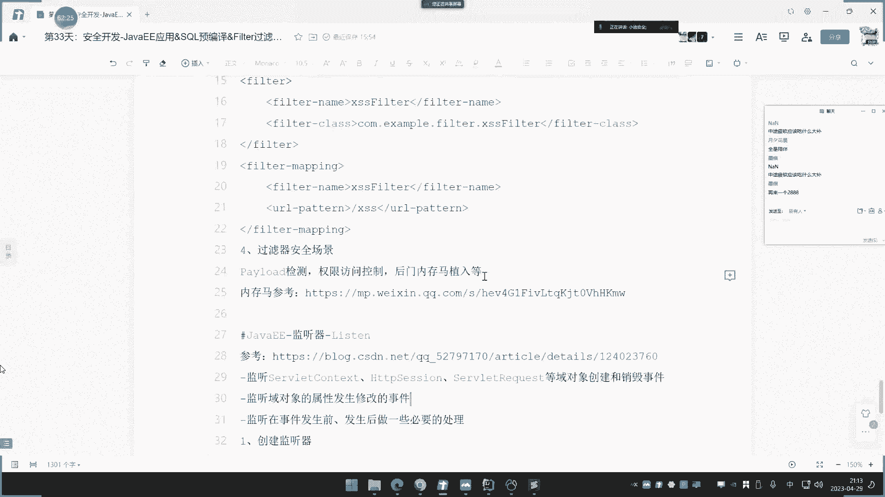

现在呢我给大家检测一下内存码这一个东西，你看我这写了两个哈，我把它关闭一下，现在呢我们来模拟一下内存码的一个简单实施。

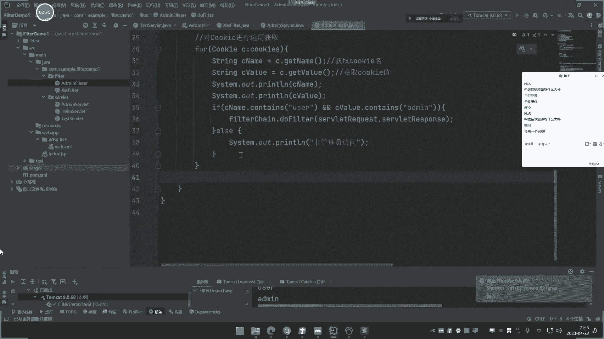

看是个什么情况，大家就知道了啊，这不用看原理。

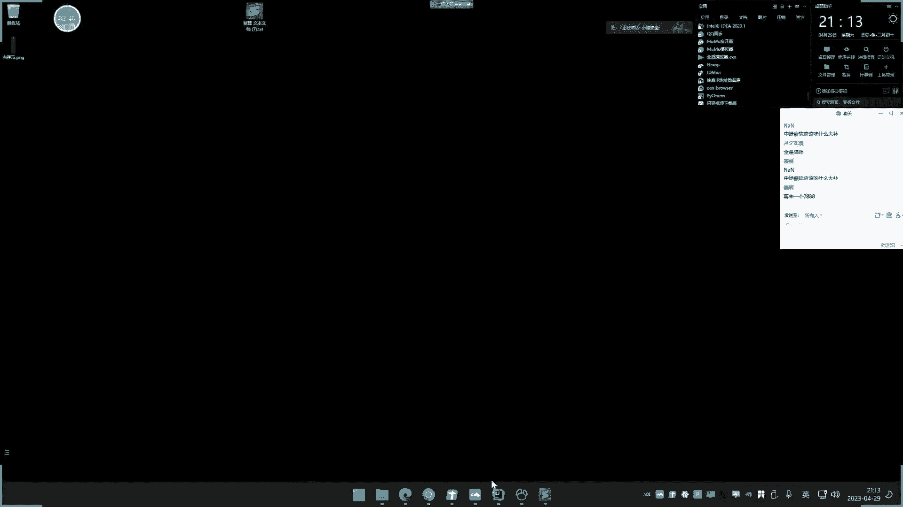

简单来说大家看一下啊，额模拟一下啊，这个模拟呢不需要大灰，因为这是后面字典，只说我讲到的开发呢顺便提一嘴啊，就是告诉大家我们学这个知识点呢是有用的，它是便于后期对一些更高级的知识点呢，能够知道原因。

并且呢能够拓展避免了是吧，你这个下去之后都不知道它原理。

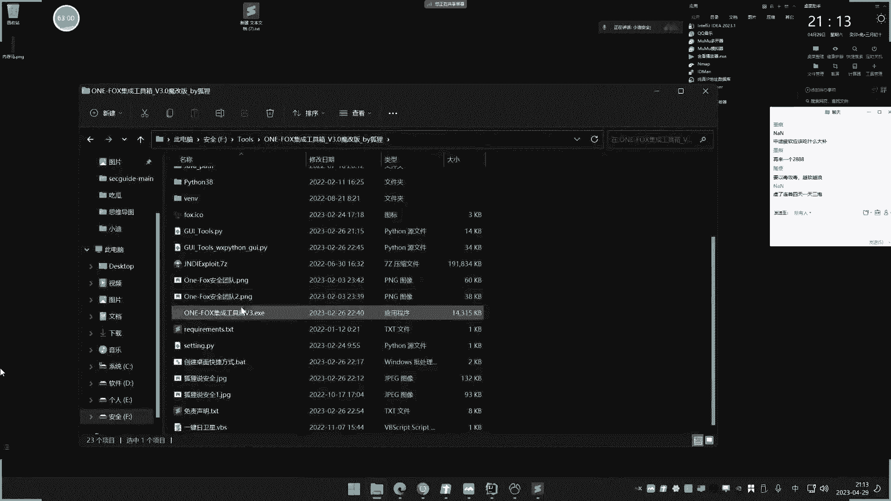

也谈不上这个如何检测它，首先呢我们可以用一下哥斯拉这个，后台控门工具，在上面呢我们做一下简单实验是吧，比如说我们先生成一个后门，这个呢不需要大家理解的啊，就是说我们来丰富一下，就说学完这个知识点呢。

它其实是和和我们的很多这个，这个安全相关的啊，那讲一下java这里生成一个这个JSP的，然后呢放到桌面啊，然后取名叫疑点J档，疑点JSP啊。

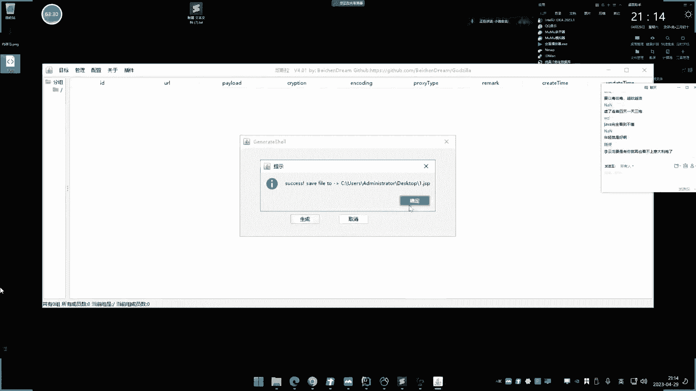

写上去，然后呢，再把这个疑点JSP呢，放到这个我们这个目录里面哈，这是程序的web目录。

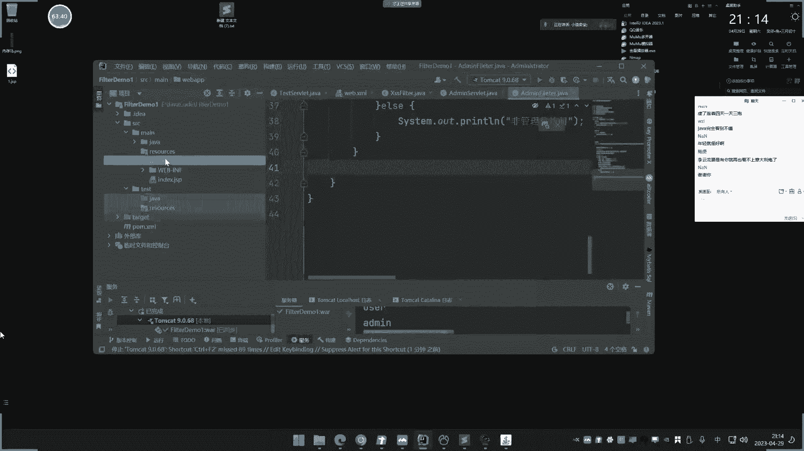

放这里面啊，然后这里那就把启动，那么现在呢就是先有疑点，JSP的放到我们的后门，我们来访问一下一点JSP啊，好我们呢再用这个home门工具呢去连接上去。

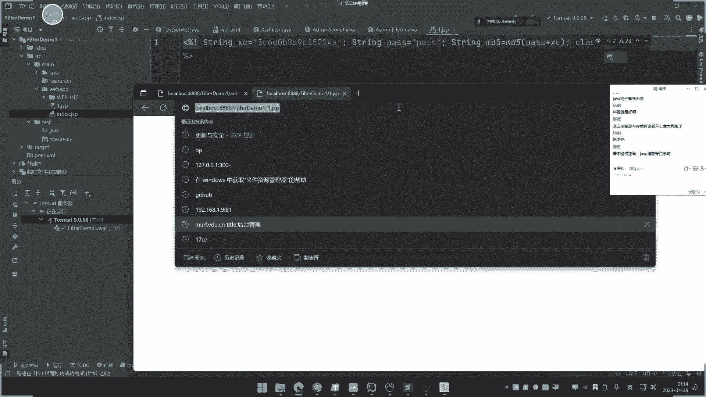

你说我是讲开发吗，不是的，完全都是为了我们后面那些高端置顶，来做准备啊，连接上去了，好看一下，R连上去之后，他这边有几个功能，大家看一下啦，一个辣椒叫什么，哎，跑哪去了，来mori cell内存嘛。

还有个叫什么，你看fight sell，什么是我今天讲的这个监听器shell啊，然后你看这里有个什么叫get off file，然后那个什么a ADD file cell。

还有个叫remove remove，这意思说获取所有添加和移除是吧，我读的不标准，但是你妹的我我英文看得懂啊，你不要老说什么我英文差是吧，我也不差的啊，只读的差了点啊，不好意思啊。

你看啊那获取所有的这个监听器，点一下，你看他获取是什么那个科目，那这里有个叫admin，还有个啥叉SS，这是不是我这个项目生命的这两个呀，这是不是我生命的这两个呀。

然后你看下面还有个叫什么tm cut verbs，Websocket socket，就是什么tomcat的这个网站的这个socket嘛是吧，有一个那你可能会问，那这个我没有搞啊，这个是中间间的。

这个是中间间的，明白没有自带的啊啊这两个是我们项目里面的，然后你点一下那个叫enemy fighter cell，就是添加，我们点击添加之后，他说OK好，然后呢我们再点一下获取诶。

多了一个对这多了一个多了一个，啥情况，多了一个，然后呢，其实就是说他在你这个项目里面，有新建了一个监听器，所以也就是说那个内测码的这个技术原理。

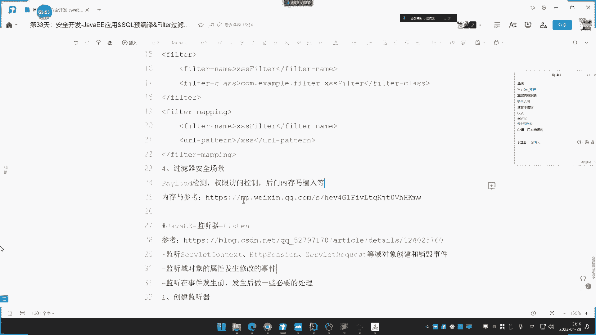

实现的，我们不说他怎么实现的，你先说流程呐。

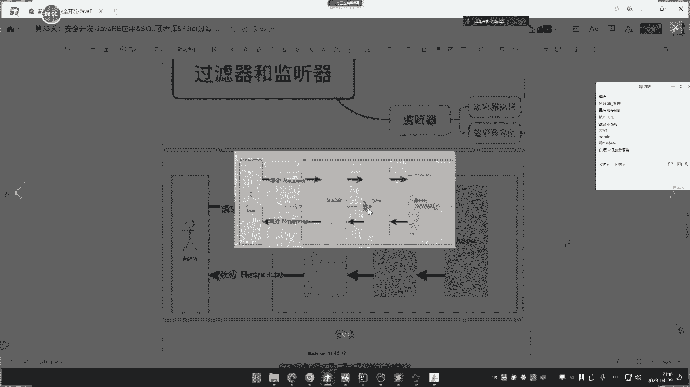

就看这张图，好理解点了，内存码呢按照常规后门，那这是常规后门，是在这是在什么啊，长过后门呢是在这个里面在商传后门是吧，常规后门是在这里面在操作，而内存码呢他用的这里有个功能，用这里内什么，那是植物。

这里添加了个监听器，那么监听器你去访问的时候，我刚才说过，他的路径是先访问监监听器，然后再访问这个过滤器是吧，然后呢再去触发到这里来，是这么个流程，我的后门呢相当于是常规后门，那我在这里是吧。

就是我们的常规的是常规的啊，正常的啊，就是正常后门是在这里，对不对，在这个地方哎，你访问这里，那么说，其实就算你返回长度后面也经过了这两个地方，而现在呢它的内存码呢是写到这个地方来了。

内什么写到这个地方，那么我问你利用常规后门去找文件去清除后门，是不是找找这一层的地方，所以你清理内存嘛，应该是要来到这一层去清，如果说是这个内存码的话，那么同样如果是Z层内层码的话。

你是不是也要到这一层再去清理才行呀，所以说为什么说它的清理和常规的后门不一样，常规后面就是扫网站路径，因为扫网路径就是在这一层嘛，原代码是在这一层，而这个监听器呢，他是在运行的时候呢比他高一级。

所以刚才那个那个那什么都查不到，这来了，啊这个呢我不能再细讲啊，细讲就讲的内存码，到时候呢我们在讲内存码的时候呢，有这个支点之后，那就好讲多了，我再把一些知识点呢再做实验给你分析一下，你就知道了啊。

那么你就可以自己呢，知道为什么网上有些脚本能清楚是吧，但是你一些工具你不不能实现，就是要进行调试好，我们要进行调试才能清理啊，好这个呢我们就不说了啊，重启是不是可以解决，对的啊，重启能解决啊。

但是重启之后呢，要先把删掉，重启才有解决，如果你不删它也可以成功的啊。

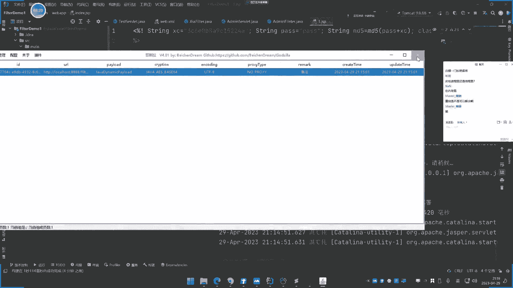

你把这个清理了还重启，很麻烦的啊。

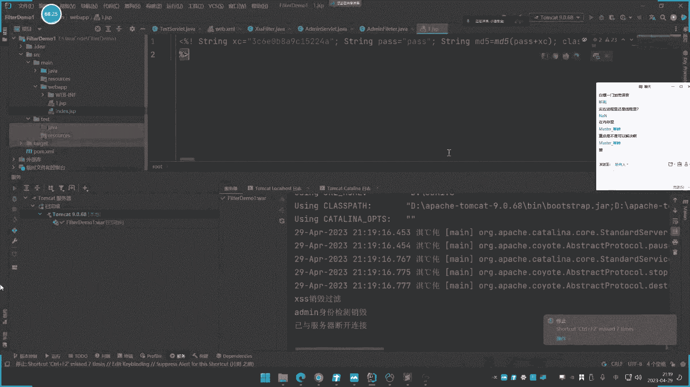

这个不说啊，我们到时候再讲好，这个是我们说的这个过滤器啊，过滤器这个支点，那么现在再来上监听器医生，那么从这个图片上面呢，大家也可以看到过滤器呢是在第二层，然后呢他是在第一层，就是在这里请求的时候。

首先监听监听器，监听器是啥呢，间隙我们解释一下啊，监听器呢他是专门来监控这个东西的啊，然后呢监控什么东西呢，给大家看一下这个参考文章，啊他这个呢是属于什么情况呢，他是监听这个，操作的可以说是先进操作的。

就比如说对象被创建呀，对象被销毁呀，它就会触发经济，或是对象里面的属性值被更改呀，或者说像有三大类，你想啊有cookie被创建，有这个数据被更改，有这个请求被创建，就是有请求的时候可以触发。

有这个cookie被创建，会会触发，有这个什么职被改变会触发，那他就不是说哎这个我访问某个特定地址，触发某个特定地址出发，不是这样的啊，他说你访问什么东西，你可以触发，但是呢如果说你有些动作。

那么一个呢那个过滤器呢是一些访问访问触发，而它这个呢就是什么动作触发，就说你有些人创建东西，有些销毁了，他就触发它，他其实和我们安全相关性不是很大，跟过滤器相关大一点，这个间接性的相关不大。

他的这个关系大，为什么讲，它是因为有时候啊，一个是内存码里面也有这个监听器技术，还有一个呢是我们做代码分析的时候呢，有些东里面会触发监听器，我们也需要了解的，要跟踪这个代码的执行流程的时候。

所以呢我们讲一下监听器啊，它比较简单一些。

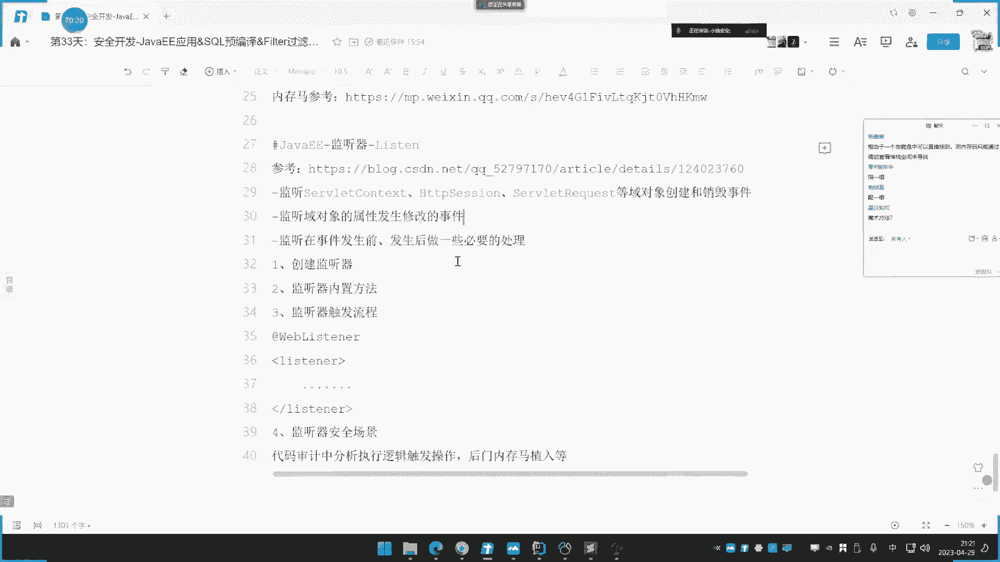

我们来看一下啊，它是如何操作的，他是来去监听动作的，而不是监听你的这个访问哪个地址，不是这样的啊，就说你有些动作，不管你访问哪个地址，只要你有动作，你访问谁，我都监听，就这个意思。

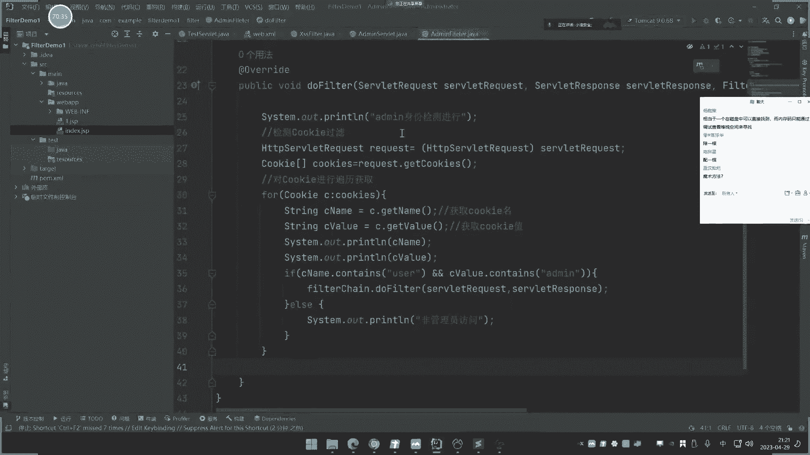

那么它监听的一般就是这三大类，就像什么这个啊cooking呀，这个C型被创建呐，被删除啊，包括这个有请求数据啊，或者说请求里面有对象创建啊，还不给直，别改变，就是我们说的这个这个三类嘛呢，三内。

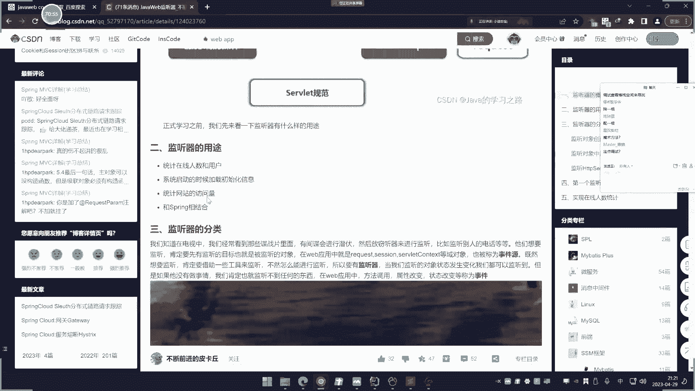

他一般用途呢就是我们可以看到啊，他有些用途哪些用途啊，这个写的啊，呃这个什么在线人数统计啊，包括我们要启动时候加载一些初始化信息啊，啊统计网站的访问量啊，它和一些企业spin结合呀等等啊。

它和安全相关不性很不不是很大啊，但是也有像我们内存码呢，也有这个也是个什么监听器类什么，包括这个代码分析里面也要会讲的哈，我们来这里呢再创建一个项目啊，就不用这个写了。

再创建一个项目嘶名字就叫这个建立起listen点，DOMO及，嗯创建，好样道理啊，把这几个无关紧要的给删掉，避免里面的看上去烦的很，也不知道是啥玩意，好那么现在呢我们打开它这个程序啊。

那监听器呢那就不卖关子了，直接开始弄也是一样道理啊，我这里呢就创建个目录来把它存放，哎先把这个路径吧复制一下，等一下呢好引用双键重新买一包啊，嗯名字就叫这个listen，好这是整体的目录啊。

把它放到这里面，然后呢这个就也放进一个吧，也把它放放到这个script里面啊，SOLIATE里面也放soviet里面，避免了啊，这里呢看得更加的是吧清晰一些，把放到里面去啊。

这个hello就放里面去重构一下呃，这个呢就先起我们呢先写两个这个演示的，先写两个演示的啊，比如说我这里呢就演示第一个啊，C，C型就叫cs c型C型C型的一个操作啊，C型点这个文件名。

然后呢再创建一个这个d n d session，那这两个代表什么意思呢，第一阶段destroy，然后呢C就是great，就是我们说的创建和销毁的一个前称，那这个呢就是创建，我们来继承一下这个方法呀。

嗯嗯这个AGB哎，那就用这个了，ABC型是吧，嗯session额写诶，好像不是这个吧，是那个AHTTP，B session，Session，写这个吧，创建方法，啊哦这个是写了个歼七里面的，搞错了搞错了。

嗯这HBC型就这个吧，就这个啊，呃我们在里面写个main函数，哎这里又怎么又不对啊，搞错了，这个，东西吗好使，这个C项我先看一下啊，先来个下实勋，哦还是要app的，好像是哎，对对对，搞错了搞错了。

这个是这个创建C型啊，然后还还还用那个app，那个不用这个，还用这个还得是它好用这个啊，然后呢我们在这里那就进行一个，这个do get方法的一个操作，然后这里呢就REQ2点get session啊。

这个就是创建session的一个操作，这个就是创建session啊，这我们就直接这里就相当于创建session啊，这个传的声音，然后呢这个创建之好啊，这个是创建C型啊，然后这边是销毁销毁的也是一样啊。

也没有什么抬头这东西啊，就是加一个那个函数就可以了，哎差点又写错了，也搞个就get吧，IUQ点，get session点I，这个是销毁，这个是销毁啊，呃在这个提示之前呢，我可以先输出一下啊。

先把进行一个输出，这样告诉大家啊，这个是我们说的这个销毁，销毁C型的这个代码段就进入到session销毁了，是吧啊，这边呢就去访问，那时候呢就提示一下这个，创建session，好这里呢是一个是创建。

一个是那个啊session和cookie呢我们前期说过啊，一个是绘画，一个是那个平局啊，啊这里面就两个啊，然后呢我们分别写一下这个路径啊，比如说这个叫OBSE，就不写那个配置路由了啊。

其他里面都可以在那web server里面去配置，在这里配置也是一样的啊，这个呢就访问路径就是创建嘛，我就写个杠cs啊，然后这个呢就是杠DS，杠DS好，我们先运行一下，先不把这个不把这个监听监听器写好。

先就说我们只传这两个啊，来看一下它是不是正常的。

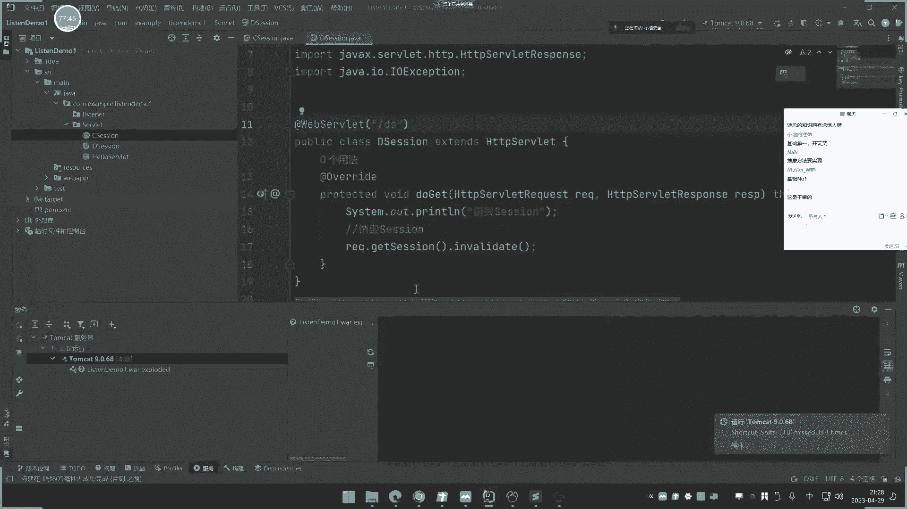

好我们来看一下啊，现在访问那访问一下这个GCS，那创建session是吧，没问题，那DS那销毁C型啊。

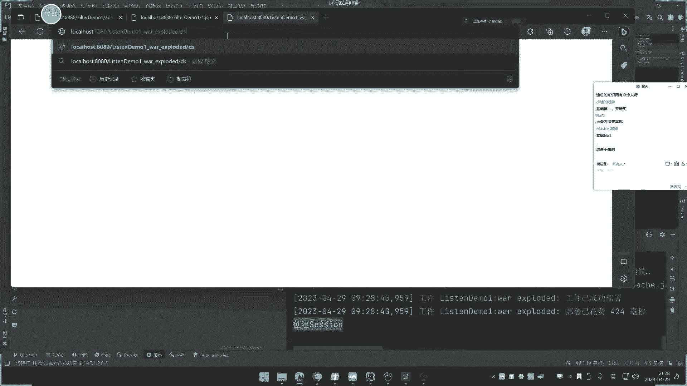

其实也没问题好OK那这里大家就知道了，好像现在开始来搞监听器了啊，间期呢就在这里创建，我们就单独发了个目录啊，这里那就保存这个代码呢，公子是吧，就交一个这个C型的一个操作嘛是吧，那么就叫listen。

session这个间隙嘛好，那这里如何操作呢，那首先前进区，然后呢是这个C型的一个操作嘛是吧，对不对，那就选这个了呃，AHPC型listen专门来操控这个C型的，然后呢我们做个简单例子，看下它的存方法。

然后里面有两个，一个是呢窗建调用方法，一个是这个销毁的方法，好我们先来把这些去掉，比如说创建的时候呢，我们就输出一个什么，输出一个啊，这个，哎输出个什么呢，这个监听器，哎监听器，Session。

监听器啊，创建，监听到了创建啊，监听到了创建，对不对，就写个监听到创建，然后呢这边呢就监听到了什么销毁，然后呢让它生效该如何生效呢，它不是以路径去生效，所以他只需要写一个什么website。

web website就可以了，它的生效呢不需要写路径，因为它不是以你访问的路由去触发，它是用这个什么检测到哪个地方被创建C型，它就直接触发，知道吧，他不是说哎你访问那个地址之后才触发。

不是说哎我访问这个什么DSA就那个啊，是因为你访问这个地址呢，所里面呢有这个销毁C型，所以他才触发，不是说你访问这个D值触发啊，大家要明白啊，那个地址是触发这个代码，这个地方这个代码呢有销毁。

那有这个销毁工作之后呢，它就会就这个操作好，我们来分析一下，看看是不是这个道理啊。

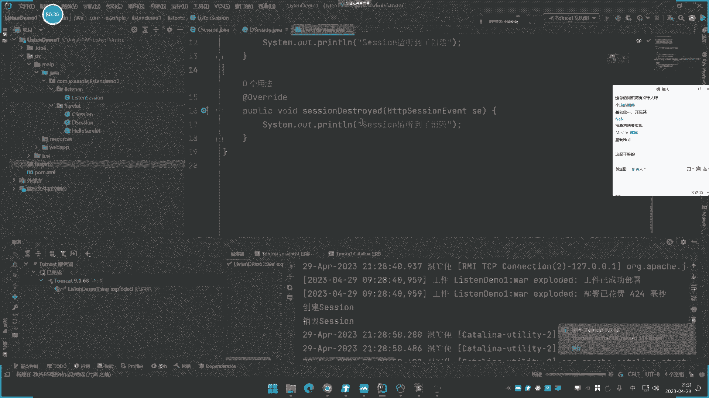

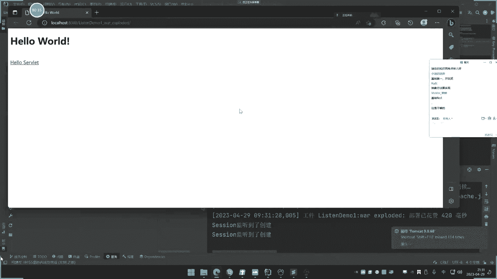

好大家可以看一下啊，来我打开的时候，他说C型监听到了，创建C型监听到了创建啥情况，我运行的时候啊，好那么现在啊我们来看一下这个，因为它初始方法访问就会有这个创建啊，我们访问下cs执行，你看创建的C型。

对不对，创建C型，好我再访问DS，销毁的C型，你看C型监听到了销毁，看到没，当我再去访问cs，那创建了C型C型监控，监控到了创建，能不能理解啊，是不是这个逻辑，你来啊啦，我放cs，它会创建C型嘛。

访问创建C型DS待到销毁是吧，然后呢，我在仿cs，你创建了，并且我监听到了同样道理，我再访DS，你销毁了，我也监听到了，对不对，他是什什么一个逻辑啊，他的执行顺序是一个什么什么逻辑啊，很简单的吗。

就是那你访问的时候，如果你有创建session的话，那么这边呢就会执行这里就像说啊，这就是检测有session创建就会执行，这里，对不对，那么呢这边就是检测监听啊，监听检测销毁就会执行这里，对不对啊。

如果说都没有，那么就这两个这个监听器就相当是没有，什么都没有啊，如果说都没有，就是都没有啊，大家知道，如果说U没有创建呢，又没有C型，那就不会执行，但是由于我们网站访问呢。

它只会创建那访问这个地址时候呢，就会创建session嘛，所以说它创建session的时候呢，一个是执行这里创建C型，同时呢由执行这个地方监听器触发监听器，是不是啊，那比如现在啊我们再把清除我访问cs。

是不是创建session，并且呢监听器也监听到了，我为了这个更加的明了，我可以把这里再提示一下啊，这是什么，这个secret里面创建的C型，对不对，然后正面的就提示这个监听器，这面就提示这个什么监听器。

这面，是吧，检测到啊，把提示器搞得好一点，大家就能知道他这个逻辑对不对，那重新来一下啊，好来访问他为什么有这个C型啊，因为我们访问自带了C型，你看一下啊，他的访问这个数据包里面是有这个东西的。

它自带有啊，你看这里他自带里面有那个C型的，有这个东西啊，嘞它自带有，所以呢它自动的执行到了啊，我先把它清空好，我们先把销毁了DS访问下DS是不是检测到了，访问DSS就触发这个DSS这个java文件。

对不对，大家就提示啊，好销毁哎，你一旦销毁这里，那就销毁这个代码被执行了吧，一旦销毁之后诶，鉴定机发现了，你又销毁，所以他就像是执行者里，对不对，好，当我们这里呢再重新cs访问cs。

就是相当于访问这个什么CSC型这里，那么这里会创建C型，对不对，好，我们再访问cs哎一旦访问cs之后呢，哎这里那就执行这里嘛，你创建C型，同时呢监听器这边呢又收到反映了，唉检测到有C有这个C型创建。

所以又执行这里逻辑搞清楚了吧，那么你可能会问，那我一直访问cs，访问这个cs会不会一直创建呢，那就不会了啊，你比如说我一直访问cs，这里呢，他也只是呢执行了C型里面的这个，这个提示操作。

但是呢这个C型的没有创建，你看我一直访问弹呢都没有用，它只会提示这个地方监听器不会有任何改变，因为这个C型的创建一次就可以了，除非你销毁之后呢，再访问他，再创再创建，你重新访问它是不会创建的。

因为这个C型的关键呢。

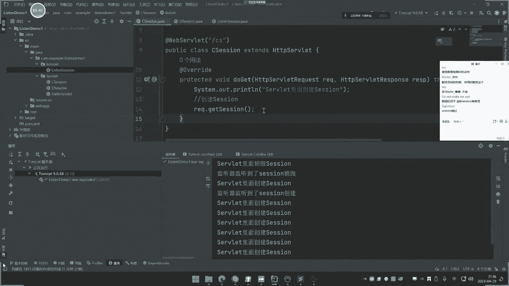

就是我们说的打电话一样，你把浏览器重新关了，再打开它就可以重新再创建，就这个意思，那么这个有什么意义呢，对不对啊，就是我们其实就是说在后期代码分析的时候啊，我们要知道一些这种C型。

或者说一些动作被改变的时候，会不会因会不会触发这个监听器啊，监听器里面会不会有一些逻辑，我们需要了解，这是第一点，但这个呢这说实话在单位分析中遇到比较少，我们学习它的这个监听器，主要原因。

其实还是主要是为研究这个监听器的内存嘛，这是我后面说的，因为后面在蓝队课程里面，红队里面那是要学习植物类什么，红队里面那是要学习这个应季的什么对吧，把它写清楚点是吧，红堆那是植株，那么这里还有个啊。

蓝队是阴极，是吧，这个勒斯码里面呢刚才大家也看到了啊。

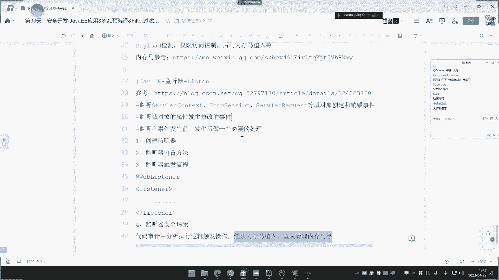

他这个LIA码里面呢。

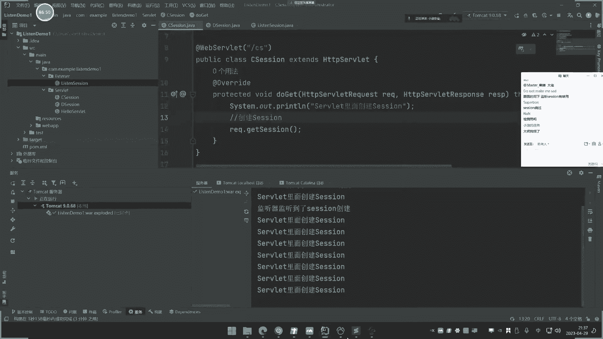

我们这是整个内存码那个章节，这是内测码的全栈技术，常规的WEBB的呢sellate fighter，那listen list嘛，然后呢框架型的这个spin是吧，里面的这几个对不对。

也是有这个什么控制器的，那什么，那那中间间的tom cut的那TM下载的对啊，然后还有这个其他类什么很多了。

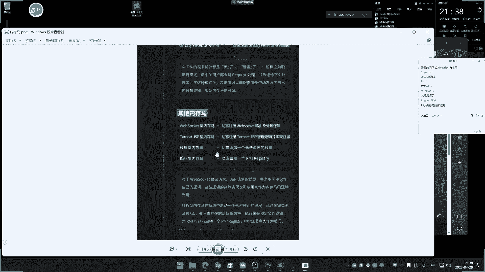

所以说内存码技术很多啊，我们说实话，如果说你要将江独讲内存码，你不了解java的话，是听都听不懂，你只能回中，但是你完全不知道怎么查，或者说也不知道它原理是什么啊，你必须要知道原理，你才能会查。

除非是一些傻瓜式工具是吧，教你直接用工具查。

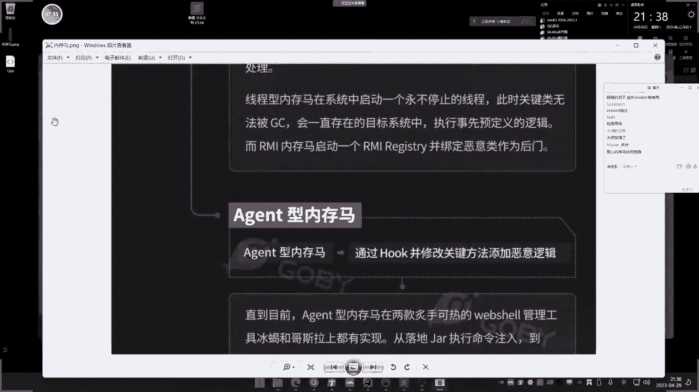

但是工具呢别人不给你，那你怎么办呢是吧，所以说你首先要知道这个概念是吧，监听器和这个过滤器两个概念之后呢。

那么你今天学完这个知识点是吧，知道这两个东西，那么你再看你就知道了啊，简单知道了哦，这个这是过滤器代码啊，过滤器的什么，这个呢是接进性过滤器码，他为什么被称为这个东西呢，你也看一下啊。

他说什么传统的是在内测码里面啊，传统在本地代码对不对，然后呢，这个内测码呢，其实呢它就放在这个过滤器和这个，接近期里面啧。

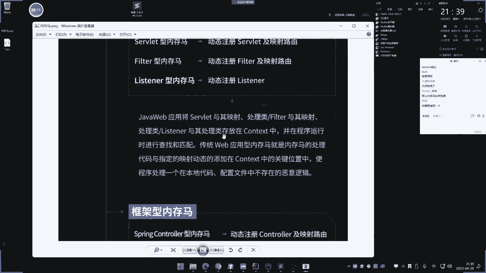

那其实和我们刚才原理说的一样啊，放到了这个里面，放到这个里面对吧，然后那是我们传统的API开发。

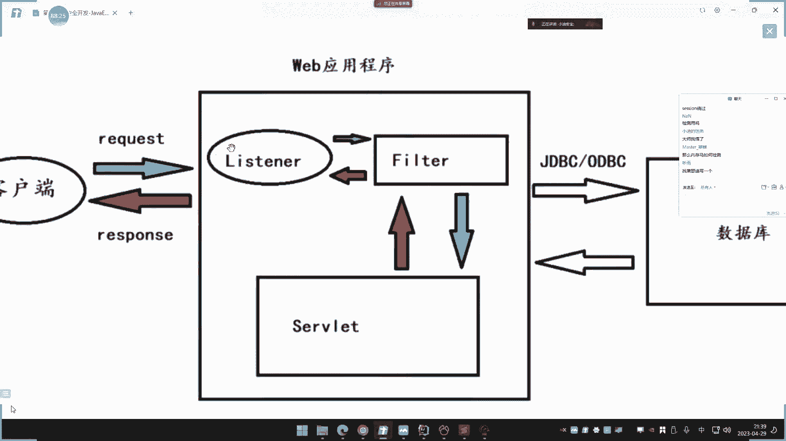

对于传统的API开发呢，所以呢内存码呢也是这种传统的，一旦能用到框架型的spring类型，这个spring类型又出什么console intel，然后什么什么WEBOFISK。

这个这这个地方为什么又出现这几个呢，因为如果说用框架的话，那么他就会用到这三个，另外的三个东西，他就不是我们这里说的这几个了，对不对，因为是框架的，所以呢他就区分类别又不一样。

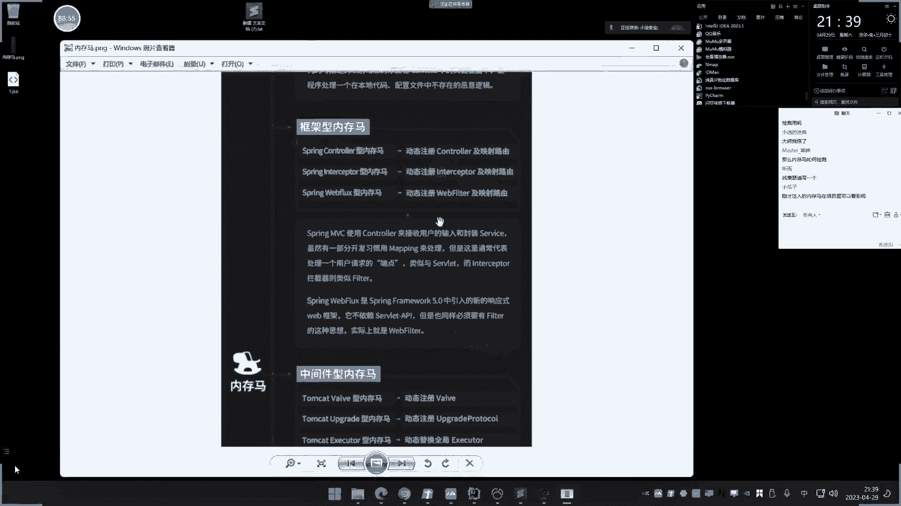

是new不一样咋办呢，难不难呀，卷不卷呢，大家可能会听的一窍不通，不要紧啊。

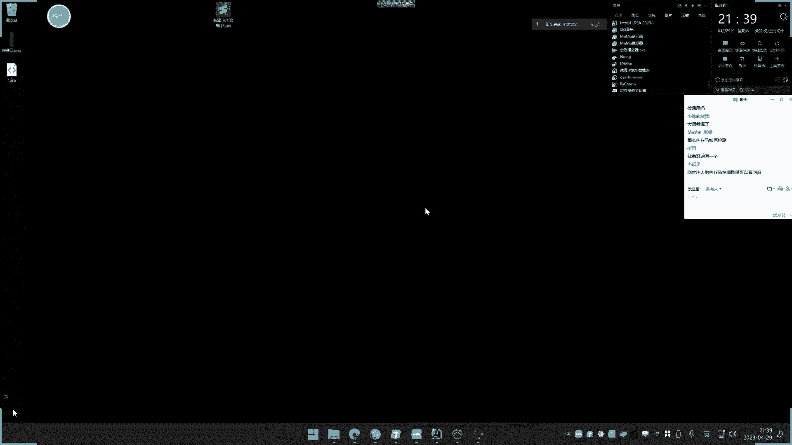

我告诉大家啊，你如果说能够把这个图片里面的这个内存嘛，全部理清楚，原理和查杀都会的话，那你就是蓝队的中高级，只要说你会在会的开发啊，我基本都是高高级级别了，蓝队的高级了，那红队我相信也不会低于初级。

应该就是个中级了，因为你有这个技术，你选红队也是很明显的。

那么但是这些课程的前提呢，是需要大家了解这个什么，了解这个java的，你不学哪知道呢，对不对，你不学哪知道呢，那么面试再问你内存码的原理是吧，或者说他问你这个内存嘛，这个什么内存嘛，就随便问你是吧。

这个这个久远经说的过滤器，医生或这个内什么是什么个情况，为什么为什么和哪些常规版有什么不同啊，查杀是什么，查杀你没学过，你哪知道，你说你告诉他，你用工具查，那显然不是大家他们要想要的答案。

他要的答案就是你能说的他说的原理，并且呢是吧，把流程说一下，而不是说我用工具查，虽然说网上有工具，但工具呢不是万能的，它只能查一部分，而且现在很多工具只差一部分高端点的茶小茶，全部的都是商业产品。

都是商业产品，都是网上一些商业产品，都是设备啊，这是软件设备，没有说这个网上的开源的，这个查所有类什么的，没有啊，全部是商业产品，而商业产品还不一定能查全部，他只能查一部分，那你就告诉我。

你如果懂得这个原理是吧，你就会自己查，这就是你的价值啊，对不对，你不是用别人的工具，你自己把它查出来，用这个知识点去分析来，你把它挑出来，哎那你说你不是中基。

你不是高级，怎么是吧。

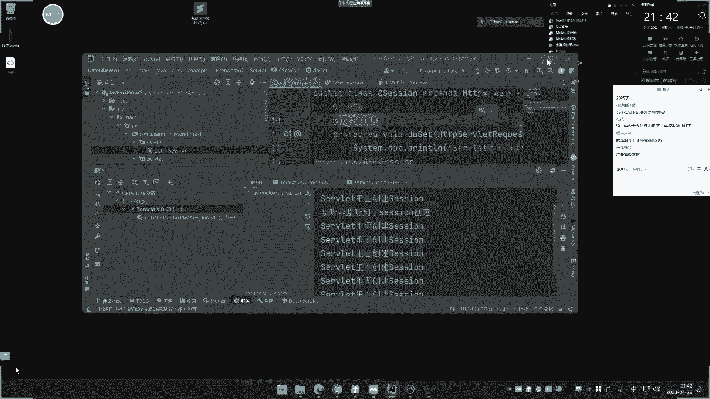

哎呀就不说了啊，所以说java呢还得转不转不行呀。

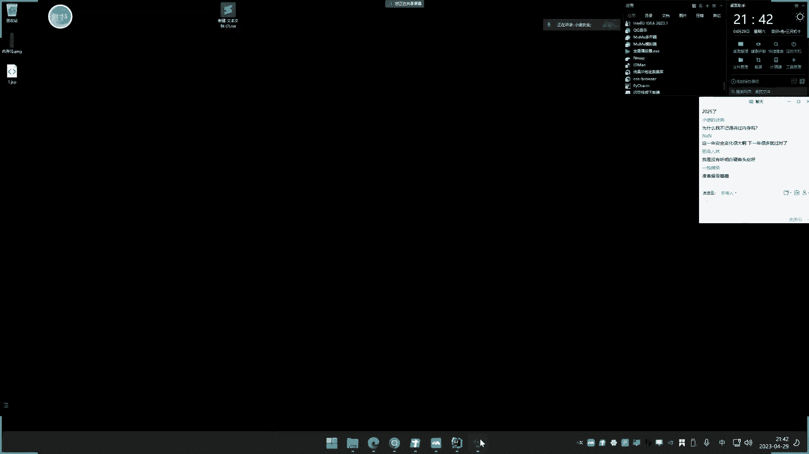

不管是红队的这个直路啊，蓝队的直路，这个内测码呢，就和今天讲的知识点呢是息息相关的，如果说连我今天四点呢，你就听不懂，那内存嘛那个东西那就只能会用了，只能会慵懒，当个脚本小子。

那就完全不知道他是什么个逻辑的，那也谈不上说如何查杀他了，查杀他也是用工具想分析远你呢，那就是扯淡了啊，好今天呢就知点呢就讲这么多了啊，时间关系我们就不说了，大家有什么问题呢，就赶紧问。

然后下节课上什么内容呢，你看啊我这个字典上写的啊，来my bells sb m vc sb boot，这就是网上经典的SSM框架，但是呢我可能是教不了那么深入，我只能说给大家演示一下。

这个SM框架的一个大概情况啊，网上就是这个SM框架的一个开发，就是这个my bels sping spring mvc和spring是吧，然后呢还有几个这个第三方的这个框架组件呃。

小logo世界菲菲斯克JS文呢，那到时候呢会引个多忙的去给他讲，他logo的判断对吧，包括这里呢你看这个还有什么JWT啊，这个呢这个也是刚才我们看到那个框架里面的，那个那个那什么东西啊，这个也要讲。

是不是，所以说我这个把上面写出来的，这个基数和支点呢，全部是和我们这个当前的红队，蓝队的一些技术的原理和实现的相关的，这都是能够帮助你，不帮助你在代码升级中去分析漏洞，也能帮助你在这个攻击的一些这个。

技术手法上面去分析原理，都是有这个关系的，不管是面试也好，对你后期的成长都大大有帮助，说白了这个课程就是java安全，你说我没有讲JA安全，我里面的开发都开始讲了，怎么不是java安全呢。

已经是慢慢的走向高端的，不是原先不是原来基础number one，不要再这样说了，对不对，好了啊，今天就说这么多了，大家有问题就问，没问题就下了啊，顶不住了啊，那么后天呢是一号一号我们不上课。

下次课是什么时候呢，2号或者是3号啊，给大家说一下啊，下次个是2号或3号，不是一号啊，一号当天是五一不上了啊，如何排查内存码，如果拍成，那么大家可以看一下上期的内容，上期呢我有讲过。

不过呢我讲的都是用工具，没有去讲原理，而且讲的是排查一部分全部的没有啊，全部的我估计这期都讲不了太多了啊，这个内什么现激素也在更新迭代，很多商业产品都不自全部，很难的啊，这个东西。

好我们今天就说这么多了啊，大家有问题就问，没问题瞎了啊。

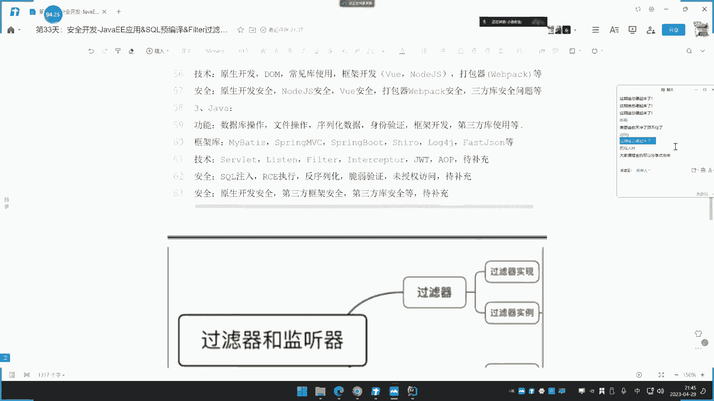