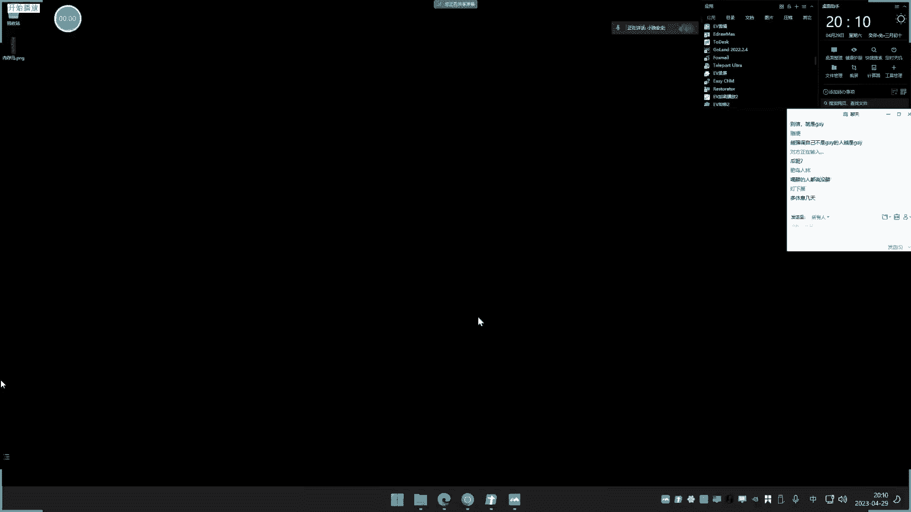

# 🚀 课程33：JavaEE应用ã€SQL预编译ã€Filter过滤器ä¸Listener监å¬å™¨

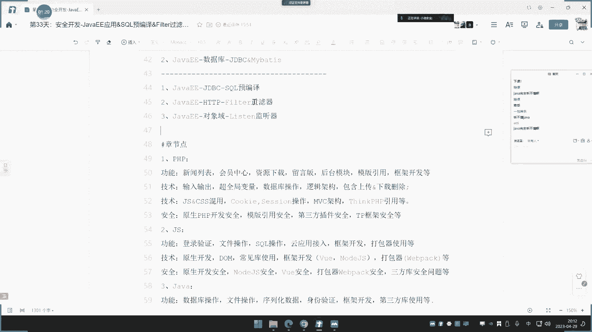


在本节课中，我们将学习Java Webå¼€å‘中的几个核心概念：SQL预编译ã€Filter（过滤器）和Listener（监å¬å™¨ï¼‰ã€‚这些技术ä¸ä»…是开å‘中的基础，也ä¸Web安全（如SQL注入防护ã€å†…存马åŸç†ï¼‰ç´§å¯†ç›¸å…³ã€‚我们将通过简å•ç›´ç™½çš„示例，帮助你ç†è§£å®ƒä»¬çš„工作åŸç†å’Œåº”用场景。


---

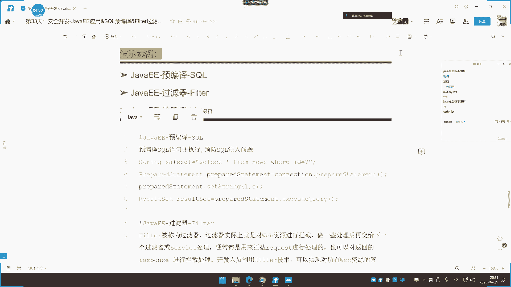


## 📚 概述：今日学习è¦ç‚¹


本节课内容分为三个主è¦éƒ¨åˆ†ï¼š
1.  **SQL预编译**：深入ç†è§£å…¶å¦‚何有效防止SQL注入攻击。
2.  **Filter过滤器**：学习如何拦截和过滤HTTP请求，å®ç°è®¿é—®æ§åˆ¶å’Œå®‰å…¨æ£€æŸ¥ã€‚
3.  **Listener监å¬å™¨**：了解如何监å¬Web应用中的特定事件（如Session创建）。

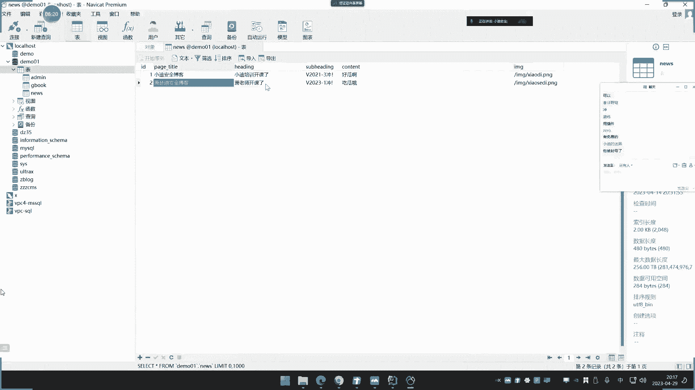


æŒæ¡è¿™äº›çŸ¥è¯†ï¼Œå°†ä¸ºå续学习高级安全主题（如内存马技术）打下åšå®åŸºç¡€ã€‚

---

## ğŸ›¡ï¸ ç¬¬ä¸€éƒ¨åˆ†ï¼šSQL预编译

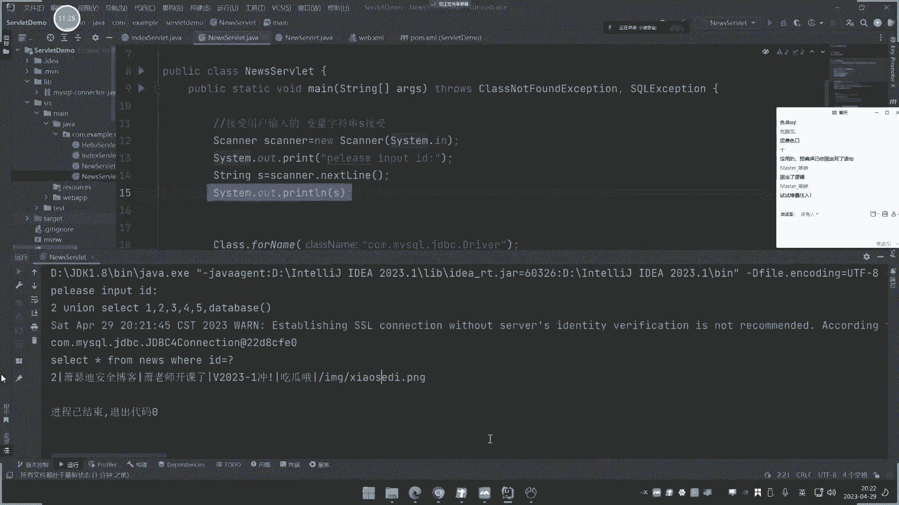

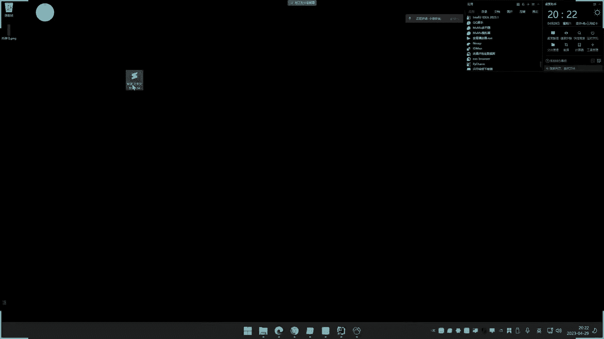

上一节我们介ç»äº†SQL注入的基本åŸç†ã€‚本节中，我们æ¥çœ‹çœ‹å¦‚何使用SQL预编译æ¥æœ‰æ•ˆé˜²å¾¡æ­¤ç±»æ”»å‡»ã€‚


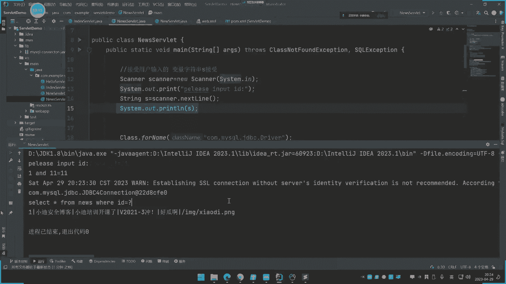

SQL预编译的核心æ€æƒ³æ˜¯**æå‰å›ºå®šSQL语å¥çš„结æ„**，将用户输入的数æ®ä½œä¸ºå‚数传入，而éç›´æ¥æ‹¼æ¥ã€‚这样，无论输入内容如何，都ä¸ä¼šæ”¹å˜åŸSQL语å¥çš„逻辑，ä»è€Œæœç»äº†SQL注入。

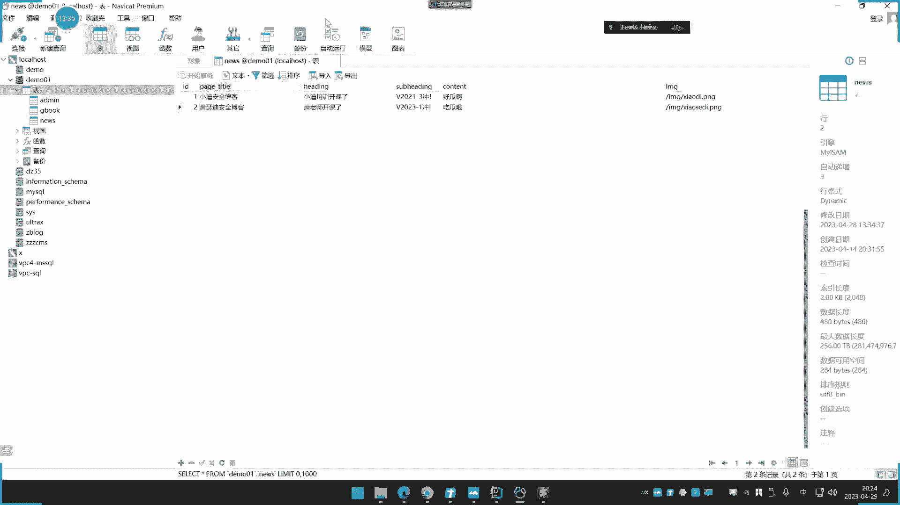

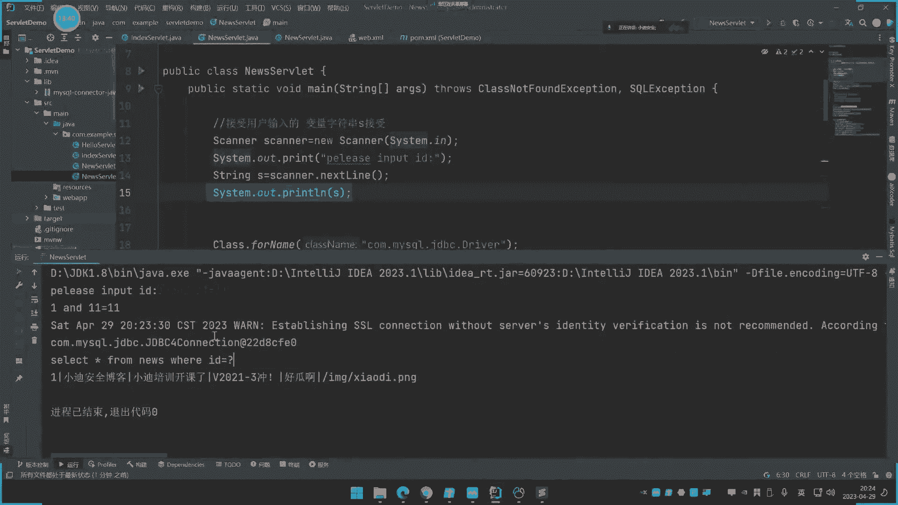


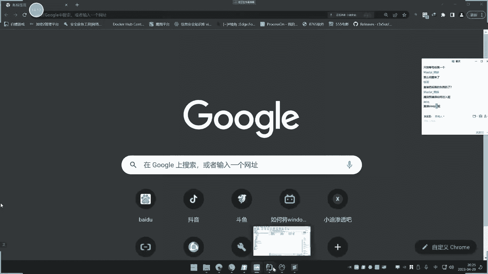

### ä¸å®‰å…¨å†™æ³•ï¼ˆå¯¼è‡´SQL注入）


以下代ç ç›´æ¥å°†ç”¨æˆ·è¾“入拼æ¥åˆ°SQL语å¥ä¸­ï¼Œå­˜åœ¨ä¸¥é‡çš„安全é£é™©ã€‚

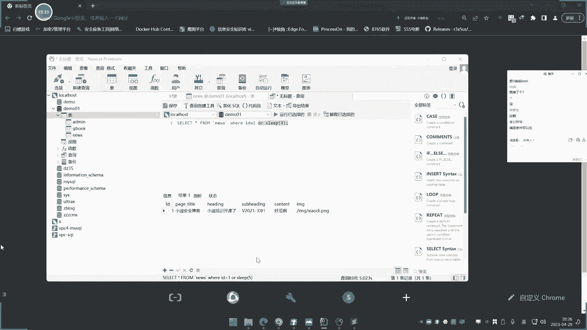


```java
// æ¥æ”¶ç”¨æˆ·è¾“å…¥
Scanner scanner = new Scanner(System.in);
System.out.println("请输入id：");
String s = scanner.nextLine();
// 将输入直æ¥æ‹¼æ¥åˆ°SQL语å¥ä¸­ï¼ˆå±é™©ï¼ï¼‰
String sql = "select * from news where id=" + s;
// 执行查询...
```

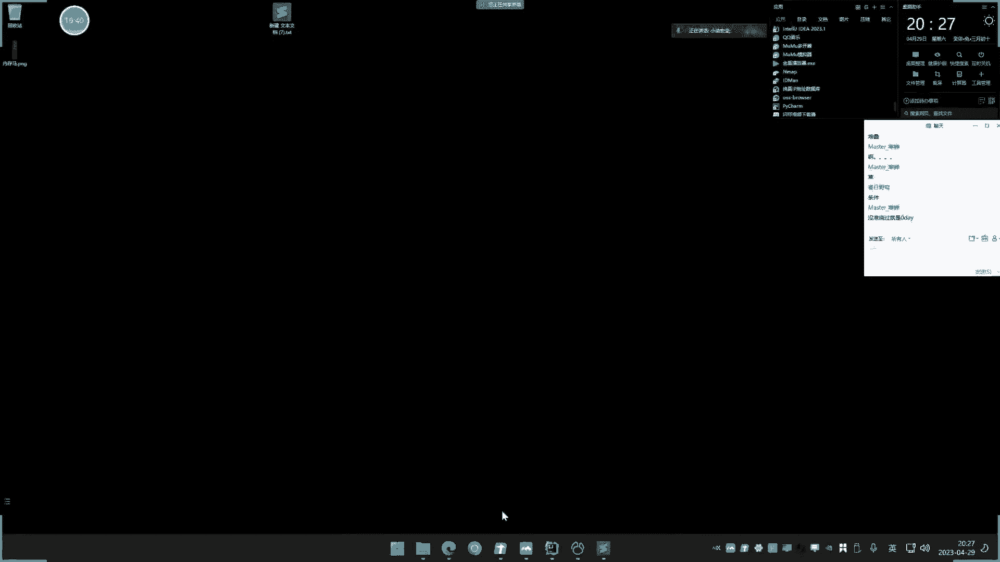

当用户输入 `1 or 1=1` 时，生æˆçš„SQL语å¥å˜ä¸º `select * from news where id=1 or 1=1`，会查询出所有数æ®ï¼Œé€ æˆæ³¨å…¥ã€‚


### 安全写法（使用预编译）

使用 `PreparedStatement` 进行预编译，用 `?` 作为å ä½ç¬¦ã€‚


```java
// 使用问å·ä½œä¸ºå‚æ•°å ä½ç¬¦
String safeSql = "select * from news where id=?";
// è·å–预编译语å¥å¯¹è±¡
PreparedStatement ps = connection.prepareStatement(safeSql);
// 将用户输入的值安全地设置到第一个å‚æ•°ä½ç½®ï¼ˆç´¢å¼•ä»1开始）
ps.setString(1, s);
// 执行查询...
```

**关键区别**：
*   **ä¸å®‰å…¨å†™æ³•**：SQL语å¥ç»“æ„éšç”¨æˆ·è¾“入改å˜ã€‚
*   **预编译写法**：SQLè¯­å¥ `select * from news where id=?` 的结æ„是固定的。用户输入的值 `1 or 1=1` 会被**整体视为一个字符串å‚æ•°**传递给 `id` 字段，数æ®åº“会寻找 `id` 字段值**ç­‰äº**字符串 `"1 or 1=1"` 的记录，而ä¸ä¼šå°†å…¶è§£æ为SQL逻辑。因此，注入攻击无法生效。

**简å•æ¥è¯´**：预编译将“代ç â€ä¸â€œæ•°æ®â€åˆ†ç¦»ï¼Œç”¨æˆ·è¾“入永远是“数æ®â€ï¼Œæ— æ³•å˜æˆâ€œä»£ç â€æ¥æ”¹å˜ç¨‹åºé€»è¾‘。

---

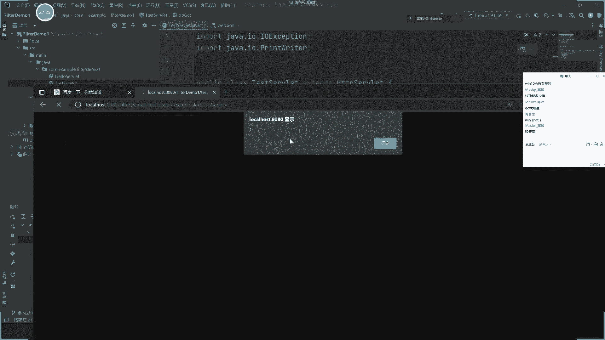

## 🔠第二部分：Filter过滤器

ç†è§£äº†å¦‚何防护å端数æ®åº“的安全å，我们æ¥çœ‹çœ‹å¦‚何在请求到达业务逻辑之å‰è¿›è¡Œæ‹¦æˆªå’Œæ§åˆ¶ã€‚这就是Filter过滤器的作用。

Filter是Java Web中的核心组件之一，用äº**在请求到达Servlet或资æºä¹‹å‰ï¼Œä»¥åŠå“应å‘é€ç»™å®¢æˆ·ç«¯ä¹‹å‰ï¼Œè¿›è¡Œæ‹¦æˆªå’Œå¤„ç†**。它常用äºå®ç°ï¼š
*   **访问æ§åˆ¶ä¸æƒé™éªŒè¯**（如检查用户是å¦ç™»å½•ï¼‰ã€‚
*   **请求/å“应的修改**（如统一设置字符编ç ï¼‰ã€‚
*   **安全过滤**（如过滤XSS攻击脚本）。
*   **性能优化**（如å‹ç¼©å“应内容）。

其工作æµç¨‹å¦‚下图所示，请求会先ç»è¿‡Filter链，å†åˆ°è¾¾ç›®æ ‡Servlet：

```
客户端请求 -> Listener -> Filter -> Servlet -> æ•°æ®åº“
        å“应 <- Listener <- Filter <- Servlet <-
```

### 如何创建并使用一个Filter

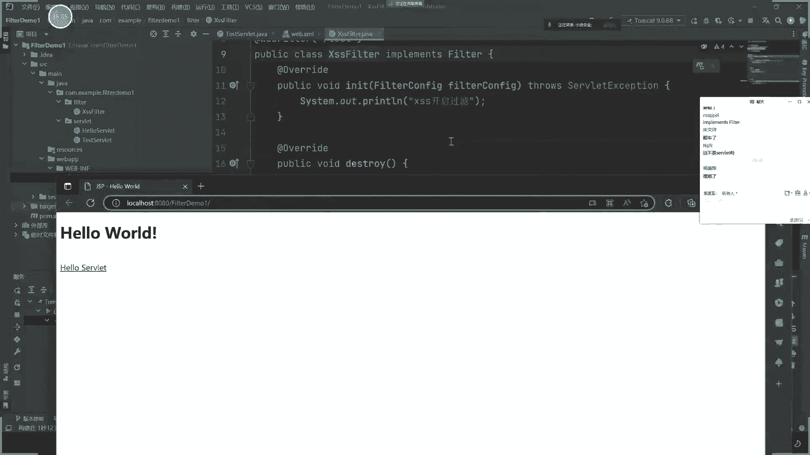

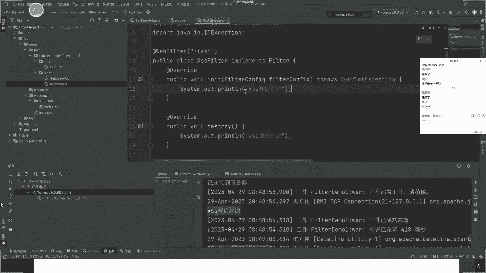

以下是创建一个用äºè¿‡æ»¤XSS攻击的Filter的步骤。

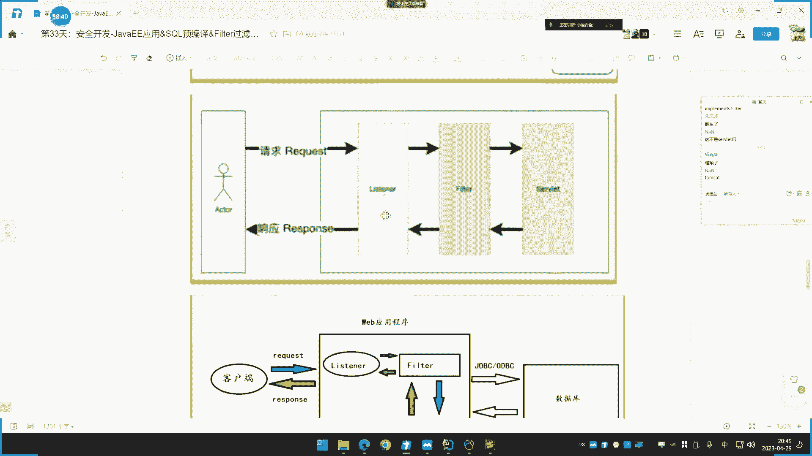

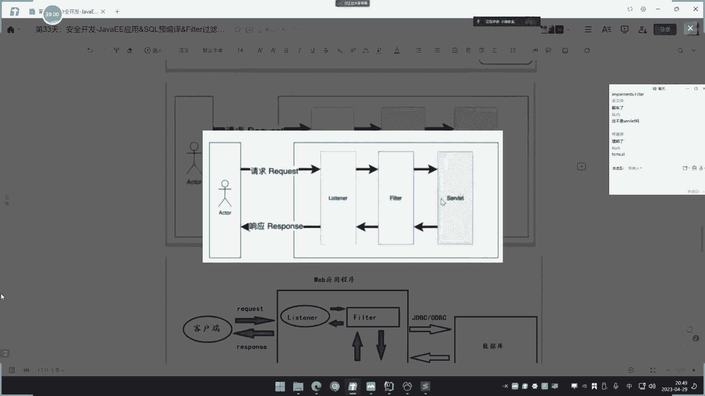

**1. 创建Filter类**
创建一个类å®ç° `javax.servlet.Filter` æ¥å£ï¼Œå¹¶é‡å†™å…¶æ–¹æ³•ã€‚

```java
package com.demo.filter;

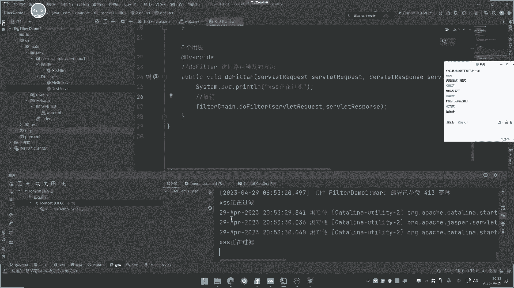


import javax.servlet.*;
import javax.servlet.annotation.WebFilter;
import java.io.IOException;

@WebFilter("/test") // 指定该过滤器拦截的URL路径
public class XssFilter implements Filter {

    @Override
    public void init(FilterConfig filterConfig) throws ServletException {
        // åˆå§‹åŒ–方法，æœåŠ¡å™¨å¯åŠ¨æ—¶æ‰§è¡Œä¸€æ¬¡
        System.out.println("XSS过滤器åˆå§‹åŒ–...");
    }

    @Override
    public void doFilter(ServletRequest request, ServletResponse response, FilterChain chain)
            throws IOException, ServletException {
        // 核心过滤方法，æ¯æ¬¡åŒ¹é…的请求都会执行
        System.out.println("XSS过滤器正在工作...");

        // 1. è·å–请求å‚数进行检查
        String code = request.getParameter("code");
        if (code != null && code.contains("script")) {
            // 2. 如æœå‘ç°æ”»å‡»è½½è·ï¼Œåˆ™æ‹¦æˆªè¯·æ±‚
            response.getWriter().write("检测到XSS攻击，请求被拦截ï¼");
            return; // 注æ„：这里直æ¥return，ä¸å†è°ƒç”¨chain.doFilter
        }

        // 3. 如æœæ£€æŸ¥é€šè¿‡ï¼Œåˆ™æ”¾è¡Œè¯·æ±‚，让它继续执行åç»­çš„Filter或Servlet
        chain.doFilter(request, response);
    }

    @Override
    public void destroy() {
        // 销æ¯æ–¹æ³•ï¼ŒæœåŠ¡å™¨å…³é—­æ—¶æ‰§è¡Œä¸€æ¬¡
        System.out.println("XSS过滤器销æ¯...");
    }
}
```

**2. é…ç½®Filter（如æœæœªä½¿ç”¨`@WebFilter`注解）**
在 `web.xml` 文件中é…ç½®Filter。


```xml
<filter>
    <filter-name>XssFilter</filter-name>
    <filter-class>com.demo.filter.XssFilter</filter-class>
</filter>
<filter-mapping>
    <filter-name>XssFilter</filter-name>
    <url-pattern>/test</url-pattern> <!-- 指定è¦è¿‡æ»¤çš„URL -->
</filter-mapping>
```

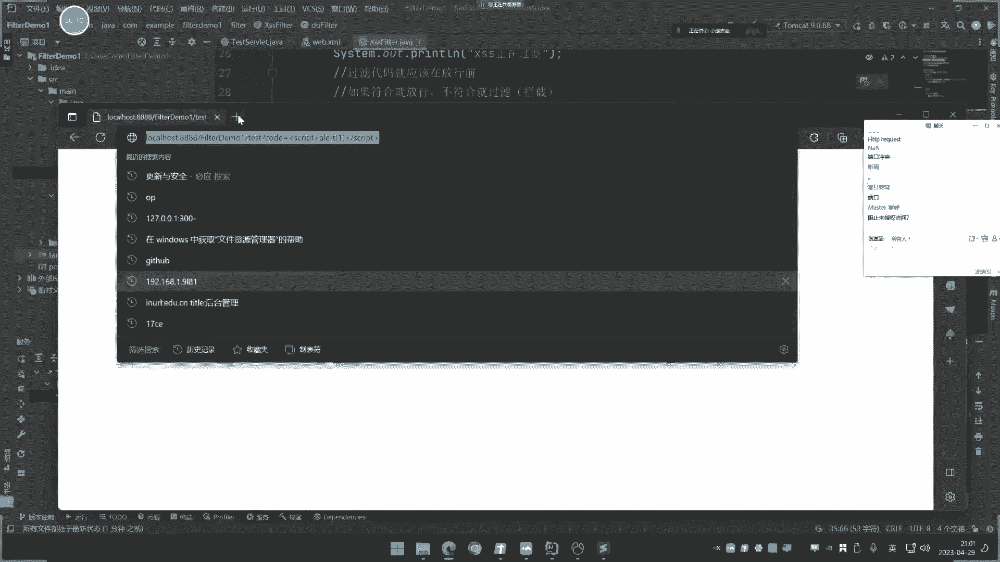

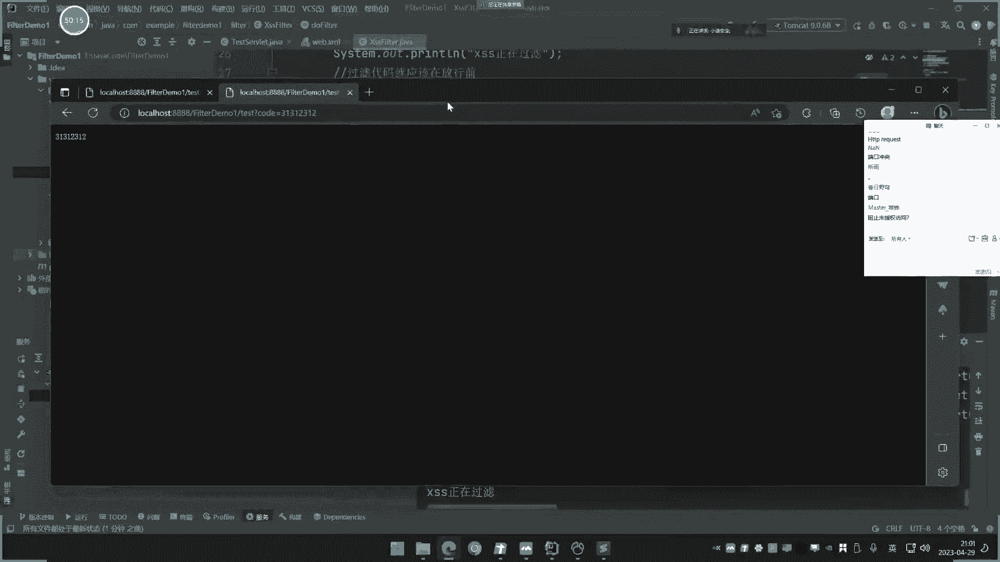

**3. 创建一个测试Servlet**

```java
@WebServlet("/test")
public class TestServlet extends HttpServlet {
    protected void doGet(HttpServletRequest req, HttpServletResponse resp) throws ServletException, IOException {
        String code = req.getParameter("code");
        resp.getWriter().write("æ¥æ”¶åˆ°çš„code是：" + code);
    }
}
```

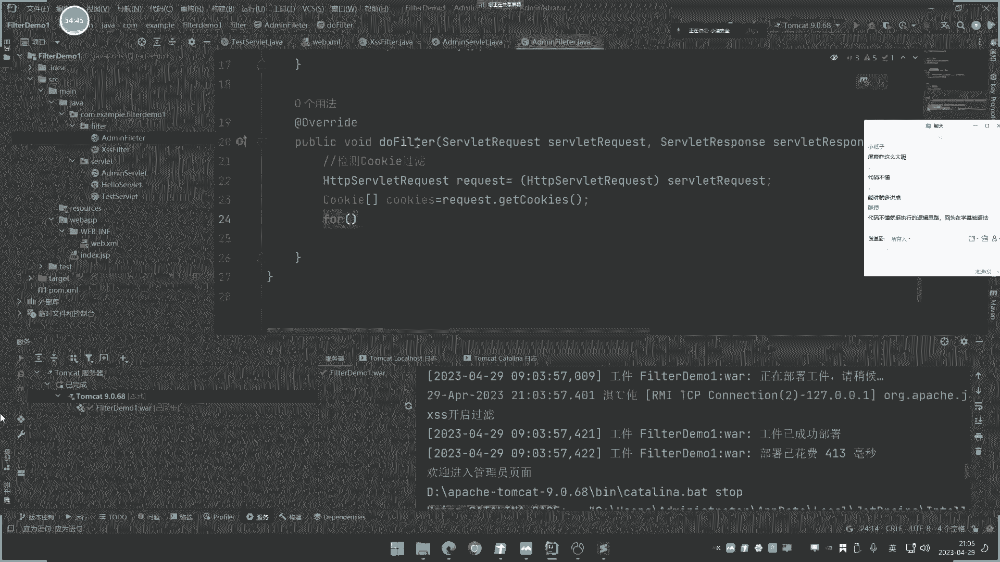

**è¿è¡Œæ•ˆæœ**：
*   访问 `http://localhost:8080/test?code=123`，页é¢æ­£å¸¸æ˜¾ç¤ºï¼š`æ¥æ”¶åˆ°çš„code是：123`。
*   访问 `http://localhost:8080/test?code=<script>alert(1)</script>`，页é¢æ˜¾ç¤ºï¼š`检测到XSS攻击，请求被拦截ï¼`。请求被Filter阻断，ä¸ä¼šåˆ°è¾¾åé¢çš„ `TestServlet`。

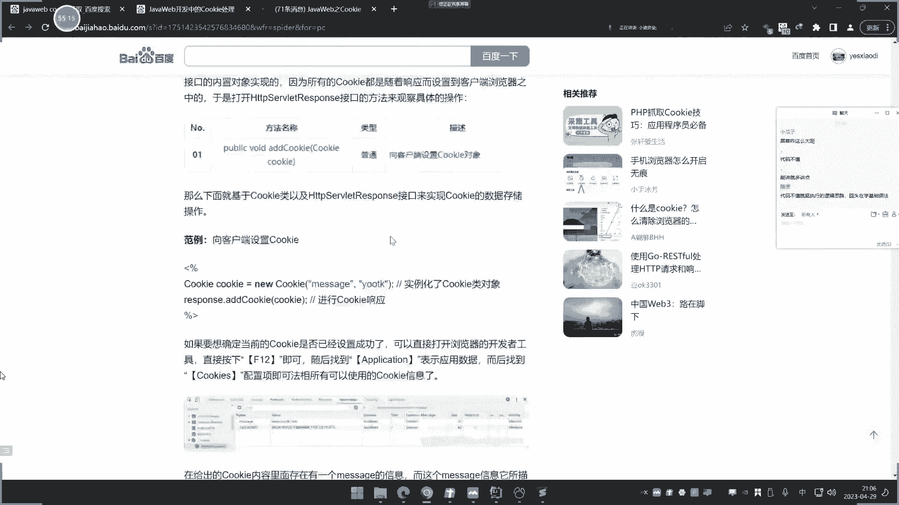

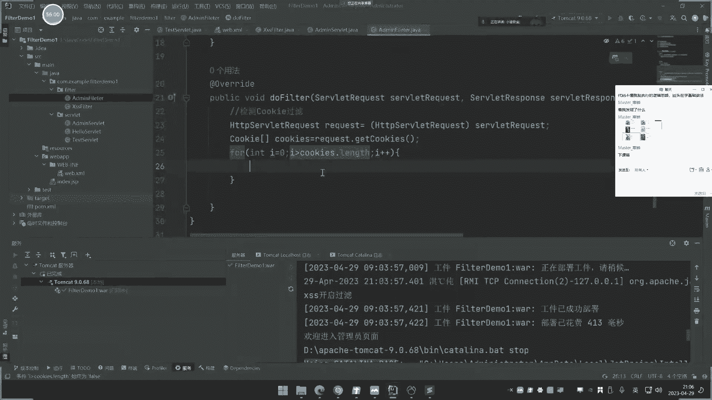


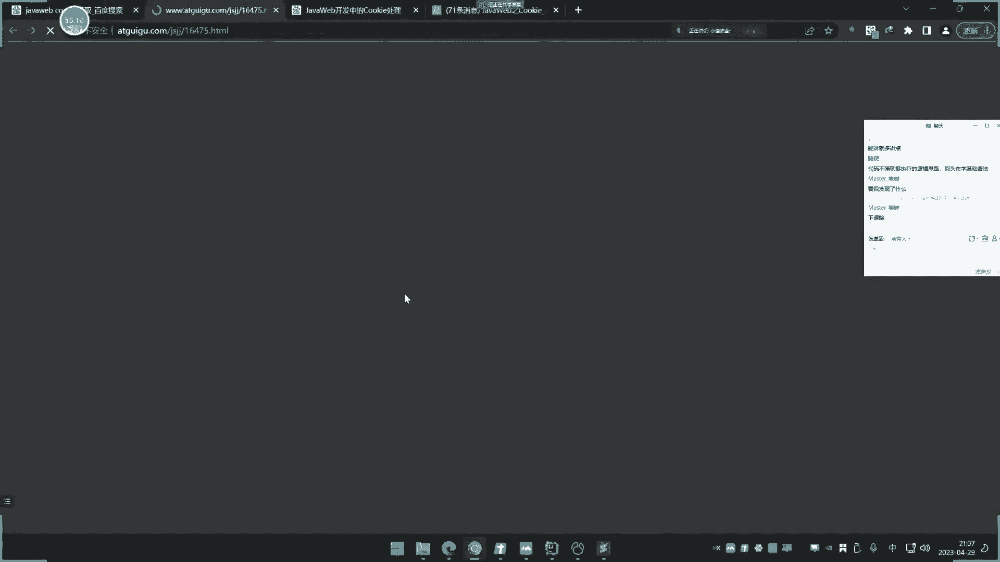

### Filterä¸å†…存马


在安全领域，Filter有一个é‡è¦çš„“å˜ç§â€åº”用——**内存马**。传统Webshell是写在ç£ç›˜ä¸Šçš„文件（如JSP文件）。而内存马是一ç§æ— æ–‡ä»¶æ”»å‡»æŠ€æœ¯ï¼Œæ”»å‡»è€…å°†æ¶æ„代ç ï¼ˆä½œä¸ºFilter或Listener）动æ€æ³¨å†Œåˆ°æ­£åœ¨è¿è¡Œçš„Java应用æœåŠ¡å™¨å†…存中。

**为什么å±é™©ï¼Ÿ**
因为内存马没有å®ä½“文件，传统的文件扫æ检测方å¼ä¼šå¤±æ•ˆã€‚它存在äºæ›´é«˜çš„容器层é¢ï¼ˆFilter链），能够拦截所有请求，å±å®³æ大。学习Filter的工作åŸç†ï¼Œæ˜¯ç†è§£ã€æ£€æµ‹å’Œé˜²å¾¡è¿™ç±»é«˜çº§æ”»å‡»çš„基础。


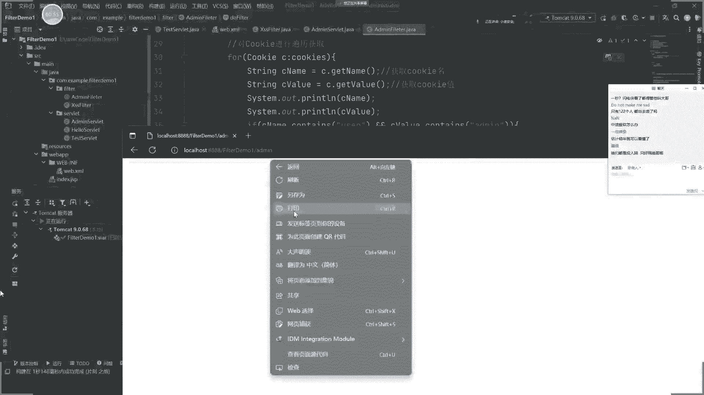

---


## 👂 第三部分：Listener监å¬å™¨


在了解了如何拦截请求之å，我们æ¥çœ‹çœ‹å¦‚何监å¬Web应用内部å‘生的事件。Listener监å¬å™¨ç”¨äºç›‘å¬ `ServletContext`ã€`HttpSession`ã€`ServletRequest` 等对象的生命周期事件或å±æ€§å˜æ›´äº‹ä»¶ã€‚


ä¸Filter主动拦截ä¸åŒï¼ŒListener是**被动触å‘**的，当特定事件å‘生时（如Session被创建ã€é”€æ¯ï¼‰ï¼Œç”±å®¹å™¨è‡ªåŠ¨è°ƒç”¨ã€‚

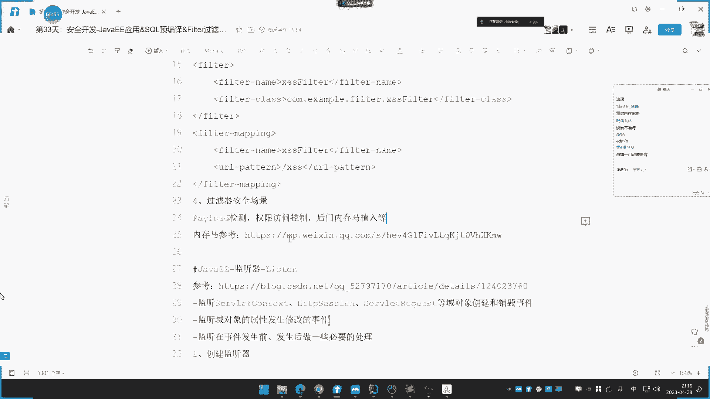

Listener主è¦åˆ†ä¸ºä¸‰ç±»ï¼š
*   **ServletContext监å¬å™¨**：监å¬Web应用的å¯åŠ¨å’Œé”€æ¯ã€‚
*   **HttpSession监å¬å™¨**：监å¬ç”¨æˆ·ä¼šè¯çš„创建ã€é”€æ¯å’Œå±æ€§å˜æ›´ã€‚
*   **ServletRequest监å¬å™¨**：监å¬è¯·æ±‚的创建ã€é”€æ¯å’Œå±æ€§å˜æ›´ã€‚


它在安全分æ中常用äºç†è§£ä»£ç æµç¨‹ï¼ŒåŒæ—¶ä¹Ÿæ˜¯æŸäº›ç±»å‹å†…存马的载体。

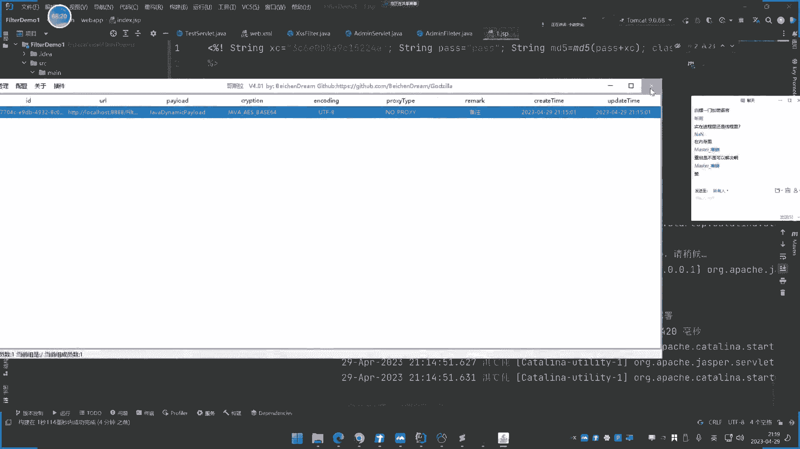

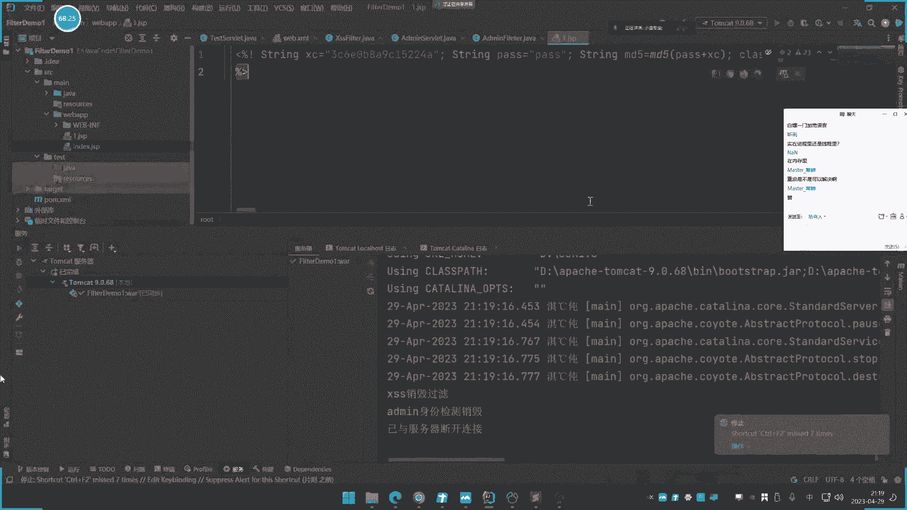

### 如何创建并使用一个Session监å¬å™¨

以下示例演示如何监å¬HttpSession的创建和销æ¯äº‹ä»¶ã€‚


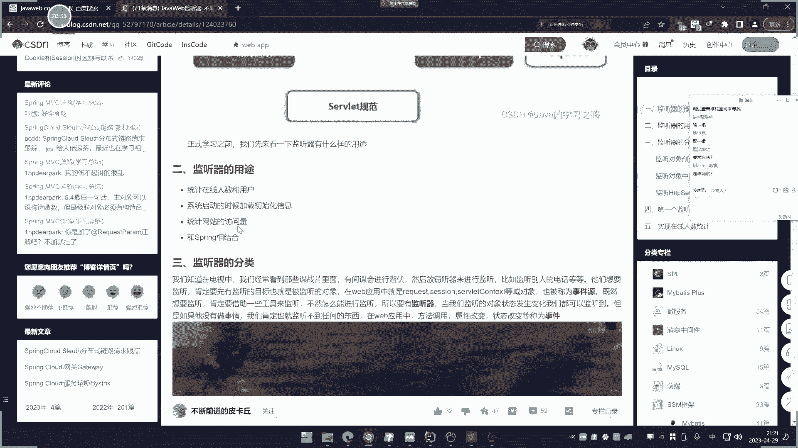

**1. 创建Session监å¬å™¨ç±»**
å®ç° `HttpSessionListener` æ¥å£ã€‚

```java
package com.demo.listener;

import javax.servlet.annotation.WebListener;
import javax.servlet.http.HttpSessionEvent;
import javax.servlet.http.HttpSessionListener;

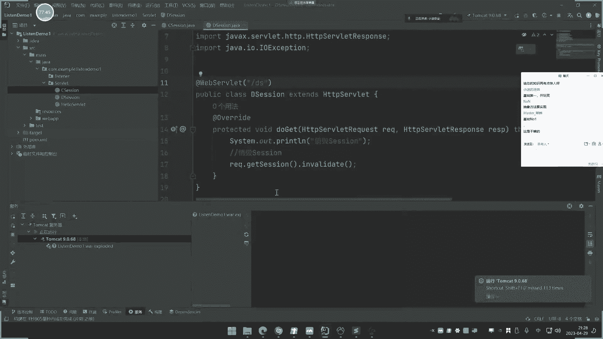

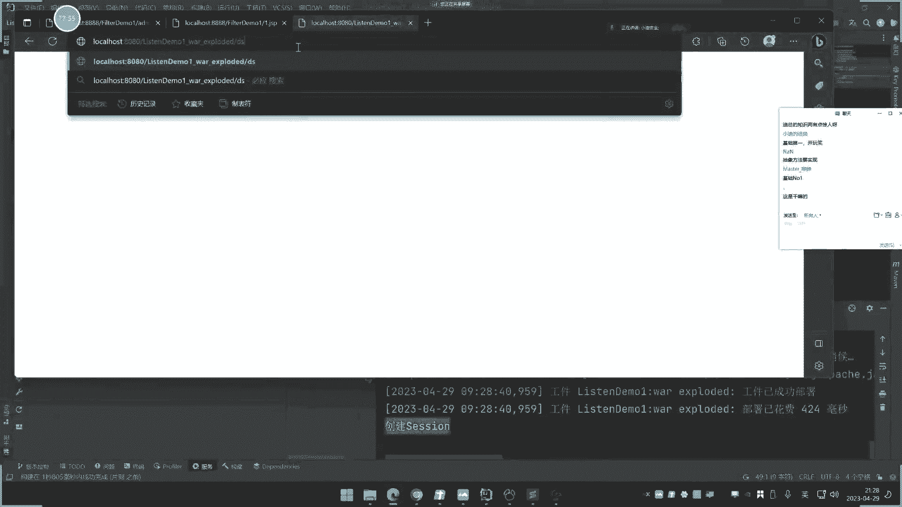

@WebListener // 标记为监å¬å™¨ï¼Œæ— éœ€é…ç½®URL
public class MySessionListener implements HttpSessionListener {

    @Override
    public void sessionCreated(HttpSessionEvent se) {
        // 当有新的Session被创建时触å‘（如用户首次访问）
        System.out.println("监å¬å™¨ï¼šä¸€ä¸ªæ–°çš„Session被创建了，ID: " + se.getSession().getId());
    }

    @Override
    public void sessionDestroyed(HttpSessionEvent se) {
        // 当Session被销æ¯æ—¶è§¦å‘（如超时ã€æ‰‹åŠ¨å¤±æ•ˆï¼‰
        System.out.println("监å¬å™¨ï¼šä¸€ä¸ªSession被销æ¯äº†ï¼ŒID: " + se.getSession().getId());
    }
}
```

**2. 创建一个用äºæ“作Sessionçš„Servlet**

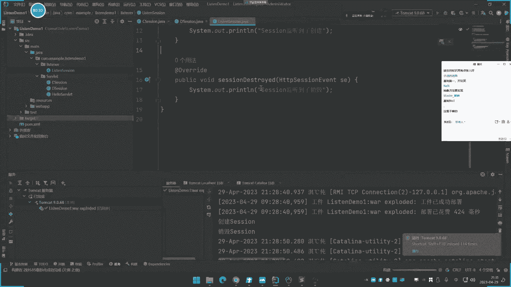


```java
@WebServlet("/createSession")
public class CreateSessionServlet extends HttpServlet {
    protected void doGet(HttpServletRequest req, HttpServletResponse resp) {
        // 此调用会触å‘Session创建（如æœå½“å‰è¯·æ±‚没有Session）
        req.getSession();
        resp.getWriter().write("Session Created (or got).");
    }
}

@WebServlet("/invalidateSession")
public class InvalidateSessionServlet extends HttpServlet {
    protected void doGet(HttpServletRequest req, HttpServletResponse resp) {
        HttpSession session = req.getSession(false);
        if (session != null) {
            session.invalidate(); // 手动销æ¯Session
        }
        resp.getWriter().write("Session Invalidated.");
    }
}
```

**è¿è¡Œæ•ˆæœ**：
1.  首次访问 `http://localhost:8080/createSession` 时，æ§åˆ¶å°ä¼šè¾“出：`监å¬å™¨ï¼šä¸€ä¸ªæ–°çš„Session被创建了，ID: xxx`。
2.  访问 `http://localhost:8080/invalidateSession` 时，æ§åˆ¶å°ä¼šè¾“出：`监å¬å™¨ï¼šä¸€ä¸ªSession被销æ¯äº†ï¼ŒID: xxx`。
3.  å†æ¬¡è®¿é—® `createSession`，由äºä¹‹å‰çš„Session已销æ¯ï¼Œä¼šå†æ¬¡è§¦å‘ `sessionCreated` 方法。

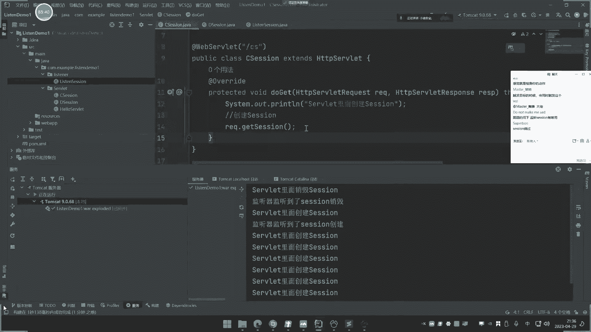


**Listenerä¸å†…存马**：
ä¸Filter类似，攻击者也å¯ä»¥å‘æœåŠ¡å™¨åŠ¨æ€æ³¨å†Œä¸€ä¸ªæ¶æ„çš„Listener（如 `ServletRequestListener`），ä»è€Œåœ¨æ¯ä¸€ä¸ªè¯·æ±‚到达时都能执行æ¶æ„代ç ï¼Œå®ç°å†…存马驻留。


---

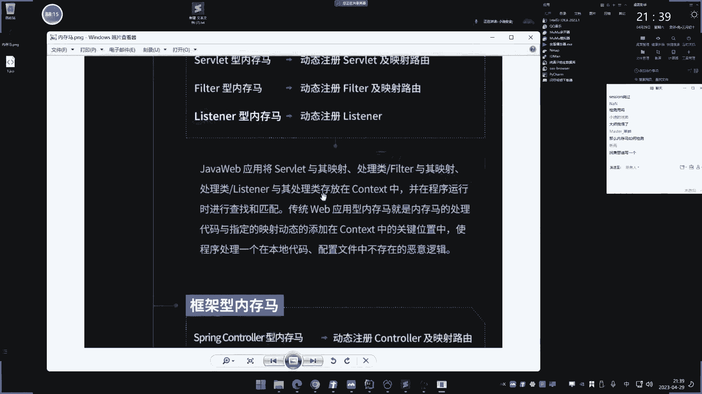


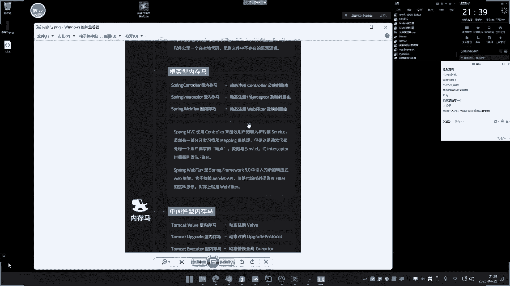

## 📠总结ä¸å›é¡¾

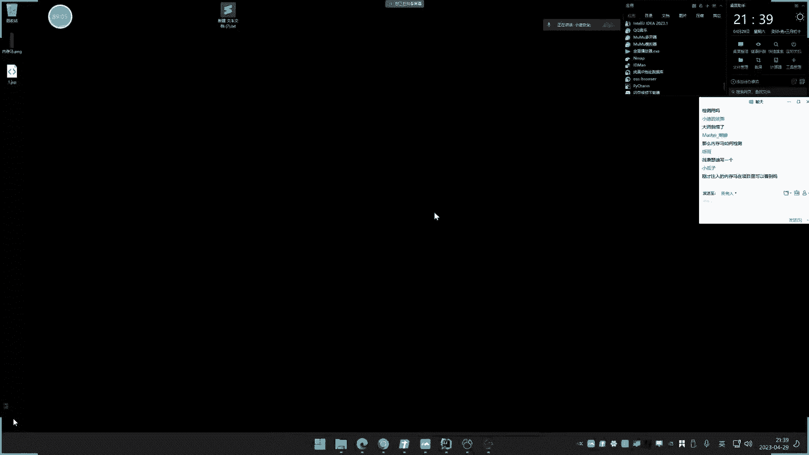

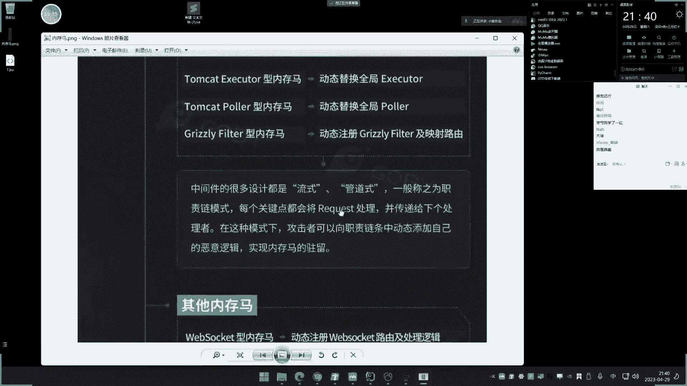

本节课我们一起学习了Java Web中三个至关é‡è¦çš„组件：

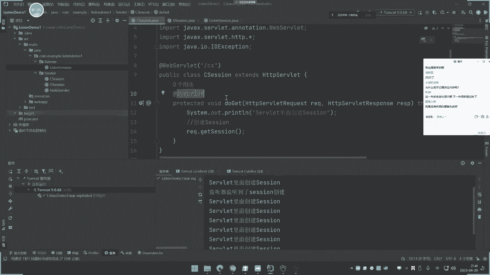

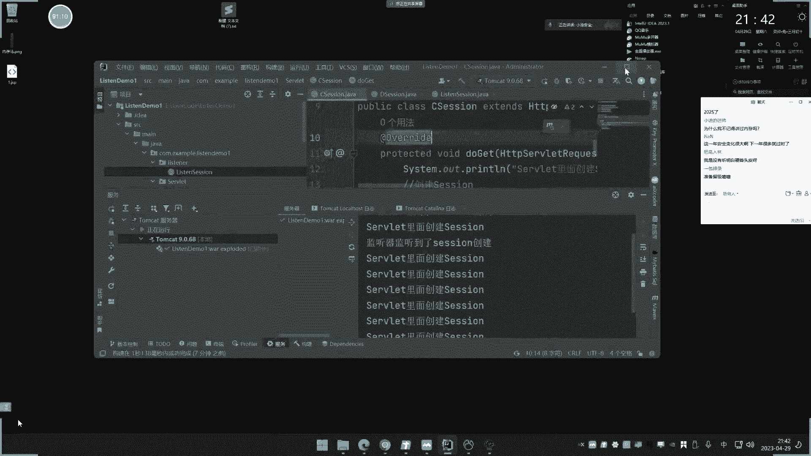


1.  **SQL预编译**：通过 `PreparedStatement` 固定SQL结æ„，将用户输入作为å‚数处ç†ï¼Œæ˜¯é˜²å¾¡SQL注入最有效ã€æœ€æ ¹æœ¬çš„手段。其核心公å¼ä¸ºï¼š`SQLè¯­å¥ = å›ºå®šç»“æ„ + å‚数化数æ®`。
2.  **Filter过滤器**：一个强大的请求/å“应拦截器。我们学会了如何创建Filteræ¥æ£€æŸ¥è¯·æ±‚å‚数（如防XSS）ã€å®ç°è®¿é—®æ§åˆ¶ï¼ˆå¦‚检查Cookie）。更é‡è¦çš„是，ç†è§£äº†å®ƒåœ¨**内存马**攻击ä¸é˜²å¾¡ä¸­çš„关键角色——æ¶æ„Filterå¯ä»¥æ— æ–‡ä»¶å½¢å¼é©»ç•™å†…存，拦截所有æµé‡ã€‚
3.  **Listener监å¬å™¨**：用äºç›‘å¬Web应用内部事件（如Session生命周期）。我们创建了一个Session监å¬å™¨æ¥æ„ŸçŸ¥ç”¨æˆ·ä¼šè¯çš„创建ä¸é”€æ¯ã€‚ListeneråŒæ ·å¯èƒ½è¢«ç”¨äºæ„造内存马，在事件å‘生时执行æ¶æ„æ“作。

这些知识ä¸ä»…是Java EEå¼€å‘的基础，更是深入ç†è§£Web应用安全机制（尤其是近年æ¥æµè¡Œçš„无文件攻击ã€å†…存马技术）的必ç»ä¹‹è·¯ã€‚在å续的课程中，当我们æ¢è®¨ä»£ç å®¡è®¡ã€æ¼æ´åˆ†æ以åŠé«˜çº§æ”»é˜²æŠ€æœ¯æ—¶ï¼Œä½ ä¼šä¸æ–­é‡åˆ°å¹¶åº”用这些概念。


**下节课预告**：我们将开始æ¥è§¦ä¸»æµçš„Javaå¼€å‘框æ¶â€”—Spring MVCä¸MyBatis，并了解它们如何整åˆï¼Œä»¥åŠåœ¨è¿™äº›æ¡†æ¶ä¸‹çš„安全考é‡ã€‚