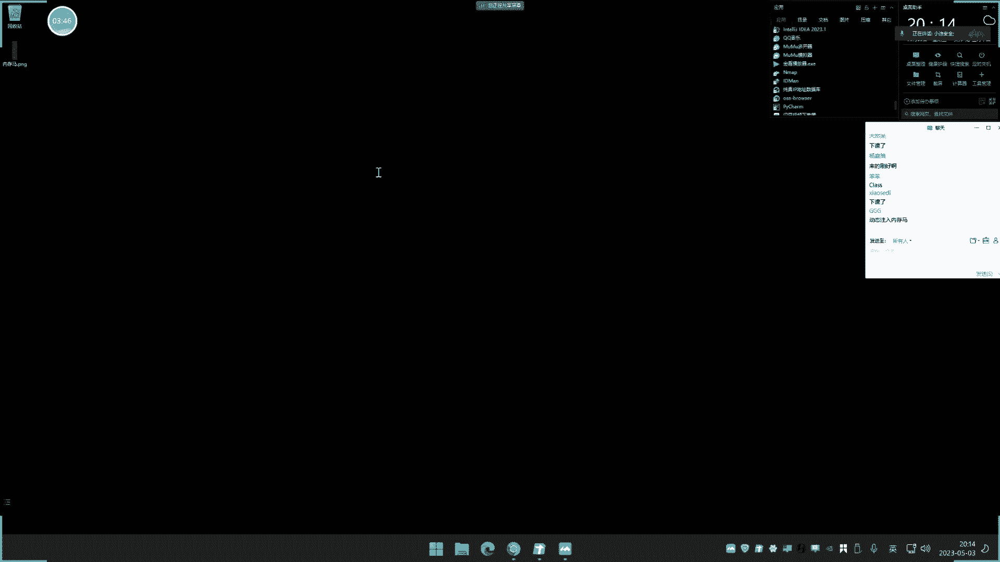
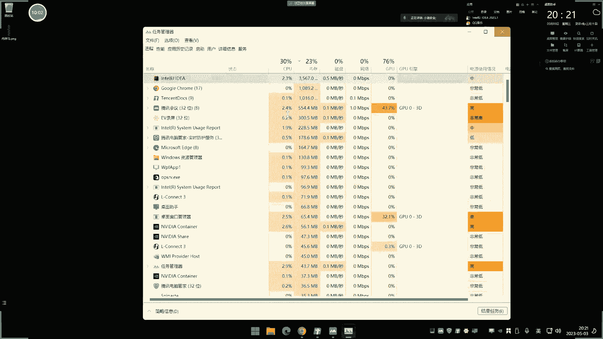
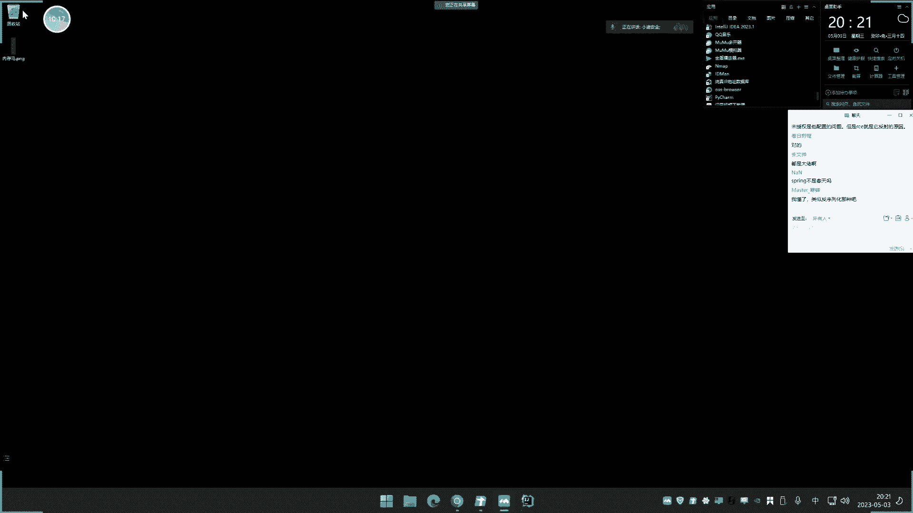
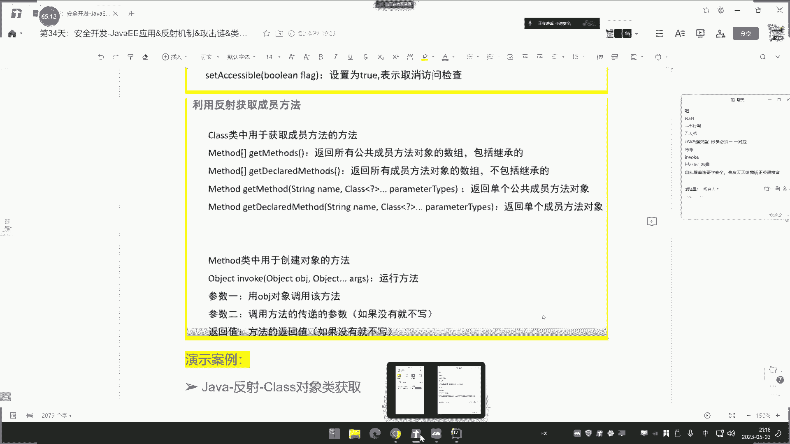
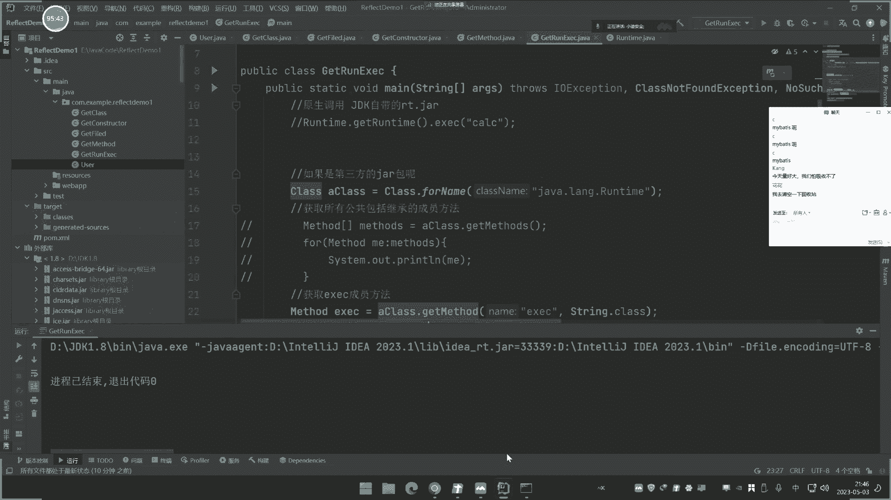
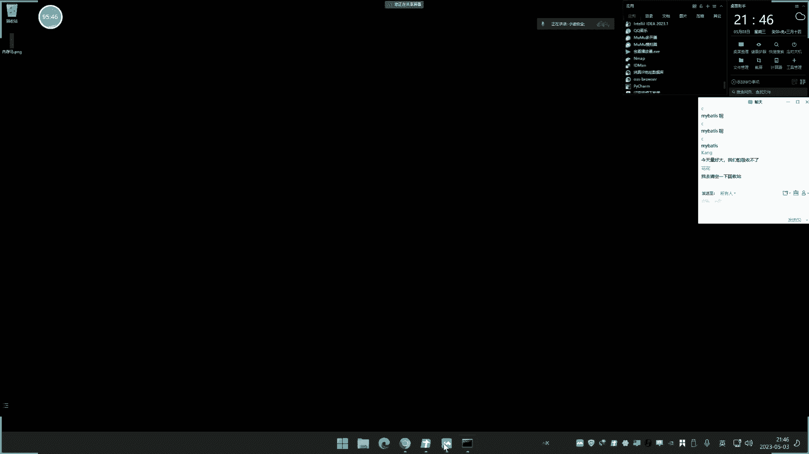
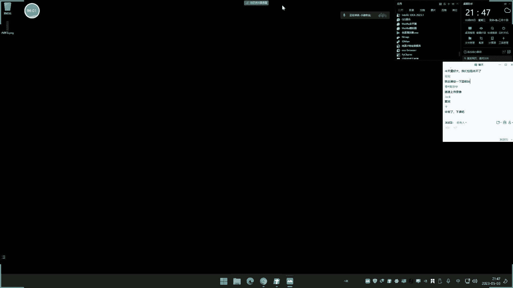

# 🧠 Java安全开发课程 P34：反射机制详解与应用




在本节课中，我们将要学习Java反射机制的核心概念、代码实现及其在安全领域（特别是反序列化漏洞利用）中的重要性。反射是Java程序在运行时检查和操作类、对象、成员变量、方法和构造方法的能力，是理解Java高级安全问题的基石。


## 📖 反射机制概述


反射是Java程序的特征之一。它允许Java程序在运行时对自身进行检查或自审。程序运行中，对任何一个类，能知道该类的所有属性和方法；对于任何一个对象，能够调用它的任何方法和属性。这种动态获取信息以及动态调用对象方法的功能称为反射机制。







简单来说，Java反射就是利用官方提供的反射API（包含`Class`、`Field`、`Method`和`Constructor`等类库），对类的成员变量、成员方法和构造方法的信息进行编程操作。

## 🔍 为什么需要反射？

从开发角度看，反射实现了从“静态编译”到“动态编译”的转变。Java原生是静态编译语言，代码在编译时就需要确定所有类型。反射机制允许程序在运行时动态创建、修改、调用或获取对象的属性，而无需在编译时知道具体的类。


从安全角度看，反射是理解和利用Java反序列化漏洞的关键。许多反序列化漏洞的利用链（Payload/POC）都依赖于反射机制来动态调用危险类和方法，从而实现命令执行等攻击目的。学习反射，就是为了能够操作其他类中的成员，为后续的安全分析打下基础。

## 🛠️ 反射核心操作实战


为了深入理解反射，我们将通过一个`User`类来演示所有核心操作。这个类包含了成员变量、成员方法和构造方法。


```java
public class User {
    // 成员变量 - 具有不同访问权限
    public String name = "小迪";
    public int age = 31;
    private String gender = "man";
    protected String job = "SEC";

    // 构造方法
    public User() {
        System.out.println("无参构造");
    }
    public User(String name) {
        System.out.println(name);
    }
    private User(String name, int age) {
        System.out.println(name + " " + age);
    }

    // 成员方法
    public void userInfo(String name, int age, String gender, String job) {
        // 方法体
    }
    private void users(String name, String gender) {
        System.out.println(name + " " + gender);
    }
}
```


### 第一步：获取Class对象 🎯


要对一个类进行反射操作，第一步是获取该类的`Class`对象。有四种常见方式：


以下是获取Class对象的几种方法：


1.  **`Class.forName("全限定类名")`**：根据类的全限定名获取。
    ```java
    Class aClass = Class.forName("com.example.User");
    ```
2.  **`类名.class`**：直接通过类名获取。
    ```java
    Class userClass = User.class;
    ```
3.  **`对象.getClass()`**：通过已有对象实例获取。
    ```java
    User user = new User();
    Class aClass1 = user.getClass();
    ```
4.  **通过类加载器获取**：使用当前类的类加载器。
    ```java
    Class aClass2 = this.getClass().getClassLoader().loadClass("com.example.User");
    ```


最常用的是第一种`Class.forName()`方式。


### 第二步：操作成员变量（Field） 📊


获取Class对象后，可以操作其成员变量。


以下是操作成员变量的核心方法：


1.  **获取所有公共成员变量**：`getFields()`返回一个数组。
    ```java
    Field[] fields = aClass.getFields();
    for (Field fd : fields) {
        System.out.println(fd);
    }
    ```
2.  **获取所有成员变量（包括私有和保护）**：`getDeclaredFields()`。
    ```java
    Field[] allFields = aClass.getDeclaredFields();
    ```
3.  **获取单个公共成员变量**：`getField("变量名")`。
    ```java
    Field nameField = aClass.getField("name");
    ```
4.  **获取单个成员变量（可指定私有）**：`getDeclaredField("变量名")`。
    ```java
    Field genderField = aClass.getDeclaredField("gender");
    ```
5.  **对成员变量进行取值和赋值**：
    ```java
    User user = new User();
    // 获取age字段并取值
    Field ageField = aClass.getField("age");
    int ageValue = (int) ageField.get(user);
    System.out.println(ageValue); // 输出: 31

    // 对age字段进行赋值
    ageField.set(user, 32);
    int newAgeValue = (int) ageField.get(user);
    System.out.println(newAgeValue); // 输出: 32
    ```
    对于私有变量，需要先调用`field.setAccessible(true)`来临时开启访问权限。


### 第三步：操作构造方法（Constructor） 🔨


接下来，我们看看如何操作类的构造方法。


以下是操作构造方法的核心方法：


1.  **获取所有公共构造方法**：`getConstructors()`。
    ```java
    Constructor[] constructors = aClass.getConstructors();
    for (Constructor cn : constructors) {
        System.out.println(cn);
    }
    ```
2.  **获取所有构造方法（包括私有）**：`getDeclaredConstructors()`。
3.  **获取单个公共构造方法**：`getConstructor(参数类型.class, ...)`。
    ```java
    Constructor con1 = aClass.getConstructor(String.class);
    ```
4.  **获取单个构造方法（可指定私有）**：`getDeclaredConstructor(参数类型.class, ...)`。
    ```java
    Constructor con2 = aClass.getDeclaredConstructor(String.class, int.class);
    ```
5.  **利用构造方法创建对象**：
    ```java
    // 获取私有构造方法
    Constructor privateCon = aClass.getDeclaredConstructor(String.class, int.class);
    // 临时开启访问权限
    privateCon.setAccessible(true);
    // 创建对象并传入参数
    Object userObj = privateCon.newInstance("小迪SEC", 30);
    ```

### 第四步：操作成员方法（Method） ⚙️


最后，我们来学习如何操作类的成员方法。


以下是操作成员方法的核心方法：


1.  **获取所有公共成员方法（包括继承的）**：`getMethods()`。
    ```java
    Method[] methods = aClass.getMethods();
    for (Method method : methods) {
        System.out.println(method);
    }
    ```
2.  **获取本类所有成员方法（不包括继承）**：`getDeclaredMethods()`。
3.  **获取单个公共成员方法**：`getMethod("方法名", 参数类型.class, ...)`。
    ```java
    Method method1 = aClass.getMethod("userInfo", String.class, int.class, String.class, String.class);
    ```
4.  **获取单个成员方法（可指定私有）**：`getDeclaredMethod("方法名", 参数类型.class, ...)`。
    ```java
    Method method2 = aClass.getDeclaredMethod("users", String.class, String.class);
    method2.setAccessible(true);
    ```
5.  **调用成员方法**：使用`invoke()`方法。
    ```java
    User user = new User();
    Method privateMethod = aClass.getDeclaredMethod("users", String.class, String.class);
    privateMethod.setAccessible(true);
    // 调用方法，传入对象实例和参数
    privateMethod.invoke(user, "小迪", "gay1");
    ```




## ⚔️ 反射在安全中的应用：实现命令执行


理解反射机制后，我们来看一个安全相关的经典示例：如何通过反射机制实现命令执行，这是许多反序列化漏洞利用的核心。


原生的命令执行方式很简单：
```java
Runtime.getRuntime().exec("calc");
```


但如果无法直接调用`Runtime`类，或者需要动态从其他类库中调用，就需要用到反射。


以下是利用反射实现命令执行的步骤：


1.  **获取Runtime类的Class对象**：
    ```java
    Class clazz = Class.forName("java.lang.Runtime");
    ```
2.  **获取getRuntime方法**：
    ```java
    Method getRuntimeMethod = clazz.getMethod("getRuntime");
    ```
3.  **调用getRuntime方法获取Runtime实例**：
    ```java
    Object runtimeInstance = getRuntimeMethod.invoke(null);
    ```
4.  **获取exec方法**：
    ```java
    Method execMethod = clazz.getMethod("exec", String.class);
    ```
5.  **调用exec方法执行命令**：
    ```java
    execMethod.invoke(runtimeInstance, "calc");
    ```


将以上步骤整合，就构成了一个不直接出现`Runtime`和`exec`字样的命令执行代码，这在绕过某些安全检测或构造特定反序列化利用链时非常有用。


## 🔗 反射与反序列化漏洞


反序列化漏洞是Java安全中最常见、最重要的漏洞类型之一。攻击者通过构造恶意的序列化数据，在目标系统反序列化时触发一系列方法调用，最终达到执行任意代码的目的。


许多反序列化漏洞的利用链（Gadget Chain）都严重依赖反射机制。例如，著名的反序列化利用工具ysoserial中就包含了大量针对不同第三方库（如Commons-Collections、Fastjson等）的利用链。这些利用链的本质，就是通过反射动态查找和调用目标类库中存在的危险方法。


因此，掌握反射是分析、理解和编写反序列化利用代码的基础。只有清楚了如何通过反射获取类、调用方法、修改字段，才能看懂那些复杂的利用链是如何一步步组装起来的。


## 📝 课程总结


本节课我们一起深入学习了Java的反射机制。




我们首先了解了反射的定义和核心价值，它允许程序在运行时动态操作类信息。接着，我们通过完整的代码演示，逐步学习了反射的四大核心操作：获取Class对象、操作成员变量（Field）、操作构造方法（Constructor）以及操作成员方法（Method）。最后，我们将反射知识与安全实战结合，演示了如何通过反射机制实现命令执行，并阐述了反射在Java反序列化漏洞利用中的关键作用。







反射是Java安全，特别是反序列化领域的基石知识。虽然初学可能觉得抽象，但它是通往高级Java安全研究的必经之路。下节课，我们将开始学习反序列化漏洞的原理，届时你会更清晰地看到反射知识是如何被应用到实际漏洞利用中的。