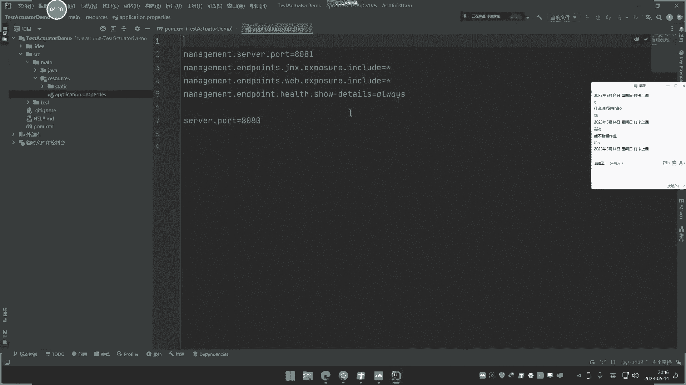
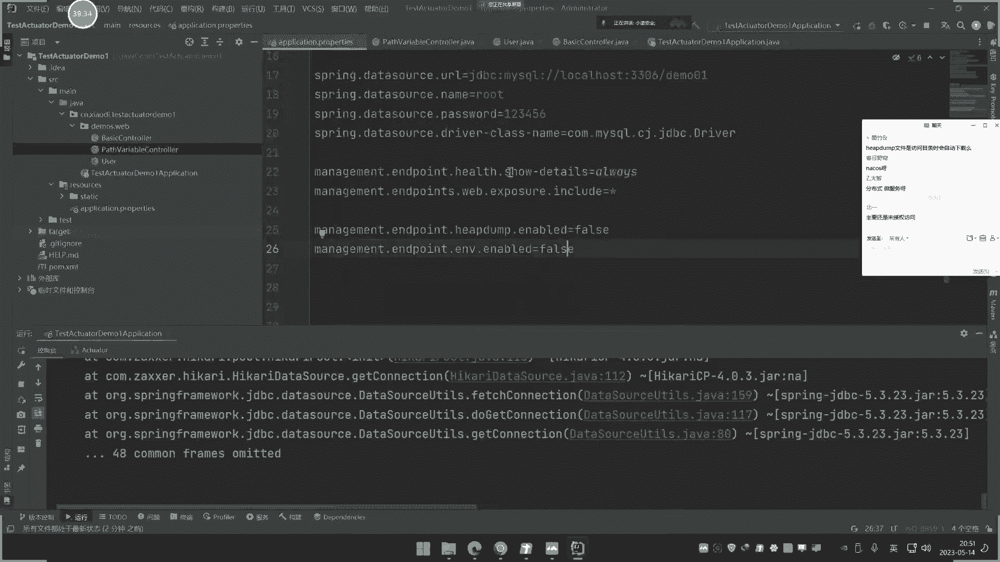

# P39：第39天：JavaEE应用&SpringBoot框架&Actuator监控泄漏&Swagger自动化 - 逆风微笑的代码狗 - BV1Mx4y1q7Ny

今天呢就说一下这个第39天的内容啊，这个第39天呢，也是我们java的倒数第二次直播了，那下一期直播呢讲完就没了啊，从时时一刻开始呢就讲下一章节了啊，大家也开心了，对不对啊，今天讲什么呢。

今天知识点呢不是很多啊，主要就是给大家说一下这个安全问题，因为他的开发呢代码量是极少的，讲两个东西啊，第一个呢是这个SPRINPUT框架里面，或者说java应用中呢最常见使用的一个东西。

就是一个监控系统叫ACTUATOR，还有一个呢就是一个接口系统叫stronger，对不对，就是WAGGER，那这两个是什么东西啊，啊其实呢就是它的命名这个解释一样的，一个呢用来监控的。

还个呢是用来接口的啊，具体为什么要用到它呢，我们现在从他的解释上面呢去给讲解一下啊，在spring put啊，这个java的这个E1开发框架中呢，这个监控系统啊，他是经常会使用的一个东西。

它是用来干嘛的，他说是用来提供一些这个啊代码的健康检查，审计指标收集，包括访问的路由跟踪，可以监控到应用的一些运行的内存，包括运行的状态等等，简单来说他就是来监控此个项目，就是我们说的这个web应用。

或者说一个应用的一个运行的一个状态，其中呢就包括运行占用的内存呐，运行的调用链呐，有哪些网址啊，访问过多少次呀，包括里面哪些东西出现了这个异常啊，就是搞这些事情的，简单的说它就是一个维护类的项目。

便于呢你对你的项目的一个东台呢，有个实时的监控，所以这个东西呢，就是我们今今天要介绍的第一个啊，好，那么我们呢就给大家说一下，这个第一个的一个使用啊，来我们来看一下它的使用。

那是非常简单的啊，我们来给大家演示一下啊。

首先我们在这里呢新建一个项目啊，这个项目名字呢就叫，Test，A c t，ATOR是吧，然后呢就叫这个名字啊，嗯这里就唉还是搞个demo吧，无所谓的啊，因为帕米明这个有有差异。

然后把这个组的就改成CN是吧，中国小黎，然后呢把门改一下，下面呢改成MAVEN的啊，然后呢圈R1步，然后在这里呢我们来给大家看一下啊，选中这个web的，然后呢接下来啊关键地方来了。

这个地方呢就是OPS啊，这是它的一些东西嘛是吧，那前面呢我们搞数据库的时候呢，还搞过这种数据库的东西，是不是，那么现在呢我还是把这个数据库东西呢，也把它勾选上，因为等一下呢。

我们要进行一个简单的一个测试啊，好我先不勾选吧，先不勾选啊，先把这个搞上去啊，两个选中啊，点创建，我们来先观察一下这两个的一个差异啊，打开之后呢，我们来看一下啊。

这个呢是什么东西啊，它的使用怎么使用呢，也非常简单呃。

应用依赖依赖呢，如果说你在这个包含了嗯，这个代码中呢，它也包含嘛，哎如果说这里已经包含了，就是我项目创建的时候已经把选中了啊。

所以这自动包含了，如果说没有的话啊，你就自己呢在这里呢配置一下就可以了啊，好第二步呢就是配置这个监控，配置监控在哪里配置呢。

就是在这个文件里面啊，就是我们说的一个配置文件里面，在这里啊，打开这个啊，然后这个呢是有两个格式都可以使用是吧，一个是这个东西。

我先把这个去掉啊，把原有的去掉，然后呢他这个配置监控是什么配置的啊。

如果你这里呢什么都不配置的话，那这个是已经有它已经有配置了啊，我先把这个几个东西把珠子掉好吧，注释掉。

如果什么东西都不配置啊，什么东西都不动的话啊。

那么现在我们来看一下啊，去打开运行一下它啊，就说我只导入依赖我，什么东西都没有动啊，我来运行一下它看一下啊，然后他这里报了个错误，我看是什么错误啊，8080端口被使用哦，这个端口的一个占用问题啊。

我不知道是哪里电脑的哪个东西占用了，我就直接搞个另外的端口吧，8001好吧，确定一下，重新启动，好在启动了啊，那现在呢我们来看一下这个情况哈，1921log host嗯，8001，然后他的访问路径啊。

这是他默认首页访问路径呢，你可以在这里看到，来在这里呢ACTUAACR，就这个是他路径，我们来把它进行一个这个访问啊，看一下是什么东西啊。

打开啊，好那这里呢就出现这个东西是啥呢。

来我们可以看一下啊，一个JS文件转换一下这个G而生的数据嘛。

来看一下这什么东西，那这就是一个什么叫HADA什么鬼东西。

这个健康这啥东西打开看一下来，还是一个人st状态up普开启状态啊。

啥都没有了，就只有三个，这三个地址是吧，一个是刚才访问地址，一个是这个地址，一个是这个一个路径地址，这也不知道是啥。

就三个啊，没有了，这是没有配置的时候啊，就是说你啥都没有管它的时候啊，他就只有这个东西好，我们现在呢来给它配置一下，那这里呢有一个配置，就这个啊，就这个把它写成新口星号，代表就是所有就是包含所有。

然后呢我们再重新把它进行启动一下啊。

再来看一下现在的一个状态，我们看看现在有什么东西了啊，访问一下这个地方，刷新一下啊，哎现在又多了多了，我们来打开看一下啊。

来看一下，这里就有啦，有这个啦，有这个啦，有这个啦，有这个啦，还有这个啦，那这个info呀，什么JADA哈巴啊，什么缓存呀，这些东西是干嘛的呢，来这里有张图片给大家看一下啊。

这就是关于那上面路径上面的解释，你比如说这里有个in v，它就是获取这个当前项目的所有属性，还有什么这个inform，就是一些引波站点的一些信息啊，引波点的一些信息，就比如说这里有个引波嘛是吧。

我们现在访问这个影波啊，那现在是空的是吧，当你在这里呢，你看一下啊，来info点内蒙设置为叫小B啊，info点six是吧，我们设置为men啊，啥闷不够是吧，gay是不是都知道是gay，直接重启一下。

再看一下info那里刷新是吧。

嗯啥情况又没反应了没没，应该是没有把它进行一个，再打开一下。

应该是要重新项目存吧，编一下的啊，重新编一下吧，这个倒无所谓的啊，能不能出来意义都不大，我们主要是给他做个演示。

哎呀咋也打不出来呀，你这你妹的不给面子呀。

好不出来就算了啊，不管它。

那么这里还有几个啊，你看这里有几个啊，那这几个呢我们不管这些东西，我们看一下啊，这里还有什么C型啊，这个一大堆的，那我这里给大家说一下，这里面有几个地方呢比较关键，我们等下会说的啊，呃有几个地方。

那这里是他的一个展示，对不对，都展示出来了，那么现在呢我们来看一下它的安全问题，就是这个东西有什么安全问题啊，这个东西有什么安全问题，这个，环境怎么配置，怎么部署，什么什么环境。

什么不什么环境怎么部署啊，你说这里面的配置还是说什么东西啊，呃这里面呢有什么安全问题呢，啊给大家说一下啊，配置需要懂吗，不需要懂啊，你又不是搞开发的，我们看一下啊，他的一个安全问题呢有两方面。

我们这里可以参考一个文章，这里有个文章啊，来叫spring的漏洞浮现，来这里有很多说这里面有什么漏洞，你看来这个什么SP一个RCE啊，什么什么这个一大堆的什么一些漏洞。

那这漏洞让我们看上去好像不是很明白，但这个访问应用非那是属性啊，什么东西啊，你都可以访问下，你看这里啊不是有英文V吗。

我们试着去访问一下啊。

这还有几个例子是吧，来个UV是什么啊，打开英V是这一大堆这啥东西啊，他的解释呢说是环境变量相关的啊，这里访问，但是转换格式有点问题啊，那我就换一个看一下，我直接在这里看一下啊。

你看他其实那就把你这个上面的一些呢，各种的调用的什么环境变量呢，就是我电脑上面的，就是我在本机上面那些环境变量的设置呢，全部打印了，大家看到没，这都是我电脑上的一些环境变量的设置呢。

它是获取当前的这个电脑的环境变量的，还有像这里呢有什么这个各种各样的一些，什么访问东西啊，那这个呢看上去呢还不是很美观啊。

它还是不美观，我们可以搞一个图形化界面给大家看一下，就是我们这里能看到都是个页面看到的啊，我现在搞个图形化界面给大家看一下，就是他那个图形画那个那个终端去看一下啊。

就是有这个管理端的一个情况，先给大家看一下。

先把功能介绍完毕，我们再说安全问题啊，好我先把这个暂停掉，好我们在这里呢啊，在这里创建或者说重新起一个这个项目都行啊，我们就在这里重新创建一个吧，和那也没什么关系的一种事情啊，重新创建一个啊。

叫test AC t u o a e t r，然后呢搞成一个叫server，就是有服务端和中和这个客户端的一个东西，搞什么东西啊，名字上也只叫这个名字，这个呢就是图形化的啊，搞个这个东西出来。

下一步同样道理呢，选择一个web，选择一个这个呢下面是不是有两个呢，刚才选的这个嘛，现在我选择这个服务端的点创建，好那这里呢搞了一个这个服务端的，那服务端的使用呢也是非常简单的。

直接在这里呢启动一个服务，就是在这里呢要监控这个地方呢，启动个服务就可以了，就直接在这里写就可以了啊，在这个SP这里写啊，那就这第一个就可以了啊，这个服务端已经创建好，那接下来呢我们再创建一个客户端啊。

再创建个客户端啊，也可以在这里创建都行啊，哎创建一个这个test，我们先把这个功能讲完啊，大家等一下就再看安全问题，不要急啊，不要不要说哎呀，现在不知道我在干嘛啊，不要这样去想，等下就明白了。

看下他这个力情况啊，再改一下，这改不改都无所谓啊，我是说看上去更正规一些啊，这里呢也是一样的道理啊，刚才是选择服务端，我们这里呢就选择一个客户端啊，选这客户端好，再创建一个好，这里呢就创建两个啊。

创建两个啊，一个是这个东西的，一个这个东西的啊，这个你也可以放成两个项目都行啊，这是我放在里面一个模块，这个无所谓，你可以单独放出来，就重新在这里创建一个项目也行啊，都可以，我在这里。

那就是麻烦再搞一个窗口好啦，这里呢就是这个服务的客户端呢，怎么配置呢，来给大家看一下啊，也是这样道理啊，这里那就直接打开那个配置文件啊，在那写什么呢，URL写什么IP地址，1271。01。

01或者log host端口，这个端口呢这里是8080啊，这一边的服务端，这里啊它的配置文件在这个地方嘛，在服务端的配置文件，服务端配置文件也是8080，所以我要端口来改一下啊，这个呢就叫四个八吧是吧。

改成四个八，然后这边呢就我不写了吧，这边就改成这个889，这个端口呢是那个web服务的那个端口啊，和那个不一样是吧，然后这里呢就是连接是他的四个八端口哎，搞四个八端口嗯，然后呢再来写什么呢。

再来写刚才配置的那些东西，把它改成星号是吧，那个，啊这个就是我们要显示的配置，那个要显示的信息对吧，刚才配置之后，那才有那些更多信息，什么info啊，那些东西是吧，都有对，把它显示出来啊，连接它。

那么现在啊我们来看一下启动服务端和客户端，现在启动这个普兰的运行，好那这里呢他自己启动的端口呢，就是这个刚才设置的四个娃娃，然后呢，我们现在启动这个客户端里面的这个地方是吧，然后启动。

两个啊就一个服务端的和客户端，好大家可以看到啊，在服务端这边呢，它就会出现一个东西来，好那么现在我们来关注一下啊，在启动好之后啊，我们来试着去访问一下啊，来访问一下访问什么地址呢，打开看一下啊。

大家看一下访问四个八分号的时候，这里出现个什么东西呢，一个图形界面出来了，叫spinput at me，然后这里发自动翻译了应用墙，什么应用日志报表什么东西呀，然后点一下啊，如果说不翻译。

你就自己选择这个语言啊，这就不说了，点进去报了个错，点错了，点这个下面这个那进去了，你看这有几个东西。

这其实呢这个就是图形化展示，刚才的我们看到的这几个东西来什么info呀。

什么ENV呀，都在这里，这其实就是个图形化监控的一个系统，就是做这个事情，就刚才呢我就简单使用一下，现在的就是说截图，你看这里有什么东西啊，你看啊，哎比如说这里有什么新能是吧，还有这个什么环境。

就是你电子上面的这个项目的配置环境，什么加载的，包括这些事情的一些东西嘞，就是你上面的涉及到这个java的一些使用的，类配置属性啊，什么任务细节方面还有呢，这是他的一些东西，还有这呢日志配置，是吧。

那这里呢它都有音色啊，各种各样的就是哪个地址呢，访问哪个地方，这个呢其实就是对整个项目呢，包括这里呢还有他的这个存储的一些东西呢，监控的一些事情，就做这事情的啊，这是图形化的啊，呃简单来说呢。

就是在这里呢你可以看到很多的一些信息，包括哪些东西被触发过几次，都可以在这里看到，你比如说呢这个选择那个触发方法，比如说你写过app的，那这里就会有app的呢request，谁请求谁可以自己的勾选，哎。

所以请求的那个路径呢请求拿个请求几次，他就可以在里面进行监控，他就是搞这个事情的啊，我这里呢就是写一个这个图形化，让大家看到更美观，但这个呢不是我们关心的，就是我讲这个东西呢。

就是为了告诉大家有这么一个事情啊，有这么一个东西是一个spring put框架里面，那个监控的系统，很多项目都会用到，那么用到它如果配置不正确的话，就会导致一些安全问题，哪些安全问题啊。

现在就来演示第一个安全问题就是首当其冲的，这是出现率最高的，就是利用它的hand得down文件，HANDDOWN文件，那这个文件是个什么东西，这个文件呢从它这个上面那个解释来看的话啊。

他的解释夯的down呢是一个什么东西呢，来看一下，他说是一个java的JVM的一个堆存储，啥意思呢，我告诉大家，它其实就是一个人形的一个虚拟内存，可以这样去理解它啥意思呢。

java这个语言的和其他语言不一样啊，他这个编译呢是采用一个这个，虚拟的一个东西呢去把它编译运行的，那这个文件有啥东西呢，你从它的字面上理解这个英文单词，应该也知道应该就是一块的什么内存信息啊。

这种类似意思是吧，还得当像我们那个内网安全里面呢，经常有什么down哈奇down怎么个东西，其实呢就是一些数据相关的一个数据块呀，数据内存这种意思，那么他的意思也和这差不多，那么这个文件是什么东西。

你就可以把它理解为，这就是整个项目的一些打包的一个内存文件，可以这样去理解它，这样就好理解些，那么这个文件有啥呢。

大家看一下啊，我们现在呢去访问一下这个地址，先去访问一下这个例子啊，他的哎不就你直接看这个地方，它就有哎哦这个这个把你应用。

我把它关了啊，这是这个项目的，我先把暂停一下啊，打开刚才那个，把这个运行起来。

两个都行啊，我只是说用那个原生态的去给他看一下。

来这里呢就是有这个地址嘛，啊来啊转换一下啊，然后这里呢是有这个哈吉down这个访问地址啊，来我看一下啊，很多信息的啊。

里面有很多包括这里的访问日志的一些情况，这里也能看到内这些常见的运行日志，呃，然后呢我们这里呢有hash dua呢，白访问访问之后呢，它会自动下载。

看到没下载了啊，来下载一个20点啊，六十六二十六。4兆的一个文件出来了，然后我把这个文件呢给他拿到，我们看这个文件是干嘛的啊。

把它取出来好，那么现在呢把文件呢放到这来。

好文件放这来。

包括我们刚才可以看到的啊，这个不止有这个信息。

包括我们上面写到的很多代码，他都有，我们待会会给他说，那这个文件拿到了啊。

好那么现在呢我们可以用网上两款工具，一个是这个系统自带的这个工具，还有一个呢是我网上下点写好了。

一个叫分析工具提取器，我们先看这个自动的一个分析工具，它是用来干嘛啊，就这个ESE直接呢可以打开这个文件啊，比如说我们现在呢，刚才那个文件是在把它放到桌面了，跑哪去了啊，在这里哈，放到左边来啊。

然后呢我们来装入啊，选择这个桌面这个文件啊，类型的就选择这个堆文件啊，那找到这个哈希当啊。

在这里打开诶，这里呢就分析了啊，这个是一个系统自带的分析工具，然后你看里面就有很多事情嘞，这其实就是你整个那个项目里面的所有东西，然后你点开可以看，里面呢就会有相关的一些什么设置的值啊。

那些其实呢这个就可以理解为，就是它的一个KTV里面就会含有一些源代码，一些信息，那么既然有源代码，如果说在这个源代码中有配置过一些数据库的，配置密码或者接口，账号密码不就是能得到吗。

那么现在我们就来做这个实验，做个什么实验呢，我搞一个项目，我配置一下我的账数据库的连接，账号密码放进去，然后呢我再启用这个监控，但这个监控呢下载这个hash down。

从里面去分析看能不能得到这个账密码文件。

能理解吧好，那么现在呢我们就要做这个事情看。

那么刚才这个分析类工具呢，它的使用方式就比较麻烦一点，就是说你要在这里用这个什么OQL控制台，去查询，这个查询语法呢，就是有点类似于网上的这个什么SQL语句，所以他就是说按照你自己需要。

比如说你自己想查是吧，就snack的查什么东西，它是word啊，从哪里面查，是for来自哪里对，是这样的查法，那这里查就其实就是说这个只是个工具，帮你分析的，然后你用这个语句的去查。

然后我们这里还有个项目呢，就是这个啊，呃给他介绍这个这个项目是一个网上一个项目。

它用来提取信息的，我们可以关注一下这个项目是干嘛的啊，看一下啊，他说的知识提取敏感信息，哪些信息，数据源信息配置文件信息，包括reduce信息，需要K信息，模糊查询用户信息等等信息，那这里呢有一些是吧。

那我具体呢给他演示过，大家也知道了啊，好那么现在啊，你比如说我用那个项目给他提取一下，你看他能不能提取到啊。

java杠Z1个JN这个工具啊，不是JNZ开头的这个加，然后呢输入哈希down，然后这里呢我就把这个哈希当放到进去啊，放进去，呃把名字改一下，名字就改成哈奇一，好这里打开了，先把关闭一下，啧好可以了啊。

放到这个项目这个统计目录啊，放到统计目录下面去，然后呢分析这个HION，然后呢我们这个是一一嘛是吧。

好回车，你看它就自动帮你提取，就是说刚才那个是分析工具系统自带的，需要你用语法自己塞，而这个呢是别人帮你写好规则了，直接帮你自动自动提取，提取什么东西呢，你看啊他也会搜什么，有没有OSS的配置信息。

有没有里面配置什么账号密码的这个配置，还有像什么我们说的在常见的啊，往上翻，他就会收纳什么这个啊，这个嗯索网的信息数据库信息包括啊，继续往上翻来这个cookie的这个美mambo mambo。

这个就是我们那个小K的那个配置，还有你看这里有什么这个，那你看刚才配置的信息不是得到。

你看来这是我配置的嘛，你看嘶在哪里诶，不是不是这里在这里，你看哎。

哦搞错了，不是这个项目，这个项目，呐这我配置了吗，你看，来是吧，还有现在看常见的，如果说你配置过release，配置过这个什么各种各样的呢，阿里云的什么鬼东西啊，还有这个马克dB的呀。

沃波罗kc的呀啊一大堆呢，他sting不database的东西啊，他当时没有发现，为什么，因为我本身就没有写，那么现在我就测试一下，我写一个这个类似于骨干之前讲过了。

my babies那个数据库账号密码，我配置到这个项目中，然后呢我用这个项目去监控，然后呢，这个项目呢由于它的这个监控呢没有限制，导致我直接下去还是down文件的分析。

提取到这个项目的一些数据库的一些账号密码，如果说我配置过什么阿里云的那些，同样也是能够获取到的。

知道吧，就这个意思啊，那么现在呢我就来去给大家演示一下，时不时这个道理啊，是不是道理好，我们现在来去给大家演示一下啊，你看一下啊，重新再创建一个啊，这个叫test，就是我说现在呢就是引用这个数据库的。

这些东西了啊，就我把它引进去啊，这个就多么移了啊，重新再搞一个是吧，然后呢把简单的东西改一下就完了，好这里呢我们就勾选是吧，这个挖宝，然后呢勾选数据库的，因为这个数据库呢马上要配置嘛。

所以他要用到这些东西啊，就搞个maybe maybe my bias这个MYSQL的呀，再把这个东西再选中哈，哎好四个啊，都选好传接，就此窗口吧，就把那个东西给他终止了吧，因为现在也不需要用到它了啊。

把那个项目也关了吧，那个服务端客户端的都关掉，避免等下受影响，好那现在呢打到这里啊，啊，那我这里呢就账号密码呢那些信息呢，我就不写了啊，我就写几个东西，第一个呢就这里的那个账号密码的配置。

首先呢我把这个地方呢给大家先注释掉，这个原有配置，先把注释掉啊，自己配置一些东西，当然我前期由于都配置过，我打开前期的那个哎直接赔是吧，哎呀懒得看前面了，这自己有的时间自己写出来啊，password呀。

spring的这个内蒙呀，还有这个spin database的drive class啊，还有我们这个视频的URL啊对吧，Jdbc，Mysql，你说这里R配置的，然后LOCALHOST的啊。

3306端口数据库名，DOM01啊，找密码呢，Root1，这里配置下啊，123456嗯，class名drive，那这里呢叫数据库配置信息哦，除了数据库配置信息之外呢。

我们把那个server的那个端口改一下，避免等下冲突啊，就搞个七七去吧，然后呢，嗯还有一个就是我们说的这个显示，那个事情是吧，把他这个二维死，然后呢包的这个地方诶搞错了，先说型号来好点，这里的配置好了。

就这个东西它配置好就行了啊，那我这边还可以写一个这个类似的一个，这个类似的一些文件哈，包括这里呢是有些访问录呀，那我不用了吧，我直接拿给他运行起来吧，因为这里有些自带的文件啊，好来运行起来四个七端口哈。

我们呢就把这个四个起窗口用到这个监控啊，里面配置个账密码呢给他拿出来啊，然后这里报错是什么原因呢，报错是什么原因呢，他是报错这个什么鬼，JDBC的连接的一些问题，为什么，因为我的数据库没有开呀。

所以他报错了，原来提示连接的一些问题啊。

不管它啊，因为我们不管，我们现在不是要用数据库啊，我们主要就说我配置好了，我等下呢看能不能通过这个哈，希down呢能得到这些里面信息啊，好那么现在让我访问一下这个文件哈。

来看一下啊，来127。0。1的accost，四个七端口，访问，那这里呢就直接访问这个hash down了啊，我就不卖关子了哈，得down直接打开下载啊。

嗯啥情况。

打错了吧，是哈德，哦哈哈普，当你妹的，好下载好下载好了。

这个是这个第四个啊，来这个下载35。5兆的，把刚才这个呢是没有下载的，我们把这个拿出来啊，把这个拿出来。

那这是刚才那个分析那个移移的，没有发现到一些信息是吧。

这刚才分析的结果，那么现在呢我们再把这个东西呢拿出来啊，名字换一下，换成还是当二放到这边来来。

现在呢分析自动化分析好，回车，大家看着啊，看到没，这里有什么东西啊，你看来看到没，J d b c123456，好，往上面继续翻看，还有没有其他信息，那你可以往上翻啊，那看到没，这是我配置信息啊，来。

是从哈希当里面，提取到这个项目的一些信息了呀，那其实我其他东西就不用配了吧，其他东西就说你配不配呢，他也能得到吧，他也能得到，是不是嗯，对不对，他要提取到了啊，那么这里呢我可以给大家看一下啊。

我现在呢还有个这个文件，这个文件呢是一个真实的应用文件，一个哈希down，你看这个文件啊，这个不是我项目的文件，就不是我本地的，我在网上随便下的一个测试的啊，网上一个真实的，你看这个哈。

希当然是另外一个，你看他提取的，这是别人的，你看来这里有什么别人的一些什么阿里的什么，你看来上面我又看名感，星期五不看，你看有什么password，第一次use name很多哈，我都就不看了啊。

你在数据库的一些什么鬼东西，这是release的。

在网上找的一个啊，呃这个呢就是我们说的这个哈吉当啊。

那这是我们用本次项目呢，给大家做了一个演示啊，这个其他的呢我们就不再说了是吧，这个这东西呢就是这么个情况，那么这是你可能说，那这个监控就这么一个事情吗。

不是的啊，就说这是他的一个泄露，从里面去提取信息，那么还有其他应用，就是这个文章，那么其他应用就是什么原理呢，好我们来先观察一下在这边的这个文件，这里面呢它是有很多东西的。

你比如说像这个呢map map是干嘛的，路由的相关信息嘛，那这个端口搞错了啊，是这个奇袭。

你看再把它放到这里来格式化一下，看看你看这有什么东西啊，你看啊，包括我写的项目里面呢，这是有些路由外线来访问这个什么鬼，UZ地址，还有什么这个java e的地址，还有正面的访问这个hello地址是吧。

什么user地址，你看这里有没有呢，我搜一下来看看啊，user大家看到没访问这些路径的啊，这个不不是很常见，我们访问hello的吧，看一下hello的，第二那请求hello的来源域的项目的哪个地方呢。

那请求呢这个代码这个代码不就在里面了吗，嗯看到没，所以说啊他这里面的很多地方都有利用，那么其实说它里面呢会泄露出各种类的架构，包括各种什么访问地址，内存信息一大堆，那么同样道理。

他是不就会泄露出你用过哪些类呀，就比如说我用到了什么wrong time，就是我们说的常见执行命令，那个类会用到那个wrong time。

那么在我这里给到的参考文章中啊。

来你看这里啊，嗯参考文章中呢，他们是怎么利用的，你看啊他是说漏洞原理是什么情况呢，啊请求在里面获取了结构信息，然后呢发现里面有用到这个什么这个类，然后呢他利用这个力这啥啥概念啊，简单来说我就告诉大家。

他通过这个内存的这个信息的监控到，我把它写下来吧，刚才这个是用这个里面提取出来的数据去分析，他的分析是为了干嘛呢，其实呢就是说分析提取出敏感信息，敏感信息就是我们说的这个什么list。

什么配置账号密码呀是吧，接口啊，接口信息啊是吧，这个配置密码呢就不限于什么数据库，什么这个短信或说人应用啊等啊，这种配置是吧，得获取这些敏感信息，同样呢还有一些这种什么信息是吧。

那么还有一些其他利用它又是干嘛的呢，比如说啊他分析呢得到有这个一些什么组件，那这些组件呢是不安全的组件，啥意思啊，那如是用的什么logo时间使用local4J有漏洞啊，是不是就可以利用它啊。

这个好理解吧，就是因为那烟绯啊，得到一些什么这个一些这种呢用过这个东西。

哎，这个东西它包括漏洞也不安全组件，那这个上面呢大部分都是个四星啊，那下面有个这个索引案例可以看一下来，这就是按照后期的一些各种漏洞的一些测试啊，来包括他上面所有的就里面会涉及到的。

那这个呢就是我们目前现在还不需要接触的，这个关于它的更深层次的利用，就是上面这些漏洞利用，这是放在下一章节讲到java安全的时候，再给大家絮叨嘞，今天呢就是给大家了解一下这个事情，对不对。

知道这个东西就可以了，咳那你可能会问，那这个东西网上常不常见呢，其实呢我也不用去演示，网上很多地方都用到这个东西，你你可能说怎么知道的呢，唉知道也很简单嘛，都是用固定地址，你访问的这个路由。

一般他不修改这个地址啊，默认就是这个地址啊，如果说你在一些网站后面加上这个地址之后呢，我发现诶有内容，那恭喜你啊。

这个网站启用监控，那只要他配置不当，就会造成这个问题，那如何叫配置不当，如何叫配置当呢，不可能说用这个东西就不安全呀，对不对，那就是我这里说的啊。

你想它安全的话，就可以这样操作，它怎么操作呢，来他不是写这个东西吗，你又怎么样，你就写个这个，呐这里有个叫什么had done，什么force，就是不泄露哈，down还有什么。

还有像我们说的in n v，改成什么false就不写了。

一个V，还有什么info，对不对，这些东西呢都可以写上去，就说你不要泄露那些地方，那就包括这上面不有这么多吗，哎是吧，你就把它设置为false，你比如说像英V和这个have不down呢。

我就把它怎么样写为false，然后呢我再重新启动一下，对不对，你看现在啊刚才是有哈down的，那那那那那我现在看一下哈，他是不是就没有了，这个就是说你用它可以，但是呢你只要是稍微不注意配置不好。

他把一些敏感东西呢给他拿出去了。

拉你那就是吧，那就不好说了哈，你看现在啊，我看里面有没有东西啊。

解析一下，你看看有没有英文飞和那个hob to啊，搜下来，那这个没有英文看不到了吧。

我直接访问这最直观来直接访问来DV，刚才只是有的访问不了了。

那top down，嗯打错了，那也没有了，是不是那没有了。

所以说啊嗯他这个问题呢，其实就是说不是和系统相关的，这个系统呢本身是为这个程序员，为这个项目呢为这个维护，人家认为呢给予一个监控帮助的，对你的这个上线的应用呢更好的了解，但是呢由于啊你这个配置不好。

导致把所有信息呢都给他搞到互联网上去了啊，里面其中很重要的是hub down呢，被别人得到之后呢，就能得到你项目中的一些配置信息，包括你这些源码信息，所以我们通过这个提取到的一些账号密码呢。

那就能非法的连接这个说法，我相信大家就能知道了是吧，所以啊你就可以在项目中端配置这两条，防止这几个利用点呢把它关闭掉啊，不让这个外部的访问到，对不对，或者呢，就像我刚才做了个客户端和服务端的样子一样。

对不对，搞客户端服务端有那个授权访问，那样呢也可以嗯。

这个就是我们说的这个第一个监控系统，的一个开发使用和它的一个安全的隐患，安全隐患呢我只介绍到了最简单的哈，不down的一个信息的提取，包括这个提取，我们今天讲的是一个攻一个项目，网上呢有三五个。

所以说你真实在利用的时候呢都要用，因为每个分析器呢它不同规则，有时候呢可能有些信息他提不到啊，你还可能用到这个官方的去用语法去提，更加的这个满足你需求，也可以用这自动化的题是吧啊，每个项目都不一样。

这个具体的一些情况呢，我们在第下一章节讲的java安全的时候，再回到这里的时候呢，就会给大家详细深入的去，把各种项目优缺点呢去给他分析，还有就是我们说的除了这个之外。

它可能会涉及到一些上面泄露的一些第三方，安全组件的一些漏洞和调用，这个呢也是一个他的一个利用方法，就是它可能会涉及到一些安全问题，那这个监控系统啊就讲到这里了啊，我想问一下大家能不能明白啊。

这个东西啊好理解吧，这个东西应该不难理解，因为这里面没有什么代码量，无非就是说对这个东西的认知，和他的安全范围哈，能下载哈布down算漏洞吗，肯定不算漏洞啊，这个漏洞只说一个安全配置不当。

它的漏洞是由于它这里面泄露的一些信息，然后衍生出来一些安全问题，不是说你下载他去当，就他也有漏洞，不是这样的啊，我们是通过他的监控系统的，哈当呢去提取出来一些有价值信息，后续利用来找出漏洞的。

只是说你下载汉子档呢，子弹安全隐患呢加大了。

但是并不代表它就一定会有安全问题，你就像我们现在一样是吧，我们现在呢我啥里面东西啥都不放，我数据库都不配置，我就搞个demo，我给你hash down，给那个哈B当然给你去下载也没啥用啊，你们啥都没用。

对不对，你们不要要求太多了啊，这个这个东西呀说实话呀，从网上那是都是介绍的，是说怎么利用这个从开发去讲，他的这个安全问题呢，还没有人这样讲，隔壁高端的也没有讲这个事情，你们还要我上什么微服务。

那谁顶得住啊，嘶嗯好，那现在呢我们再来看第二个啊，这个spring boot的接口系统stranger啊，这个首先来介绍一下啊，刚才那个是监控系统，那这个是监控系统，那这个又是干嘛的呢。

其实呢这些讲的这些东西呢，都是属于方便管理员，运维人员和程序员呢，对他的项目有更深入的了解，更好的效率去测试的一个东西，都是为了这个帮助这个人去工作的，但是呢你配置不当呢，就会导致一些安全隐患。

都是这么一个事情，但这个jungle呢在spring put里面用的也是非常多的，我们待会呢也可以网上去给你搂一下，给他看一下，是不是有这个安全隐患，然后呢还有像这个东西呢。

它不仅是在这个java的一个应用中，有出现在什么其他的一些啊，其他什么PVP的啊，Python的它也有，只是说他在java里面用的多啊，特别是像一些这种有一些接口提交的的，一些这种应用的话。

那基本上很大情况下面都会用到这个爽口，那么它就是当前较为流行啊，比较流行的这个接口文档生成工具啊，他是干嘛的呢，其实呢就是在开发前和开发后，对于自己的项目接口的这个正确性呢啊，进行提交测试的一个工具。

就是对方呢程序员呢会安装它，来对自己的项目呢这个接口啊，比如说像我们说的啊一些接口，像什么是支付接口啊，或者说这个数据获取接口啊，对不对，他要看这个结果呢是否配置好，它就会使用一些工具去测试嘛。

那么你不可能说对不对，把这个工具一个个去测试，一个点去测试，他就用这个项目呢，直接在这个页面上面就把所有东西列出来，你想测试谁就测试谁好，那么讲到这里，大家觉得他的安全问题是什么问题呢。

它的安全问题就是接口泄漏，什么叫结构性能呢，我们试想一下，你做安全测试的时候，一个网站它上面有哪些提交接口，你知道吗，你不知道你是通过你的网站目录，扫描自己的信息收集指导着你呢，可能有一个结果。

而不是说你打开网站，你就知道就很简单啊，我项目中我写了上传文件。

我写了这个提交，获取对方的这个用户信息的这些接口，我给打开网站呢，它不显示，你怎么知道有这个东西呢，你不知道啊，但是这个时strangle呢如果部署上去，它就会自动把这个结果给他拿出来。

所以你就知道有这个东西了，你又给撤了，那么先用我们再上安全，我先学会怎么使用它，我现在等下呢，我再来给大家演示一下他的一些安全问题啊，他的安全问题呢不是安全漏洞，不是安全漏洞啊。

他是给到你的有更多的测试的可能性，这是他的安全问题，所以他不是LOL，他只是给你一些测试点，好，我们来先搞起来啊，名字就叫做test strangle，然后这个呢呃这个呢他在这个，嘶1。8。

然后他这个呢他在这里选没有啊，就是在这里那里没有那个strangle那个集成，所以我说就需要自己去导啊，自自己导，我就先选个web就可以了啊，像这个里面一些其他东西呢我就不搞了啊，就先搞这好。

那现在看一下啊。

如何使用它啊，首先呢呃他这里有两个版本，一个版本是二版本，一个是三版本，我两个版本都演示一下，他们两个版本使用呢没什么太大的问题啊，你可以参考这个文章啊，这文章写的很详细。

那就这里啊啊stronger的一个介绍，然后呢他有这个R版本和三版本，R版本呢需要引用两个架包，就是我们两个这个仓库的架包，三版本呢只需要一个没什么太大区别啊，区别就在于配置上面有一些小微的差异。

给大家演示一下就知道了啊，然后啊我给大家演示一下，首先呢引用这个R联9R的版本，那这两个加包呢就直接把引擎进去，这2092呢是一个稳定版本，一般都会使用这个版本啊，你用这个其他版本的也可以。

然后使用的时候呢要注意一下。

你这个spring BO的是3%还是4%啊，如果说你使用高版本的这个spring铺的话，那可能就需要用三版本的strangle了啊，所以大家注意一下啊，我这里呢是用阿里云那个推荐的R点。

R的一个SPINPUT的那个版本，所以我这边也用二版本，三版本它也兼容，但是如果说你在这个，你在这个呃，其他的一些其他的一个那个spring boot，三版本上面的话，可能就需要用到三了。

那我在这里那就找这个地方是吧，随便的把这个依赖呢给填上去，那就写到这里来吧是吧，然后呢我们来看一下正面的这个mono，目前他的依赖是吧，这是直接只按照两个把刷新一下，哎这里呢就有这两个了，是不是。

当然了，你点正面的刷新也行的啊，这两个就下载好了，下好之后呢，现在就能用了，是不是，然后呢我们现在呢就来看一下啊，它是怎么用的呢，这个R版本使用的非常简单，就是直接在你这个启动这个项目这里呢。

写上一个什么EN双头就可以了就行了，哎小字呢就能直接用了，但是一般都会出现一个问题，那么问题呢给大家说一下啊，我先启动它会报个错，其实就是个路径问题啊，啊他有个报错是吧啊，这个是八零满窗口的问题。

我们先把这个修改改成这个，好在运行，好启动，你看又报个错，这个错是什么情况呢，是这里呢，他说是一个什么叫document东西啊，这个是什么，给大家说一下啊，这个一般都会有啊。

这直接在这里面用这个东西来修复就可以了，SPINDERF非C，就这个嗯，然后呢改成这个第一个好保存，重新来编译一下启动就可以了啊，好现在正常了好，那么这个是R版本R版本，这个是装个启动好之后。

它是一个网页端的情况，我们来看一下网页端，先把这几个全部都删掉，怎么访问四个六端口嘛是吧，加上什么呢啊WGGGER杠UI点HTM，这是它的访问地址哎，等一下是不是写错了，哎怎么没打开啊，哎啥情况。

这的是什么鬼，经狗出现这个莫名其妙的一些事情，不是不是不是哎，这还是巧事情呢，我换个装可行吧，这他妈的卡里有啊，不是这个不是这个这个不是一码事情啊，不是一码事情，我知道你们说的那个意思。

看一下啊，我先把它启动，那666都打开不了了，你说这不尴尬吗，666就打不开了，是8012端口，换一个端口时间，手机都访问不了了，这看个毛啊，转201好可以了，那么终于正常了，这首页能访问就行了。

那一般就没问题，装个它默地址呢是这个啊，杠UI点TML好，打错了吓我一大跳，我说你们又翻车了吧，好可以了，你看这有了，你看这啥东西呢，这啥东西啊，你看啊，我这上面有些接口的地址。

你看这个呢有什么hello的，这个什么user的，这个什么server user的对吧，然后这里是还有一些呢自带写的呢user东西，还有这个加beat，然后邮箱呢还有参数啊，邮箱还有参数。

你看这里还有参数是吧，然后自己打开看一下，你看这是不是那个东西啊，你看呃base console的，你打开来这hello的几种提交方式啊，so为user的，还有这个什么这个地方呢。

这是另外一个233默认的，还有这个里面呢java beter呢RECOR来这意思。

这就和我们这个上面写了这些常见的这种接口，的请求地址，接收数据相关的web应用相关的，你看，是不是没问题吧，啊你比如说像这个我在这里呢，我把先暂停一下啊，我重新给他写一个了，你看下啊，重新写个。

我们就写个这个test console，好先开始探索啊，然然后呢我按照之前那个使用方式是吧，之前上节课讲过的是吧，然后呢我们写几个哈，我们写带参数的吧，就不写这个不带参数的啊。

嗯return返回这个数据数据，那就是搞个参数进去，String，啊LIMON是吧，嗯返回一个叫get得到help普有数据，然后呢加上这个name就要返回这个东西嘛，是吧好，这个是这个get的哈。

我们再写个post，post state也是这个情况，然后名字改下，改成post host，Date，然后呢发现上去啊，然后呢这里呢在这个是这个是什么get的，那直接写get啊。

就不写了个request member的一个路径嗯，写上这个叫就访问，叫get data吧，然后这个呢就是post memor，然后杠post data路由写上去，然后呢这里呢再把那个返回一下。

Spin boy molly，写个东西啊，试一下啊，把这个类导入下，好那这样写好之后呢，重新启动一下项目啊，我们看这里呢师傅会多出这几个东西来啊，我刷新刷新一下好。

大家看一下，现在啊你看是不是有个test console出来了呀，那打开那是不是有get data呀，还有个是什么post data，是不是出来了呀，然后你看里面参数值是自动帮你取的。

你看name那自动帮你写的参数名都写好，然后呢你想来点提交是吧，就自己上去测试一下就完了，对不对，那个就try1try it out，来点一下，那比如说我现在这个值131，那返回内容啊。

这里啧看看是返回内容呢，respond body呢返回来postharder data，那结束数据和代码逻辑一样啊，那如果说这是post嘛啊，Get，那你加检测器一样道理，点击这个啊，Try out。

就是尝试一下啊，顺便再取一个勾啊。

返回值get hard get，是不是就是这个逻辑，你看，那这个应用呢大家就明白了呀，那这个就知道是什么东西了呀，他是干嘛的，他是帮助你对这个项目呢有一个各种给，就是说这个安装上去之后呢。

你这个项目的所有的一些这种，关于hp的这种访问啊，提交数据，这些东西都会展示到这里。

那这个就是不是就给，相当于就是说，如果你针对一个网站进行安全测试的话，你是能够知道他有这些东西吗，他除非展示出来，你才知道啊，他没展出来，你咋知道有个get date这个地方能够提交数据呢，对不对。

你不知道啊，但是它有了它之后，通过它是不是就能把这个项目的这些东西，都知道了呀，那如果换句话来说，这上面如果说有个上传文件呢，你不就是可以上传个稳定车的时间吗，就不直接相当于给你一个上传文件的一个地方。

给你去测有没有上传的物种，你说这该多好呢，你还在找上传文件在哪里，他直接给你一个，你直接测不就好吗，大家试想一下，如果这个接口里面包含了，像一些后台的一些这个信息，比如说像后台里面管理员的什么添加呀。

删除啊，包括后台一些一些敏感的什么用户的查看呀，什么银行卡的一些什么鬼东西呀，那你勾一下测试一下，如果获取到一些信息出来之后，那不就是敏感信息泄露，那就是一个低中位的一个漏洞啊。

那如果说你能得到个信息之后，再利用得到更高位的，不就是更高位的事情了吗，这个就好理解了吧，那这个东西的应用大家也知道了哈。

好那这个呢这是R版本，我们说一下三版本啊，我怕有些人呢不知道三版本呢，不是说我想教你说必须要用，不要说敏感词汇啊，这里面的又出提示了，不要说这个敏感词汇我都怕说，然后呢，我们来看一下这个，呃三版本的啊。

嗯三版本的先把三停掉，然后呢，三版本这里呢我先把这个R版本的给它去掉，R版本的是需要导入两个包，然后我看三版本的啊，三版本那就只导入一个包就可以了，只导入一个包啊。

R版门呢注意下阿坝门呢是要在用的时候呢，在再加上这个东西。

其中箱子里加个东西，三板门呢就不需要加这东西了啊，我等下把它去掉啊，把三版本呢先融入进去，我来观察一下这个MEA。

你让我刷新一下，那现在三版本写进了二二版本消失了，好现在三版本三版本呢，这个这个文件配置是一样的，这个不用管它，然后呢还有一个主要的就是地方，就这里啊就可以把它去掉了，就不用它了啊。

三版本如果说你要用它是另外一种写法了，它是什么写法呢，就是in他刚才是这个enable all嘛，它就是这个呢三版本是这个，所以有点差异啊，这但是你写不写都无所谓了，写它和不写它都可以。

二版本要写大家知道就可以了啊，把编译一下，然后启动啊，这三版本的其他的都差不多，没什么差异啊，然后三版本还有一个差异，马上就知道了，还有个差异呢，给大家说一下来，这是刚才的R版本，现在访问不了了是吧。

那地址就错了，为什么，因为你现在用了三版本，三本地址是什么呢，三版地址是，index点HTML，这是三板门，知道吧，如今发生了一些改变，其他的没有啥了啊，其他的使用方面呢有些大同小异啊，也不太重要。

包括这里呢也是一样的啊，那测试呢我就不测了，好那大家可能说诶这好像没啥呀，好那么现在呢我给大家说一下啊，关于我讲完它之后，后面呢我会给大家继续细讲的一些事情，那么今天演示一个叫自动化测试。

我何为自动化测试呢，大家想象一下啊，这个接口上面看到的只有四个，那么安全问题我刚才说了，就是相当于给到你很多的测试点的，比如说有上传文件的，有获取信息的，你就知道这里的能不能测一些漏洞啊。

就说直接给到你有漏洞的一个点，给你测，有文件上传，你就测文件上传，有其他的就测其他的，对不对，就是给到你有这个网站上面的，所有能够获取到一些信息，获取到一些项目的信息的一些地方，就给到你这些东西。

但是很简单，我们数量少，比如说这里啊就这四个啊，我呢花不了多长时间，我都看一下，也就无所谓的啦，是不是，但是你想一下，如果说这里有百个甚至甚至上千个呢，项目特别大呢，那该怎么办呢，那不可能一个个点开。

一个个在这个上面点燃操作吧，你一个点开了一个输出局，一个车吧。

这显然不现实，所以啊就给大家说一下，利用我们的几个工具，postman或者什么其他网站些工具。

这里呢推荐大家使用postman in，简单方便，看看它有什么作用啊，postman呢点击这个叫API，点击这里叫导入路径。

路径写哪个地址啊，呐这里有个大把这个例子写上去，复制到这来，点击继续，点击继续，它是已存在，替换好，这个不更新好，来这里集合，你看这里就出现一个东西了，打开这啥东西啊，是不是就刚才的这个结果。

你看写的的get date，Post，date是出来了呀，包括这里的很多啦，server user是不是出来了呀，这里不比你去这个上面搞得条理清晰一些吗，呢你还一个个展开一个，看下一个他放到这来了。

你说诶这也不是自动化呀，这好像就是把展示到另外一个显示界面来了呀，何为自动化呢，那这里有个叫什么韧性，那你要勾选测试的地方，比如说呢哎搞错了搞错了，点击这个地方那点人形呐，这有很多嘛是吧。

我就把一些我要测的喇叭勾选上，对不对，比如说这里我们这里都要测的。

那保留相应值点击运行，那他又帮你全部测一遍。

看到没，帮你自动把所有接口去测一遍，然后呢你就直接看返回，看这个摘要是吧，那这里呢就是一些返回，因为我这里啥都没有，所以他是啥都没有返回啊，很尴尬啊，对不对，如果真实情况下，你啊我这里没点了。

没有被保存，返回，重新运行一下吧，这其实这个科呢是我们包括这里呢，如果说有这个上传文件的，那你把文件提交，那可以测试他不，假如说有上传接口是吧，你就可以随便搞个这个文件上传。

就是它也会自动帮你有那种文件上传的地方，他也帮你自动去上传，你说这改多好呢是吧，你这个是要结果，对不对，那这是结果呢请求的头和请求的内容，然后那里面不是还有些有参数值的吗，那这个参数值是怎么设置的。

只是说游戏有变量的，你可以在这里面设置变量，然后再批量请求都可以，这个到后期我们再讲API的那个结构安全，因为这个是专格的，属于API的知识点，只是说他在java中常用，在讲API安全的时候呢。

我们会详讲，关于这个自动化测试上面的一些东西，而且我给大家说一下这个东西还可以再联动，联动什么，我可以给说一下啊，他这个东西呢可以做个代理，就是我说自动化提交这个项目之后呢，我设置个代理。

代理转发到x x r a y bob suit上面，再装，拿个工具帮我自动化再去扫描一遍，可以这样做啊，这都是后面要讲的啊，这现在呢我们不说，现在因为漏洞还没有接触到啊，我们就只给大家提个醒。

那这个就是说的这个事情是吧啊，好那这个东西呢大家就明白了，大家也知道了，他是干嘛的，简单来说呢，他就是那会泄露一些应用的这个什么，像什么有登录的呀，信息展示的呀，文件上传的呀，对不对，这种事情。

那么那对于我们测试什么未授权访问呀，啊敏感信息泄露啊，文件上传呐，这种安全的漏洞呢就有地方测了，因为网址打开，你哪知道哪里有文件上传，哪里知道有这个测试这个卫生权的，你不知道啊，你只能乱测。

但现在还给了这个接口，你了，你通过这个接口的请求和返回和观察，里面有没有些信息，观察里面能能不能得到信息，通过这个测试呢，就是相当于给到你一个机会，给你在测漏，而以前呢就是你自己在找机会车。

找符合机会的地方测，像他有的他就不一样了，那你一坑会，但这个这个东西多不多呢。

你看下我给你就网上搜一下啊，我们简单点一下。

我们肯定不做这种违法事情是吧，给他砍一下的，比如说我搜这个专客。

随便找一下是吧啦，你点开一下啦，哎这这不不，所以只剩下，很多哎呀，这不不没有啊，呃搜还不好搜啊，什么鬼啊，这都湿的，其实都湿的，但有些国外网站打开man的而已。

你看这里呢，你看他是有游客来了，这是不知道是哪里一个网站呢，假设都是他的吗，那这游线呢是不是我们。

那你说在哪里呢。

我不是叫大家上学要搞别人啊，不是要教这个事情，我是说给你一个看法，你看看，来来他获取什么用户点赞呐，获取指定内容啊，那用户中心了呢，你给测一下嘛，来获取什么微信id，这哪知道这应该是个什么接口是吧。

来点击try一下，来来微信id，你比如写个什么东西，这可能是个什么小程序，什么东西，哪个对不对，获取个人信息什么这个大堆，还有你看这里，这这更多了这个app里面的常用数据。

这哪知道是哪个哪个东西呢，对不对，太多了啊。

这个实在是我，来公式给这样的穿一下。

我们就不测了啊，因为这个东西呢到我们都是属于这个未授权啊。

我们呢隔壁都出了问题是吧，我们呢也不能说乱在上面测测测啊，那你还是有啊。

只是有实战意义的，没什么说这个乱七八糟的乱讲的啊。

那很多啊嘞，这都是一些可能一些业务系统的一些事情，好我就不说了啊，点到为止，那大家就知道这个事情了呗，那么以后啊如果是碰到的是装个，包括这个刚才我说的那个监控系统。

那你就知道了啊。

包括像CCTF体系里面这个东西呢也出现过，那很多这个CDF体系里面的呢，有时候考这个东西呢，大普的2020年出现过这个条例，来strangle的开发接口测试，唉所以说不管是在实际中。

还是这个考一些CDF里面的都有这种事情，你没有学过，你咋做呀，题目也做不了，实际也搞不了，碰到了就不知道这啥玩意啊，今天开发讲的，你知道是啥玩意了，是不是后面呢我们再把详细利用呢再讲啊。

基本上呢就掌握了啊，这个呢我们可以自己呢再看一下文章，给大家看一下这个过程啊，因为我说呢还不太好，我这网上随便找站点给车呢，再给违规了是吧，来我们这里呢可以看一下呢，这是网上别人的一些文章。

你看一下这个文章里面它的一个大概过程，你就能知道这个东西讲的一些意义，什么鬼文章啊，那你看他这个就是他一个典型文章了，他说是先扫扫路径的，其实就扫这些装格呀，这些东西呢这也没什么说的。

就是常见的那个路径，找到之后呢，你看啊他这里测了这测哪个点呢。

直接发包是吧，然后你看这里呢，他发现了文件上传的呢，有文件上传的直接测。

那把文件都进行了，上传成JSP用户身份测试，也有的，MYSQL注入也是一样很多啊，就是上面呢有很多东西你都能测啊，测好之后呢，有些呢如果是设到后台账密码，他还可以尝试登录一下这种地址未授权访问啊。

也是测一些点，然后呢得到一些敏感信息。

因为呢其实就是说这个东西啊，给到你有很多机会啊。

就是以前呢你可能新收集搜不到有哪些点，但是呢他一出现呢，那就是吧，那就多了，这都是那个测试文章啊，我们大家看到了应该就知道了，这也是我们后期要吸生物深入讲的时候，那再给他说的好。

然后这个安全修复呢其实也比较简单的啊，安全修复呢就是配置一下，这个里面的访问权限啊，但这个不是我们所操心的，这是开发运维的操心的事情啊，我们只要知道这个事情带来哪些危害啊。

知道他的一个开发的一个情况就OK了啊。

嘶其实我们讲他呢说白了有些啰嗦，什么啰嗦呢，因为大家也不是学开发，我也没有说很深入的去讲这个东西的，开发的应用，包括上面的配置，但你不用这个开发角度去讲，那我直接告诉你啊。

我strangle是一个什么东西，哎八一讲你好像听了就跟没听一样，也不知道是是是为什么要用它，所以说还是要结合代码讲的，这个东西就会记忆深刻啊，好今天的这个字典呢就讲完了啊，漏洞字典呢还是比较少的。

下节课呢我们就是java1的最后一讲了啊，就把那个项目的上限，包括，还有一些鱼类的一些这个身份验证的问题，给你讲，那么安全开发了就不再讲了啊，你们不要不要要求说还讲哎呀，讲不动了，真讲不动了啊。

有些人也不愿意听了啊，你想听的是肯定想听，这个不愿意听的也是真不愿意听了啊，不能再讲了，再讲也顶不住了啊。

好那今天就说这么多啊，大家看有没有什么问题，有问题就问，没问题就下是吧，最后讲呢下节可以讲，讲完之后呢，我们就下一章节了，讲漏洞方便了，肯定今天没了呀，准备就准备这么多，想想JWT好。

那下节课我讲一下J看呃，看时间啊，解答问题和那个SHOSHO有点麻烦，不知道一节课讲不讲得完啊，接答题就简单一些，JWT也是那个你JWT的，我安全开发会讲，即使我不讲。

我后面那个java安全里面呢也会讲JWT的，因为他是身份验证，那个测试点也和这个什么鬼，我们说的这个这两个东西差不多的一个概念，它也是一个身份验证，就是cooking啊，session啊。

然后现在比较主流的JWT这种身份验证技术，然后它上面的是有些攻击点的是吧，开发呢也讲啊，包括我们后面他的JWT的安全攻击点呢，我们也会讲，所以你也不用担心啊，只是说讲开发的更深刻一些。

你们不要要求太多了啊，说实话我都按照你们这个要求讲，我就是高端number one了，是不是，你们偏老说这两天我在打游戏啊，什么我不在搞学习啊，隔壁还在开靶场，说句不该说的话，我是在玩游戏。

我里面课也在上啊，也没跑啊，对不对，还有点啊，有些东西你不要看表面啊。

