# P40：第40天：JavaEE应用&SpringBoot框架&JWT身份鉴权&打包部署JAR&WAR - 逆风微笑的代码狗 - BV1Mx4y1q7Ny

我们今天呢是第40天的内容。

呃，今天呢也是这个安全开发这个章节呀，我们第三章节的最后一讲了，也是java这个开发的最后一讲了，有人呢一直问说这个还有几件开发的科，问的人呢有两种，一种呢就是想多上几次课的，但是大部分人都不想上了。

顶不住了，听不懂了，所以啊我们也上不了了，所以啊从下节课开始就进入到第四个章节了，那么今天呢最后一节课啊，我们把java的一些没介绍的给你锁一下，然后呢就到此了啊，开发的内容，那我们就不说了啊。

那么后面再讲开发呢，就是这个Python开发了就不会有这些其他的啊，且看且珍惜呀，开发的可不是我想上形势所逼啊，嗯好我们看今天内容啊，今天呢主要讲两个，一个是关于这个项目的部署。

也说前期呢我们一直用这个ID啊，再给大家去写代码呀，对不对，有人呢就会有一个疑惑，就说你在上面去运行，把这个代码运行起来了，那不可能在真实的情况下面，对方呢装个id呢去把项目打点上去运行起来呀，对不对。

那所以说呢，我们今天呢就是说，如何把这个艾利企业的项目呢，给他打包封装出来是吧，然后呢形成一个这个真实在网上，线上运行的一个项目，是吧啊，搞这个事情呢，第一个呢是让大家明白这个过程。

第二个呢主要就是明白这个java这个项目部署，会和我们前面讲到过什么pp啊，JS啊，或者说什么点net啊，点net没有讲过，但是呢几乎大同小异，或者说这种其他语言它会有哪些的一些差异。

那么这些差异又会回，我们拿下了这个安全方面的这个方式和，信息收集的这个技巧啊，有哪些这个不一样的地方呢，就是说由于这个差异所造成，我们讲过的某些的一些漏洞也好，或者说这个啊测试方式也好。

都会有一些显微的这个可行和不可行的问题，就比如说由于它的价格都造成了这个源码方便，他能不能泄露啊，这个源码是不是加密的呀，源码又该如何查看呢，它会有这些疑问在里面啊，等一下我们部署完之后呢。

大家就会把这个疑问解开，所以啊我们前期不管是信息收集，或者说后期的这个分析啊，代码分析这些技术呢啊，你都需要前提的需要了解到的，因为你会觉得这个语言的不同，它的源码的体系和架构的也不同。

所以啊有些方法呢就有些可行和不可行了啊，就不是说很多东西都是通用的，就会有一些特点特征，导致他不能用好这个打包项目呢，我们在讲这个身份验证JT，JWT这个技术完了之后再给他说啊。

那么这里呢我们来学习一下这个java里面，那个身份健全技术叫GWT，那这个JW是什么东西呢，啊我们给大家说一下啊。

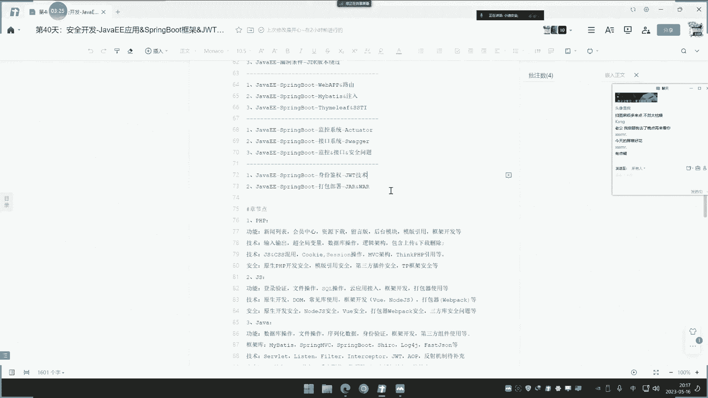

早期呢有这个叫这个pocket session。

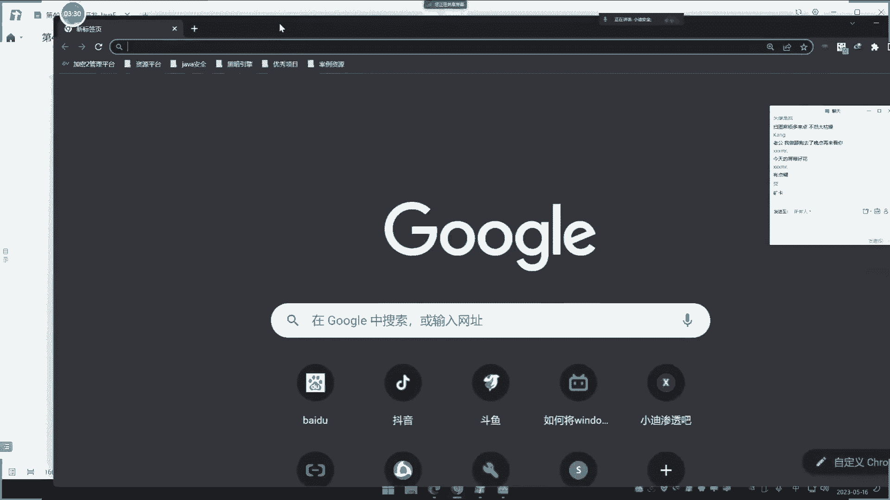

现在又出一个J8T，这三个呢都是属于关于这个身份验证，身份鉴权的一项技术，简单来说就是三个呢，都是属于对用户的身份性判定的一种技术，那么每个技术都有格子的优点和缺点，那么随着这个时间呢。

这个时代的发展呢是吧，这个前面两个cooking的C型呢，就逐渐的被这个JWT呢所取代，包括这个JWT呢也有被其他技术取代的，这个情况啊，它也是有很多，但是目前为止啊。

大部分的那都是还是采用这三种技术来实现，因为他们三级市呢比较时间比较久远的，一短时间内是不会说啊，会销声匿迹的，但现在呢网上还有其他的一些身份建设技术，已经有新的了啊，那就是我们以后的发展方向。

那这个基数我们为什么要讲，他和和我们哪些安全技术呢有关系呢，其实它的功能呢就是说生存健全的，就是说对于用你这个用户的身份性判定，就说为什么我登录了这个用户，就是显示的用户，而不会显示其他用户。

那么其中的技术呢，就是用这些东西来实现来判定的，那么最简单的就是cooking啊，稍微复杂一点的C型，包括现在要讲的JWT对吧，网站呢是可以根据他的一个介绍，是不是可以看到这几个东西的一个。

大概的区别和差异的，那这三类激素呢，我们前期在这个pp里面有讲过这个cookie和session，这两个东西啊，app里面，那么在java里面呢，其实它也可以用到cooking si。

但是如果说稍微有点这个开发经验，或者说追逐这个技术潮流的人呢，都会选择用这个GWT去取代这两个身份，经验和技术，因为JWP呢会使用起来更加的安全，它也会更加的方便，而且性能和各方面的都有优越性。

就是这两项技术会占用资源，同样呢在处理器的效率不太高，安全性也比不上JWT，所以啊在java里面的话啊，会使用JWT的可能性会高一些，但是在pp里面用这个C型和cookie呢，他的精神会高一些好。

那么接下来呢我们就介绍一下，在java中使用JWT呢，来进行身份证全的一个简单代码的一个说法，那在讲之前呢，我们先有必要呢给大家介绍一下，这个GWT是什么东西，它的一个组成部分啊，关于这个讲解呢。

我们浅微的讲解一下，因为在后面的这个课程中，我们会详细讲到JWT的它的安全技术，就是包括它上面有哪些安全隐患，大概就是有4~5种，对不对，我们今天讲的就是说从它的开发角度呢，会讲出其中的一种。

那么还有三种四种的话就在后面啊，单独再讲这个JWP身份证，选技术的安全性的时候呢，再给大家去讲清楚，但是这里呢我们还是首先要明白一下，这个JWT的这么一个流程和它的组成。

那JWT的这个指向流程是个什么东西啊，那么浏览器呢通过发送一个登录请求，里面包含了这个账号密码去给服务器，服务器之后呢，就会存就会干嘛呢，就会创建一个JWT的一个凭证信息，也JWT的数据。

然后呢返回给这个浏览器，然后浏览器呢再用这个接到P的这个，这个平局呢去尝试去访问它的些，授权的页面，就比如说你登录后台，那么就会翻我后台的一些场景页面，后台页面就会检测这个JWP的合法性。

最终呢去选择性的去给予回响和错误的提示，他是这么一个过程，这个过程其实和前面什么cookie啊，C型，但有些这个区啊有一些相同之处，也有些差异之处，这个具体差异之处呢，我们先不说对。

这是个G大P的过程啊，好那么这个过程为什么说它效率的很清楚，其实呢就是很简单，服务器呢他只做了一件事情，他只做一件事情，就是创建和验证没了，这是服务器要做的事情，关于这个JW的这个存储呢。

它是保存到对方的这个什么浏览器的，那么像cooking的安全性呢，就是因为它保存了浏览器，所以导致cooking呢不安全，就是对方如果说拿到这个cooking值的话，就可以围绕这个用户登录。

这是cookie那个问题是吧，虽然说它效率也高，就是服务器呢他只做这个创建和验证，那这个cookie也是这么个情况，但是cookie有个缺点就是什么呢，就是cookie值一旦被对方知道的话。

他就可以用这个cookie去登录这个用户，但这个JWP呢它不一样啊，JW它不一样啊，那么C型呢它是存储到这个服务器的，所以说，登录一次就会产生一次，登录一次就会发生一次，那么这个C型文件呢。

它毕竟也是个文件，时间来的话，成千上万个用户访问的话，这个服务器呢不管是效率上面，还是这个存储上面都面临挑战，所以说这个接WP的取而代之了，因为它的平均这个文件呢不会在服务器产生。

服务器用代码来去给他创建去运行完了，它不会产生在他服务器本身啊，这是他这个情况介绍啊，JWT的全称叫js o wo toy，它是由这个算法的去进行这个构造，出来一串数据，这个数据呢分为三个部分。

那这个数据呢综合哪三部分呢，分为一个叫ha，就是我们称之为叫头，还有一个叫PLOAD，就是数据的一个中心核心，还有一个叫SINGATU就叫我们说签名，那具体是一个什么概念呢，啊，我们这里呢可以看一下。

这个大概的一个接受R3，这是他的一个情况，这是他的一个大概的构成，这构成呢就是这种乱七八糟的一个类似base，六四的一个编码，然后呢格式呢就是三个两个点，就是AA点BB点CC就这个格式来前面一串。

后面一串，中间一串，然后后面一串就这种格式，这种格式呢你碰到了就知道这是一个JWP的，那么怎么碰到呢，就是在数据包里面，你看到某一个值这种类似的数据显示，并且是两个点，前面一个字符，头部中间是KO的。

后面不是叫签名，头部就是默认一般是这两个啊，就是生命这个JWP的加密算法，和他的一个类型，payload呢就是你要存储的数据，比如说我把用户账号密码就放到KLOAD里面，然后进行加密。

就形成这个中间这一部分，上面这个部分呢就形成这个部分，后面的签名呢就保持这个部分，签名里面就有什么东西呢，签名里面就有类似的miss，就是我们加密的密室，这个签名他就有加密的密室啊。

就是我们说的加密算法的一个miss啊，后面呢他用到这个Python的一个啊，用Python的JM来使用JW用，但是我们现在讲的是这个java啊，所以我们就spin spin put里面呢。

是实现一个这个JWP的一个情况啊，那么后面的一些这些常见的什么东西呢，我们就不介绍了啊，简单来说啊，讲到这里呢，大家就有个JWP的简单认知吧，认知呢就给大家总结一下。

就是它是一个现在一个取代cooking和session，身份认证的一项技术，用来呢去在网站中实现对用户身份的一个，判定的一项技术，它由三个部分组成，就是头部，payload和签名，头部就是一个声明。

这个算法和它的格式的一个情况，那么payload呢就是我们数据放的地方，就是我要是吧这个用户的身份就是他的地址啊，账号名啊，密码是多少啊，就放到plow的，然后第三个呢就是签名。

签名里面一般就会包含这个算法的类型和，算法里面需要用到的加密密实，这就是它三部分，三部分呢它的类型呢就是我们说的AA点BB，点CC这么一个格式，那么AABBCC，那其中这个AA和BBCC都是一串。

类似于贝斯64的一个随机字符串，那么看上去就是一个GTP，这是我们给他讲的这个总结啊，了解到就可以了啊，现在只做了解，后面呢我们再说其他的啊，那么接下来我们就用这个java第一开发中的。

是平铺的来实现这个JWT的一个过程啊，就是说我们模拟一下，看一下它是怎么产生的，是一个什么东西啊，然后呢通过这个开发里面呢，我们再来说一下哪些地方，如果说没有考虑到什么事情，就会造成哪些安全问题。

这是我们那个情况啊。

那么现在呢我们就用这个按D打开啊。

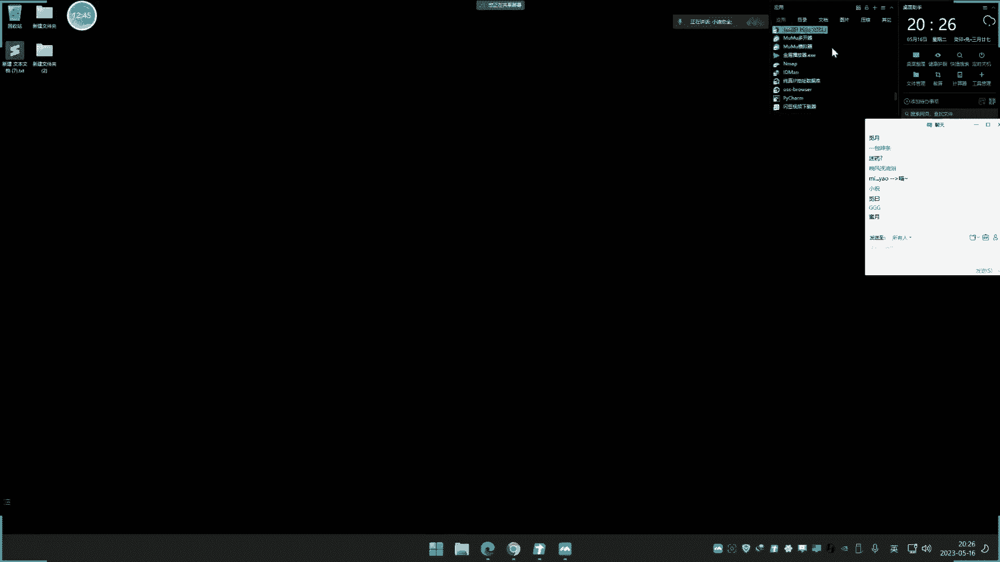

然后在讲之前呢，我们先给他看一下啊，这个JWTW应用场，网上很多有用到这个东西的啊。

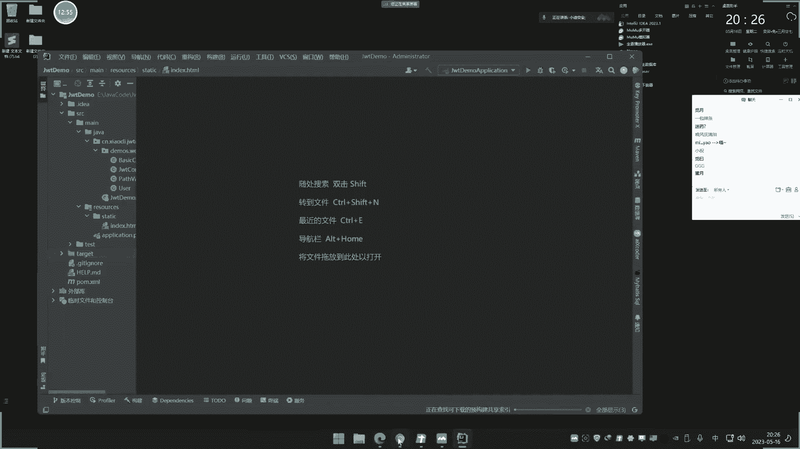

你可以看一下，不管是在CTF的考点中啊，在这个呃这个真实网站中，很多呢就是呢CTF的CDFGWP，这都是有考点的啊，不是说这个学期乱七八糟的讲义大堆没用的啊，这都是根据现在的一个技术要求和技术的发展。

方向呢所构造出的一些课程啊，包括你在真实网站中也能碰到。

我们到时候呢再讲他的一个安全，方便的核心部分的时候呢，就它安全方面就不讲开发，我们就会详细说到这个JWP的一些，实战的调性啊，好我们现在就取名一个叫test点，JWT的一个文件啊。

然后呢STBOOT创建哈，然后这里的取一下名字，版本选择项，下一步好，这里呢就选这个带web的吧，其他的就不用选了，因为他这个东西呢就不像那个其他的集成的，ping boot里面。

他这里呢就需要安装一来。

那么这里呢我们就安装一下JWT依赖，同样道理呢也是来到这个MVN这个上面的，去找一下JWT的这个依赖包啊。

这里也可以看一下外部库，同样的也可以看一下这个VN，这里面的一个情况。

目前这里只有两个，就是我们选取的那个web的东西。

啥都没有了，没什么打不开啊，这个网站，国外的房子就是猫啊。

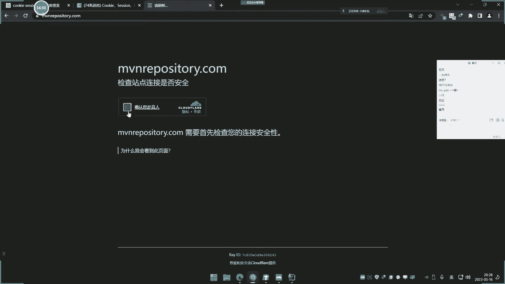

好搜一下GWT这个依赖啊，然后呢选择哪一个呢，第一个java jvt呢，这有很多版本啊，我们就选个时钟的版本吧是吧，你不要选最新的啊，因为有些可能最新的，那就会和我们这个网上一些这种参考文章的。

一些使用呢，可能会有一些小差异，也不知道他哪里有有更改，对不对，我们就选择一个那个，比如说最近一两年的那个那个什么那个版本，那样子呢就会好一些，是不是我们就选择一个随便选个18。0吧。

202021年的是吧，那行啊，那就搞这个了啊，巴黎复制啊。

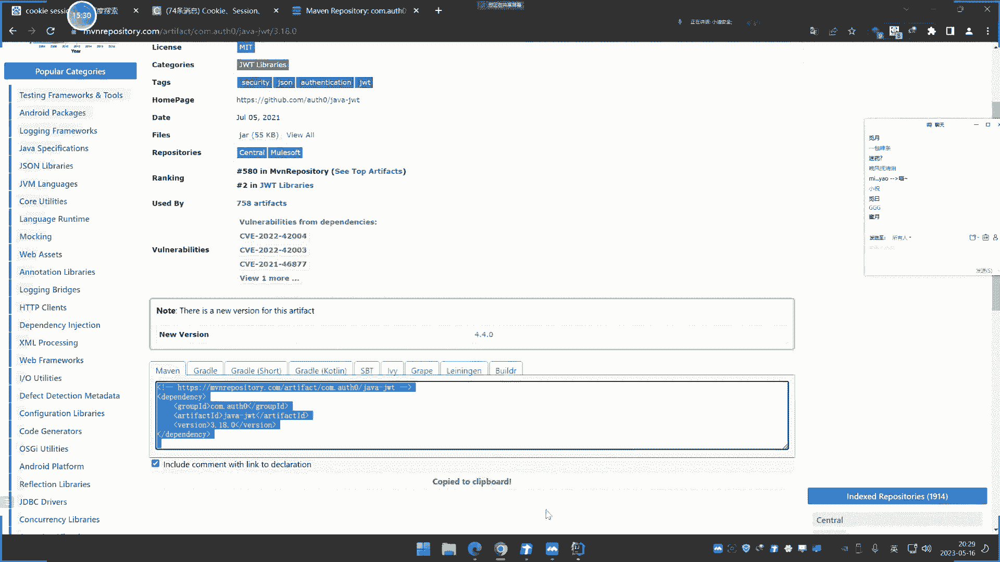

然后呢在这边呢找到这个依赖的这个地方的，索引的话，写到这来了是吧，好这里呢就刷新一下这里啊，当然你可以在这里刷新都行啊，来刷新一下，看看这里啊，看这里啊，一看就下载好了，是不是有了啊，好那好了之后呢。

这个颜色也变了，那正常了，那依赖搞完之后呢，接下来呢我们就来实现它的功能。

功能呢就是第一步呢，就是我们说的如何去创建依赖，我们从这个网上这个图图片来看的话，首先呢浏览器去访问一个地址，地址之后呢，去请求一个账密码，那这个呢我们先不不实现，它现在就说服务器这边就是我们写服务端。

服务端这个情况吧，是吧，来结束这个用户提交的账密码。

然后呢再把它生成一个JWP的这个数据出来，那如何实现的呢，在这里那种是吧，创建一个这个文件哈，这几个文件，但是我那个阿里云那个机箱上面自带的啊，如果你用的是官方那个镜像创建的这个冰封的。

那就没有有没有都无所谓啊，因为我们这个呢也不需要用到它其他几个东西，名字就叫这个GWT的这个console吧，就叫这个名字吧哈也怕取其他名字的重复了，好啊，搞好之后呢，呃我们这里呢搞个这个主导函数。

没有函数，然后呢，这里就是说去执行他的一个什么创建过程，那么现在呢它的创建是什么情况呢，来看一下这道题，点green呢他已经有了，好吧，great就创建，那么这里呢我们来看一下它的一个创建啊。

啊他的窗帘呢把这个窟导一下啊，好这个呢是那个创建，那么创建里面有什么东西，它有个点点了，一个是叫这个w with handle，这个函数呢就称之为叫搞他的文件头部，那我们可以把它简单写一下啊，放这里。

这个呢就是说啊创建的是一个设置啊，设置一个创建的这个头部，就是我们说的这个HIT呀。

那么其实呢就是我们之前给大家看到的，这篇文章的这个什么这个地方呢，单个部啊，这里啊这里跑哪去了，这里就这个东西啊，这里呢就是说你不设置它，就默认是这个东西，如果你设置的话，就可以在这里指向这个东西啊。

就把这里进修改，就是加密算法都可以更换的好，当然我这里的设不设置它无所谓。

因为我不设置它也是这个东西啊，如果说你设置，那就是也可以设置东西。

也可以打进更改，所以这个呢我们就先把它放一下，就偏不设置它啊，先把它注释掉好，然后呢还有一个是点什么，还有个点vs，然后这里有个叫什么，你看啊，他这里要这个呢，这个就是设置它的一个。

设置它的一个什么东西呢，这个就是设置它的一个什么啊，下交流啊，创建的这个什么low的部分，hello的部分，就是我们说的这个什么账号密码的一部分啊，就是我们说的一些常见的数据。

我们在这里可以把它设置一下啊，你比如说像现在我们就设置一下user id是吧，可以把设置为一，然后呢再点继续设，比如说这里面设置它的USLAM，对吧，哎这name那就复制为叫ADM，你们说这一行啊。

斜行写的后面太长了，你知道吧，太长了，这样写没关系，再来说一下密码，比如我们就叫这个123456吧，或者说A123456，对不对好，然后呢，这是先头部，还有一个那就是我们做的创建设置的什么。

就是我们说的第三步了，就是说类似签名的这一步骤哪里呀，这个嘛对不对。

这个部分，那这个部分呢就是点什么呢，点vs然后你看啊，但是handle这个是什么，你看他名字都能知道吗，SIGN就这个啊，这个就是它的设置这个部分，然后呢这里面还有个东西给他说一下。

就这里面还有个点V10，然后再理论这个东西，这是干嘛的，这个是设置它的这个什么过期时间的啊，这是我们做的一个失效时间啊，这个呢我们暂时先不用啊，因为这个东西在真实上线的项目上面才会用啊。

我们这里做他的演示呢，先不用它，那这个设置它的一个部分，然后这部分里面你可以看到啊，一个叫什么诶，然后寄了一个东西，然后加上一个什么鬼啊，你也不知道这个是啥，哎我们就看一下吧，lg是吧。

就这个东西这个东西是啥呢，这个东西是啥呢，我也不清楚啊。

因为啊在这个铅笔里面呢，它有这个事情啊，我们来看一下代码啊，在这里呢就这样去设，就是它的一个指定算法，我们默认呢一般就是前面如果不设置头部的话，它的指向的就是HS256的一个算法。

所以呢我们这里的其实就是HMO，256的一个算法啊。

我们就这里呢就这样设啊，然后点什么呢，那算法的类型，那默认一般最使用最多的就是这个tech arc，然后呢这里加上miss，这里有四个部分，然后其中就包含这个什么算法和名词好，这样就写完了。

然后一个符号结尾，阿丁可能会为什么3号上面这个没有符号，因为那上面这个符号其实是连接后面的，就是等于我在这里写一下啊，我是说为了这个什么看上去更加直观，所以我就把它写的还行里面去了。

所以这里其实不是一个与结束啊，他后面还继续添加这个点啊，这个这才代表语句结束，因为这三部分我都设置了啊啊设置好之后呢，接下来我们把它声明一个对象了是吧，然后呢一个点VR这么一个A，声明一个这个新类型啊。

这名字就叫这个j w t to好，我现在就把这个东西呢给他进行一个打印，好这个语句呢就结束了啊，我们现在就把它进行一个简单打印啊，打一下这个JWBTP看一下啊，运行一下看是不是可以了啊，来看一下。

来运行一下，Enemy a23456，然后D1什么，无法访问内文件，内文件55。0版本52。0哦，这个是什么情况呢，这个是我那个JWT那个包啊，和我们这个JDK的版本的不兼容，这个52。

0指的是我那个JDK的那个，1。8版本，55。0就是三个版本，就是说他要到11版本之后呢，他才能用这个包33018的呃，如果说你用高版本的话，所以说就会遇到这种问题。

就是有时候那个JDK的版本大概有差异，但都用不了，就说尴不尴尬是吧，所以你现在有两件事情，一个呢就是换把这个项目的这个，这里可以把门给他换成这个高版本，是11 3%。

然后呢或者呢就是把这个GGWP的这个包啊，给他换低版本两种，一个是升高JDK版本，一个是降低GDP的这个包版本，两种情况啊，你选择哪一种呢，是不是好，我们这里呢就选择把这个JDK版本的给他搞，搞一点吧。

是吧，换成那个11吧，11就是55。0啊，包括以上版本应该也可以的吧是吧，你起来再试一下，这个地方改了还没用，他要在那个项目里面改，在这里改哎呀，其实还是推荐大家去换这个包啊，因为你也不知道这个后面呢。

他又不会又不会会不会又出现这些，乱七八糟的一些问题啊，所以说换包是最好的，来看成功了吧，项目那个里面的把名改吧，就成了11。0就行了，你看这里，那就除了这个数据，那这个数据呢我们可以拿出来看一下啊。

这个是JW创建了一组下来，我们看一下啊。

他那个情况是吧，那这个数据那这个数据你看是不是有三个点了，一个点这里一个点这里到这里结束，然后还有一个点是这里，对不对，三个点，那么其中呢我要分析一下这个点呢，就是我们说的这个什么hand的部分。

那么这个点后面的数据到这里，点后面的数据，那就是我们做的这个PO的部分，后面这个呢就是我们说的那个，第三个就是我们说的那个签名部分啊，对吧，三个这个对应的情况啊，然后呢大家看一下啊，这是他的个结构。

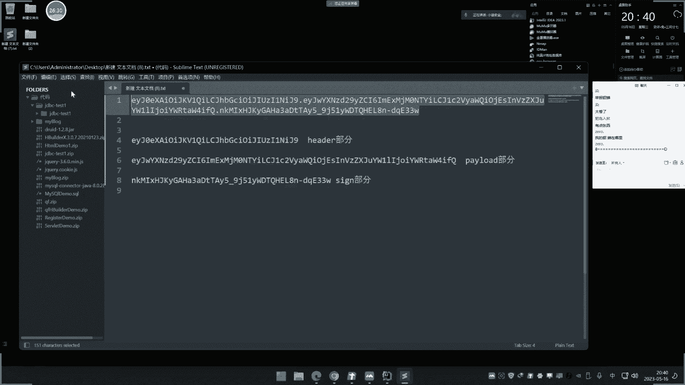

然后呢你可以在这个JWT的解密网站，或者他的官方官方就是叫JWTIO上面。

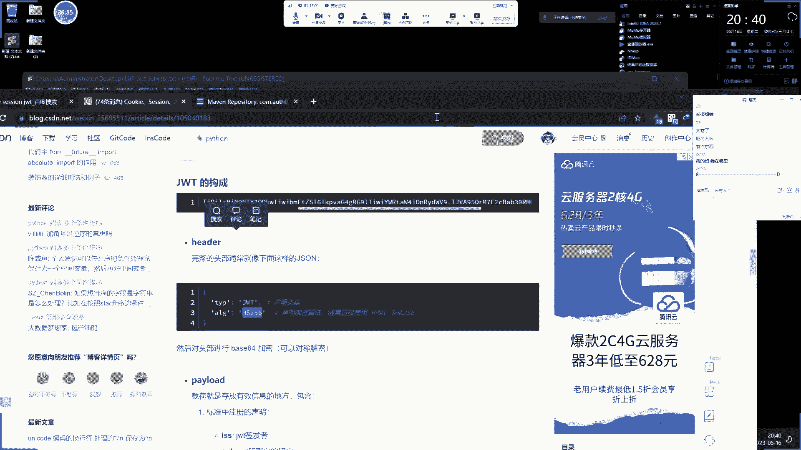

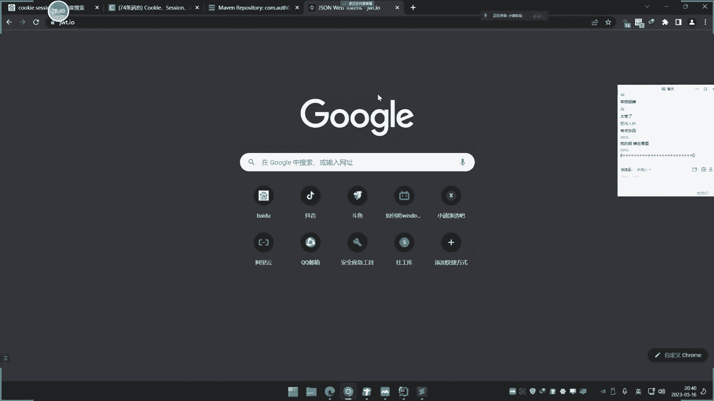

可以有这个对JW解密情况，我们可以可以改善的啊，我们在这里呢可以把这个数据呢放在这里呢。

刚才那个加密的值CONTRCC呢放在这里。

你看啊，你看这里就是不是呢它三个类型的头部，那就这个东西，你看PO的里面是不是就是我们生命的，你看password等于AE3456U，ID等于U等于M是不是出来了，是不是。

这是这下面这个部分呢就是签名部分，对不对，好，那大家肯定就有疑问了是吧，这里面的那不是我把这个密码改成什么，比如我改成小题，哎，小李一改，你看这里就改了，是不是啊，我改这个东西诶。

这里呢就可以相当于说我用这个用户，假如我知道这个值了，我把这个值呢把解密之后呢，我在这里修改，修改之后呢，这个是us，那改了，然后会不会登录的时候就认定是这个us，当然不会，为什么呀。

因为你看下面还有个什么租车这个签名，这里有个什么东西叫UR56beat safe，就什么东西啊，miss如果你这里不加密词，就是空miss对这个killer和这个头部进行加密。

那么这个值呢它是不会识别的。

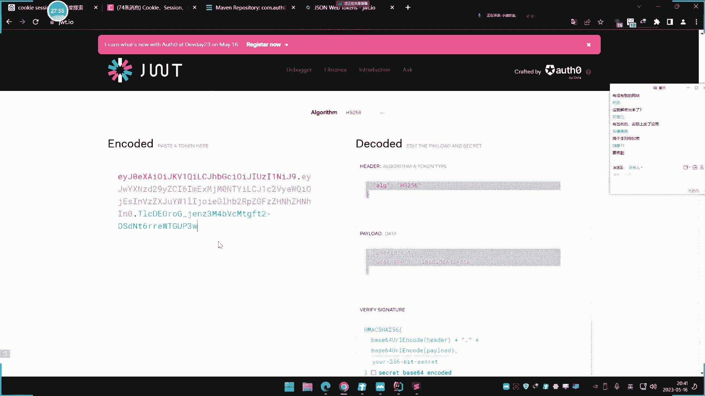

很简单的道理，啥意思呢。

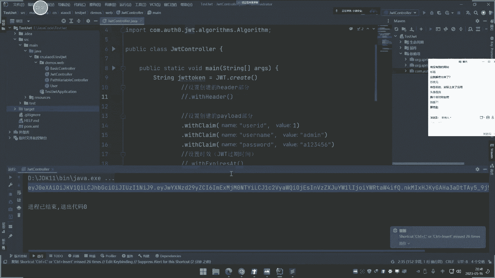

好这是创建，那么在创建之后啊，我们先把这个问题抛一下，等一下我再给他说啊，等下有实验做的，那么现在呢这是第二步是吧，就是我们创建这个JWT的这个代码已经实现啊，比如说现在我要简称JWT，这我要检验一下。

我看你是不是这个是不是这个是吧，就是说你不是要把键位生成之后呢，我用户去访问访问之后，不是这个浏览器这边还要去检测这个JWP啊，看你是不是这个合法用户啊是吧。

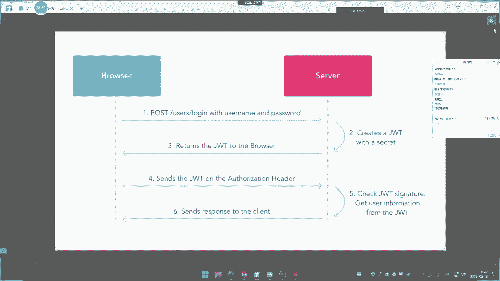

就现在我们就模拟啊检测一下这个好用户，所以啊我们来注意一下啊，这边呢这个东西呢，就是相当于是它是模拟一个什么，模拟用户的什么用户，这个什么JWP的创建，就是类似于说我们登录创建的。

这个用户的一个创建的接到P3，好那现在呢这个是模拟了，那么现在我们再来写一个什么模拟身份的检测，就GWP的判定和这个检测好，那这里呢我们就可以随便搞的函数名，就叫，就叫这个，AWP千克吧。

好那这里呢我们写这个东西，好，我们就写这个JWP这个牵扯的一个类似方法，然后再如何去对它进行这个操作了，是不是好检测的话，那肯定是对数据进行解密嘛，其实就是解密的操作啊。

这类似于我们说的这个A到T的那个数据解密，刚才那个呢就类似于数据的GDP的加密是吧，好这里解谜，那么如果解谜呢，啊这里呢我们给他传个参数什么简明的，就说我先来声明一个这个training。

声明一个这个string，然后呢jw data我们就取一个JW吧是吧，然后呢把刚才那个生成的这个东西啊，给拿过来放着来啊，放出来翻过来之后，然后对这个JW进行解密，你看他怎么解啊，同样道理呢。

他就用了JWT点什么request，然后这个东西就是我们说的解密的，这个这个对象，那么它是怎么解密呢，就包含这个东西啊，然后呢咋个解谜呢。

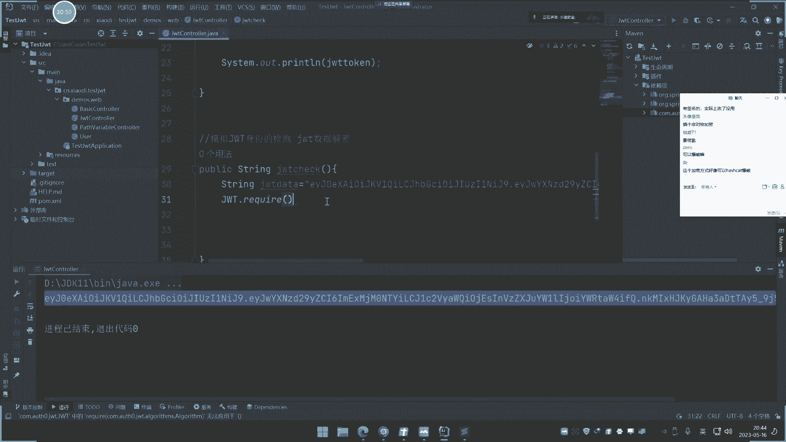

他解密呢是有这几个步骤给大家说一下啊，首先呢它是把这个数据的miss写进去，然后呢点builder啊，点build，就说他先包含一个，你刚才这个加密的那个miss和算法写进去。

然后点build勾尖就是勾肩解密的一个注册。

他先这样做，你不要问为什么啊，这个没有什么，为什么那个网上代码都这样写，你按这个流程来制作流程就可以了，就是把刚才那个类似的东西呢，给他粘贴复制就完了啊，那没啥说的。

然后点个构建build构建这么一个这个类型啊，名字就叫这个，小李就有这个电脑P，写个p decoder吧，还有第一吧，啊我发现就这个就叫这个名字。

这个名字一样的一样一样啊。

就叫去打T吧，懒得搞这种名字，名字取的，其他也是麻烦好。

然后这个搞完之后呢，呃注释一下，构建这个解密注册。

就是把刚才那个这个密码呢，就是我们那个密室嘛就和他算法保持一致，就利用这个算法来构建一个注册的东西，然后再利用这个注册的东西呢点什么，这个就是检测了。

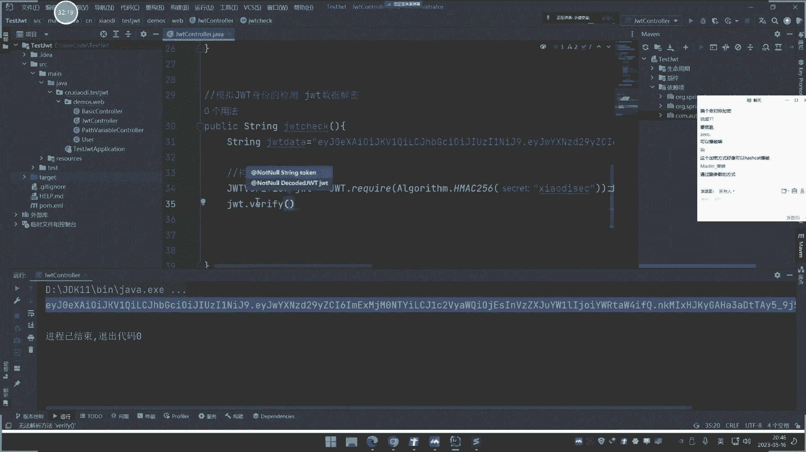

这个是检测它的注册信息了，这就是我们做的啊，简历这个做数据了。

开始要搞这个事情了，那如何呢，就这里加上什么jb data的数据。

就是要对这个上面这个数据呢它是要解密了，解密之后的这个东西。

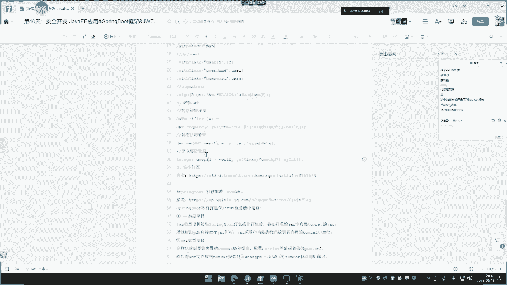

我们就可以把它点什么by类型想去啊，类型呢复制一下名字就叫这个是吧，这个是解密数据，然后把数据里面的东西呢给它取出来，现在就是体系取数据，然后呢这个是类似的，把解密了，解密之后呢，给这个类型给它来存储。

那我们接着再提取，提取该怎么提取啊，我们来看一下A1R，然后，点啊，然后这里有几个东西大家可以看一下啊。

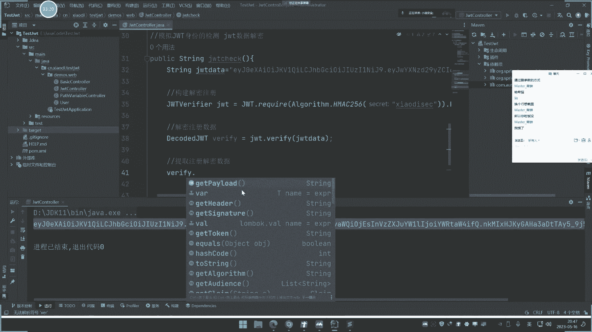

这里呢呃你看一下啊，他这里写完之后呢，把它进行赋值之后呢。

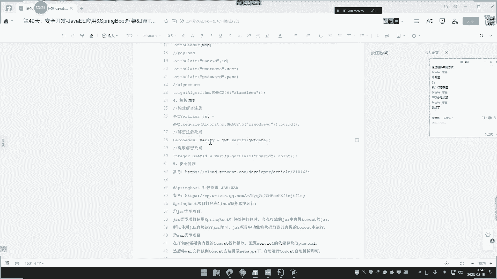

我们现在就要对他进去去了啊，那就是get就刚才要提取这个什么，这get签，就是刚才我们加密的时候用的这个呢V7，然后呢你看他这里还有几个get什么，你看啊H那这个我不主打，知道吧，这是干嘛的。

还有这个你看看，这两个是干嘛的，有三个写法，其实那就是解密相应的部分，就说我这里写get c开头的，就表示说这个东西是干嘛的，还有三个是吧，来我把三个都写下，那这三个呢都对应什么意思呢。

就像这个他就说什么提取这个什么安的部分，对不对啊，这个呢就是我们说的提取，前面部分，对不对，好，我们可以等一下给大家看一下啊，我们先把这两个的先注释掉，我们先提取这个记什么，记这个中间内容部分。

因为中间内容是我们关键所在啊，这两个我们先把三点方向你看啊，它如何提取这个中间部分呢，很简单，告诉他提取什么UZID，然后呢一个叫什么点as string，把类型改一下，改成up int类型。

因为这个类型呢我刚才在这里复制的时候，算是一个E没有加双引号，所以它是个Z啊，什么数字型是吧，然后提取好，同样道理呢，我们就依次呢去提取其中的密码账号，密码账号是uv password。

New name password，那就是你的那个界名嘛，这类似于街名的是啊，就这里了是吧，这两个提出之后呢，这个是字符串的，所以就叫r string转区写好，然后呢可以把它进行一个什么复制一下啊。

比如这个呢就叫做string类型的，UUID等于它对不对，然后呢这个呢就把它这个是int类型，int类型搞错了，然后呢这个就是string类型的对吧，然后名叫U这个也确定性的叫什么，他不想去啊。

意思呢打一下打一下载地，嗯加上60加上这个好，那么这个呢就搞完了是吧，然后呢我们把它运行起来，看一下是不是能够正确的解密这个什么数据脑，bl是解密的，是KO的部分，对不对，这个部分好，我们来运行一下。

那这里呢是这个类型是吧，我把它全看这里的，就把改参数JWJWTD改成这个JWD，然后在这里调用一下，在主函数里面调用一下这个一到T千克，嗯就2D吧，这咋的，要设置静态对这个搞cod string类型呢。

我也不搞string类型，不要不要不要搞那个返回的，又返回去搞那个string类型好，那这里呢就把刚才那个东西那个调一下，是因为token啊，这里我运行的是main函数，main函数要调用一下。

不然的话这个东西不是个构造方法，它不能直接调用，运行一下，看一下啊，上面这个是生成，你看下面这个是把解密了呢，12d ma123456是写了呀，主要以前面那是上面面函数执行的，然后下面这个类似。

我们那个下面这个JWB千克，它是能把检测出来，你看，是能够检验出来吧，唉那包括这里的含的部分，那也是这个道理呀，这个焊的部分也是这个道理呀，也可以把它打印一下，检测出来的。

包括这个签名部分也是一样的道理，那这里呢大家试一下吧是吧，前部分的这个什么部分点，他也不用点了啊，他直接就可以把那个数据呢给他得到，因为它这里呢就是那个默认的，这里呢我们就不做过多介绍了啊。

你看这里就写好了，写好之后呢，呃这个就实现了好，那么大家现在问问你啊，我把集成到web中啊，我经常web中web中断来实现一个什么呢，就是说用户登录之后呢。

就模拟这个图片吧，我们现在就说实现这两步，第二第二步创建，第三步呢就检测好的，那么这里呢我们就先说浏览器上面的去什么，写这个呃，这个请求请求完之后呢，让他上前创建之后呢，就中期是吧。

好那我先写个这个登录的一个页面是吧。

那么找这个金台这里啊，这里是首页吧，首页那里写一下吧，就在首页下面写吧，哎不知道其他地方写啊，写给那个模拟登录那个for表单，这个相信大家都会这个成绩很多了啊，Taxi，请看例子啊。

那例子呢我们就把它提交为这个斜杠，下面的叫这个，先不写吧，先把那个把那个升级为成我们的web类型，访问是吧，方式，然后呢这边就是在这里up a request get型。

就搞request post类型pose也行，然后请求这个路径下面的斜杠叫greater吧，加1ATEAVICT啊，这是一个创建过程是吧，然后呢这里返回的内容呢有个写小一点的，也有返回的，就知道啊。

哦这里呢就写了个其他地址触发方法，就是every也是post类型吧，啊boss类型的去提交，在前面讲过了啊，就不知道啰嗦，然后那个请求接WP的那个什么，AWP的这个嵌合路径创建它，然后内容也给他写下好。

这是这个把它模拟成莫里森这个web类型去出发，是吧好，那现在就来提交提交一个是先提交给这个什么，JWTED吗，C r e a t e，就那个地址，我这边的话，这个地址呢。

然后呢嗯改造全方法post类型写好，写好之后呢，来模拟一下啊，输入user input fi这个表单的一个东西是吧嗯，然后这个name给它全称叫做UZ，哦然后呢换个行，但是pass啊。

那我这里呢简单复制粘贴一下pass，后面再写个这个提交include的类型的up，然后这里就名字就叫great，好好就可以了啊，这个首页的一个那个前端那个页面就写好了，小时呢就在这里创建。

那么点击创建了解下这个地址地址之后呢，要结束这个值，然后接受是这样几个东西嘛，赋值的这几个在这里提交账号密码嘛，然后这里呢就是有参数嘛是吧，我把参数写到这个什么这个地方来，把这些去掉是吧。

第一个参数就是L，新类型就名字就叫id吧，然后呢DR参数是string类型，然后呢是这个账号名字就叫user吧，然后第三个呢呃这个password类型就叫pass好，写好之后呢，把这一次取代是吧。

就相当于说接收过来的这个账号密码，提交过来的密码呢，就一次去对它进行创建，是吧，写上去之后呢，然后这里呢最好是在页面中呢给它显示，我们这里，那就最好是在页面中显示一下，就这么return。

掌握一下这个token返回一下，记得多就到页面中显示一下，啊这里有个报错报错什么情况，他说无法复制到这里就要改成string ok了，那这个就写好了啊，就是说呃怎么样呢。

就说这个首页页面就写一个这个登录啊，登录的一个操作，然后让他在登录的时候，那就把这个结束过来的账号密码呢，给大家怎么样发送过去，然后这里还少了一个id，把id写写进去写进去。

然后发送id和username，user和pass，然后这里就相应结束id和user和pass，对不对，然后依次在这里呢去在创建的时候把它怎么样，那模拟下限的功能是不是能够实现哈，能不能实现。

我们来模拟一下啊，先把功能实现，然后呢我们再来看一下啊，来启动一下这个spring boot。

好打开，要请你把你们好，你看在前端页面吗，那首页示范呢有id有了，我们输入一下呢，比如说这里呢id为一，然后输入我们这里随便写个名字，小李啊，密码就123456点击，然后你看他请求这个JWT嘛。

然后呢是不是就是是不是又注册出来了呀。

啊对不对啊，这前端的那个首页文件的前端代码对吧，让他请求到这里，然后然后代码呢就在这边来接收，接收这个id和user，然后意思是在这里呢，在创建时候替换这里面的值好，那再把它进行这个什么加密一注册。

最后呢把它显示到页面中是吧，这个过程呢大家应该都是灰的啊，前期那个课如果说学好了，这个是没问题的。

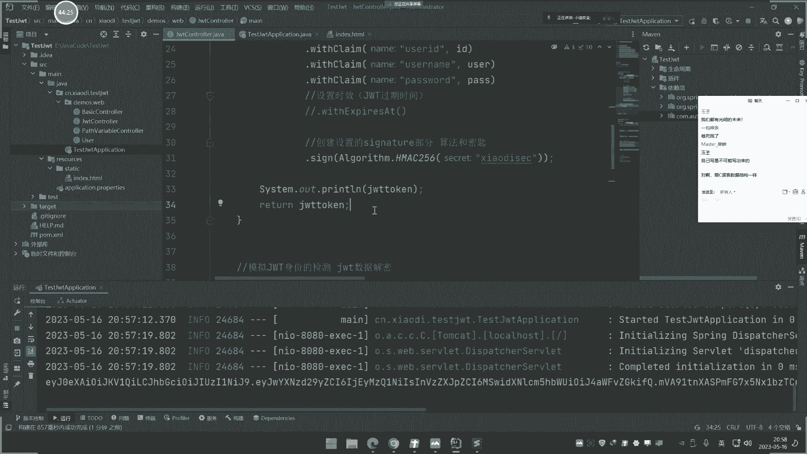

好这个呢就写清楚了对吧，这个写清楚了好，那么现在呢我们就想象一下啊，好那这个创建成功了，我们是要进行一个检测呀。

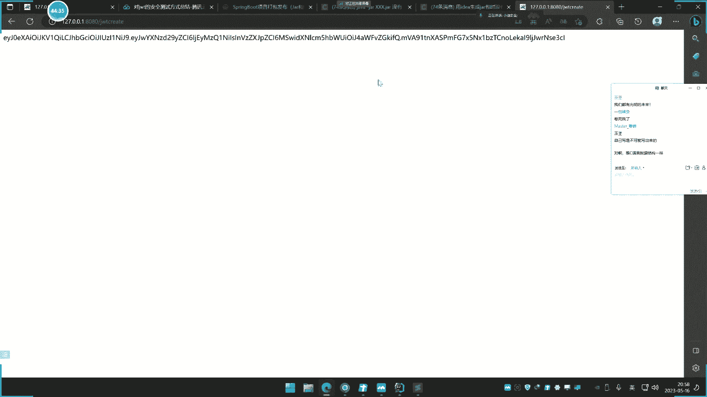

好啦我进检测的话，比如说我这里请求这个JWP千克离子，我把它进行检测，对进检测能不能让他检测到呢是吧，能不能让他检测到呢，好监测的话，肯定就是要判定你这个用户，是不是这个某个用户啊，对不对。

好很简单的道理，我现在这样子稍微想一下啊，比如说啊工具人他要怎么样，他要模拟使用这个小的用户去登录好，他使用小的用户去登录的话，那么这里呢就肯定要把它判定成为小迪才行，那么对方呢就相当于说。

他要对这个数据进行解密，这边就是要解密登录这个数据的一个值，然后呢把它解密成如果是小迪，那就是说攻击者攻击成功了，如果不是小D，那就不行对吧，就很简单啊，我现在呢都可以不用去改它任何东西。

就比如说我这里就知道你如果是enemy，我就让你登录，你不是enemy，我就不让你登录，我密码都不用检测，能理解吗，我密码都不用检测，啥意思呢，大家看一下下，我可以写个什么衣服判断啊，你看啊。

不会写个一吗，衣衣服看到你看下来，我写个衣服，我密码都不用检测，这个接打开密码，用检测就能判断出你是不是艾米，就这么简单，为什么这样说啊，大家可以看一下啊，比如说啊他不解释了，这个解密出来USC吗。

好我把us，判定他是不是什么里面是lime好，如果他是AME，对不对，那么就可以怎么样给他进行这个return啊，就说哎告诉他啊，你十五十的对不对，又报错了，好那那你side me，那反之的话。

那就不是你了是吧，发挥是吧，你是什么鬼东西是吧，你是不是变异啊，好那这里呢我们就显示这个东西啊，这个呢就成了，然后呢我们给大家解说吧，他就是这个GDP data嘛，是不是。

那我们就让他发送post发送数据来破损，发去发送这个数据吧，来这里呢就有点尴尬，我们就给他最前面页面再写一个吧，写个这个破表它吧，再写一个吧，前面这个呢就是那个那个我们就写成这个签，然后只写一个字嘛。

就叫做JWBB，然后这边写的那个AWPB就给他法术嘛，模拟一下法术啊，磨下法术，这个就是天堂模拟一下发送请求，这个签可路径偷手发送好，重新启动一下啊，看看是不是能够判断的啊。

来刷新一下页面，好音出来了啊，那么现在呢就是说我先来看一下啊，我创建个一，然后呢我用户名改一下啊啊啊123456啊，随便写密码，然后判断把这个加密的东西来复制，在这里提交一下看看啊。

他去请求他说miss a me，好，对不对，他就说你是enemy，因为你刚才生成的是用艾米这个用户生成的，对不对，如果说你的我改写了，我不叫艾米，我生成这个这个GLT，我放这里，那时他去请求检测。

他报错了是吧，报错了，他不是报错啊，你看J是吧，就返回了G，你不在那里啊，就算我gay呀，好那么大家这个问题呢，就是它简单一个相对来说简单，一个身份的一个验证，那就出来了好，那有什么安全问题呢。

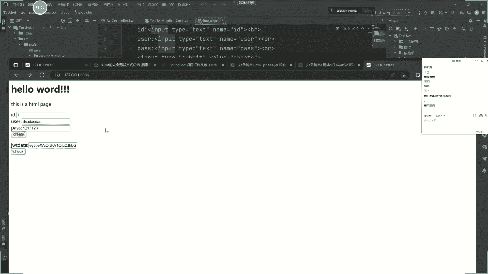

对不对，对什么安全问题呢就很简单，那比如说我们现在呢问答这个问题啊，把问题写在代码中，比如说呢，那现在攻击者他要模拟小的用户去登录，对太阳模拟小的用户去登录，对不对，好，我就先把逻辑给注释掉。

在模拟小的用户去登录，能不能登录进去，这个就是登录进去之后做的事情啊，能不能登录进去，就会不会进入这个正常的逻辑里面去，好就很简单，假如我这里写个什么return返回一个什么，ADDIN页面是吧。

看企业面就写了个词，就代表你进入了，你执行它就进入了，你看啊，很简单事情按照我们道理来讲的话啊，他肯定能够成功返回这个页面，就会返回这个AI喷子嘛是吧，你看一下啊，现在有点绕的啊。

你那个思路一定要转变过来，这个东西绕就在于你能不能了解了解这个东西，你就知道是怎么回事了，就知道这个GWT它的那个强大之处了。

或者说核心部分了啊，那按照我们之前的事来讲对吧，我模拟效率用户，那就是说你看啊，我在这里创建我登录，对不对，然后呢，我这里去解谜它的结果里面。

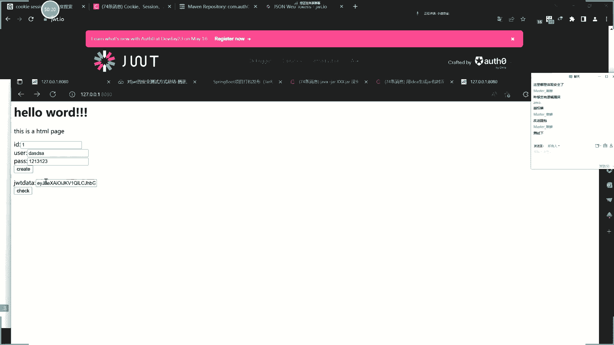

你看结果里面。

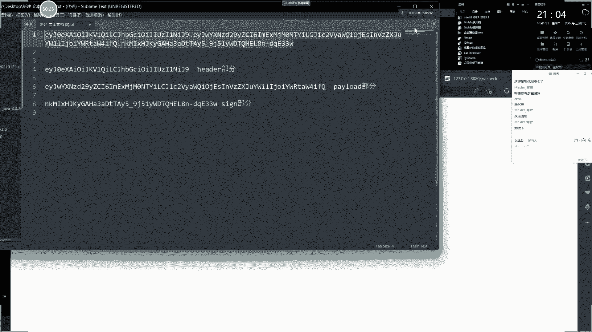

结果里面的打赢了啥都没有，打赢了呢，打印啥打印这个东西好，现在有个什么问题呢，注意了啊，这个地方有点糟，我都不知道怎么讲这个事情，你先看这个事情啊，那好他返回这个值啊。

你看啊他现在是能正常值，我们之前的思路，按照之前那个式来讲的话，好那既然那L的米是吧，然后密码我们就写个123456这东西啊，这是创建的是吧，这个值我们先把它记录下。

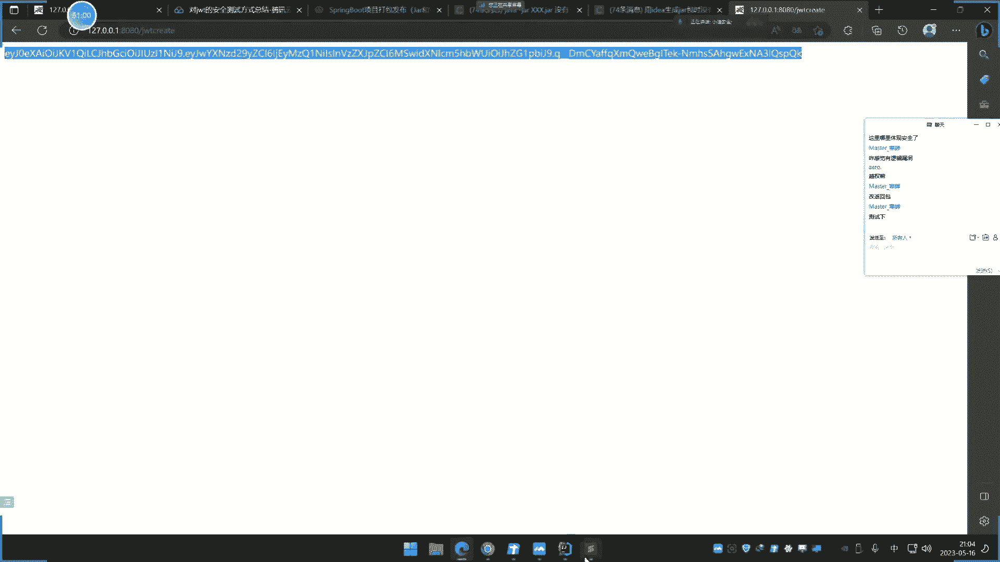

这个就是一个1L等于123456，的一个什么解答题，数据好，就是这个数据啊，把它写上去，再创建好的，那么接下来啊，如果说我要把它改成一个小底部，那么这几个呢我不把一改是吧，不用改它。

我想说我改这个名字改成小D，其他我不改，他那个JWP好，按照再来啊，我们就先把这个东西呢给它复制。

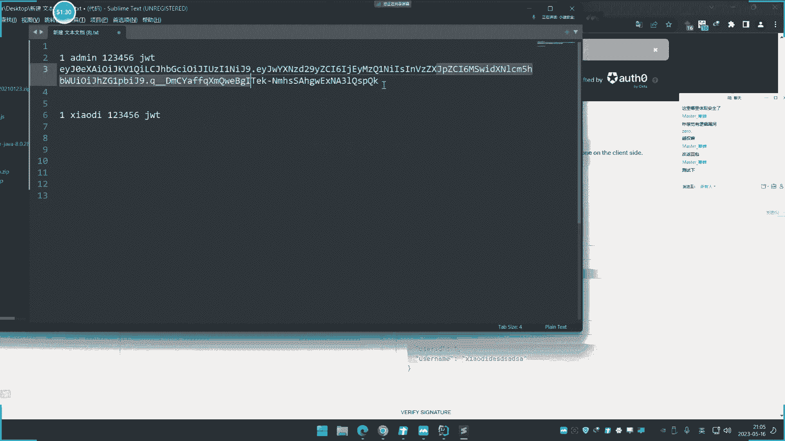

先把它解谜解密之后呢，在这里尝试把它进行修改，那么这个记载地址是默认改了呀，改了之后我把这个值呢给它复制过去。

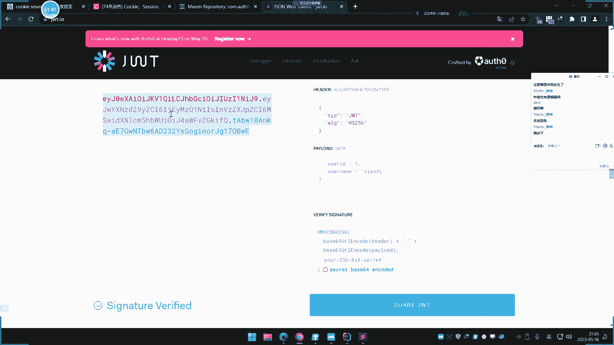

那么按照正常的这个提交逻辑来讲的话啊，把这个重新写一下，那么这边呢没有做任何验证，就说我接受你这个，这里呢就是说我接收你这个值之后呢对吧，就会对他进行这个打印是吧。

好你看现在能不能接收到呢，就把刚才那个数据呢拿出来，小心啊，你看啊，这是刚才那个拿出来的，应该是做了个小D嘛，他解密的话，应该就会解密成这个小D和这个什么。

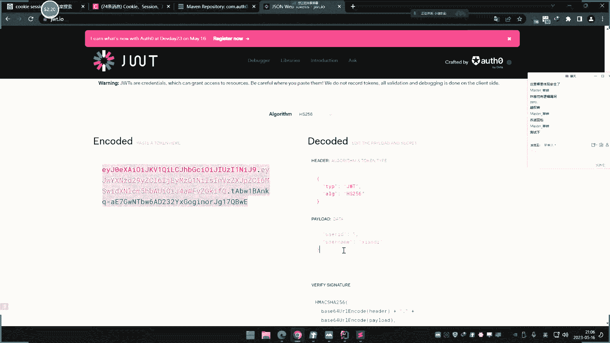

123456，你看我把它放进去啊，啊换几下啊，这是啊直接解密以后啊，修改在加密的过程啊。

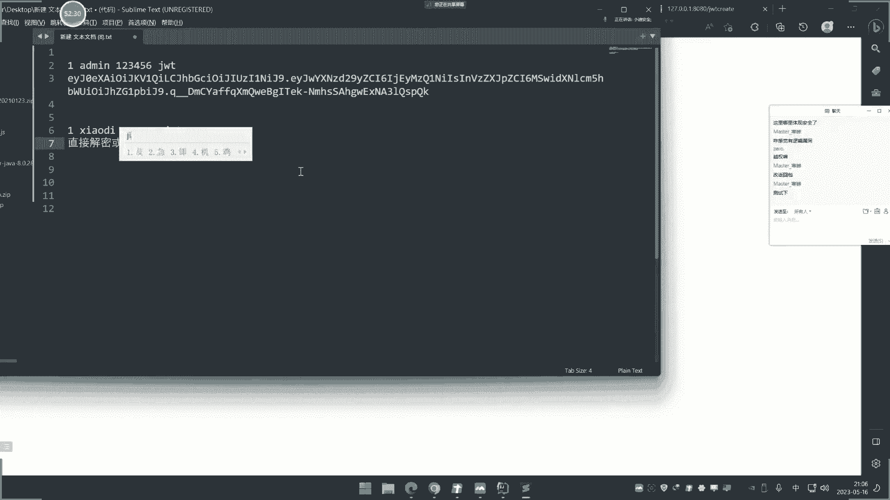

这是哪个字，勾搞错了。

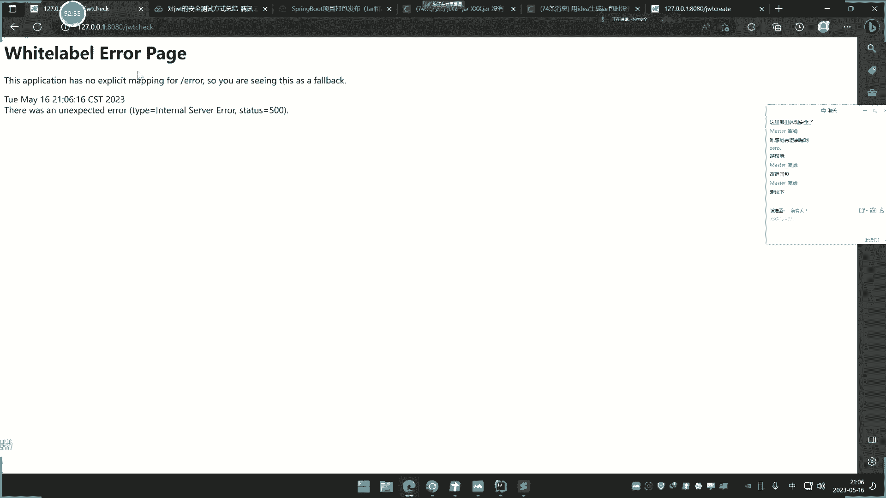

报错了，页面代码也没有执行，直接报错，这里我没有任何验证了，你触发这个JW这个方法，按照正常来讲，你不是要进行解谜吗，解密之后我也没有认真，这个返回应该也能正常返回，为什么这里直接报错呢。

你看他的错误提示是什么呀，他说什么鬼，签名验证错误，啥意思呢，啥意思呢，为什么，其实就是你没有密室。

他如果说这么简单，那这个建筑P还搞鬼呀，就是你修改这里没用，你修改这里没用，因为他这个算法呢是默认是空迷失加密的算法。

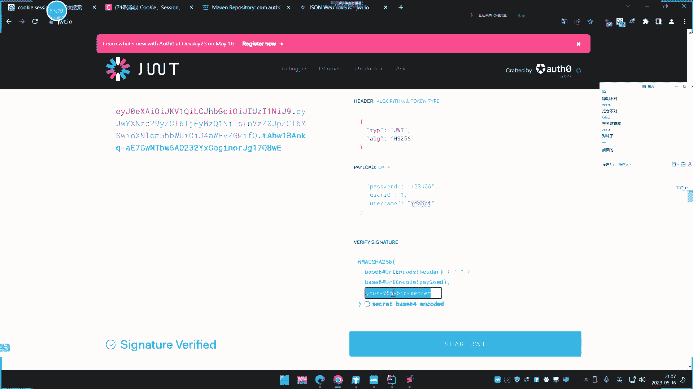

你这个解谜里面是要有小李C的密室在里面。

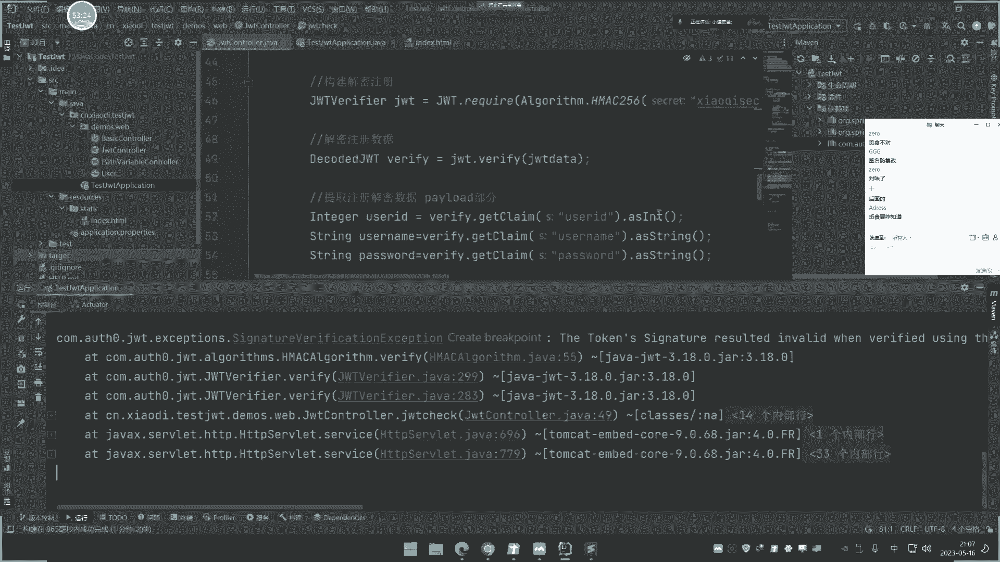

所以你要怎么加他呀，你是要在这里再写个小DCC。

那这样写好之后，这个字符串啊，它就属于在这个上面直接解密之后再修改加密，并且加上了这个迷失的这个过程，这个值。

那么这就是符合他标准的一个加密字串，它就能正常识别，因为这个就是相当于说啊。

是用了什么这个正确意识降低了，对方呢要去对他验证的时候，他的逻辑是不是也是使用了miss去解密的呀，而且你没有像这个呢，就是三大师说，他就没有使用什么密室去这个加密的，对不对，所以你没有使用miss。

而对方的是使用密室解密，这两个对应不上，所以导致直接报错，而你用这个你再试一下那个页面。

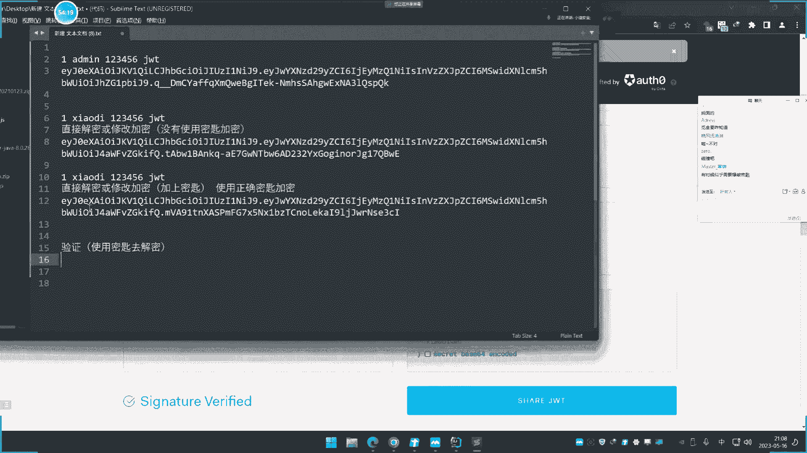

它是不是就能正常的去执行代码，你看一下啊。

替换掉勾，你看这不就输出了AME喷漆啊，然后下面的解释了，把显示出来解密为一小于36，对了吧，对输出这行就是干嘛，页面也正常，显示代码正常执行，没有报错了，对不对好，那从这个问题上面大家就知道了。

他的验证身份的逻辑，需要考虑你的账号密码正确行吗，如果说他考虑，那是更加规范，不考虑他也可以健全，为什么呀，这个有没有能不能一下一下子联想过来。

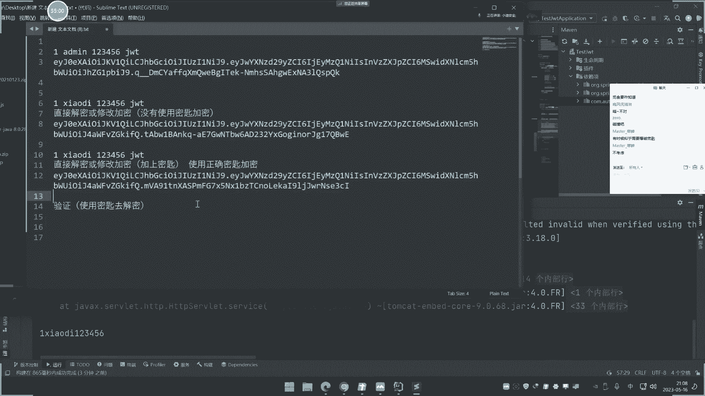

为什么，因为很简单的道理，你把这个地方改了没有用处啊，你改了再说，他对方去接受你这个解密数据的时候啊。

报错了，就像说你都不是和他在同一个频道，他解密都解密不了，你说他会认为你把这个改了有用吗。

它是通过这个解密出来，比如说你是小题哦，他就知道诶，你是小题用户好，你想围绕这个小的用户去登录的话，你就会修改这里，但你修改有没有用，没有用啊，你不知道miss呀，你修改完这个字符串是这个东西。

他解都解密不了，他怎么知道你是谁呢，所以他需要认证你是小弟哈，或者说他要去取这个什么啊，密码是123456，他哎他就知道你是真正的小弟，需要吗，不需要啊，因为很简单，如果他能侦查的把这个数据给他解出来。

那就说明你的算法对了，那你就可以自己随便围绕这个password都行，他何必多此一举，需要再去考虑一下，你立马严不严正不正确呢，这个当然他也可以考虑，就为了这个腌制的准确性。

就说我既验证你的算法的这个正确性，还要验证解密的验证性，还要验证你这个数据正确性，就是他可以把这个账号密码都存储到数据库，从数据库再去比对，就三个验证加起来不就更安全了吗，当然他也可以省略最后一步。

就直接验证你的算法正不正确就完了，不用验证这个什么鬼账号啊，这个东西的密码啊，这个什么什么啊，叫什么呀。

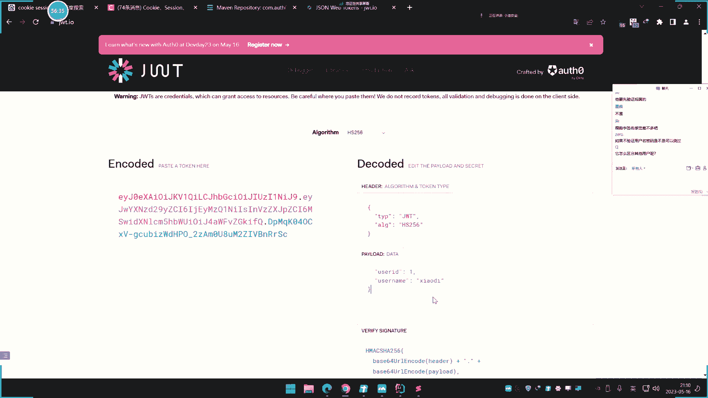

不用原则，你是什么用户，因为很简单，就是一句话就是一句话什么呢，能解谜，能解密就直接啊，LINDY是什么用户，那就可以直接做这个事情就可以啊，接到B就不能直接啊，直接做这个事情。

我们传统的是怎么一个人点，传统的是什么硬件，传统的，传统的可能还是要比对是吧，比对什么这个账号密码，对不对呀是吧，才是才让你进去，对不对才行，对不对，但现在它呢就直接能解密，就是使用。

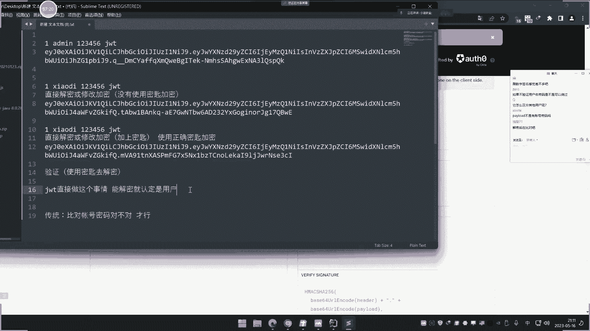

为什么呀，刚才不是做了实验吗，你把这里改了，攻击者把这个改了，有没有用啊，没有用啊，因为对方的解密不了错误了，他怎么知道你是哪个用户啊，因为他的解密需要批准这个密室。

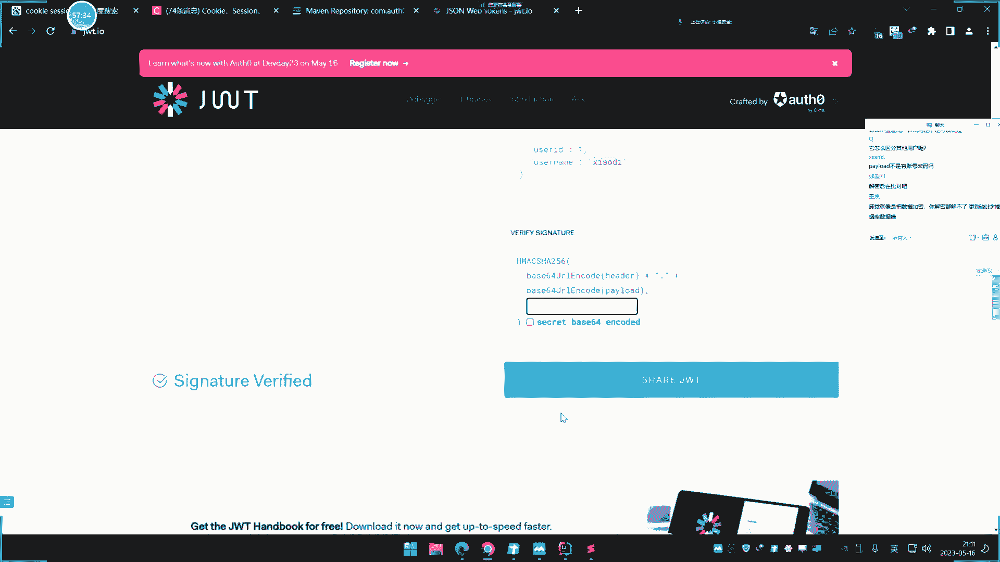

你没有这个密室，你给他发这种东西发过去，他都不知道这是啥，所以他一旦能解密，就说米斯比对了，所以他就可以从这里面取出历史小弟哦。

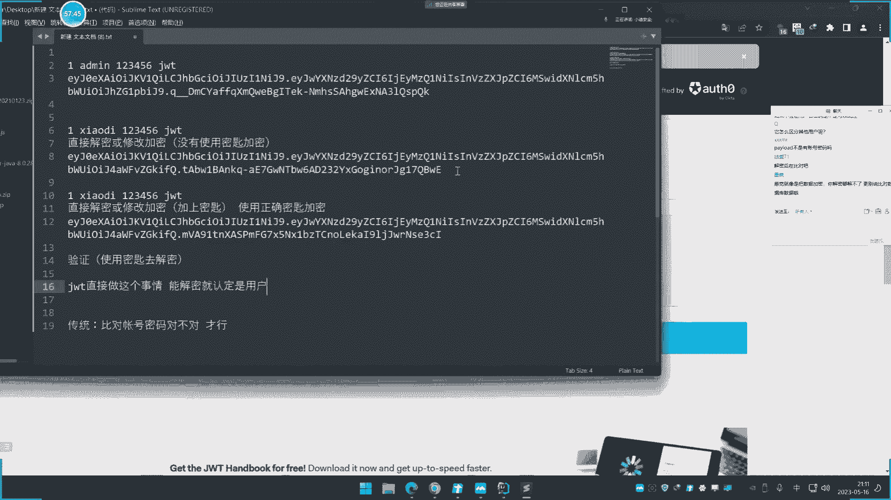

历史小弟，否则你在这里改没有miss，没有任何用处对吧，密室又从哪里来呢，密室的攻击者他怎么知道呢，除非是源码陷入告诉他，或是他包括出来了，否则的话他不知道密室这个东西他怎么伪造，伪造不了。

因为伪造没有用，你伪造是空空密码的，那不用空密码怎么伪造，伪造不了啊，你给他把这个东西修改之后没用啊，你把修给小弟，他也不知道是不是小弟，他解都解不过来，怎么认定你是小弟呢。

所以说他用得着去用去这个验证你是什么密码。

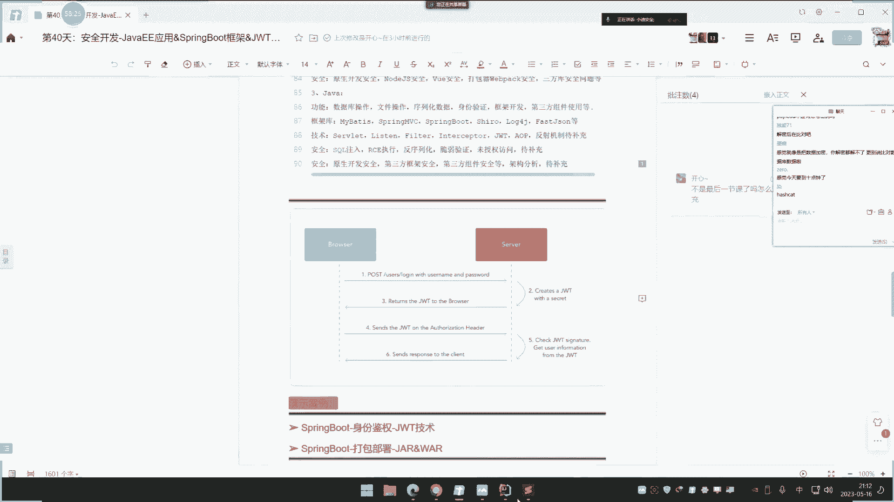

或者说这个密码对不对呢，不需要用，当然它也可以用，就是我说你为了严谨，你也可以继续再加个验证机，解密之后呢，我还要认定你密码，当然了，这也可以是吧，但是实际上的话也不用用，也可以实现一个身份验证。

为什么呢，很简单，因为我能解谜，就说明你的这个值对了，是不是，但值得了，就说明什么情况呢，就你的确是这个用户，你符合这个代码逻辑，在代码中去执行的啊，如果说你想修改这个字，你在网上把它解决了。

然后呢自己再加上去不行，为什么，因为你加密的这个字符串它解决不了，他不知你们了，不知道你是哪来的，能不能理解啊，有点糟啊，说实话真的有点糟，你这个不这样讲的，很难听，不知道我在说啥。

听懂了这个就知道是怎么回事啊，所以你就告诉我，你听了之后，你就发现这个JWP是不是就P什么cookie啊，那些东西呢要高级，为什么会推荐用它，就是这个原因吗，好那这个搞清楚之后呢，我们就不再累赘了啊。

大家都知道是怎么回事呢，我们就不说了啊。

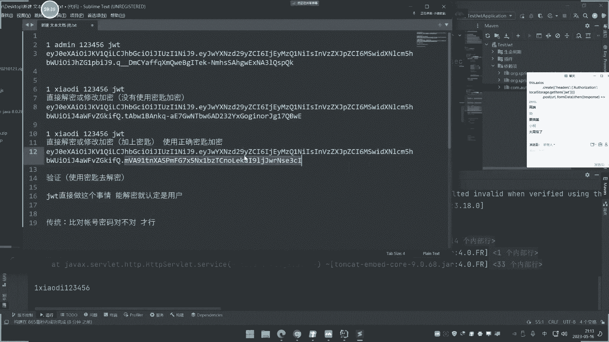

这个见到评论就到此结束了，你可以看一下他的文章，这是关于一个JWP的安全测试文章，其中呢你看它攻击方法是根据什么攻击啊，一种呢就是对这个密室进行爆破，因为密室爆破的这个原因是干嘛的呢，很简单。

你要围绕用户，比如说我要把em改成小李，我要围绕成是小李用户登录，那就必须要知道密室，你不知道密室，你在这修改，小迪，你用这个东西去发，让它运行为你是小弟不行，因为对方不识别这东西，因为你意思不对。

它加密数据就不对不行，对不对，所以包括密室是搞这个事情，那么还有你看还有人叫伪验证签，名字是啥意思呢，就是说在头部的时候啊，他把这个lg呢改成那个什么long long啥意思啊。

空前面是默认的是HS256，就是那个算法，对不对，如果说你把这个技能改成long，那就说明后面前面就失效了，前面失效就是没有miss了，没有miss，就导致你就可以用这个网站呢在这里修改。

就是什么用户了，能理解吧，就说你这里要把它改成long之后呢，把它改成long，那么这里呢就像是没有用了，这个三第三个这个签名的，就像是你写不写，他都是那样，都是不会用，你因为它没有加密算法。

因为有加密算法才那个密室，所以密室那个就没有了，没有，之后呢，就像是你这里改什么东西，对方就认定什么东西，所以啊在开发中，要么就是密室泄漏所造成的JW配攻击，要么就是在开发的时候把这个头部。

那这个地方改成狼刀子啊，没有miss，所以这个数据包呢，这个JTP值呢就可以随意的增加和修改，能理解了吧，所以这攻击的这两个点，就是基于代码的那个哪个地方配置问题呀，破损比是丢失了导致的啊。

还有几个漏漏，几个问题，那你看什么这个这个这个修改什么催对称啊，还有个什么鬼伪造miss，这就是基于漏洞的，就是这个本身JWT里面那个类似漏洞，就是可能是那个哪个版本哪个情况，那这个呢就是另外的话呢。

就是他自己的逻辑问题，就是本身包GWT包里面的问题啊，这就不是你考虑的啊，这两个为签名呢和这个爆破呢，这就是什么，这就是我们这个不是它本身的，就是我们写代码开发啊，或许源码泄露导致的问题。

是不是我们从开发的角度去看这个漏洞的利用，好，简单的原理都一目了然，很不清楚，但是你不讲开发，你直接可以去想的东西，你都不知道是啥玩意，为什么是这个情况都不清楚，好那关于这个JWT的这个测试的方式。

包括这里的是他写的这个五六种，那这五六种呢是吧，在真实情况下里面是什么一个薪资，那后面的课程里面又会下降啊，开发先做个抛砖引玉，把大家胃口吊足，同时呢把技术搞清楚，接下来的事情啊。

我们就开始真实的去讲这些知识点啊，那样子呢大家这个是吧就能听懂明白，并且呢一次两次的再说它，那就不会遗忘，因为以前的课程的话啊，我如果说我把它上到一科一科里面是吧，直接讲他加完之后就没了，你会忘记。

那么从四天讲了之后，可能到了50天或60天的时候，诶，讲了有讲了，JDP的攻击有提示啊，嗯好这个就是我们说的这个GWT啊，削弱还没讲，讲不了了呀，没搞啊，谁有一节课讲不完，一节课讲不完啊。

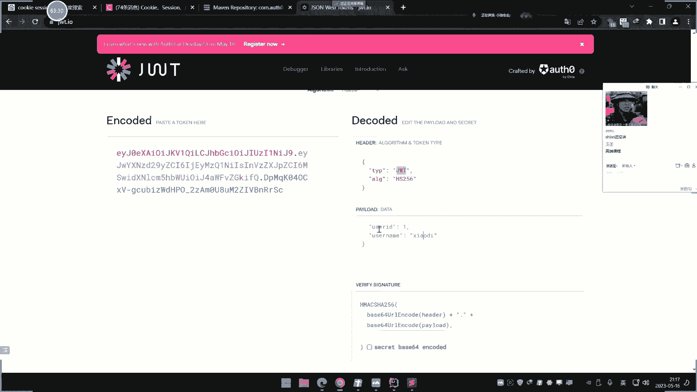

好我们再来看这个，这个打包的打包那就相当于简单了，打包呢也是一个质量，我们给他说一下啊，这个就是我们说的这个JWP身份验证的一个，安全工具的一个地方，大家记住一下就可以了啊。

然后他的这个java代码的简单开发呢啊熟悉一下，包括它的安全的那个东西的文章参考一下，后面呢我们再讲这道题时呢，就把它好好的掌握，就不要再不懂了啊，好那么现在呢我们就基于这个操作流程呢，我们看一下啊。

打包打包。

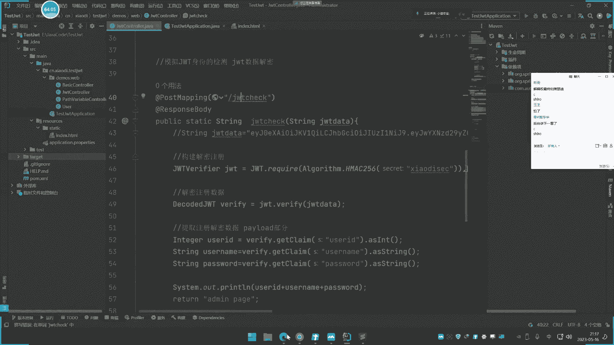

我们现在给大家介绍一下啊，首先我们来看一下这个，叫什么呀，这个spring boot上面的东西啊，这个呃打包的啊，打包的呢一般会放在LINUX运行上面，也可以问到windows上面。

一般把spring boot打包，或者说其他项目打包的，大部分都会把打包成jr和WAR呃两种啊，如果是jr的话，那就用，你就只需要在这个服务器上面装一个JDK，把它运行起来就完了，就是网站就启动了。

就这么简单，这是JAJR，这是官方推荐使用的，还有呢就是用这个WARAWA，就是放到中间间里面，中间呢去把它运行起来，两个都行啊，我们两个都试验一下啊，用jr呢是官方推荐的。

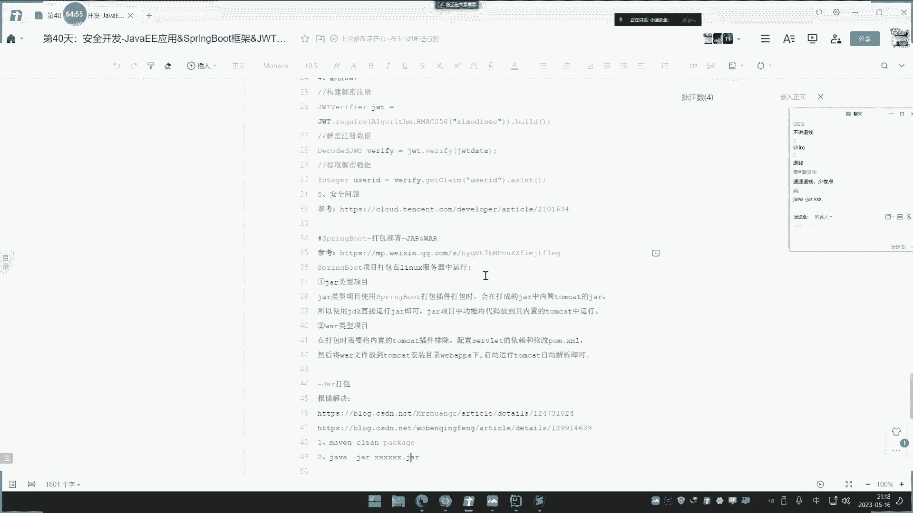

也是最简单的最直接的啊，怎么打包呢，来看一下啊，这个打包方法呢啥都不用干，你这个maven项目就非常简单了，直接来个生命周期，这里啊先点一下，肯定这肯定是咋的，清楚就是你之前运行的这一把。

把它清除一下啊，避免这个比比如说很简单啊，你刚刚修改了单嘛，然后呢你没把它进行编译啊，导致你可能是这里把编译之后呢，就停留在上一次修改之前，所以最好之前呢先做一下，肯定就是清除一下缓存呀。

清除一下你前期的修改，那些那些杂七杂八的，起码比直接运行啊，点这个量运行完之后呢，当然了，你可以在命令行里面执行这个vision clean也行啊，我们这边用图形化操作。

然后点这个pick a g1就是打包的啊，双击也可以，在这里右键运行都行啊，双击打包之后，你清楚之后，那个特斯那个那个那个东西就没了是吧，坦克那你看现在又出了坦克啊，他自己错了，你看这里就出现一个jr。

出现个JR，然后呢我告诉大家啊。

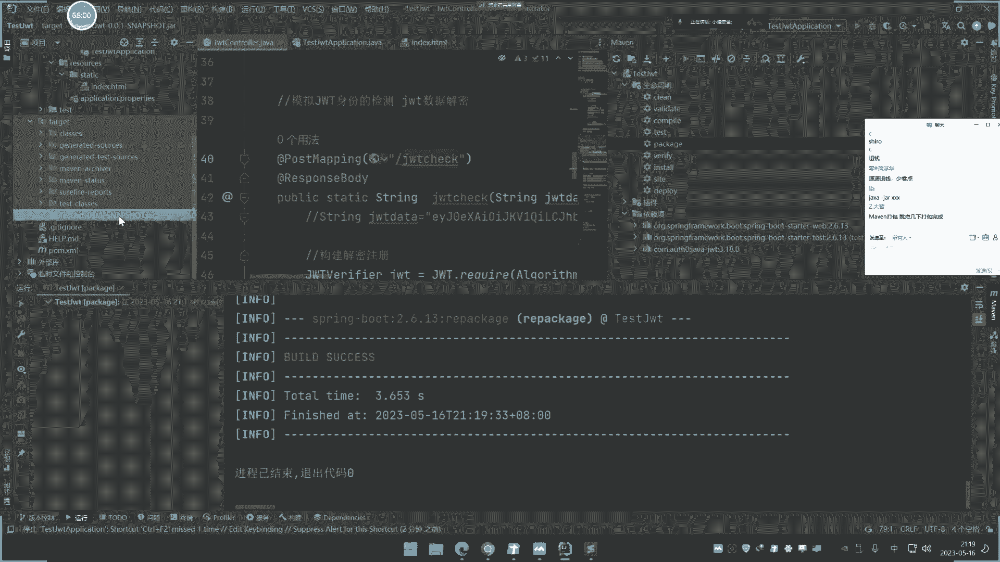

这是我要给他踩的坑，我先给他踩一遍，那把这个接下来给他打包出来拿出来。

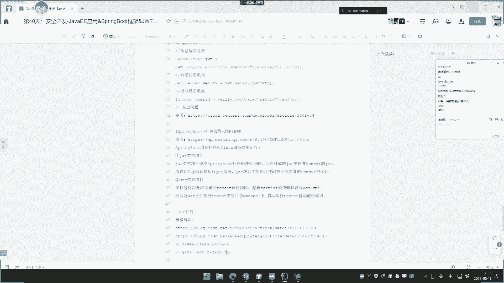

然后放到这个目录里面是吧，然后呢我们用我们自己的这个什么jr了。

就用JDK的安装JDK，Java jar，运行这个文件，把职业运行，它就会提示没有阻断清仓是啥。

兄弟，这是个坑啊，这坑我都把它踩了，是什么原因造成的啊。

有两个原因啊，你到你手上的时候，你就把这两个文章打开一下啊，一个原因就是依赖里面少了配置，还有一个原因就是多了一个东西，那其实这个东西是什么问题，他告诉你啊，是在什么地方，什么鬼东西啊，情况啊。

我就直接告诉大家啊。

我这个是什么问题啊，这里有个叫BOM这个这个地方，然后这里呢拖到最下面啊，这里有个这个东西啊，就是一种原因呢，就是少了这个地方就是有这些配置啊，这个叫mail class，就是主导类把主体内。

然后这里写了一般有这个东西呢，就一般就不是这个问题了，就没有的话，可能就是这个问题没有写这个东西，就是提示说没有主清单嘛，就是说没有一个手入口，其实就是说每个入口，那你这个高端的入口是这里啊。

对的那就是它是JK的，就这个地方嘛，那我刚才我在id里面呢也是运行这个test GDP application，那这高速上的它不可能还是包错啊，所以他就还有一种情况，就是多了这个东西叫scp to。

叫这是SSKIP呢，就是我们说的跳过类似的英文单词，它随时会出，就是个事情导致的，就直接跳过了，就像是跳过那个主导的，所以呢就是这个度两码事情造成的，这是默认官方我爱你自动创建它，自动把它搞上去的。

妈的好，所以说有两种情况，一种是没有这个东西，还可以是这样的情况啊，或者说没有商品东西也是有可能的啊，把这个去掉或者85FX都行啊，对不对，两种情况都可以啊，我就把它删掉啊是吧，删掉之后再重新来。

肯定清楚，把这把清除掉，然后再来什么再来打包，打包之后呢，呃这里就出现了，那出现了这里呢也有它路径，也可以在这个路径里面复制出来，也可以在这里把它提出来都行啊，你看他就多了一个这个文件。

如果多了这个文件就表示成功了啊，那基本就不会有什么问题了，把它复制出来啊，好把这个一覆盖好，那么现在呢我们再来运行。

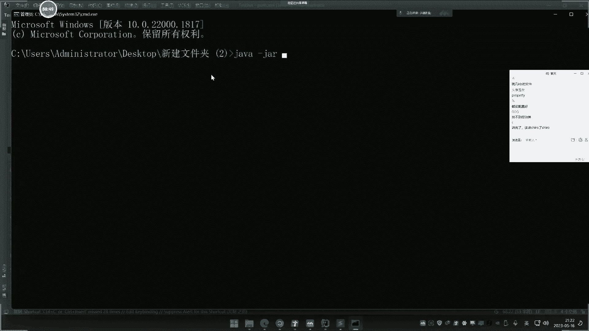

你看现在就运行起来了是吧，运行之后呢。

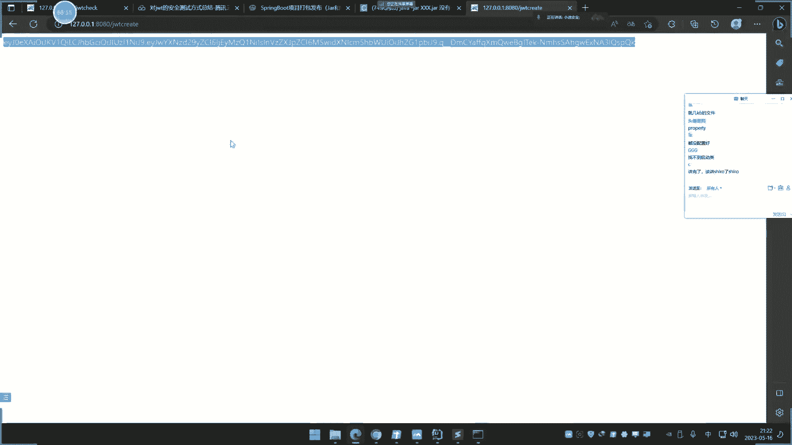

你看打开网站是不是就可以运行了，你看我打开网站啊。

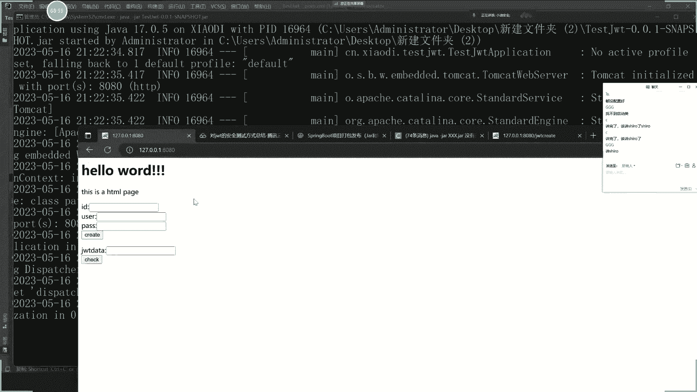

啊是不是啊，你看我打开一下，刷新一下，这里有箱也刷新了呢，对不对，那我把你关闭，那就打不开了，那就说明是他嘛没问题啊，是不是等我再打开诶，又正常了，对不对的，所以呢对方呢其实就是很简单。

就把这个解压包呢给他放到服务上面去，一边行啊。

王者就开了，是不是，这也是我们说他的一个真实的一个，在网上跟线上应用这种模式啊。

这个JDK装在java里面。

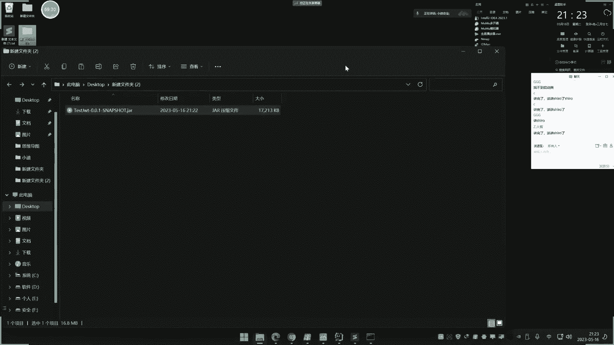

装上windows上面都行啊，然后呢如果说你要搞其他的也可以是吧。

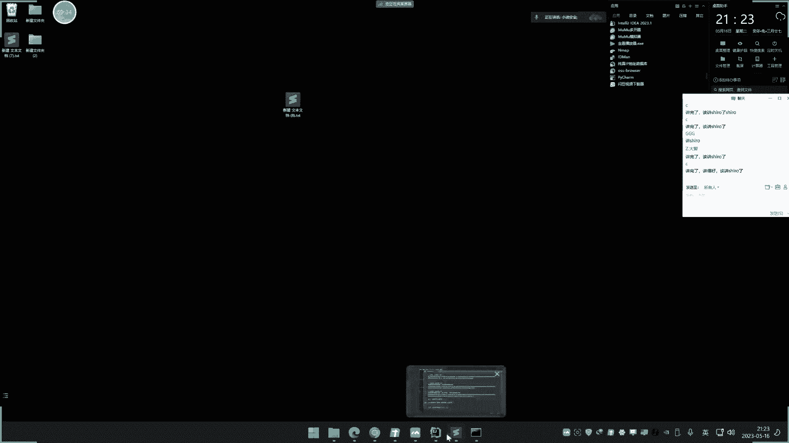

还有一种呢就是说WR模式啊，这里呢就有两种啊。

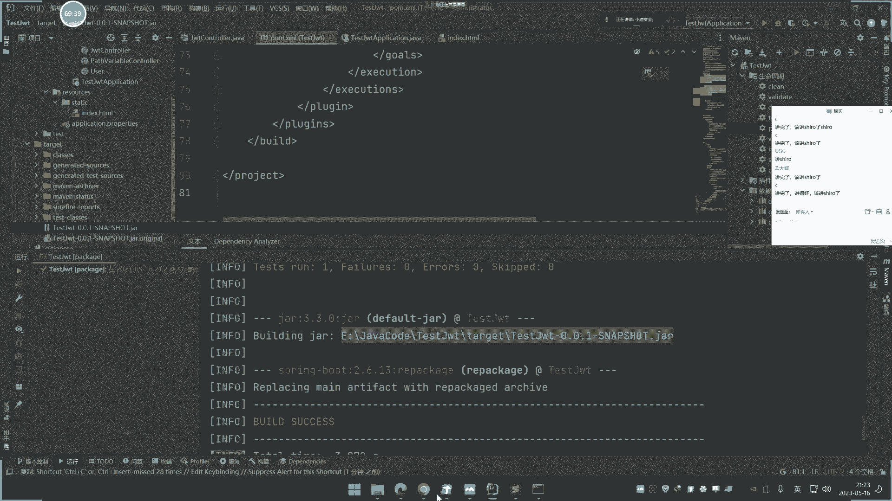

那这里有个参考文章，你都可以来看一下，为什么要这样做啊。

这个网上都写了这个文章啊，大家看一下，就听到一个boot来打包，那他说了两种啊，一个解压包打包，然后呢如果是WA宝宝呢，就需要什么呢，因为WA宝宝呢，就需要把类似的TOMA的产品给去掉。

因为就像说那个sprint boot，那是内置这个中间插件啊，这个呢是说把内置tomcat插件去掉，所以呢他就需要修改几个东西，就是这几个东西啊，一个呢就是把这个地方改成WAR。

还有一个呢就是要在代码的首选项里面的，请修改。

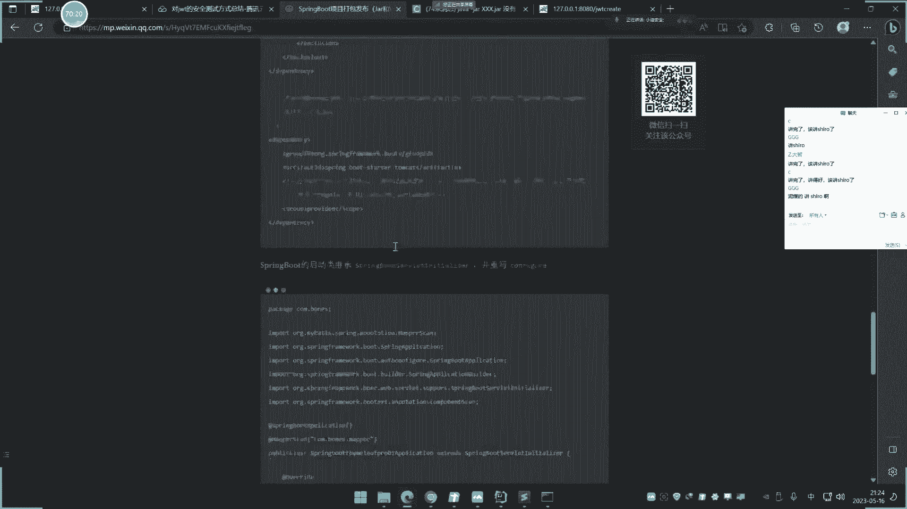

我给大家演示一下啊，这个是固定的啊，没什么采样的，那下面单位也给出了好打包成W2好。

先把这里给大家不管它啊，这个R已经运行成功了，就直接暂停了，好啊，1WAR首先第一步改这个地方，照这里啊，那如果说他这里呢有这个标签，你就把它改一下，没有的话，你就自己没有的话，就自己添加来举这个东西。

啊U的话他如果摸成一般写jr，如果没有的话，你把它改成U的话，你就改成J吧，没有的话，直接添加这个鱼到这里来，就这地方啊，到这来，先去告诉他打不打包，打好，写好之后配置文件，写好之后，他要做什么事情呢。

来到这个主导雷这里，修改这几个东西，这是那个上面默认的啊，都是这么个流程，没什么太多讲的，也不要问为什么他想去，然后呢再到这里呢添加个这个方法，现在这个CTRL方方法就类似的，用这个方法诶，知道啊。

重写方法里面就这个方法呢给拿出来，然后呢直接把这个语句呢给他粘贴复制。

这个上面也写了，哎就这个啊就很简单的啊，就是一个build里面源码里面的展示，它就完了，查一下具体资料，然后呢写成这个目标，这个test的吗，这个东西好就可以了，这样就行了啊，就改这两个地方就行了。

一个是主要类里面加上这个东西，然后呢，就是把这个那个WWWR改成WR就可以了，好我们现在那先清楚再来打包，打包成打包一下运行，看现在啊是不是就打出来了，好打包完成，那是变成W好了。

然后呢我就把WAR呢放到这来啊，不是放这来了啊，WR就是放到中间间里面去运行的好，我们就放在tomcat里面，然后放到这个web app就找到tomcat，然后把它放进去，就那个文件名。

然后呢我为了这个文件名呢，就直接把它改成什么前面去掉，就叫GP，改好之后啊，你就直接启动，启动呢，它就会自动生成一个和这个文件名命名的，一个目录，然后再访问那个目录，就是这个项目好，我们看一下啊。

那现在呢没有这个没有这个test jwt目录是吧，马上就会有了运行这个tomcat的启动程序。

start up bt没经营好。

那么现在你看一下啊，这就是启动R8，启动中间接了之后呢，你看这里就多了一个GWP啊，然后呢现在你看啊。

我在问这边就不行了，就是tomcat对吧，然后呢那个路径就是那个项目了，大小写都要注意啊，这都是都要注意区分大小，你看是不是就可以了。

这项目就成功了呀，这个就是放在中间件里面去运行啊。

WR就放中间啊，如果说你直接封装JR就不需要用到中间了，直接启动就可以，医学用哪种，看你自己需求啊，我们就不说了，就WR那就是默认的把tomcat那个勒那个删了，所以呢你需要在这里配置一下这个东西啊。

如果说你这个电压包呢就离职了，所以也不需要什么卡塔两种啊，看你自己选择哪种，我们也不管它，一般默认推荐的是第一种好。

那这里呢我们说一下这个打包方式呢，为什么要给他说，因为这个东西呢其实我说不出，大家可能说你妹的，我又不是做开发的，我要搞这个打包的过程干嘛呀，对不对，我不做开发，我就学一下，我我升级就行了，我不要打包。

我不要上线，其实呢我们生态原因，还有一个主要原因就是什么呢，观察一下他这个项目的源码。


不管是gr还是WAR来，我们先看这个jr的。

这是jr的，接下来你打开是吧，我们这里用用压缩包打开的啊，打开你看这里有什么东西啊，大家看一下这个里面呢就是那个spring，这个框架东西，这没有啥，我们核心源码在哪里呢，看一下啊。

这是maven maven里面那个开始的，然后这个配置文件也没有啥配置文件，配置文件里面，那就是啊这个版本啊，他的这个id啊，那个情况啊，那没啥说的，然后这个里面就是什么。

就是那个安装那个pom XML那个配置库是吧，导入包的东西。

然后呢像我们这比较关心的，像这个东西它就没有没有。


里面就没有这个东西是吧，好我们看上面的脚本里面有没有呢，看一下呢，class里面，然后有了，你看这里就有了是吧，两本里面呢就是看配置容器有了哈，然后你看看这里CN里面有啥level，就是哭嘛。

就是封装的哭其实就是个项目的，是就是我说的引用这个外部嘛，就是中心嘛。


是不是，然后呢，这风扇窟这个呢十个小题是我那个路径一样的。


特色JP多，就我这里保持一致，你看DMA是吧。

那为什么这个点web不行呢，因为它是瞎JR下级目录来点class tgv console。

这是我刚写了个文件名的，你看就是这里面是不是，然后就是class，对不对啊，这个静态文件，静态文件index就这里嘛，对不对，对应上了好好，那你看这个class是什么核心的那个class。

我们打开看一下，看一下这啥情况，不应该是这个这种东西吗，这不是那个cos吗，怎么变成这样子了，这样的，所以说其实那就是打包出来呢，就是一个class文件，我们写的时候。

那这个文件名字是java点java，你看看这可console点java打包出来就变成点cos，其实就是一个编译前和编译后的，那这两个有什么区别呢，很大的区别呀，其实就很简单，就和你写程序一样。

你的程序成品呢是一个EXE图形化展出来了，但是这个ESC的核心是由一堆源码写出来的，我们要看的是源码，不是要看成品，而这个class就相当于成品，而这个java就是那个源码。

那么首先啊我们先不说其他的，我即使把你这个解压包给到你了。

你能知道这个java源码吗，如果说不说其他的技术的话。

那你不知道啊，你咋知道你打开里面乱码了，看个看个毛啊，看不到我是不是，所以说这是在D类问题。

所以后面就有什么技术呢，就是关于这个java的反编译技术，就是类似于要对这个class文件，把它反编译成java源码，从而我得到它的核心源码，大家就明白了呀，反编译是什么情况了呀，对不对。

孩子有一部分还有个什么问题呢，那么既然好，我既然我们等下再演示这个啊，再演示个反面啊，那么既然它是JR包，我们刚才运行它是怎么运行的。


是这样运行它呀，好运行它，它的执行目录是在这个目录。

我在下面去访问。

去这访问是吧，这个端口被占用了啊。


先把那个端口给关闭一下。

哎我不怎么看他妈的。


把这个吊毛事关一下。

烦的啊，重新把那个端口改一下吧，我也不知道，关关关关也不，他故意的进程里关他启动了，唉烦死啊，真是这个包呢，不要把别人架包，艾伦8181样启动。

老段和占用啊，因为刚才被关了，他还是占用哎呀，估计在精神里面还是有核心组织，所以我在这里头有重新换个豆。


好可以了啊，巴里马一，因为它启动了，你看8080还在启动过程中，要把进程里结束掉，我懒得结束了，别慌，告诉好这个八十八一啊，你看啊，你看啊，他在这，我就说我程序目录是在这里面新的，有人可能说了啊。

你妹的是吧，我知道名字了，我把经远程下载是吧，这源码里面只有这个东西吗，我一下载我都不下载个访问访问下载个毛啊，下载。

包括这里面呢很简单，这里有下载东西吗，我如果运行的键啊，有下载东西吗，啥下载都没有，那前面我们讲的什么鬼，在源码后面加上什么3WJID啊，看它下面有没有什么叫什么鬼，什么啊，GT啊，GAT啊。

还有什么这个这个这个源码泄露这几个东西，有没有什么东西啊，有个毛啊，没有啊，那些方法是不是就失效了呀，对这东西只要这样搞的话，是不是失效了，对不对，你觉得不理解，理解没有。

据说其实呀有些这个讲的一些方法，比如说你设计员嘛。

我们前期不是上过这个源码的获取方式，那个新收集里面讲过嘛呢，你还没下呢，第13天啊，源码的一些泄露是吧是吧，就是看他后面一些路径嘛啊降了很多啊，还什么阶梯的呀，后面的什么CTRLJSN啊。

往北份文件3W啊是吧，这个系那除非是他恶意。


他自己要把上面往上面加，那谁又那么傻嘞，他这样一边写你。


你没有目录访问，你只能访问它代码里面的逻辑路径，才能触发的话，你访问其他的访问就错误，访问就错误，因为他压根就没有这个事情，在解析目录，你可以说哎解析目录不在这里吗，这里有个文件啊，不是这样的。


他是在里面在运行，是运行之歌里面代码啊，这里面有这个价格吗，没有啊。

所以这源码写的好像和这个java，好像没什么太大关系，是不是看上去好像没什么关系，除非是他自己的要强迫症的，在这个项目中，在这个源码中呢要写一些这是什么鬼啊，源码的些什么鬼东西啊，故意把它搞上去。

那你才有可能那辅助的话。

就像我们这样搞的话，没有啊。


是不是能理解吧，好其实这源码泄露是很困难的，那很困难很简单的道理，那就一般就要找那种识别这个，识别这个源码的一些其他情况，来从其他进行打动的，所以说这个java啊，它为什么难度高。

就是他很多的一些特性来决定了，我们一些常见的一些攻击方法呀，信息收集方法呢都会失效，都是因为他这个特性决定的，也不是说他故意这样搞的，注意安全的特性啊，他这个语言设计出来就是这个事情，你说咋办呢。

没办法呀，好再来说到反反编译啊。

好假如说我现在得到这个价包了是吧，我要对这个项目进行审计，那怎么办呢，哎怎么办的呢，告诉大家啊，最简单的网上那都是叫的，用什么JDGUI啊，还什么反变工具啊，哪都复杂了，最简单的就是什么呢。

来把这个G压包给他，怎么样用压缩包软件打开啊，有可能说诶我不会用呀，缩包打开打开方式里面选择你的压缩包软件啊，那用这个冰的ZIP，我用的是压缩包啊，你有什么问题啊都行，棋子ZIP都可以啊。

你不要说你到时候压缩包都不会用，那里面只是尴尬了啊，用这个压缩包打开啊，不要用什么java程序运行它啊，那搞错了啊，打开了八经解压，是吧，那我放到同一目录嘛是吧，解压之后，然后怎么办呢。


反编译啊，简单的呢看着啊，打开这个地方，把这个路径呢把勾选上粘贴复制，新人新窗口来回来了，他就把载物相关，然后你再看那个地方拉屎，这个看图形来打开，这不源码出来了吗，OK你看上面有个什么提示啊。

反正一点class直接把52。08告诉你，现在只是用的是java8对他进行反编译结算，你看这个表不就和那个表面一样的吗，就我们写的东西啊，啊这是我们写的东西嘛呢。

但是很显然写的东西呢里面的注释是没有了啊，是不是猪是没有的，那这个里面源码里面是有注释的，到这里面他就把所有的这个什么猪是也删了呀，换行也删了呀，都删了是吧，但这个无所谓了啊，有哪些补充票来表达出来了。

这就是最简单的反被网上，那是怎么教你啊，用什么JDGUI工具啊，用什么鬼，什么java什么鬼工具，那些都麻烦复杂啊，那些都是说你专业学那个的，用那个工具，你不学那个了吗，你就搞最简单的方法就行了。

被你搞成那些东西干嘛呀，问那些东西让你使用的，是为了有时候有些这种加密有加壳的情况。


下面再用那些工具，那什么脱壳呀搞的事情，那不是我们操心的是吧，虽然说我们这期的课程呢，有简单的关于这个安卓的理想的课程，因为安卓呢他和这个java是挂钩的，因为加那个安卓的一个那个APK的开发呢。

他和java的是一样的啊，所以这个安卓的这个反编译和java几乎是一样的，没什么太大差异，因为它两个语言的开发，这个java的就给开发加开开发安卓的东西是吧，它通用的一些东西，所以呢安卓理想呢。

就其实就和java这个上面的反面也差不多啊，没什么太大区别，就是我们这期呢有简单的讲一下这个安卓机箱，这有简单讲一下，就包括他的入门的吧，有个三五次直播的去讲一下，到时候大家就知道了啊。

他们也会详细说好，那么截止目前呢，安全开发的所有课程全部讲解完毕。


时间关系我就不给他再啰嗦，给他聊天了，我们还有一个事情没做。


就是关于这个思维导图还没给他做，一直放着没做，现在呢我们就用余下来的时间，把这个思维导图给他补上去，前面我们学到的水溶性把它补上去，那么就结了啊。

那么下节课上节课就到了啊，我们再来看这个，把那个安全开发的啊是吧。


好这个是pp的，我们按照我们这个课表来给大家看一下，讲了哪些啊。

这是科pp那个谁了，文件管嗯，这是pp打了留言类的东西，还有数据库的创建，内置超级变量，第三方插件是吧，然后这里第一节课讲了这个留言板的功能，然后联网功能里面涉及到了什么东西啊。

数据库的操作。

对不对，还有一个就是我们说的这个类似全局变量，还介绍混编增删改查好吧。


这里面就涉及到数据的传递啊，里面有这个什么全局变量，然后这里呢就是我们说的有几个是吧，写了几个大夫向get回顾一下啊，这边两个哈，然后这个就不写了，因为后面还有啊，像文件上传组，然后还得稍微查一点。

然后再引出了一个什么，这个安全问题是安全问题，就是由阿拉引出的安全问题，大家理解一下，一个是这个留言板输入输出造成了什么XS，还有个是我们说这个留言板里面的使用了什么，这个编辑插件导致什么，第三方。

R键漏洞，然后呢数据库操作里面有几个啊，你给他写一下，就是2。0删除添加，旅行react delete，增加是增加是什么，inside插入。

那更新update啊，然后在第一课。

第二课呢实现了后台身份验证，cooking和C型技术的差异对吧，加了哪些东西继续。


啊这个说有这个什么cooking技术和C技术。


两个基础生产技术啊，因兼谈技术，一个呢就是我们说的这个cookie和session。

对吧，然后是他几点啊，它差异。

然后后面还有一个托体，就是我们说的安全防御，防御技术就是使用这个什么toy啊，然后呢它的主要目标就是我们说的啊，看到这个数据包的唯一性勾引是吧，脑C型激素，然后呢，还全问题里面引出的安全问题是哪一个呢。

就是我们说啊安全问题，那就是cookie啊，这个前客户端的什么，这个劫持那模拟用户，然后呢C型呢就是我们说的这个，session这个规划，这。


这两个啊这后台验证功能，然后呢第三课呢上到什么呢。


文件管理神经上传，那其实那就是我说的这个文件管理器啊，这里面涉及到的啊，然后有哪些呢，第一个呢全局变量的啊，写一下，除了这个之外多了一个什么dollar f下划线，SPS和dollar符。

小写service，boss还有一个是奥拉夫下划线，Server service。


对不对，就是那个pp的啊，这个是有这个东西过滤机制，目录便利导致的一些这个过滤不严啊。


安全问题呢写下啊，这个是两节课一课啊，我都把它写一下啊，安全问题把它加入到里面，他有什么安全问题呢，嗯发展的，任意上传文件上传漏洞，还有什么文件下载，就是下载任意文件，按，还有任意文件删除等等。

任意目录编辑，这些东西都写下，公用文件下载无用文件包含啊，然后还有这个什么目录编辑，因为它涉及到文件的显示。


就是我说我不给你。


这是这几个功能是吧啊对吧，写了把我们所讲的这节课讲的知识点。


这没什么太多说的啊，还有一个就是我们说的新闻显示这个模板啊。


就是我们这个模板的一块东西啊，就是我们说的前端的一个模板，然后这里呢安全问题也不用多说了，安全问题呢其实就是，我把你的logo啊，第三方的模板你弄，举的例子呢是这个大模里面东西，yes是他是吧。


第二件问题，然后数据库读取操作RC1，还有这个模板安全里面造成了RC1漏洞啊，这个没什么说的，模板漏洞啊，就是这两个事情，因为这些其他字典的前面都介绍了，所以说没有太多东西啊。

还有一个呢就是我们说的框架类开发，还有下一步，讲的安妮呢是这个新PPT，然后讲了三点呃，一个是支点，就是关于他这个路由的事情，我把它写下来，就他的这个支点，有三个，数据库文件上传还没写。

再加上几个东西啊。


然后呢这是他的知识点啊，啊主要的就是它安全性。


安全性里面有几个，我这里总结的不全啊，因为距离全呢，你还需要去下面总结我每一科呢，因为我现在已经扫完了，我不能说每一个笔记打开一个给你总结，那里面总结几个小时啊。


那安全性里面呢就是不合法的写法和类似的，都是写法和版本当中有三个方面造成是吧，三个方面造成。


就是不安全写法导致的，还有一个呢是你内置的过滤绕过了，还有一个是我们说了，它本身版本就完全不懂，所以导致logo，三种造成的安全问题，对不对好，这就是关于这个pp的这个东西，好红起来呢，把它放生了。

那就放这里，因为这个东西呢还比较重要啊，把单独放出来好。

我们再来说JS的啊，JS的原生林的开发了第三方库的应用和文件。

上传实现的东西啊，是这么个流程，然后介绍到了哪些东西啊。


一个是这个原生态的这个什么文件，上传和登录验证上面购买啊。

关注的这个文件上传功能呢。


这个哎我们做的是什么屏幕验证是吧。


可是我们说的ATX技术啊。


然后呢碰到了这个文件上传和动验证，涉及到这几个模板的功能栏吧。


然后在这里呢我们当前的涉及到一个安全问题，不知道大家有没有印象啊，安全问题什么安全问题啊，是不是前端验证的脆弱性，不着急，还没影响，那当时呢我们做了一个实验，就是说它是通过前端验证的。

我们把那个JS那个返回代码一改诶，就是通过了是吧，还有印象吗，然后呢又讲了一个多么失误技术。


动物书里面讲了哪些字典呢，来看一下，还是把笔记翻一下，哎里面的这个多么多，我还不是很熟悉，我翻译一下，还加了个断点调试啊，元素类型呀，这个东西是多么熟啊，获取对象啊，这些方式是吧，哎文档对象做对象啊。

获取对象啊，获取对象属性呀。

你看你像我上过的课是吧。

我都有印象，那有印象就说明啊你上的好，或者说你根深蒂固了，对不对，那没有什么问题啊。


还有呢我们上了这个动漫书之后呢，还上了一个东西，就是我们说的这个加解密的这个操作是吧。


这个操作就是我们说的这个，他利用这个第三方JS呢，使用这个证明点名这个编码点，那么具体有哪一些呢，第三方DX然后实现啊，具体有哪些，我们举了一些常见的例子，Ae x e base64。

包括这里呢还有很多呢都是写上去的啊。

其他的我们就不写了，留个空是吧，这是那个内容，然后呢这是我们JS上过的内容啊。

哎这里呢具体的使用我就不想去了，好。

然后这个里面造成安全问题呢，又多了一个就是我们说的什么，一个是什么安全问题啊，多么粗的，多么差S介绍的，还有就是我们说的这个加解密涉及到什么，就是我们说的这个前端算法系列路啊，对不对。

就是我们当时去调试用到这个东西呢，我们就可以相当于说观察网站是不是用的，这个库，然后呢或者说用到JS呢指定加密了，我们就可以从这个里面的翻出来，一个加密的算法的一些那个逻辑，对不对。

所以说当时给他演示过一个什么啊。

不然还没印象啊，演示过一个对象的那个相提名好，这是耐克内容，我们来看一下接下来又上了什么内容啊。

好上到这个load js，就是我们说的哭了，框架里上到这个load js。

那么JS里面呢上到什么内容啊，来开发功能，实现安全漏洞和案例分析，开发指南可以翻一下笔记，啊应用到了这个用node js呢去安装这个库啊，然后呢这个实现这个用户的登录，用户登录的登录和文件操作。


首先呢我们说一下这个视频功能功能，这是功能，然后呢再就是这个安全问题。

安全问题，安全问题，那我们就写了哪个行去写单独行，因为这个是框架类，单独行，写上去什么问题呢。


就这里呢有什么圆形呢，污染呢是吧，这些东西啊。

然后呢还有一个重要的提示，就是我们说的啊，他的一些这个函数造成的漏洞。


漏洞函数就是常规漏洞啊，漏还有呢就比较关键一点啊，就我们说的这个什么它是无代码升级的，就是前端无代码，就导致我们做什么，和传统这个什么原生开发JS不一样，因为前端还是有代码的，前端它有代码。

我们可以把它写下，在这里加个特性展示的，对吧这是他的这个特性啊。


特性呢就一样，它是封装好的啊，然后这是他的几个那个蓝色链的一些事情，蓝色链的一个大概介绍呢。

那就不说了啊，那个自己看那个东西啊，这个框架内，然后就是框架内的功能实现，那就是我们把它写下来，写了几个功能啊，就是文件操作和数据操作，这个数据库操作，还有就是我们说的这个。

好这是NIKE的内容，我们再来看下面啊，就讲到了这个第三方库，第三方库就是熟的啊。


这是属于他的原生态开发，也不属于渣，再把070，什么的，有关键的啊，就是说的这个再放主线吧，搞两个，一个是这个j query，就是我们说的第三方JS，对不对，然后呢我们当时还举了很多。

这让我们用的是这个结块，然后还有个什么第三方工具，什么wobble pick。


对吧，然后这两个呢是它的一个情况，它的安全问题有哪些。


是不是他这问题有哪些呢，来我们来关注一下啊，找到那个地方，那当时讲的啊看笔记呃，一个呢是我们说的这个打包器的一个使用啊，使用我们就不把它写上去了。


一个是这个JK的一个核心的这个CV1漏洞，所以呢把它封到这来啊，他的C位一楼，还有就是这个打包其他的问题。


就是我们说的码的这个泄露，就这个打包机之后呢，我们可以用这个工具来实现，对什么这个打包器呢进行这个源码泄露，啊知道吧。

用这个打包器呢可能会造成源码泄漏，所以这两个东西呢有一些安全隐患，没什么说的啊，就是那个JS，那么接下来就是我们这个马上要进入了java章节，那JVA章节呢我们原生态的讲了什么东西啊。

来看下笔记啊，把这个东西整理完，我们就结了啊。

加了这个CP技术啊，原声带的我一般全部写上去吧，技术好。

我先把整个拦截把它搞上去，然后让我们再来一个啊，然后他讲的GDPC讲了my BIOS，这个是在sting的，我先不写。

还讲了这个这个这个什么过滤器。


这个鉴定期。


然后呢再就是这个反射的这个机制。


然后呢再就是我们说的反虚化这个什么吊链啊，就是我们说的反间掉链，那什么呢，就是我们哎当时讲这个东西的时候，用用的是哪个讲的哦。


就是那个那写上去吧，还有呢就是我们说的这个主机安全啊，这话放到另外一类，对啊就是这个反序列化的代码，就是我们对就这个啊搞忘记，其实就返修换，主讲下来搞了这个logo的演示，JS文档。

然后呢这里呢又讲了这个利用的什么协议，所以利用的这个。


就我说的这个接跟DI呀，这个东西是吧。

大家有印象吗，J d i。


然后呢里面有讲到这个什么up ami和这个NT。

还有呢就是框架内来到我们的ring boot，spring boot里面呢，我们讲哪些这个路由访问啊，然后呢这就是我们说的my bs，然后呢里面的这个模板技术，没有响应都打不出来响应啊。

没办法啊，是数据库的，然后呢再讲了，这个呃模板是。


好这是在方便，然后呢我们下节课就讲什么，讲了他的这个第三方的东西好，我们把它单独再放一下啊，steam的一个是内置的两个男生开发，那这样子操作一下吧，各位两个X是这个前端的。

前端接触的X是这个三方组件的，这两个呢是属于原生开发的东西，然后模板是这个前端的。


然后组建的是。


用到这个里面自带的那个监控的一个功能是吧，还有呢这就是今天讲的身份证验证技术，也属于原生的GWT技术，哦然后还有一个我们说的这个打包部署啊，部署就是打包部署这个，VR的一个A7啊，还有这个WR的好。

这个大概字典呢，就是我们现在呀这个所有java上的东西。

然后在这是我们JA上的所有东西啊，已经给大家写写上去了对吧，我们现在就给大家做一个简单的一个回顾了啊，这个是我们说的那个java讲和这个东西讲的，你看啊把这个理图一倒，大家看一下我们内容啊。

好像上的还不少啊，这是十多次直播呀，你可能说妈的就12次直播，是12次还是三次直播，好像是13次吧，应该是13次直播，不不是吧。


搞错多少字啊，这里看一下啊，第22天讲的降到了第40天。


40天，18次，28次，18次，对不对，你看啊，18次java了，它是八次。


几次，java是几次，java32天啊，java8次。


JS4次，然后必须六次啊，你你看啊，这是我们讲的套餐内容呢还是有点小多的啊，而且我说实话这一期呢我们讲的还不够细，说白了也就是说如果说按照下一期来讲的话，都要翻倍是吧，都要翻倍啊，批评呢变成十次。

那JS呢变成了八次，java的变成20次，说不定是这样的情况，当然了，翻倍也是说这个玩笑话啊，估计加了几次加不了翻倍，翻倍那里面那不行，那顶不住这个script技术呢GDPC啊。

然后这里呢我们说到提到了一个什么，这个预编译是吧，安全问题的这个circle输入问题，对不对，有印象吧，然后过滤器这里我们说的是吧，它是属于什么这个java这个词，可比基数里面那个什么，防护对不对。

对不对，过滤它的原本是过滤一些乱七八糟的东西，过滤器嘛，然后这个呢是监听器，那其实呢也不用多说，也是有用事情的反射机制呢，我们说的是和这个什么还是花的，这个什么类的调用，那讲了几个呀，讲了哪几个人。

大家还有印象没看下啊。

呃这个反射啊就是有获取对象，获取类获取什么东西，三个啊，就这几个嘛哈还是阳光雷克拉斯内亚final内啊。

这东西我把它对着写一下啦，不写的话有些人忘记了，因为这个比较重要，重要的我就详细一点，不重要的。

那我们就把它这个简单说一下就可以了啊，还有这个consisting。


好这是那个反射机制的，然后呢它的一个问题那就比较关键，就是这。

利用年的调用啊，啊当时讲这个的时候呢，大35天的时候啊，这个呢也比较关键。

我们当时说了啊，实现这几个地方的这几个地方有比较关键一个，那就是他实现这个反序化的一个操作啊。

呃这是它的一个序列化和这个东西。


我把它写上去一下啊，两个东西啊，那概念啊，这个概念，然后呢，还有一个就是我们说为什么要反序列化几种，创建反序化的列表，把它写上去，就是几种呢，就是触发的这种类对吧。

还有呢就是为什么这个这个安全问题啊，我们当时讲反序化利用的时候，大家应该还有印象啊。

有两个方式，一种是重写方法和除法，方法，就是利用。


大家有没有印象重写方法的时候呢，是因为呢就把那个雷达替换掉，导致呢把里面重写那个那个response，啊啊啊啊啊，read object那个东西呢给大家这个东西给它重啊是吧，重用了。

把那个雷呢把替换掉之后，雷的那个方法呢被重调了，还有就是重写就那个TOSTRING呢也是一个道理，当时做这个演示的啊，好log4J和JACKSON这个也是好说，这个其实非常简单啊。

这个呢其实就是我们说的这个，在这里使用了一个两个东西呢，就把它，一个叫类别，好类别，然后呢再就是我们说的这个漏洞了，还有一个基数在这里呢，我们当时就学习到了一个基数，就是这个maven导包的一个技术。

对还有印象吗，然后这里呢它主要涉及到安全问题，安全问题呢也是相对简单的，安全问题呢其实就是他这个应用漏洞版本，然后呢就是用户发动的，就这个核心观念啊，没有什么太多说的啊。


三代机你用那个底用多版本的导致一些漏洞，但是我们还给他做演示，这个是那个演示啊，导致这个利用啊，后面的写了，那为什么造成的啊，网上那里说了。


就利用不合漏洞的版本来造成漏洞，他也没什么说的，这个比较简单一些，好理解啊。


使用起来结果TRTMI和这个LDP呢，这个比较关键啊，我们把它拿出来，当时呢我们再来讲这个字典的时候啊，我们看一下啊，一个是这个注入的安全条件。

这几个关心他为什么要这东西，JDNFS什么鬼对吧，快点，That in。

两个，然后呢他的一个什么问题呢，就这个调用的检索过程，包括这里呢它的调用的检索过程。

这个LDP的它的掉链，我把它写一下，这里是他的RDP的三个ARMA，是这几个，对吧。

然后呢这是概念方面的问题，然后还有一个就是这里它一个存储啊。

一个是远程调用方法，写下。


上不来，这个叫做轻量级模板。


名字还是要知道吧。


好然后呢他这个比较关键的地方。

这里呢我们还当时用过两款工具，用手机工具这项目啊，一个是这个玛莎，那个是这个这个你还真行。


这个不是很重要啊，把它写一下吧，还有一个那就是概念。


概念完了之后呢，呃主要核心点还有个地方。


就是我们说的这张图片啊，就是它有个版本仙子，大家还不知道有没有影响啊。

版本仙子来，我把它写下，嗯利用箱子里面啊。


一个是这个这个做了三个演示操作的啊，大家应该还有印象啊，端口这些我都还没把写上去，这个这个端口都没想去，真是尴尬啊，这个，端口呢一个是1389，一个是1099。


唉算了算了，这个无所谓啊，因为网址给查，还有就是我们说的那个限制限制，就是我们说那个JDK的版本啊，然后JDK版本呢他有这张图片，大家可以看到啊，这是他东西，然后呢还给我们说的这个绕过思路。

那是不是没有讲啊，这是后续啊，我们说后续，这个版本呢。


这个版本呢就是有几个版本啊，大家应该还看到的8U113到这里是吧。

DOM是什么，小于这个什么8U113，小于或等于这个大门应该是小于啊，还有呢就是我们说的这个奥迪AP它的是什么。

他这个到了十就这几啊。

就是一个是这里啊，还有两个，为什么和这个图片呢类似的这些版本呢，它也可以啊，啊都是部分版，这个呢建图建图好，这是我们那个那节课讲的内容好，那spin boot里面啊，我们来看一下路由响应my BIOS。

对不对，然后BIOS里面呢是不是也涉及到，我们当时给他讲过的这个是吧，circle的一些三种不安全写法吗。


对不对，还有印象吗，来看一下啊。


A b c，搜都搜不出来了，这三种方案全写吧，那当时还做过演示啊。

来我搜一下。


没有制作演示一种啊，但是我核心地方倒是想告诉你这个事情啊，因为他的这个血呢交不交，大家都知道啊，大概是个猪，猪是三种血吧，导致这个安全问题，大家应该不知道有没有印象啊，一个是这个模糊查询的啊。

这种呢把那个就截取单吧，写上去。

对吧，还有一种呢就是这种模式的BT模式的对吧。


我们是颜色来种颜色的，好像是第一种啊，还有就是order by之后的啊，这个没有演示，后面也会讲的哦，路由响应呢，这个就是我们说的两个类别。

一个是那个RESD瑞风和那个东西是吧，那两个啊呃这几个东西我还是把它弄上去吧。

对不对诶关掉，然后这两个还有一个区别，当时还卡，翻了个车，不知道大家有没有还有没有印象啊，这两个当时翻了个车啊，就这个呢他自带那个回血啊，这个不写，那这个呢需要自己写不写啊，也不。


要写回去，那个RESPON这个区别当然还说了哈。


嗯然后像这几个路由的一个解释那些东西呢。


我把写了，继续把这个参数传递，这是那个参数选定的，对不对，还有这个都有音色的。

把写进去吧，免得这个。


好这是当时这个路由的，然后呢JWT的先讲了模板，这里涉及到安全问题，就是我们说的这个SITI，这没什么说的啊，他这个注入，一个是带原生态的这个什么问题，还有一个就是我们就把它写下，这是原生开发这个写法。

安全不安全前导致的一个安全问题，还有一个呢就是我们说的啊JS改动开发，然后呢是这个库本身漏洞，就是我们说的CB1的，他也有，他应该看到，还有这个我们说的监控系统和这个系统，监控系统。

然后这个是什么接口系统，监控系统里面呢说了两个安全问题，大家还没有印象，一个是H哈当的一个什么泄露名，还有一个呢就是我们这个系统呢，还有一个就是我们说的啊，这个本身是本身这个切入内商品这个漏洞有。

只出了一个场景的这个CV的名字，当时跟他说的，然后他是干嘛用的呢，给他做个解释吧，是不是对概念，简单来说让我们来简单发展一下是吧，等下简单的说就是什么这个框架带了一个监控，AC项目的会这样写吧。

结果系统呢也是一样的道理啊，是一个什么，方便这个，项目文案，对这个项目的这个那种API接口的措辞啊，它的一个安全问题呢，当时说了啊，就是一个自动化的车子，发现这个更多，应用有什么接口和数据问题，对不对。

这是当时说的他的一个情况啊，然后呢我们也说了，掌握了一下他安全问题啊，后期讲到什么联动这个up什么XA2Y等，进行利润来自动分析，好那今天呢既然包括这个WAR呢。


其实就很简单，我们主要说的就是这两个安全问题。


把楼到一行去，我都是简写了啊，因为我要长写，那真的是干嘛的啊，嗯需要反编译，反编译呢我们当时后面讲啊，没什么说的了啊，好这是我们打开了一个支点的框架了啊，我们把它导出一下，覆盖一下了，没有了啊。

不要再给他搞了，再搞里面的我也顶不住了，把那个前面这个东西改成这个，好看的一点东西吧，要是把它改成算了，算算就用这就用这个吧，这个无所谓。

好今天这个安全开发的课呢就到这了啊，一直有人说泄露泄露。


哎呀我真是服了啊，你那么喜欢学那个技术，你咋不往上看一些开发的啊，就我讲的就像了呀，但网上比我讲的好多了呢。


哎这妈的JWP咋没把它搞上去啊。

这不是有点尴尬啊，这个JWP怎么搞上去，尴尬了，补一下啊，现在提的这个生命进程，然后呢呃这里面有两个安全问题啊，还有流程，我们把流程写下，关键啊，这个流程呢就主要有两点，一个是创建，一个是检验。

啊函数我都可以给你写一下啊，就是GWT点，不是写这个某个函数生命进去，然后他的安全问题呢给他说一下，就是有六种啊，其实呢就有六种，我们来演示过其中一种，就是我们说的这个V4泄露，MSL导致的啊。

还有我们做的这个，加密狼，还有我们说的这个CP1的一些漏洞啊，然后这里流程是这个，还有一个我们就说它的组成，组成有三个部分吧，大家还有印象没，Now and，嗯这个下面hello，嗯祝签名，是吧。

然后呢就是它的组成啊，格式排个，数据格式啊，就是我们类似的什么AA点BB点一点cc，这种格式啊，就是我们说的这种猪啊，类似base64的一个正常，好这是我们的这个支点啊，把那个保存不搞了，不搞了，再搞。

顶不住了好了，从下节课开始啊，我们就真实的要告别这个章节了。


就要长这个web了啊。

