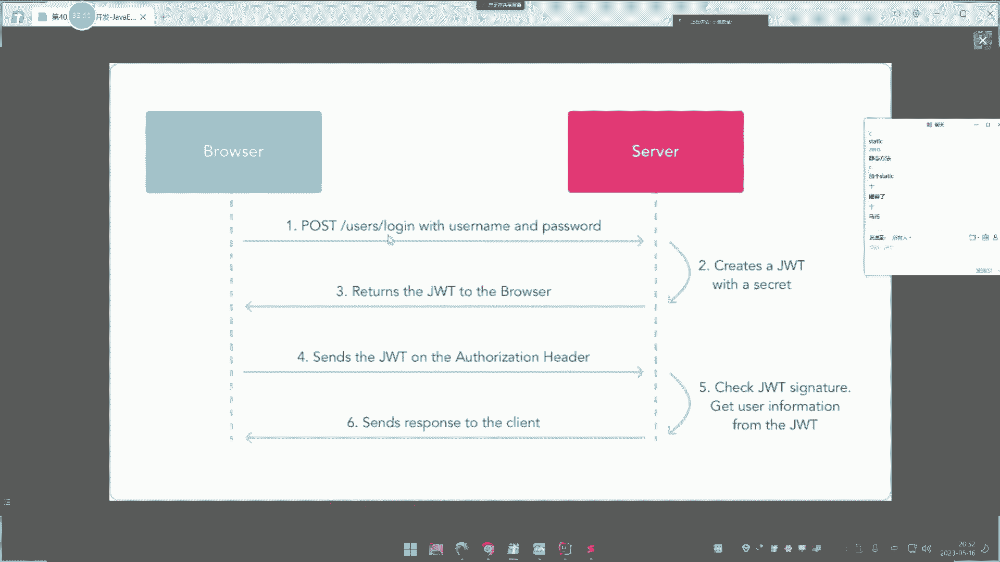
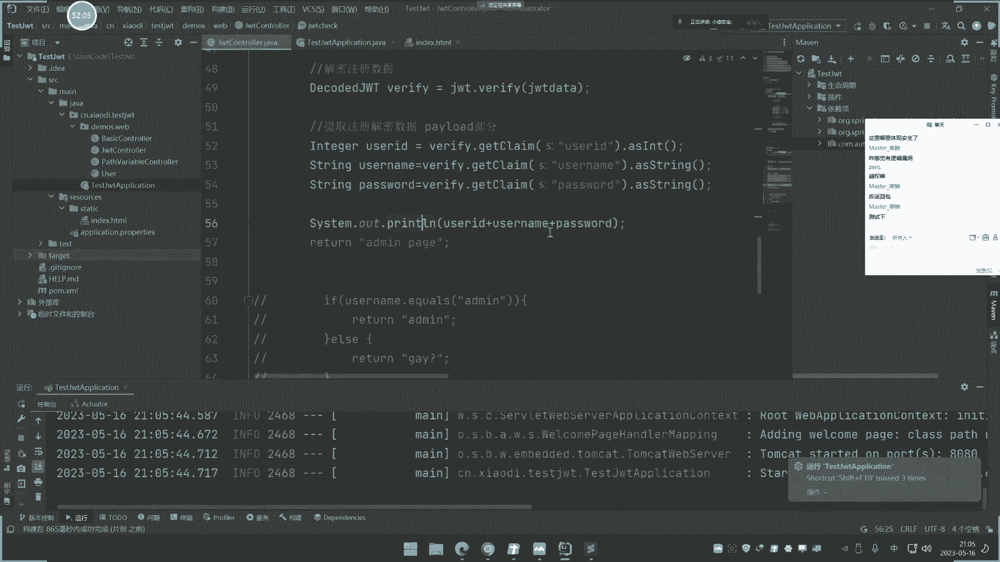
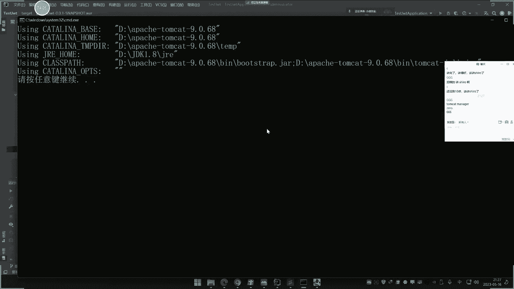
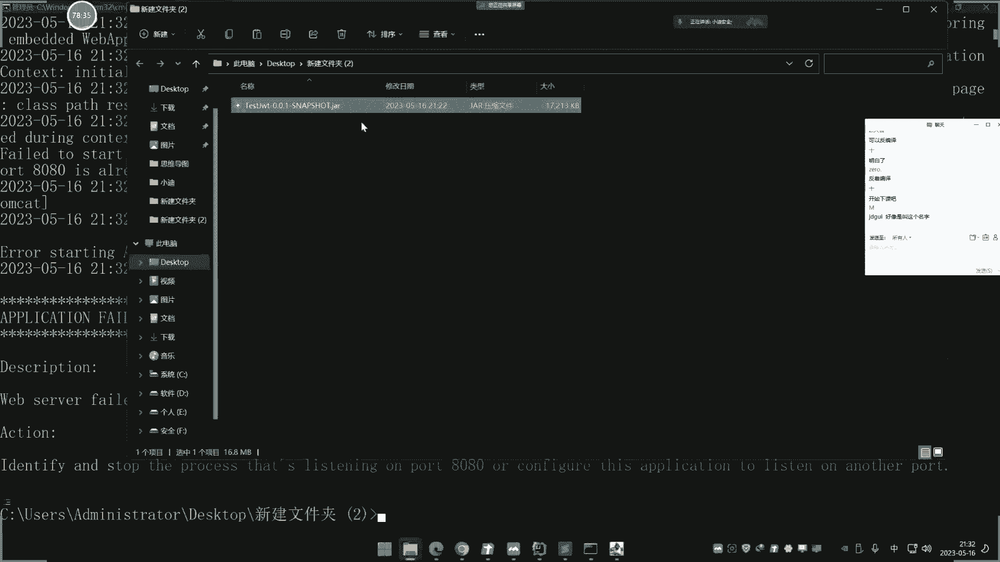
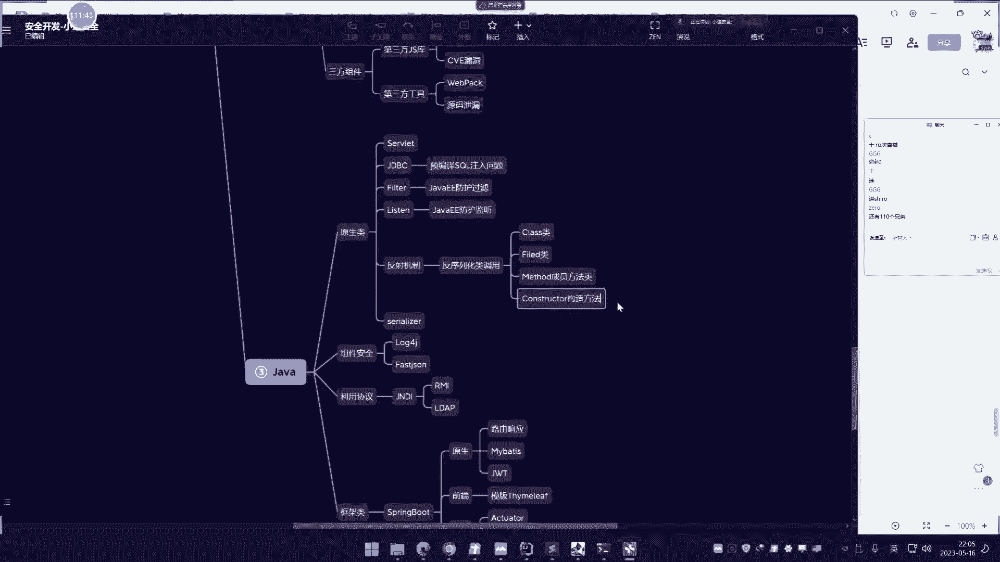
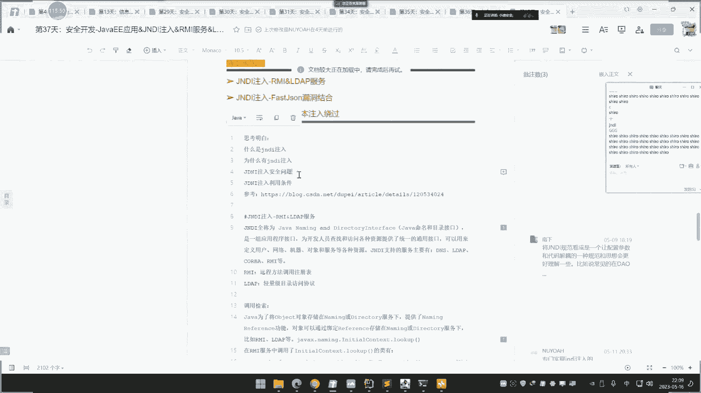
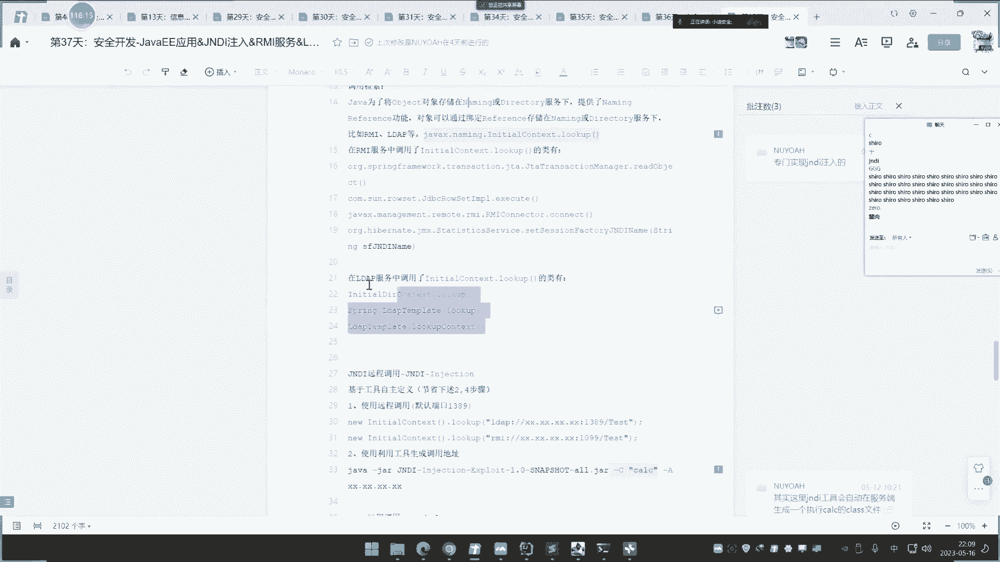
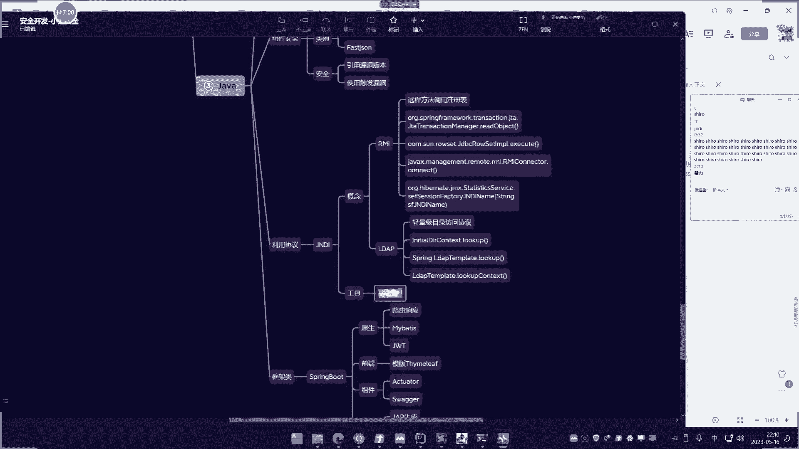
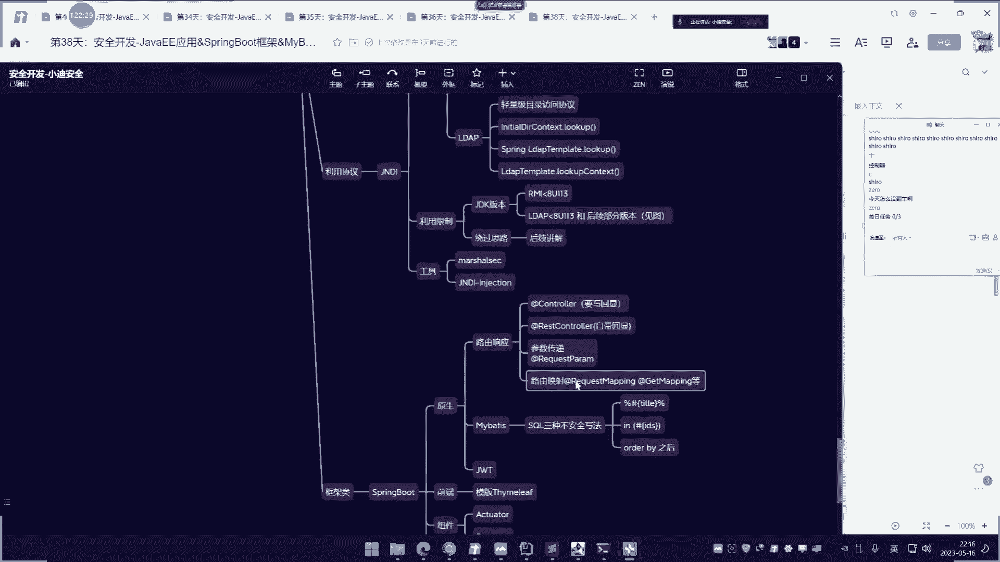

# 📚 课程名称：JavaEE应用、SpringBoot框架、JWT身份鉴权与打包部署（JAR/WAR） - 第40天


## 📖 概述

在本节课中，我们将学习JavaEE应用开发的两个核心环节：使用JWT（JSON Web Token）进行身份鉴权，以及将SpringBoot项目打包为JAR或WAR文件进行部署。理解这些内容对于掌握Java应用的安全机制和上线流程至关重要。

---


## 🔐 第一部分：JWT身份鉴权技术


上一节我们介绍了JavaWeb开发的基础知识，本节中我们来看看现代Web应用中常用的身份鉴权技术——JWT。


JWT是一种用于在各方之间安全传输信息的开放标准。它旨在取代传统的Cookie和Session机制，因其更安全、高效且无状态而广受欢迎。


### JWT的核心概念与流程


JWT的全称是JSON Web Token。它通过特定算法构造出一串数据，用于验证用户身份。其工作流程如下：
1.  浏览器发送包含账号密码的登录请求到服务器。
2.  服务器验证成功后，创建一个JWT凭证并返回给浏览器。
3.  浏览器在后续访问授权页面时携带此JWT。
4.  服务器验证JWT的合法性，并决定是否给予响应。


与Session存储在服务器端不同，JWT存储在客户端，服务器只负责创建和验证，这减轻了服务器的存储压力。


### JWT的数据结构


一个JWT由三部分组成，格式为：`Header.Payload.Signature`。

*   **Header（头部）**：通常包含令牌类型（如JWT）和所使用的签名算法（如HMAC SHA256）。
    *   代码示例：`{"alg": "HS256", "typ": "JWT"}`
*   **Payload（负载）**：包含需要传递的声明（Claims），例如用户ID、用户名等。
    *   代码示例：`{"sub": "1234567890", "name": "John Doe", "admin": true}`
*   **Signature（签名）**：对前两部分进行签名，防止数据被篡改。签名时需要密钥（secret）。
    *   公式示例：`HMACSHA256(base64UrlEncode(header) + "." + base64UrlEncode(payload), secret)`




最终，这三部分分别进行Base64Url编码后，用点（`.`）连接起来，就构成了一个完整的JWT。


### 在SpringBoot中实现JWT


以下是使用Java JWT库在SpringBoot中创建和验证JWT的核心代码示例。


**1. 创建JWT**





```java
import io.jsonwebtoken.Jwts;
import io.jsonwebtoken.SignatureAlgorithm;
import java.util.Date;


public String createJWT() {
    String secretKey = "your-secret-key"; // 密钥
    long nowMillis = System.currentTimeMillis();
    Date now = new Date(nowMillis);

    String token = Jwts.builder()
        .setHeaderParam("typ", "JWT") // 设置头部
        .setSubject("user123") // 设置主题（用户ID）
        .claim("username", "admin") // 添加自定义声明
        .setIssuedAt(now) // 签发时间
        .setExpiration(new Date(nowMillis + 3600000)) // 过期时间（1小时后）
        .signWith(SignatureAlgorithm.HS256, secretKey.getBytes()) // 使用HS256算法和密钥签名
        .compact(); // 生成最终的JWT字符串
    return token;
}
```


**2. 验证与解析JWT**


```java
import io.jsonwebtoken.Claims;
import io.jsonwebtoken.Jwts;


public Claims parseJWT(String token) {
    String secretKey = "your-secret-key"; // 必须与创建时使用的密钥一致
    try {
        Claims claims = Jwts.parser()
                .setSigningKey(secretKey.getBytes()) // 设置签名密钥
                .parseClaimsJws(token) // 解析JWT
                .getBody(); // 获取负载内容
        return claims;
    } catch (Exception e) {
        // 令牌无效、过期或签名错误
        throw new RuntimeException("Invalid JWT token");
    }
}
```


### JWT的安全考量


JWT的安全性很大程度上依赖于密钥（secret）的保密性。如果密钥泄露，攻击者可以伪造任意用户的JWT。此外，开发中常见的配置错误也会引入漏洞，例如：
*   **弱密钥或密钥泄露**：导致攻击者可以伪造签名。
*   **签名验证缺失**：在JWT头部将算法改为`none`（`alg: none`），从而绕过签名验证。
*   **未校验过期时间**：导致令牌可被长期使用。


---


## 📦 第二部分：SpringBoot项目打包与部署


理解了身份鉴权后，我们需要将开发好的应用部署到服务器。本节我们来看看如何将SpringBoot项目打包成可独立运行的JAR文件或部署到Servlet容器的WAR文件。




### 打包为可执行JAR文件


JAR（Java Archive）是官方推荐的打包方式，它内嵌了Web服务器（如Tomcat），只需Java运行环境即可启动。





**1. 确保pom.xml配置正确**
在Maven项目的`pom.xml`文件中，确保打包方式为`jar`，并且`spring-boot-maven-plugin`插件配置正确，指定了主类。


```xml
<project>
    <!-- ... 其他配置 ... -->
    <packaging>jar</packaging>

    <build>
        <plugins>
            <plugin>
                <groupId>org.springframework.boot</groupId>
                <artifactId>spring-boot-maven-plugin</artifactId>
                <configuration>
                    <mainClass>com.yourcompany.yourapp.Application</mainClass> <!-- 你的主启动类 -->
                </configuration>
            </plugin>
        </plugins>
    </build>
</project>
```


**2. 使用Maven命令打包**
在项目根目录下执行Maven打包命令：
```bash
mvn clean package
```
命令执行成功后，会在`target`目录下生成一个`your-app-name.jar`文件。


**3. 运行JAR文件**
使用Java命令即可运行打包好的应用：
```bash
java -jar target/your-app-name.jar
```
应用将启动，并监听默认端口（如8080）。


### 打包为WAR文件部署到外部容器


如果你需要将应用部署到已有的Tomcat、Jetty等Servlet容器中，则需要打包成WAR（Web Application Archive）文件。


**1. 修改pom.xml**
将打包方式改为`war`，并声明对Servlet容器的依赖为`provided`（表示容器会提供，打包时不会包含）。


```xml
<project>
    <!-- ... 其他配置 ... -->
    <packaging>war</packaging>

    <dependencies>
        <!-- ... 其他依赖 ... -->
        <dependency>
            <groupId>org.springframework.boot</groupId>
            <artifactId>spring-boot-starter-tomcat</artifactId>
            <scope>provided</scope> <!-- 关键：由外部容器提供 -->
        </dependency>
    </dependencies>
</project>
```


**2. 修改主启动类**
继承`SpringBootServletInitializer`并重写`configure`方法。


```java
import org.springframework.boot.builder.SpringApplicationBuilder;
import org.springframework.boot.web.servlet.support.SpringBootServletInitializer;


public class Application extends SpringBootServletInitializer { // 继承此类
    @Override
    protected SpringApplicationBuilder configure(SpringApplicationBuilder application) {
        return application.sources(Application.class);
    }

    public static void main(String[] args) {
        SpringApplication.run(Application.class, args);
    }
}
```


**3. 打包并部署**
同样使用`mvn clean package`命令打包，生成`your-app-name.war`文件。
将此WAR文件复制到Tomcat的`webapps`目录下，启动Tomcat，容器会自动解压并部署该应用。访问地址通常为：`http://服务器地址:端口/your-app-name`。


### 部署后的安全与源码考量





Java应用部署后，其源码通常以编译后的`.class`字节码文件形式存在，这与PHP等脚本语言直接暴露源码不同。这带来了两方面影响：


1.  **信息收集差异**：传统的通过URL路径猜测源码文件（如`index.php.bak`）的方法对JAR/WAR包通常无效，因为应用内没有这些原始文件。
2.  **代码审计需求**：要进行安全审计或漏洞分析，需要先对`.class`文件进行**反编译**，将其还原为可读的Java代码。可以使用工具如JD-GUI、CFR或在线反编译服务来完成。











这解释了为什么Java应用的渗透测试在信息收集和代码审计阶段有其特殊性。


---


## 🎯 总结





本节课中我们一起学习了JavaWeb开发的两个高级主题：
1.  **JWT身份鉴权**：我们了解了JWT取代Session/Cookie的优势，学习了其组成结构（Header.Payload.Signature），并在SpringBoot中实践了JWT的创建、验证流程，同时探讨了其核心安全风险（如密钥保护）。
2.  **项目打包与部署**：我们掌握了将SpringBoot应用打包为独立运行的**JAR**文件，以及适配外部Servlet容器的**WAR**文件的方法。最后，我们讨论了Java应用部署后的形态对安全测试（尤其是信息收集和源码分析）带来的独特挑战。


通过本课的学习，你不仅能够实现一个更安全的身份验证机制，也掌握了让Java应用从开发环境走向生产环境的关键步骤，并对后续可能面临的安全分析场景有了基础认知。