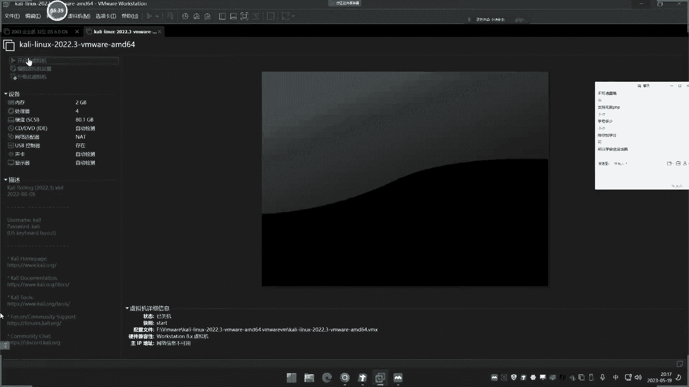
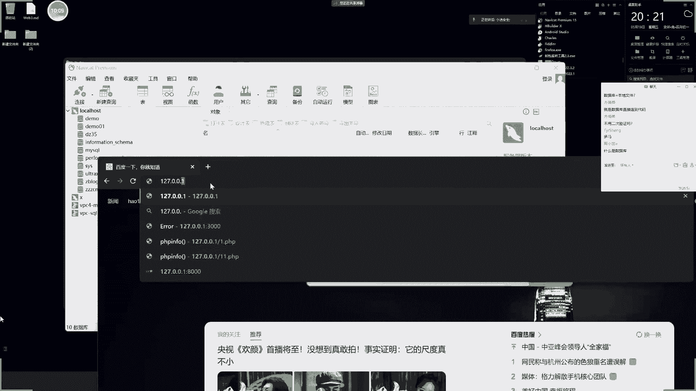
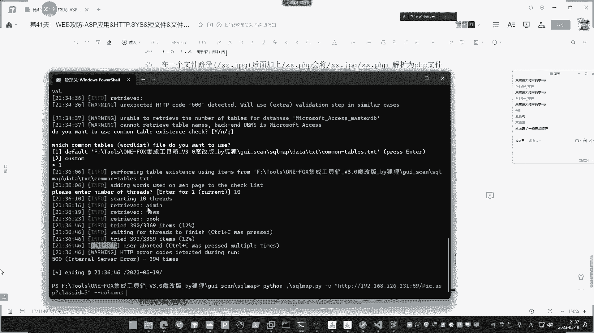
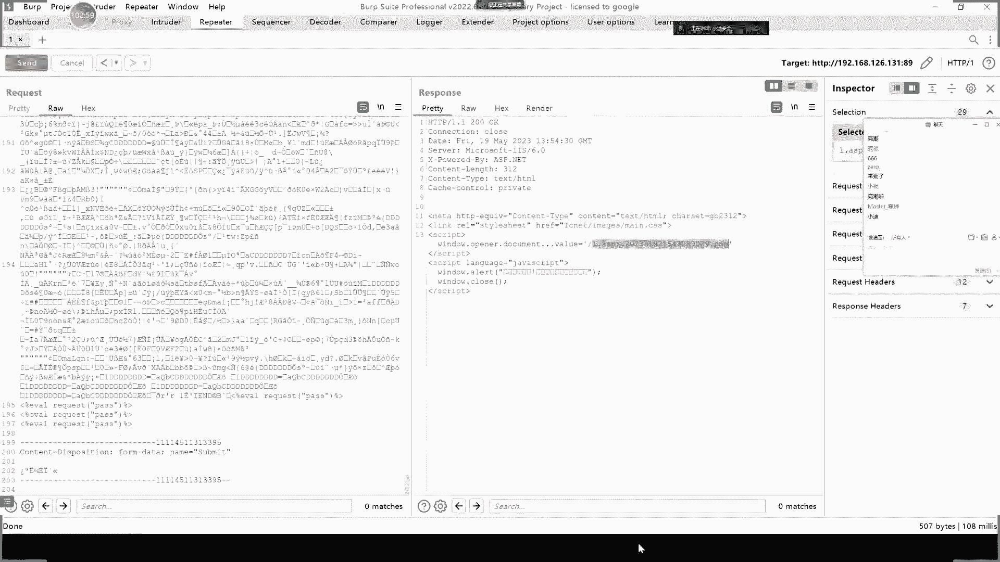

# P41：第41天：【WEB攻防】-ASP应用&HTTP.SYS&短文件&文件解析&Access注入&数据库泄漏 - 逆风微笑的代码狗 - BV1Mx4y1q7Ny

这是第四章节了，也是讲我们这个web攻防这个课程了哈，这个也是继安全开发之后的第四章节了，那么这个章节呢我们先简单的给大家说一下，大概一个章节的内容啊，从这个设导图上面看呢，就是分了大概四五个方向。

那就关于这个什么几个语言的呀，像这个JS的呀，pp的呀，点net呀，java呀是吧，这些主流的一些语言的上面一些安全漏洞，然后呢再来说一下上面的框架漏洞，最后呢再来说一下这个什么。

top10的一些主流漏洞，还有一些这个特殊漏洞，包括这个SRC里面经常碰到的一些业务逻辑啊，加大加强了，像什么这个下面写了啊，这个什么购买充值的呀，支付签约的呀，找回机制呀，数据并罚呀，验证码的呀是吧。

这些都已缴啊，还有些这个不常见的一些漏洞是吧，然后呢组个几个关键技术啊，里面呢也会涉及到一些反编译的测试，还有一些这个代码的解谜呀，数据解密呀，是吧都有啊，那除了漏洞之外呢，还有一些特殊技术在里面。

嘶好这个就是我们大概一个课程安排啊，就是说我们讲呢是按照个什么流程讲呢，就是先把几个脚本语言的这几个特点漏洞呢，讲完，讲完之后呢，再上下一些top10的一些主要漏洞。

然后再来说一下像业务逻辑方面的一些漏洞，最后呢再来说一下这个是吧特殊漏洞啊，最后呢我们再商啊，新加的这个什么web3。0的啊，这个安全就说以上那些漏洞呢，大部分都是在web2。0上面的。

就现在还目前比较多的这个web20，在web3。0呢，就是基于这个区块链合约方面的一些安全问题，那当然了，那个呢我们只是做入门的啊，不是很深入的，因为这个东西网上的讲的不是很多啊。

大概就是3~5次直播讲这个web3。0，讲一下他的这个签约啊，呃这个合约上面的，再就是一些这个2B30，那些架构上面的羊群体好，这就是我们大概这个章节点呢给他上的内容啊，啊今天呢就是第一节课。

第一节课呢上的是一个很低端的一个语言，就是这个SP的这个SP呢我之前是准备不伤的，但是有些人呢说还伤吧，他有时候那会也问到这个问题，商一下啊，啊我们这一届SP呢只讲一次直播，后面呢就不讲了啊。

因为这个SP呢在目前网上呢很少了啊，这个pp都不多了是吧，pp java居多，你这个SP的很少了，点net的少了啊，嘶足疗的还是这个pp和java类的占大部分，然后这个点net的额占一部分。

然后再就是一些其他语言的了，这个SP呢就占一小部分了，在一些老的一些操作系统上面，或者一些老的这些web应用上面呢，可能还有是吧，但在新的一些这个业务web应用上面，那基本上看不到这个SP了。

不过啊就怕哪一天呢你碰到了是吧，那不学那也不行啊，简单讲一下啊，就今天这个内容讲完，SP的就不讲了啊，只讲其他的好，我们来看一下这个SP的啊，啊今天讲什么啊，大概呢就是讲他三个方面。

一个它上面的一个漏洞，再就是这个SP上面的这个主要漏洞，和一些安全问题，最后呢再说一下IP的一个情况啊，首先呢我们来说一下啊，先来讲第一个这个SP呢是在呃，大概是在这个一二啊，15年之后呢。

15年一六年之后呢就很少了，就是在15年至16年之前呢，还是有一部分的SP的，在那个年代之后呢，15年到18年的时候啊，那个是pp最多的时候，然后呢到了18年到现在的话。

java呢有这个趋势呢在逐步上升，是这么一个情况啊，我记得那个时候我刚开始这个解除这个，我完全的说呢，那个时候呢是SP和P1PSPX这三个居多，其中呢大部分的情况都是相辅相成的。

然后到了这个16年之后呢，就是大部分这个SP呢没看到的，大部分都是pp了，到了这个18年之后呢，这个java又起来了啊，java应用呢又多起来了，他是这么一个分布啊，好我们现在来看一下啊。

由于这个SP的程序呢，他是和这个阿克塞斯数据库呢搭建的较多，一般就是小中型的企业和小中型的web应用呢，可能会采用SP。

但现在这种小中型呢也不会塌了，因为他这个语言呢都有一些这个淘汰了。

所以说啊就嗯，啥情况，这个是哦。

这个是那个啊，我打开一下。

然后呢这个access数据库呢他又不需要连接，一般呢在这个脚本文件中的定义，这个配置好数据库路径，那他就可以用了，也就是说呀，我们不需要额外的配置这个安装数据库，就可以直接使用这个access。

那么在大部分这个web应用中呢，他就可以固定好这个数据库路径，然后在安装的时候呢，也不需要去啊配置这个什么数据库，账号密码呀这些东西去安装，所以说他直接把源码一放上去就能使用了。

这是这个asp的一个应用的一个大概情况，如果说他解释用的是这个是个server数据库的话，那么就是吧，那么就不一样些啊，那就有数据库的账密码，这句话是啥意思呢，有没有没有人能够这个说听不懂啊。

或者怎么就行了，来我们来思考一下啦。

我们就拿这个像这个pp来去讲的话啊，这个pp加MYSQL这个情况的啊，你像这个pp加MYSQL里面啊。

我们之前用这个搭建过是吧，这个像呢把这个源码呢给他放上去的时候呢，他的第一步操作是什么情况呢，不知道大家有没有印象啊，来给大家看一下啊。

嗯唉实在是硬时不想掩饰啊。

就想口述，但是有些人他这个理解能力就是差，没办法啊，你说他该该掩饰还是得掩饰，哎呀，跟不上，你说咋办呢是吧，哎那个删除文件没有啊，我们先问一下啊，刚才我说的那段话能不能理解啊。

就那个呃这这句话呢，就是说由于这个access呢它无需连接，然后呢诶你这个搭建这个程序的时候呢，就就不需要它是吧，去访问的时候呢，要配置这个什么数据库的账号密码是吧，然后呢去安装数据库呢。

去导入这数据呢，去安装他大部分的就是直接把源码一拖进去，放进去就能直接用了，配置一下这个东西就可以啊，不需要了，再额外去什么配置数据库了，是这么个概念啊，啊为什么会是这么一个情况呢，就是我刚刚说的啊。

就是因为啊，他这个access斯呢它不需要连接，这是啥意思呢。

嗯我们这个pp它通常会和这个SX啊，MYSQL搭建是吧，它会这MYSQL搭建，那么我们在连接这个数据库的时候，是不是有一个数据库的账号密码呀对吧，去连接上去对吧，你像这个呢我连接上去了。

那么这里呢就是MYSQL数据库嘛，对不对，那MYSQL里面呢是不是就有这个数据库的账密码，写进去踩链接啊，然后里面就是他数据嘛是吧，然后这个多嘛，那就是可能是一个数据库，是一个网站的那个多米尼。

那就是另外一个了，Dz35，那就是另外一个这么一个概念，对不对额。

那这个access他是什么情况呢，就是它使用的是access数据库，这个数据库是最低级的数据库，那这个低级数据库呢他没有账号密码，啥意思啊，就是不会像说你要连接数据库的时候。

那这里要输入什么这个数据库的账号密码，那才能连进去，它不会有这个东西。

那没有这个东西，你再去搭建网站的时候。

需要网站告诉你怎么去安装配置，连接它吗。

听没听懂啊，听不懂啊，这听不懂。

说实话啊，这安全开发也是白上了啊，我这一个通达个两毛四星吧。

把你弄个占用了，我说是什么鬼情况，占用了呢，重打，通达那个东西啊，我把它安装过，嗯就这里同档，把事先暂停一下，来，把800给占用了，其实我改个端口类也可以啊，懒得改了，那先关一下吧，怎么弄到的还多了。

哎呀看一下啊嘶，嗯好吧，等会改一下吧，问一下啊，我刚才说的那个概念能不能理解，能理解，我就不做这个实验了啊，不理解我就给他做出来，免得说都理解我做也浪费时间啊，理不理解啊。

刚才我说那个实事求是啊，一时理解还是不理解，想看我翻车，这不可能翻车的，这个WB是我的擅长的啊，人都知道我的web讲的是最好的。

我就是搞挖宝出身的，怎么可能翻车呢，不现实的啊。

呃我就问一下大家。

大家这个安装过这个D啊，z blog这个东西没有啊。

安装过没有啊，这波G安装没呀，没安装啊，你们这学的啥玩意啊，这他妈的，从第一天的时候就安装过呀。

就讲过呀，不不不不是什么z blog，z blog只是说我们测试经常用的一个程序。

你安装其他的app也可以是吧。

哎我也不慌，对不对，也不急，嗯对吧，我把这里去掉，看着啊，我先把这个源码去掉，就模拟这里呢我重新去安装它一样的，我把它原码这个替换掉。

然后你这个时候你看一下啊，我刷新一下这里，你看他是不是出现一个安装的这个界面啊，就是安装这个程序，这个程序是pp的嘛，是加MYSQL的一个配置数据库嘛，然后呢你点下补时候，那他这里那就瞎补。

然后这里是不是要去输入个什么数据库账，密码呢，有MYSQL和什么塞SQL light这两个选择吧，因你这打印MYSQL呢，你就选择这里，是不是啊，这里是不是去配置这个账密码呀。

是不是有这个界面这个东西啊，那么这里配置好之后，这个数据库呢东西它存放在哪里去了呀，他是不是就放在了这个地方啊，你比如说像现在我们就给他创建一下是吧，数据库名字root。

root密码呢就是我们那个数据库的router，然后输入名字，我的名字就叫这个z blog，然后今天名字是10510519啊，取这个名字啊，啊标题随便写是吧，管理名称密码呢，对吧斜加你看啊。

现在这边我可以刷新一下，你看这里啊，这里啥都没有，没有那个叫什么z blog0519的东西好，我点下一步勾，他说密码要什么长度好，那就加一个吧，勾啊，他说呢安装成功啊，我刷新一下这里看一下啊。

你看是不是多了个z blog0519啊，然后这里面就是他这个数据库的这个文件，然后就是存储数据的嘛，是安卓版的吗，是不是好，然后呢这就进入了首页了，是这么一个流程，对不对好，通过这个流程。

大家看到了需要配置数据库的信息，然后呢数据库是放在了这个数据信息，是放在了这个MYSQL里面，对不对，这是这个pp加MYSQL的，那么我们再反过来看这句话啊，这个阿克塞斯呢它是没有连接东西的好。

那没有连接啥意思呢，就是说呀你要连接xxx不需要连接，任何人都可以用好，那么这个网站打开的时候，你想象一下它会跳到刚才那种安装界面吗，就需要你配置什么数据库信息吗，他没有这个事情，他怎么办的。

他是已经程序员，那在开发这个源码的时候呢，他就在脚本定义好了这个数据库路径，然后数据库呢是放在哪里呢，是放在网站目录下面的，就是放在源码下面的，不是单独存放的这个MYSQL数据库里面的。

是单独放到一个文件夹下面，然后呢在这里配置定义好它的路径，所以你就不需要呢，再额外的自己去配置数据库信息了，就是说你不需要让他什么，什么是连接账号密码呀，数据库是名字叫什么呀，不需要配置这个东西。

因为它没有这个属性，他没有这个连接的账号密码，他已经在把源码给到，你说那就安装了，这好理解了吧。

所以由于这种特性呢就会造成他一种安全问题。

啥叫安全问题呢，来你看一下啊，这密码呢是ADD me，就是有些SP的程序呢，它这个特性决定了一个问题，什么问题呀，你看一下啊，其实有些真实网站现在还有我不敢去演示啊，啊你看这个啊这个呢加一个这个什么。

把它放大一点吧，那这里有个叫这个fy blog s，3。0的这个网站来源码，然后呢这三大源码啊，然后你看这里有个database这个目录名字，那就是数据库的，然后这里面有个什么井号data点MDB。

那么这个MDB文件呢就是access的后缀名，MDB文件是个r access，一个后缀名就是个data点RBB文件是吧，对就这个文件哈，这是它的一个那个数据库的名字啊。

数据库的那个access数据库的一个文件，那么这个呢你在网上你看一下啊，我在网上来搞一下啊，Fi bo，那这里网上有个什么服啊，f y blog文章管理系统3。0是吧，你看啊，我们打开看一下。

那下载一下这个这个源码啊，把下下来，打开。

然后呢这个源码的话就不需要安装，就直接放在那个网站中间件下面就可以用了，然后你再看里面这个are database呐，它默认的就是星号date，点MVB啥意思呢，然后我们可以找一下他那个网站的数据。

配置文件来看一下名字，这个CON应该是的，来编辑一下，看一下里面的啊，你看这里啊，看有没有数据库的配置路径，你看这里有啦，你看来data su data的一个路径啊，指向的是上级目录的database。

然后呢井号data点m dB文件啊，它固定好路径啥意思啊，就是说他其实呢已经设置死了，这个就是它数据库文件，然后这个里面的文件，这个MDB文件就是他数据库，你可以打开看一下。

如果你电脑安装过这个office软件的话，就可以直接用这个什么这个office的这个表格，文件呢就可以打开它打开，你看他就有表嘛呢，这就是他数据库名，比如艾米就存储了ADD me账号密码。

然后呢这个其他的就存储了其他信息，这是他数据库，这个数据库呢，它不需要说你需要账号密码的才点进去，就这个文件直接打开就可以看到，那么脚本呢也是一样定义好，所以说它需要打开啊，就说它需要这个安装吗。

不需要安装啊，用直接用就完事了，直接用就完事了，它就自动的找到这个路，这个文件当做他数据库，那么数据呢在存放之后就会写入到MVB，这就是数据库文件，那么这种东西呢我们就称之为叫默认搭建。

啥叫默认搭建呢，你想想想啊，我用这个源码我去搭建的话，那么我数据库路径我不改，它是不是就是默认搭建，那我不改他的话，不就这个路径我就知道了吗。

能不能理解啊，来我们看打开这个网站看一下啊，呃就这个嘛是吧，来这个，这个网站是吧啦，你看啊，这个网站，网站是192。16261，点1131的这个端口来在这里看一下啊。

法移动，那这是那个网站，那虚拟机那个那个FO狗嘞，新闻系统那个网站，这是那个网站，然后这个网站是个SB的嘛，嗯对吧啊，很简单啊，他用这个搭建好吧，打印起来了，这个网站打印起来了，好没问题，这倒是正常的。

我刚才说的那个原因是什么情况呢，那我知道这个这个程序源码，那我得往下来套加头，这是我刚才下的，然后呢，我这里都找到了它的默认数据库呢是在database，然后呢一个信号data点MVP。

那么现在我可以做什么事情，我是一个直接访问database，然后23%代表星号，不要写井号啊，不要这样写，写百分二三3%，就是那个井号的U2编码，然后date点MDB是给下下来呀，把文件再下下来。

把数据下下来，那你说下下来干嘛下下，不是有他账密码的吗，来下载，你看下下来了，这下载的吗，你打开这不就是目标网站了吗，这目标网站吗，打开这里不就有账号密码了吗，那我把账号密码一解，这后台不就知道了吗。

你可能说后台在哪里啊，后台你源码都知道了，你源码这里看不到AD密是什么后台啊。

直接访问read me，对不对，把你解出来，照密码一登不就行了吗，这是他第一个安全问题，就是我们说的默认搭建的安全问题，这个默认搭建是什么情况造成的，是由于这个语言的特性决定的。

就是他搭建access数据库，这个access数据库呢程序员呢它不是启动的是MYSQL。

所以这个数据库呢是放在网站目录下面的，而且这个存放呢，如果说在搭建的时候不更改的话。

那么就是你用什么搭建，就是什么，这个情况好好不好理解，你比如说像这里这里悠悠桃源吧，这个是一个东医的，以前的很多学校用的这个系统，那这个呢也是一套源码，它的源码呢也是个固定的，也是个固定的。

那我们可以看一下啊，那这里有个动一的，那么它的源码呢是这样的，那么其中你看一个database basically的一个叫什么，Pom easy，206点MDB，那这也是它固定的数据库名字和路径。

那么你就说你直接访问这个这套源码的，这个路径是吧，访问database data，然后呢再访问这个路径，这个就不不直接可以下载下来吗，好理解吧，这个这啥情况造成的呢，就是因为他的这个asp加塞。

是这种搭建组合造成的，他不需要配置这个呃数据库，所以你在安装的时候呢，它没有那个安装选项，就直接把源码放进去就能用，因为他在脚本中已经固定好这个路径了，你可能说那对方会不会改呢，当然他改也可以改。

就比如说我把这个名字一换，那王者要正常运行该怎么办呢是吧，就我把这个名字换，那很简单道理啊，就像刚才一样，那刚才那个表盘一样，是吧，他默认路径是这个嘛是吧，我假设我把名字改，我改成什么123，对不对。

我改成123，那么呢你看我们现在在打开那个网站，那他是报错了，你看看找不到文件了，是不是又改了呀，那网站要正常打开怎么办呢，他是不是要改啊，改哪个地方是改到数据库文件那里啊。

比如说的就改成刚才那个数据库这里啊，把这个路径改成什么，改这个路径吗。

保存对不对，它的定义好玩呢，哎咋回事啊。

星号井号的东西，这改了跟没改一样，可能还有其他东西要改啊，123MDB哦，那应该是还有个东西要改，那里应该是哪里，还有个东西要改啊，这个地方定义好了，还应该还有个地方，那包还报了个错，就说你想着。

就像现在我如果说想把这个路径改掉，那改掉的话，你看这里好多西都要改，来这里应该用这里也要改，保存一下刷新，那你看就正常了，是不是你说如果不懂的，他哪敢乱改呢，你这样改。

就可能保证这个数据库不被下载了是吧，因为别人不知道你那个是什么数据库了，你不清楚啊，所以呢你就可以是吧，安全一些了，但你改了，你要懂行啊，你不不懂行，改不就死了吗，王子，咳简单来说啊，还是我们那句话。

这个很好理解的啊，所以啊就是由于这个hp和access，这种搭建组合的一个特性啊，这个数据库名呢如果在源码中呢是固定好的，那么你如果有这个源码的话，你就看一下这个数据库路径，那么有这个数据库路径呢。

你就可以直接远程去下载了，就用这个默认数据，估计因为大部分的它下载有源码，它不会乱改的，一个没有经验的人，一改王者就死了，所以他不会改，不会改呢，那攻击人呢就可以知道这个数据库的完整路径。

那就可以直接呢去通过这个网站呢，去请求它的完整路径去下载这个数据库，那么下载好数据库之后，数据库里面就会有十这个网站数据，其中就包括后台的用户和密码，那么就找到突破口，这就是我们今天讲的第一点啊。

就是关于这个SP应用里面的第一个安全的点，就是它一个脚本语言和数据库，搭建的一个默认的问题，那么你可能会问在app中，在我们的这个什么JSP或java，什么Python这种其他语言中。

有没有这样的安全问题呢，问一下大家有没有啊，大家想象一下有没有任玩家，刚才有人说有啊，所以说啊有些东西呀你无论伤的多么稀，上的多么简单，总归还是有人搞不懂，那没办法的啊，好我们现在来看一下这个第二点啊。

就是关于这个IP中间间的一些安全问题，那么首先看第一个啊，也是一个叫ATPSYS一个漏洞，这个漏洞呢在很多真实应用中也存在，虽然说是个15年漏洞，但是现在还是很多有，因为这个漏洞呢它不是和漏洞。

和这个权限相关的，它就是一个我们利用它做来做一个这个崩溃了，蓝屏漏洞，但是他还是有影响，毕竟用这个漏洞一利用成功了后就会直接崩溃，难平这个东西呢还是对人物有破坏性，所以它也属于一种漏洞。

但这个漏洞呢不是和权限挂钩的，网商能给到的，这个利用呢没有和权限挂钩，就说你用这个漏洞，他拿不到权限，当时那可以做个破坏，做什么破坏呢，就像南平这个15年漏洞啊，你可以说这个过了78年了。

这个漏洞还没用呢，有用啊，这个漏洞是影响在win7这个下面写的，影响版本啊，一直影响到windows2012，那么在上面搭建过的这个i is就可以受到影响，只要安装过i is就行了，这上面能安装过啊。

呃他这个漏洞利用呢也非常啧简单，我们可以直接利用一下，给他看一下啊，这个也不需要大家掌握，就是以后呢你碰上这个漏洞都知道是怎么回事，因为当时上汽，当我没有上到这个HPSYS，这个漏洞的时候啊。

啊有人呢问过，就说你实在没漏洞提交，你可以提交这个啊，并且浮现一下都是完全OK的，但浮现要注意安全啊，这个搞不好吧，就这个主机的直接搞搞重启了，这就很尴尬了啊。

来我们试一下，在这让我们搞了个环境啊，这个密码是小迪，然后呢我们看一下这个IP地址。

这是win7的啊，我们在那有这几个系统都遭殃啊，就是win208啊。

这win8啊，201啊，这些都可以啊，然后呢这个是126。135的一个IP地址，然后它上面那是安装过这个上面的。

这个网站服务，让我们看一下啊，打开看一下啊，你看这个是他安装的啊，来那个主机安装了，默认呢没有上面搭建网站，但打不搭建网站都无所谓了啊，搭建网站也行，不搭建也行，我们那就没有上面是搭建任何东西好。

这个是个幺三啊，1260135的啊。

那可搜一下这个漏洞，那个介绍APSYS的一个这个漏洞，然后表示代码执行，称之为叫远程代码执行，但是呢事实上网上给到的都是蓝屏，就直接把他搞崩，那是影响版本啊，他说可以测试这个东西呢。

来测试他有没有漏洞啊，这个也无所谓的啊，一般扫描器，那你这样测了也行啊，就是直接呢显这个地址加上这个东西呢，如果说它浮现的话，有这个提示的话，就说明有这个漏洞，就用这个什么CTRL命令来去测试啊。

啊这个要把host改这个地址呢，改成你那个目标地址就可以了啊，理解吧，那我们可以试一下啊，呃CTRL命令呢可以用这个抛修啊来实现，CMD呢不行啊。

用这个pp修泡沫修里面啊，打开pop修SAMD里面，那是没有这个CTRL命令的啊，所以我们到pop修好，把改一下这个地址呢，这里要改成什么这个对方的IP地址，192。168点，就我们那玉米啊。

玉米和IP地址啊，不要写这个AP的，不要加hp和abs啊，然后是126。135嘛啊，访问一下嗯，哎报了个什么错误啊，哎呀这个鸟毛事情啊，真是麻烦这个里面的不支持这个东西，前面IP地址呢也没改，再改一下。

18。168。126135。

还是不行，这个不行，是什么情况啊，他是无法将这个东西呢替换什么什么类型啊，这还是要用那个LINUX的CTRL命令，LINUX啊。

来把LINUX打开，在这里面放小，这个泡沫修里面呢，他很多mini呢是和那个有不相干的事情啊。

啊不一样的啊，这个用LINUX上面测好一些。

看你好丑，我都不用这个东西的嘛，那直接拿来看吧。

这个提示了一个东西，你看他这个东西呢就是他说的这个私信呀，他说什么只是这个东西呢，就说明有这个漏洞，其实呢也不用看这个事情啊。

你只要看到报错了啊，就基本有的，你看下有没有这个思想啊，报了个来东西呃，提哎其实你看到这个东西就知道有漏洞了啊，你不用看那个东西啊，来一般不是200的，这个问题的话，一般报这种错误，416的错误。

那就是有好，那么如何利用它呢，先把它放大哈，哎直接MMCONSOL里面的集成有这个漏洞利用啊，来我们打一下，好这个呢呃用到他那个模块，就专门用这个漏洞的啊，AOX的这个。

然后是DOSDOS主要是这个1P的嗯，MS15的，那就这个这个3D用的模块，打他DOOSDOS的那个蓝屏呃，修open显示呢看一下他这个色选项，有些人不会用这个M3F，那后面呢也经常用到这个呢。

简单先修一下啊，然后呢我们在讲内网的时候会经常用啊，设置下our host代表的是他那个目标地址三，output就是目标端口啊，其他的不用设啊，这个代理呢是不是无所谓啊，如果说你要有代理的话。

你就要代理访问，在设这个代理啊，无所谓，Yes，就是必须设置NO就可以不设置啊，在下目标例子啊，low host sat啊啊host目标地址192。16，8。126。135吧，然后端口呢是八零。

我们这就不管它了，来看一下，再来设置一下，这个呢就设置进去了啊，八零端口呢我们就不管它了，因为它就是八零嘛是吧。

好直接run看一下啊，看现在win7主机啊，这边呢啥啥情况都没有发生是吧，正常的好，run一下，他说百分百来看这边，看到没啥情况，重启了，肯定就这样，你还有什么东西啊，第一位有啥呀，我都说了。

这个漏洞不是拿全新的，网上都说是个蓝屏漏洞，蓝屏就重启呀，以为是电脑操作呀，那怎么可能自己再看啊，看着啊，我没有动正面啊，我把单独拿出来好吧，别人一说你没得我做假。

来看着啊，哎什么情况，哎这他妈的就是你们烦死了，简直是。

打都打不开了，现在。

这咋办呢。

哈哈他妈的上次就中了一次这个情况了，他妈的。

吃足章文件，哎呀行吧行吧，这哈好了啊。

兼职要烦死。

五把拉了拉的真是烦得很。

看一下啊。

好咱们登录下，搞快点啊，最后演示一遍啊，其实这个东西也不演示的，50回硬是说我做假的，没办法再给你看一下，我没有动他的阿哥，没有动他的，US这个IPUS，192。168。126。135 18。

确定确实好，你看二级在run run之前呢，先看一下这边R确定一下呢，没有动的R呢，现在正常操作，我还把它调底，打开一个C盘给你看一下，然后看着啊，装一下好，掏出百分百，我们来切换正面看一下呐。

这不是我搞的鬼吧，男的的呀。

好那这个呢就是我们说的那个hp s y s，拿那个漏洞啊，一会你碰到了就知道这个东西啊，这是什么情况，那测试呢也非常简单，网上有那个测试的CTRL呢，就指认你测试有没有这个安全问题啊。

就是windows搭建的，如果说有这个漏洞的话，那就可以直接用，但这个漏洞他不是拿权限的，就是直接搞破坏的，所以他不要乱用这个东西，搞不好重启之后呢，影响对方的这个运行呢，这是破坏计算机罪啊。

好这个是我们说的这个第一个啊，这个漏洞啊，还有一个呢就是i is这个短文件漏洞，这个短文件漏洞呢啊，网上可以搜一下这个漏洞的一个介绍，就是用i windows搭建的i is。

你可能说ISP怎么和i is相关的呀，因为这个i is呢是windows自带的一个中间件，这个中间呢一般搭建的都是SP和这个P啊，这个sd net就是IPX居多啊，pp呢也可以在2S搭建。

但是一般pp呢和阿帕奇结合的比较多，这个短文件漏洞呢是个什么情况，他其实呢就是和我们电脑上面那个秘密相关，就是比如说我们在电脑上面呢，有这么一个东西啊嘞，打开啊，比如说我DR，然后杠X好。

他这里呢就是可以显示一些这种目录啊是吧，这种情况呢，去看这个文件和文件夹的一些这个属性是吧，比如我切换到C盘也可以看一下DR，然后你看啊有些目录呢它也是这个名字，看到没，Pro g a a g r a。

是不是就是前面这六个字母的这个缩写，然后一个一呀，那代表什么呢，这个后面那就代表他的后面的，所以他就是所写就这么一个概念啊，他是这么一个命名规则，然后这个漏洞是一个什么情况呢，我们先给解释一下啊。

他其实就是这个问windows自己的一个命名，所造成的一个安全问题，我们用这个漏洞能干嘛呢，主要是获取后台的路径，包括数据库文件的获取，或者说其他敏感文件，啥意思呀，就是说你可以通过这个漏洞呢。

来去探针一些网站下面的路径结构，然后呢比如说探针后台，比如说呢他这数据库的这个文件的名字，前面有几位，但是它有个缺点，只能探证前六位，就像我们现在看到的呢，这里有个目录叫prom file files。

那么它这里呢就显示PROGA，而不会写后面的就am就到这个M后面的就没了，M这里就没有了，这后面东西我们就靠猜了，好啦，这你都说了半天，你也不知道这是啥东西，啥情况，前面介绍我们也不看了，直接给他用。

用了之后呢，我们再反过来想一想，是不是这个情况应用工具呢有两款啊。

我都给大家演示一下啊，那么现在呢我们就拿这个来说，这个他有没有什么使用缺陷呢，就说有没有什么个使用的这个先知呢。

基本上是i is的产品呢啊他都是可以用的，就是说只要是i is的搭建的源码呢，他都可以用啊，嘶我们可以看一下网上介绍啊，有没有啊。

嗯他没有写版本较早，有版本的可以看一下。

啊也都没写完啊，简单来说就基本上现在只要是S都可以啊，你这是那个短文节那个介绍那67657版本，这个其他版本啊，后面版本的也有，八版本的也有哦。

给大家用一下，看一下啊，大家都知道了，两个工具都可以用啊，一个个演示吧。

来看一下它的使用方式啊，有什么不一样的地方啊，来看一下啊，就拿刚才这一个不忘再来讲，我们把刚才的网打开，你看啊，我们这里呢找几个网站来给他演示一下啊，比如说像这个网站这话是89号端口。

然后这里有个这个这个这个126。131，这个端口88，看我们打开看一下啊。

就这里啊他是这个88端口的这个网站，我们看一下好，就这个网站啊，你看啊，我们用这个工具呢先给他简单扫一下来。

我打开这个网站目录看一下啊，知道网站目录啊。

知道网的目录来，我们用工具找文件扫描工具扫一下，看一下有什么东西。

两款工具啊，一个是个这个java程序的工具。

还有一个是Python工具啊，java程序的工具要好用一些，要要要要要精确一些，然后这个Python的呢一般般。

是吧，然后运行。

放大一点的，这还小啊啊你们看不到吗。

这还小啊。

虚拟机那个我怎么放大了，放不放，放个毛啊，那个那放不大的啊，这东西不是我能决定的大图标啊，他没有这个大图标啊。

太大了，受不了的，是的啊，好运心一下啊啊这明星看看什么鬼啊，你看他扫了一遍，扫一遍，你看啊他扫了什么东西啊，大家看一下啦，第R代表目录目录有个AUTHR，有个什么COPYFR，有个FRIDEN。

还有个什么GUESTB好，这里呢有找到几个文件。

那么大家可以看一下啊，然后我们看一下这个结构，呐呃。

嗯在这里给他看吧，这个是啥路径啊，这个怎么放大啊，我不知道啊，这防不搭了啊，没办法，这就这么东西呢，这个稍微大一点，在视图里面哎这没办法啊，我尽力了，这个东西咋放大呀，没有你说的那个东西。

这个win这不是win10啊。

那些东西啊，你看了这里找了这几个东西呢。

AUTHOR呐，这不是有个AUTHORPIC吗，是不是前面那位啊，呐这个CAPY的，那这里是不是有个啦F2啊，截止了呀，FRIENDER的F开头的那是不是有这个啦，Find the site。

基于STB，那就这个吧，那你可能说还有啊，什么这个AD啊，艾德米呀，还什么A啊。

t t call呀，database啊，这东西怎么没有啊，它能扫出来的，就算能扫出来的，扫不出来的，你可以自己再通过其他方式去扫好，那这有什么作用呢，对不对，大家有何问呢，这有什么作用呢。

少数东西是干嘛的，扫网站的目录有几种方式，一种呢是用字典去扫，有没有这个目录，有没有这个文件，那就是看字典，看运气，而这个扫描的是通过他自身的这个i is，短文件当中它能扫到的文件，而且他有个缺点。

就只能少求牛尾，那有啥意义呢，对不对，为什么说他应用加字是找后台呢，那大家试想一想啊。

首先我们想象一下，那假设说你少了个目录了，少了个目录了，那少了个database目录，但是后面这个MDB文件，你不知道他的名字和路径。

我可以了，去探针一下路径下面的database，去让它扫这个下面能不能扫啊，看一下啊，看到没扫出来了，POEAEREA诶没了，后面就靠，你猜了，你猜对，这不就是MTP路径的吗，猜不对。

后面六位后面的位数猜不猜不到不就没有了吗。

那同理，那能不能理解其他的呢，所以说他为什么是利用到这个几点上面呢。

这是这工具啊，啊我们呢可以换一个啦，这个解压工具来再试一下呢，这个这个是个解压工具，这个是个GL工具，在这个release里面啊，在这里面用。

嗯给试一个换一个试一下啊。

换一个来个八九的，八九来个网能。

还是这个哈来用这个来试一下它的，嗯唉还是用这个吧，哎用他妈的用的烦得很，那个老要点确定确定，哎呀，你看这个是他扫的呢，这个是找了个八九的，那这里有个dB，那你说后面是什么S1吧是吧。

database常见支付再扫，那没用，那是DBS吗，Db c k up，噗，哎呦，看他这个东西呢就怎么说呢，就是少一些常见的目录结构啊，如果说你能够通过它能找到一些敏感的地方。

比如说像有时候你找不到后台诶，刚好能扫出这个某个目录下面的是吧，前六位那拆到后面中心，那可能就是后台了，所以一般用它的，就是看一下有没有些这种后台的目录的，敏感东西出来。

数据库的这个路径的这个前面的六位出来，包括还有一些其他品牌文件，比如说你这里少了一个什么。

少了个什么，比如说这个少了那个zip文件，哎，这可能是压缩包啊，对不对，他在积累的地方呢，就是说只能找到前六个啊，后面东西找不到了，但这是一个i is短文件漏洞，就这个漏洞呢基本上都有。

因为他就是太激烈了，很多人都忽略它，但是呢他有时呢还是能够发挥作用的，还是给他讲一下啊，这S段位机漏洞以后呢，再用一些扫描工具扫一下这个目标网的时候，报出这个漏洞的时候，你不要说你不知道就这么个情况啊。

S那个有S也可以扫一下试试步扫啊。

幺这个是多少的。

是135，这个应该是我的是吧。

那要少的sp net，因为他只啥都没有啊，那里面就是哪个东西啊，画画的目录就是那个东西，这网站呢那网站目录就这个东西了。

不对的嘛呢，嗯是的吧。

我去泡了小篱笆啊，我就知道啊，跑了个小，跑了什么，跑了小迪拜呀。

跑我的，好这个就是我们说的那个S短文件啊。

好再来说一下这个解析漏洞，这个解析漏洞只有两个版本有漏洞，一个是new版本，一个是这个奇版本啊，六版本呢是我们现在演示的啊，七版本呢我就不演示了啊，你跟他说为什么不演示啊，说实话啊。

这个节奏呢以后碰上机会会越来越少，呃起版本这个漏洞呢也不是又少呢，再加本身这个windows的服务器，大家i is的就不多，然后这个起版本这个漏洞呢，还有很多补丁都打上去了，所以就更少了。

这个new版本呢还稍微好一点，因为他没有补丁，所以如果说是new版本的话，几乎都有这个漏洞，但起版本就不一样了，那就基本上100个里面就有一个才有漏洞，因为这个是官方那个策略造成的啊。

当时这个六版本这个解析漏洞包出来的时候啊，官方呢不认定他是个漏洞，所以没有给补丁，导致呢没有补丁可打，都是一些民间的修复方法，但是很多人不知道，所以呢他也不知道怎么修复，就随他去了。

但这个七版本的出现漏洞的时候呢，官方呢又出了补丁，所以导致七版漏洞呢要少，但是new版本多了，看的蛮尴尬啊，这个new版本漏洞呢它有两个情况，然后我给大家演示一下啊。

U版本的一半是windows2003搭建在一起的，在之后的什么2018，那就是七版本和7。5版本的啊，然后还有现在还8。8版本，九版本，那就是201220192019的windows。

那个就没有解析漏洞了啊，只有这个低版本有，那么这是一个什么解析漏洞呢，来给大家演示一下啊，然后我找了个路径呢给大家看一下，比如说这个网站的，找刚才那个路径的网站，好就这里嘛哈这个网站呢。

你看啊这里呢啊我们。

找一个这个后门吧，找个后门演示一下啊。

你不听可以滚出去啊，他妈的一直在这逼逼赖赖，干嘛呀，我们把它生成一下啊，生成个SB的，来我们访问这个一点SP的啊，这个一点SP的是一个后门啊。

你看一下啊。

这E的SB呢，我把它放到这个服务器这边，你看一下啊，在这一点SB我们现在呢去连接一下这个路径啊，连接下先接一下啊，疑点SB啊，这三个路径地址啊，我们连一下啊，材质连接添加好看一下啊，它是能够连上的啊。

那是用这个home门工具呢啊，能够连接上这个网站诶，那能连上啊，你看没问题啊，啊是吧好，这是H1的，那么你看啊，现在如果说我把这个格式呢把它改成一个什么，改成一个这个什么，JPG了。

那你看这个图这个图像那是不是就变了诶，你看我们画这个东西给他看一下，那图标都变了，打开了都是图，图标应该是打开了那一点SP点JPG，但格式呢文件属性呢就变成这个JPG格式了，是不是啊，那么现在你再看啊。

我我再把它连去连接一下来，我连接啊点JPG，妈的啥情况，咋又花屏呢，这不是尴尬了吗，这，重新打开一下吧，这花瓶这是没办法啊，来看下这里啊，那是不是打不开了，你看进住啊，来初始化失败，连不上了，为什么。

因为你是SP后门，就变成了JP，一对不对，然后呢你看啊，如果我这里把点前面呢加上一个分号，我加上个分号，我加上个封号啊，再看啊，现在呢这里呢他依旧还是图片，打开呢也依旧是图片打开好。

我们现在再把这个地方一改，前面加个分号嘛，他前面加了分号嘛，对不对，我们加个分号来加个分号修改，哎连上去了，什么情况，不加分号，连不上去，加了分号，连上去了，还是图片，这就是它的解析漏洞。

第一种方式就是那6。0的版本里面的，如果名字是以这种命名的话，它依旧是图片，但是还是可以当做JSP去解析，所以那个后文件能够成功连接上去，啊你们不要猜了啊，我刚才骂的那个人。

不是你们这刚才聊天的一个人啊，你们没有看到的画面啊，不是你们聊天的人啊，我刚才骂的那个人不是你们聊天的这个人，你没看到画面啊，你看录像你才能看得到啊，先不说啊，我们上完课再说啊，来。

现在呢这个是那个这是第一种啊，对不对，那就这么命名的啊，看到了啊好，你现在再看啊，这是第一种情况，第二种情况呢这个你看一下啊，我现在重重新创一个目录啊，啊我们先把它文件呢改成这个点JPG啊。

你看啊这个点JPG我再换个目录名字叫移啊，移放在E点JPG里面好，那路径呢就是1。11比一好，我们现在呢把它重新关掉这个后门啊，从官后面编辑一下啊，把这里改成咦，然后是疑点JPG好修改连接啊，连不上。

为什么，因为你格式变成这个疑点JPG啊，那咋连上的，那肯定连不上啊，那怎么办，如果这个文件夹的名字变成了一点，JASP的文件夹，看一下啊，好，那么现在呢我们再把路径改，这里换成什么。

一点SP的路径再来看一下，哎他又连上去了，哼那它又连上去了，所以这是他第二种啊，以文件夹的命名方式，如果下面有个文件，那就当成SP解析，以这种命名就两种，那如login点SB封号，点JB1和叉叉。

点击SB点login点JB1这种啊一种以文件夹命名，有的东西和这个文件命名的两东西，就会把这个文件呢当做SP集型，就不管你是JBG啊，还是TSG都行，都会当做JAP解析。

这就是我们说的i is上面的解析漏洞，优点零的，那么起点零的呢就是一个图片呢，后面加上一个路径，他就会当成pp解析，但这个漏洞呢危害非常大，但是很少有，就是因为他有不利7。0的啊，是这么个情况。

就是正常文件的一个路径下面，那后面加上个插入点PPT呢，它就会把当成PP解析啊，很很的很奇怪啊，但是很少有啊，因为这个东西有补丁啊，所以你难得碰到i is6。0呢，它没有补丁。

所以基本上S600的网站呢都会受到影响，好那说了这么多，大家会说，那这个有什么用处呢，什么时候用到它呢，那你可以试想一下，是不是配合文件上传的时候利用啊，配合文件上传的时候利用啊。

好那现在呢配合文件上传去利用，那么现在我们先把它放一下，因为等一下呢我们就会有这个演示啊，就是一个简单的一个SP的一个网站搭建，从漏洞利用的到后面那个测试啊，对不对，就会演示啊，现在呢先把刮一下。

另外还有一个漏洞，其实下面这个漏洞呢，说实话呀，哎江南那里面的也是尴尬啊，这个S全切啊，它是小于等于5。6啊，6。0的啊，给大家演示一下吧，这个漏洞很老了啊，基本上现在除了老一老系统的才碰得到。

后面碰都碰不到，只有SP里面才有，这是他的网上一篇文章浮线呃，给大家说一下这个漏洞是什么造成的，是在搭建的时候配置导致安全问题啊，你比如说像这个网站，那右键属性这里呢在搭建的时候呢。

他把这个地方有个叫写入这里勾了，把这里勾了啊，把这里勾了，然后呢其次是在这个拓展里面呢，把这个web da飞勾了，两个都勾了，一个是允许，一个是把那个写入勾了，就会造成这个安全问题。

那么它会造成哪些安全问题啊。

来我给演示一下。

就可以直接呢上传文件了，可以用个postman呢，用个put请求方法上传文件。

你们不要去理解，那什么web费是干嘛，那不需要理解，因为这个东西不重要，知道这个情况就完了啊，那你比如说呢像现在啊这个网站呢，这是个网站对吧，下面呢有个假设有没有一点线，有好三点TT，有没有三点TT。

没有，对不对好，你看着啊，我用postman呢去请求一个put方法，请求这个路径下面的三点TT请求什么呢，body里面啊选择一个语法RW的，那请求一个东西进去勾刷新。

这里看到没陷进去了。

好我这里呢就把这里关，你看啊，我随便关哪个都行，那我把这里的写入把它关掉，诶，这里就是挂着的啊，那把写入字给关掉，把写入关掉，确定啊，写入关掉了，我们再试一下吧。

换成个4。4点TXT。

写个四点TT啊，没有是吧，那请求啊，包错了，刷新一下看还没有啊，那没有了是吧，那没有，所以说啊他这个漏洞成因呢，就是在这里开了这个写入，导致这里呢安全问题，那开了之后呢。

你再勾你有了，然后呢你再刷新这里来看没看，所以这个就是写权限漏洞啊，那具体还有后面的利用。

那我们就不说了，然后再用是什么movie方法把它移动成什么文，移动成哪个路径，移动成的解析漏洞这个命名啊，然后呢这个就是后面的嘛，把名字改成这个解析漏洞命名，那你上传的文件名这里呢就写成后门代码。

不就是一个后门的吗，直接就可以连接后门了，这写片头那就直接拿权限了啊，到后面还有文章是吧，用一键去连接是吧，连接这个地址来，这里呢就是配合那个文件解析漏洞呢，把那个文件名呢搞成那个分析频啊。

嗯这个漏洞很少啊。

因为太老了啊，这是我当时学安全的时候呢，哈哈这个学的那个东西现在你们都用不着了啊，碰不到了，除了一些很老的系统里面，那可能还可以碰到嗯，如果在真实情况下面。

那一些真实的这种新上线的应用里面，不可能有这个东西。

所以简单过一下啊，好，那接下来呢我们就来搞一个这个安妮呢，去给他演示从啊，顺便呢把这个SQL注入这个漏洞呢给他引入出来，讲解一下SQL注入，因为在pp里面呢也有四个字路，在java里面也有这四个字路呢。

还是个比较中的一个漏洞，在阿克塞斯里面的也是个四个组，由于这个阿克塞斯呢，这个四个组的呢没有讲的必要，所以我们就用工具呢给它取代了，我们就详细讲一下这个架构，关于MYSQL输入的一个手工的方面啊。

这个access那就不不用加手工了，直接用工具，因为我看了一下啊，以前呢我还讲了一下手工，现在呢我发现讲不讲都无所谓哈，因为你碰到的时候，那你手工用不了，大部分都还是用工具，所以取消单子呢。

直接用工具把架构简单讲一下就可以了，不用可以花时间在上面去搞这种事情，什么是SL注入，好那么这个SQL注入呢我们称之为叫SQL注入，其实他的专业叫法是数据库注入，就是什么数据库注入access数据库。

注入MYSQL数据库注入，就这样叫，因为这个猪的这个攻击方法和攻击流程呢，它是和这个数据库类型相关的，并不是和这个脚本语言相关的，因为他是和数据库打交道，所以你脚本语言你用P1P。

用SP用什么java都一样，因为底里面的这个数据库不一样，里面的东西就不一样，因为他执行的是SQL语句，这个SQL语句呢就是给数据库看的，你能执行这个语句，执行什么花样出来，那都是和数据库相关的。

它能支持就能执行，它不支持就不能执行，所以SQL注入就是在执行SQL语句，简单来说这么个情况好，那么现在呢我们就给他演示一下啊，什么是为什么会产生这个中路，这个中路原理是什么啊。

其实以前的我课都讲的很详细，现在呢简单说一下啊。

今天呢就开个V。

好我们可以通过这个代码来给大家分析一下啊。

来我们这里呢找一下啊。

把那个网打开。

好就拿这个网站来做演示。

啊这是一个以前搞实战的时候，把这个拖下来一个圆吧，哈真的是好多年了，唉14年一五年的时候搞的，那时候是吧，贝壳呀，搞这东西把他拖下来，那现到现在都还是他，唉真是脑眼了啊，啊你打开这个路径啊。

你看这里呢是有这个，清晰的啊，你看这里有个叫UID等于143啊，然后呢这个敲这东西是吧，是不是老掉牙的这种判断方式嘛，按的一个一样的什么鬼东西啊，这个敲桥场区呢是吧，就是判断那个租的方式是吧。

这个太多了呀，这鸡都，记都记不下了一些事情是吧好啊，然后这什么情况呢，是吧，这个收入又怎么产生的，简单说这个原理呢也是相对简单的啊，也不难的，那这个就是个典型SL注入，看这个类方啊。

这个p i CSP class13访问这个路径呢。

我们可以找到对应的源码给大家看一下。

把这个源码呢我给他单独copy出来，放到我电脑上面看，有些人说看着那边看的不搭嘛。

放这来看啊。

好这里呢PC就是这个哪里去了，这里，看代码。

然后它结束的是什么啊。

把原理讲我们就利用啊，解释是class i id等于三，我们看一下啊，那这里是有个这个代码呀，你看那class看到没，select的拓扑仪，For up puts class，Well，Class。

连接class id，Old by old by id，是吧，有这个东西啊，对不对，那这里呢还有这个class d啊，你都可以搜一下，我们在这里搜一下，那全局这里面的有几个啊，来这里有一个。

这里有个那个那个了很多地方的，对不对，其实我们只要看前面几个就差不多了，然后假如说以这个为准的话啊，我们以这个第一个为准，这个在执行SQL语句后面不用管它，那后面就是判断什么东西呀。

然后执行这就是SP的那个语法，我们不管它呢，执行这个地方怎么来，还连接这里啊，你可以看到这里的压根就没有做任何过滤，啥意思啊。

直接执行，那么我们可以这里猜想一下啦。

我们可以做个这个简单的介绍啊。

那比如说啊我们就把那个语句拿出来，这样写啊，我网站的访问这个地址的时候呢。

是这么个路由地址。

那么前面把它去掉，后面加上三，那么这个语句这样去拼接的话，就会成为一个，对不对，那么大家试想一下，不过滤，我在这里加这东西，加个三，那我再加个冒号玩，然后呢再加这个符号啊，后面呢再加上一些语句。

再把后面的给他，怎么样一注释掉，用注释符就往后面不起作用，那么相当于是执行起来的时候执行这个，然后呢再执行我们的这个UNACECT，就是像是我重新呢把这个鱼呢改的怎么样了，重新定义了。

那么这个就是一个SQL注入，就是对这个用户的这个输入的这个字符啊，或这个入户的数据呢没有过滤，导致这个什么重新定义SQL语句执行，那么这个定义呢，就是我们攻击者的这个什么定义的，那就是想要的结果。

对不对，这就是一个SQL注入的一个产生原理，就是说没有对这个东西呢进过滤，那么同理我们再来思考一下，那么既然是这样子的话啊，嗯那么注意是这个情况，由于啊这里呢这个SQL语句呢，是在这个数据库里面啊。

啊是无中执信，对不对，按照数据库执行的话，那么很简单的道理，那么什么数据库，什么SQL语句，或者说有什么功能，由这个什么数据库类型决定，所以说为什么这个注入呢，要叫做数据库注入，要区分什么虚空。

为什么啊，因为很简单的道理啊，数据库不同，Mysql，Access，Oracle，Super server，它里面的功能不同，价格不同或者攻击流程的也不同，这个侏儒学的就是这些不同的地方，难你搞清楚了。

那如何判断注入呢，那最简单的就是按照一等一，但是呢我告诉大家，你不用那样去判断，你只要明白这个原理很清楚的啊。

网上都说20101，你这里再随便加，那我加加东西访问报错了，为什么报错啊，你现在想他为什么报错，报错原因是它，因为我呢我把三不加这个东西的时候，他正常，我加了，他报错了，说明一个事情，什么事情啊。

他把我这个输的数据呢代入查询了，所以他才报错，那这个就是符合一个四个组的这个流程，为什么这样讲呢，他如果不接收你这后面输的乱七八糟的，他会报错吗，不会报错呀，就是因为他接受了他才报错呀。

那接受他为什么报错呢，就是因为他把这个东西呢在他数据库去查询的，所以也就是说他接受数据并且代入查询，这就是个典型社L数据，当然这里呢还有句话要讲。

有时候呢我这样讲，有些人就这样搞了啊，比如说他在网上啊，这样搞他怎么搞呢，我告诉大家啊，他导了一个一个比较大的网站，然后呢他在后面输输了之后呢，哎这个页面啊，比如说正常，是吧，然后呢他在这里数字后哎。

这个里面错误了好，他又输一个又错误了是吧，又输给另外一个东西，诶，他告诉我这不是你讲的吗，哦有注入的，然后他开始搞了，有时候呢有这种情况，什么情况呢，叫，叫容错页面，就叫容错页面啊。

就常说的404页面啥情况呢，是代码的逻辑设置，啥意思呢，其实就算有时候呢是这么个情况，你访问呢他那个报错和我这个说的报错，那是两码事情，就是你只要加了它就报错，是它上面做了代码浓缩。

就是一旦发现你有这些东西输进去，它就直接让你报错，是他这个代码逻辑这样走的，并不是说他把你数据接收到到数据库查询之后，没有这个数据给你报错，而是由于他自身的那个什么失灵，时报说有些网站会这样做。

就像我们写代码的时候，不是有那种容错处理吗，就说异常的该怎么办是吧，就和这种类似一样的道理，所以你不要搞错了啊，有些人我这样讲之后呢，他跑那个什么百度啊，什么新浪上面可以搞搞，说他有猪，他是咋租不了啊。

第一个呢他测试百度我就不说了，第二个呢他这样搞得我真是不知道怎么想啊。

举个页面呢举个例子呀，这有啥，你在网上找这种私密式页面，那这很多东西，很多网站有这种私密式页面，那像这种的都是在的这种就是的，就你一访问他就报这种页面，你注意这也是报错了呀。

报错就是和前面那个页面不正常了，就是叫报错，就以前是那个页面诶，突然一下变了，不是以前那个东西了，那就报错了嘛，啊报这个东西就是他做了容错处理，就是你输入东西呢他不知道是啥，所以他就直接报错。

但并不代表他把你的数据结收到数据库里查询，我说的有注入，是因为他把你的数据接收到，并且代入数据库查询，这才是注入，能理解吧，但是他可以通过它固定好的地址，固定好的东西，你一旦你敲定其他东西。

他就直接不理会用位是错误，他就直接返回这个位，返回这个页面，他压根就没有带数据库查询，那怎么就是数据库注入呢，对不对，所以你要搞清楚。

知道吧，不要说里面的有些话是吧，我也没说绝对，你就那样去想。

这种是一种容错，就像你代码里面写异常一样，你代码里面不是经常要写到什么try是吧，try与啊尝试，然后呢，如果说报错就会再进入下一个逻辑，那这个网站，很多优秀的网站都会有这种容错处理，就一旦你出错了。

他就不会报网站页面错误，他给个容错页面给你，诶，你也不知道这啥情况，对不对。

只是你访问过错问问题，你像这个百度就有这个事情了，你看这百度就有啊，你看啊你看啊这百度点com是吧，你看着啊，来访问的不访问他一些不存在的东西，你看啊呐漏放的这个还还有还真哎。

以前我记得有的嘞是在他其他页面网站压。

我记得以前有的啊，像一些在网站里面，以前好像有的像铁板里面没有没。

那他就是在这种就是典型的那个史密斯，只是他显示那不一不一样而已了是吧，只显示不一样而已了，你这个就是来呢搜索时来搜这个错误页面，那你说他是有租的吗，对不对，你可能说哎我加上去再报错了啊，不是这样想的啊。

这容错的一个处理。

你这个不死啊，你这个你这个本来就是个报这个错误啊，好行吧，就这里啊，我们说一下你这发的什么鬼啊，你一直发一遍，我看那这个就是的啊，这个就是典型的啊，你看把一输来错过就报这个东西，对不对。

你也是说他是有猪笼吗，你这咋就有猪肉猪肉毛啊，所以你要搞清楚啊，我提完说这个话啊，那你看热的也报错了，那是填报来犯错误。

所以说你要知道啊，他有一种叫容错，还有一个是真正报错，那这个就是真正报错啊，我刚才看那个网站有真正报错，我们那个测试网站啊对吧。

然后呢哎网子呢跑哪去了。

在这里是吧，在刚才那个地方就是呢报错了呢，包页面他直接点啊，他他提示你啊，他做的什么，这个查询表达式里面这个什么，3DADSAD有错误，为什么我输这个东西，它代入查询才有错误啊，他不查询。

他有个毛的错误啊，肯定没错误啊，是不是，咳搞清楚SQL注入的原理啊，搞清楚之后呢，我们在后面讲PPP的时候再给大家详细说一下啊，这期这一期课程呢我不知道讲不讲，很详细细一点，那个四个注入啊，我讲稀呢。

我感觉也没太大作用，不讲稀呢，有些人是听不懂，咳咳好嗯，下节课在讲pp的时候呢，那个就会搞得很清楚了啊，那么现在呢我们就知道这里了啊好了，这个塞斯呢既然是XXB的单位移R3数据库。

那这种告怎么搞呢啊一般在SQL注入中。

一般用的最多的工具就是用这个什么circle map，这款工具用的最多，这Buff呢就是一款专业的筑路工具，就是专门来搞注入点的，用它来去跑手工注入，就是自己用语句的去搞，那就复杂一些。

但是那个说实话啊，你能用工具就用工具，手工，搞不了就用工具嘛都可以的，学手工的意义是在于了解它的原理，会合适的去编一去变形，搞什么WAF的一些绕过的时候，那肯定用得到，但是大部分人都会选用工具。

因为工具的简单明了，都不想去手工去记下其背，所以说我们还是以这个工具呢去给他讲，后面讲其他的什么MYSQL猪呢，可以简单的给大家说一下那个手工方面的啊，但是我们也不会像前面几期的花大麒麟呢，去讲太多了。

因为后面我发现那个东西讲的跟没讲一样哈，都忘的差不多了。

哎好我们现在来用一下那个西格玛普啊，找到四个move安装目录，然后用Python去启动它。

这个SMAP的使用呢今天就不详细多说了，看一下效果，后面呢也会单独去讲他的，讲完这个这个组呢就会详细的讲一讲，讲一讲这个SMAP的一个高级玩法，所以现在就是初尝试翻什么set up的杠U，加上目标地址。

写上注点，下注点之后啊，我们呢看一下啊，他的一般就是先杠杠tables获取下他的表，好回车回车啊，你不懂就直接回车啊，回车回车就完了，那看到这个提示呢就知道有注入点。

他说呢一个什么injection able啊，如果说他没有注入点，它可能就提示你什么low，有个low在里面是吧，他没有提升的，就是有回车好，然后呢他吻你说这个用这个东西去检测吗，啊我们说es go啊。

好然后第一步说用什么用字典好，这里呢有个支点要讲一下啊，阿卡塞斯里面呢他拆解注入点它有三步，第一列名叫表明，第二个呢叫列名叫数据，那这个今天听不懂的不要紧。

我们在讲PPTMYSQL注时候会详细给大家说的，先要拆表后拆列，也叫字段，再拆数据，那这个表明就是刚刚tiles是去拆，用工具去拆好取材啊。

然后这里他拆的时候呢。

他是可能猜不到的，他拆的时候是通过支点去拆的，这个access注入点是靠知识点猜的啊，它和MYSQL一样，MYSQL呢可以通过其他方式呢不用质点猜也能猜到，但他呢也考知点猜。

所以他有一种可能性就是拆解不到的情况，这个大家做好准备，不是说所有这个access入点就能都能跑到。

最后他也可能猜不到，表明就是它表明了发生了这个更改，写的很复杂。

所以他就问你说是否用这个这个看这个什么，这个支点呢去猜对，然后一是默认选择这个工具下面的这个支点，还有个呢是自定义，我们就选择工具自带的支点是吧，以选一，然后呢他说选择多少线程，我们就选择十线程嘛是吧。

一秒十次啊，3369个字典就开始拆了，那OA发现接收了个enemy，那恭喜你，看到艾米基本上就是管理员的支点，就是管理员的标语，还有什么news book，那这个东西是来源于哪里呢。

啊简单来说啊，这个东西呢就是来源于好，我给大家看一下啊，这个网站了吗，那这有个，那就是数据库嘛。

就是来源于这个m dB文件打开就是那东西来拆，那么既然拆了这个艾德米呢，就可以把它暂停了，因为呢其他东西你不要了，你主要是艾德米，就像这种名字呢比较像管理员的这个表，什么enemy呀，melody呀。

什么user啊，这种观念的是吧，用户相关的这种表明的名字英文单词，第二步呢就是用这个什么，刚刚COMUNS就是代表列名字端的意思，然后写上去，然后呢由于你的商级呢是enemy表明。

那么这个级别呢我给大家简单写一下。

后面呢讲的时候呢会详细讲啊，来就是我们说的的access的这个东西，系统详解的是你拿个表明哈，老黄他下棋的是捏你哈，也叫也叫这个什么字段，对不对，然后后面那就是我们说的数据啊，那先说拆到表。

那下面就是这个列。

那么我们可以看一下啊，这个还是给大家简单说一下啊，呃刚才下载了个数据库。

跑哪去了，对那个哭给他看一下，怕有人不懂啊，看一下啊，那这个是呢这个艾米就叫表，那这个写个表是吧，打开这个里面上面的什么id啊，username就是它的列叫列名，也称之为叫字段名，然后里面的值怎么移。

2米这个东西就叫它的数据能理解吧，所以我们现在呢就是猜到表明就猜到这里呢，有个艾米就是我们认定为管理员会存放到这里，接下来了咱们猜这个id，username和password，就拿个记录这个用户名。

哪个记录密码就猜这东西啊。

所以在这里加上的参数呢，就是刚刚，杠杠什么杠杠CORRUMS就是拆联，然后再搞什么杠提，就是table的简写，指向内，啥意思啊，就是告诉他我要拆艾德米下面的什么列，能理解吧，因为你不告诉他是艾德米。

那他怎么知道是艾德米呢，他不会拆这个B格克拉斯，会不会拆这个的都会拆呀，因为你告诉他我要拆item，下面列就是拆这个艾em下面的这个id，username这种东西，看他究竟是不是username。

是不是user pw，用这上面可以改的啊，比如说是改成什么password是吧，他可以改的啊，知道吧，他可以改的。

所以他就猜这上面的名字哈，那么就回车继续猜它的爹，同样道理啊继续，然后呢，你看啊，他就事后又问你，是不是用这个联名的这种东西去检测，我说yes，好嘞，告诉你是用自固定的，这个工具自带的还是用自定义的。

我就选E工具自带的好，先程选择十好，你看就2000多个是吧，哎拆了个id，猜了个USERM哦，那密码呢是不是password呀，那就等一下吧，看是不是哦，有个data，那可能这个不是密码。

看看还有没有什么password这种东西出现是吧，所以这个东西呢有猜不到的这个结果的啊，有猜不到的意外的来出现password，拉宝基本上就可以停止了，CTRL加C。

因为我要的这个username password已经出来了，那这个极有可能就是账号和密码，你可能说那可不可以是user或者可不可以pass，都有可能啊，看名字决定你觉得他是用密码了。

你可以暂停了好那么这里呢就出来了，那么接下来就是拆这个数据了，猜数据就是什么，刚刚当然后杠C杠C是什么意思啊，联名的这个名字之下，然后写冒号写什么，我要user lemon和password是在写呢。

杠C指向列名为username。

password来源于刚表明艾德米和password ADD米的，那么其实就是告诉他才表明。

艾德米踩点名为UNAME和password的，对不对，会这把数据给它拿出来好，嗯开始了猜起来了，他这个呢就是一个个拆的，网上呢也让手工猪肉可以一下子出来，但各有各的优点啊，这种呢大部分都实用。

我那种呢就有些注点呢，它不实用，他又问你是否采用这个哈奇破解来，他是否为你采用这个hash破解工具，对你这个迷雾来进行这个解谜啊，你这里可以选用yes，也可以选用NO，那我们就萝卜一下吧，不用了啊。

这个是否攻击他啊，给low吧，不用好，那这出来了，因为这个密码那就是MD5的加密值嘛，那就两个是不是出来了，那我就拿这两个呢把它解谜一下是吧，那这个MD5呢，你可能说哎我怎么是MD5啊。

那不是前面讲过的吗，这密文也要自己学会规则呀，MD5的简写密文就16位和30个Y，这一看就是16位啊，对不对，不前面一些基础课程就呼应上了吗，那为什么要学那东西呢。

明文都是吧，如果看到一些莫名不懂的，那就查加密格式了，又放进去，那解密要付费是吧，付费就付费嘛，反正我也是高富帅，对不对，我还有100多条呢，不查白不查，一年就到期了，一查密码是贪飞，把你六噗噗好。

那么密码知道了，那接下来该怎么办呢，大家觉得该怎么办呢，接下来，下来找后台了呀，要登录后台呀。

那后台是哪里呢，你知不知道后台在哪里啊，后台那我不知道啊，是不是在enemy下面不在，那咋办呢，是不是。

短文件是不是就可以用上了呀，目录扫描是不是可以用上了呀。

两个都行呀，但这两个的原理它是不一样的，他两个原理是不一样的，一个是采用支点去猜一下面有没有这个目录。

去批量访问，就好比目录扫描，就等同于你自己呢在这个网站上面这样去敲呢，比如我的这样敲哎，有没有有没有啊，就一个人在敲，这种叫自联扫描，还有一种呢就是我说短文件漏洞，就是用漏洞去猜，两者是不一样的。

那我就两个都撕一下呗，是吧，一个就是用支点啊，就是用手工啊，一个猜，还有个呢就用漏洞，漏洞成因的去猜它啊。

所以说呀你自己都要搞清楚，还有一种方式其实就是网站爬行，哼啥叫网站爬行呢，我等下给大家说一下啊，就爬虫，那爬虫又不一样了，三种方式其实我讲了很多啊，但今天呢说实话，这些字典呢嗯在现在这个环境下面呢。

以前讲这个东西呢还就真是一门学问，现在呢讲多了会会被骂的，说基础了啊。

端文件里面，那就呢你要端文件里面有个什么叫up file，哎我就猜一下app file，还有一个叫什么data啊。

Upp file，那upp file呢一般是单词是吧，那我猜一下呢，apple file有这个文件是吧，我要访问一下，看是看有没有啊，来看一下啊，Approfile，我看现在随便去访问一下呢。

你访问诶自动弹出后台，啥情况，二不fail，因为呢这个up file呢应该是他后台的一个登录，上传的地方，up file就是一个上传的这种命名文件嘛，那可能就是说这个命名文件里面呢，有这个验证登录情况。

所以呢他就先让你登录嘶。

你说这巧不巧呢找到了呀，同样道理，你是不是也可以通过这种目录扫描工具啊。

就比如说是吧。

像这种，web扫描工具对不对，来放上去，选择合应的字典，这个字典是默认自带的，选择什么SP和MDB呀，为什么不选pp啊，因为pp是pp的这个网站的呀，SP是X的，这JP是JSP啊，我觉得SP和MB啊。

因为网是AP嘛，所以它支点的就是符合类型的，200和300这个东西呢是个app状态码呀，是不是玩了默认就行啊，403就是目录存在200，就是都存在三叉叉，90可能是这个跳转也可能存在和不存在。

500呢就是什么服务器错误可能存在不存在，对不对啊，就是默认吧，把扫一下，对不对，那这一种呢就是支点扫描，你看就发现几个目录，这个目录就是网站的情况嘛是吧，哎你看这里呢。

那访问upload sp时会自动挑选一个tc that at admi com。

发问upload也会跳转这里，把这一打开，不就是后台了吗，那就利用刚才登录这个网站后台账密码，那去登录进去，对不对，806登录进去，9548，这是目录扫描是吧，这是目录扫描。

那还有一种方式就是我们说的爬行。

那爬行是什么原理呢，这个网站呢演示不演示不了。

那我只能换一个网站给你演示啊，我就简单举个例子啊。

爬行是什么原理，目录扫描有三种方式来写一下啊，其实很有深度知点呢。

支点，去跑是吧，还有种说，还有我们说这个S短文件就是利用这个漏洞啊，探子那还有一种说这个目录爬行就网站爬虫吧，那网站爬虫是什么概念呢，啊其实那就是获取架构中的这种目录和文件，路径分析。

能理解吗，啥意思啊，来我举个例子啊。

呃这个这个网站呢八移动好像有这个例子吧。

好就这个呢你看这个呢这网站里面它爬的时候，爬的时候，那其实就是用我们鼠标一个个去点点，这所有的触发链接链接，就像有个地址嘛呢点这个点这个再点这个是吧，这这这图片地址呢。

哎里面就有这这是不是有这种完整路径啊，比如说我加载数据包里面呢，能看到这里有很多路径和文件的地址，是不是来，那么这里呢是不是一个目录啊，这是一个文件啊，那有可能一个后台目录就泄露出来了是吧。

或者说这是一种加载的，还有种方式，就是爬目录里面可以爬到这个网站源码呀。

来源码里面找是吧，然后这里面看一下是吧，有没有一些呢这种目录结构，你看那搞不好后台就在里面了，你看这里呢来是不是ADD me点index sp1打开诶。

后台出现了，爬虫就会爬这种东西，把这东西一爬诶，是不是爬到一个目录来。

哎这位是爬虫啊。

这都是我那个时候学的时候学的字典啊，那个时候讲的那里面的都是高端货，对不对，现在讲的都是低端货了，哈哈哈哎呀笑死啊。

真是那个时候都是高端货。

讲这东西都是高端货，好啦这个登录进去啊。

好登录进去再弄弄吧。

哎登录进去了，哎登录进去之后呢，我们刚才不是找到这个上传点吗，是吧，就是个up load和up，只有那两个扫到文件那个路径嘛。

阿不漏的和upload，你看这里有个上传文件，那么那我就利用这个上传文件的去拿。

我不修，因为很简单，后台登进去了，但是不是说你拿到网站权限，网站权限呢是需要上传个后门上去，那一般采用的就是什么文件上传这种方式，那具体还有哪些方法呢，我们后面会介绍先讲都懂的。

后讲这种后台的这种拿希尔的方法啊。

我们呢主要是这个先用漏洞啊。

不管是进入后台或者说直接拿网网站权限，都可以，进入后台呢再拿网站权限，那也可以，但是后台里面能不能到网权限，那是看这个后台的功能决定的，并不代表百分百，那么其中呢我们刚才看到了啊。

包括这里呢是可以有这种啧，那叫啥样呢，有这种上传图片的地方，你看这里有上传图片的，就是个uplofter upload。

你看这次有嘛是吧，我就可以尝试呢啊，去这个去利用上选漏洞的去拿，现在呢我没有讲上选漏洞，我就给他简单的利用今天学到的知识点，就是那个什么，那个解析漏洞来给大家去讲解。

来看着啊，今天到这里，那就基本内容其实已经讲完了啊，这后面再上传的，这是我们上传漏洞相关的，不需要了解啊，过一下把过程都给他走一遍，让他熟悉一下，把商城数据包装一下啊，模拟下上传漏洞的一个测试好。

大家可以看一下啊，我们来上传个文件给大家看一下啊。

找个包好，他需要登录，需要登录嘛是吧嗯，登录一下再访问它啊，因为它需要进全这个浏览器没有登录过，所以呢重新要登录一下。

好来再访问，那现在就能出发了啊，来看一下啊。

上传个文件啊，呃刚才不是有个疑点，JSESP文件吗是吧。

我试着去上传他啊，那我直接上传提交它提示的类型不正确。

不能上传，是不是好，我就把格式改一下，改成这个什么已点JPG是吧。

已点JPG改成这个符合格式呢，让他上传，点击上传呢，哎他也不能上传成功，这啥情况诶。

这啥情况好像有点污了啊。

这种情况呢，有可能是他把这个文件呢做了这个文件的检测。

所以这个时候呢我们可以先尝试呢，去上传一个正常的图像是吧。

上传个正常图像，哎你看报错了，他说不允许的一个什么操作好，再换一个呢，换个小点的好吧，上下哎他就说成功了，然后右键原版里面也可以看到，这是那个网站的图片路径来。

我们试着呢去访问一下，看是不是有这个图片诶，发现有这个图片。

对不对，想迪宝的那张图片对不对，有了说明能上传，能上传呢好那现在呢就抓个包了，看着啊，点击上传，把包抓到，包抓到之后呢，这是那个图片内容，我们观察一下，把这里呢放到这个提交模式下面。

它的路径我们上传意识变的时候，路径变成这个路径，然后这里你可以看到有个叫什么fire帕奇，代表意思是什么呀，文件的路径，那么这里是个斜杠，那我试想一下，是不是这个斜杠拼接后面的路由这个网站呃。

这个图片地址呢，那我加个A试一下呗，呀比如说我加个一勾一下哎，前面就变成加一了，那很简单了，那就是符合我们一个配置解析漏洞的，我就加上个什么星号封号点JD，把它一勾勾之后，那这里就变成了一个什么疑点。

SP封号点PNG，那这就不是一个解析漏洞的一个命名文件了吗，就符合了呀，那我一访问它，是不是把这个文件就会当成SP去解析呀，哎解析了，那如果说这个后门里面带有我们的这个什么，后面代码。

不就是把后面解析了吗，就把后面代码呢直接拖放到这个图片最下面，多放几次是吧，再给我勾诶，这里左边路径又出来一个，把这个访问一下，哎能访问，那么现在我在用工具来给他操作一下。

添加路径测试，OK确定添加，看一下路径来JPG图片进入诶，拿下了是吧，进入了，是不是，过一遍啊，不需要了解啊，不需要了解，这不是配合那个文件解析漏洞吗，不让我上传JSP，不让不让我上SP。

我们怎么操作的呀，利用记文件解析漏洞嘛，观察到得到这个东西呢，可以指向这个前面的命令，那么呢，利用这个什么构造一个文件解析漏洞的命名，让他触发，把这个PNG图片，把它解释成SP，那么是吧，就可以了。

所以说呀你那个东西学的越多呢，思路就越多，但是说实话你看着我是吧，眼神非常简单，实战中的你碰都碰不到，但是怎么说呢，实验毕竟实验嘛，真实情况下面的P都难见到吗，还不是这个解析漏洞的嘛，是不是好低端课啊。

今天是低端课啊，不需要额外了解啊，听不懂也没关系，以后也碰不着了啊，只是说你想多学点，那你就多学点无所谓的，还主要还是和我们听这个pp和java相关的，这个网站的一些知识点会好一些啊。

不过这些东西的操作呢还是要了解啊，以后，以后自己呢多食盐吧。

好这个今天的这个SP的东西呢就讲完了啊，你们也不用说，哎呀哪里听不懂啊，还有一些疑惑无所谓的啦啊。

这个SP呢本来就很少碰到了。

听不懂就听不懂呗，你像我讲的时候，那有很多东西我都没有给大家细说，因为没必要讲，都是浪费时间，大家都碰都碰不到了。

我把它讲的那么细，不浪费时间吗，现在课程和以前不一样了啊，以前呢是吧，大家讲的西哎，现在把那个终点呢都讲到一些重要的点上面。

再讲细了。

这不是很重要的，那我们就简单过一下啊，主打一个知识点的全面性，但是不主打这个细节性嗯，这个工具都打包发了啊，你们不要老问这个温度是白问，对不对，老天天发网盘都发了几多次了，他问啥了，虚拟机我都给打爆了。

呃呃，咳这个SP呢今天讲了就不讲了啊，后面就没有他了。

下节课呢就讲pp了啊，把pp的一些注入的一些东西给讲讲清楚，现在很多一些这个搞培训的都不讲这些东西了，都讲一些高端东西了。

这还是我还在讲，隔壁都不讲了，都是用一些老教程的在忽悠你们，不过我们也都是还是先有些东西。

还是些老的技术啊，不说后面他加了一些什么JS的呀。

java的一些这个安全的是吧，这是我们这一期加的，上期呢讲也讲了，讲的少是吧，这期呢加了一些JS和那个java的安全。

那个才是我们这一期的终点，加新漏洞，哪有新漏洞啊，你发个给我呀，没有新漏洞啊，好今天就讲这么多了啊，下节课呢我们就后天再讲了，那讲pp了啊，VIP就不讲了嘶哎按照个导图来啊。

一个语一个语言的讲啊，一个语言也讲讲了，SP呢讲PPP，PP呢讲了讲这个gs s讲点net上来讲java。

啊时间关系我就不给大家录了啊。

这个录像就不暂停了。