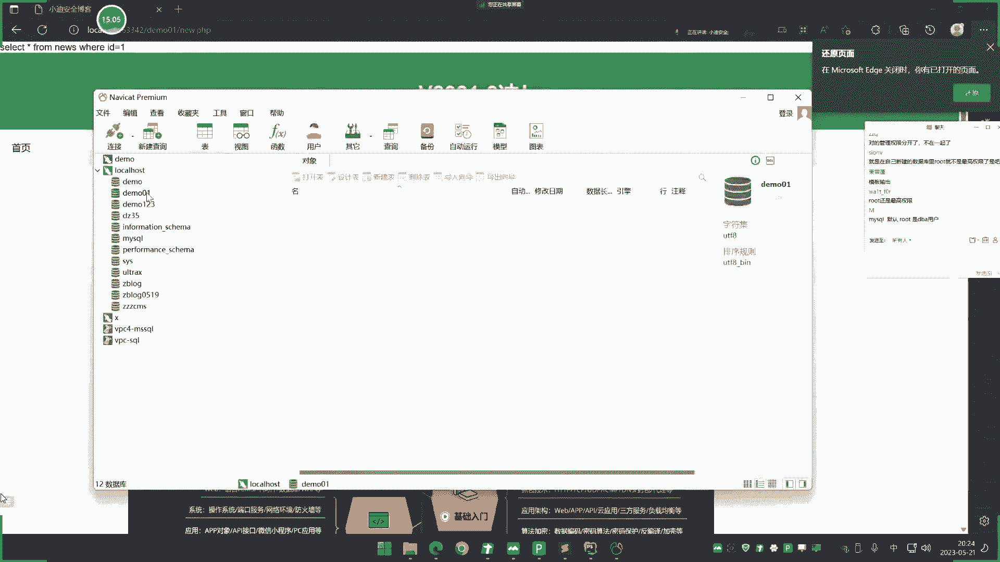
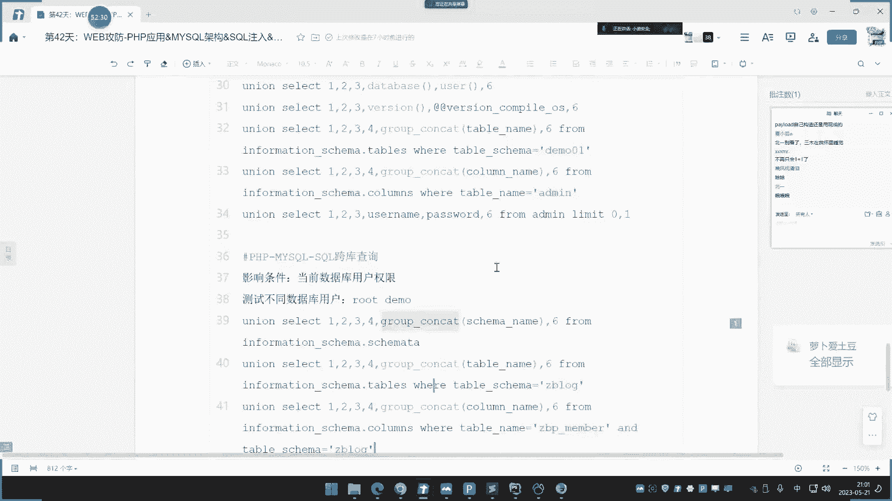
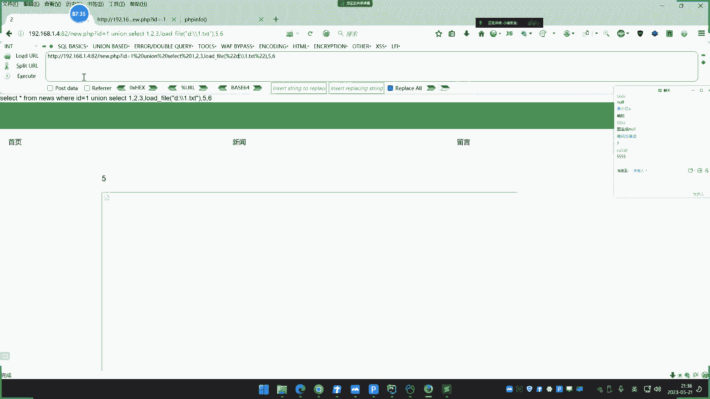

# P42：第42天：PHP应用&MYSQL架构&SQL注入&跨库查询&文件读写&权限操作 - 逆风微笑的代码狗 - BV1Mx4y1q7Ny

是讲这个挖宝课程的第二次直播是吧，依旧还是我们的低端课程，讲的是这个pp的，那个pp的这个应用方面的安全课程呢，还有好多节，因为它上面漏洞的还比较多，也基本上大部分都那我们从PPT上面去演示。

那后面再讲其他语言的，像JS的呀，java的呀是吧，就好好讲多了，因为有这个pp，先前的，就把这个漏洞的一些原理呢搞清楚之后呢，在这个漏洞呢，在不同语言中呢会有一些简单的一些差异。

除此之外那就没什么太大差异了，那后面呢再了解其他漏洞时，那就给快一些了，也不是说后面那讲的少，是因为那前面一些着重的基础部分讲好之后，后面的东西就是吧简单一些了，那么现在我们来看一下这个。

今天讲的就是讲这个pp里面的第一个漏洞，是SQL注入，这个SQL注入呢，我想想啊，如果说把它讲的很全面，那大概就是三次呃，讲的全面一点，那就是大概是3~4次直播的样子，四次直播吧，应该是是吧。

如果加上前些年，那就两次直播，感觉那粮食怎么解决这个呢，我们是要看大家的一个情况决定啊，呃为什么要讲的少，为什么说不讲多一点呢，是因为啊这个牲口猪呢，就像很多人说的，他这个，东西啊是吧。

不再像以前了比较多，现在的比较少见了，那有没有花大气力的时间呢，去把这东西呢了解清楚，有没有必要性啊，有些人觉得有必要，有些人觉得没必要，所以这也是为什么这个课时呢是吧，是究竟是两次直播讲完呢。

还是一次直播，是四次直播讲，对不对，好我们这里呢来看一下这个pp这个东西啊，那么pp里面一般他的一个搭建的一个组合，像上机器科呢这个SP的，我们那就浅显的给他入门了一下，这个阿克塞斯的一个数据库啊。

杰克呢是pp，那后面呢像这个java呢，我们就不接上MYSQL了，就java的时候呢，我们再接上这个oracle数据库是吧，因为这个MYSQL数据库呢我们在PPT里面讲了。

那如果说在讲到java那个数据库注入的时候呢，我们就联动那个oracle数据库，那么这个pp里面呢啊经常都是和这个MYSQL联通的，那么现在在讲课之前呢，我们先给大家把这个架构的一个模型呢。

给大家交代一下，就说一个网站搭建起来之后啊，这个服务器上面呢去安装有这个MYSQL数据库，对不对，安装有这个MYSQL数据库，那么同样这个服务器上面呢有数据库的话。

如果说这个服务器呢它可以去搭建一个站点啊，也可以呢搭建多个站点，就像我们这里呢用pp去演示的时候。

经常会用到这个啊pp study啊，或者什么保胎啊这种软件呢去集成搭建，那么在这个pp study上面，那大家都可以看到啊，在这网这边呢，他给那新增几个网站啊，他他自己呢是可以新增几个网站的，啥意思呢。

就是说啊你给他搞多个啊，一个一个绑定就很简单的道理啊，你比如说像现在啊我们就可以是吧，这这这本地搭建啊，本地搭建那个域名呢，我们就用的是这个IP地址，如果是真实情况下的话，就有可能是网站域名了哈。

然后这里呢有个1。4的IP地址吧，我在这里呢我就把它指向为这个叫z blog，这个目录算我们这边简单的给大家理一下啊。

什么情况啊，你们在搞来看一下啊，这个这个拔一端口是吧啊，这个呢就是玉米拔一端口的，然后这个是对那个z blog是吧，这log那个目录啊，就这个目录机子我给他记录一下是吧，这是他的一个东西。

好额这是他的疑点，那我现在啊你可以看一下，我们现在呢就可以了，再添加一个是吧，那比如说域名呢，我们就也是搞个一样的。

但是把端口改一下，因为我们这里是本地环境，所以就没有真实域名啊，把它指向到这个，比如说这个盗梦领域里面去啊。

解决下这个版本呢选7。0版本，5。45版本啊，这个无所谓的啊，先选这个吧啊这个八二版，然后这里呢是拔号端口是吧，把然后然后呢指向的一个目录呢，我们可以看一下啊，是这个路径。

好对吧好，我们现在呢这是一个相当于一个域名呢，对应一个网站目录，就是这里呢是一个网站，那这个呢又是一个网站好，那这是一个网站域名对应关系，那么数据库里面啊，我们可以看一下，打开这个网站目录啊。

啊这套网站目录，然后呢在网站的源码里面呢会有个数据库，配置文件里面呢就会有这个数据库，那么其实就是说它上面这个网站的数据呢，它是存放在MYSQL里面，存放在MYSQL数据库里面，他有可能是这样的。

就说root啊，用户，数据库录入用户，然后这边呢也是数据库用户用户，对不对啊，这是他的一个那个，然后呢有个这个数据库的名字，比如说名字就叫c blog，然后这个名字就叫DM01好，这是一种架构。

这是一种架构，这种架构呢我们称之为什么架构叫统一数据库，统一管理，统一管理的是采用这个root用户来统一管理的，root用户，那是MYSQL里面的一个最高权限的用户，看就是在MYSQL里面呢。

有这个lea值的这个管理用户，那其中这个root呢，就是默认的这个数据库管理栏中对吧，那像我们上节课这个a asp里面的，这个什么access斯呢，它是无数据库用户的，所以当时我们在讲的时候呢。

说他和后面的一些这个其他数据库的注入呢，还有些不同，就是不同，在这里这是他第一个不同好，那这是他的一个大概介绍，那这是第一种方式，还有一种方式，那就是我们这里呢可以把它copy出来。

还有一种方式是什么方式呢，就这样方式就是不同用户，什么叫不同用户呢，你比如说像现在啊这里就改了，改了个名字，也叫这BLO，然后呢再改个名字，这里是叫个DOM。

那么这个是怎么搞出来的呢，那给大家看一下啊，在打印的时候呢，你看这里呢像这里呢是可以点击呢创建数据库，然后有个数据库名称和一个用户名和密码呀，那么也说你看这里啊有个数据库名字叫DOM。

123用户呢是多么密码呢，是多么1+3，还有一个呢是root，就是默认的啊，密码是123456，他可以怎么办呢。

就说它可以让这个网站呢绑定这个数据用户，那么就是我们说的啊，乙管理，乙管能不能理解呀，就说你自己的网站就会单独啊，简单来说就是啊自己的这个网站呢，单独的创建一个这个数据库用户啊。

去管你自己的这个什么数据库，而这个呢就是说每个网站的这个数据库呢，都由这个什么root用户统一管理，对不对，它会有这么一个差异在里面，好那这个数据库用户是内置到MYSQL里面的。

也就是说他们其实这个所有数据库啊，都是在什么，都是这个网站上面的所有数据库啊，都在MYSQL中，然后呢有这个什么root或者是什么这个单一啊，一对一的这个什么用户呢，去管理。

就说他有这几种方式去选择这个呢，这样一讲，大家能不能明白这个架构啊，就是我们说的这个网站，如果说用PPP加MYSQL去搭建的话，那么他就会有这两种选择方案，第一种就是我们说的啊啊比如说网站A。

那这是网站A是吧，就是我们叫做网站A的一个模型，然后呢这个是网站B的模型，前面是代表域名啊，后面呢这个代表这个，东西是好东阳，道理呢也可能还有王子C王子D都有是吧，就有这两种模型。

那我为什么要先把这两种模型先给他看到，就是因为呢这个模型不同，你在租的时候呢，这个思路和方法呢就会有所不一样的地方，我们呢也会说一下，这种东西，在实战中如何判定它是第一种模式，还是第二种模式。

我们先把这两个模式记住好，这两个模式讲完之后啊，我们用这个打字和大概的一个这个呃，上面那个操作呢给他演示一下，我问一下大家啊，这个东西呀，那能不能明白呀，就这个这个一个架构啊。

就是我们说这个MYSQL加啊，pp加MYSQL的一个搭建的一个是吧，他这个这个管理模式是吧，是用这个root还是说采用不同用户的单独去管理，就这两个啊，其实呢就是两个事情。

一个呢就是说都给root用户去管理，那么还可以是自己在创建一个用户的单独管理，那么也就是说网站A呢是自己管理自己来，简单来说啊，这个单独管理呢我们可以把它写清楚点，大家更好理解点是吧，就是每一个网站啊。

单独呢去创建一个什么数据库，用户来管理自己的这个数据库，就这个意思对吧，那么这个root用户和这个这个普通不普通用户的，普通用户啊，都是啊MYSQL的这个内置的来啊，这里呢我可以简单给大家说一下。

就说呢这是个MYSQL是吧，然后呢他下面呢有个默认的RT，然后呢在这是默认的啊，就自带的，默认的是吧，然后呢现在呢有个什么网站A，然后呢它下面的数据库名呢，比如说叫这个test a对吧，这是一个网站。

然后呢又一个网站B好，然后呢再搞个test b，对不对，这这种情况还有一种情况呢，这第一种啊，第二种呢就是这种是吧，他在这里那就不用root了，他就创建一个什么test a用户。

然后呢在它下面呢就这个东西，然后呢接下来他才要创建一个，test b用户哎，来去这里呢搞这个网站呐，这就是刚才啊这个上面这个东西的一个模型。

就是说第一种呢是呢就是这种情况啊，就这种情况，那第二个呢就是我们看到的这个什么，这种情况走吧，这这个把这样一搞哎，大家应该就更清晰了，我希望大家先把这个搞清楚啊，这个搞清楚之后呢，那个猪猪讲的话。

那个点的就好清楚一些啊，那后面那都是什么手法了，就是说怎么租入的问题了，因为你在租的时候呢，取得结果是固然重要的，但是你要知道啊，那个怎么样取得结果呢，很会和你这个后面的思路呢挂钩。

这个就要看这个模型了哈，好这个理解了能能不能理解啊，理解了我们就讲下面了啊，我给大家啊，不理解就赶紧问，我们讲了就不会再讲了。

后面都没有这个事情了哈。

好那么接下来呢我们就来看一下啊，那么在讲呢我们就拿我们之前呀，我们不讲pp开发的时候呢。

啊如果说你最近前那也刚好也看到了啊，你就可以关照一下，这是我们之前呢在讲pp安全开发的时候呢，给大家写过的这个几个代码是吧，就是在安全开发里面写的，我们就用我们就用我们自己写的这个东西啊，去给他过一下。

比如说这里呢有个叫60点pp，这是我们之前自己写的是吧啊，这里呢用到一个六点ATM的一个模板，然后呢包含一个CONFAKER点pp，这个CONFAKER呢，就是我们说的这个包含数据库文件的一个东西。

然后呢这里呢解出一个变量id啊，如果说有接收值的话，就给这个变量，如果没有接收值呢，默认把它当做是一，最后呢执行一条SQL语句，拼接这个解释过来的IDE变量啊。

最后呢再把这个SQL语句呢给大家进行一个执行，执行之后呢，把结果进行输出，这是我们那个之前写的哈啊我们这边可以打开，试着给他运行一下啊。

这个就是我们当时这个给他写好的啊是吧。

来看一下啊，你看这是啊，默认等于一，就说我这里呢不加上问号id，它也默认等于一了，那这是输出的语句，这语句呢实实战情况下它不会输出啊。

只是我们这里呢给他提示一下哈。

那你看啊他这就是我们那个输出的个情况啊，那么这个输出的情况是数据呢从哪来的啊，来我们呢对应的把这个数据库呢也打开，简单先把数据库的这个注入原理呢简述一下，虽然说上节课讲过是吧。

但是上节课没有代码的一个辅助呢，这节课有代码辅助，那就更好理解呃，首先我们看一下啊，这个这里。

然后呢他这个查询的是什么东西，你看下啊，他查询的是这个60i id等于等于一的。

那是这个I等于一呢，就是这个呢小羊犬博客啊，小的培训开课了，一个什么V2021杠三冲，好乖呀好，这是我们选定论，你看是不是就是这几个地方，然后这个图片那就是来源于最后面的这个什么，来这个图并地址。

那这是我们说的这个情况哈，那后面再加上这个问号id等于R，那就说等于R等于R，那就是下面这条嘛，这IDR的数据就是萧瑟迪的安全博客，肖老师开课了，非20231冲，然后明内容呢就是吃瓜了，图片他不改。

我们看一下啊啊标题就变成萧瑟的安全模块啊，再然后我这个东西它变成20231杠一，再就是吃瓜肉，对不对，这内容就会这个这个东西对应上了呀，那么如果说你选择id等三呢是吧，然后这里就没了。

是不是因为呢你数据里面就没了，比如说像现在呢我们就写个什么，写个数据到里面去，是不是呢，你比如说啊把三一改是吧，我再搞个什么是吧，小蛇的对不对，小小蛇的封建博客，对不对，再搞个非2023杠啊。

非2024杠一，中啊，好然后后面这个东西呢就搞一模一样的是吧。

好你看啊，现在的高层有了，我们再刷新下页面，你看是变成了呢2024，从西瓜肉，然后呢标题变成小蛇I了，对不对，好大家知道这个流程了啊，这个就好简单了，那么也就是说这个id值呢到这里呢，他就提示是个娱乐。

就这样执行，那么很简单的道理呀，呃我们这里那就可以拿出来对比一下了啊。

这是他的这个语句啊，访问这个地址呢地址呢一一对应过来啊，这个访问地址就这么一个关系啊，执行SQL语句，那么大家想一下，你想一下，我们呢这里呢可以把这个SQL语呢。

复制到这个当前的这个工具上面呢，来模拟提交项，就比如说我们现在输入这个鱼一样的道理啊，执行之后呢，它输出的结果呢，就和我们那个网站显示内容的结果呢是一致的，然后呢网站取出这个内容呢。

放到相应的网页下面的去显示，形成我们这个页面是吧，嘶那我现在如果说在这个山后面呢，我们去写上一些东西，比如说像什么这个数据库里面的一些内置语，像这个联合查询，un un l snack这种东西啊。

我写这个东西呢是为了干嘛啊，看一下我执行呢，比如说这里呢下面有个数据库，我们看一下啊，它下面有个表表明的叫enemy，我私人呢去查询一下，for一下这个enemy是吧，然后呢勾然后呢他选什么东西。

然后呢我在二和三这里面，我选上username和password这种地方去去写，写完之后呢，查询数据里面的书写了AEM和123456，小D和小DAC这个数据从哪来的，我们打开enemy这个表。

里面就是这个username和password对应着两个值，就会在刚才这个语句中，结果你去显示，那这个堆法就是什么意思呢。

那么大家试想一下，如果我在这个上面呢取这样一写，写了之后呢。

我在上面去拼接，像刚才这个语啊，我把这个语句呢拼接到这个后面来的话。

那么时不时我如果说访问这个网站的话啊，哎我访问这个网站，我这样去访问这个网站，那么是不是这个语句也会对应的，去接收后面的数据，同时呢SQL语句执行，那么执行结果会不会就是，和我们这个显示一样呢。

那么现在呢我们就来做这个实验来看一下是吧。

去访问这个地址啊，先不要说这个东西为什么这样写来执行。

你看是出现了这个销售点SECR，你可能说还有个东西呢啊，那我就把这个username呢换到这个五这里来是吧，看一下来小D小DSC对不对，后面呢还加上个limit。

零杠一好，默认没有，再看一下呐。

阿德米耶35也出来了，好你不要问上面怎么写的，为什么那样写。

这先不管它啊，那我这个呢就是典型的circle注入，所以说这个猪呢其实非常好理解，他的这个理解程度呢，上节课已经说了，那这节课呢我们重复再说一遍，其实呢就是因为啊对于结束的数据呢，它没有过滤。

直接查询到数据库啊，就说结束的这个，参数值啊，为这个进行这个过滤啊，直接，代入这个SQL查询的这个操作啊，就是这个SQL注入的能力，那么后面攻击它的话，攻击的这个东西呢，其实就是利用SQL语句。

执行你想要的东西，这就叫攻击，那么与此同时，一句话很好理解，SQL语句能干嘛，对吧，SQL语句能干嘛你就能干嘛，大家再来防一下啊，那么既然SQL语句等于干嘛，对不对，那么什么SQL语句又由谁决定呢。

是不是就是数据库类型，这里面，这个好理解吧，那么这也是为什么啊，为什么呀，对不对，MYSQL注入什么，这个oracle注入对不，Inner，是不是就通了呀，是不是这个意思啊，大家看一下这个逻辑。

一想是不是就这个情况，还是理想嘛呢，他是这个查询，然后呢产生原理，那么也就是说啊，你这个是执行查询操作嘛，那你后面加上其余的也是SQL语句，那么你接上SQL语句的话啊，你去攻击他。

那肯定就是利用SQL语句来搞你想要的东西啊，你比如说我要查什么东西，那就SQL语句怎么写，那他自己怎么写怎么搞，就是用SQL语句啊，但是不是说你所有SQL语句你都能乱写，你想干嘛要看他支不支持啊。

是不是它有些功能它这个SL语写不出来，比如说你想要这个SQL语，这个搞个什么执行命令，它行不行呢，它没有这个功能，你说它咋行呢，行不了啊，所以说具体他能干嘛，你是要看它支持哪些SQL语句。

那每一个数据库的SQL语句的支持的功能呢，它不一样，有些的能支持这个是吧啊，进行一下文件读写都可以，而有些呢他不支持，他没有这样的事情是吧，所以说呢数据库类型决定了这个SQL语句的功能。

而功能呢又决定你的攻击的危害，所以说为什么呢，要把区分成什么各种数据库的注入，怎么mysql oracle，就其实呢就是熟悉这类数据库里面的SQL功能，和SQL注入产生的影响，就这么个情况啊，好。

那么刚才呢我们通过这个呃查询呢，得到了一个什么另外一张表，艾德米的这个内容就是这个艾德米，那就是模拟的是我们这个管理员的账号密码，然后呢，我通过这个猪呢拿到这个enemy这个这个内容。

但是在拿到的过程中，我是直接看了这个艾德米的名字，包括艾德米里面的什么，像这个username和password，这是我们自己看的。

是不是啊，我们看到的，然后我们把它拼接上去的，就说如果你不这样写的话，就看不出来，所以呢在真正的实战情况下面，如果没有源码和数据库的这个东西的话，它是分为几部的，分为哪几部呢。

我们先来看一下这个MYSQL的一个架构啊，首先呢这是MYSQL数据库，它的上一层我们就看不到了，就是安装到上面的，然后这里面有个叫什么连接上去之后，这里有什么多么多么尼尼。

还有什么多么123dz35mysql z blog，那其实就是一个个网站的，就比如说这个z blog，那可能就是我这个网站上面呢，在这边呢搭建的这个目录，下面的一个站点叫z blog，就好比到我们下单。

你看啊，我访问一下，81号端口的，那这是我们搭建的呢，搭建那个网站，然后呢，我们现在这个网站呢是82对82的，这个六四点pp哎，是输入60点pp看一下啊，我刚才指向的目录是这个DOM01里面。

好六六点pp。

诶第八行有问题啊。

他说这里有问题。

烦烦什么车，不要老这个说什么翻车翻车，你这个说习惯了也不好啊，哎他这个原因呢，就是因为我们这里演示的是另外一个目录的，一个东西啊，这个是多么零一的，我们是演示的是DOM里面的吧。

好像是我看下我那个是哪一个目录的，哎我这里是多么是多么泥呀，这还真是奇怪了啊，有点pp他这面可以啊。

应该是这个里面这个路径的一个问题，好那我就直接在正面去访问吧，这里卡文官访问。

好啊对，可能也是pp的版本啊，这个不管他啊，我把pp版本换一下也可以。

嗯刚才这个地方是吧，把逼他的BB版换一下，刚才我搞的是那个五版本是吧，换一下啊，七版本试一下应该就好了。

看看果然就好了是吧，大家看到啊，好了啊，就那个版本问题，版本那个代码的支持出现意外，刚才是五版本，五版本不支持那个写法啊，我们当时开发用的是那个企业版本的开发啊，嘶好这个出来了啊，来让大家看到了啊。

然后现在呢就说它的架构呢其实就很简单，好我们呢可以把刚才那个笔记拿出来。

那这是他的一个架构是吧，那么现在呢这个MYSQL里面呢它是有几个等级的，就像现在呢我们可以呢，这个MYSQL下面呢就是数据库的名字是吧，数据库名字，然后呢一个数据库名。

还有一个呢就是这个数据库下面的这个什么，我们称之为叫表明，然后表明下面有个列名，列名也称之为叫字端啊，有的地方叫字端，然后呢这个是数据，然后这是数据库名A比如说这里啊，然后呢他可能下面那new另外一个。

就像这里呢是吧，这几个东西哎，是吧，嗯他有这么个几个事情的一个情况架构哈，那么其中这个呢，比如说我们就叫那个什么东西啊，好那现在呢我们最重要是得到这个数据，那个数据呢怎么得到呢。

是要先通过这个这个这个慢慢得到呃，在前面在讲access斯租的时候呢，我们是靠的是什么猜的，就前面access斯租的时候，那大家还没有印象那个用SMAP的时候，那是call的是什么这个支点去拆的。

然后在这个MYSQL中呢，靠自己猜就是有可能的猜不到这个什么表明，那么以前的这个access呢和这个MYSQL呢它就不一样，access可能等级呢就是相当于会低一级的意思啊，唉说不讲基础啊。

这些东西呢不讲呢，有难的听懂，哎还是得讲啊，那这是access那个结果，所以阿克塞斯的结构呢要比这个MYSQL多低等级，其实呢这个阿克塞斯的顶级呢就相当值得一级，就是它单个的。

就是其实他就是单个的一个存储是吧，单个那买MYSQL里面的，就是把它把它每个单个的放在一起，统统用MYSQL管理，对不对，是这个意思哈，然后呢，这是它的一个结构啊，哎呀你们基础说实话真的很差很差啊。

你说这个东西呀，我说实话呀，这讲太多呢，觉得有点浪费时间，但不讲呢完全听不懂，不知道咋个讲，刚才有人说有什么鬼，只有一个表，这咋可能呢，我写的这个表，那是它的加构，不是说它只有一个呀，那咋想的呀，这。

难怪说你没有鬼，关于基础number one的那只讲基础呢，那怎么不是基础number one呢，那你看这里啊，这是这一集这几个东西就相当于是数据库名字，能理解吧，这是数据库名，然后到里面一级。

比如说打个demo，然后这里表这不是有三个吗，这AD德米p r o n news，就是相当于是我们说的什么表明再打开里面的，表明这上面的username和password，就相当于是我们说的联名。

这个id就相当于是我们的列名也叫字段，其中的艾德米什么小迪这几个，那就是我们说的数据能不能理解啊，这是我们说的表明联名字端，这个意思的一个情况啊，不要再说了啊，这个东西呢我们不要再老这样重复讲了啊。

那这一集这个下面呢我鼠标划过来，在这一部分R呢，多么这个下面这全部叫表明表明进去之后，这里就是呢他不写了吗，表就是里面的什么啊，前面是数据库名，这里是表明这三个是表明打开里面进去之后。

这上面的这个索引的值叫做联名数据。

里面的数据叫数据啊，也叫字好了，搞清楚之后呢，那么现在看一下啊，如果我们最终目的想想清楚，目的是获取这个数据啊，获取数据，那获取数据呢肯定就是有几步的呀，先得到这个数据库名字是吧，再得到这个下一步是吧。

一步步得到信息，而在access里面，access里面呢我们采用的是字典去猜，就是完全拆这个表再猜你，所以呢access注的时候呢，就会出现猜不到表明或猜不到联名情况，因为它是靠支点去猜的，能理解吧。

这个字典如果说他把名字改变了，所以你就猜不到了，那个字典里面有就猜到没有就猜不到，那么在这个MYSQL里面呢，它就不一样了，MYSQL里面呢它有个东西。

有个内置的，就是安装就会有的，一个叫information s c h e m a的一个东西，那么这个东西呢它是干嘛的的啊，它是一个内值的一个存储信息，我们可以打开给他看一下呢。

这是MYSQL里面它有个自带的那叫information s c h e m a，打开里面呢有几个表，我们来一个个介绍，其中一个表叫做SCHEMAGA在哪里呢，找到它啊，就这里啦，就这里我们打开一看。

这是干嘛的啊，打开一看你可以看到啊，这里有什么，你看这什么东西啊，这这一行呢，这竖行是什么东西呢，这是不是我们所有MYSQL数据库，上面的所有数据库名字啊，是不是就这边的这一长条的鼠标滑动这个地方。

来我们可以截个图给大家看一下，那这块区域的值是不是，就和我们这块东西是一样的，大家看一下。

好记住下它的名字叫什么，S c h e m t a，那么我们这里看一下啊，information点SHEMTA记录数据库名，清晰的表，没问题吧，这个点代表下一级的意思，什么叫下一级呢，又优先不懂了啊。

啥意思呢，啥意思啊，能不能明白这个东西要不要我讲讲了就讲啊，后面我不明白，我就不讲了啊，讲不讲这个点，R是什么意思啊，不明白呀，那我就知道是吧，看一下啊，好我们看着啊，大家看着啊。

我现在在localhost demo领域这个这个表啊，这个库里面好，你看着啊，我在这里面，对不对，好，我如果说现在我要查询这个z blog里面的JBP，memo这个语句该怎么写呀，来看着啊，查询什么。

是不是查询J比P，然后下划线mono，是这样写吧，这样写对不对呢，不对，执行报错，为什么他说在table里面DM零一下面点不存在，为什么，因为你是在demo领域下面，如果要查它怎么办，前面加上ZBG点。

那么他就知道这blog是一个数据库名，来到这里点下一级就是表表，这里再查，这不就出来了吗，点代表下一集，前面就是数据库名字，后面就是标明，能不能理解，那么这是这个解释，我刚才查到的这个。

这个information这里啊这个SCHEMA对吧，这里有记录这个表的吗，那那么看一下呢，这是记录数据库名信息的表，没问题吧，点代表下一季吗，前面是数据库名字来好，这是这个表明下面的值。

再来看它下面的另外的还有叫什么table s，打开你看table s，table s里面看前面啊，那前面是information，后面是table name，我们来看一下啊，找到我们那个这太多了啊。

你看有这么多，那你看啊有这么多，你看这啥东西啊，前面是数据库名字，后面是它table名字，table名字是什么，表明我们可以找一下那个多么的啊，找了多么的，你看找到了啊，那多么的多么零一。

多么零一多么零一里面有什么，A等于g box和六四，是不是在后面，enemy g box news就是DMI1里面的表明呀，那么这个名字叫tables，这里就是不是什么记录表明信息的表啊。

里面有这个所有数据库里面存放，表明信息的表啊，刚才那个是记录数据库名字的，然后这个呢记录表明的名字的，那还有个叫联名名字的，因为在我们这个DM领域里面，三个表达艾米对不对，然后呢你再找到什么。

CEO开头的那个东西呢，那这个就更多了，其中呢就有列米，那我们可以再翻一下DOM的，那看多么零一的，你看啊都不零一的呢，60里面有id，有这几个，你看上面admin里面有什么id，Username。

Password，是不是就这两个，打开来又name password id来，啊来源于前面是数据库的名字，表明它里面的列名三个值对应上，那这里是不是记录列名信息的表啊，搞清楚了吧。

好我不给他介绍这个东西干嘛呢，相当于就是说这个information里面就存储有数据库，名字表明和联名，那么我们在如果在租的时候，我会不会像这个access一样用字典去猜它呀。

不用啊，为什么我是可以通过查询information，来得到我想要的信息啊，因为我得到数据，得到数据的前提是得到表名和列名，那表明列名我怎么知道他是什么东西，他怎么写的不清楚，access用字典去猜。

那MYSQL呢有有这个information的，所以他就怎么办呢，通过查询new information里面的信息，来查询我们想要的数据，那么接下来我们就要做这个事情啊。

在这个事情之前呢，呃有很多基础我们就不再累赘了啊，比如说像这里啊，这个猪的手呢。

这个黑客八我也没有安装上来呀。

这黑客八我看下啊，有那个啊没安装，那这里，就搞个那个，做活的吧，嗯装了黑哥吧，好理解一些啊，好看一点，那个语句通顺一些。

没有装啊，我这个没有装这个插件，那是用这个火狐自带这个东西来来看吧，这样子输的语句呢看得清楚一些啊，大家看下啊，首先呢他一般在租的时候呢，先要看一下order by这手工注入。

当然你也可以用工具先把手工搞清楚，这order by new代表什么意思，溜了正常骑，那就不正常了，那这个为什么是new呢，他是查询数据库里面查询的是六十六十，里面有些什么id。

一个两个三个四个五个六个，他这个new呢代表的是那个字段的这个个数啊，就有六个，那么这是六，那么在实战中你肯定不知道，就是后面那把数字不断变编导，中间间隔正常和不正常，就取那个正常值U增长。

取六齐步正常是吧，那就肯定是去六了嘛是吧，好得到new之后呢，再用这个语句呢这样去敲啊，也不要问为什么，因为这是那个SL语句的写法，所以说啊你就这样写是吧，当然呢这个写呢，你也可以用这个网上弄插件是吧。

一次性的把它搞，那我这里呢不建议，因为呢就自己写了，就得也不要多长时间，你看这里呢就可以写一个是吧，这个查检是吧，这里有这种注入查检啊对吧，他写个六个是吧，他自动的就把你这样搞清楚了是吧。

哎我们就不搞不搞这种事情是吧，自己写啊，好那这里呢就看一下访问一下，访问下来之后呢，如果他这里呢已报出数字，如果没有报出数字，你可以在前面呢加上一个减号，然后报错，报错之后呢就会报数字，如果没有报。

那就报错包了之后就不用加了，那包出四和五，还有这个那这个标题也不报错个二，那就代表啊，45R这里呢就可以进行这个查询了，那么我们就把我们查询的数据呢就写到这来，那一般会查询哪几个数据呢。

啊今天给大家介绍一下啊，嘶呃一般会MYSQL里面查询，就像这个版本的查询数据库版本，然后呢数据库的用户，包括操作系统和数据库名字，这里为什么查询这四个我都写的很清楚了，版本是要看这个东西它有没有。

因为这个东西我没醒，就是我们刚刚说的，它是记录数据库信息的这个表，就进入数据库名字啊，表明呀列名这些信息的一个库，那么但是他有个条件就是大于5。0的版本，那么如果你在看版本的时候，这个版本的不大于5。

0，那这个东西就像是会失效，那么为什么要看这个用户呢，这个等下再说，操作系统呢就是要告诉你啊这个呃路径，这个存储路径，包括你这个代码的这个主语句的大小写，都要注意。

因为LINUX那是对这个语句的一个大小写的，是敏感的，windows不敏感，如果你知道他是LINUX的话，那么你在写主语句的时候要特别注意，大小写都是敏感的，一个小写。

可能一个大写就会可以把这个语句都搞错，所以说呢这查询这些信息都是有用的，包括这里呢这个数据库的名字就是很简单。

我们不是要查询数据吗。

要查询这个数据吗，那么第一步是不是要查询这个数据库的名字啊。

所以说这几步都要啊，我们就依此来给大家去查询一下，就利用这个点这里啊，比如R这里呢我主要显示这个版本，然后四这里呢我就让它显示这个database，就是查询数据库名字，五这里那就查询这个什么操作系统。

来执行一下，你看数据库名叫demo01，win操作系统是windows64位阿，这里显示5。7。26出来了呗。

是吧，记录好了啊，把三个星期都除来了，来order里显示版本数据库名操作系统哎，那么在这里这个查询之后啊，那这个语句就是这样执行的啊，这个就是内置的那个查询的语法，也是SL语句里面内置的那个语句啊。

你不要我为什么这样写这个规定的啊。

好得到这个多米尼，那这里呢我们就缓过来看一下啊，就是相当知道这里了，他的名字叫多米尼，是我现在要查他的这个表啊，我查这个表啊，就是我知道这个DM零一下面有哪些表啊，我要知道啊。

该怎么搞啊，简单该怎么搞啊，来把语先写出来，写出来呢给它翻译一下，For information，tables while条件，Table，看一下啊，这是在语句写法，来大家看一下啊，为什么雨这样写。

大家看一下啊，查询information scar tables，这个代表什么意思啊，翻一下笔记，刚记录的记录表明信息的表，对不对，记录表明信息的表没问题吧，好那那这里呢再来看后面的条件。

Where table scar，这是什么东西啊，来我们看一下刚才的数据库啊，找到那个查询表明了在这里嘛，那我要查这个table name，是要查这里面的这这这这这的。

比如说我要查这个这个刚才是个多么零一，我是要查这三个子弹呢，艾德米基伯克60，卧槽，这30后面的table scr是什么，你看这个列名是写的table scr呀。

我查information下面的点tables，就是来到这个表，然后我要查这三个数据，我要把指定一个条件呢，不然的话这么多数据你知道是哪个呢，是我要告诉他，table scar等于。

ta啊等等于这个多么零一的，他才会显示这三个呀，是不是这个意思啊，那么这句话的意思就非常好理解了吧，查询table name来查询这个table name值，从这里查查查看。

里面存储的是要查获取这三个值啊，那么我这里的告诉大家，我查table name来源于这个information，他们tables，那就是这个表嘛，那就是那这个tables表，对不对。

好条件是这个联名等于都没零一的，那固定好，这个就三个地方了，但是就是只有这三个值了，就固定死了呀，不然的话你不固定的话，他不就查的，不查的不就是整条吗，好理解吧，好不好理解。

我要告诉他是table01啊，对对对啊，多么零一啊，因为DM01是我刚才获取的数据库名字啊，我要查DM零一下面的这个表明啊。

所以这条语句呢就好理解了，那我给大家简单写一下啊，这句话的意思啊，查询这个什么动令仪下的什么，就是我们说的这个数据库名啊，动力一下的什么，这个表明信息啊，然后呢接触的是什么，对不对，好。

我们来把运行一下，把这里呢运行好，显示个60，那可能有人问了，咋是60啊，不是三个吗，不是有这个埃德米啊，吉伯克啊，60吗，那这里呢加个参数啊，加个GRAP，coco NC a t把它括起来。

就是全部显示的一次执行，那是不是三个出来了。

好出来之后，从这个名字上面去理解哪个最重要啊。

艾德米最重要，所以我就把艾德米呢当做我的固定对象。

要查他了，我就不查这个GBK和news的，因为这两个从字面上理解信息不对，我不重要，而那你呢可能是管理员的好。

那么艾米查了之后，我们是接下来要查他列名啊，就是相当于说我现在知道知道哪个星向。

是不是存储到这面的信息啊，那ADD me下面的这个username和password id3个东西啊，是不是要查这个东西啊，因为我要知道他列名怎么写，我才好查下面的数据，我才一一对应。

如果说你名字都不知道，你怎么查他的数据呢，所以接下来就查天天的信息，那么简单来说啊，这个语句该怎么写呢，大家看着啊，写两个条件。

写两个条件啊，语句简单修改一下就行。

我先写到这个上面给大家看一下啊，首先这里呢查询联名信息组成表，刚才是查表明其组成表，我是要查联名信息的，选上去，然后这里名字要改了呀，查联名信息就变成了c o m m u n name。

这个name来自哪里啊，来看这里是不是插在这个地方的来，然后我再把条件一固定，那我查这个信息的，是要查这个呃，跑哪去了，对这里就查这三个嘛，看一下啊，那就33个吧，三个有两个条件呐。

一个run它table name m等于admin，一个run它tab sc等于多M01，那怎么写啊，后面就是不是will table scar等于多么零一，并且安的table name。

就是代表了表明刚才那个是数据名，这个代表表明的意思TM等于什么ADM，然后这里是写好呢。

好不理解这个，这个意思就是什么，查询多么零下的表明ADAM米的，VM运行，然后接触查询的是verse，有没有问题啊，到这里有没有问题啊，那获取联名信息，从存储列名信息的表里面获取给他条件。

数据库名称多么零一表名称ADD0，那么就把这个三个字不取出来了，因为刚才的二代米和这个多米尼尼，都是上面获得的，是获得的呢，从上面获得多米尼和阿德米亚，你不要说为什么这里是艾德米亚，这是多么令亚。

不要问这种东西啊，我怕到时有人搞不搞不清楚，他问这种东西，是吧。

没问题啊，来我们试着去执行一下，看一下是不是啊。

那你看是不是出来了，Username password id，那么既然这里列名也知道了。

我就可以怎么样一步到位了，可以这么一步到位的，456four n米的呀，直接for它呀，然后把四和五这里改成什么uname password就行了，我前面所有的操作都是为了这一步。

就是我要知道你的列名的名字和你的标名名字，我才能一步到位，如果我不知道我该怎么写，查不到啊，那是出来了，然后呢，如果说这有DOTA数据，就可以在后面加上limit，零杠一代表第一条。

然后零杠二代表第二条，如果这里也要增长，前面加个报错，就在这里要写个减号，那艾德米加356，在零杠二，第二条是两条信息都出来了，那就是这里获取的就是什么哎这两条数据嘛，然后零杠三就没了是吧，他就报错了。

对应该上还有应该四呢，还有为什么，因为这个后面呢用这里取代，这里再加个一诶，报错了哎，什么鬼，啊这报错了啊，就是改变这个limit呢，来去看一下还有没有数据，当然呢也可以写个条件是吧，写个什么。

while这个id等于的，就是获取id等于一的这个数据啊是吧，然后呢while i id2的数据对不对，然后获取到id3呢，他没有了，就把我没有了是吧，报错了好理解啊。

那么这个就是一个最浅显的一个MYSQL的一个注入，他是不是就比RKS要智能一些呢，就是因为他有INFORMMAIN这个东西，我们那就不需要借助这个东西了啊，有人会问他，那如果这个MYSQL不大于5。

0呢，我告诉你啊，现在没有可能说不大于5。0，你碰到的九十九十%的这个东西，都是带5。0，因为5。0这个版本在几年前就出来了，四点啊，就5。0以下的版本，那是10年前用的产品，你现在很难碰到好。

那么接下来我们再看第二个支点，叫做跨库查询，什么叫跨库查询呢，就是和我刚才讲的架构呼应上了。

来，我们看下上面啊，我刚才讲了两个家，一个是入root用户管理，一个是用这个一对一用户管理，那么这两个不同用户管理的话，就会有一个很大的问题，什么问题呢，就是安全性的问题。

来我们来看一下啊，看着啊，我先把这个这个东西把它删掉，就连接这个请求把它删掉啊，好货车，我直接给他砍一下啦，这里有个叫好，他现在正在查询过程中啊，先看一下啊，删掉，啊那算了吧，不删吧，你看啊。

我们先看这边的它的连接信息，连接信息里面呢，看到没采用的用户名是root连接的，连接了本地3406，连接MYSQL嘛，好，我连接进去是可以看到所有的这个，什么数据库的这个名字，然后呢每个都可以操作。

每个都可以看，没问题啊，那么现在我再创建一个连接，而这个链接呢我在这里呢重新创建一个，比如说我名字叫它叫做什么test啊，叫叫这个DMO是吧，0521，就今天的这个时间，用户名呢叫逗号。

密码呢叫123456确定啊，用户名创建呢，那demo0521用户名加个密码也加这个好，创建完成，你看是不是创建了一个这个东西啊，好你现在看啊，我用这个名字去连接它是吧，打开哎什么情况。

用这个用户里面就只有一个多么00501，还有个自带的information没了，用root就啥都能看到，你看root这里让我们刷新一下，它是也能看到这个demo05021啊。

但DMO05R一能看到这个root的，其他的像这个DMO呀这些其他东西吧，看不到啊，这什么原因造成的，就是权限相关的问题啊，就相当于说root呢他是个总管，而这个普通用户，那就是他里面一个只管只管。

只管你自己的部门的总管，那些所有都归他管，所以他都能看到，那么大家试想一下，如果你的租点是一个root型的注入点，那不就代表下面其他数据库都能得到吗，那很简单的道理，我们做个什么实验呢，看一下啊。

这里有个网站，刚才我模拟的z blog这个网站，这网站它没有入点，而这个网站八二端口的，是和他放在同一服务器的，然后呢两个的数据库都放在MYSQL里面，但是由于这个网站的注入点啊，有驻点就实现了什么。

我通过A网站的驻点跨库查询B网站的，那怎么实现呢，来大家可以看一下啊，我们先把这个价格呢到这里来看一下。

那么现在做的什么事情是什么情况呢，来看一下啊，就说呀这个把写一下啊，这个跨度查询对啊，这不是刚才我们说的这个架构吗，把它拿出来哈，然后呢现在就是通过这个A啊，B网站的这个驻点啊。

获取到A网站的这个找名啊，这是我说的那个胯骨图，就是跨了一个库来主路啥情况，就因为呢，这个网站A呢是网站AA的这个数据库啊，B网站呢是B网站的数据库，通过B网站注点呢，夸大这个A网站的这个上面去。

那得到B网址啊，BA网站的账号密码就是我们这里说的啊。

通过这个八二端口的这个网站，得到这个这个八移端口上面的这个账号密码，八一端口是哪一个呢，是这个叫JBLOG的啊，是这个，那我肯定是不知道啊，我我实战中我哪知道他叫这个z blog的，我不知道啊。

该怎么办呢，好烦呐，再看看语句怎么写，看着啊，先还原不就是改几个事情的问题吗，For information，别插information呀是吧，SCREMA点SH1MATA这什么东西啊。

记录数据库名信息列表，这是有名字啊，名字叫什么，SC7ym a name是呆的，那这里是就写成，GRAP就让全部显示，S c h e m a t a，Name，对不对，写错了啊。

C h e m a name，蒋勋go嗯，I c h e m a name for information，11啊，写这里写错了，呐出来了吧。

你看看information demo demo01demo0521，Domm 123dz35，Mysql programs x y s z blog，Zblog，0519都出来了呀。

那我就选取一个我觉得像这个网站的这个网站，就就是ZBLOG搭建，那我怀疑是不是这个把它选举出来，我查他。

对不对，然后现在呢就是我现在要查了是吧，我知道里面还有个z blog了，我是要查z blog的表明啊，那好简单了嘞，直接把这个给拿过来，谁把它拿过来是吧，怎么写记录表明新列表等于什么，改成JPLOG呀。

完了呀，没毛病吧，都出来了呀，在里面再选ZBPMAO，和用户相关的配置相关的，这个可能是评论相关的，这个可能是什么鬼啊，英文单词自己翻译啊，这个是商传的，这个是什么标签啊，model模块啊。

只有这个像管向用户，那就选它吧，是不是把雪推送，把它当做我们的重点对象，接下来再按照上面这个语句把它copy1修改，问题也不大嘛，来这blog写进去tab lim是什么啊，刚才那个值嘛。

完了呀不用改了呀，理解吧，Mono id bo uid，Marble，Lever mambles，抓死mono name manpass，大V是就这两个关键，可能用户密码，这个是状态，这个是等级。

这可能是id值，Gi id，不知道啥，其他什么email，这不重要，这两个知道了吧。

来把这里对应上，那我数据就直接给出来了。

怎么写啊，再回到刚才15，new for什么c blog啊，for啊。

对小boss啊，for谁啊这个然后这里name。

P大B下一局，都知道了吗，查这个东西吧，一执行报错啥情况，写错了吗，没写错啥情况，跨库查询要注意最后一步的时候有个差异地方，啥差异地方呢，就是刚才说那个点的事情还有没有印象啊，我说那个点代表下一集。

为什么，你想想想啊，我们现在这个语句在哪里在执行呀，他的网站是在多么零一里面，它数据库是在多么零一里面，所以他的执行呢是在demo零一下面进行，你给他直接这样写，他会认为你查询的是DMO01。

下面的是ZBPMM，而你现在已经夸哭了，你查的是贼blog下面的这个这个地方的产茶，所以你要告诉他是查z blog的，点，夸哭了，执行来夸库，是不是查到这里来呀，这就是个账密码，你看，这就是跨库查询。

那么呢你得到这个密码之后呢，一解密再找到这面登录后台是吧，这就是那个密码呀，那么这种情况是由什么造成的呢。

就是由于我们第一种模型造成的，什么叫第一种模型造成的呀，看一下啦，这种模型造成的呀，是不是这种模型造成的，而不是第二种啊，而不是第二种啊，第一种造成的是不是啊，为什么，第一种造成的，不是第二种啊。

为什么啊，因为刚才做了实验呢。

我用这个demo用户去连接数据库，看到的是自己绑定的用户，数据库名用root啥都能看见，那你可能会问了，那我这个租点当时在租的时候。

我怎么知道是不是如藤呢，来看一下我当时在新设计的时候，我草下了一个写个什么user，可以看出当前查询的是谁，是呢，Logo host，就这里的就是我们查询什么，数据和用户的。

那我就知道这里是root型注点，是root型注点，为什么是root型驻点呢。

这个由谁决定呢，由你的配置文件决定，我这里写代码的时候引入的是CONFIG，这CONFIG数据配置文件，我打开我的CONFIG，我用的是root123456和demo01，用的是root连接。

所以导致我这个驻点就是root型触点，你谁连接的这个驻点就是谁的权限。

你看现在我刚才跨库注入是能够成功的是吧。

那账号密码能成功，看着啊，我把账号密码把它一改改成什么。

改成个普通用户，改成这个这DOM123好吧。

哎这东北E3能不能连动比E3动，比E3哦，上密码是多米一三，看着啊，好改一下，嗯demo。

123好名字也是东北E3吧，我看东北一三里面有没有数据啊，先看一下好，有数据呢就是刚和他一样的数据啊。

就是换了个库呐，把它保存一下，保存啊。

来重新访问一下这个页面，看着啊，执行没有了。

为什么，因为你的数据库的连接人改了11个DOM用户。

而这个用户的话很简单的道理，来我们连接一下，给大家看一下，采用DOM连接密码是storm13，那你用它连接他能看到什么，只能看到多么1+3，你让他查这个什么z blog，他查个屁啊，看都看不到。

怎么查呀，这种情况是不是就属于我们在讲课之前。

这种情况，第二种情况，单独创建一个数据库，用户管理一个数据库对应一个网站，一对一管理互不相关，这就不会造成跨国注入带来的攻击，如果你采用第一种情况都给root，那不好意思，一个一个一个网站出了问题。

其他网站全部遭殃，是这个情况，是不是大家就说是不是，对不对，这好理解了吧，你就知道我为什么要讲这个事情，我不讲，你哪知道呢，为什么要跨库跨库。

那还有个条件，我还写上去了，那跨过注入条件是当前数据库用户权限，其实就是我们说的什么，root用户，你不是root的普通用户，你不能夸库，你夸个毛啊，你只有一只你的数据库能看，你其他的都看不了，不能夸。

知道吧，那么是不是root用户，我们是通过这个呢来获取的user，那获取是不是用户用户。

那如果用户用又由谁决定，是代码中的连接，用户决定这个关系能不能理清楚，作为攻击者是通过那个主语句的user来获取，是不是root用户，而root用户呢是由谁决定连接用户，决定你配置的是谁，连接的就是谁。

用户是root，就是root，不是root，就是不是root。

好这就是我们说的这个这个跨库注入啊，那除了跨库注入注入之外，还有一个东西就是也属于高权限注入，跨号注入属于高权限注入，那么还有一个东西就是我们说的文件读写，文件读写呢他的条件呢也是当前用户决定。

啥意思啊，来我们做个实验啊，那你看现在啊，我这里呢是用这个连接用户是用谁连接的，是用这个多么连接的是吧，用多么连接的，然后我在多么连接这里呢，来执行一条语句给大家看一下啊，你看比如说要执行snack啊。

然后一个load file这个东西是啊，它自带的有啊load file，然后呢执行一个live写三个D盘一点TIT啊，你也可以这样去写这个符号啊，如果你写这个符号就可以啊，啊你写的时候要注意一下啊。

这个呢写这两个啊，因为这两个呢就是防止它转一呃，代码里面呢它有个转移符嘛，就是如果写个斜杠N可能是换行的，意思是不对，随便写两个好，如果这种呢就写一个都无所谓的了啊，你想怎么写就怎么写啊，我们就这样写。

这个呢notified是一个载入文件的意思，就是读取文件了。

然后呢你看我们当前我们自电脑，由于是我自己啊电脑，所以我就相当于充当服务器。

那这里有1。1T1，里面写了个12343是吧，我来去执行它啊，看一下它提示了说这个什么东西呀，什么东西呀，哎也不知道是啥好，我们来执行一下，那执行之后呢，这里显示为什么long啊，空那么这是在这里执行。

我们来到这个LOCALHOST的这里啊，来log host这里啊，我们再在这里来执行一下，来这里啊，点击执行查询，是那个host里啊啊这是root连接的啊，在他这执行哎。

他说出现了个什么5BEATLES，啥意思啊，五个字节1234533啊，123412333。

是不是就是五个字节来，比如说我再写一个了。

写个四六个子节，我再再执行一下，哪是六个字节啊，对不对。

对不对，没问题啊，那么这个东西呢，就代表着为什么它属于高权限注入，就说只有root才能进行文件的读写，否则的话它进行不了，所以他的影响条件有数据库的用户权限，还有一个叫这个值。

这个值呢在一些这种pp study里面内置把它关了，导致这个独显得不行了啊，就是有些这个人呢把这个东西关掉之后呢，就导致这个不行了，这个是个什么东西呢，就是一个限制目录的一个东西。

就是MYSQL的一个内置的一个设置，当设置它之后呢，就会导致啊啊这个目录被限制，就说固定好目录，就是不让你呢啊，就说你只能在某个目录下面取东西，如果你要读其他目录，写其他目录它就会被禁止。

等一下我们在先把这个功能实现完之后呢，我再把它给他演示一下啊，这个东西呢也会死，也会影响到这个文件读写的功能啊，嘶然后呢一个是数据库用户权限，用户权限呢我看一下啊，你看现在啊。

我们如何进行用用户的读写啊，首先一压到这里，对不对，那我怎么办呢，loader就是包出的数字，这里写啊，load file或者无哪里写都行，load file读取D盘下面的理解，P s1，看一下执行好。

这里啥都没有没有，不要紧，我们右键呢选中这个地方，看一下这个代码，或者我直接在这里搜123诶。

这个没有读成功啊，来12334，这个内容应该是1234。

但这里他没有读成功，嗯把那个双引号去掉，搞个单引号试一下，是不是单引号的问题，执行，好我在五这里读一下吧，妈的不在这四这里读了，这五的包子还没好一些，哎算了，我直接看原单吧，啊应该有。

Load the file localhost e，第一盘重新写一写啊，我把这个语句放这里执行一下啊。

看看是不是这个问题哦，你妈的这个没改回来，你妹的，不好意思啊，这个地方没改回来，刚才因为是普通用户啊。

搞了半天没执行成功，没读出来十个原因啊，那普通用户他读不了，知道吧，你看是不是出来了。

12334，对不对，你比如说像现在我把它改掉。

我们改造改一些东西呢，改这东西是他都写上去来，现在读到啊，能读到吧，哎你可能问我读这个东西有什么作用啊，有什么作用啊，好我先说读了，读了读内容能读到一些文件有什么作用啊，我读文件没有没啥用啊，还写入啊。

怎么写，看下啊，嘶UNLASNECT是吧，123456，然后怎么办呢，into ofire或DFIRE都可以啊，dfire door fire都行。

写到D盘，比如说网址，我的网站目录，我网站目录在哪里啊，假如我先知道啊，我先知道网站目录，我的网站目录在哪里啊，看这里啊，我的网站目录是在这个里面吧，看下网站目录价格在这里，这网站目录是吧。

在这里啊，我想去，写个什么一点pp或者这个什么小D点pp，写什么内容呢，需要再来写个什么home代码，Tp for，写个后面代码，就是我们说的这个菜刀的一句话，那个后面的一句话是吧，写个X先去。

执行来找这里，那报错了啊，难记了，这啥都软件拦截了，我先把它把它恢复出来，哎回复东西了，妈的重新来一次执行。

哎啥情况，好加两个斜杠吧，妈的加一个斜杠，这问题吧。

好来了。

来小李出来了吧，来刚才写的，打开一看。

是后门代码就写进去了呀，那后面代码写进去，这个地址你不就直接是后门的吗，那相当于这个地址就是我们的后面地址了是吧，那我就直接连接这个东西就可以上线了呀是吧，那后面连接操作我就不做了啊，好那这里有个疑问。

这个路径咋来的呀是吧，这个路径我咋知道的呀，是不是，这是这不可能，我就知道这个网站的这个存储路径在这里，我才写的这个点，他才能连接，如果我不知道这个路径，我写C盘，它能连接吗，连接连接毛啊，不能连接。

那这个路径在哪里呢，我们可以通过读取文件得到啊，读取什么文件，读取什么文件，读取网站的配置文件，但这个配置文件呢要靠运气。

不是说一定就能读到额配置文件的话，就是我们根据这个网站的中间间是吧，根据中间间的信息来去读，你比如说我们这里呢，这个网站呢是阿帕奇搭建的是吧，一般阿帕奇呢，它在网站呢上面是有安装默认路径的。

它是有安装默认路径的，对不对，在安装默认路径下面呢，它有个CONFIG，然后这里有个叫什么叫这个是哪个啊，应该是这个吧，a h p host吧，只不过不这个只不过这个非host里面的。

然后有个有个叫什么来有有有这几个东西呢，然后这里面呢就记录了这个域名，对应的解析关系，就是我们刚才配置的那个关系，那对应到了1。4哎，这个路径呢是来源于这个地方的z blog的，大家看到没。

绑定的是这个GP，他这里写的端口是八一。

然后呢你看这个。

八人口1。4IIP地址绑定的是这个七版本。

那多么零一，其实呢就是说那个读呢，大部分就是读一些敏感文件，像网站的配置性文件。

或者说数据库配置文件，你也可以读，比如说刚才我们读那个文件是吧，也可以读什么网站的这个什么配置文件，或者说我读取一些这个操作系统上面的。

一些敏感文件，那么具体读哪一些网上呢是有个收录方位的啊。

如果说你知道路径，那就直接用路径，如果不知道呢，就是呃通过网上的一些这种固有路径来去读，那我可以看一下啊，LOFI的一些这个读取路径的一些使用，啊那是有一些常见路径的。

有什么这个呃各种各样的一些网站路径呢，是个什么默认的一些路径是吧，去查啊，去读啊是吧，就读这些路径啊，这是一些固有路径，就说可能没办法的时候在读这些东西，如果你知道路径的话，就说有路径的话。

就直接堵路径下面的那常用路径是吧，windows的C那个的啊，这些常见东西就是一些配置文件路径，通过这配置文件呢可能得到一些不好，一些好的信息，像网站的路径大都能得到。

那么还有一种情况就是说路径怎么得到的问题，前期讲的很详细，像这一期呢我们都不是很那个啊，就是有时候呢大家都知道啊，有些网站呢它会暴露进，就是你一些东西输错之后呢，它会提示你是哪个代码错了。

这个呢是和代码的那个上限有关的。

就像有些网站代码呢你一旦报错之后呢，它会这个有个容错的那么一个显示是吧，就是那种情况啊。

呃啥意思啊，你可以看一下啊，有网站就会像这种情况。

我们搜一下给他看一下啊，就是有些网站你在这个执行的时候呢，这个现在都不支持这个语法搜索了啊，我只是说想找个例子给他看一下。

啊以前讲的很详细，因为以前这个东西呢还有用武之地，这后面呢很难呃。

注点都开始落寞了啊，这个东西呢讲的也是，少一些了啊，前都很少碰到了，就是一些网上也曝出的一些东西，哎这都找不到了，这很尴尬，找不到就没办法了啊，你看这里都还搜这个东西，都把一些敏感信息搜出来。

这也是真是尴尬，真名感兴趣还可以去提交哎，哈哈算了啊。

那这个路径呢其实就是个报错，显示这个东西大家也都知道。

经常有时候一网站报错了，就会显示一些路径是吧，还有的就像这种情况，就是我们这种呢有这种pp in for的这种页面，它也会暴露警是吧，这个东西很好理解啊，给他看一下，因为那个路径呢我们要知道。

知道之后呢，我才能正常进行读写，因为你读写呢是这个是要需要路径的是吧，没有路径，你就只能用一些固定的路径去尝试，能不能理解啊，这个这好理解吧，你不要说你这也不理解，然后除此之外呢。

直接在这写个吧。

你看这个pp for的这种页面，大家也知道有些网站呢会移移入这个页面，如果你访问这个页面呢，它这里呢也会泄露它的路径啊，有些在这地方也泄露，有些人就是网站直接报错，泄露了这个路径啊。

反正就是说你这种各种情况，各种对打嘛，是不是啊，上节课今天还有个人给到过那个地址啊，就是报书记。

看一下啊。

呐大家看一下这个网站呢是包出如解啊，你看那，这就是属于那种说的报错呀，能理解吧，还有什么呢，就是像这种啊pb for了，那这里呢也会有路径，呐这是在网站录路径机啊，不录这个，哎这个路径跑哪去了。

差点bug了啊，我找一下那个底盘，那下划线啊，直接直接找这里吧，搜一下啊，N下凡下凡，呦呵他这个没显示啊，在上午pp7这里面没显示了，不要展示那个东西就有啊，然后他有些路径信息。

所以这个呢也可能会泄露啊。

还有一种呢是报错，一般就这两种多一点，还有呢没有的话啊。

这个路径的情况呢，我给他简单写一下，怕有些人呢这个简单说了也不懂。

这个文件读写的时候呢。

大家可以看到啊，这里呢有个我们说的一个私情，就是说这个网读写的是什么读取，读写了这个什么路径的问题啊，一种呢就是说你用这种报错呀，报错显示，获取的是什么获取路径。

还有就是我们说的这种像这种pp引for啊，这种页面呢泄露的，还有种就是啊这个各种方式得到的是吧，就比如说一些漏洞报错的啊，一般这两种，那么这个路径呢这这两情况啊，如果说不知道路径的话。

那么他的这个思路点呢，就是说啊利用这个常见的一些默认的中间接呀，数据库啊，等等一些安装路径呢去读取有价值的信息是吧，就像我们刚才看到的，像这种，讲的这个nod fight，一些常年读取的这些东西嘛。

对不对，就像刚刚说的呢，像这种做一些常见默认的是吧，你们那去读取一些有价值信息，所以说这个大大概这个情况啊，这个其实也不是很重要，以前非常重要，现在很少碰到了，就是因为啊这个东西的一个出现。

导致这个东西独显，虽然说都是root型注点，但是读写就不一定了啊，因为这东西设置就GG了啊，我给大家演示一下啊，这样呢刚才这里呢还能正常的去读写文件啊，这里呢还能正常读取文件，大家看一下啊。

它还能正常读取文件是吧。

好当这里啊，大家看着啊，我们去在这里呢把它一设置。

这叫买卖，我把这个下面这个东西呢把它固定一下，比如说我固定成一盘，或者说我固定成C盘，或者是其他的啊，就或者我不写不写，就全部就说也都可行，我把全部去掉，就是所谓的不行，或者说我把它固定成这个一盘好吧。

固定成一盘，那么我重启一下数据库，我们再来观察一下，执行这里呐。

看到没显示不了了，那我呢你这里换成E盘之后，我们假如说E盘内容写个一解三。

把这个值呢改成一哎。

他又行了，所以你就知道这是一个什么鬼东西了。

你如果说把它去掉，那么就是全部不行，那你不论什么E盘还是还是其他盘都不行，路径啊，好再来看一下，那E盘行不行呢，几G了呀，那D盘行不行呢，都GG了呀。

所以说刚才那个设置的，就能直接导致这个操作的问题。

就是这个mysql ii的啊，这个东西呢好像是在一定的版本以上之后呢，默认就有了，所以说高版本的这个MYSQL呢就自带有这个防护了。

那这个文件读写就没了啊，它只存在于一些终极版本，在现在的一些什么MYSQL8版本啊，及以上啊，默认是那个开关是把它关起的，那么也说读写就失效了，所以说这也是为什么说我后面没有一直纠结，这种路径问题。

因为很有可能的你即使是root权限，但是由于这个东西的设置呢，导致你读都读不了，写也写不了，你还考虑这个路径干嘛呢，你学那么多又干嘛呢，没意义啊，以前讲的那么细，是根据以前那个时代还有用武之地。

现在他没有用武之地的，你还讲那么细干嘛呢，没必要了呀，好这就是我们所有的这个读写注入啊，这个难不难呢，一点都不难。

而且今天你也看到今天这节课呀，比前面我们讲java那些课呢。

人来的越来的很多，来的多，听得也快乐。

听的也听得懂，但实际上呢他不如前面的课有用，但是就是这么想是吧。

爱听爱学，简单嘛，大家都爱。

是不是哈哈哈，这个就是我们说的这个这个MYSQL的，这这这几个注点啊，然后呢我给大家理一下啊。

这里还有东西呢要给大家说清楚，包括这里笔记呢我要把它放到这里来啊。

单独放到一个地方，免得有些人还说要打包哎呀，还有个东西一个整理啊，就这里有个什么整理呢，要给他说一下的，写到这个上面吧，应该写了吧，我那没写啊，那么其实你一说完之后呢。

这个关于这个MYSQL的一个注入啊，啊就很好理解了啊，他的一个思路点呢，就是首先第一步呢，就是判断常见的那个四个星系，哪四个星系啊，就是我说的这个系统啊，用狐啊数据库名呀，还有我们这个什么版。

那么根据这个四个信息呢，啊去选择方案，去选择什么方案呢，我们大概想一想啊，你说第一种方案就是我们这内置的啊，非root用户的方案和这个root用户的方案，首先非root用户把它放到下面。

就说非预注册用户是一种方案，UT用户呢又是一种方案，root用户就说我可以呢，先测试读写后测试这个，这个什么获取数据，而这个非入用户就是测试数据，嗯就是直接啊测试这个获取数据，没有其他想法了啊。

这个就是我们说那个思路就这么简单，你可能会问为什么要先测试读写，你要想象一下你的目的是什么呀，你的目的一般都是，获取当前web权限的，你都能直接写文件，那不就是写后门到里面去吗，那你写后门到里面去。

你直接能写了，你还获取这数据干嘛呢，连上去再看数据库，账号密码，直接连上去配置，想怎么看就怎么看呢，一般获取数据呢都是为了登录后台，后台呢再去想办法的去上传web修，是这么一个流程是吧。

即使是就算你即使获取数据，但并不代表你就能拿下权限，但这个能直接写文件，就已就拿下权限，他是不不一样的事情，你说一步到位啊，那个人就需要再缓再缓几步，而且这几步能不能成功呢，都还不清楚。

因为你可能后台找不到是吧，可能后台进去了，后台里面啥功能都没有，有这个上传点都没有，你咋哪些那拿不到啊，对不对，所以说呢他的思路点是这么个流程啊，而且刚才呢还有几个移动点忘记给他讲了。

就比如说像这个这里对不对，他还可以把这个路径呢。

改成一个编码值来去写啊，改成个编码值。

啥意思啊，就说这不是单引号吗，这是在D盘这个东西的一个路径吧，他还改了个单，改个编码字。

就说我是16进制，为什么要改编码值呢。

一般都是用绕过WAF呀，或者说绕过一些单引号线字的时候来改的吧，还有那个什么角，叫啥呀，嗯16金是吧。

哎先用这个吧。

有没有金子的死牛金制转换呀，这上面有没有啊，不行啊，这个不行，这个垃圾，看那个C，得了呃，以前都还是用那个什么鬼叫啥呀，那个什么小葵唉，那都是我们那个年代玩的了，就这个啊来看一下啊。

比如说D盘这个E2点TST啊，就这样写是吧，这个是那个金字。

对不对啊，然后呢你就给他取到这里来。

但是取来之前呢，我好像还要先把那个开关给开到，不开的话是有些尴尬。

不开就读不了嘛，包括上面之前那个驻点也是一样道理啊，你看我给大家可以看一下，我用那个猪点测试吧，这后面都是的啊，就说你不用单引号，你可以用那个编码呢去进行操作，我随便找个术语句呢去查询一下，给他看一下。

就拿这个吧，你看这里啊，这里能不能这样写，我应该可以吧，我看一下啊，这之前查了个这个这个这个这个这个这blog的，这个什么表明的信息的东西，你看这个后面不是一个单引号吗，如果说我不用代号的话。

我就把ZBLOG把编码，变化成这个东西，然后前面加上个0X看我可不可以啊，你看可以看到没，可以看到没，如果你写错了之后呢，是不是就报错了呀，是不是就可以不用单引号呢去写。

用这个16进制这个语句中是能够识别的，包括刚才那个写路径也是一样，道理啊，刚才这个读写路径的时候呢是吧，这东西啊，就说还有一种写法玩法呢，我把它写上去啊，写在这个后面吧。

那这个SQL注入语句中啊啊这个用单引号，用单引号啊，就不要是吧，编码啊，编码了编码就不用翻译好，那么具体的话是吧，就像我们说的这种路径，或者是这个表明数据库名等啊，地方都可以啊。

取代这地方的都可以用这个编码来取代，刚才如我测了这个地方嘛，对吧啊，这个地方把他的名字改了啊，包括路径呢也是可以把它进行修改的啊，那为什么要这样去改呢，它的这个作用呢。

就是其实呢它是解决一些这种有谁能解释是吧，解决一些这种单引号过滤啊，一过滤啊，绕过的一种方式，简单给大家说一下啊，因为后面呢我们会讲这个绕过的方方啊，方方面面的，所以这个东西呢也是提前说一下啊。

好这就是我们今天这个知识点啊啊，讲的不是很细，但是大大同小异的基本都讲了，呃，下节课开始呢，我们就继续讲他其他的方式啊，啊这个驻点呢我们还是要学一学比较深入的，因为什么这样说呢。

他不是说我今天就讲的是PPP，因为你把这个pp这东西讲清楚之后，他很多东西都是通用的，只是说我们讲的是基于买Sol的，那可能其他数据库它不通用，但是像它有一些类型啊，包括他的这个思路点呢。

其他的一些东西呢它能够通用，知道吧，就像我们说的这种权限注入是吧，就是说低权限高权限呐，你像其他数据库里面也有这种事情是吧，比如说低权限他就只管理一个数据库啊，高产限，那他就说一不管理。

他也会也会有那种类似夸父族的一些事情，所以它有些东西呢是通用的，但是有些不通用，你就像今天这个MYSQL里面有文件读写是吧，那换一个数据库，比如说这个sex server，它里面就没有文件读写。

他文里面就没有文件数据，但是这个server里面有什么有可以执行命令的，有这个什么鬼，读取注册表的，它又不一样是吧，所以他每一个这个点的一些这种攻击方式啊，这个组的利用方式都不太一样啊。

有相同的也不一样的啊，这也是为什么这个东西呀上起来麻烦，听起来呢讲得好的就听起来简单啊，这个隔壁呢不愿意伤的原因，也不是说它难，就是太多东西了啊，讲去讲来呢听懂了，但也发现了你在实战中有时候也碰不到。

感觉像白学了一样，但是你说白雪呀，有时候碰到呢，你又拿不下来，唉真是尴尬，就是这么个事情啊。

遇到的时候呢他也重要，不遇到的时候呢。

妈的学了那么多话，那么多，麒麟呢也感觉像白费了一样。

哎呀，就说这么多吧，今天课就讲了这么多啊。

大家看有没有什么问题啊，有问题那就问啊。

这个环境是前面我们已经给大家打包的啊，大家下去之后呢。

我打包那两个文件呢也不太好使，直接打包整个东西进去啊，然后里面呢把这个circle的文件呢也给他打包，如果说你前期呢学过我们那个pp开发的。

那这个源码你应该是没有问题的啊，是没有问题的。

到时候大家就直接可以利用这个工具呢，导入这个SQL啊，选新建新建一个数据库，导入SQL的数据进去了，如果你前期把那个pp开发更过的话，那这个环境你都是有的啊，如果没有更过的话，那就源码一下一打开呀。

然后呢把数据库导入到MYSQL中就可以用了。

好今天就说这么多了啊。

不要老要要工具，这工具有个啥意思呢，这网上一大堆呀，你要要我给你，这也不是重要的东西，也不是神器，简单课程啊，不要花，不要这个搞得很神秘的样子啊，这都是很基础的课程，现在很多一些网上都不上这类内容。

上证内容呢要么就是像我这种是吧，强调一个全面性。

要么像隔这个其他的一些割韭菜机构，吹嘘这个东西的厉害性。

好我们今天就说到这里啊，啊然后那个SQL语句啊。

还有那个东西呢，大家就自己搞了啊，最好是那把前面那个pp开发课跟一下啊，如果说你实在是跟不上啊。

说白了我估计这个SQL语句和环境配置，你都也会有问题，就这环境你都不知道怎么打，哎呀真是尴尬，你说你不知道怎么答案，你学着去注入有什么意义，这也是为什么我们这玩开开发要讲的原因。

我没有说是什么M408067啊，我没有说啊，他那个课程没有讲这个东西啊，我也没说是隔壁安岳啊，你们不要这样子引仇恨。

