# P43：第43天：PHP应用&SQL注入&符号拼接&请求方法&HTTP头&JSON&编码类 (2) - 逆风微笑的代码狗 - BV1Mx4y1q7Ny

今天呢本来是在前面两天就上的啊，那个孙斌呢就等今天再伤了啊，我们看今天内容啊，上节课呢我们讲了这个pp的四个组的常规查询，压这个跨物注入啊是吧，文件读写的啊，这上节课我们讲的哈。

然后呢这个pp的课程呢还有几章，好好多了哈啊今天我们在讲他的这个注入，其实我们把这个pp加MYSQL租这个东西学好之后呢，像后面其他数据库的一些各种组类呢，就只要学一下它的特点就可以了啊。

像一些这个不常见的一些东西，那就不用太不用刻意再学了啊，因为他有些东西呢它是通用的呃，这个PP讲完，我们到时候呢也会讲这个JS啊，这个前面PP课程呢还算比较简单的啊，就是我们现在呢把PPT上完之后啊。

这个SQL注啊，什么上传的一些东西删完之后呢，上这个JS之后，倒java的一个课程的就难度就会加大了啊，所以现在的web课程呢还比较简单，简单的话大家就争取啊把这个课能把学好啊。

免得后面讲了什么JS的一些调试啊，和理想的一些东西啊，啊java的一些东西呢，到时你又学不会，好我们先来看一下啊，第一点啊，这个SQL的一个这个里面的一个叫数据请求类型，这个东西啊，这个是啥意思啊。

这个呢就是主要是让大家明白两个事情，第一个事情呢就是有时候大家会有这样的疑问，第一个疑问就是为什么游戏珠点，我们用工具或者说用手工，明明工具也扫描工具包出它有猪点，或说你认定它会有有珠点。

但是用工具或者手工在租的时候呢，他租入不了啊，我们当然排除说注入不了，可能有什么防护软件那种情况，我们就排除有防护眼间的情况，就是正常来讲注入不了这种情况是有的，大家应该有碰到过。

那么这种情况有一种很大的可能性，就是我们今天马上要说的这种情况，就叫数据的请求类型所造成的这低点啊，然后这是第一种情况，第二种情况就是我们来看一下。

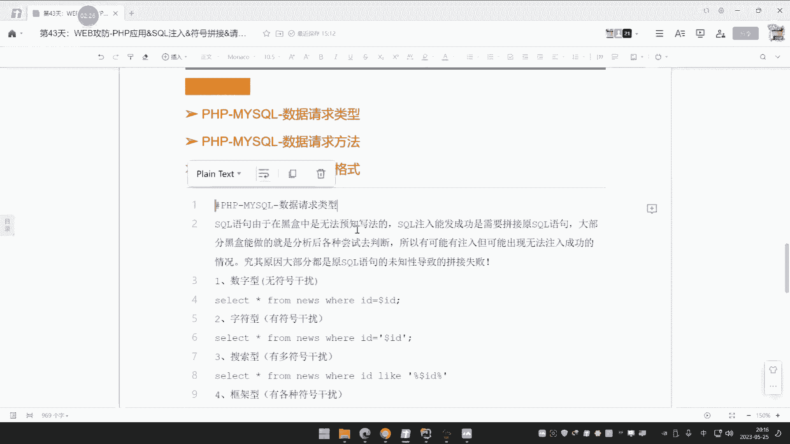

他这个具体的个情况啊，那我们这里呢看下这个代码啊，这个代码呢我们写了这个五种啊，那这是第一种，好一一种呢我就换一个行，那这第一种。

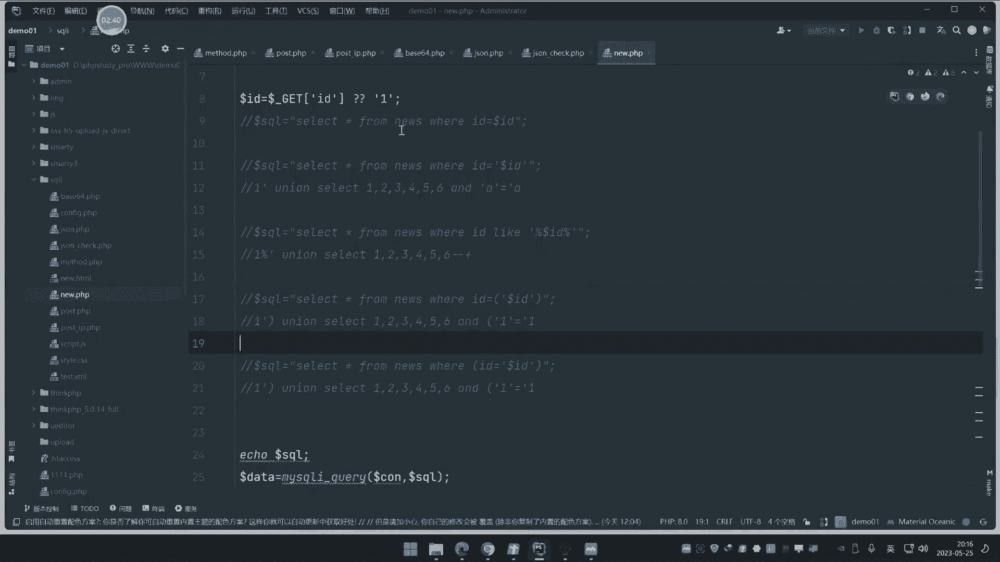

然后我们看一下啊，他说叫数字型，就是后面的这个id值啊。

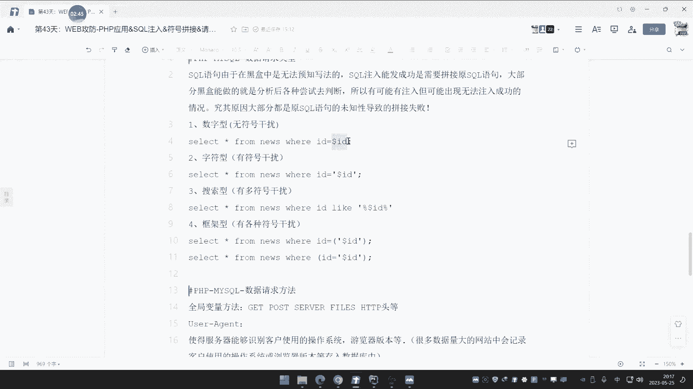

我们接收过来之后，他不是要参数接收这个网址。

复制过来的I地址吗，比如说我这里等于乙，那么由于这个id值呢它固定为一个数字，所以SQL语句中呢他就这样写这个疑，他也不用用单引号的去扩写这个变量，还有种情况，就是说他接收到的变量值呢啊是随机的。

可能是数字，也可能是字符，那这个时候呢在这个语句中他就固定。

那会有个单引号把它括起来，那我给大家简单说一下这个事情啊。

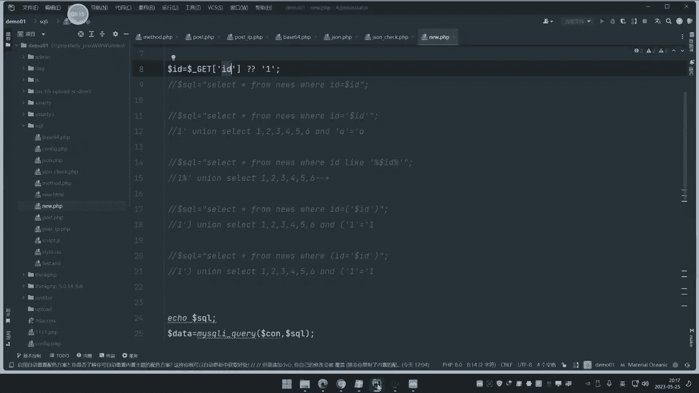

我们先看这个一个SQL语句的一个定义啊，你比如说在这里呢我们去查询这个语句样，你看这个id等移是吧，那你看啊，我们这里呢查询啊，你看啊，Wells，这是个兽语啊，还得等一对吧，这勾啊它能运行到，然后呢。

假如说这里呢还有像其他值，或者查这个艾德米的话，我们看查一下艾米啊，阿德米啊撒阿德米，好while条件，那他也是能够查到这个值，然后呢还有呢就是说条件id1id是一一呢，你可以把用单引号括起来。

这个语句呢他也能执行对吧，然后啊你这个username，比如说这里呢只是username等于，还是你是吧，你看这个艾米我这样写他就报错了，他说不认识这个ADMI是列在这个wise条件中，是啥意思啊。

就说艾德米呢他在这里呢判定它是为捏米，但实际上我们艾德米呢是一个什么查询条件，他应该是珠串，所以它就需要加上单引号，那么这个语句呢才能正常把它指引出来，那么由于这个语句呢固定的。

就是这里艾米是必须要用单引号括起来的，所以在这个代码中的话。

如果他无法确定这个后面的id值，它是数字型还是字符型，那么它通通都会加上个单引号，就是防止如果你输入的，他是一个这个支付型的话，那么它就能正常执行，如果你不是输入字符型，你输这个乙是吧。

那么单引号写不写，他都能正常的运行是吧，都能正常运行，这个能不能理解这个东西，啊导演能不能理解，其实就是说代码中呢为了防止万一，他就在前面会加上个单引号，因为它无法确定你输入的值是一个数字，还是字符。

因为一旦你输字符的话，它没有加单引号，这个语句会报错，那么它就会像这种语句一样是吧，就会报错，能理解吧，那除了这个之外，你像一些这种搜索的时候，大家都知道像我们电脑上面的去搜索文件啊。

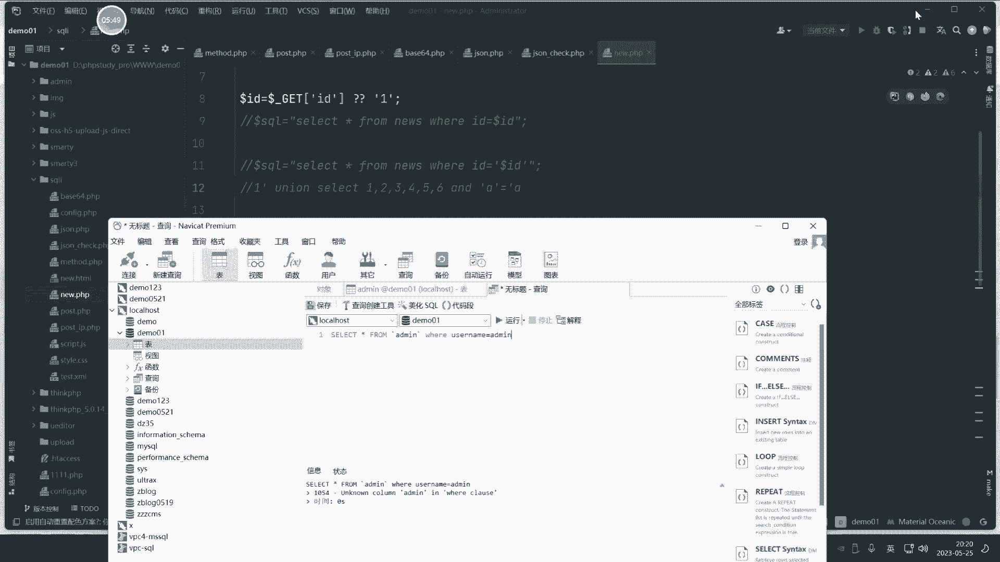

所有文件呢都会有一个叫什么通配符，电脑上面有个星号的一个通配符对吧。

比如说我搜个心仪，那么也就是说啊，比如说就搜个新点M新点PPT，或者说新点这个mp3，那么他就会将这个所有后缀为mp，三的文件都出来，然后呢你前面加上个一，那么就是以一开头的mp3文件，就是一或者一零。

后面有没有都行是吧，这种说法，那么在这个SQL语句中呢，它也有这种事情啊，你看啊它的里面呢有个叫username等admit，我就可以怎么样，一个叫什么username，然后一个叫like香香什么。

你看啊，写个百分号，百分号我写个i username，M带I的勾，哎这好像写错了吧，哎等一下啊，这咋写错了呀，这，少了个东西啊，那你看出来了，你看带A的全部写出来，你看为什么，因为这前面这个A。

这下面是以这个第二条也有A啊，你看我选择一个，那比如说N的N的，就他有，然后这个下面就没有是吧，你看我选的N的，他就只显示上面这条哎，是不是吧，如果是成X的，那就选择下面这一条来，对不对。

就是百分号代表前面和后面就说只要你带X，不管前面有还是没有都可以是吧，这个理解大家能理解吧，所以就是有搜索的，那么就是说因为网站上面它经常会有一些搜索，或者说有些匹配的这种超功能，那么它就会影响这种好。

那么这是这一种，还有一种呢就是我们说的啊，还有一种就是我们说的有这种这种。

另外一种写法，什么写法呢，大家看一下啊，这比如说我写个while条件id等于一是吧，我这样写哎，他能查询出来，我把这个疑呢写上单引号，他也能查询出来，对不对，他也能查询出来，然后呢我还可以这么写啊。

我可以把这个移呢给它括起来，这样去写这个条件，他也能查出来是吧，他也能查出来，还有一种情况就是我把这个条件都把它括起来，那我这样去写，他也能查出来，意思就是说他这种写法呢，就说实现个功能的写法。

它可以是多种多样的，但是由于他这种多样性，就会对我们这个circle注入就会有影响，有啥影响呢，相信这一点大家就明白了啊，那很简单的道理，我们给他做个简单的小实验，做个简单的实验啊。

那首先这是我们上节课讲的那个演示。

那个简单的一个注入是吧，这个呢我们就把它这个关起来了，我们就利用这个社会语啊，大家看看啊，前面加上个单引号的四个语句，我们在租的时候啊，我们观察一下，大家看一下这个SQL语句啊，那我写个一。

那么前期我们在上节课的驻点的时候，我们就是直接在这里加啊。

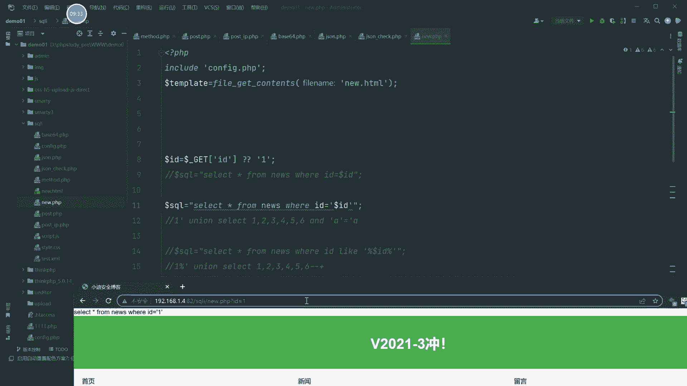

我我我用这个火狐狸火狐吧，这里看那个东西好看一些啊，那个浏览器那个东西好看一些。

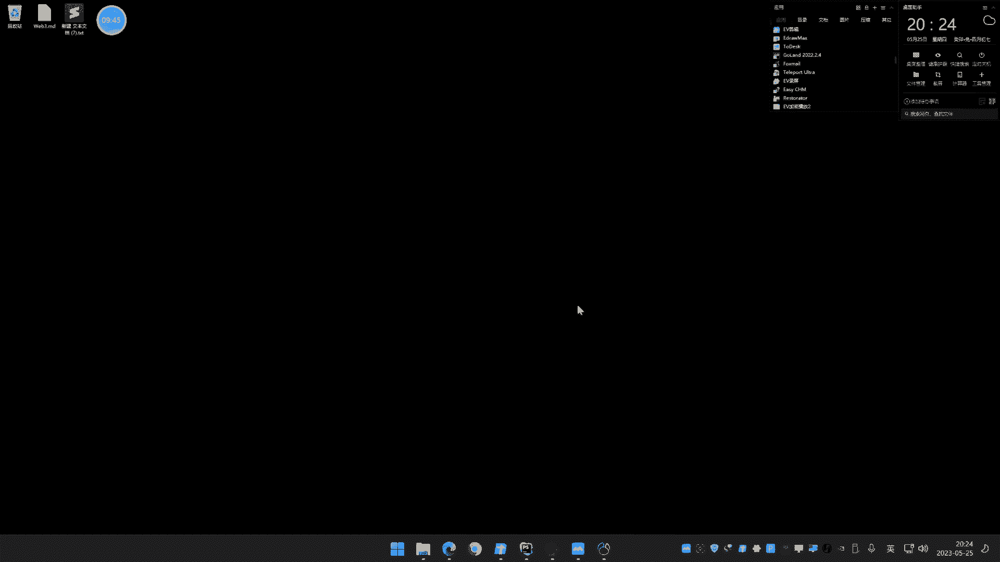

那我们看一下啊，这个浏览器呢我们在敲啊，那比如说这是我们上节课呢去这样去敲他，这个敲敲敲他这个猪点的是吧，嗯敲六个嘛，因为他这里有六个捏啊，这个60里面，那么这样敲三节课呢，我们是这样租的。

但这里呢你租之后呢，你发现注入不了，为什么，因为你可以看到他执行的SQL语句呢，是这样执行的，这里是让我为了给大家讲课，所以把它显示出来了，如果在实战中，你哪能看你看不到这个东西的啊。

那么大家看一下你写的这个主语句呢，全部写到单引号去了，写单引号呢，相当于就是说这里面东西全部当做字符串了，就说本身这个URLN和snack的功能，那就没有释放出来，因为你编程的单引号里面的东西。

就像是你变成一个字符串了，变成一个条件了，并不是它本身的作用，所以他就会怎么样，是前面加了个单引号，然后再把这后面单引号，用这种类似的什么井号啊，这东西把它闭合掉啊是吧，然后这里没有闭合掉。

反这种再闭合试一下对啊，是包出这四和五，然后呢我们再怎么样再进行这样的注入，对不对，现在呢就能正常出入了，就说你需要考虑这个单引号的这个闭合，所以我们说的啊这种类型呢，就说我们在租的时候啊。

他需要考虑单引号，好，大家试想一下，那么这种情况就是我们说的第一类情况，就是说可能有单引号的干扰，好，我问一下大家，你这里是看了SQL语句，你才知道这个流量引号，如果说你不知道，你就只能靠猜呀。

你就靠猜呀，对不对，所以由于这种猜的可能性的多少关系，和它的复杂程度，就像我们现在还是只能这样写，我等下再跟他说啊，这我只写了大概四五种吧，你看我们再看第一二种情况，就把这个注释掉，再把这个激活出来。

那你看我把这个记录出来，这种搜索型的。

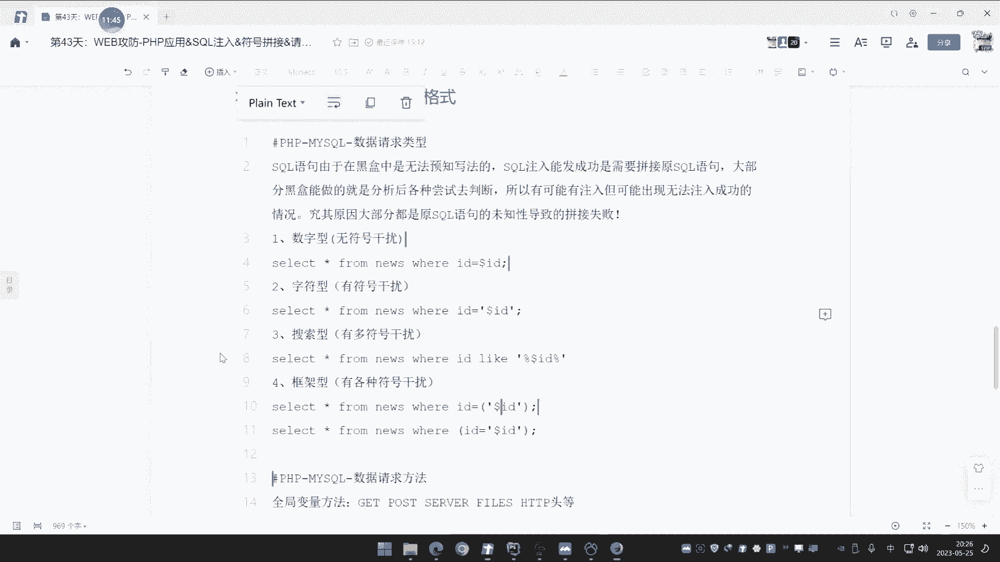

你看我们要注入它的话，按照刚才那个语句注入啊，他又不行了是吧。

你看他输入该怎么办呢，是不是要考虑到把百分号先过滤，再单引号把它闭合，然后再加上我们这个什么注入语句，再加上这注B和符勾，你看是不是这样才行呢，来用这个东西把后面注释掉，前面的这就把它屏蔽掉是吧。

那这是形成一个完整的单体，就前面这是一个整体，后面的是个单体是吧，这样才能出入啊，或者说有这种写法也可以是吧，它和我们没个单引号吗，你就自己写个这个东西来把它组合掉，那不后面有这个东西吗。

那么这个东西拼接上去就不和前面对应上了吗，这种也行啊，你看是不是也可以啊，你看啊都可以啊，用这个东西也可以，用这个东西也行是吧，注释不行，就用那种写法都可以，对不对，你看这种就又可以了是吧。

就是你知道他这个写法的，所以你就这样写，如果你不知道，那这个社会语这样去租的话，他肯定就不行，因为猪的原理呢，就我们这句话啊，SQL语句，由于在这个黑盒中，就是我们不知道SQL语句。

我们是无法预知它的写法的，所以我们要注入成功，就肯定是要拼写它原先的四个语句，但是由于这个原先的SQL语句呢，我是不知道怎么写的，所以就会出现可能性就是无法阻止成功的情况。

就是你无法预知你要闭合什么东西，因为我们只写了这几组，他可能还有其他的，我们具体其他的我们先不说，我们先把这几个试验完啊，好这三种，对不对领啊，接下来我们再换啊，比如说有些框架里面就喜欢搞这种是吧。

把条件呢形成一个括号，然后再加个单引号，那么现在你要注入它的话，诶，永刚才这个是又不行了，是要搞你这个闭合这个括号了呀。

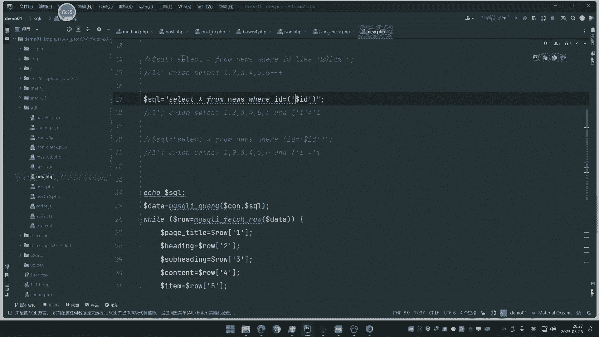

那该怎么办呢，是不是就是单引号在括号闭合掉，然后再加上这个主语句，然后再什么一和后面的东西怎么比啊，哎可以是吧，或者呢就像我这种是吧，再写个这个单引号，再等于是吧，就这样写，你看是把它闭合掉了呢。

对不对都行啊，那种注释符呢或者这种情况都可以写啊，他就能注释了，就就能租了，对不对，好了这种，那么还有这种的呢，他把形成条件呢，你看还有这种，你，那还有这种我再把这种呢把它搞出来。

看这种呢我们再放出去，哎这种它也行啊。

这种把它括起来也可以，那也是把它一样道理啊，也是把他这个条件呢形成一起去了。

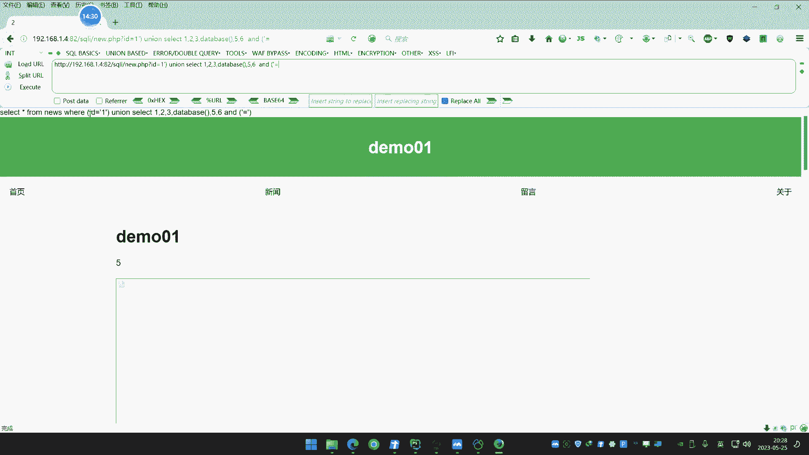

刚才那就是在括号里面，那这个呢就是把那个id封了进去，但是这个语句还能通用还是可以，那这样子呢他才能注入好。

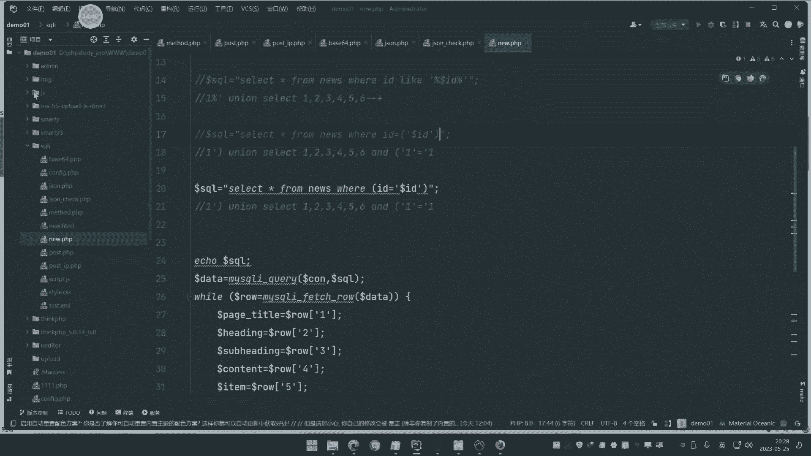

那除了这种写法对吧。

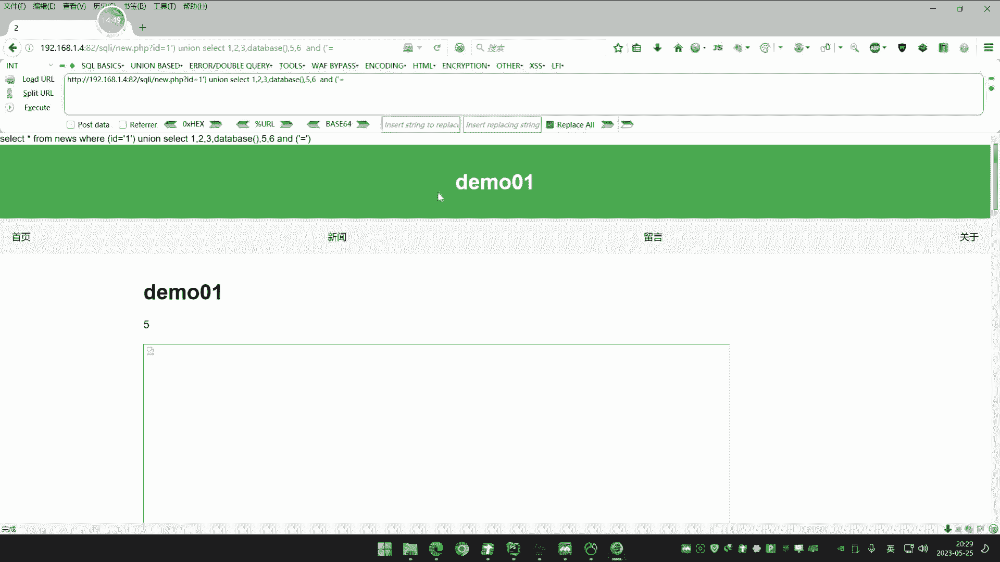

我只是写了这几种，你可能说哎那不会只有这么几种吧，不会啊，他有的还会怎么样呢，在后面加上一些什么东西啊，来我给大家演示一下啊。

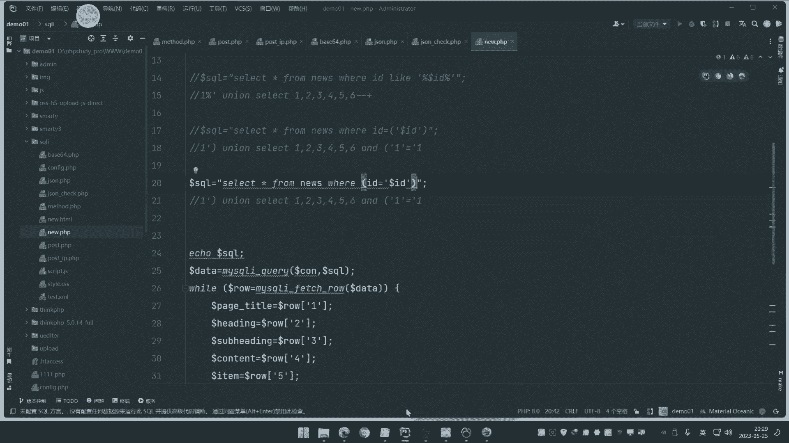

他可能加上什么MINIT01啊，这种东西再加到后面去，就是你执行的时候，你看他还能正常运行对吧，但是它一加上去之后呢，那你这个时候这个语句该怎么写呢是吧。

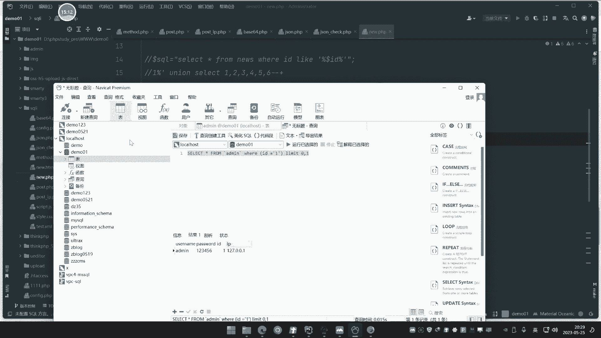

比如说我再写一个吧啊他第四个，你这样写的，那他是语这样写的啊，这个宇子要写的啊，这里是变量id啊，你看现在入入，你看我们再用这刚才这种写法去写，你看他就不行了。

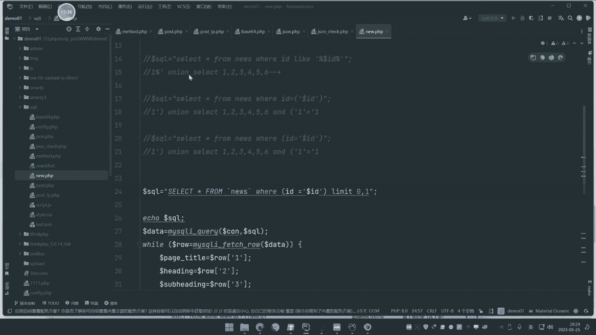

哎这又可以了是吧，把后面注释掉就可以了，但如果后面如果说猪师不掉，有些什么其他东西，什么limit呀，还有的是这样写的，写什么，old的by呀，这种东西写这东西它有个排序，还有些猪死不掉的一些情况。

那又该怎么办呢，所以就是由于这个SQL语句，在源代码中的不确定性，所以说即使这里有注入，也有可能会导致你在注入利用的时候，无法成功下去，因为我们注入在后面要测试这个漏洞，去利用这个SQL注入的话。

你会尝试去租入它的数据或干嘛，那么你就会用一些工具，或者说你手工的去注入它，但是由于你不知道对方的SQL语句，在这个代码中是怎么一个与条件，就说是吧，id是有没有括号啊，有没有单引号啊。

或者有没有什么百分号啊，后面有没有什么其他的order by啊，或者一些杂乱的东西，你都不清楚，所以你就只能靠猜那些工具里面，包括我们的手工方面，而不是手工，手工，你大概就知道那么几个工具里面就多嘛。

像什么sle map里面，他就有很多一些这种组合的一些payload去测，他测的就是车能不能去拼接上去，能够进行进行注入，一旦他都已经没办法了，那就说明那个地方可能就很复杂。

你手工你就知道那几种你就撤了嘛，撤了没了没了就没了，你也会用工具，那工具测了之后呢，他还是说是吧，包高告诉你说有注入，但是呢你就搞不了，就是因为那个SQL语句啊无法拼接，成功拼接。

就是说他要执行的这个社会语的功能，拼接到这个驻点的那个SL语上面拼接出来，那个时候语有问题，导致不能执行，所以结果不能出来，这就是你失败的原因，所以这种情况你可能会问，那该怎么解决呢。

这是没办法解决的啊，除非就是你有源码，你有源码知道那个SQL语怎么写的，然后呢你你去尝试，或者还有一种办法，就是你乱乱猜，就是用网上一些各种各样的往上面跑，但那种的机会比较渺茫。

毕竟专业的工具都搞不出来，你那种乱在上面，什么FUZZ啊是吧，用大量的东西去拆看，你没有一个返回正确的东西回来，当然东西都靠运气了，哪里就不好说了，所以说这一点呢需要大家明白，那这一点呢。

就是大家经常在猪里面碰上的一种情况啊，这样大家都应该了解了啊，好这就是其实就是说由于这个SQL语句，对于这个数据类型和数据写法的不同啊，我们就把它简单写一下啊，就是由于这个代码中这种啊。

就是我们说的这个开发者呀，对于这个数据类型和这个什么SQL语句的，这个写法，包括这个框架的框架类，这种in框架的这种规框架的这种写法是吧，导致了这个是否出出拼接的问题，是，意外情况没有情况好。

然后再来说这个注入里面，比较常见的一种请求方法，这样子呢也是给他拔个高，这东西呢在很多漏洞里面都有引用到，就是我们说的这种数据的请求方法，那像pp里面的话，就是有这个什么get post这种各种各样的。

包括files也会造成阻误，可能files呢在前期我给他讲过，就是我们在讲文件上传的时候，用到这个pp里面这个dollar for fast全局变量，他是专门做文件处理类的。

你可能说哎文件处理类怎么和注入挂钩了，不是文件上传吗，就像我们说的文件上传还会引发XSS，以前呢这句话很有问题，但是如果你学过之后呢，你联想想啊，我就拿个简单例子给他想想啊，我说文件上传会造成注入。

你说怎么和上这个文件上传，怎么和注入有关系啊，来我给他写这么一段话。

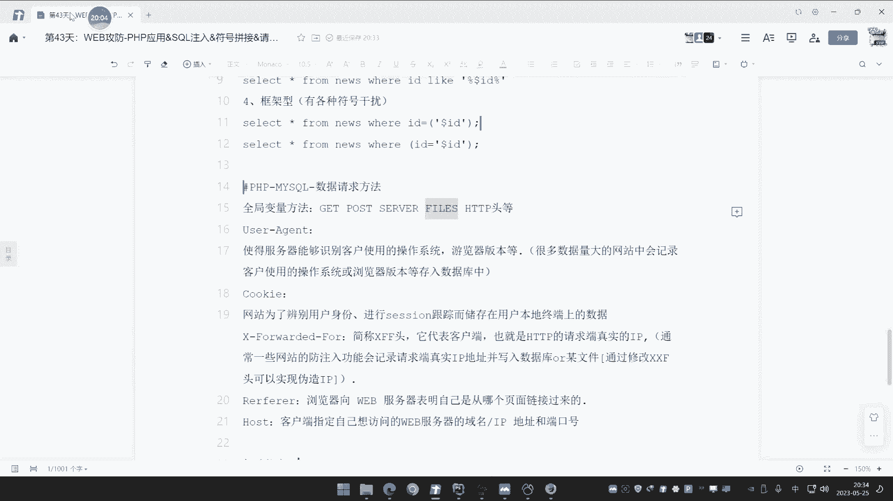

大家来再来思考这个问题，再看一下啊，我们写这段话啊，那看一下啊，那比如说啊上传一个文件啊，将这个文件的这个名字呢保存，好像用这个名字呢是吧，进行一个什么数据库的一个保存，这个SQL注入，就有了吗。

有条件能那样，大家看一下啦，你上传个文件文件的名字保存到数据库，你可以说它保存文件有名字又干嘛，我们可以看一下有些常规类的网站。

他都会有这么一个操作，就是呢你看一下啊，一些新闻里面呐，或者是一些这种新系里面唉，他会有对这个就是一些网站不是有新闻吗，新闻里面会有一些这种图片的加载，视频，音频的这种是东西嘛。

那么这个图片和音频呢它不可能是吧，把它放到数据库里面去啊，它就是有个地址，就是它图片呢在哪网站哪个目录，他就写到这个什么呃，这个数据库里面，那么数据库在调用这个数据的时候，那就会加载那个图片。

这个好理解吧是吧，对不对，他就会有这样的事情啊，嗯这里我看能不能找到第一次给大家看一下啊，这个也无所谓，因为我说大家能够理解啊，只是说我想找个这种其他的这种，你看这个哦，这个这个就类似，就和他差不多。

你看哈就是呢你看这里有个网站新闻，然后这里呢有个链接地址，那如果说这个链接地址，如果说这里是要写的图片的话，那这个应该就是图片地址，那个图片例子其实就是你上传的那个图片嘛，那么也就是说你上传个文件。

那这个文件的名字呢。

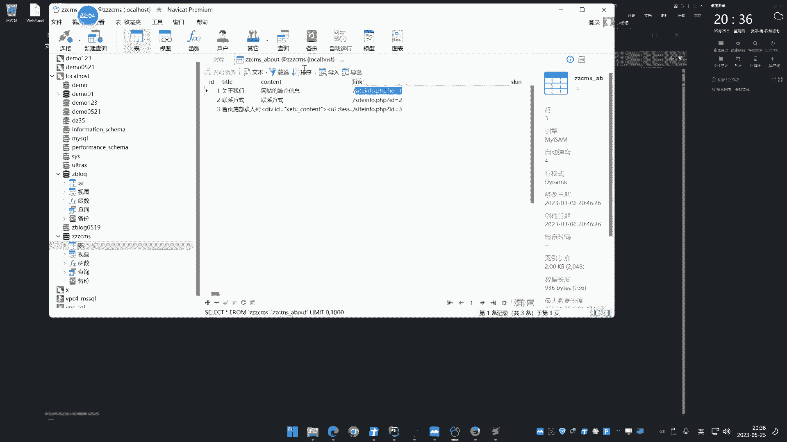

你把它保存到数据库里面，那在保存的时候，是不是就有一个这个猪额会产生呢，只说和我们现在上课内容有点不搭，嘎不搭嘎的原因，就是说我们现在上的是snack的查询，就下节课内容啊。

下节课的内容我们就会讲这个西啊，就是说有些注入点呢，它就是我们说的什么增删改查的一些插入，插入啊，insight的一些注入，它会有一些不同，不同之处就是在于有没有回血和包出之路。

就我们做一些满族方面的事情，就现在的我们没有涉及到下节课，涉及到啊，所以说这节课呢我们就给他提一下，所以他也是可能产生租入的，但是它产生租入的条件呢就有点复杂一些，你可能说那它怎么产生的，很简单。

他要对你这个数据库的名字，就是对你文件的名字要进行接收，接收之后他是要保存到数据库中，那么接收保存事故中，就是不是类似于就是这种呢incite是吧，比如说我插入一个表，插入一个news。

然后news里面呢有几个这种值，比如说一个叫新闻是吧，Title，还有一个呢比如说有它的这个内容，content啊，这个语句是这样写的是吧，好然后呢还有呢就不写其他的，像什么桌子是吧。

还有这个什么鬼日期或者是这种啊，各种各样的，然后呢可能有图片就写个image，然后呢其中这个image呢就是我们说的就是信息，那么在这里呢我们上传的信息，假如说image是吧。

我把它复制为一个SQL语句，我这种SQL语句的名字是吧，把它写上去，然后呢，他是不是就相当于在这里代入这个设备去啊，他插进去的时候，这不就是一个典型的重定向，这个excite语句的一个地方吗，好理解吧。

这个事情因为他要把这个文件进行保存，保存就是相当于说插入数据嘛，就是我们一个插入式插入数据的一个时间啊，对不对，那么在这里呢就会用到excite这个语句，就是我们说的这个东西，就不是snack。

snack是查询啊，这个呢是查数据，就是excite，那么它的语句的规范呢是大概是这样写的是吧，其中呢你把文件名呢它也保存，那么写在数据库里面，那文件名字改成这个东西。

那是不是会把这个语句呢进行重新下了，这样说大家就应该能够理解吧，所以说啊这个注入点呢它是产生了多方位的。

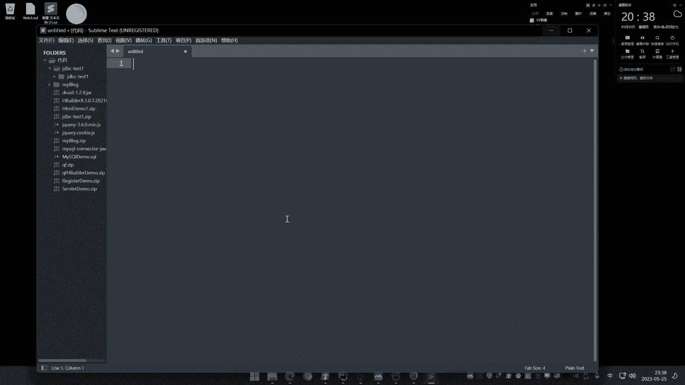

只是说今天我没有上来引side这个注入，就给他提一下，我们下节课就会上上这个东西啊，而且它的利用呢还有两种情况，就是基于这个先写后利用，还有直接写的时候就利用等等啊，我们下节课再来做实验哈，好。

我们接下来呢再给大家看一下，这个其他的几组啊，还有什么get post server，那这个东西有啥呢，先把这个理解理解完之后呢，我们再说其他的啊，这高端的这个呃漏洞玩法呢是多种多样的。

包括像之前我们讲插海赛事，我没有说过什么商传插海赛事，但是后面到有很多人挖东的时候，能碰到什么上犬山还热死，所以呢我们在这期课程也价值东西，在猪里面也说了这些各种样些农兵是吧，不一样的玩法。

那我们看一下啊这个get和post这种情况啊，我们先说这个get post大家都知道啊，get那就是我们说的这种get行为是吧，就是我们刚才访问这个网站啊。

打开这个网站一样啊，打开这个网站，那么我们可以通过这个浏览器的这个东西呢。

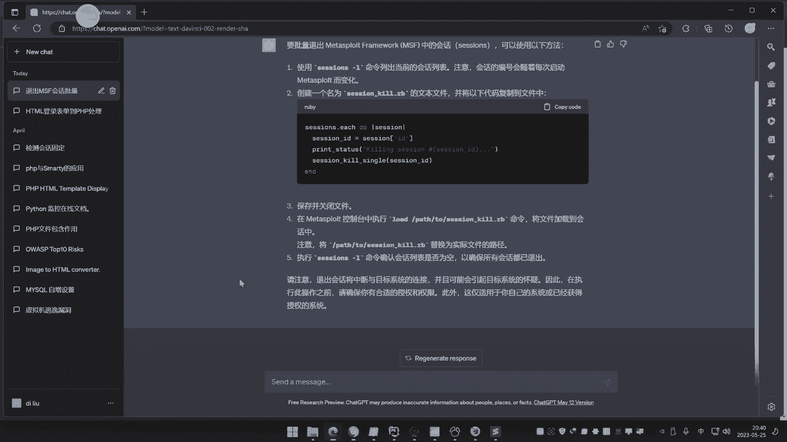

可以看到啊，访问它的时候呢，它是用get方法去访问的，然后呢在代码中他去结束的时候呢，也是采用这个叫dollar forget去结束的。

是不是啊，那么除此之外呢，网上呢还有多种的请求方式，比如说在pp里面它有这几种啊，我们随便写了几种，大家先看这上面四种啊，四组呢我们可以把它尽量的一个输出看一下啊。

其实前期我们在讲PPT开发已经商过这个东西，只是你呢再给他商一下啊，你如果不懂，你可以看下前面的开发课程啊，已经给他讲过了，我们就说这里呢给了临时过渡一下，怕有些人忘记了是吧。

你看这里呢这个是man模式，我们打开这里，OT点pp怎么写好，然后路径是这杠G你看G我等于一，他就输出等于一对吧，然后呢我后面再加变量，比如说P等于二，他但是他还是输出一没有输出啊，为什么。

因为这个P呢是结束的是post的变量，所以我们这里要写到post这个提交里来，就写到这里来是吧，你看他就写这一，然后C这里呢是cookie，还有个RR呢，我假如我写在上面来，R等于一哎就是121是吧。

R写到下面呢，写这个下面呢诶他也是1+1，写个一二呢是说啊也是1212。

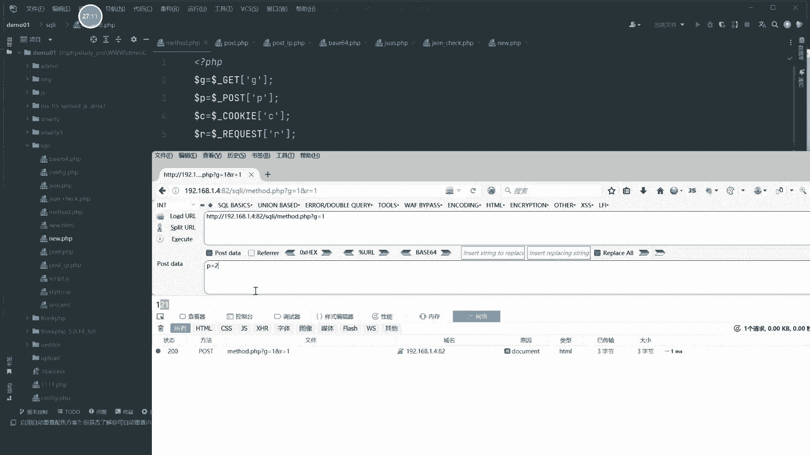

对不对，R这个代表的是全部接受的意思，就是呢他接收的post也接收，get也接收，包括coin他也接收好，然后这个cooking那就是接是cooking的。

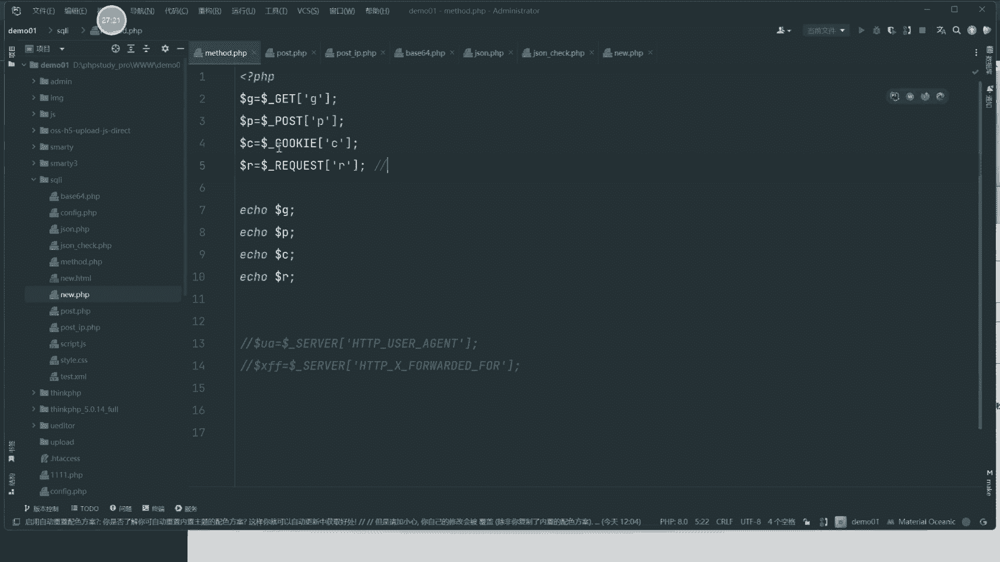

啥意思呢，就是我们可以在这个浏览器这边呐啊，哦他这边这个鸟毛东西呀，他改了个数据还麻烦，我就在正面操作吧。

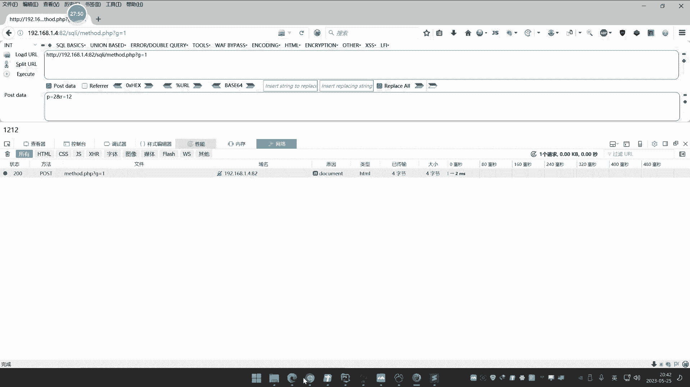

在正面浏览器操作好吧，蓝色显示一啊，我们在这个内存这里啊。

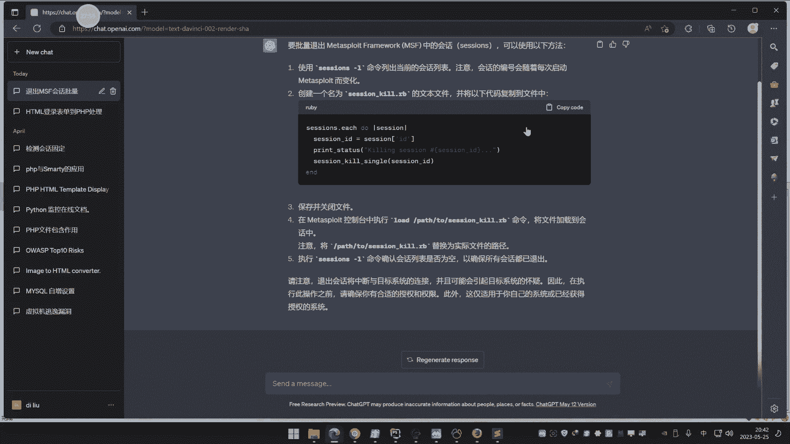

哎和性能这里哎来两个这里啊。

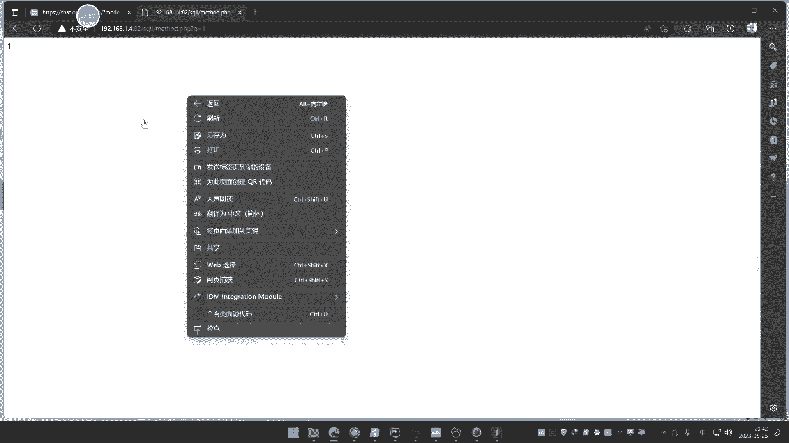

应用程序这里啊这里啊，你看这里呢有个coin值啊，我们可以加强一下啊，就是C值呢为123，好把它保存一下刷新，你看是输出一个三。

那这个呢其实就是结束的是这个什么cookie，这个值嘛，C的值不值。

代码输出嘛，也就是说这个代码中呢它有选择性的，就是说只接收get直角是post和接收cookie，也也可以说写个request，就都接受他有这几种东西对吧，那么你可能会为什么要这样写呢，其实我们知道的。

就说有时候呢也有网站在访问的时候呢，它是一个get行为，这里访问网站呢哎他就能直接这个是个get啊。

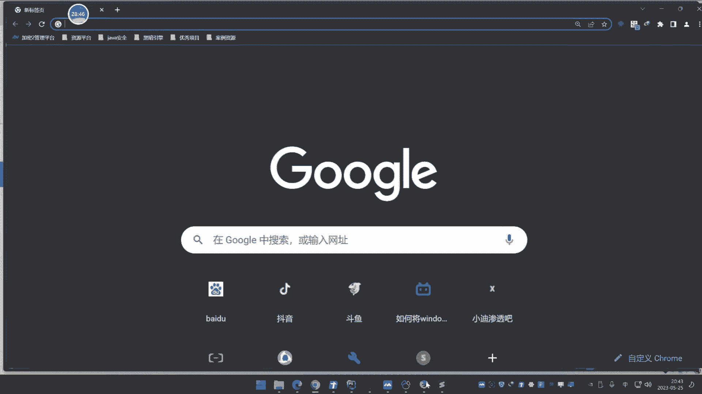

比如说像这个小八是吧。

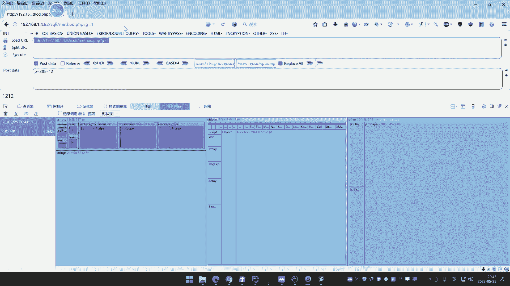

我们访问这个网站，那么他这个网络行为呢就是get行为啊，他是一个get行为，那这后面他就写了这get了，然后呢你访问这个地址的时候，你看访这个地址时候呢，它也是一个get断地访问，那他的行为。

那你给大家看一下啊，他也是一个这个什么，你看get方式，那请求方式我get，但是有一些呢他就是post，比如说哪些是post的呢，文件上传文件登录啊，不用户登录它就会是这种post。

拉post的话就是看上去它没有参数。

因为我们要租入的话，一般是有参数值的，就不是说啊你直接写个这个地址去让他注入。

对不对，你就说写个这个地址啊，你就说这里没有参数，你直接把这个地址附上去，让对方注入，他注入不了，因为他没有参数，没有参数，就是没有全参，没有全参，我们那个色组呢是需要有一个参数的。

就像是这个参数传递过来，组合这个色局造成他的漏洞，你没有参数的话，就是没有传参，那post呢它在这个地址上面是不显示传参的，啥意思啊，你像我们这个灯框，那比如说我这个网站后台登录这里对吧。

我在那里面写这个东西啊，我写登录在D上面呢，他只变了这个东西，但是并不是把我账号密码发上去了，没有看到账号密码，事实上呢你在抓包里面呢，你是看到啊，啊抓包这里面你输入这个东西来点登录。

那你看这里就是post post数据呢，你给挪到下面来，这里有个叫什么，那for data呢，这是发送数据，其中呢你看账密码就在这里，对不对，那其实就是说他其实有参数传递的，这也是能够产生租的地方。

只是说在网址上面都看不到，所以针对这种情况呢。

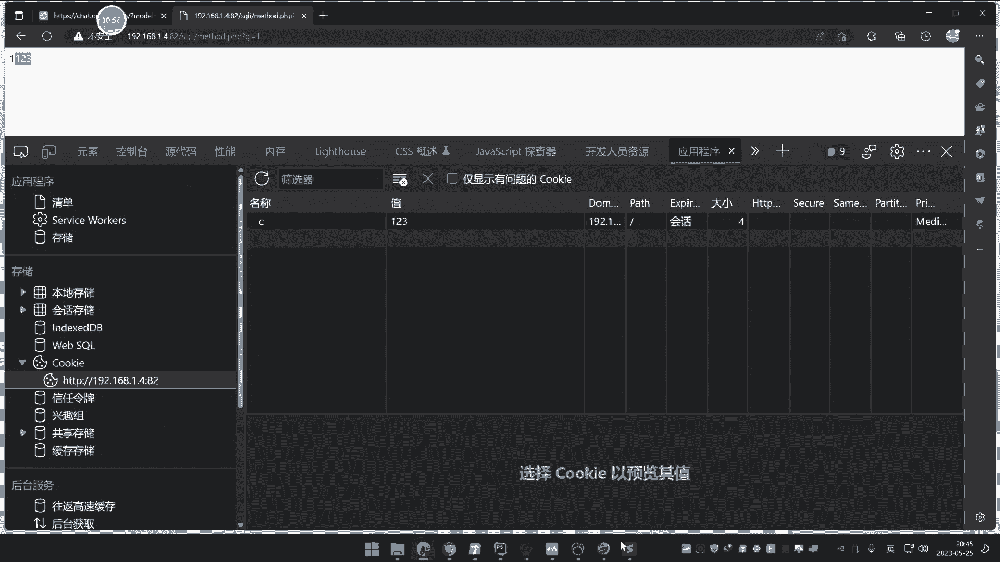

我们也要进行尝试，也知道这是一个产生注入的点，并且这里的猪在利用的时候呢，和我们刚才说的也不一样，之前我们是在这个D上面这样去玩注入点，对不对，之前呢我们是在这个后面再去这样去玩，出点刚才那个东西是吧。

之前呢我们是在这个D上面是吧，是这样去主动玩他的驻点是吧，是这样去玩足注点，对不对，那么现在呢我们再看个网站啊，找个网站，这我们自己写的啊，是这个叫post点pp，你看这有个登录是吧。

就是我们说的登录框注入，其实就是post注入的意思，就是他这里呢你看不到有参数，但实际上呢它也可能产生驻点，那你可以分析一下啊，我给给大家看一下，抓个包。

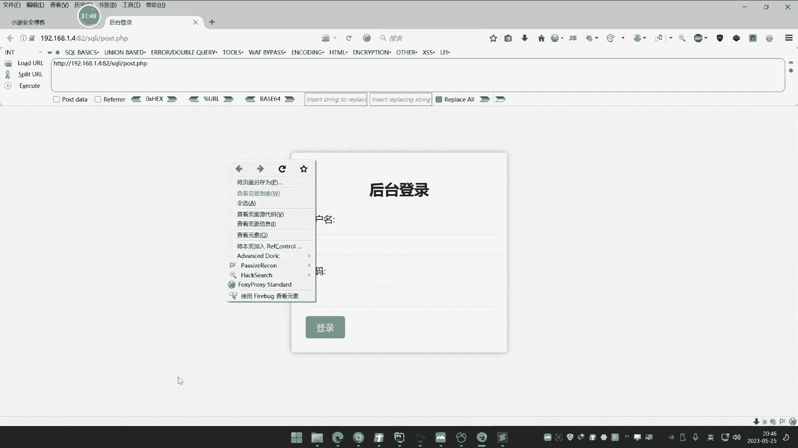

这样最好是抓个包，好分析一些，用这个网上那个东西呢，看的话没有这个巴布斯特，那会明显还是抓个包吧。

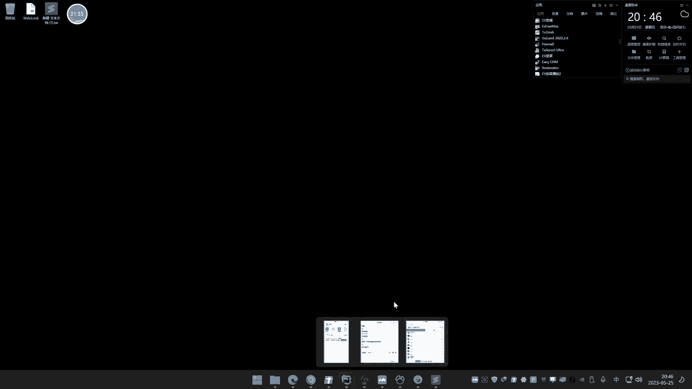

好我们这里水平输，比如说我输个艾德米，然后123456是吧，好随便输什么东西啊，那我点击珍珠，哎我这个杀机这个地方端口没对上，好我们抓个包啊，看着啊，那我点登录啊，看一下这里。

你看这个数据包是不是发送的呀，你看这里是不是有username，ADD me passwor等等，输入五个呀，它是有参数啊，然后它是一个pose行为，那之前呢就是我们如果网再返回的话。

那这前面就是1get，然后后面那是加上这个参数值嘛，直接说出点呢，我们在上面去玩，那现在呢就放到这来了，放这来的话，利用浏览器就是借助这种post插件，或是用什么post mander去这样去尝试猪。

对不对，那现在呢如果你在bob数组里面藏输入，那就是在这里更改更改这个驻点，去尝试对它进行注入，对不对，你看现在，那我们就可以判断一下他有没有注入点，对不对，那我们可以试一下呢。

那判断的话按照我们常理来说，这里是username的艾米，艾米呢一般是珠串，所以我们需要先考虑个单引号，把闭合掉是吧，就是单引号写程序，然后呢我们再用什么order by呀，这种词形呢去猜后面字段。

这手工注入方式是吧，比如说是三个呀或四个呀，先盘了个四，然后呢井号呢还有个问题要把后面屏蔽掉，看是不是一个长度对吧，如果说要充足的正常访问，7104717450的一个防火长度。

我们看下防火长度是否变化呢，确定它是否报错啊，变成1789啊，换一个再换个是吧，换成个五啊六啊，这种东西11750，17891750，那就是四嘛，对不对。

然后呢你看啊就u n i n snack的1234，那我们观察一下这边的代码里面啊，这里包出了一些东西，你看好我们在这里呢，可以在这里也可以看到代码中间包出一些数字，哎，写一下看一下。

看说order里边是database3字里面显示出版本，你看demo01版本5。7。26，那它就是这样玩法，这是POS猪，那么同样道理，你要租的话，你可怎么办呢，把它复制下来，如果用浏览器的话。

就是借助这个post插件，或者说怎么办呢，用那个postman让工具去发是吧，就这样子呢去写这个注解来勾，然后呢你可以看一下啊，那看源代码，哎哎呀，看那个返回值，嗯这个还没有出来啊，哪写错了，是真奇怪。

从那边考的这里就不行了，唉，生生命好好的啊，代码中显示不出来，有一些源代码响应里面没显示，但这个不重要了啊，这是我那个页面自己写的一些问题，我把这个上面翻一下，我看一下是不是那个情况，翻一下鞋啊。

看一下，换一个写法也是一样啊，这个不重要了啊，在八数的上面能行就可以，也不知道哪里有问题，你看就说你要租的话啊，他就是相当于是说换了一种地方啊，换了这个提交数据，这里来去租入，其实就是说有很多数据包。

你不是通过这个数据包抓了一些数据包吗，对不对，那么有时候呢有些数据包呢，他的测试点呢就不再是网站的常见的那种情况。

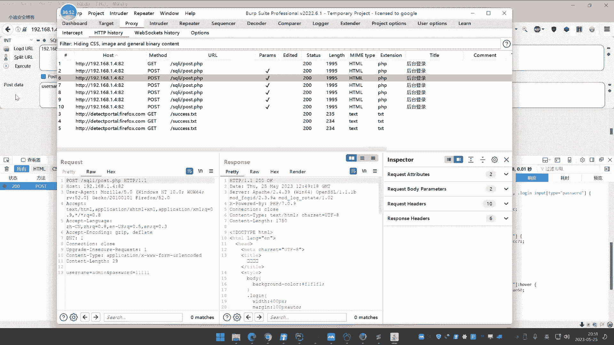

以前呢我们测试驻点的时候啊。

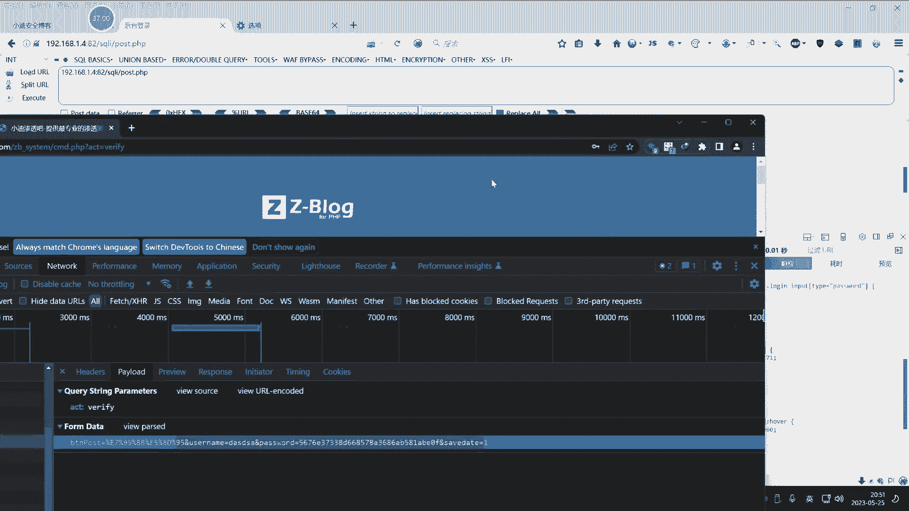

那像前面我们测的那几个驻点，那我可以把它拿出来，你看这个前面这种测出点的这个地方。

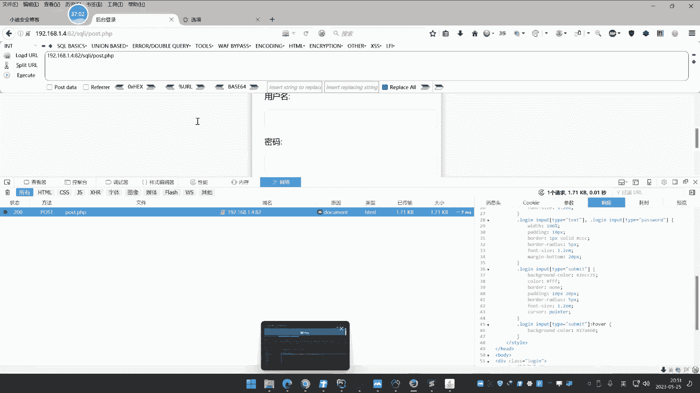

US的点PP的。

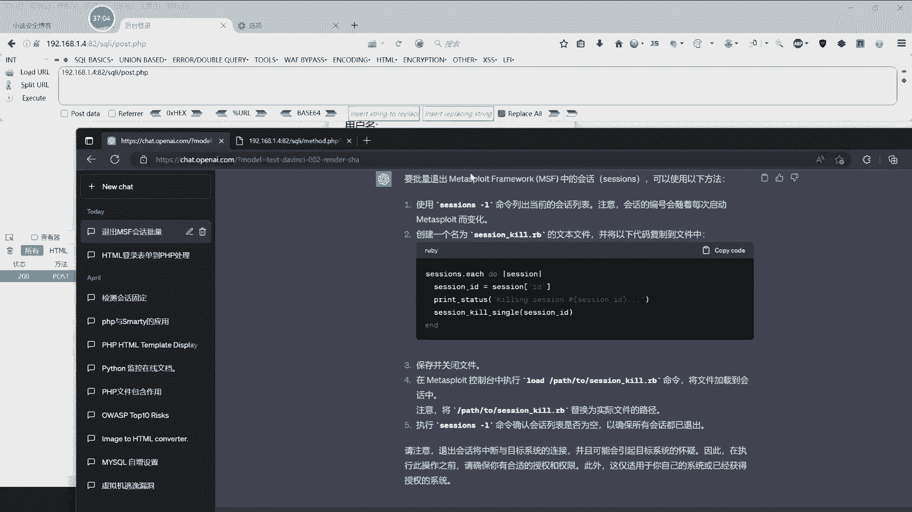

你看这前面我们测主点的时候呢是吧，然后测他的这个驻点是怎么测的，你把它写一写啊，是吧，我们测驻点的是这样测它的，我们这个，那当时呢我们是这样测它的主点的是吧，是这样测的。

那么这车呢你在那个抓包里面是个什么情况呢，你看抓到数据包里面，你看你数据包里面是这样写的，是写上面的get行为，而我们刚才那个pose行为呢是在这个下面去输入，因为其实就是说它发送数据的地方发生更改。

那你可能会说为什么要get it propost呢，这个我就不说了啊，前期安全开发已经讲过了，而不同的数据请求相文件上传就是post，那用户登录也是post，大部分都是post。

当然它也可以用get pos呢，传递的数据呢一般较大啊，get那就简单的后面的对不对，其实就是告诉你啊，很多请求方法里面也会有这种不同终点，而且为什么要这样讲，很大一种程度呢也是要看代码的。

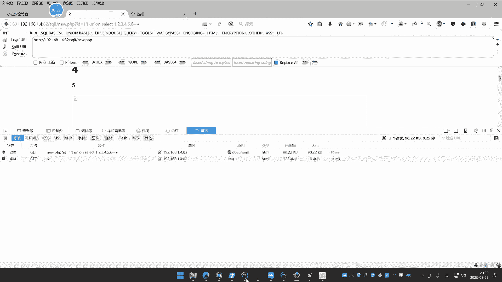

你在后期代码分析，代码升级的时候，如果说你发现这里有个驻点，你要发现这个驻点是什么请求方式的，要怎么去浮现它，这里人也需要明白，其实就是说如果说pp里面。

你就看这个接收数据的是用get接收还是pose接收，如果说他用get接收的话，哎那你就像我们这种情况去浮现它，如果post1周，那就像我们这种情况去浮现它。

那可能这是他的第一种用武之地，了解他的数据发送请求方法，和我们发送之判断它的流程，还有一种就像像一些这种绕过WAF里面，或是绕F1绕过一些防火墙里面也有这种玩法，什么意思呢，就有些防护软件。

或者说有些这种防护代码，它可能只是单纯的拦截了这个goat上面行为，如果说你把这个数据呢放到POS行为去发送，诶，可能就绕过了他有很多庸的一些地方啊，所以这个代码呢你懂的话，是能够帮助你在各方位。

不管说是在漏洞的分析方面，还是漏洞的利用方面，还是漏洞的一些其他方面都会有帮助。

这个post能不能理解，这个其实就是说，它就是一种发送数据的一个地方啊。

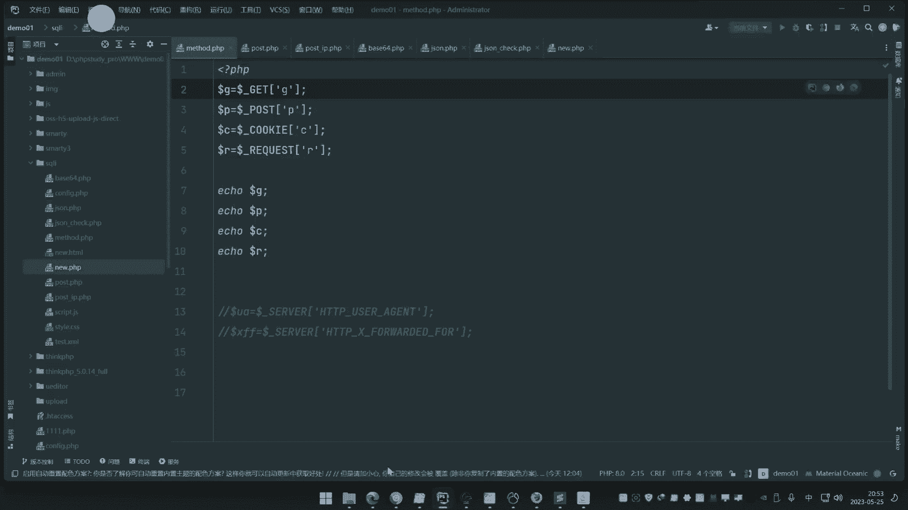

说实话啊，我觉得我已经上到40多课。

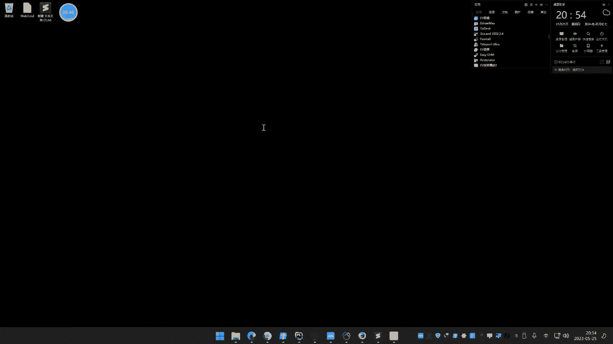

把前期安全开发商过了，这个pose呢应该是能够理解的啊，如果说这个不能理解的话，那所以你的安全开发，那肯定是看的压根就没有看，或者说那个东西也看不进去，这个是post啊，这个是post。

没什么太多不同啊，其实就是告诉你呢啊，在合适的地方去合适的去注入，同时也告诉你这个post数据请求呢，在网站上面看不到，但是不不代表它没有参数，也是可以测试输入点的一个地方好，这是post。

那么还有像我刚才说的什么cookie。

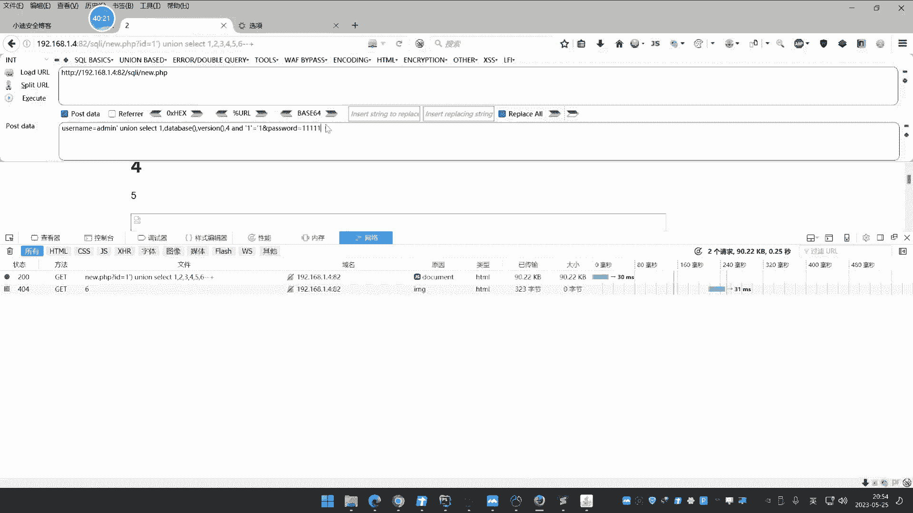

但cookie呢一般比较少，主要的还是像它里面另一个另一个全局变量，叫dollar f server里面容易产生阻入，那dollar server是啥东西啊，来我们在那举了其中一个例子。

我们写了几个，比如说dollar server可以去获取浏览器版本，获取用户的访问cookie，获取用户的叉，反复投，获取用户的来源，获取用户的访问host，那么我先给大家做个演示。

说白了啊，这些东西我完全都不用演示的，但是现在要演示是没办法，因为呢有些人呢他没有去完全开放，我照顾他啊，说实话这个东西呢是不需要再照顾了，应该是前面安全开发讲了之后，那就不再累赘的事情了，你看啊。

我们就随便拿几个来给大家看一下，比如host，我们随便拿几个来演示一下这个，好就拿这个名字吧，这个叫达尔伯OST，然后这个叫达洛夫R1，就打一吧，好我依次呢去输入这几个东西，UA好把他换个行。

好再输入这个差FS，先要把这东西讲清楚，唉说实话啊，我现在上的这么细，完全就是对我自己以前那个前面上过了，安全开发课呢，没有新星所造成的啊，如果我是觉得，大家对那个安全开发没有意义的话。

那这东西呢我是完全没有必要伤的，但是就是知道大家那选的不好，没办法啊，现在还得滚一遍，这次是再刷一次了，如果说还是不懂，那实在是没办法，你看这个啊。

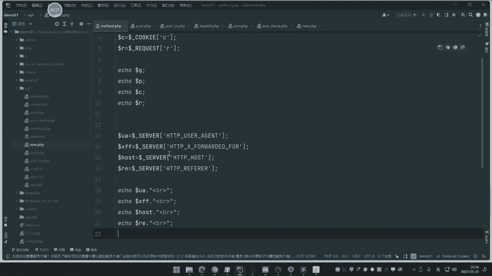

这个呢这四个代码呢我们来分别解释一下，其实前期都已经删过了啊，完全浪费时间，哎呀没办法啊，谁叫大便这个基础太差了，好大家看一下啊，那大家看到没有个什么事情发生，你看我去打印这个信息的时候。

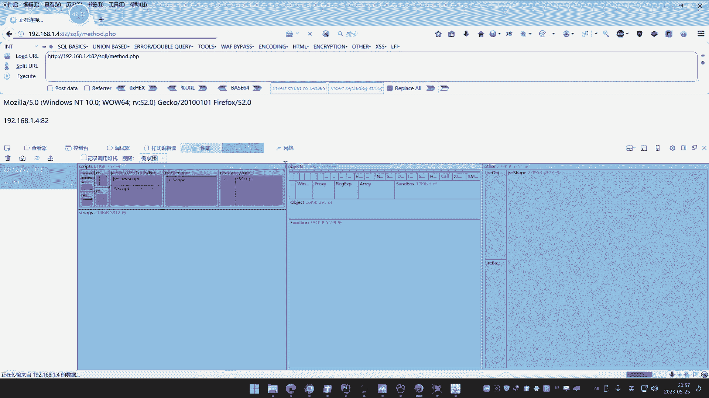

浏览器信息打印出来了，这里面什么差，for word呢也没有打印，第三个呢什么app hos的，打印出来是这个一二十一。4。8，因为这是换行嘛。

第二行应该是这个字嘛，但没有还有个叫什么这个REF1这啥东西呢。

也不知道这个沙拉夫里面的有很多，我只是列举了其中四个是其中四个。

那么大家看一下啊，这个浏览器是怎么来的，来我们看一下啊，比如说我通过这个浏览器把JS我访问这个地址，我把你的信息我把一改，你看我改成个什么叉叉叉叉把方出去诶，你会发现这边了对吧，他编的对不对，他编的啊。

其实他就是获取你当前访问者的浏览器信息，我通过抓包呢把临时流信息进行更改，哎他这个地方就结束过去的就发生更改，然后下面第三行呢它获取的是啥呢。

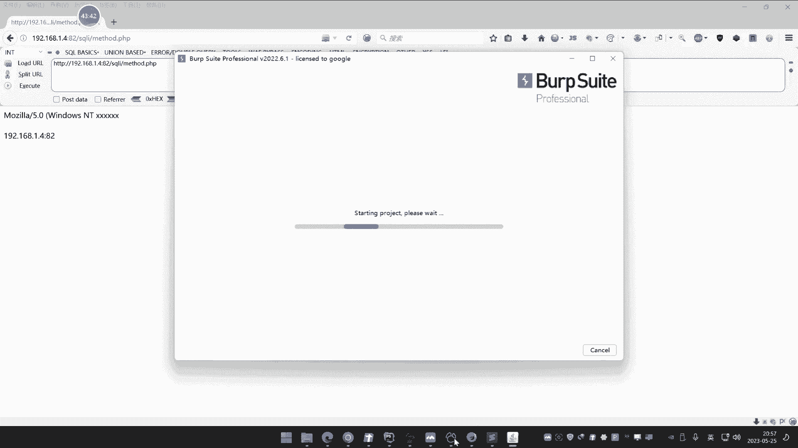

下面第三行它获取代码是啥呀，获取的是这个host。

就是你访问主机，就是你当前你访问这个主机的域名，就这东西，而你可能活呃，第二行第四行呢，那第二行第四行是干嘛的，一个是坡起，一个。

一个是获取这个头部，一个是获取这个来源，啥意思啊，我们看这个啊，这个呢是一个获取地址的，你可以这么操作它啊，我给大家演示一下。

好获取过来，然后你看啊他这边呢是有个查检，这个茶几呢叫什么东西，但这个茶检说实话好像没什么卵用，加上去和没加上去，他都没有结束，来我再写一下吧，你看啊写个那个差不多的东西哦。

or word是不是这样写的word，然后，好好的1D。

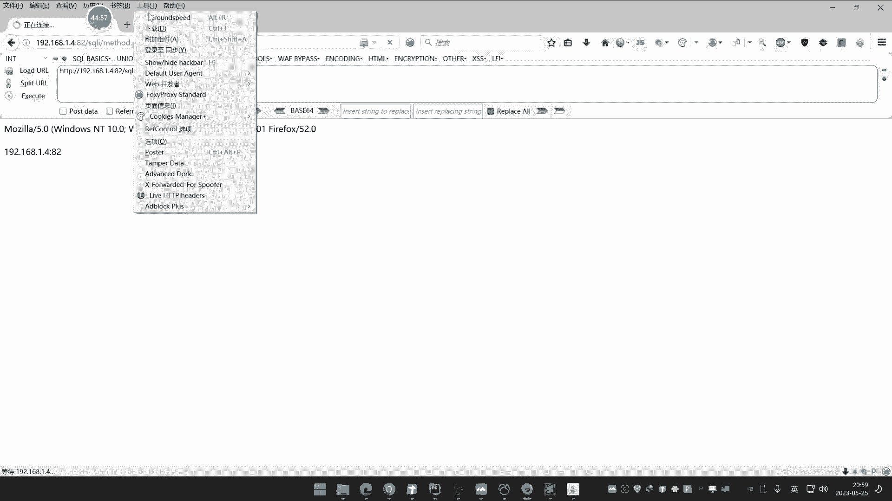

那个头部是怎么写的，我都忘记，啊应该这样写，写数据包里面啊，就说如果数据包里面有这个值啊，看一下啊，只有这个值，你看啊，我写个1。1。1随便写啊，你把我放出去，放出去啊，我不用它插进了，放出去。

你看是不是就显示这个值啊，它就结束到了呀。

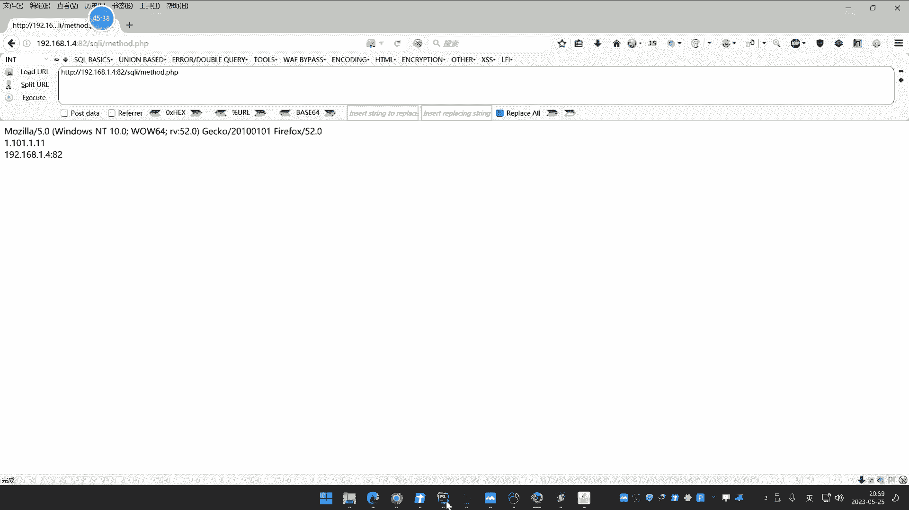

所以他其实呢他接收到的是这个东西，解释是什么，是这个数据包里面的那个什么，这个设置的这个值，对不对啊，这个呢就是获取什么鱼尾信息的，就是我们据包里面的发问者的不对，那里面的是什么，改UAA。

然后这个是什么，就是获取你那个数据包里面的什么push的地址哦，你可能说这个是什么呢，改一改，哪个你可能会哪个是什么东西呀，唉来源很好，你加你加上去呢。

它也有啊，你可以加上去也可以啊，你加上去它也有，或者说呢我可以给他演示个例子啊，你看着啊，这第一个对不对，我随便先打开一个这个百度，我从百度这里呢有个这个图片，把图片这里呢进行一个更改。

图片不是你这里有个连接地址吗，我把连接地址改成什么，那这个叫好看，百度点com是吧，我改成这个地址来改成这个地址啊，看着啊，视频这里啊把它改了好，你现在看一下啊，我把点过去，大家看一下啊。

呐来源变成了百度里航母啥情况，然后你把包装一下，好来宝宝坐下来，男人这里多了颗是什么，水包里面多了一个周位呀。

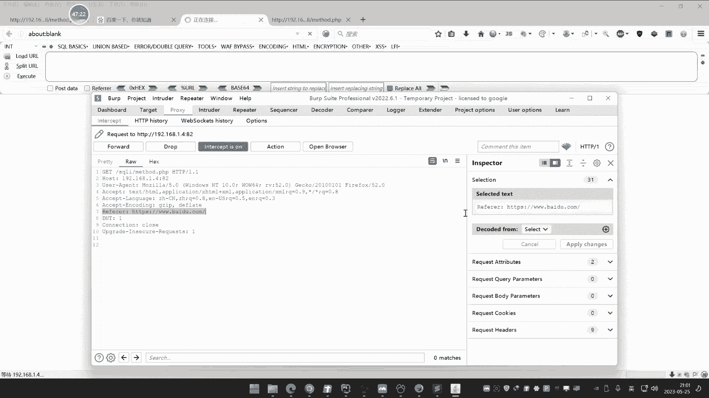

他其实是获取这个值的。

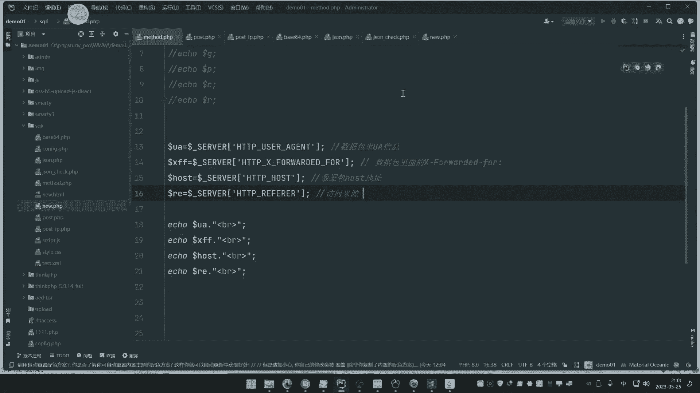

好我讲这些呢就是告诉你server它有这些东西，但是并不是我所有的讲这个来源的。

是检测一下这种，后面我们说的什么CSR辅一类攻击的，有这种修复流程啊，就检测你的这个来源，但这个不是我们重要的，好，我先先说一下，你说我讲这东西是干嘛呢，这不和这个猪肉有啥关系啊，这好像没什么关系啊。

好我们看啊，其实就是说这个pp里面呢有这种类似东西，做我们举的四个，它还有很多你自己可以看一下啊，就我写的时候大家应该观察到了，那你看啊，那我写下来，那你看看还有这么多呢，每一个都是代表获取不同意义的。

而有些呢还没有写全，还有一些网上，还有些另外的每一些代表卫生意义的好，我们先来思考一个问题啊，啊比如说这个IP地址好。

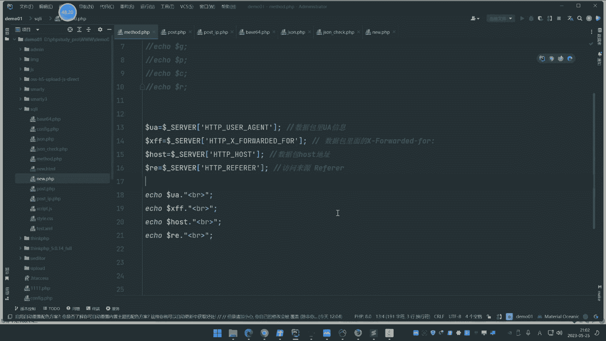

就这个IP地址你看啊他说的第一种有效信息好，你跟我说流量信息有什么作用啊，我举个例子啊，网站有一些这种叫私音比较好的网站，一个网站如果说你是手机访问好，我就给你展示手机界面美好的界面。

电脑访问我就给你展示电脑访问的界面啊，是苹果访问，我就搞是苹果访问，安卓访问我就安卓访问它为什么有这个功能呢，它可以通过你访问者的这个UA信息，来判断你是什么设备，因为我们都知道电脑的浏览器。

和我们这个安卓浏览器，和苹果浏览器等等一些东西吧，它是能够判定出来的，所以他就会接收你这个用户的这个，浏览器的信息，那么他结识这个用户浏览器信息的话，如果他还把它进行了这个整理和这个归类的话。

这不就是一个典型社个数字吗，就说他收集用户的访问浏览器信息，然后呢把它整理到自己的库里面，你想象一下浏览信息，我把里面信息改改成一个SQL语句，那SQL语句不就是进行了数据库的查询吗。

进行了数据库的查入查询吗，不就是一个主路吗，能不能理解啊，那么与此同理，其中呢那我们就拿这个刚才说的这种头，这种头是啥意思，我们先来了解一下，用PHP区，获取啊客户端的IP，获取访问IP的方法啊。

代码的方法我们可以看一下啊，他是怎么获取的，那网上面有这文章。

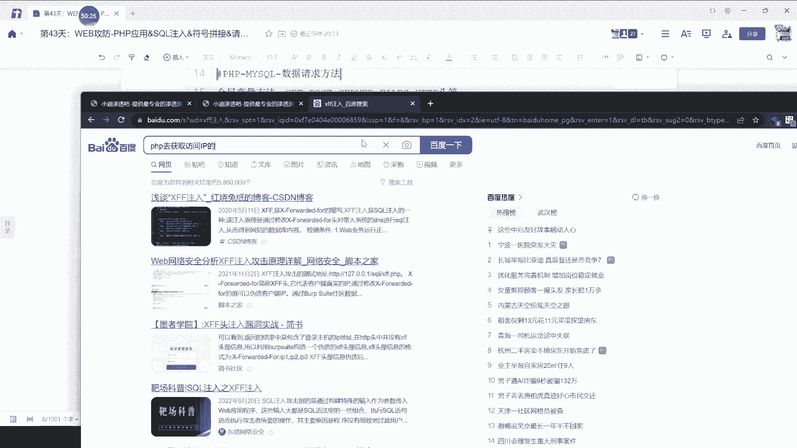

他怎么做的，你看啊，那用这个。

用这个代码呢，DOLO夫server hp插FORWORD，Htp client，It remont a d d r，还有这个三，这里写三个，这三个的全部是获取用户的IP的，就是如果这里被设置。

就是这个id，如果这里不被设置，就是这个IP，如果这个呢就不是id，就是说有多种方式呢去获取呢，获取浏览器用户的计算机IP啊，获取这个什么网关或什么客户端IP，就各种方式。

就是如果没有这个值就获取下一个，就是就是三种方式，以此类推，一个获取不到结果用于下一个获取，直到获取到，对不对，在获取IP的好，你觉得哎那获取IP怎么又和SQL注入有关呢，大家再想一想。

首先在网站的这个正常的功能里面，大家应该都知道，有些网站后台功能不说后台功能，甚至有些这种记录功能，假设一下在一个后台的后台登录里面，我作为一个开发者，我可以设置一个功能，设置什么功能。

凡是登录过后台的，我就记录一下，或者说登录失败的，我就把它记录下，登录成功的，我把它记录下，在后台功能里面，经常会有这种数据登录日志，其中用户的IP你告诉我有没有啊，你看日志的时候。

他会进入用户VIP吗，还是说他只记住账号密码呀，大部分都会进入VIP吧，那么它有这个功能，它记录IP是怎么实现的呀，他是PB语言，他就用这种东西去实现的，那么其中在这个里面这个值啊，我刚才给他演示了。

它是通过获取数据包里面这个值来决定的。

那么加强一下，如果在当个时候呢，他获取这个IP的时候啊，我把这个数据包这个值呢改成了SQL语句，那不就是把这个SQL语句get他获取了吗，能不能理解啊，我们从网站的设计理念到这个功能的用法。

和猪的产证都给你讲了，你如果说还听不懂，那真是没办法的事情，那我现在就拿简单的一个例子，来给大家去说一下啊。

比如说呢我要在我就实现一个功能点，我这个功能点呢我作为一个防护人呢去讲，你看这个防护在实现在实现的时候，可能会出现三个问题来，首先第一点啊，我在登录的时候，判定下你是不是我允许登录的IP。

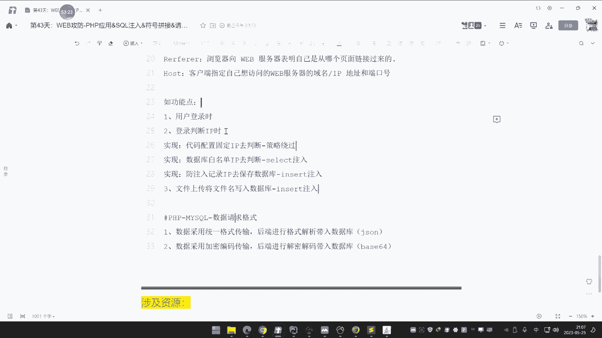

你是不是我允许登录IP，啥意思呢。

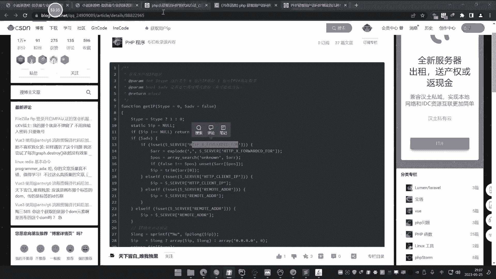

我要去登陆网站，我先看你是不是我允许登录的IP的意思，我再让你登不登，就是我们说的有一个VIP绑定量，你不是VIP，我不让你登了，这是个防护作用啊，那怎么和这个社和主流又产生差不多呢，你看下啊。

我们写的这个代码文件啊，叫post IP点pp，我们先不观测代码来。

你看啊，我先登录，那拒绝访问，就我不管我真的正不正确，他全部局阵法，为什么呢。

我们看下代码呢，代码怎么写的啊，前面是这个前端页面，这不信看的啊，那看一下好了，这有个叫get IP的这个函数，就网子抄的那获取IP的那先获取IP，判断呢判断什么，判断IP是不是在数据库，数据库中。

啥意思啊，就我一个数据库嘛，你看下啊。

阿德比里面那有个IP，这个值1270000本机的地址对吧，我判断一下，那我接收IP把IP解释到。

接收到之后，我去判断一下IP在不在，就说我接收到这个用户访问的IP，是不是在我数据库里面，那IP是不是等于这个了，接收IP他不是1270001，那么不好意思，我就直接怎么样呢。

get else该怎么样查询一遍，如果这个结果小于零，大于零才是有结果嘛，哎结果小于零就直接提示拒绝了，因为那就是说没有结果。

你IP要堆，就说我们在执行的语句的时候呢，就是很简单啊，while条件IIP等于，那如果说你等于127。001，那么好，这就有结果是吧。

如果说你不等于，那我写个错IP，不好意思，零大家说这里不大于零，它就不会进入正面启动了，就进入这个else，这是代码的一个逻辑，对不对，这种东西就会引发插板F组，为什么，因为它接收IP的里面。

其中一个参数叫h p x for word，用这个接收IP是有安全隐患的，什么安全隐患呢，就是我刚才说的可以通过数据包来伪造，所以我就可以怎么办呢，把这个地方进行伪造，大家看着啊，怎么伪造呢。

先来到刚才那个地址。

接着来啊，那我现在来看着啊，我先输入，不管我就是我随便输什么东西好吧，我随便输，这个都是无无关紧要，我登录，我先把它放出去，你看他无论如何都怎么输，他都拒绝访问，我再输怎么办呢，你看啊。

我通过他的拒绝访问提示告诉我可能是限制IP，所以我又加上一个什么头，加上一个头，把刚才讲的嘛，来写上这个值，过去随便写哪个地方啊，然后写成什么东西呢，127。0001，或者我不写它也可以。

因为他也接受这个值嘛，他接受这个值去判断嘛。

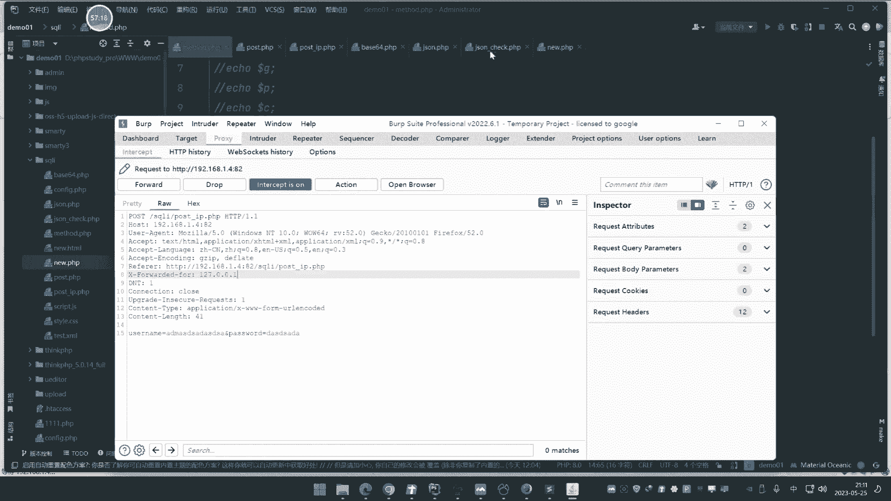

我去判断这个对，去判断这个条件嘛是吧，我不写他，因为他要执行SQL语句，我就可以玩出了。

我写不写他都无所谓是吧，我随便乱写，这里好吧，我随便乱写，唉这他妈的怎么又花屏的呀，过程呢有点小复杂，但是大家理解之后呢，以后就少走很多弯路，你听别人讲，那别人不讲，这个从代码角度给你讲。

你是听不到很透彻的啊，好我就直接在这里先写好，我再搞上去，免得里面的油花瓶，啊我那个拆了个字段就不拆了啊，来直接单引号了，you and when snect是吧，那个那个拆字段我就不拆了啊。

因为那个简单就old的by嘛是吧，我们就猜不过十，就直接后面那把它注释掉是吧，或者呢用这种方式也给初始点移嘛，那给一个单引号，把后面单引号匹配到一个单引号嘛来。

然后呢我是默认database里面就包包字段啊，三个里面的让他报这个用户名，是这里面装的包base是吧，可以撕一下啊，嗯先先报四个吧，24，你没有，那写着来啊，就写这个东西，你看是不是注入点啊。

来看下来发到这里来，大家看一下，看见没，没多猫，look host出来，你看别租了，啥情况，这咋是个猪点，那不是说好的防护吗，很简单的道理啊，他这个设计是这样设计的，是说解锁你的IP地址。

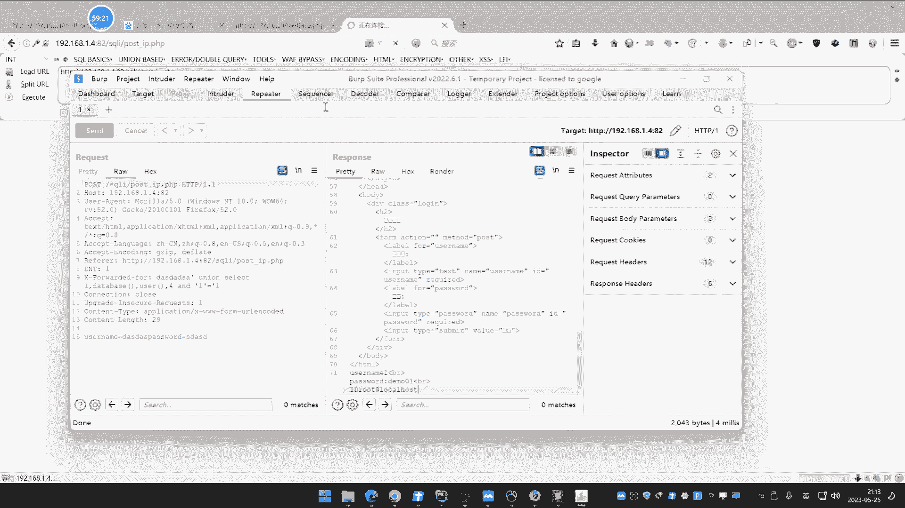

结束好之后呢，他组合这个去判断。

然后IP地址在代入查询，他要判断你刚才数据库里面这里查到了，是不是等于127001嘛，这不就是我们这里看到这个表，这里这个表是吧，这里查这个东西是不是等于12701，那么他一查呢，查对了。

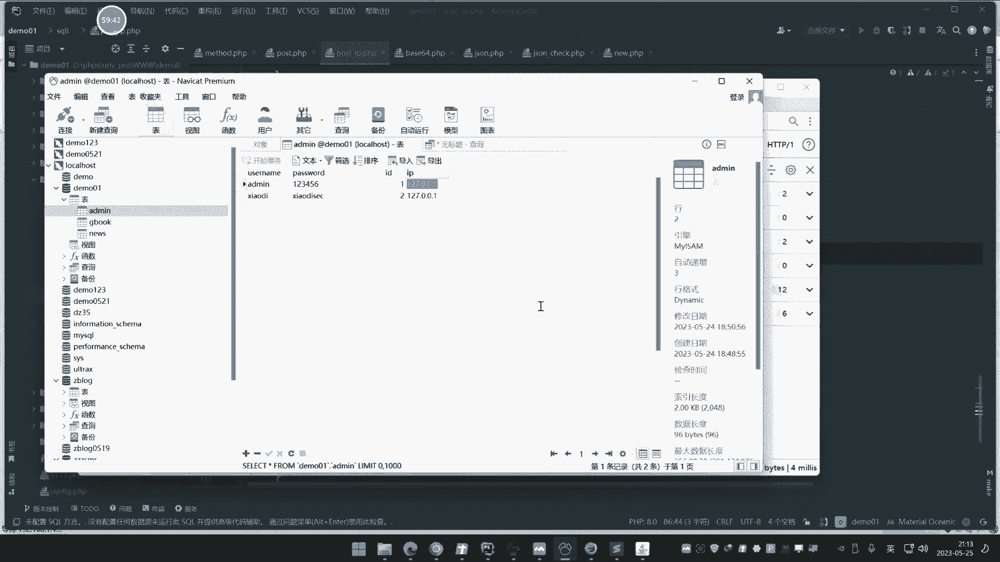

到这就进入下面循环，如果查不对，那就提示这个，但是他这里执行SQL语句，我先让他直接注入成功了，他压根就说进不进入这个后面东西无关系的。

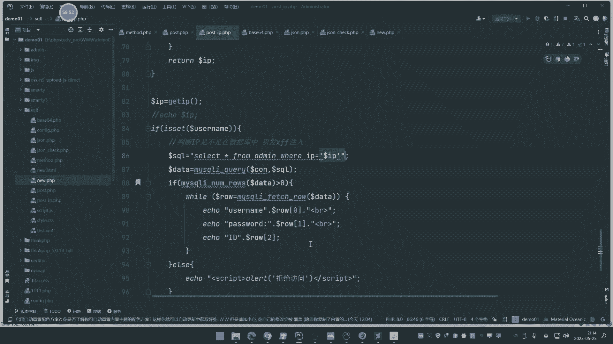

因为这是个语音没执行的执行，这个IP呢就是我们这里提到的这个值是吧，也就相当于说等同于呢来把它复制，等同于他执行的语句是什么呢，就这个语句来来复制一下。

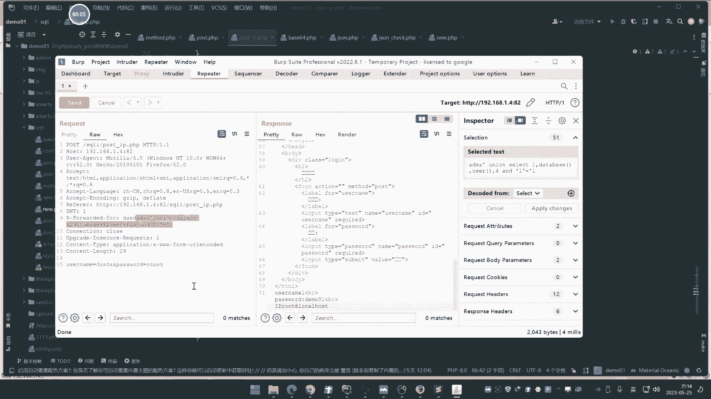

叫它等同执行语句，那这个语句执行不就是我们的结果吗，就是他接收用户的IP来判断，但是用户IP呢他在数据库查询了，导致注入这低一点，这种设计导致的是差百分之路好，那我这是一种设计。

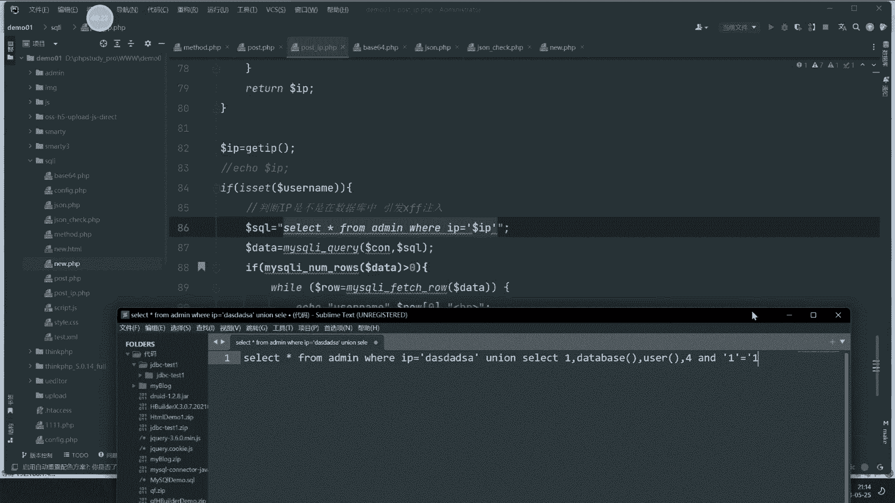

如果是其他两种设计呢，又会导致不同的事情，我们来看一下其他两种设计，比如说第一种设计教代码固定IP去判断，啥意思呢，就是说他这个IP地址呢，它就不是不在数据库里面储存了啊。

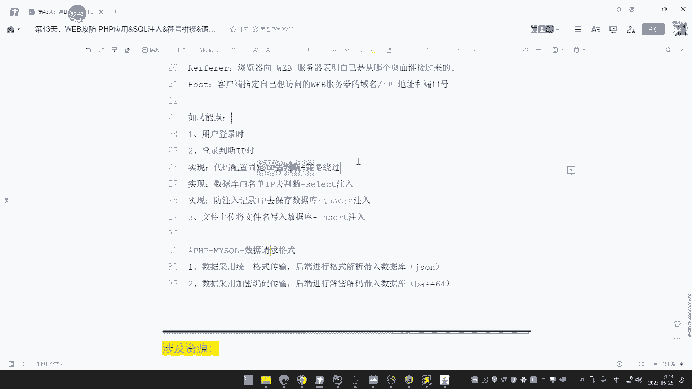

这种呢就是说数据库存储的IP保持这个登录，那如果说换第二种思路，这个数据库把这个IP地址呢A直到代码中，那就不是产生这个猪了，那么其实就很简单，就说啊我固定好一个白名单IP，比如说叫做什么。

就是这写了这种写法，那我就按这个写是吧，比如说这样写的，再写个什么排名的IP，就说是这个id我才能要进一，对不对，那如果说是Z1种，那就那就没办法了是吧，那就不是我们操心的事情了。

那这种那可能说是这种呢，它的安全隐患是什么，安全隐患就是绕过隐患，logo隐患，不能说是为什么说是绕回隐患呢，为什么说是招鬼隐环呢，来大家看着啊，来我写这种，我给他再测啊，虽然他现在没办法租了。

但是不要紧好，我们先给他登录试一下啊，那我点登录是吧，我尝试登录了，哎哎等一下啊。

这个哦这个IP地址是结束的，是还还是那个字啊，还是二个字呃，就是说判断一下，这里呢就判断那个IP进入这个循环啊，我这个逻辑写的有问题啊，啊，其实就是说这里呢就是判断这个这个IP地址。

是不是等于一加起尼斯的话，我们就让他进入这个下面的执行条件，就这么一个逻辑，结果还要加一个那个事情啊，就不用判断这个词了啊，这个就有绕过隐患，这个我就不给他演示了，就给他写上去了。

正因为这个演示呢就要改一下代码，改的蛮麻烦的啊，其实就是说这里那就直接判断这个，判断一下这衣服啊，这个变量IP呢是不是等于是这样写的吧，是不是等于它啊就结束过来的值，是不是等于它等于它之后呢。

就这里呢就把这个语句呢给他执行执行下去，那就这个事情，然后呢如果不等于它就执行这项目，去把这个改一下就可以了啊，那这种呢就会造成什么绕过隐患。

啥意思呢，就正常逻辑呢只允许本地登录，但是我可以修改这个地方，需要刚刚才这个地方把它改成12700，不就可以了吗，因为我就帮他让他解释到是12701呀，对不对，能理解吧，那我呢就绕过这个判断。

能理解吧，所以说他这种呢就是绕过隐患，就和猪猪不相干了，刚才产生猪入了，是因为他在数据库里面去代入了，绕过隐患，那么还有一种情况，比如说房租入记录里面。

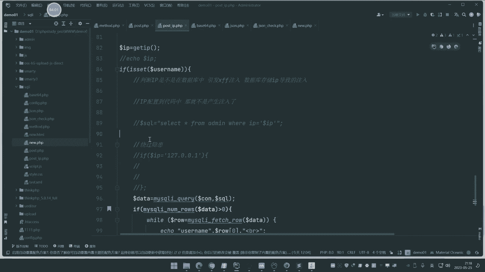

把IP呢去保存数据库，那也有可能的，一种呢就是说去判断，还有一种就是把这个登录的用户IP呢，他有保存到数据库中了，那就是inside的输入，就是说还是和数据库打交道，还是在这里面。

再把你这攻击IP把它记录进去是吧，比如说记录攻击IP的，他也记入数据库，那么你是不是也是可以通过你，你随便伪造一个攻击行为，让你的IP地址以伪造伪造一个SQL语组合到inside中，不是有这个主动吗。

说了三组，我不知道大家能不能理解，说实话很好理解，理解不了，那只能说呀对吧，一些东西呢没学好，可能大家会问答，那这种IP判断不就直接能绕过吗，不是的啊，不是的。

你用P与几批的这个差for word去接受IP，它是能够绕过的，你用其他的那几个函数去解释IP就不能绕过，或者说如果你不用PPP这种策略去解释IP的话，也不能绕过，这句话能不能理解，可能大家会问了。

学的越说的越来越玄乎了，听不懂了，听不懂啊，说实话我现在生病，我的脑子是吧，我都能跟得上，我不相信你听不懂啊。

好我先问大家，我说的这三个东西能不能听懂这三个啊。

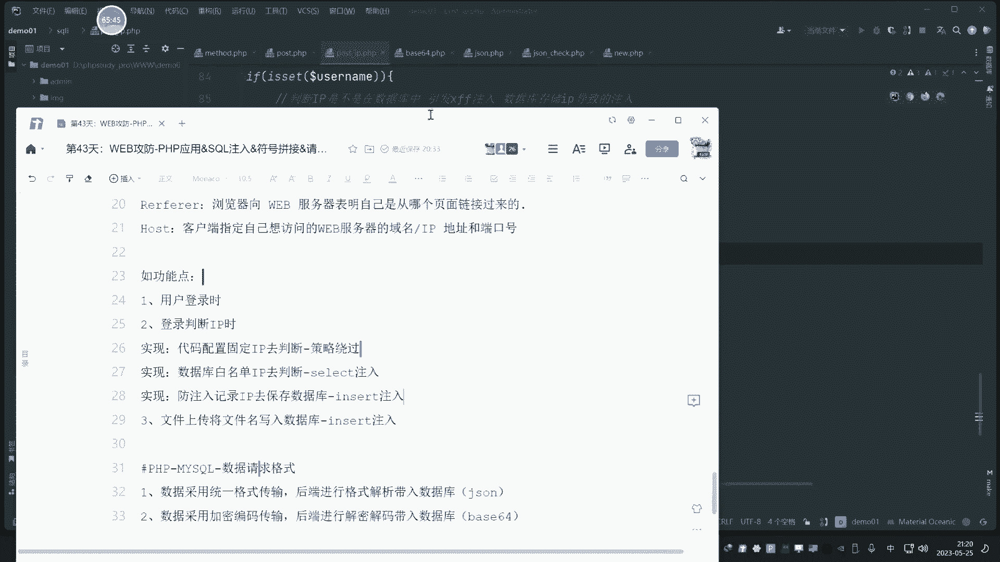

来我说的这三个情况能不能听懂，那我做了一个实验，就是做这个了，做哪一个啊，做这个对他造成了SSELECT入入，我说如果说是这种代码配置的IP去访问，他只是车流绕过，真的这个能不能听懂。

第一个这个能不能听懂，不能听懂，我现在就给你实验，你就实事求是说能不能听懂，一是R是什么鬼，R是听不懂吗，不会是吧。

好大家看着啊，我就只写这么一个东西好吧，你看着啊，我先把这个蛋包把它改掉，看着啊，所以说这个基础太差了啊，这个是真没办法，我不是说这个课为什么说前期安全开发，这个讲过了是吧，这个讲过了。

那为什么后面我还是要把这个代码呢，给他滚一遍，就因为我知道有些人他压根就没有学了，完全没法听不懂，你看着啊，我们在只写这两个啊，因为我怕我改着改着把这个代码全部改错了，你后面浮现不好浮现，你知道吧。

所以我前面都没有改它，你看着啊，这个情况啊，这是那个代码嗯，你看着啊，这刚才代码好唉。

果然是吧，这里就报了问题，尴尬啊，咱们先自己整好，大家看着啊，来我先登录来看着吧啊。

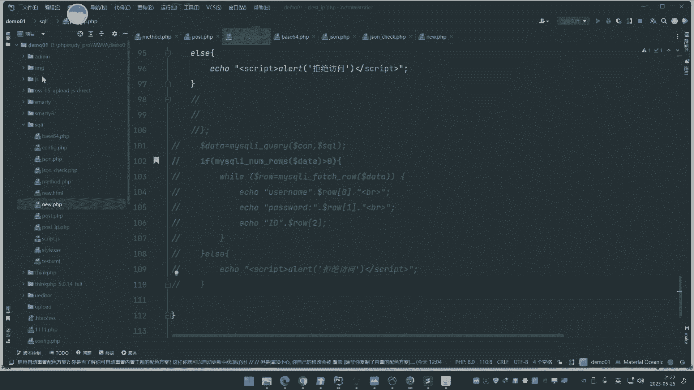

那我登录拒绝访问，看到没，他你不管你登录正常还是返回全部拒绝访问。

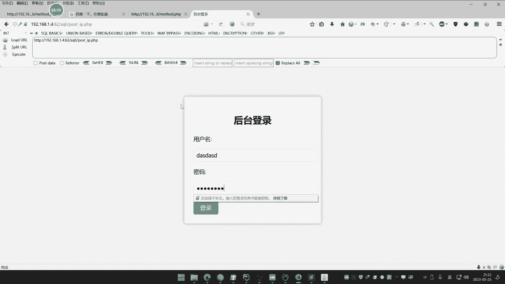

因为就说你从一开始他就进入这个循环，为什么你IP不位移小于零。

我怎么办呢，我把它固定到是白名单，白名单是什么意思啊，就是说这个IP呢是我自己提前写好的。

我不是把这个IP呀放我放在的是什么配置文件，我直接入代码声明中，就是我说的这个意思，好吧，你如果说连这个概念都没有，那就是压根就没有学过开发，我就不说了，前面那是把IP呢放到数据库里面。

所以导致了数据库出入，就是IP呢是不是在数据库里面所知，所以从数据库里面查询出来的，所以导致设注入，而这个呢是我直接写到里面的，相当于说我配置文件里面，或者说我直接代码声明里面好，我这样去高。

然后呢我为什么说这里会造成糟果呢，你看一下啊，那我抓个包给你看一下啊。

那我现在是什么都是拒绝返回，对不对，然后我抓个包嘛是吧，男主不。

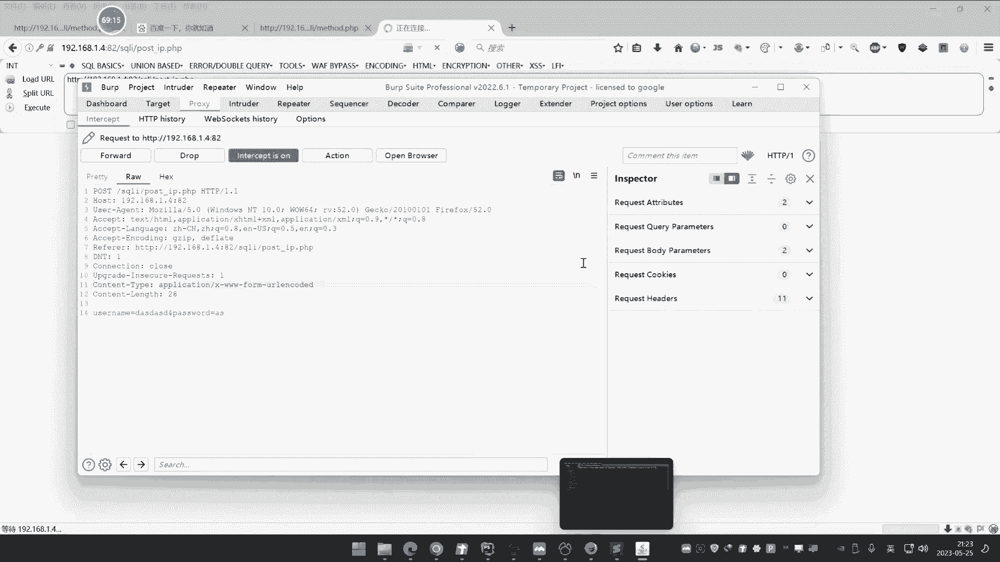

那写上127001再包放出去，看人面的提示可以登录。

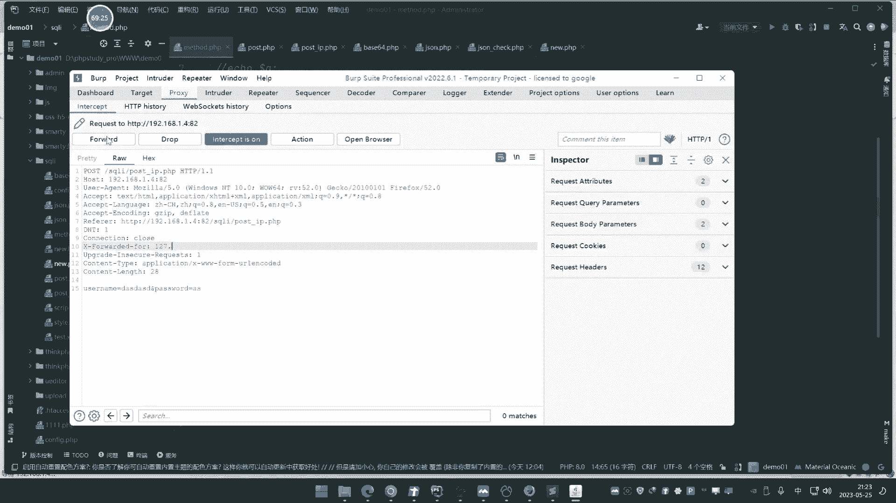

不就绕过那个衣服了吗，不就绕过那个东西哪个逻辑了吗。

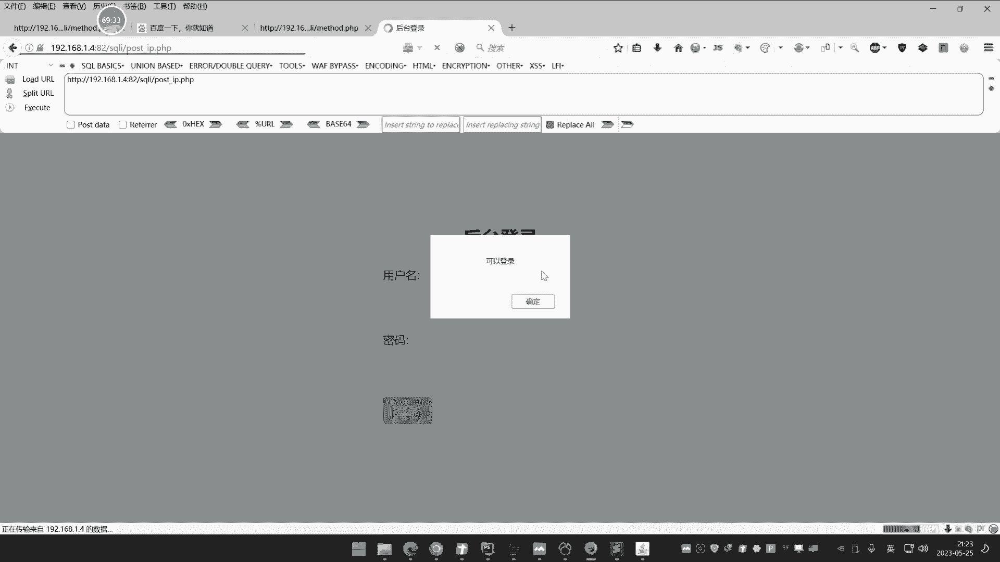

就进入这个逻辑了呀，这还不好理解呀，啊这不进入这个逻辑了吗，哦进入这个逻辑了吗，等于这一心理好，那么现在我又说了，哎呀，这个第三种房租路IP保存数据库有啥意思呢。

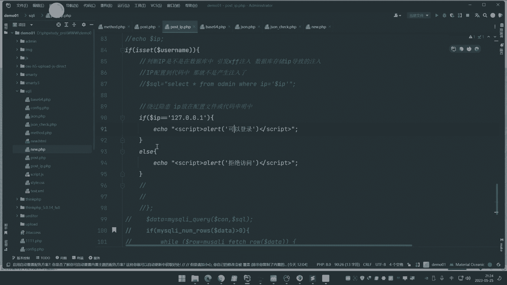

这和刚才这个央啊，和刚才这个央啊，就是说有些攻击者，如果说我要实现这个功能的话，就可能会导致这种字幕，我实现之后呢，我把攻击者IP呢保存数据库，那不就是和刚才我讲那个原理不是一样，求一样的事情吗。

那种话我还好还没有查，就在这里，那就这里呢就和这种不是一样的事情了吗，就是他把这个攻击事件的IP，比如说在这里，我把IP呢用这个插for v改改成这个语句。

不和这个server exside的语句重新组合，形成四个主体一样的道理吗，都是一样的思想，就是换那个功能啊，我是以广泛的设计功能去给你讲，这个漏洞的原型，第一呢是让你知道以后。

你知道这些漏洞会产生在哪里，第二点呢是让你明白这个漏洞为什么会产生，知道吧好我刚才又说了一句话，我说如果是呀，这个刚才有人问说，那不是IP能够绕过吗，不能绕过啊，你不说这里能够绕过吗，我说了一点啊。

这个绕过呢，PET的特性和特性，中的那个什么。

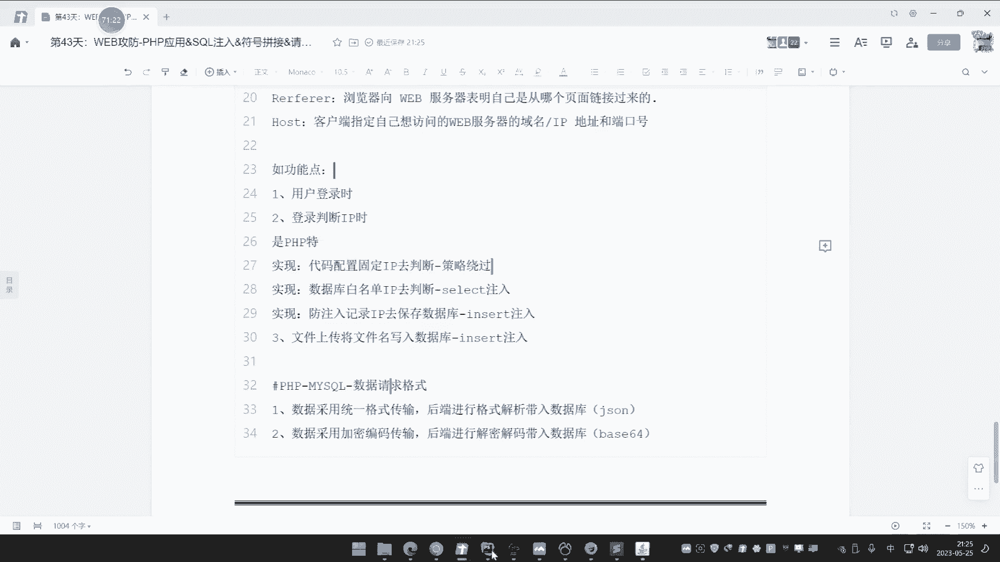

把这个东西拿出来啊，别说IP的账户其他方式啊。

这就是知道过啊，就说你用其他方式，就说他不是IP接收有几种方式吗。

网上还刚才给他查了一下，其他几种方式就不能在数据包去更更改了。

就是他接收IP的时候呢，他可以从刚才那个插佛头里面去接收。

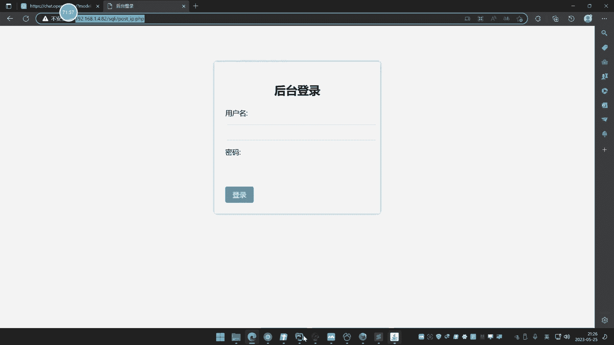

判断IP，如果说你用其他方式接收的话，那么你在数据包里面更改是没有用处的，或者说它不采用pp语言去解释IP，采用的是它的一些电脑上面的一些方法，或者其他语言的一些方法。

或者是等等一些软件的方法去解释IP打哪个IP，可能就不能造成伪造了，就是我们不能去根据数据包去修改，让他去想怎么接收就怎么接收了，所以如果是其他方向的这种接收的话，可能就不会存在这个IP方面的一些问题。

所以原则上来说它涉及这种东西理念是好的。

只是说用到的是pp语言，而刚好也用到了pp语言里面的插for f头，这东西来解释IP，导致这个IP呢是能够伪造的，就是说他是能够伪造的，知道吧，所以才有这个安全问题，如果他不能伪造。

那么就不会有这样的事情发生，就是你更改不了你的IP，除非你自己那去换了这个网络去上网，那才能更改IP，否则的话你是固定的IP，爱你姐吧，就说解收IP的方法有很多。

我们只是用pp语言里面这个代码去解释IP，你也可以用什么其他软件，其他产品，其他语言，那么每个语言解说IP，它的这个实现原理都不一样，有些是你在数据包里面更改是没有任何用处的，它不以那个为准。

他是走的是其他协议，那是我们做不了的伪造，知道吧，能不能理解，你不要说这也不理解啊，那有那我就没话说了啊，所以你不要说我今天讲了是吧，你看到网站之后，你说哎这个什么有IP限制。

哎我讲过直接什么插photo，我一更改就围绕绕过他，你要具体情况具体对待，它是以这个叉FF头去接收判断的IP，你就可以绕过它，如果是以其他方式，你就看是什么方式，不是说所有都可以明白没有。

你不要说是他一说检查比你说能到，我不是这样的啊，那么现在呢这是这个结束方式，那么这个结算方式讲完之后呢，其实呢也告诉我们一点，这个侏儒呢我们可以看到了啊，通过前面的post的学习。

和这个什么这个数据包的学习，也就是说呀，数据包的任何地方，都可以成为注入的一个测试地方，啥意思呢，呐这是个数据包，前面讲的get是在这个上面注入，那UA我们刚才说了。

如果他在这里呢也把这个UA的信息呢也接收，并且有进行数据库查询，那这里也是个注入点，也是可测试注入点，就是把注语句的写到这里测试，那同样道理，这个地方像我刚才说的什么插佛头，甚至这里没有的。

我都可以把它写上去，就像这里呢差，否则如果没有是吧，我把它写上去，然后呢把注点写在这里，AH注入，还有呢是在刚才POS的基金中，是不是啊，也其实说上到这里你就应该明白了。

这个驻点呢不单是你你看得见的和看不见的，你在浏览上面看见的是网子，那就是针对这个上面的是吧，那么上个pose之后呢，发现下面也可以玩，哎，上过这个AP头的，发现这中间这些参数值呢也可以玩。

具体就是看网站它接收什么，他你可能会问，那我怎么知道他解释什么呀，看功能呀，对不对，看他的反应呀，有源码是看源码，没源码就是看反应，你说什么反应呢，就像我刚才说的，我登录一个网站后台。

它提示我怎么拒绝访问呢，或者说IP限制，那我就知道哎，他在正在解释我的IP，对不对，所以那你就尝试哪些参数能够围绕IP的，就钩子上去让他测试，如果说你都不知道提示也没有，那不好意思，那就全部来一遍是吧。

把这注解写到任何，写到数据包的任何地方都测一遍，能理解吧，那就是扫描器要干的事情，当然你也可以自己做。

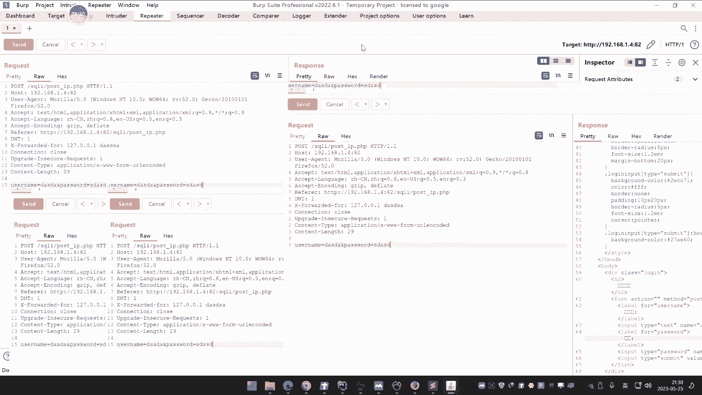

好我们接下来呢再看最后一个支点啊，最后支点那就是数据的请求格式类型。

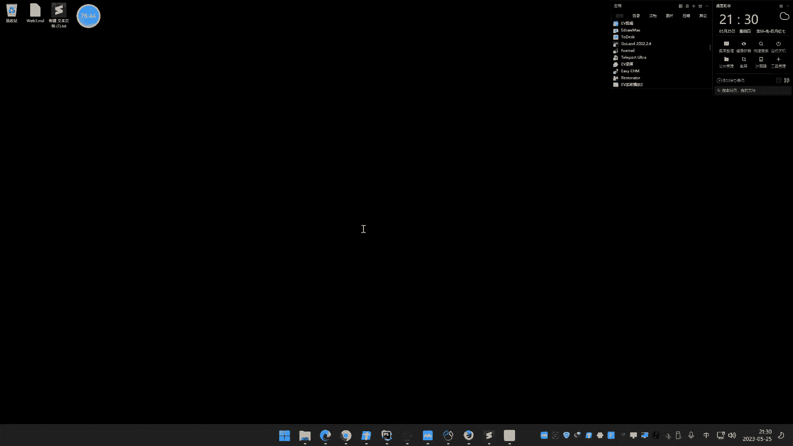

本来呢是有个真实网络给他用的，但后面想了算了，那数据请求格式是啥意思呢。

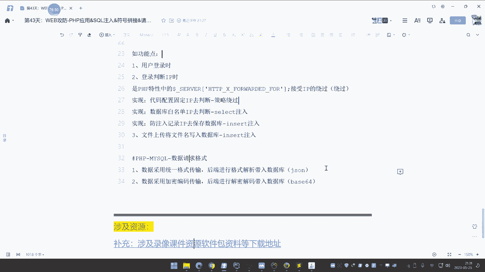

哎说白了啊，就是类似的这种情况呢，我们举个例子呢，那我写个看网上，我找一个。

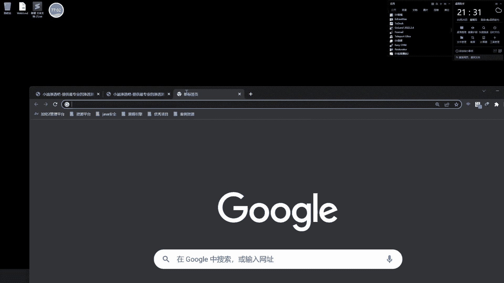

这玩弄你一子的啊，你看我们就搜一下，给他看一下，这还得是谷歌搜啊，嗯这里面的，大家看一下这个例子啊，那你这呢这个你可以再看一下啦，这是个网址地址啊。

这什么鬼东西呢，你看啊咳id等于MQ等于等于要不。

如果不知道的就咋办呢，就这样写了，id123呐，这样注入啊，这样就在后面尝试这样注入了，但是你这样注入了，发现注入不了，为什么呢，他有可能有出入，但是你输入不了，为什么呢，因为这个MQ等于等于呢。

它是一个加密值，你可能说我怎么知道是加密值啊，那前面那个什么加解密算法那种特征。

你就白学了呗，那讲的有什么意义呢，是不是要观察的啊，你要观察到后面的值的类型，是铭文还是加密还是编码等等，那base64里面看你这MD5，MQ等于等于你把解埋一下就变成一了，那你可能说。

那这又和我们常规注入有什么区别吗，是这样的啊，我们思考一个问题来。

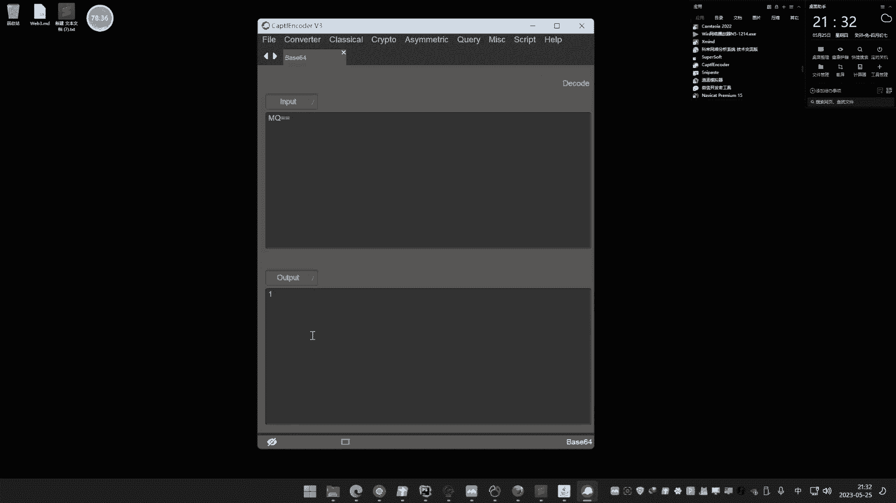

数据采用加密或者是编码进行传输，那么后端如果它有解密解码代入数据库呢，那么你注入你觉觉你觉得要干什么呀，很简单的道理，它MQ等于等于你在上面写着安等一等于一，还这么多语句这样写，那么B方会解密。

解密之后这啥东西啊，加密是这样的，解谜了解不出来，为什么，因为这是个，编码的和一个没有编码的，两个加在一起，解密不了，不能死，所以对方一减啥都不是，啥都不是，怎么代入数据库查询，怎么进入正常逻辑。

进入不了，那该怎么办呢，他的正常逻辑是怎么办的，我们这里呢先给他看一个例子，我们写的贝斯尼斯这个主页面，你看着啊。

类似就是写了一个这个代码页面，我都给他写好了啊，如果你学过前期的开发课程，这东西，那是能够写出来的，那MQ等于等于请求VR023这个登录页面。

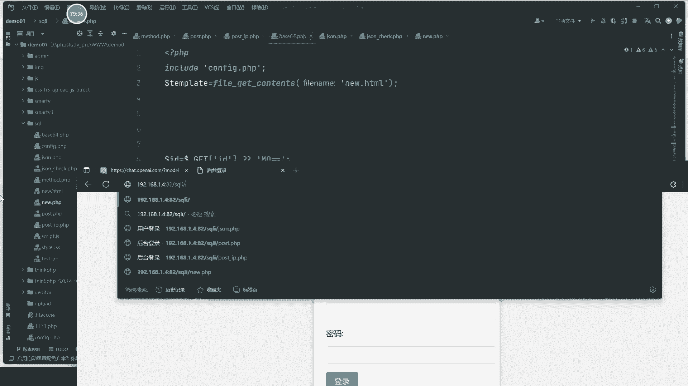

然后这个数据库呢是请求这个值的啊，60里面那R20如果等于R就是消失的，安全博客肖老师开课来，我们来请求二，取消2M就是M5G等于等于你看啊，他也换成mg，等于换成三，那是MW等等于那是一再改编的是吧。

他是个对应值，那么你租的话，你该怎么租的，在租的吗，有任何用处吗，没有任何用处，该怎么租啦，先把这个解密出来，解密之后，然后在这里再写上三，大家分，你注意一句怎么写。

比如说you will i will connect，1234对五六，放上去，i id加上去扩散，是不是六个，12345啊，四六个吧，六个啊，我这里没报错，我让他报个错，哎啥情况，大家不能阻入啊。

U n i l snect，123456，对的啊，123哪里写错了，嗯啊什么情况哦，怎么三天复制复制到这个来了啊，第二啊，他这里呢就正常显示了显示三的这个地方，但是没有报出那个数字，这哪里写的有问题啊。

哦这个单引号哎呀，我说你妹的咋回事啊，一个单引号干扰我，所以说呀我就刚才说的嘛，有很多这种意外都要考虑在内的，你稍微这个不考虑啊，那就给你是吧啊，这样去写这个注点B和那个单引号，嗯放这里来试一下。

你看这包出四和五啊，然后那你栽竹路该怎么办啊，比如四和五都应该显示database，对不对，别号放再来，哎你主语是这样写的，看到没，你不这样写，注入不了啊，为什么你看他代码逻辑啊。

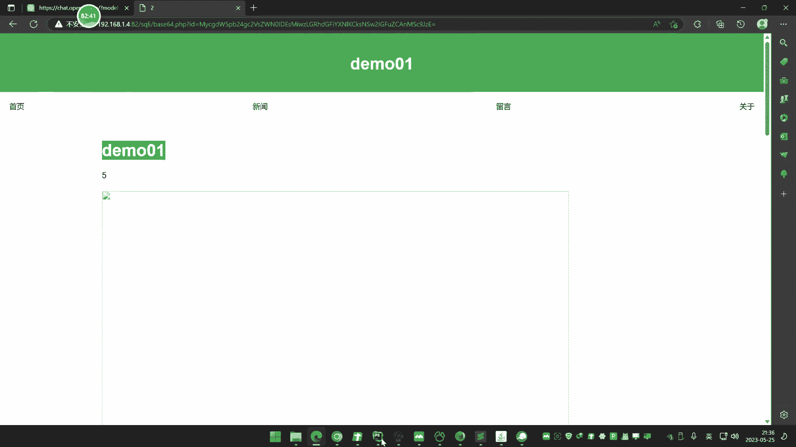

他介绍了你的id之后呢，他用个base60呢把它编码，把它解码了，解码之后呢才到数据上去，就说他做了一个还原，就说表面上那个id值呢默认是三，它把它变成了一个base64的加密值，放在上面。

诶你呢你在上面傻乎乎的敲明文做语句没用，他结束过来之后，解码之后呢，啥都不是，所以这个语句呢就有问题，你就必须按照他的逻辑，因为他是一个什么逻辑啊，是前端加密。

后端呢要进行解密，再带入数据库的，所以你就把你组合好的渔具，测试局也要进行编码，然后代入进去，再正常的解码，进入正常的逻辑，你看这个示例网站就是这么一个案例啊，你看它就等于MQ等于等于你在这后面敲安等。

你等你有用吗，没有用啊，那么很简单，既然你在你敲都没有用，用扫描工具能扫出什么东西嘛呢也扫不出来呀，因为扫描工具它也不是智能的，他哪里知道这是个加加码值啊，啊所以这就是我们为什么要伤这个软件。

就说其实很多东西它是个死的，你必须要结合你人工再配合工具啊，有些东西它会有一些意外的情况，你就让工具知道有这意外情况，告诉他工具在扫之前先把解它诶，他在扫菜，就能经常进入他正常的扫描工具逻辑啊。

所以说像这种他该怎么测呢，是不是就是我们说的这种方式去测呀，你看MQ等于等于，那就是乙嘛，so i id等移的这个地址，你看我们再把它换一下是吧，既然14M修等于2A呢，就是那mg等于等于。

你看他会不会改变的呢，那可是第二页了呀，这是第二个呀，那同样道理删了，你看你看我就知道他的访问逻辑，那是你你哪知道呢，你一看那是码的是啥鬼，这id怎么这种情况，你看你的第三排第三的，那等于三的值。

对不对，那很简单，你这条猪，那就是这个情况是吧，就和我刚才一样的order by啊，这种情况你这样去注他，以上期我还讲过这种类似案例，就这样去讲它是吧，后面呢我这这个东西呢还租。

哎他的不知道包了个啥玩意啊，我试一下啊，我看下是这个报错还是什么的，我把后面加大一点，其实这里呢这撕那也不对，那报错了还不对，但难道说这就就就奥特曼一吗，那显然不思啦，对不对，也不知道有没有租啊。

现在还不清楚啊，那包子包给面，那可能是什么原因啊，可能还有一个原因是什么，单引号原因，对不对，可能还单一发问题，是不是因为他也跟我们那个可能也是一样的，那啊也是一样的那种玩法，对不对，也不清楚啊。

都不清楚，只能盲猜啊，是吧，只能盲猜，所以说这就是那种你在，在那个实战中的各种可能性啊，这里我就不测了啊，我的真实应用啊，上期我测过真实网站，你下次去测啊，我就不测了，那他就是那种玩法。

就是我们这种玩法去测它，那这种呢是我们说的贝斯尼斯，那还有一种就是我们介绍温，那什么叫介绍温的JSN，也是最常见的一种啥情况啊，我们先给大家看一下，这个JSN的这个这个地方啊，啊在这里有个用户登录这。

我给他写好了啊，大家看下啊，那我比如说登录艾德米和这个账号，我们先用这工具给他抓一下，好我先给大家看一下这个地址的，然后呢我们对比一下两个地址的一个差异，看来这个地址登录账号密码了，艾米艾米啊。

你看他登录的一个信息有花屏，妈的老是花屏，好我登录一下啊，哎我这在这边信息这里还没再找，你看啊登录了，你看艾特米，你看看这个值呢只是他的一个登录信息啊，我们把它记录一下，放这边来备份一下啊。

好我们再看这个正面的啊，这个网子的啊，它有一个登录，这我们都是自己提前给写好了啊，你看啊，同样道理都是输入这个东西，那我们提交下，那这个登录，你看这两个有什么区很哪区别呢，啥区别大家可以看到呢。

那这是这种的一个显示，刚才那种呢这种显示啥情况，数据格式呢，这个呢application jsn的一个指向，刚才那个什么application什么3w x mode，啥意思啊，这是数据的一个显示啊。

你可以通过这个浏览器能看得更加明白，那你看我浏览器抓包的这个地方也可以看到，那我们随便输。

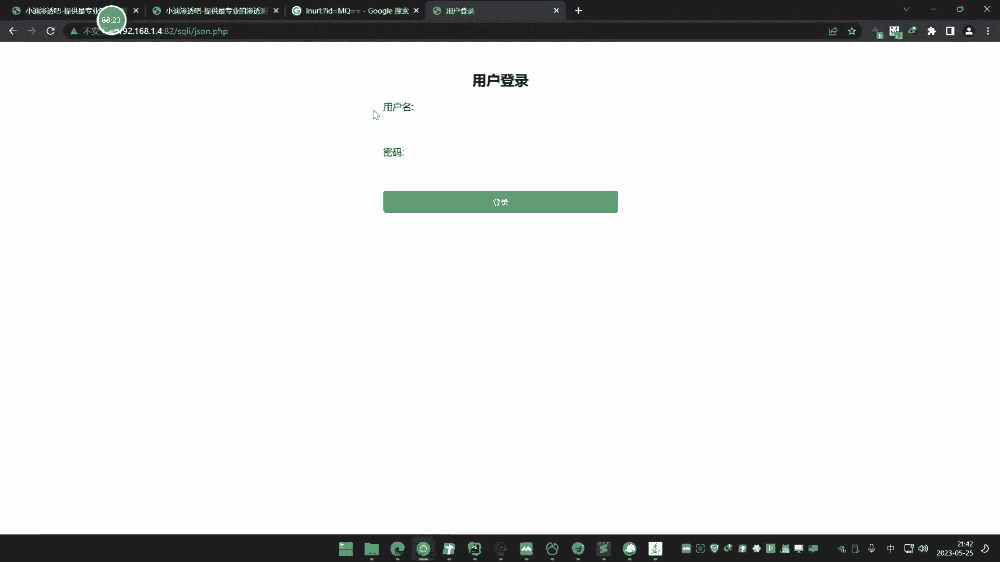

点击登录，你要在数据包里面呢，这个发送数据呢看到没，他这种展示模式啊，JS文的格式啊，嗯刚才那种呢post的那种歌词呢，你看啊post那种格式。

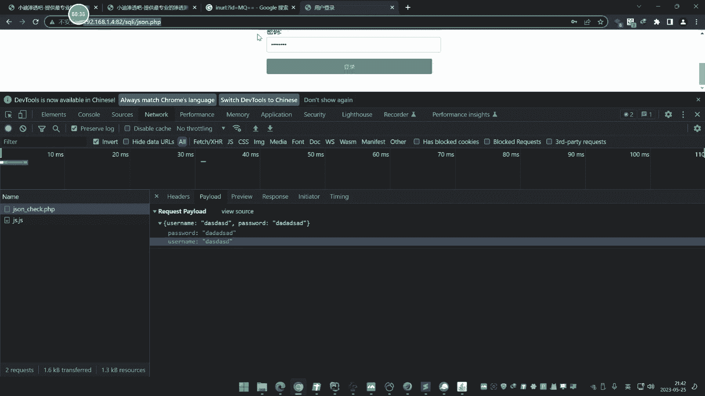

A positive gu，那你看看啊。

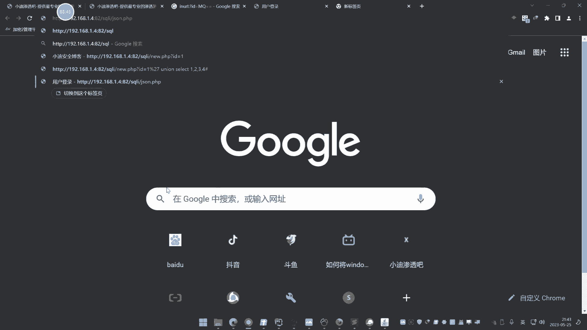

那他也是这种的，那这种人是这种情况，这种很常见的。

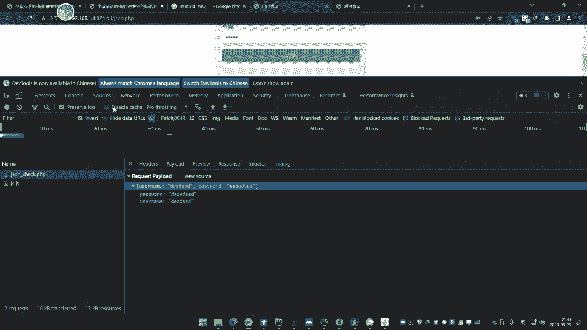

网上不是很多这种情况办嘞，对不对，那这种该怎么注入呢，也是一样道理啊，他也是一样道理，租点呢你要明白这个是你固定的值，那就不说租点，那是在哪里租了，那比如说他要租，我该怎么办，这驻点呢是默认都有的。

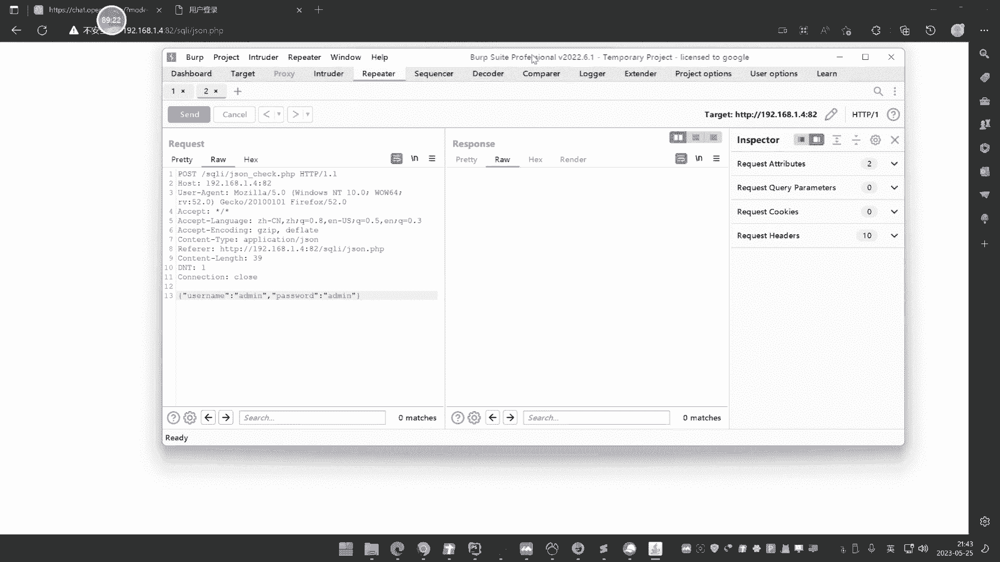

代码中的，我给他写好了啊，这是结束这个值嘛，解释过来之后，用JS文件把它进行解码，解码之后再从里面去取出一字name对应的兼职，这是兼名。

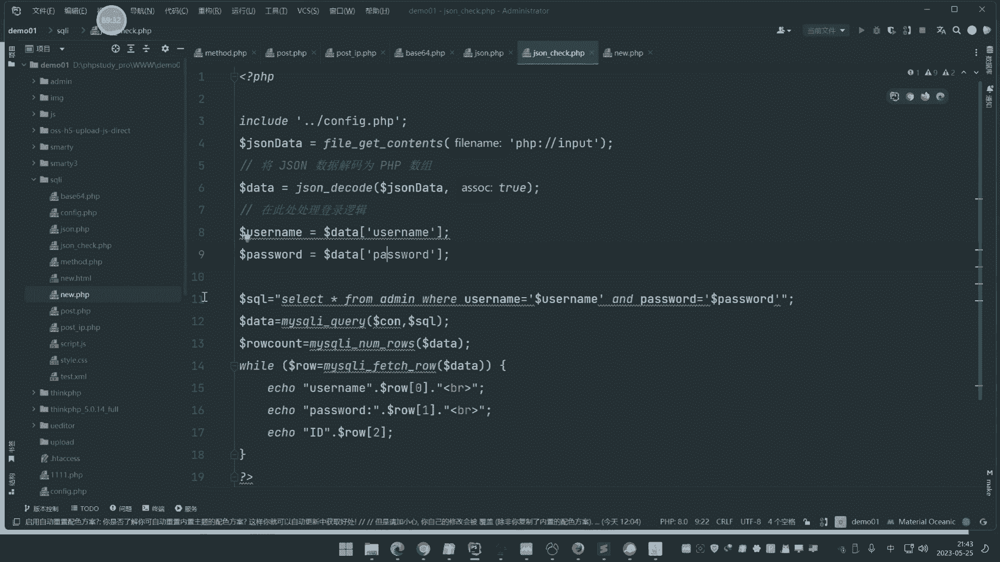

就取这个username界名，取出里面只复制给个USM，然后代入数据库查询。

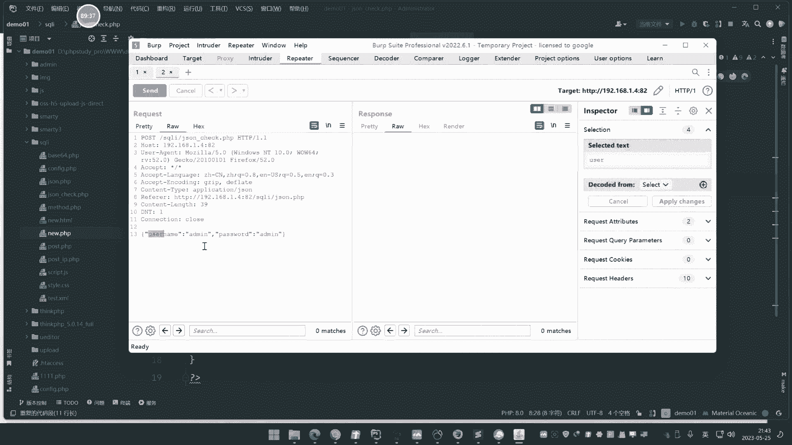

这是那个SQL语句，这是租原理，这不说了，代码逻辑就不讲了。

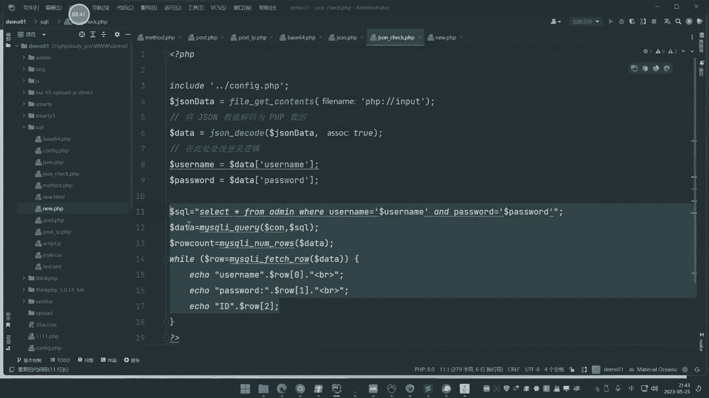

那怎么租它呢，就在这里输入来，再输入啊，就把主语写到这来，然后呢，他有单引号的这个干扰法，写单引号先屏蔽掉you，And i were disconnect，然后呢写到这后面来注释一下，看一下能不能行。

go返回啥都没有，那就可能来写错了，有井号行不行，好有了，你看报数二和三在这里弄的it base，数据不明是吧，id3这里显示版本，5。7。226，对不对，这就是如来啊，那注意写在哪呀。

这里是JS问的呀，然后看一下我们上课的内容呢，上哪些请求类型，数据的类型，数据请求格式有的会把编码，有的会换成JS文，其实都没有什么太大改变，改变就是让你知道格式改了，类型改了会有哪些不同。

我们说的这个类型改呢，是因为这里面有什么单引号啊，括号啊，什么百分号的一些干扰是吧，就是因为你如果说要搜索的话，那语句可能这样写，写了这样，那我们租的时候要拼接这个语句，让他正常才能租。

所以就会导致呢我们在做的时候呢，拼接不好就租失败，对不对，所以我们要知道这些可能性，这是上了这一点，那么这个请求方法呢就是告诉你在租的时候呢，有很多数据呢不仅仅是在浏览器上面。

还有的呢是在这个数据包的post里面是吧，还有的呢是在这个这个头里面，就是看他要接收谁谁代入数据查询，就在谁那里去注入，如果说他接收UA，那么你注意就写到这里来，如果说检测什么这个这个地方呢写这个奶。

如果直插F头，那就如果没有就自己再添加个是吧，写了这个奶是告诉你这个事情对不对，然后呢第3年呢讲这个数据库格式的时候，是告诉你了，有些数据呢并不是按照我们的逻辑，还有的呢可能是这个进行了编码。

好我们还有把解码重新的组合，设个语组合组语句呢把编码重新发送，还有呢像这个JSN是吧啊，看上去呢像没有数据一样诶，有注入点呢，你就按照正常逻辑写到这个传输数据这里来，这还是只是讲的他千篇一律的一章节。

还有很多要讲啊，这个SQL注入呢是个非常大的一个章节点啊，叫网上呢有本书叫什么社科书与防御第二版，但是有一老了，光一个SQL书就三四百页的内容，哎你就可想而知了啊，其实我们讲的呢说实话啊讲的很深入啊。

也不恰当啊，不讲那也不行，这个东西讲了之后呢，像后面不管说是在java中的呀，在这个在什么点net中，各种语言中的一些SQL中呢也基本大同小异了，只是说数据库不同可能会有一些差异，大部分的这个利用方法。

什么请求方式上面的数据类型方面的呀，还有些什么鬼，忙族方面呢都差不多了啊，所以我们拿MYSQL的KV把它讲的深入点，那其他数据库呢，基本上除了他的一些特征之外呀，就相同理论我们就没必要讲了。

嗯其实讲这么多讲的详细的，主要还是在这个代码审计中和碰到的时候呢，有些用处，和大家在发行时有些讲究，嗯今天内容就讲这么多了啊，我不知道大家能不能听明白啊，那下节课呢我们就还要讲EF杂性的。

就是我刚才呢在用的时候呢，大家可以看到我用的最多的SQL语句，在租的时候我用这个un snack是吧，但这种呢是最理想的一种情况，有很多注点呢是用这个语句呢，它是用不了的啊，他用用不了的啊。

他用不了这个东西的啊，因为有很多语句呢他无法拼接这个UNSNECT，他无法拼接这个语句，因为拼接它就会有问题，或者说直接没有任何显示，你也不知道有没有成功，就我们说的一些这种无回显。

诸如和一些报酬莽族方面的事情，那下节课就讲那个事情啊，然后盲租呢主要还有很多方面的一些原因产生，那下节课再讲的时候呢，我们就会基于这节课的一些代码呢，做一些小微的更改，大家就明白一些事情的啊。

就是我在这里呢写了一个代码文件。

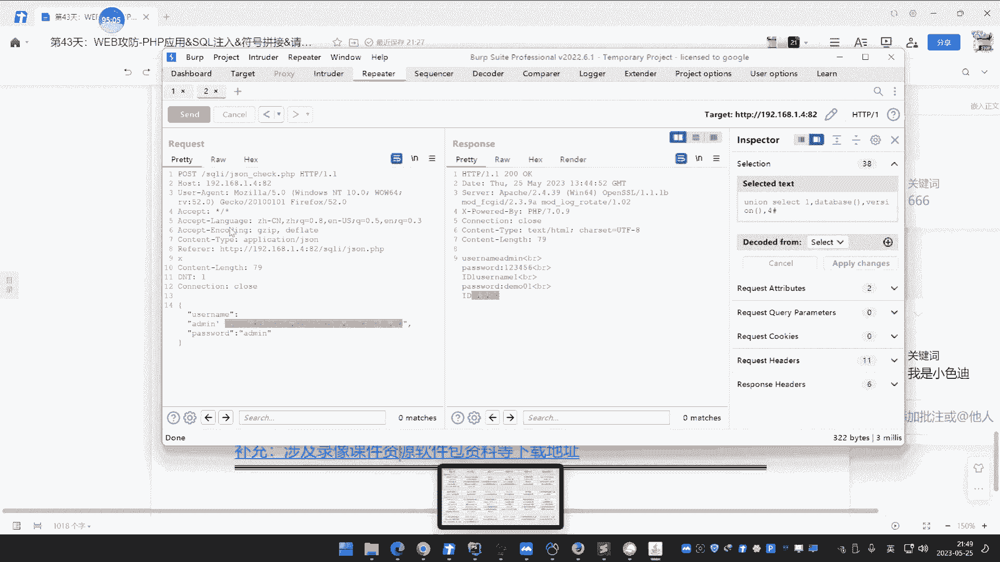

写了一个叫SQLI，这就是放入我们所有讲的SQL语句的代码和文件，然后呢还会给大家打包一个SQL文件进去，就是我们这个这个四个文件是吧。

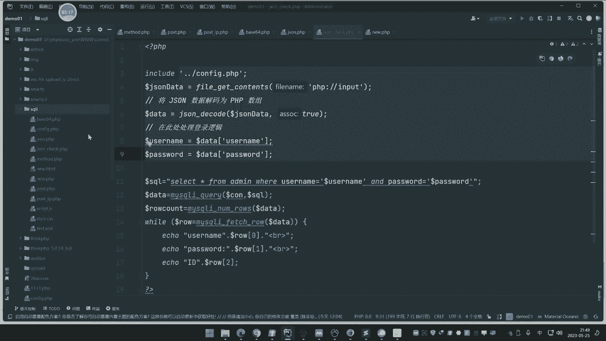

我要打包出来放放进去，你们呢下去之后呢，就只需要把这个SQL文件导入数据库里面啊，就是创建一个SQL逗逗零，然后呢在这里呢去运行这个SQL文件，就可以把数据导入进去了。

代码呢就放到那个pp study里面就能正常运行了啊，这点应该会的啊，这个前期安全开发如果伤了应该是没问题啊，如果没有伤的话，你多琢磨一下也是完全OK的啊，就是用这款工具呢是吧。

连接到MYSQL里面去之后啊，新建个DMI啊，和我名字取一样，然后在这里的右键是吧，运行SQL就选择我给你打包了个SQL文件运行，那么自动这三个东西那就有了。

然后再把我们这个源码呢放到你那个pp study。

那个web目录下面啊，自己去访问那些配置呢。

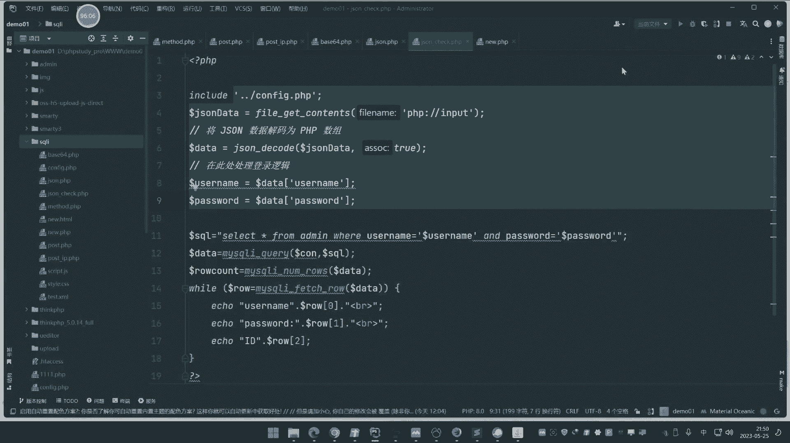

我基本都配置好了啊，简单的自己如果说要修改的话。

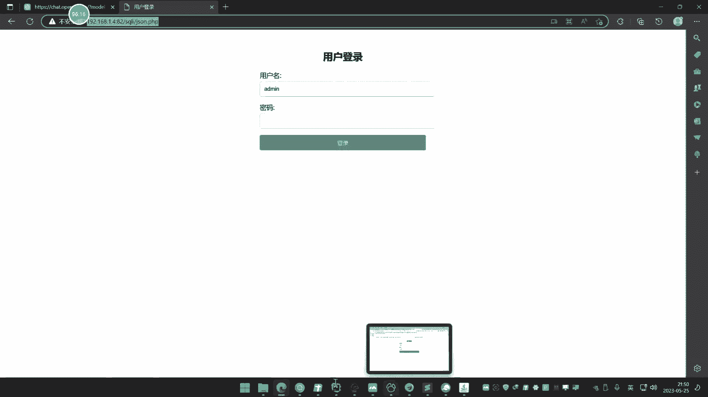

就无非要改的就是这个文件嘛，就是个数据库配置文件，这里啊，如果说你的密码和我不一样的话，你把这里改一下就行了啊，其他的基本不用改了。

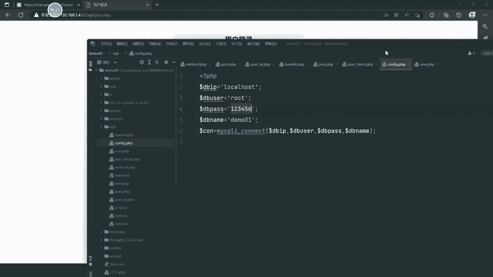

先写好了，然后环境那是我们说的这个。

pp study的这个这个奇的一个pp版本啊，我用的是这个企业的奇的这个版本啊，就这个版版本保持一致啊，我用的是个PP7版本啊，如果用其他低版本无版本的，或者说高版本呢，其版本是个适中的啊。

五方面可能有些小问题，注意一下就可以了，好今天就讲这么多了啊，等下我们把源码，还有一些相应的工具呢给他打包。

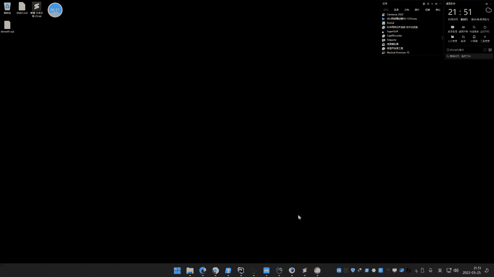

那个数据库连接工具我就不给他打包了啊，因为前期已经放过很多次了。

包括这个刚才看了什么这个这工具是吧，这其实也放过了啊，那有些人老师里面的前面的坡不上，突然砍一颗，然后一工具人看到了就和我要，其实很多情况下我都打包了，以前上过这个内容的都打鼓包。

这几个看到呢我没有放进去，他就不知道到哪里去了。

啊今天就说这么多啊。

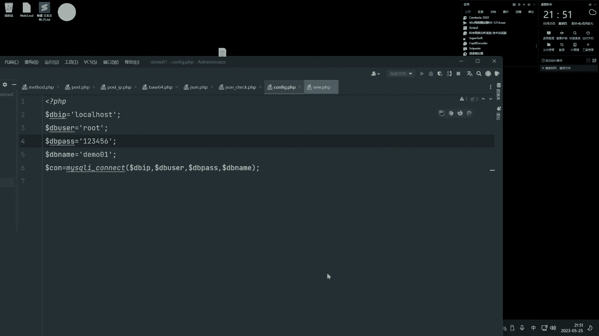

啊看大家有没有问题啊，有问题就问没问题，我们就我先把录录录像关了啊。

把那几个东西来给他打包，放到网盘上面去。

这个问题的话，我还是老老实实给人家打包一次吧，唉那其实在前期找那个编码解码的时候，那，就已经打包过的，讲那个签名前面那个什么加紧密的时候啊，这是个ESE的啊，有些操作系统那还不兼容SQL文件。

是那个SQL，还那个源码。

怎么黑客八呀，黑客八上节课就打过包，你不可能说我每次都打包啊，那也占用大家的空间呢，这前面的源码都是我以前这是源码是吧，这个源码的是我今天讲的是LI，这里面的这都是以前，商在前面讲安全开发自己写出来的。

你前面如果一路跟到来啊，一路跟下来的话，这两个都是讲过的，我只是在上面做了一些简单的修改是吧。

我们没有用网上的八重给他讲，都是自己写出来的是吧，前期将将它的开发，对不对，这个火狐浏览器呢你们要的也行，然后我再给他打包一次啊，后面我就不打包了，打包一次你们也得占一些空间，实战如何找RCE用收招啊。

那不然怎么办呢是吧，文件名注入那个再细讲一次，下节课就会讲啊，哎一样的道理啊，你听都听不懂，没办法，他就是一个insight注入，有啥讲的呀，复杂点就是设计了个20组，还有个高级玩法。

如何准确的查找资产归属，用网上的借口批量帮你查啊，解密不了，这为什么解密不了，解密不了，我帮你查一下能不能解密啊。

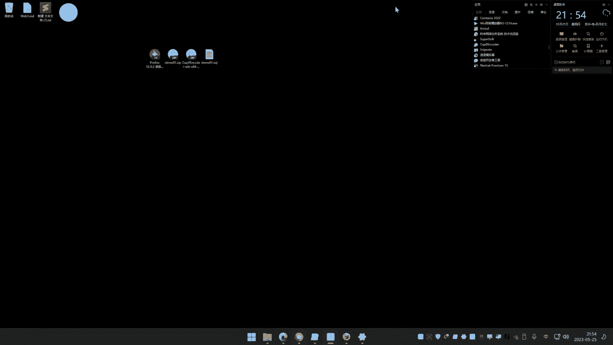

那姐不倒。

我也没办法直接做，解密不了，那有什么办法，非关系型数据库注入，你就说的是那几个其他数据库嘛。

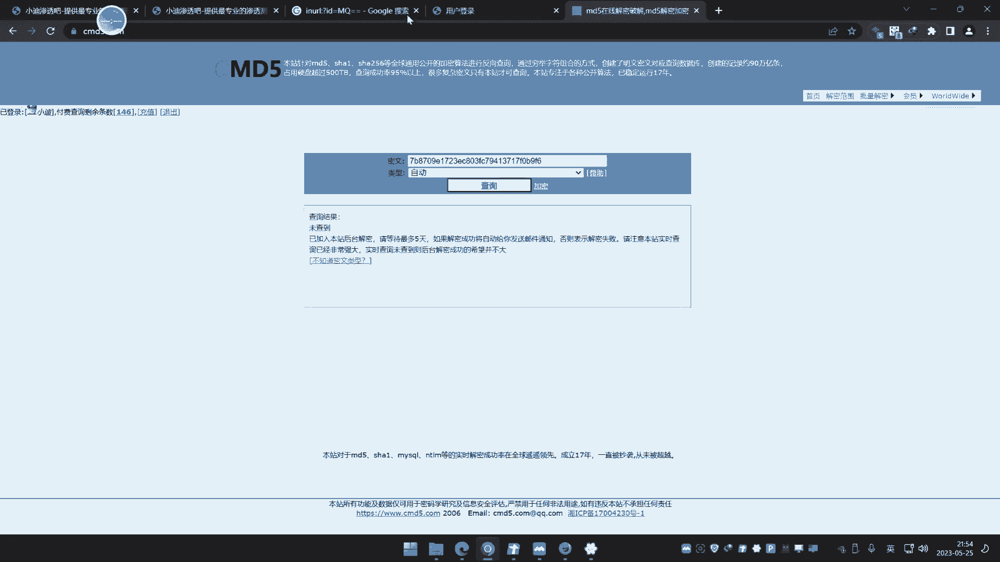

唉你们老给我出现难题，你说不讲吧，感觉有点那个，但你们说的这些东西呢，它本身在那个里面就存在较少，这讲的跟没讲一样，就好比讲了个什么鬼，gs s那个什么鬼叫什么呀，JS连像什么VUE1啊。

那什么漏洞一样，他本来漏洞就少，怎么讲啊，以前那个你说这个非关系户的那个什么猪，就拉几个，出现过几个几个那个什么几个漏洞没了，我们讲的几个数据库呢，不是说只讲这几个是吧，MDB的那个租了也有。

还有什么LOSQL，Losql，以前我还讲过，还一旦被命名成高端，还专门讲了个专门支持LOSQL的组织工具，后面发现没什么卵用，因为碰不到NO sl呢，也是非关系数据库是吧，还有什么这个MONDB啊。

H杯死啊，瑞迪斯啊，对不对，你在网搜他那个驻点本来就没有啊，你很少出现的都是几个那个CF1，那些漏洞包的和它相关咋讲啊，他又不是像我们这种MYSQL里面的，SQL语句的一些问题。

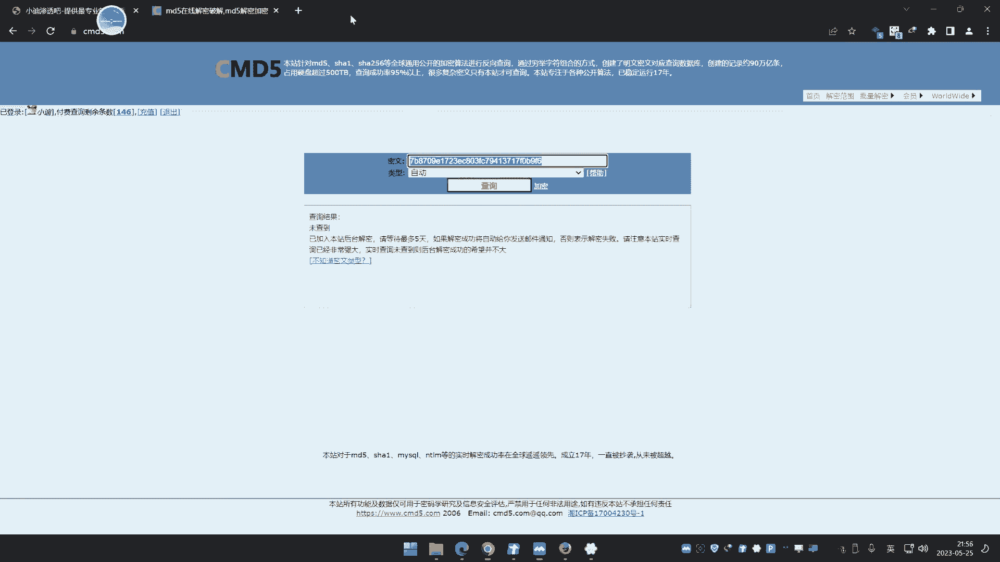

哎，MONDB的可以讲一下MONDB，还有啊MONDB的几个漏洞啊。

那几个漏洞复现，那就是讲了吧，前期我们上期还以前还讲过LOSQL的，讲了个工具，后面发现没什么卵用，因为碰不到，还专门还讲了个工具支持他，你们说的就好比就像我说的那个道理，就是你说的那个事情呢。

他本来网上漏洞就少，你讲他你也碰不到，碰到那他也没漏洞，本来就是个碰运气的事情，他也没有什么知识点，讲不讲嘛，又是基础，number one讲的里面的跟没讲一样，碰都碰不到，蛮尴尬，这个事情干。

不是什么高端不高端的事情了，这个和那高端没关系了，你讲的也不是高端的。

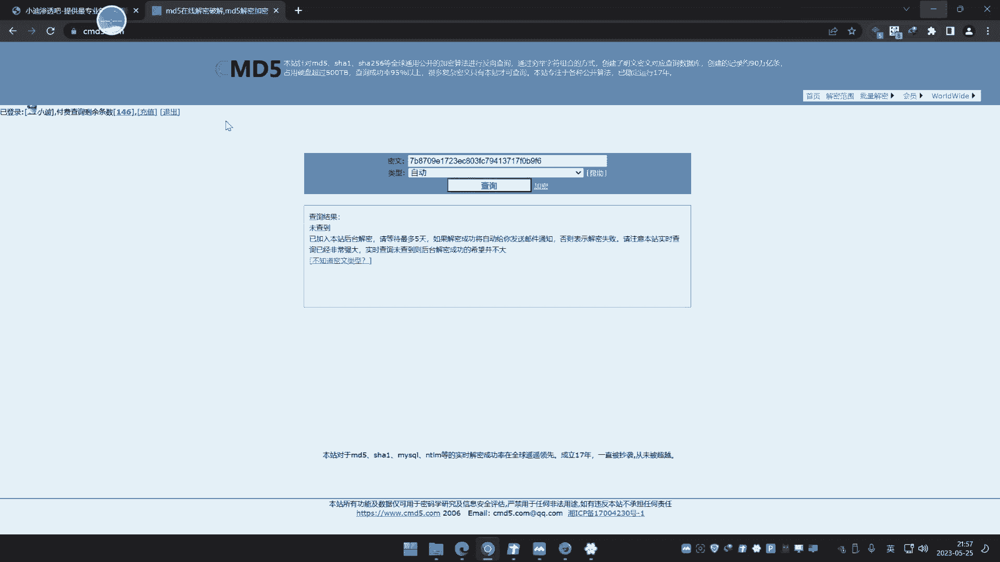

不讲那根本不高端的，将来，那也不是高端，因为你碰不到，你也永远不到你，除非是瓦台漏洞，好今天就说这么多了啊。

我们下节课再见啊，还要问什么文件名注入，再讲一次都说了呀，就是一个inside之路，有啥讲的啦。

那你直都给你讲了，还讲啊。

