# P48：第48天：PHP应用&文件上传&中间件CVE解析&第三方编辑器&已知CMS漏洞 - 逆风微笑的代码狗 - BV1Mx4y1q7Ny

今天呢讲这个上传啊，说实话今天这个科呢嗯比较有些鸡肋啊，但是还是要上，因为这个漏洞呢我们主要是了解它产生的层面，这个文件上传的，我们是预计说要上三次直播嘛，这个pp里面的话嗯，上次直播是讲这三块。

三节课是讲原生态的，然后这个今天讲这个拓展类啊，然后还有个这个安全架构类是吧，我们今天上的内容呢，它不是一个知识点，它更多的就是告诉你一个层面和思路点啊，这是啥意思哈，哎我们先把这个图呢给他搞清楚好。

我们在上啊，因为这个支点是不重要的知识点，它完全就是个漏洞复现。

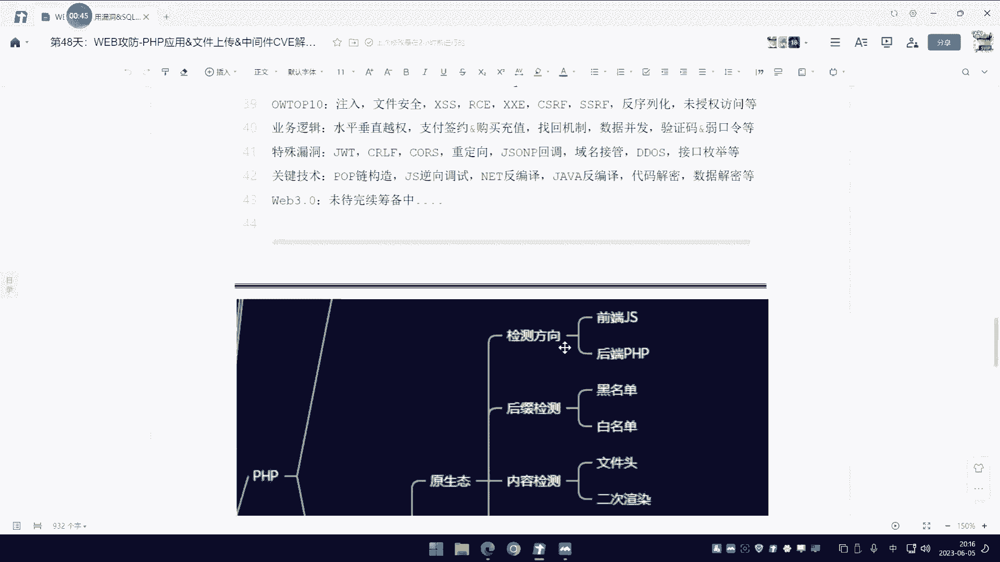

没有啥啥玩意呃，前面讲的这些原生态的啊，原生态是个什么意思，我们先把解释清楚，原生态就是说你在未知对方的这个源码程序，你也未知对方的一些具体信息，只知道这里那有个商权，那么你在上面测。

那么就按照这些测法去测，这是我们说的那个原生态的是吧，你就通过你的测试方式啊，去判断去看哪些操作能够绕过它，这是我们三节课上的这个针对情况，那么今天讲的又是针对哪些情况呢，今天讲的就是有点不一样。

就是说这里的安全问题呢，他是有些小方法和小思路的，你比如说像这个中间间是吧，那就是说其实那并不是这个网站的安全啊，那个商传那个地方的有问问题，他呢是产生在这个程序搭建的，这个中间间服务器上面的安全问题。

就由他呢，然后联动这个文件上传呢产生的安全问题，就是文件上传那个代码块的编写，是没有安全问题的，它是能够正常的过滤和增长的这个防御的，但是由于你这个中介监呢，他报了漏洞，他有安全问题。

然后呢导致这个文件上传都被利用起来，来形成一个安全问题，所以这其实就是它的上传功能的代码逻辑，是没有问题的，只是说用来搭建的中间间有安全问题，那宣宣编的和这个稳定上全一配合，那就形成一个攻击。

是这么个情况，但是为什么说又说积累呢，因为啊这个中间呢他这个漏洞呢，它是有这个版本差异的，就说哪些版本有哪些版本没有，而且这个漏洞呢，目前就说现在截止目前的这个漏洞，那里也没有出现多少个。

就是是吧几最自从早多年多少年来到现在呢，也就是那么一两个漏洞，而这一个两路段还限制版本，也就是说你在实战中呢，你碰上首先是这个中间的就比较少，而且呢漏洞又符合啊，并且还要说你能找到上传。

再者呢又要看这个有没有打补丁，所以综合以上的这条件一看的话，就说这个漏洞能碰到的，这个可能性就是比较小了，这点就是刷说鸡肋的地方，就算你很难碰到，因为他这些条件全部联合在一起就很少了啊。

然后还有个就是这个编辑器哈，这个编辑器呢和这个中间的有点类似，就说网上虽然说有很多编辑，然后编辑呢它也有版本，再者呢这个编辑器呀，每个版本漏洞还不一样是吧，这个和文件上传相关的漏洞呢就那么一两个。

以前呢有三四个，但是有些变形呢，随着这个时间推移呢，渐渐的退出了历史舞台，所以很少再见到以前那些电器了，那么现在还在用的电器呢，漏洞呢就那么一两个，而且他有些版本的一些差异啊，也同样，那是碰运气碰到的。

对不对，好，这是说的他第二点这个CMS呢就稍微好一些，哎只知道它呢它现在还用得着，大部分人都是通过这个东西的一个测试啊，好然后这一可以讲，讲完之后，那下一个我们说的是把这个加狗把它搞清楚啊。

这节课下节课呢就不再是说哎呀，讲商船的那个攻防体系，不讲他的攻击点了，讲他的防御点，为什么要讲防御的呢，是因为现在这个文件上传的，统统和这下面这三种存储方案呢用的比较多了。

也就是说你可能在桌子文件上传的时候，你可能会碰到其中这三个的其中一种情况，那么碰到了，你就应该知道这种东西还能不能搞了，能理解吧，我讲的就是告诉你以后碰到这种情况，是选择放弃呢，还是选择积蓄。

并不是说他是个攻击点，不是说他是有安全的物种啊，只是说告诉你现在这个文件上传，那个存储方案所导致这个文件上传，在网上发现和利用的一个一个这个短板的啊。

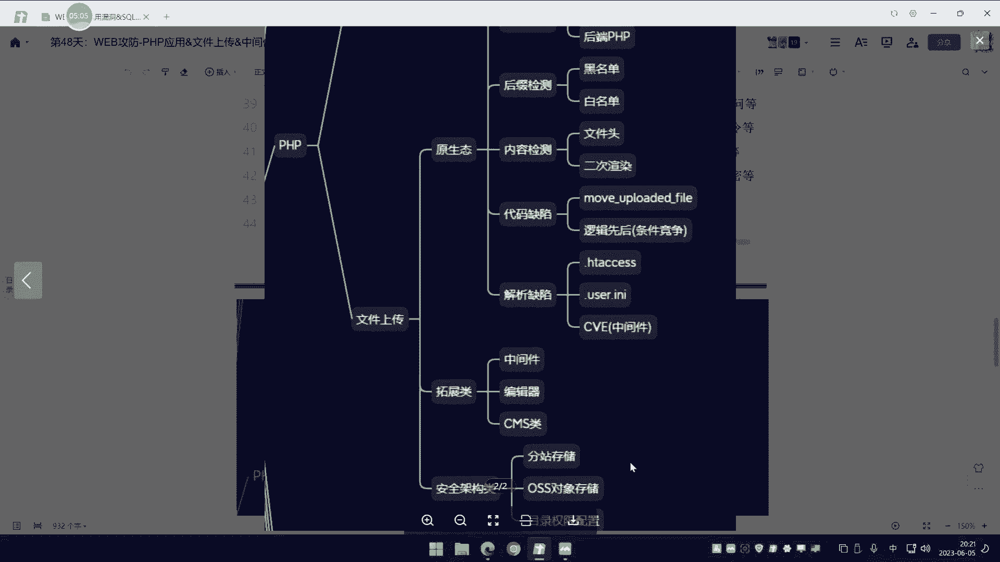

好我们现在呢嗯就把这个知识点呢就给他讲啊，好先讲第一个啊，中间间上面的这个和安，和文件上传相关的几个漏洞，我们由于讲的是PPP啊，这个pp里面呢通常搭建的这个环境呢，中间呢就是这个阿帕奇和尼尼啊。

恩吉利斯这个居多，那么就讲这两个的一个相关的一些安全漏洞啊，然后呢和文件上传息息相关的这两个漏洞呢。

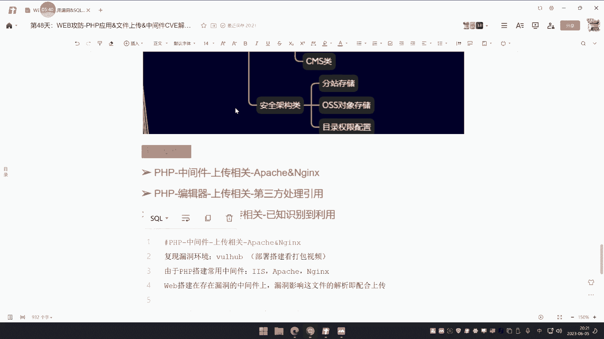

截止目前的一个漏洞情况呢就发现过几个啊。

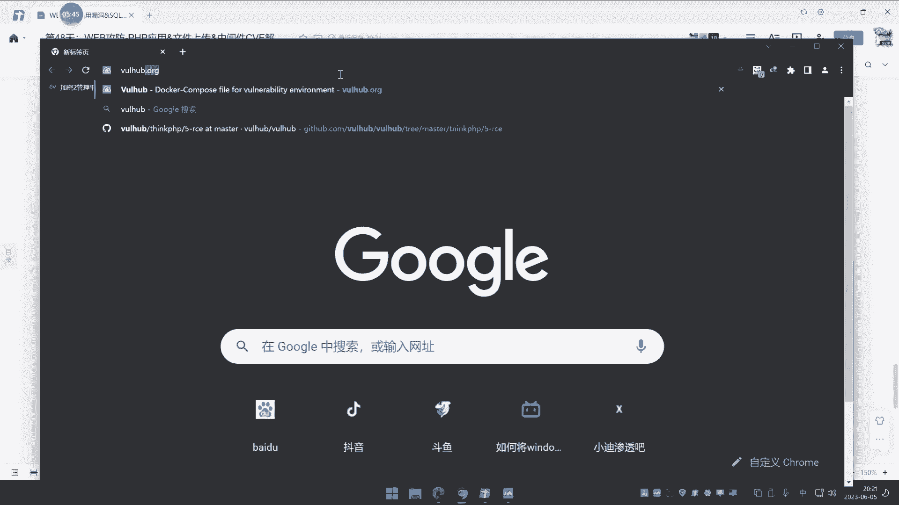

我们复现环境呢使用的是这个VR hub啊，它上面呢有些漏洞，环境能便于我们对这个漏洞来进行复习，我们就不需要格子里搭建了，他这里呢有一个叫荒行解析漏洞，是一个2017年包的一个漏洞，就是个阿帕奇的呃。

也说这里呢在版本2。40到2。4。29，这个版本的存在，这个漏洞好，大家看到了啊，首先这个漏洞是17年的，然后呢是在2。4。0到2。4。29，所以说啊为什么说他这个有一些鸡肋的地方呢，就在这里啊。

并不是说这个漏洞很少，而是因为有版本限制和这个漏洞的一个时间呢，有点是吧，有点小长了，所以啊你即使说你碰到的是这个阿帕奇打钱，那也不见得就是这个版本对吧，有有诗这个版本的也不见得就有这个漏洞呵。

因为呢他也可以打补丁是吧，就很多一些意外情况，而且即使说都符合了，这里呢他还需要一个文件上传点才行，那假如说网站上面你没有上传点呢，哼那你说咋办呢，就说还是等同于没有的一个意思啊。

嘶好我们先把这个漏洞环境呢启动起来啊，这个漏洞环境呢是采用dr。的一个金向拉群，来启动的，关于这个dr。的一个操作呢，呃现在呢没有给他学，不过在我们后期再讲那个人安全的时候，像dr。这个东西呢。

是一个必备的一个基础技能了，我们那个时候呢就会想讲解一下，这个docker的一些具体操作和使用，包括刚才有人还在问。

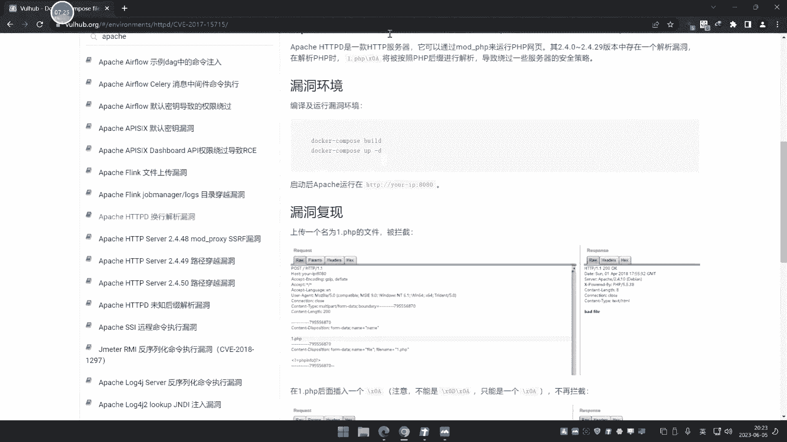

说那个什么K8S那些东西啊，那也是属于那个章节的一些事情啊，好，我们这里呢就给大家去演示一下，这个多尔德的一个使用哈，这个使用呢非常简单呃。

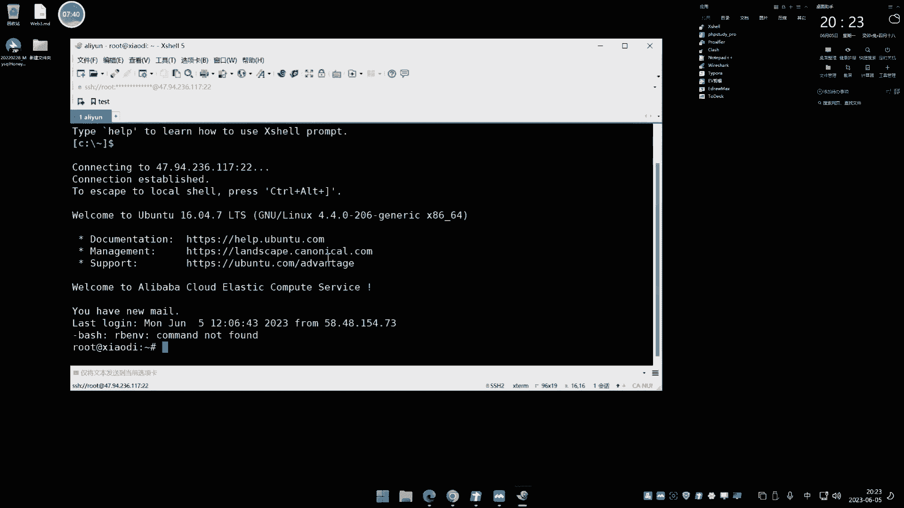

然后这个搭建就说这个项目怎么搭建呢，我现在就是把它启动起来，你可能说怎么用啊，怎么用啊，那下去我怎么浮现呢，浮线呢我应该他录了视频。

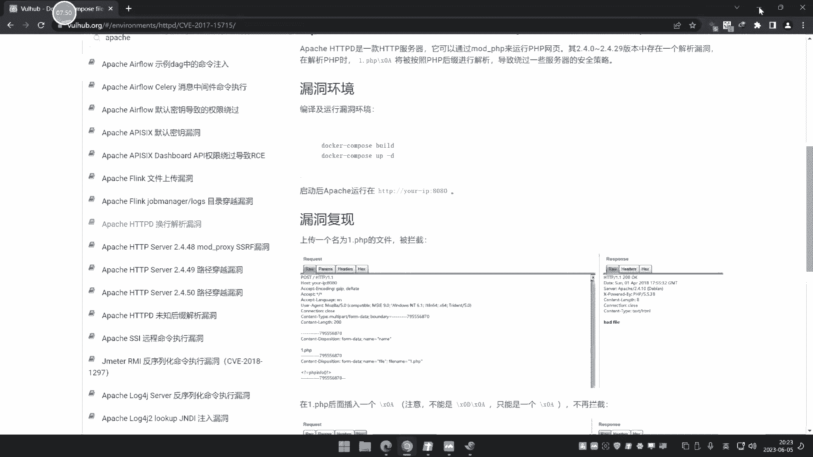

大家下去呢直接看那个使用视频就可以啊，这个呢我就不给大家啰嗦了哈，好这里呢呃他这里呢有这个路径呐。

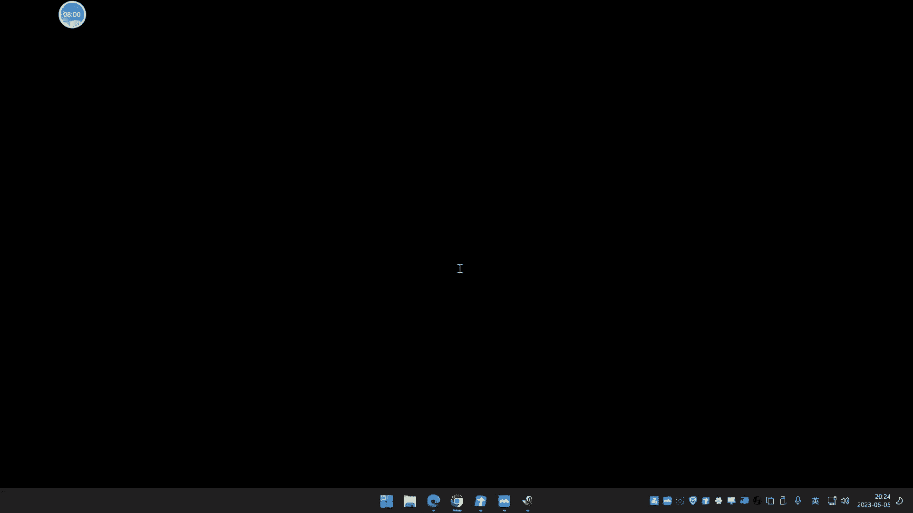

这里是在他的这个目录下面呢，有个这个叫AHBDCV1的，好们起导到这里目录来啊，HTD诶，然后CV1的这个2017年的table型服器，来到这里之后呢，直接都很把这个环境给它拉起下来，先是编译。

由于我这编译过呢，所以他就时间很快直接编译了，把直接编译好了，如果不是，如果没有编译，那就需要从网上下下好之后，那个编译当机启动，启动好之后啊，哎可以装一个抗Faker，那来看一下端口号。

其中的是8080端口，当然了你也可以看，这里呢就是IP地址呢加8080啊。

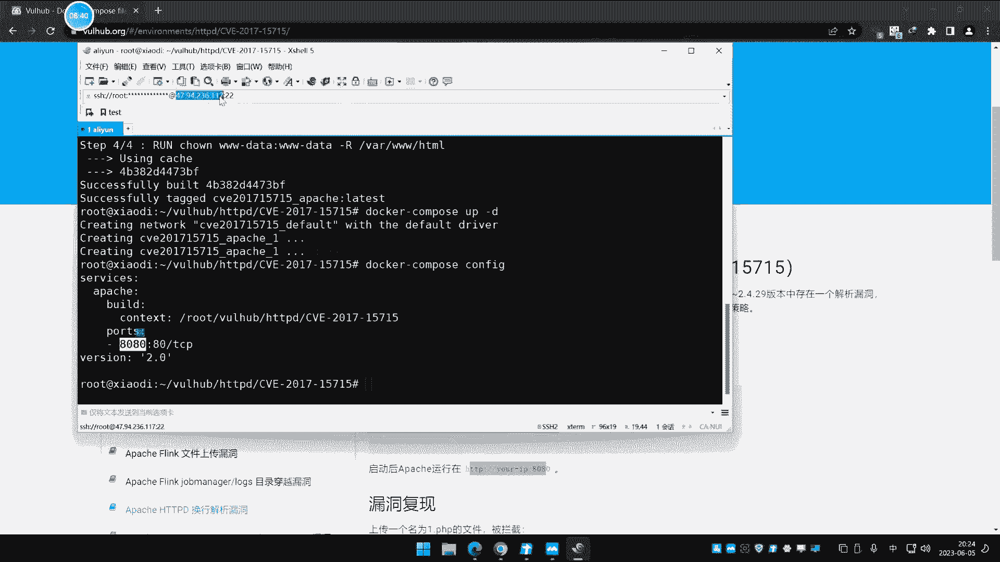

这里呢就是启动了这个漏洞环境，让我们来浮现，在浮现的同时呢，我们就来给大家演示一下啊。

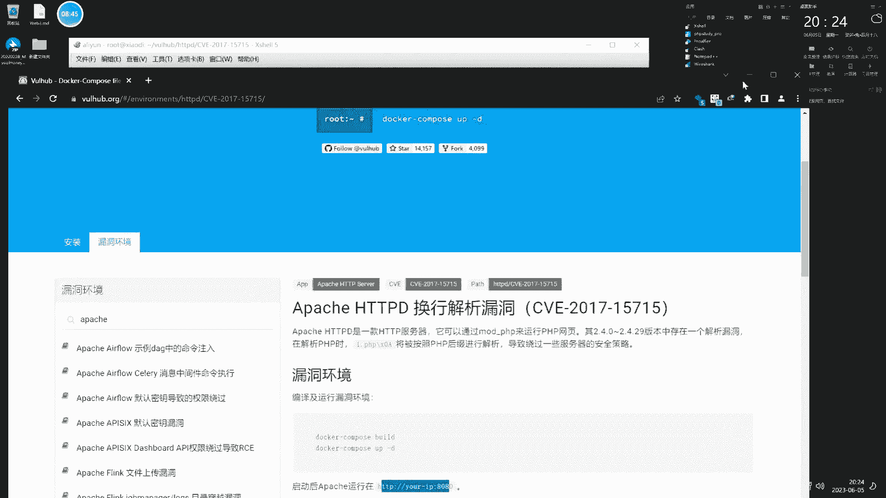

这里呢我们就用这个物浏览器吧。

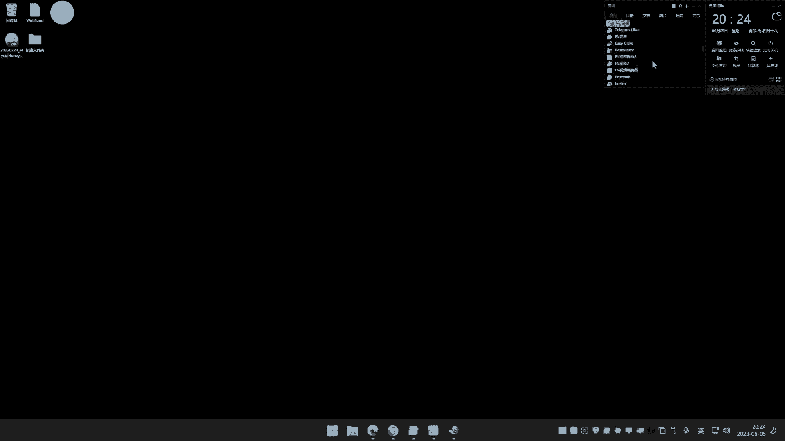

因为等下他还要抓包去搞的啊，我们开一下那个八普啊，哎八普呢抓个包啊，好80mi端口啊，就访问八零马力，大家看到的就是那个测试点啊，然后他是怎么有漏洞呢，就说这里呢有个商权啊，这里有个商权啊。

然后他这个漏洞点呢，你看他还是有条件的啊，就说你要利用的话，你先上传这点，那还要对这个名字呢进行一些修改，来进行一个修改，就比如说我上传个一点pp他被拦截，它不能上传，然后呢，我在E点PP后面呢。

加上一个这个0%a诶，他就不再拦截了，然后我就上传上去了，然后这个时候呢我再访问这个一点pp，0%a诶，他就能成功解析，就是这么一个情况，而它浮线非常简单，而我们怎么知道他有这个漏洞呢，其实很简单嘛。

因为你在访问这个网站的时候呢，这个中间件的版本呢，它其实在这个数据包的回血里面呢，已经给看到了是吧，你看我看一下他这个返回响应，当我想你们也看到了，是个阿帕奇的2。4010，这个版本呢。

刚好是在我们那个漏洞那个版本区间，哎，对不对，所以说啊这个就知道了啊，然后呃他一个漏洞利用呢也给他看了，我先把漏洞利用完之后呢，再给大家说一下这个漏洞的一些情况啊。

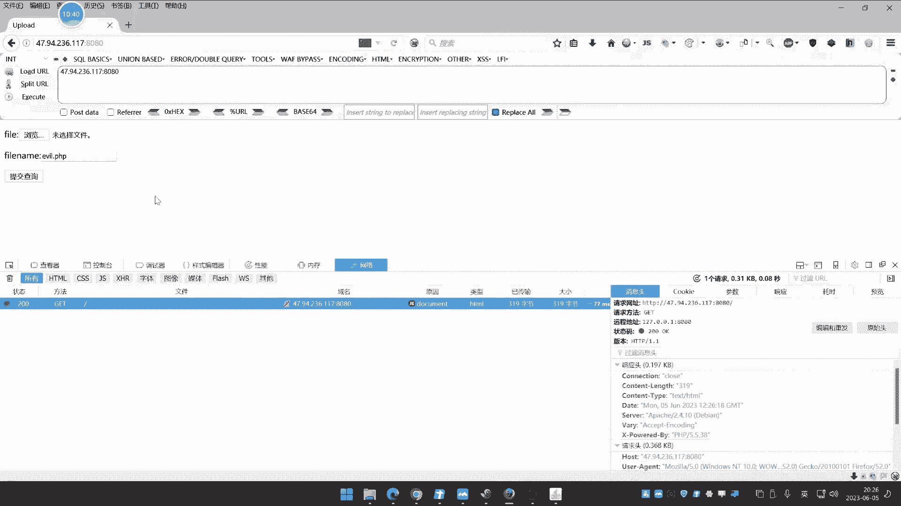

那我们先，这里呢就随便搞一个这个上传的这个文件吧，对对啊，就随便那搞个这个一点pp，在一点pp里面呢写上一下这个后面代码啊。

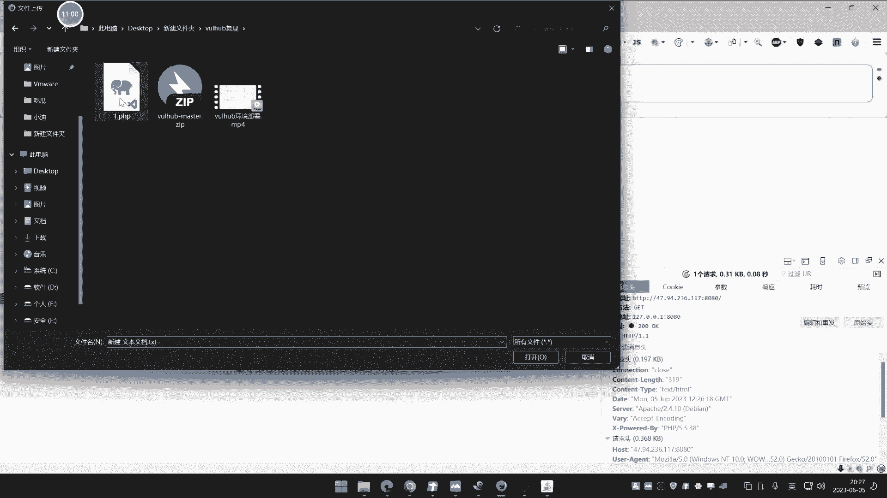

就搞个pp，你播吧，这个简单些。

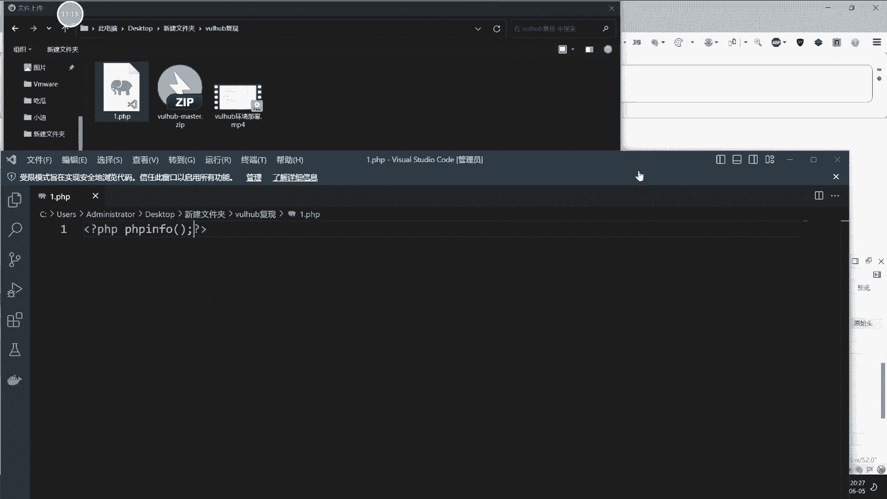

好把它上传啊，那这里呢直接点上传啊。

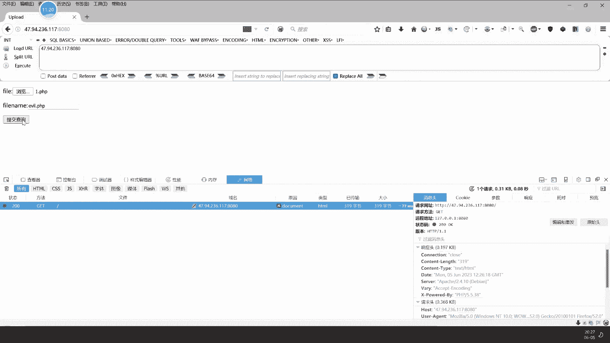

那bad file不能上传，对不对好，那现在呢我就按照这个服务器的一个操作来啊。

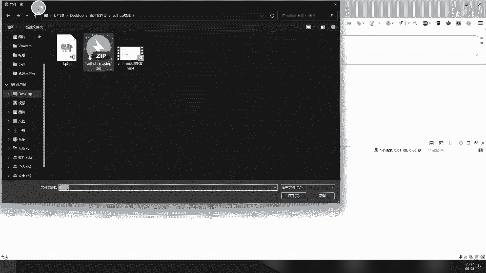

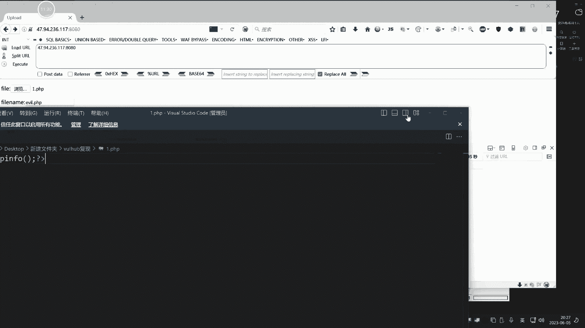

哦把包抓到，那么这里呢就是这个名字，这里啊可以看一下啊，呃他这里呢就是说什么个情况呢，他说这个在后面加上个0A，就是在这个里面码了，改个0A就可以了啊，然后呢等下访问的时候，那就访问这个情况就可以，好。

我们来试一下啊，那现在这里呢加个空格，那么来到这个16进制这里，找到刚才那个空格那个地方来这里吧，在这里啊，好这里有个七零和RN，你看了七零后面呢改成0A20A，啊其实这里应该不用空格啊。

就直接在后面加就可以了行吧，直接在这后面加看行不行，不要加空格，0D这里啊改成0A还是要加一个妈，这什么鬼东西又，对加个吧，平A啊，加上去呢，我们把它勾一下啊，哎这加了之后呢，哎还是这个不行啊。

但我看是哪里写错了呀，哦他是在这里加我你妹的，我说怎么回事了，加错地方啊，不是在这里，在这个地方就这个名字，这里啊一飞这里，in a改好之后呢，给大家上传哦，这里呢就能上传成功了。

那这个就是他这个上传的地址啊，当时呢我们就访问一下啊，访问一下这个地址，我去把符写出来啊，那访问后面加百分之A，你看啊，大家看到没，是不是打印出来了，哦这个复原成功了，我们再来看一下啊，这个复原过程。

首先这里版本要符合，这是第一点，第二点呢要是有文件上传，第二点，第三点是什么，第三点是什么，是不是有有有一个什么东西啊，要有个重命名的东西出现了，就是这能改变你文件上传的名字的地方。

如果他没有这个FINAME，你不改变这个名字也不行，三个条件才能把这个漏洞浮现出来，就问你实战中你能遇到吗。

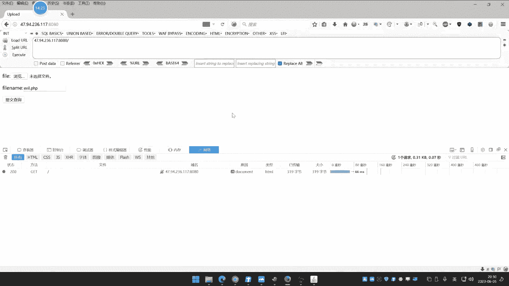

因为他改的是这个他上传保存的文件名，不是说改的你商传的名字。

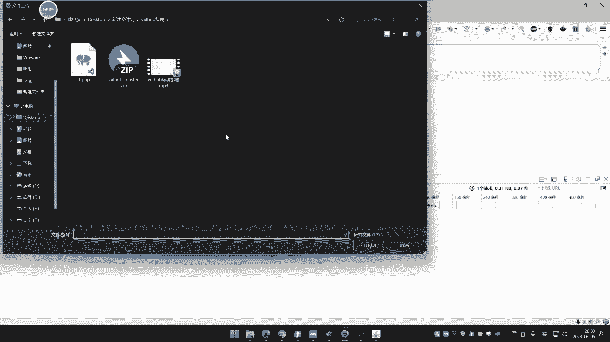

你改上传名字，那还好一点是吧，那还能遇到这一点，第三个条件就有就很苛刻了，因为你有些上传呢，你哪还能自己改名字啊，你想保存什么文件名就改什么，那怎么可能呢，大部分都不行呀，那第三个条件已进。

就把这个东西就是有，就是有这个东西有什么样的呢，我不给你把这个东西搞出来也不行呀，因为你像这个版本的网商啊。

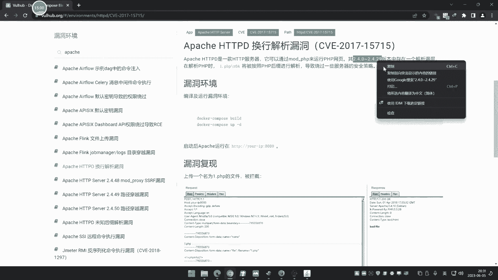

他还是很多的，就是就这个版本还是很多的，但是你要找到这个，你要找到这个什么鬼啊。

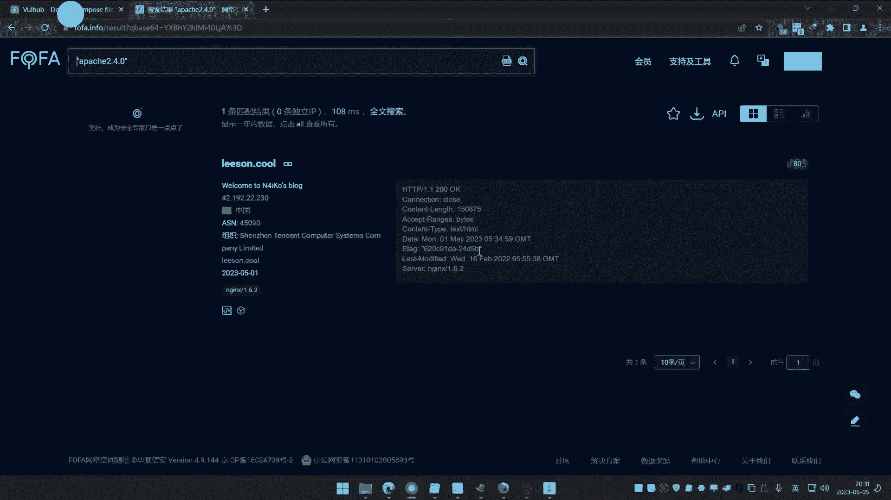

你要找到这个。

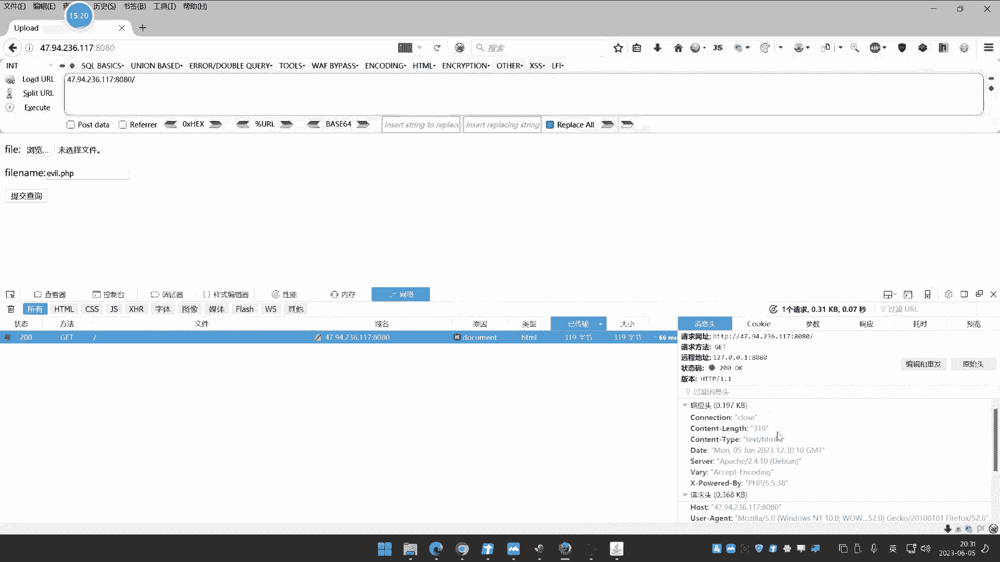

是吧，你要找到这种东西呢，那就不多了，就说这版本的这网上还是多着呢，这一大堆都是这个版本的，这个up不简单，你看都这版本，这版本都有这个问题是吧，那这这这一大堆啊，那这这版本都是符合的。

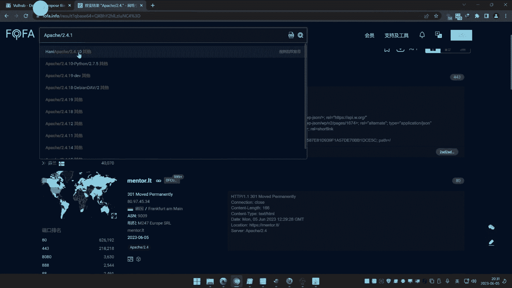

一版本都符合他，但不行呀，他也要有商权呐，而且这个商权呢还要有这个上传之后，把这个文件名字进行保存的机制，才能复现这个漏洞，所以说为什么说你在实战中你碰不到，就和我们前面说的伤了跟没伤一样。

我实战中好像忘记了，也没碰到这种情况是吧，原因不是因为这个漏洞少，而是因为他要浮现这个漏洞，和上传漏洞配合在一起来利用的话，他还要上传哪里呢，要满足，所以说啊有些尴尬啊，你不满足了这个漏洞有和没有。

等于没有，因为你利用不了啊，好这个是这个漏洞啊，然后呢我们再来看这个接下来的这个漏洞啊，他还有漏洞啊，那还有这个什么鬼，换行解析漏洞，那这个漏洞那就不是我们打开啊，先。

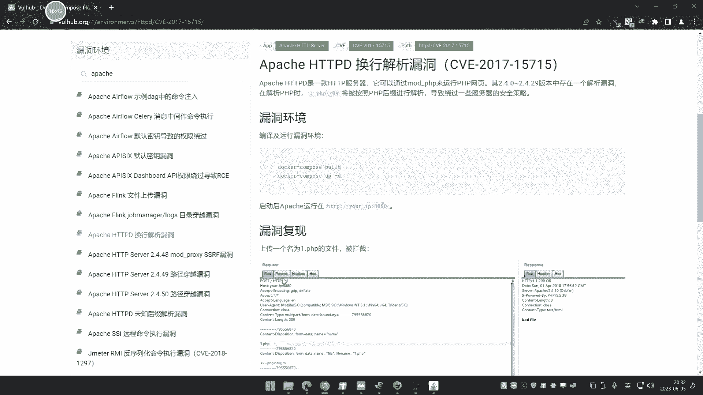

打都打不开。

啊这是那个换行解析漏洞啊，就刚才那个啊还有个这个未知后缀解析漏洞，没有CF1编号，这个什么情况呢，这个是在哎这个配置里面，就属于他配置这个阿帕奇的一些解析的时候，能导致一些安全问题。

就其实和我们那个什么点，ATRXSS的那些东西一样，这个没什么讲的，为什么这样说呢，因为它不是漏洞，他是要配置的才会有这个问题，而且即使对方配置你在黑河中，你怎么知道呢，你不知道啊。

所以说没有什么讲的意义啊，能理解吧，就是它要配置了这个温东西呢，才会造成一些安全问题，而且它配置呢你在黑河中，你也是不知道它怎么配置的，就像那种呢他说配置这个呢叫什么呢，给予这个执行权限是pp的点pp。

那就说点pp的后缀的时候呢，给他执行这个pp权限，那意思是说你只要上传一个名字带点pp的，那就会以pp执行，所以呢他在后面那就上传一个呢叉叉叉点pp，点JPEG哎，上传个图片啊。

图片的人执行这个pp脚本格式诶是漏图，但前提是你有这个配置啊，好你有这个配置，我黑了，中午我又怎么发现你有这个配置，我也不知道啊，所以说这东西呢根基类我们讲都没有必要浮现，它都没有必要，你知道就可以。

以前呢我老在讲这些事情，像上期啊，前面几期我都在讲，主打就是一个全面，后面呢我发现了讲权没有用啊，还有人不会听，还是要讲一些这个能用的一些东西好，再来看这个LINUX的啊，阿帕奇的就那么多了啊。

其他漏洞没有细讲，讲不讲都无所谓，碰不到了啊，这个呢LINUX呢上面呢有个漏洞，那这个CV12013年的这个，这个这个这个有漏洞啊，那这个漏洞呢其实还是有的，但是只说这个漏洞有点久了。

是个13年的一个龙，文件名用逻辑漏洞啊，这是他的影响版本啊，我们给大家演示一下啊，这个还有时候能能碰到好，他的这个漏洞环境，在利亚斯的CV1203这个目录，我们来到这个地方啊，以前呢我是说不讲啊。

有些人就说为什么不讲，后面呢我发现你误会了也好吧是吧，我们不要花太多麒麟呢在一些上面，现在用不着的一些地方去讲啊，然后这个目录再把启用下，都已经告别了很多知识点了对吧，现在讲P1P的很多人都不愿意听了。

因为好多的PP都很少了啊，SP那就不更不说了啊，打开啊啊这是那个地址啊，那我们首先呢判断一下那个版本，从这个响应这里呢我们看一下它这个消息图啊，它发回的是LINUXX1。4。2，这个版本好。

这个版本呢大家可以看一下啊，它是符合在这个压S的一个版本区间的，然后呢，伽马逊呢出现过一个CV，12013年的一个漏洞，这个漏洞是一个什么情况呢，就是有个上传点，上传点呢你在上传的时候啊。

这个呢还是有点利用价值，它比刚才那个要好一些，刚才那个条件有点苛刻，就是说必须要有重命名那个操作，而这个呢它不需要，就是说你只需要能上传就可以了，而且呢只需要上传个图片格式就行，其他的就不需要我管了。

他就只需要上传个一点GF，然后呢在E点GF后面呢啊，去加上这个东西去访问，就可以把它当做PPT解析啊，就是在上传的时候后面加个空格，然后呢在访问的时候呢，后面加上这个东西就可以呢触发。

所以他这个利用条件是很，就是说它的利用条件是不高的啊，基本上都能满足，主要就是说你是尼亚斯的一个ng list的这个，中间件，而写的存在，这个漏洞就看在不在这个版本区间啊。

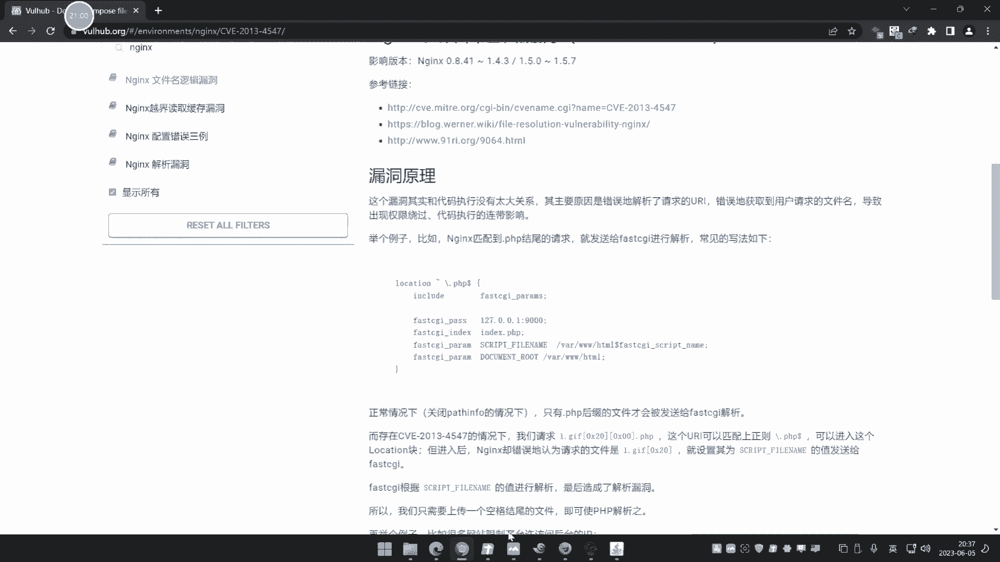

所以他还有点加字，虽然说是13年的啊，你看啊，我们先上传个GF，好这里呢把包抓一下。

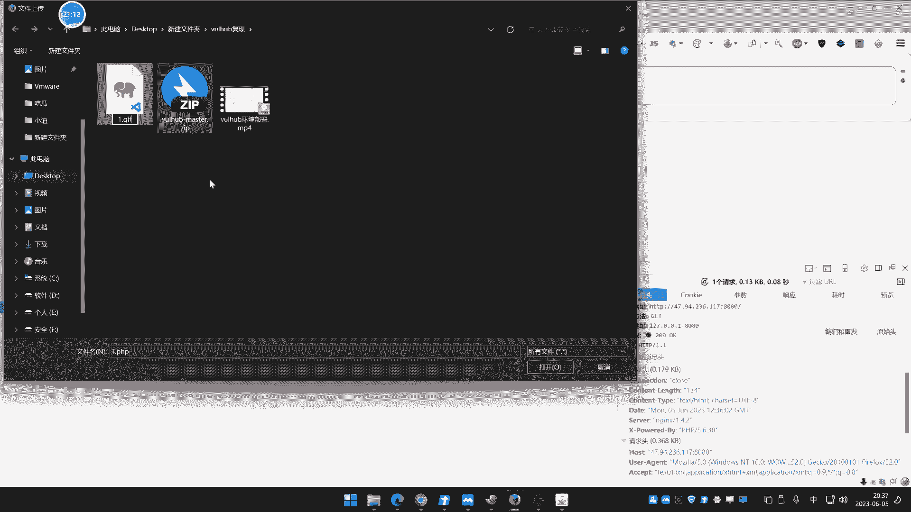

然后怎么浮现它啊，然然浮现一下啊，所以我们先发送一下，可以看到啊，他能够正常的去去存储和保存啊，版本呢也是这个liars的呃，ng list的1。4。2啊，符合，然后再上传这一点GF的时候呢，加个空格。

加个空格，加空格之后呢就可以了啊，就把它发送上去，你就不用管了啊，它漏洞成因我们不管它了，那就把它发送上去，放上去之后啊，访问的时候，那就这样去访问，就要在这里呢去改这微信去访问好，我们来加上去吧。

访问提交好，一直删，你看删完之后呢，他就保存了啊，然后呢我们现在去访问它加路径啊，访问呢也要抓包啊，不抓包的话，你搞不了的，那访问访问，把这个访问数据包给抓到，好再发送数据包啊。

发到这个请求模式上面来啊，在这里呢加上什么东西啊，看着啊，他就需要在后面呢加上这个点P1P，然后呢，把前面两个东西都改成20%和0%，空格空格点pp导，我来到这里，这个地方呢，那这里有个20%嘛。

这个20%呢，最后又后面百分之改为零，好好现在去操作啊，来看一下啊，那是不是触发出刚才那个GF里面的PP代码，对不对，这个就是那一个这个LINUX的一个那个漏洞啊，那么也就是说其实啊这个上传点。

两个浮现的这个文件上传点呢好像都没问题啊，包括这里呢它还有一个漏洞，就是也是一个疑点最新版，然后呢这里有个这个漏洞，这个漏洞呢有点类似于我们那个i is的那个，起点零的那起点差的一个版本的漏洞。

就是什么东西啊，就是说，有些配置不当的会造成这个结论，给大家演示一下啊。

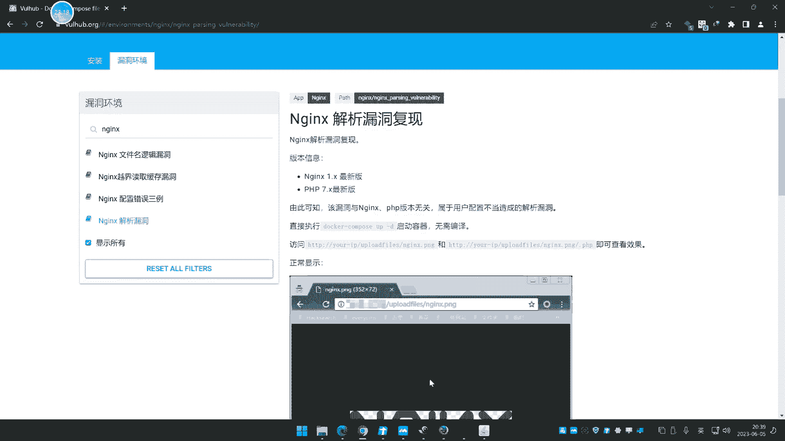

嗯这个环境一起已经演示了，我们就张角啊，当然来到这个环境里演示，这个是配置不当的啊。

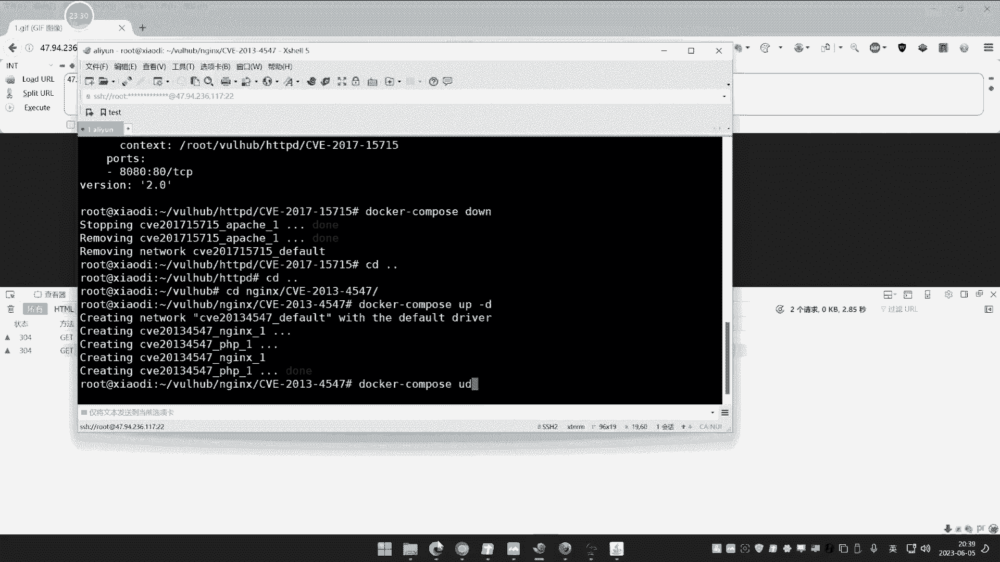

配置不当的他不属于漏洞，是在这个LINUX的这个目录下面。

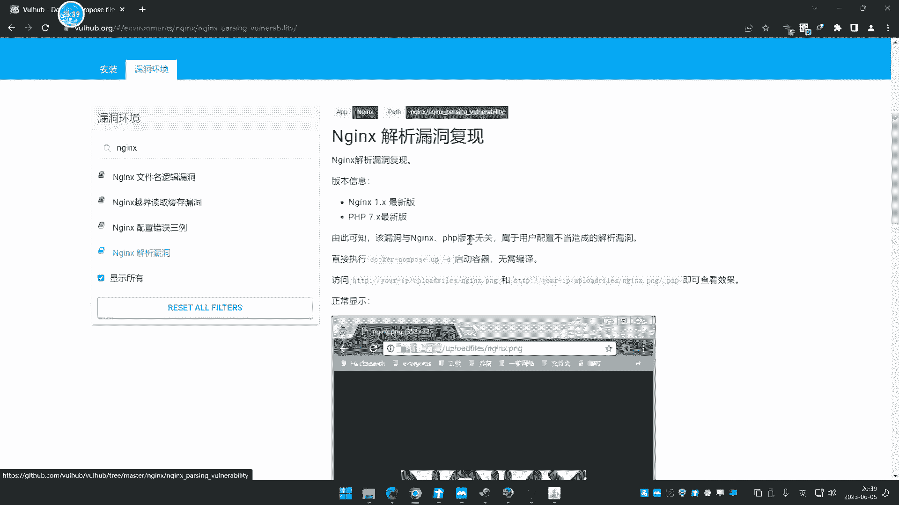

我们来到这个目录下面啊，启动一下这个环境，额说错了啊，你们老说不要说什么LINUX啊，我写错了啊，我N吉利斯恩吉利斯，不好意思啊，N吉利斯，不好意思，老说关了LINUX。

然后把这个恩吉尼斯和LINUX读成一样的，哎，真是尴尬。

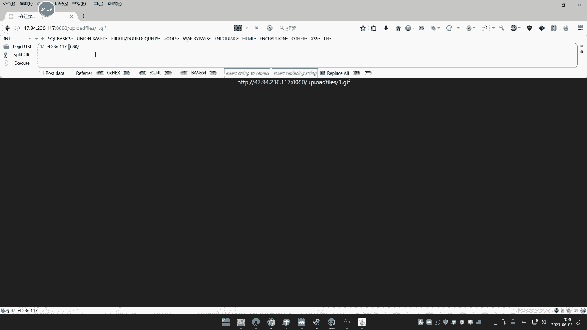

啊这是那个点啊，大家可以看一下啊，他什么情况啊，就是我上传个GF，大家可以看到我上传个GF啊，嗯来看一下啊，来我上传个文件给大家看一下，我随便上传一个图片啊。

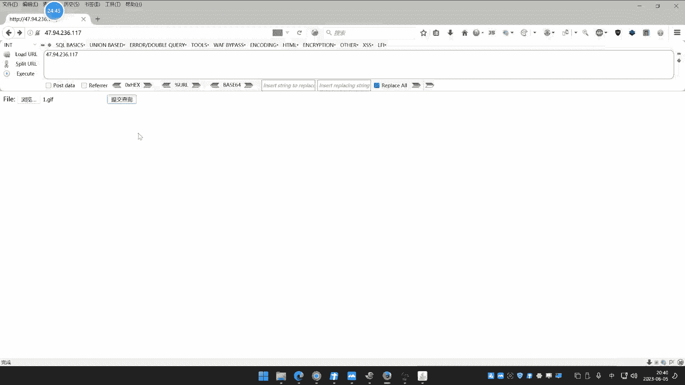

就上传个图片的，把图片上传上去，抓个包好。

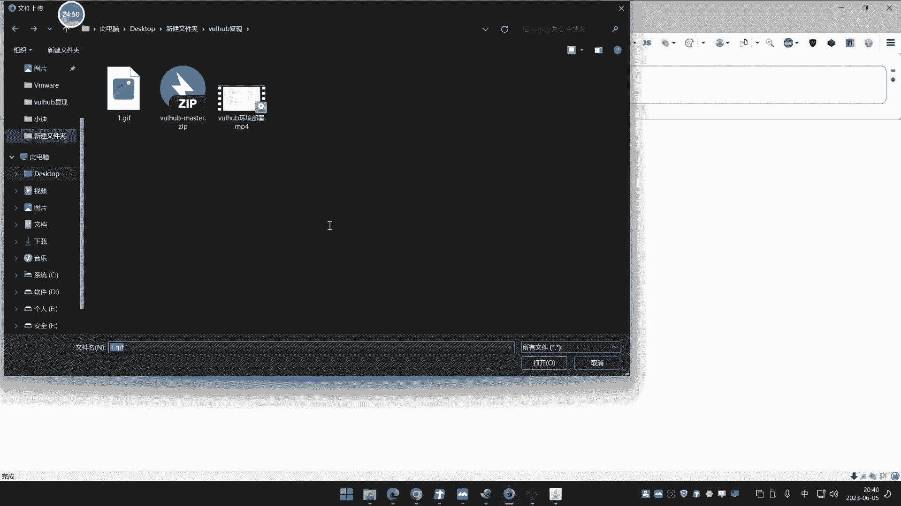

然后大家看着啊，上上去，我在这个图片后面呢，我加上一个什么PPT代码，写个PB代码啊，写PB代码的后面把它放出去，好得到一个文件路径来访问这个图片路径，后面加上一个随便加什么名字，点pp随便加啊哈。

我把解析成PP，我们来关注一下是不是哎，三执行到最后的时候有个PB代码，哎但是PB代码并没有执行成功，那我就重新再上选课啊，来得到个这个，嗯我写多一点，我还不信邪了啊，P 1p p p for。

在达到国进行访问一下，那看到没，pp for就执行出来了，这个就是那个解析漏洞，这个不是说所有利亚斯都有啊，他其实呢就是说基本上所有LINUX都有啊，N几里斯都有，只是说他有一个问题。

就说他是他配置不当，就是你要知道他有这个漏洞以后呢，你碰上有这个恩吉利斯的时候呢，啊如果说你访问一张图片，后面再加上一个随便加上一个什么点叉叉MV，他能把这个图片呢乱码，那就说明它存在这个漏洞。

那么也就是说你只需要找个上传点，随便上传一张图片，图片里面带有后门，在后面加上这个东西啊，随便加上一个点pp，那么就能把这个图片呢当做pp执行，这是他的个点，这个漏洞呢它不是漏洞，它是它配置里面的问题。

其实呢就和那个阿帕奇里面解析配置一样，就是修改了一些解析配置不当啊，导致解析错误的问题啊，所以这三个呢就是演示的是我们那个中级件，商品安全问题是不是很少啊，而且这个少的方面呢漏洞都很少，对不对啊。

还比较鸡肋，就说有些利用条件呢比较难满足，但是也要商啊，对不对，因为他是和商权多同是关联的，这是中介上面和商传漏洞关联的，这几个漏洞就给他讲了啊，pp里面的，那如果说是其他的什么i is的呀那些东西。

那那就是ISP的了，那我们就更不加讲了啊，啊java的一些东西，那就没有解析漏洞，那就没中心线，那上面没有没有些解析度，那就没有必要说了啊，所以只有这个pp呢，还有零零内。

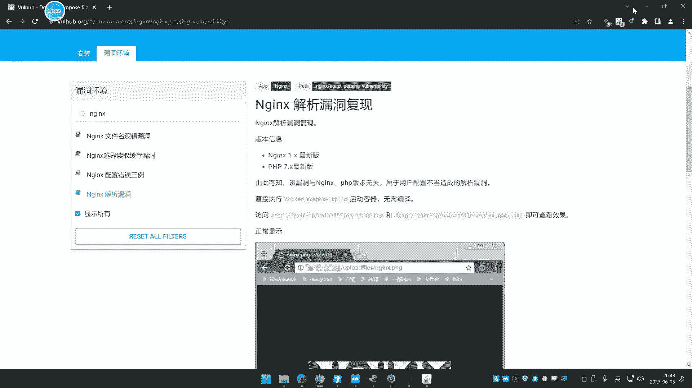

好这个呢是中间间上面的安全问题，也说他不是上传功能上面的缺陷，而是属于使用的这个中间间，那有安全问题呢，配合这个文件上传呢，实现了一种绕过和解析的一个错误啊。

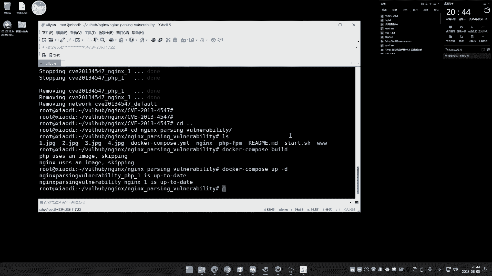

还有一个呢，就是我们今天说的这个第二个编辑器，那边器是什么东西啊，它是属于一种第三方的一个操作，额上次这个web搭建在漏洞中间上面的，影响的就是这个东西，然后这个编器又啥呢。

编辑呢其实就是网站在使用开发的时候呢，会引用一些第三方编辑，而这个第三方编辑呢出现了安全问题。

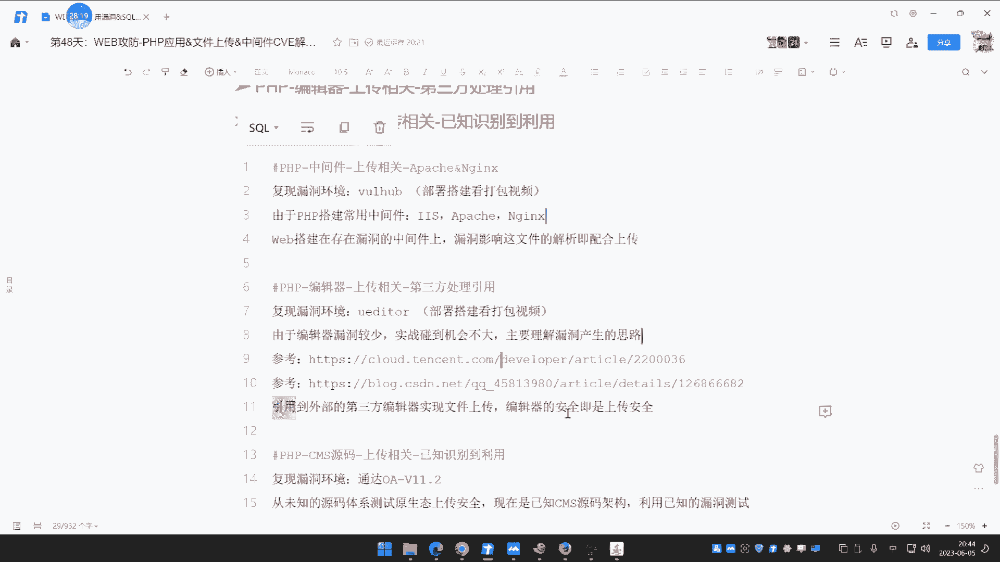

他呢就是商品安全问题呃，编曲有哪一些啊。

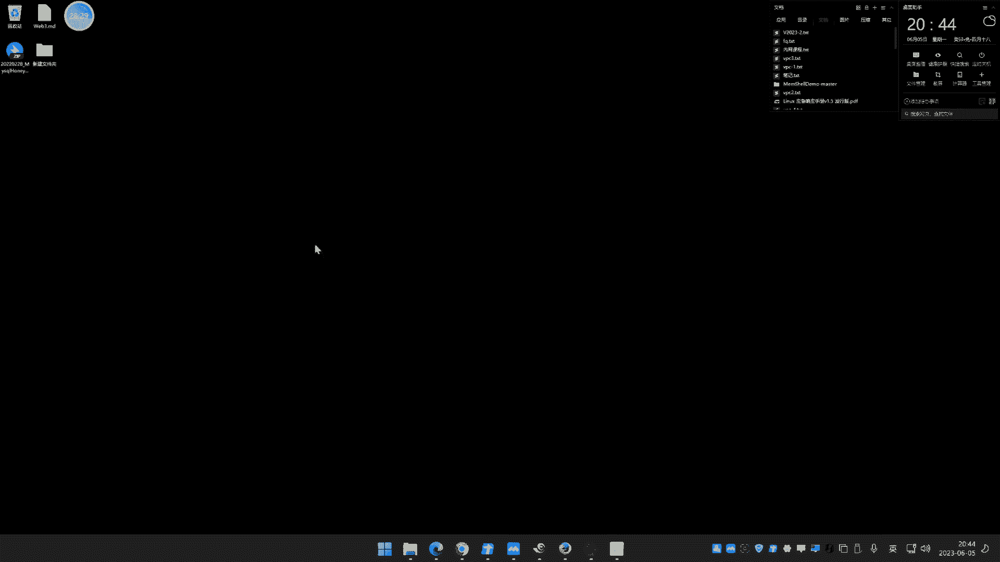

我网上给给你搜一下，有些都已经过时了，都基本上很难碰到了。

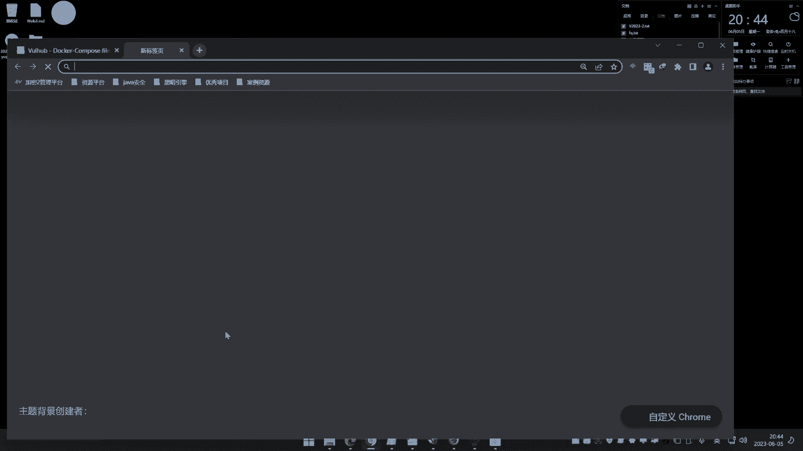

而现在目前还在用。

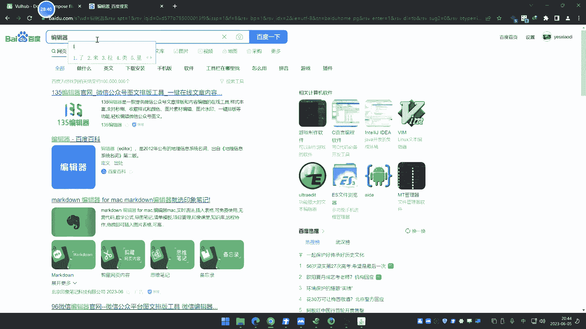

网上一篇文章说什么常见面漆的一个漏洞总结，那有一些这个文章什么u e it呀。

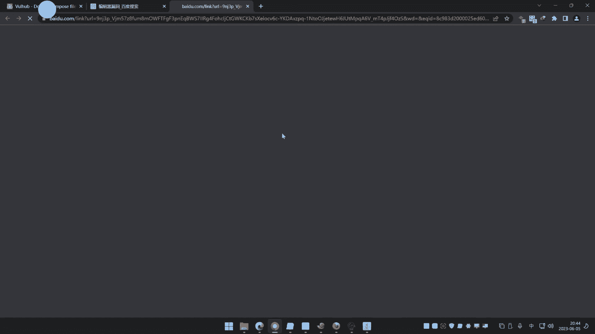

UE啊，E w e b e it u it，it k等于e it f c k e it是吧，还有那现在这些什么seek editor，Quality editor，还是不。

那么现在呢基本上这个编辑呢庸的，现在还在用的呢，就有一两个了，大部分像什么UE里的这个SU呢，这是SP里面的，有是有用的，但是很老的一些程序了啊，新程序它没有这个实行了，U1点，那是百度那个那个公司啊。

就是百度它官方开发的那个东西，那就这个吧，呃是当时这个百度的一个那个开开发的，所以那还有点用户程度在用豪门，那就用的少了啊，对就是个百度那个他自己开发的这个unit，这个编辑器提供给开发用的。

然后像这里面还提到过的这一个什么FCK呢，在我那时候学的时候的比较多，现在也有，但是不是很多了，然后这个EWET呢我那时候学的也有，但现在这个SP都很少了，这个东西就跟上了啊，但网上呢还有。

但是都是些很老的网站，没什么加字，然后大家可以看一下这个下面一些东西啊，我就不给他说了，以前早几年上这种内容文件上传的。

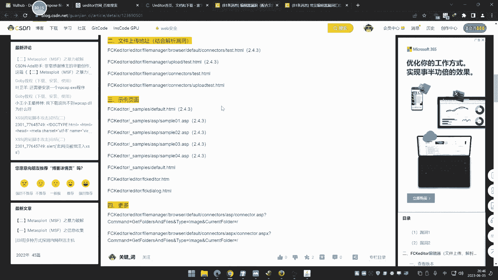

都还是要给大家讲一下这个编辑的，这个上传的一些内容利用的，现在都没商了，就会讲一下这个概念，我正在给环境给它打印下来了啊，然后呢这个打印环境呢，我模拟了一个比较真实的一个环境。

就是告诉大家这种东西是怎么发现的，是怎么利用的，然后大家可以看一下啊，这个unit it呢你说有没有用处呢。

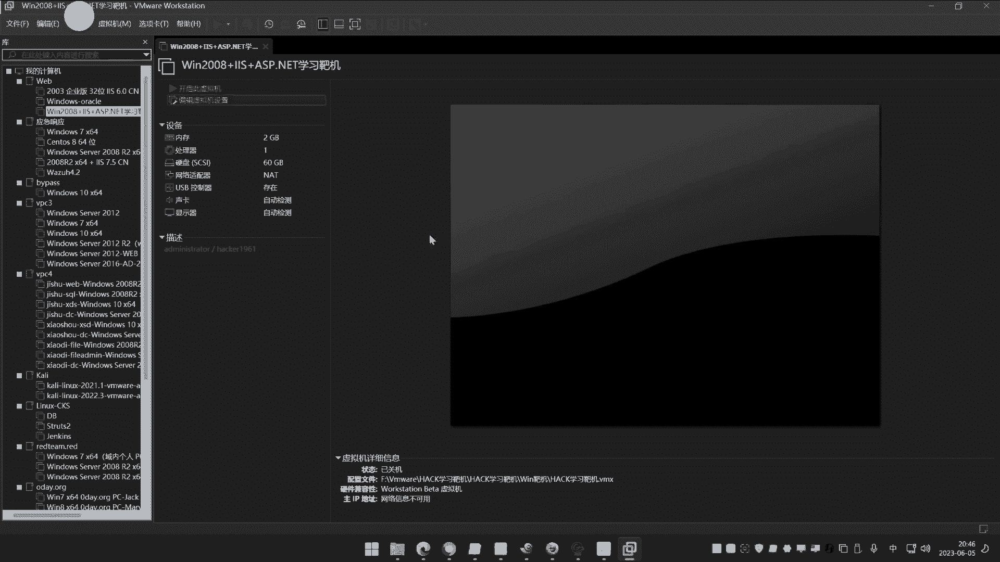

我就搜一下给大家看一下啊，你看啊，我在搜我这个unit的这个东西的时候，大家也看得懂啊，再到我本地的有些源码，你看啊，在我本地的这个z blog这个程序里面啊。

z blog的程序里面源码里面呢有个什么呢，U1it的目录啊，u it it的目录看到没啥情况，其实就是说呀这个z blog程序呢，他在调用这个re it能理解吧，好ZBLOG在用啊，然后你再看啊。

我这里还有呢这个OA系统他也在用。

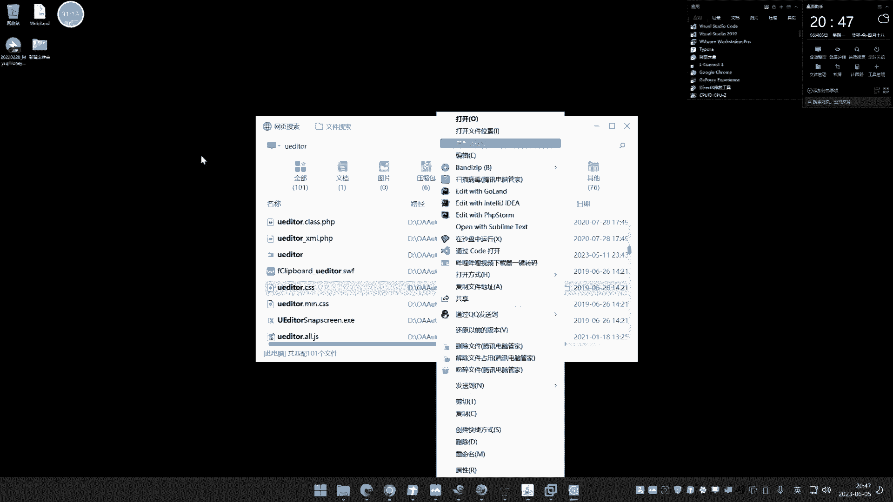

对OA系统里面有个单独目录，是个unit pp的，对他也在用，这是一个那个通达OA的那个网站源码程序，其实就是说这个编辑呢，其实很多网站的源码也在用，或者说你自己开发的时候，那你也可以应用。

但是啊那什么情况呢，就是说不是说它用它就不安全，而是说这个漏洞呢它只会产生那部分，就是说你搜这个编辑器。

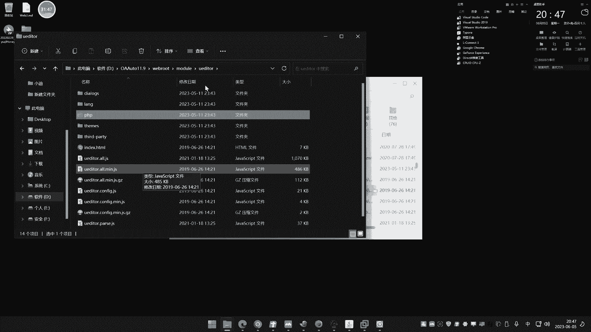

我们可以搜一下啊，假如说用it我们搜一下他的一些漏洞啊，包括哪些漏洞，而最明显的影响最大的就是这个，任意文件上传漏洞，这个漏洞呢它所影响的是这个unit的点net版，版本呢是在这个1。4。

33级之前的版，在之后版本的就可能就修复了，那么也就是说对方引用unit it，但是如果说他不是个点net版本，是个pp的或者其他版本的，哎，那不好意思没用，即使他是这个版也不行。

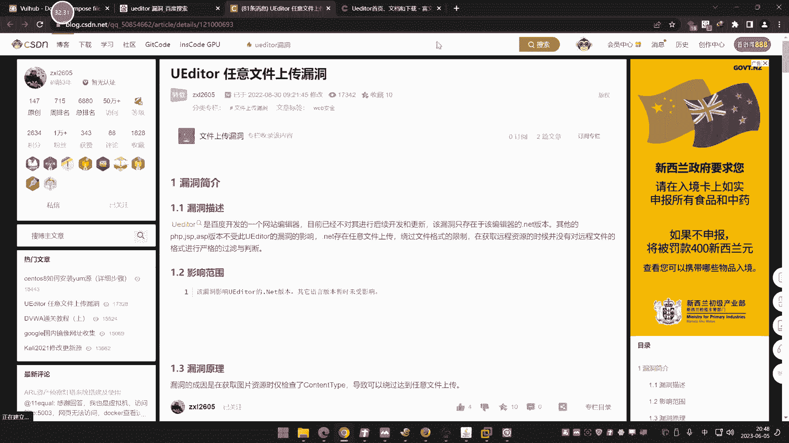

好我们先把这个环境给大家启动起来看一下啊，因为他是个点net版本，所以我这里要用点net搭线的，你可说我不是上P1P吗，咋个回事，搞到点net上面去了呀，pp的上面的U编器呢也有漏洞啊。

但是但是怎么说呢，他那个漏洞呢啊没有很多啊，就基本那几个，而且很难碰到这个的漏洞呢，还有一些我等下给他搜一下，大家知道了。

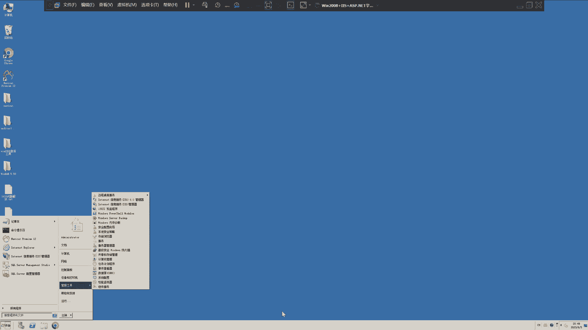

来我来给你演示一下啊，我要先看这个网上面的使用夹子。

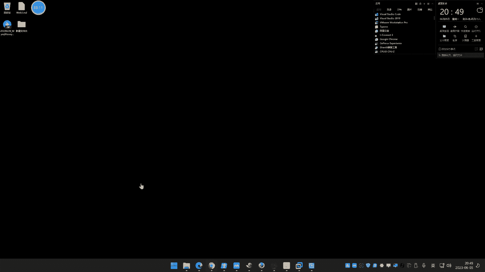

就你可能呢以后还碰得到啊。

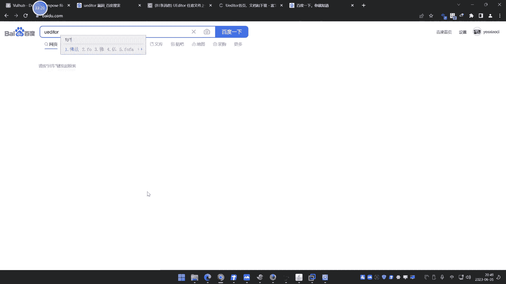

其他的呢没有讲的，那基本上就是很难碰到的。

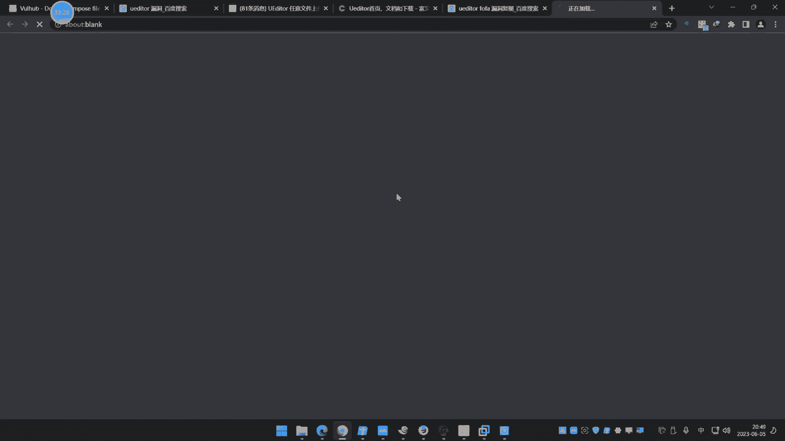

那他说有个关键字啊，这是一个关键字，我搜一下啊。

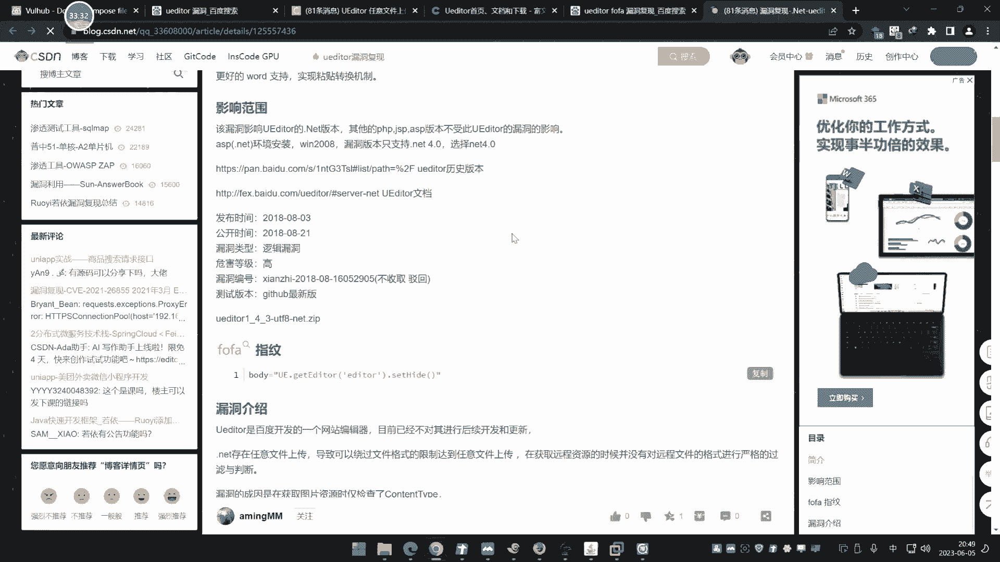

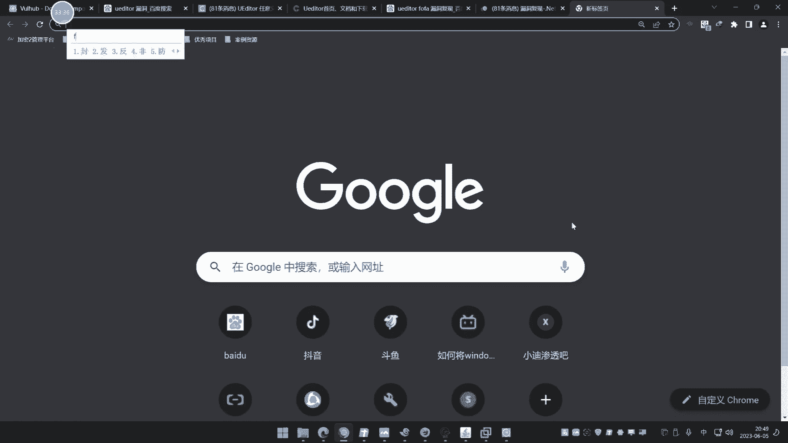

爱看到的。


哎这是那个编辑那个界面，那个UT的，打开问号的UT看到没，这都是存在漏洞的啊，这都是这个版本的区间的啊，刚好呢就说你的测试站点，那就是他哎，那恭喜你。


看这有啊，我就不不用，我们肯定是不拿这个东西给他做实验的，对不对，这有的啊啊这不是说没有的，对不对。


这个版本不符合了1。5。0的，那前面两个还是1。4。3的，可以是吧啊。


我这个就不说了啊，呃现在呢我们就看一下，我们那个测试那个环境的啊。


我先把这个环境的启动起来。


其实就是说大家不用听这个漏洞复现，这个漏洞浮现的文章多的是，你主要就是搞清楚这个漏洞产生在哪个层面，我们讲就是讲思路，这便于你对其他漏洞的理解，126。1361万端口，这个答简呢我就没有给他打解了啊。

答剪我不给他演示，因为达姐那个视频呢我给他单独录了，我下午给他录的就是包括这两个环境，哪有那个view h b啊，和这个unit的那个搭建浮线啊，我怕有些人下去要浮，先是吧，他要这个搭建不会答啊。

这个呢就是说我模拟一个登录页面啊，就说这里呢有个登录页面，然后呢通过你的这个信息收集呀，哎你发现它下面有个unit的目录啊，你不要问哎呀，咋咋个收集到有UI的那目录，扫描一扫就扫出来了。

你就不要问这种事情了啊，那扫了个UE的，一打开诶，就发现这个东西，那看一下版本1。4。3哦，刚好这个漏洞版本存在，那就测试利用它就这么简单，其实说它就比较符合一个，这个我们在测试中的一种情况。

就是通过你的信息收集呢啊，你要么就是登录一个它的会员中心呢，发现有这个编辑，要么呢就是你通过一些扫描呢，发现有这个u it的目录是吧，在这是黑盒的一个测试，而白盒那就不说了，直接看源码吧。

那这个呢就是说比较符合，然后那里发现有个unit是吧，这里呢就是有这个，那他这里有文件上传的是吧，而这个unit呢它包括漏洞，我们就利用这个漏洞就这么个思路啊，这个利用漏洞呢，这没什么说的啊。

就是对着网上那个浮现的东西对着搞就完了，没啥，就是呢，就是跟QC把这幅字呢放到本地用就完了。


那就打开这个对号，把这个目标地址改啊。


就这个提交地址改改成这个这个触发地址，那这三个路径地址改成它之后呢。


然后怎么操作啊，大家看着啊。


打开它输入一个web地址，这web地址写什么呢，就写个远程里的这个图片地址啊，然后呢带有后门的，我们就拿我自己的这个小于八这个logo呢。


来做演示啊，这个就是我那个logo地址。


就远程地址啊，然后去远程请求这个图片，这个图片就是我那个logo，然后呢我自己呢就在网上那随便搞个图片。


图片里面带有这个后门啊，然后去远程请求这个地址，后面再加上一个参数，加个什么参数呢，就请求地址后面写了个问号点SBX。


那么呢我直接点提交啊，它就会自动的去请求刚才那个目标地址上面，把这个文件的改成SP格式。


SBX格式，然后呢后面就写进去了，那么SBX格式那就不说了嘛。


大家都知道的就是个home格式，它就会写到这个目录里面啊，大家可以关注一下，现在的目录呢，只这几个文件，我先把它删掉，是吧，你看啊，我让他去，它其实就是个远程的一个那个图片加载功能。

的一些安全问题所导致的，我直接在这里呢点击提交。


啥情况，那个第一子跑哪去了，好在这里那点提交go。


那返回一个地址呢，存在个路径来，我再访问他，那就是那个图片嘛，然后这个图片里面有SP后门不就执行了吗。


那格式都出现了，那你看网站文件上传上去了吗，这就是那个漏洞的一个测试哈，这漏洞一个测试能理解吧，我这里再搞个登录页面。


那其实就是就是做假设它是一个网站，你通过信息收集的，扫到有这个优异的这个编辑器，或者你像网站前台，那你登录会员啊，或者说是登录后台的时候，能发现有这个编辑加载到页面中。

就像我们看到这个这个地方一样的是吧，你看到这种界面了，看到编辑的打开一看呢，它是个绿的版本的，也符合，我们就利用这个上传多功能来实现，八这个后门文件都给他植入进去，就这么简单的事情。


这哪又说不清楚呢，是不是包括这里呢，我们用做收引擎的，那都是在是吧，只要你测试这个网站诶，一打开，或者说你通过信息收集呢一打开啊，这是这么一个unit的，这个地方是版本一看哎呦1014哦。


唉要是他是一个这个点net的，那恭喜你可以撤了，可以直接get sh了，就这么简单的事情啊啊就说这个漏洞呢。


它其实和网站的那个文件上传有什么关系呢，没有任何关系，但是你可以说这这这不是编辑漏洞吗，怎么和文件上线挂钩了呀。


他怎么和文件文上线挂钩了，为什么呀，编辑是干嘛的呀。


啊这个编辑它是干嘛的呀，编辑器就是搞文件上传文字，处理一些相关的事情的，你写个文件上传，你要写功能，还要写界面，他呢，嗯他要写什么，他啥都不用写，啊其实就是很多人呢去为了对这个文字啊，音频啊，视频啊。

图片啊各种东西呢进行批量处理，他要写代码去处理，很麻烦，他就在网上呢找一个这种编辑器呀，把这个编器的代码呢copy到源码中，然后引用这个编辑呢来实现这些功能，而这个编辑呢自身呢在这种文件上传。

这种操作的时候呢，出现过一些代码上面逻辑的因子差误，导致这边器呢有漏洞，那么凡是引用这个编辑的网站都岌岌可危，就这么个道理能理解吗，所以说我们讲的更多的是思想和思路啊，这个漏洞浮现呢不是我们所担心的。

因为它有漏洞，我们才浮现，它没有漏洞呢，我们就寻走，就更多的就是说我把这个一讲，你在代码审计中的话，诶你去升级代码，你就可以把它分为几个部分，一个呢是它承托着自己原生开发的，还有一个呢它是外面引用的。

就和我们自己写程序一样，你写一个程序写出来了，对不对，有些是你自己写的，而且有些呢是你在网上copy的代码，那如果说你copy的代码里面写法有安全问题，你说你的程序有没有安全问题呢，就这么简单的事情。

那这个编辑呢就相当于你在网上copy的一个东西，出来了，出来放到你网站上面去，你偷懒，你用别人的东西，那不好意思，那他出安全问题，你也受影响，所以这就是我们说的那个概念啊，而刚才那个中间件呢。

就是相当于说运行的服务器是吧，你要把网站运行起来，就有那个中间支持，而你刚好你搞了个有漏洞的那个中介，那不好意思，那恭喜你是吧，你也漏洞了，你代码写的再安全也也和他没关系，他出漏洞也同样遭殃。

好了说了这两个，那接下来另外一个这个cm s的又是一个思路点，有些人呢又不懂了，那为什么要讲它，其实我看了啊，我教这个课呢，很多情况下面都是告诉大家要学会分类，学会把不同的方式针对不同的应用。

这个知识点呢要不同的应用，网上我看了很多人讲的一些课啊，他都是刻意的去强调漏洞的理解，但是不重要，你只要把这个点搞清楚，你要活活灵活现的去对应的话，它其实很简单啊，你看这个SAM源码，这又是什么概念啊。

首先我这里呢在讲课之前，我前面把它分类了，我讲第一次文件上学的时候，我把它分类是叫原生态，什么叫原生态，这是个什么理解，其实就是说你在未知对目标测试站点呢，不知道它是什么程序的情况下面。

我们通通把它归类成原生态，意思就是说你不知道对方什么程序，你对对方一无所知，你面对的只有一个文件上传的点，所以就没办法去知道他更多的事情，你就老老实实撤车，这个文件上传有哪些安全问题是吧。

是对你内容检测呢，还是对你后缀检测呢，还是什么问题，测出来之后呢，再用这些方法来去找，绕不过去就绕的过去，绕不过去就绕不过去，对不对，这是我们这个讲的内容，那么今天讲这个拓展的cs又是什么概念呢。

就是说你找到一个网站是吧，你刚好的知道这个网站呢，它是什么程序，而这个程序呢它也包括文件上传，那你这种情况下面的话，你还用得着去在这个网站上面去啊，就这个网站上面去找他原生来找他商权吗，能不能找到。

是另外一句话，那不能找到怎么办呢，对不对，好这里呢我们就给大家看一下啊，用的是这个通道位A的。


就是接近于这个通道问漏洞，那是在前面19年。


还是什么时候发行的一个云商城，当时在打护网的时候，那爆出来的啊，这是别人挖好了，然后当时打护网时候把爆出来，那这个通道OA的这个系统啊，那打开这个网站一看呢，就知道是个通道OA是吧，通道OA的。

但这个通道OA呢，这网上这个漏洞呢就是一大堆了，网上还有这种利用工具，直接有手就行的事情是吧，啊漏洞呢我给他看一下呢，你搜啊，我先给他搜一下具体知识点，这太多了，来这什么这个文件上传漏洞呢。

CVNVD2022年还包了一个是吧，那个还有各种各样的一些漏洞啊，我们就不看了啊，那这个什么前台愿意登录啊，后台文件上传呐，SQL注入啊，什么这个未授权啊等等啊，这东西我们就不看了。

因为我们讲的是文件上传了，就是他其实这里有文件上传，那有文件上传就行了呗，我们就不管它了啊，那这个目标呢我们看到这里之后呢，它给我们一个什么提示呢，啊你叫做里面这个站点是吧。


你去测，假设你我要告诉你，我要告诉你它上面存在文件上传好，你怎么测呢，你肯定就说哎我找文件上传点，我就扫扫他有没有这个文件上传的这种地址，比如说扫什么upload点pp啊，或者说我有没有中号登录进去啊。

在用户登录的个人中心里面去找他，这个这个有没有什么鬼子，文件上传那些东西是吧，这是你的的常见事物，对不对，然后找到这种点之后呢，就慢慢在测那个文件上传了啊，是这么个情况。

但是呢如果说你已知这个程序的名字的话啊，很多漏洞都是通用的，不管输入文件上传啊，其他的一些漏洞都这么个意思，就是你已知这个程序了，那就直接可以把这个程序呢，放到一些漏洞的专检工具里面去设。

而刚好这个工具箱里面呢有存在这种专检工具，像这种立群的是吧，1。5。1的这个版本呢，现在网上都有一点溜了，好只不过还有下得到啊，这个离群的啊，那把地址写进去呢，这与这个通道V的是吧，那检测一下。

哦他说呢POC应用成功，已经自行填充任意用户漏洞存在，那这里呢又有这个任意后台文件上传的，点击一下啊，我看能不能上传呢，然后这个通道OA的安装呢也比较简单，安装好之后呢，它不需要下任何环境。

它会有个目录，这个目录里面的自带这个环境就直接的启动它，就这你能看到的这通道微微的了啊，启动它就可以把环境运行来，然后他网站源码那是在这个下面，还是他的网站安装目录，然后里面自带有这个pp啊。

这些环境啊就不需要你管了，好的目录呢是在这个下面，我可以关注一下这个目录的这个根根路径啊，然后点一下上传，他要上传成功，你看啊只是被杀了啊，后面被杀了，我们把它恢复一下，看是不是就出来了，看到没了。

只要写到后面的进去了，看到没，完了呀，就这么简单了，这需要你说你懂什么文件上传，不需要啊，你懂文件上传是基于这个基于什么，基于这个文件上传是你未知的情况，就是你没办法的，你没有任何信息，你知道吧。

就说你如果说知道是什么cm s了，你就直接去网上抑制漏洞，去利用它，不管说是文件上传漏洞好，或者我以后讲其他漏洞都是这么个思路，都这么个思路，所以说为什么前期我要说把这网站收集信息，要收集好。

就是希望你能对这个网站有更多的理解，一般像我们常见性漏洞，就像我们前面讲的啊，你再思考一下，我讲SQL注入啊，讲什么，或是只讲SQL注入，先是只讲SQL注入，包括现在讲文件上讲。


包括后面要讲什么啊，C1啊，一些各种，还有乱七八糟的那种，那些漏洞都是你不知道对方的这个程序，不知道对方的这个情况的时候，你去测的这种情况，如果说你已经知道他是什么程序了，利用两种方式。

第一种方式呢就是找网上已知的漏洞。


去利用这个漏洞，就是利用工具也好，利用这个EXP也好去利用，还有一种那就是网上没有漏洞的话，你就自己去挖，这是他的思路，能理解吧，如果说不是的话，你不知道这个程序你也没见过，什么都不清楚。

那你就老老实实是吧，你就说文件上传就测试文件上传漏洞是吧，其他地方就测了不同的漏洞，是这么一个流程，他这个测试那就是这么一个流程在测，而不是说你啊是吧，有个文件上传。

你有什么一个也点上传的一个测就很简单，你看这网站是样，他有文件上传，你看到这个文件上传吗，你看不到啊，这文件上传在哪。


你都没看到功能在哪里啊，他在后台里面，那后台里没有账号密码，怎么登录进去呢，但是这就是文件上传了，这是文件上，那是代码中，是网上挖出来弄，你就直接用了，那有什么理可讲的，没理由可讲啊。

所以说这节课呢就是告诉大家一个点，大家明白啊，这个搞安全测试呢就是这么个流程啊，但信息收集那么多，不是说吃干饭的，是因为你前期的信息收集呢，给你后面的做这个安全测试呢。

在梳理你自己的思想和自己的这个方法，而不是说做了之后呢就就没了，它有哪些架构，它是什么程序，然后你会选择性的放弃哪些攻击思路，和选择性的用哪些攻击思路，都是根据这个星系来决定的。

这才是信息收集的核心所在，如果说你信息收集之后呢，你对自己接下来要干什么东西是吧，既然干什么事情，做什么事情，你没有什么这个想法的话，那只能说你NO总压根就没有学过，或者说你对NO总一无所知。

就像我们说的，像你这种的直截了当，就告诉你是这个cm s的，那首要要想到的就是直接在网上查找，这个程序的漏洞去利用，这才是你正确的一个直接关系，而不是说哎呀我在海里面的，先扫一下它下面有没有什么东西啊。

啊看一下这个有没有local，你来搞这种事情啊，那是你没办法的时候，你再重复再这种搞这种常规的这种事情，知道吧，但是没办法的时候再选择这种事情啊，所以说我们今天讲的这三个案例呢，你看似啊讲了半天。

好像和我们讲任何知识点都没有任何东西，但这三个知识点都告诉你一个事情，不管是在你代码审计中，还是在你这个测试的方法中，还是在这个安全测试中都有影响，就拿我们这个中介性来讲是吧，你去代码审计好。

你去代码审计一个源码漏洞，这个源码没有漏洞，哎，你把源码呢放在这个有中间件漏洞的，上面去搭建了，那出现了安全问题，你说是谁的问题呢，是你没审计出来呢，还是说什么情况呢，和你没关系啊。

这他妈的是中间件导致的呀，是不是这编辑也是一个道理是吧，你本身的圆桌子开发程序，本身自己写的代码里面的，他不知道有这个，他就是偷个懒，或者说他自己呢学聪明一点，用别人的这种东西在掏，往上面掏。

他自己写代码的很安全，而用到别人写的这种copy代码呢，唉这别人东西呢被爆出漏洞诶，他是照样，那么也是告诉你代码审计，那不仅是要看自己写的代码，还要分析这种网上这种加载的，就像java里面是吧。

本身程序没有安全问题，引用的J包了，出于安全问题，那也也也遭殃，这sim源码的就是思路问题啊，知识点没有多少啊，我们就说到这里啊，然后像后面呢我们要讲的这个安全架构呢，我刚才也说了。

这个就是给大家泼一盆冷水的一个一个知识，上期呢我是没有讲这个东西的，是因为现在呢这个行情安全行情呢逼不得已啊，有些东西呢你必须要讲，你不讲，那有些人会有这种疑问，而且你把它讲了之后呢。

他就知道怎么去该取舍了，懂得怎么取舍之后呢，他做起这个安全措施的效率会高，也不会说老碰到一些东西呢，他觉得有可能其实压根就没可能，今天没有什么知点讲啊，就这么个事情，因为他没有知识。

就是一个思路啊和一些理解上面的东西啊，啊大家看有没有什么问题啊，有问题就问啊，其实我今天呢人是讲两个小时的，我不想耽搁大家时间，这两个搭建和部署，我都统统自己单独录了个视频给大家。

如果说我要凑齐这两个小时的话，我完全可以把这个什么答简呢，给大家从这个课上去演示，就是演示一个半个小时啊是吧，那不就时间够了吗，没必要啊。


好我们今天就讲这么多啊，大家看一下有没有什么问题啊，好有人问问题了是吧，我看一下啊，阿帕奇换环节那种好奇虫那才行，本来上传可以吗，要上传个剪辑，比让看起来真实一点，哎呀能不能上传这个。

能不能上传这个PPP都不重要咯，那个重命名那个东西就很很很少见的啊，什么实战啊，不要搞这种事情，嗯不搞这个事情啊，我点都不应该点这个东西的，这个实战你能说把它实战结果，搞成功和搞不成功没有任何意义。

因为你搞成功就是某种存在，搞不成功就是那种不存在，很多车是总归有那个成功的呀，那成功就是牛逼，不成功就是废物吗，不是你说的这个事情啊，有些人老喜欢这样怼着，说什么实战实战好，我这样说好吧，我实战成功了。

你怎么办，我实战失败了怎么办好吧，你这就和我打个赌，我今天我实战了，你给我拉十个九菜，我马上13行不行，唉搞些吊毛事情啊。

