# P49：第49天：文件上传&存储安全&OSS对象&分站&解析安全&解码还原&目录执行 - 逆风微笑的代码狗 - BV1Mx4y1q7Ny

今天呢是讲这个商船这一课的最后讲啊，嗯讲的是一些这个安全体系，这个为什么要讲安全体系，就是为了告诉大家碰上这种情况啊，有人就会问我就是简答，你碰到这种情况，哪些是能够继续。

哪些是不能继续的一个情况给他介绍到大家呢，如果在实战中碰到了啊，你应该知道啊，这个东西能不能搞和，或者说搞的话是怎么搞，就明白这个事情，否则的话你就不然的话，你自己在上面乱车，那是没有任何意义的。

有两个方案，第一个方案呢是我们说的这个叫存储方案，就是存储，还有一种方案，那是解析方案，啥意思啊，就是一个那是控制解析的，还有一个呢是控制这个存储的，两个都会对这个文件上传漏洞的利用呢。

有一些直观的影响，而且这个影响呢就是说有没有安全问题，就是有安全问题和没安全问题，碰上这两种东西之后呢，也会造成失败，我们先说第一个啊，这个解析的方案问题，什么叫解析呢，就是一种实施的就是目录权限。

这个控制导致文件上传呢无效的一种操作方式，好我们先讲他的这个这个安全的一个架构体系，到后来我们再说从工具面上面去分析这种东西，有没有说能够绕过，或者说实现这个突破的一种方式啊，先讲这个安全方面的。

再来说这个突破方式的目录权限，这个很好理解啊，来我给大家演示一下啊。

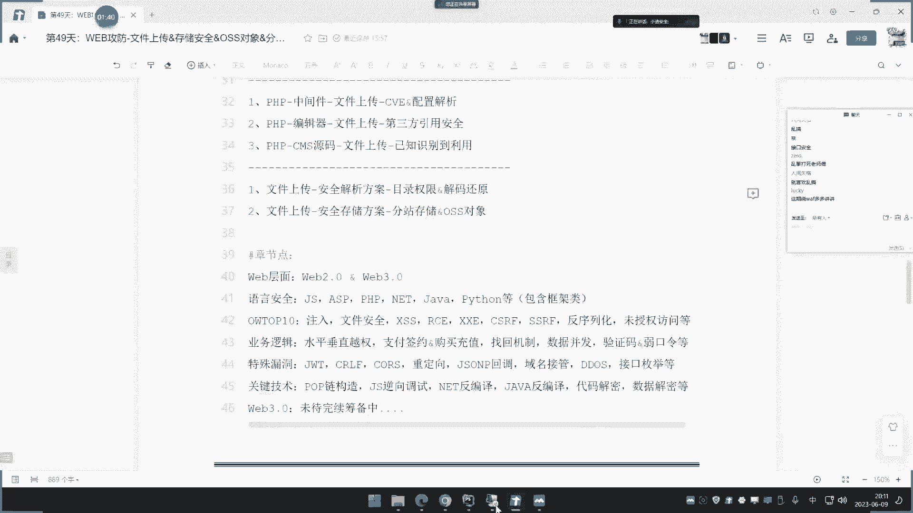

这那我特地呢就在网上了是吧，搞了这个这个网站域名啊，然后呢给大家去讲的啊，这里呢有一个叫upload点小黎八点com的一个网站。

然后呢给大家先演示第一个哈对看一下啊。

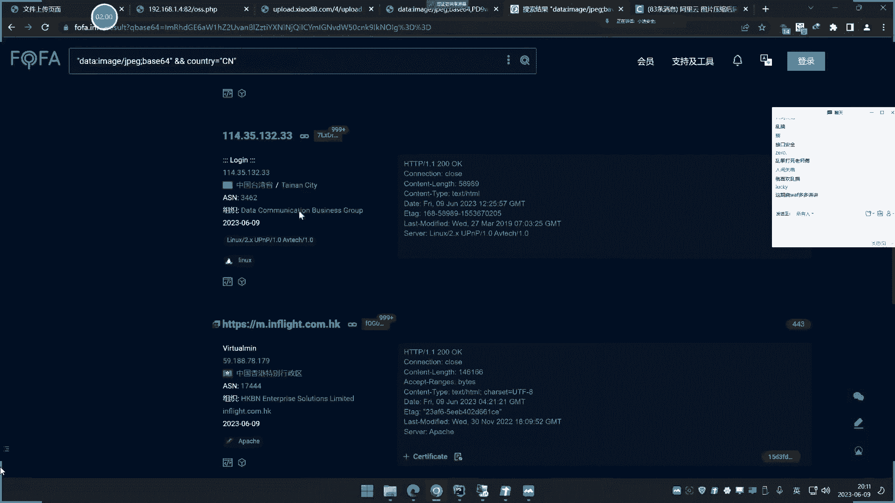

好这里呢有一个目录啊，一目录就是一个上传的啊，一个文件上传的呃。

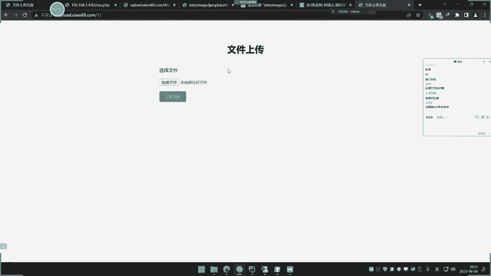

这里呢就是它的代码，大家看一下，啊这个代码，然后这里呢有一个文件啊，这个文件是个upload啊，然后这里呢是我们上传的这个地方码，death在那个上传页面，然后upload是这个结束商传。

然后这边upload目录呢是他这个存放的一个地方，我们试一下啊。

就比如说我现在在去尝试商传啊，我这里呢尝试上传一个这个二点pp是吧。

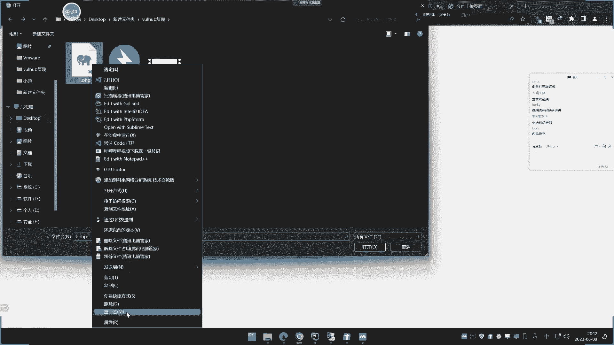

好他这里都是算成功，我们可以看一下这面啊，这个二点PP呢就上成功了是吧，就刚才上传的哎，大家可以看到啊，就说其实这个上传这个点呢，他是没有任何过滤，你想上传什么就上传什么，没有任何的过滤。

就说这里是已知有这个文件上传漏洞的，因为我们正常来讲的话都会有过滤对吧，然后呢你看他没有过滤。

唉你们老要这样搞，不要这样搞啊。

赶紧把它停它。

我把那个限制下，这样不要这样搞。

我怕停止掉的原因，不是说这个怕大家搞啊，我怕有些别有用心的，他把突然把东西一删，把那个什么一些源码全部删掉，那我就是尴尬了啊，所以说我还是先把这个停止掉，我把那个安全组开了，开了再来个，嗯好了。

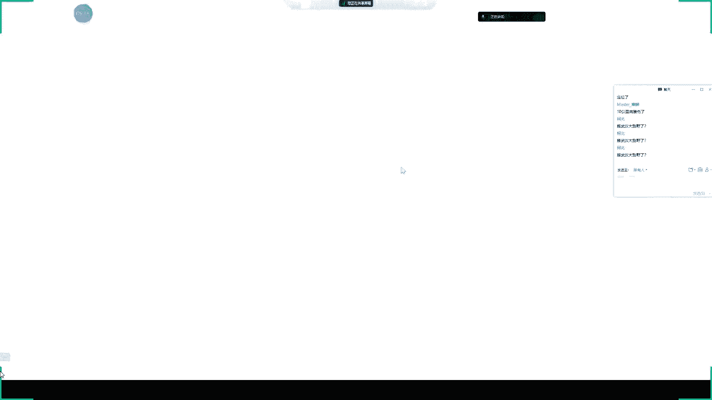

好啊，我来再来再来啊。

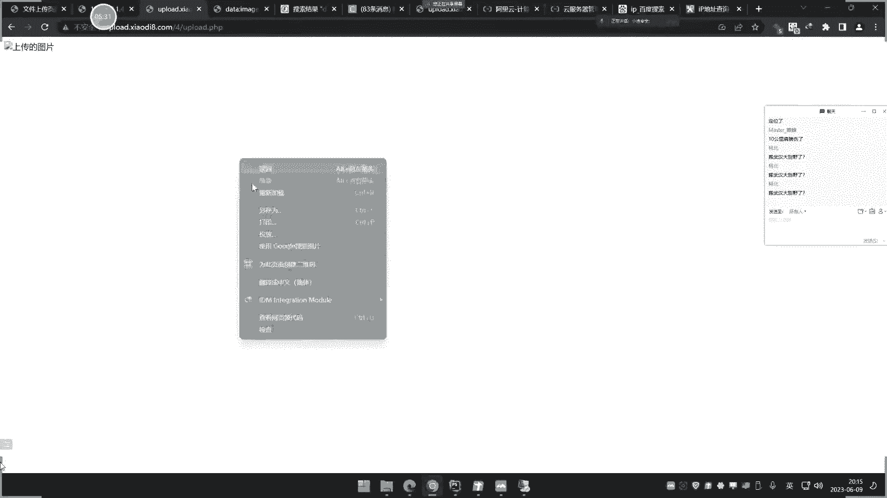

嗯刚跑哪去了个笛子呢。

看这里啊，好他已经上传成功了哈。

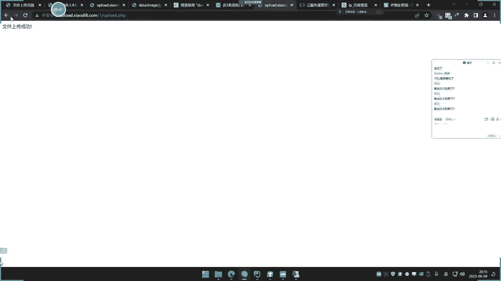

大家可以看到啊，这个已经上传成功了嗯，什么鬼东西啊，你们不要再说了啊，来你看这个上成功了啊，嗯大家可以看到啊，这个文件的上成功了，那不就说我访问upload，二点PB呢就能触发他了啊。

好现在大家看一下啊，我在这边的，他不管说这是用了pp的演示啊，B在这个其他演示呢，它也是完全OK的。

那我们来看一下啊，来访问upload，然后呢R点BB刚才上传的文件嘛是吧，去访问它啊，大家看到啊，这边呢就能执行出这个什么，pp的代码效果对不对，好现在呢我们在做这个事情啊。

就在这里呢可以进行一个配置，这个配置呢就其实就是目录权限了，禁止目录执行，我把这个显示过，然后目录呢就指向这个一目录下面的upload目录，然后点确定啊，那么当这里一直修改之后呢。

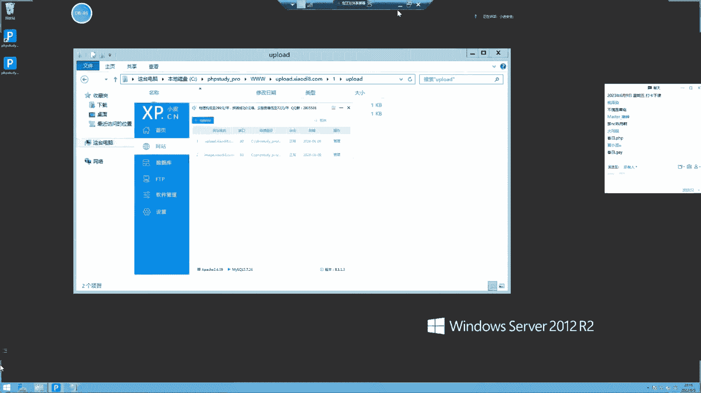

我们再次刷新这个上传后的这个后门的地址，这个地方刷新，哎你看就经执行了，这个就是一个目录权限的控制。

他的一个实现原理呢是个什么情况呢，实现原理也非常简单啊，就类似于在这个目录上面呢，安全这个地方啊，给予啊，给予某个用户，这里不是有个叫读取和执行吗，他就把这个执行呢给他拒绝掉，就是说这个里面的文件呢。

它是能够它是能够这个什么啊能够访问的。

但是它不能执行，因为这个脚本它是执行的。

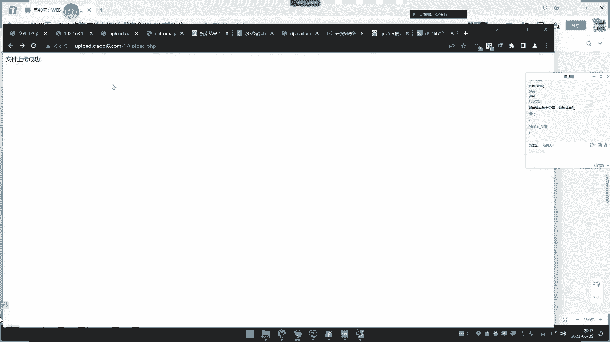

因为你可以看到啊，我们上传图片的话，他是没没问题的啊。

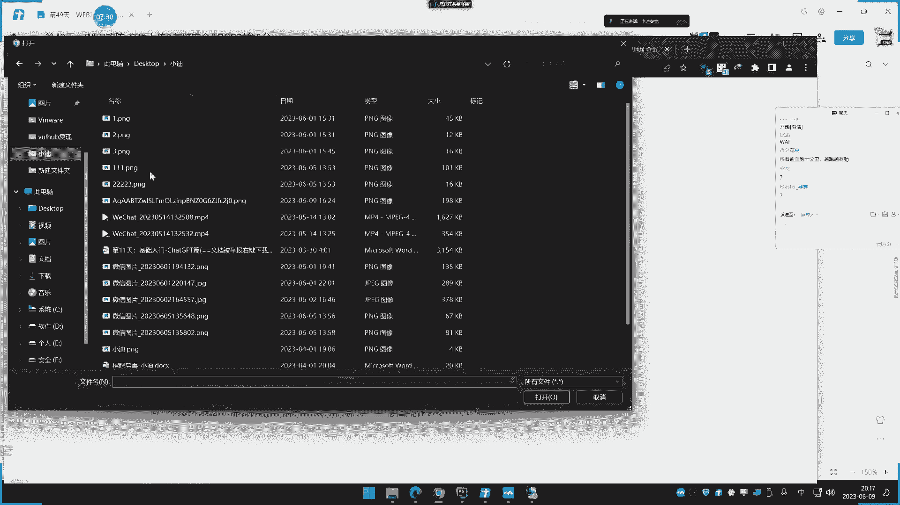

你比如说我上传个图片，对不对，我上传个图片啊，来223点pp是吧，我们来访问，啊PNG。

你看他是能够访问到的，对不对，图片是没有任何影响的，但是你这个以前这个pp文件呢就被禁执行了。

禁止执行的话，也就是说这个文件它就不能执行，不能执行，就说你上传的没有任何用处，因为正常来讲我们肯定就上传home门，这个文件极有可能就是个后门，我们用后门的去连接它，但现在可想而知。

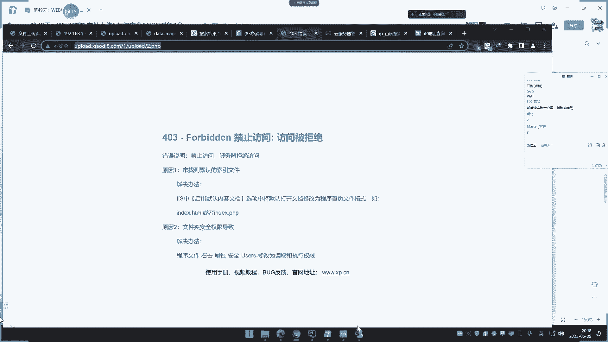

它这个连接不上了啊，你不伤啊，这里呢如果说大家有内力的话，自己可以做啊，这个就不说了，因为这个pp就是最好效果啊，这样来讲他会执行这个批评for的结果，所以这是第一种啊，就是把这个目录的给他操作了。

把它限制了，也其实就是说对方呢真正的去操作的时候呢，他可以把这个专门来存储文件的目录了，给他不给予执行权限。

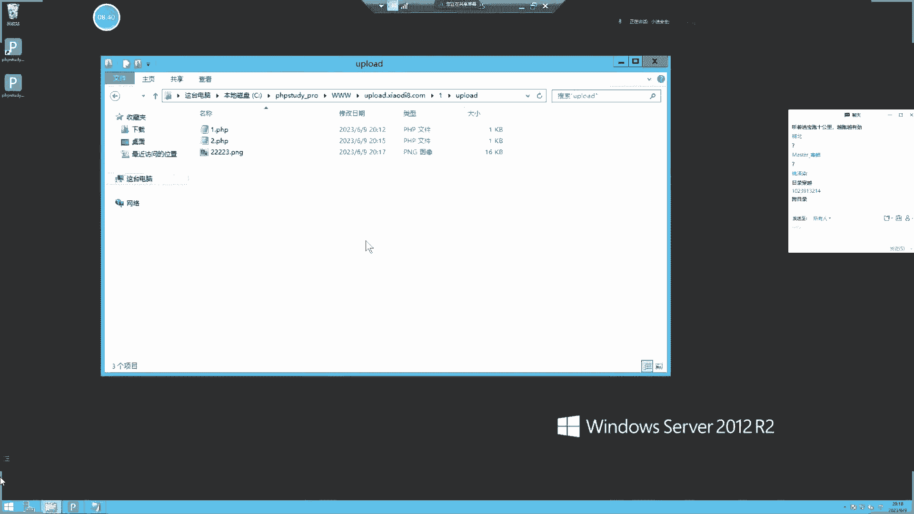

那么也就是说这是一种很常见的一种方式，这种方式呢，就基本上把这个上传文件的目录给他锁死了，你即使你把这个后门的上传上去了，也是不能够被执行的，也说是等同于上不上都无所谓，反正就执行不了，就这么个情况好。

这是第一种情况，还有一种情况就是我们经常也可能会碰到的，我们等一下呢都有这个案例呢去给大家看到啊，这个案例呢啊在网上找不到，因为这个案例呢都真实的啊，我们来看那个还有一种第二种方案。

就是我们说的第二种方案，什么方案就是解码还原，什么叫解码还原啊，我先给大家普及一下这个呢是个什么意思啊，肩膀还原是什么意思，大家思考一下啊，很多网站都会把图片去用字节流，数据接收过来之后呢。

进行一个编码编码之后，再把这个数据的资金流量把它保存，最后要取出图片的时候呢，就把这个图片呢给它还原出来，那么这个编码解码常见使用的就是base64，这是啥概念啊。

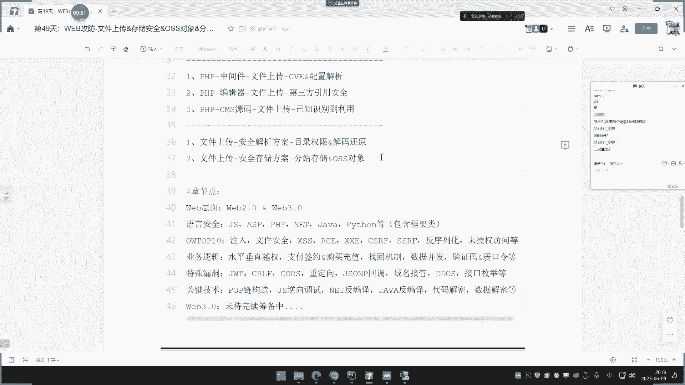

我给大家看一下，一个简单在网上随便找一个这个例子，你看啊，我搜这个关键词，这个叫data image base jb1啊，我随便在网上啊。

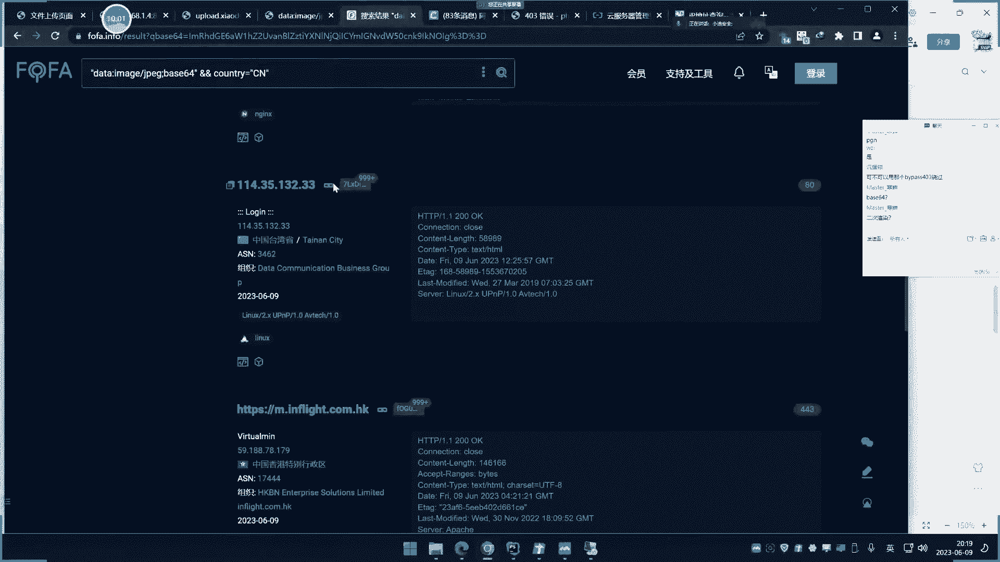

就你这里呢可以随便找一个网站，都是这么一个情况，你看啊，这里这是另一个网站啊，然后这里呢是有很多图片的，大家可以看到啊，正常来讲，我们看一下我们之前这种正常网站，就是这种模式的啊。

你看我小礼八点com的，看下小礼吧，哎，唉，这尼玛真是，算了算了啊，不是换其他的吧，你看啊就拿这个百度这边来看一下啊，那个啊我访问它，但看到啊它有一些这个图标，你看到没，这个图标来大家看到啊。

他是有个DZ呢，是是这个白度呢LICO，然后呢还有一些图片，你看这个图片呢都是呢，就是这个页面上面的一些图片啊。

你可以看到啊，这是我加载这个页面上面那些图片，那就这里呢也新闻的是吧，这种图片啊，对不对对啊，他也会加载这些，你看啊有很多这种图片，对不对，你看他有这种图片啊，其实就是他这个网站呢加载出来一些这种资源。

对不对，就会这么情况啊，这个好理解啊，对不对，那这种啊就是完整地址，那么还有一种情况你看就会出这种的，看到没呐，这种东西出来这啥东西啊，你看来那就啥东西，这个那有些就是图片地址啊，图片地址。

还有些呢就是我们说的这个这个什么这种东西。

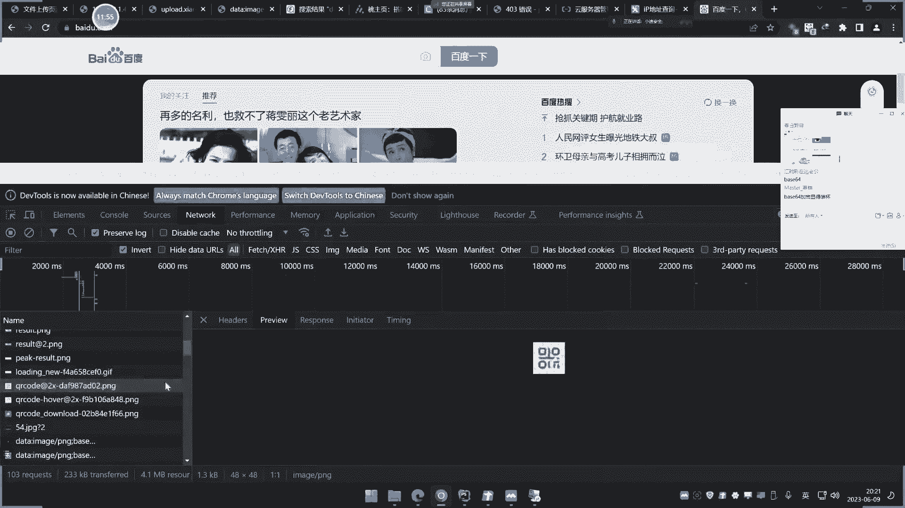

那这东西呢它其实你看这个啦，他也是张图片，他也是张图片，但图片呢是这种东西，看这种东西又叫什么data image png，Base64，它其实就是说把它渲染成一个image png的图片啊。

后面的是base64的编码值，这个Y进行这个解码之后呢，其实就是那张图片，那还原成就是个图片，那其实就是说他把这个图片等于就什么意思呢。

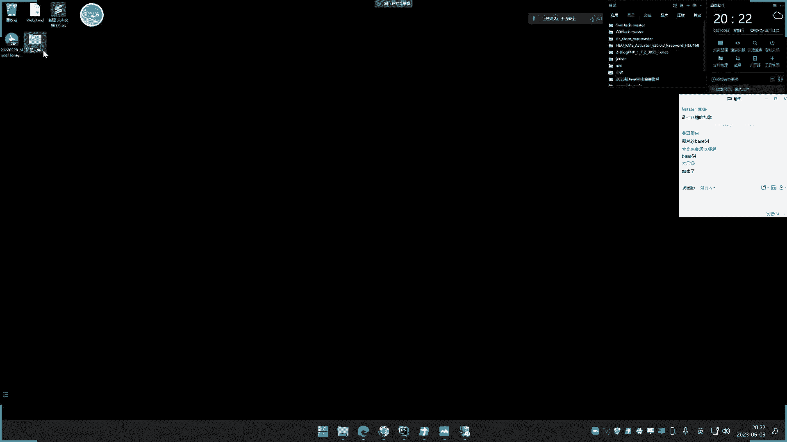

啊就我们简单的例子，就说这里不是有图片吗，准备之后呢，你用这个工具去把它打开的时候啊，你把工具打开的时候，就是用这种记事本工具啊，或者一些这个呃16进制查看器，去把它进行打开的时候呢。

它的这个核心的这个图片的代码呢，他应该是这么一个情况，他就把这里面东西呢把它进行背身就编码，编码之后呢，把把它发送成为一个一传数据，成为一个贝斯六四的一串数据，最后呢再把这个进行解码还原出来。

再还原成这个，那么打开就是一张图片，是这么一个概念啊，那这个又对我们有什么意义啊。

对我们有什么影响，我给大家先看一下个例子啊，大家看着啊，代码是这样写的。

可以给大家看一下这个代码，好把代码呢拿到这个本地来给大家看一下。

好这是代码啊。

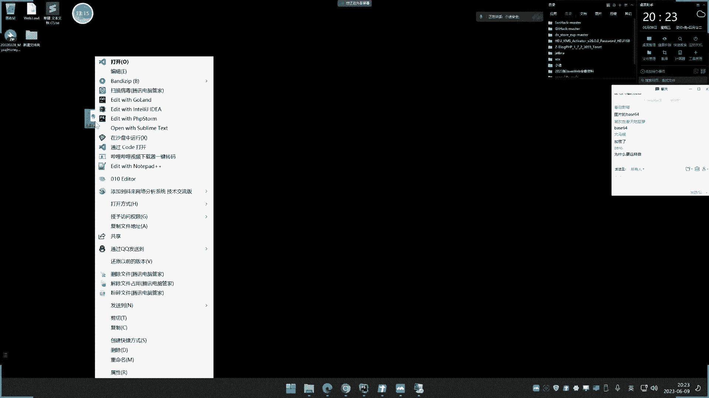

代码给大家看一下，代码非常简单啊，这个是那个上传，然后，哎不是不是这个不是啊。

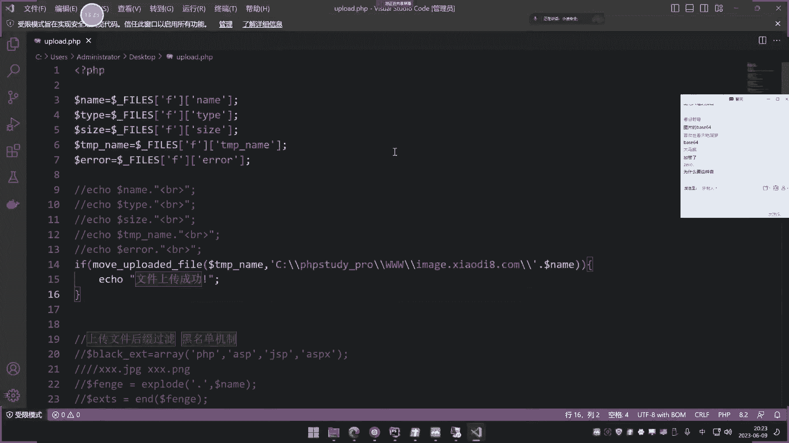

第四个第四个这个这个目录里面的这个啊。

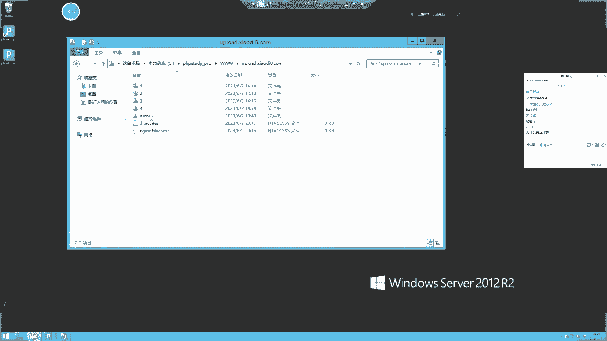

这个。

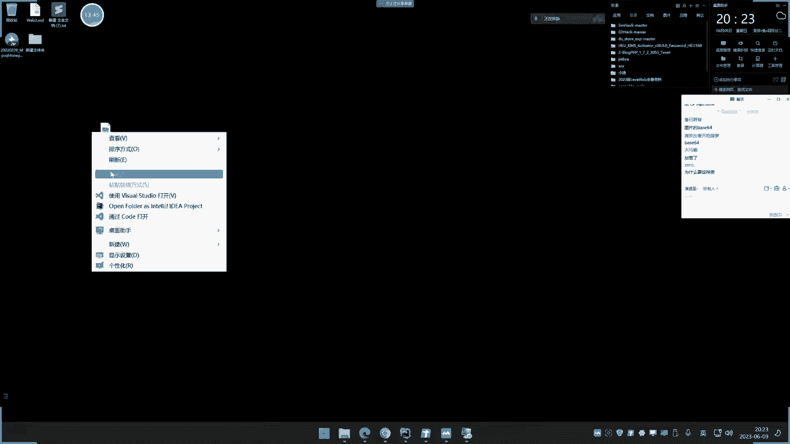

好我看这个的啊，看这个的嗯，它的代码是什么，你看啊，处理这个文件上传它怎么办，它把这个文件呢把它用这个函数打开，就是取它里面的所有数据，然后用base60把它进行什么样EO的，把怎么样编码编码之后。

他再用这个什么data image jpg，base64这个语法呢对这个编码的值呢该进行解。

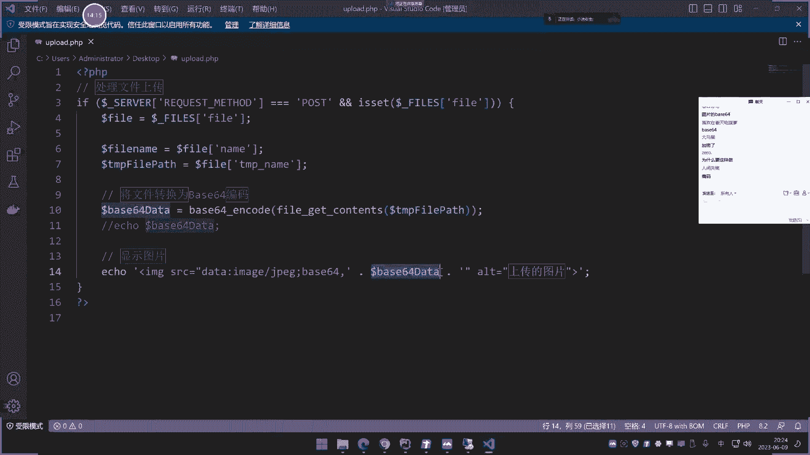

然后显示图片好，这有什么意义，大家看一下啊。

我们打开它，我们先从这个文件上传的概念去给他解释啊，等等下呢我们再回顾。

先打开这个路径啊，看着啊。

这个时候首先的啊，你看啊，我上传一张图片，大家看着啊，我上传一张图片好吧。

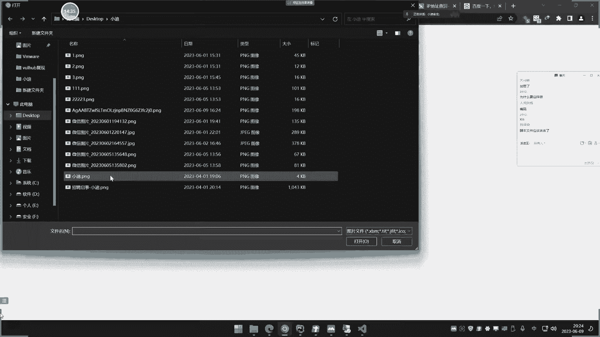

我上传张图片，你看哎这是我的图片，对不对，好他上传了并且显示了好，你再看看啊，我随便再上传另外的东西，他都一样上传了啊，这也是那个图片，对不对，图片能正常显示好，你看着啊。

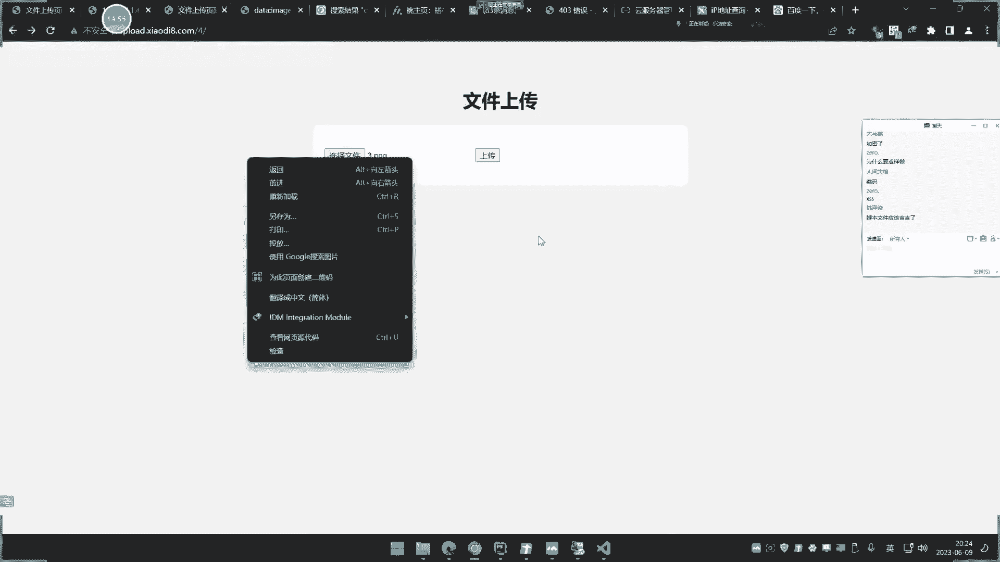

当我取这个，这是能够任意上传啊，并且把图片显示的功能，你看上传的时候，这个数据包是怎么样的啊，上传那他变成这种了呐，你看这个图片呢，它变成这种模式，你看他变成这模式啥意思啊。

其实就是说你上传的就是这串数据，你上传的就是ZA数据啊。

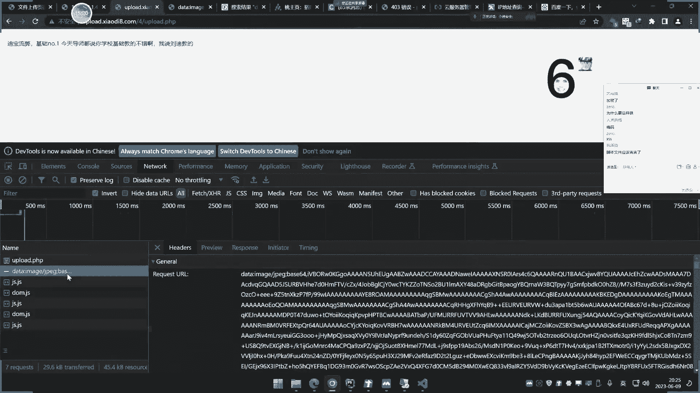

就是这个数据，就是说他把图片呢里面的这个数据啊，进base64了啊，这个就是他上传的base64数据，我可以呢给大家演示一下，你比如说我在这个代码中啊，我加一个函数，这不是他接收到的文件那个数据吗。

我把它输出一下，我输出这个数据给大家看一下啊，结束之后啊，后面是显示嘛。

把数据输出一下，好刷新一下啊，你看当他这个执行之后上传数据的时候，那这是他数据呢，这是那个文件数据就这么长传，下面是显示图片，这个是上面数据，他其实就是说把文件呢当做直接流数据。

把他怎么样解释过来之后再编码，然后后面呢再去解码还原，也就是说他其实呢就和我们传统的不一样了，传统的是把那个文件呢解释过来之后呢，叫保存，而现在呢就是把文件转换成一种数据形式，再从数据再把它还原。

可能你会问，那这有什么用意。

这有什么庸医啊，这有什么意思呢，来其实他的意思呢就可以方便于存储数据库。

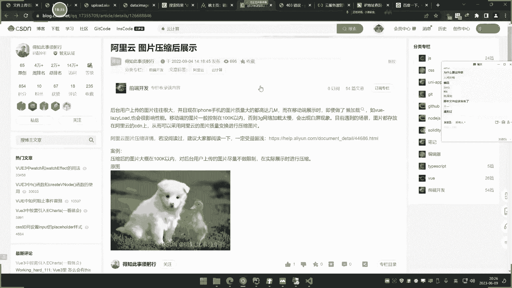

它可能把这个数据都存到数据库里面，然后呢再把它取出来，用相应的这个函数把解码出来，就是一张图片，就其实你正常来讲，图片应该是存储到这个什么，存储到这个文件目录中，但现在呢他把转换成数据。

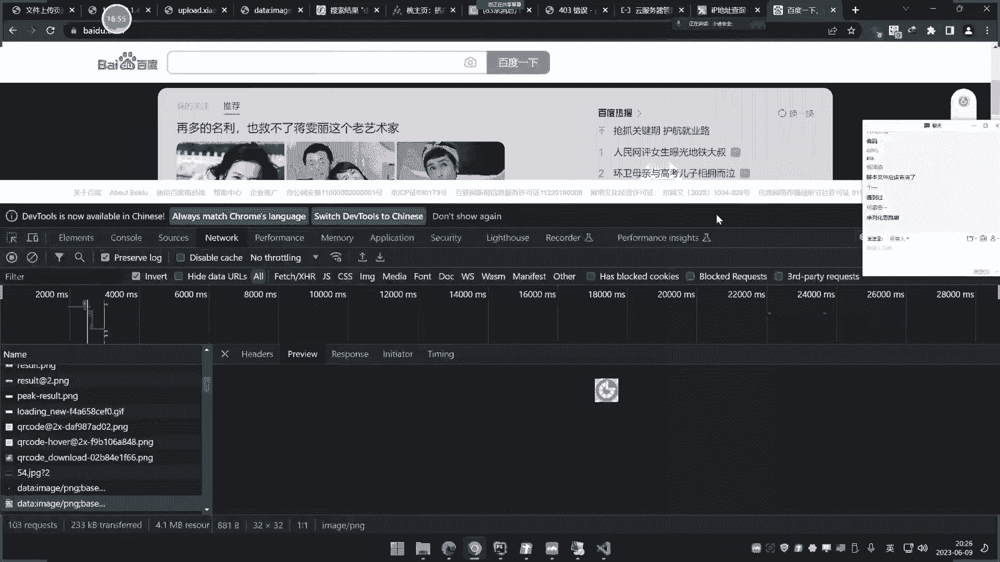

然后呢再把它还原这个流程，大家能不能理解啊。

简单来说呢，这个流程就是个什么逻辑啊，就是你上传这个文件啊，不管说是图片好怎么样啊，然后呢他把它转换成一个预算，预算什么一串这个贝斯牛斯的一个什么车啊，后面呢在要进行这个显示文件的时候啊。

就是我是显示图片啊，对吧，他就把它再怎么办呢，他就把他怎么样进这个解解码这个数据再还原，你可能说为什么多此一举，而不直接把他数据接收过来，是这样的啊，因为这个数据你如果不说仅仅base60编码的话。

那么那个数据呢，可能中间有一些这种特殊符号啊，或者说换行啊，导致你发送的时候呢，他那个显示的问题啊，会造成一些意外，所以呢它把它单独的封装到一个整体里面去，再把它单独的再把它解出来。

这样子呢就保住数据呢不会出现问题啊，是这么一个原因，那么这个过程是这么个情况，那么大家思考一下，如果说这个文件他要去显示图片的时候，它在显示图片的时候呢，他做了一个什么固定协议，什么固定协议。

就是我们这里看到的就这个东西。

那这个前面的前缀叫data image png base64。

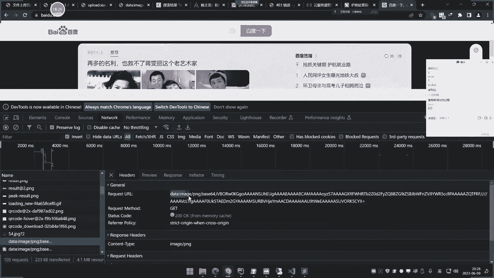

这个就是它的固定的写法，因为他要显示图片，它就固定的告诉他是什么类型，然后面贝斯60就是后面的什么，这个数据的这个指法，就是我说的basic是那个一串数据，这么一个流程啊，他也会这样去去解析它。

那么这个东西固定了，那就表示说你即使这里有上传漏洞，都没有任何作用。

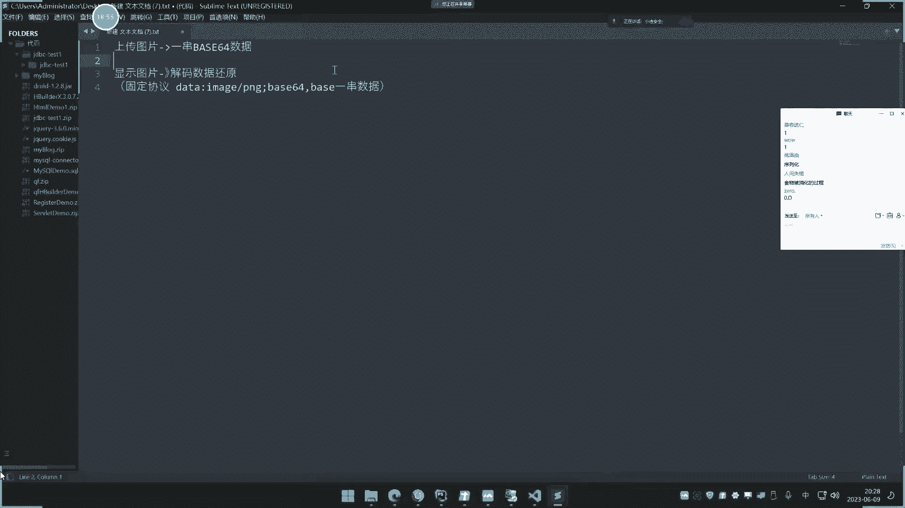

来我给他撕一下啊，来试一下，你看现在啊我尝试着去上传一个home文件，他没有，就说我这几个上传这个点里面呢，他是没有做任何文件上传的过滤的，他只是做了这个什么一些不同，和我们常规来讲一些不同的这种方案。

你看啊我们现在上传一个这个带后门的啊，就说我们找个这个呃带后门的这么一个文件，那这一二点pd是吧，看着R我上传上去，那他是能够上传上去啊，但是你看啊这个图片呢当我们去打开它的时候，那显示不了。

我们打开它的时候呢。

他图片地址变成这个东西，大家看一下来变成了这个东西，因为他接受是数据嘛，也其实就是说他把里面的数据都接收到了。

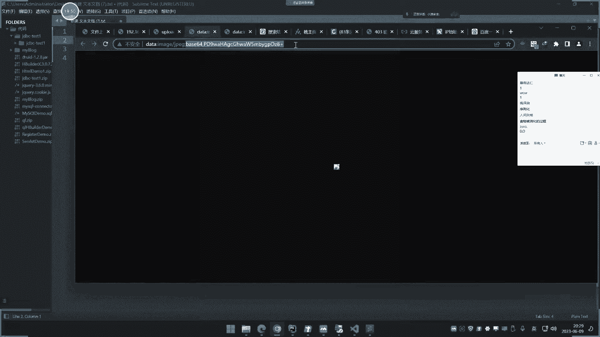

你这个格式呢，你不管怎么变，它都这个pp文件都展示不出来，这是为什么原因呢，固定的协议，这和你上传什么文件没有任何关系了，因为他已经固定好了，这是一张什么图片解析的。

所以说你上传任何东西对于他没有任何意义，它永远把它当作图片去解析，所以说你即使说能够上传pp，能上传后门脚本格式没有任何意义，他已经固定死了，我会观察这几个网站都是这么一个情况，大家可以看一下啊。

啊你看这几个网站上面的图片，我看下他是怎么存储这个图片的，这是一种存储方案啊，也是一种解析方案，就是这是不是张图片吗，你看啊，这个图片正常来讲，我们正常的图片地址应该说什么点PNG啊。

点GF的那种形式是吧，我刚才也给他看到了，在百度点com的时候，你看他也有图片，就是这种情况，然后你一访问这个地址。

它就是一张图片啊，你看这张图片对不对啊，他是这个地址是这样的。

对不对啊，这是格式嘛，PNG啊都好理解，是不是，但是你看啊，他这种呢这也是图片，那这里呢也有这图片是吧，但是你看啊它的图片是怎么流行，你看它的图片是什么，除了这个logo是一个什么地址，是这个地址。

那么你看其他的呢，这个呢打开呐，这是一张图片来，这是张图片，那这是张图片。

这是不是就是下面这几个图片，你看诶。

他的图片呢以这种形式去存储，以这种形式去操作，那么你想象下你上传的图片，他也有可能是这么个形式是吧，也有可能是这么个形式去这样把图片存储了，然后前面固定了这个解析协议，那么你上传任何文件有意义吗。

没有任何意义，因为你上传文件，它把里面的数据呢把它解析成这个东西了，然后用固定的这个协议去解析它哦，不不管你是pp还是其他任何脚本都没有任意义，它只认前面这个东西的解析。

那么这个前面一固定这个图片就怎么去解析哈，你是什么格式，他不关心，只关心里面的数据数据能把它解码是什么样，就什么样，如果是图片的数据，那就显示图片，如果不是图片数据，那就和我这里看到的是一样是吧。

我上传的是一个什么，不是一个后门的代码，哎他把后门代码那给他base64了，但是在你再去解析它的时候，由于这里不是图片的数据，打开呢就是这么一个错误图片地址。

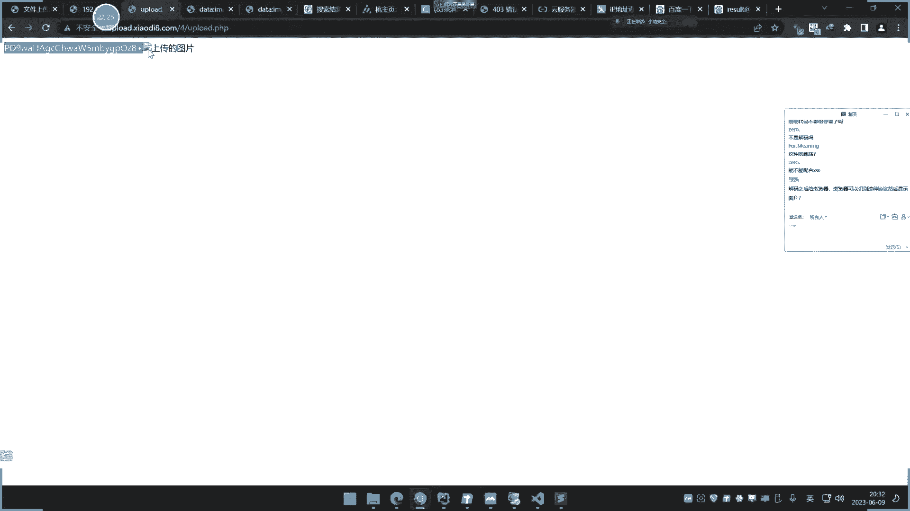

那就这么东西吗，就这么一个错误的，不是图片那个图标，这个能不能理解啊，这有点有些人那可能做不知道什么情况，其实就是说传统的就是把文件呢换了个地方，保存格式呢没有任何改变，对不对，这是传统的一种情况。

那么现在呢就是有这个东西之后呢，它其实就是把这个文件呐，以这种字符的形式去保存呐，而支付形式呢又以它设置好的这个解析的，这个协议的去解析了，所以它就像是文件。

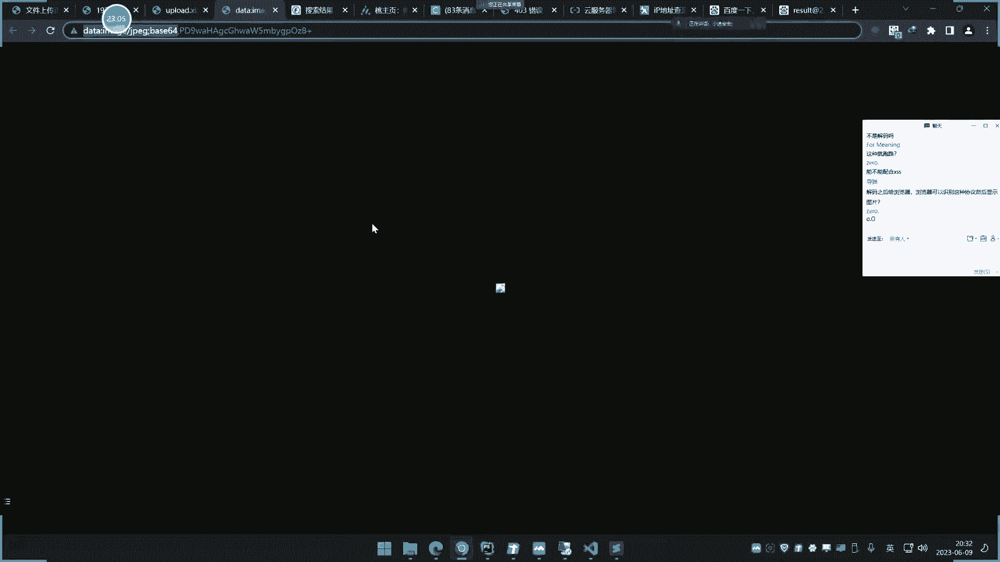

那它就没有格式了，知道吧，就是说啊这个东西呢就相当于说文件，这就上传这个图片呢，它是没有格式的，把它转换成什么，把它转换成数据了，那没有格式的话，那有什么去解析它呢是吧，因为它没有格式了吧。

它没有格式了，没有格式后缀了，又不知道是什么东西了，那么它由什么去解析呢，就是由这前面写的东西去解析，那么你觉得别人会不会傻傻的把它写成一个，PPP的解析啊，那肯定不会啊，那如果写个图片解析。

那管你是什么格式啊，装都让你上传，上传没有任何意义，解析的时候他还是按照图片解析，所以说你上传任何东西，对于他来讲都是一串数据，他只按照它固定的格式去解析，这个数据能解析出来是图片，就是图片解析不出来。

那就显示不出来，就这么个情况，所以说碰到这种情况，那你说咋办呢，对不对，我们先不说咋搬啊，这个东西能不能理解，其实就是说啊他换了一种模式去存储这个文件，就是换这个数据去存储文件了。

然后要用的时候就把数据取出来，然后用固定的协议去解析它，就这么个情况，就是他这就是这个基数的一个架构的原理，但是由于这个基数架构的原理呢，对于我们来讲，对这个文件上传呢是有很大的影响的，为什么。

因为我文件上传我一直在强调的就是那个后缀，因为我们绕去绕来，就是要把那个PPP啊，或者说脚本格式文件都给他上传上去，这是我们一直以来文件上传漏洞呢，做了这么一个尝试，都是为了这个做，但是这个概念一出来。

好像和格式没有任何意义了，因为你上传任何格式都没有任何意义，因为它只认数据，不能格式，你格式商圈商圈没有任意义，那会到他那里就是一串数据，而这个数据怎么操作，都是由他前面固定好的这个东西来去解析。

所以说你那个格式呢在他那里那就什么都不算，因为他压根就不输出格式，数据已经变成了一串数据，而那个文件已经变成了一串数据，我这样说能不能理解啊，能不能理解啊，我还给大家看到了啊。

那这几个网站都这么个情况啊，你可以看一下啊，我还有这这这这么多都是可以理解的。

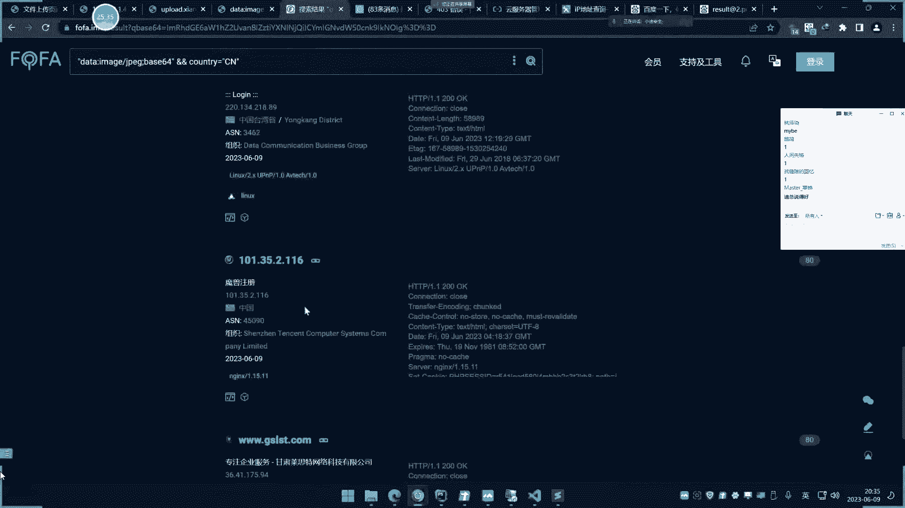

你看这个也是单的，你看这个啊，这个图标这都是图片。

对不对，你看啊他的图片是什么情况呢啊，我们看一下刷新，你看你看这里大，这是正常的，那这是正常图片，你看是正常图片，你看还有些图片就是还修就不一样了啊，我们猜一下在这有没有，他这里没有啊，搞半天。

这里没有好。

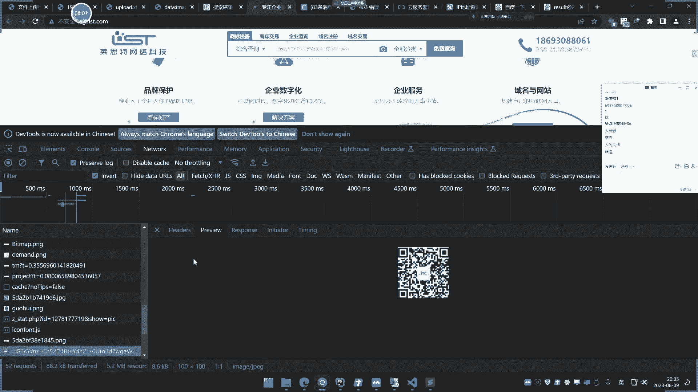

这里有个啊，这个不是这个也是张图片，这个还是搞错了，看前面的啊，嗯好看这个吧。

哦这里呢有一张那个啊，你看啊这里也有一张图片啊，你看他图片那个存储方案是怎么选的，你看除了这个本身这里几个小东西呀，是这个颜色，然后你看下面的这个人物的这个图片呢，山迪呢都是这个什么对，分析这个东西呢。

其实就是那个图片的那个信息，就是这个图片信息，这是图片信息，搜一下图片信息，那就是他图片数就是我刚才说的啊，就打开那个图片，他的这个值的一个那个数据的所有编码，把它形成一个整体，对不对。

就说对方呢去存储这个图片，那就是存储这个数据。

把数据存储之后呢，用解析呢去解析它就完了，那么不管说你这个这个东西是不是遗传，是一个什么格式呢，都不是他关心的，因为任何格式他就把里面的数据把它转换，转换之后，用固定的协议去解析它，上传图片啊。

把这个图片的数据呢，把图片的数据呢把它转换成一团base64，后面呢再把这个贝斯六四怎么取，那个呢，就是把这个base64的数据呢给它进行解码，然后呢再进行还原啊，这个还原呢就是我们说的阿数据解析。

把它解析出来，是这么一个情况啊，是这么一个流程，所以说呢哎这个文件上传上去，不管说你是什么格式，它只认数据啊，只是说这个方案呢它是只认，只能数据把这个文件的数据呢做这个什么，就这个处理，你是什么格式。

它是没有任何关系的啊，不会有人关心他没有格式，全部是数据啊，数据该怎么解析，就是他自己呢配置好的这个前缀来去解析它，所以核心道理就是这个地方改变才能攻击，这个地方，改变不了，那么没有任何用处。

我们前面的上传漏洞呢，都是围绕这个文件的后缀呢来去操作，就怎么样呢，去上传PPP啊，怎么让它解析PPP，这是前面那个文件上传，但现在呢这个技术，他这个后缀呢没有任何意义了，你能上墙和不能上墙关系都不大。

因为它只于数据，数据怎么解析，由它决定，所以你要知道啊，这个文件方便的，这种存储方案的解析方案有很多种，我们这只讲两种。

还有啊接下来讲第三种就是存储方案。

刚才那两个呢是一个是目录权限，就是控制解析的不给予执行权限，还有个就是我们说的这个建模还原是吧，解码还原，那这个解码还原呢就是两个都做了，就是首先数据呢它是什么存储的啊，这数据呢做这个存储。

然后啊然后解析呢孤立对吧，他这么一个情况，这个后缀无关，好我们接下来再看这个存储啊，存组呢在以前没有人安全，比这个啊人安全还没有这个比较普及的时候，用的最多的就是这个分站分站的这个存储，什么叫分站存储。

什么叫分占存储，好，我先给大家看一下我这个本地案例。

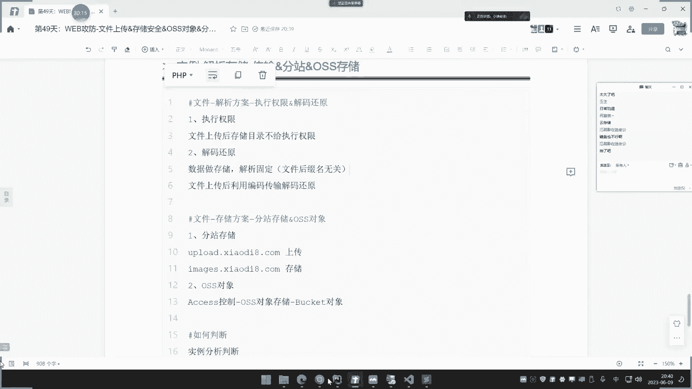

看完之后呢，大家来看这个真实的一些常见情况啊，我们先看我本地案例啊。

来看啥啊，有啊这个上传之后啊，我这里呢创建两个域名啊，我这里呢是为了方便，所以我把这两个域名的解析目录都放在一起了，一个是image小于八点com还是upload这个小巴点com。

然后呢这个image share巴点com呢，这是我们上传的这个地方，好，UPLOADER就是我们说保存地方啊。

分站存储啥意思呢，你看啊，Uploading shabin com，这里有个上传点。

我们去上传一个文件，叫我上传个文件啊，比如说我随便上传个图片。

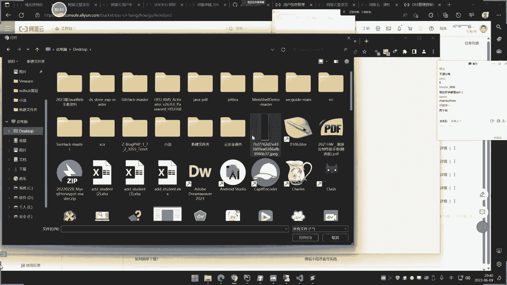

上传个图片啊，上上去好。

你看他上传成功，上传成功之后呢，它保存到哪里啊，保存到这来，保存到image下载80com上去，这是我说的分站存储，啥意思呢，就是说他是有个专门的这个网站域名，去存储上传的资源的，是这么一个逻辑。

就说它不再是我们以前就是我网站域名，那我是upload。

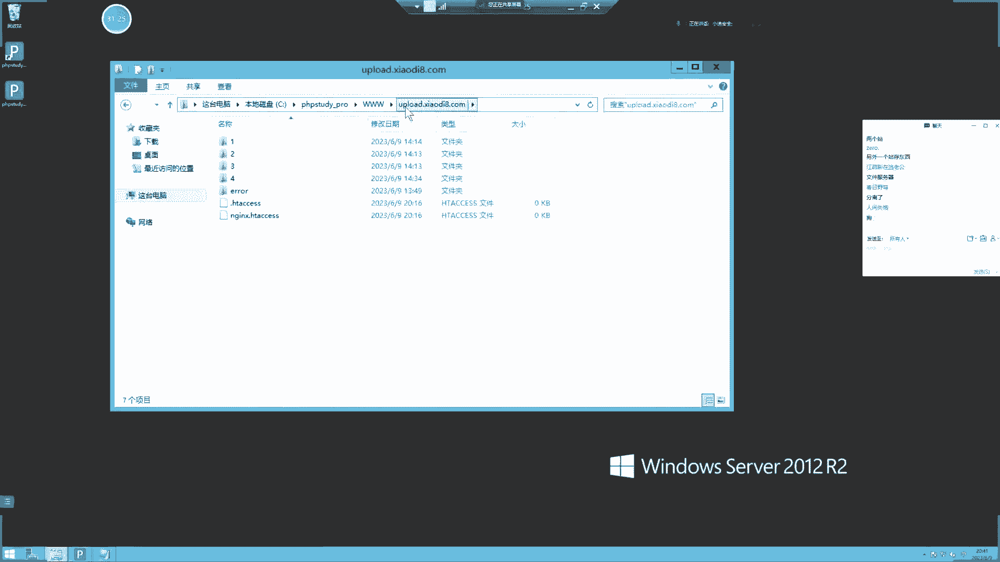

小二哥，你看，那么也就是说你上传的网站呢，是这个什么upload的下八点com。

那么现在文件呢它跑到哪里，他跑的这个什么点什么com，来不来，image小Y点com，然后这个什么哦，三点点击他跑到这个地方来了啊，他跑到这个地方来了，刚才上传的地址文件，它跑到这地方来。

我上传的域名是upload，跑到image上面去了，两个域名不一样。

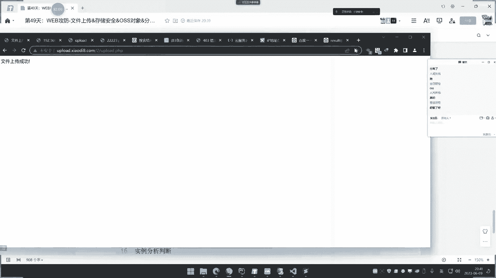

你可能说这都在一个网站目录啊，那试想下，如果我把这个upload放到这个服务器上面去，把那个1BEI放到另外一台服务器上面去，那么大家试想一下，你测试的目标是upload的。

但是最终文件上传了image，那你告诉我我究竟是如果说这个文件啊，就说这个这个这个后门呢能够上传，那我拿的是image呢还是upload呢，大可想而知，那我连上去的话，要连是不是就是imagine连了。

那不可能你upload用upload上面没用啊，他不放到image，但是通常这种方案都会做一件事情，就是做目录的权限控制，啥意思呢，就是说啊一般用这种方案的，基本上都会做一件事情。

就是把目录直接给他锁死，就是这个目录只能用来存储，不能用来解析，那么就等同于目录所示之后你上传上去，我不管说你连不连得成功，至少一点网站的目标就已经错了，还有一种呢就是说你访问他没有任何意义。

因为这个呢就是做存储文件用的，他啥事都不干，就是做存储文件用的，他就相当于说把文件的放到另外一个地方去了，就不再是和我们那个目标网站的关系一词了。

那么你看啊网站有没有网站，有没有这种使用这种方式的呢，我跟你说啊。

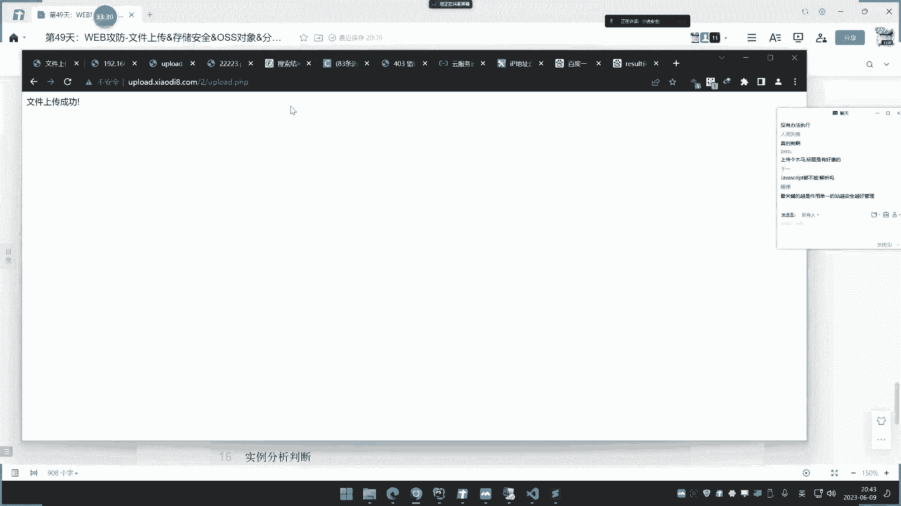

基本上稍微大一点的网站都这样用，来，你看啊，大家看一下啊。

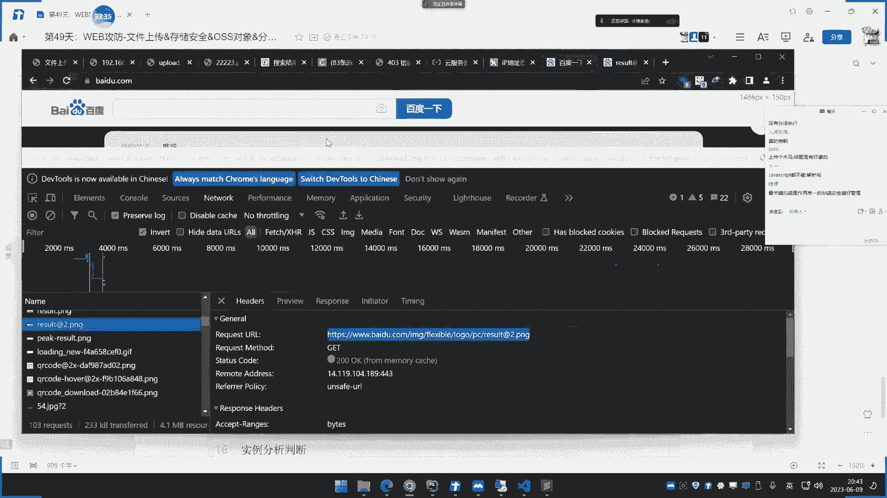

我都在看，你看你就拿哔哩哔哩来说，你看啊，哔哩哔哩这里不是有文件的，这个个人的这个地方吗，你看啊，你看这是我的图片是吧。

对不对，这我的图标啊，你看一下啊，我把这个图标打开，你看我这个图片在哪里，我点一下这个的图片地址啊，我看图片第一次跑哪去了，那这我图片地址看到没，是一个JPG图片，来这我图片地址。

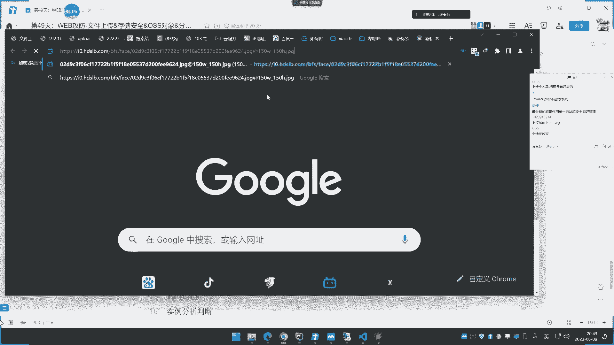

假设我图片地址嗯，这图片地址图片图片是一个什么，IOHDLSLB点com。

我在哔哩哔哩上面去上传图片是吧。

把哔哩哔哩这上面去。

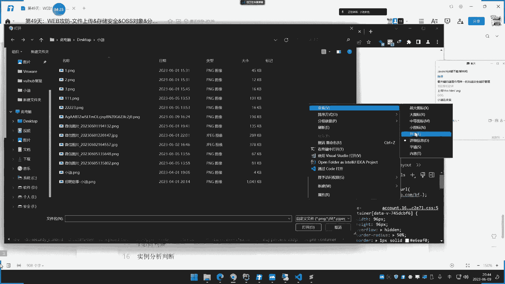

上这个图片，那你看大火现在呢八一更新是吧，对不对啊，这个我是懒得更新了啊。

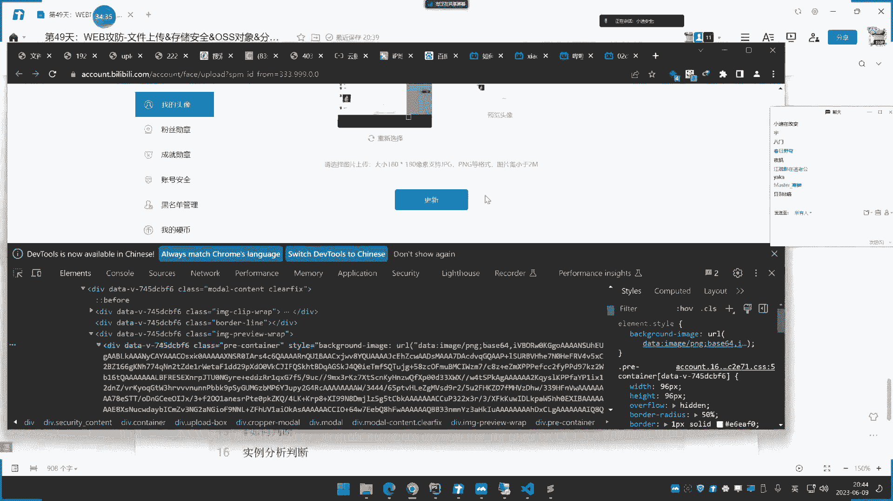

你看我在更新的时候，刚把上上去之后，你看他是怎么存储这个他怎么做这个事情的，大家看啊，来这这是那个地址呢，你看发生更改，你看那我再换一个那个，那看到没，这个地方改了啥情况，是不是这个地方改了。

你看改的是什么被普mage png啊，啥情况，他是不是就是几种方案联动在一起在用啊，又搞了这个说的，把文件转为这个资金流呢，你看这是他自己的数据，就是我的图片资金有，就是我要变身60的数据。

而且当你去保存提交之后。

好他没成功啊，当你保存成功之后呢，这个地址就变成这个地址，就是放到了这个网上，另外一个地方存储了，所以说为什么说他们安全，就是因为他们都使用了这个，所以先进是吧，最最最安全的一种架构呢。

去对这个文件上传的做着做这个事情，所以说即使他说能够上传这个脚本格式文件，但是依旧不会影响他人身安全问题，因为第一个他把文件呢放到另外一个域名，那假如这个网站的这个域名上面呢能够连接。

但是和你这个目标网站呢不是一个地方啊，是另外一个呀，里面上去的只有文件，没有任何源码呀，网站信息这就不说了，那大部分都这个不能做解析，还有情况就是说在做文件上传的时候，他接收到的这个数据呢。

刚才大家也看到了，他接收到的都是这个什么这种数据，他把这个只接收数据，他压根就没有看，你说哎呀，你是一个什么这个格式啊，是什么鬼东西，压根就没有看，你只只接收数据。

把数据都固定成这个解析协议去尝试解析它，所以你上传任何东西呢，在这里呢都是把它当图片处理的，你这里有没有HOON，或者说是什么后门都不重要，他只是把它当做图片处理，所以碱性型固定时，那就不说了呗是吧。

这很好放啊啊，你看百度的也是一样啊，啊比如说我们找个百度这个图。

你看这个百度图片是他这里不是有上传吗对吧。

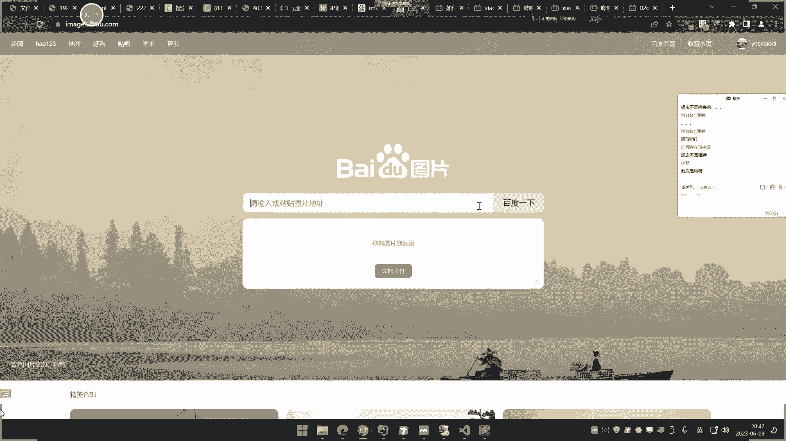

你看他是image biding home，我们选择一个文件呢都要进行上传。

好这是他图片是吧，你看我们图片地址，打开这图片地址。

你看你看是个什么情况。

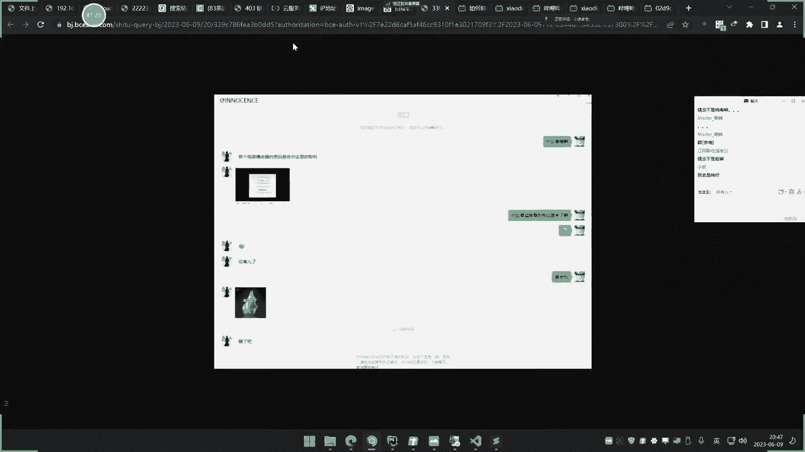

你看这个域名是个什么域啊，BGBCEBOS点com，你的图片放到另外一个地方去了，你上传的是image百零com，放到另外一个地方去了，是不是类似的分站存储啊，你可能说为什么要这样做，其实就是很简单。

就是和我们做事一样，专业的事给专业人做，就说那个域名呀，他就是专门来存储的，他啥都不干，就是来存储的这个数据的存储，这个上传的东西的啥都不干，就搞这个事情，所以你只需要你你需要控制这个文件上传安全。

你就只需要控制这个域名，它的解析就完了，你不给他解析机会，你上传任何东西上传到后面上去有啥用呢，上传解析不了啊，解决不了代码无法执行成功啊，那个后面无法连接啊，你就失效了呗。

所以他需要考虑你上传什么格式吗，不需要你都给我上传上去都行，就是不能连接，就是不能执行，咋办呢，所以聪明的人就玩这种模式是吧，那种传统的呢就还在那个代码上面做控制，因为你压根就不需要控制。

利用这种专业的事情呢，就控制一个地方就可以了，其他的就不用你考虑了，代码都不用控制是吧啊，这是以前的一种方案，那随着这个人人产品的一个流行之后呢，又出现一种另外方案，就是利用这个对象存储来实施的。

什么叫对应存储呢，就是在我们这个2。0上面。

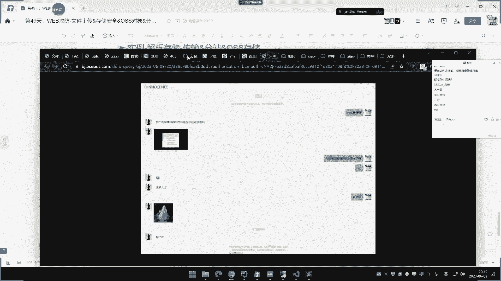

大家都知道啊，它是有一个这个OSS存储服务的，那这个是干嘛的呢，大家也应该知道，从它的官方理解呢，他说是这个干嘛的呢，其实它就是一个对象存储，OSS就是一个保存数据的地方，那很多数据都可以放上去。

类似的，不可以把你就生成一个网盘，就是个单独存放文件的地方啊，他给开，然后你开了之后呢，他就会按照这个大小和流量呢进行收费，其实就是说其类似，就把他肯定解为一个人网盘，就这个东西就专门存储数据的。

什么数据都可以往上面拖，然后呢，他会给你一个这个这个网盘的一个什么地址啊，你上次说他会给一个地址，那么大家试想一下啊，有啊这里有个这个地方啊，你比如说这里啊，这里有很多文件是吧，你看这个文件呢。

你只是上传上去之后呢，详情里面就会有个地址，那这个地址呢就是那个文件地址，是不是啊。

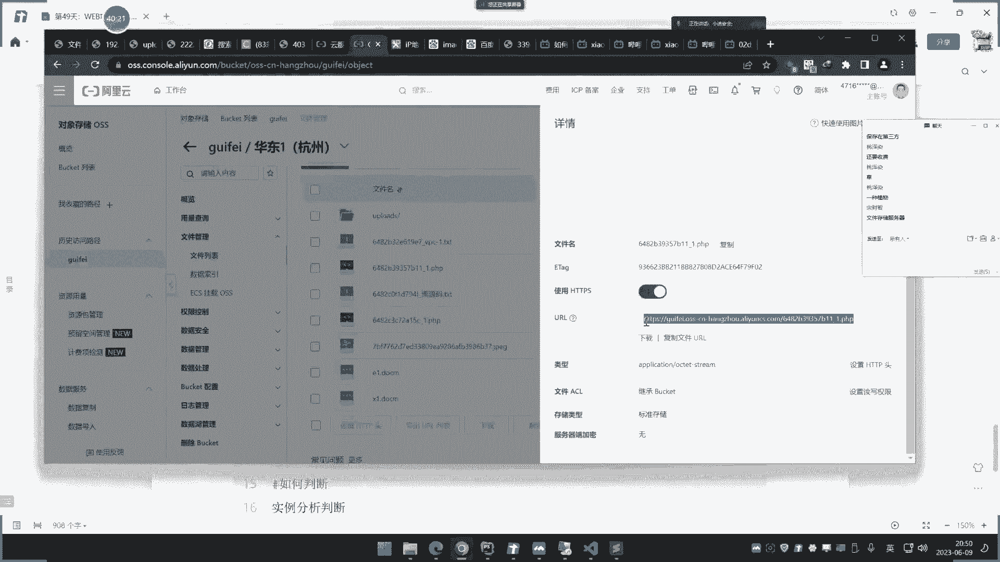

好那这个是存储方案啊，你看啊，我现在在写了个这个代码，就是能截上去的啊。

我们来看一下啊。

这是一个上传是吧，也是个上传啊，我上传任何东西他都能让我上传啊，就是说他没有控制我上传的格式，按照正常来讲，它是存在文件上传当中的，因为他没有控制这个home门格式上传嘛。

我上传任何东西它都可以，是不是啊，对不对，那就是说他没有控制板这个2。0B啊，这一打开勾哎，上网成功，你看这是他地址啊。

当你去访问这个地址的时候呢，你访问变成下载啊。

他把下载了，然后这里可以看一下啊，在我们这个存储方案这边啊，刷新一下。

先把这些标签关闭太多了。

刷新一下啊，那你看刚才上传的文件在哪里，你看好就这个嘛，69号呃，刚上传的就在这里是吧，你看在这里嗯，地址呢刚才打开看了。

打开之后呢变成下载，那么这个文件的加载下来之后，你再打开看，这是用到pp代码啊，这有啥用的，啥用都没有啊，他只做存储存储，要么就是访问之后呢，你上下图片啊，你看我上完这个图片试一下。

看图片是什么情况呢，对不对，我上传个图片试一下。

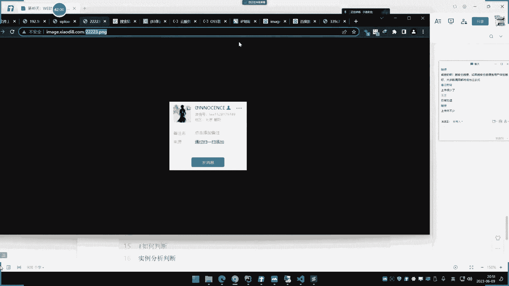

好我试试3000个图片试一下，啊啊我上个图片好吧，一点偏激算啥好，我们看一下啊，那他也是下载它也是下载哈，但是下载那你看他也是下载，对不对，都是下载，啥情况呢，他其实就是把它存储到里面去了，啥都没有。

你访问呢要么就是直接打开，要么就是下载了没有其他的东西了，没有其他东西了，那个是根据你的设置，因为你在创建这个这个这个地方的死活啊，啊哎这个地方的一个使用的时候呢，你看啊他是怎么创建的，我给看一下啊。

他会先点这个地方，然后点创建，创建时候呢先取个名字，比如说我叫这个效率ACC诶是吧，然后这里呢选择你的地区，就说你存储到哪个地方的地方，标准存储和什么这个归档存储等等啊，然后这里有个叫独有权限。

私有公有读，如果学生私有的话，就需要你用那个access k呢才能访问它，如果公共读，那就说任何人都可以访问这个地址呢，去读取你的数据好，然后后面就不说了是吧，他这么个配置是这么个情况啊。

其实那就是在哪里帮你开个网盘啊，在哪个地区帮你开个网盘，开了之后呢，你就在上面都可以咔咔的去上传文件了，去把文件都放到这里来了，然后由现在就设置有密码的访问，有这个K的访问。

邮箱呢就直接可以公共的去读写，对不对，但是他们都做了一件事情，都只有一个问题，就是这个文件它只是存储，你只能去拉这个图，拿这个文件资源并不会说有任何问题，所以他这个文件上传上去之后呢，打开无非就是下载。

再有是显示，就不会说把这个文件呢给他执行，你不管是什么格式放到上面去，都只是一个文件，它就能提供下载，其他的他都没有了公认的，那么你想想这种图片呢，这种文件上传到这个OSS里面去之后呢。

你后面上上去之后有没有用呢，那不用说了吗，那肯定就没有任何用了呀是吧，那你可能问那问他这样做。

那他要正常使用这个图片怎么办呢，正常使用就正常使用呗，他直接把那个地址把他图片给他。

怎么样进行这个资源拉取过来，再把显示不就行了吗。

而且你可以看到啊，我给大家看一下，这个还不在少数。

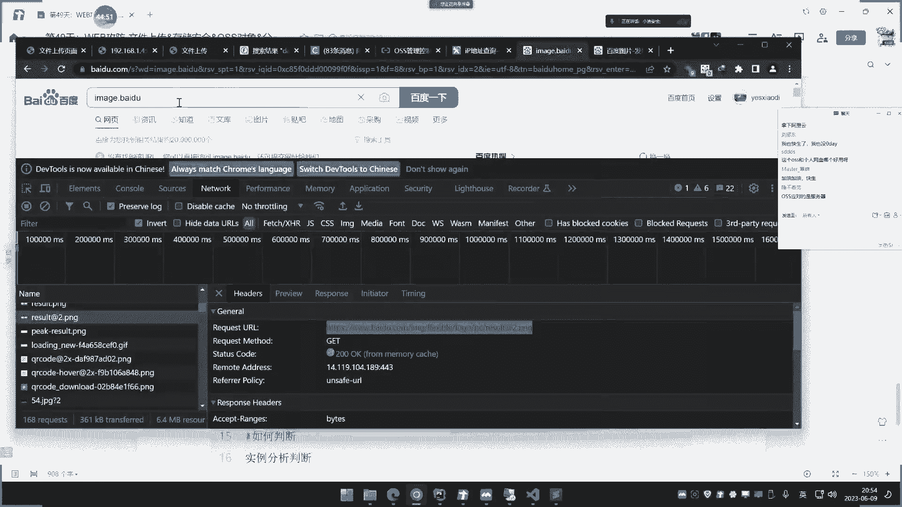

你看一下啊，我随便搜这个搜这个域名，你看网上很多这种网站都是用的这种方式啊。

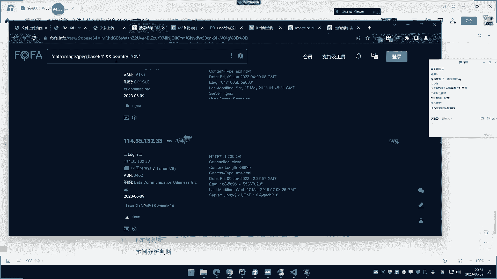

你比如我就搜个阿里云cs，就是阿里云用用阿里云的这个东西啊。

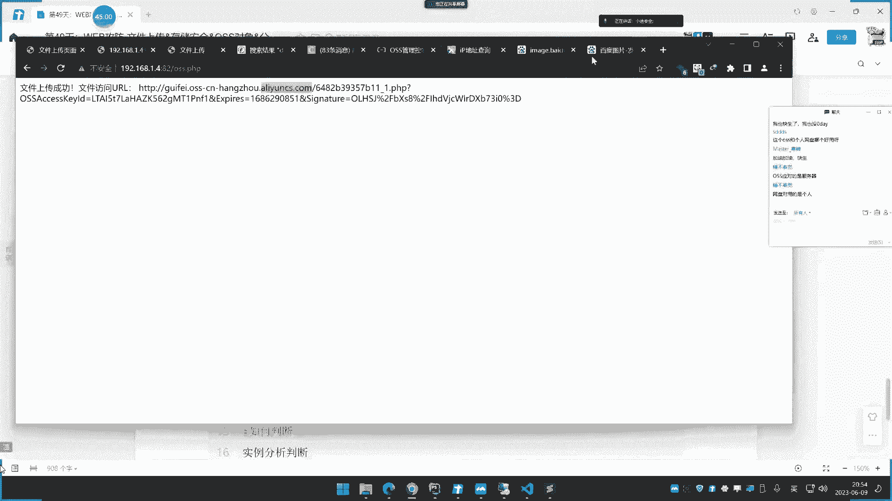

我就搜个关键词JPG。

应该有很多这种已经使用过了，你看呢这是他的图片地址，那他把上传再来。

你看啊，那地址呢image dmo os，这个杭州阿里面cm s examo jb，你看他就把这张图片呢上传到这种地方啊。

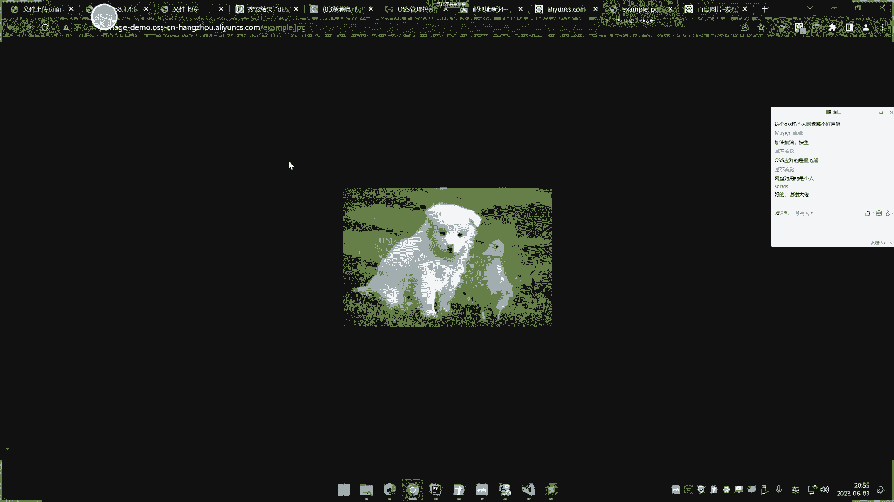

那这有很多呢是吧，就是把这些文件不管是图片好，或者说一些这种各种各类的一些其他的东西，你看这都有的是吧，东东西嗯，那阿里人的图片加水印啊，什么，就是把各式各样的文件呢放到我们这个什么唉。

放到这个这个图标要删了啊，然后放到这个OS资源上面去，然后呢自己呢再选择新的是吧，去从这里面取出这个文件呢，再来去显示啊，和那个分支存储呢是差不多的，你看这里呢是不是也是一样的，就是这样。

这都是一些网站的图片，然后呢他把单独放到这个这个OS在资源里面，然后要取出来的时候呢，他就把它取出来，哎你看这个就是呢发放到上面去了，你看它自动下载的，这是一个网站的是吧，那非流等于什么一个地址。

然后这个地方在这里mp4是吧，这就是应该是那个网站上面的资源啊，对他放了，放到这个OS里面去了，然后呢，他要播放这个图片和这个这个网站的时候呢。

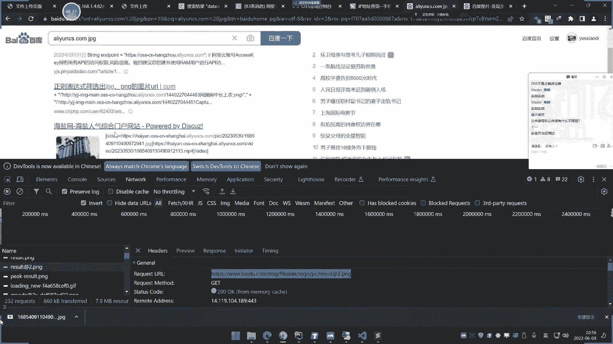

对不对，他就把取出来呢。

在固定地方显示，你看这里有很多图片啊，你都可以观察一下，是不是就是来自于这个地址上面的一些图片，他这里不是的啊，但有些视频可能就是的，好把拉下来之后呢，就放到这个上面去，啊这个上面报错呢是有的啊。

你看这个地方呢有那个快照的信息啊，啊在就这地址上面的啊，哎啊这个大家应该好理解啊，其实就是说哎把一些资源呢放到这个阿里云的，这个这个不管是阿里云还是其他的，就说我们说的对象存储这个概念就是阿里云啊。

这个啊腾讯上面都有啊，云产品上面都有发到这些平台上面去，文件呢就是做个这个存储没有任何作用，然后要用的时候，那就把它取出来就完了，也就是说图片放到那个地方，放那个地方之后呢。

你的后面呢你如果说要上传也是放到那个地方，那放那个地方，你这个后面还有用吗，就没有用了呗，因为你访问它就是下载有啥意义呢，没有任何意义，你能上去这个后面也没关系啊，让你上去上不上去也是个没有用的东西。

因为他就不解析嘛，它只提供下载，永远都是用下载去搞你，你到后门代码写上去也没有任何用处啊。

所以说呀这个文件上传呢要控制安全的。

是非常简单的，要非常简单的啊，随时随地都可以捉他啊。

然后大家如果要测试这个OSS的话，注意一下啊。

它需要改几个地方，就我这个等下会给大家打包吗，打包这个代码，如果说大家要测试这个OSS的话，就自己呢登录一下阿里云，登录下阿里云之后呢。

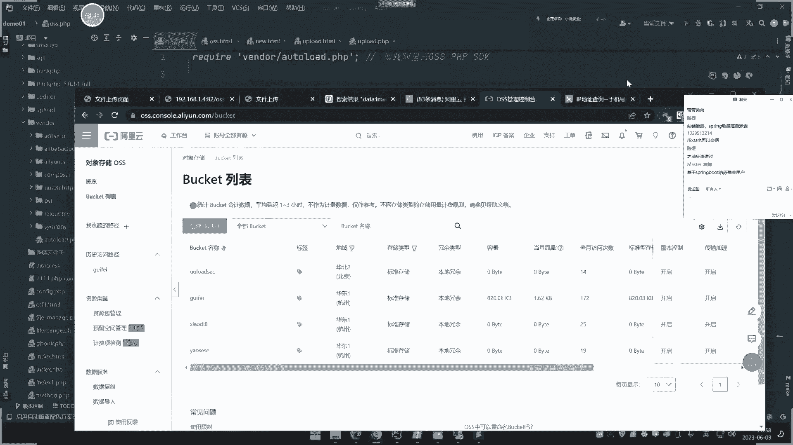

在这个对象存储呢开通一下这个boot啊，就配置这个几个信息。

一个配置这个input，这input那就是在这里啊，大家说一下。

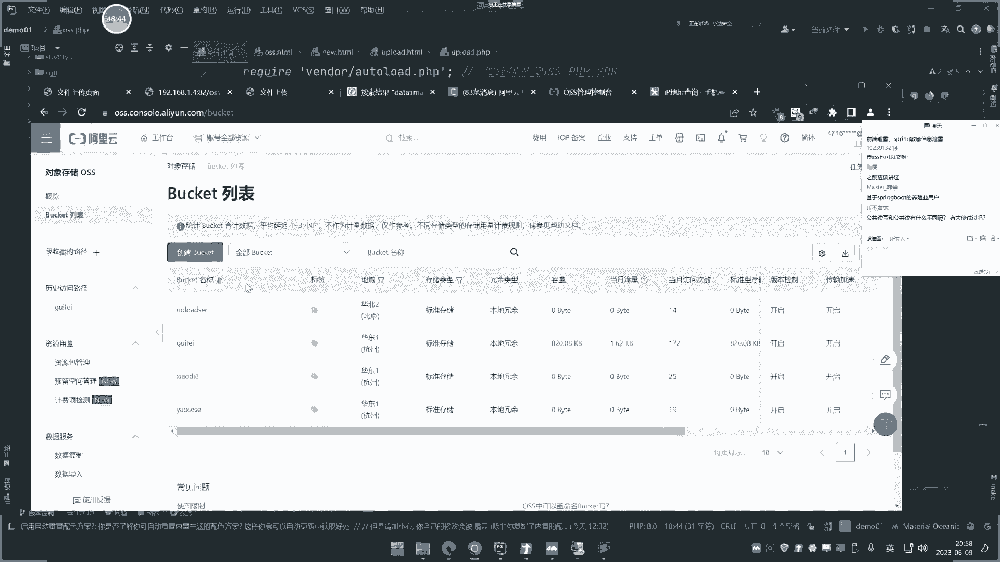

那创建的时候，这里不是有个这个地方吗，把它开起来，那就选这个地方，还有呢就是个name。

就是你创建的名字啊，就是创建名字就是这里写的名字啊，名字就叫这个bot名字。

还有两个就是这个access k，这个K呢是在另外一个地方。

就是访问你这个账号的资源的啊，是在这个，哎叫什么安全设置啊，嗯这在哪里去了，妈的，哦在用户信息管理这里，安全信息管理，妈的什么鬼啊，好来到这里了啊，我大家还在拥，我，赶紧一个金庸这里面的被你截到了。

你赶紧把我资源都访问了，我谁顶得住啊，这是吧，赶紧先把它禁用掉，因为实验已经做完，不然的话，你知道那个K不就给你咔咔的搞了嘛是吧。

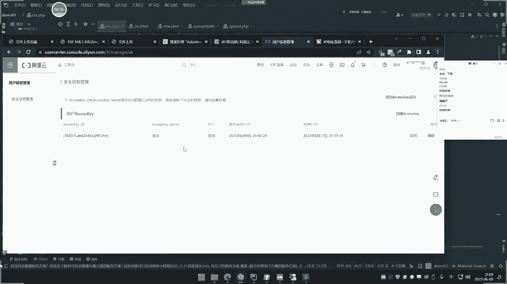

这个就是那个配置那个K和那个密码的啊。

因为他就是在这个地方啊，啊有你配置好这个东西之后呢，他就用这个K呢，能够访问你这个人账号的一些资源，就包括这里的人服务器啊，这个人存储啊，它它就能访问它里面字段的啊，就我刚才说不是配置这个呃。

配置这个什么配置这个地方的时候呢，啊配置那个对象存储的时候，不是有个那个叫什么东西啊，公有啊，私有是吧。

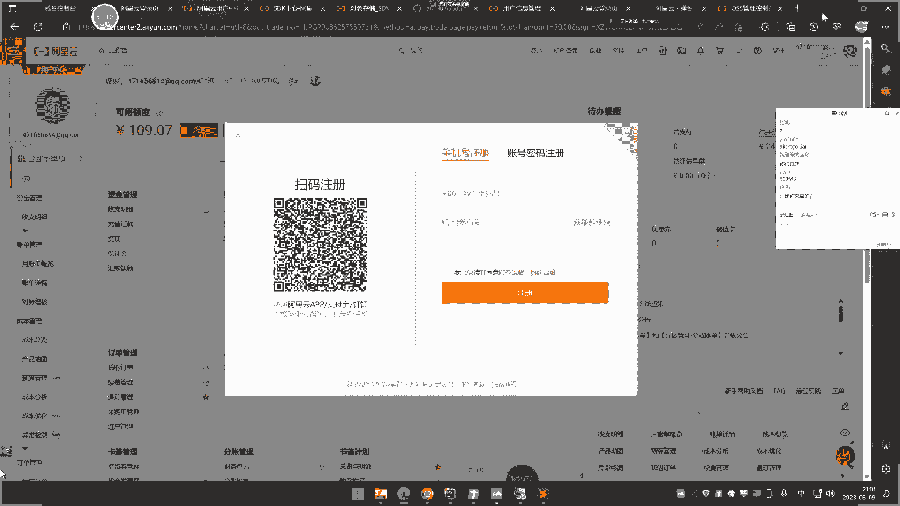

一个那就需要登录嘛，对不对啊，就这个意思啊。

大家注意一下就可以了啊，赶紧把这个勒个了啊。

不然的话我这个东西你知道之后呢，你可以直接用这个东西呢啊去勒个啊，这个东西呢我们后面会讲呃，为什么说后面会讲呢，因为这个就是人安全啊，这个是人安全，到时候呢我们会说从这个上面再去操作它啊。

好这个就不说了啊，这个是那个呃讲到的这个什么OSS存储好呃，这个呢安妮我基本上都给大家看的啊，分展的呀这个东西的，然后大家这肯定就有问题呃，第一个问题呢就是说如何判断是这种方式。

第二个呢就是说呃这种方式呢，有没有绕过的可能性啊，那我就给他说啊，首先人说是个判断，就是你怎么知道的，其实啊我把这个质点讲完之后呢，通过这个案例学的演示啊，大家应该就知道怎么判断这个判断呢，很简单。

这个第一种判断如何知道是不是这个固定权限，那就是看那个上船之后的那个表现就可以了呀，对不对，你上传之后，那解析不了，那就是那个情况或者说403的那个错误，那就是典型的那个什么没有解析权限。

那就是就没有执行权限。

是吧，就说你明明一上传好了这个pp文件。

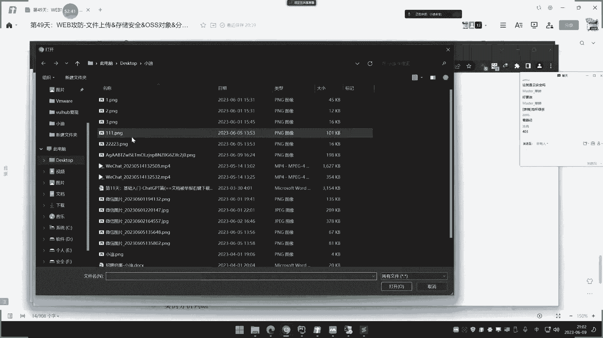

但是访问呢他就不给你访问是吧，明明这里下面呢有这个upload AD，来点RTV1访问，它就是呢提示这个事例三错误啊，或者说在个状态码中呢提示这个访问他呢是吧，403错误，明明这是个文件，放我403。

就是因为你这个文件呢他不给执行这个文件，没有的话，那就是四例四嘛是吧，这个文件没有的话，那就是私你私错误啊是吧，他直接包的有13，你看都到10米三，他不给你访问，就有没有都是都都是一样。

那只要说你知道这个上传的这个文件路径，你去访问它，如果提示这种信息啊，那你就知道了啊，他设置这个权限，导致这个文件呢无法被正确执行。

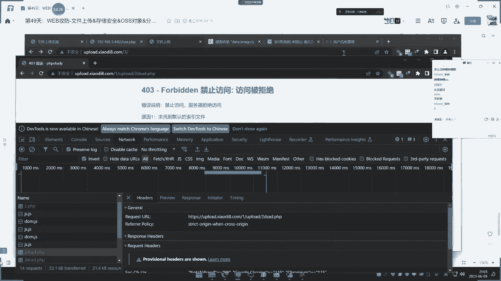

不让你执行，就是你没有权限执行，没有权限执行的话，那这个后门代码就是无法正常解析，就是不能正常运行，那么后门那就是相当于是个死的，没有任何用好，这是第一种那个啊判断方式就直接自己访问的，看这个状态码。

还有这个解码换源呢，这个也简单啊，我刚才用这个哔哩哔哩呢去给他测试过，就是你在上传的时候，那你关注一下这个上传的数据包啊，关注一下这个网站的数据包，那我们在这里呢，我关注的数据包，你看图像改了是吧对啊。

你看图像都改了，你这里呢可以通过抓包分析。

你看一下啊，我上传张图片的时候啊。

选中你看书包变成这种模式，那就恭喜你找到了一个贝斯，是64的一个上传的车子啊，如果这种东西啊，那啊第一次上传的他直接提交数据，那就恭喜你了啊，你看到这种东西了，那恭喜你找到了这个贝斯就撕了。

那就说明一点，说明什么呢，基本上可以跑路了啊。

所以这个是判断模式啊，还有这个分段存储，那你说这个咋判断，那直接看那个图片，第一次不就得了吗，那图片地址和你上传那个域名不是一样的，那就是的嘞，你肯定又问那图片地址没有，怎么办呢，一般都会有啊。

如果没有，那你那就听天由命了，那不好看了哈，那就不好看了，一般都有。

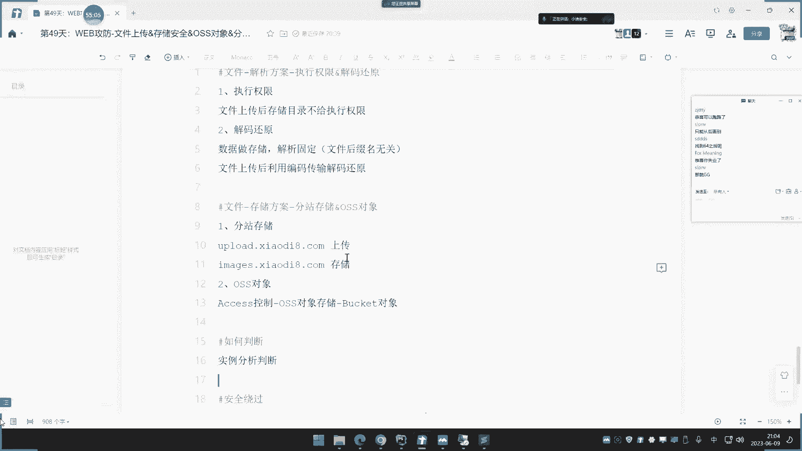

就是一般上线完之后，他会给一个地址或者商量完之后，他会给个那个图片显示吗。

你这个右键那可以看一下这个地址的嘛，这不是地址嘛，对不对是吧，这是地址呀，对不对。

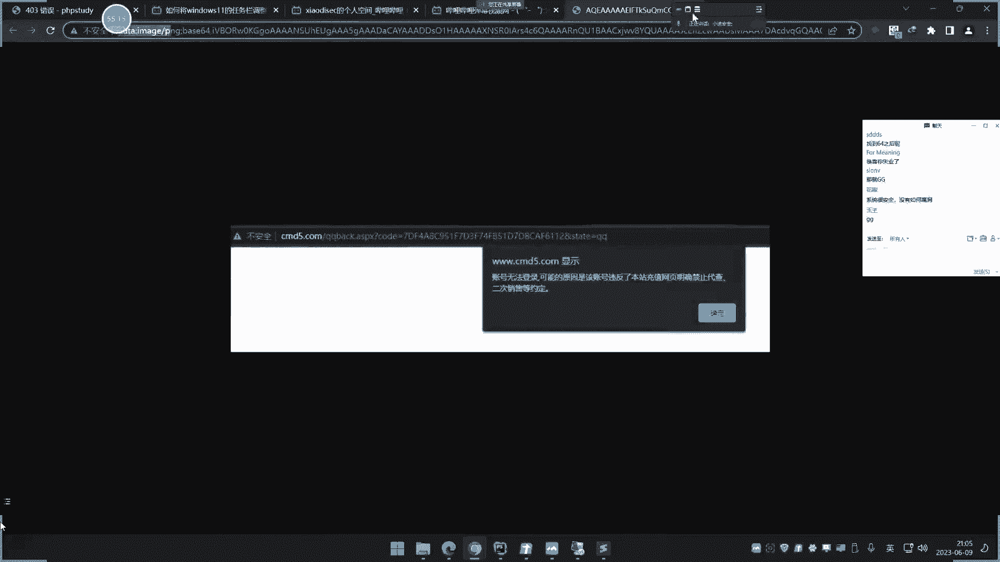

这个意思哈，嘶呃这是那个情况啊，然后还有一个就是OS这样子怎么判断的是吧。

OS要这样呢，其实也是看那个地址啊，或者说你自己呢上传之后呢，你去访问一下那个文件，如果那个文件呢就像刚才一样啊，一打开就下载，那恭喜你，那就基本上是OSS了啊，因为OS1打开就是下载。

这个是它的一个固定的一个逻辑，一打开就下载啊，OS那个东西啊，所以说他的判断呢就很简单，如果说正常模式的话，就按我们正常模式，如果是在我今天讲的啊，什么分站存储啊，OSS存储啊，还有这个贝斯牛斯啊。

还有那个目录控制权限解析啊，这四个啊有基于解析上面那做限制的，有基于这个存储上面呢，导致的就是说他们这个方案的一个实施呢，本身不是说为了解决安全问题，但实际上呢，他这样一使用这种模式去存储文件的话。

就刚好呢把安全问题呢给他修复了，因为他这个东西这样一搞的话，大部分的都是那个文件，那就是只能做存储，不能做执行了，好，那么大家比较关心的问题就说绕过问题，那这里呢就给大家说一下啊。

除了第一种方案的能够有办法绕过之外，其他的物件啊，其他就是无解，第一种呢为什么说能绕过呢。

我们来思考一下啊，第一种是什么什么情况呢，就第一种啊，它是控制的是什么呀，他控制的是这个目录，那么也就是说你这个上传漏洞，如果说能把这个文件呢啊，你比如说upload2点pp是吧，他刚才访问不了。

如果说你能把这个R点pp，这个文件能够上传到这个地方的话，诶那么就恭喜你了。

是吧。

你就能执行它了，这个好理解吧，那这是刚才那个二点pp不能访问是吧，如果说你把二点pp呢，上传到他的这个这个目录了，哎就打开是能够执行的呀，所以说他能绕过，但是绕过有个前提前提是什么。

你能控制这个上传文件写入的目录，但这一想好像也很鸡肋，所以说今天讲的基本上碰到了啊，除了第一个能碰下运气，看能不能换个目录去上传，其他的全部无解，所以说为什么说我讲这个文件上传的时候呢，是吧。

都不是说很刻意的去讲很多很多，因为随着这个架构和方案的一些实施啊，这种东西呢就越来越少了啊，因为你会考虑到很多点，即使说这个文件呢你绕过去了，你能上传后面文件的，但是你还要考虑这个文件是怎么一个方法。

存储的，是怎么一个方案来解析的，经常呢大家有实战中的碰到过，把这个后门的上传上去呢，发现打开了变成下载是吧，这里呢我还没有说其他的，比如说上面装了什么啥的软件，还要考虑个免杀问题是吧。

一上去上去就自动被啥软件隔离了，哎你访问的说没有这个文件，那可能就是被隔离了，直接上传上去就没了，那个面啥的都还好，说对吧，这种呢就是东西就在那里，你就是不能这个尝试执行它。

因为那个代码要执行之后才有结，才有那个结果，你不能执行，就等同于这个这个后门呢就是个死的，那么刚好像什么分站存储啊，这个OSOS对象呢，还有这个解码还原这种方案呢，就把这个解析呢拿捏的死死的。

无法正常解析，那么这个文件上不上传上去都没有任何意义啊，所以说我们前面呢考虑的都是说，怎么样的把这个后面文件上传上去，就是尝试着去更管了什么后缀名呐是吧，什么零零结转，那就是总的来说前面的字眼。

那全部就是围绕怎么把这个后面上上去，并且能够以pp啊，以这种脚本格式保存啊，即使说不能以pp保存，换一个其他格式，也能执行出pp的这个代码也行是吧，都是围绕这个东西呢来做文章。

但是那种东西呢都是我们传统的那种文件上传，就是传统的设计网站啊，你搞个网站呢，你就是那么思考的设计这个文件，上传那个功能逻辑，但是随着这个应用的不断升级呀，很多一些体系内的一些这种文件上传呢。

都被上升到什么对象存储啊，分站存储啊，然后文件上传的时候呢，都用到了这个什么解码还原这种这种技术呢，实现在里面，那把这东西实现了呢，那基本上啊那个文件上传就宣告结束嗯，所以说啊这个文件上传呢应该是在。

除非说在后面呢有新的玩法，否则的话没有这个文件上传，一些这个新的玩法出现的话，那么基本上估计再过个几年之后呢，就你在实战中呢基本就碰不到了啊，因为随着这个时间推移的话，这个基数呢它是越来越成熟。

用的人越来越多，传统的那种使用方案，那就越来越少于用了之后呢，那就没什么攻击了啊，好这个就是我们今天讲的知识点啊，不多科呢就讲完了，没有什么的啊，从下节课开始呢，我们就来进入到全新的新的漏洞啊。

就来讲文件，其他的一些漏洞，像什么文件包含哪，这个文件的一些其他漏洞文件删除啊，等等一些啊，因为那些漏洞呢没有文件上传复杂，这文件包含的文件删除啊，什么人文件下载任意读取啊，那都比较简单啊。

到时候呢就上那个内容啊，把文件操作类的安全呢给他上完啊，好今天就说差不多了啊，这个文件文件夸张呢，这个是可以删一下的，但是这个伤呢我们是在XSS那个章节给他商，就是利用文件上传的来实现跨站攻击啊。

这个是讲夸张的时候再上，因为现在没有上夸赞，所以这个文件夸张呢只涉及到文件上传，这夸张没有删过那个东西不好结合，我们常常夸张的时候呢，再结合一下这个文件上传啊，结合那个应用文件上传的实现XSS。

这也是在什么SRC啊，在那种呃里面的，有些人喜欢这样玩，就是一些不一样的玩法，但这个漏洞说实话都是一些比较低微的漏洞，是没办法找了一些这种人门漏洞，学完这个章节能不能找工作啊。

这个找个很基础类的工作可能能找到，但是还是建议多学点啊，因为现在这个工作需求也大了，它不仅是web方面的很多，像现在一些字典，上期讲的有些东西都又开始过时了，上期讲的秒杀很多人呢都是表面面纱。

实战中呢做不了任何事情，碰到什么动态啊，那些又搞不了，所以七七个子呢都要加那些动态的呀，还有一些各种各样的是吧，这技能有点加，现在又搞什么家安全的，搞那些事情，唉，太卷了啊太卷了。

现在真的是一年一个需求，一年一定这个基数啊，啧哎，嘶今年我因为我时常在关注，虽然说我现在没有去在公司上班，但是时常是呢有学生跟我反映，包括他遇到一些这种面试题，他不知道的，他也会问我。

然后呢我也经常在关注这个一些面试的题目，我经常在看，而且通过他们这个打呼网的一些反馈，所以我大概的都是很清楚，现在这个技术的一个需求和技术的一个发展，每年的这个课程在变动，都是在为莱格勒做做改变啊。

你看今年呢我看的最多的，就是问这个免杀的一些问题，再就是这个java的一些问题，然后呢，再就是这个一些那种漏洞，利用的一些那种复杂的一些程度，不过大部分都是一些这个漏洞利用。

都是一些这个java上面的一些漏洞利用，这是问的比较多的几个，这个临时的一些这个趋趋向啊，然后再就是问些这种挖B类的一些这种是吧，对漏洞的理解呀，包括对漏洞的一些这种是吧，安全方面的，这是红队的啊。

蓝队的那就不说了，蓝队就是老温线那种流量的分析提取啊，还有思防范的思路和检测的迎击的思路啊，这些东西都比较简单一些哈哈，主要是红队的变化不大，嗯好，今天我们就上这么多了啊，看看大家有没有问题啊。

有问题就问，没有问题，我就随便聊一下了啊，看一下大家有没有问题啊，网站都要流行勾了，是的啊，这个现在真是太卷了啊，你看就拿我们这个阿里云这个那个开发，就在这个有个STISTK的开发。

就是我做那个文件上传的时候，我用了一下这个SDK，就使用那个PPP的写个这个文件上传嘛，截截到这个对象存储里面嘶，他因为他那个对象存储呢要用那个他的SDK，那我这里有SDK啊。

他那个SDK呢我给他砍一下啊，你看啊，搜一下这个对象存储这里啊，存储服务，你看啊用到这个，A跑哪去了，那就到这里了，那这个地方呢他不是有个SDK吗，就是开发的，你看哈这个有java的是吧。

利用java呢和调用这个存储对象存储的开发，还有个呢就是这个TP swift，就是我们说的那个那go Python seup，然后你看pp这个pp的pp呢，他这个项目在2020年就停止维护了。

因为他也可能知道啊，这个pp语言开始摸摸，然后这个啊TK的都不怎么更新了，反观这个其他语言呢是吧，他还在一直在更新，所以这个java也没更新，可能他稳定了啊，这也不好说是稳定的没有。

那这个呢用的是node js的，你看一下那个上面那个更新版本，那些勾勾位出来，所以说你可以看一下啊，他这个API版本呢，他对各种语言的知识知识的一些程度，你就应该能知道啊，哪个语言呢他比较重视。

大部分都是这几个是吧，在外主要是外国的一些开发版的java呀，js NO js啊，go啊pp啊，Python的this up c加加，好这个又不说了啊。

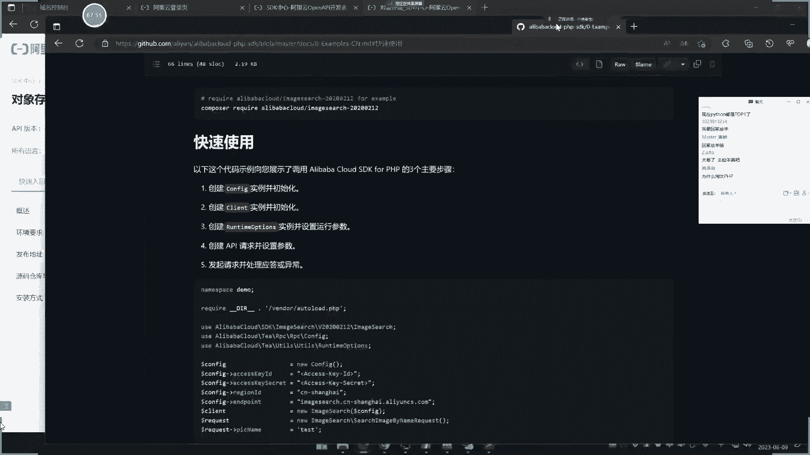

现在这个情况太卷了啊，没办法。

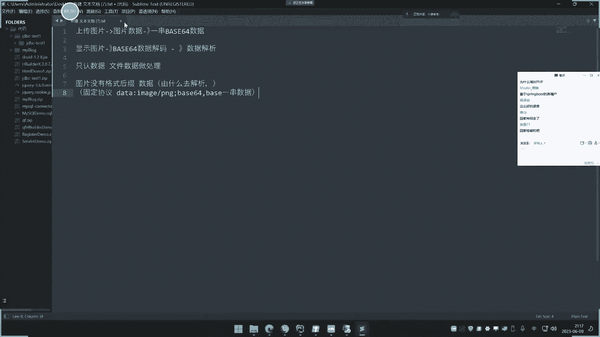

所以我我都说我都有压力，你也不说你很讲道理，我要是说我不学习啊，我这个不去更新课程。

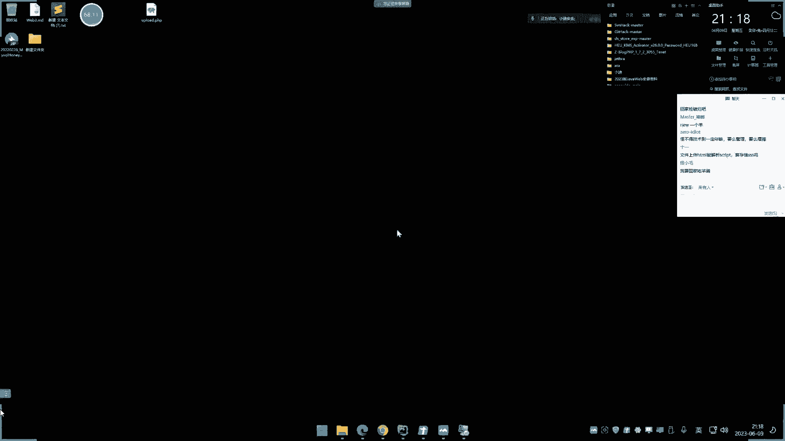

今年上完之后呢，下期就没人报名了，现在这么努力是吧。

都还是被冠以基础number one，哎你说咋办呢。

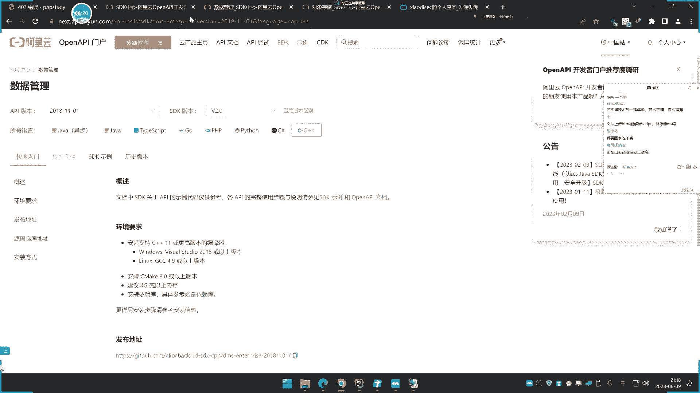

嘶因为我记得那时候我搞安全的时候呢，刚开始搞搞个web快的时候啊，那技术的几年都没什么变动，哼哼那租入了玩了一年了，第2年还玩，第3年了还在玩，到现在都还有在玩，那先在这里面的一年一个变化呀。

一年一天需求经，经常有人为什么说老有群人进群呢，经常就说哎呀，我20年跟你学的是吧，现在我又来学了，为什么呀，他不学不行啊，不学就师爷了呀，你又跑来学了，然后就他又回归了，他就是想学好之后呢，直接躺平。

发现他躺平不了，还要学。

说实话啊真心建议啊，大家以后呢不要搞这个B行业了啊。

这行业真的是啊，我不知道其他行业啊，但是目前我了解这个安全行业的，说实话已经不好了，他妈的太卷了啊，真的是你搞那个开发都还好一点，搞开发呢是不是还可以吃下老本，这个安全行业太快了，这更新的哎呀。

实在是顶不住，因为随着这个现在经济社会的发展。

