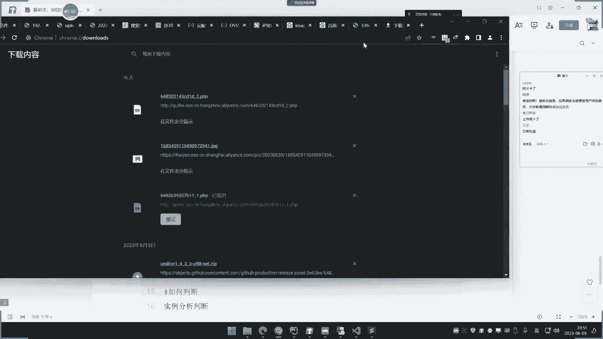
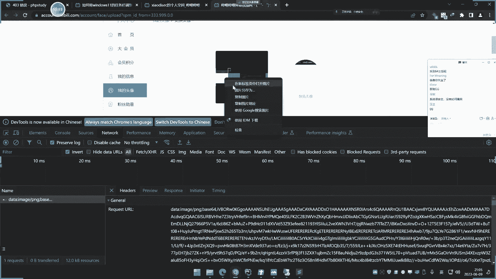

# 课程P49：文件上传安全架构与绕过分析 🔐


在本节课中，我们将学习文件上传漏洞在实战中可能遇到的高级安全防护架构。我们将探讨两种核心的安全方案：**存储方案**和**解析方案**，并分析它们如何影响文件上传漏洞的利用。课程目标是让大家在实战中遇到这些情况时，能够判断漏洞是否可继续利用，以及如何进行分析。


## 目录权限控制：解析方案之一


上一节我们介绍了课程概述，本节中我们来看看第一种安全方案：**目录权限控制**。这是一种通过控制服务器目录的执行权限，使得上传的恶意文件无法被解析执行的安全措施。


其实现原理是，在服务器上对用于存储上传文件的目录（例如 `upload/`）进行权限设置，**拒绝该目录下文件的执行权限**。这意味着，即使攻击者成功上传了WebShell（如 `.php` 文件），当通过URL访问该文件时，服务器也不会执行其中的PHP代码，而可能只返回文件内容（纯文本）或直接报错（如403 Forbidden）。


**核心概念公式：**
`文件上传成功 + 目录无执行权限 = 漏洞利用失败`


以下是演示步骤：


1.  在一个存在文件上传漏洞的网站（例如 `upload.xiaoba.com`）上传一个PHP文件（如 `shell.php`）。
2.  正常情况下，访问 `http://upload.xiaoba.com/upload/shell.php` 会执行PHP代码。
3.  管理员在服务器或Web服务器（如Nginx/Apache）配置中，对 `upload` 目录禁用脚本执行权限。
4.  再次访问 `shell.php`，发现代码不再执行，可能只显示源代码或报错。


这种方案本质上是从解析环节进行控制，切断了文件上传到代码执行的路径。


## 解码还原与固定协议解析


上一节我们了解了目录权限控制，本节中我们来看看另一种更彻底的解析方案：**解码还原与固定协议解析**。这种方案不仅影响解析，也改变了文件的存储方式。


许多网站为了便于在数据库存储图片等文件，或确保数据传输完整性，会采用以下流程：
1.  **上传时**：将上传文件的**二进制数据**进行Base64编码，转换成一段字符串。
2.  **存储时**：可能将这段Base64字符串直接存入数据库，而非在服务器上生成一个物理文件。
3.  **显示时**：从数据库取出Base64字符串，在前面加上固定的Data URI协议头（如 `data:image/png;base64,`），然后由浏览器解码并渲染。


**核心概念代码（PHP示例）：**
```php
// 上传处理代码片段
$fileData = base64_encode(file_get_contents($_FILES['file']['tmp_name']));
// 存储 $fileData 到数据库


// 显示图片代码片段
$imageData = getImageDataFromDatabase(); // 从数据库获取Base64字符串
echo '';
```


这种方案对攻击者的影响是致命的：
*   **文件后缀名失效**：无论上传的是 `.php`、`.jpg` 还是任何文件，服务器只将其视为一串Base64编码的**数据流**进行存储。
*   **解析方式固定**：显示时，浏览器会严格按照 `data:image/...;base64,` 这个协议头来解析后面的数据。如果数据不是有效的图片格式，则无法正确显示。
*   **结果**：即使成功上传了WebShell的Base64编码，当网站试图将其作为图片渲染时，只会显示一张破碎的图片图标，而其中的PHP代码**永远不会被服务器执行**。


因此，在这种架构下，传统文件上传漏洞的利用方式（围绕文件后缀名做文章）完全失效。


## 分站存储与OSS对象存储


上一节我们讨论了基于解析的防御方案，本节中我们来看看基于存储的安全方案：**分站存储**和**OSS对象存储**。这两种方案通过改变文件的存储位置来提升安全性。


### 分站存储


分站存储是指网站将用户上传的文件**存储到另一个独立的域名或子域名下**，而非主站域名下。
*   **示例**：主站是 `www.example.com`，上传功能在 `upload.example.com`，但文件最终保存在 `static.example.com` 或 `img.another-cdn.com`。
*   **安全影响**：
    1.  **目标分离**：攻击者渗透的是上传域名，但文件实际存储在另一个域名，该存储域名可能只是一个纯粹的静态文件服务器。
    2.  **权限隔离**：存储域名（分站）的服务器可以配置得更加严格，例如**只允许读取（GET）操作，禁止任何脚本执行**。这样，即使WebShell被上传至此，也无法执行。


### OSS对象存储





OSS（对象存储服务，如阿里云OSS、腾讯云COS）是一种云存储服务。网站直接将文件上传至云服务商提供的存储桶中。
*   **工作流程**：用户 => 网站服务器 => OSS API => 云存储桶。
*   **安全影响**：
    1.  **存储与计算分离**：文件存储在云端的OSS，与运行网站业务逻辑的服务器完全分离。
    2.  **功能单一**：OSS的核心功能是文件的**存储和分发**。访问OSS中的文件链接，通常行为是**直接下载**或**直接显示**（如图片）。**OSS服务本身不会执行任何用户上传的脚本文件**。
    3.  **结果**：即使将 `.php` 文件上传至OSS，获得的也只是一个下载链接，无法触发服务器端脚本执行。


**核心概念总结：**
`文件存储位置（分站/云存储） + 存储端禁止脚本执行 = 漏洞利用失败`


## 方案判断与绕过可能性分析


前面几节我们介绍了四种常见的安全架构，本节我们来总结如何判断网站采用了哪种方案，并分析其绕过可能性。


以下是判断方法：


1.  **目录权限控制**：
    *   **判断**：成功上传脚本文件后，直接访问其URL，返回 **403 Forbidden** 或直接显示源代码而不执行。
    *   **绕过可能性**：**理论上存在**。如果存在其他漏洞（如目录遍历）能将文件上传到**有执行权限的目录**，则可绕过。但通常很难。


2.  **解码还原（Base64）**：
    *   **判断**：抓取上传过程的数据包，发现文件内容以 **Base64** 字符串形式传输（`data:image/...;base64,xxxx`）。
    *   **绕过可能性**：**基本无解**。因为解析协议被固定为图片格式，攻击者无法控制。





3.  **分站存储**：
    *   **判断**：上传文件后，返回的文件访问地址与网站主域名**不同**（如不同子域名或完全不同域名）。
    *   **绕过可能性**：**基本无解**。除非你能在存储分站上找到新的漏洞并获取控制权，这通常超出了文件上传漏洞的范畴。


4.  **OSS对象存储**：
    *   **判断**：文件访问链接域名包含云服务商特征（如 `oss-cn-hangzhou.aliyuncs.com`），且访问链接时行为是**下载**而非执行。
    *   **绕过可能性**：**基本无解**。OSS的设计目的就是存储，不具备脚本执行环境。

## 课程总结

本节课中我们一起学习了文件上传漏洞可能遭遇的四种高级安全防护架构：
1.  **目录权限控制**：从解析层面禁止特定目录下的脚本执行。
2.  **解码还原与固定协议**：改变文件存储格式，并以固定方式（如图片）解析，使脚本后缀名失效。
3.  **分站存储**：将文件存储到独立域名，实现物理和权限隔离。
4.  **OSS对象存储**：利用云存储服务，彻底分离存储与计算。


这些方案表明，现代Web应用的安全防御已从简单的代码层过滤（如检查文件头、后缀名），上升到**架构设计层面**。对于攻击者而言，这意味着传统的文件上传绕过技术（如修改后缀、双写、00截断等）在面对这些架构时往往**无效**。


理解这些架构不仅能帮助我们在渗透测试中更准确地判断漏洞的实际危害，也能从防御角度学习如何更有效地设计安全的文件上传功能。文件上传漏洞的实战价值正在随着这些架构的普及而逐渐降低，安全研究也需要向更深、更广的维度发展。