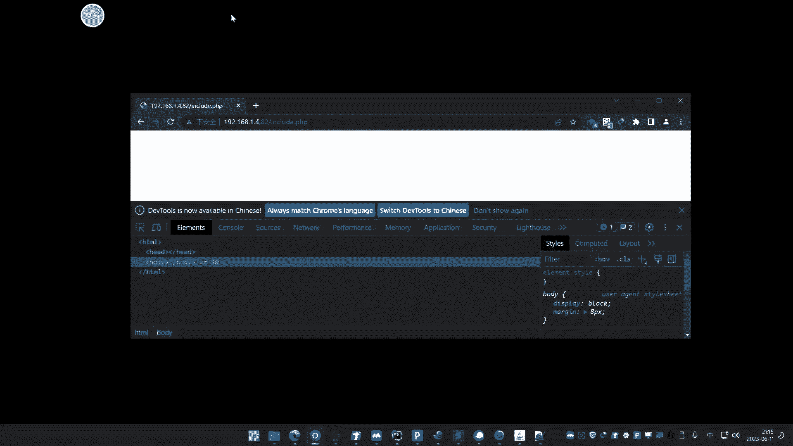
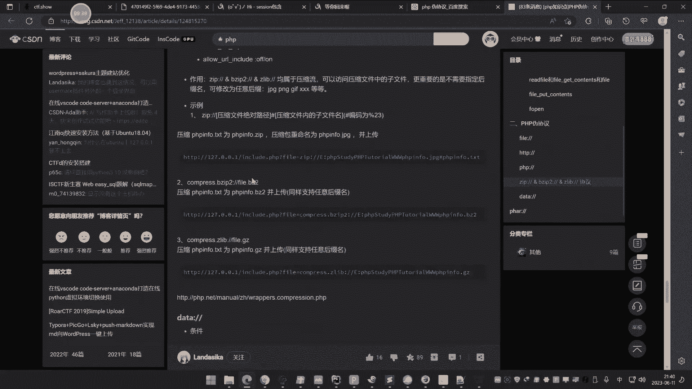

# P50：第50天：PHP应用&文件包含&LFI&RFI&伪协议编码算法&无文件利用&黑白盒 - 逆风微笑的代码狗 - BV1Mx4y1q7Ny

啊今天呢是讲第50天了。

这个前面已经删了很多内容了哈，今天呢讲一下这个文件包含这web1块的文件，包含啊，这个文件包含呢，我们是以这个PPP去讲的，但实际上啊这个在其他的脚本中呢也有，但其他脚本中比较少见呐，pp是比较多的。

java里面的也有，但java也很少见啊，DNET也有，当然也很少见啊，基本都是在app里面去做的这个漏洞，我们前面几节呢是讲的这个文件上传的，这个文件操作类的安全呢，有这个上传的漏洞啊。

有这个文件包含漏洞，那还有这个什么文件读取啊，文件下载呀，文件删除，但像这个删除啊，下载呀，包括这个删除呢，这个呢这块的安全问题呢，呃也是比较少的居多的，还是商权和包涵这一块的多。

我们讲的话是从两个方面讲啊，一个是从本质的这个白盒里面去分析它，就是说有已知代码呢，像这个CMS的挖到这个文件包含漏洞这一块，然后还有一个，那就是我们这在这种CTF修的一些这种啊。

CTF的一些这种题型里面呢，喜欢考这种文件包含，然后呢再就是结合我们实际应用中，在这个黑盒的情况下面啊，有一些这个文件包含漏洞呢，它是如何发现和如何探针的，这个是我们这一个本节课的一个支点啊。

其实就是说现在解释一下这个文件包含的意义，然后呢，再来说一下这个文件包含在黑白合这两块的，一个利用的一个情况，从这里一个利用里面呢，也分了很多利用的一些方法，利用的时候呢。

也要根据这个当前的环境来选择合适的利用，这是本节课我们讲的一个终点啊，好首先呢我们先介绍一下什么是文件包含啊，这个文件包含呢，我们先要解释一下它的一个产生的情况，就说为什么要有这个东西。

那其实文件包含呢就是在这个开发中啊，经常啊我们前面讲过这个安全开发，大家应该知道啊，就有时候呢你比如说你写了一个函数，或者说写了一个定义的一个东西的话，那么你在用经常要用到这个函数。

或者定用到这个定义东西的时候呢，你不需要再次编写，你只需要呢用这个包含这个概念呢，把这个写到写函数的那个文件，那给它包含进去进行调用，那么那就可以享受这个练写的一个过程，它其实呢是在开发中呢啊。

是为了这个省去一些这种操作的啊。

嗯具体呢给大家解释一下啊，我们前期在讲这个pp开发的时候呢。

有讲过那个java开发的时候呢，也有这个东西啊，其他东西基本都是概念啊，包括你在各种什么C语言里面的，都有这么这么一个东西，就是一个包含的意思啊，在前期我们自己写的那个相关代码哈，你看到呢。

这里面有很多代码，比如说我们当时呢去写这个写这个文件查询呢，那模拟那个SQL注入的时候，大家应该知道你像在这里呢有config pp，然后这里要定义好这个什么数据库的，这个账号密码。

然后你在这个数据查询的时候啊，你如果说要调用这个数据库查询的时候呢，当时呢是用这个encoder去包含这个CONFIG，那么也就是说这个CONFIG里面的这个diva的，就被享用。

那这个呢就是一个典型的文件。

包含了一个使用，这个漏洞又是产生在哪个方面的呢。

啊就是说这个文件包含的，其实是程序开发的一个省区这个繁琐操作的啊。

你就写这个东西之后呢，就不需要把再把这个代码那copy到这来了是吧，因为如果说你要用的话，你就把它写到这来哎他就知道了是吧，如果说你用的这个包含的话，那就可以省略这这行代码了是吧，就可以省略这串代码。

这个很好理解啊，这个是包含，然后呢这里不是有个包含的这个文件名字吗，有这个文件的这个地址吗，咖啡给你pp是吧，如果说这个config pp呢他是一个什么，它是一个可以控制的东西的话。

就说它是一个变量来去传递，来去控制的一个文件的话，我们可以通过呢更改这个变量的值啊，更改这个参数值呢来实现，把这个地方的这个文件名呢，给它进行这个替换掉，然后这里呢就是一个典型的文件包含漏洞。

所以说文件包含漏洞呢。

其实就是在这个程序开发的时候啊，要去包含一些文件，那为什么要包含这个文件，其实就是刚才说的啊，就包含文件，那就意味着把这个文件里面，一些代码来进行共享，那么就不需要再次去写一些代码，是啊。

比如说你要这个函数，那你要在代码中去重新再把函数，代码来扩频一份，那就直接包含这个文件，就可以不用copy，直接用这个函数就可以享用什么一个情况，但是在这个过程中，如果在包含文件那个地方。

能够控制这个包含文件的话，那这就是一个文件包含漏洞，这个好理解吧，然后在这里呢我给大家说一下，在pp这个语言里面呢，有这几个函数是做这个文件包含的，include呀为quest。

然后include onor，Request onset，然后在java中呢有一些这个类是吧，file类和这个file reader类，这都是呢属于那个文件包含了一些函数，在点net里面的也有啊。

那么将这个函数的意思就是告诉大家了啊，你碰上这些函数的时候啊，就知道这里呢可能会涉及到的，就是这个文件包含的这些操作，在这个代码升级里面，白盒里面去分析的时候，也是根据这些关键函数呢。

来去寻找对应的漏洞是吧，就说我们后期去讲这个代码审计，不管是pp里面还是java里面，你要分析这个文件包含漏洞的话，也是根据这个使用的内核函数论来去确定，这个地方呢有没有这个漏洞，就根据这个地方。

好像在这个CTF的一些考题里面呢，也是通过CDF里面的这个函数来去寻找，它考的是哪一个知识点，对吧，那么如果在黑盒中，黑盒中呢就是说没有代码的情况下面啊，就是说光秃秃一个网站代码也没有。

那么一般是怎么关注到，有没有这个文件包含漏洞呢，一般呢就是根据这个网站的这个地址，参数值和参数类参数名呢来决定，就是说在他的UL地址上面呢，有这种类似的这种东西，比如说喷起啊，DR啊，fire啊。

这喷几啊，这个P啊，烟机啊这种，那这种呢英文单词的一个翻译的，大部分都是指向的什么路径目录文件是吧，然后页面这种单词的一个解释，后面再加上一个等号，前面的是参数名。

后面加上个等号等号后面跟上的是一个文件名，或者说一个文件的一个名称，那么极有可能就是给他去传递一个文件名称呢，来run这个代码，那来结束文件名称，那来对这个文件的引包含，所以在黑盒中的话。

就是关注到这个育L星系里面，他这个观点名称和关键词，来确定这个是不是一个文件包含的一个操作，来确定有没有漏洞，好我们在这讲了这么多，我们先给大家呢看一下这个大概的一个情况。

让我们大家呢再去思考这两个问题啊。

这个简单的一个情况呢就给大家介绍一下啊，比如说我们在这里。

那就随便创建一个这个文件啊。

好这里呢我们写上这个include啊，他这里呢是pp的啊，Include，然后你看啊这个地方呢，他可以这样写，当然呢他也可以这样写都可以啊，这个也无所谓的，你写个这个，写个括号也行啊。

然后这里呢我们看一下啊，我们，啊这里呢给一个叫参数值，叫bell好，好大家看到啊，这个是那个一个那个，一个代码啊，来这里呢是用这个encoder去包含这个get。

传过来的file的一个东西，我们现在呢去访问一下啊。

访问下这个地址啊，哦然后呢我们给他传参根号file是吧。

这个大家看一下啊，比如说我们这里呢有个这个找一个啊，找个疑点，随便创建个文件啊，名字就叫一点TT好吧，ETT里面的写上个这个tb代码好吧，这是一批做了一个代码就写这个东西，然后呢我们在这里给它一点TT。

大家看到啊，那访问这个文件地址的时候呢，这边呢他去接收到访问这个地址是吧，他解释了就是这里，那就相当于执行的就是什么呢，不是encoder，那结束这个E点TT嘛，就是接受一点TT嘛。

包含这个疑点TITE点，TST呢就代表的就是什么里面呢写个PV音符，那么就把这一点TT呢给它指引出来了，那么其实这里呢就是相当于就是说啊，这个文件包含了这个包含的这个文件呢，就被这个当做，当前脚本年呢。

去执行的话是什么一个概念啊对吧，然后呢，就把里面的代码呢当做这个脚本原来去执行啊，不管说你是个TIT也好，还是任何格式，它都可以啊，只要里面是这个正确的这个脚本语言代码即，可是吧，这个呢就能进行包含了。

那包含了就是把它执行了，那么还有没有其他方式呢，就是这个文件包含这里是可控的变量对吧，可控的变量，那么漏洞乘一呢也是非常简单的，通过这个例子也来看呢，它的一个漏洞乘一呢也非常明白了哈。

啊第一个呢就是说使用能力叫什么文件，包含多种函数函数，第二个呢就是使用这个，对不对，使用了这个文件包含函数，然后呢再就是这个文件哈，对我们可以控制它啊，然后通过参数的权利去控制它，那么如果说写死了。

那就没有文件包含漏洞了啊，这个好理解哈，好既然这个漏洞文件包含漏洞呢，讲讲清楚之后呢，我们接下来要思考一个问题，就是这个文件包含好，它有区分两种，它的一个分类呀，等等一下啊。

分类它的分类呢一般是区分第一类呢，就是我们说的粉底包含，还有那是远程包含，但事实上啊远程包含的话，在当前的网络环境下面已经极少见了，很少见了啊，大部分都是本地包含，那么这个远程包含本地包含呢。

顾名思义就是一个呢是只能包含本地的，还有一个呢就是包含远程，那这个东西是由什么决定呢，它原因决定因素啊，就说为什么会造成这个差异，差异原因呢是一个是代码的这个过滤，还有一个呢就是我们说的这个配置文件的。

一个开关啊，里面开关这两个东西呢来造成的，什么是过滤啊，很简单的道理，就说你能远程包含，但是呢由于这里过滤了一些这个关键字，导致你不能远程包含，所以呢你就只能本地包含，这是第一种方式。

还有一种呢就是说直接从这个开关上面，那不允许呢加载远程的文件而导致的，那么具体呢给大家演示一下，那这里呢是包含本地的一点TIT对不对。

如果说我要包含一个远程文件的话，那我这里呢可以加上一个app的一个协议，也称之为在利用中的一个伪协议方式，加载一个远程地址，那比如说我这里，那就我加载一个这个，嗯怎么老是这个符号啊。

你妹的冒号打不出来了，哎啥情况，键盘有问题啊，好出来了，你这里呢我们就写上这个远程地址，比如说我们呢就随便写个地址哈，好我直接回车呢，他这里呢如果说能够远程包含的话啊，不管说这里是个什么文件。

它都会有个远程包含。

它不能远程包含的原因呢，就是这里呢有个胚子啊，这个胚子呢是在pp里面的一个配置，这就是讲PPP啊，如果是其他脚本里面的话，其他的这个语言里面呢啊，有些是有原则包含概念，有些是没有啊。

比如说现在呢我们使用这个pp的那个，那个版本呢是这个哪个版本，看一下啊，他这个起点4。4的一个版本，然后呢呃他这里呢是有一些这个配置的，我们可以看一下啊，在这个pp里面，一般在后面那个配置呢。

高版本的它默认的是把那个东西已经，来一个了啊，就把那个开关呢自动就跳了的，这里可以叫软件包含开关，其实就是一个那个呃along you are include，那个开关。

就你勾选这个呢就在图形化上面操作啊，如果是在这个AI里面啊，就是他一个配置文件pp那个安装目录ii里面啊，是叫一个along，然后下划线UL在下划线的encoder，一个那个名字的一个开关，我给他找到。

给他看一下啊，这个呢不是很重要啊，前面在以前早些年呢这个安全课程里面呢，这个东西还比较重要，但随着现在这个安全需求的话啊，随着pp的落幕，再加上现在一些这种pp的版本升级呢，这个东西默认都是关闭的。

在高版本里面啊，但是呢也有可能是开启的，但要知道，我们找一下他这个PPPI的II的文件啊，这里好，我们找一下啊，打开看一下啊，这里有个叫搜一下啊，Along，下划线u u all NO。

呦呵这个怎么老是这样子啊，include啦，你看啊他这个地方呢是一个off状态，看到没是off状态的，对不对，就是如果说你把这个开了之后呢，就on状态，那就开了，对就这个意思啊啊你在这个地方呢。

你给它点开。

然后点确定，点确定之后呢，我们再关注，重新打开它，再搜到个关键词，你看现在自动是不是变on了呀。

我刚没改它吧，就是点了一下这个按钮，它就把它改了，所以说你在哪里啊。

在这里改也行，在这个图标上面按也可以，那改了之后呢，你现在呢你再去让他去访问。

你看它就不会有提示，这个页面就一直在加载，为什么一直加载呢，因为他尝试去访问这个下八点com了，但这个下八点com它啥都没有，所以包含就没有啥，如果说你要包含的话，我给个撕一下啊，让大家看一下效果。

啊我们在这里搞个远程服务器啊，晓得帮你看我的，现在我打不开啊，我就直接用我这个远程的服务器，上面那个文件呢去做一下对应吧，嗯这里呢有个什么文件看一下啊。

嗯我找一下我那个目录啊，那个web目录好像是在这个下面吧，下面有个这个，这搞个file点TT吧，这个file tt是什么鬼东西啊，哦是这个东西，我就写个GB代码，好这里呢有个file点TT。

我们现在呢先去访问一下这个fire tt啊，来个路径，好大家看到了啊，好现在让我开啊，对啊，等下这个地址你看不也打印出来了，我只需要控制个file，点TXT呢就能实现这个代码的一个执行，对不对。

那就是说你改这个文件，改这个远程这个文件呢，它就远程代码执行嘛，然然然然成这个东西，你就可以在在这里啊啊去这个写是吧。

echo yecho是吧，输出一下三哎，保存一下，你看这里刷新。

那就变了是吧，变成这个是吧，好理解吧，这个是远程包含啊，那么这是第一种啊，反正包含的原因呢大家也看到了啊。

就是那个开关要开起来，但是呢由于这个高版本的默认是关闭的。

所以说很少见啊，也很长时间，这个呢大家知道就可以啊，一般实战中呢很难碰到，但大家知道这个情况啊，嘶好这个是它的一个基本概念和分类，然后我们再来说一下它这个危害啊，危害危害大家刚才看到了。

额可以进行那个代码的一个执行，但是呢它是包含那个文件呢，把那个代码执行，那我们这里呢就要思考第一个问题，就是说危害啊，大家看到了啊，它包含是那个文件，那么大家试想一下啊，如果说从本地包含来去讲的话啊。

从本地包含去讲的话，你先思考一个原因啊，思考什么原因啊，那如果说他从本地报上去讲的话啊，本地包含本地包含，就是包含本地的文件，那么大家试想一下这个本地文件，没有商传的话，那么文件是就是固定的。

那么你要包含一些这种带有攻击的代码，因为我刚看到啊，包含了第一个啊，看到这个效果就是它进行了一个什么，进行一个代码执行，对不对，就是把那个代码进行执行了，那么试想一下哈，那么如果说本地包含的话。

你没有上传这个文件的话，那么那文件它就是固定的，那么包含你要攻击这个包含带攻击性代码，这个可能吗，不可能，啥意思啊，就是说你只能包含本地文件，那么这个本地文件它是什么样的，你就只能包含什么样的。

它能干嘛就是干嘛，你不能说向外面指定，对不对，比如说这文件呢就这么多，那么你就只能包含这些文件，那就做不了其他的事情，这个好理解吧是吧，就这个意思啊，所以呢他就分两种情况，他在利用方面的话。

威海讲的就是利用嘛，利用方面的话，它有分两种情况，第一个呢就是我们说的是无文件的，这个什么利用，还有呢就是有文件利用，什么叫有文件和无文件呢，就是这个本地包含的啊，有文件利用的话就说啥意思啊。

上传一个文件，不管说你这文件是不是图片好，那么这个文件里面呢写有什么，我们的这个恶意的这个什么代码，那么再去包含这个文件不就行了吗，是不是就是配合上传啊，这个意思就是说是配合上传这个概念啊。

还有一种呢就是我们说的无文件，那么一般的无文件就利用三种方式，第一种和第二种，第三种，第一种呢就是我们说的啊包含日志文件应用，还有个呢就是包含C型文件应用，还有就是我们说的伪协议玩法，利用三种方式。

那为什么在无文件里面呢，有这种啊，然后这是等级包含，我们再把ram写进去啊，这个远程包含呢那就很好解释了啊，这个远程包就很好解释了，远程包含的那没什么说的，直接包含个文件就完了，这完成文件嘛。

你自定义自定义的远程文件，你说咋玩呢是吧，自定义想怎么玩就怎么玩，只不说了啊。

这个好理解吧，比如说这个你理解不了啊，这个理解吧，这个远程包含玩法就不说了吧。

因为你就直接让它包含一个远程的地址文件，就行了啊，因为这个远程地址由你制定，你说让它伴随就伴随，那这个文件呢你把内容一改，需要让他执行什么东西在里面改就完了好了，本地包含就只能包含本地文件。

这个本地文件就相对于那个网站自己的服务器，那个文件啊，就是打点在哪里，那就是在服务器自身的文件就不可能说啊，超越它服务器之外的，那么现在呢我们说核心点呢，这个有文件上传，那就不说了，对不对。

相当于就是说这个疑点，TT就是我们上传上去的，哎这里呢写了个代码，然后然后包含了这个疑点TT哎，这就是我们说的，那假如说这里呢你要包含这个疑点TT是吧，这一点向T该怎么办呢，它不能上传又怎么办呢。

那就说无文件应用问题呢，就是用三种方式，文件日志和这个C型日志再次伪协议玩法，好我们先把这个点呢给大家搞清楚，问一下大家能不能理解这个思路啊，把这个思路能理清楚之后呢。

我们就来讲下面的这个利用的详细过程啊，能不能理解这个啊点啊，就是说这个包含里面的有两个，一个是泥包含的，一个是远程包含是吧，远程包含就不说了，这个太简单了，那本地包含呢有区分两种，一种呢是无文件。

还有一种有文件，有文件，那就是配合这个文件上传的上传一个文件，然后呢让它包含，因为这个文件是你上传的，所以里面的代码呢由你指定，所以我们就可以实现这个代码的任意执行。

但是在这个无文件里面就说没有上传的话，或者说无法上传的话，就是借助它自身的服务器的日文件，或者C型文件，或者呢暂定伪协议呢，把这个点呢先给大家说清楚啊，能不能理解这个，把这个理解之后呢。

我们才能进行下去啊，不然的话比伤了是跟没伤一样的啊，这个有文件利用，好理解吧，我刚才说了嘛，假设这里有文件包漏洞，没，这个依然天气，就是像是我们通过文件上传上上去的是吧，然后再去报这个一点TT。

那么在上传的时候，那你就更改这个代码，让他执行什么就执行什么，好理解啊，同样的案例，那这里也是个home文件，那么那个文件地址那就是个home代码，后面啊，后面第一次啊。

嗯刚才那个第一子跑哪去了，192。

那给他孩子演示一下啊，不要再说以后搞不懂了，这个商船呢我就不演示了哈。

这个上传操作就不演示了，这一点天机就默认是我上传的，你不要说哎呀上传是图片啊，图片也好，什么也好，这不重要了啊，我怕有些人喜欢喜欢老问这种问题啊。

你比如说像现在啊。

我记上传个图片，图片呢一点JPG对吧，你肯定又说哎呀上传图片我不知道地址，那你地址都不知道，那等于没上传啊，写个疑点JPG或怎么样。

对不对，然后把这里改改成个这个，改成一个这个什么后门代码，对不对，加上后面代码再访问这个文件，来执行后门的意思嗯，这不是能连接上了吗，这是后门的，用这个文件包含漏洞，包含这个一点TT。

那么ET里面后面单位被执行，这就是后门的就连接上去了呀，对不对，这本地包含了这一点T就像是我文件上传的啊，对不对，然后再就是我们说的这个远程包含啊，利用啊，不想讲太基础了啊，哎我怕有些人实在是不懂。

没办法再给你演示一下啊，如果说你还不懂，那是真没办法。

那这个file tt就是我们远程的是吧，你通过你的远程的搭建一个网站，然后呢再到上面呢去切个后门，对不对，这是后面嘛减去。

那么再把后面地址一改，它是远程包含它，如果能远程包含，那要怎么办，把那个一改，把它改成包含这个地址，那么后面地址就是这个，我们再把这个地址一更改，点击测试，OK确定修改开下地址是吧，能连上，那没问题。

都正常好，这就是我们刚才说的那个两个概念啊。

就是本地包含一个配合文件上传，还有个呢那个TXT。

那就是默认是我们那个文件上传的文件啊，你知道路径就可以了，不造路径，那就那就相当于那个东西还是无文件哈，好了。

现在就说这三方面，下面是三方面，因为我们的终点呢主要是这三方面的啊，这上面这这个东西呢比较简单好理解，那么呢这里呢我们看一下这个无文件利用啊，一个是包含日志文件，这个还有一个是包含C型文件。

还有一个呢是伪协议啊，好在讲这个之前呢，我们现在先来了解一下伪协议，因为这两个呢等下会说先来看伪协议啊，这伪协议里面呢有几个东西要给大家介绍一下，首先呢第一个啊它能实现哪些东西。

第一个呢用伪谐音来实现文件读取，用伪谐音呢来实现代码执行，用伪协呢来实现文件写入都可以，那么这是在pp里面，那如果说在其他语言里面，在java里面，那或在其他语言里面呢。

大家可以根据这张表格呢来看一下呃，他这里呢有这个各种语言的啊，这个java p p还有个PO，还有点net，然后暂停在前面是协议的名字，app和DPS，还有这个类似的这种格式协议DICT啊，什么东西。

那对应的方法和这个协议对应的玩法呢，上面都有解释啊，这个对勾的就表示支持叉叉呢，就是不支持的意思，你比如说像pp里面，他就支持这个前面的SMAHP和DPS，那么前面我们的原子包含。

不就是用到的是HP协议嘛对吧，V协议就是协议啊，然后呢还有像呢下面还有这个什么pp的，它也是支持的，那pp呢在其他里面就不支持了，那今年呢这个pp的文件包含里面呢啊，里面就有这个东西。

你看啊有file协议，还有这个什么pp input，Pp fighter，那这几个呢在使用的时候要看一下它的版本，支不支持，大于等于502就支持，那这个基本上都能满足，因为这个五粮版本已经好多年了啊。

现在的版本基本都大于它，所以这个呢是忽略不计的，还有这个呢开关啊，你看啊除了这个data协议呢，它需要这个for open呢打开，其他的呢都是关和打开都不影响，那其实这个呢也是基本没什么影响。

因为这个for open呐在高版本默认也是打开的，就说即使是关闭这其他几个倒也不受影响，主要就是这个alone，You are include，这个呢高版本默认是关闭的，所以一般高版本呢。

如果说没有恶意的去修改这个啊，没有这没有这个自己去设置这个开关的话，那默认是off，那么可能的话在data这个伪协议和这个input，这个使用方式上面呢可能就不行。

那么就只能使用file和这个fighter啊，这两个居多，还有这个zip还是什么b i zip呢，这个呢是需要一个插件开关的，这个呢也很少见，主流的还是fail啊。

fighter和批评input和data居多，那么这几个东西究竟是干嘛用的啊，他这个就是使用的条件呢上面写上去了啊，我们呢给大家简单的演示一下，可以利用这个伪协议呢来实现文件读取，文件写入和代码执行。

我们来先看第一个实现文件读取，我们呢可以试一下，第一个用到file协议，那刚才那是直接给他加个地址是吧，我们现在用file呢让他去读取，比如说D盘就是盘符下面的啊，一点TD1读啊，他就显示了R1点TT。

对不对啊，大家看到啊，一点TT，然后呢我们找到这个了，当前我啊我八点上本地的嘛啊一点TT啊，就这个嘛写进去了啊啊能够尝试读取好，这是一种复取方式，这读取方式呢需要绝对路径啊，显然呢这个不是我们想要的。

就可以用这个pp input read方式，后面呢加上这个东西啊，你可能说这个东西为什么要这样写啊，在网上规定的，你可以再参考一下文章啊，就这里有个参考文章好给大家先演示一下啊。

后面呢再给大家具体讲这个为什么这样写啊，啊想这个地方，那这个意思是什么意思呢，这个意思是什么意思呢，就是利用这个pp input协议呢，来去读取一个pp infor点pp。

然后呢用base60呢把它进行编码，那么我们打开一下好，这里呢显示空白空白的，就说这里没有p p for点TT，我们再来读取个一一点TT，哎读到了读到它返回个这个值。

这个值呢就是利用base news的A编码的值，然后这个时候啊，我们再利用前期介绍过的那个转码工具啊，把它进行一个转码。

这个并丢失的啊进行一个decode，那他读到的就是这个内容，那这个一点TT就是这个内容吗，这对那这是文件读取啊，文件读取，那么这个呢就比刚才这个呢要好一些。

就是没有绝对路径，就只写个相对路径，就是那当前目录的一点TT，如果说你要读到那个D盘的，那就是一级调机再调机再调机是吧，一点接一，你看他就读到这个了，这个呢再去解嘛，不就是123吗。

这个呢就是说只需要控制相对路径来去读取啊，刚才那个呢要绝对路径啊，再说文件写入啊。

文件写入呢可以试一下p p input来实现，p b input的呢其实是代码执行的，但是呢我们可以通过代码执行呢，来实现文件写入。

给大家讲解一下啊，用这个啊，因为它用了PTER的一个post方法，把这个简单使用的给他介绍完了之后呢，我们再用这个题目啊去给他做，这样子呢就会好理解一些啊，嗯你比如说用pp put啊。

然后呢加上这个号面啊，后面呢再写上啊，然后在这里呢port方法里面呢去写这个代码，然后写个这个PB代码，那个PB代码，那你想干嘛就干嘛啊，比如说我们可以让它执行个PP引波，就在这里写pp代码。

这是直接执行代码执行的啊，它也可以进行代码执行，然后呢也可以这个写文件，因为你可以用代码呢去写文件，所以呢啊他执行讲完，如果说你要写文件的话，那就利用个PP代码去写一个文件是吧。

那PB代码呢打开一个shell里PV，然后呢写入这个代码，然后呢他就会创建一个shell里pp，对不对，这个就好理解啊，不好理解，那比如说像现在呢他下面下面呢没有这个线，点BB是吧，好示例四。

但你在执行之后呢，刷新一下这里啊啊就有了是吧，访问空白了，那这个文件呢就写进去了啊，所以这是文件写入，还有一种方式呢，就是利用这种协议呢来进行文件写入，但这种方式去文件写入的话，需要有个条件。

这个条件是什么条件呢，就是说还要有一个变量，还要有一个变量，这个呢有点小复杂啊，一般用的比较少，我们在那个CCTF题型里面会考这个呢，我们就先不介绍了啊，等下CCTF体型呢可以看到这个他这个利用面。

如果你这样去利用，那它不行，这样去文件写入法啊，给大家看一下啊，那你直接用这个呢写上去写一个文件，名字叫pp引for，然后怎么去写呢，它是用base64decoder，如果这里要写文件的话啊。

你给他传一个这个base64值，然后去写，那么写了pp for点pp吗，执行之后呢访问空白，然后你再去访问一下pd或者tb啊，还是没有是吧，为什么呢，因为他这里面要需要给一个参数。

而且他在代码中呢可能要加上这个，嗯我PUTER，哎哎我有这个啊，然后呢去写上这个，重新找到第一个参数，啊第二个参数就是五个人用这OST接收的，你可要这样去写呢，他才能满足content啊，这样去写。

他才能满足这个写入的一个操作，哎这个代码是哪里写的文件文件名，这里全参的文件名，好我试一下啊，这么写。

哎2S写错了啊啊写错了。

可以了啊，哦是的，二要把引号去掉，因为那个是一个函数。

不是函面，你看他这就写进去了啊，他这就写进去了，那他写进去了啊，那他就写进去了，所以说啊嗯，你这里那就他就那个显进去了啊，这个就显进去了，这个就能写，但是他就说还需要一个变量。

所以这个呢有点和刚才不一样啊，所以这个呢在CTF里面才会有啊。

还有个代码执行，代码执行呢刚才用批评put应该演示了。

还有一种呢就是用data协议，还有1SN协议啊，file协议和pp协议，然后呢还有一个是data协议，还data协议啊，啊data的协议里面一种呢，就是直接后面他写的代码执行，写必要执行的代码。

执行批评for执行了，还有呢就是把这个代码呢用base64编码，把六四的编码啊加个base64，加这个参数值执行啊，他也能这个哎啥鬼啊，好你看它也能自信是吧，然后这个后面这一串值呢。

其实就是那个批评for那个加密字符串，我来解密给大家看一下啊，那就是个批评图，看到没嗯，好这个就是我们说的那个伪协议呢，一般常做的三种事情，就是进行文件的读取和写入和代码执行，这是他能够做的事情啊。

所以大家能够理解了，在这个做的事情上面的话，我们来思考一下他是不是无文件来实现的，这个功能，是的吧，我没有说让他去包含一个从文件的来执行，全部都是用这个伪谐音呢来实现的，文件读取，文件写入和代码执行。

所以这和我们刚才说的那个思路，是不是就吻合上了呀，什么思路啊。

大家刚才看到那个思路，那呃无文件利用的时候，因为我们要包含一个文件嘛，包含一个文件，那来执行这个文件里面代码，但这个文件呢我们不能通过上传，不能固定这个文件，就说我不能自定义这个文件。

只能用这个本地文件，本地文件那里面代码你也不知道，或者说里面写死了，你怎么不去包含一些恶意的呢，那实现不了自定义，我们就利用这个伪协议呢来实现自定义的，去读取目标文件。

然后呢去写入文件去进行代码执行来再次利用，这个好理解了吧，好不好理解，然后在进行这个文件伪协议的利用的时候呢。

啊他是有基于这个协议利用上面的一些差异的，那哪些是差异呢，就是说有些呢是基于这个版本呐，和这个开关的问题，这里呢就我再不给大家啰嗦了啊，比如说我把这个开关一关，对不对，那么有些那就不能用了。

来我们演示一下R还是把那个开关一关啊，啊这个表情包含把你关啊，软帽一关，那就等同于这两个开关关了，那include这关了，那就是说pp input和这个data那就无法使用了，大家看一下是不是啊。

但是data协议再次运行没了，对不对，没了啊，那p b put呢，执行是不是也没了，好理解吧，后面的操作我就不演示了啊，好这个基本概念的文件包含呢已经讲完了，接下来呢我们就用这个CCTF的题型。

和这个真实的网站应用呢去给他分析，那么先来看一下真实网站的一个例子啊，去给大家看一下这个情况是一个什么情况啊，那么呢找了一个这个WPS的演示站点啊，去给他演示，那这也是打印在网上的，呃。

这里呢前期的这个漏洞的发现呢我就不说了啊，因为这是我们担心的问题，他这里呢有个地址啊，这个地址呢就是一个文件包含，我用那个WPSS扫的啊，给他演示一下，这个无所谓啊，这个这个漏洞啊。

工具什么这个东西不是我们现在烧烤人一样，先把漏洞搞清楚啊，这个漏洞发现这个东西呢后面学一下就可以了，不是很大的问题，那他在扫描漏洞的时候呢，发现有个地址呢，大家看一下啊。

这个地址呢是一个get show imagine pp，然后fail show imagine pp，加上个例子啊，通过这个地址上面呢可以看到啊，有个这个关键东西什么FA，那么怀疑这里。

那可能就后面全称就是文件，那么既然是修点image pp文件，后面呢回线之后呢，发现会显了源代码，那就说明这里那就是一个文件包含，那么也就是说通过这里呢给一个修理，emage pp给他。

那么这个我这个待完了，就会怎么样去包含这个秀点一秒记，那么如果尝试性把这个文件都改成一个，其他名字呢，会不会包含其他文件，来实现文件的读取和文件包含呢，那么我们真实来去测试一下啊，这是那个网站啊。

我们打开给他看一下，啊这张网站，然后呢我们去显示这个地址啊，只是没有那个情况啊，这是他访问的时候再来个例子，然后呢我们抓包给大家演示一下。

因为这个直接从上面看都看不到效果啊，抓包在数据包里面去提交。

看那个回信。

好我们现在呢来看一下这个地址啊。

那这三个地址吧。

好再来地址啊，我们要发到这个report模式下面来去看一下啊，勾一下之后呢，就能显示它的源代码，对不对，那么死者呢我去包含这个文件，这个文件呢可以从这里的一些包含里面去选啊，嗯这是源代码。

然后呢我们可以看一下啊，好吧，直接呢让它包含一个什么index，一般默认都是首页index嘛，那就写个index，对不对，来把这个改成index pp，然包含index，试一下勾，哎。

index也出来了，那是index的源码，pp源码，从这里呢又看到了一个database content pp，这应该是数据库配置文件，再把这个一替换，这能包含这个文件，Let go。

哎这不就数据库配置文件吗，本地账号密码是吧，数据库配置信息了就出来了，数据库名是吧，实现那个任意的文件读取，这个就是比较真实的一个网站，那个什么啊，比较真实的一个网站，那个包含漏洞文件利用啊，对不对。

哎然后呢你再根据它上面，比如说上面有哪些文件啊。

有哪些文件有意思呢，去包含它来读取它的整个源码和体系啊，当然了，你也可以测试我们之前讲过的这个什么啊，file协议去读取文件，或者说用到什么pp这个这个什么代码执行。

那这些操作是吧，用这个什么date啊来实行这个代码执行呢。

来直接执行一个home代码呢，来实现这个后面的通知，但是很显然啊，他这个网站呢没有这样搞，就是他把这个点防住了，他就只是做了个演示，就是帮你呢简单学会下这个漏洞眼，应用后面的过程呢全部封死了嘶。

他就不能执行代码执行，为什么不能执行呢，就是它一个它自身网站的过滤，还有个呢就是我们说的啊，这代码执行这两个协议呢都需要这个开关开启。

但是它这个上面呢开关都是关的哈，因为它本身呢它是一个测试漏洞网站。

它指望你这个漏洞能点到为止啊，你后续呢想在上面那去植入个后门的，连上去呢，他是不允许的，因为他怕你连上去之后呢，把它源码一删，那不是GG了吗，能理解吧，所以后续步骤呢就没有了啊。

他就是做了一个对漏洞的限制，只让你读取文件，后续像什么代码执行文件写入呢，他就在上面他做了过滤和修复啊，就是知道你能了解这个漏洞那个大概情况啊，好，这个呢就是我们说的这个黑盒中的一个情况啊。

那通过这个黑盒呢其实比较简单。

黑盒就是说没有代码的情况，下面一般呢就是根据这个网站里面提取出来的，一些URL地址，来关注到这个URL地址上面那些参数和参数名呢，来去确定，因为这个文件包含呢一般传他一个漏洞的原因，就是说有可控变量。

这个控变量呢一般传的就是这种类似文件名，那么很可能他在扫描的时候，爬虫的时候爬到这个文件了对吧，它爬到这个文件了，爬到这个文件，发现后面参数名呢也比较可以叫个file。

然后后面加上的默认路径呢也是这个文件名，那么实际上呢去尝试替换一下这个文件名呢，来实现的包含其他文件，那么其他文件包含之后呢，把源码来进行得到好，然后呢如果正常情况下面的话。

我们肯定就是来尝试命令执行和文件写入，这个操作了，来实现把后门的植入和后门的代码被执行了，来尝试后面的连接操作，这是说我们常规在实战中的一个后续操作，但是由于这网站呢是本身是一个模拟的。

一个搭建的一个漏洞站点，一个真实的漏洞站点啊，所以说他没有这个后续步骤啊，他把修复了不，你也不要为此修复，刚才我也解释了哈，如果说你能用后面连上去的话，那有些人呢就在上面，那就把文件删了。

东西一搞网站呢又得重新答了啊，好这个就是我们说的那个黑盒的一个情况，那么现在呢我们就来白盒上面来去看，白盒呢一般就是两种情况，在我们学这个知识点上面对的，一般百科里面就是两种情况。

一种情况就是我们应对的就是在我们常见，在这个比赛里面经常碰到的CCTF的考题，还有个呢就是真实情况下面，那些CCMS的一些这种漏洞审计，好理解吧，就说我们讲这个课程的，都是围绕现在的一个各种方向来去。

给他讲这个知识点，因为就是大家打这个真实应用网站的，就类似于我们像这种，他就偏真实的这种情况是吧。

这种形式的，还有一种就是大家在打这种CCTF题型考题。

那么一般考题里面大部分都是百合，就是给你代码，让你自己去分，还有一种就是我们在这个真实性方面，还有一种就是说有代码，就是从代码当中去挖漏洞，万灵的这种技巧，就属于代码审计方面的知识点。

那么代码神经支点呢，就是我们后期单独那个课程去讲，所以现在呢还接触不到，那么现在呢就是主要围绕这个知识点呢，针对CCTF的题型和这种黑很重的一些测试，在白盒中的代码审计呢是在哪个章节呢，再给他讲啊。

大家呢就说到这里啊，大家明白这个点啊，不要说我没有讲啊，因为这个点呢要到一定程度之后能讲，才那个你不可能说一讲到这个漏洞啊，你就搬一个这个CMS啊，这个是单独讲啊，单独去学好，那现在让我们看一下啊。

这个CDF里面的一些题型啊，我们讲课的平台用CDF修啊啊，光三代还有其他平台，这两个修为什么用它呢，第一个呢是它的题型呢整理的比较好一些，比较循序渐进，很多CCF的一些平台呢它都是一些大赛题目。

对于我们这个初学者呢，他不太友好好，那我们登录一下啊，然后让我找到这个web入门这一块哈，这个关于这个文件包含的题型呢，他有这么多点这几个题啊，我们就给大家简单解释一下啦。

比如说78题，那我们就开始做打开呀，大题目连接啊。

稍事等待十秒钟之后呢，等题型呢启动成功，我们来看一下他现在还在启动中，好启动成功啊，这个呢很好理解，那就是一个给你代码的，让你去呢，是不是涉及到encoder呀，那刚好今天学过了encoder来包含。

还有这几个函数，那就不说了啊，这是pp的题型案例，哎这个啦，这个本地包含的角low file exclude，专业名词啊，原词more加reboot，File include，就是RFI和LFY啊。

以后说到这个名字呢，你不要不知道啊，那pp里面encoder啊，如果你在CPU体系里面，或者说代码中看到这几个东西啊，你应该意识到这个呢，就是涉及到文件包含漏洞的一些东西啊，这很显然啊就挺抠的。

那这个file呢就是get参数全集的file，那这个很简单啊，那直接找它包含不就行了吗，这还有什么说的，直接后面加上参数，要把包含，那么你看一下啊，你来思考一下这个题型有没有上传点呢。

问下大家有没有上传连呢，他有没有上传连呐，是不是没有上传点啦，没有上传点，那就是说无文件包含，那无文件包含，刚才不是讲了吗，这个伪协议啊是吧，那进行文他要得到flag flag。

你可以通过控制网站呢去读你们的flag，也可以直接在线读，是不是都可以呀，那我尝试下，我尝试一下这个在线读是吧，我常用在线读，那在线读呢就是这个刚才讲了几种方式嘛，这个来这读取的方式，那不是写了吗。

来用用这种方式，还是用这种方式，而这种方式呢需要绝对路径，那肯定选用下面这种相对路径的是吧，读一下，那我尝试读嘛，读一下，看下面是不是有个叫flag的PB，撕一下嘛是吧，勾读诶，刚好有把1-1看下。

是什么鬼，哎flag出来了，就这么简单是吧，那你肯定说哎呀这里面的你的flag pp，你自己写上去的，那我不知道有flag pp咋办呢，啊不知道你就进行这个代码执行呗，那进行代码执行呗，你看一下嘛。

那用代码执行是吧，ppp input来这讲过了吗，代码执行呢几方式，P p input，对不对，你就用这个呃PBBOODER呢来去写，然后呢说明再写上你要读的代码是吧。

比如说我就用个什么呃代码执行嘛是吧，他代码执行嘛，我就用个这个pp的代码执行，就用system来执行一个命令，执行命令来执行什么呢，进行一个LS来看一下当前的这个目录结构，执行然有flag。

那不就有了吗，有了之后呢，咱有命令执行TAAC或者cut这两个命令都行啊，都是读取命令，读取blag的app或TAAC啊，读取哎空白空白的，打开源代码，看一下来是不是也出来了呀。

或者什么这个TAAC也行啊，好这题呢就解决了，那其实这题呢还有一种解决方式，就是利用这个什么远程包含远程包含，因为这里呢它既然能够支持这个批评put，那就说明他开了那个远程包含。

所以我可以尝试性的让他去远程包含一个文件，包含我一个home代码，这home代码呢我刚写上去了，就是我这个地址是吧，这后面代码嘛，然后包含它，那么呢哎这个地址是不是地址。

是不是乱奥斯的啊。

那这放到这个地方来。

是在八成啊，来拿这个地址是吧，把哥斯拉去连接，妈的不要花瓶打开哎，好是吧，都行了，几种解题方式，因为这第一关太简单了，这里面的是吧，啥过滤都没有，那，是不是没什么问题啊，好那接下来呢我们再看第二关啊。

你把这几个题答完之后，那几个文件包含了一些利用啊，包括C点F的题型啊，以后挖漏洞的一些这种常识呢基本就会了啊。

好我们来起死九关。

打开79关啊，打一关给一个讲几个无利用的一些解释，基本都没什么太大问题，好这都打开了，你看第一关呢就加了个pp在一个过滤，他就把这个pp呢过滤成这个三个问号啊，有人就说了。

哎呀我知道这个s str reprice呢，哎能够绕过它，它不是个递归过滤，哎前面听我讲过是吧，但是你要明白啊，这里不行，为什么这里不行了，因为他把PPT过滤成三个问号，你这种我之前是过滤把它过滤为空。

那过滤为空呢就像是前面没有了，后面没有了，然后形成一个当然过滤三个问号，你咋办呢，那里面的过滤成三个问号，你中间三个问号，那啥东西那啥都不是了，能理解吧，自己要学会这个那个了啊，啊刚才有人说大小写是吧。

大写不行，为什么说大写不行啊，因为这是个LINUX服务器，LINA服务器呢它是分大小写的啊，一大写它就不支持了，哼很尴尬啊，好那么现在呢我们来看一下啊，他过滤pp，那么说进行文件读写的话。

是不是还fail fail了，要知道完整路径我不知道啊，就是说啊还要进行这个代码执行，那这里呢是还有data协议啊，你用data协议不就行了吗，这有什么好说的呢，是不是啊。

data协议呢进行data啊啊直接直接data啦，data后面要加上这个代码，一执行执行之后呢，哎发现啥问题啊，因为因为这里面有一个pp啊，pp锅里的咋办呢，我不用pp啊，我这个C他们去执行不就行了吗。

或者说怎么办，搞成base64也行呀，搞成贝斯缪斯的，就把后面这个关键代码，那是不是要执行代码写后面吗，我把它改成贝斯牛斯的，都搞成贝斯缪斯的，写个倍成六四，后面加上倍成六四的一个差值嘛。

那我要写什么东西呢，再编码一下嘛，比如我要执行一个代码，执行一个c time，然后呢去读取一下当前目录，应该IOS命令就系统命令嘛，好把它进行一个解码，写个，那不就读不就这个读取了吗。

啊这个这个是什么情况，呃，我想想啊，应该是这里他这个加号，他要记那个编码，应该是怀疑那个情况再加个吧，唉他要把这个改成白毛2B1，好像是那个鬼两码事情，哪写错了呀，哦前面是个分号是吧。

好你看是不是就读出来了，来LINUX那个命令哎，我这里获取根目录嘛，我就获取当前目录加这个吧，哎这里呢他出了个问题，他说什么鬼，这个问号这个事情，那怀疑就是个加号的问题，唉这妈的加号真是烦得很啊。

唉搞个新打个P的机去吧，他那个要又要编码，你看是在这个目录，那我就读取这个目录下面的东西是吧，这又是个加号，怀疑这里又不行的啊，他加号好像要把编码一下，他老提这个鬼两码事情，我真是。

其实这里呢你可以直接用那种写法，也是完全OK的啊，呃我想想啊，这个，我好像写错了吧，妈的flag出来了，我写错了，多加空格，我还有这个加号那个编码问题，是吧哦这个是那个第第二关。

我们看第三关，所以说他这里的考的就是各种威胁的玩法呀。

再加上一些这种东西，你看他现在有过滤data，哼，它过滤data有过滤pp啊，怎么玩的啊，刚才呢是使用的这个data，现在呢也过滤data了，呃，你看一下嘛，上面还有什么东西啊，啊pp啊，FIL啊是吧。

这个file呢没有用file呢，但是要知道完整路径呀，完整路径你可以自己去尝试嘛，你说我就默认我固定，他刚才拆的那个布鲁斯在哪里啊。

刚才猜到那个flag目录是在哎哎。

指那个下面吧，我们撕一下哈，我们看一下呢，写在这里呢，很明显肯定不行，因为这个pp上被过滤掉了，大家看是吧，国内是空的列子啊，不能写pp了，那里面还是尴尬，那这个file呢也不行啊，那过滤了啊。

应该后面要写PPP才能读啊，他说换一种方式啊，这个这个pp被限制了，这个data呢也被限制了，最好呢要加完整路径，完整路径呢后面又会触发这个pp啊，这里呢就出了一个新的方法，就用到什么呢。

日志包含日志包含什么叫日志保养呢，大家先来思考一下啊，你也可以用到其他协议，其他协议呢，但是呢也要绕过那个pp和那个限制日志包含，是啥意思啊，日支呢是我们常见，在应急响应蓝队里面经常关心的一件事情。

就是分析网站的，反，而日志这个日志呢一般默认保存的，就是在一些默认路径下面，具体默认路径呢大家可以在网上去搜索一下，那么这里呢，我们就尝试性的去让它包含一个默认日志，默认日志呢一般会在这个模下面啊。

这个呢是根据网站的一个中立件配置，和网站上去搜索他的相关默认路径的保存路径，来去得到的，如果他更改了，那还有点麻烦，那包含这个默认路径，让它去呢file去访问，他看能不能得到这个日志，你看可以访问到。

那么这里有这个有这个日志了，那接下来我们该怎么办呢，他这里呢能够读取这个日志路径码日志呢，它会记录哪些信息呢，大家都知道呢，我们可以软件的呃源代码一看他要访问时间。

访问的地址和这个什么访问的这个约维信息，我们就可以尝试性的怎么样呢，把我们的代码后面代码写到UA里面去，因为他会保存你访问的UI，所以我就可以把代码那后面代码写到UA里面去，然后呢去包含它。

不就把这个代码执行了吗，就等同于把后面代码执行了，好理解吧，那么接下来呢我们就试一下，去先去尝试性访问网站，访问网站呢把U维信息给他改掉，那么这里呢最好使用这个抓捕工具，这样分析起来呢会方便一些。

我们来实验一下啊，比如说现在呢我们去访问这个网站好，同时要抓个包，随便拿个包都行啊，只要往网络随包来看一下啊，就拿这个包来试一下，这呢这是他的记录，这个信息我们尝试一下啊，比如说我这里改成呢这么多移。

我们来勾一下访问一下啊，上面的写不写都无所谓，我们呢就返回到根路径，这样测试一起来看一下啊，访问之后呢，我们再来刷新一下，这里来看到啊，UV信息变成了刚才访问的信息，那说明有记录，有记录呢。

我们再把这个地方呢改成一个home代码来尝试，你说写个什么，写个后面代码吧哈。

嗯这个system m啊，就是执行一个这个ls s，对不对，我要执行一个显示当前目录文件那个命令，写到这个UA这里，那么为了这个下午期间。

我前面加上2号，再写这个代码，让它访问一下，那我加载到这个这个什么日志里面去，之后我们再去访问包含这个日志，诶，发现执行了，然后大家看一下，在这里面是不是执行这个代码呀，一个呢是叫flag点app。

一个是index pp，那么呢再去读取这个flag点app，再去写成这个代码，怎么写。

这不就是根号pd，加上这个system继续执行这个程序，Cut，然后呢加上这个文件名，对不对，写了个红区。

然后呢再去尝试性，然后去返回一次是吧，写到这里面来好，再写3×33啊，为了区别啊，勾那我发完之后呢，他就会记录这个信息到日志里面，再去包含这个日志来去执行它，哎大某再来右键让他们看一下，不好意思啊。

Flag，读到了，是不是利用日子呢来实现这个操作呀，这个好不好理解，这是他的这个这个日志包含啊，是不是无文件的，就是利用日志的一个记录功能，记录我们访问浏览器的一些这种访问路径和啊，UA信息，然后呢。

尝试性呢把我们的后门代码呢植入到UA里面，代入到这个日志里面保存，那么一旦包含这个日志呢，就相当于把这个代码呢给他执行了，执行了就取得我们想要的效果，这好理解吧。

所以它也是一种无文件的一个利用啊。

就是我们刚才给他所说的那几点吗，哪几点啊。

还看一下那个笔记啊，来把日子利用，那威胁也刚才也介绍了是吧，还有个这个包含C型的呀，C型呢马上就要来了。

然后这个呢是在81关到81，80关和81贯的讲，是这两个东西的一个利用，所以我们就不再累赘了啊，这两关都是这么一个情况，那么我们就直接来到82关，82关，那到86关呢就是个C型包含，那么这个C型包含呢。

就一些小知识要给大家讲一下，那么现在呢我们就直接开他的82关啊，用81万和80万一样的啊，开到82关，诶什么情况，估计是有人在和我登录啊。

果然哎不是啊，可能刚卡了。

好这是那个82卦啊，82卦呢大家看一下啊，你看他就过滤了冒号和点号了，哎呀这里面的过滤的真是烦得很啊，把冒号也过滤了，把点号也过滤了，我们前面这个file协议呢，date协议呢都要用到这个冒号。

前面那个file去加载那个日志文件的时候呢，大家也知道啊，啊举报这个file的时候呢，他前面写了个冒号的嘛，那个那前面呢，比如说我们这里呢，去按照刚才那个思路去操作的话，来去包含这个日志文件是吧。

很明显啊，他在这里呢也是把这个哎，问号，然后是，是吧，是这样写的哈，这个路径呢啊你用这个file吗，就这样写哈，嗯那之前那个去包含他的情况，那在传导呢他自己呢把这个过滤了，来冒号都过滤了。

所以说伪协议都没用了啊，那他这一关呢我们用的C型C型是啥意思呢，是这样的啊，他这块呢就换了一种思路，那几个协议都过了，他用C型啊，这个C型呢，这里呢有一些知识要给大家讲一下啊，额这个C型是什么东西。

C型呢是我们常见在放网站之后呢，会产生在服务器的一个文件，那么我们可以通过，如果说对方代码里面有接收C型这个操作的话，那么他就会创建这个C型文件，如果说他没有的话，他就不会有。

所以我们就利用pp里面的特性，叫PPPC型APPLA的这个东西来尝试创建C型文件，而且C型文件创建呢如果你不去固定它的话，它会创建一个随机的一个字符串，的一个C型文件，你是不知道那个命名的。

所以呢我们就要固定好那个名字，然后呢去包含那个C型文件，啊去包含那个SEIN文件，好这一关该怎么做啊，我们首先呢要给大家做一个简单的本地。

小演示呢，让大家明白这个C型的操作啊，好我们再来本地搭建这个网站，那么C型文件的一个保存路径会在哪里呢，先给大家演示一下啊，这个保存路径呢是一般是默认的，再就是你在配置文件的自行修改为准，来保存路径。

在这里面呢它保存的是在这个TMP这个目录，这里保存的是C型文件，那么这个呢你可以根据网上这个常规配置呢。

来去决定，比如说这个C型的这个路径啊，给看一下啊，呃一般呢它这个默认保存路径呢，是根据当前中间间的一个Python的来决定的啊，这个呢比如说pp里面就是在这个里面呢，这个参数里面去决定。

那么有一些呢默认存放路径呢，你看这个windows和那个LINUX呢，它都会有一个默认路径啊，那这个是那个随性的一个呢，TMP或者是这个目录，就是你那个当前脚本下面那个物结构啊，如果说你有自行设置的话。

那么就是按照自行设置啊，由于我们这要是在这个TP，我们给大家看一下啊。

首先C型文件呢是如果你有接收C型的话，那么它是可以产生C型的，比如说像我们这个本地网站，我尝试性去访问一个9年，随便访问网站，访问之后呢，可以看一下现在我访问的一个情况呢，看一下啊，这是没有的。

你看它产生的C型文件呢，在这里呢都是以前的，他没有重新产生，但我重新访问这个软件，他没有重新产生，是20：27分的，他没有重新产生。

当时呢我现在呢用到一个pp里面类似的东西，就是这里面写的这个商城按钮，然后这里面有个东西啊。

有个叫pp c型upload，这个呢就是可以模拟让它产生一个C型，我们现在可以尝试一下，看一下，试一下哈，那访问本地的一个192。16，8。1。4。842端口是吧，然后往里高等一批，好让它产生。

然用这种方式呢打开它啊，随便呢尝试一下，看他是不会产生C型啊，就说我先要知道这个C型如何，然后产生它产生的原因，一个是代码的解收C型。

还有个就是我们说利用这种，那个刚才那个操作呢让他产生这些。

我们来先让它产生水平呢，点一下。

哎这里呢还是没有产生，那他还是没有产生，没改，对不对，我再把路径改一下啊，哎这怎么回事。

你妈。

来看一下啊，这里没有产生，没有产生，应该是这里之前就访问过了，他怀疑是要把这个路径把它关一下，发一个浏览器啊，那C型也是麻烦，或者说我重启一下这个地方。

他这个浏览器的开两个，再用这个浏览器打开它，浏览器不关闭那个东西。

不能重新产生。

网线给大家看一下啊，点击上传看一下。

这边，重新启动下，重新启动下，这个地方也要改一下啊，把这个关闭重新打开，一般访问之后呢，把这几个先当中的无所谓啊，重新上传一个随便啊，这个是上传无所谓的好，这里呢还是没产生这他妈的。

我换个网站路径试一下啊，我怀疑是不是个网站路径的问题，这个八一端口的，换个八一端口的啊，他应该是那个配置文件不一样，因为我拔一端口和拔二端口呢，他两个武警呢配置是pp不同版本，他可能这个八二版本上面。

那不支持那些使用方式，看一下阿姨的。

我把代码重新在网上copy一个啊。

啊他利用的就是说说这里呢有这几个东西啊，这个要去把它配置好之后呢，他才能用这个东西呢能创建C型嗯，说实话，但我这里呢我是能理解这个支点的，有些人呢我讲了之后，他也不能理解这个究竟是在干嘛。

学过前面安全开发的应该知道啊，这个C型呢是在那个代码中呢。

有结束这个C型的那个操作的时候呢，它才能产生那个C型号，就说你如果说你没有去设置的话啊，你没有去设置结束那个事情的话，它是产生不了的，它这个那就是利用这个pp一个内置的那个，就这个叫这个名字的。

让它产生C型，就说你没有接收。

我也能让你那个产生C型，就这个意思。

他这不产生前面产生的几个东西都不正常，唉把这个先关闭端口。

重新打开。

好我看一下这里啊，我把浏览器改一下，我看这个C型是不是他妈的固定了，抓个包。

我看我在这强制加上去一个C型哈，看下行不行，插个包，去提交好看一下这里面的一个这个情况，诶毛呢，好大家可以看一下啊，他这个访问上面呢没有这个C型包啊，我强制加一个啊，呃加上去之后呢。

他这地方呢是有个C型的啊，就我强制性的在这个里面加个啊，试一下，我看看有没有产生啊，他这关呢这里上面有写啊，那在这里呢PB的C型id，然后加上个CDF，它会产生一个C型下滑CDF的固定文件。

我们就尝试呢在这里呢去加一个啊，试一下，啊等于这个test好吧，小迪吧，加个这个函数里面在这里加一个，但是前面这些东西呢可以去掉它，要不要无所谓，去让他发送一下，隔一下啊。

好我们来关注一下这边有没有产生，大家看到没产生了，刚才那其实不是没有成功啊，是这个要加来，是可以固定这个C型文件的一个产生的，因为如果说你不不这样去写的话，你就不知道它产生的文件名啊。

然后还有那个看那个三性文件，这个我知道了啊，在这就固定好了，就让它产生这个文件，然后呢在这个情况那个解释这一题呢，这一关是怎么过的呢，就是说啊我先尝试性呢，然后去请发发发文件，发文件，大家可以看到啊。

我即使说产生这个文件，但是你可以看到这个文件呢没有内容，它是空的，它的内容是空的，大家也看到了，它内容是空的，其实呢它正规来讲是有内容的，你看其他文件就有内容，但它没有内容。

因为呢他这个那是会进行清空的，就是说他虽然呢代码中呢没有结束C型，就是不会产生C型文件，但是利用这个方式呢去让它产生C型文件啊，这是那个文章那个介绍，然后呢我们再利用这个条件竞争，去不断去访问这个文件。

让他提交的时候呢，就是这个值呢会写入到那个C型文件中区，这个代码都会写到个C型文件中去，然后在C型文件清空的那一插来，用条件进呢去不断去包含那个C型文件，让他执行这个代码，这个代码呢执行之后呢。

就会创建一个shell里app，写入后面代码，就和我们文件上传那个条件真的是一模一样的，就是因为他要清空这个代码，所以在他清空之前，马上重新再创建一个新的文件，然后这个新的文件呢就生效了。

因为他一旦清空之后，你这问题就没用了呀，里面东西就没了，所以在他这个清空之前，就把这个代码给他执行，我这样讲。

大家能不能理解啊，大家能不能理解啊。

完全不能理解吧是吧，有些人是完全不能理解，实话实说二哦，完全理解不了，我知道嘛，对不对，有些人是故意说完全理解不了，有些人是真傻，不拉几，他就是理解不了，你没办法啊啊理解不了，理解不了，那就那样吧是吧。

不能再讲细了啊，因为这个东西太简单了啊，你再讲细了，就是完全完全就太那个了啊，啊把这个地方关掉，非常好理解啊，其实一点都不懒，不能理解的第一个原因就是前面安全开发课程，他压根就没学，就说学了。

他也没知道讲的啥玩意，这个是个什么概念呢，他这个是利用这个pp的内置的这个东西，来去创建C型，啥意思呢，我刚才给他做了个实验，这个实验是干嘛的呀，我放网站，他不会弹这个C型，但是呢。

我用刚才那个表单去提交一个文件之后呢，它能产生C型，所以说我就让它产生C型文件，这个C型文件呢我固定好这个文件名，然后呢，知道这个默认路径就能包含这个C型是吧，但是呢这个C型呢一旦包含包含的时候呢。

他这个特点那就会把这里面的东西都给清空，所以这里永远是0KB，我要在他清空之前就要把这个代码执行，所以我在提交数据的时候啊，就做了个什么事情呢，就条件竞争，条件竞争干嘛呢，就是让他在访问出发的时候呢。

就创建个新文件，那么就写上这个代码上去，不就可以创建一个新文件，来实现后期那个文件的指路了吗，还能不能理解，这里有几个点啊，第一个点是为什么要用这个表单，为什么要用啊，打不打得出来呀。

这个表单就是模拟这个，这个创建C型的一个操作，创建一个C型文件，固定好C型的文件名，然后用那个默认路径尝试去包含那个C型文件，但是C型文件一旦创建了之后就成空了，因为它的特性就是会把它清空。

这里有篇文章大家可以看到的啊，那他会定时的去清空这个文件，那么也就是说你刚才上传的话，默认会记录这个上传的表单值，就这个值嘛，它一旦清空了咋办呢，所以我就是要用条件验证，在他清空之前。

赶紧去访问包含那个C型文件，让这个代码执行重新生成个小的秘密，为什么会清空啊，你没看这里面写了吗，他这个设置里面会那个啊会清空，你刚才我做实验的，做了啊，乘以0KB，正常来讲的话，他会存储你提交的信息。

会存储这个表单提交的值就这个值，但是他清空了啊。

所以要在他清空之前呢，赶紧成功啊，强行提升好。

那现在呢我们就来调音竞争啊，你看到啊，这个题目呢，呃是我们给大家共享的这个CDF的号，还给大家已打过，答了这么多回呀，这几个题都还没有解出来，嗯这还是有原因的啊，那这个web入门这块呢就是给他打的是吧。

这打的激动，你看唯独这个把手啊，打80就打不出来。

好我们这里呢去给大家演示一下啊。

来，好先先把操作出来啊，这个配置是PP默认配置吗，什么默认配置不默认配置啊，肯定是默认配置啊，我这个啥都没动啊，它就是清空的呀，你没看到效果吗，我给你做那个本地案例，就是让你看那个效果，明白这个原理。

不然的话我直接在上面咔咔乱打，解决就不行了嘛，我给你做本地案例是为了干嘛，让你明白这个过程呀，我本地案例就是默认环境，那你可以看到啊，我现在呢去让它包含这个文件是吧，包含什么文件，大家看着啊。

我包含这个TMP默认目录可能是C型文件吧，C型下划线小D这个文件它有吗，包含包含鬼呀，这压根就没有这个C型小提这个文件，因为他的这个产生文件名呢，大家看到了就是SES下划线小D嘛是吧。

你这个包含怎么包包个鬼啊，肯定包不了啊，是不是他们说没有这个文件吗，提示的啊，一看到这个提示呢，就知道是没有文件，有些人经常在一些安装环境执行环境看到提示，他问我什么情况，简直自己目录搞错了。

文件都不在下面是吧，好保养，这文件你看搞不了啊，怎么办啊，把这个DJ记录利用，刚才那个创建C型那个表单文件，它利用的是那个特性去创建表单的啊。

因为我刚才说了，如果说你的这个代码中没有结束C型的话。

是不会创建C型文件的，但是由于这个代码中，它本身就没有创建C型的文件代码。

所以它不会创建，怎么办呢，就用这个特性的呀，你不用这个表单提交，他不会创建，知不知道啊，我是真没办法啊，讲不知道咋就给讲了啊，前面老有人问我说那个前面安全开发学不懂，可不可以学，下面我能说什么。

你看都看不懂呢，那只能学下面的呀，其实呢前面课程都重要，这都是和后面的有相辅相成的事情，不然的话花那么大气，你给讲干嘛呀，是吧，然后呢大家看着啊，把这个一改地址一改是吧，然后提交到这个地址上面去。

然后呢题放到这来是不是，然后去访问它哎随便他搞个文件啊，这个我无所谓的啊，只要有这个数据包产生就行了，那么呢现在我把它一抓包来点击一下勾，嘿这个抓到了，抓到之后呢，放到这来好，那这里呢把它放出去。

哎好他提交了再来看这里唉，还是没有啥情况啊，是不是要改呀，要在里面写上这个cookie呀，加数据包里面加呀，他没有加上去，是不是啊啊，重新来这里再继续抓，好书包抓到来，把这个改来在coin这里啊。

没有库存，再加一个，唉这里面这个猫好老实，猫好嫌弃啊，来让它产生一个PBC型，等于这个小离的加上去对，把它再再再放，再把它放出去啊，咱们翻出去好，我们再关注一下正面啊，看一下是不是就有这个C型文件了啊。

看一下哎，有了看到没，防空白，有了吧，它不报错了呀，有了没用啊，这里面的啥都没有啊，这空白的呢包含那个空白的，因为包含文件会显示内容嘛，这空白的，因为那个代码呢一插一插，那就就没了，所以怎么办呢。

所以在这里呢就不断发包，不断发这个，让他报把这个事情的重写，不断发包这个文件，同时呢不断去访问什么那个路径，包含路径两个同时进行，一个是不断发包，一个是呢不断去访问那个路径，去触发那个代码。

所以两个同时进行，先把这个数据包发到enclose模下去是吧，不断让它产生这个C型文件，然后产生C型文件，代码里面呢就让他写入C型文件里面，写写入这个代码，然后呢现在呢在不断的去什么呀，去访问这个包含。

它去执行它，因为包含就会执行里面PB代码，那执行的就是这个代码嘛，因为它会定期的删除，所以你要在它删除之前就访问到，所以两个数据包同时进行，一个是不断让它产生不断覆盖，还有一个呢就是不断访问。

直到在覆盖之前访问到它，那么就开始进行，按照前面这个操作一样，NO pados啊，选择无限循环，先让它发起来，然后不断发包，接下来再去访问这个路径，那么访问这个路径的时候呢，也要抓一个这个数据包。

让他去不能访问啊，然后现在我会关注一下，它会产生一个这个笑点pp吧，我们先来看一下笑点pp有没有啊，并且说作假嘛，是不是pp，这是没有的啊，好那么现在呢去尝试性的去装他发包这个问题，先把关闭掉啊。

把那个包先抓到这个访问这个，这个地方的，来访问这个路径的啊，把这个路径的让他不断发包，也发到这个模下面去，这第三个啊，清除这个配置，然后呢选择这个low pados，不要有PADOS无限循环的模式。

好开始这个滑，第二个这地方开始两个勾，同时发发发发好再来发，问小皮皮有没有有没有有没有诶诶诶，嘿嘿嘿嘿嘿嘿，这他妈的啥情况啊，这，笑点屁屁，这没问题啊，你咋没有呢啊，唉真是我搞错了，我等一下啊。

那个先停一下，发错了呀，你妹，唉这也真是尴尬了啊，好那我们先看下面的吧，你们自己下去做啊，这实验操作是哪个情况，我没看的话。

做的时候没看到，82关八奇观都这样做的啊，我把这个后面讲过一个把几万了啊。

这个呢其实就是高级利用，也其实那也不是很重要，但是一般CDF里面想搞这事情，这个呢用那个input来用这个模式，这不和那个写入代码一样的了，结束content用pose接收的，这个呢用get接收。

然后呢后面呢去写入代码，前面加上个什么大佬，别修了，加上这个content，这个有UR扣的第一次解码，这个file file里面呢不能包含这些东西，那他的做题思路那是怎么样的呢，很简单。

他不加这个unity code呢还不好做，加了这个呢好做多了，咋办呢，那我就直接用这个模式来去做，由于他这里头会过滤，所以呢我就搞两次编码就行了，他如果不加这个，那就说我只能一次编码。

如果搞两次编码的话，它减一次，那就变成第二次，它以为它多加一次，所以说我可以用两次，因为浏览器会截S，然后呢这个函数呢再解释，但是呢它这个识别呢，它只识别浏览器解密那一次。

所以这边在判定这个符合这个p p date的时候呢，就刚好把捞过来，所以他这个里面的补写这个UNICODE呢我还不好做。

他写了了啊，他不写，我还不好做啊，歇了那就好做了，他故意的啊，我就怎么样，由于这个地方呢，你看啊我写这个东西是吧，去尝试写入这个代码，我把它进行编码来走。

这个就是我写这个商区，大家可以关注一下啊，我写这个商区，你看一下啊，它会自动的，是自动还是能识别到那个pp啊，你看它把它过滤成这个问号吗，你看是吧，把pp上还识别的问号，你看是不是，但是呢你把它写两个。

把这个呢一复制再重新编一次，写成两次，就两次编码，一写上去它就可以了，为什么可以呢，正常来讲的话，如果说它的本身代码里面啊，本身代码里面他是没有诶，它的本身代码里面没有这个UNICOR的话。

你写两字代码就会有问题，因为浏览器解密一次之后呢，解密成这个了，这个之后他就会认为是真正的数据，但是你在这里呢又写了一次，所以我们就可以用两次，而刚好两次在上面一写的话，就让这个过滤了，就识别不到了。

然后呢我们再写contact meter，前面演示的吧，content好写成这个要写入的内容，这个内容呢就写上base64的值嘛，因为他这里用的是base6decode解密码，我就写上一个值，对不对。

这个值呢就是一个可解密，可以看一下啊，前面的就是个home代码，为什么前面有个AA呢，因为你不写A他会报错，大家看一下，他有个占位，那还有个64之间，他要搞成那个刚好我和那位数相差的那个字。

感情你要写进去诶，他就创建了这个什么，刚才这个编码的那个地方的那个文件，就是创建了一个是吧，1230pp，这刚才在本地做过实验，1230PP呢，就是那个home代码。

然后我就可以尝试着去找这个EXCE点一，好然后呢，刚才密码是V形成一个执行个PP代码，这应该按S啊勾，读取它，是吧，答案就出来了哦，其他这一关呢是自己给自己挖了个陷阱啊。

因为如果说他不用这个ui code的话，那么你刚好呢还补好logo，因为他不用UNICODE的话，你写两个这个编码值就分两次加名，那是不行的，代码会有问题，因为浏览器会自动减于一次，所以他就还原对吧。

就还原你如果写两次的话，解密词就还有次还有次他不认识了，就不再是以前的东西了，好不好理解，大家一说，大家又糊了，你是啥玩意啊，这完全听不懂啊，这，是吧，我刚才说了啊，来这在加密第一次的，对不对。

下面第一次的我写到这个file后面去，它是能自动识别它，还是能不能还原，为什么，因为你加密一次它能识别到啊，它能自动把解码，浏览器会解码一次是吧，那可能就说我绕过他诶，我就再把它加密死。

唉想法是美好的是吧，你就不再加一次，但是你再加密一次的话，正常代码它是不能够执行的啦，正常代码它是不能执行的啦，是因为它这里头有个ui code，他再帮你解了一次，所以才换原，是这个原因。

如果他不写这个，你刚才用这种方式去写代码，就会有问题，因为他浏览器解密时就变成这个，这个就不再是以前那个啦，就不再是以前那个源代码了，就不是这种东西了，他就不可能再解了，它解不出来了。

他就会认为这个就是本身的东西，那这和他相差太远了，就不是一个概念了啊，所以呢他是自己呢在这里就加了个UNICODE啊，所以呢你就用二次编码去绕过它，然后这个AA呢是张微的啊，张微的。

他这个呢就是说你直接写的话，他不行啊，张威的还有一种方式呢，就用这个凯撒一三，这凯撒一三是啥意思呢，就说在这里呢他不是有这种写法吗，贝斯纽斯他还支持这种呢叫STRER，凯撒的一个加名。

然后呢把这个后面呢改成一个加密方式，用凯撒加密呢去写啊，这个也行，这种人呢也可以用凯撒加密啊，之前都是用贝斯缪斯加密写嘛，那现在用凯撒加密，这凯撒一三加名呢在这个pp里面是内置的啊。

你可以看一下这个文章，给他打包的就是它的载荷啊，来啊，在那个文章里面唉其实这些东西呢没必要讲，这个完全都是CCTF喜欢考的，你不讲啊，又是喜欢问哎，这不是不是这里啊，不这个不是这个，好啦选了逼文章呢。

这里，那不不哦哎呀不是这逼文章，哎呀他妈的这鸟毛文章也不知道放哪去了。

这个不行，不知道他那个载荷啊。

嗯是这里看这里也有写到。

都没写都没写，嗯这个应该有吧，这写的啥玩意啊，这也没写，唉你要查一下那个伪协议，那个具体的那个操作才可以啊，这乱七八糟的一大堆，唉不是这篇文章啊，这还搞错了，打个对，就是在这里呢我们可以看一下啊。

这个写法里面呢前面的都是用这个贝斯六四嘛，他用这个贝斯六四啊，在呢可以替换的，你看啊，他是这种写法的，之前是这样写的，Base 64decode，然后现在用这个什么E3的，然后再去写入这个二点pp是吧。

前面如果说这里写成rider，就是读取二点pp，但这里呢我们是写入就是write啊，前面是finder write，就读取二点pp，就后面不用加了，因为你写入文件要告诉他写什么内容嘛，他就让他写什么。

写这个内容，这个东西就是用凯撒加密的啊，刚才那个贝斯缪斯呢就是把那用了，用这个加密能理解吧，所以当他用这种方式也行，写个二点TP，那么先进行一个加密，然后呢再把它进行加密，好两次写到这里面。

然后呢写这个content的啊，刚才是base64，现在用凯撒找到这里，ROT3啊，协商这个代码啊，来改程序，然后呢他的代码写的是二点TP，来访问一下二点pp，其他是没有这个文件的啊，没有这个文件的。

没有这问题的执行再来执行，密码是差嘛，你改成差，OK呀这个呢就是换这个写入文件这个协议的，其实前面的都可以换啊，都可以换，像我们关注到啊，前面在这个读取文件的时候呢，他利用的是这个也是批评put嘞。

还是这个finder write写入，那前面是write啊，他都是用的这个贝斯纽斯的啊，去读取pp for，然后呢把它转换成base64好，现在呢就是写入的时候呢也是个base64啊。

我们加上这个写入代码呢，也是把它搞成base64，现在呢就是说换了个write，然后write里面呢又换了这个里面值，来让他实行个凯撒一三的那个方式啊，主要是绕过一些这种检测，这个下面这种写入代码的。

他也可以用这种方式，嗯然后呢像下面这一关呢就也简单了啊，我们可以看一下吧，这个89关也是下面几关的。

把18关吧。

那看一下啊，这个过滤呢就是过滤pp啊，过滤这些东西，那这个简单啊，呵呵你这过滤pp我们用date协议就完了呗，哎什么鬼啊，这然后呢用电力写就完了呗是吧，呃我这里是这样写的，但这一关呢有个注意的地方。

什么注意的地方呢，大家看一下啊，来你这样直接操作他是能够行的，虽然说这里能够行啊，那他能把它读出来，但这里呢要注意啊，我们先把这个呢先通关的写清楚了，然后我们再看普通关的啊，你看这里啊。

我如果说不进行base64的话，那肯定就要考虑pp的那个过滤了嘛，所以我要贝斯缪斯，就把pp呢关键词呢用贝斯六四呢给他绕过去，用base64，然后这里呢就要写那个代码，然后你看代码中呢我去写啊。

比如说我这里面写一些代码啊，大家看着，那我写这个代码把加密，你看他就等号是吧，来读取这个东西，比如说这里呢我去好执行个代码吧，写一个这个批评波好吧，我就说执行这个代码，你看他有加号。

然后呢你把它写到后面去，你看下啊，执行看到没错误，为什么，那为什么会错误啊，大家可以看一下啊，是因为什么，因为你看到啊里面的过滤加号，它过滤等号，所以你这个贝斯流斯呢不能有标点符号，那该怎么办呢。

就想方设法嘛，当然不能有啊，你加嘛看看哪个能生成一个不能有的，随便加一些东西进去是吧，看哪里这个他不有，对不对，啊都有他妈的，你说这尴不尴尬，诶，诶刚才那个没有哎好这个没有，你看啊，但这中间又有了。

咦这他妈的你真实的，所以呢看了很多就终于生成这个没有这个的，你把它解密出来之后呢，你可以看一下啊，我再看一眼线，这个是这样写的，你看这样子呢他就没有了，加密之后，那就是一个没有加号，没有等于号的。

所以你就过滤不了输出，123呢用tag c啊去读取这个所有pp文件，然后就把那个带辅料给他给读到了好，后面呢随便再写个关键字，你把这个去掉，那就有了是吧，现在就没有哎，你再接个哎又有了，哎这个就没有。

你看这个就没有啊，这个也行，是不是都可以，你换上去，那他也是完全OK的，是吧，当你有了之后呢就不行，你写一个呢，有了有了之后，那你写上去，那就不好意思了啊，这报错了来代入好，这个没什么说的啊。

这个就是这个就是这个地方的一个注意的地方。

没有其他的，然后呢再是这个最后一关。

这89关就不讲了啊，八九关和88关一样，好最后一挂啊，他最后关呢就和刚才那个凯撒呢有点一样，就又换了一种加密器，刚才用到的是那个凯撒贝斯尼斯，那现在又换了一种呢IICO的一个加密，这个呢要查一下资料啊。

他这里面有一些这个东西，我自己看过一篇文章啊，首先你用这个从现在来去操作它，它没有过滤pp嘛，那过滤的是这些协议，他唯独那就把没把pp搞进去，所以他就故意留了个空子给你，那你就用pp的协议那去凑合它。

它过滤的那个什么ab啊，date呀是吧，并put呀呢，还把这个凯撒拉也过滤了，被四六也过滤了，对不对，他就是那哎没过滤这个什么这个pp，然后呢你用pp的呢，换一种呢用这种写法去读取。

写入一个A点TP文件，然后A点pp文件呢还去写入这个什么，这个代码，那这个代码是怎么生成的呢，就是你用这个脚本生成的呢，用这个脚本生成的生成的，大家看一下啊，就利用这个ICO的函数。

PP的一个内置的一个加密的东西，这个呢我等下给他找到那个文章出处啊，再看一下，把明清一下啊，那他就把这个代码呢加密成这个模样了，然后呢还原之后呢，这是第二个啊，二次方程就是还原的写法，就把它还原了啊。

第一个呢就是把它进行这个用这个模式呢啊，把结果呢等于这个变量，把结果把它提出来，就这个东西呢，IICO呢去把这个代码呢给大家进行一个，用到这个模式呢啊，后面的就是用这个东西呢再把它还原出来，好理解啊。

所以呢它就是变成这个了对吧，选这种模式，你可能说为什么要用到这个模式呢，直接写代码不行吗，又没有过滤这里，但是过滤上面的，它过滤三面吗，上面你写这代码他也过滤啊，能理解吧，所以其A点PP呢。

密码是A然后我们再访问这个什么，给点dd，再来A点A塔去执行KS命令，再读取flag，点C图吧，直接写出来，嗯是吧，这里是那个CCTF，求关于文件包含的所有知识点的一些，过关的一些情况啊。

嗯82关的有点遗憾，他那个妈的条，你这把关了有点尴尬啊，我之前没看到，搞完了之后呢，发现里面都是不关的啊，只能大家下去自己再测了啊，等他开了时候再测，嗯好这一关呢就讲这么多，然后呢。

我们再把那个刚才那个这里面，不是有这几种方式嘛，呢还有这个这是一种环法嘛，大家讲到这个除除啊，大家说一下嘶这位嫌疑我要找一下啊，嗯看能不能找到网上都写的不全呢，唉在网上都乱七八糟的一些事情。

这个也没有啊，这个是什么时候的文章，202年4月多号，嗯应该只是在转换过滤器啊，大家看一下啦，来是不是这里写了，你看还有这种模式，你看看还有个qu print的，那等下来个train等同于这个函数啊。

还有个大小写，他就是来源于这个字符字符串的过滤器啊，还有那个来源文章，把这写上去吧，就是说关于伪协议里面现在各种各类的啊，里面还有一些更深层之类的，那CCTF呢就喜欢考这些事情啊，只要受到威胁呢。

你自己呢先把这东西搞明白啊，多答一点题目呢，多了解一些，然后还有像你我们没有讲到的这个什么鬼，zip协议，还有这个冰zip是吧，这个呢他有点在实战中比较少见，CTF有时候需要搞，他需要这个压缩包的。

就说你要里面的开放的那个就是pp呢，它在安装的时候呢，它这个地方呢是有个这个拓展的，那有些呢就是呢FTP是吧，还有呢有这个什么BZR这种，就是他开了这个拓展之后呢。

他才能支持用PPP来去进行文件的解压这个操作，所以他开了之后呢，这协议才支持啊，不开就不行，你看他的操作呢，就是说用zip的去建一个文件是吧，还有这个BISIP的也是差不多道理，zip的也是的。

就是对文件的一些解压呀，包括一些操作，还有这个PHAR有点类似于zip造成命令执行，他们呢都是有条件的啊，一般在那个高端的那个CDF的考题里面，可能会涉及到这个PAPHAR，这个协议的利用。

像那个zip呢比较少一些，这个PHAR呢在反序数花里面呢，我们也经常用啊，还有包括那个后面讲到的那个呃，讲的那个什么鬼，那么执行里面也有啊，所以这个伪协议呢我们今天只是讲了一部分啊。

后面还有一些其他的呢也要讲到，好我们这里呢就说这么多了啊，这是今天这个内容啊，就讲这么多了，时间关系我们就不给他啰嗦了啊，讲完这么多啊，好这个文件安全呢我们就还有几个点没有讲啊，就是包括这个删除啊。

下载呀，读取啊，目录编辑的一些情况啊，那下节课呢就把那三四个轮的讲啊。

因为那30个漏洞，那不是很不是很重要啊，要人不是很常见的一些漏洞，到时候我们再给讲一下。

把文件安全一讲完之后呢，再讲其他的啊，文件安全就是包括我们说的这个文件。

包含呐文件上传啊，文件删除啊，文件下载啊，文件读取啊，对不对，那比较重要的两个漏洞就是上传和包含，删除下载这些东西呢，这些呢就是不是说很多存在，因为这个文件删除和下载的，都是一些功能上面的一些漏洞。

就是说网站本身呢就有这个文件删除和下载，才会产生这样漏洞啊，否则的话它不会产生这样的洞。

如果这些网站呢没有提供下载，也没有提供这种文件删除的一些操作。

那么就不会存在这样的安全问题，但是上传和包含呢。

这是代码中和功能上面，那基本上都要实现的一些两个功能，所以它产生的面料要多一些。

好我们今天就说这么多了啊。

你们老说用那什么简单的什么皮卡丘啊，低费WH给他讲，那都很低端的啊，以前早两期呢我用那个讲，现在不敢用那个讲了，讲了就直接，那就是基础难不完的，那就不用说的，现在呢尽可能的还是偏向于这个CDF的考题呢。

