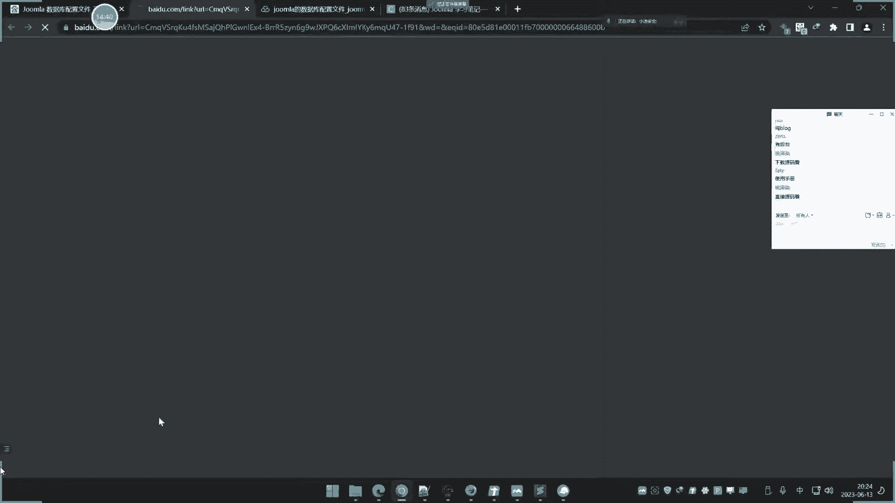

# 第51课：文件与目录安全漏洞详解 📚

在本节课中，我们将学习文件安全与目录安全相关的几类常见漏洞。主要内容包括文件下载、文件读取、文件删除、目录遍历与目录穿越。这些漏洞通常源于对用户输入的控制不当，可能导致敏感信息泄露或系统功能被破坏。

---

## 文件下载漏洞 🔽

上一节我们介绍了课程概述，本节中我们来看看文件下载漏洞。

文件下载漏洞是指，攻击者通过篡改Web应用程序中用于指定下载文件的参数，从而能够下载服务器上的任意文件（如配置文件、源代码等），而不仅仅是程序预设允许下载的文件。

其原理与文件读取漏洞非常相似。正常的文件下载通常有两种方式：
1.  **直连地址**：直接访问文件的完整URL路径进行下载，例如 `http://example.com/files/123.pdf`。
2.  **参数传递**：通过URL参数指定要下载的文件，例如 `http://example.com/download.php?file=123.pdf`。

漏洞通常出现在第二种方式中。如果程序没有对 `file` 参数的值进行严格的过滤和限制，攻击者就可以通过修改该参数（例如改为 `../../../etc/passwd`）来跨目录下载系统敏感文件。

以下是利用此漏洞的典型步骤：
*   寻找网站中提供文件下载的功能点。
*   观察下载请求的URL，查找是否有 `file`、`filename`、`path` 等参数。
*   尝试修改参数值为已知或猜测的敏感文件路径（如 `../../config.php`）。
*   如果服务器未做防护，则会返回该文件内容。

---

## 文件读取漏洞 📖

文件读取漏洞在本质上与文件下载漏洞是相同的，都是由于程序未对文件路径参数进行有效过滤，导致可以读取服务器上的任意文件。

两者的主要区别在于“表现形式”：
*   **文件下载**：浏览器通常会弹出“文件保存”对话框，或将文件内容以附件形式返回。
*   **文件读取**：文件内容直接显示在浏览器页面中（例如，将PHP配置文件的内容以文本形式显示出来）。

无论是下载还是读取，攻击者都能获取到文件的原始内容，这对于查看配置文件、源代码等敏感信息同样有效。

测试方法也与文件下载漏洞类似：
*   寻找图片加载、文档预览等可能涉及文件读取的功能。
*   抓取请求，观察是否有传递文件路径的参数。
*   尝试修改该参数，进行路径穿越测试。

---

## 文件删除漏洞 🗑️

文件删除漏洞是指，攻击者能够利用Web应用程序的文件删除功能，删除服务器上原本无权删除或意料之外的文件。

此类漏洞通常出现在后台管理、用户个人中心等需要权限认证的功能模块中，因为删除操作本身比较敏感。漏洞成因同样是程序对删除操作的目标文件路径参数控制不严。

**重要提示**：在实战测试中，切勿随意删除目标网站的重要文件（如首页 `index.php`），这属于高危操作，极易对业务造成破坏。正确的测试方法是：
1.  在可操作的目录下自行创建一个测试文件（如 `test.txt`）。
2.  尝试利用路径穿越（`../../../`）删除该测试文件。
3.  如果删除成功，则证明存在任意文件删除漏洞，点到为止即可。

---

## 目录遍历漏洞 📂

目录遍历（Directory Listing）漏洞，也称为目录浏览漏洞。当Web服务器配置不当，未禁用目录浏览功能，且目录下没有默认索引文件（如 `index.html`, `index.php`）时，访问该目录URL会直接列出目录下的所有文件和子目录。

这本身可能不是严重的代码漏洞，但属于一种不安全配置。攻击者可以通过浏览目录结构，发现备份文件、配置文件、源码压缩包等敏感资源，从而辅助进一步的攻击。

**如何产生**：在Apache、Nginx等Web服务器中，如果开启了 `Indexes` 选项（或类似功能），且访问的目录下无默认首页文件，就会触发目录列表。

---

## 目录穿越漏洞 🚪

目录穿越（Directory Traversal）漏洞与文件下载/读取漏洞中的路径穿越原理相同，但它特指在“文件管理”或“目录浏览”功能中发生。

例如，一个在线文件管理器本应只允许用户浏览 `www/upload/` 目录，但其用于指定当前目录的参数（如 `?path=upload`）未被过滤。攻击者通过修改该参数为 `?path=../../../`，就可能跳转到网站根目录甚至系统根目录，浏览所有文件和目录。

它与目录遍历的区别在于：
*   **目录遍历**：访问一个配置不当的目录，**被动地**看到其文件列表。
*   **目录穿越**：通过参数操控，**主动地**跳转到其他目录进行浏览。

---

## 黑盒与白盒测试思路 🔍

无论是文件下载、读取、删除还是目录穿越，在黑盒与白盒测试中都有通用的思路。

### 黑盒测试
主要关注两点：
1.  **功能点**：寻找网站中与文件操作相关的功能，如“下载附件”、“预览文档”、“管理文件”、“删除资源”等。
2.  **URL特征**：观察这些功能请求的URL和参数。重点关注参数名如 `file`、`filename`、`path`、`dir` 等，其参数值很可能就是文件或目录路径。尝试修改这些值进行测试。

### 白盒测试（代码审计）
1.  **搜索关键函数**：在源代码中搜索文件操作函数。
    *   文件读取/下载：`file_get_contents()`， `readfile()`， `fopen()` 等。
    *   文件删除：`unlink()`。
    *   目录操作：`opendir()`， `scandir()`。
2.  **回溯参数**：找到调用这些函数的地方，回溯检查传递给它们的文件路径参数是否来自用户可控输入（如 `$_GET`， `$_POST`）。
3.  **分析过滤逻辑**：检查程序是否对用户输入的路径进行了严格的过滤（如检查是否包含 `../`， 是否限定了基础目录等）。过滤不严则可能存在漏洞。

---

## 总结 📝

本节课我们一起学习了文件与目录相关的几类安全漏洞：
*   **文件下载与文件读取漏洞**：通过控制文件路径参数，获取服务器上的敏感文件。
*   **文件删除漏洞**：通过控制文件路径参数，删除服务器上的任意文件（测试时需谨慎）。
*   **目录遍历漏洞**：由于服务器配置不当，导致可直接浏览目录文件列表。
*   **目录穿越漏洞**：通过控制目录路径参数，跳转到预期之外的目录进行浏览。

这些漏洞的核心成因都是对用户输入的**文件或目录路径参数缺乏有效验证和过滤**。理解它们的原理和测试方法，有助于我们更好地发现和防范此类安全问题。