# P52：第52天：XSS-Demo源码&小皮面板安装包等 - 逆风微笑的代码狗 - BV1Mx4y1q7Ny

好我们现在呢给大家讲一下今天的内容啊，第52天了。

加上新的漏洞，那个夸张的啊，这宽容度呢我们具体呢也要上四次直播呀，今天上的是这个基础类型的啊，非持续性的反射性夸张和持续性的存储夸张，然后呢，再就是一个DMO类型的BIOS的一个夸张类型。

那还有其他拓展类型，像这个JQUERYMXSSU叉，XSPDF叉ss s flash叉，SS和商传XSS等的一些拓展类的，一些夸张的一些利用了我们刀手呢，在下节课呢就讲到，那除此之外的话。

这个夸张的他的一些核心利用啊，比较基础的，什么盲打呀，什么cooking夸读取呀，coking的刀举呀，还有些这个联合那个什么钓鱼的一块的呀是吧，还有一些这个菜S啊，什么去窃取平局啊。

那像这些那都是属于他的攻击，利用公积利用呢会涉及到一些工具项目，到时候呢我们这个公积利用这个东西啊，是单独的一节课呢去给他讲，然后在这个安全防护这一块，提出这个解决方案和防护啊。

他的一些这个修复操作和一些绕过的东西呢，到时候再换一节课去讲，就说四节课呢讲的是什么啊，四节课呢就是先讲它的基础类型，就是常见内的，然后呢再讲下拓展内的，再来说一下他的利用和项目工具。

再来说一下它安全和绕过的一些情况，这是我们时间差SS的课程的安排啊，那今天呢就讲最基础的啊，首先呢搞清楚什么是夸张，在夸赞漏洞呢是最容易产生的，也是最容易忽略的一个漏洞，它也是一个最需要配合。

也称之为最鸡肋的漏洞，因为这个漏洞啊也不算很最鸡肋，反正比较鸡肋，他积累的这个情况呢，是因为这个漏洞啊，大部分呢都不是主动漏洞，什么叫主动漏洞呢，就像这个其他漏洞一样，如果有这个漏洞呢。

我们就可以构造一些东西呢，直接通过这个漏洞呢得到什么东西，但这个夸赞它不太一样啊，这夸赞漏洞呢一般呢都是需要这个受害者呢，就是这个受害者呢需要捉到或者说去触发到，才能进行这个攻击的利用。

也说我把这个攻击呢，我把他植入攻击了，但是呢他需要有对方就说目标的一个这个触发，才会把这个漏洞呢进行完善，所以呢他有一些这个积累，就是积累在这里，然后还有一个积累，就是出发的时候呢，还有一些条件要满足。

因为有些这个夸张代码，那它主要就是这个我们说的前端的一个漏洞，就是说一般是执行这个JS，就是我们的JAVASCRIPT的代码啊，他执行JAVASCRIPT代码那部分浏览器的话。

有些这个安全策略会组织JS代码的执行，再根据你当前浏览器的版本和它的设置呢有关，有些部分浏览器它的默认的安全策略呢比较高，在一些浏览器访问一些网站的时候，那它会有一些询问，询问你是否要执行这个JS代码。

如果说对方呢点击的是组织的话，那么很可能即使触发了，也并不丁会能执行出JS代码，也不应不一定呢会成功，所以他的有很多限制条件，导致这个漏洞在实战中呢，它会出现一定的这个积累性，就这个原因啊。

我们等下呢在后面课程讲的时候呢，他就会有些这个相关的东西啊，但这个漏洞呢他有个优点，这个优点就是说很经常会忽略这个漏洞，或者说即使这个项目中的有这种XSS漏洞呢，一般人呢都不会把它进行一个很大的事情呢。

去看啊，去看待也不会啊，可以的去修复这个漏洞，很多这个操作的时候呢，就是这个漏洞呢即使有，但是呢他也不会去修复，咱就是因为说他不是个主动漏洞，他需要有一定的这个配合之后。

他才能把这个漏洞能完整的利用出来，不过他在某些情况下面的话还是有点作用的啊，这是主要是在公信利用的时候呢，他的思路方面的事情好，现在呢我们就不讲这些题外话了啊，我们就现在真实的去了结一下。

这个夸张漏洞的原理和他的一些情况啊，那夸张漏洞原理呢，简单一句话就是接收输入数据，再把这个数据呢进行输出，在输出的时候呢，这个输数据呢当我们去给这个数据呢，给到的是一个前端的JS代码的时候。

那么由于这个JS代码呢，在前端进行显示的时候呢，就会被执行，比如说你让他输入123，那么他输出123，那么你让他输出一个JS的代码，那么它就会输出这个JS代码，当在这里输出这个JS代码的时候呢。

浏览器这个前端呢就会把这个代码呢，当做这个代码去解析执行，那么这个JS代码是干嘛的，那么就执行什么东西，如果这个借代码是做任何事情的，那就是做任何事情，所以说他的攻击利用呢就是JS代码的作用。

JS代码的作用是什么，就能做什么样的攻击，好，我们这里呢用例子呢去给大家去简单看一下啊。

这个漏洞呢也是产生在各个语言中，它也不是说在pp单独使用。

在任何的这个只要是有这个前端语言的，那么都会有啊，你可以看一下啊，这个很基本的代码，这个代码呢就是一个这个用pp写的好的，用java写的，用其他地方写的都一样啊，也没什么大大重要。

因为它的核心应用代码呢主要是JS代码，和你这个后端语言代码了没什么太大关系，我们是用后端代码呢来形成这个漏洞而已啊，但他攻击利用呢都是前端的一些代码，你看啊他这里呢去写真正代码啊。

你看啊呃这个代码的作用呢也非常简单啊，接收一个参数值，然后再把这个变量呢给它输出出来啊，我们这里呢可以进行对这个网站进行访问。

看一下啊，嗯比如说我们给他一个这个值啊，在这开个大按钮啊，好你看啊他输出的就是这个一，大家可以看到了。

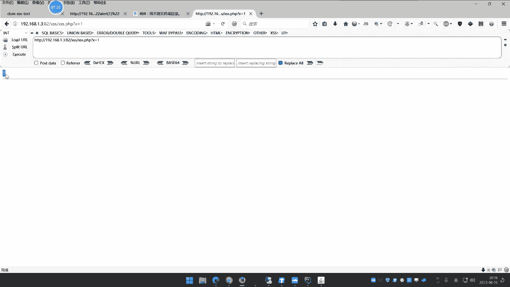

他输出的就是个一，对不对，在代码里面啊，输出就是个一。

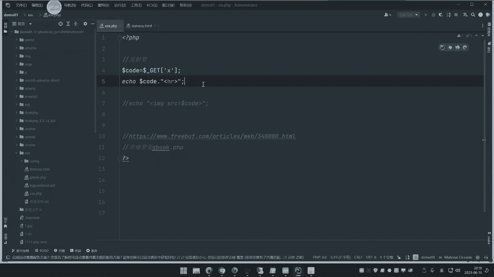

然后打赢一个这个换行的东西啊，他输出就是一对吧，你这里写什么东西呢，他就输出什么东西嘛，啊就说这里呢是你一个值好，然后呢这里就输出个值，那么大家试想一下，当这里让我把123呢改成这个什么一个。

这个类似的什么JS代码的时候，对不对，就改成这个JS代码，而art可能是这个弹窗的一个操作，这里呢会更加明显，这个可以写写了JS语干这个script达tick1script，然后呢进行执行。

那么大家可以看到这里呢就弹窗了，你可以看这个代码页面中呢，我们就可以看一下这个源代码中，那你看是吧。

就显示这个了，我们提交信息加这个hr，hr是这个代码这里面连接的一个东西啊。

在这给它去掉保存一下，在你看，还有弹窗仪是吧，然后在里面显示个代码，就是在页面中去显示这个代码的时候呢，当这个代码是个JS代码，所以呢他就把这个东西呢当做JS去执行，那么那就形成这个东西。

那么大家思想一下，如果说我把后面这个代码那改成一个什么，改成一个其他的建设代码啊，改成一个呢类似于script a保护SRC，加上一个什么啊，app小了八点com，对不对，改成这个地址。

然后呢再然后啊变成这个语句啊，这是个介代码，就是加载这个小八点com这个地址啊，这个时候啊我们来看一下老师改完之后呢，我去访问，你看，哦他这个代码中呢就有这个显示对吧，你看他就显示这个代码。

然后我这里呢如果把这个呃JS代码呢，改成一个这个嵌套式的，什么嵌套式的一个页面。

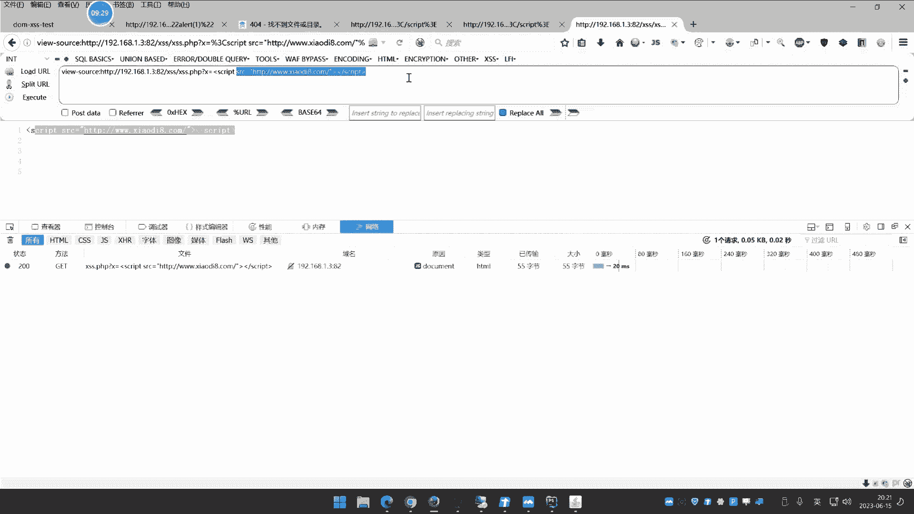

啥意思呢，就是在这里呢我们。

天哪这个签到四啊，嗯IF这个鬼东西，这代码我都不会写了哈，呃给看一下这个文章吧，常见标签啊，看一下，啊这里没有嵌套啊，哎，你看大家看一下啊，这里有个框框，你看这框框就显示一个小圆点，看我们看到没。

大家看到没来，也就是说你在访问这个本地网站的时候呢，他在不知情的情况下面呢，就访问了这个什么定义的这个网站，那在访问百度点行，只是说白天看我都把拦截了是吧，我晓得吧，没有拦截它。

啊他就访问这个下巴点com下，对不对，然后这里呢你可以设置这个框框的大小，也可以把它隐藏掉，那么其实就算你访问这个地址呢，在不经意之间呢就访问了小里八点com，你看数据包里面呢访问了小八点com。

对不对，那么大家思想一想，其实呢就是说我们可以用这个ATM和加这个JS的，一些代码呢在这里去执行嗯，可以相当于说我还做一个很简单的事情，就说我把这个框框呢给它变大，搞成个透明化的东西。

一打开嵌套一个网站，而这个网站呢我保证和这个网站一模一样，保证假设和这个网站的界面一模一样，那不就等同于是一个类似的钓鱼的一个东西吗，就把这个地址发给你是吧，看上去呢是这个网站。

但实际上呢你在这个页面中去操作的时候，是加载了这个网站，那在这个网站操作，那这个网站假如说是我自己的网站，我在上面做任何事情，我记录你的这个登录账号密码等等一些情况，不就是类似的一些钓鱼的吗。

是这个意思吧，那像这种情况呢，就是我们说的发展的一个最基本介绍啊，这种情况就是发展的一个最基本介绍，然后这个跨在里面呢有几个分类，我刚才说了啊，我们今天讲的是基础类型，你像后面还有这些类型。

就是一些拓展类型，这是XSS的高端玩法，这是最基础玩法，玩法里面呢有三种，一种叫反射型，一种叫储存执行，一个叫多模型，那这个反射性是今天这里的叫这个叫反射性，那这个反射型是什么概念呢，很简单的道理啊。

就说本身网站的功能是接受这个正常的字符呢，并把正常字符呢进行输出，而我们这个时候呢发现这个地方能控制它的，输出的时候呢，再到他后面的去写这个后面的语句，然后呢它形成了一个加载一个页面对吧。

然后呢这个页面网址呢发给别人点，打开之后呢，就会和我们这个界面是一模一样的效果，把这种类型的攻击我们就称之为叫反射性，发展，叫非持续性，什么叫非持续性，就是说，这个攻击是你这个攻击者自己构造出来的。

他不是咱们本自身就有的，你不构造它就是正常的，你构造了它才有漏洞，那么对方会不会访问到这个地址呢，你不发给对方，对方怎么访问这个地址呢，他要访问他了不起，就访问这里，访问个正常的这种情况是吧。

访问这种情况的东西，或者说压根就访问这个地址，压根就不会触发后面的东西，就说他正常去浏览网站的话，他不会触发到你那个写这种代码的，一个页面出来，这是你自己构造出来的，你想构造什么效果。

那在后面改改这个代码，这种的我们称之为叫反射型，也叫非持续性，意思就很明显，就这类攻击，那是你构造出来的，它就是当时攻击的时候，当时有效，别人不访问就没有效果，他不是别人能访问出来的。

是你要发给对方去钓鱼，或者说让对方去触发，很简单的道理，就像这里呢我写这么个代码是吧，我模拟一个钓鱼，我就以以一个钓鱼的人的身份去这个发给你，我说哎呀这个上面呢这个网址怎么回事是吧，然后呢把网址发给你。

然后呢你去把它打开访问诶，然后呢你在上面去操作的时候，那就被我这个搞到手了是吧，就这么个情况，那如果说我不发给你的话，你是不可能触发到这个地址的，因为这个地址在网站上面是没有的，是我勾勒出的，能理解吧。

这种就叫非持续性，叫反射性，还有一种类型呢就是一般很好理解的一种类型，那我们再看一下，就是我们前期讲pp开发的时候，讲这个java开发的时候，写到过的这种类似留言板功能是吧，通过这里呢写个留言啊。

写个内容，点击留言哎，他就会记录留言的数据和留言的内容，包括一些信息是吧，那么这个留言呢它是往后推移的，就说你留了言之后，这个留言没有被删除，那么它就会一直在这里保存，因为这个留言呢它是写到数据库里面。

你不管他写到数据库里面，还是学到其他地方，只要是这个数据，它不会删除，那么你想象一下，我现在假如说这个留言板有夸张漏洞的话，我植入一个跨境代码到这个留言板上面去，那么也就是说下一个访问者就会被触发。

比如说像这里呢，我们就写一个这个发展的一个简单，测试的一个弹窗，你可能说为什么要写一个弹窗，弹窗呢就是效果更明显，但是它起不到其他作用，因为攻击的话就要修改这个语句，而我们现在呢做演示。

就是说弹窗就表示说能够执行这个语句，那么如果在攻击中呢，你就只需要把这个语句的更改成，你想要的操作类的语句即可，我们在这里写上它之后啊，点击留言是吧，当留言成功之后。

你会发现每当有人去访问这个地址的时候，就会弹窗，那就说只要是下一个人就会执行，我刚才植入到的这个夸张语句，就会执行这个JS语句，因为这个语句已经植入进去了，那么下一个访问者呢就会遭殃。

那像这种类似的在网站的常见功能中哪些有啊，评论区留言板，只要是有这个数据存储的地方，就是有那这类的夸赞攻击，我们称之为叫存储性攻击，就是持续性攻击，很好理解吧，这攻击会一直持续下去。

而且只要对方浏览到这个页面就会被触发，而不需要像我刚才那样子，刚才那个画展一样，需要自己构造好，然后呢让对方去触发，而且让对方触发，对方访问网站是不会触发的，你必须要发给他，那是你构造的地址。

不是对方能够直接访问到的，而这个就不一样，就是我直接把工具语插入到网站的数据库，或者说它的存储的地方去了，那么只要有人访问到了这个指定地方，就会触发这个JS代码，也是我们所俗称的跨人代码。

那么这里呢攻击就会一直持续下去，直到这个数据被删除才会停止，那么大家可以想象一下，这两类的一个夸张的类型，它的危害程度啊，危害程度可想而知，那肯定就是存储性夸张的，要更加的这个危险的，而一般在网上。

不管是你挖漏洞的，还是你在公司里面提交漏洞信息的时候，一般像这种反射性发展，很多地方他是不收的，不收的原因就是因为这个漏洞在利用起来，他是很鸡肋的，就像我刚才说的。

你要自己构造好那个触发代码的URL地址，然后发给对方，对方点和不点是一码事，颠呢也不一定会成功，因为我刚刚说了，有些浏览器呢它会阻止，或者说有些这个啊各种各样的一些情况是吧，都会有一些异常不到的情况。

所以呢你罚给对方怎么罚，怎么发给对方，对方会不会点，能不能成功，他有几方面的因素去决定，要都满足才行，所以像我刚才说那个反射性的夸赞呢，虽然网上都很多，但是很多在SRC平台。

或者说在这种公式的这种提交漏洞，这种测评的这种报告中呢，啊，有很多地方呢是没办法才把写上去，很大情况下面大家都会忽略这个漏洞，而这个纯图形夸张呢就不一样了，因为它是一旦植入进去之后。

有人访问了就会触发的，所以这类的攻击呢还是有部分的这些，而且啊SRC啊，或者说一些这种东西呢，他会收的，只要是这个有像一些社交平台的，还有像这种交互私的地方，人数比较多的地方呢，他就会收这个漏洞。

因为这个漏洞呢对于他这个业务呢，观点比较影响，我比如说打个比方例子啊，你像这个存储性夸赞，像什么QQ空间，那还有像这种论坛啊，留言就是那种有社交群体的这个地方对吧，QQ空间里发个日志。

日志里面呢还能够植入夸张，那么别人看了这个日子就就中招，你说这个危害该有多大呢，对因为他是一个成千上万的一个群体在上面搞，那像战斗力的话攻击，那那比那个怎么取一个单位攻击还要高是吧，好说了这么多。

这是这两个类型的一个夸张，我们在讲第三个类型的时候呢，我就先问一下大家，就截止目前你对这个讲课的这个夸张的，这个漏洞的两个一讲了之后，你觉得这个漏洞有没有用处啊，觉得他是不是很鸡肋啊啊啊。

在实战中他是怎么用的呀，会不会有这样疑惑是吧，然后我给他简打一个很简单的例子啊，一般这个夸赞在实战中是什么一个用法，我给大家解释一下啊，我就拿个很简单的例子，这夸张呢，它的利用场景是会和你目标呢有一些。

绝对关系的，你的目标有交互式的地方越多，那么这个发展利用的机会就越大，如果这个目标没有什么交互式的东西，那么这个发展呢发现了和没发现都是一样的，没什么鸟用，什么叫交互式，就是说你和米是攻击者。

对方呢啊是那个网络啊，就是啊这个站长或者说是个管理员，你能和他有交互的地方越多，那个夸张就价值越高，或者说你用的机会就会越大，那我举个很简单的例子，你像这个一个app。

你不要说这个话只产生在这个网站里面啊，在app里面也有app里面是吧，比如说这个啊，什么这个一些app里面，不经常有这个什么提交建议啊，或者说联系这个客服啊，啊这个联系站长啊。

就不管是你这个有什么问题啊，或者说投诉建议啊等等一些地方是吧，这个时候呢比如说写个什么，写个什么建议呀，写个什么这个东西呀是吧，发给他呀，怎么样的，还有什么工单交互的一些地方。

你在写的时候把这个JS语呢写到里面，如果说对方呢他经常看这个东西诶，他又打开这里存在夸赞，在他那边就执行了JS代码，而这个JS代码具体干嘛，现在我们不用多说，我们就拿个比较最简单例子。

攻击利用的时候呢啊他是个coin刀，取coin刀群呢就是盗取对方的一个管理员凭据，那这个时候呢一打开诶，把他管的户型盗取到了，那么你就知道，因为他要看的话，肯定是有个后台系统在看。

打开后台系统看你这个投诉建议和留言的时候，不就中招了吗，你就能拿到这个管理员的cookie，用他的cookie登录这个后台呀，不就达到了吗，啊这是第一种，还有一种像我们说的网上呢有些搞这种推广啊。

销售的一些这种啊订单啊，这种东西就像以前嗯是吧。

我们找一下呢，比如说我们呢有时候呢这个经常看到。

就拿这个托法来讲是吧，你看到啊，它有下的都是有这种呢这种互动的地方。

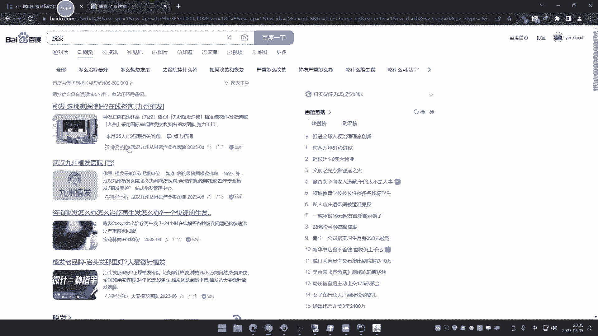

是不是啊，还有人那就直接卖腰啊。

你知道吧，那你看他是吧，你看这里输入这个什么鬼姓名的电话啊，就这种类似推广，你把这个姓名电话，这里呢写个那个JS代码里面去把他一提交诶，对方就知道了，哎呀有人这个有这个脱发问题呀是吧，那小李一个兔子。

他他来提交了啊，我要把他这个韭菜把他割到，他就在他的后台呢是吧，就去看这个留言啊，你叫什么名字，电话号码，我就这个销售来了啊，电话给你拨不下来了，卡的时候呢不小心是吧，就执行JS码这个建站嘛。

那就把对方的cookie呢发给你的歌去，是不是这个道理啊，那像这类工具都是属属于什么，属于我们的存储类的扩展，就是你的代码呢，写入到他的系统的某个地方去存储了，对方呢在去看的时候呢就触发了。

然后他们一般都不是反射型，反射型的话，你还要去联系别人，你还不知道站长是谁，你怎么知道呢，所以说呢反射性它庸俗不搭，就这个意思，那纯属性不一样，你发过去了，只要盯着对方去上钩就完了。

我刚才为什么说要有交互式呢，就是说对方如果说你发过去了，你看都看鸟都不鸟，那有什么作用呢，对不对，你发过去一年他他都不看，两年不看，3年不看都不知道有这个东西，那发个毛啊，发所以你要知道啊。

这个夸张的利用的是和你这个目标的，他的业务功能，和这个业务的需求有关的，他喜欢看，他爱看是吧，你发过去他才有用，他压根就不管这个东西，你罚个毛啊，罚有这个漏洞和没这个漏洞是两码事情，明白吧。

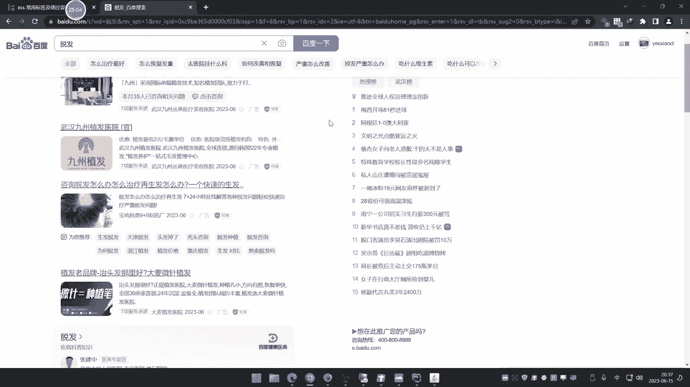

都给讲一下啊，所以一般像这种夸赞呢，他的攻击目标是要建立，对方和你的这个交互性呢是比较强的，就你知道他很大几率会看，那你搞这个夸张的才有用，而这个夸张那就像我刚才说的，你这个把夸你去插进去。

你也不知道对方有没有这个夸赞这种行为，那就称之为叫盲打，就是你不知道这个有没有夸张漏洞，反正你妹的我就发过去是吧，要么成功，要么失败盯着你啊，没办法就行，就这样玩啊。

好这个是我刚才说的这个存储心啊，就是说这类的扩展呢，一般是把你的这个工具代码的，存储到他的数据库，或者存储到某个地方，反之就是这个数据呢是存储的，然后呢这个数据呢对方在看的时候，那就中招了。

只要对方不删这个数据，那么会一直持续下去，这种呢就叫存储，也叫存储，存储和持续性扩张好，还有一种呢就叫DOO型框的，什么叫demo型啊，前期在讲pp开发的时候呢，我们单独还商过。

教过大家呢使用这个DOMO操作啊，就是那个JS那个课程里面啊，大家不知道还有没有印象，那当时我还写了个demo操作是吧，就是利用这个啊JS代码呢，实现一些这种啊这个DOMO型的一些操作，对不对。

当时还讲过啊啊，然后这个灯模型夸张是如何产生的，我们这边写了个简单例子啊，这个例子就是一个接收浏览器上面的地址，信息呢来实现的一个类似的挑转好，我们来打开看一下啊啊这是个多么点XSS，我们打开看一下。

那这是一个dmxr size啊，你看它有什么作用啊，就比如说我在这里呢，我写上个三W500com，我执行，你知道吗，什么鬼啊，哈是吧，那我仿这个网站来，你看我发这个网站啊，他要刷新一下呢。

它自动跳转到百度，看不了啥情况。

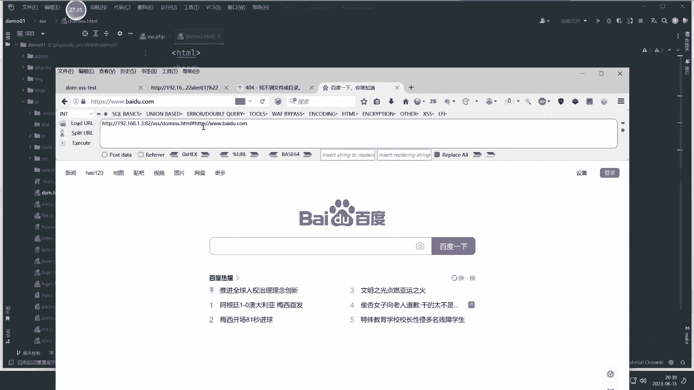

这个是怎么实现的呢，这是个纯接三网，没有啊，这是个ATM加JS代码，没有做任何事情，很简单嘛，他的的他声明一个变量叫哈奇locking啊，lock in哈奇啊，接收这个浏览器信息URL地址。

然后呢判断如果说这里有值啊，他就把这个值呢取出它的移，就是索引下标为移的就是那个井和后面的，然后再用这个log型HREF呢。

去跳转到这个指定的URL，所以我在这里呢写上这个ATP，像abiding com，它就会自动的跳转百度点com啊，你写任何地址呢，就跳转任何地址，对不对，比如说优酷是吧，还跳优酷对不对。

那就一四好，第二好。

那这是个什么情况呢，这是一个简单的功能是吧，一个简单的功能没有做任何事情。

但是在功能里面大家可以看到啊，这是一个用JS操作的，他的这个取的值呢是取的是浏览器上面的值，或者说是这个表单的值，多模型操作对吧。

这里呢我们有图片啊，刚才的反射型呢，这个是空间流程，然后下面这个图呢是一个存储性，就是把数据呢写到这个东西之后啊，当户用户呢去访问的时候呢，触发啊，一个是存储运算，那DOO型呢。

其实就是针对这个汪子或者表单里面的标签，里面的值呢来做这个数据存储啊。

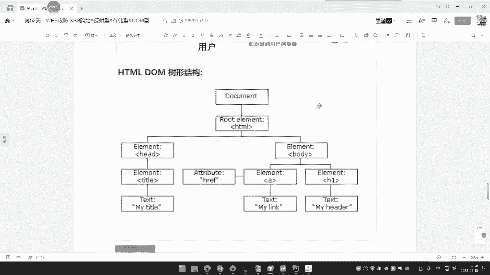

数据操作的DOM型，它和这个纯属性和这个反射性，有什么最大的差异，它的差异就是它一般取的数据，是我们这个什么浏览器上面的。

或者说这个里面的文本的，然后呢通过这个JS代码呢去把它取出来取。

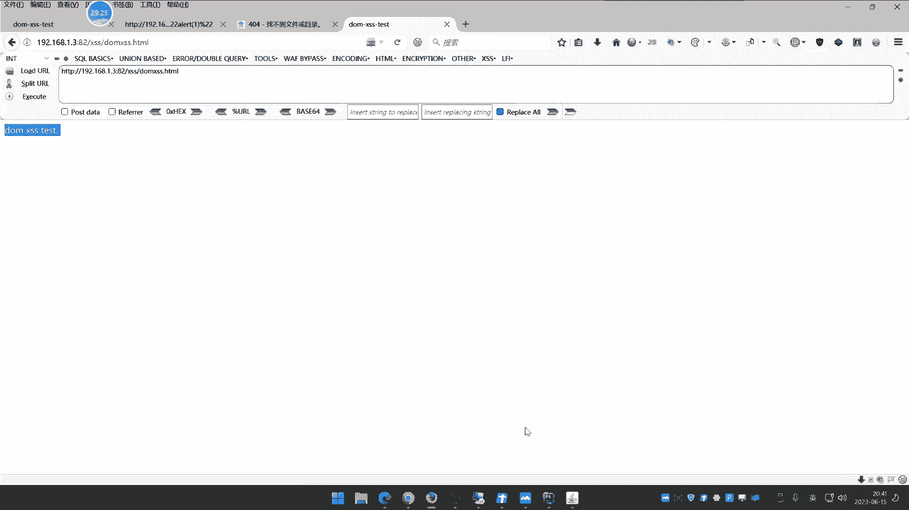

利用这种类型我们称之为叫德模型，啥意思啊，就是说前面那两个存储型呀，和那个那个那个反射型，都是取你这个用户提交的数据，而这个DOO型呢他虽然说也是取这个数据。

但是它一般这个数据呢就是比如说啊，很简单的道理，就是我的网页中有个叫DOMXSS，点test这个内容对吧，他这里呢如果说访问这个网址以后，他要把这个三个数据呢把它发生更改。

或者说显示到某另外一个地方或显示哪个地方，他就会利用JS代码去取这里面的某个值，某个东西，然后显示到另外地方或者怎么样，那这种操作就是demo操作，就是对于这个网页的这个什么内容啊，标题啊。

这个这个数据啊或者ATM代码的一些东西啊，或者网页上面的这个UR的信息啊等等啊，去做这些数据的一些收集和显示，那这种呢就是多模型操作，然后夸的那就是产生在这里就很简单。

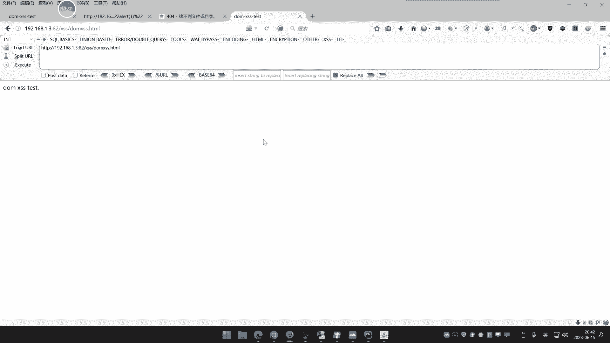

我们有个功能就是呢看一下你网址上面的信息，然后你网址信息一旦发生更改啊，他就接受这里面的某个东西，让它跳转过去。

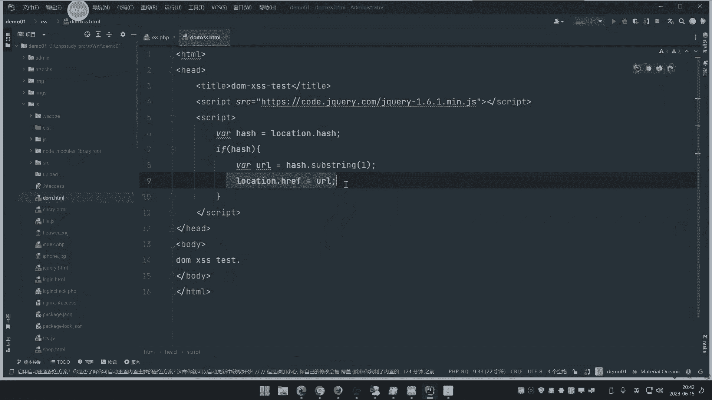

这就是个简单的一个功能，但这个呢就属于DOM型，XSS能理解吧，就是说前面那两个类型呢是从他的这个啊，他的一个差异，就是有没有这个顺数据存储的差异呢来去分类，而DOO型呢它是针对于这个它的功能上面。

就是他的这个用途上面那去进行的分类，一般你在网上去学这个XSS的话啊，介绍的就是这三种类型，多模型，反射型，还有存储性三类的一个情况，这个三类呢给他讲，第一个呢是告诉大家以后呢，你去提交漏洞的时候。

或者说去写这个报告的时候，发现这类漏洞呢要知道怎么去归类它啊，其实你去理解它这个三等类型的利用呢，它利用起来都是差不多的，无非就是说怎么去区分这个类别，在书写报告和漏洞判刑的时候呢，有什么概念啊。

利用起来是差不多的，都啊哦，哦刚才有人说还不懂，这有啥不懂的呢。

蛮简单的事情啊。

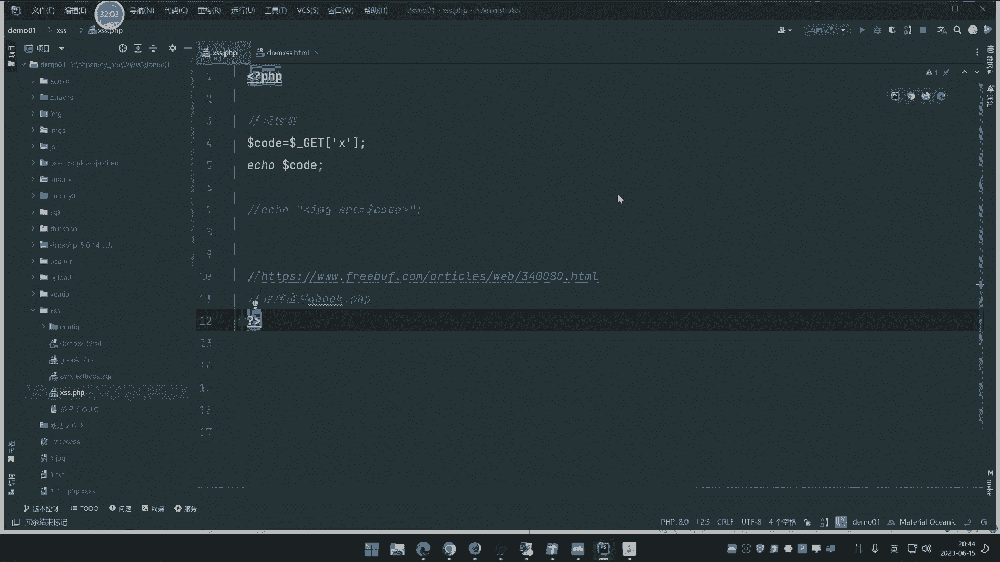

德模型这个夸张是非常好理解的啊，就是呢它是针对于我们这个网页里面的，这个整个demo输的操作，取的是标签里面的或者是表单里面的一些值，用这个值呢来做数据的操作，然后我们举的例子是让大家更明确。

更能看到效果，例子就是取这个月L上面的值呢，然后呢它进行功能的操作，知道吧嗯，好你们刚才要问什么怎么扯怎么扯，如果说我讲课讲了这么多，你听不懂，那没有什么意义啊是吧。

我们呢也给大家准备了这个三个实例是吧，三个这个类型的实例呢都给他找到了，你通过这个案例里面呢去想象一下，他这个是怎么找到啊，怎么分析我们上漏洞呢，现在不要去考虑怎么去找这个漏洞。

这不是你现在要考虑的事情，你先把这个漏洞的形成原理，和他的利用呢搞清楚，再来思考这个怎么找，因为找呢我们都是从两个方向去讲的，一个呢就是从黑盒的角度去讲，还有一个呢就是从他的代码的方面去讲。

那代码方面的那不用多说，那就是看代码呢去找，那是代码升级的黑盒呢，黑盒的话也很有分很多种情况，一种手工找，用工具找工具找，那也不说了，就是工具少就完了啊，手工找，那就是主要就是考核你对这个漏洞理解。

知道怎么找会更加的这个效率高是吧，好我然后呢我给大家说一下，这个还有一个支点啊，先把这个支点讲了之后呢。

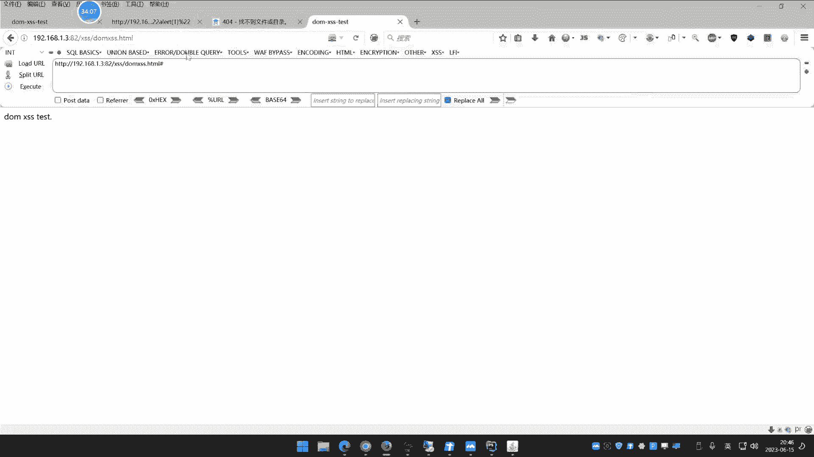

我们就用这个实力去给他讲，因为这个要讲一讲啊，那比如说刚才的反射性，这里啊，他不是输出这个co的嘛，对不对，你看啊，我们要执行JS语句的时候，是怎么执行它的。

那刚才呢我们去这样去执行这个J代码，我这个键代码呢写弹窗是为了大家看的效果，而不是说他的攻击就是这么写啊，攻击不是这样写的，因为你弹个窗没什么用啊，工具呢是更改这个代码来形成你要执行的东西。

因为工具是多种多样的，你是要获取到的cookie呢，还是要进行钓鱼呢，还是要做什么事情，这是根据你的需要呢去写这个代码，就是它的攻击，利用代码，我们这里写弹窗，只是为了让你看到这个J代码被执行。

所以呢就是代表有夸赞，而不是说我后期利用也是写这个东西啊，后期利用不是写这个东西啊，那我执行它是弹窗啊，好那这个弹窗的原理很简单，因为呢代码中呢是直接把它进行输出了，如果说你像现在我换一种模式。

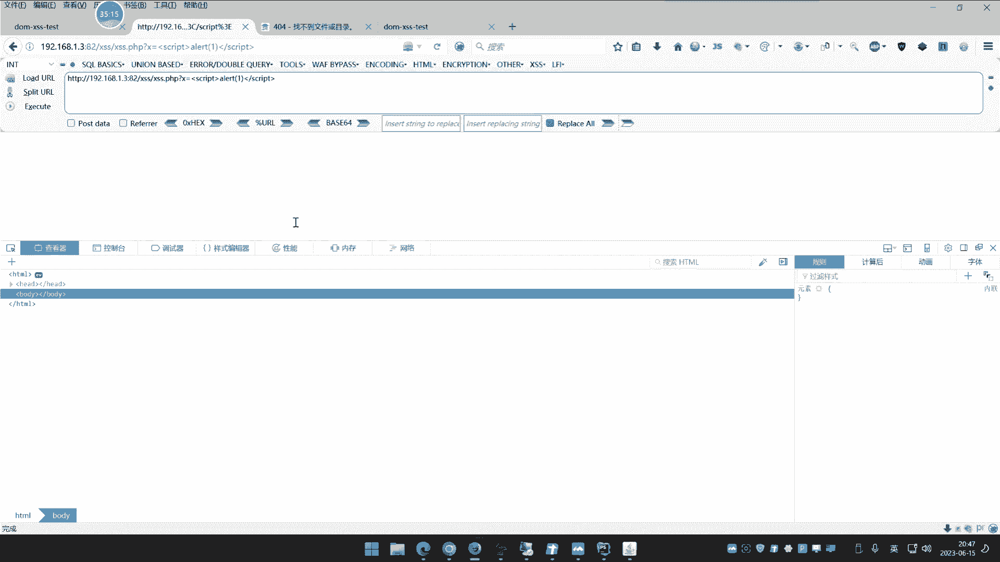

我输出这个东西，那你可能说为什么要输出东西啊，很简单道理，假设说这里我模拟模拟成一个什么，模拟成这一个接收图片对吧，接着图片去显示图片的一个这个功能，对不对，假如说X后面再加上是一个图片。

然后呢我把图片上那个文件呢改成一个键代码，然后这里呢还用这个image的SRC，是不是加载这个图片去显示。

对不对，你比如说像现在我们就找一张图片，是不是随便找张图片啊。

好这里取这组片对吧，放这来放这个目录，把他名字改一下，改成叫一点偏激。

好这是那个一点偏激，对不对好。

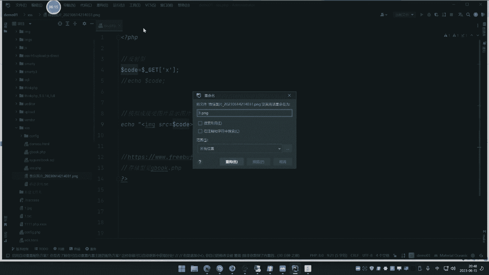

我这里呢最后给他传入这个一点PNG，说我先搞个正常的给你看一下，来看到没，这也是那个功能嘛，那传入一点PNG之后，哎这里就显示那个图片，是不是啊，对不对，那如果说我把一点TT1改。

我改成一个什么JS语句，script artic是一个弹窗的一个语句来测试一下啊，把它改成这个东西要写上去啊，对不对，哎我把它勾上去，哎这里呢你看哎咋不弹窗了啊，写错了吧，啊没写错啊，打不弹窗，为什么。

因为你看这个显示代码呀，他的那个显示代码这里，那你可以看下源码里面那SRCN呢，加上这个地址，那很明显这个代码写的是有问题的，它本身有问题，为什么是本身就有问题啊。

那该怎么办呢。

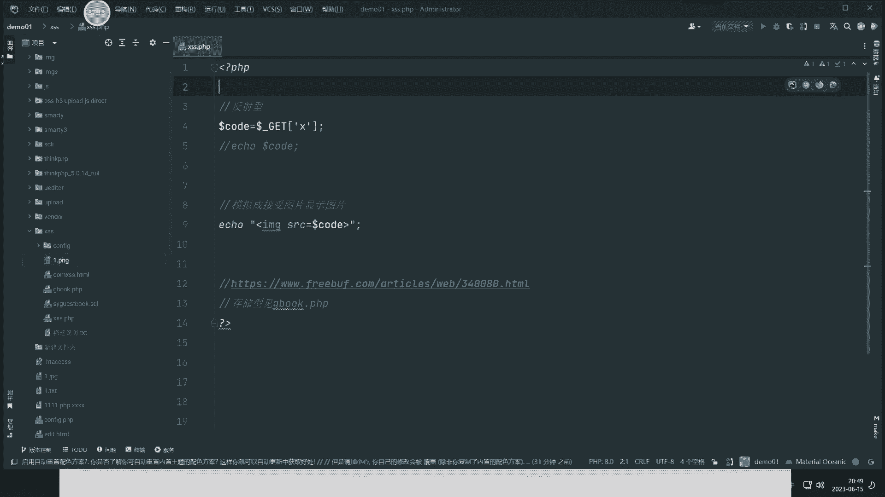

是不是要逼合这个标签呐，怎么装这个标签里面也能执行JS语句啊，所以呢我给他看了个文章嘛，只要根据当前你输入的这个代码的地方。

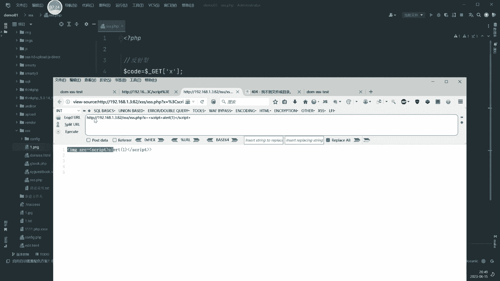

看一下他在页面中的那个在拉哈里哈，然后那里选择性闭合。

你看这里有常用标签，你看呢比如说EMAGE标签可以，那使用这种方式呢加上X，然后on mood就是地址，图片呢一旦出错就触发这个on errol事件，就是错误事件来进行的，ARTIK移的一个弹窗。

对不对，你可能就写成这种模式，来把它写这个东西来复制一下，放到这里来，让他错误页面，然后呢去执行，然后勾一下执行哎弹窗，你看为什么你在看源代码是把闭合了呀，你要根据你那个输输的数据。

到页面中的哪个地方啊，然后进行这个测试，那这个就是关于他的那个利用和发现立方，你可能说这个又又讲了什么是发现的呀。

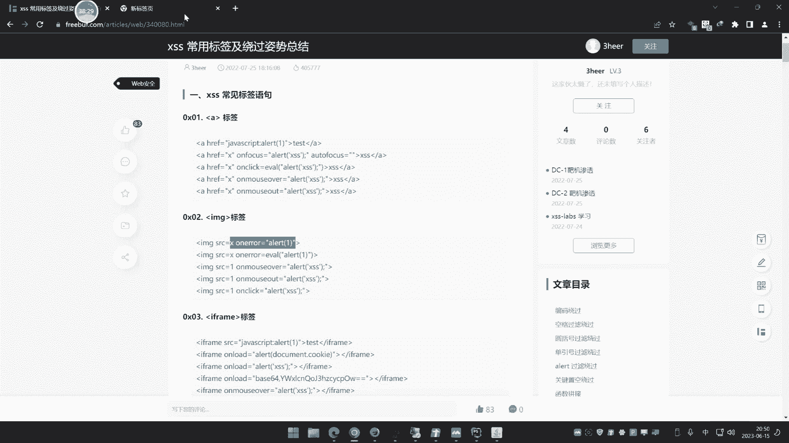

那我很简单的例子啊，你看一下啊，我把我那个小礼包打开给看，就说按照我们的珍藏手工去分析，这个差生当中去讲这个概念啊，在里面打都打不开呦。

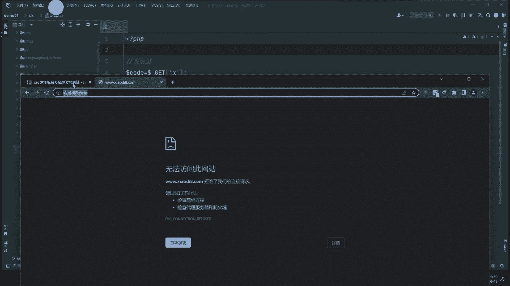

唉行吧，好，你看现在啊，比如说我输入123，我在里面搜索这个123，那你他这里呢就会有这个123的数据是吧，那么如果说你输入个script呢。

那是不是就会显示script的数据啊，然后你观察一下呢，把选中呢优键检查，你观察这个123在哪里，你看他是在这个em这里，对不对，你就试想一下，能不能把这个123改成个script语，同时呢让那里执行。

对不对，就B和这个前面的em和后面的em对不对，或者这里是存储到这里，如果说他写到这个em里面呢是吧，又该怎么办是吧，如果说你能闭合，而且上面没有过滤的话，那就恭喜你就可以找到了，那这个是地址对不对。

然后也说你更改这个地址，那就更改，这也啊更改这个也暂时是吧，它就会显示这个类似的数据在这个地方显示好。

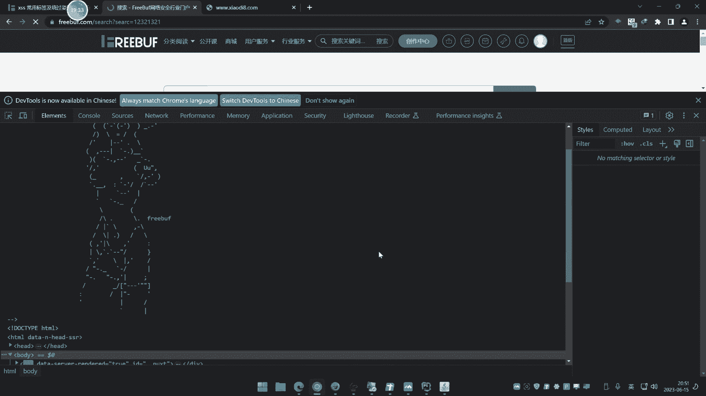

就是这个意思啊，这是手工方面的啊，这个呢不是我们现在操心的问题啊。

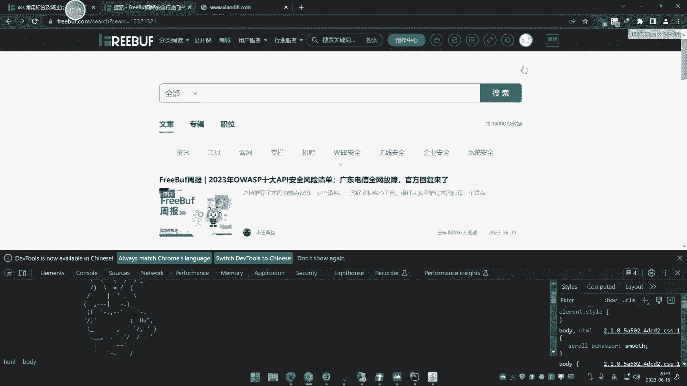

就是说有些人问嘛，就给大家说一下啊，然后在利用的时候呢，还要考虑这个闭合的问题啊，就是要看因为它的漏洞，那是产生在输入和输出的地方，输入呢是你提交的JS代码，就是那个跨站代码。

然后输出的地方就是它显示那个地方，为什么它不能执行这个JS代码，就是因为可能你JS代码的输出的时候呢，写到了标签里面，或者说他把某些东西给它过滤掉了，导致他不能执行，所以你只要用那个JS代码呢写的时候。

尝试性的把它闭合，并且让它执行出来啊，过滤呢那就是另外一回事啊，就是说要换一种写法呀，或者说用其他东西了，当然这里呢我们不是说所有东西都能，都能这个绕过啊，是要具体看目标的一个过滤情况。

和它显示的地方去去尝试性去闭合的啊，这个科呢是在后面要讲啊，现在呢我们暂时呢先不管它，现在呢先了解它的分类啊，然后呢和这个漏洞的一个情况啊。

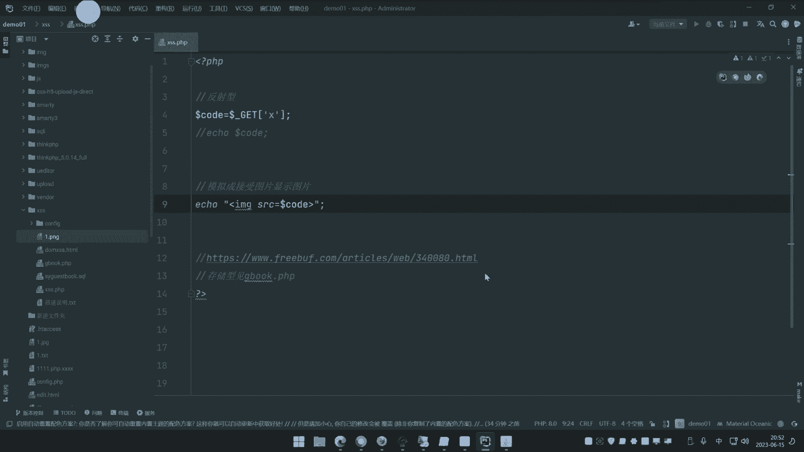

好，我们现在呢就给大家看一下，这个比较额三个案例啊。

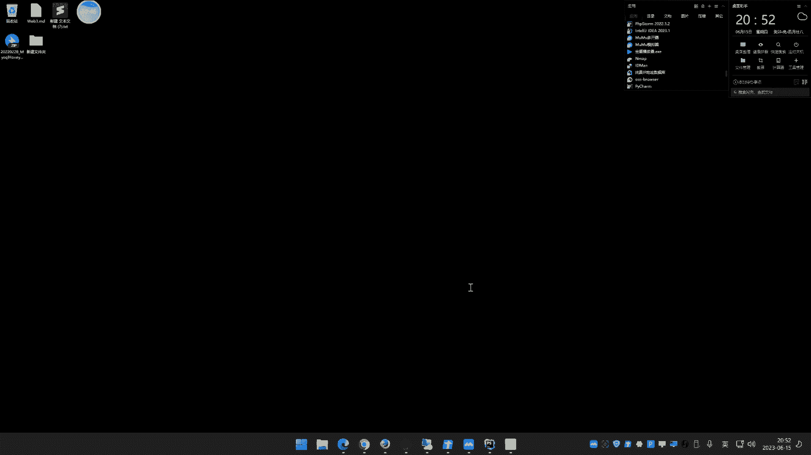

这三个案例呢就是反射性的案例和存储型案例，和这个DMO型案例，通过这三个案例，你再来去把这个三个分类呢搞清楚，和他的一个简单的一个实战中的应用的思路啊，你就知道了，我们先看一下一个老演员的一个案例啊。

我这里呢没有用靶场给他演演演练啊，就是因为靶场面没有什么实际说服力，我们都是在网上找的一个三个啊，当然这个都是，那这个是一个很简单的，他那个比较鸡肋。

但是呢对于我们研究发展呢非常有作用，这个呢是一个网址，这个网址呢是一个接收用户的一个信息的，一个网址，就大家都知道网上那经常有一些接口啊，就你访问它呢，它会让判例呢，比如说我IP地址它要判断出来了。

我连外星信息啊等这种信息是吧，他都能判出来的，对不对，你看他这里呢就结束了是吗，判断出了我那个浏览器的欣喜，那么很简单就是一个数据包的问题嘛，哎你这里的，它这个这个过程就符合一个输入和输出啊。

你只要搞清楚夸张这个漏洞的一个原理，就是输入和输出，输出是把你用户的信息输出到页面中，输入就是你自己访问，或者说你修改某东西输入的，你只要了解每一个漏洞的核心产生的根本。

你再去想怎么去找这个漏洞就非常简单了，一直会问说怎么去找这个漏洞，就是因为你不了解它的根本，这个跨境漏洞的根本，就不是输入和输出的问题吗，你可能说这哪里有输出啊，这不就访问网站在哪里有输出啊。

你看输出是什么，他这里有显示你浏览器的信息，有显示你的IP，这个浏览信息不是你放网站自带的吗，如果你尝试性把你浏览器改成一个夸赞语句，让他在这里输出，这不就符合一个夸赞漏洞产生的根本吗，是不是这个道理。

大家就会这样去想这个事情，那你觉得宽容该怎么去查找他呢，就是找你访问这个网站，不管是你有没有带数据，因为你访问它本身就带数据，只这个数据呢不是在这个浏览器上面，也不是在你提交信息上面，是在你本身的包里。

所以我这里呢也给大家看到了啊，他这里康数据交互的地方，get上面带数据，post带数据或者文件，这个数据包的头里面也带了是吧，像这种地方都是他测这个漏洞的地方，那你看这里啊，我们访问它。

然后你跟人说这怎么测呀，来给大家看一下啊，我正在用这个自带浏览器给他看看，然后我去抓个包，然后房子网站啊，好的数据包是吧，你看这里是不是访问这个网站的时候，自带一个数据包，这里有UI啊，你看着啊。

我就把这个信息的给写上去是吧，这个跨成语代码写上去，然后呢，我前面最好把它进行一个对吧，分割一下，避免说是我没有写，那是我后面再写上个DDD好吧，大家看着啊，来看着啊，把它放出去啊。

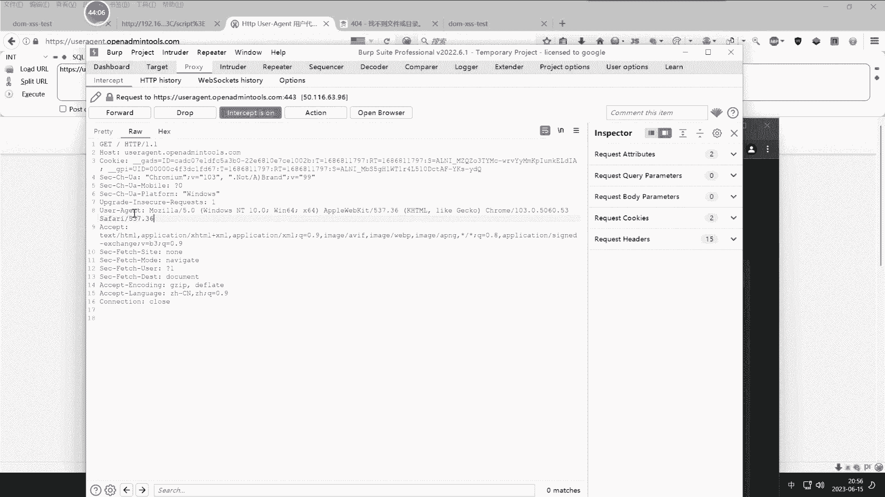

你看啊，余位信息我把它修改，我要一放出去，好开网的。

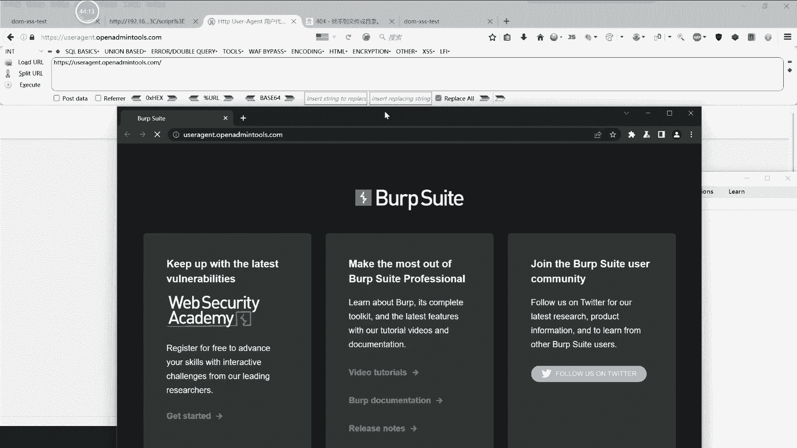

你看弹窗，看到没了，网子弹窗再看信息，那是接收到我这个信息了，这个就是个典型的反射性夸张指数，它非常鸡肋，鸡肋是你要修改这个UA信息差才能触发你，实战中你怎么让对方去触发这个UA信息，肯定不现实啊。

对不对，我只是说这是个典型的反射性发展算的，这是看不到的，这个什么数据的接收，就是他这个书炉呢在浏览器这个网上面看不到，但实际上呢他有接受有输出，所以早发展漏洞这种反射性这种啊，这种漏洞的话。

最核心的就是要观察页面输入的数据，是不是你能控制的，能理解了吧，就说他页面中不输这些数据吗，这数据你能不能控制它呀，该怎么控制它呀，然后你尝试性把那个控制的数据，改成一个JS代码放出去。

看他解不解析值不执行，如果他不解析不执行，你就要分析是没有闭合呢，还是说他有过滤，那你看就很简单的，比如说现在假如他不能执行是吧，是什么原因，我也找到这里，我就可以把这里的选中查看元素。

我要观察这里看这个代码，这里呀是什么原因，那你一看啊，好这是我的代码诶，下载来为什么是script语句不能执行啊，是不是前面有过滤，那么你就分析这里啊，看他这个script要写到哪里啊。

如果说他不能执行，你就分析这里啊，他写到哪个地方，是不是要把它进行闭合，就按照那个文章呢选择性的哪些东西呢去闭合，怎么样啊，实施后期后期的操作，但是由于这里让他能执行，那我就不管对不对。

那我们就不需要管，就说能够执行，所以他的流程是大概是这么一个逻辑啊，是这么个逻辑，你看这里他为什么能执行呢，因为这里呢你看啊看这个地方，你看，他写到这个地方来，所以只能执行刚才能执行的不是这个地方啊。

这个地方把它当做字符串，你看到我的SCODE写到这个什么冒号里面去了，写在冒号里面去，当组织不穿的，它没有任何作用了，他就只在这里显示，你看这个是把执行了，那单独在这来了，所以他能执行成功，知道吧。

大家说不能执行成功，你就看这个数据写到哪里去了，是不是前面有这个闭合呀，有这种符号干扰啊等等一些情况，你有选择性的和那个SQL语句一样啊，把它进行这个啊闭合呀，把它释放出来，所以说把这个一看。

你觉得我如果说要闭合，它要把它释放出来，这个核心的机能属于什么技能呢，是不是就是JS的开发技能了，拿那个开发科伤不伤，有没有用呢，这个课很显然这是事情嘛是吧，你连这个借代码看都看不明白。

或者说你压根就没写过，都不知道是啥玩意，你怎么闭合，闭合个鬼呀，闭合，闭合啥意思啊，闭合的意思就是让前和那个什么符号啊，那些东西进行一对一的关系呀，你前面写个双引号，后面每一个双引号，那它是啥玩意呢。

你代码都写了，全部选到双引号去了，不就都是一个字符串的吗，只要了解啊，这个漏洞选好之后，你选好一个漏洞，那你再看下一个漏洞，它都会有相似的地方的，你知道吧，都会有相似的地方的好，这个是反思性夸张啊。

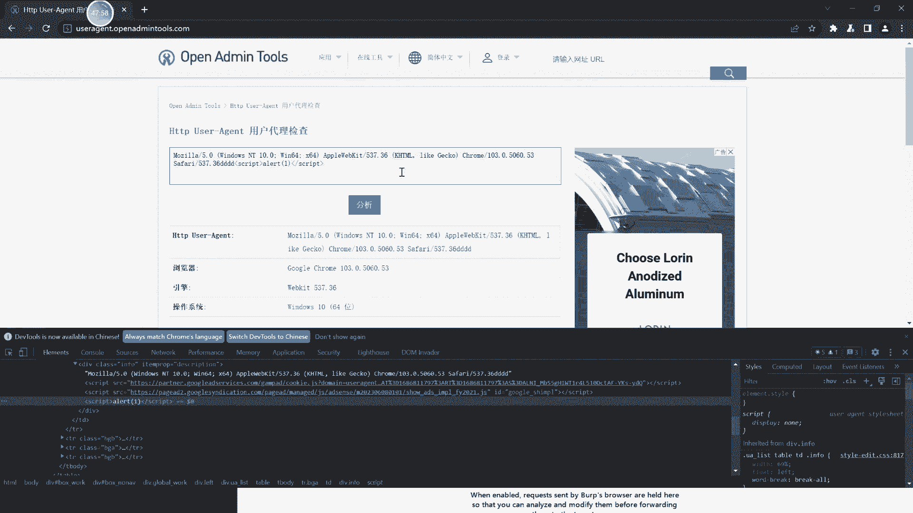

其实网上很多啊，不是说只有这一个，我以前呢都是讲那个本地的八场给他讲。

后面呢大家也不想看啊。

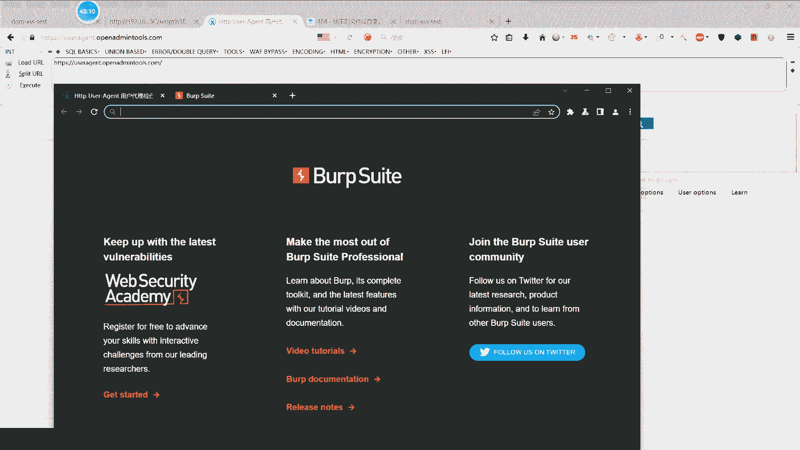

看现在也很低端，但事实上那种本地靶场呢更好理解一些，像这种的还不不复杂一些。

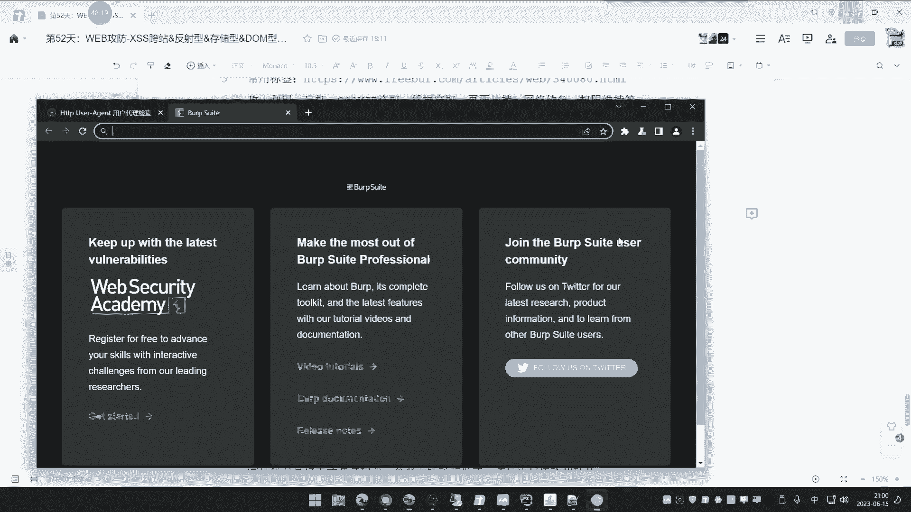

为什么要加DDD哈哈哈，这里面的哇真是这我没话说了哈，那我就拿个很简单的例子啊，那我们把网上我自己博客打开，你说这个你说这个博客里面我要测夸赞，我会测哪个地方，我打开页面看吗，显然不是啊。

你竟然想到你用户输的地方，你看这个搜索，你比如说我搜个一哦，我设个一，它就会显示这个仪的内容，那么很简单的道理嘛，你把搜索个script，那不就显示script吗，对吧，就说你输这个一。

它要在页面中去显示它，这就符合一个发展的逻辑呀，对不对，你不要说哎呀，我点击新闻这个新闻你看有什么用呢，你点击这个新闻你看有什么用呢，你点击这个新闻点开有啥用啊。

点开里面东西，这内容固定好的，你怎么去让他去那个呢。

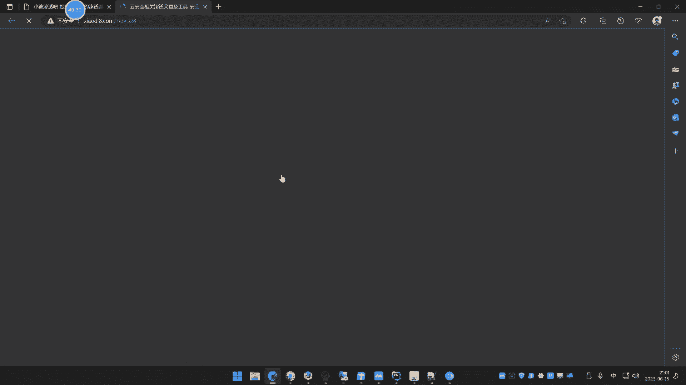

是不是啊，这第一个地方这里可以测一下搜索原理是吧，还有个地方呢在评论区不是也是吗，搜索地方测反射型，评论区测存储性，因为我把框进局写到这个存储这个地方来，那有人呢访问这个页面哎，就执行了。

我这个评论的这个跨代码是不是好理解吧，那至于有没有，那是另外一回事啊，因为他说不定对你这个接收数据再进行了过滤，或者说一些这个防护啊，那就没有了，然后在我刚才说的这个例子里面，啊啊你就像很简单的道理。

你看我我给他测一下来，我说我写个script是吧，我我写这东西，我我看他能不能这个操作出来，对不对，你看啊，我搜这个框代码，我把它写进去，我搜，你看这里变成了arctic1了，受结果为空。

然后你看一下啥情况，阿克tic的确是有script的。

咋没有了呀，过滤了呀，能理解吧，这就是有过滤的那把school都不给给干没了，干没了，干没了就想想想办法去绕过来，绕过的鸟就存在绕过不了，那就是GG嘛，就这么简单的事情呀，是不是你要观察下来啊。

观察这里对不对，你看SCODE没了，变成个rt1了是吧。

那不用斯script的行不行呢，不用squid也可以呀是吧，不用squid，你还还还还有这种这种这种其他的方式啊对吧，你看这像这种啊，这这这种东西都可以进行这个测试呀，对不对，那你就不就不用SC的。

或者说你要硬钢是SC的，你就硬钢不不不硬，刚你就在这里呢，换其他的这种代码区，在这里搜，啊换成启动代码去搜，然后呢一搜，那自动返回首页，那不好意思，有过滤跑路啊。

好这个就是我们说的那个反射型的一个案例啊，接下来呢我们来看存储型案例，存储案例，那是我这里给大家看一下啊，一个小皮面板的一个事情，我先在模拟一下，给大家看一下效果，然后呢我们再给大家去讲啊。

一个小平民版的啊，小米面板是什么呢，就是一个类似宝塔面板的。

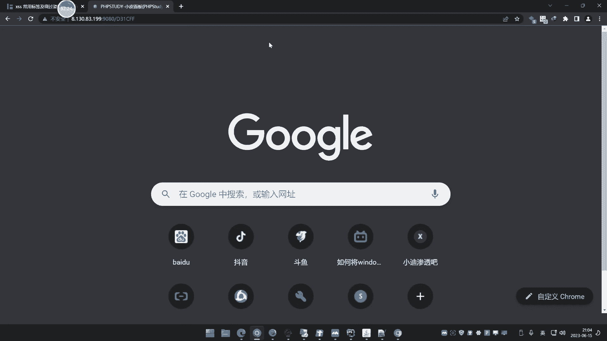

只是宝塔面板没有以前有换漏洞，后面他修复了这个小平面板，他还没有修复，这是一个小平均用户密码，这是个啥情况啊，我先登录进去给他看。

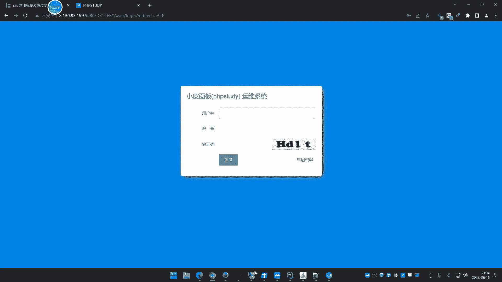

然后呢，那大家呢再去操作啊。

先给他看一下，为什么说他这里有夸张。

先给大家看一下啊，我登录进去啊，这是我小平面板，这是一个控制这个服务器的一些情况的啊，就是用来搭建网站的，我们说的这种服务器类似网站面板啊，这种情况啊，对服务器操作，然后呢这里有个操作，日日大家看到啊。

这日志是干嘛的，是会记录这个你在编码上面那些操作啊，比如说哪个用户的登录成功啊，啊前面的还有用户的名字，这就符合一个跨境漏洞的根本啥情况，大家大家知不知道为什么我登录的是艾德米，它记录了艾德米登录成功。

那我换一句话来说，我把这个用户名改成一个夸赞代码，我登录失败，因为你化成代码，他肯定没有这个用户名嘛，那肯定会登录失败吧，登录失败它会不会记录啊，啊试一下呗，看着啊来看着啊，这边是这个浏览器。

我换一个啊，我重新打开这个面板，这个地址，好需要我登录是吧，我在这里写个什么，把代码代码写进去，弹窗是吧，涵哥，小迪一直K，对吧，弹出这个东西，把用户名写这个密码的随便写，因为我也不知道密码。

我就是随便在这里查查一下好吧，那我点击了提交哎，他说用户名和密码失败，登录失败，因为这肯定登录失败，这用户名哪有这样子的好，那当时这里呢管理员是吧，再看看最近有没有拿个鸟毛，在偷着搞我的日志啊。

偷着这个乱搞我的这个面板是吧，有没有错误操作哎，点一下这个操作时，刷新，诶啥情况，这是谁在登录啊，唉你不要这样搞啊，我先退出一下啊，然后再登录好，重新来一下啊，U k a w，好我们再登录一下看一下啊。

看着啊看卡住日子，哎小李是gay，这谁把写进去了啊，你看那小李是gay，那刚才有人啦，你看你看这里显示代码，这里呢看到没，那刚才有人把它提交进去了，你看那我写的不知道怎么没了啊。

你看只要对方呢去看这个日志的时候呢，就出发了，首页就自动触发了，还不用看日志，那我写的我不知道咋咋回事，没有写进去啊，别人害怕写去了，不知道谁把写进去了，唉我不好说，每次我开个这种线上东西呀。

我说找个东西，这唉就你妹的在上面一直乱搞搞的呀，真是啊，哎，还我是不是不会，他这个有点玄乎啊，他有时候能插进去，有时候不能插进去，但好像和这个验证码逻辑有关系，呐这不是进去了吗，这乙写进去了呀。

这我刚插的呢，那你们都插进去了呢，乙写进去了呀，这又不知道谁查的，这个就是一个典型的存储性发展，对不对，这个就是个典型的存储性夸赞，大家看到了吧，就是因为这个第一方呢就是说这个日志这里啊。

就是说这个功能里面的，它会记录这个用户的登录的这个，这个正确和错误的这个日志，然后呢他会展示这个登录的用户啊，刚好呢我就把这个登录用户呢，改成一个夸赞语句，他就会记住这个跨语句的名字。

而在这里去显示这个名字，而当他去显示的时候呢是吧，页面中就执行了这个代码，典型的这个夸张嘛，而且他又是一个存储的，就是说这个日子呢你如果不把它清除掉，它就会一直存在是吧，就这个意思啊。

所以这是一个纯属性夸赞，对不对，大家能不能理解了呀，那你可能说这有什么作用呢，刚才JS代码被执行了，如果我把那个JS代码它改成一个盗取cooking的，或者说JS页面的配合钓鱼的等等一些方式的。

那么就会进入到下一边，当于GOI呢，那就说等同于我拿到这个小皮面板的控制面板，那面板的控制了，这文件就可以随便上传了，后面就能连上去了，而且能对服务器上面执行一些命令了是吧，数据库的操作啊。

等等一些情况都能进行操作了是吧，就根据你这个面板的功能，来决定后续的操作了啊，好，这个呢，就是我们说的这个存储形发展的一个演示，对不对，成为一夸张演示，好，那么现在呢我们再来进行demo类型的啊。

DOMO类型的，好有些人呢就喜欢搞是吧，老喜欢这个上面搞，我别搞我这个小平民吧。

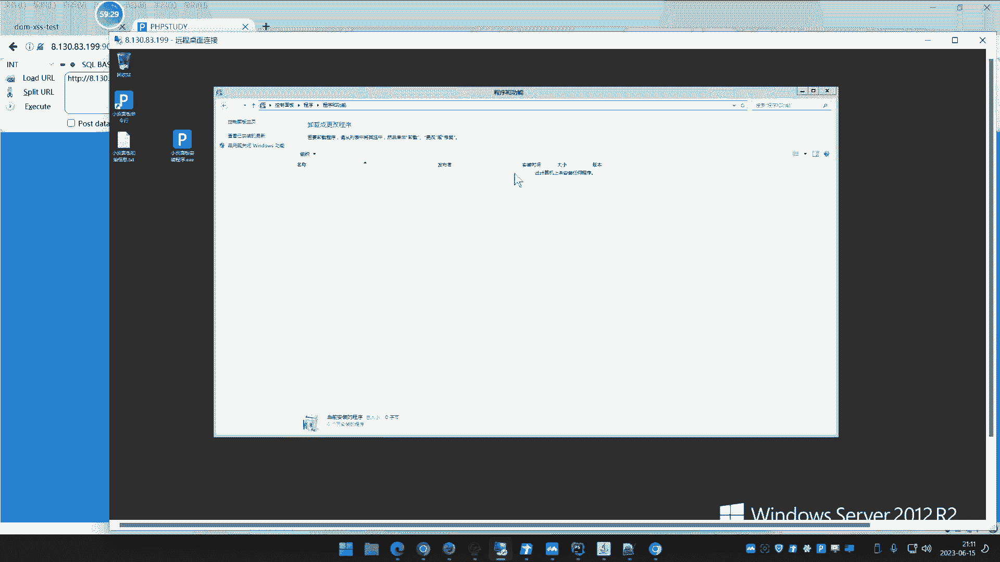

你搞吧搞吧，密码告诉你，你上去鬼捞都行啊，这我自己搭建的是吧，9080的你可能说这有没有什么用武之地的。

下面吧你FOF1搜啊。

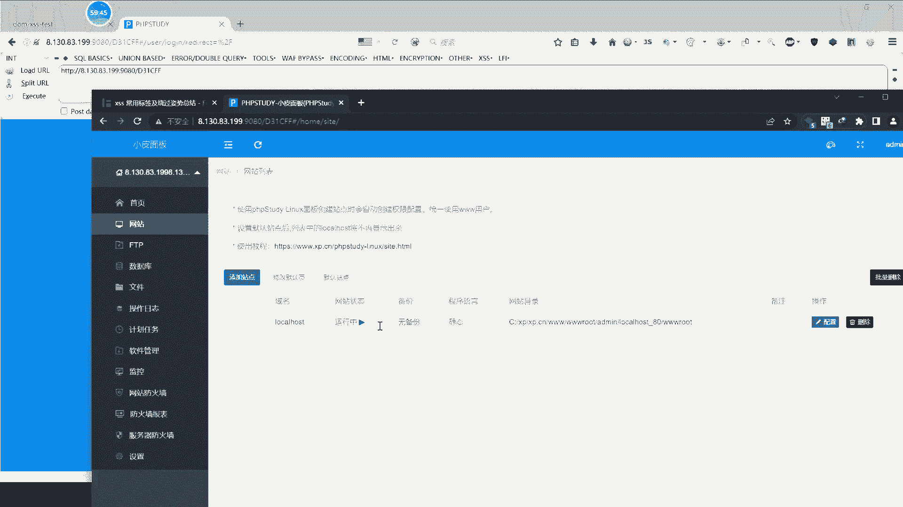

来给他搜一下吧，那这全部是小平面板的了，图标都给你搞出来了啊，这都是网上搭建的小平面板用的小平面板的，那你这个夸张就是可以是吧，玩的呀，但是后续我们不说了呀。

用foo1搜很多小品源码搭建的，好，这个是我们说的那个存储型的，这个这个夸张的演示啊，呃这个反射性和刚才这个存储性两个案例，有没有看明白呀，能不能从这个案例上面区分它的类型呀，可以吧，有区别的哈。

这很简单的一个最大区别就是一个有保存，一个没有保存是吧，那这最大区别是不是，当然你在回合中你是不知道这是什么类型的啊，不过你在恒河中的话，你在测试的时候，那你可以把它先归类，就很简单。

刚才那个用户的那个地方，他要产生这个夸张的话，那肯定就是记录那个用户名嘛，对不对，所以呢黑色中的话要判断的话，需要你自己猜测啊，那如果说从整体上面我们去分析这个流程的话，那是很清楚这个类型的啊。

高了别人报警怎么办，报警就说是隔壁学的呀，这还不明白吗哈，这个我们再来看第三个案例啊，第三个案例是个demo类型的啊。

我先给他看一下啊，豆类型给他随便测几个，大家就能看到这个效果啊，我这里呢给大家看一个有过滤的，和一个没过滤的都给大家看一下，这样子呢会更加的明白这个出路。

我先小开个代理好吧，因为我要上谷歌，那去找一下这个谷歌呢不可描述性啊。

嗯要搞个提子，哎怎么点不了啊，什么鬼啊，哎怎么点不了啊，鬼算了，直接开吧。

大家看一下阿兰，啊再看一下这个地址啊，这里有个地址啊，给大家看一下啊，来我们观察一下这边的一个多么类型的。

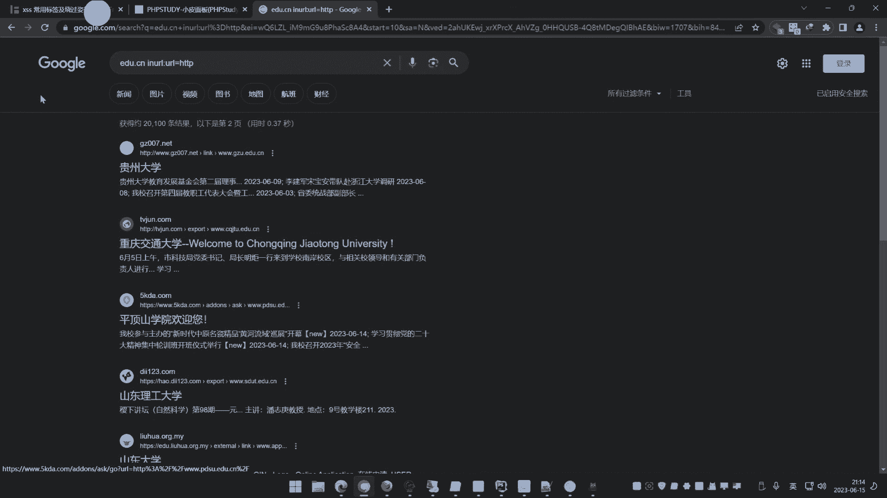

这是个地址，这个地址干嘛的，你看一下啊，我一访问它，它自动跳转到这个地址，这是一个类似的一个跳转对吧，截止这个网站上面，这是个盗墓类型的啊，但你看一下他有没有夸张呢，对不对。

我这里面通过抓包给大家看一下，来这是那个数据包啊，关注一下这里面有没有夸张啊，把数据包呢提到这个膜下面去看看一下啦，这是我们提交信息UR的一个地址信息，然后我们看一下，那这里是显示了这个信息啊。

显示信息你看下面有个代码，这个代码是干嘛的，我们可以给他看一下，这是简单的，那document get取这个表单里面的id进行可理，可啥意思啊，取这个啦，i id那先呢去触发这个A标，这个A的啦。

等它取它，然后进行这个克里可的一个操作，其实就是跳转的一操作，就触发这个地址嘛，这个地址是我们提交的地址，对不对啊，页面中是显示这个信息，显示这个网站啊，我代码中是也显示这个网站诶。

那我这里试着是不是能够尝试进行发展尝试啊，把这个地址给改，改成个script的，它是取的是这个值嘛，在验证中，这里，对我改成东西，大家看一下啊，来进行提交，哎这报错了，报错是什么原因呢。

好我们再看一下啊，下面谈不谈，我写这个等级子上面，写进去之后，你看代码呢出现什么情况了，代码式也写进去了呀，但这里大家有没有发现一个问题啊，我写的这个减号号呢没了呀，而且还有最重要的是。

我这个写作地方到哪里去了，到A标签里面去了，变成了个双引号里面，这不就要闭合，这不就绕过了吗，我先不说这个尖括号的问题，我写了这个A2F里面去之后。

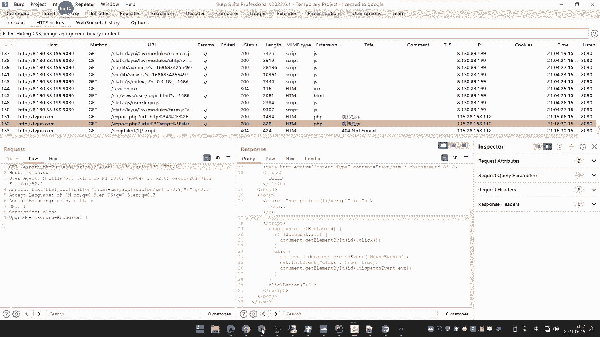

我接下来怎么办，我要把指引出来，把B合掉啊。

该怎么办，前面讲过了吗，来可以用这个script，这里呢把执行出来，那用这个JAVASCRIPT，不用这个括号把它写进去，关一下再进行勾，哎U还是不行还是不行是吧，我们看一下啊，代码，哎什么情况。

刷新一下好不好，看这里看这里呢，你看我写进去之后看代码，那又把这个JavaScript的也把过滤了，看到没，就是这个呢是能够执行出JS代码的，但是它有过滤JAVASCRIPT尖括号，过滤关键字也过滤。

嘶因为他一旦不过滤的话，这里就会执行出来，但是没有执行出来，就这么个情况，有过滤啊是吧，这是有过滤的啊，过滤至于怎么绕，我们先不管它，过再讲就讲多了嗯，再看一个啊，看没有过滤的。

看是不是能够执行一个JS代码。

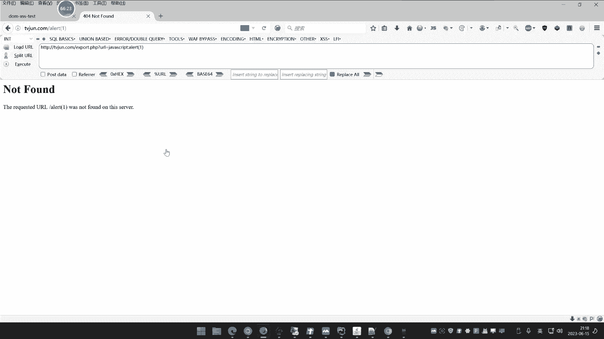

看这个啊，这个例子。

那这个例子的啊，来这是个跳转网址，我先把来换一个网址试一下，3W点小白点com，这是个信息，来跳一下，来八点com，那我刚才看这个了，看这个地址的啊，我把这里改改成个什么，大家看着啊，改成个JS嘛。

点进去诶，报错了啥情况，来我们看一下这个代码呢，看一下啊，那我写到这个上面之后，他为什么报错，看它返回原代码里面，就是看浏览信息是你四错误啊，然后这个代码呢并没有在这个里面产生好，那我就试验一下。

换一个这个其他的地址啊，就换这个正常的AHP啊，写个错误地址试一下啊，先随便写个勾位进去看他的返回，看他这个展示到哪里，我看下代码啊，看代码怎么写的啊，Now we are request。

就是一个创建一个对象，Request get request windows，Now crab，还是指向这个request url的信息，那说解说这个URL信息，那这个request等于request。

这是一个函数，再看上面是不是function request呀，啊这里的接收信息了，那么简单的说就是接受your后面那个值呢，然后进行一个lo windows location。

HR就是个重定向的嘛是吧，那么这里呢我们就知道了，然后我这里换一下，重新加嘛，我就直接让他什么执行JAVASCRIPT，已执行一下A弹窗，那么这个地址再换成你的，后面把它组合成JS的那个代码。

比如盗取cooking的，把这个地址发给别人，说打开看一下，一打开好执行介代码，那第二代码呢具体干嘛，那就是你的事情了，对不对，是吧，就这个意思哈，我们就说了这个情况啊。

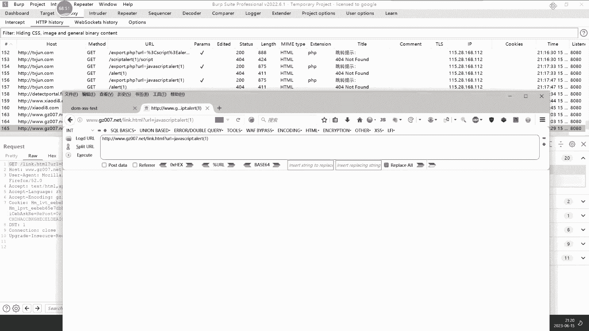

啊我刚才说那个绕过什么东西我不讲啊，有些人说哎呀，是不是不会啊，就是逼我讲，我就是不讲，我就是不会知道吧，东西不能学多一次，不能教多的，你教多你会那个的，你连这个都还没搞清楚，你搞那些干嘛呀。

那不是你现在操心的事情，可要一天天来，你不能说一下子哎呀，我今天伤开心的，我一下子都给你讲了，不行的啊，讲多了不会好，只会坏的啊，最主要是我现在讲的，我下节课讲啥呢，我讲不了了呀。

我的这个就是一个典型的啊，你们刚才有人说哎呀我去交漏洞。

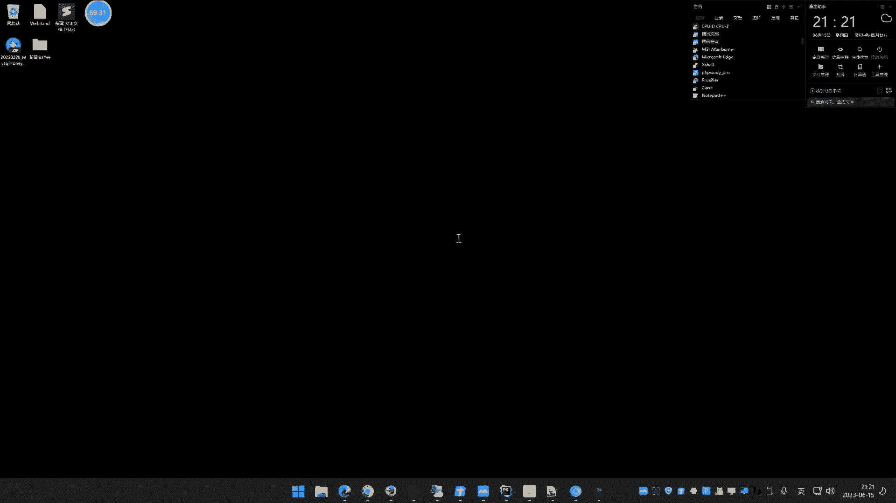

你交吧交吧，那没人收的，这个是简单的这种夸张地位漏洞谁都不会要，除非他明确他搜这个漏洞啊，你存储性漏洞他会收这种东西，他不会收的，XS能不能进行RC1浮现一下，XSS不能执行RC1那种RCE。

是他配合了其他的操作的进行的，不是不是这个通过这个发展，是通过发展呢，再配合其他东西把它配合出来的啊，这个是后续的利用，那不是我们关心的问题，我们是先呢把这个唉你说的小平，慢慢的网上都搜到那个文章。

那个夸赞什么RCE啊，那个东西，但这个东西呢它是后续利用的文章啊，我们讲的是漏洞，你不要搞错了方向啊，那就这个鬼XSS那个什么，这个RC1什么情况呢，就这里那就我刚浮现的嘛哈，他这里呢写个POC进去。

进去之后呢，把它写进去呢，在这里有个计划任务，这个计划任务是干嘛的呀，啊我们现在没讲嘛，计划任务就是我们在提权里面，在那个里面喜欢讲的是吧，还有权限维持里面的，就等同于呢你上面的加了个计划中。

计划中物呢就是让他再去写个后门啊，这就是那个什么RC1，这哪是夸张引起的呢，这是先通过夸张呀，然后呢拿到这个小平面板的权限之后啊，然后呢做这个事情，而且他是啊不是啊，不是他是用这个呃小平面板。

他非常熟知这个小屏面板的后台功能，然后用这个JS代码呢就写了一个这个东西，这个写东西是干嘛的呢，就是在执行的时候呢去访问这个计划任务，然后呢用计划任务呢去生成一个这个写后门的，一个路径，是这么个情况。

这是需要你了解这个后台这个创建计划任务，那个数据包，你如果说不了解黑盒测试总数，你哪知道这些事情，你看那个代码写的很清楚，去访问这个地址啊，这个test list就是计划任务的嘛。

然后在这里呢去呢去写入数据，那么就等同于呢对方呢在触发的时候呢，不小心触发这个数据包，就用别人的权限呢，去把这个什么计划任务创建一个啊，就这么一个逻辑，这哪是什么啊，XSS这个RC1呢。

是因为呀他知道这个后台面板的一些那种，创建计划任务的那个数据包，用JS呢去模拟写这么一个数据包的JS文件，然后呢去在让对方执行JS代码的时候呢，把这个JS你给他执行，就等同于呢用管理员自己的权限呢。

去触发了一次创建计划任务部的数据包，是这么一个逻辑，所以它的核心啊，你要玩的高端，玩的宣，就是需要你有代码能力呀，如果说在黑盒中，你不知道这个面板的数据包，那就只能是吧。

先打到这个后台里面去再做这个事情，对不对，所以那个XS是引发这种RCE，只是表面看上去牛逼死了，其实呢他和这个差S没关系，对不对，这就是经常网上你看到一些文章一样的，你看上去那牛逼死了，对不对。

其实没啥用，你看的那个漏洞，那和他压根就不是一个东西，只是说他在这上面，思路上面的去利用那些这个技巧，核心呢不是这个漏洞，核心的是他能创建这个RCE的核心，是他了解这个创建计划任务那个数据包。

老人用代码把它写出来了啊，你会写代码，你知道这个数据包你也能做，这和这个XS是有什么问关系吗，没有关系，那换个人也能洗，好这个是我们啊今年内容啊，这个三个类型的夸张呢啊就给大家讲到这里了。

然后呢还有时间呢，我先再来给大家说一下，关于这个夸张的一个漏洞产生的第一方啊，啧刚才测了一下的，大家都知道了啊，其实这个上面写的这种数据交互的地方啊，啊你能自己想一大堆，我只写了几个，它最核心的点。

就是你要明白这个夸赞它的原理原理，那就是我说的就是输出，你先看输出再来念一下输入，记住这个流程就是看页面显示和它的反应，有些显示是不在页面中显示，就比那刚才这个啊，这个呢它页面上不显示，对不对。

它不显示的啊，要看这里呢它不显示呢，它并没有显示个JavaScript art1，他在这里没有显示，但他咋个执行呢，就是因为它JS代码那对它进行处理，那这个是多么性的呢，它结束之后呢把你跳转。

然后跳转里面，那要去执行它是吧，什么样的逻辑，它并没有在这里显示，有些呢显示呢你还要看这个功能啊，还要看这个代码通过这个输入的数据，你大家想想这数据你能不能控制它，在哪里控制它。

然后呢就更改那个输入的数据，把它更改成JS的常见代码，然后呢再让它显示，如果他能执行出这个JS本身的效果，那就是夸赞执行不出来，你就要分析他是不是被闭合掉了，是不是被过滤掉了，然后有闭合就绕闭合。

有这个过滤就绕过滤，能招就有，不能捞就没用，能不能逻这个逻辑能不能搞清楚啊，这个逻辑能不能搞清楚，这就是这个夸赞的核心部分啊，你只要先把这个逻辑搞清楚了，后续的利用呢，那是后续这个玩法的介绍。

那不是你现在担心的事情啊，对不对。

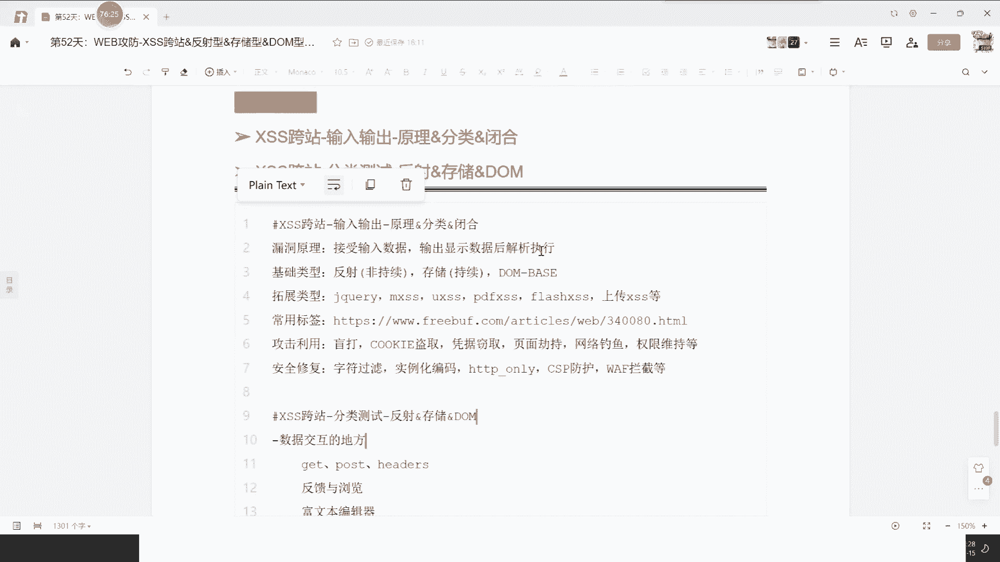

然后关于这个B和这方面呢，我也给到一个文章了是吧。

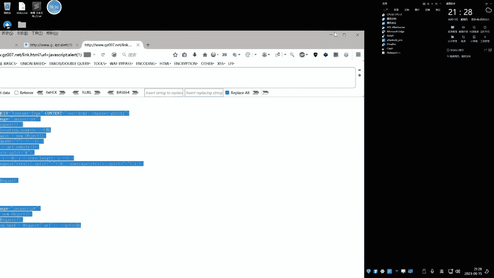

就是你看一下，你这个代码呢是写到这个哪个地方呢，写到A标签里面呢，in mage标签呢还是这个标签是吧，哪个标签呢它都都有一些写的嘶，然后呢后面呢他这里呢还有一些绕过，但实话实说啊。

额如果说你真正在实战中碰上了这个过滤的话，80%是绕过不了的，他这个绕过呢都是一些，就是一些碰运气的吧，为什么这样说啊，因为哪怕是对方呢，他写了一个过滤到里面去的话，基本上过滤是很严谨的。

就说你除非是碰上那种是吧，那半吊子他这里那就随便写了一下，大部分如果说对方有意在过滤这个XSS的话，基本上是很难去捞过的啊，一般主要就是说去闭合多一些啊，他有过滤的话，大部分都照顾不了。

所以一般我们碰上这个过滤的话啊，你测一下不能绕，过过去就酸了啊，就不用测了，但这个闭合呢没有绕没有没有绕，没有过滤的话啊，你就测这个闭合啊，你不要把这两个搞一码事情啊，闭合是闭合，过滤是过滤。

我刚才给大家看到的那个案例，就这个案例嘛，那就这个案例，这个案例呢就是两个都有，一个是我输入JAVASCRIPT的arctic1，它在这里呢只显示arctic1JAVASCRIPT没了，说明这里有过滤。

把这个加速柜的过滤毛过滤没了，这是过滤，闭合是什么呢，闭合就是说即使这里按这个你把代码写到这里，他有可能呢也执行不出来，原因就是因为呢，你写的数据呢在这个双引号里面，或者说在这个A标签里面。

你需要在这个A标签里面执行JS代码，就要参考下这种类似的啊，这种类似的能理解吧。

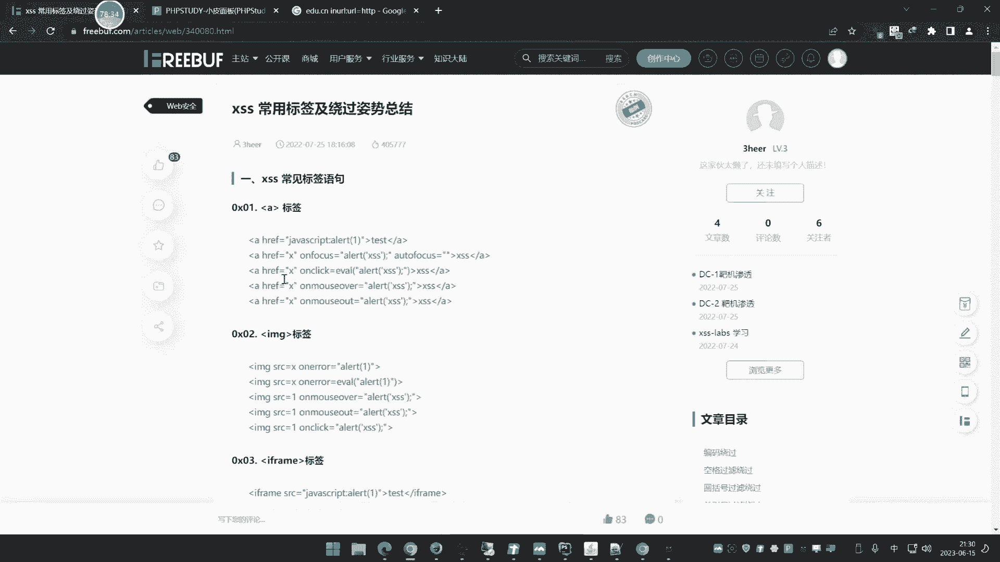

就说啊像这种类似的，它就能自行出来，就像我刚才做这个案例演示的时候，我为什么是吧，把这个变量呢写到这个什么里面，SRC里面你直接写script的art1。

它不能执行算哎我后面呢就换了种写法，就换了种这种写法是吧，它就能自行算，所以啊你要明确知道他怎么执行这个JS，所以这个案例呢它是两个都有，又有过滤，又有这个前面这个东西的标签的这个影响，能理解吧。

那么如果说他这里没有过滤的话，那么你只需要在这呢写成JavaScript art1，他就能执行这个代码，然后把ARTIC给他改成你要攻击的啊，就是你那个比如说你要进行这个，盗取cookie的那个介代码。

或者说你要搞什么事情的介代码，改成那个就可以了啊，把RT给替换，形成你自己想要的这个测试代码就行啊，咳但是很显然啊，他这里呢有过滤，导致个JASCRIPT的没了，所以效果也就执行不出来了，你就要绕过它。

但实实话实说，这个是很难绕过的啊，很难绕过的，因为对方一旦考虑到这个过滤的话，过滤这个XS的攻击的话，大部分的情况下网上的都有很完善的方案，套一下就能形成就形成阻止，嗯啊这是我们说的这个事情啊。

大家能不能明确啊，啊把它写到这个笔记里面去压一下啊，就在这个前提，金庸这里啊，流程呢呃，它的流程呢就是先呢看输出啊，想输入在哪里，然后呢想到这里之后呢，更改这个数组啊，去这个看看执行执行呢有两个效果影。

响一个呢就是我们说的这个，表前啊，还有个呢就是我们说的过滤器，对不对，看执行这个执行的这个结果啊，有这个决定，有这两个决定，主要这句话啊，那么后续呢更改这个输入，就是我们说的这个攻击效果啊。

这个输入的就是代表这个你要做什么事情啊，做什么事情呢，就更改什么输入的代码，好这个就是我们今天的内容啊，给大家也总结了一下，看看大家有没有什么问题啊，有问题就问啊，然后下节课上什么内容呢，就是往下进行。

就是像这个拓展类型啊，啊不是说我一节课呢想上少一点呢，或者说这个休息一下啊，这个偷懒啊，是这样的啊，这科呢我如果说按着整整两个小时这课上的话，哎那我今天呢就还还可以上个支点，比如我上个接口的。

当时呢我如果说伤这个接口的话，哎他就和这个基本类型，那就有点差不了，你又上基本类型，那又上拓展类型，那我下节课再上的时候，我就上这后面的它就不是一个整集，我就是想买个正经的，刚好够一个课。

这样你理解起来的话，唉你就好总结归类一点，如果说这个课程内容多是吧，我可能就说哎呀上到这个上的，上了个这个快到十点钟，可能都还有一些东西都还没上好，就要讲的非常快，才刚好在两个小时之内能控制住。

把这个内容上完，所以有些坑他他为什么一个小时有些坑呢，他可能一个半小时，有些可能就两个小时还讲不完，就是那个累呢，它比较多啊，你如果说我刚好要把那两个小时课到，补到那个一个小时上面去。

的确是呢课都差不多，但是啊这个科的分类那就不好分了，他是一个个小知识点啊，这样子你好总结一些，他有些人就老记我偷懒，就像今天我备课的时候啊，我05：30我去写这个笔记，有个人呢在这里备注一下，我把删了。

说05：30才备课呀，哎神子尴尬哈，我写笔记就是说课已经备好了，只是把笔记整一下就可以上课了，我我备课是先去把这个实验，这些东西全部做好了，要讲哪些内容安排好了，我再去写这个笔记。

而不是说我笔记一写才开始背啊，想太多了啊，那如果写个笔记就能上课，写个笔记就再来备课，那5年半的肯定时间不够，我写笔记就说明已经磕的差不多了，就只是搞个笔记，把它搞上去就行了啊，因为不备课的话。

翻车的几率太高了，有时候背完课翻车都有时候翻车，对不对，不用解释了，大家都知道你很辛苦，我从来不是说自己辛苦的事情，我给他解释，就是不希望大家认为说是我偷懒，说故意怎么有时候一一次上这个一个小时啊。

一个一个半小时啊是吧，这种情况，哎你又说什么，我就是不会啊，你要这样说，我也没办法，唉你们就喜欢我，越解释就越喜欢，反着说，唉，真是的，没办法，农夫直播一次两三个小时，哼还天天在直播吗。

啊你咋不说隔壁的天天天天都不直播，给你看录像呢，还有人去报名隔壁的什么5000啊，6000啊，甚至1万的课程，一个星期给你直播一次或者两次，还很多都是那种很马虎的去对付你，你是没碰到那种情况。

好看大家有没有什么问题啊，刚才有人说什么不懂这个多么差，SSS不需要懂，你只要知道那个多么XSS呢，是那个JS里面去对那个多么疏的操作，产生的就可以了，什么是demo输呢。

就是我说的对你这个ATM代码中的表单里面的值，标签里面的值做这个处理的，什么意思啊，说白了你不懂多么新的这个夸张，就是因为你没有搞过开发，你搞过开发这个东西是很好理解的，我那个安全开发的时候。

还给他讲过那个多么新的XSSS，一看你就没有听过呀，是不是那这个DOO型的那个那个代码，你看当时这里我还有代码，你没看，这个DMO型的操作，那我可以打开给他看一下JS的DMOATL文件，Normal。

点TEM号，嗯嗯怎么打不开呀，那不是JS里面吗，哎这个是JSDOM01的呀，这打不开了呀，哦写错了，那就是那个那个写的嘛，你看这个图片是吧，我点一下这马还没换，把那个编码改一下啊，唉这个编码算了。

懒得改了啊，这个是那个前期做了个演示的时候啊，这个，操作的一个流程，然后呢给他写的啊，就说呢这个代码中呢有这个这个操作嘛是吧，然后是个什么情况呢，你看啊这个图片当你去触发这个按钮的时候，那触发一个尸检。

这个尸检里面那就是对这个什么，你看啊对这个里面的这个image值呢，把它进行一个设置导致的，然后这个设置呢就假如说这个值呢你能控制它，你说这个词呢等于一个JS代码，然后呢执行夸张啥意思呢。

就说这个demo夸赞漏洞呢就是一些这种JS代码呀，对于这个网页本身的这些文件，里面的这些数据来进行操作，比如说我要操作这个，这是标题把它更改成另外一个数据，然后这个另外一个数据呢是由你能控制它的。

你把它改成一个JS代码，然后呢他去进更改的时候，那就代码就写了这个页面中了，所以导致的夸赞，这能量就是多模型夸张，能不能理解啊，这应该好理解了吧，其实呢那就是对网页内容里面一些这种。

比如说标签的这个内容啊，或者这种id值啊，或者说这个里面这个东西呀，它的参数名字啊，这种标签值啊，这种东西要改啊，他就是对本身这个网页的这种代码要改动它，改它这个里面的东西呀，或者说改这个东西呀。

改这个东西呀，他把取它里面的多么书，把取出来之后进行更改，然后这个东西呢由你来控制所导致的，这种夸张啊，这个就是多模型夸张，那么他是怎么发现的呢，就是在网页打开之后啊。

你可以通过这个审查元素和源代码中来看啊，他有没有这个代码，有没有对这个里面的东西进行更改，而更改的地方呢也能控制它，这是他发现的一个情况啊，所以你看他这个呢就是个典型的呢，就和那个DA差不多嘛，你看。

对这个也是说的很好啊，就是这个德格玛的这点东西，刚才有个人说什么呀，讲这个S飞机差SS，我给他锁一下啊，本来这个课呢我是准备上的，我看到是这个鸟毛说的啊，我不想上，为什么呢，因为这个鸟毛啊。

就是下午说那个什么鬼，05：30才备课呀，就是这个两毛啊，我刚才故意不打他的，我生气呀，我是个记仇的人呐，好不说了啊，大家看有没有问题啊，有问题就问啊，我们就把录像关了，不把录像搞太大了。

下节课的内容也给他说了是吧，你们老说我对不对，说实话我还是比较负责的，为什么这样说呢，我前一阵子不是去四川渠乐堂嘛，对不对，耽搁大家这个三四天的时间，那回来之后我就给他是吧，按时上课，就隔一天30课。

我都不敢拖累，不敢说是什么不上课呀，今天休息一天不敢呐，因为我知道我前面那个给他拖了，我现在不能再拖了，自己家对他负责呀，对不对，我都老在这样想，这么负责的，好老师，你还老说，那说这怎么想的呀，拜拜啊。

我们后天再见啊，后天上下面内容啊，后天的XSS呢，说实话啊就是拓展的XSS，那还是有必要学一下的啊，啊很多那种XS些那种高级玩法，那就在下一课再去讲，今天呢就是先给大家开个门啊。

先了解一下XS的基本概念和它产生的情况，后面呢就是XS那些他的一些这种不常见的，一些法险和一些利用。

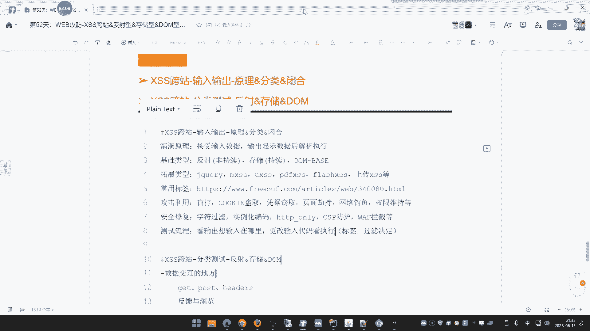

好就说这么多啊。