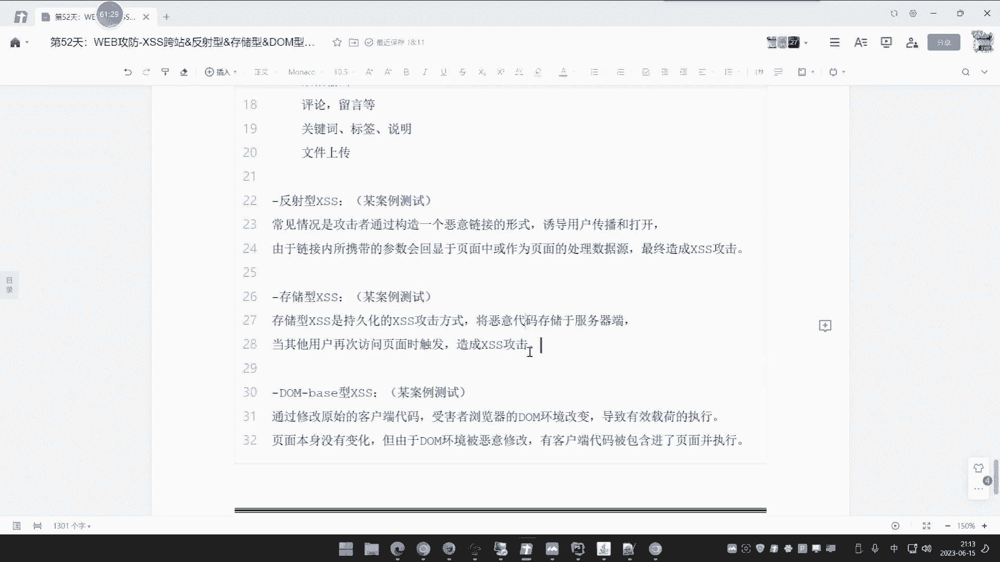
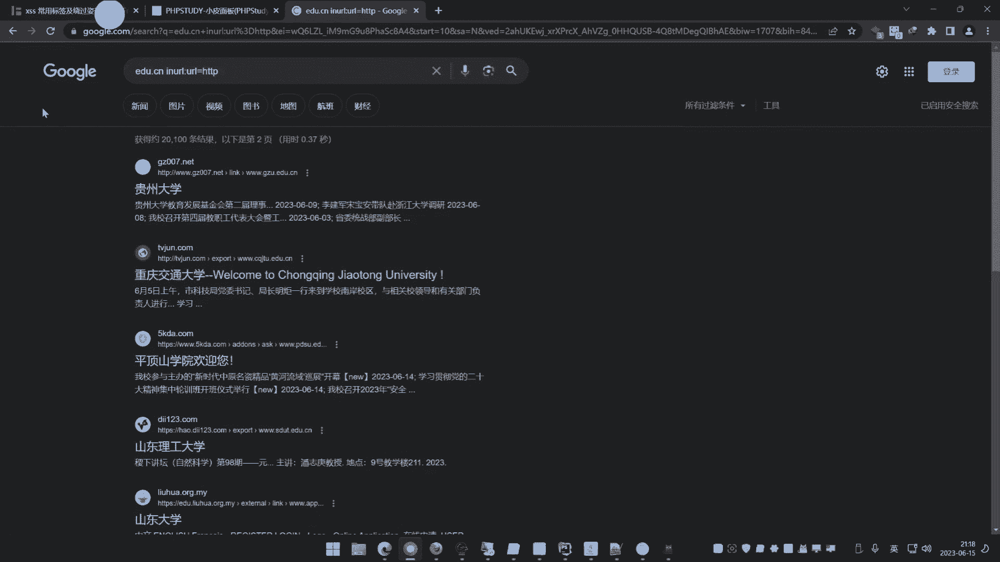

# 🎯 课程P52：XSS漏洞基础类型详解

在本节课中，我们将要学习跨站脚本攻击中最基础的三种类型：反射型XSS、存储型XSS和DOM型XSS。我们将通过原理讲解和实际案例演示，帮助你理解XSS漏洞是如何产生的，以及它们之间的核心区别。


## 📖 概述：什么是XSS漏洞？


XSS漏洞是最容易产生也最容易被忽略的漏洞之一。它通常需要受害者配合触发才能完成攻击，因此有时也被认为比较“鸡肋”。XSS漏洞的本质是攻击者能够在前端页面中注入并执行恶意的JavaScript代码。


**核心原理公式**可以概括为：
`用户输入恶意数据 -> 网站未过滤直接输出 -> 浏览器将输出当作代码解析执行`

这个漏洞并非PHP独有，任何有前端交互的Web应用都可能存在。其攻击效果完全取决于注入的JavaScript代码能做什么。

## 🔍 反射型XSS（非持续性）

上一节我们介绍了XSS的基本概念，本节中我们来看看第一种基础类型——反射型XSS。

反射型XSS，也称为非持续性XSS，其特点是攻击Payload由攻击者构造，并通常通过钓鱼链接等方式诱导受害者点击触发。受害者不访问特定构造的链接，就不会受到攻击。


以下是一个典型的反射型XSS后端代码逻辑：


```php
<?php
$input = $_GET['data']; // 接收用户输入
echo $input; // 未经过滤直接输出
?>
```


当正常访问 `?data=123` 时，页面显示123。但如果访问 `?data=<script>alert(1)</script>`，页面就会执行弹窗。攻击者需要将包含恶意代码的URL发送给受害者，诱使其点击。


**攻击流程**：
1.  攻击者发现存在反射型XSS的参数。
2.  构造包含恶意JS代码的URL。
3.  通过邮件、社交软件等渠道将URL发送给受害者。
4.  受害者点击链接，恶意代码在其浏览器中执行。


由于其需要诱导点击，且可能受浏览器安全策略阻挡，在实战中危害评级往往较低。


## 💾 存储型XSS（持续性）


理解了需要“诱导触发”的反射型XSS后，本节我们来看危害性更大的存储型XSS。


存储型XSS，也称为持续性XSS。与反射型不同，攻击者将恶意代码提交到网站服务器并保存下来（如数据库）。此后，任何访问到该数据页面的用户都会自动触发恶意代码，无需再次诱导。


常见的出现场景有：网站留言板、评论區、用户昵称、日志记录等任何支持用户输入并展示的功能点。


**攻击流程**：
1.  攻击者在存在漏洞的输入点（如评论框）提交恶意JS代码。
2.  网站后端将这段代码存入数据库。
3.  当其他用户或管理员浏览包含此评论的页面时，恶意代码自动在其浏览器中执行。
4.  攻击持续有效，直到该条恶意数据被删除。


由于其攻击的被动触发和持久性，存储型XSS的危害性远高于反射型，是漏洞测试和SRC平台关注的重点。


## 🌐 DOM型XSS


前面两种XSS的区分在于数据是否存储，而DOM型XSS的区分在于漏洞产生的具体位置。本节我们来看看基于前端DOM操作的XSS。


DOM型XSS的漏洞成因在于前端JavaScript代码对用户可控的数据进行了不安全的处理。它不涉及与服务器的交互（或交互不是必要环节），恶意代码的组装和执行完全发生在客户端。


以下是一个简单的DOM型XSS示例代码：


```html
<script>
var hash = location.hash; // 获取URL的hash部分，如 #javascript:alert(1)
if(hash){
    window.location.href = hash.substring(1); // 不安全地使用hash值进行跳转
}
</script>
```


当用户访问 `example.html#javascript:alert(1)` 时，`location.hash` 的值为 `#javascript:alert(1)`，经过 `substring(1)` 处理后变成 `javascript:alert(1)`，并赋值给 `window.location.href`，导致JS代码执行。

**核心特点**：
*   **触发位置**：漏洞由前端JS代码对DOM的操作引发。
*   **数据流**：攻击Payload可能来自URL、表单输入、Cookie等，经JS处理后输出到DOM中。
*   **检测难度**：由于数据可能不发送到服务器，纯黑盒测试难以覆盖，常需要代码审计或工具辅助。


## 🛠️ XSS的利用与闭合




在了解了三种基础类型后，我们来看看在实际测试中遇到的一个关键问题：如何让注入的代码成功执行。


在实际网站中，我们的输入往往被嵌入在HTML标签的不同位置。如果直接插入 `<script>alert(1)</script>` 但未被正确解析，就需要考虑“闭合”原有的HTML标签，让我们的代码“逃逸”出来。




以下是几种常见的闭合与利用场景：


*   **输入点在HTML标签属性内**：
    ```html
    
    ```
    注入 `" onerror="alert(1)`，闭合src属性的引号并添加新事件，最终形成：
    ```html
    
    ```

*   **输入点在`<script>`标签变量内**：
    ```javascript
    var data = "用户输入";
    ```
    注入 `";alert(1);//`，闭合字符串和语句，最终形成：
    ```javascript
    var data = "";alert(1);//";
    ```

*   **输入点直接构成新标签**：如果上下文允许，直接注入 `<script>` 或 `` 等标签。


测试时，需要观察页面源代码，确定输入数据被放置在哪个HTML上下文中，然后选择合适的Payload进行闭合和利用。


## 📝 总结

本节课中我们一起学习了跨站脚本攻击的三种基础类型：

1.  **反射型XSS**：攻击Payload在URL中，需要诱导用户点击，非持久化。
2.  **存储型XSS**：攻击Payload存储在服务器，受害者访问即触发，持久化，危害大。
3.  **DOM型XSS**：由前端JavaScript不安全地操作DOM引起，Payload可能不经过服务器。

理解XSS的核心在于抓住 **“输入与输出”** 这个关键点。寻找漏洞时，关注所有用户可控的输入点，并观察这些输入如何被输出到页面中。输出时如果未经过滤或转义，就可能形成XSS漏洞。


虽然基础XSS在实战中可能因触发条件苛刻而显得“鸡肋”，但它是Web安全的基石，也是学习更多高级攻击手法的前提。下节课我们将探讨XSS的拓展类型和高级利用技巧。