# P55：第55天-XSS防御&HttpOnly&CSP&靶场工具等 - 逆风微笑的代码狗 - BV1Mx4y1q7Ny

其实有三个，一般这个XS2的防御的有三块，我们主要呢是讲后面这个最后一块的，这最后一块呢还有一些文章可以做啊，前面这个什么CSP的策略啊，什么h p o only啊，虽然说也能绕过。

也有些绕过的这个手法，但实话实说呢，在实战中呢很难去实现这个logo，因为他的这个条件太多了，而且即使你这个能够绕过呢，也不一定能就能带了啊，带来什么东西，只能说把这个差势利用起来，但是具体成不成功呢。

还是需要看额外的条件，所以说漏洞本来就不是很主动，这个漏洞，然后呢这里还有防护，你自己能不能绕过还是个未知数，所以一般碰上这种策略啊，和这些车子啊，什么a b o only啊，CSP的一些策略呢。

基本上啊这个花字那就不想看了，或者说直接放弃掉了，是这么个情况，那像一些这个过滤器啊，包括一些这个过滤性代码上面，那还是可以尝试性的去简单去突破一下了啊，能突破就可以啊，不能突破就也是一样的道理。

今天呢就是讲这个夸张的一些安全防御手段啊，就是说一个呢是教大家怎么防御他，第二个呢就是对方这样防御呢，你有没有一些相应的方法啊，啊这个题目呢一般在一些代码审计啊，包括CDF的考点里面选。

有些考这种东西啊，然后呢自己呢也是做一个安全修复者呢，去给看一下这个支点，首先我们来看第一个啊，就这三类啊，什么是CSP啊，CSP呢称之为叫content的思维，polar叫内容安全。

这个安全策略这个是啥东西，这个下面的一个简单介绍，哎然后我们这里呢是用到这个pp的，这个里面的设置呢来给给大家去演示，当然这个东西啊你可以用各种语言呢，里面都有相应的这个设置的哈，里面可以自己呢啊。

你就说你用java写的，java里面的也有啊，都有，就是无非就是设置方式不一样，就是如何把它开起来啊，啊，简单来说，就是这个东西开启之后会有哪些影响啊，我们可以看一下啊，就是来实验一下。

实验呢就是开启这个CSP之后啊，这4ST呢就叫内容安全策略嘛，哈那这个开启之后呢，对于我们这个XSS的攻击会有什么影响啊，没有开启呢又有什么影响啊，没有开启，其实就是说啊没有啥隐藏，就和正常一样。

那么现在呢我们来给大家看一下啊，好我们来给大家演示一下啊。

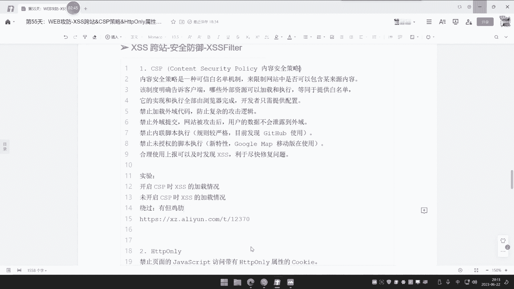

啊我们这里面呢是采用这个pp里面去开启的啊。

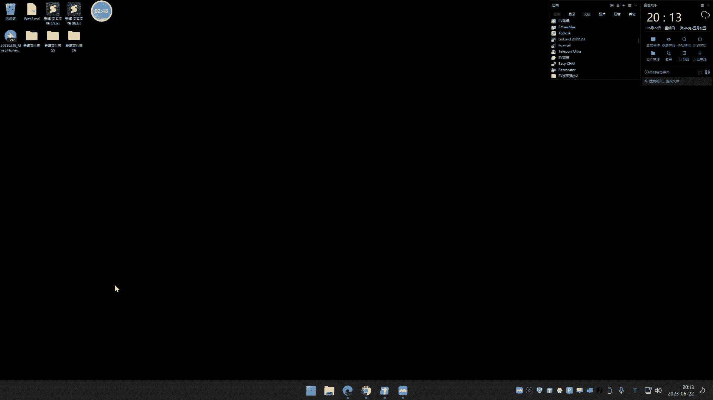

如果说你是其他语言的话啊，像什么java呀那些啊，那开启方法呢基本上都差不多，就是无非在代码中设置个什么东西，开个什么开关就可以了啊，具体呢网上可以搜一下资料，开这个东西啊，好这里呢有个这个代码啊。

我们给大家看一下，来这个代码呢这里有个这个东西的叫做handle，然后一个这个这个设置呢，在主机筒里面那加上这个叫image src，等于SELF，那这个设置的就是只允许加载本地图片。

然后这里呢这个引mage src呢可以更改啊，具体他的一些这个设置的方法流程呢，嗯大家可以参考一下这个文章啊。

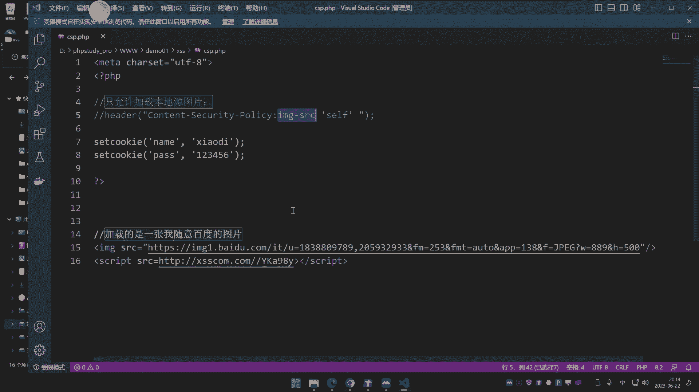

给大家看一下，啊这个没有啊，没有不要紧，等下给大家看啊，我们给他演示一下，大家就知道了啊，给演示一下，啊这是我之前发的那个地址啊，上期课讲的那个地址，我上节课呢在讲的时候呢，有些会讲太明白啊。

这些这些呢我们把它讲明白一些呃，他的一些这个设置，包括下面那些参数。

就说这里是设置什么图片是吧，那像其他的呢有没有现象呢，啊这个这是这设置啊，好我们先给他看一下，他这个就是说正常应用，其实呢他就说不是为防御XSS产生的，它只是一个策略。

但这个策略呢不仅是可以阻止其他方面。

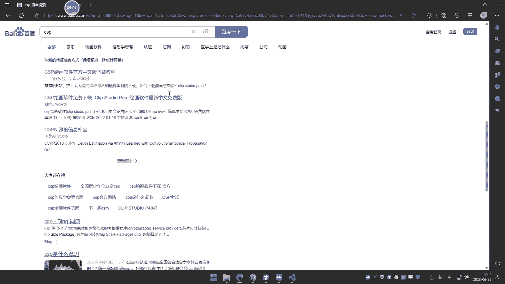

而且呢对于这个XSS呢，也有这个也有这个影响啊，你比如说像现在啊，我们在这里呢给大家试一下啊，比如说我这里呢把它注释掉了，那么就说这里呢他并没有这个启用，就没有启用的情况。

下面啊我们来去看一下这个地址啊，打开给大家看一下。

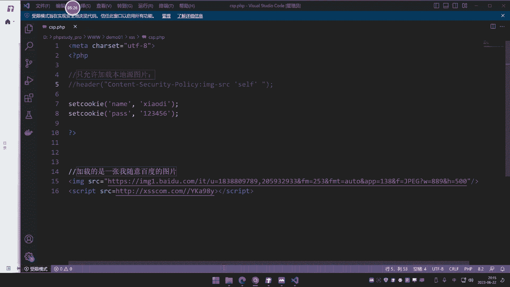

好这里呢是这个CSP0PP看啊，那么大家可以看到啊，这里呢就是加载一个图片。

这个图片是什么呢，你看下去下面的啊，下载这个图片地址，这个图片地址就随便在网上找了一个呢，大家看一下，就这个图片嘛哈是吧，就加载这个图片地址，对不对，加载这个图片地址啊，当他能够加载，对不对好。

但这个时候呢，我把它进行一个什么给他启动起来之后，我们再刷新这个页面。

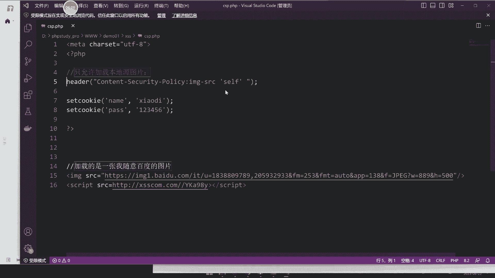

你看他就这里呢呐加载不出来了，你看这个地址是个什么情况呢。

地址呢显示这里有了，但是呢你可以看一下这个右键的网络信息，当他去请求这个地址的时候，你看这个地址呢去请求个地址的时候，你看是一个什么，你看他的一个这个头部啊，行秋这个头部和相应头部。

那它提示一个这个什么形象呢，后面数据包里面啥都没有，直接提示这个什么引用的车辆负载，这边啥都没有，无法加载响应数据，就是说请求不过区啊，请求不过区，这里都直接标红了啊，直接标红了。

这个地址就是页面代码中的，会远程请求这个路径的一个图片嘛。

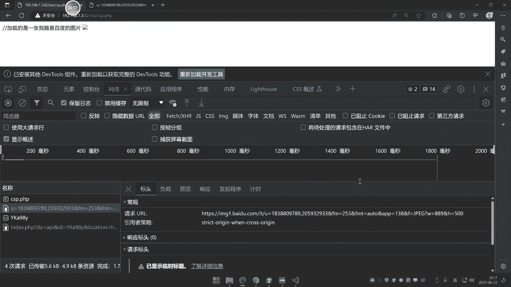

开了这个之后呢，它只允许加载本地图片，就说你下到本地，那就可以加载，比如我们在这里呢写个EMAGEYS2等，等于这个一个本地地址的哈，那么可以随便呢在这里呢找个那个本地地址的。

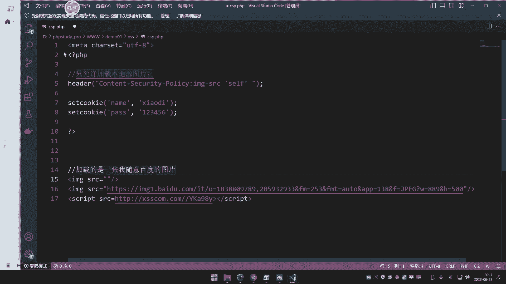

这个哎这里没有图片的，算了啊，那我就懒得演示了，就是你加载本地图片都可以是吧。

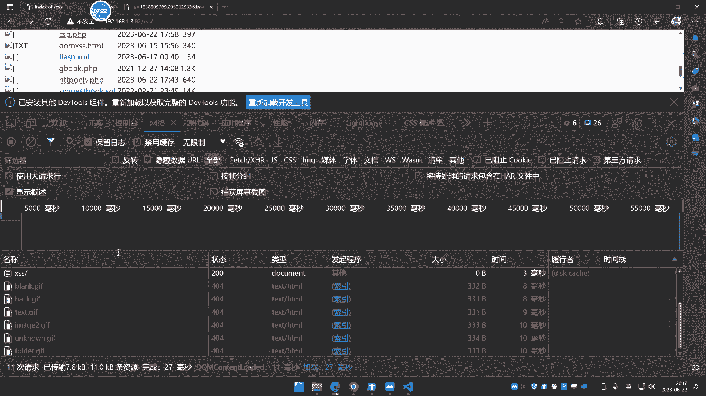

你远程的一个非这个本地的，那么呢这里就首先这个很简单啊，大家可以看到啊，这是他们一个情况好，那么现在呢我们来看一下啊，它针对我们的夸张有什么影响啊，真的很夸张会有什么影响啊，大家看着啊。

那我们就拿这个夸张的这个平台来说。

我们前期还自己搭建过这个什么，搭建过这个发展平台，这里呢我们还是用网上的啊，简单一些吧。

好我们来给看一下啊。

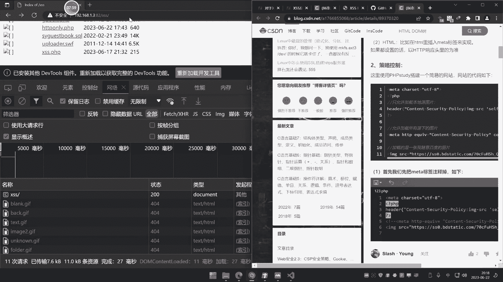

我们在这个前期这个跨境平台上面呢，去获取这个什么cooking啊，这些操作的地方是吧，会有个那个加载的一些代码，对不对，然后呢，我们把这个代码呢给他植入到这个页面中，就说这个页面中去。

如果说有这个执行这个获取cookie的代码的时候，开启CSP和不开启CSP，是不是就会影响这个结果呢。

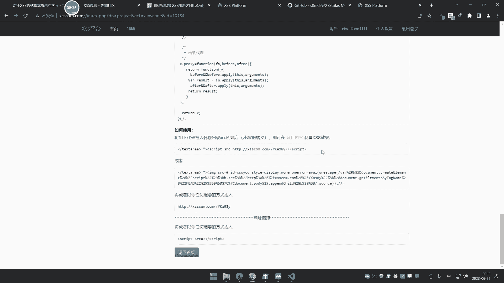

来看一下啊，这个是获取代码是吧，然后呢我放在这里呢，就把这个一替换啊，来这个就是那个加载XSS代码获取cookie的，然后这里呢我设置这个cookie对吧，一个是name，一个是小迪。

内蒙等于小迪pass的123456，这是我设置的cookie，就是看他能不能得到这两个东西嘛，对不对，其实你也不用看的啊，我们可以看一下，再访问一下啊，看一下啊，先访问这个CSP的啊。

现在目前是开启状态，我们来访问一下啊，来这里呢先把网络包给他重新抓一下，看着网络包啊，然后呢我看啊访问他，访问的时候呢，大家看到这边加载图片失败，然后呢地址呢他尝试过什么，尝试过，那访问是OK的。

然后下面这个地址呢请求这个地址的时候呢，他尝试去发送这个COOKIM的name等于小D啊，80的123456，就是这个页面中的这个cookie值嘛。

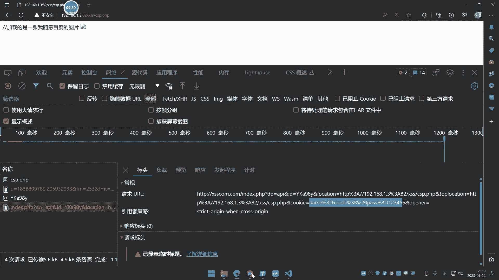

然后呢我们再看这个平台这里啊，看平台这里呐，这是现在是20。20分，最后一次，那是17：59分获取的，并不是没有获取到，对不对好。

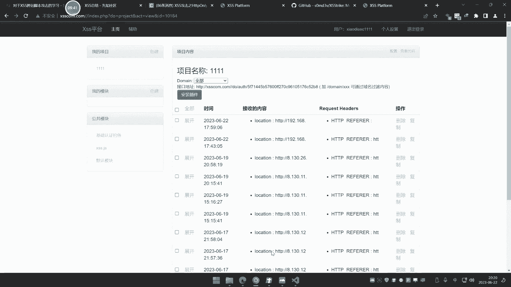

那么现在把它注释掉，把它注释掉，没有这个CSP的策略之后啊，我们再来刷新一下。

好再来刷新，那么现在再来看一下，这边刷新一下这个地方好了。

注释掉之后，看这里有没有获取到了，他获取了啊，只是这里呢有点慢，你看他这个啦。

这是刚才没开的时候，图片正常加载了，然后这个地方呢他也请求了，你看啊他也清楚了，阿尼他已经获取到了啊，只是证明呢他没有结束，没有接收到平台的问题啊。

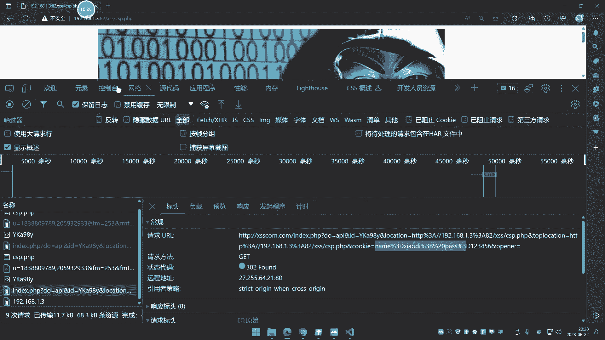

因为你看这个数据包里面那是已经有出现了啊，你这前面的这两个直接标红。

就是他访问的有问题，访问的有问题就没压根就是说数据没有除去啊，这两个都白了，就说明他已经除去了啊，没问题，这是平台自己的问题啊，你不信的话，你给写一个这个接收端也可以是吧，我们可以试着试写一个啊。

给他看一下，免得说偏大家的一个意思，对不对，你比如说这个用这个codile allows点下点东西，还我白起，就是你可以自己呢去写一个这个，让他去触发网址的一个D链接啊。

那平台也是太垃圾了啊，啊他其实是截收到了啊，这个平台他自己访问这个地址。

平台出了问题，你访问一下是不是打不开呀。

果然啊。

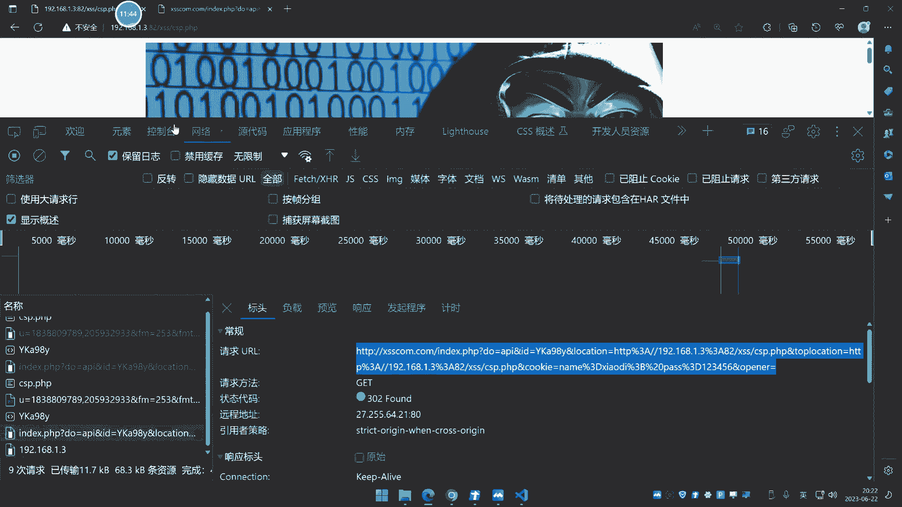

那你看啊，我现在直接访问他都他都没有信息，这就没办法了啊，心态问题啊，嗯因为可以看到啊。

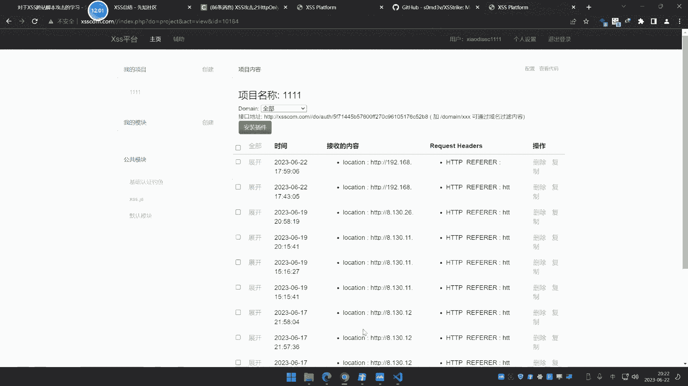

这边他是能够接受到的啊，不新的话，我们可以给大家演示一下这个过程的啊，我们演示一下吧。

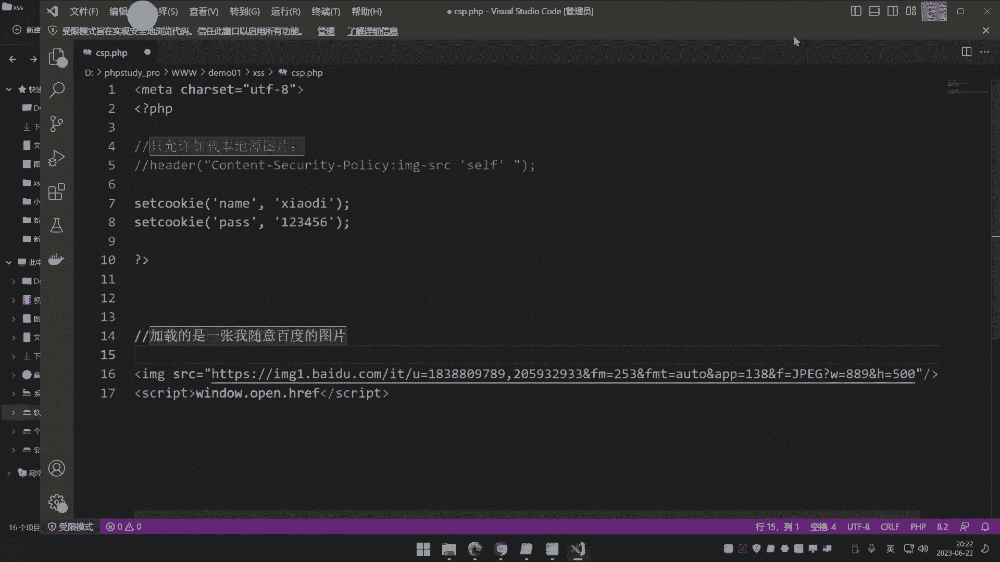

那就前期我们在上节课不是翻了车之后。

要有一个支点的，忘记给他讲了，就说那个接收cookie，我们除了自己搭建平台，用这网上平台还可以自己呢去写这么一个代码，你看我可以自行的去写这个代码。

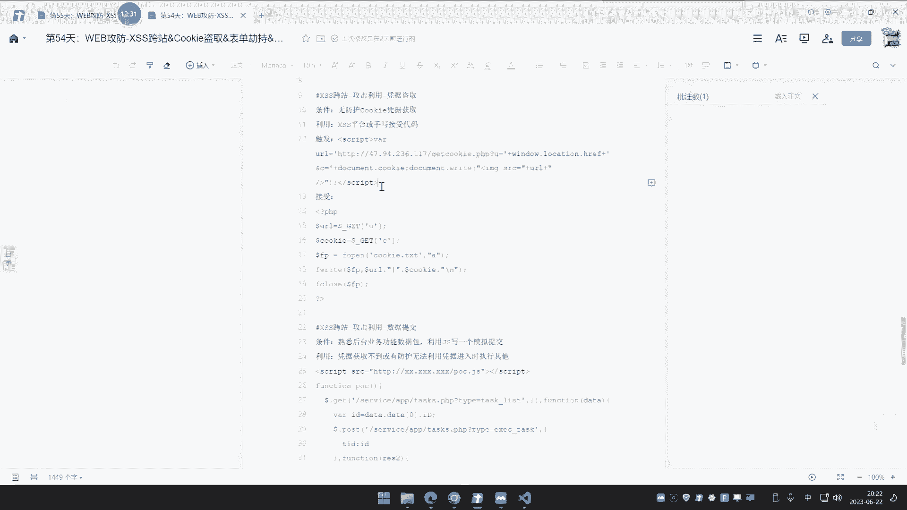

你看这个是一个那个触发XSS的一个代码，他怎么写的呢，你看一下啊啊访问这个请求声明这个地址，然后呢把这个什么windows local h i e f，就是我们的网址。

然后document点cookie，把它获取到什么这个杠C参数后面去啊，这样呢就是获取他的网址信息，上面去获取到这个地方，然后呢用一个网址的去结束它啊。

这是前期我上节课我忘记讲的啊，来简单说一下，就说自己呢去手写一个结束端，和一个这个发送端。

自己那就随便实现这功能，这个呢也比较简单，给他锁一下啊，你先把这个代码呢给拿出来，就在你的网址上面呢，找这个写写个文件啊。

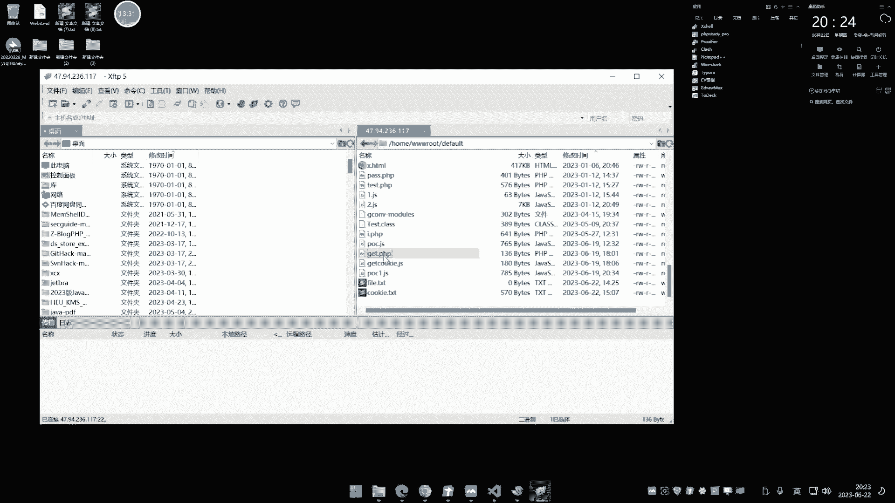

这个就叫get点pp，这文件呢也非常简单，把它拿出来给他看一下。

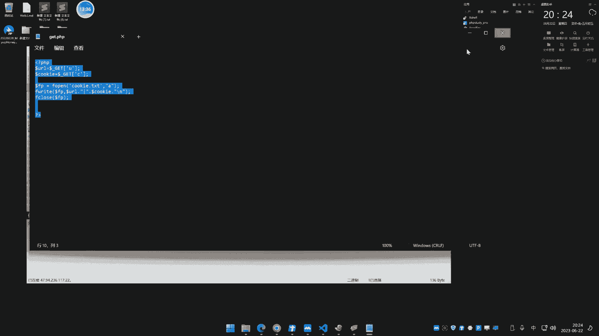

那接收get传数传递过来U然后接收C复制给cookie，打开一个文件叫cooking txt，写入这个URL和这个cookie，就是获取网址和cookie，然后这个王子和coin在JS中如何获取呢。

给大家演示一下，在JS中控制端这里呢你可以输入这个调试信息，Document document，然后点cookie对吧，然后呢他就会获取当前的cookie，你看就获取到了是吧。

还有呢就是windows点什么点，刚才我说的这个open hr不是open啊，是这个什么字啊，windows location啊，Notion，点HREF，那他就可以获取这个网址。

也就是说我们可以用JS呢，用这个参数呢获取当前执行的网址信息，用这个呢JS的语句呢可以获取当前的cookie信息，那么语句就形成这样子的，我把它拿出来给他看一下，分个行给大家看一下啊。

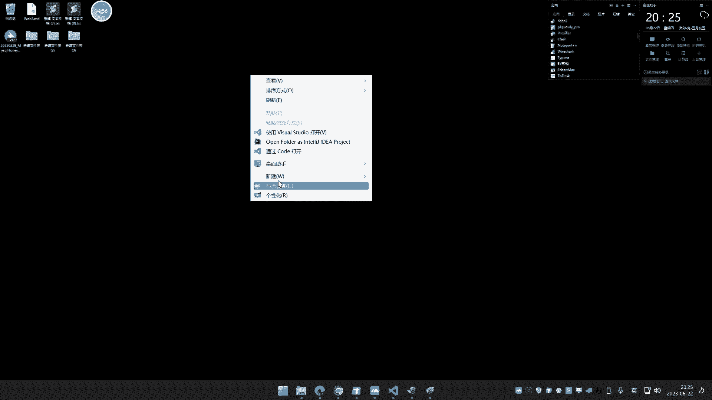

首先声明个URL，二就是我们这个发送给get cooking的U参数给它，用windows的这个什么，第一次这个就是获取它的什么，用JS语句获取它什么，他的高UR信息，C参数给他传递。

获取他的cookie信息，然后呢再把这个又熬又熬的这个什么东西啊，这个这个整个值啊，给他image里面把它输出一下，那么image输出的话就会执行这个语句嘛。

就这个意思啊，这个就是获取cookie的一个触发代码。

然后呢浏览器这边呢，网址上面呢就搭建一个这个get pp来进行结束。

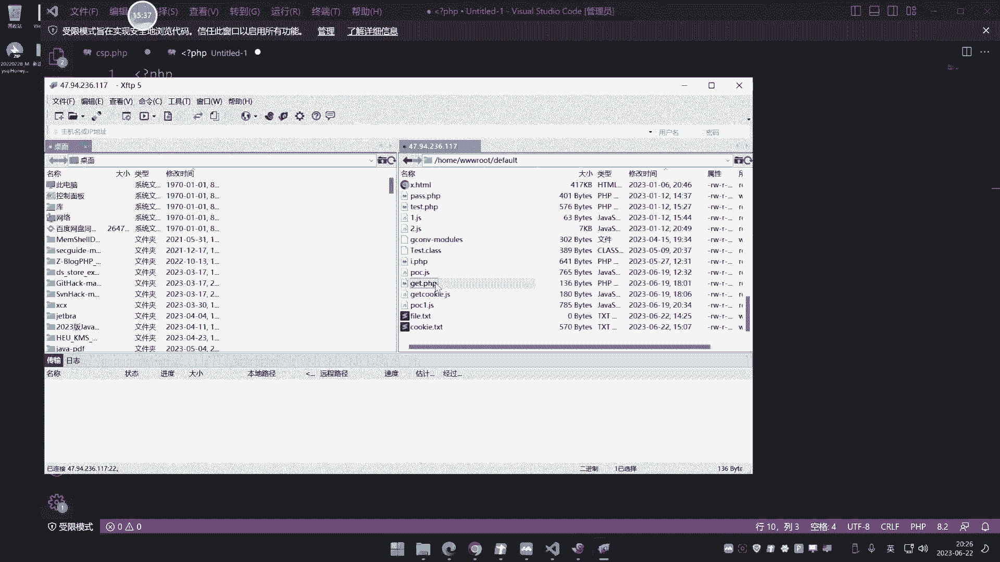

然后呢写成这个地方，我们呢就把它放在这里了啊，解除他的cookie。

你看看能不能解释到这里呢，是cookie t i t是吧，我先把删掉好。

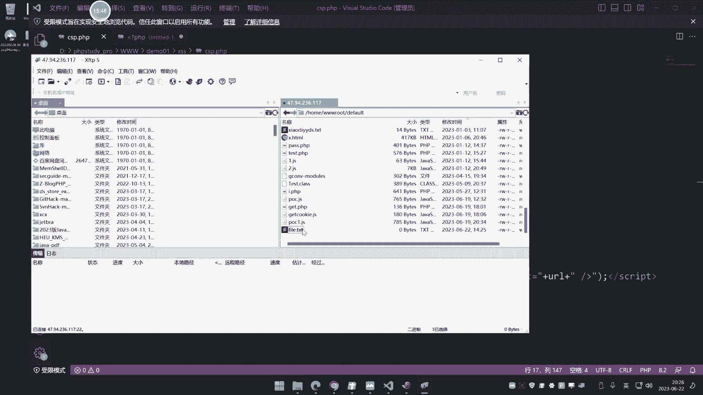

现在呢我们当我们去触发这个网站的时候啊，访问这个网站看一下啊，刷新一下。

先把这个东西都删掉，重新来，该开个监听。

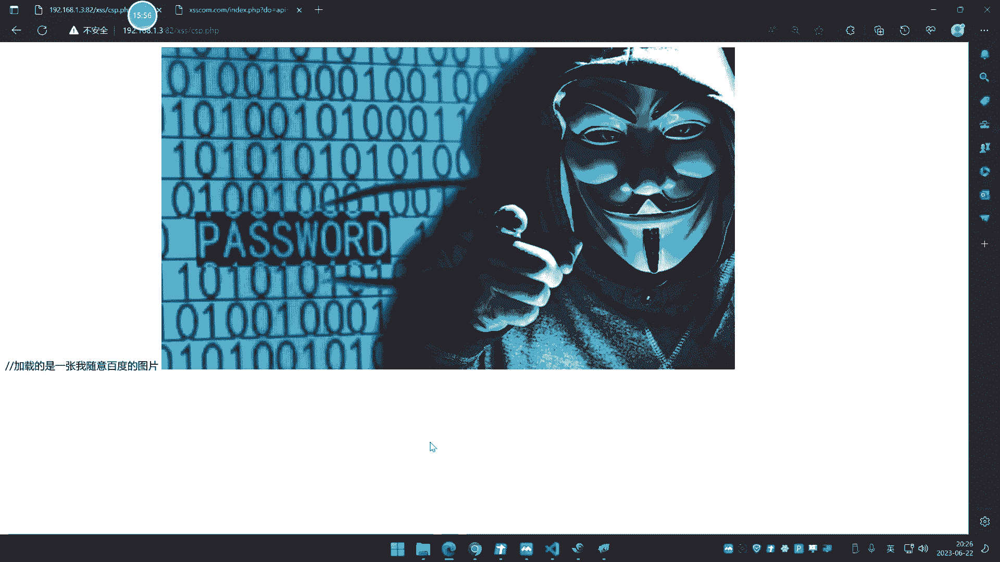

好看一下网络这边啊，好刷新一下的时候啊，你看他去请求这个get get coin。

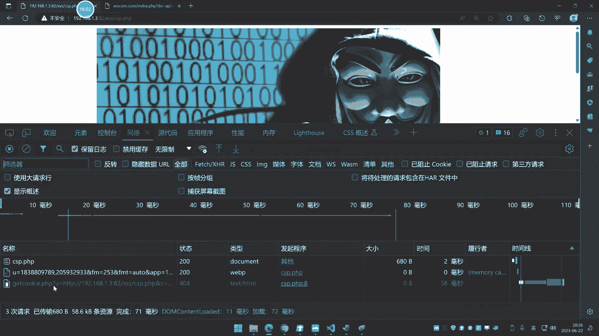

对不对，但这里由于我get coin改了名字，我是get啊。

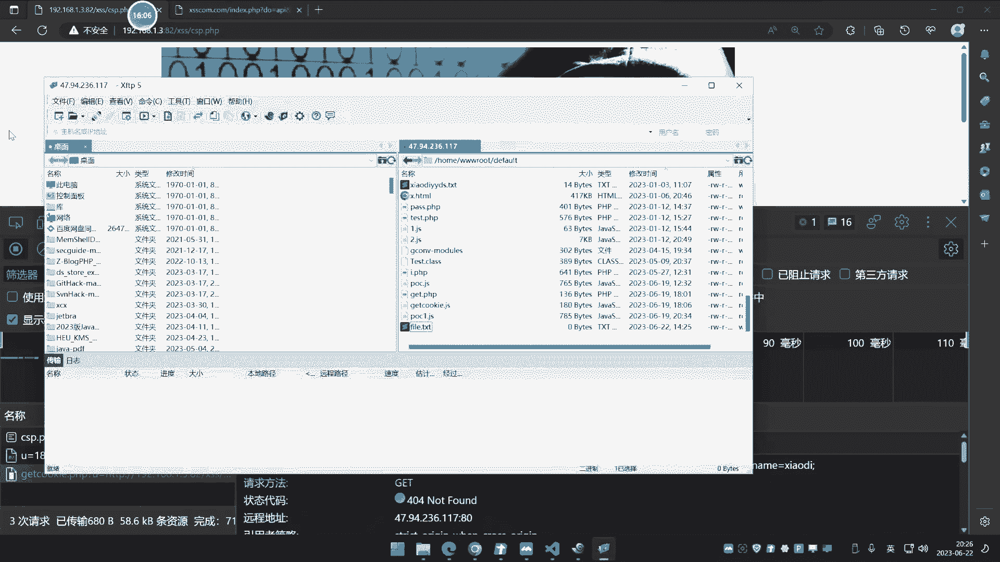

所以JS语句改一下，get好保存，重新再刷新一下，好你看他就会请求一个来get点pp，然后把这个网址信息发送给U参数C信息里面。

就name姆等于小迪，对不对，发过去了啊，你看这边就会产生一个勾引的阶梯是吧。

好就是呢网址信息加上这个什么cookie词，对不对，所以呢他就是那个cookie能获取嘛，他就能获取到了啊，对不对，这个就是那个情况啊，你可能说这里还有什么pasta，123456啊。

这什么情况是这样的啊，这是设置两行，它是以其中的一行的为准，就以上面这行的为准了，下面这行的就没有，你要设置多一点的话，你在上面再加一个啊，这个就是说用自己手工的自己去写这种啊。

获取cookie的这个语句，加上这个结束的一个pp代码去结束它。

这个呢上节课准备讲的啊，上节课临时搞忘记了，给他说一下，来触发了，就这样去触发它，然后呢解说呢用pp呢去接收它，用pp写的啊，就U参数就是C参数，这U参数呢就用JS的这个去获取当前网址。

用这个呢获取到cooking，然后呢，再把这个变量呢给大家输出到这个in majsc，里面，就去加载这个地址吧，加这个地址呢其实就是访问这个地址，访问这个地址，那就相当于这边呢就解释到数据了。

这么一个情况。

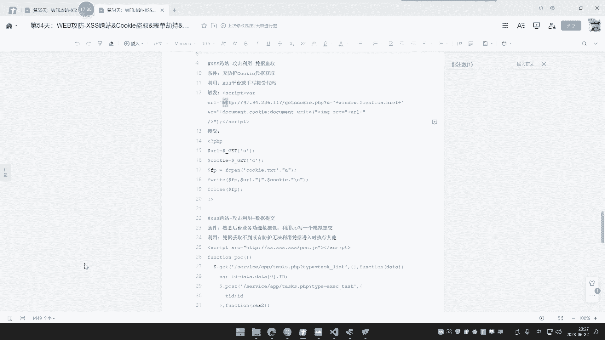

所以说你可以看到啊，现在呢我们没有没有开，这个时候呢它能接收到是吧，当我们现在把它开启之后，然后呢你看啊我把cooking tt给他去掉好。

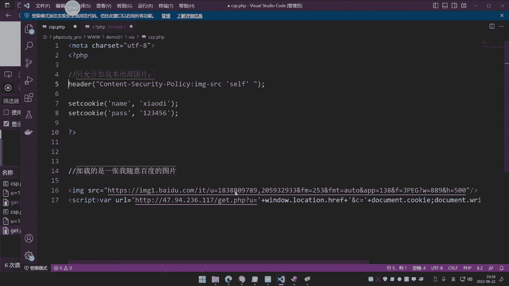

我们现在呢再来刷新页面，你看着啊，刷新好，我们再看这里刷新，你库内地就没有了，你看产生不出来了，原因是什么，原因就是它发送的时候，你看啊发送地址它已经构造出来了，但是这里呢红了，其实就是说请求不出去。

水中的CSP呢，你一旦开启之后，它就不行了，你你现在我就把它关掉。

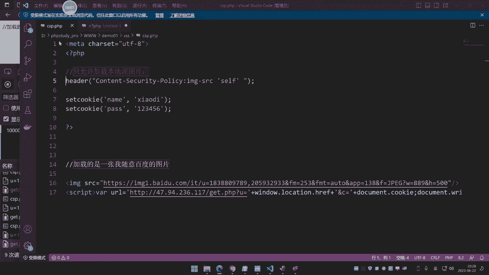

你再一刷新，你看他请求数学，然后你再看这边刷新，你看它就有了库存。

就解释到了，你看是吧，所以说呢这就是这个CSP对他的一个印象，其CIP呢它的本身呢就是限制这个内容的引用，防止在外部资源，就是我们说的什么同源呐。

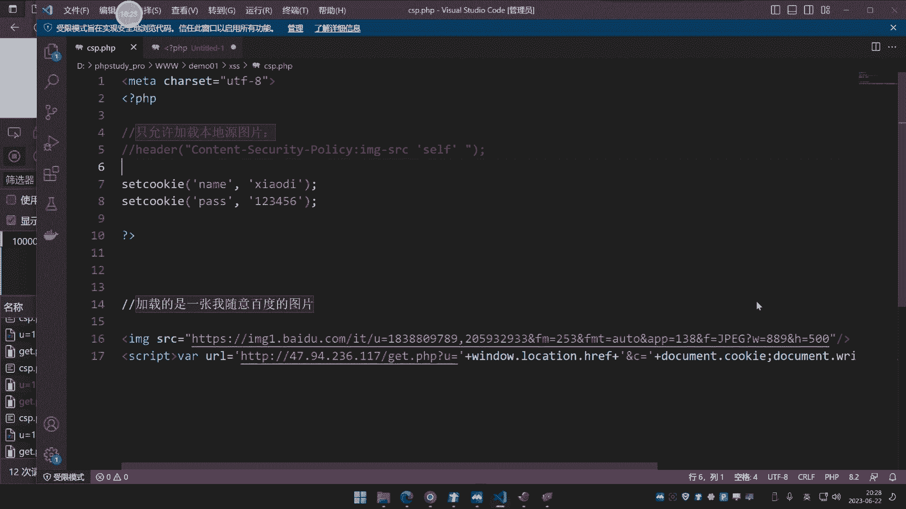

非同源同源策略，就是说同一个域下面，同一个域名下面的理论加载，然后呢你换了一个其他鱼，很简单的道理，为什么叫其他鱼呢，就是它的网址呢是这个192。168，1。3。82，对不对，是这么一个信息。

然后呢P10。

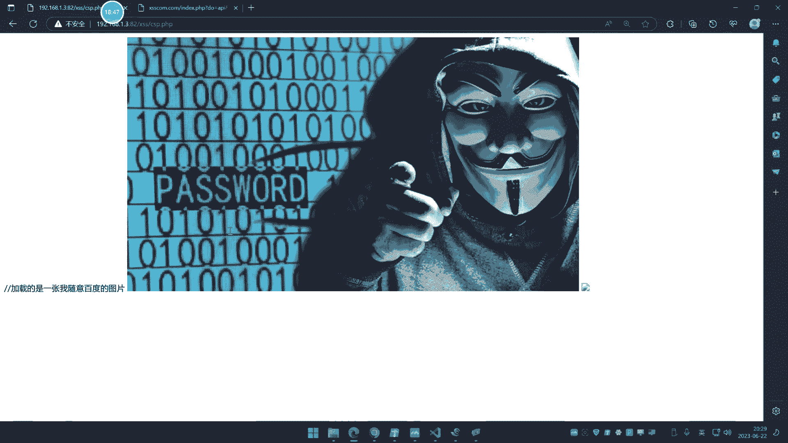

然后你这里请求的是这个IP，就是你不在同一个域里面，所以那你就属于外部，外部的话，他这个策略那就是不允许加载外部，那么你这个信息压根就发不出去，所以导致个XSS呢无法加载。

那么凡是你这个JS语句里面涉及到这个什么，涉及到这个外部的通通不行，那你只能用内部的，但是内部的怎么用都用不了啊，XSS大部分工具都是外部的，都要加载外部的一个地址呢去获取一些东西，因为外部的那个地址。

那就是我们写的那个payload，写的那个工具代码，你的外部加载不了，内部我们怎么写都写不了啊，Y内部是你自己的这个应用啊，里面东西我们无法更改它呀，所以只能加外部的，加外部这个东西，白金子咋办呢。

玩不了，对不对，外部加载不了，就是无法自定义配漏的，只能加载内部的质量，内部这样我们又无法去更改它，无法自定义它，那就达不到我们的目标，达不到我们的效果就玩不了了，就这个意思啊。

然后呢网上呢也有关于这个XSS的什么鬼。

什么这个绕过的文章，哎我给他看一下啊，就网上呢他有这个XS的一个绕过文章，你看他有这个绕过CSP的这个文章，对不对，但是他的绕过呢，说实话你说我没有讲吧，讲了那等于没讲，因为他的照顾呢完全就是钻空子。

很鸡肋，你看他是怎么牢固的啊，他他说了，那我只是你用什么这个info标签呢去牢固CSP好，他是怎么绕过啊，前面的好像看着是有效果，突然他搞一句，但是在二点pp中却没有设置CSP。

然后呢我们再绕过啥意思呢，他这个绕过啊，其实就是对方代码写的有问题，好，就是呢他在一个地方的生命呢，一个地方呢看上去好像都生命难，但是另外地方呢没有引用成功，就这么一个情况。

你说这里面的字哪叫闹鬼了是吧，所以说啊这个网上上什么什么洛克星去闹鬼，其实那都是那个意思，就是要么就是使用的时候呢啊，忘记写另外一个地方去了，再就是那使用的时候，那这种参数就是我们这里是这样写的。

对不对，然后他写的时候呢就是哎哎搞了这种。

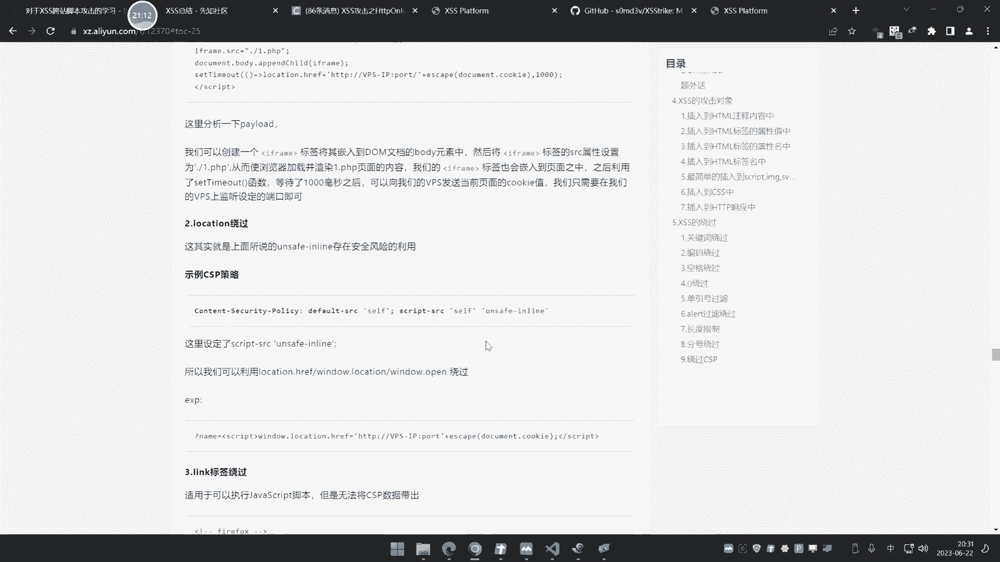

就说呢哎呀写的时候呢哎不是这种全部控制。

就是有些呢可以啊去加载诶，绕过了，所以说他这个logo呢都是属于一种呢，就是没有应用全部，还有呢就是上面参数的少写了，或者说配置一些其他选项导致是吧，还存在一些遗漏，就这种闹过。

所以讲和不讲的没没达到意思啊，所以这个东西你是讲不讲得出来，这就是这个CSP的东西啊，那么接下来呢我们再来看第二个啊，其实这个CSP呢简单来说呢，它是一种内容防护策略，就是防止呃。

这个网站呢去引用外部自然的一种策略啊，就很简单，他的这个除出发点设计原理呢，不是说为了防止XSS的，不是说他为了防止XS产生的CSP，而是这个策略呢，主要是为解决一些这种资源被刀粘的一种情况。

什么叫自愿被盗连呢，就比如说你在网上，我给他举个很简单的例子，你经常去网上去粘贴别人的那种文章是吧，一把文章呢直接CTRL加V啊，CTRLA啊，CTRLV就全选文章，然后复制到你这个。

比如说你的这个微信公众号啊，你的什么网址上面一复制，是不是有时候就会提示说，这个图片就显示不出来呀，因为呢那个图片来源于对方的网站，你去引用对方网站那个图片的时候呢，他有检测到。

就是说你自己的博客去引用外部的资源的时候，对方的资源呢会发现你在应用，那么你和他不在同一个圆，所以他组织你应用，就是用保护这个版权的悼念的这个知识点，是这个CSP他的这个出发点，但是由于它这个特性呢。

就把这个xx给他无缘无故阻之交了啊，所以呢我们才了解到他啊，其实说白了它本身不是搞安全的，只是说为了防止一些这种图片的质量啊，被外部引用啊是吧，这种情况啊，好。

这个就是我们说的这个CSP的对XS的影响啊，然后呢也说了啊，他的这个绕过方法呢都是基于它配置上面，配置不不完整，或者说配置和参数呢又搞了几个，这个另外的情况是没这个情况，那所造成的绕过。

但实际上呢你碰你在实战中的，碰上这种CSP开了之后呢，基本上你就不用去想了，不用管它了啊，就搞不了了，不用搞其他的啊，因为你能饶不饶锅，但你都要吃了啊，没什么太大意义，好这个是那个CSP的情况啊。

我们接下来呢再来讲这个HPO0，HPO里呢是在很早之前就出现过的，他的这个设置呢是专门为了这个cooking，安全型的所产生的，它是禁止这个JAVASCRIPT的脚文呢去访问这个cookie啊。

然后他有几种设置方式啊，在pp里面呢可以通过PPIS设置，在代码中呢可以设置，然后呢在复制cookie的时候，也可以设置在什么java里面，通通都有这么一个概念，java里面呢你可以折一下啊。

就是网上呢如何在java中呢去开启这个AH，p o only都可以啊，我们来用pp语言呢去给他演示一下。

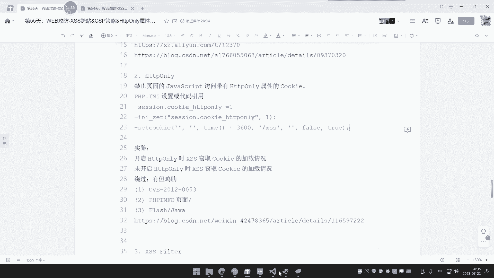

然后呢看一下啊，我们用PV原单个来看下啊，好这个是写出来的啊，这个很简单呐，写这两行代码，这个是什么意思呢，大家看一下啊，我先给大家看一下来，我在用的是这个C特sers cooking。

设置这个a h p o only的啊，是用C的cooking这个方式设置的。

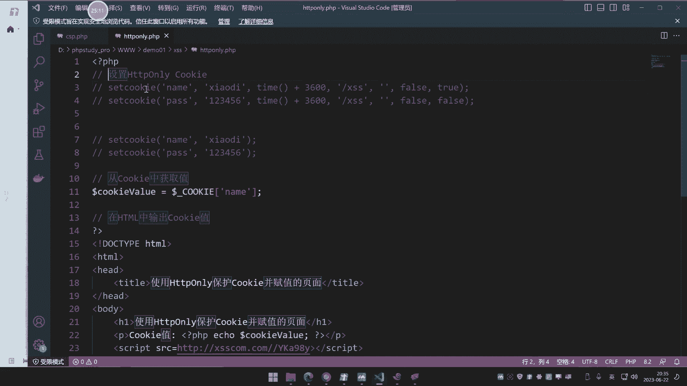

它有三种啊，在pp里面可以在这里设置，可以在PPII里面设置都行啊，我们在这用set it only cookie设置啊，这是pp里面啊。

java里面的，你可以网上查下资料，好，我们先呢不设置它，那这个呢就是没有设置HDONING的一个，这个东西啊，好这个是没有啊，我先把集合出来好，我们看一下啊，他的这个co值。

那就是name等于小于pass等于123456，然后呢这里那就是啊获取他的情况啊，我们来给打开看一下啊。

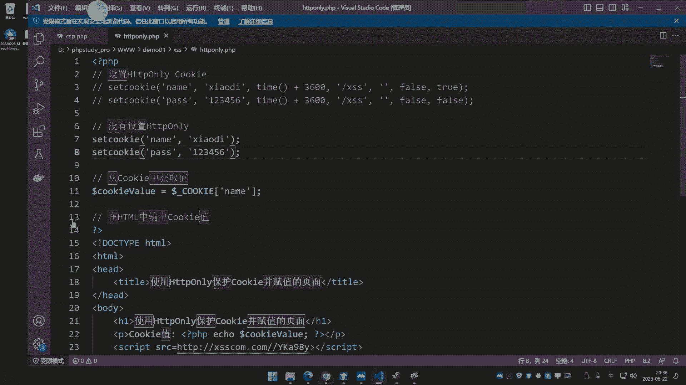

打开好离开了呃，获取coin值呢等于小迪就是获取这个内蒙值啊。

等于小迪，你看他能获取到，然后呢我给通过控制专这里呢给大家看一下啊。

控制台这里还有这个叫内存，这里啊不是内存，这里应用程序这里。

你看他这个地方有它的值嘛呢，内蒙等小迪2312356是吧，都有啊，然后呢你看一下啊，在控制端这里，我可以用这个document呢来尝试执行一下，获取到cookie试一下啊，啊执行他获取成功了。

内蒙等小迪帕斯也356能够获取，对不对，然后你看应用程序这里面也有，然后应用程序这里呢给大家看一下啊，如何判定一个网站有没有启用HPO里，也是非常简单，你直接访问这个网站之后。

看一下这个应用程序这里的coin值这里啊，然后这边呢有个什么地址呢，一个是它的启用的路径，就是在这个路径下面它的固定值这个值，然后后面还有一个东西呢，它的这个时间还有这个呢这个叫什么1950。

你看这里默认的，你看这里啊是空的，就是这里呢是空的，那么就知道这里他没有启用ABO里，如果这里有个堆勾一个勾，那就说明他启用了，所以说你在黑盒里面也能判断啊，可这一讲这里那答疑惑问。

那刚才那个CSP，那怎么知道对方有没有启用CSP呢，很简单道理，这个只需要你去引用一下这个图片啊，引用一下他这个网站的图片，如果说能够直接把他CTRL加V引用上去，那就说没有啊，就是没有，如果说不行。

那就不行啊，我举的这个简单例子，如果大家有搞过微信公众号写过文章，或者说有阔评去尝试过扩敏别人的文章的时候，应该有这种经验，经常你在网上的去全选复制，把别人图片啊，文字啊全部扩印是吧。

粘贴到你那个文章上面，那后台里面去啊，文章你们一区有些图片加载不了是吧，有这种情况吧，那就说明那个图片那个网址呢就有知道吧，好这个再说这里啊，回到这个AABO里啊，你看啊就是在这个浏览器这里啊。

如果这里没有勾，那就说明当前网站它没有启用PO里，或者很简单的在这里可以看，在这里呢也可以，那直接执行document点cookie，如果他输入的这个词，和你现在看到的这个这个这个这个这个地方呢。

一样的，两个是一样的，那就说明也是没有的，在这里呢就是说获取的过来值，和你现在这个值呢都有啊，那就是没有啊，好那么现在再次看到的啊，那我接下来我们再来，把这个去掉，把这个给它挤出来，好大家看着啊。

现在呢就换了一个代码，换了个什么代码呢，就是拿ZM等于小题，然后后面设置啊，这几个设置呢不用管它，这设置那个存活时间和启用路径，然后这个呢不管它，主要是后面这个出出，就是表示这个出就代表什么开启。

也有你force就是不开启，如果说你不写，他默认就是false，就是不开启，后面写了出就是开启，写false呢也是不开启，那说pass呢啊这里就是啊对，pass没启用也用only。

就是后面那个为false啊，它等于false状态，然后这个呢就是启用了这个内蒙的啊，他启用了，然后呢他是等于初状态就最后一个啊，好你看啊，现在呢这两个代码注释了，我们再看这两个执行情况，好。

我们在呢在这里呢把它进行一个这个删掉啊，先把这个地址呢给他清空啊，coin全部清空，然后CTRL加五强制刷新啊，注意强制刷新啊，有时候的缓存了会造成影好一刷，你看啊，现在你看这里啊。

看pass这里你看内蒙这里画了个对勾对吧，name这里画了个对勾，pass这里呢就没有了，是不是就是name这里呢有AHPO0，然后pass这里就没啦，然后这个时候你再看用document去执行。

看他获取的是什么值，执行获取的是pass的123456，但是这里你看，内蒙的小迪他获取不到了，为什么内蒙启用了这个奥体模拟，这个没启用，他回去到了好，李可能说，那这对对我们夸张有什么影响呢。

好那么现在我们就来看这个印象啊，现在我们就来看这个印象。

你看这他妈的，你说这搞不搞笑呢，刚才的时候啊，这他妈没接收到，现在给我咔嚓，这里接收到了我，我真是服了。

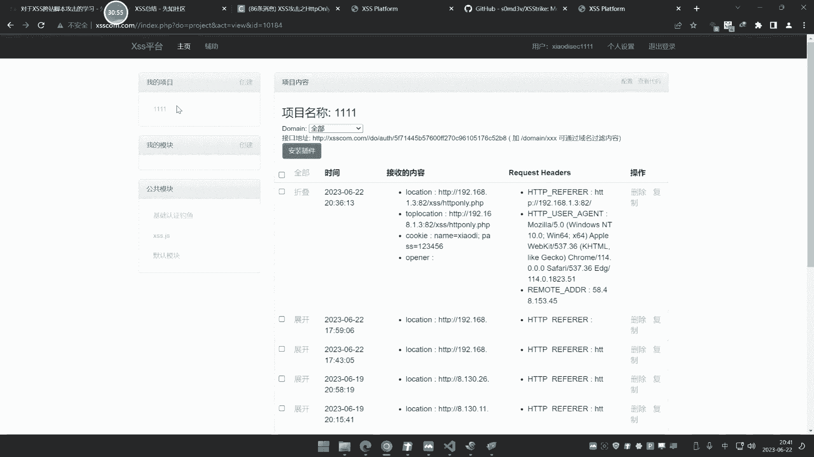

好你看啊，我们现在呢把它两个都设置为出，把他两个都设置为出，好吧，把两个都设置为输啊，然后这个时候啊，我们去加载这个地址，这个地址是那个获取cookie的地址嘛是吧，获取那个cookie地址好。

我们来看一下啊，把先就说我全部都启用了HU0啊，然后我把这个这个地方给清空掉。

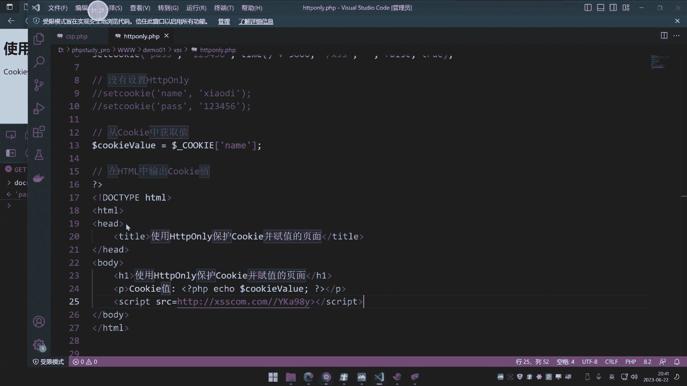

好清空了，然后我来刷新一下好，你看现在啊两个都画了对勾，然后呢网址呢它也加载这个地址了，对不对，然后你看看他发送的地址里面呢，cookie这呢为空XS的加载地址为空。

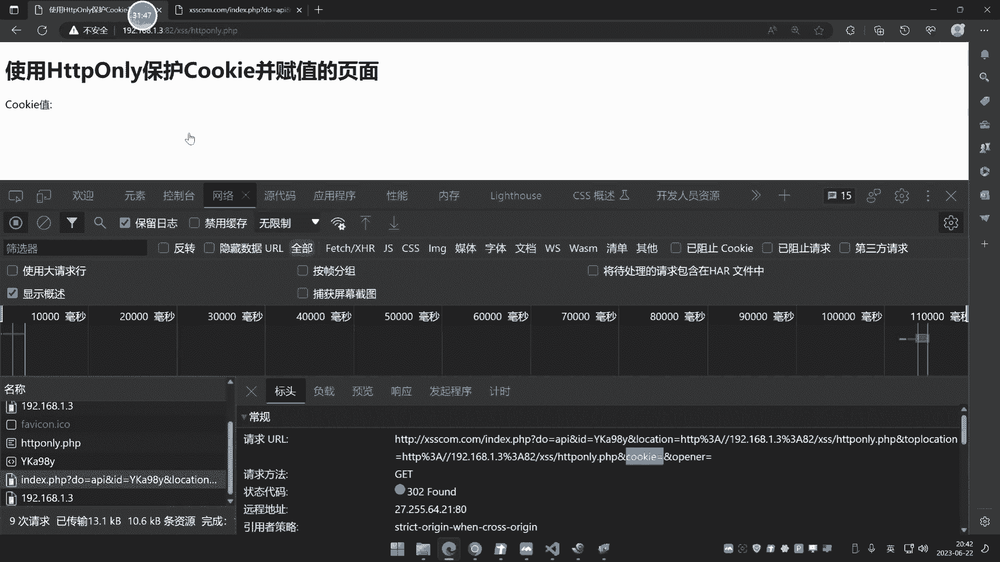

你看cooking啥都没有，看到没有，这就是hp o0开启之后，对于这个cooking的获取，对不对，不行的啊，好那为了这个效果期间是不是这个影响到的。

那么大家可以看一下我，我把这个地方给他怎么样，我把这个地方这两个先给他注释掉是吧，把下面这个给他激活出来，就说如果我没有启用它啊。

我没有设置它，两个都没有设置好，这个时候呢，我先把这个应用程序这里呢全部把它清空掉，把它空运的缓存关掉好，这个时候我们再来CTRL加F5是吧，你看这两个呢O型模拟对勾没有了啊，没有之后我们再看这个网络。

哎，他也请求到，你看发送的时候是不是你看name等于小D，pass等于12356。

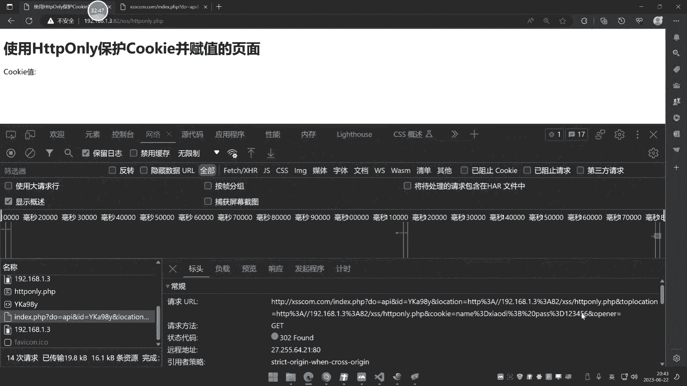

所有来啊，再观察一下这面有没有解释到啊，还你妹的又解释不到这个玩意，这个平台，你妹的，我失败了，你就不给我搞，这他妈的成功了。

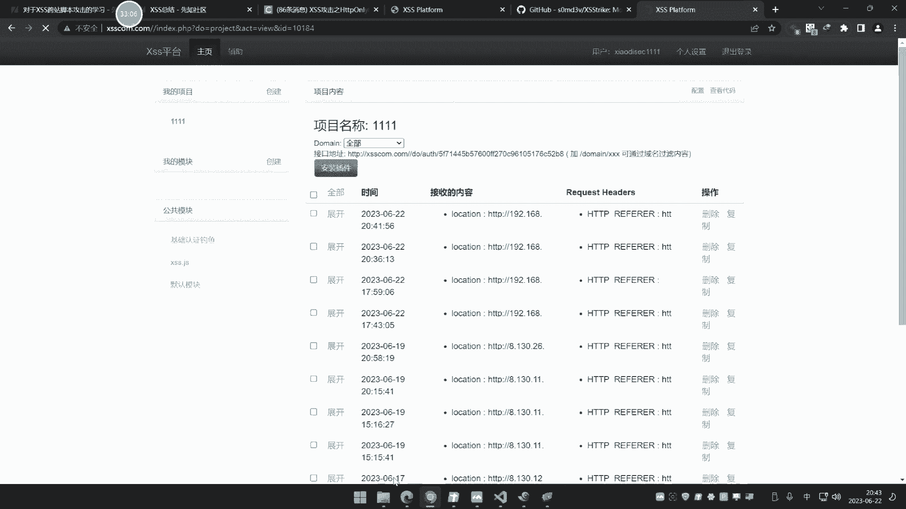

哎，嗯这B这B平台呀，还不如我那个之前打个本地搭建的。

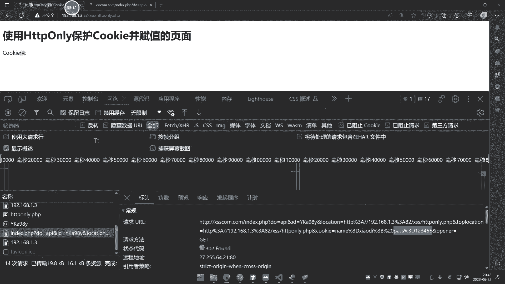

哎呦，真的是服了，我还是用我之前搭建的那个平台好一点啊。

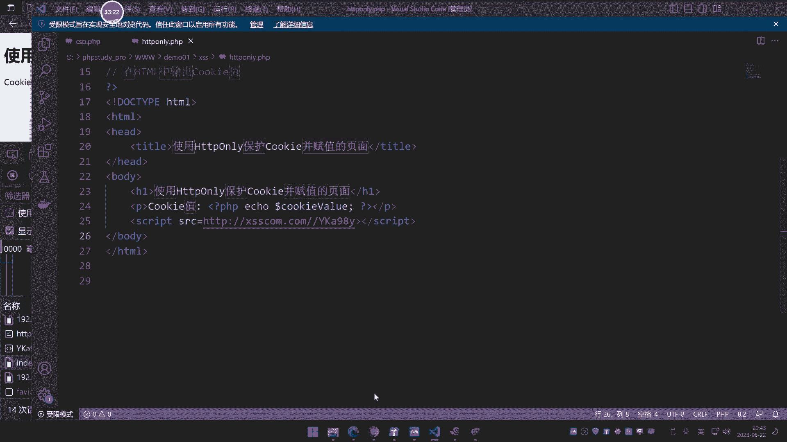

这个太垃圾了，真的太垃圾了。

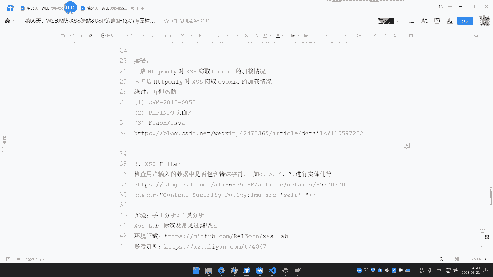

和那个没关系，他是在你看他，他就说我们知道这里，你看他刚才那个啊获取到。

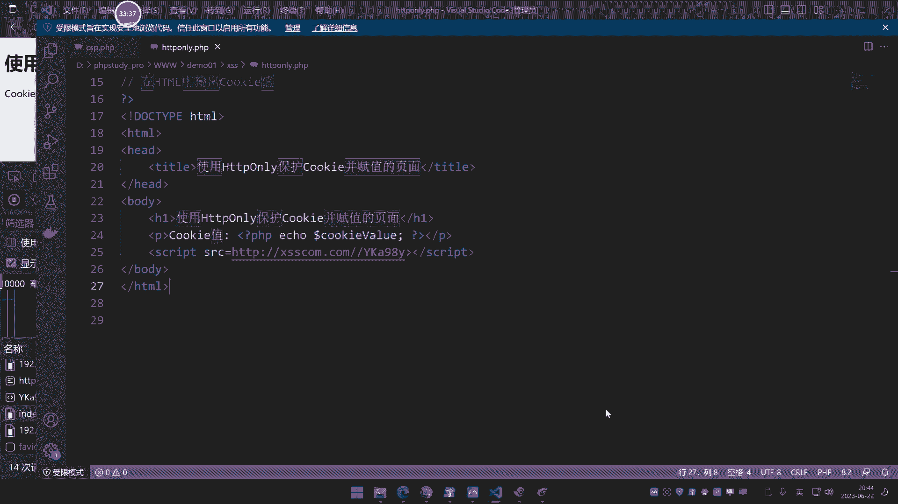

你看他就没有这个东西，你看现在就有，他只是访问这个网址有问题，它变成个什么3022了，他网址接收平台有问题啊，这数据都出来了，你看，对吧，然后呢你可更重要的再直观给大家看一下啊。

你看我再直观的给大家看一下，那你看啊。

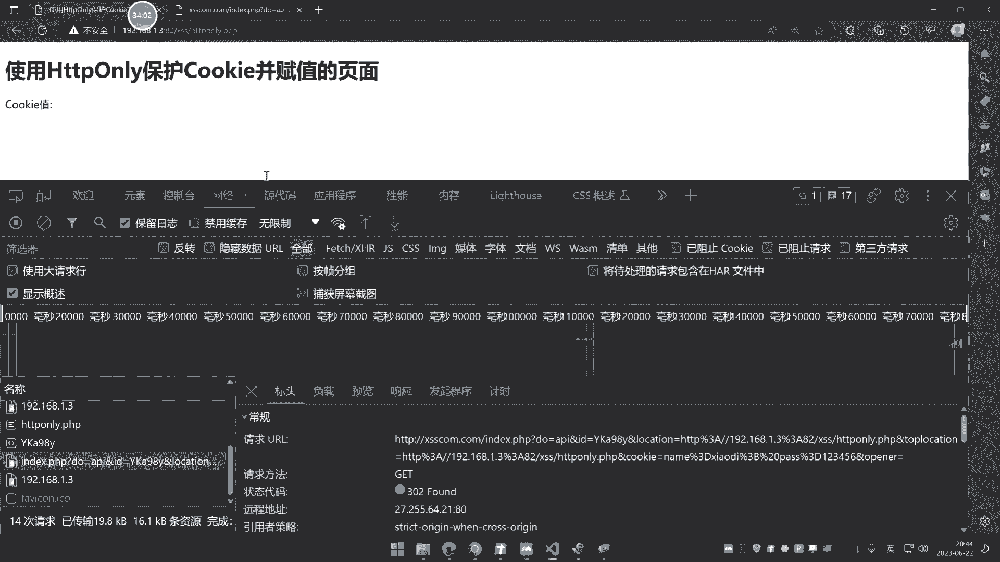

现在我把这个去掉是吧，然后刚才不是两个都开了吗，我现在只开一个，你看我把这个给他激活出来，给他搞成force，那么也说这个pass这个就能够获取到，因为它没有设置，这个就能没有设置嘛。

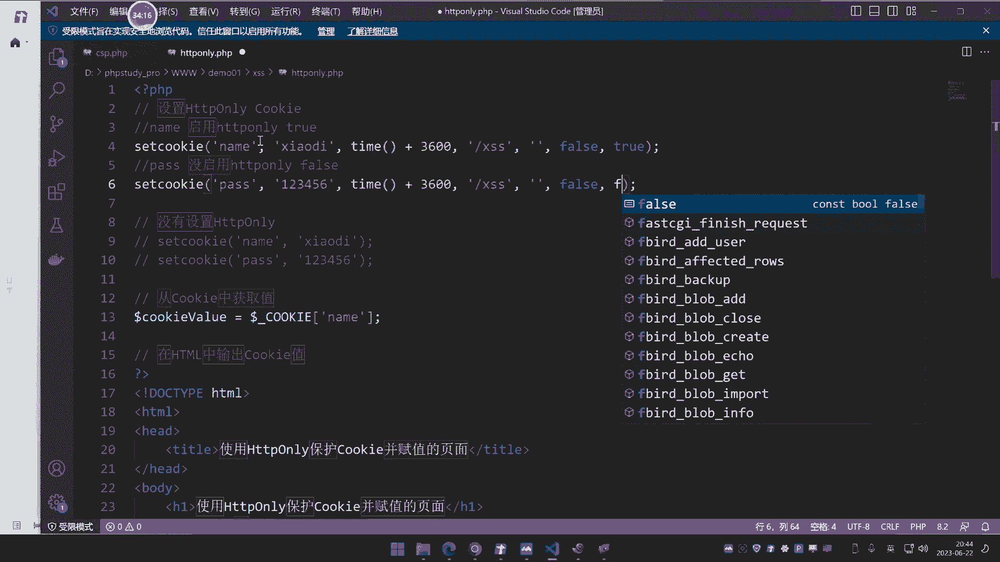

这个就是设置了对吧，好刚才呢我们再把它刷新一下了，再看这里啊，清空点啊，现在我们再来怎么样，CTRL加F，你看pass这里就没有设置AB，你没有对勾是吧，然后你看网络包里面他去发送数据的时候。

你看他这就发送了pass123456啊，对不对，他就没有发送那个lam的小迪呀，这个和我们相呼应商的嘛，这个大家就明白了嘛是吧。

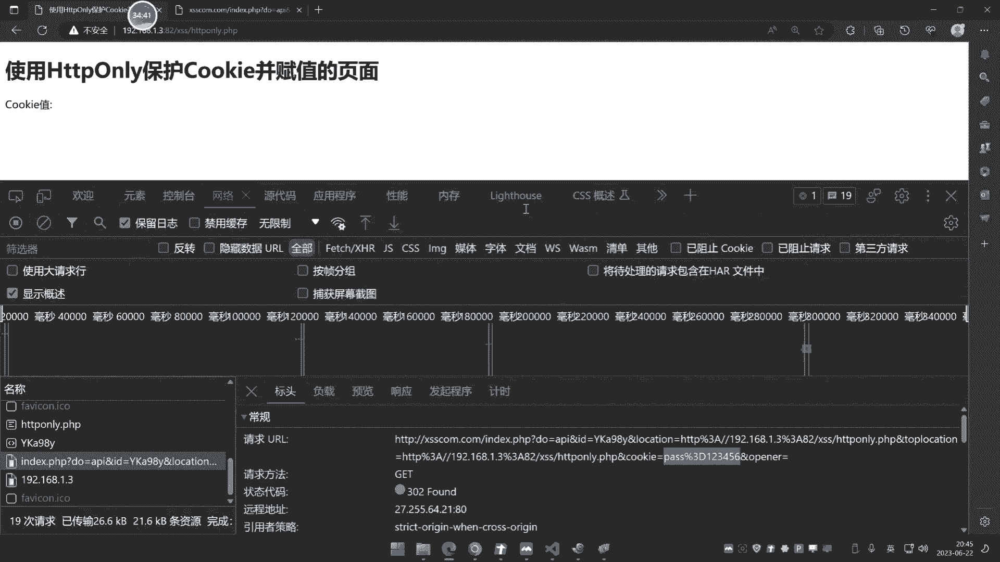

那个劫收不到，那是个平台问题啊，你就换一个平台就可以了，或用我们之前给大家推荐的，上节课讲过的，自己搭建一个平台来解说，都是一样的啊，那大家就知道这个APO0了，能不能理解，这好理解了吧，我都没有设置。

那就都获取到，那我设置哪一个哪个就获取不到了，就这么简单，这没有什么说的，如果说都是折一平为理，那不好意思，都获取不到，因为我们可以在这个他牛呢。

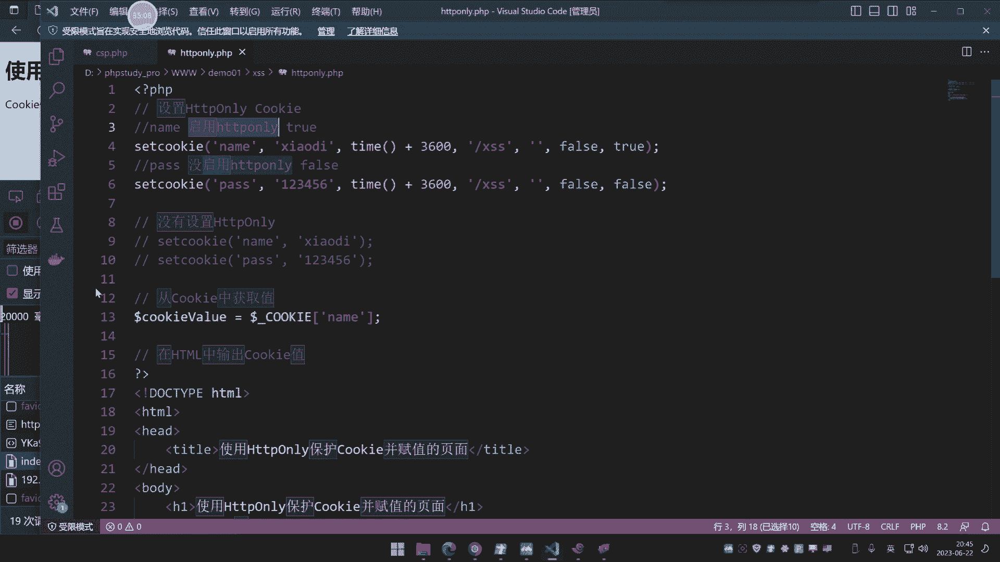

其实他们可以车的嘛是吧，然后这里可以通过你的语法车，当前或就是用浏览器的去执行这个语句。

让它执行，看它就只能获取pass的嘛，那个name他就获取不到嘛，原因是因为呢这里呢它是为粗，你把它也搞成boss是吧，都搞成boss，那一再再把这里是吧，重新运行是吧，把把这个缓存清掉，然后你再运行。

重新刷新，你看现在再运行，你看他有多都出去了，这还不简单吗。

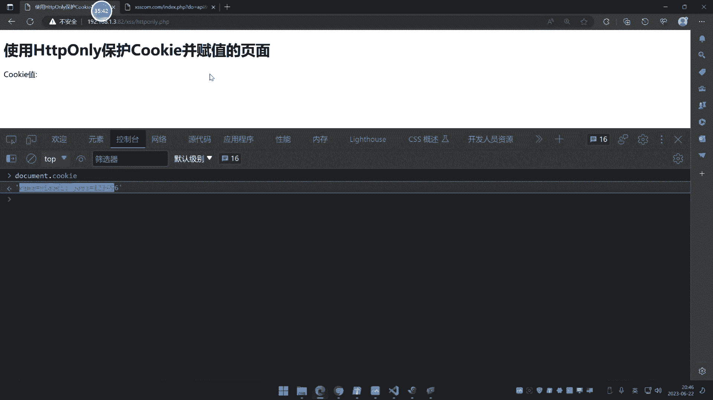

那个后面这个差评他的问题啊，哎这里真很尴尬，那他现在呢又来了，你看这他妈的不知道什么鬼东西，你妹的，平台太垃圾了啊，这还得用我们自己搭建的，我就说之前教大家去，必须要上那课嘛，必要搭建一个平台。

这平台的实在是啊。

唉一难一言难尽啊，好然后这个HBO0他有没有绕过手段呢。

我刚才写了嘛，绕过了有CF1的一个漏洞，用pp info页面再用这个啊，这是文章啊，这是在网上用用三法绕过三法，但实际上说呢对我们的每讲跟没讲一样，cf12012的漏洞，那就不说了。

在这他妈的10年多中了，有没有都不知道了，批评for呢是什么意思呢，其实就是说对方呢有这个什么批评引波，因为批评引波里面呢会有这个记录库引信息，他利用JS呢去读取的这个页面信息。

也就是说对方要有批评for页面才能，其实就是说批评for里面的记录有cookie，他用这个JS呢去获取这个页面的信息，记录了这个cookie，他是这么个原理哈，就画那种方式。

就是说这个会议的记录在批评引波上面，然后呢哎啥意思呢，有没有不知道这个批评引波是啥意思的啊，我给他讲一下啊。

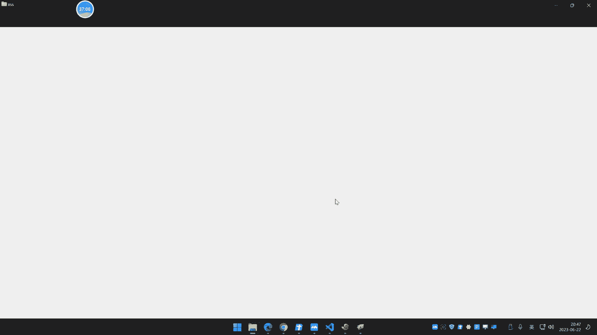

那还只能限制到，还只能说是只能只能说是这个pp的，这个后面的网站才行，你说这个条件多不多，实在是太多了，所以说你讲他这种绕过呢都是完全是扯淡，讲了和没讲意义不大，嗯好P1P等于P1P。

那就这个东西嘛对吧，然后这里呢有这么选项呢，有这个呢有这个啦这个cookie的这个地方嘛是吧，因为这个页面本身就没有cookie了是吧，它其实呢就是获取这个页面，就获取这个这个地址，就用JS去写个代码。

写个代码再去获取这个页面的这个什么，这里面有个值哈，就这么简单，所以说必须要有啊，那那那你说里面有这个页面，你直接访问他不就行了吗。

唉所以说啊哎没什么意义啊，太鸡肋了啊。

这种绕过的思路，还有一种思路说什么这个flash的东西，前期呢我们讲flag xs s的时候呢。

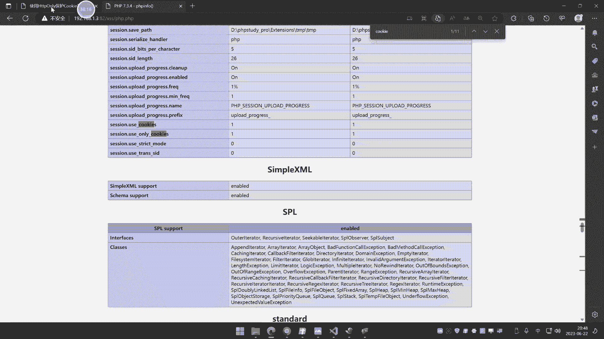

大家说过时了过时了，那你说还用这个东西呢。

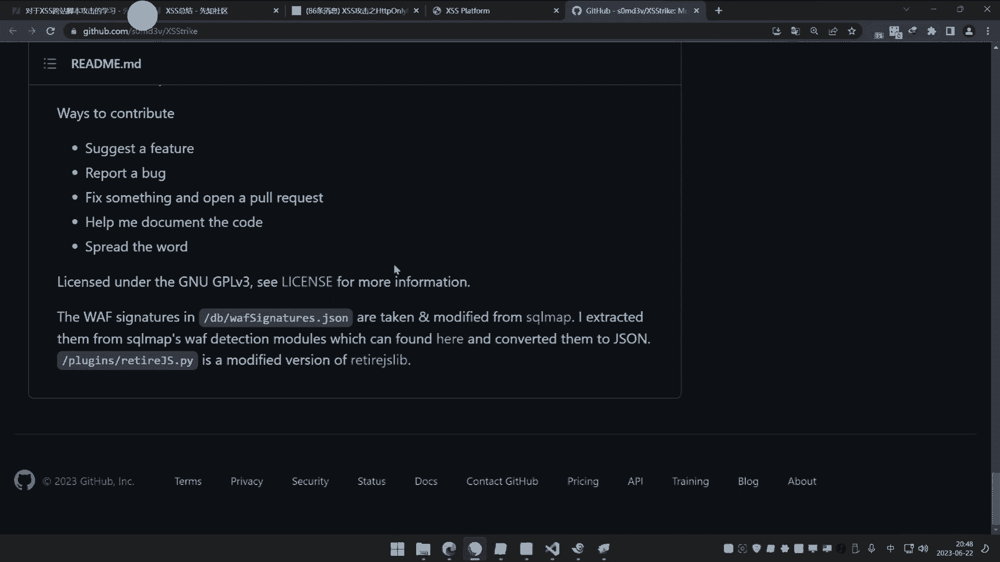

还有什么用的是吧，那他也是12年包出来的一个思路，12年的，这不用看了吧，所以基本上没什么意义啊，这个logo看了跟没看一样，条件太苛刻了啊，实现在这个网络情况满足不了，基本上就说他一开这个之后呢。

啊你就直接放弃就完了啊，你可能说有没有其他思路呢。

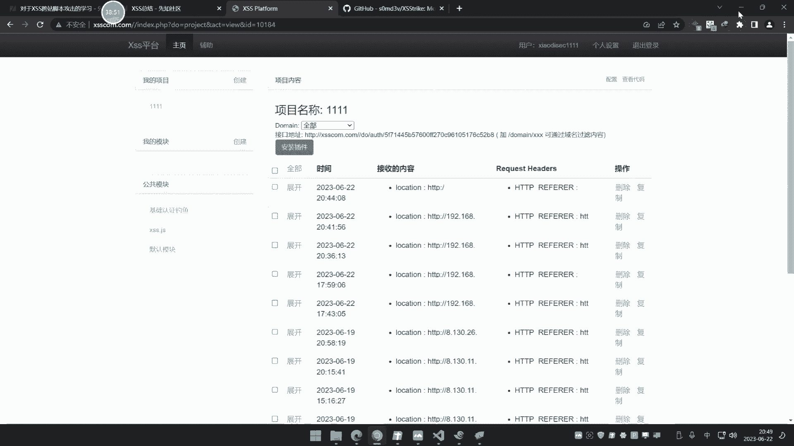

有啊是个啥思路啊，绕过它。

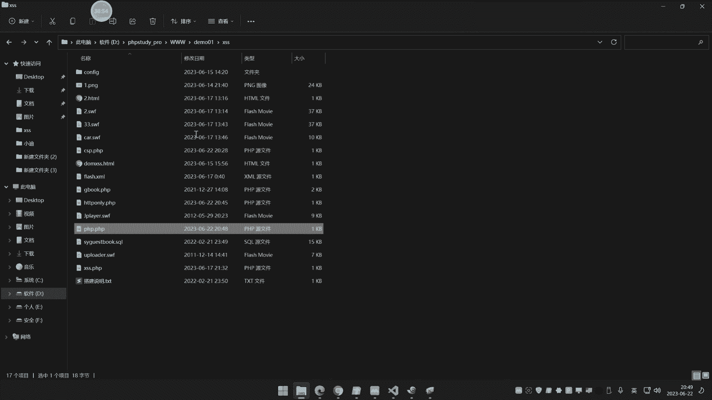

绕过不了，你可以换思路的嘛，还是有思路的嘛，思路是什么呢，录获取COOKIN，采用其他方式，这句话能不能理解，因为他是对cookie的限制，你不会去cookie，你换其他方式不就行了吗。

就可以使用什么呀，我们前期说的这个配合钓鱼的呀，或者说这种浏览器攻击框架呀，啊等啊，用这种方式不就行了吗，对不对，因为XSS攻击除了本身刀具coin之外，还有其他的攻击思路啊，你比如说你又不懂不懂。

上节课讲过了吗，上课讲的时候不是说了几种思路了吗，有道具无in的，有这个什么提交JS语句的，有这个什么配合网钓鱼的，还可以呢，利用这个什么这个BFES呢，攻击它浏览器框架是吧，这种可以啊。

因为它本身只是对coking的限制，并不是说对你其他方法有限制。

但是如果说是商一个限制。

像这个CSP的限制，那不好意思，那就基本都限制了哈哈，那如果是CSP的话，那基本都限制了，他就直接把XSS的常见工具都限制了，因为你只要有外部资源，那不好意思都组织掉，所以这个CSP才是最厉害的啊。

这个AHBO0呢只对cookie有限制啊，就是你获取cooking不行，你其他的一些这种加载代码呢，加其他代码不获取cookie的一些这个代码呢，他都是OK的啊，啊然后呢我们再来说这个X是finder。

x s finder呢其实是个交法，就是差的过滤器，过滤器呢就是常见的一些对XS语句的过滤，我们这里呢第一个是说，教大家如何去绕过一些常见攻略，第二个呢是教大家如何去组合B和这个差距。

就是手工在上面测试，同时呢也介绍这个XSS是link呢，去给他演示啊，然后呢演示了八成的是x lab，我原本是准备用这个CCTF修上面的这个xx题目，可以去给你讲。

但说实话他那个题目呢比不上这个X是nil，为什么这样说呢，因为这个x lab的跟考的是对于标签上面的使用，对于这个啊符号的一些过滤，这些绕不出，所以呢它更贴近于实际啊。

那个CCTF修的题目呢不太贴近于实际，好我们现在呢就给他演示一下啊，就是说有三类的一些安全防御XS的手段，第一种呢就是开启CSP呢来阻止CXSS，还有一种呢就是采用app oi的设置。

那阻止差SS呢攻击这个cookie，但这种呢只只是cookie啊，但是呢还可以呢换其他方式来去利用，但这个呢CSP就基本GG了啊，然后这个x x fighter呢。

就是人为的一些代码过滤和增值的一些过滤，那么这些政策过滤呢就是还是有客运文章的啊，我们接下来就给大家去讲解一下啊，然后呢我们给大家看一下这个finder啊，环境已经搭建好了，所以直接打开看吧。

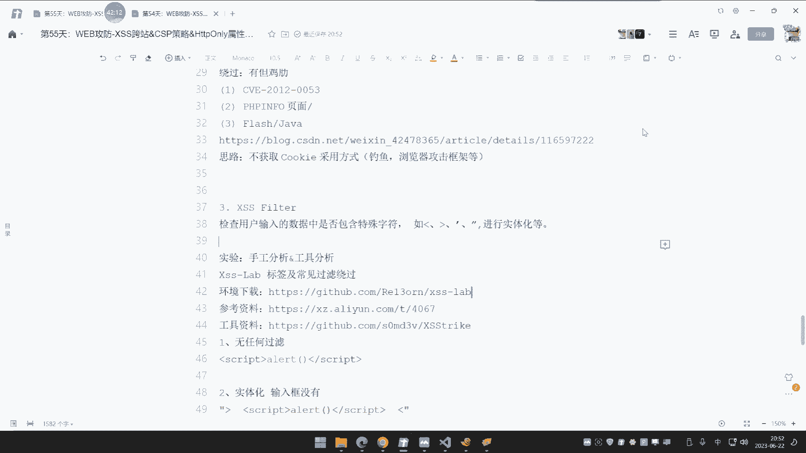

我们演他有20关啊，关卡太多，我们就不一个讲了啊，简单看几关就OK了啊，就是那个菜是个lab啊，这是一个简单的菜，是个靶场，这个靶场里面都会涉及到关于他的一些，如何发现这个漏洞，然后如何去利用这个漏洞。

同时呢也去给大家看一下，这个JS是怎么造成的啊，讲个大概十关吧，来看一下啊，这个呢说什么欢迎用户test，然后呢你看网址上面有个name的test，那就说上面有个test，你改成123嘛是吧。

那他就输入欢迎用户123，那就很OK嘛，这就是典型夸张个产生原理啊，就是输入123的输出，123我们输入输入都能控制它，当我一旦把这123的改成一个夸张语句，比如说script是吧，arctic啊。

这种弹窗的是吧，然后呢弹窗我就不写了，就让它弹一弹一个就行了是吧，SCP的一执行哎，弹窗了，完整的不错，第一关就过了，就这么简单，是不是你可能说哎呀，我实战中我怎么弹窗啊。

实战中你把语句改改成一个那个会coin语句，不就行了吗，对不对，那个那个那个网站呢，就这个地址呢就是一个反射型夸张嘛，把这个地址复制给别人，服务员一打开，对不对，就触发了夸张了，就是个简单的事情啊。

不要问那些东西了啊，那很简单啊，自己想一想啊，嘶，实战中这种反射性挖到是什么，是没什么作用啊，因为你找不到你要攻击的人，你也无法帮他去触发这个地址，所以一般都是初成型啊，但是除成型和反射性都差不多啊。

应用起来都差不多，然后呢呃这个，额这个第二关呢怎么操作呢，你看啊，那这里有个特色一搜哎，这里就显示个特斯的，那你胡说，我先问一下大家，这个蔡司的，那那输那就很简单了吗，和刚才一样。

我就输SP亏pt的这种语句是吧，输上去让他给我提交一车A1车并没有弹窗，但是这里显示了，但是为什么没有弹窗呢，很简单，把这复制粘贴到这里来，看一下效果，什么情况啊，看一下啊，但我写这里为什么不存。

挂一看前面的这个什么斜杠，换成了这个什么这个东西，这啥东西啊，这叫实体化，这叫实体花，就是把这个尖括号呢给他进行实体化了啊，但是你会发现除了这里，这里还有啊，那这里也有，让我看看这里这里有没有实体化呢。

我再看一下哎这里没有实体化，但这里为什么不应执行成功啊，为什么，因为前面有单引号，双引号，双引号过滤域嘛，对不对，B和它呀，什么B哈，双引号写个空格，再装一号白斜杠不行了吗，前面一个B和前面的V6。

后面这个B和后面这个代号执行完成了不说，OK结束了，好非常快，非常舒服，对不对，有人说啊，我不懂啊，不懂啊，咋不懂的嘞，来给他看一下啊，来这是原本的啊，直行到这里来，这三两种语句把它复制出来。

那这是他的原本呢，你写字来了吧，这里版本输入语句在这里是吧，你输这个东西，那就选这里是吧，然后呢让你输个这个东西嘛，把它一闭合空格一下，再把这个空不空格都无所谓啊，再起这个带双引号，带双引号怎么带反光。

对不对，相当于说就把前面当做个整体了，这里执行啊，后面那就这个这个无所谓了，这个写不写都行，就是只要这个预备执行就行了呗，这是那夸人咋执行语句，对不对，闭合嘛，这和那个四个中路差不多，这个道理啊。

这有啥难得的，这个关卡就是教你第一个常见的过滤，然后呢还有一种就是教你说，为什么有些跨进去插进去，它不能执行，就是因为你这个夸你查插入的地方，要么就是被当作字符串了，要么就是受到过滤。

你就要分析怎么分析呢，就是我刚才说的，找到你这个显示的地方，右键审查元素，看一下它前端页面，这里来看一下，是写到了双括号里面单独字符串，还是像上面这样子啊，这个斜杠呃，这个尖括号被实体化了是吧。

哪种方案你就用哪种方案去尝试绕过，这个能明白吧，这如果说不明白，那就GG跑路是不是，没有什么太大问题啊，就是自己呢把你的夸张代码写进去之后，你就观察这个网页这里啊，你这个代码他不是要在页面中显示。

才能这个执行吗，那显示的地方是不是有些干扰到了，不不不能让这个雨正常执行，你就想办法让它正常执行，就这么简单啊，就这个意思，至于能不能让他正常执行，就是看它过滤严不严谨，但如果严谨，你你绕过不了。

那就去G那也是没有漏洞是吧，能绕过，那就是说还能玩好，这个是刚才那个第二关啊，先把它过掉，然后来到第三关嘛，好第三关了，然后看第三关，那第三关呢就这个什么情况呢，我们还是按照刚才那个思路来是吧，啊。

这个来执行诶，第三关呢用了第二关的技术，再用上去呢还是不行，我们再看一下啊，是什么情况啊，先看这个上面显示的地方，哎上面这个显示地方被实体化了，这不用说了，好看这个地方有没有实体化的，再检查这里啊。

再打开哎，你看这里也实体化了，你看他把这个把这个什么这个，这明明这里应该是个这个我们写了个猫啊，双引号变成这个是吧，那我写个单引号行不行呢，我把它换成单引号试一下啊，因为是单引号，双引号都可以啊。

来双引号，你可以说哎前面是个双引号啊，我告诉你啊，前面是双引号，不代表它代码中是是双引号，为什么呢，因为正规来讲这个网页代码中呢，不管你是用的单引号，双引号，它在这里呢一般都会显示双引号。

我们试一下单引号，哎单引号好像也有问题，你看哎变成这个鸟样子了，哎操更夸张了啊，更夸张了，那更夸张了啊，那这里怎么办呢，这里就用时间啦。

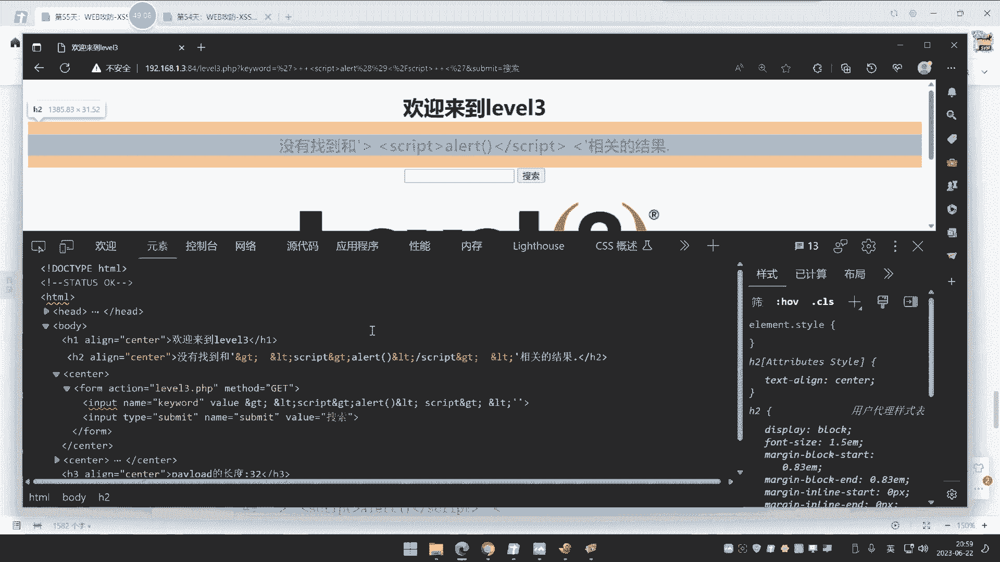

用什么时间啦，我先给大家看一下参考文章啊，那这些绕过方法吧，然后呢这里有一些时间，什么叫时间呢，看一下啊，这里又差这个总结的，就我们呢可以利用一些时间，就是说比如说像这个里面的什么on偶尔时间。

错误时间，on force事件，单机事件是吧，还有什么on sputer点击事件，单机事件，还有什么鼠标划过时间和load啊等等等，就说有些标签里面的是支持这个时间的。

就说我不再用那个东西了，就很简单啊，啥意思啊，我先把这个扩起来，然后放到这里执行啊，这第三关是吧，然后你看啊他这个地方执行的，大家可以看到啊，呃他这里呢需要过滤这个双引号，然后呢我们写了个双引号呢。

把它写上去之后呢，哎它也不能成功，不能成功的原因就是这个双引号写到这里，那呢这里有个这个实体化了是吧，我怎么办呢，我就你妹的不搞了吧，我就搞个什么on on时间呢，搞个这个鼠标事件呢。

这是input input里面有什么事件啊。

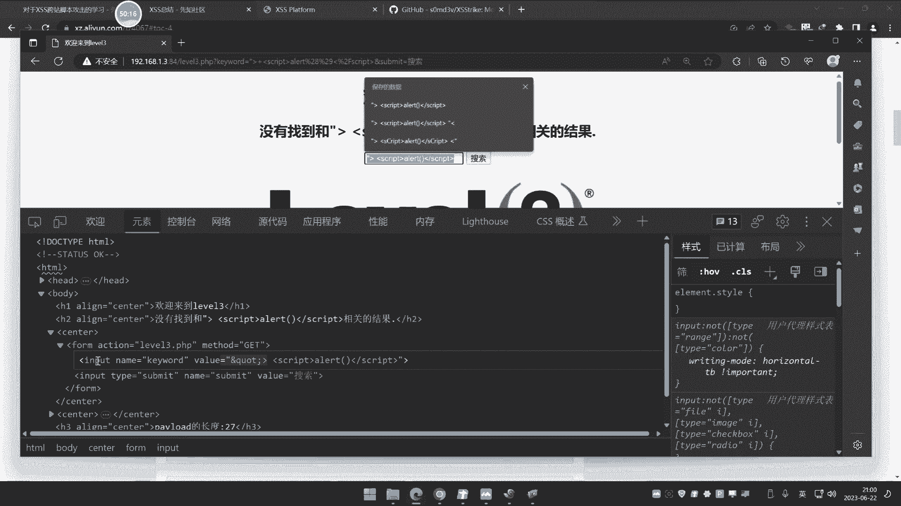

来看一下啦，On sputer arctic，这个事件是有这个事件，你看还有这种的竞争焦点事件，就是说如果你在这里触发触发这个事件呢，他也能执行JAVASCRIPT代码，对不对，那我就直接空运过来了。

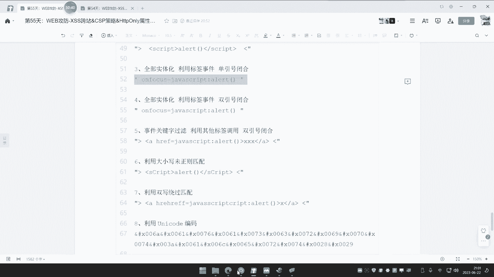

那触发这个事件不用尖括号了，他过滤尖括号嘛，哎鼠标也滑过这里，一点击它完成的不错，为什么你看代码这里呢来看一下，哎啧强制性装他这里加了个什么时间啊，然后呢里面执行JAVASCRIPT的ACTIC单数。

就是在标签里面加时间触发JS代码，能理解吧，就不说完整的状，那再换一个这个标签了，就直接在input标签里加，那这个是on for s，就是我们单机事件，就当你鼠标点到这里来的时候。

就会触发这个事件执行这里啊，当然了，还有其他事件啊，根据自己需要呢选择不同的事件，另外还有这个。

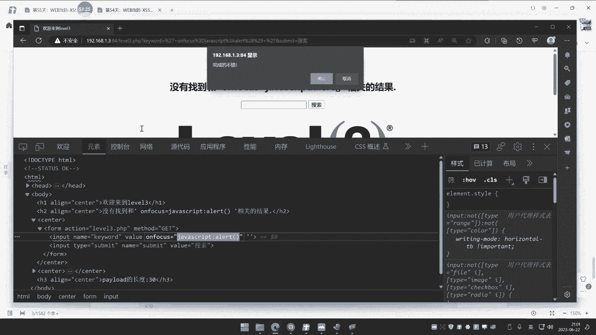

竞争焦点是吧，这种事件啊，具体的你要查一下这个相关资料啊，input的一个东西，对不对，就查这个资料好。

然后呢这个是我们第这个第三关是吧，然后呢我们来第四关啊，如果说你能看源代码的话，这是五黑盒再测啊，源代码能看的话，那更简单，那这个第四关呢和第三关一样，那就是一样的啊。

就无非一个用单引号用用双引号的问题，就之前呢它是用双引号闭合，这个要用双引号闭合，那就完了呃，你可能说这是什么原因啊，我把源码给你查看一下。

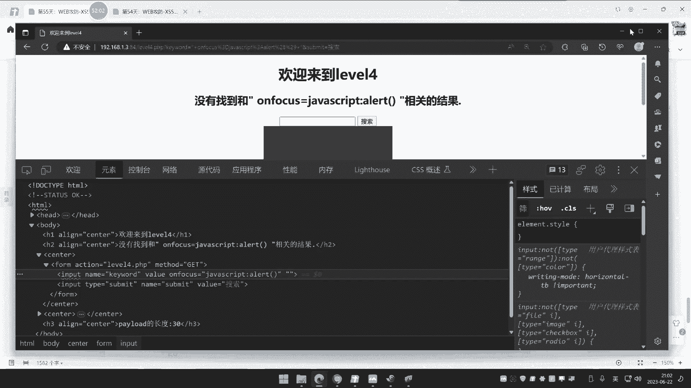

因为有些人不明白说为什么一个用单引号，一个用双引号啊，这是由代码决定的啊，在你实战中呢，你需要测两个月，要测，那这是第三关的。

你看三关这里呢他对这个要进行实例化，这个是实体化的函数啊，就把那个单反的实体化的函数好，下面这个呢你看啊，在他这里拼接到那个地方去的时候，那你看啊来前面是单引号，所以第三关的时候用单引号闭合啊。

单引号闭合掉了，第四关的时候，你看，第四关的时候，你看是双引号吗，你看双引号啊，来看没，所以你闭合的是双引号，就是这个原因啊，这个是前面双引号，这个是单引号。

好，我们再来到第五关啊。

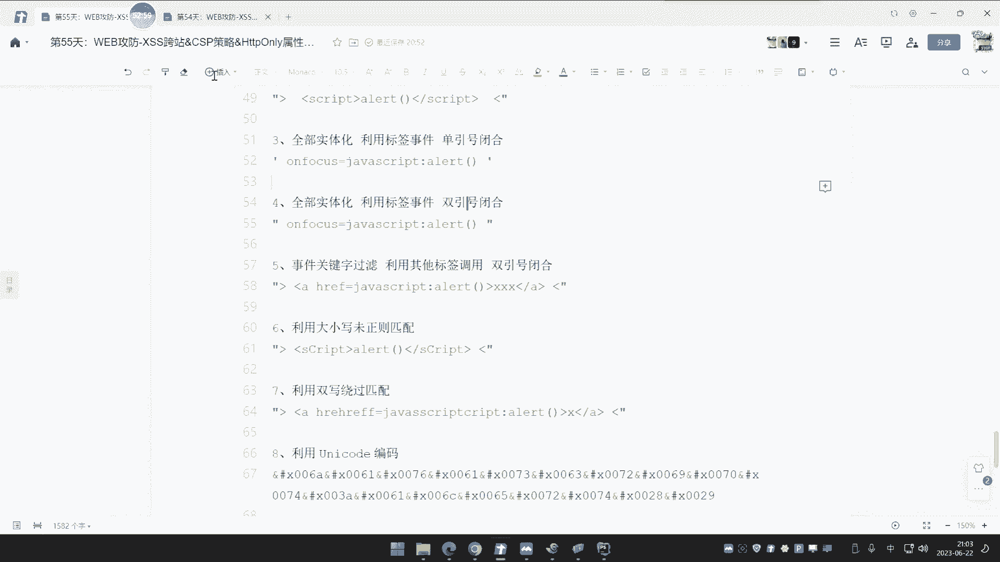

就是说如果你不看源代码的话，你测试要测很长时间的，你要考虑很多点啊，第五关啊，第五关呢我们按照这个思路来讲啊。

第五关是个啥情况呢，我们把这个第四关呢给他落到上面去。

思出来之后呢，一执行发现这里并没有执行成功，鼠标点这里呢也不能触发这个事件，那什么原因呢，一打开一看诶，你看哦on事件放到这里的时候呢，变成了own瞎划线，那这里就知道了吧，对这个on进行有过滤。

问问对won过滤，那你看下代码呀。

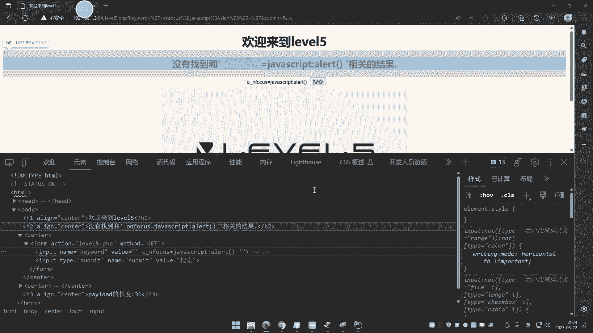

那对于script的呢把它过滤成下划线，script这on呢把它过滤成on下划线，你看这个打码已经看到了嘛，NF5的一个关卡很简单，很明确吗，他说对on有这个过滤。

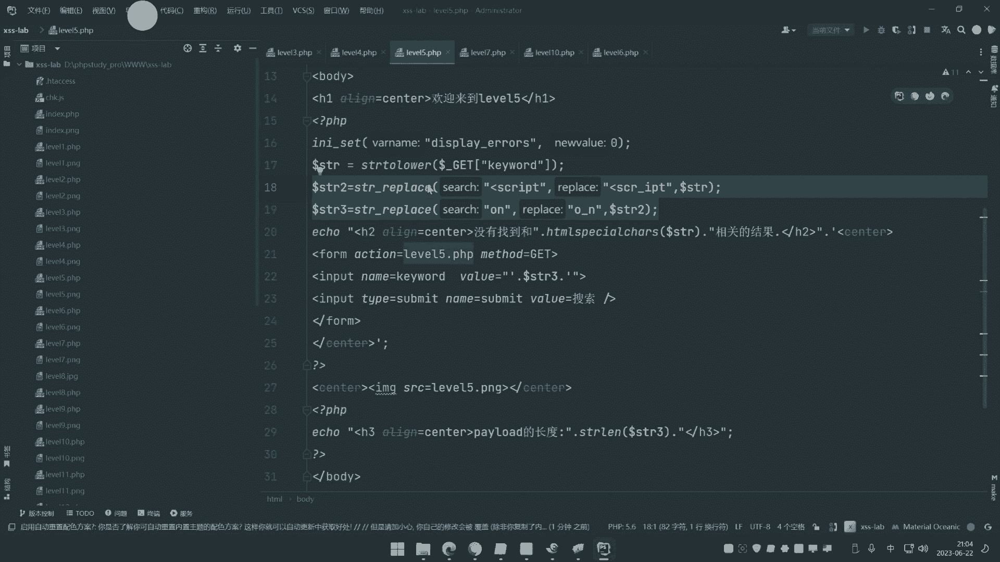

那除了on之外有没有其他思路呢，有就是除了标签事件之外，还可以应用哪些东西呢，就是我们说的应用其他标签来触发，应用其他标签来触发啥意思呢，啊就说你可以呢换到这个其他的地方。

比如说就是你看这个computer里面的函论做，他用了什么方式呢。

A标签先把前面闭合掉，然后呢，用个A标签里面的这个JASCRIPT去除法。

其实这个除了A标签呢，你还可以用更多的，就我是怀疑一个，比如说云哥这个什么image的，那写个image的把它复制出来，这样子啊都可以。

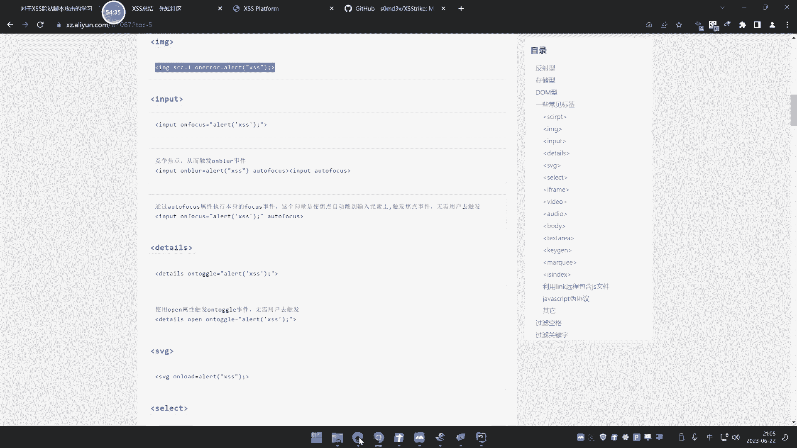

就是呢我先把前面那个闭合掉，我不用标签事件了，先把前面那个闭合掉，哦不是用关键字了，然后呢写个这个什么嗯，mage标签摘了，把后面闭合掉执行，然后你看这里哦，这里又有过滤啊，哦他这里还有嗡事件。

那就不能用N时间了，那就用那个哦，怪不得了啊，那还是要用这个事件。

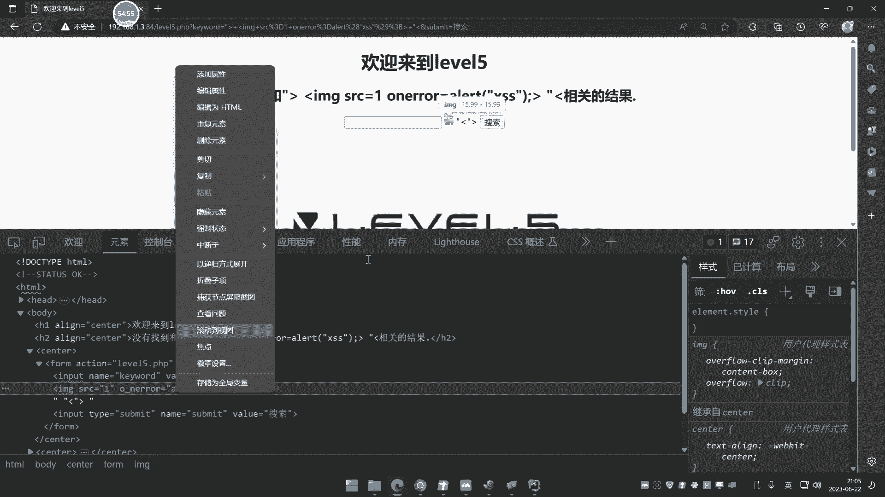

另外那里呢还有那个on new的事件，他还有个关键字，所以呢就换这个HRD的事件执行，然后这里有个这个地址字地址啊。

你看这里有个代码地方来，他又多加了这个A标签事件，A标签呢点击的时候能触发这个JAVASCRIPT的弹窗执行，完整的不错是吧，这第五关，其实呢总的来说就是在上面呢，用各种东西去触发一个JS代码而已啊。

他这个要考核的就应该是这一点，有的呢就是用事件触发，有的呢就是标签里面去闭合绕过，还有的呢就是换一种关键字的，绕过方式的去触发它，第七关呢看下第七关呢，到第六关还没有用啊。

第六关是个大小的，那不用讲了啊，这个很简单，就是就是我们前面说的这个大小写啊。

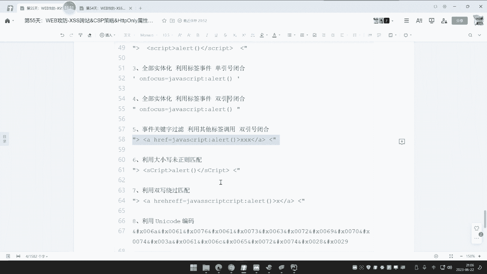

来给他看一下吧。

那第六关呢就是前面其实都没有去用这个大小，就绕过这里，那就直接用大写就绕过了。

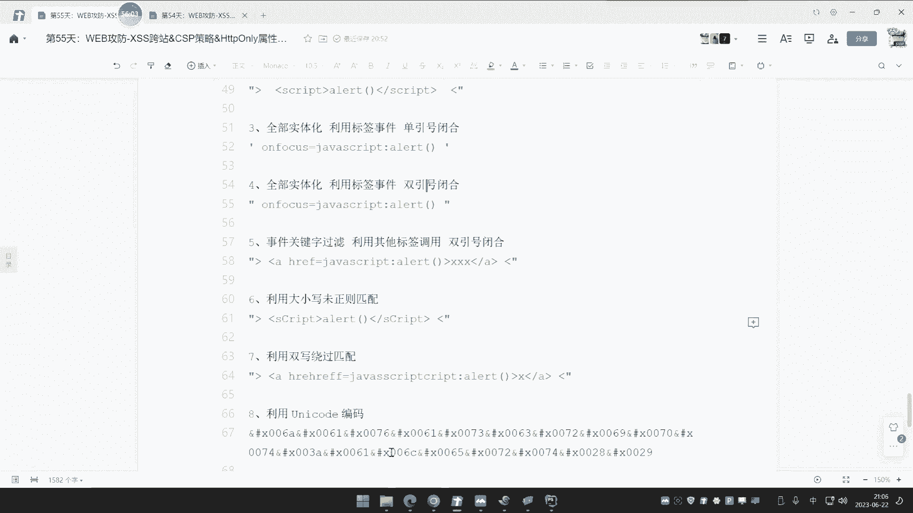

原因就很简单，因为我们都知道啊，这个代码中如果没有用正则去匹配的话，是很差异的呢，它匹配的是script的，这种是小写匹配，那换个大写就能绕过它了是吧，一闭合那就行了，那第七关呢。

第七关呢其实也可以用大小写，也可以用大小写，但是呢利用大小写也能绕过它。

但是说实话啊，更好的就是用这双写大于这里不能绕，然后呢你看他这个地方啊，因为它把它过滤为空了。

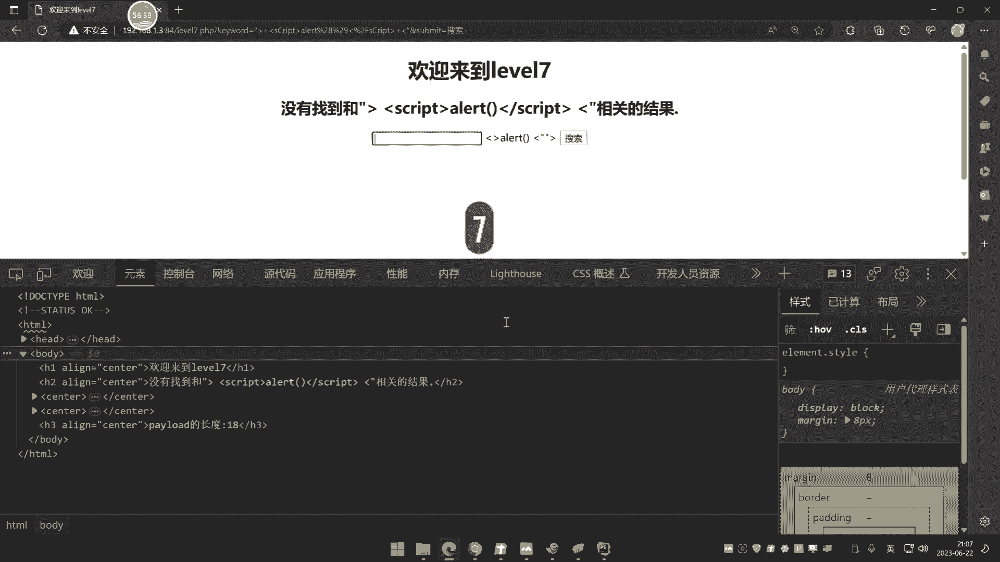

为空之后呢，我们就双线干嘛，AREF过滤AIF5鬼个空，前面呢AREF后面的JAVASCRIPT再过滤CRIPT，把script过滤个空，前面的java s，后面的就是CREAPD组合成一起。

前面这个闭合就不说了，这前面都介绍过了。

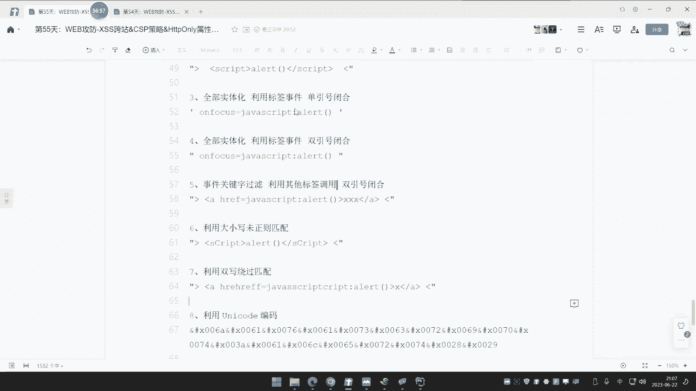

就习惯了，就直接这样一操作就完事了，好简单的，和前面讲那些logo场景是不是都一样，点击这里呢，完成的不错。

对不对，那其实都是一些代码层面的一些写法，上面的没有用正则去绕过，还有现在就是只绕过一次，不是递归绕过，比如SQUE了，过滤为空，那我就双写两个过滤一次，还有前面再把那个过滤空呢，前面加上去。

后面加上有拼接成SGO的，就这么简单，这都和前面那些那种讲过的一些知识点。

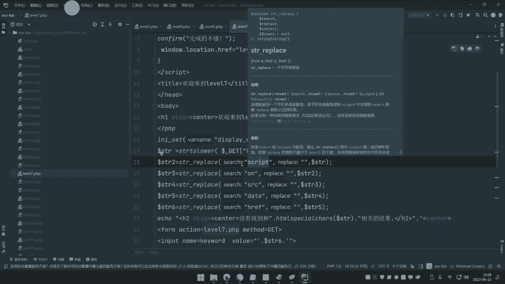

都是吻合的，就是国内的思路都稳好吧。

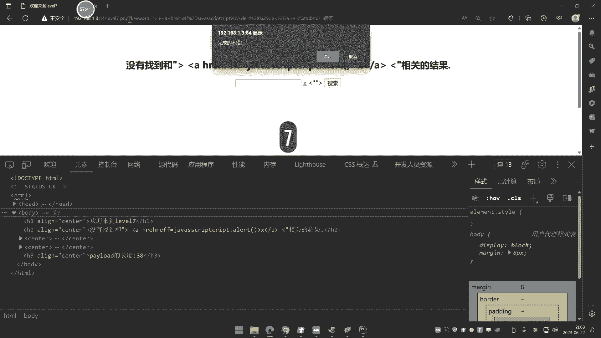

啊到了第八关第八卦的时候呢，他什么情况呢，第八卦就是用UNICODE，用unit code，啥意思呢。

啊给大家看一下啊，这有情连接了，你比如说天天有零线一点啊，有情连接地址呢就变成这个什么，你看啊打开地址就变成这个了，看看输入这个地址呢，我输入123添加友情连接。

那友情连接这里呢就变成了后面加上123了。

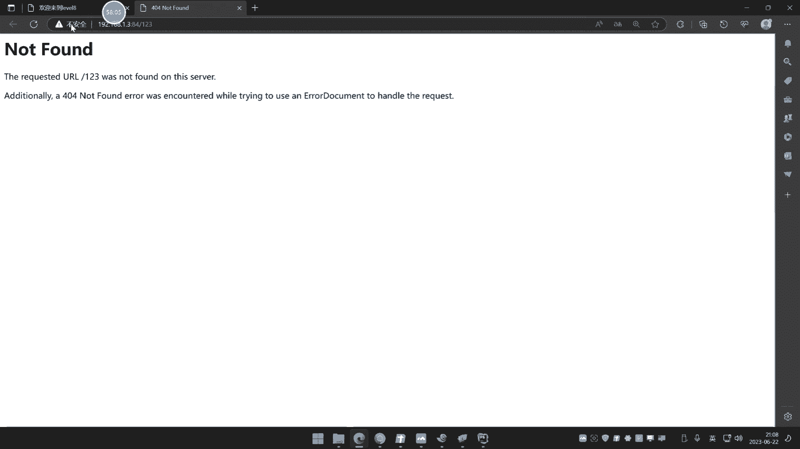

那如何run这个地址后面的执行JAVASCRIPT代码，那很简单的道理，那就是直接在这里写的什么JAVASCRIPT找回了ACTIC，对不对是吧，这样子呢就能执行JS回了，但是我一打开这个地址一打开啊。

他把过滤了，你看地址过滤了，你看script这里变成下划线。

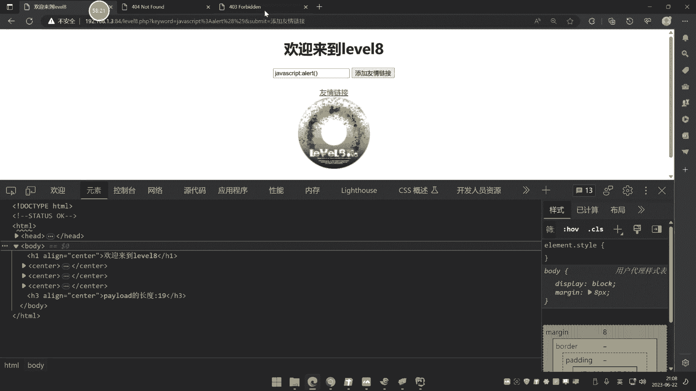

对不对，因为呢很简单，你在这里输的，你在浏览器上面输这个东西来。

大家看到没，它就能弹窗，什么意思呢，就浏览器你如果在浏览器上面输这个东西，他是知道这就是告诉浏览器，我要执行这个JAVASCRIPT的意思，能理解吧。

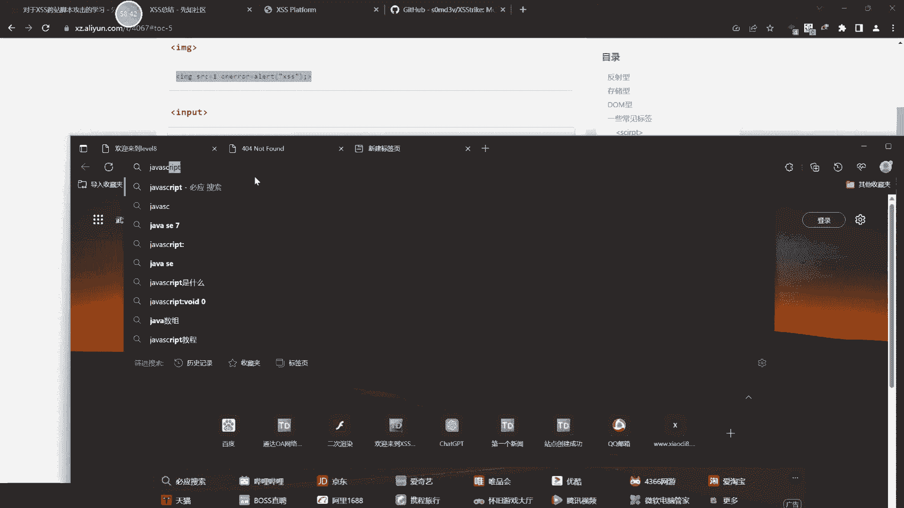

啊比如说弹出个一，你写这个东西呢，浏览器它知道它弹出一就这么简单，是不是，所以说呢它在这里添加这个地址链接，就像是更改这后面的地址链接呢，更改后面地址连接，那地址连接。

如果说有一个JAVASCRIPT的话，那么他也知道会把它当做JS，去执行这个后面东西，但是你加上去之后呢，太过滤，所以我就把这个代码改成怎么样进入decode编译。

就换一种方式是吧，把这个核心东西呢进UNICODE。

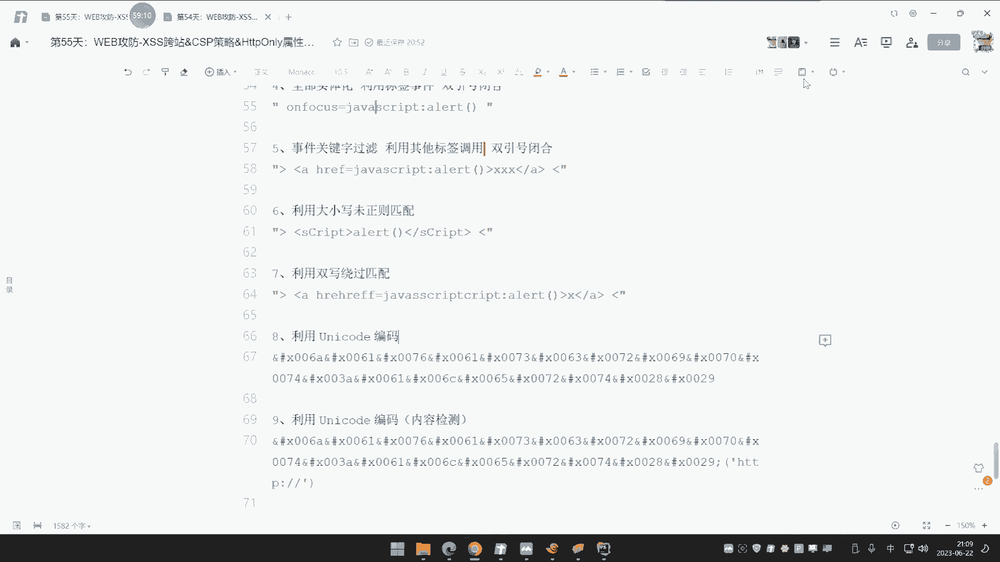

这样子呢它也是支持的，因为它在浏览器上面显示，就必须要用UNICODE，一个人说这能不能在其他地方去用啊，我告诉大家了，你把它写在哪，现在呢写进去，我先把它复印出来啊，点啊弹错了。

弹窗了，说明成功了，为什么这个地方能这样用，其他地方不能这样用呢，给他说一个一，这个是UNICODE啥意思啊，它是在浏览上面去执行浏览器，它仍是这个码，而你在实战中的话，比如说在这里啊。

就在这个页面中去显示这个结束，在这里他写这个东西，他不一定真的能理解吗，所以他这个每个关卡呢，其实都是在一些实际应用情况下面，都有一些东西的，就说那你很简单的呀，我把这里改成这个东西，你看，你改对不对。

它有些呢它就能识别这个地方，它有些呢你就运行不了，它就识别不了啊，刚才能识别的原因，就是因为呢他是在浏览器上面，他是在那个上面。

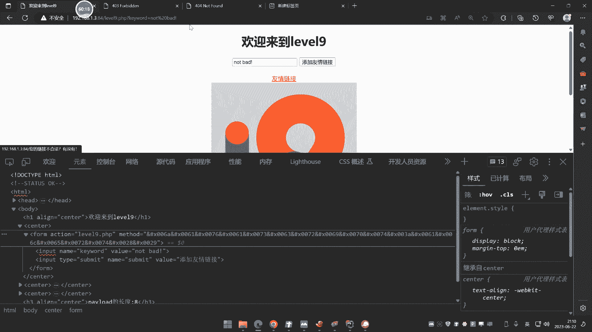

所以它能识别它，它本身编码是UNICO的，而上面呢我们这浏览器会自动对这个UUR的，进行解码，所以它能识别出那个追踪的情况，是这个情况，如果在其他里面，在代码中，它就不能识别知识点太多了呀。

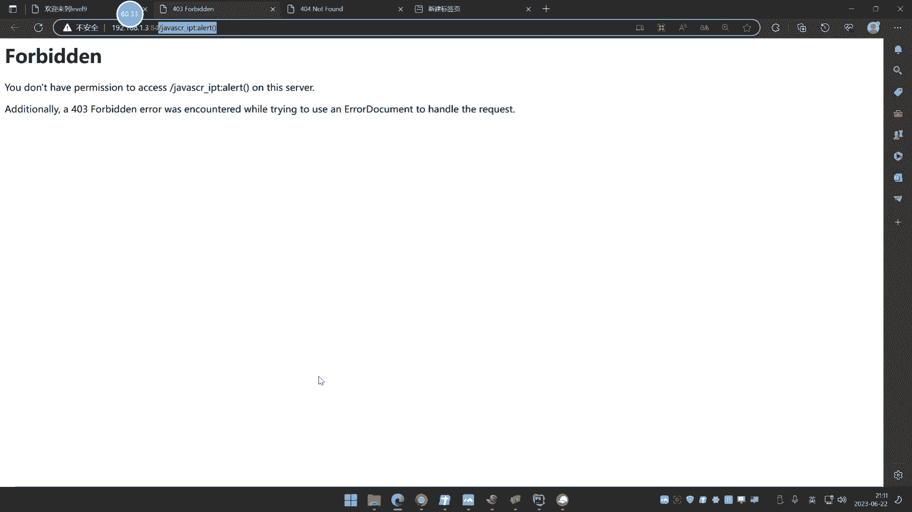

我没办法，可以说把每一个知识点都是跟你讲的很清楚，我只能说告诉你是这个由来，后面这个11到十二十关也是很多支点的由来，都符合在实战情况下面一些差值的积累啊。

你看第九关呢，第九关就是符合于什么呢，就是玻璃里面啊。

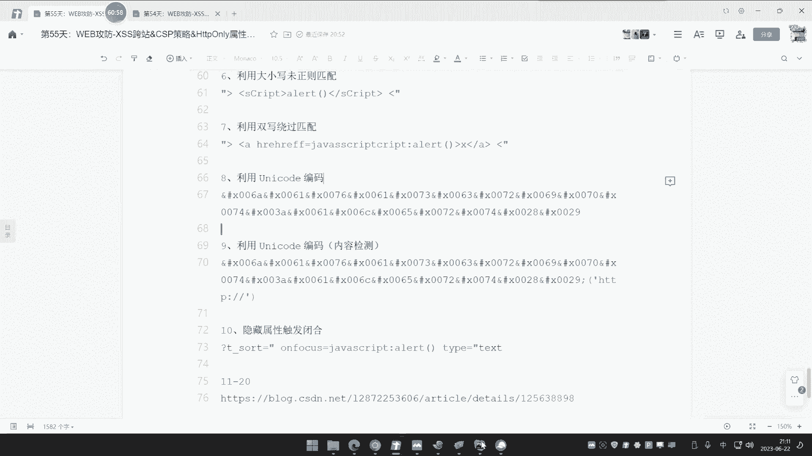

第九关键是无非就是多了一个小检测，就是判断里面呢有没有这个什么app的，一些就是代码的，有没有app没有，那就提示链接不合法啊，有的话就成功，所以呢就是在上面的基础上面呢，加个a hp就完了。

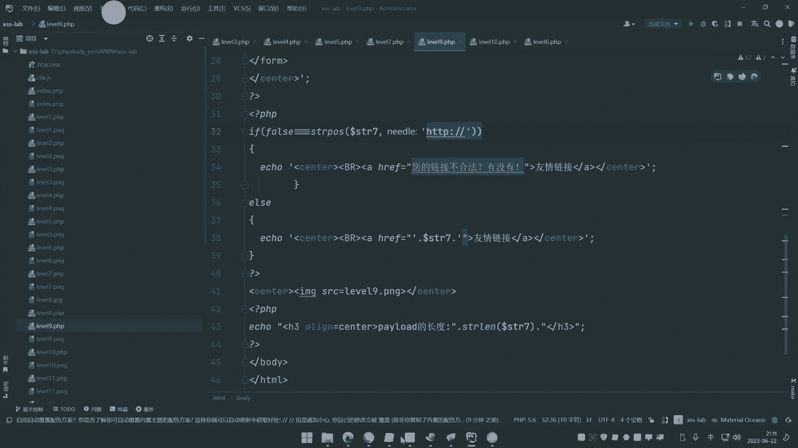

哼哼就这么简单，你可能说哎呀，只要里面这个题目太垃圾了啊，我告诉你一点都不垃圾。

为什么呢，因为你没搞过代码审计一点，他是完成不住是吧，第四关为什么他有这个支点呢，我给大说一下啊，如果你有搞过代码神经时，代码神经里面经常会有这种情况，就是判断你是不是输的这个网址。

这浏览浏览链接里面肯定是网址嘛，网址一般都带hp和PS，你可能说他为什么要a p a abs啊，他不检测这个app和abs会死吗，会死为什么，如果他不写c app这个网址，你直接写上去。

有可能会访问不成功，为什么会有这种情况，大家都知道有些网站它是PS的网站，你直接访问它，如果它网站自身不能检测的话，你访问app它就访问不到，他必须接APS，为什么你可以说哎呀，我访问百度点com是吧。

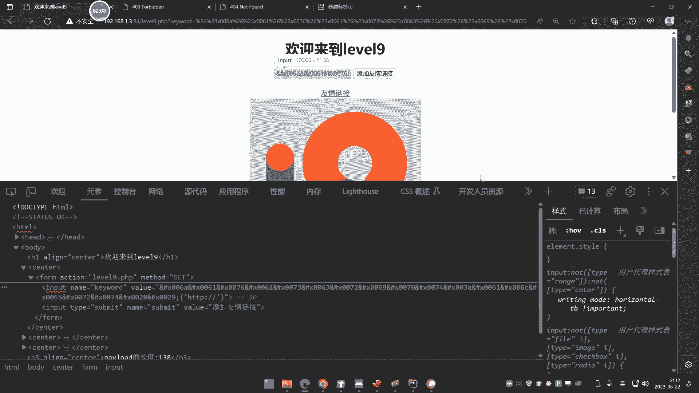

我不加app，它也能访问是吧呢，它自动加上abs，我把abs区域掉，我一打开它也能访问，为什么，是因为百度他自己呢有检测帮你自动还原，所以你能访问，但是游戏网站它没有这个策略，它是你必须要告诉这个网址。

你访问这个域名是AP还是vs，你如果不直接那个的话，你写错了，明明他有abs呢，你搞AB不好意思访问不到，因为我们都知道abs默认端口是43，AP是默认端口是八零端口，你写错了，说明访问它不同端口协议。

它有些人就访问不到，如果你有这种实战经验，访问过程出错的问题，有这个APS和app访问出错的问题，你应该知道，所以他必须为什么说，网站中要检测这个AP和APS的原因，就是因为他在实战中的话。

有些网子呢它没有a p a abs添加链接话，你不检测的东西，可能那个功能那个地方访问的时候就会出问题，所以代码中的通常会解决，他这个题目设计就是比较偏向于实际，就是一些这种实战中的源码里面的时候。

他为什么要检测有没有这个关键地方，就是看你有没有设置AP和EPS，防止再添加这种连接的时候呢，是吧，出了问题，所以不是打靶场为了打靶上，而是要想到这个打靶场的实际应用价值，知道吧，你搞过这种事情。

你就知道这个题目出的有意义，你没搞过，你就发发现他有点神经病，对不对，就这么简单，就是一关，那何必呢，对不对，这个第十关呢是个什么情况呢，就是隐藏属性唉，说实话这关呢，这个我啥意思呢。

就是这个有考的太多了，有点像CDF题型的，这个我不是很乐意考啊，啥意思呢，就是说啊这个第十关这里面他这里的，你发地址上面有个叫own now，然后这里呢也显示这个on down是吧。

然后呢这里你可以看一下啊，它显示在这里呢，你加上个夸张语句，写上去之后啊，你看下，他也是直接在这里，那肯定是有过滤的，这也不用看，那执行执行的是你看这里面显示了，但并没有执行成功。

原来也不用看那实体化了，然后下面呢也没有其他显示了，然后你看下面那些代码中的，你看出了几个值，他出了个这个叫t t link呀，什么t horse人，然后呢你看类型的为HLE，这个是隐藏属性。

就是说把这个地方的给他隐藏了，啥意思呢，我们可以看源码来分析一下这题的一个设计啊。

他是个什么情况呢，其实就是说刚才你输的这个值啊，你刚才输的这个值，你刚才输这个值呢，它有显示到这个TSORT，这里显示到这里来了，但是由于它类型是隐藏，所以呢你没有看到。

其实就是说这个script这个语句呢。

它本身是在这个费率指针里呢是有的，但是它是隐藏属性，所以只能你看不到，你看这个代码中的是看到的。

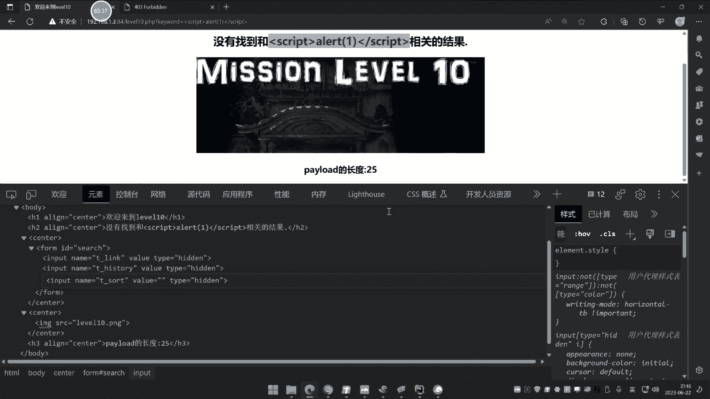

所以呀他这关呢其实就是啊自己呢，知道这里有赋值，重新发送这个参数给他，让他去显示，你可能说在黑盒中我怎么测试呢，黑盒中测试的话，就是对这所有的参数都进行一个测试，然后呢发送配偶的去测试。

黑客中是这样测试，白盒中，那就不用说了，直接看出来了。

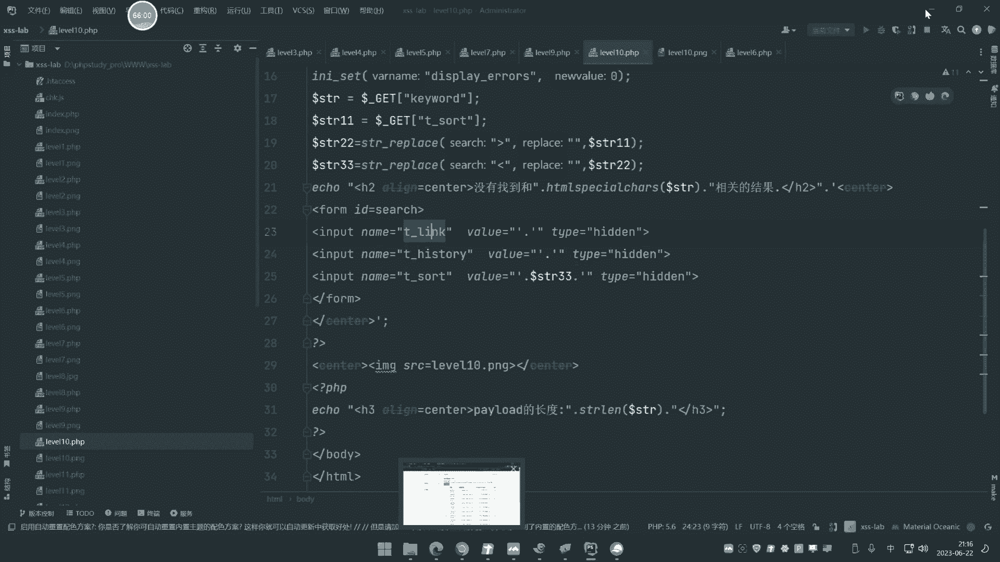

所以黑盒中测试的话，不仅是这个网址上面浏览器上面的这种参数值，同时呢，它还测试这个整个浏览器里面的这种表单字呢，他也要测，你跟他说拉我一手工测，我不测就勒一死了对吧，他如果说这样测的话啊。

那他就给他复制呢，或网上面去敲这种地方，那大概敲这个地方来来触发这个事件，因为他是个非牛嘛，非牛后面呢，然后用这个是吧，鼠标时间段的触发是吧，一次性你看然后把后面属性呢也给它设置为test。

然后显示出来了是吧，那执行，那当有这个鼠标滑动到这里的时候，那就会触发点一下第四关就过了，就这个意思，这个鼠标触发时间呢，如果在实战中的话是不行的啊，实战中的话就说必须这个触发者他去触发。

才能执行这个JS，你想想他能访问都是都要听天由命，他还把鼠标点上去，把它点一下或滑动一下，触发焦点，那才能触发这事件，那就简直就是痴心妄想，所以说这些东西呢在实战中的意义不是很大。

但是呢他能教你去勾招吧，唉总的来说呢，实战中为什么说用起来很麻烦，就是因为他很多东西都不太贴合于实际，大部分这种考题呢就是为你拓展这个知识点呢，在CTF里面呢，或者说在一些其他东西呢喜欢考这种事情。

实战中搞这种真实钓鱼啊，去等着对方去出发呢，没什么太大意义啊，你这鼠标点，那那怎么可能呢，对不对，但我不点，你就不触发不了了呗。

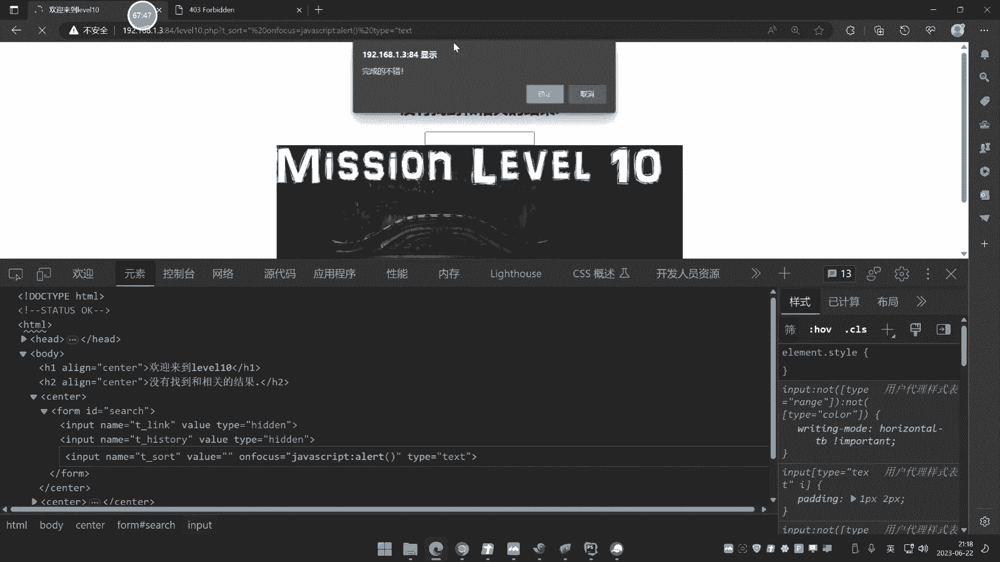

怎么这个11关和20关呢，我们就不给他讲啊。

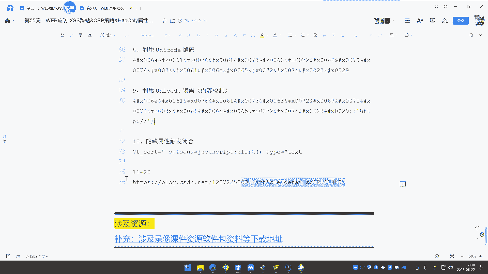

11关和20关呢，你给看一下。

其实也不难啊，我先给大家看一下，然后我们看根据需要给他讲一下。

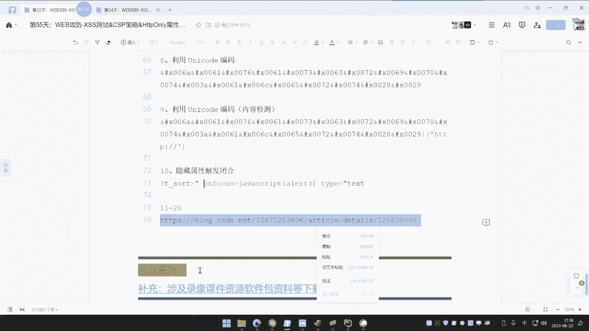

来看一下啊，就是那个过关的一个关卡，那11关的时候是搞了什么东西啊。

11关的时候呢就是和前几天我们商的一样，就是这个值呢来源于AHP的这个来源头，里面检测，然后到了第12关呢就变成了这个鱼尾头了，在页面中显示，就说页面中的去接受这个约头，然后约额头呢改成夸赞语呢。

实现了夸赞，那后面呢基本都是差不多了哈，打鱼个头是吧，其实呢后面的这些题目呢，全部都和前面字典也挂钩上了，简单来说通过这个靶场呢讲到这里，你就应该明白几点，他的攻击点是哪些，思路点是哪些好。

我们现在上到这里了啊，11关12关这些关卡呢给他看着他的考点，那我想问一下大家，如果你去测的话，测这个夸张是测什么呢，对不对，黑盒怎么测，白盒是怎么测，白合不说了啊，白合是代码神经。

那不是相关于看代码直接可以看出来的啊，那黑盒测主要是说黑河马啊，测到这里，你觉得他和那个我们说的那个SQL注入，有没有相同之处，或者说你觉得是不同还是相同啊，就测如果说是测十个注入话，和这是夸赞。

你觉得是相同还是不同的，我就问这一点好吧，这里车这种设个出路和车这个夸张，你觉得他的那个车的那个思路点，是相同还是不同，相同是吧，不要说什么有点相似啊，什么鬼，那么有点相似，是相似还是不相似呢。

啊你就说是同和不同就完了，对的呀，那就是的嘛，那就是相同的吧，为什么这样说呀，回顾下circle注入里面，除了地址上面的这个get型的注入之外，post注入，就类似于我们这里XS那个表单里面的值。

然后呢又讲了什么鬼，这个文件头啊，自问头啊，这个数据包头什么UI里面的呀，那些什么这个各种各样的，这完全就和这个差是一样的，所以说其实很多漏洞都是这样的，你主要搞清楚一点，就可以想到这个原因了啊。

首先你看一下啊，这个XSS夸张啊，注入了，是看那个语句有没有被带入执行那个黑盒中呢，还看不出来，只要看页面变化来判断这个夸张中，如何去判断它呢，其实就是看数据的显示，数据的显示，对不对。

我们就拿之前我给大家去讲的那个案例。

就和这个11关12关呢是差不多的，哪个案例呀，我把它拿出来啊，再回顾一下，这里呢就要把这个思路给理清楚，因为这个画质那我们就不再商了，你这个点呢你还不能理解。

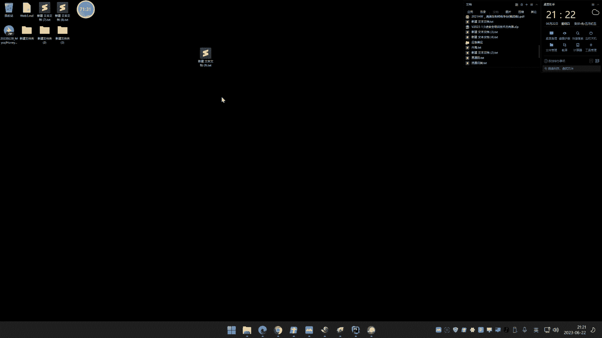

那就有些尴尬了啊，那就等于没上的一个意思，我们前期呢给大家看过这个一个案例的，那你呢我帮找一下啊，这个，这就是个非常经典的案例是吧，这个案例呢其实就和今天的12关，11关差不多的意思。

那这是个检测UI头的一个网站，你说我怎么找到他的，夸张的，怎么找到的，他是个鱼，回头注入啥SS什么情况呢，因为网站打开发现他在这里呢，有接收这个UV信息，但你问这个UV信息怎么来的呀。

这不就是你访问它浏览器，你浏览器刷新访问，你访问他数据包里面访问这个网址，那访问他，那你的请求包你自己自带的UI啊，那就这是你U位啊，他不解释过去了吗，然后他解释过去之后，你可以说他怎么为什么接受吧。

他不结束，他怎么显示呢，他肯定结束了，它才显示啊，把你的这个信息显示到这来，那这个过程不就符合于夸张的产生吗，夸张的原理是不是就是输入输出啊，一个是你输入的TTT，你输入它的就是你这个访问网站。

这个浏览器自带的把它输入进去了，他这里把这个解结果把输除了，对不对，所以呢你就尝试性的在访问的时候，把这个UT1改，改成个什么化成大A嘛，那这里呢他就这里那就显示了跨代码A1显示，那就执行了。

就是夸张了，对不对，这是那个例子，我前期给大家讲过，还演示过，那这12关11关不就这个道理吗，那么等同于这里是UA，那还有这其他的这个头包呢，比如说cookie里面的或这个这个这个上面的请求。

上面的这这地方都可以，只要他接收if把它放进去，只要它显示，所以其实就是说这个夸张了，你只要搞清楚页面中的显示，是不是你能够控制敌方就行，这是找夸张的核心原因。

把它写一句话啊，写完之后我们再给大家说一下工具。

其实漏洞发现我不讲，把漏洞原理讲了，你都要去想到这一点，你都要去思考这些问题，你才能学好，你都不思考，老等着我讲，我不讲了怎么办呢，是不是，还好我讲了，有些我讲了等于没讲，他也不听。

人家到时候呢他也不说，他不会，你说这咋办，它比较核心的一个点，第一点呢你就要先判断这个页面中啊是吧，那页面中显示的这个数据是有哪些是吧，就是找可空的，什么叫是不通的，然后这个显示数据呢还知道是吧。

有些这个什么隐藏的地方，就像我们那个射击靶场是吧，刚才那个第十一十关的时候，就说这里呢它其实有显示，只是他把页面中把隐藏了是吧，所以说呢你要测试这个隐藏属性地方啊，有些隐藏的你还要注意啊，找数据可供的。

然后那就是什么用这个隔空的是吧，就这个是吧，然后呢如果说成功执行啊，就是挂单，不能成功就看什么那个语句输输出的地方的，什么这个过滤情况，就第四步，那就是根据这个显示分析为什么不能执行，那么有哪些呢。

实例化造成的，还有什么这个符号出三符号括起来了，或者还像我们说的什么这个关键字可以删除，对不对，那后面呢能绕过他就行，绕过不了，就GG把这一讲，这些东西你都要自己思考出来的，你思考不到这一点。

上面这个漏洞就是等于白学没有学过，那至于怎么利用，那是我们上节课的事情是吧，那么能不能利用成功，第一个是看有没有防护，第二个呢就是对方处不处罚，就这两个情况对不对，那是后期我们自己说的问题啊，成不成功。

那就是啊这个姊妹咨询呀，对方有没有出发，因为他本身就是要等着出发嘛哈，因为他都是要等对象出发，不是个主动漏洞，不是个主动攻击漏洞，是要受害人来出发的，对不对，这个试点呢想你知道了吗，找显示的数据啊。

要么说显示数据哪些是可控的，显示UI信息，那就在文件头里面，找浏览器上面的这个显示的数据，那是你自己提交的数据，那就是只有你想提交什么，就要显示什么，只要上去呢看一下能不能成功执行这个JS代码。

能执行呢就成功了，不能执行呢就直接找那个语输出的地方，看一下是不是在括号里面，是不是在这个什么，是不是在括号里面，还是是不是这个前面尖括号被实体化了，还是什么关键字被删除了，对不对，然后再尝试绕过。

那刚才还有问实体化能不能绕过啊，我告诉你实体化不能绕过几几啊，有线能绕过，有些不能绕过啊，但实体化绕过不了几G啊，因为你也看到啊，那个前面这几关讲的习惯，讲的基本上都没有，真直接真刚这个实体化。

看到实体化就是换方式在搞啊，实体化绕过思路呢，就是我刚才说的用那种标签事件，再就是说怎么样呢，不触发那个实体化那个那个关键代码，这才是他绕过思路，你要说直接硬刚他那个logo的那个关键词，那是搞不了的。

因为实体化是防御XSS啊。

代码中实体化就用那个函数嘛，就是pp里面就这个函数，这个ATM是pm啊，就这个啊，这个是它实际化函数，这个函数本身就是为了解决，差SS的一个关键函数，基本上很多仿XS都用它啊，很难牢固，牢固不了啊。

他绕过来就是我刚说的，因为像那种那种叫什么，不触发那个实体化的那个标签事件那些东西。

但那个很鸡肋，你必须要点上去啊，鼠标划过去，那里面的随意啊，那很难搞了啊，本来别人出发就不容易，你还要什么鼠标划过才能触发，那里没谁顶得住啊，好，这个是那个我们说的这个XSS的一些。

手工方面的一些分析是吧，这手工啊，黑盒的啊，白盒就不说了啊，就是看代码，看代码呢，那就是代码升级的内容啊，现在我们也不用不用去管它，现在还没到那一点，然后我们再说这个工具。

工具呢网上一款工具叫查理斯DSTRICK，这工具说实话啊，就是给你提供各种各样的配漏的，然后呢邮箱呢能够帮你测出来漏洞，来，我来演示一下。

这是一个黑盒测试工具啊，就是能够帮你写出大量的payload出来，然后你可以自己去尝试。

这是个比较专业的一个XS工具啊，插入工具呢也不多，这是个比较专业的，本身跨的漏洞呢就用的比较少，所以工具呢也没有什么新鲜工具，都是一些平台啊，那些东西啊，Python执行啊，烦死，然后呢怎么用它啊。

什么鬼东西啊，真是。

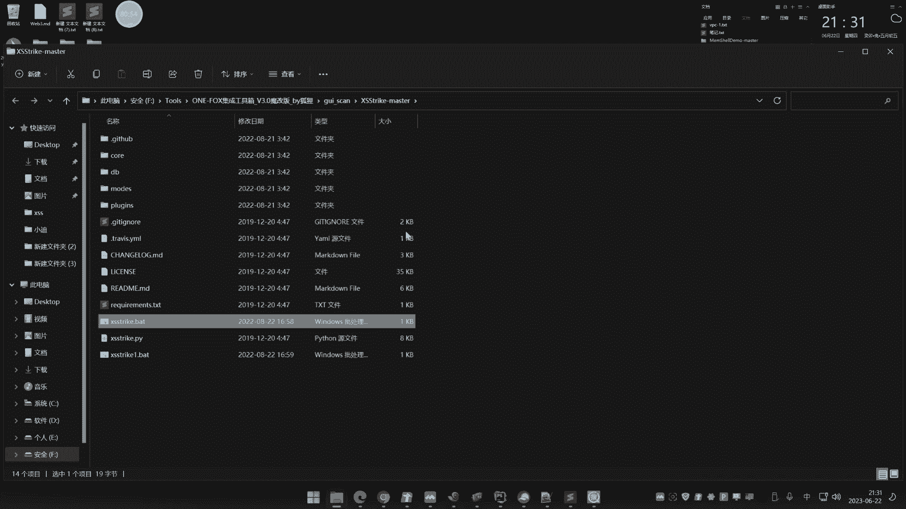

好CI运行，那就是Python的虚拟器这个PY文件啊，安装的安装就是安装这三个库就可以了。

这个比较简单的，没什么说的啊，安装不会不会安装吧，这不会安装，那前面课程就不要学了啊。

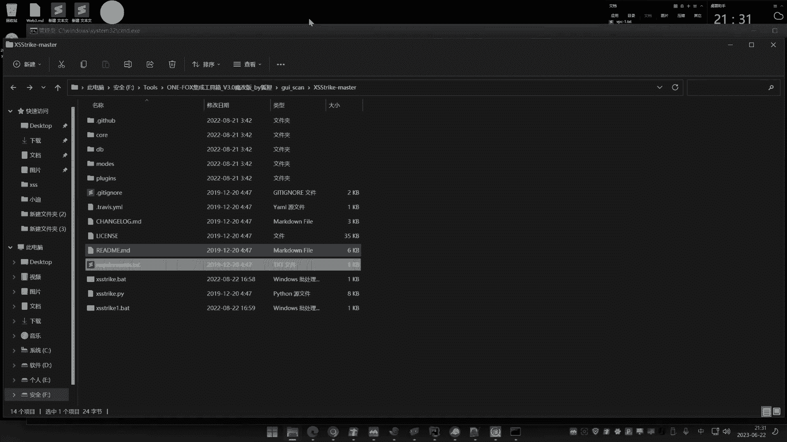

然后在在国外一块写的啊，他是具体使用的，网上有些文章的啊。

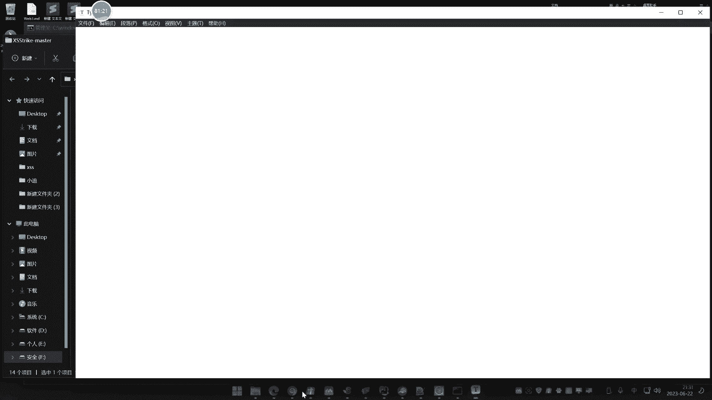

大家看一下，不过说实话这工具怎么说呢。

还行吧，它能提供更多的配偶的，有些时候呢还是有点用，还有很多利用思路啊，我们来看一下，他这个使用方式呢有几种啊，啊他那个使用方式呢，你看啊啊针对单个驻点那把参数写进去，他帮你测啊。

并且把那个PLOAD给你打印出来啊，基于post了，就是直接在这发送post数据，你看这里测有没有化脓，就直接在这里测专测，还有一种呢就是啊数据里面呢，如果说JQUER的它用接口的方式来帮你测驻点。

还可以进行爬行，爬行完之后呢，针对这个网子呢还可以进行再爬，啥意思呢，就是说比如说你测这个点是吧，他会帮你在文件中盲目测试，啥意思呢，就是更加很多参数上面测，那他也可以查到隐藏参数。

就像刚才啊有些不是参数是隐藏的吗，他能把这个参数呢帮你把它搞出来，搞出来之后再对参数上面的去发包去测，其实那就是等同于在各种地方去测，就是数据包里面的各个结束的参数值。

包括这个像我刚才说的这里面的像像不打开，这里面有很多这种元素吗，比如这里呢他有接收元素是吧，啊这个第十几关的时候，那你刚才看的那个第11关，还是第第十关的时候吧，他这里不是有很多元素吗。

打开这个词的元素里面啊。

那他有这三个是吧，它有自动的帮你把这个上面的啊，D上面加这个值，那然后呢去发送1PAO的去测，就这个意思啊，他这里用这种杠杠，那插入隐藏参数呢去测测啊。

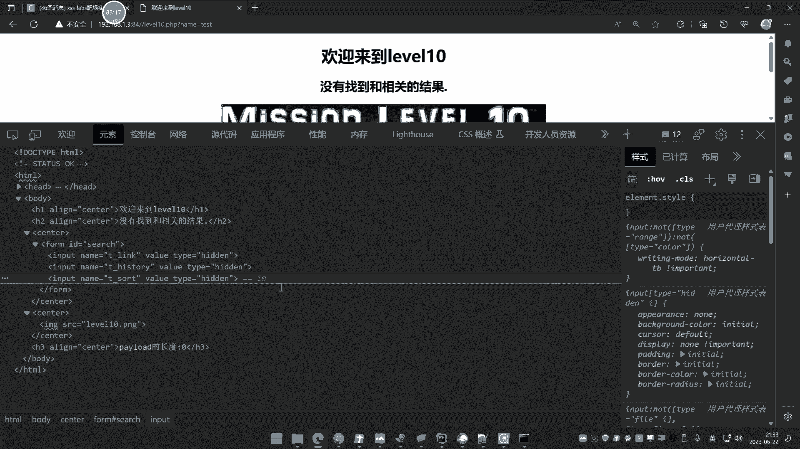

还有一些这种延迟啊，这种地方啊还蛮刺而似的，有效载荷等等一大堆啊，就是加了个编码模糊测试，这个后面呢还会用啊，在那个WAF绕过XSS，就是XSS的WAF绕过上面呢，这工具呢还有点用处，不过说实话啊。

这个真正有WAF的话，挖到是菜还是那种的，也没什么太大价值，车跟车个卵的车本来个XSS就很难用，你还有个WAF，我懒得搞，我真是，所以说其实这东西呢它有这功能和没这功能，那对于我们来讲没什么太大意义。

你说你要研究比较专业啊，你就研究一下，我们呢还是比较一个比较追求实际的是吧。

啊不如我备注实际的，我就追求这种学术研究是吧，那我可能研究一下啊，追求实际，本来个夸赞里面的能不能用成功。

能不能有用，都不知道，你还搞个WAF，我还自把，我还懒得在上面测呀，我测出来又怎么样，绕过你又怎么样呢，有个鸟用啊，唉别说了，我们还追求实际吧，后面呢在讲的时候再说吧，学术研究就可以研究一下啊。

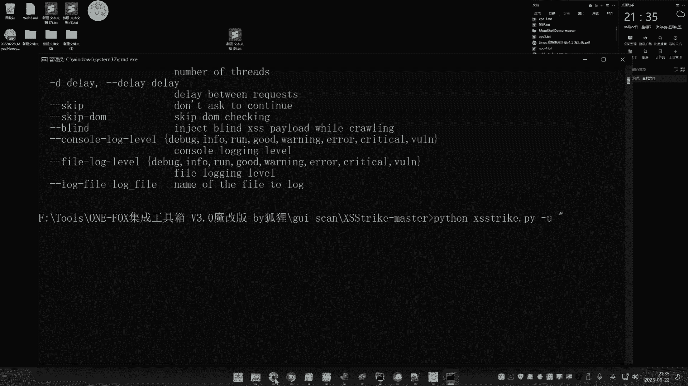

实战中能碰到这种情况是直接跑路啊，搞个毛啊，搞。

要是碰到这种情况就不用玩了，玩弄个毛不想玩，因为你就一个花旦，你绕过他又怎么样呢，没意义。

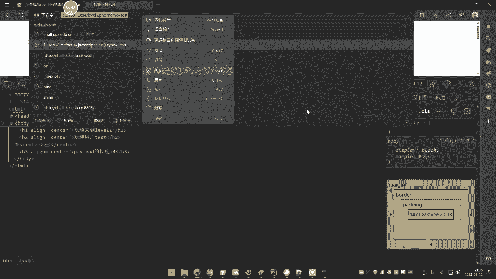

你说注入点logo，还可能得下得下数据库的账号密码，还有点用那个夸在里边绕过来有啥用啊，还不是要人触发，那别人不触发也是没有用的，你看啊，我就用它去演示一下，你看那用这个工具呢去帮我们去测一下。

这个点呢参数呢也直接告诉他，你就直接这样跑起来啊，跑起来了，他有3000多个配偶的车，那3000多配偶是啥意思呢，就是他自己那呢写了一些这种测试语法好，我给他暂停一下吧，CTRL加C2暂停掉啊。

这有3000多个，然后呢一般成功的就是在上面显示，而且他还帮你自动检测，他的一些相关的是wolf，有没有wave状态呢，为off状态就没有WAF，然后参数值的是name是吧，然后呢有3000多个。

你看啊，他这里测了一个，我们给他复制一下，看一下能不能行，放到这里来执行一下，看一下，哎这里不行是吧，你就可以换，看有没有其他成功的啊。

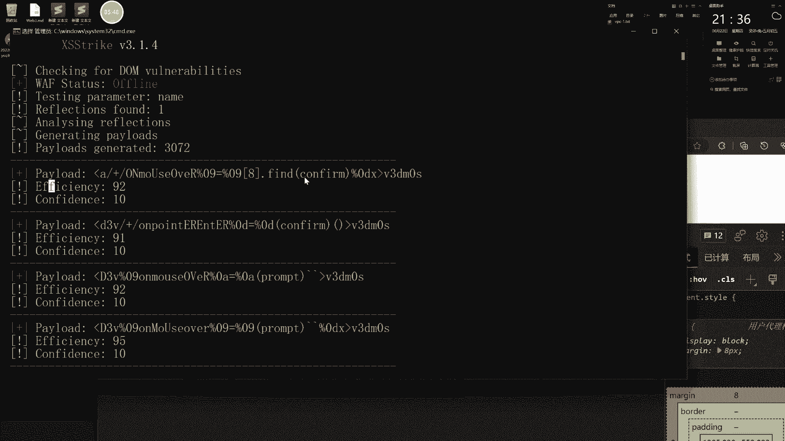

那他这个嗡鼠标事件哎。

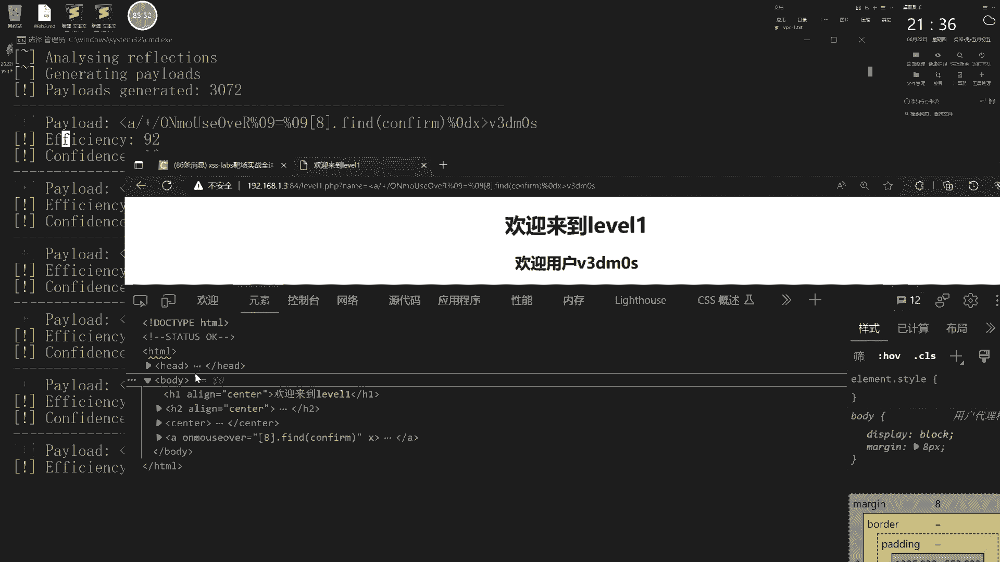

我们找一下R来看这个试一下，只要测的就是说他这个语速上去的没有过滤。

他就帮你测算，其实呢你就是根据这个工具呢也规则了，去找下这种类一方，这吃了也没用，看后面了啊，他是帮你找很多规则出来，哎呀这也不知道哪个有用也没用啊，真的很，呐这就出来了，但放你车出来有个了。

你看来换一种的这种莫名其妙的写法，你看这写的该复杂吧，所以他其实这就是为了，绕过一些常见的那种关键字过滤啊，帮你组合一些各种各样的payload，帮你在这里测，就这个意思，然后测出来之后呢。

这个代码能不能执行呢，他不知道，反正就测出来了，这个代码可以写上去，没有过滤啊，至于能不能执行，那就看网站自身的，所以他工具就干这种事情的，你看这个刚好呢我也用这个呢，它的这个是吧，执行出这个JS语句。

就是因为这里面有个这个这个语句，是弹出这个这输入框的，那说明这个语句被执行了，说明这个JS语句呢啊这个这个语句被执行了，对不对，它扯出来还测很多啊。

就是各种各样的啊，一键测，你，比如说这个呢A标签的这个数据，我还复制上去来执行，按这个。

那这个也是的，你看这不就出来了。

他就是搞这种私刑的啊，就是他车子就是搞这种私情的，就是跟你找很多很多一些编衣的这种XS，SS的一些代码呢帮你测。

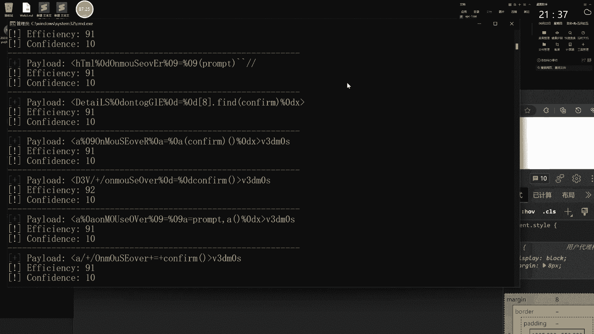

你只要能告诉他你要测的点是吧，比如说这里的测试这个参数就直接写上去。

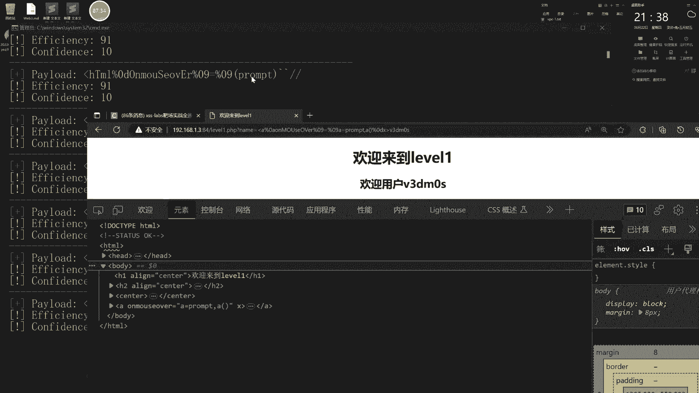

对不对啊，比如说像啊这个后面的关卡是吧，也是一样的道理啊。

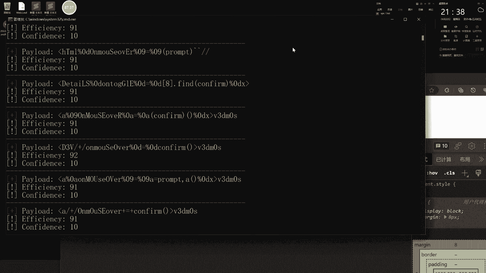

根据你的需要啊，如果get请求就直接写上去，如果说是post的话啊，pose的话，就按照它上面的这种适用语法是吧，但是有post的嘛，提交数据了是吧，就写上去，啊这个就是我们这节课的内容啊。

也可能说工具我直播讲的不深入啊，因为本身这个插入语句呢，这工具也是做这个事情用的啊，用的在用的拽好了也没什么卵用，知道就好啊，有时能以后用用它叫写就行了啊，这工具呢就让下载地址看下这个工具项目呢。

当时人都还比较多是吧，1。8K的，十点多K的新型量啊，现在呢都不更新了。

因为没啥更的了，好知识点呢就讲这么多了啊，看大家有没有什么问题啊。

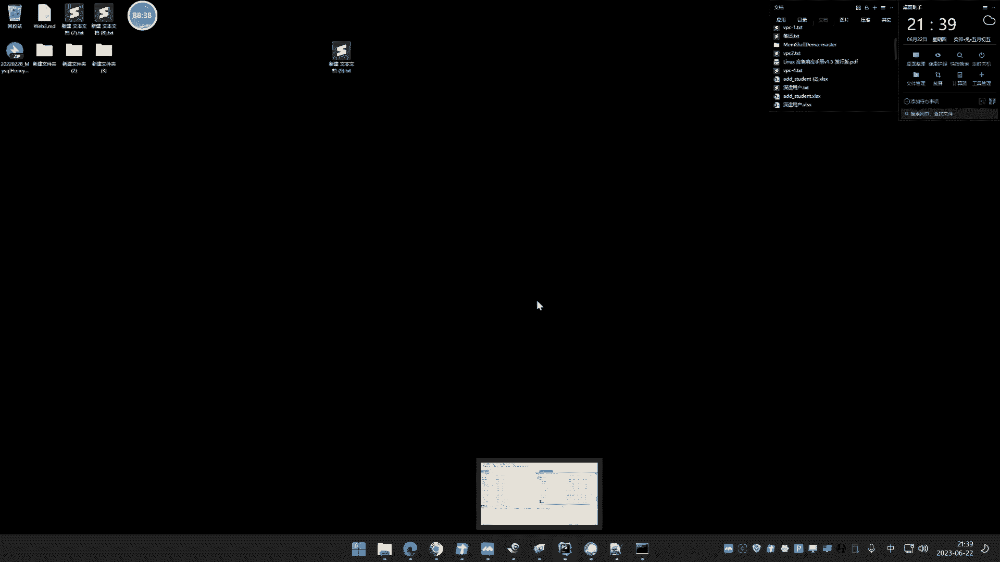

我下节课开始呢，我们就讲新的其他漏洞了啊。

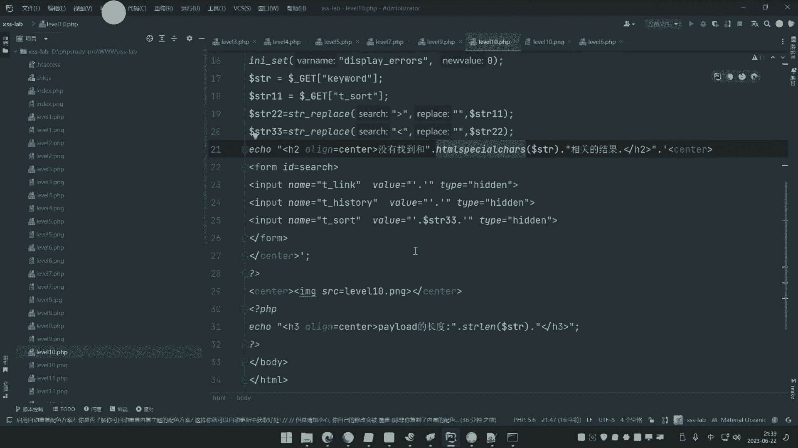

这夸张那就不讲了啊，其他漏洞了，下一节课呢就讲这个CSRF啊，和SSRF的一些漏洞呢，因为这个夸张和他们联系最关切，最紧要就是CSR和SRR和夸张的有联系，有些组合拳在上面在打。

但实话实说我比较鄙视之类的一些漏洞啊，像什么cs r FX s s这漏洞啊，说实话都是碰运气，而且一些厂商呢也不收这内容，但是网上呢经常有文章，什么XSS加什么cs f组合拳，打得一塌糊涂，花里胡哨。

实际上呢你在实战中呢也碰不到哎，但是文章就喜欢这样写，写上去看上去就很牛逼的样子，实际上呢你在用的时候，你会发现各种问题不上也不行啊，因为有些人他比较感兴趣，他可能还没有吃过这个苦头，他可能感兴趣。

等他吃了这个苦头时候，他会发现这个东西压根就没用，就是钓鱼的时候呢，有些人呢是吧，钓鱼的时候那还有点用啊，就是实在没办法了，你就用它，它有点用，真正有其他办法的时候，谁都不会选这种这种方法。

那以前他妈插SSCSRF呢，都是那种配合一些那种钓鱼钓鱼，喜欢搞这种事情啊，反正钓鱼就是纯拼人气嘛是吧，自己组织好语言呐，会这个有话术啊，唉钓鱼成功率就高，他和这个漏洞那里就没太大关系了。

因为别人点不点就全凭你的一张嘴不，过也要看那个点的人，他那个安全意识，他要是是个老油头是吧，老油条他啥都知道，他怎么可能点到，你说的再好，他也知道是假的呀，那除非就是那种是吧，不知道安全意识。

你说的也漂亮，他那个以什么色色的这个东西给他发过去啊，或者以什么他比较感兴趣东西给他发过去啊，唉说不定他就中招了，就像是吧，是你们一样，对不对，像那种白嫖的，就今天那个给我发一块钱，要我拉进群的。

我给他发个网站，我上面挂了个那个浏览器，那个截图框架，就搞了个BFXSS的，我就搞那个东西，我发给他，他肯定得滴，对不对，你就满足了好奇心的人，点击就点击加群了，他肯定得点，好今天就讲这么多了啊。

看大家有没有什么问题啊。

有问题就赶紧问啊。

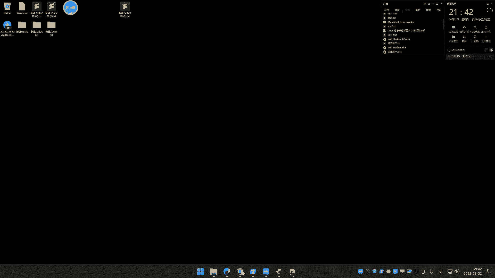

下节课呢我们就上了新的漏洞了啊。

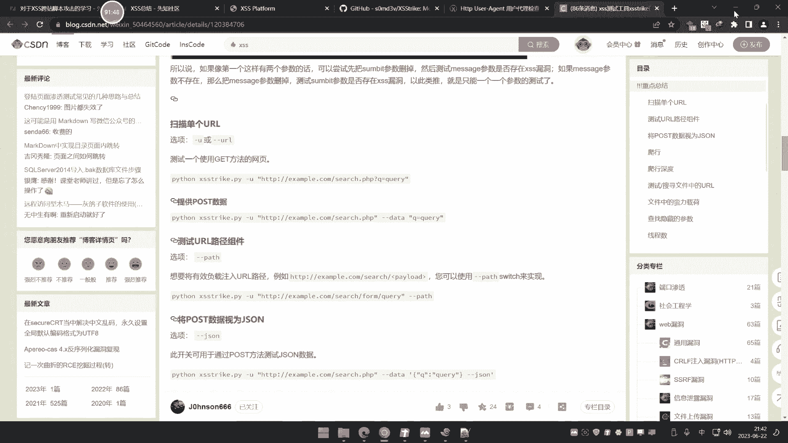

差点这都不上了，上太多了，也浪费时间，上不了，下节课是明天，后天肯定后天的，后天和后天啊，以前我记得我上XS时候，那个时候呢什么鬼要我上什么MXS，Ui xm s，哎吼我当时呢还以为是什么高端技术啊。

什么鬼，后面发现了牙根，现在是很少存在了，唉都是浪费时间，在网上有些知识点呢你不要看着是说哎呀，没听说过，很小众，觉得很牛逼，其实呢要么就是那个字典比较难，要么就是那字典的压根就没用，所以他被落幕了。

一种是男的原因，所以研究的少，还有一种呢就是压根就没什么卵用，现在已经落幕了，所以没有人去分析搞那种文章了啊，这这两种情况，那排除难之后呢，基本就没什么用，不要说哎呀，听说过没有伤就是好。

内容不是那样子的啊，你不要去网上看一些这种一种，一些听都没听说过的一些词汇，就觉得好，除了他本身是难之外，没人研究他是好之外，大部分都是没什么用的，一些字典，有字一般有用字典的大部分是吧。

对网上都有文章去研究的，师傅们分享点知识点，这个字典前几节课分享的不要不要的啊，网站我也给过什么那个打包的项目里面也给过，他至少是两三次分享过啊，我听说这个分享字典我都听了不下百次了啊，每期都有人问哎。

你是怎么给都是给不完的，没办法啊，嗯每个人他这个注意力都不集中啊，有些人发给他，他都不知道，没有没有没有one force啊，没有没有好，今天就说这么多了啊，好下节课我们再见了啊。

希望这节课呢能给大家这个把这个思路讲清楚。

这节课最主要的思路就是那个标签的一些利用，就是说为什么是一些这种组合，就是你自己呢也要学会是吧，把那个插语植入进去，说的能正常执行，它会有一些单引号符号的过滤，符号的闭合会有一些关键字的过滤。

或者一些是干扰符，你要尝试性的把它绕过，这个是比较关键的，因为这个你只能把差旅行能执行成功，你才有下一步知道吧，像什么CSPHO0呢，这是他的防护车呢，就是执行不成功，你要考虑的是这两个组织是这个意思。

那更重要的就是说在利用的时候呢，你先把它与执行成功，那如何能执行成功，就是看他有没有过滤，看是不是有这个括号呢，把它闭合了等等一些情况，自己呢把它进行构造，让它执行出来，这个就是关键所在啊。

至于后面成不成功，能不能利用上，受害者能不能出发，那就不是你担心的事情了，那就看你自己怎么去配合了啊，这就是我一直要给他强调的，这是个比较核心的点啊，你把这个点搞清楚之后就好办了。

包括这个前面说怎么去发现这个黑盒中，去发现这个黑人黑和叉S也是这么个道理啊，其实就是把原理搞清楚之后呢，自己去测试了，原理呢就是输入输出的两个事情，基本上所有漏洞呢都有个输输入就是代入。

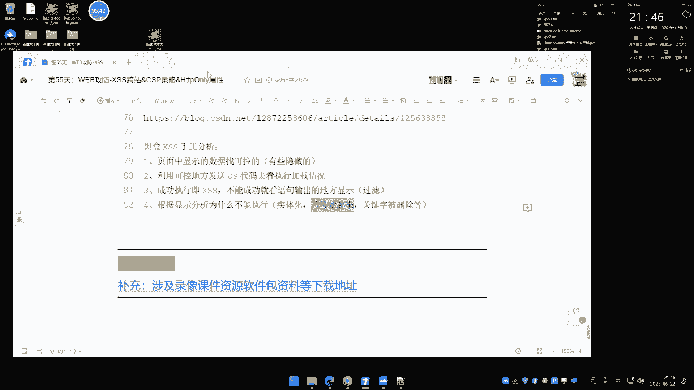

然后呢输出呢就是不同了啊。

