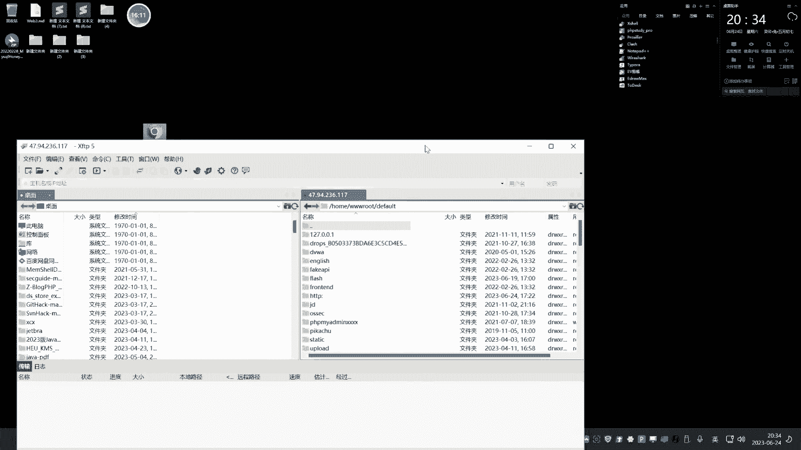
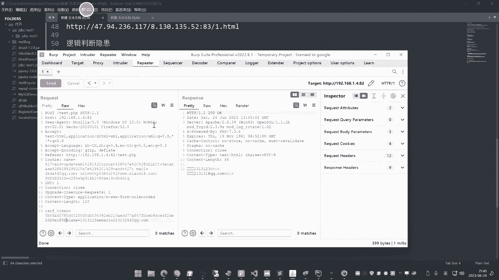

# P56：第56天-CSRF&复现CMS&本地Demo等源码 - 逆风微笑的代码狗 - BV1Mx4y1q7Ny

这个今天讲这个cs rf的漏洞哈，大家上节课已经知道了啊，今天讲什么呢，就讲这个CSF的三个点，一个点呢是无过滤的一个CSF的原理和利用，然后呢再就是这个同源策略的和token那个验证。

网上呢还有一个叫同源策略的，不过那个呢和我们这个DR方面的有点类似啊，所以说都差不多啊，那个防护措施呢大概是有三个东西，那么主流的那是这两个居居多，就是这个同源的和这个来源和这个toy。

那我们今天会说这两个检测之上面，关于CSF的绕过，然后呢再是这个无检测的防护绕过，无检测防火绕过障，那就直接是学会怎么用就完事了啊，关于这种检测的绕过呢也是要看情况的啊，并不是说就一定能成功的啊。

因为他写的严谨的话是绕过不了的，只能采用一些其他的方法啊，所以说他的招股呢有机遇，不严谨的写法，和这个严谨的写法的一个牢固的思路，好我们先来说第一个啊，首先介绍一下这个CSF。

CSF呢啊XS是称之为夸赞哎，网上的一个介绍呢，我们可以看一下啊，网上呢对XSS介绍了，称之为叫这个跨站点脚本攻击啊，刚才看到了嘞跨站脚本攻击，然后呢这个CSRF呢它叫做什么跨站请求伪造。

这个有一些这个叫法上面的不同啊，不过他们有一些很多相同之处，那么具体这个CSF是干嘛的啊，我们这里呢可以看一下这个一张图片啊。

我忘记把那个攻击图片呢给他找一个出来。

给大家看一下了啊，就随便呢，这里呢就，给大家看下这张图片了吧哈。

呃这个图片呢就是说这是一个back k点com，然后呢这是个EVIO点com，这个CSF是个什么情况呢，就是说呀在这个EZL点com上面呢，他写了一个数据包，这个数据包呢啊。

就是向这个bk点com呢去获得一个请求。

那么很简单的道理啊，这个我等下做实验之后呢，你就能理解了，怎么个意思啦，就是说呀一个正常用户呢去访问一个网站的话，我这里用文字表达会好一些，这个上面一些图片说实话也不怎么好准备，这张合并没有把它搞出来。

啊随便搞张图片放到这个上面搞一下吧，那个两个防护的我搞上去了，这个原理性的没搞上去，用一个那个简单的一个教法来给大家说一下啊。

你比如说像现在啊，这个比如说像现在啊，我们抓到了这个一个字符数据包，那支付数据包呢假如是这样写的，early page com是吧，阿里云阿里票就这个支付宝的哈，假如说了，他这里呢写了一个这个参数票。

然后呢后面呢这个写上这个什么，写这个后面的值啊，比如说这个票点，然后呢这里呢有个类目啊，就是你转账的名称嗯，名称比如说叫小迪，然后ACC，OUNT啊，就是这个账户名，比如说我的这个账户名是吧。

471656814Q点com这个账户名，然后呢有个这个金额就选个money嘛，等于1Y，假设说呢这个数据包呢就是一个是吧啊，像这个，小黎用户啊，然后呢他的账号，然后转账这个什么转账1万的这个一个数据包。

请求好，这个时候呢啊有个网站叫3W点小于八点com啊，首页上啊，或者某个页面，某个页面上呢，这个写一个这个加载数据包的一个代码，加载什么数据包呢，就加载这个数据包的，那么你试想一下，当这个用户啊。

受害者，登录到这个支付宝上面，同时呢与此同时啊访问了这个SD半小半点com，那么就等同于等于触发了这个什么付款数据包，那么这一弯会不会付出去，这就是一个典型的CSRF统计。

这个呢口述比那个图片呢会更加的好理解，他就称之为叫什么，为什么叫跨站点请求伪造呢，其实呢你可以看到这个付款的这个请求，是由这个三大面小礼，八点com这个网站内他取出发的，对不对。

所以呢为什么叫夸张点请求的请求伪造请求，伪造的是这个阿里P点com的一个付款数据包，对不对，所以呢他这个交法呢是这么一个医师，这样决定的，就是说呀现在呢有个受害者呢，他现在正在支付宝上面啊登录呢。

然后呢在登录的时候呢，不小心呢访问了这个3W的小礼拜com，那小礼拜上面呢写了个加载数据包代码，这个数据代码就是我们这个付款的数据包，代码啊，写进去就是那个付款的那个数据包，写的这个东西给加载。

就这个地址就会加载这个地址访问，当你去访问下载八点com s呢，它就会自动的去向这里那发送个请求，那你的浏览器就会访问这个地址啊，刚好呢你的支付宝是登录状态，那会不会就会触发这个数据包。

形成一个付款的一个请求，对不对，这个就是夸张请求规则啊，当然啊这种思路呢只能适用于没有防护，或者说能够绕过的这个CSF的这个攻击上面，你像我们现在说的什么这个质保，那肯定是没有这种安全隐患的啊。

如果说有这种安全隐患，那里面的那就安全的风险就特别大了啊，所以他们都是有椒盐的啊，所以呢这就是一个原理性的东西，那么现在呢我们就用这种cs8F呢，在我们实战中，它是如何实现一些相应的攻击呢。

cs5呢它的一个实战攻击过程呢，它需要几个条件，从这个商数的这个原理来讲的话，他的条件那就非常好理解，第一个条件那就是我说熟悉数据包，这个伪造的什么行，秋预这个什么请求伪造的举报，不说熟悉就是有啊。

就是这个需要请求伪造数据包啊，第二个呢就是我们说的啊，这个无过滤和防护，第三个呢就是说有过滤防护呢，要不这是他的这几个要求，就说要形成这个攻击呢，需要满足这这这三点啊，满足这两点。

然后呢第三点就是我们说的啊，这个受害者的需要无法，这是我们说的诱惑性的啊，你怎么去诱惑他去触发这个呢也比较关键，这三点条件满足之后呢，这个攻击才会产生，大家从这个刚才我举这个案例里面再去思考。

这三个条件是不是就是那个意思啊，为什么要需要这个数据包，这个数据包你怎么知道的，对不对，这数据包你要知道啊，你要提前去准备这个付款的数据包啊，这说下第一个条件，第二个条件就是没有过滤。

加没有检测或是有检测，你能绕过也是一样的道理，这第二个条件，第三个条件，那就是我们说的这个受害者要出发，就是说这个受害者呢，他如果在这个时候没有访问你个小的观点，com也就等同于没有触发这个数据包。

那也不会形成的攻击，所以这三个条件呢需要满足，大家要知道啊，好，那么现在呢我们就把这个原理性的东西呢，已经给大家呢搞清楚了啊，就是这个CSF这个漏洞的一个原理介绍，包括他的条件啊，已经给大家说清楚了。

那么现在呢我们就用这个案例呢，去给大家看一下啊，他在真实网站应用下面的一些无防护过滤，怎么用和有防护过滤怎么用，因为第一个条件和第二第三个条件，这个呢我们默认都是有的，就说如果说你没有第一个条件和第。

三个条件的话，你就这个cs25呢，即使有和没有都没有太大关系，所以说呢我们主要的核心点就是第二个，因为第二个结局了才有这个第三步的事情啊，那你可能这那就不用管第一步了啊，因为第一步如果说也不满足的话。

那也不用想啊，所以一般的话，默认呢就是主要是做第二步的事情，第二步事情解决了，第三步呢就是我们操心的事情好。

那么现在呢我们就这个去给大家演示一下啊。

看一下他能做什么事情，首先呢我们先来找一个无防护的演示的啊，现在演示的就是无任何防护的一种体系，看一下正无任何防护，他的利用过程来分析一下整个流程啊，好我们先找到那个网站啊，然后呢。

这是我在网上该答的啊。

看他是有什么这个不一样的地方啊，看一下啊，假设这个网站啊，我们先把他的完成之后呢，我们再反过来思考这个条件和应用价值啊，这个呢是网上一个一个类似的什么，这我们自己搭建的啊，一个发火的，一个那个。

发货的一个源码啊，我们把它演示一下，好这里呢是它的后端后台啊，我们先来看一下啊，就说现在呢我们如何去操作它啊，先登录到后台里面去，好他的后台里面呢是一个这个东西啊，我们来给大家演示一下啊。

我这里呢也是从来都不会说让网上有什么低费，WAR那种平台皮卡丘的去给演示，现在我们原来的高端的都是用这种比较真实的，SAMS这些案例呢去个演示啊，你比如说像这种啊，这里呢有个这个新增管员的一个操作。

那么首先啊我们先不管这个条件，先把攻击的过程完成了，大家再来思考条件啊，看一下现在啊，你看啊这里有个添加的一个需求，我们怎么操作它啊，大家看着啊，首先呢开一个抓包工具啊。

用bub suit来开个抓包工具，把监听搞上好，然后这个时候呢怎么操作它啊，那这里有个添加账号密码的地方是吧，我们就添加一个啊，比如说添加这个叫小迪first一个用户密码呢，也是他图片，这里我就选了哈。

然后这里这个是他的这个权限嘛，就添加一个管理员的这么一个操作，是不是我们根据自己需要呢，可以把它选择性的勾选这些东西啊，那我肯定是要全部勾选，对不对，这个也无所谓的啦，好这里呢点击一下保存。

那么它就会添加一个这个账号，密码为小迪test的一个什么这个管理员是吧，现在呢我们把包呢给他抓到，然后呢再就是那个添加的数据包的请求，对不对，大家看到啊，这个就是那个添加数据包的请求，然后怎么办呢。

看着啊，把这个请求优解呢点到这来再给他一勾，图勒死，然后这个叫自带的啊，这个是自带的啊，cs RFP o c这里以前呢这个低版本的Buff shot，它没有这个功能。

在2022年的新版本的Buff数的专业版啊，就是有的，基本上大家用的Buff数的基本都有啊，除非说你用很老很老的，那没有啊，你要注意在2022年的这个标书的版本，专业版之后呢是有的啊。

你不要用那个那个普通版啊，普通版没有的来防触发这里，然后这个这个地方也要做个什么东西呢，要给大家说一下啊，来这里呢有个选项，这里呢有五个模式，那一般呢我们就不管它，就把这个要继续勾选，这个是什么意思啊。

这个然后这里有个这个ATM文件对吧，你可以把它copy一下来copy点一下，然后呢就是copy这个代码好。

这个时候那你就可以怎么样呢，在本地的创建一个ATM文件啊，名字就叫做这个a ADD，点ATM就添加了一个意思是吧，把它写到这来，写到这来，然后呢你给它打开看一下。

来打开的时候呢，它会有个这个点击按钮，点一下呢，它就会触发这个数据包，其实就是触发刚才那个添加用户的那个数据包，但这里很显然这不是我们想要的，我们是打开就出发，不要什么还点这，你妹的，你发给这个受害者。

他还难点帮你去点吗，这都不先死啊，所以说呢你要注意把这open显示，这里有个叫include auto sputer script，这个点商，这个意思就是说包含自动点击脚本点一下。

然后在这里再点击一下这个地方啊，它就会自动加上这个触发点击的，然后呢你再把这一行的把它去掉，然后呢就是那个刚才那个按钮那个地方哎，跑哪去了，就这地方不有这个东西吗，就是刚才那个点击那个按钮吗。

把这个行把它去掉啊，你可以在这里去，也可以在后面去啊，哪怕去掉了，然后再copy，再重新把它替换是吧。

重替换它确定好，这个时候呢我们再打开，你看他就会尝试性的去访问了是吧，那自动访问了，但这里为什么要登录呢，为什么，因为这个浏览器并没有登录状态，他需要登录之后才能添加账号啊，是不是。

所以这个时候呢我再准备一台什么服务器啊，就准备台自己的服务器啊，准备台自己的服务器。

然后呢这个服务器呢就是你自己搭建的web啊，把这个网，把这个东西呢给它放到你的WEBB下面去，把自己搭建个WEBB，然后呢放到这来好贴上去。

然后这个时候啊你看着啊。

当有人那去访问，我自己的web这个网站的时候啊，是然后是ADD点。

可TM就是当前浏览器啊，不要其他浏览器，其他浏览器方不行的啊，因为这个浏览器有那个登录的那个凭据啊，他有这个登录的平局啊，那你看一下啊，来我这里呢，你看啊，现在他在后台里面。

我们可以观察一下这个后台这边的一个信息啊，好你看啊，现在这个用户呢是添加上去了，然后呢我为了确保有效的话，我直接现在访问肯定不行，因为那用户名是重复的。

我需要修改一下，刚才那个地方把数据把这个修改这里改一下呢，就是刚才添加这两账号密码嘛。

我把它改成一个test是吧，折射加上去写十里面的其他的就可以了啊，好添加这个10S这个用户后面加了10S啊，然后呢这个时候啊我们再来看一下这边啊。

现在后台里面四个用户，当我去访问这个网站的时候。

ADDAHM是吧，放我这个网站走，就是呢这个用户呢自己去访问另外一个网站，点了一下他访问了，然后这边我观察一下，这边看到没，用户自动添加上去，闪闪上去，这个过程就是一个典型的无任何防护。

这个CSRF攻击，这个攻击是怎么造成的呢，其实也非常简单，这个就是它存在CSF不，你跟说CSF怎么检测，它不用检测，它是不用检测的，你就直接这样玩，他能行，就是有不行，就是没有，就这个意思不行。

就要看能不能绕过它的策略，它一般是有减持才不行嘛，对不对，为什么说别人出发不行，那这个网站呢，其实一个就是触发一个添加用户请求，就是把用户添加的这个数据包呢，放到这个网站上面去。

然后这网站在访问的时候呢，就触发了，就是接入这个浏览器里面呢，有这个后台权限去触发的，那么在这个攻击过程中，有哪些条件需要满足啊，第一个条件就是目标当前的操作，在这个流量上面是允许的，这是第一个条件。

第二个条件就是你熟知你要操作的数据包，你可能会问，那对方这个数据包我咋知道的呢，这个就是你自己呢，可能就是说你访问这个网站的时候啊，你去对这个网站进行测试的时候呢，你看到他是什么源码。

你自己呢去网上下了一套，然后本地呢去抓一下，那个和它相同功能的数据包，然后放在你上面去是这么一个逻辑，所以那个条件还是有些苛刻的啊，就是我们说的啊，就是有你要触发数据包的那个什么那个功能。

就是说你能知道啊，你怎么去触发那个数据包，那个数据包要知道，要么就是你自己呢下一个同样的源码，要么就是大家都是用网上的这种，什么公开的都知道的，你也可以注册个用户是吧，和他取同样的一个数据包，把他抓到。

然后呢去模拟，就是等着别人去触发他，还有一个呢就是对方要访问你这个网站才行，对不对，这就是他的条件啊，然后攻击过程大家看到了，就是这么简单，这种呢是无任何防护的，CSRF的一个利用非常简单啊。

直接抓到这个数据包，把它用bub shot生成一个请求的数据包，然后呢方式上面去放到一个网网网外网上面去，当有人去访问他的时候，就会被触发，能不能理解啊，这个第一个案例能不能理解这个案例。

如果说不能理解的话，那后面那个什么有没有防护啊，策略那些东西呢，那那就不是我们担心的啊，先说这个能理解，我们后面才好进行啊，他的条件就说这个条件，那就是我们说的啊。

就是你要熟悉你那个数据包，那个数据包的生成呢也比较简单，刚才也看到了啊，好这个是我们说的第一种啊，就是没有防护的，只要是你能知道这个后台的触发，你要操作的数据包是吧，比如说添加管人的。

或者说你要添加什么新闻的，只要你知道这个数据包，然后把数据包呢给抓到，抓到之后呢生成一个文件，那么呢只要对方访问这个文件，触发这个数据包的话，那么等同于后台在操作，其实就是说对方访问一个网站。

而这个网站呢常有你想操作的数据包，让他帮你执行，就这么简单，没什么太大问题啊，好那么现在呢我们大家想一想，那么既然有此类攻击的话，那如何防范它呢，防范它有两种方案，一种方案就是检测来源。

就是我们前面说过的这种同源策略来源，就检测它的来源产生在哪里，为什么这样说呢，大家想象一下啊，我正常的操作是在当前的网站目录下面才操作，在他的网站地址上面操作，我点添加这个来源。

就是我点击触发这个添加的时候，这个来源来源于当前页面，那么当前页面是他自己网站，但是刚才呢我访问这个网站，他去请求的是这个网站的数据包，所以它的来源就是另外一个网站，另外一个网站就是不同源不同源。

就是我们说的他不在不是一个玉米上面，IP地址就说不是一个IP的一个意思，对方如果是由检测来玩的话，就是说他在触发数据包的时候，他有个检测检测力的来源，不是同一个域名的话，他就直接丢弃。

就说是从外部触发过来的，那么是不是就能阻止掉这个这个什么，这个叫什么呀，啊，cs不攻击呢，大家思考一下是不是这个道理，那么这里呢我们也在网上呢找过了，这种类似图片啊，检解决方案仪就是检测来源字段啊。

就是这个意思哈，就是检测当前触发数据包是自己产生的，是自己的域名产生的，还是说从外部的域名产生的，对不对，就这个意思啊。

好那么现在呢我们就给大家看一下一个案例，是不是这个道理啊，看一下这个案例，就是有这个检测给大家看一下啊，哎打错了，把自己博客打上去了，你看这个啊，用刚才的思路，它就，好这里呢是他的后台啊。

后台里面同样有用户管理，我们通通以用户的这个添加呢，来去给他做演示是吧，用用户添加呢来给他做演示，大家看看啊，我新建个用户啊，这里呢就用访客吧，因为你自己呢可以自己呢把天料管了，这都无所谓的啊。

我用访客来测试这个角名叫小迪S14小黎吧，就，搞个这样的账号密码，那邮箱这里呢必须写，搞个这个添加个这个这个这个用户是吧，添加个访客用户，然后呢再点一下这个提交就会触发嘛是吧，大家看着啊。

我们这里呢就抓个包来把这个添加请求给抓到，抓到之后呢，这个时候啊，然后大家关注一下啊，我把它呢进行这个按照刚才的思路生成是吧，那勾选上刷新一下，copy好，这是我们的这个刚才的啊。

然后创建一个文件叫ADD v，点个天猫。

把代码写进去，在刚才那个操作的啊保存好，然后呢把这个东西呢放到我的外网上面去。

我的这个web上面去啊，拖进去好，放上去了好，那么这个时候啊我们关注一下。

我先把数据包呢给大家，放出去好，他是能够添加的啊，你看我先把删掉啊，先把用户删掉，避免等下呢删除添加的时候呢出现重复好，那么现在呢我们尝试啊，按照刚才那个思路。

就是上午17点这个a ADD已点HTM，对不对，访问它，因为Z的AD一样嘛，就是刚才生成的那个添加数据包的那个文件，就说仿真文件，那就会触发那个这个地方呢，添用户那个数据包嘛是吧，我们去访问他啊。

访问诶，一访问它出现一个提示叫非法访问，然后我们呢再看一下这个数据包的用户管理，这里没有任何东西，这就是赢家的防护，从他的提示上面大家已经看到了，来没有产生，是不是，然后呢我们先给大家看一下。

是为什么没有产生啊，我们把他的这个东西做出来之后，然后呢我们再尝试性的去绕过它啊，先呢大家看一下啊，它的绕过呢有几种方式呃，这种来源绕过呢要看情况决定的，不是说啊就我讲的方法就一定能绕过，一定能绕过。

其实也是这种情况，它分两种情况给大家讲清楚啊，网上是没有人能跟你讲的这么清楚的。

你看再多的文章都没有我讲的清楚。

你不相信你自己看啊，跟大家说这个来源的一个检测啊，来完检测，这里呢它有两种，一种呢是基于这个严谨的，严谨的这个这个检测啊，logo还有一个呢就是基于这个不严谨的检测logo，好何为严谨，何为不严谨呢。

我们等下会说好，我们待会说，我们先把它进行一个测试，大家知道何为严谨，何为不为严谨，严谨就说它的检测是非常严谨的，没有任何问题，然后补眼睛呢，就是说检测里面可能有些缺陷啊，有些这个小毛病就这个意思啊。

好，那么现在呢我们先把他的成功把它进行操作啊，你看一下如何去操作它啊，首先呢我抓个数据包给大家看一下啊，我先把他抓个数据包，为什么刚才不行啊。

我先把源码打开给桥听一下。

你就知道了，嘶我打开这个程序源码给大家分析一下哈。

大家要知道为什么他这个地方不行的原因。

有前期学过这个pp的安全开发的时候，那么这个东西呢就没有什么问题，没有学过。

那就很尴尬了啊，这个是pp的代码是吧，如果说这是个JSP的，那如果是java的，那也是一样的道理，也没有太多问题啊，我们看一下啊，他的这个出发的一个请求的地址，我们可以看一下啊，这个地方的一个文件。

请求的是这个叫z b system下面的这个SAMD。

然后ACT等于mono p s t的这个地方，好好复制一下。

然后呢我们在这里呢找一下这个对应文件是吧，就是这个地方下面的这个SUBLY，然后呢在这里搜的关键词啊，curse好，然后呢可以往上面翻看一下，是不是啊，它是K是等于这个值的，看一下R呢。

它返回的参数是什么，你看下啊，来AC t get行为的等于action判断，来ACACTION等于login，就进入下面的，由于我是等于这个值，所以X等于它就执行下面的ACT嘛。

还有参数呢ACT等于啥，那么呢大部逻辑就这样子啊。

来get方式接ACT给这个变量X，然后X型呢在这里搜，如果case就等于这个值的话，就会进入这个代码循环的，我们看这个代码，首先这里有个叫千和，一支REFERVARID啥意思啊。

这个名字的叫法就很清晰了吧，检测REVELE就是来源嘛，这个前期我们在那个讲pp的全局变量，dol server的时候讲过，不知道大家有没有印象啊，有没有印象。

有没有啊，讲过了啊不行，我都可以把它翻出来给你看一下啊，那这是DOM01是我们当时讲pp开发的时候。

我在这里呢给大家搜一下，看一下啊，呐看到没，这里还有这个东西的一个案例，来，我们当时讲过的啊，这是检测那个检测那个浏览器头，当时呢也说过这个来源，讲那个circle猪的时候呢。

讲过这个叉FF头和那个有点类似的哈，所以说讲过的，然后呢额大家不明白的话，我可以给他来去用代码去演示啊，但是说实话，这个演示呢，就是完全从代码的角度去分析这个漏洞嘛。

呃我不知道大家是要听还是不要听这个事情，如果说要听的话，那就讲的有点多了啊，这东西讲过的啊，没有什么问题啊。

这讲过的你们要听，都是自己没学好才要听哦。

行吧讲我只要说这话嘛。

你们肯定就是愿意听啊，谁愿意不听呢，是不是，这个PPT里面该截取那个获取来源的那个意思，看着了，我把它进行一个结束判断，那我记得进个判断嘛，把复制个变量吧，dollar f r1F一R等于这个值是吧。

如果REFER等于等于是吧，ATT3W点I点com，echo一下，我就类似出个那个CCTF题目一样，对对小迪，我就，这个呢我就给大家去做这么个演示来看着啊，我如何把flag输出来，检测来源。

如果这个来源等于3D方小0M点com就把输出，否则的话就是什么样else输出bug，你made的，大家看一下啊，我们访问一下这个网站，RREFER点PHP，还有呢他直接输出你妹的，对不对。

怎么输出flag呢，为什么我可以给他看一下，把这个打印下来，咱打印下，把这个打印下来，把这个条子给他打印一下，给他看一下，我访问这个网站来直接访问，输出你妹的为什么这个不输出啊，没有来源。

没有来源是什么，因为你直接访问，直接访问是没有来源的，但是现在你看啊。

我要复制一下，我把复制一下啊，然后呢我来到这里，我把这个地方呢改一下来看着啊，我把这个地方在把，比如说这个请求这里他不是请求这个地址吗。

对不对，他请求这个地址，对不对。

我重新再加一个吧。

来复制一个出来啊，避免这样改改改改死了，搞个这个R，然后呢把他请求随便改一下，下面改不改都无所谓啊，这下面不重要。

那我把改成这个，那个警察要提交给这个例子，我试一下，好大家看着啊，ADDR点HMM访问，那自动触发这个什么，把你看我也访问它，自动触发了它，自动触发这个什么这个本地的八的，然后你看输出什么47。236。

177，然后也输出email的这个是什么，这个值是代码的来源，就是从那个网站出发过来的。

有来源。

或者把数据包抓给你看，重新访问一下a add2点HTML执行，那把它放出去，那他他就会请求这个本地地址是吧，会触发这个数据包的基地址地址，你看里面有个什么叫REFER来源是这个。

如果我这个时候呢把来源一改改成什么，这个东西我要放出去，那他不就变成这个东西吗，莱文就改了呀，所以这个就是说来源的意思，那如何把那flag给输出来呢，非常简单了，让它等于小于D8点com不就行了吗。

来试一下。

把包抓到，当着你去执行的时候，把LAN改成小Y点com放出去，那i love you，小弟好吧，这个就是刚才那个本领啊，那个演示。

那么我们再来看回归到这个cm里面去，那知道这个来源这个意思了啊，那检测这里呢，他说来源，我们呢ctr加单引号或者右键点击什么，转到声明或者用力这里点击这个地方，这是他生命地方，或者直接CTRL加单引号。

就是转到声明这里，看到声明这里呢你看一下啊，那这里有个叫检测ATP flag的一个参数，又有个再单击进去，你看是不是就是a app receive啊，就刚才我写了个整体代码呢，差不多的意思啊。

只是呢他用这种写法写法不一样而已，你看dove server下面的全局变量有个判断判断，这里呢啊判断如果它为空，就返回true啊，这个什么说其他的这个什么鬼东西判断，如果说这里能判断出来。

这个结果里面这个值呢不相等，就返回false，刚才呢那个就是这个原因，所以说刚才为什么呢。

他这个不行，它如何要行呢，其实也非常简单，它如何要行啊，我给大家演示一下，我同样来到刚才那个出发的那个地址按钮上面，去把包抓一下，我直接访问他啊，你先看我直接访问这个A11，这刚才来看到了一访问提示。

哎这什么情况，我不想发脾气啊，你觉得很好意思吗，你说的这些人真是我你妈的想骂人了啊，你是神经病吧，你你孤儿吧，你。

你觉得你很有能耐还是怎么的，我发现他妈的真有点神经病，这些人，我把那个密码改一下吧，重新改一下啊，密码设置简单，他猜出来了啊，登进去，有IP不有IP也算了吧，你有那个时间数量讲课都讲不了了啊，不管他。

我把密码修改复杂点，重新安装一次就行了。

唉真是无聊啊，这些人，不是我说实话，这种人说实话啊，你以后你婚不长久的，你觉得你很搞是吧，我今天说没有搞那个把密码没有搞复杂呀，没有限制大家那个访问，我还说准备搞一下那个，给大家后面自己下去作一下的。

这哪想到还有这种事情发生呢，唉，好重新来一下啊，他把密码改了，把东西都换了，我想说这样的人真是这哎呀，我真是服了啊，你搞破坏吗，你不改热线，我也好想点，他偏偏要把改掉，哎呀很有能力吗，说啥呀。

有些人他可能是是吧，不动四，还有些就是完全内鬼，就是隔壁的，他就反正就是你妹的，给你时不时来一下啊，打扰你这个上课的精度，让你多翻车，就是这个意思，哎呀太卷了啊，现在，重新生成一个啊。

大部分都是要么这人的脑子有毛病啊，要么是同行，同行我好理解啊，同行我还是能理解的是吧。

多翻车呀，防止有人报报你的名吗。

对不对，那要是说不是同行。

他这样搞，我是不能理解了啊。

好来刚才那里啊，这也花不了多长时间，我们来看一下啊。

叫完再骂吧，现在懒，不要骂，骂他都是妈的，骂的都是浪费口舌，你看呢非法访问啊，那刚才原始那个没有动过它的那a ADD已点TM，他为什么非法访问呢，我们来关注一下来。

比如说我们刚才访问这个ADDE的com，的时候啊，大家看一下，大家看一下啦，他触发数据包的时候，这个来源变成什么，你看他变成了17。942360117，也就说这个本色网子呢接收到这个值的时候。

是不是截到这个字的时候，你看他是接触到外部自然，然后呢你放出去它是非法访问，因为他检测到啊，检测到什么是一个Y不方法，你不信的话，你看一下啊，我重新把这个数据包一加载，把包一抓到，然后呢。

我把这个上面的这个东西的把改成这个东西，你看啊，我把它改成这个东西之后，然后你看啊，我把它改成这个值之后，我要放出去，你看是不会成功，啊他说重重重名了啊，那我先把删掉吧，好现在没有了啊。

那重新再返回一次，看着好能再返回一次，你看啊，我把这个地方把它改成这样，改这个啊，放出去，你看是不是天天上学了，所以说它其实呢他就是个奶源问题，但是你要想到这是你自己修改呀，那受害者他怎么办呢。

他你妹的这不可能这个呃这个修改呀，所以呢你就要怎么样固定这个头，但是我实话实说，固定头那没有用，因为你固定好了，你还是要触发他，对方呢是以随访问来解释为准，所以说那固定头不行，有什么方式去绕过它啊。

我先给大家讲一下第一种思路，第一种思路段，绕过呢是基于他的验证的一些策略的问题，就是验证我们比如说啊我们的验证有几种逻辑。

我给大家讲一下，就是我们说的基于不验证验证那个牢固，比如说这里呢写这么一个验证验证怎么验证啊。

就说他是检测有没有这个值吗，就说检测来了，检测是否更燃的一个策略，这个呢是我们的这个目标的是吧，好然后呢这个是我们的这个攻击者的一个地址，攻击者地址是这个IP。

是不是这个id啊。

好大家想象一下啊，他如果要检测的话，就是说检测啊这个来源失是不是这个同圆的啊，就可以是吧，就可以是这个意思吧，对不对，他检测了，那么有几种方案，一种叫全部对比，还有种叫什么匹配对比。

我们说全部对比是什么意思呢，就是一一对应，什么叫一一对应呢，你必须是等于这个值，还有种叫匹配对比，就是说有这个值就行，是会有这种方案去，那个就是很好比，我们自己去写个那个对比方法呀。

就搜索里面有没有这种意思是吧，看里面有没有它哎，有这个里面就有他的判断那个值，那么如果说是用匹配对比的话，就相当有这个值就可以，那么大家试想一下来看着啊，我们换一种思路给大家看一下啊。

你看着啊，我重新访问一下那个ADD点一点TM抓个包，我把这个地方改成看啊，来源这里是这个来源，我没有动它，我怎么办呢，看着我在这里代写一个，写到这个地方去来，我改成这种东西。

大家看着就说他这里呢还是这个来源，但这里呢后面加了个这个东西，就说我就按照我这种说。

把它先当做种匹配对比一样的，有这个值是不是就能绕过了，还是说必须要一一对应，就必须里面的是吧，前面从前面开始就要对应上了。

还有哪种情况，他前面肯定对应不上，那么全你们四七开头，这个玉米是八开头的对吧，我把这个写上去来，我放出去它行不行啊，我我先看一下啊，你看啊，我先尝试性的就是说我不加ADB，我就加这个东西好吧。

放出去非法方法是吧，再来，放出去还是非访问再来，放出去，诶好像要成功了啊，是不是这个用户的问题啊，好我先把它删掉啊，先把这个吻删掉，因为他刚才提示不一样了，好看一下啊，重新来，放出去，成功了天天上学。

那你可能说这是实战中是怎么搞呢，实战中怎么搞，你不回窗，你可能说这个地址，那那是什么鬼东西啊，那个地址来给他看一下啊，刚才那个数据包呢好。

就这里哈来，你搞个什么，你就这样子啊。

创建个目录。

刚才不是访问的这个AADD已点HTML吗，所以他这个来源是等于什么，等于这个嘛，那么如果说你把ADD目录放到这个什么，ADD放到目录下面去，放到这个什么，那网站呢，在下面创建个目录，目录名。

就叫这个网站的目录签这个名字，大家去去考，那会不会获取的，就这个东西呢，是不是这个意思啊，但是他这个呢不行，为什么他如果没有app这个思路还可行，就是因为呢这个目录名呢不能这样创建哈。

目录名不能写这东西啊，所以有些尴尬，就是它只是一个基数，告诉大家个绕过技术，但实际中呢这个不行，因为这个HP呢目录名不能创建这个AP啊，不能创建这个带有这两个斜杠的啊，就是如果说是只要有这个字就可以。

那就可以绕过，但是呢他必须要有这两个双斜杠，目录名，不能有这个双斜杠，所以没办法啊，我就说它是一种绕过思路，要给大家讲一下，对不对，还有一种呢就是直接支空叫直空，什么叫指控呢。

就是直接把这个头呢给他去掉，你不是要要要要要要要这个什么检测我吗。

我直接不让你检测，我直接要去空，这也是根据他的逻辑所造成的。

还有呢就是我们说的这他不是有个方案吗，说这个全部对比全部对比，就是这个全部对比，那刚才就不是全部对比，因为如果事实全部对比的话，你首先从一开始就错了，那个肯定就绕过不了，后面能绕过的就是匹配对比。

就匹配有这个词了，所以呢他才绕过了，但是事实上呢，由于这个目录的一个不能在前面创建，这个带AP斜杠，斜杠这个东西呢导致呢工具还是不无法实现啊，全部对比，那就是我们说的延吉，那就属于严谨对比。

就是他是安全绕过不了的，好我们再来说全部对比的话该怎么办，他全部对比就是你就必须要符合他了，怎么办呢，就是配合XSS或商船来搞，你比如说很简单的道理，我通过一个上传上传一个什么，把这个ADDER是吧。

上传到他的网站上面去，比如说是吧，通过这个文件上传那个ATM文件。

它一般能上传，你上传脚本文件，它肯定不行，ATM文件因为它可以上传啊，上传的这个文件，那么也就是说现在呢，我就相当于是访问你自己的域名。

去自己去触发啊，三点填吧，哎ABD1。78，对不对好，我先把这个用户给删掉啊，用户已经删掉了啊，那你看现在呢。

就说我通过上传上传到你域名上面去了，然后域名上面有个地址，这个时候我们再来关注这个数据包的一个变动，执行，你看他也会执行啊，他的奶白就是知己是吧，自带知己，我改都不用改了，复制访问，然后呢。

你看是不是就添加上去了呀，所以说如果说很严谨的，那就需要配合上传，就是商传到就是触发数据包。

就是确保触发数据包的时候了啊，保证是统一来的，对不对，但这两个是另外两个安全问题，就说有商船和或者叉SS，叉S呢其实也是一样道理，就是执行的时候是在你那个页面执行的，所以他来了就是自己能理解吧。

而网上说的什么XSSS，配合CSRF搞得神乎其微，仔细一看就是这么个意思，你想想是不是这个意思啊，用XSS呢去指触发这个代码。

就是XSS本身就植入到这个网站，你打开的时候就是在这个页面中在进行，所以它的来源就是知己，他是符合这个同源的，我那个CSRF呢是从外部资源来加载进来的，所以你有防护的话，就组织掉了，能不能理解啊。

那就是说呢如果是全部对比这种严谨写法，就用到是XSS或者上传的概念去利用它。

因为你是无法怎么样无法去更改这个什么题，更改这个来了，你可能说哎你刚才不把包抓到了，把它改掉吗，包是能够改，就说你可以通过数据包抓包，可以把它改掉，伪造他，但是你要想象一下，你面对的是受害者出发。

受害者他怎么改呀，他改不了啊，你贴上去他去触发那个来源是什么，就是什么，他怎么可能会自己改呢，不现实呀，对不对，只是你自己呢为了这个测试这个验证过程，你自己改的，那不可能对方自己是受害者，他自己改呀。

他不可能改呀，所以他访你的网站，对方接收到的就是你的网站过来的，所以呢就阻止掉了，所以说严谨的话，你就必须要怎么样呢，配合XS或者上传，对不对啊，不严谨的话，就是我们说的就可以怎么办呢。

就像我刚才一样的，对不对，我让它的来源的时候呢，在后面写个目录，写上这个什么这种地方是吧，那来源呢是我唯一的一个目录，对不对，是这个目录，但是这个呢还有一个条件，他还有个条件是什么条件呢。

这个条件要匹配到这个路径的话，有个条件就是什么是这个点击过来的才行，如果不是点击过来的话，它只会截取前面这个后面就截取不到了，点击过来的话，就是说从这个下面的这个文件点击过来的，它也会记录这个来源。

如果说直接访问的话啊，直接访问这个地址的话啊，直接访问，直接访问的话，它的来源会检测，只是这个，所以就不行了哈，所以这个还有这个条件，所以我没有说很刻意的去讲这个方法，原因就是因为呢他的条件太苛刻了。

实战中呢可能不是很常见，但是呢这个方法呢要给他讲清楚，好那还有没有其他方法呢，这种匹配对比的话，匹配对比这是一种值，还有一种就是我们说的逻辑的判断，轮换什么隐患啊，你看着啊，现在我再给大家演示一遍。

你看着啊。

他这里不是刚才添加了吗，我把它删掉，你看现在啊我换一种方式给大家看一下，这种利用方式就是去掉来吧，就是我不要来玩的，你检测来源，我不给你检测，看能不能绕过他啊，如何操作啊，在这个代码中。

在刚才那个代码啊，对不对，我直接访问他肯定是不行的，17点ADDE点M那非法来源，看着啊，我在上面加上一个东西，就是不让它有来源，我先来对比一下两个的数据包，给大家先看一下，我等下再看啊，先把这个改完。

改完再再给他看一下，来我加到这个上面来啊，把这个呢重新保存一个文件嘛，首先保存为这个ADDEE，创建个啊ADDDD减这么，放下来保存好，我们来对比一下啊。

刚才我加那个先不看加的那个17点ADD一点ATM，抓个包，看下啊他在访问的时候的一个请求来源，大家看一下啊，它的来源还是他自己，对不对，还是这个网站没有任何问题啊，放出去依旧不成功，非毫无问好。

那么现在再来看ADDEE，加上那个代码的时候，访问看数据包里面有没有来源呢，那个R1的是不是就没有了呀，你看没有啦，没有啦，能不能成功呢，哎看一下能不能成功啊，放出去给我成了，添加上去了，这是为什么呢。

对不对，那不行，我们再试一下，再返回那个ADE乙，原话一访问来有钱加上选三呢，有添加三的有添加，对不对，这又是什么原因呢，这是他的代码逻辑，来我们找到刚才他那个代码逻辑。

这里。

在代码逻辑这里边有检测吗，点进去那检测两个，这里点进去看什么，那如果IF1等于空返回TRU啊，他自己有问题，就是说没有来源的时候，他会出，你可能会说神经病啊，你妈的检测来了，你又又搞个什么。

这个没有来呢，嗯这个也返回村，无无返回正，这不是神经病吗，那你检测感冒啊，大家知不知道为什么他会这样做呀，啊为什么会这样做，不是他是神经病，大家想象一下是为什么呀，是因为你正常有时候在新建用户的时候。

本身就没有来的啊，能理解吗，那我们刚才新建的时候，你看我重新新建个用户给他看一下来，你看他有没有来源啊，来抓个水包给你看一下，它有来源是吧，有来源，这个是有来源，就是从这里呢点击过来的，对不对。

你把它放出去，哎，什么鬼啊，他这个检测呢就说不仅是这个上面，这里呢点击检测有很多地方也有检体检测，很简单的道理，我给大家举个例子呢，比如说呢这个D这个是由于它有出发，所以它也来源。

但是有很多其他的功能呢，它是不需要来干的，你很讲道理呢，我点击这个用户管理是吧，你看我抓个数据包给你看一下啊，我直接访问这个地址，那我直接访问这个地址，我现在后台呢是登录了这个后台。

我现在打开另外一个浏览器，我直接访问这个地址，如果说他要检测来源，那我没有来源，按照道理来讲，我这个例子打开就会直接提示我不能打开，但是你觉得这个设计符合逻辑吗，那我直接开个浏览器重新打开这个地址。

我把掌握这有来源吗，这没有来吗，你看阿音那个阿没有来，你说没有莱万的话，那不是要阻止我吗，但是他有没有阻止啊，他没有阻止啊，因为这是正常这个情况啊，你重新开个浏览器，重新访问一个地址里面。

那个某功能你没有来源是正常的，因为你直接访问的没有来源的，所以他其实这个设计呢就是钻了这个空子，就是说有些正常功能的时候，那它不需要检测奶白，所以他要写的严谨的话，就必须要说把哪些里面不检测来源。

哪些里面才检测来源，能理解吧，这样子那才是严谨的，但是由于他代码呢他没有就写了个通类，所以导致他没有来玩呢。

他也能返回true，不是说他是神经病啊，而是说它一些功能呢，也招呼到正常的一个应用的一个情况，所以呢给我们钻了空子。

所以这也是在测这个来源的时候，经常会测这种方法，就是直接将就写上代码，代码呢也非常简单，刚才大家也看到了啊，就是在这个代码这个地方，添加这个头部就可以了，那告诉这个请求的时候是啊。

这个雷姆值把它设置为low。

看了吗，就是没有来源的意思，就是让我们请求时呢不带来源。

你可能说能不能把它设置成那个他自己来的，那个设置不了啊，那个设置不了，只能是没有，能不能理解啊，其实他还有很深入很深入的案例去理解。

网上有很深入很深入文章去理解，你要全部理解这个各种各样的啊，这个是检测来源上面的策略，上面的一些安全问题应该讲到了啊，想到，所以说他的测试方法有哪一些呢。

他的测试方法有哪些，我这里有篇文章是吧，我讲了一部分额乙种呢，就是这里写到这个笔记上面去了啊，来这，那一种是吧，就是直接空来源，就是匹配他的代码逻辑，就是在这里呢它匹配的时候啊，匹配到有这个值就可以。

还有一种那就是直接自空自空来源，还有一种呢就是严禁的时候，可以使用这个什么文件上传或XSS的配合，就是说了不严谨的话，就可以自控奶源和这个什么在这种地址里面去，只读这个这个地址啊，但一般的这个用的最多。

下面这个呢说实话要看情况了啊，这个用起来条件太多了啊，就直接吃空吧，这个意思啊，明白没有，就是说他对待这种来源绕过是分类的，一种是他代码逻辑严谨的情况，下面就是你怎么搞，怎么都绕过不了，你就只能是吧。

老老实实用文件上传XSS来配合，因为这两个呢就相当于说是从他自己出发的，就不会有任何问题，但是呢需要有上传和XSS的这个配合才行，是要严谨的话，不严谨，就是啊，就我刚才说的这种子空子冲的这种东西啊。

因为这是他正常功能的时候，他如果说要检测来源的话，那正常功能直接访问的话也会有这个差异啊，那么你可能会问了，那我怎么知道他严谨不严谨呢，这不是很简单的道理吗，你扯这个不严谨的，测不出来。

那就把它当严谨看待就行了呗，因为黑盒中就是这么个情况嘛，就自己猜呀，你把眼你能测呃，实在绕过不了，你就把它当眼睛看待了，就这个意思，你不管他是不是真眼睛，因为代码你也看不到啊，你就把当眼镜对待看了。

那你能测出来就不眼睛，对不对，就这个意思啊，来个XSS配合CSF原力动能操作，不会，这呀我都是拿你没办法呀，这有什么不不会的呀。

这个是没有XSS漏洞。

那这是在后台里面的，没有XSS漏洞对吧，他这里没有XSS漏洞啊，他是个什么概念呢，比如说这里的XSS怎么配合，那个把字用户把添加上去，就拿这个功能来实现嘛，无非就是执行这个这个代码数据包就行了呀。

用个JAVASCRIPT的去执行访问这个数据包就行了呀，就说你把那个差生鱼呢，就触发这个数据包写成这个模式就完了呀。

就是代码怎么写的原因而已，上传的时候。

那是把这个文件上上去了是吧，把它上传上去了，那JS的话就是执行JS代码，JS代码呢去把这个代码给执行出来，你可能说啊，怎么搞啊，我不会呀。

前两天教的这种千科put，问下他呀，问一下他也行啊，那怎么问呢，别教了啊。

谁教你这些哟，网上文章叫个毛啊，来教你怎么问，直接问他说司用如何使用这个JAVASCRIPT。

去请求如下这个post请求数据包，你看代码就把它写上序，有这个吗，复制上去呢，哎，你妹的节点还不行啊。

换个节点啊，香港节点不行，按日本的撕下。

以日本也不行啊，前两不可能行。

搞乌克兰的，土耳其的，葡萄牙的好吧，哎呀我这做早上的好好的。

这里面都是现在咋咋个情况阿。

离中午下午都好好的，哎呀现在换的还不行，哎我懒得哎呀呀，真是服了啊，高硬度硬度的精度，我怀疑是不是缓存的问题啊，我上午用个日本都可以了，那果然这他妈哪是那个哪是那些问题呢。

你看那是节点问题，那就是里面那个缓存的浏览器把关一下，重新打开就行了。

因为我中午用的时候，我用日本的用上去了。

他就是那个浏览器里面一些鬼东西，捡点等一些鬼事情造成的啊。

刚不登了吗，你又让我登了。

节点太慢了，哎好了好了唉，问一下啊，那JAVASCRIPT的去对下面代码进行一个请求发包是吧，如何写来发到复制上去高去吧，就这么简单，这不就是相当于要请求这个下面数据包嘛，然后他就帮我写一个了。

这是java代码，你可能说哎这是java什么，怎么办，把这个代码呢，把那那个是吧，写成JS加上个JS去尝试，对不对，或者自己用JS呢去把这个数据包那个模拟啊，自己温一下，自己测试一下就行了啊。

好这个就是我们说的那个原理啊，现在呢我们再来讲下面一个那个操作，就是他的第二种防护，在前期都教过那个千和GPT我们前教过的，你不要学，忘记了。

有时问他还是有用的啊，我经常问他，我经常和他交流。

对不对，你没看到我那个上面那么多那个记录啊。

我经常和他交流啊。

哎呀头晕头了。

哎呀好，还有讲第二个啊，哎刚才说的还有第二，还有一种防护。

这个CSRF还有一种第二防护，就是这个csf toy，这个是啥呢，那我先给大家演示一下这个token啊，那个来吧。

那我刚才也给他演示了两个那个代码文件，那个演示过是吧，现在我再说个token啊，这是网写的这个token呢也是我对不对。

也是我找check put报写出来的，你说它有多好。

对不对，我先把关一下，重新给他看一下啊。

表现在就正常了，对关一下，你看他在我的是这个老找他聊天，你看他帮我写了嘞，我说让他帮我写个那个那个pp加个代码，写个sf token的操作性代码，他帮我写出来，我懒得写了是吧。

这个是帮我写的test点pp。

然后给他访问一下。

这么好用的东西，你偏不用，你说有啥方法是吧，不喜欢中子的回答，那是上上节课有个鸟毛。

她说那个女生给她发消息，说不喜欢吃中子，他问我怎么回答。

我当时就帮他去问了下，签个GBD对不对，偏要问我对不对，有些东西呢你能问我，有些东西你问不了啊，你偏爱用国内的，那谁拦得住你呢，大家看一下啊，这个是一个cf toy的一个案例。

首先我们明白一下toy是个什么东西，他是干嘛的，pocket是个什么东西呢，我给大家简单解释一下啊，toy就是一个唯一的数据包，啥意思呢，我给看一下，大家知道了啊，你首先看啊，那我输出个姓名叫迪邮箱。

471656814点com提交哎，他就会输出，对不对，他会输出啊，好现在你看一下啊，按照正常原理来讲的话啊，你看一下啊，我生成一个给大家看一下，那重新输出一个，他就是一个正常输出啊，比如说我提交之后。

他就会输出这个信息好吧，数据包抓一下，这是他数据包，对不对，然后呢按照刚才的需求来放在来生成一个啊，生成一个它有几种模式啊，这种是用XHL的请求模式，这个是表单请求模式，根据自己需要啊，好大家看一下啊。

这里有这个文件，然后呢我在这里创建一个啊，创建一个这个请求文件，名字叫做这个test点，可以开毛test token，test t传统文件放到这来。

大家看着啊，然后我现在去访问一下这个文件，按照正常来讲，就是这个提交这个数据包的请求是吧。

他肯定就会正常来讲的话，他也会怎么样取这个请求出来是吧，在我自己在上面请求是没有问题的，那么现在看啊，当我去访问刚才那个press杠7。1点往事，哎这个咋个情况，这啥情况啊，给别咋子，换个浏览器看一下。

来这边额，他应该是这里没固定啊，来你看啊，我请求这边的时候一访问啥意思呢，就是说其实他这里呢有发送请求的一个操作，我给大家看一下了，他有发送请求的操作，抓包一下，那只要请求一个地址。

然后呢他就会等同于在这里去请求，那你看啊，那请求这个地址是吧，那自带的在发送这个name和小D点com方诶，他这边是请求了，对不对，但是为什么这面就不行呢，你看这个浏览器打开就不行了，你看他打开就不行。

他就选这个save top，啥意思啊，大家有没有关注到这里有个数据包啊，来我看下那个数据包了，那他自带一个叫cs toy这个数据包，看到没，如果说你这个toy不堆，你看啊，我把token呢把它改掉。

我先把它正常放出去啊，还能正常是吧，好，当我重新再请求这个例子的时候，我把那个token给改掉，加一些东西，或者说把它删掉，或者怎么样放出去，那验证失败，其实就是说它不仅能验证其他的。

他要验证的toy toy是啥东西呢，我们可以看一下这个生成的代码啊，我们看下那个代码逻辑，这是大概两代码。

就是呢去先接收你用户提交的数据，然后再输出，在输出的时候呢，他做了一个简单的演示，做了个什么简单的一个策略演示呢，就说来接收你提交过的这个值值呢，和这里函数对比的字如果说不相同的话。

就会提示token引成失败，啥意思呢，其实呢那个token就等同于是一个什么，一直在变动的东西。

一直在变动的东西，啥意思啊，大家可以看一下啊，我先尝试去访问这个网站，给大家看一下，来我这里呢写这个值，好我抓个包，看现在啊，他在这里值token是比一七，这个值对不对，是这个值啊，看着啊，放出去好。

现在呢我把这个关闭了，重新换，重新关闭以后打开，或者说换个浏览器，只要说不是那缓存的啊。

再来看一下，大家看是不是改了和刚才不一样了呀，你可能说这个东西有什么用啊，大家想一想，你去浮现这个数据包的时候，你当前抓的是这个token，是当你下一次下一个人去访问的时候，TOS已经改了。

就是其实就是说他给这个数据包token的意义，就是给这个数据包加了一个独特的编号，编号不对，数据包就不结束就可以形成这个意思，就是说每一次请求就给每一次请求一个编号，这个token意义就在这里。

你可以把这样去理解就会好理解些，就是我每一次请求就会有一个新的token产生，能理解吗，就会不断的去把每一个请求，搞成一个独一无二的编号，那么也就是说你刚把这个数据包产生出来，toy是这个值。

你发给别人，别人要执行，那就是下一次执行了，下次行就是新的toy，toy和你当时的那个toy对不上请求，无法接受逻辑就可以进行判断，token先正确，再进入下面的逻辑，如果脱皮不正确，不好意思就不正确。

那你可能会问呐，那别人访问不是也是每一次下一次下一次吗，那怎么对啦，是这样的啊，他在上面他是一个自带的token，就是浏览器呢会自带那个token，而你自己呢是无法预知下一个token的。

所以你攻击者呢你不行，但是别人在上面操作是可以的，为什么，因为页面会不断去刷新token，所以他在操作的时候呢，他TOK一直在变，它是正常的，但是你呢你去搞cs2F，你是当前把那个数据包发截下来了吧。

所以这里是固定奶压，对不对，那你可能说那我能不能知道下意识是什么呢，你怎么知道啊，你要访问它，你才知道啊，你访问诶，它又变了，你再给他下一次，他是你的永他是你的永远的。

下一次你怎么预知下一次产生的这个值呢，你预知不了啊，能不能理解大家，说实话啊，降得快是理解不了的啊，能理解就理解，理解不了的话，我重新再给他滚一遍啊，我就怕有他们不理解，我刚才说了。

TOK呢，刚才给他做了个演示，他的一个意义呢，其实就是给每一个数据把他上了个编号，那个编号是随机产生的，那么你CSF攻击的时候对不对。

来我们就拿这个笔记来给大家演示，比如说呢现在的token啊。

我就拿现在token随便来找一个值，那假如说现在是这个token是吧，现在你去测这个CSRF的时候啊，你抓了这个数据包的这个toy值啊。

这是第一次啊，就是你抓的那个什么那个CSRF，要提交的那个数据包，是这么一个pokey，对不对，然后呢别人要出发的时候啊，别人触发他是要触发的话，这是固定的呀，他也会触发这个脱皮，但是当前出发的时候啊。

对方的那个浏览器里面的token呢已经更新了，所以就和这个什么对比不上，那么就这个代码呢就怎么样直接什么呀，判定为失效，就是失败的东西，所以呢这个CSR5就停止了，攻击不了，是这么一个逻辑啊。

那你可能说那正常的是什么情况呢，正常访问，为什么别人正常访问没有这种问题呢，因为正常访问每一次操作他的浏览器都在变，它点一下操作数据包就会变，他是和他同步的，就是他自己操作的就同步同步同步是吧。

但是你不一样啊，是你先生成出来的呀，你再给对方访问呐，那永远先说你生成算你当前你自己可以操作到，你给别人访问，别人是你的下一次下一次她脱衣服是小了呀，他是他的脱皮了，所以他永远和你这个对不上啊。

他是你的瞎子啊，因为是你攻击在前，他访问在后啊，不是说同时进行的呀，所以你无法预知他的token，因为这个toy是生成的，算法是由这个代码组合的，这个代码基本上写的都是一些长度。

那你他用这种32位这种自动生成随机改的，你怎么猜呀，你猜个毛。

我猜等你猜出来，你是吧，等你猜出来，这个网站说不定都关了，猜不到下一次，所以说这严谨写法，这种正常逻辑它就不会有安全问题，那么你可能说那不GG了吗，GG是要看他的写法上面的问题，就是我说的一样的道理。

如果他token呢，token的验证会存在几如下几个安全问题，哪几个安全问题呢，就是第一个叫浮云问题，第二个删除问题，还有就是我们说的时空问题，和那个和那个来源的差不多，附庸就是什么意思呢。

就是他自己写的代码逻辑有问题，导致这个token可能附庸，啥意思呢，就是说现在你操作的是这个token，然后呢下个访问者呢，他这个toy还有消，他不是每一次数据包的都换一次，这是他自己写的代码路径性。

所以能够附庸他，还有一种就是删除，删除是删除是啥意思呢，就和我刚才说的那个意思一样，那和这种验证一样，就是你自己的怎么样呢，去验证的时候啊，如果它为空没有写啊，你也能抓到数据包正常运行，对不对。

那么就是像是说你把它指空也行，还有一种情况就是我们说的这个指控删除，就是把那个值删掉，就说呢啊什么意思啊，就是这个token呢它不是等于一常值吗，你把值删掉，扭空啊，要删除就是把全部删掉就都没有了。

指控就是说太保留了，保留了，这里不写复用，就是说重复使用这个token，它依旧可笑，依旧有用，依旧有删除的，就是全部删掉，就这个意思，一般测试方法就主要测试三者啊，这三个能测出来就是有安全。

有token的安全问题，就是说能够能够完了，这toy相当是相当于就是说等同于啊，就是自己呢啊，第二个没写，也没写就没有，就这个意思，就是他自己写的这个不严谨导致的啊，写的不严谨导致的，如果他写的严谨。

那就没办法了啊，写的严谨就是都没办法，因为他这个防御呢不仅是CSF，很多的一些防御都会用到这个toy这个东西，他写的严谨，你是没办法的，因为你无法预知他下一次，所以除非他不严谨，我们就测能不能浮游。

就是这个toy他写上去之后还是能用，还有一种就是直接把删掉，就是把数据包里面不带那个Sol，就是我们在生成的时候呢，就不是这里。

哪怕有个token吗，我只把它删掉呢，我把它删掉是吧，删掉它它可不可以，对不对，我们有个车嘛是吧，你可以试一下嘛，你可以把试一下呢，如果把它删掉，不要这个东西勾啊，它还是提示这个，那就说明删掉没用。

对不对，还有一种呢就是把指控是吧，把指空就在你那里空。

对那这里呢他还是不行，那就说明他两个都不行，那还有一种就是说服用，就把那个东西呢再给他写上去看看行不行，那再来一次再发送一次，哎你看他可以对不对，那这个还可以，你看我再写一次呢，他还可以，你看没对对。

这个就存在附庸的问题，就是说你再发一次呢，他还是可以对吧，那，就是有这种各种各样的一些情况啊。

但是大部分都是这个删除和自控的两个居多，这附庸呢说实话有时候是可以，但有时候不行，他有加条件的啊。

好这个是我们说的这个东西的一个介绍啊，那么现在呢有没有这个案例呢。

有但这个案例一个新的cm s我没有找到，我只找那个z blog，有啊，你看z blog里面他就有这个cs toy的一个验证。

这个典型就是那个验证啊，但是他为什么可行，就是它代码呢压根写他就说他的想法是好的，但是它实际上没有任何卵用，因为刚才我们看那个数据包的时候，应该你有仔细观察的话，是可以观察到的啊。

你看啊我们在这个用户添加管理的时候啊，你看我把鼠标抓一下，抓了你看这个数标抓了对不对，你看他这里是有个叫cs吧，token啊，你看大家看到没，是不是有这个东西啊，那他有这个东西吗，对不对，你看啊。

按照正常来讲，就是说你必须要把它对应商这个东西对应上，就当前它对应商才行嘛，好你看着啊，我先把生出来，我不用生成啊，因为我刚才生成了，那我就找到刚才那个能成功的那个那个例子。

那里就这个嘛，那这是他toy，对不对，这是他toy嘛，我直接把那个什么呀，会把区域掉看吗，去掉他那把指控就说这里肯定对应不上了嘛，这个token肯定对不上了。

你看他还能不能成功呢，你看看这个能不能成功呢，好我们先观察一下啊，这用户管理这里啊，你看我直接在访问刚才那个数据包，17点A1点乙一点HTM，然后我抓个包，确保一下我删除是有效的，到我看看啊。

你看这个token是sf token是没有的呀，看能不能成功啊，你看啊，我把token都去掉了，把指空了，非法访问，为什么，那他说非法网啥情况，有检测啊，是有检测啊，来你必须要对呀。

你把它改一下，再改成那个合法的TOBY。

是这个吧，哪个改一下，下载来，还在的方法，好帮我看下是不是那个流程啊，那水包都有了啊，有时候放，哎他就能成功是吧，他就能成功，你改就GG，一改就GG，那么你看啊这个本地的我把它改掉看行不行。

你看本地这个把它改掉，看行不行，ND这里啊把它改掉，我把全部去空啊，我不要他了，咱们不用看等级的啊，本地英文就不用考虑那个那个什么，本地就不用考虑那个，哎嗯ADG1本地就不用考虑那个来源了，还能怎么写。

那本地也是这样访问token的问题吧，token文件虚空了。

留空了都不行，为什么呢，来看代码的是有这个检测。

看一下，代码这里呢这是在检测码写进去，我们刚才看这个吧，你看上面是有个叫CSRTOK检测呀，进去点去哎，检测判断来结束这个cs toy，啊get接收post接收，然后呢这个从里面去判断。

那如何让它相等呢，那这返回初的嘛，如何让它相等呢，它默认是等于force的嘛，默认的false啊，如何让相等呢，就是进入这个if循环嘛，判断这个呢save token里面得到这个值啊，对应上来整除。

那如何对应上呢，就要跟踪这个函数了呀，跟踪这个值呢，对不对，那在这里找，所以声明过他也找不到生命呀，那就是这个变量里面啊，在这个变量里面去找，所以说他就是有这个token验证，有这个token验证啊。

你如果不知道，你可以自己呢去思考一下来，我把这个地方呢给他写，其他token写错了行不行呢，这个我不知道啊，我写错了，我写我自己的一个新的token是吧，我随便写了，我随便写个错了，先去复制一下。

然后呢我再访问他，A d d，乙一点是吗，那还是非常好了，不是还是不行吗，对不对，为什么呢，为什么刚才可以呀。

刚才怎么没有这个token的问题呀，刚才是因为我抓的本地包。

我测试环境也是在本地抓的，但实战中那个token和你本地抓的不一样啊，因为很简单道理，我刚才抓的是我触发的这个网站，自己的那个token，就是它本身网站登录那个token，而如果说在实战中。

你肯定是自己搭建的网站，自己搭建网站的cookie又不一样了呀，那你兄弟自己搭建的网站都可去和这个网站，按你目标网站的token进行对比，那对应的上吗，对应不上啊，所以说这个博客的验证他是双重验证。

你突破了来源，还有脱皮等着你，托克绕过不了，就是几级也是个积极状态，所以说防止这种CSR攻击呢，你一边一一个验证写上去严谨，也能阻止掉两个验证写上去，那就万无一失了，那像这种那就无解啊，就无解了。

就是说能绕过那个验证中那个空，但这个token呢我刚才试了，我把它指控把它删掉，把它不写都不行是吧，除非是我把那个toy知道才行，但是那toy我如何知道，那我知道干嘛，那肯定不知道啊。

因为他每一次登录之后呢就不一样了，就算退出重新登录之后呢，那个token就又发生更改，它一直在变动，是吧，比如像现在好，我们这个登录之后呢，我们可以看一下他这个token的一个情况，自由发生更改是吧。

你要多给他哦，还是这个B2B6那个啊，他还是这个，那可能是我浏览器没编啊，我连元器编一下可能就又不一样了，就是说你必须要知道这个拖影啊，这个东西知道才行，但是你如果说你放在本地呢。

去自己搭建这个网站的话，那可能这个拖尾就不一样了，那不一样的话，利用本地那个提交这个数据包去测这个网站，那肯定就不现实了嘛，虽然说其他东西都对，但是后面那个token对不上，也是GG的啊。

所以这个CSF能不能利用呢，主要是看两点，看这个来源和那个token啊，如果你有看到这个网站数据包里面有这种，cs of toy这种东西存在的话啊，那基本上就是他为了防止CSR，F攻击的一种策略。

那能不能绕呢，其实就是你自己呢把这个删掉之后，你提交数据包之后，看他能不能运行，如果说他能任性，正常任性，那就说明还可以，如果他报500错误不行，那就恭喜你啊，找到了一个有验证的，那就直接跑路。

能理解吧，就说你判断他能不能行，你发个福包，那他能正常的接收，可以当你把这个token给他一去掉，复发的时候，如果他报错是吧，如果说他他还能增长，那就说明他不要紧，他不影响。

那就说明这个toy就是个假老虎，如果说你把那些去掉一虚空是吧，直接报错，那不好意思，那就说明它有用，有用的话说明他有检测啊，那就GG跑路，包括刚才那个指纹，那个那个那个来源也是一样是吧。

你把这D续掉是吧，先不修改上面，就把这类去掉或改成其他的网站还能正常运行，那就说明他对这个东西不敏感，你能用它，如果他有饼干的话，你私宅区在上面是吧，把它去掉留空啊，比如说有空之后他还能正常。

那说明可以用去空来去绕过这个子，那那来绕过来了，如果说取空之后，网站突然就GG了，那也恭喜你找到了一个有防护的直接跑路，所以说黑盒的测试呢我也给大家讲清楚了啊，就是呢尝试性的把这两个东西。

在实战中去把它进行去空和这个删掉，去看一下网站的一个正常反应是还是正常，还是说出现异常，如果出现异常就说明可以跑路了啊，就是可以跑路了，如果出现了增长，那就说明这个东西不重要啊。

恭喜你就找到这个绕过的点了啊，当然如果说压根就没有看到这个cf token，那更加恭喜你，那就说明他压根就没有这个token验证啊，你就就直接就可以判定他基本上就能稳了啊，就这个意思。

如果有这个东西的话，那说明他也有这个防护，有这个防护，你看能不能捞，就是删掉它和死和这个清空它，或说能不能这个下意识操作用，用这个上一个的那个脱贫啊，就要这样测了，就测他的服用，测它删除和他指控。

然后这个这个这个来源头呢也是这个意思啊，就是自己那把去掉和虚空和他全部删掉，各种测测他网站的一个正常和反应，来看一下这个东西对它有没有影响，通过这个影响呢来确定这个东西，你能不能不写它和写它的一个作用。

来确定这个漏洞是否存在啊，包括这个cs r f其他漏洞里面有这两个检测的，都是一样的道理啊，这个token呢在很多漏洞里面都有，只要是涉及老总是吧，当时的一个漏洞就这个意思。

好今天的这个知识呢就讲完了啊。

那下节课呢我们就上这个SSRF了啊。

上SSRF了，SSRF呢可能上任要两次直播，这个cs我就上一次直播就完了，因为这个东西呢比XSSS呢跟本鸡肋，但是他的漏洞的比较多，他但是他是跟鸡肋的啊，他的鸡肋地方呢就是说虽然说漏洞呢有些多。

但是要对方访问，怎么让对方访问，这很尴尬啊，他比XS那个存储性那更难利用，唉其实就是说唉而且你还要知道很多条件，呵呵这个东西说实话你如果熟人作案，还有点这个成功率啊。

如果说说这个生人作案的话，这个CSF的等同于没用啊。

好下节课呢我们就上这个。

SSF啊，CSF呢主要是了解他这个防御问题，这个防御问题呢在面试里面需要问，因为他的防御问题，那和很多漏洞那些防御呢有些相同之处，并不是这个漏洞呢比较新颖，而是这个防御上面的什么TOK啊，来源这些检测。

同样策略呢在很多漏洞里面都有，这个都有这个东西啊，嘶好问一下，大家看有没有什么问题啊，说远找内鬼啊，这个啊，这个不知道有没有那个访问的那个日志啊。

啊U的话就可以啊，我们看一下啊，帮大家找一下好吧，阿爸起的应该有日子还有日子啊，好有啊，这个有日志，这个是那个返回日志啊，我把它拿出来啊。

这个时候访问日志啊，那个app写的好，我看一下啊。

嗯然后刚才那个时间节点大家还有没有记得的，我先把Y我自己IP1排，我IP是这个1919的啊，时间节点是几点钟啊，刚才那个出现那个异常的时候是几点钟啊，啊大家提醒一下啦，我没有记啊，看一下那个聊天记录啊。

哎呀的说的时间节点哇，不用你们看了啊，我直接看我那个，我那个那个这个文档的一个保存时间，是21。49分，那就是21：40分左右的时候，对吧。

直接搜到一个当前时间节点，我这不用去用工具分析，手工分析，因为日子也不多嘛，就是20哎，不是啊，不是不是不是不是不是是哎呀，他妈的不是那个时间是，好像不是哎呀，为啥要搞忘记啊，就你几点钟啊。

我直接看那个那个地方就可以了，看那个后台的访问路径，因为他毕竟是访问过我的后台路径，对不对，才会有这个操作的，还有那个修改密码那个那个数据包对吧。

就直接定位了嘛，我直接把那个数据包装一下，修个密码数据包，看谁防过不就得了嘛，我还看什么时间看个鬼事物，一理清就是嘎嘎简单对不对，看一下啊，那修改密码那个操作，那用户管理就这里了是吧。

这是那个修改密码的吧，对不对，来看一下啊，我看谁访问这个地址就完了吗，来搜一下来访问这个地址就行了呗，因为我尝过不过动态呀，来在这里修改查找这个路径，当前文件查找，你看找到了呗，来这个是三点多钟的时候。

这个是是啊，这个不是这前面我自己的啊，来看到没，那20。43分，这个IP来访问过这个119是我自己吗，你该给给看下来，这个我自己R了，幺九是我自己啊，那13的这个就是他呀，你这个呀，哎真该死呀。

是哪里的，看下是哪里的啊，哎湖北的这绝对是湖北这边的一个同行，你真该死呀，妹的，腾讯可以导出IP的是吧，光电，腾讯可以看IP的日子吗，这个查那个地理位置查不准的啊，这个这个IP太大了。

查地理位置查不准的，你就看这个IP他做了什么东西就完了啊，我看他究竟在干嘛，他是不是上来就干，我是吧，来第一次访问是搬的时候访问哎，尝试还call back克搞了一下，看他干嘛的啊。

哦他还植入了个后门进去，难道是，访问，啊现在是两点08：30开始访问的，看他干嘛的啊，尝试登录，那其他的不用看，那一直在看，尝试登录呢，action在体系包了，因为他当时不知道密码，他后面撕出来了啊。

我那个密码设置的很简单，所以撕就撕的出来，那他一直在尝试呢登录呢，他发了不一直在那个这个这是啊这个不是啊，这是上面，登录后面之后呢，就成功之后就触发刚才那个地方啊，完了什么时候成功的，成功的时候。

有43的时候成功的啊，到43分的时候成功的，前面这个30分的时候是第一次发完，搞了十几分钟，到43的时候，42的时候，那就登录进到后台里面去了，那这就登录到机后里去了，就开始搞这事情啊。

我等下把那个腾讯IP把导一下啊，我看是谁，坚决把它找出来下去我再导啊，现在也不方便了，这个怎么导啊，这导导怎么导啊，哪里有导弹，哪里有导弹。

他跑了导不出来了吧，我看一下啊，腾讯文档导IP是吧。

腾讯会导，其实我有很多方法，我告诉大家，我有很多方法然会导观看者，腾讯会管理成员，这不能看，应该能不能看到，看查看看用户VIP，应该看不到啊，他这里没有那个东西，哪有个挡能倒倒啊，哎我我告诉大家啊。

有这个方式能找到哈，那IP我有了，有了之后呢。

因为我有大家那个播放亦菲啊，播放那个彭城湾里那个那个操作的，那里面有金融IP，我可以在里面找，唉招到了就直接提提也算了啊，直接提。

直接提啊，不要说其他的。

